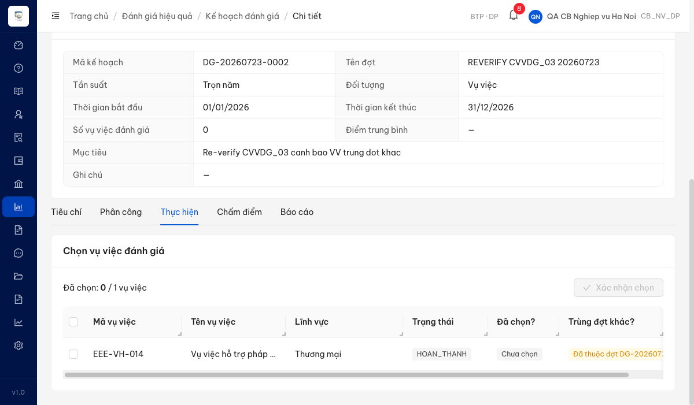
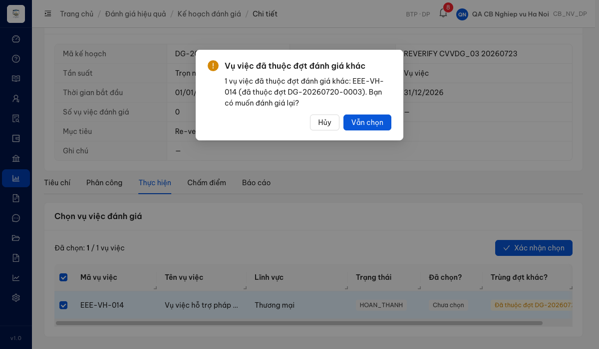
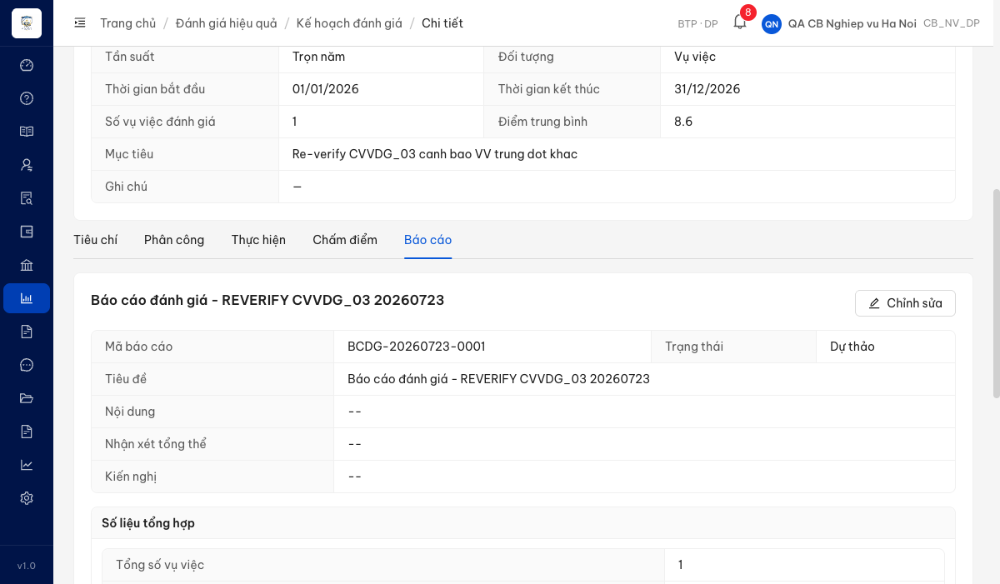
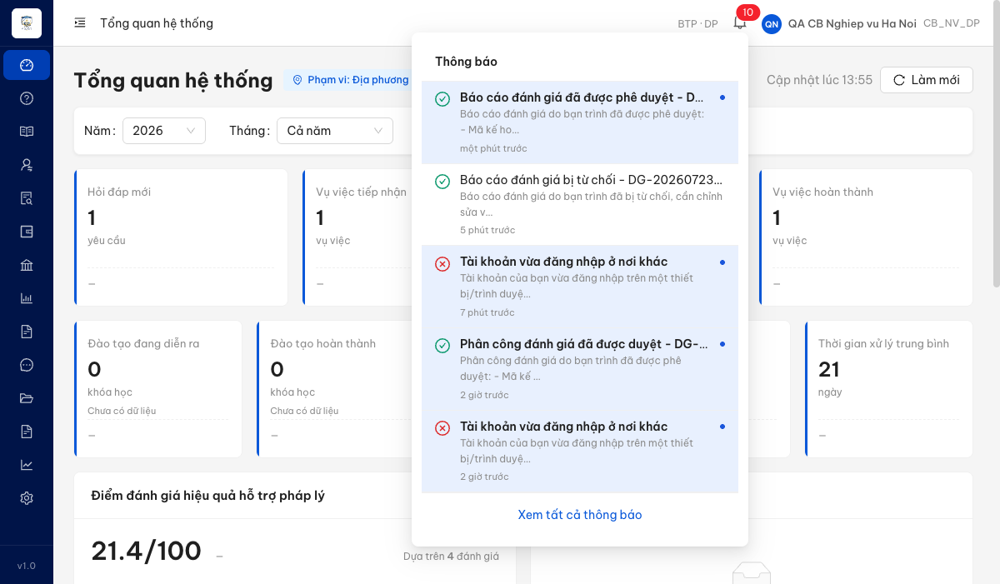
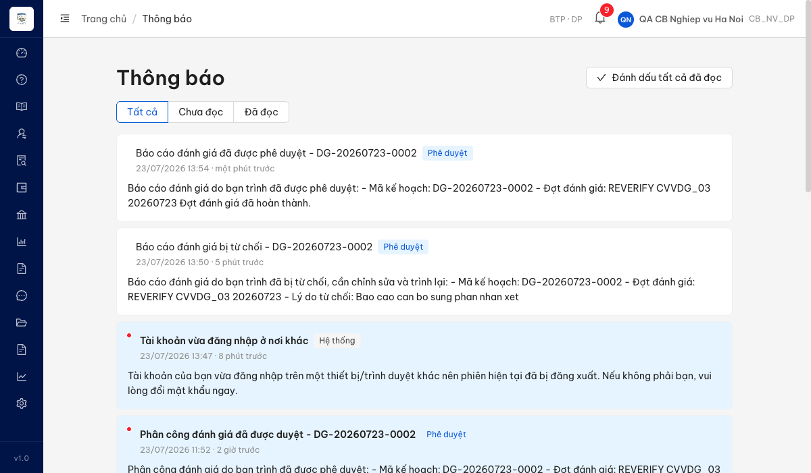
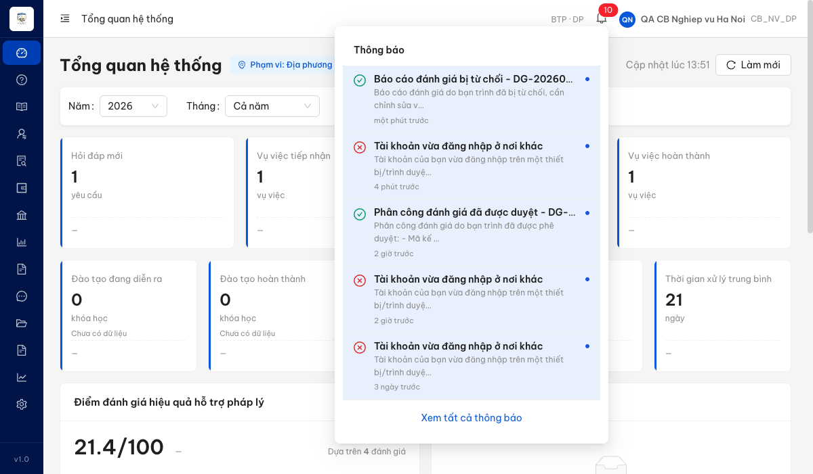
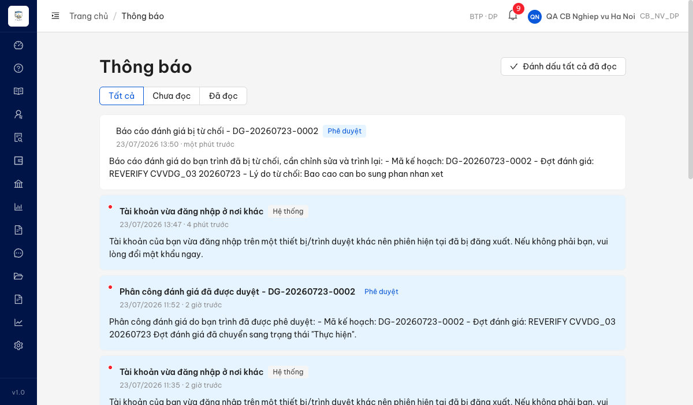

# Bug Report — Đánh giá hiệu quả (Batch B: Thực hiện → Báo cáo → Phê duyệt BC)

| Thông tin | Giá trị |
|-----------|---------|
| **Dự án** | PM HTPLDN — UAT đối tác tuần 3 |
| **Môi trường** | https://18.143.165.120.nip.io/login |
| **Người test** | QA Automation (Claude Code) |
| **Ngày** | 2026-07-20 |
| **Loại test** | Reverify bug đối tác (vòng đầu) — Functional / Workflow / UI |
| **Round** | Reverify week 3 — Batch B (rows 65–79) |
| **Tài liệu tham chiếu** | `srs-v3.5/srs-fr-08-danh-gia.md` (FR-VI-05 → FR-VI-09) · `QA_VERIFY_PROTOCOL.md` |

---

## Tổng hợp

Verify 15 case đối tác (Batch B, rows 65–79) — module Đánh giá hiệu quả, luồng downstream (Chọn vụ việc → Chấm điểm → Lập báo cáo → Trình/Phê duyệt báo cáo). File này chỉ chứa các case verdict **Open** (bug đúng, chuyển dev). Case `BA confirm` → `../../ba-confirm/dghq/ba-confirmation-needed-week-3-batchB.md`; `Reject` → `reverify-audit/<mã TC>/`.

### Severity breakdown

| Tổng | Critical | Major | Medium | Minor | Trivial | Closed | Open |
|------|----------|-------|--------|-------|---------|--------|------|
| 5    | 0        | 4     | 0      | 1     | 0       | 5      | 0    |

## Bug Summary Table

| Bug ID | Severity | Priority | Type | TC Ref | **SRS Reference** | Title | Status |
|--------|----------|----------|------|--------|-------------------|-------|--------|
| ~~BUG-CVVDG_03~~ | Major | High | Missing behavior | CVVDG_03 (row 67) | FR-VI-05 mô tả L393 · bước 5 L419 · AC L449 | Chọn VV đã thuộc đợt khác không hiển thị cảnh báo trùng đợt | Closed |
| ~~BUG-LBCDG_05~~ | Major | High | Missing feature | LBCDG_05 (row 75) | FR-VI-07 Outputs #2 · SCR item 53 | Không có chức năng xuất báo cáo định dạng Word (.docx) | Closed |
| ~~BUG-PDBCDG_01~~ | Major | High | Missing notification | PDBCDG_01 (row 78) | FR-VI-09 Step 7 · BR-NOTIF-01 · Postconditions | Phê duyệt báo cáo đánh giá không gửi thông báo cho CB Nghiệp vụ | Closed |
| ~~BUG-PDBCDG_04~~ | Major | High | Missing notification | PDBCDG_04 (row 79) | FR-VI-09 Step 7 · BR-NOTIF-01 · Postconditions | Từ chối phê duyệt báo cáo đánh giá không gửi thông báo cho CB Nghiệp vụ | Closed |
| ~~BUG-THDG_04~~ | Minor | Medium | UI/Display | THDG_04 (row 71) | FR-VI-06 Outputs #2 | Điểm tổng hợp hiển thị 1 chữ số thập phân (yêu cầu 2) | Closed |

---

## ~~BUG-CVVDG_03~~ [CLOSED] — Chọn VV đã thuộc đợt khác không hiển thị cảnh báo trùng đợt

> **Re-test:** 2026-07-23 R3 — ✅ PASS (Closed-verified). Dựng đợt mới DG-20260723-0002 tới trạng thái Thực hiện, chọn VV EEE-VH-014 (đã thuộc đợt DG-20260720-0003). Màn Chọn vụ việc nay có cột **"Trùng đợt khác?"** hiển thị "Đã thuộc đợt DG-20260720-0003"; khi Xác nhận chọn hệ thống bật **modal cảnh báo** "Vụ việc đã thuộc đợt đánh giá khác… Bạn có muốn đánh giá lại?", bấm **"Vẫn chọn"** vẫn thêm được VV (Số vụ việc = 1, toast "Đã chọn vụ việc đánh giá"). Đúng KQ mong đợi: cảnh báo + vẫn cho phép chọn.

### Mô tả
Ở màn Chọn vụ việc đánh giá (Tab Thực hiện), khi CB Nghiệp vụ (`cbnv_hn`) chọn một vụ việc **đã thuộc một đợt đánh giá khác**, hệ thống **không hiển thị bất kỳ cảnh báo trùng đợt nào** — vụ việc được thêm vào danh sách chọn im lặng. Tầng backend đã có sẵn thông tin nhận biết (cờ `daThuocDotKhac=true`) nhưng FE không dùng để cảnh báo. Theo SRS FR-VI-05, khi VV đã thuộc đợt khác, hệ thống phải cảnh báo cho người dùng (vẫn cho phép chọn lại).

### Các bước tái hiện
1. Đăng nhập CB Nghiệp vụ (`cbnv_hn`), mở một đợt đánh giá ở trạng thái **Thực hiện** (THUC_HIEN) có kỳ trùng với một đợt khác đã chứa vụ việc hoàn thành.
2. Vào tab **Thực hiện** → khu vực "Chọn vụ việc đánh giá".
3. Chọn một vụ việc mà backend đánh dấu đã thuộc đợt khác (`daThuocDotKhac=true`).
4. Quan sát xem hệ thống có hiển thị cảnh báo trùng đợt (toast/modal/cột đánh dấu) hay không.

### Kết quả mong đợi
Theo SRS FR-VI-05 — phần Mô tả ("Cảnh báo nếu VV đã thuộc đợt khác nhưng vẫn cho phép chọn lại"), bước xử lý #5 ("Cảnh báo nếu VV đã thuộc đợt khác (cho phép đánh giá lại)") và Acceptance Criteria ("Given VV đã thuộc đợt khác When chọn lại Then cảnh báo (vẫn cho phép)") — khi chọn một VV đã thuộc đợt khác, hệ thống phải **hiển thị cảnh báo** cho người dùng, đồng thời **vẫn cho phép** chọn.

### Kết quả thực tế
- Chọn VV có `daThuocDotKhac=true` → không có toast, không có modal, không có cột/nhãn đánh dấu trùng đợt; VV vào danh sách "Đã chọn" im lặng như mọi VV thường.
- Kiểm chứng tầng API: `GET /api/v1/ke-hoach-danh-gias/{id}/vu-viec-eligible` trả về VV kèm cờ `daThuocDotKhac=true` — dữ liệu để cảnh báo **có sẵn** ở backend, nhưng FE không sử dụng để render cảnh báo. ⇒ Thiếu hành vi cảnh báo phía FE.

### Bằng chứng
- 
- Re-test ✅ — Cột "Trùng đợt khác?" hiển thị cảnh báo: 
- Re-test ✅ — Modal cảnh báo khi Xác nhận chọn: 
- Re-test ✅ — Vẫn chọn được VV sau cảnh báo: 
- Bảng đối chiếu điều kiện: [`../../cond/CVVDG_03.md`](../../cond/CVVDG_03.md)

---

## ~~BUG-LBCDG_05~~ [CLOSED] — Không có chức năng xuất báo cáo định dạng Word (.docx)

> **Re-test:** 2026-07-23 R3 — ✅ PASS (Closed-verified). Đợt DG-20260723-0002 tiến tới trạng thái Lập báo cáo (báo cáo BCDG-20260723-0001). Tab Báo cáo nay có **2 nút xuất**: "Xuất báo cáo" (Excel) và nút mới **"Xuất Word"**. Bấm "Xuất Word" tải về `bao-cao-BCDG-20260723-0001.docx` — kiểm tra file là Word 2007+ thật (OOXML wordprocessingml, không phải Excel đổi tên), nội dung đúng: tiêu đề "BÁO CÁO ĐÁNH GIÁ - REVERIFY CVVDG_03", ghi chú "Theo mẫu Thông tư số 17/2025/TT-BTP", đủ số liệu (điểm TB 8.60, xếp loại Tốt, bảng chi tiết vụ việc). Đúng KQ mong đợi: xuất được cả Excel và Word.

### Mô tả
Màn Lập báo cáo đánh giá (Tab Báo cáo) chỉ có một nút **"Xuất báo cáo"**, và nút này luôn tải về file Excel (`.xlsx`). Không có nút hay tùy chọn nào để xuất báo cáo định dạng Word (`.docx`). Theo SRS FR-VI-07, hệ thống phải cho phép xuất báo cáo ra **cả Excel và Word** theo mẫu TT17/2025.

### Các bước tái hiện
1. Đăng nhập CB Nghiệp vụ (`cbnv_hn`), mở đợt đánh giá ở trạng thái **Lập báo cáo** (BAO_CAO).
2. Vào tab **Báo cáo**.
3. Quan sát thanh nút thao tác của báo cáo.
4. Bấm nút **"Xuất báo cáo"** và quan sát file tải về.

### Kết quả mong đợi
Theo SRS FR-VI-07 Outputs #2 ("File xuất | Excel (.xlsx) / Word (.docx)"), SCR item 53 ("Nút [Xuất XLSX] / [Xuất DOCX]") và Acceptance Criteria ("nhấn 'Xuất' → tải file Excel/Word theo template đánh giá"), người dùng phải xuất được báo cáo ở **cả hai định dạng Excel và Word**.

### Kết quả thực tế
- Thanh thao tác chỉ có 1 nút "Xuất báo cáo"; không có nút xuất Word/DOCX.
- Bấm "Xuất báo cáo" → tải về `bao-cao-danh-gia-20260720.xlsx` (Content-Type `application/vnd.openxmlformats-officedocument.spreadsheetml.sheet`).
- Kiểm chứng tầng API: gọi trực tiếp endpoint `POST /api/v1/ke-hoach-danh-gias/{id}/bao-cao/export` với các tham số `format=docx`, `loai=DOCX`, `?format=docx`, `?type=word` → **cả 4 lần đều trả về `.xlsx`** (không có nhánh sinh file Word). ⇒ Chức năng xuất Word chưa được hiện thực ở cả FE lẫn BE.

### Bằng chứng
- 
- Re-test ✅ — Tab Báo cáo có thêm nút "Xuất Word": 
- Re-test ✅ — File tải về: `~/Downloads/bao-cao-BCDG-20260723-0001.docx` (Microsoft Word 2007+, `word/document.xml`, content-type `wordprocessingml.document.main+xml`).
- Bảng đối chiếu điều kiện: [`../../cond/LBCDG_05.md`](../../cond/LBCDG_05.md)

---

## ~~BUG-PDBCDG_01~~ [CLOSED] — Phê duyệt báo cáo đánh giá không gửi thông báo cho CB Nghiệp vụ

> **Re-test:** 2026-07-23 R3 — ✅ PASS (Closed-verified). Đợt DG-20260723-0002: cbnv_hn trình lại báo cáo BCDG-20260723-0001 → cbpd_hn bấm **Phê duyệt** (đợt chuyển Hoàn thành). Đăng nhập lại cbnv_hn, mở chuông thông báo: xuất hiện thông báo mới **"Báo cáo đánh giá đã được phê duyệt - DG-20260723-0002"** — nội dung ghi rõ mã kế hoạch, tên đợt và câu **"Đợt đánh giá đã hoàn thành."** Đúng KQ mong đợi: CB Nghiệp vụ nhận được thông báo kết quả phê duyệt kèm trạng thái đợt hoàn thành.

### Mô tả
Khi CB Phê duyệt (`cbpd_hn`) phê duyệt (đồng ý) báo cáo đánh giá của một đợt, cán bộ nghiệp vụ đã trình báo cáo đó (`cbnv_hn` = người trình / `nguoiTrinhId`) **không nhận được bất kỳ thông báo nào** về kết quả phê duyệt. Ngoài ra, thông báo/toast báo cho người duyệt chỉ hiển thị "Đã phê duyệt báo cáo" / "Báo cáo đã được phê duyệt", không phản ánh việc **đợt đánh giá đã hoàn thành** như đối tác kỳ vọng.

### Các bước tái hiện
1. Đăng nhập CB Nghiệp vụ (`cbnv_hn`), trình một báo cáo đánh giá lên phê duyệt (đợt → CHO_PHE_DUYET).
2. Đăng xuất, đăng nhập CB Phê duyệt (`cbpd_hn`), mở báo cáo đang chờ duyệt, bấm **Phê duyệt** → xác nhận.
3. Đăng xuất, đăng nhập lại CB Nghiệp vụ (`cbnv_hn`).
4. Mở chuông **Thông báo** và kiểm tra danh sách thông báo của CB Nghiệp vụ.

### Kết quả mong đợi
Theo SRS FR-VI-09 (Phê duyệt báo cáo), Step 7 "Gửi thông báo CB NV kết quả phê duyệt" gắn **BR-NOTIF-01** và Postconditions "Thông báo gửi CB NV", sau khi báo cáo được phê duyệt, cán bộ nghiệp vụ đã trình báo cáo phải **nhận được thông báo** về kết quả (đã được phê duyệt / đợt đánh giá hoàn thành).

### Kết quả thực tế
- Sau khi phê duyệt: đợt chuyển **HOAN_THANH**, báo cáo `trangThai=DA_DUYET`, `ngayDuyet=2026-07-20T13:03:46`, `nguoiDuyetId` = cbpd_hn. Toast hiển thị "Đã phê duyệt báo cáo" + alert "Báo cáo đã được phê duyệt" (không nhắc đợt hoàn thành).
- Đăng nhập lại CB Nghiệp vụ: chuông vẫn **6 thông báo chưa đọc**, danh sách chỉ gồm 2 thông báo "Tài khoản vừa đăng nhập ở nơi khác" (hôm nay) + 3 thông báo đào tạo cũ (4–6 ngày trước) — **không có thông báo nào về báo cáo được phê duyệt**.
- Kiểm chứng tầng API: `GET /api/v1/thong-baos` của cbnv_hn → không có bản ghi thông báo liên quan phê duyệt báo cáo (`eval_report_notifs=[]`); `unread-count` không tăng sau thời điểm duyệt (13:03).

### Bằng chứng
- 
- 
- Re-test ✅ — Chuông thông báo cbnv_hn có TB phê duyệt: 
- Re-test ✅ — Chi tiết TB (kèm "Đợt đánh giá đã hoàn thành"): 
- Bảng đối chiếu điều kiện: [`../../cond/PDBCDG_01.md`](../../cond/PDBCDG_01.md)

---

## ~~BUG-PDBCDG_04~~ [CLOSED] — Từ chối phê duyệt báo cáo đánh giá không gửi thông báo cho CB Nghiệp vụ

> **Re-test:** 2026-07-23 R3 — ✅ PASS (Closed-verified). Đợt DG-20260723-0002: cbnv_hn trình báo cáo BCDG-20260723-0001 → cbpd_hn bấm **Từ chối** kèm lý do. Đăng nhập lại cbnv_hn, mở chuông thông báo: xuất hiện thông báo mới **"Báo cáo đánh giá bị từ chối - DG-20260723-0002"** — nội dung ghi rõ mã kế hoạch, tên đợt và **lý do từ chối** ("Lý do từ chối: Bao cao can bo sung phan nhan xet…"). Đúng KQ mong đợi: CB Nghiệp vụ nhận được thông báo từ chối kèm lý do.

### Mô tả
Khi CB Phê duyệt (`cbpd_hn`) **từ chối** phê duyệt một báo cáo đánh giá (kèm lý do), cán bộ nghiệp vụ đã trình báo cáo (`cbnv_hn` = `nguoiTrinhId`) **không nhận được thông báo nào** về việc báo cáo bị từ chối và lý do. Hệ quả: CB Nghiệp vụ không biết để chỉnh sửa và trình lại, phải tự phát hiện.

### Các bước tái hiện
1. Đăng nhập CB Nghiệp vụ (`cbnv_hn`), trình một báo cáo đánh giá lên phê duyệt (đợt → CHO_PHE_DUYET).
2. Đăng xuất, đăng nhập CB Phê duyệt (`cbpd_hn`), mở báo cáo đang chờ duyệt, bấm **Từ chối** → nhập lý do → xác nhận.
3. Đăng xuất, đăng nhập lại CB Nghiệp vụ (`cbnv_hn`).
4. Mở chuông **Thông báo** và kiểm tra danh sách thông báo của CB Nghiệp vụ.

### Kết quả mong đợi
Theo SRS FR-VI-09 Step 7 "Gửi thông báo CB NV kết quả phê duyệt" (**BR-NOTIF-01**, áp dụng cho **cả** trường hợp phê duyệt lẫn từ chối) và Postconditions "Thông báo gửi CB NV", sau khi báo cáo bị từ chối, cán bộ nghiệp vụ đã trình báo cáo phải **nhận được thông báo** về việc bị từ chối kèm lý do.

### Kết quả thực tế
- Sau khi từ chối: báo cáo `trangThai=TU_CHOI` (version 3), `lyDoTuChoi` được set, đợt quay về **BAO_CAO**. Toast người duyệt "Đã từ chối báo cáo".
- Đăng nhập lại CB Nghiệp vụ: chuông vẫn **6 thông báo chưa đọc**, danh sách không có thông báo nào về báo cáo bị từ chối (chỉ 2 thông báo "Tài khoản vừa đăng nhập ở nơi khác" hôm nay + 3 thông báo đào tạo cũ).
- Kiểm chứng tầng API: `GET /api/v1/thong-baos` của cbnv_hn → không có bản ghi thông báo từ chối báo cáo (`eval_report_notifs=[]`); `unread-count` không tăng sau thời điểm từ chối (12:58).

### Bằng chứng
- 
- 
- Re-test ✅ — Chuông thông báo cbnv_hn có TB từ chối: 
- Re-test ✅ — Chi tiết TB (kèm lý do từ chối): 
- Bảng đối chiếu điều kiện: [`../../cond/PDBCDG_04.md`](../../cond/PDBCDG_04.md)

---

## ~~BUG-THDG_04~~ [CLOSED] — Điểm tổng hợp hiển thị 1 chữ số thập phân (yêu cầu 2)

> **Re-test:** 2026-07-23 00:01 R2 — ✅ PASS (Closed-verified). Chạy lại tab Chấm điểm đợt DGHQ-B2 (DG-20260720-0003) với VV EEE-VH-014 đã chấm: cột **"Điểm tổng" hiển thị `8.90`** (2 chữ số thập phân, đúng SRS FR-VI-06), Xếp loại "Tốt". FE đã hết cắt bớt thập phân. (KPI "Điểm trung bình" trên card hiển thị 8.9 — là field trung bình đợt khác, ngoài phạm vi bug này.)

### Mô tả
Ở màn Chấm điểm (Tab Thực hiện), cột **"Điểm tổng"** của mỗi vụ việc hiển thị điểm với **1 chữ số thập phân** (ví dụ `8.0`, `10.0`). SRS FR-VI-06 quy định điểm tổng hợp phải hiển thị **2 chữ số thập phân**.

### Các bước tái hiện
1. Đăng nhập CB Nghiệp vụ (`cbnv_hn`), mở đợt đánh giá đã có vụ việc được chấm điểm.
2. Vào tab **Chấm điểm**.
3. Quan sát giá trị ở cột **"Điểm tổng"** (và KPI "Điểm trung bình").

### Kết quả mong đợi
Theo SRS FR-VI-06 Outputs #2 ("Điểm tổng hợp | number | Khi tất cả tiêu chí đã chấm | **2 số thập phân**"), điểm tổng hợp phải hiển thị 2 chữ số thập phân (vd `8.00`, `10.00`).

### Kết quả thực tế
- Cột "Điểm tổng" hiển thị `8.0` / `10.0` (1 chữ số thập phân).
- Kiểm chứng tầng API: BE trả `diemTong` dạng `"8.00"` / `"10.00"` (2 chữ số thập phân) — dữ liệu đúng, chỉ FE cắt bớt còn 1 chữ số khi hiển thị. ⇒ Lỗi hiển thị phía FE.

### Bằng chứng
- 
- Bảng đối chiếu điều kiện: [`../../cond/THDG_04.md`](../../cond/THDG_04.md)

---

*Bug report generated: 2026-07-20 | QA Automation via Claude Code*
