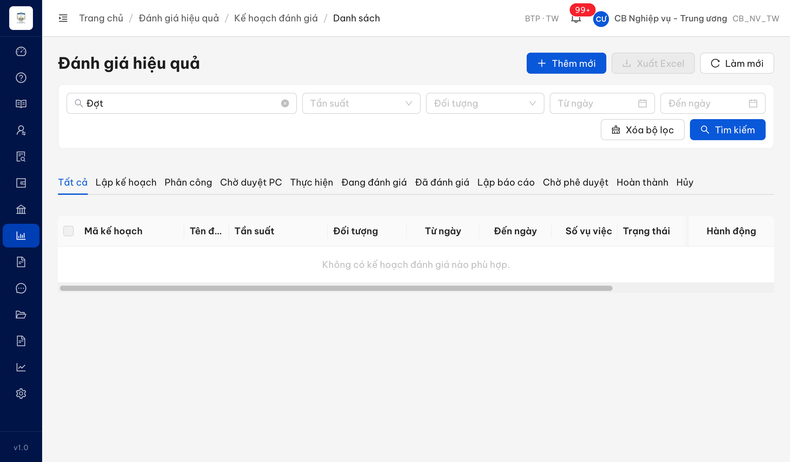
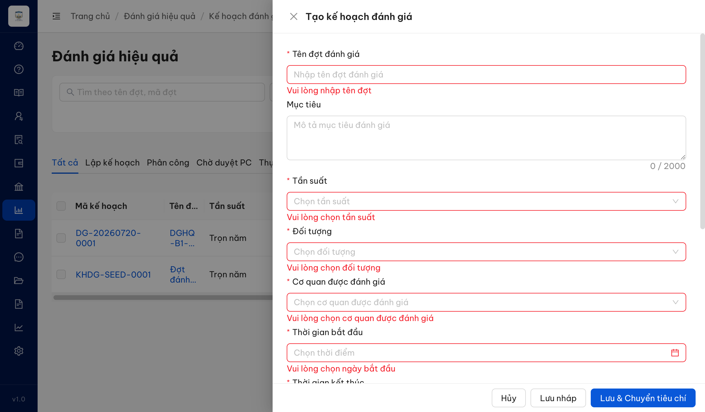
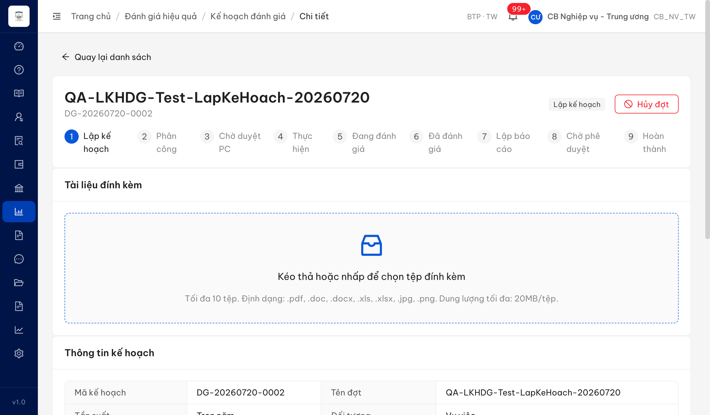
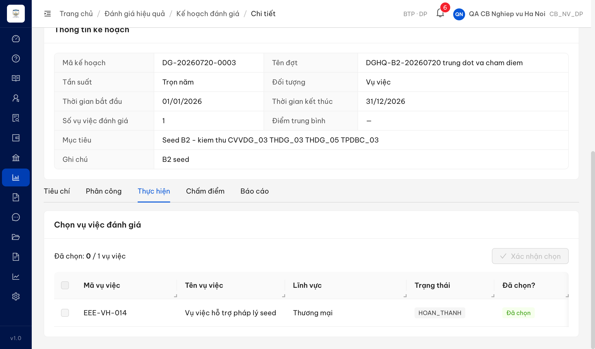
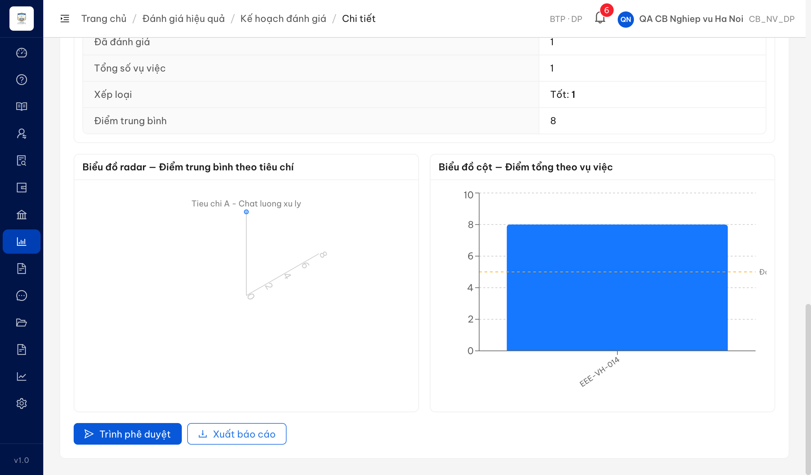
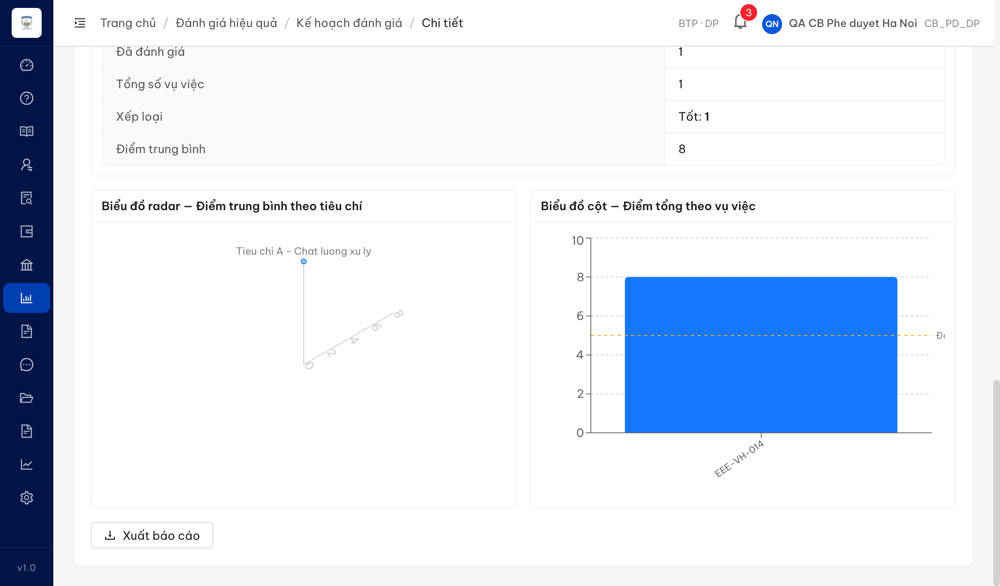
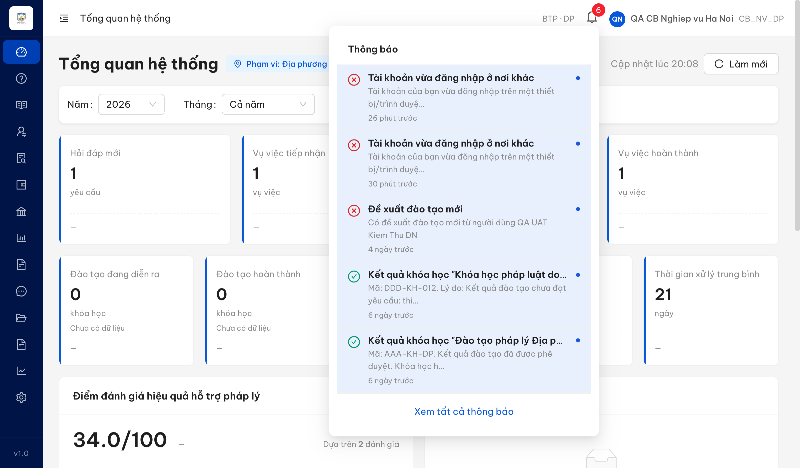
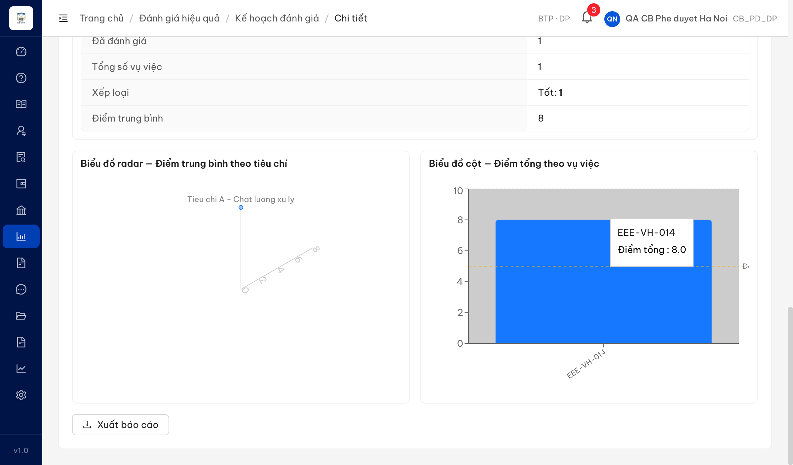
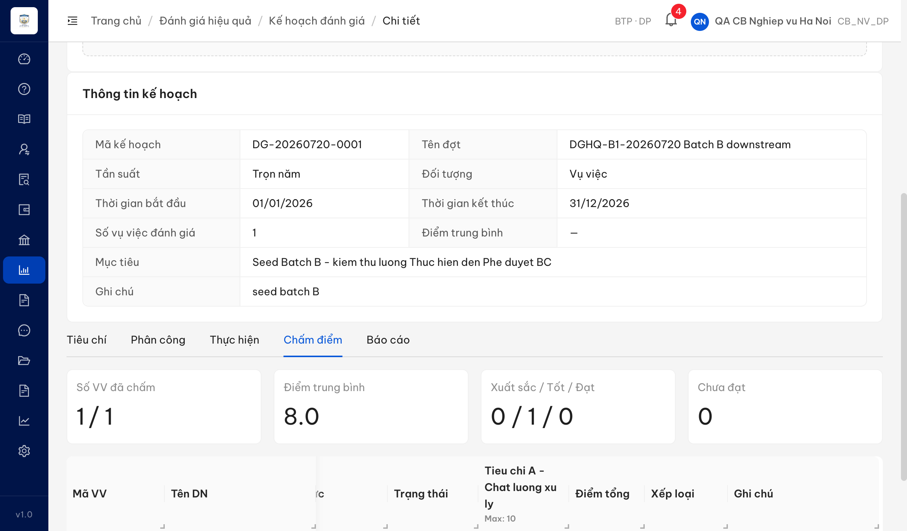

# Bug Report — Đánh giá hiệu quả

| Thông tin | Giá trị |
|-----------|---------|
| **Dự án** | Phần mềm Hỗ trợ pháp lý doanh nghiệp (PM HTPLDN) |
| **Môi trường** | https://18.143.165.120.nip.io |
| **Người test** | QA (verify UAT đối tác tuần 3, via Claude Code) |
| **Ngày** | 2026-07-20 |
| **Loại test** | UAT reverify (vòng đầu) — Functional / Workflow / UI |
| **Round** | Reverify week 3 |
| **Tài liệu tham chiếu** | `srs-v3.5/srs-fr-08-danh-gia.md` (FR-VI-01 → FR-VI-09) · tab `UAT_TGPL Doanh Nghiệp-tuần 3` · `QA_VERIFY_PROTOCOL.md` |

---

## Tổng hợp

Báo cáo gộp bug của module **Đánh giá hiệu quả**, bao phủ luồng từ Kế hoạch đánh giá, Tiêu chí, Phân công, Thực hiện, Chấm điểm, Lập báo cáo đến Phê duyệt báo cáo. Các case có verdict `Reject` hoặc `BA confirm` không nằm trong báo cáo này; thông tin tương ứng được lưu tại các thư mục `reverify-audit/` và file `ba-confirmation-needed-week-3-*.md`.

> **Snapshot LATEST (2026-07-27):** **15 tổng · 15 Closed · 0 Open.** Toàn bộ 15 bug đã được reverify PASS ở các round R2/R3 (2026-07-22 → 2026-07-23) và ghi nhận bằng chứng trong [`Pass-bug-report-DGHQ-batchA.md`](Pass-bug-report-DGHQ-batchA.md) + [`Pass-bug-report-DGHQ-batchB.md`](Pass-bug-report-DGHQ-batchB.md). File này trước đó là bản snapshot gửi dev ngày 22/07 nên còn ghi Open — nay đã đồng bộ theo bằng chứng batch.

### Severity breakdown

| Tổng | Critical | Major | Medium | Minor | Trivial | Closed | Open |
|------|----------|-------|--------|-------|---------|--------|------|
| 15   | 0        | 6     | 6      | 3     | 0       | 15     | 0    |

## Bug Summary Table

| Bug ID | Severity | Priority | Type | TC Ref | **SRS Reference** | Title | Status |
|--------|----------|----------|------|--------|-------------------|-------|--------|
| ~~BUG-LKHDG_04~~ | Major | P1 | Data | LKHDG_04 | `SCR-VI-01 Thành phần #3 (dòng 812)` · `FR-VI-01 AC (dòng 156)` | Tìm kiếm theo tên đợt trả 0 kết quả khi từ khóa có dấu tiếng Việt | **Closed** |
| ~~BUG-LKHDG_07_08~~ | Medium | P2 | Validation | LKHDG_07, LKHDG_08 | `FR-VI-01 Inputs #2 (dòng 107)` · `SCR-VI-01 Form #22 (dòng 836)` | Trường "Mục tiêu" bắt buộc theo SRS nhưng form không đánh dấu * và không validate bắt buộc | **Closed** |
| ~~BUG-LKHDG_12~~ | Medium | P2 | Data | LKHDG_12 | `SCR-VI-01 #12 (dòng 821)` · `SCR-VI-01 #15 (dòng 824)` | File "Xuất Excel" thiếu cột (Số vụ việc/Người tạo/Ngày tạo) + ghi mã enum thô thay nhãn tiếng Việt | **Closed** |
| ~~BUG-LKHDG-EDIT~~ | Major | P1 | Function | LKHDG_16, LKHDG_20, LKHDG_21, LKHDG_22 | `SCR-VI-01 #18 (dòng 827)` · `SCR-VI-01 Form #27 (dòng 841)` · `FR-VI-01 AC (dòng 158)` | Chức năng "Sửa" đợt không mở form chỉnh sửa — mở màn chi tiết read-only, thiếu trường sửa được + nút [Hủy]/[Lưu nháp]/[Lưu & Chuyển tiêu chí] | **Closed** |
| ~~BUG-TLCTCDG_07~~ | Medium | P2 | Function | TLCTCDG_07 | `SCR-VI-01 Tab Tiêu chí #29 (dòng 850)` | Không sửa được tiêu chí đã tạo — dòng tiêu chí chỉ có nút Xóa, thiếu nút Sửa + không hỗ trợ inline edit | **Closed** |
| ~~BUG-TLCTCDG_08~~ | Minor | P3 | UX | TLCTCDG_08 | `SCR-VI-01 Tab Tiêu chí #29 (dòng 850)` · `#39 (dòng 865)` | Xóa tiêu chí không có hộp thoại xác nhận — thực thi xóa ngay, rủi ro mất dữ liệu do thao tác nhầm | **Closed** |
| ~~BUG-TLCTCDG_12~~ | Minor | P3 | Function | TLCTCDG_12 | `SCR-VI-01 Tab Tiêu chí #34 (dòng 855)` | Thanh hành động Tab Tiêu chí thiếu nút "[Lưu & Quay lại KH]" | **Closed** |
| ~~BUG-PCNTHDG_11~~ | Medium | P2 | Function | PCNTHDG_11 | `SCR-VI-01 #38 (dòng 864)` | Trình phê duyệt phân công không gửi thông báo cho Cán bộ phê duyệt cùng đơn vị | **Closed** |
| ~~BUG-PDPCDG_01~~ | Medium | P2 | Function | PDPCDG_01 | `FR-VI-04 Postconditions (dòng 366)` · `bước xử lý (dòng 349)` · `BR (dòng 901)` | Phê duyệt phân công không gửi thông báo cho Cán bộ nghiệp vụ | **Closed** |
| ~~BUG-PDPCDG_05~~ | Medium | P2 | Function | PDPCDG_05 | `FR-VI-04 BR (dòng 901)` · `Postconditions (dòng 366)` | Từ chối phân công không gửi thông báo kèm lý do cho Cán bộ nghiệp vụ | **Closed** |
| ~~BUG-CVVDG_03~~ | Major | High | Missing behavior | CVVDG_03 (row 67) | FR-VI-05 mô tả L393 · bước 5 L419 · AC L449 | Chọn VV đã thuộc đợt khác không hiển thị cảnh báo trùng đợt | **Closed** |
| ~~BUG-LBCDG_05~~ | Major | High | Missing feature | LBCDG_05 (row 75) | FR-VI-07 Outputs #2 · SCR item 53 | Không có chức năng xuất báo cáo định dạng Word (.docx) | **Closed** |
| ~~BUG-PDBCDG_01~~ | Major | High | Missing notification | PDBCDG_01 (row 78) | FR-VI-09 Step 7 · BR-NOTIF-01 · Postconditions | Phê duyệt báo cáo đánh giá không gửi thông báo cho CB Nghiệp vụ | **Closed** |
| ~~BUG-PDBCDG_04~~ | Major | High | Missing notification | PDBCDG_04 (row 79) | FR-VI-09 Step 7 · BR-NOTIF-01 · Postconditions | Từ chối phê duyệt báo cáo đánh giá không gửi thông báo cho CB Nghiệp vụ | **Closed** |
| ~~BUG-THDG_04~~ | Minor | Medium | UI/Display | THDG_04 (row 71) | FR-VI-06 Outputs #2 | Điểm tổng hợp hiển thị 1 chữ số thập phân (yêu cầu 2) | **Closed** |

---

## ~~BUG-LKHDG_04~~ [CLOSED] — Tìm kiếm theo tên đợt trả "Không có kết quả" khi từ khóa chứa dấu tiếng Việt

> **Re-test:** 2026-07-22 R2 — ✅ PASS. Tìm "Đợt đánh giá seed 2026" (đầy đủ, có dấu) → 1 KHDG-SEED-0001; "Đợt" → 2 (khớp cả có dấu lẫn "dot" không dấu); "đánh giá" → 1. Search giờ accent-insensitive, mọi từ khóa có dấu trả đúng bản ghi. *(nguồn: `Pass-bug-report-DGHQ-batchA.md`)*


### Mô tả

Trên màn Danh sách đợt đánh giá (Đánh giá hiệu quả → Kế hoạch đánh giá), ô tìm kiếm "Tìm theo tên đợt, mã đợt" **không trả về bản ghi** khi từ khóa chứa ký tự tiếng Việt có dấu — kể cả khi gõ đúng tên đầy đủ của một đợt đang tồn tại. Chỉ trả kết quả khi từ khóa là chuỗi ASCII không dấu. Vì tên đợt luôn có dấu tiếng Việt, tính năng tìm theo tên gần như vô dụng.

### Các bước tái hiện

1. Đăng nhập role **CB Nghiệp vụ Trung ương** (`cbnv_tw`, quyền "Quản lý đánh giá" theo SCR-VI-01) → Đánh giá hiệu quả → Kế hoạch đánh giá → Danh sách. Có sẵn 2 đợt: `KHDG-SEED-0001` tên "Đợt đánh giá seed 2026" và `DG-20260720-0001` tên "DGHQ-B1-20260720 Batch B downstream".
2. Gõ vào ô tìm kiếm đúng tên đầy đủ **"Đợt đánh giá seed 2026"** → nhấn **Tìm kiếm**. → Quan sát: 0 kết quả.
3. Xóa, gõ **"Đợt"** (tiền tố tên của CẢ 2 đợt) → Tìm kiếm. → Quan sát: 0 kết quả.
4. Xóa, gõ **"seed"** (ASCII, nằm trong tên + mã của KHDG-SEED-0001) → Tìm kiếm. → Quan sát: 1 kết quả (đúng).

### Kết quả mong đợi

- Theo SRS SCR-VI-01 Thành phần #3 (dòng 812): ô tìm kiếm lọc theo "tên đợt, mã đợt" → gõ tên đợt (có dấu) đang tồn tại phải trả về đúng bản ghi đó.
- "Đợt" → 2 kết quả; "Đợt đánh giá seed 2026" → 1 kết quả (KHDG-SEED-0001).

### Kết quả thực tế

- "Đợt đánh giá seed 2026" → **0 kết quả** ("Không có kế hoạch đánh giá nào phù hợp").
- "Đợt" → **0 kết quả**.
- "seed" (ASCII) → 1 kết quả. → Search chỉ hoạt động với từ khóa không dấu; fail với mọi từ khóa có dấu tiếng Việt.
- Baseline (không lọc) = 2 record → xác nhận dữ liệu tồn tại.

### Bằng chứng

**1. Ảnh chụp** *(env test 18.143, cbnv_tw)*:



**2. Số liệu phân biệt (đọc trực tiếp DOM bảng)**:

```
baseline (không lọc)             → 2 record  [DG-20260720-0001, KHDG-SEED-0001]
keyword "Đợt đánh giá seed 2026" → 0 record  (mong đợi 1)
keyword "Đợt"                    → 0 record  (mong đợi 2)
keyword "seed"                   → 1 record  (đúng)
```

**3. Đối chiếu evidence đối tác:** video `partner-evidence/LKHDG_04.webm` (frame t010) — đối tác search "Đợt đánh giá hiệu quả" (tên đầy đủ đợt DG-20260526-0003 đang tồn tại) → "Không có kế hoạch đánh giá nào phù hợp". Cùng bản chất lỗi.

---

## ~~BUG-LKHDG_07_08~~ [CLOSED] — Trường "Mục tiêu" bắt buộc theo SRS nhưng form không đánh dấu * và không validate

> **Re-test:** 2026-07-23 R2 — ✅ PASS. Form Tạo kế hoạch: nhãn "Mục tiêu" có dấu * (textbox required=true); submit form trống → hiện lỗi "Vui lòng nhập mục tiêu" cùng 6 trường bắt buộc khác. Cả 2 facet (đánh dấu * + validate) đã fix. *(nguồn: `Pass-bug-report-DGHQ-batchA.md`)*


### Mô tả

Trên form **Tạo/Sửa kế hoạch đánh giá** (Đánh giá hiệu quả → Kế hoạch đánh giá → Thêm mới), trường **"Mục tiêu"** được SRS quy định là **bắt buộc**, nhưng trên ứng dụng:
- (a) Nhãn "Mục tiêu" **không có dấu \* đỏ** đánh dấu bắt buộc — trong khi 6 trường bắt buộc còn lại đều có (LKHDG_07).
- (b) Khi bấm lưu form để trống, hệ thống **không hiển thị thông báo bắt buộc** cho "Mục tiêu" — form cho qua trường này dù các trường bắt buộc khác đều bị chặn (LKHDG_08).

Hai hiện tượng cùng một gốc: field "Mục tiêu" đang được cấu hình là tùy chọn thay vì bắt buộc → người dùng có thể tạo kế hoạch đánh giá thiếu mục tiêu.

### Các bước tái hiện

1. Đăng nhập role **CB Nghiệp vụ Trung ương** (`cbnv_tw`) → Đánh giá hiệu quả → Kế hoạch đánh giá → Danh sách → bấm **Thêm mới**.
2. Quan sát nhãn trường "Mục tiêu" trên form "Tạo kế hoạch đánh giá". → Không có dấu \* (các trường "Tên đợt đánh giá", "Tần suất", "Đối tượng", "Cơ quan được đánh giá", "Thời gian bắt đầu", "Thời gian kết thúc" đều có dấu \*).
3. Không điền gì, bấm **Lưu & Chuyển tiêu chí**. → Quan sát thông báo lỗi bắt buộc hiển thị dưới từng trường.

### Kết quả mong đợi

- Theo SRS FR-VI-01 (UC83) Inputs #2 `muc_tieu | text (long) | Bắt buộc = Y` (dòng 107) và SCR-VI-01 Form tạo/sửa #22 "Mục tiêu | Bắt buộc" (dòng 836): trường "Mục tiêu" phải được đánh dấu bắt buộc và phải hiển thị thông báo bắt buộc khi để trống, chặn không cho lưu.

### Kết quả thực tế

- (a) Nhãn "Mục tiêu" **không có dấu \*** — `.ant-form-item-required` = false (DOM), trong khi 6 trường bắt buộc khác = true.
- (b) Bấm "Lưu & Chuyển tiêu chí" với form trống → 6 trường bắt buộc hiện lỗi ("Vui lòng nhập tên đợt", "Vui lòng chọn tần suất", "Vui lòng chọn đối tượng", "Vui lòng chọn cơ quan được đánh giá", "Vui lòng chọn ngày bắt đầu", "Vui lòng chọn ngày kết thúc"); riêng **"Mục tiêu" không có thông báo lỗi**.

### Bằng chứng

**1. Ảnh chụp** *(env test 18.143, cbnv_tw — 1 ảnh chứng minh cả 2 facet)*:



**2. Đọc trực tiếp DOM sau khi submit form trống**:

```
Tên đợt đánh giá       required=true   error="Vui lòng nhập tên đợt"
Mục tiêu               required=false  error=null            ← SAI (SRS: bắt buộc)
Tần suất               required=true   error="Vui lòng chọn tần suất"
Đối tượng              required=true   error="Vui lòng chọn đối tượng"
Cơ quan được đánh giá  required=true   error="Vui lòng chọn cơ quan được đánh giá"
Thời gian bắt đầu      required=true   error="Vui lòng chọn ngày bắt đầu"
Thời gian kết thúc     required=true   error="Vui lòng chọn ngày kết thúc"
```

**3. Đối chiếu evidence đối tác:** `partner-evidence/LKHDG_07.jpg` (nhãn Mục tiêu không có \*) + `partner-evidence/LKHDG_08.jpg` (submit trống, mọi trường báo lỗi trừ Mục tiêu) — cùng bản chất lỗi trên env đối tác.

---

## ~~BUG-LKHDG_12~~ [CLOSED] — File "Xuất Excel" thiếu cột + ghi mã enum thô thay vì nhãn tiếng Việt

> **Re-test:** 2026-07-23 R2 — ✅ PASS. Xuất Excel giờ có 10 cột (thêm Số vụ việc/Người tạo/Ngày tạo); Tần suất/Đối tượng/Trạng thái hiển thị nhãn tiếng Việt ("Trọn năm"/"Vụ việc"/"Đang đánh giá"…), không còn mã enum `TRON_NAM`/`VU_VIEC`/`LAP_KE_HOACH`. Bằng chứng: [`../../reverify-audit/LKHDG_12/reverify-export-content.md`](../../reverify-audit/LKHDG_12/reverify-export-content.md). *(nguồn: `Pass-bug-report-DGHQ-batchA.md`)*


### Mô tả

Trên màn Danh sách đợt đánh giá, nút **"Xuất Excel"** sinh file `.xlsx` (client-side) có 2 vấn đề so với bảng danh sách hiển thị trên UI:
- (1) **Thiếu cột**: file chỉ có 7 cột (Mã KH, Tên đợt, Tần suất, Đối tượng, Từ ngày, Đến ngày, Trạng thái), **thiếu "Số vụ việc", "Người tạo", "Ngày tạo"** đang có trên bảng.
- (2) Cột **Tần suất / Đối tượng / Trạng thái ghi mã enum thô** (`TRON_NAM`, `VU_VIEC`, `LAP_KE_HOACH`...) thay vì nhãn tiếng Việt như UI ("Trọn năm", "Vụ việc", "Lập kế hoạch"). Đối tác mô tả là "hiển thị không dấu".

### Các bước tái hiện

1. Đăng nhập role **CB Nghiệp vụ Trung ương** (`cbnv_tw`) → Đánh giá hiệu quả → Kế hoạch đánh giá → Danh sách (có ≥1 đợt).
2. Bấm **"Xuất Excel"** → mở file `.xlsx` tải về.
3. Quan sát: danh sách cột (header) và giá trị các cột Tần suất/Đối tượng/Trạng thái.

### Kết quả mong đợi

- File export trình bày dữ liệu người dùng đọc được, nhất quán với bảng danh sách trên UI.
- Theo SRS SCR-VI-01 #12 (dòng 821): Tần suất hiển thị nhãn tiếng Việt ("TRON_NAM → 'Tròn năm'"); #15 (dòng 824): Trạng thái hiển thị nhãn theo máy trạng thái SM-DANHGIA ("Lập kế hoạch"...). Các cột đang hiển thị trên danh sách (Số vụ việc/Người tạo/Ngày tạo) nên có trong file export.

### Kết quả thực tế

- File export = **7 cột**: `Mã KH | Tên đợt | Tần suất | Đối tượng | Từ ngày | Đến ngày | Trạng thái` → thiếu Số vụ việc, Người tạo, Ngày tạo.
- Giá trị: Tần suất=`TRON_NAM`, Đối tượng=`VU_VIEC`, Trạng thái=`LAP_KE_HOACH`/`CHO_PHE_DUYET`/`HOAN_THANH` (mã enum thô, không phải nhãn tiếng Việt).

### Bằng chứng

**1. Nội dung file export** *(đọc trực tiếp cell values từ blob `.xlsx` sinh ra — env test 18.143, cbnv_tw)*:

Chi tiết đầy đủ: [`../../reverify-audit/LKHDG_12/export-content-doc-duoc.md`](../../reverify-audit/LKHDG_12/export-content-doc-duoc.md). File gốc: `../../reverify-audit/LKHDG_12/export-danhsach-dot.xlsx`.

```
Header (dimension A1:G4, 7 cột):
  Mã KH | Tên đợt | Tần suất | Đối tượng | Từ ngày | Đến ngày | Trạng thái
Dòng dữ liệu:
  DG-20260720-0002 | QA-LKHDG-Test... | TRON_NAM | VU_VIEC | 1/8/2026  | 31/12/2026 | LAP_KE_HOACH
  DG-20260720-0001 | DGHQ-B1-...      | TRON_NAM | VU_VIEC | 1/1/2026  | —          | CHO_PHE_DUYET
  KHDG-SEED-0001   | Đợt đánh giá...  | TRON_NAM | VU_VIEC | —         | 30/6/2026  | HOAN_THANH
```

**2. Ghi chú:** endpoint `/api/v1/ke-hoach-danh-gias/export` trả 404 → export sinh client-side. Ý "xuất sai tiêu chí lọc" của đối tác chưa tái hiện được trong lần test này (export không lọc trả đúng số đợt; phiên đăng nhập hết hạn khi thử áp bộ lọc) — 2 lỗi trên đã đủ căn cứ Open.

---

## ~~BUG-LKHDG-EDIT~~ [CLOSED] — Chức năng "Sửa" đợt không mở form chỉnh sửa (mở màn chi tiết read-only)

> **Re-test:** 2026-07-23 R3 — ✅ PASS. Tạo đợt mới DG-20260723-0001 (state Lập kế hoạch) → bấm **Sửa** → mở modal "Sửa kế hoạch đánh giá" với đủ trường cho nhập/sửa (Tên đợt/Mục tiêu/Tần suất/Đối tượng/Thời gian) + thanh hành động **[Hủy] [Lưu nháp] [Lưu & Chuyển tiêu chí]**. Sửa Tên đợt + Ghi chú → Lưu nháp → toast "Cập nhật thành công", danh sách hiển thị tên mới → BE lưu thật. Không còn điều hướng sang màn chi tiết read-only. (LKHDG_16/20/21/22) *(nguồn: `Pass-bug-report-DGHQ-batchA.md`)*


### Mô tả

Trên màn Danh sách đợt đánh giá, nút **"Sửa"** ở cột Hành động (chỉ hiện với đợt trạng thái "Lập kế hoạch"/"Phân công" — đúng SRS) khi bấm **không mở form chỉnh sửa**. Hệ thống điều hướng sang màn **chi tiết đợt ở chế độ chỉ xem**:
- Các trường thông tin đợt (Tên đợt, Mục tiêu, Tần suất, Đối tượng, Thời gian...) hiển thị read-only, **không sửa được** (LKHDG_16).
- Breadcrumb hiển thị **"...Kế hoạch đánh giá / Chi tiết"** thay vì màn Sửa/Chỉnh sửa (LKHDG_16).
- **Thiếu toàn bộ thanh hành động của form**: không có nút **[Hủy]** (LKHDG_20), **[Lưu nháp]** (LKHDG_21), **[Lưu & Chuyển tiêu chí]** (LKHDG_22).

Hệ quả: không thể chỉnh sửa thông tin một đợt đánh giá đang ở trạng thái cho phép sửa.

### Các bước tái hiện

1. Đăng nhập role **CB Nghiệp vụ Trung ương** (`cbnv_tw`) → Đánh giá hiệu quả → Kế hoạch đánh giá → Danh sách.
2. Chọn một đợt ở trạng thái **"Lập kế hoạch"** (vd DG-20260720-0002) → cột Hành động bấm icon **Sửa**.
3. Quan sát: URL, breadcrumb, các trường thông tin đợt (có ô nhập không?), thanh hành động (có nút [Hủy]/[Lưu nháp]/[Lưu & Chuyển tiêu chí] không?).

### Kết quả mong đợi

- Theo SRS SCR-VI-01 #18 (dòng 827): "Sửa (chỉ LAP_KE_HOACH/PHAN_CONG)" → mở **form chỉnh sửa** đợt.
- Theo "Form tạo/sửa đợt đánh giá" (dòng 831-840): các trường Tên đợt/Mục tiêu/Tần suất/Đối tượng/Thời gian phải cho **nhập/sửa**.
- Theo #27 (dòng 841): thanh hành động form có **[Hủy] [Lưu nháp] [Lưu & Chuyển tiêu chí]**; [Hủy] → hủy bỏ thay đổi + đóng form + về danh sách.
- Theo FR-VI-01 (UC83) AC (dòng 158): "CB NV chỉnh sửa KH chưa duyệt → thay đổi → validate + lưu".

### Kết quả thực tế

- Bấm Sửa → điều hướng tới URL **chi tiết đợt** (`/danh-gia/ke-hoach/{id}`, trùng URL "Xem chi tiết").
- Breadcrumb: "Trang chủ / Đánh giá hiệu quả / Kế hoạch đánh giá / **Chi tiết**".
- Các trường thông tin đợt hiển thị **read-only** (bảng "Thông tin kế hoạch"), không có ô nhập (DOM: không có input "Tên đợt", số field sửa được = 0 cho thông tin đợt).
- Thanh hành động: chỉ có **"Quay lại danh sách"**, **"Hủy đợt"** (= chuyển trạng thái HUY, khác nghiệp vụ với [Hủy] của form) và các nút của tab Tiêu chí. **Không có [Hủy]/[Lưu nháp]/[Lưu & Chuyển tiêu chí]** của form sửa.

### Bằng chứng

**1. Ảnh chụp** *(env test 18.143, cbnv_tw — màn sau khi bấm "Sửa")*:


**2. Đọc trực tiếp DOM màn sau khi bấm Sửa**:

```
URL              = /danh-gia/ke-hoach/eaf06391-...  (trùng URL Xem chi tiết)
breadcrumb       = "Trang chủ / Đánh giá hiệu quả / Kế hoạch đánh giá / Chi tiết"
input "Tên đợt"  = không tồn tại (hasTenDotInput = false)
edit affordances = [] (không có nút Sửa/Chỉnh sửa/pencil)
buttons          = ["Quay lại danh sách","Hủy đợt","Thêm tiêu chí","Nhập từ danh mục","Lưu"]
                    → không có [Hủy]/[Lưu nháp]/[Lưu & Chuyển tiêu chí] của form sửa
```

**3. Đối chiếu evidence đối tác:** LKHDG_16/20/21/22 — đối tác cùng báo màn Sửa không cho chỉnh sửa + thiếu nút chức năng + breadcrumb "Chi tiết". Cùng bản chất lỗi.

---

## ~~BUG-TLCTCDG_07~~ [CLOSED] — Không sửa được tiêu chí đã tạo (thiếu nút Sửa + không có inline edit)

> **Re-test:** 2026-07-23 R3 — ✅ PASS. Đợt DG-20260723-0001 (Lập kế hoạch), Tab Tiêu chí: thêm + Lưu 1 tiêu chí → bảng là **editable grid inline** (Tên/Nhóm/Trọng số/Điểm/Thứ tự sửa trực tiếp trên ô). Sửa inline tên tiêu chí → Lưu → toast "Đã lưu"; điều hướng ra danh sách rồi mở lại (fresh từ BE) → tên đã sửa persist. Người dùng chỉnh sửa được tiêu chí đã tạo, đáp ứng SRS #29 (inline edit). *(nguồn: `Pass-bug-report-DGHQ-batchA.md`)*


### Mô tả

Trên Tab **Tiêu chí** của màn Chi tiết đợt đánh giá (đợt ở trạng thái Lập kế hoạch — trạng thái cho phép sửa tiêu chí), mỗi dòng tiêu chí ở cột "Hành động" chỉ có **nút Xóa**, không có nút Sửa. Không có bất kỳ cách nào để chỉnh sửa một tiêu chí đã tạo: bấm vào ô, bấm đúp, bấm cả dòng đều không mở ô nhập inline hay màn hình sửa. Người dùng chỉ có thể xóa rồi thêm lại.

### Các bước tái hiện

1. Đăng nhập **CB Nghiệp vụ Trung ương** (`cbnv_tw`) → Đánh giá hiệu quả → mở một đợt ở trạng thái **Lập kế hoạch** (vd `DG-20260720-0002`) → Tab **Tiêu chí**.
2. Thêm ≥1 tiêu chí (nếu chưa có) và lưu.
3. Quan sát cột "Hành động" của dòng tiêu chí → chỉ có nút Xóa, không có nút Sửa.
4. Bấm vào ô "Tên tiêu chí" của dòng → bấm đúp → bấm cả dòng. → Không mở ô nhập inline, không mở modal sửa.

### Kết quả mong đợi

- Theo SRS SCR-VI-01, Tab Tiêu chí, Thành phần #29 (dòng 850): bảng tiêu chí là bảng **Editable** có cột "Hành động (Sửa/Xóa)" và hỗ trợ **inline edit** (sửa trực tiếp trên ô). Người dùng phải chỉnh sửa được tiêu chí đã tạo (khi đợt ở trạng thái cho phép sửa).

### Kết quả thực tế

- Cột Hành động chỉ có nút Xóa (`anticon-delete`), không có nút Sửa.
- Click ô Tên / double-click / click dòng → không xuất hiện input, không mở modal.
- Không có cách nào sửa tiêu chí đã tạo (chỉ xóa + thêm lại).

### Bằng chứng

**1. Ảnh chụp** *(env test 18.143, cbnv_tw — dòng tiêu chí chỉ có nút Xóa)*:



**2. Đọc trực tiếp DOM**:

```
rowActionButtons      = [[{label:"", icon:"anticon anticon-delete", text:""}]]   → chỉ 1 nút Xóa
inlineEditInputAppeared = false   (click ô Tên → không có input)
rowClickModal           = false   (click dòng → không mở modal)
dblclickInputAppeared   = false   (double-click ô Tên → không có input)
dblclickModal           = false
```

---

## ~~BUG-TLCTCDG_08~~ [CLOSED] — Xóa tiêu chí không có hộp thoại xác nhận

> **Re-test:** 2026-07-23 R3 — ✅ PASS. Bấm nút Xóa trên dòng tiêu chí → hiện hộp thoại xác nhận "Xóa tiêu chí?" ("Bạn có chắc muốn xóa tiêu chí …?") kèm nút [Hủy]/[Xóa]; tiêu chí KHÔNG bị xóa ngay — có bước xác nhận trước khi thực thi. Bấm [Hủy] → giữ nguyên tiêu chí. *(nguồn: `Pass-bug-report-DGHQ-batchA.md`)*


### Mô tả

Trên Tab **Tiêu chí**, bấm nút Xóa (icon thùng rác) trên một dòng tiêu chí → tiêu chí bị xóa **ngay lập tức**, không có hộp thoại xác nhận, không popup, không bước hỏi lại. Thao tác xóa dữ liệu không thể hoàn tác dễ xảy ra do bấm nhầm.

### Các bước tái hiện

1. Đăng nhập `cbnv_tw` → Đánh giá hiệu quả → mở đợt Lập kế hoạch → Tab **Tiêu chí** (có ≥1 tiêu chí).
2. Bấm nút Xóa trên một dòng tiêu chí.
3. Quan sát → dòng bị xóa ngay, không có bước xác nhận.

### Kết quả mong đợi

- Theo SRS SCR-VI-01, Tab Tiêu chí #29 (dòng 850): thao tác Xóa tiêu chí thuộc nhóm thành phần **C12**; SRS mô tả C12 là bước "confirm" (xác nhận) — ví dụ nút Phê duyệt PC #39 (dòng 865) cũng "→ C12 confirm". Thao tác xóa cần một bước xác nhận trước khi thực thi.

### Kết quả thực tế

- Click Xóa → số dòng giảm ngay (1 → 0), không xuất hiện Popconfirm / Modal xác nhận / popup nào.

### Bằng chứng

**1. Ảnh chụp** *(env test 18.143, cbnv_tw — nút Xóa trên dòng tiêu chí)*:


**2. Đọc trực tiếp DOM khi bấm Xóa**:

```
rowCountBefore = 1  →  rowCountAfter = 0
popover        = false
popconfirm     = false
modalConfirm   = false
anyModal       = false
deletedImmediately = true
```

---

## ~~BUG-TLCTCDG_12~~ [CLOSED] — Thanh hành động Tab Tiêu chí thiếu nút "[Lưu & Quay lại KH]"

> **Re-test:** 2026-07-23 R3 — ✅ PASS. Thanh hành động Tab Tiêu chí nay gồm [Thêm tiêu chí] [Nhập từ danh mục] [Lưu] **[Lưu & Quay lại Kế hoạch]** (+ [Hủy thay đổi] khi có chỉnh sửa). Nút "Lưu & Quay lại Kế hoạch" đã hiện, enable khi có thay đổi chưa lưu. *(nguồn: `Pass-bug-report-DGHQ-batchA.md`)*


### Mô tả

Trên Tab **Tiêu chí** của màn Chi tiết đợt, thanh nút thao tác thiếu nút **"Lưu & Quay lại Kế hoạch"** theo SRS. Người dùng phải thao tác 2 bước riêng (Lưu, rồi Quay lại danh sách) thay vì 1 nút gộp theo thiết kế.

### Các bước tái hiện

1. Đăng nhập `cbnv_tw` → Đánh giá hiệu quả → mở đợt Lập kế hoạch → Tab **Tiêu chí**.
2. Quan sát thanh nút thao tác phía dưới.

### Kết quả mong đợi

- Theo SRS SCR-VI-01, Tab Tiêu chí #34 (dòng 855): thanh hành động gồm **[Hủy] [Lưu] [Lưu & Quay lại KH]**.

### Kết quả thực tế

- Thanh nút thực tế: **["Quay lại danh sách", "Hủy đợt", "Thêm tiêu chí", "Nhập từ danh mục", "Lưu"]** (+"Hủy thay đổi" khi có chỉnh sửa). → **Không có nút "Lưu & Quay lại KH"**.

### Bằng chứng

**1. Ảnh chụp** *(env test 18.143, cbnv_tw — thanh hành động Tab Tiêu chí)*:


**2. Đọc trực tiếp DOM**:

```
actionBar = ["Quay lại danh sách","Hủy đợt","Thêm tiêu chí","Nhập từ danh mục","Hủy thay đổi","Lưu"]
            → không có "Lưu & Quay lại KH"
```

---

## ~~BUG-PCNTHDG_11~~ [CLOSED] — Trình phê duyệt phân công không gửi thông báo cho Cán bộ phê duyệt cùng đơn vị

> **Re-test:** 2026-07-23 R3 — ✅ PASS. Tạo đợt DG-20260723-0001, thêm 1 Trưởng nhóm + tiêu chí 100% → state Phân công → cbnv_tw_01 bấm **Trình phê duyệt** (xác nhận). Đăng nhập **cbpd_tw_01** (CB Phê duyệt TW cùng đơn vị) mở chuông thông báo → có TB mới "Phân công đánh giá chờ phê duyệt - DG-20260723-0001" (mốc "một phút trước"). CB Phê duyệt cùng đơn vị nay nhận được thông báo phân công cần duyệt. *(nguồn: `Pass-bug-report-DGHQ-batchA.md`)*


### Mô tả

Trên Tab **Phân công** của màn Chi tiết đợt đánh giá, khi Cán bộ nghiệp vụ bấm **"Trình phê duyệt"** (đợt đã đủ ≥1 người đánh giá + ≥1 Trưởng nhóm, tổng trọng số tiêu chí = 100%), hệ thống hiển thị thông báo "Đã trình phê duyệt phân công" và chuyển đợt sang trạng thái "Chờ duyệt phân công" (đúng). Tuy nhiên **Cán bộ phê duyệt cùng đơn vị không nhận được thông báo** nào về việc có phân công cần duyệt — trong khi SRS và chính hộp xác nhận của hệ thống đều nói phân công "sẽ được gửi cho cán bộ phê duyệt".

### Các bước tái hiện

1. Đăng nhập **CB Nghiệp vụ Trung ương** (`cbnv_tw`) → Đánh giá hiệu quả → mở đợt ở trạng thái **Phân công** (vd `DG-20260720-0002`) đã có ≥1 người đánh giá + ≥1 Trưởng nhóm, tổng trọng số tiêu chí = 100% → Tab **Phân công**.
2. Bấm **"Trình phê duyệt"** → xác nhận trên hộp thoại (ghi "Phân công sẽ được gửi cho cán bộ phê duyệt").
3. Đăng nhập **CB Phê duyệt Trung ương** (`cbpd_tw`, cùng đơn vị) → mở hộp thông báo (chuông) / gọi API danh sách thông báo → tìm thông báo về đợt vừa trình.

### Kết quả mong đợi

- Theo SRS SCR-VI-01, Thành phần #38 (dòng 864): "[Trình phê duyệt] (→ SET CHO_DUYET_PC + **gửi TB CB PD**)". → Khi CB NV trình phê duyệt, hệ thống phải gửi thông báo cho Cán bộ phê duyệt cùng đơn vị để họ biết có phân công cần duyệt.
- KQ mong đợi của đối tác cũng ghi: "Gửi thông báo cho Cán bộ phê duyệt cùng đơn vị".

### Kết quả thực tế

- Toast "Đã trình phê duyệt phân công" hiển thị; đợt chuyển Phân công → Chờ duyệt PC (`CHO_DUYET_PC`); đợt xuất hiện đúng trong hàng đợi duyệt của `cbpd_tw` (cùng `donViId`) → routing đúng.
- **Nhưng** hộp thông báo của `cbpd_tw` không có thông báo nào về đợt này: thông báo mới nhất là từ **2026-07-16** (khóa học), không có thông báo nào ngày 2026-07-20 hay liên quan phân công đánh giá. Re-fetch sau vài phút vẫn trống → không phải delay bất đồng bộ.

### Bằng chứng

**1. Kết quả kiểm tra (cross-account, env test 18.143):** [`../../reverify-audit/PCNTHDG_11/action-log.txt`](../../reverify-audit/PCNTHDG_11/action-log.txt)

```
[cbnv_tw] Trình phê duyệt đợt DG-20260720-0002 (~13:39)
  → POST /api/v1/ke-hoach-danh-gias/{id}/phan-congs/submit [200]
  → Toast "Đã trình phê duyệt phân công"; state Phân công → Chờ duyệt PC
[cbpd_tw] cùng donViId 00000000-...-0001; đợt hiện đúng trong hàng đợi CHO_DUYET_PC
  GET /api/v1/thong-baos → mới nhất 2026-07-16; anyToday=false; không có TB phân công đánh giá
  unread-count không đổi; re-fetch vẫn trống
```

---

## ~~BUG-PDPCDG_01~~ [CLOSED] — Phê duyệt phân công không gửi thông báo cho Cán bộ nghiệp vụ

> **Re-test:** 2026-07-23 R3 — ✅ PASS. Chạy đủ luồng: **cbnv_tw_01** trình phê duyệt phân công đợt DG-20260723-0001 (Phân công → Chờ duyệt PC) → **cbpd_tw_01** bấm **Phê duyệt** → Xác nhận (toast "Đã phê duyệt phân công", state Chờ duyệt PC → Thực hiện). Đăng nhập lại **cbnv_tw_01** (người trình) → chuông 14→15, TB mới nhất "Phân công đánh giá đã được duyệt - DG-20260723-0001" (loại Phê duyệt) nội dung: "Phân công đánh giá do bạn trình đã được phê duyệt: - Mã kế hoạch: DG-20260723-0001 - Đợt đánh giá: … Đợt đánh giá đã chuyển sang trạng thái Thực hiện." CB NV đã nhận thông báo phê duyệt phân công. *(nguồn: `Pass-bug-report-DGHQ-batchA.md`)*


### Mô tả

Trên Tab **Phân công** (chế độ phê duyệt) của màn Chi tiết đợt đánh giá, khi Cán bộ phê duyệt bấm **"Phê duyệt phân công"** và xác nhận, hệ thống hiển thị "Đã phê duyệt phân công" và chuyển đợt từ "Chờ duyệt phân công" sang "Thực hiện" (đúng). Tuy nhiên **Cán bộ nghiệp vụ (người trình phân công) không nhận được thông báo** nào về việc phân công đã được duyệt — trong khi bước tiếp theo của quy trình (chọn vụ việc ở Tab Thực hiện) là trách nhiệm của chính CB nghiệp vụ.

### Các bước tái hiện

1. Đăng nhập **CB Phê duyệt Trung ương** (`cbpd_tw`) → Đánh giá hiệu quả → mở đợt ở trạng thái **Chờ duyệt phân công** (vd `DG-20260720-0002`) → Tab **Phân công** (chế độ phê duyệt).
2. Bấm **"Phê duyệt phân công"** → xác nhận trên hộp thoại "Phê duyệt phân công?".
3. Đăng nhập **CB Nghiệp vụ Trung ương** (`cbnv_tw`, người trình) → mở hộp thông báo / gọi API danh sách thông báo → tìm thông báo về việc đợt đã được duyệt phân công.

### Kết quả mong đợi

- Theo SRS FR-VI-04 (Phê duyệt phân công, UC86): Postconditions "**Thông báo gửi CB NV**" (dòng 366); bước xử lý số 7 "Gửi thông báo CB NV trình" (dòng 349); business rule "Phê duyệt/Từ chối (cả PC và BC) → **gửi thông báo cho CB NV trình**" (dòng 901). → Khi CB PD phê duyệt phân công, hệ thống phải gửi thông báo cho Cán bộ nghiệp vụ.
- KQ mong đợi của đối tác cũng ghi: "Gửi thông báo cho Cán bộ nghiệp vụ".

### Kết quả thực tế

- Toast "Đã phê duyệt phân công" hiển thị; đợt chuyển Chờ duyệt PC → Thực hiện (`CHO_DUYET_PC → THUC_HIEN`) — đúng SRS.
- **Nhưng** hộp thông báo của `cbnv_tw` (người trình) không có thông báo nào về việc duyệt: lọc bỏ các thông báo "đăng nhập ở nơi khác", thông báo non-login mới nhất là **2026-07-16** (khóa học), không có thông báo phê duyệt/phân công đánh giá nào (approveMatch rỗng).

### Bằng chứng

**1. Kết quả kiểm tra (cross-account, env test 18.143):** [`../../reverify-audit/PDPCDG_01/action-log.txt`](../../reverify-audit/PDPCDG_01/action-log.txt)

```
[cbpd_tw] Phê duyệt phân công đợt DG-20260720-0002 (~13:49)
  → confirm "Phê duyệt phân công?" → Toast "Đã phê duyệt phân công"
  → state Chờ duyệt PC → Thực hiện (CHO_DUYET_PC → THUC_HIEN)
[cbnv_tw] người trình (donViId 00000000-...-0001)
  GET /api/v1/thong-baos → meta.total=177; 30 TB ngày 07-20 đều "đăng nhập ở nơi khác"
  Lọc bỏ login: 7 TB non-login, mới nhất 2026-07-16 (khóa học); approveMatch=[]
  → không có thông báo phê duyệt phân công
```

---

## ~~BUG-PDPCDG_05~~ [CLOSED] — Từ chối phân công không gửi thông báo kèm lý do cho Cán bộ nghiệp vụ

> **Re-test:** 2026-07-23 R3 — ✅ PASS. Đợt DG-20260723-0001 ở Chờ duyệt PC → **cbpd_tw_01** bấm **Từ chối phân công**, nhập lý do hợp lệ (>10 ký tự) → Xác nhận (toast "Đã từ chối phân công", state về Phân công). Đăng nhập **cbnv_tw_01** (người trình) → chuông +1, mở chi tiết TB "Phân công đánh giá bị từ chối - DG-20260723-0001" hiển thị Mã kế hoạch + Đợt + dòng "Lý do từ chối: …" (đúng lý do đã nhập). CB NV nhận thông báo từ chối kèm lý do. *(nguồn: `Pass-bug-report-DGHQ-batchA.md`)*


### Mô tả

Trên Tab **Phân công** (chế độ phê duyệt), khi Cán bộ phê duyệt bấm **"Từ chối phân công"**, nhập lý do hợp lệ và xác nhận, hệ thống hiển thị "Đã từ chối phân công", lưu lý do và chuyển đợt từ "Chờ duyệt phân công" về "Phân công" (đúng). Tuy nhiên **Cán bộ nghiệp vụ (người trình) không nhận được thông báo kèm lý do từ chối** — nên không được báo là cần điều chỉnh và không thấy được lý do bị từ chối qua kênh thông báo.

### Các bước tái hiện

1. Đăng nhập **CB Phê duyệt Trung ương** (`cbpd_tw`) → Đánh giá hiệu quả → mở đợt ở trạng thái **Chờ duyệt phân công** → Tab **Phân công** (chế độ phê duyệt).
2. Bấm **"Từ chối phân công"** → nhập lý do hợp lệ (≥10 ký tự) → **Xác nhận**.
3. Đăng nhập **CB Nghiệp vụ Trung ương** (`cbnv_tw`, người trình) → mở hộp thông báo / gọi API danh sách thông báo → tìm thông báo từ chối kèm lý do.

### Kết quả mong đợi

- Theo SRS FR-VI-04: business rule "Phê duyệt/Từ chối (cả PC và BC) → **gửi thông báo cho CB NV trình**. Từ chối bắt buộc lý do >= 10 ký tự" (dòng 901); Postconditions "Thông báo gửi CB NV" (dòng 366). → Khi CB PD từ chối phân công, hệ thống phải gửi thông báo **kèm lý do** cho Cán bộ nghiệp vụ.
- KQ mong đợi của đối tác cũng ghi đúng người nhận: "Gửi thông báo kèm lý do cho Cán bộ nghiệp vụ".

### Kết quả thực tế

- Toast "Đã từ chối phân công" hiển thị; lý do được lưu; đợt chuyển Chờ duyệt PC → Phân công (`PHAN_CONG`) — đúng SRS.
- **Nhưng** hộp thông báo của `cbnv_tw` (người trình) không có thông báo từ chối nào: các thông báo ngày 2026-07-20 đều là "đăng nhập ở nơi khác"; lọc theo "từ chối/phân công/đánh giá/DG-20260720-0002" trả rỗng (rejectMatch=[]).

### Bằng chứng

**1. Kết quả kiểm tra (cross-account, env test 18.143):** [`../../reverify-audit/PDPCDG_05/action-log.txt`](../../reverify-audit/PDPCDG_05/action-log.txt)

```
[cbpd_tw] Từ chối phân công đợt DG-20260720-0002 (~13:44)
  → modal "Lý do từ chối" → nhập lý do hợp lệ → "Xác nhận từ chối"
  → Toast "Đã từ chối phân công"; state Chờ duyệt PC → Phân công (PHAN_CONG)
[cbnv_tw] người trình
  GET /api/v1/thong-baos (pageSize=30) → 30 TB ngày 07-20 đều "đăng nhập ở nơi khác"
  rejectMatch (lọc "từ chối/phân công/đánh giá/DG-20260720-0002") = []
  → không có thông báo từ chối kèm lý do
```

---

## ~~BUG-CVVDG_03~~ [CLOSED] — Chọn VV đã thuộc đợt khác không hiển thị cảnh báo trùng đợt

> **Re-test:** 2026-07-23 R3 — ✅ PASS (Closed-verified). Dựng đợt mới DG-20260723-0002 tới trạng thái Thực hiện, chọn VV EEE-VH-014 (đã thuộc đợt DG-20260720-0003). Màn Chọn vụ việc nay có cột **"Trùng đợt khác?"** hiển thị "Đã thuộc đợt DG-20260720-0003"; khi Xác nhận chọn hệ thống bật **modal cảnh báo** "Vụ việc đã thuộc đợt đánh giá khác… Bạn có muốn đánh giá lại?", bấm **"Vẫn chọn"** vẫn thêm được VV (Số vụ việc = 1, toast "Đã chọn vụ việc đánh giá"). Đúng KQ mong đợi: cảnh báo + vẫn cho phép chọn. *(nguồn: `Pass-bug-report-DGHQ-batchB.md`)*


### Mô tả
Ở màn Chọn vụ việc đánh giá (Tab Thực hiện), khi CB Nghiệp vụ (`cbnv_hn`) chọn một vụ việc **đã thuộc một đợt đánh giá khác**, hệ thống **không hiển thị bất kỳ cảnh báo trùng đợt nào** — vụ việc được thêm vào danh sách chọn im lặng. Tầng backend đã có sẵn thông tin nhận biết (cờ `daThuocDotKhac=true`) nhưng FE không dùng để cảnh báo. Theo SRS FR-VI-05, khi VV đã thuộc đợt khác, hệ thống phải cảnh báo cho người dùng (vẫn cho phép chọn lại).

### Các bước tái hiện
1. Đăng nhập CB Nghiệp vụ (`cbnv_hn`), mở một đợt đánh giá ở trạng thái **Thực hiện** (THUC_HIEN) có kỳ trùng với một đợt khác đã chứa vụ việc hoàn thành.
2. Vào tab **Thực hiện** → khu vực "Chọn vụ việc đánh giá".
3. Chọn một vụ việc mà backend đánh dấu đã thuộc đợt khác (`daThuocDotKhac=true`).
4. Quan sát xem hệ thống có hiển thị cảnh báo trùng đợt (toast/modal/cột đánh dấu) hay không.

### Kết quả mong đợi
Theo SRS FR-VI-05 — phần Mô tả ("Cảnh báo nếu VV đã thuộc đợt khác nhưng vẫn cho phép chọn lại"), bước xử lý #5 ("Cảnh báo nếu VV đã thuộc đợt khác (cho phép đánh giá lại)") và Acceptance Criteria ("Given VV đã thuộc đợt khác When chọn lại Then cảnh báo (vẫn cho phép)") — khi chọn một VV đã thuộc đợt khác, hệ thống phải **hiển thị cảnh báo** cho người dùng, đồng thời **vẫn cho phép** chọn.

### Kết quả thực tế
- Chọn VV có `daThuocDotKhac=true` → không có toast, không có modal, không có cột/nhãn đánh dấu trùng đợt; VV vào danh sách "Đã chọn" im lặng như mọi VV thường.
- Kiểm chứng tầng API: `GET /api/v1/ke-hoach-danh-gias/{id}/vu-viec-eligible` trả về VV kèm cờ `daThuocDotKhac=true` — dữ liệu để cảnh báo **có sẵn** ở backend, nhưng FE không sử dụng để render cảnh báo. ⇒ Thiếu hành vi cảnh báo phía FE.

### Bằng chứng
- 
- Bảng đối chiếu điều kiện: [`../../cond/CVVDG_03.md`](../../cond/CVVDG_03.md)

---

## ~~BUG-LBCDG_05~~ [CLOSED] — Không có chức năng xuất báo cáo định dạng Word (.docx)

> **Re-test:** 2026-07-23 R3 — ✅ PASS (Closed-verified). Đợt DG-20260723-0002 tiến tới trạng thái Lập báo cáo (báo cáo BCDG-20260723-0001). Tab Báo cáo nay có **2 nút xuất**: "Xuất báo cáo" (Excel) và nút mới **"Xuất Word"**. Bấm "Xuất Word" tải về `bao-cao-BCDG-20260723-0001.docx` — kiểm tra file là Word 2007+ thật (OOXML wordprocessingml, không phải Excel đổi tên), nội dung đúng: tiêu đề "BÁO CÁO ĐÁNH GIÁ - REVERIFY CVVDG_03", ghi chú "Theo mẫu Thông tư số 17/2025/TT-BTP", đủ số liệu (điểm TB 8.60, xếp loại Tốt, bảng chi tiết vụ việc). Đúng KQ mong đợi: xuất được cả Excel và Word. *(nguồn: `Pass-bug-report-DGHQ-batchB.md`)*


### Mô tả
Màn Lập báo cáo đánh giá (Tab Báo cáo) chỉ có một nút **"Xuất báo cáo"**, và nút này luôn tải về file Excel (`.xlsx`). Không có nút hay tùy chọn nào để xuất báo cáo định dạng Word (`.docx`). Theo SRS FR-VI-07, hệ thống phải cho phép xuất báo cáo ra **cả Excel và Word** theo mẫu TT17/2025.

### Các bước tái hiện
1. Đăng nhập CB Nghiệp vụ (`cbnv_hn`), mở đợt đánh giá ở trạng thái **Lập báo cáo** (BAO_CAO).
2. Vào tab **Báo cáo**.
3. Quan sát thanh nút thao tác của báo cáo.
4. Bấm nút **"Xuất báo cáo"** và quan sát file tải về.

### Kết quả mong đợi
Theo SRS FR-VI-07 Outputs #2 ("File xuất | Excel (.xlsx) / Word (.docx)"), SCR item 53 ("Nút [Xuất XLSX] / [Xuất DOCX]") và Acceptance Criteria ("nhấn 'Xuất' → tải file Excel/Word theo template đánh giá"), người dùng phải xuất được báo cáo ở **cả hai định dạng Excel và Word**.

### Kết quả thực tế
- Thanh thao tác chỉ có 1 nút "Xuất báo cáo"; không có nút xuất Word/DOCX.
- Bấm "Xuất báo cáo" → tải về `bao-cao-danh-gia-20260720.xlsx` (Content-Type `application/vnd.openxmlformats-officedocument.spreadsheetml.sheet`).
- Kiểm chứng tầng API: gọi trực tiếp endpoint `POST /api/v1/ke-hoach-danh-gias/{id}/bao-cao/export` với các tham số `format=docx`, `loai=DOCX`, `?format=docx`, `?type=word` → **cả 4 lần đều trả về `.xlsx`** (không có nhánh sinh file Word). ⇒ Chức năng xuất Word chưa được hiện thực ở cả FE lẫn BE.

### Bằng chứng
- 
- Bảng đối chiếu điều kiện: [`../../cond/LBCDG_05.md`](../../cond/LBCDG_05.md)

---

## ~~BUG-PDBCDG_01~~ [CLOSED] — Phê duyệt báo cáo đánh giá không gửi thông báo cho CB Nghiệp vụ

> **Re-test:** 2026-07-23 R3 — ✅ PASS (Closed-verified). Đợt DG-20260723-0002: cbnv_hn trình lại báo cáo BCDG-20260723-0001 → cbpd_hn bấm **Phê duyệt** (đợt chuyển Hoàn thành). Đăng nhập lại cbnv_hn, mở chuông thông báo: xuất hiện thông báo mới **"Báo cáo đánh giá đã được phê duyệt - DG-20260723-0002"** — nội dung ghi rõ mã kế hoạch, tên đợt và câu **"Đợt đánh giá đã hoàn thành."** Đúng KQ mong đợi: CB Nghiệp vụ nhận được thông báo kết quả phê duyệt kèm trạng thái đợt hoàn thành. *(nguồn: `Pass-bug-report-DGHQ-batchB.md`)*


### Mô tả
Khi CB Phê duyệt (`cbpd_hn`) phê duyệt (đồng ý) báo cáo đánh giá của một đợt, cán bộ nghiệp vụ đã trình báo cáo đó (`cbnv_hn` = người trình / `nguoiTrinhId`) **không nhận được bất kỳ thông báo nào** về kết quả phê duyệt. Ngoài ra, thông báo/toast báo cho người duyệt chỉ hiển thị "Đã phê duyệt báo cáo" / "Báo cáo đã được phê duyệt", không phản ánh việc **đợt đánh giá đã hoàn thành** như đối tác kỳ vọng.

### Các bước tái hiện
1. Đăng nhập CB Nghiệp vụ (`cbnv_hn`), trình một báo cáo đánh giá lên phê duyệt (đợt → CHO_PHE_DUYET).
2. Đăng xuất, đăng nhập CB Phê duyệt (`cbpd_hn`), mở báo cáo đang chờ duyệt, bấm **Phê duyệt** → xác nhận.
3. Đăng xuất, đăng nhập lại CB Nghiệp vụ (`cbnv_hn`).
4. Mở chuông **Thông báo** và kiểm tra danh sách thông báo của CB Nghiệp vụ.

### Kết quả mong đợi
Theo SRS FR-VI-09 (Phê duyệt báo cáo), Step 7 "Gửi thông báo CB NV kết quả phê duyệt" gắn **BR-NOTIF-01** và Postconditions "Thông báo gửi CB NV", sau khi báo cáo được phê duyệt, cán bộ nghiệp vụ đã trình báo cáo phải **nhận được thông báo** về kết quả (đã được phê duyệt / đợt đánh giá hoàn thành).

### Kết quả thực tế
- Sau khi phê duyệt: đợt chuyển **HOAN_THANH**, báo cáo `trangThai=DA_DUYET`, `ngayDuyet=2026-07-20T13:03:46`, `nguoiDuyetId` = cbpd_hn. Toast hiển thị "Đã phê duyệt báo cáo" + alert "Báo cáo đã được phê duyệt" (không nhắc đợt hoàn thành).
- Đăng nhập lại CB Nghiệp vụ: chuông vẫn **6 thông báo chưa đọc**, danh sách chỉ gồm 2 thông báo "Tài khoản vừa đăng nhập ở nơi khác" (hôm nay) + 3 thông báo đào tạo cũ (4–6 ngày trước) — **không có thông báo nào về báo cáo được phê duyệt**.
- Kiểm chứng tầng API: `GET /api/v1/thong-baos` của cbnv_hn → không có bản ghi thông báo liên quan phê duyệt báo cáo (`eval_report_notifs=[]`); `unread-count` không tăng sau thời điểm duyệt (13:03).

### Bằng chứng
- 
- 
- Bảng đối chiếu điều kiện: [`../../cond/PDBCDG_01.md`](../../cond/PDBCDG_01.md)

---

## ~~BUG-PDBCDG_04~~ [CLOSED] — Từ chối phê duyệt báo cáo đánh giá không gửi thông báo cho CB Nghiệp vụ

> **Re-test:** 2026-07-23 R3 — ✅ PASS (Closed-verified). Đợt DG-20260723-0002: cbnv_hn trình báo cáo BCDG-20260723-0001 → cbpd_hn bấm **Từ chối** kèm lý do. Đăng nhập lại cbnv_hn, mở chuông thông báo: xuất hiện thông báo mới **"Báo cáo đánh giá bị từ chối - DG-20260723-0002"** — nội dung ghi rõ mã kế hoạch, tên đợt và **lý do từ chối** ("Lý do từ chối: Bao cao can bo sung phan nhan xet…"). Đúng KQ mong đợi: CB Nghiệp vụ nhận được thông báo từ chối kèm lý do. *(nguồn: `Pass-bug-report-DGHQ-batchB.md`)*


### Mô tả
Khi CB Phê duyệt (`cbpd_hn`) **từ chối** phê duyệt một báo cáo đánh giá (kèm lý do), cán bộ nghiệp vụ đã trình báo cáo (`cbnv_hn` = `nguoiTrinhId`) **không nhận được thông báo nào** về việc báo cáo bị từ chối và lý do. Hệ quả: CB Nghiệp vụ không biết để chỉnh sửa và trình lại, phải tự phát hiện.

### Các bước tái hiện
1. Đăng nhập CB Nghiệp vụ (`cbnv_hn`), trình một báo cáo đánh giá lên phê duyệt (đợt → CHO_PHE_DUYET).
2. Đăng xuất, đăng nhập CB Phê duyệt (`cbpd_hn`), mở báo cáo đang chờ duyệt, bấm **Từ chối** → nhập lý do → xác nhận.
3. Đăng xuất, đăng nhập lại CB Nghiệp vụ (`cbnv_hn`).
4. Mở chuông **Thông báo** và kiểm tra danh sách thông báo của CB Nghiệp vụ.

### Kết quả mong đợi
Theo SRS FR-VI-09 Step 7 "Gửi thông báo CB NV kết quả phê duyệt" (**BR-NOTIF-01**, áp dụng cho **cả** trường hợp phê duyệt lẫn từ chối) và Postconditions "Thông báo gửi CB NV", sau khi báo cáo bị từ chối, cán bộ nghiệp vụ đã trình báo cáo phải **nhận được thông báo** về việc bị từ chối kèm lý do.

### Kết quả thực tế
- Sau khi từ chối: báo cáo `trangThai=TU_CHOI` (version 3), `lyDoTuChoi` được set, đợt quay về **BAO_CAO**. Toast người duyệt "Đã từ chối báo cáo".
- Đăng nhập lại CB Nghiệp vụ: chuông vẫn **6 thông báo chưa đọc**, danh sách không có thông báo nào về báo cáo bị từ chối (chỉ 2 thông báo "Tài khoản vừa đăng nhập ở nơi khác" hôm nay + 3 thông báo đào tạo cũ).
- Kiểm chứng tầng API: `GET /api/v1/thong-baos` của cbnv_hn → không có bản ghi thông báo từ chối báo cáo (`eval_report_notifs=[]`); `unread-count` không tăng sau thời điểm từ chối (12:58).

### Bằng chứng
- 
- 
- Bảng đối chiếu điều kiện: [`../../cond/PDBCDG_04.md`](../../cond/PDBCDG_04.md)

---

## ~~BUG-THDG_04~~ [CLOSED] — Điểm tổng hợp hiển thị 1 chữ số thập phân (yêu cầu 2)

> **Re-test:** 2026-07-23 00:01 R2 — ✅ PASS (Closed-verified). Chạy lại tab Chấm điểm đợt DGHQ-B2 (DG-20260720-0003) với VV EEE-VH-014 đã chấm: cột **"Điểm tổng" hiển thị `8.90`** (2 chữ số thập phân, đúng SRS FR-VI-06), Xếp loại "Tốt". FE đã hết cắt bớt thập phân. (KPI "Điểm trung bình" trên card hiển thị 8.9 — là field trung bình đợt khác, ngoài phạm vi bug này.) *(nguồn: `Pass-bug-report-DGHQ-batchB.md`)*


### Mô tả
Ở màn Chấm điểm (Tab Thực hiện), cột **"Điểm tổng"** của mỗi vụ việc hiển thị điểm với **1 chữ số thập phân** (ví dụ `8.0`, `10.0`). SRS FR-VI-06 quy định điểm tổng hợp phải hiển thị **2 chữ số thập phân**.

### Các bước tái hiện
1. Đăng nhập CB Nghiệp vụ (`cbnv_hn`), mở đợt đánh giá đã có vụ việc được chấm điểm.
2. Vào tab **Chấm điểm**.
3. Quan sát giá trị ở cột **"Điểm tổng"** (và KPI "Điểm trung bình").

### Kết quả mong đợi
Theo SRS FR-VI-06 Outputs #2 ("Điểm tổng hợp | number | Khi tất cả tiêu chí đã chấm | **2 số thập phân**"), điểm tổng hợp phải hiển thị 2 chữ số thập phân (vd `8.00`, `10.00`).

### Kết quả thực tế
- Cột "Điểm tổng" hiển thị `8.0` / `10.0` (1 chữ số thập phân).
- Kiểm chứng tầng API: BE trả `diemTong` dạng `"8.00"` / `"10.00"` (2 chữ số thập phân) — dữ liệu đúng, chỉ FE cắt bớt còn 1 chữ số khi hiển thị. ⇒ Lỗi hiển thị phía FE.

### Bằng chứng
- 
- Bảng đối chiếu điều kiện: [`../../cond/THDG_04.md`](../../cond/THDG_04.md)

---

## Phụ lục — Môi trường test

| Thành phần | Giá trị |
|------------|---------|
| URL ứng dụng | https://18.143.165.120.nip.io |
| OTP login | MailHog `http://18.143.165.120:8025` |
| Xác thực | JWT + OTP (6 số qua email) |
| Tool test | Chrome DevTools MCP |

---

*Bug report consolidated: 2026-07-20 | QA via Claude Code*

