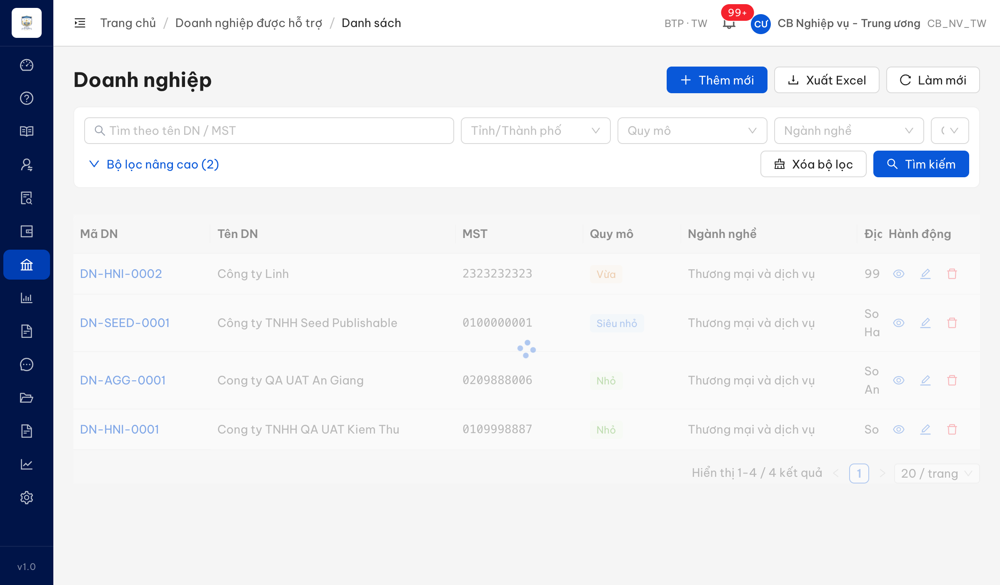
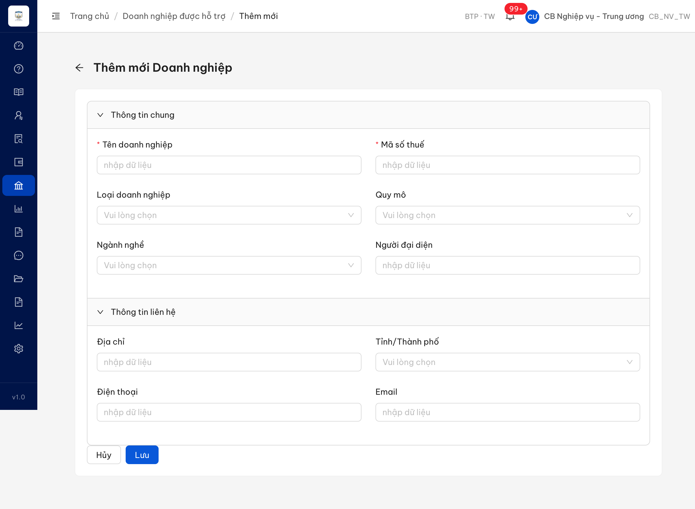
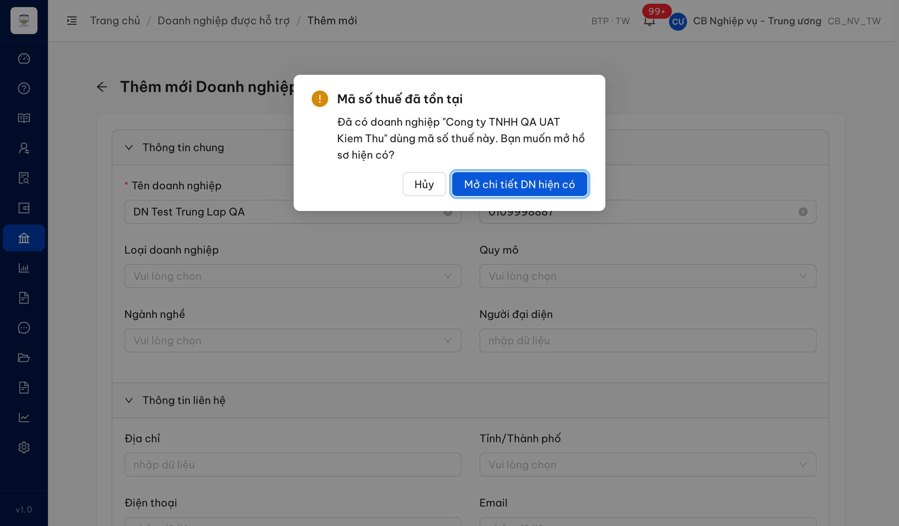
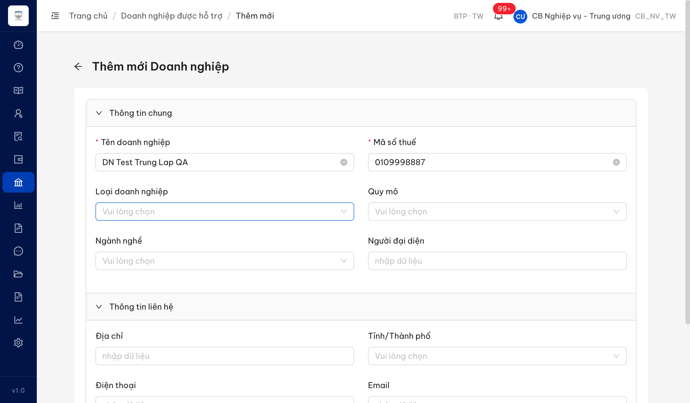
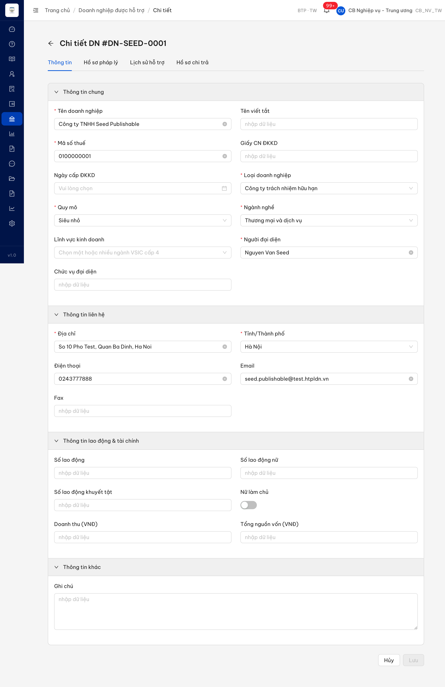

# Bug Report — Module Doanh nghiệp (Quản lý DN được Hỗ trợ)

| Thông tin | Giá trị |
|-----------|---------|
| **Dự án** | PM HTPLDN — TGPL Doanh nghiệp |
| **Môi trường** | https://18.143.165.120.nip.io |
| **Người test** | QA Automation (Claude Code) |
| **Ngày** | 2026-07-22 18:44:00 |
| **Loại test** | UAT verify vòng 1 (bug đối tác gửi) — Functional / UI |
| **Round** | Tuần 3 — verify vòng 1 |
| **Tài liệu tham chiếu** | SRS `srs-fr-07-doanh-nghiep.md` (FR-V.III-01/02, FR-V.III-NEW-03, SCR-V.III-01/02/03); sheet tab "UAT_TGPL Doanh Nghiệp-tuần 3" |

---

## Tổng hợp

Verify vòng 1 các case module Doanh nghiệp thuộc cả 2 session: **Danh sách · Tìm kiếm · Thêm mới · Xem chi tiết · Chỉnh sửa**. Báo cáo ban đầu ghi nhận **6 Bug ID / 7 test case** (`QLDNDHTPL_04` gộp `QLDNDHTPL_07` do cùng root defect).

> **Reverify tuần 3 (2026-07-22, dev fix vòng 1, tài khoản `cbnv_tw_01`):** chạy lại đủ luồng qua Chrome DevTools MCP → **6/6 Bug ID PASS (Closed), 0 Open**. Checkbox chọn dòng đã có + hoạt động (_02); form Thêm mới đủ Nhóm C 11 trường + BR-CALC-05 auto-suggest + BE lưu persist (_04/_07); modal trùng MST bấm Hủy → ô MST tô đỏ (_10); bấm Hủy khi form dirty → hộp xác nhận "Rời khỏi trang?" (_14); màn Xem `/:id` nay chỉ đọc + nút "Sửa", Sửa `/:id/sua` mới editable + Hủy/Lưu (_21/_31).

### Severity breakdown

| Tổng | Critical | Major | Medium | Minor | Trivial | Closed | Open |
|------|----------|-------|--------|-------|---------|--------|------|
| 6    | 0        | 3     | 1      | 2     | 0       | 6      | 0    |

## Bug Summary Table

| Bug ID | Severity | Priority | Type | TC Ref | **SRS Reference** | Title | Status |
|--------|----------|----------|------|--------|-------------------|-------|--------|
| BUG-QLDNDHTPL_02 | Minor | P3 | UI/UX | QLDNDHTPL_02 | `SCR-V.III-01 Thành phần row #15` (FR-V.III-01 / UC81) | Bảng danh sách DN thiếu cột checkbox "Chọn dòng" (luôn hiển thị theo SRS) | Closed |
| BUG-QLDNDHTPL_04 | Major | P2 | UI/UX | QLDNDHTPL_04, QLDNDHTPL_07 | `SCR-V.III-03 §Bố cục form` (FR-V.III-NEW-03) | Form Thêm mới DN thiếu Nhóm C "Thông tin bổ sung" (11 trường) → BR-CALC-05 không chạy | Closed |
| BUG-QLDNDHTPL_10 | Minor | P3 | UI/UX | QLDNDHTPL_10 | `SCR-V.III-03 dòng 599` (FR-V.III-NEW-03) | Modal trùng MST: bấm "Hủy" xong ô Mã số thuế không tô đỏ (SRS yêu cầu highlight đỏ) | Closed |
| BUG-QLDNDHTPL_14 | Medium | P2 | UI/UX | QLDNDHTPL_14 | `SCR-V.III-03 dòng 597` (FR-V.III-NEW-03) | Bấm "Hủy" khi form có thay đổi chưa lưu → không hỏi xác nhận, mất dữ liệu đang nhập | Closed |
| BUG-QLDNDHTPL_21 | Major | — | UI/Permission | QLDNDHTPL_21 | `SCR-V.III-02 §URL` (`srs-fr-07-doanh-nghiep.md:459`) · `SCR-V.III-01 §Hành động Xem/Sửa` (dòng 443) · `FR-V.III-01 §AC` (dòng 196) | Màn "Xem chi tiết doanh nghiệp" mở ở chế độ chỉnh sửa — cho phép sửa toàn bộ trường ngay tại màn Xem, không có chế độ chỉ đọc | Closed |
| BUG-QLDNDHTPL_31 | Major | — | UI | QLDNDHTPL_31 | `SCR-V.III-02 §URL` (`srs-fr-07-doanh-nghiep.md:459`) · `SCR-V.III-01 §Hành động Xem/Sửa` (dòng 443) | Màn Chi tiết DN mở qua nút Xem đã ở chế độ chỉnh sửa (2 nút Hủy/Lưu), không có nút "Sửa" và không có chế độ chỉ đọc để chuyển sang sửa — cùng gốc lỗi BUG-QLDNDHTPL_21 | Closed |

---

## ~~BUG-QLDNDHTPL_02~~ [CLOSED] — Bảng danh sách Doanh nghiệp thiếu cột checkbox "Chọn dòng"

> **Re-test:** 2026-07-22 18:17:56 — ✅ PASS (Closed). Bảng danh sách DN nay có cột chọn dòng: header "Select all" + checkbox mỗi dòng (DOM `.ant-table-selection-column`=6, header checkbox=1, row checkbox=6). Click checkbox 1 dòng → dòng được chọn (`ant-table-row-selected`) → chức năng chọn dòng hoạt động đúng SCR-V.III-01 #15. Evidence: `image/QLDNDHTPL_02-reverify-checkbox-present.png`.

### Mô tả

Màn hình Danh sách Doanh nghiệp (`/doanh-nghiep/danh-sach`) không hiển thị cột checkbox chọn dòng ở đầu bảng. Theo SRS SCR-V.III-01 (Thành phần màn hình, dòng #15), bảng phải có cột "Checkbox — Chọn dòng" với điều kiện hiển thị "Luôn hiển thị". Đối tác phản ánh "Màn hình Không có ô chọn" — tái hiện đúng trên env UAT hiện tại.

### Các bước tái hiện

1. Đăng nhập role **CB Nghiệp vụ Trung ương** (`cbnv_tw` / CB_NV_TW — có quyền truy cập màn danh sách DN theo SCR-V.III-01 "Quyền truy cập: Cán bộ nghiệp vụ và cán bộ phê duyệt").
2. Vào menu **Doanh nghiệp** → màn `/doanh-nghiep/danh-sach`.
3. Quan sát các cột của bảng kết quả (4 DN đang có).
4. Quan sát: cột đầu tiên là "Mã DN", **không có** cột checkbox/ô chọn phía trước.

### Kết quả mong đợi

- Theo SRS SCR-V.III-01 dòng #15: bảng danh sách DN có cột "Checkbox — Chọn dòng", loại `checkbox`, điều kiện "Luôn hiển thị".

### Kết quả thực tế

- Bảng chỉ có các cột: Mã DN / Tên DN / MST / Quy mô / Ngành nghề / Địa chỉ / Số lần hỗ trợ / Tổng chi phí / Hành động.
- Không có cột checkbox. Xác minh DOM: `.ant-table-selection-column` = 0, `input[type=checkbox]` trong bảng = 0 (khớp cây a11y).

### Bằng chứng



```text
DOM query (env live, CB_NV_TW):
headerCells = ["Mã DN","Tên DN","MST","Quy mô","Ngành nghề","Địa chỉ","Số lần hỗ trợ","Tổng chi phí","Hành động"]
selectionColumnCount = 0
checkboxesInsideTable = 0
checkboxesAnywhereOnPage = 0
dataRows = 4
```

---

## ~~BUG-QLDNDHTPL_04~~ [CLOSED] — Form "Thêm mới Doanh nghiệp" thiếu Nhóm C (Thông tin bổ sung)

> **Re-test:** 2026-07-22 18:25:00 — ✅ PASS (Closed, gồm QLDNDHTPL_07). Form Thêm mới nay có đủ **3 nhóm**: Thông tin chung · Thông tin liên hệ · **Thông tin bổ sung** (Nhóm C) với đủ **11 trường** (Số lao động, Doanh thu năm, Tổng nguồn vốn, Lĩnh vực KD VSIC, DN do phụ nữ làm chủ, Số LĐ nữ, Số LĐ khuyết tật, Chức vụ NĐD, Giấy CN ĐKKD, Ghi chú, File đính kèm). BR-CALC-05 auto-suggest hoạt động: điền Số lao động 8 + Doanh thu 5 tỷ + Ngành nghề "Thương mại và dịch vụ" → Quy mô tự điền "Siêu nhỏ". Đã tạo DN thật (DN-07-0001, MST 0722072207) → BE lưu đầy đủ dữ liệu Nhóm C (kiểm tra lại ở màn chi tiết: Số lao động=8, Doanh thu=5.000.000.000, Tổng vốn=2.000.000.000, Chức vụ="Giám đốc", Ghi chú khớp). Evidence: `image/QLDNDHTPL_04-reverify-nhomC-persisted.png`.

### Mô tả

Form "Thêm mới Doanh nghiệp" (`/doanh-nghiep/them-moi`) chỉ hiển thị 2 nhóm trường ("Thông tin chung", "Thông tin liên hệ") với 10 trường. Theo SRS SCR-V.III-03 (§Bố cục form), form phải có 3 nhóm: Nhóm A — Định danh cơ bản, Nhóm B — Địa lý + Phân loại, Nhóm C — Thông tin bổ sung. Toàn bộ Nhóm C (11 trường) bị thiếu. Đối tác phản ánh "Bố cục không giống với thiết kế" — xác minh tái hiện trên env UAT hiện tại.

> **Case QLDNDHTPL_07 gộp vào bug này (cùng root defect).** Đối tác báo riêng QLDNDHTPL_07 ("Không có nhóm trường Thông tin bổ sung") — chính là biểu hiện Nhóm C bị thiếu ở form Thêm mới. Không tách entry riêng để tránh trùng; verdict sheet của cả `QLDNDHTPL_04` và `QLDNDHTPL_07` đều `Open`, cùng trỏ về Bug ID BUG-QLDNDHTPL_04.
> Lưu ý phạm vi: hai case QLDNDHTPL_05 (Nhóm A) và QLDNDHTPL_06 (Nhóm B) verdict `BA confirm` — các trường của Nhóm A/B **đều có mặt và render đúng**, chỉ khác cách nhóm ("Thông tin chung"/"Thông tin liên hệ" thay vì A/B/C); xem [../../ba-confirm/doanh-nghiep/ba-confirmation-doanh-nghiep.md](../../ba-confirm/doanh-nghiep/ba-confirmation-doanh-nghiep.md).

### Các bước tái hiện

1. Đăng nhập role **CB Nghiệp vụ Trung ương** (`cbnv_tw` / CB_NV_TW — có quyền "Quản lý DN" theo SCR-V.III-03 "Quyền truy cập: CB Nghiệp vụ TW/BN/ĐP").
2. Vào menu **Doanh nghiệp** → bấm nút **Thêm mới**.
3. Quan sát cấu trúc form: các nhóm trường và trường có mặt.
4. Quan sát: form chỉ có 2 nhóm "Thông tin chung" (Tên DN, MST, Loại DN, Quy mô, Ngành nghề, Người đại diện) + "Thông tin liên hệ" (Địa chỉ, Tỉnh/TP, Điện thoại, Email). Không có nhóm/trường của Nhóm C.

### Kết quả mong đợi

- Theo SRS SCR-V.III-03 §Bố cục form: form 3 nhóm, trong đó **Nhóm C — Thông tin bổ sung** gồm 11 trường: Chức vụ người đại diện, Giấy chứng nhận ĐKKD, Số lao động, Doanh thu năm gần nhất, Tổng nguồn vốn, DN do phụ nữ làm chủ, Số lao động nữ, Số lao động khuyết tật, Lĩnh vực kinh doanh (VSIC), Ghi chú, File đính kèm.
- Trường Số lao động + Doanh thu + Tổng nguồn vốn phục vụ auto-suggest Quy mô theo BR-CALC-05 (SRS §Thông báo + Hành động row 3).

### Kết quả thực tế

- Form chỉ có 10 trường trong 2 nhóm; thiếu toàn bộ 11 trường Nhóm C.
- Không nhập được Số lao động/Doanh thu/Tổng nguồn vốn → chức năng tự gợi ý Quy mô (BR-CALC-05, NĐ80/2021) không có điều kiện hoạt động khi tạo mới. Không nhập được Lĩnh vực KD (VSIC), DN do phụ nữ làm chủ (BR-CALC-07), File đính kèm.

### Bằng chứng



---

## ~~BUG-QLDNDHTPL_10~~ [CLOSED] — Modal trùng MST: bấm "Hủy" xong ô Mã số thuế không tô đỏ

> **Re-test:** 2026-07-22 18:30:00 — ✅ PASS (Closed). Nhập Tên DN + MST trùng `0109998887` → bấm Lưu → modal "Mã số thuế đã tồn tại" hiện đúng (nêu tên DN + 2 nút Hủy / Mở chi tiết DN hiện có). Bấm **Hủy** → modal đóng, ở lại form, MST giữ giá trị, và ô Mã số thuế nay **highlight đỏ**: form-item mang `ant-form-item-has-error` + viền input đỏ + thông báo đỏ "Mã số thuế đã tồn tại trong hệ thống" (ô Tên DN vẫn bình thường). Khác hẳn trạng thái `has-success` của bug gốc → đúng SCR-V.III-03 dòng 599. Evidence: `image/QLDNDHTPL_10-reverify-huy-mst-error.png`.

### Mô tả

Ở form "Thêm mới Doanh nghiệp", khi nhập Mã số thuế đã tồn tại rồi bấm "Lưu", hệ thống hiển thị modal chặn báo trùng đúng nghiệp vụ (nêu tên DN hiện có + 2 nút "Mở chi tiết DN hiện có" / "Hủy"). Tuy nhiên sau khi bấm "Hủy" trong modal, ô Mã số thuế **không được tô đỏ** — thực tế ô mang trạng thái `has-success`. Theo SRS SCR-V.III-03 dòng 599, bấm "Hủy" phải: đóng modal, ở lại form, **ô MST highlight đỏ**. Đối tác phản ánh "Khi nhấn nút Hủy, ô mã số thuế không tô đỏ" — tái hiện đúng.

### Các bước tái hiện

1. Đăng nhập role **CB Nghiệp vụ Trung ương** (`cbnv_tw` / CB_NV_TW).
2. Vào **Doanh nghiệp** → **Thêm mới**.
3. Nhập Tên DN bất kỳ + Mã số thuế = `0109998887` (MST của DN hiện có "Cong ty TNHH QA UAT Kiem Thu"), bấm **Lưu**.
4. Modal trùng MST hiện ra → bấm nút **Hủy** trong modal.
5. Quan sát ô Mã số thuế trên form.

### Kết quả mong đợi

- Theo SRS SCR-V.III-03 dòng 599: sau khi bấm "Hủy" trong modal trùng, đóng modal, ở lại form, **ô Mã số thuế được highlight đỏ** để chỉ ra trường cần sửa.

### Kết quả thực tế

- Modal đóng, ở lại form, MST giữ giá trị — nhưng ô Mã số thuế **không tô đỏ**. Kiểm DOM: form-item MST mang class `ant-form-item-has-success` (không `has-error`), viền input `rgb(31, 31, 31)` (màu thường), không có `.ant-form-item-explain-error`, `aria-invalid` rỗng.
- Ghi chú phụ (ý 1 đối tác "thông báo không giống thiết kế"): nội dung modal ("Mã số thuế đã tồn tại / Đã có doanh nghiệp \"Cong ty TNHH QA UAT Kiem Thu\" dùng mã số thuế này. Bạn muốn mở hồ sơ hiện có?") khác câu chữ mẫu SRS nhưng truyền đạt đúng yêu cầu nghiệp vụ + đủ 2 nút → coi là khác biệt copy nhỏ (không hiện giá trị MST trong text), không tính lỗi riêng.

### Bằng chứng





```text
DOM sau khi bấm "Hủy" (CB_NV_TW, form Thêm mới):
mstValue = "0109998887"   (giữ nguyên, ở lại form ✅)
mstItemClass = "...ant-form-item-has-success..."   (KHÔNG has-error ❌)
inputBorderColor = rgb(31, 31, 31)   (màu thường, không đỏ)
explainError = ""
```

---

## ~~BUG-QLDNDHTPL_14~~ [CLOSED] — Bấm "Hủy" khi form có thay đổi chưa lưu không hỏi xác nhận

> **Re-test:** 2026-07-22 18:35:00 — ✅ PASS (Closed). Vào Thêm mới → nhập Tên DN (form dirty) → bấm **Hủy** ở footer → hệ thống hiển thị hộp xác nhận "Rời khỏi trang?" ("Bạn có thay đổi chưa lưu. Rời khỏi trang sẽ mất toàn bộ dữ liệu đã nhập. Bạn có chắc chắn?") với 2 nút **Ở lại / Rời khỏi** — KHÔNG điều hướng ngay. Bấm "Ở lại" → đóng modal, ở lại form, dữ liệu Tên DN giữ nguyên. Bấm "Rời khỏi" → mới điều hướng về Danh sách. Modal là cổng chặn thực → đúng SCR-V.III-03 dòng 597 "Xác nhận nếu có thay đổi". Evidence: `image/QLDNDHTPL_14-reverify-huy-confirm-dialog.png`.

### Mô tả

Ở form "Thêm mới Doanh nghiệp", khi đã nhập dữ liệu (form ở trạng thái có thay đổi chưa lưu) rồi bấm nút "Hủy" ở footer, hệ thống **điều hướng thẳng về màn Danh sách mà không hiển thị hộp xác nhận**. Theo SRS SCR-V.III-03 dòng 597, nút "Hủy" phải **"Xác nhận nếu có thay đổi"** trước khi quay về SCR-V.III-01. Đối tác phản ánh "Hệ thống không yêu cầu xác nhận" — tái hiện đúng. Hệ quả: người dùng có thể mất dữ liệu đang nhập do bấm nhầm Hủy.

### Các bước tái hiện

1. Đăng nhập role **CB Nghiệp vụ Trung ương** (`cbnv_tw` / CB_NV_TW).
2. Vào **Doanh nghiệp** → **Thêm mới**.
3. Nhập Tên doanh nghiệp (ví dụ "DN Kiem Tra Huy Xac Nhan") — form ở trạng thái có thay đổi chưa lưu.
4. Bấm nút **Hủy** ở footer form.
5. Quan sát: có hiện hộp xác nhận trước khi rời form không.

### Kết quả mong đợi

- Theo SRS SCR-V.III-03 dòng 597: khi form có thay đổi chưa lưu, bấm "Hủy" phải hiển thị **xác nhận** (ví dụ hỏi rời trang / hủy bỏ thay đổi) trước khi quay về màn Danh sách.

### Kết quả thực tế

- Bấm "Hủy" → điều hướng thẳng `/doanh-nghiep/them-moi` → `/doanh-nghiep/danh-sach`, **không có hộp xác nhận nào**. Kiểm bằng MutationObserver (bắt mọi `.ant-modal`/`[role=dialog]` được thêm) + hook `window.confirm`: `modalSeen = []`, `nativeConfirm = false`. Input nhập bằng trình duyệt thật (form dirty).

### Bằng chứng


```text
Quan sát sau khi bấm "Hủy" (CB_NV_TW, form dirty):
url = "https://18.143.165.120.nip.io/doanh-nghiep/danh-sach"
modalSeen = []          (không modal/confirm nào xuất hiện)
nativeConfirm = false   (không window.confirm() được gọi)
navigatedToList = true  (điều hướng thẳng về Danh sách)
```

---

## Phạm vi Session 2 — Xem chi tiết & Sửa DN

> Verify 8 case đối tác (sheet rows 33–40): QLDNDHTPL_21 / _23 / _24 / _25 / _26 / _27 / _28 / _31 — màn SCR-V.III-02 "Chi tiết / Chỉnh sửa DN" (FR-V.III-01/02), SRS `srs-fr-07-doanh-nghiep.md` (v3.5). Tài khoản verify: `cbnv_tw` (CB_NV_TW, BTP·TW). DN test: DN-SEED-0001 "Công ty TNHH Seed Publishable" (14 lần hỗ trợ) + DN-HNI-0002 "Công ty Linh".

## ~~BUG-QLDNDHTPL_21~~ [CLOSED] — Màn "Xem chi tiết doanh nghiệp" mở ở chế độ chỉnh sửa, cho phép sửa ngay tại màn Xem

> **Re-test:** 2026-07-22 18:42:00 — ✅ PASS (Closed). Bấm nút **Xem** (icon con mắt) ở DN-SEED-0001 → mở `/doanh-nghiep/:id` (breadcrumb "Chi tiết") nay ở **chế độ CHỈ ĐỌC**: 21/22 ô nhập `disabled`, cả 5 dropdown (Loại DN, Quy mô, Ngành nghề, Lĩnh vực KD, Tỉnh/TP) disabled, các ô số + công tắc "Nữ làm chủ" disabled; thanh hành động chỉ có **nút "Sửa"** (KHÔNG có Hủy/Lưu). Bấm "Sửa" → điều hướng sang `/doanh-nghiep/:id/sua` (breadcrumb "Chỉnh sửa") mới bật edit mode (0 disabled, 19 ô editable, 5 dropdown enabled, footer Hủy/Lưu). Hai chế độ Xem vs Sửa nay **tách biệt theo URL** đúng SRS `srs-fr-07-doanh-nghiep.md:459` — bác bỏ hiện tượng "Xem = Sửa" của bug gốc. Evidence: `image/QLDNDHTPL_21-reverify-xem-readonly-sua.png`.

### Mô tả

Từ danh sách Doanh nghiệp, bấm nút **Xem** (icon con mắt) của một DN → hệ thống mở màn "Chi tiết doanh nghiệp" tại URL `/doanh-nghiep/{id}` (URL dành cho xem chi tiết). Nhưng màn này hiển thị **toàn bộ trường dưới dạng ô nhập chỉnh sửa được** (ô text có nút xóa, dropdown mở được, ô số tăng/giảm, công tắc bật/tắt) kèm hai nút **Hủy / Lưu** ở cuối — tức người dùng có thể chỉnh sửa dữ liệu ngay tại màn Xem. Không tồn tại chế độ "chỉ đọc" cho màn Xem.

### Các bước tái hiện

1. Đăng nhập `cbnv_tw` (CB Nghiệp vụ - Trung ương).
2. Menu **Doanh nghiệp** → danh sách DN.
3. Bấm nút **Xem** (icon con mắt) ở dòng DN-SEED-0001 → điều hướng tới `/doanh-nghiep/5eed0010-...001` (breadcrumb "Chi tiết").
4. Quan sát các trường và thanh nút hành động.

### Kết quả mong đợi

- Theo `srs-fr-07-doanh-nghiep.md:459` (SCR-V.III-02 §URL): `/doanh-nghiep/:id` là "**xem chi tiết**", `/doanh-nghiep/:id/sua` mới là "**chỉnh sửa**" — hai chế độ tách biệt theo URL.
- Theo `srs-fr-07-doanh-nghiep.md:443` (SCR-V.III-01): danh sách có **2 hành động riêng "Xem" và "Sửa"** — mỗi hành động làm đúng chức năng của nó.
- Theo `srs-fr-07-doanh-nghiep.md:196` (FR-V.III-01 §AC): "CB NV **xem chi tiết** DN → **hiển thị** hồ sơ + lịch sử hỗ trợ" (hiển thị, không phải cho sửa).
- Vậy: mở bằng nút Xem (URL `/:id`) phải là màn **chỉ đọc**; muốn sửa phải qua chức năng Sửa (URL `/:id/sua`).

### Kết quả thực tế

- Màn Xem (`/doanh-nghiep/5eed0010-...001`, breadcrumb "Chi tiết") hiển thị **21/23 ô nhập ở trạng thái sửa được** (0 disabled), **5 dropdown mở được** (Loại DN, Quy mô, Ngành nghề, Lĩnh vực KD, Tỉnh/Thành), ô số Số lao động/Doanh thu/Tổng vốn có nút tăng-giảm, công tắc "Nữ làm chủ" — và thanh cuối có **nút Hủy + Lưu**, **không có** nút chuyển sang chế độ Xem chỉ-đọc.
- Kiểm chứng bằng phương pháp thứ hai: URL `/doanh-nghiep/:id` (Xem) và `/doanh-nghiep/:id/sua` (Sửa) render form editable **giống hệt nhau** (đều 23 ô nhập, 21 editable, cùng nút Hủy/Lưu) → hệ thống **không có** màn Xem chỉ đọc; nút Xem và nút Sửa dẫn tới cùng một form sửa.
- Đối tác ghi nhận đúng hiện tượng này trên build của họ (evidence QLDNDHTPL_21.jpg — cùng URL `/doanh-nghiep/:id`, các trường có icon xóa, dropdown active).

### Bằng chứng


## ~~BUG-QLDNDHTPL_31~~ [CLOSED] — Màn Chi tiết DN không có nút "Sửa"; mở bằng nút Xem đã ở chế độ chỉnh sửa với 2 nút Hủy/Lưu

> **Re-test:** 2026-07-22 18:44:00 — ✅ PASS (Closed, cùng gốc BUG-QLDNDHTPL_21). Mở DN-SEED-0001 bằng nút **Xem** → màn "Chi tiết DN" (`/doanh-nghiep/:id`) nay ở **chế độ chỉ đọc** và **có nút "Sửa"** ở thanh hành động (footer chỉ "Sửa", KHÔNG còn Hủy/Lưu như bug gốc). Bấm "Sửa" → chuyển sang `/doanh-nghiep/:id/sua` (breadcrumb "Chỉnh sửa") mới hiện 2 nút **Hủy/Lưu** + trường editable. Đã có ranh giới "xem → sửa" đúng SRS `srs-fr-07-doanh-nghiep.md:443/459`. Evidence: `image/QLDNDHTPL_31-reverify-sua-editmode.png`.

> Cùng gốc lỗi với BUG-QLDNDHTPL_21 (màn Xem không ở chế độ chỉ đọc). Case này soi từ góc: người dùng tìm nút "Sửa" để chuyển sang chỉnh sửa nhưng không có.

### Mô tả

Từ danh sách Doanh nghiệp, bấm nút **Xem** → màn "Chi tiết doanh nghiệp" (`/doanh-nghiep/{id}`). Trên màn này, người dùng **không tìm thấy nút "Sửa"** để chuyển từ chế độ xem sang chỉnh sửa; thay vào đó màn **đã ở chế độ chỉnh sửa sẵn** (các trường là ô nhập) và thanh cuối chỉ có **2 nút "Hủy" + "Lưu"**. Không có bước chuyển "xem → sửa": vì màn Xem đã editable, không tồn tại affordance "Sửa".

### Các bước tái hiện

1. Đăng nhập `cbnv_tw` (CB Nghiệp vụ - Trung ương).
2. Menu **Doanh nghiệp** → danh sách DN.
3. Bấm nút **Xem** ở dòng DN-SEED-0001 → `/doanh-nghiep/5eed0010-...001`.
4. Tìm nút "Sửa" trên màn chi tiết và quan sát thanh nút hành động.

### Kết quả mong đợi

- Theo `srs-fr-07-doanh-nghiep.md:459` (SCR-V.III-02 §URL) + `:443` (SCR-V.III-01 — 2 hành động riêng Xem / Sửa): màn mở bằng **Xem** (`/:id`) phải là **chỉ đọc**; việc chuyển sang chỉnh sửa là **một hành động Sửa riêng** (dẫn tới `/:id/sua`). Ở chế độ chỉ đọc, người dùng cần một cách để chuyển sang sửa (hành động Sửa), và chỉ khi ở chế độ sửa mới xuất hiện 2 nút Hủy/Lưu.

### Kết quả thực tế

- Màn Chi tiết mở bằng nút Xem **đã editable sẵn**: thanh hành động chỉ có **"Hủy" + "Lưu"** (nút "Lưu" ở trạng thái disabled cho tới khi có thay đổi), **không có** nút "Sửa" và **không có** chế độ chỉ đọc.
- Kiểm chứng bằng phương pháp thứ hai: URL `/:id` (Xem) và `/:id/sua` (Sửa) render **giống hệt** một form chỉnh sửa → không có ranh giới "xem" vs "sửa", nên không tồn tại nút chuyển chế độ.
- Đối tác ghi nhận đúng hiện tượng: "không hiển thị nút chức năng Sửa mà hiển thị 2 nút Hủy-Lưu" (evidence QLDNDHTPL_31.jpg).

### Bằng chứng


