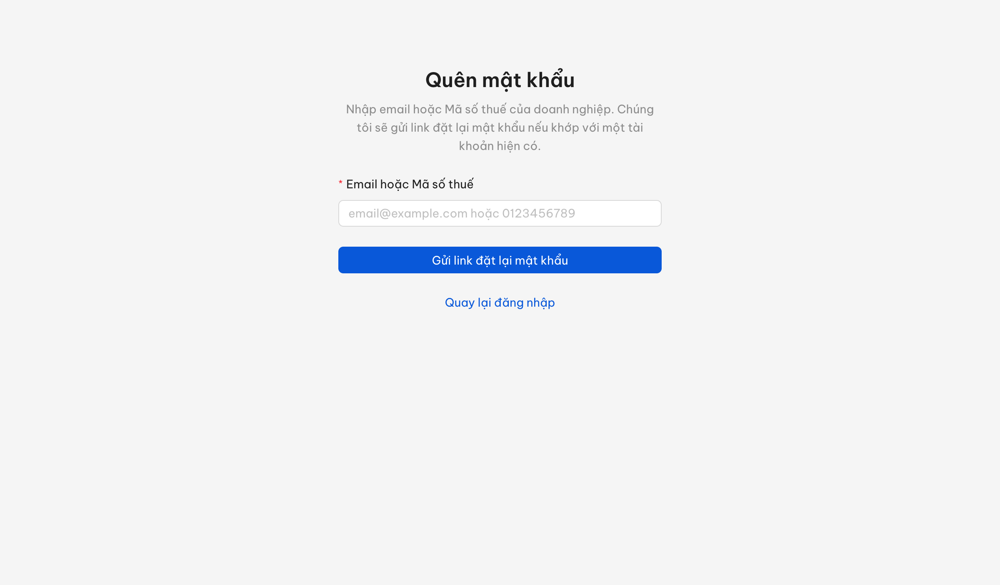
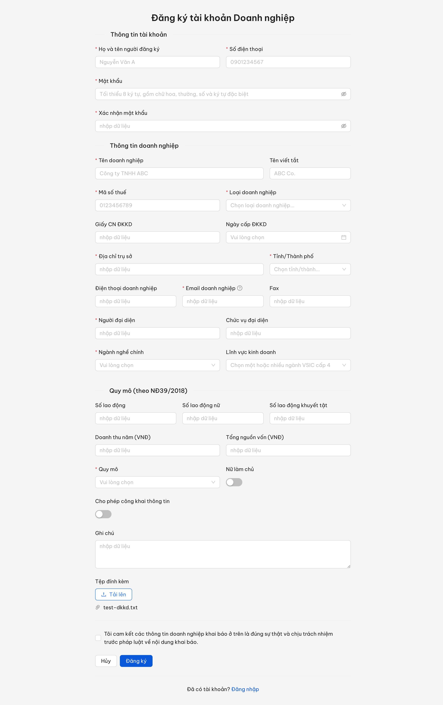
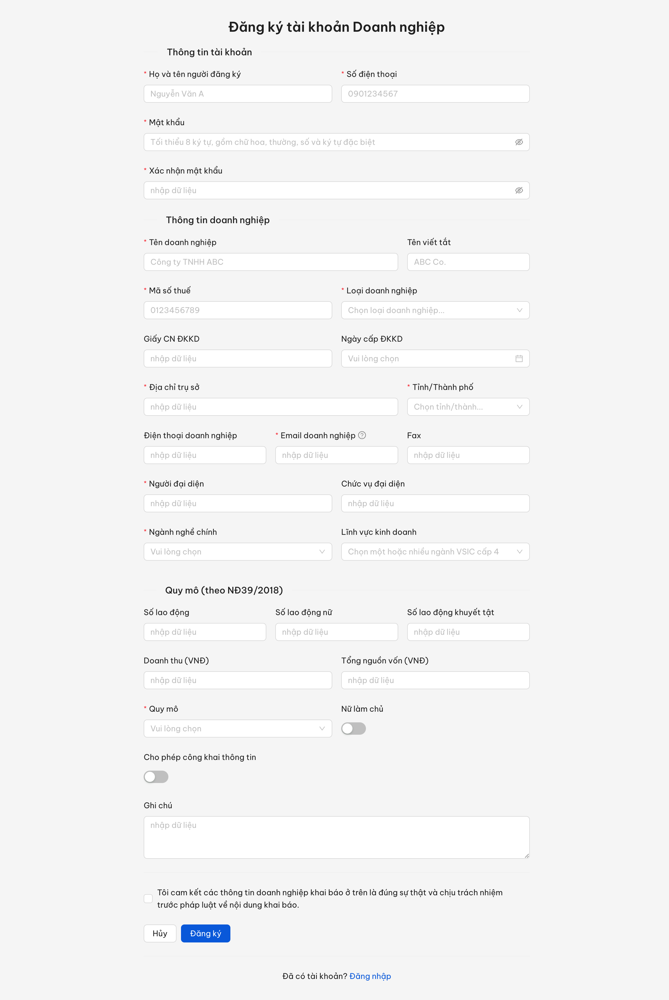
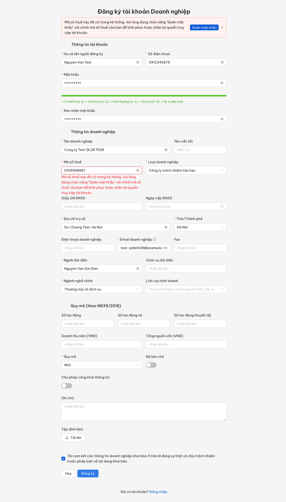
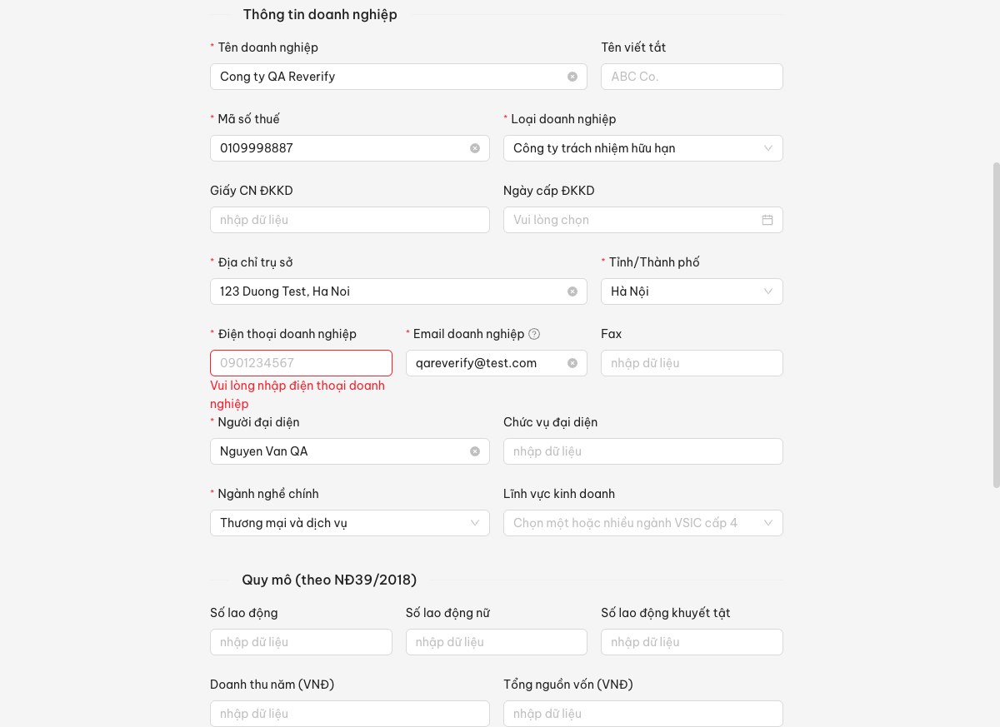

# Bug Report — QLDKTK (Đăng ký tài khoản doanh nghiệp)

| Thông tin | Giá trị |
|-----------|---------|
| **Dự án** | PM HTPLDN — UAT đối tác tuần 3 |
| **Môi trường** | https://18.143.165.120.nip.io/register/doanh-nghiep |
| **Người test** | QA Automation (Claude Code) |
| **Ngày** | 2026-07-23 14:45:00 |
| **Loại test** | Functional / UI / Validation — verify bug đối tác vòng đầu |
| **Round** | Re-verify tuần 3 — sau dev fix lần 1 (2026-07-22) |
| **Tài liệu tham chiếu** | SRS v3.5 `srs-fr-10-quan-tri.md` — FR-VIII-22 (UC120) + SCR-VIII-08 |

---

## Tổng hợp

Phát hiện **4** lỗi có SRS reference cụ thể trên màn "Đăng ký tài khoản doanh nghiệp" (form công khai, không cần đăng nhập). Cả 4 đã verify trực tiếp trên môi trường được giao (2026-07-21). Case QLDKTK_09 (không gửi liên kết kích hoạt) đã kiểm tra và **KHÔNG tái hiện** → Reject, không đưa vào file này.

> **Snapshot LATEST (2026-07-27):** **4 tổng · 4 Closed · 0 Open.** QLDKTK_02 + QLDKTK_04 PASS ở re-verify 2026-07-22; QLDKTK_08 PASS ở re-verify 2026-07-23; QLDKTK_03 (case chờ BA) PASS ở round 5 ngày 2026-07-25. Chi tiết bằng chứng xem dòng Re-test của từng bug.

### Severity breakdown

| Tổng | Critical | Major | Medium | Minor | Trivial | Closed | Open |
|------|----------|-------|--------|-------|---------|--------|------|
| 4    | 0        | 1     | 0      | 3     | 0       | 4      | 0    |

## Bug Summary Table

| Bug ID | Severity | Priority | Type | TC Ref | **SRS Reference** | Title | Status |
|--------|----------|----------|------|--------|-------------------|-------|--------|
| BUG-QLDKTK_04 | Major | P1 | UI/UX | QLDKTK_04 | `FR-VIII-22 §Error Handling E2 (dòng 1082)` + `AC (dòng 1103)` | MST đã tồn tại: thông báo thiếu hướng dẫn + thiếu nút "Quên mật khẩu" | ~~Closed~~ |
| BUG-QLDKTK_02 | Minor | P3 | UI/UX | QLDKTK_02 | `SCR-VIII-08 row 18 (dòng 1856)` + `row 10 (dòng 1848)` | Thiếu trường "File đính kèm"; nhãn "Doanh thu (VNĐ)" ≠ "Doanh thu năm" | ~~Closed~~ |
| ~~BUG-QLDKTK_03~~ | Minor | P2 | UI/UX | QLDKTK_03 | `SCR-VIII-08 row 19 (dòng 1858)` | Mục Tài khoản thiếu trường "Tên đăng nhập" (chỉ đọc = MST) | **Closed** |
| BUG-QLDKTK_08 | Minor | P3 | Negative | QLDKTK_08 | `SCR-VIII-08 row 15 (dòng 1853)` + `FR-VIII-22 Inputs row 15 (dòng 1051)` | Trường "Điện thoại doanh nghiệp" không đánh dấu bắt buộc (đã fix — reverify 2026-07-23) | ~~Closed~~ |

> Ghi chú: ý "mục Tài khoản có thêm trường Họ và tên người đăng ký + Số điện thoại" trong QLDKTK_03 là **đề nghị BA xác nhận** (SRS không liệt kê) — đã tách sang `../../ba-confirm/qldktk/ba-confirmation-needed-week-3-QLDKTK.md` (file BA riêng), không log thành bug ở đây.

---

## ~~BUG-QLDKTK_04~~ [CLOSED] — MST đã tồn tại: thông báo thiếu hướng dẫn + thiếu nút "Quên mật khẩu"

> **Re-test:** 2026-07-22 18:37:32 — ✅ PASS (Closed). Chạy lại luồng: điền đủ trường bắt buộc + MST đã tồn tại (`0109998887`) → bấm Đăng ký. Hệ thống nay hiển thị banner cảnh báo đầy đủ "Mã số thuế này đã có trong hệ thống. Vui lòng dùng chức năng "Quên mật khẩu" với chính mã số thuế của bạn để khôi phục hoặc nhận lại quyền truy cập tài khoản." KÈM nút "Quên mật khẩu"; bấm nút → điều hướng sang trang `/auth/forgot-password` (chức năng Quên mật khẩu / khôi phục tài khoản, FR-VIII-26). Người dùng có lối đi tiếp, không còn kẹt. (MST không tự điền sẵn ở trang đích, nhưng trang chấp nhận nhập Email/MST nên không chặn luồng.)

### Mô tả

Trên màn "Đăng ký tài khoản doanh nghiệp", khi nhập Mã số thuế đã có hồ sơ trong hệ thống rồi bấm Đăng ký, hệ thống chỉ báo một dòng ngắn "Mã số thuế này đã có hồ sơ doanh nghiệp trong hệ thống." và **không** hướng dẫn người dùng dùng chức năng [Quên mật khẩu], **không** hiển thị nút "Quên mật khẩu" để đi tiếp.

### Các bước tái hiện

1. Truy cập form đăng ký công khai `/register/doanh-nghiep` (không cần đăng nhập).
2. Điền đủ các trường bắt buộc, riêng Mã số thuế nhập một MST **đã tồn tại** trong hệ thống (verify với `0109998887` — DN-HNI-0001).
3. Tích cam kết, bấm "Đăng ký".
4. Quan sát thông báo lỗi hiển thị + tìm nút "Quên mật khẩu".

### Kết quả mong đợi

- Theo SRS FR-VIII-22 §Error Handling E2 `ERR-REG-MST-EXIST` (dòng 1082) + Acceptance Criteria (dòng 1103): hệ thống hiển thị thông báo đầy đủ "Mã số thuế này đã có trong hệ thống. Vui lòng dùng chức năng [Quên mật khẩu] với chính mã số thuế của bạn để khôi phục hoặc nhận lại quyền truy cập tài khoản." **kèm nút "Quên mật khẩu"** dẫn sang chức năng Quên mật khẩu / kích hoạt lần đầu (FR-VIII-26).

### Kết quả thực tế

- **(Đã fix — 2026-07-22)** Hệ thống hiển thị banner cảnh báo (ant-alert) với thông báo **đầy đủ**, khớp nguyên văn SRS: "Mã số thuế này đã có trong hệ thống. Vui lòng dùng chức năng "Quên mật khẩu" với chính mã số thuế của bạn để khôi phục hoặc nhận lại quyền truy cập tài khoản."
- **(Đã fix — 2026-07-22)** Banner có nút "Quên mật khẩu"; bấm nút điều hướng sang `/auth/forgot-password` (trang Quên mật khẩu, nhập Email/MST để nhận link đặt lại mật khẩu) → người dùng không còn "kẹt".
- (Gốc 2026-07-21) UI chỉ hiển thị banner ngắn "Mã số thuế này đã có hồ sơ doanh nghiệp trong hệ thống.", quét toàn trang **0** nút/liên kết "Quên mật khẩu".

### Bằng chứng




**API response gốc** (`POST /api/v1/auth/register-doanh-nghiep` → 409, 2026-07-21):

```json
{"success":false,"error":{"code":"ERR-REG-MST-EXIST","message":"Mã số thuế này đã có hồ sơ doanh nghiệp. Vui lòng dùng chức năng \"Quên mật khẩu\" để kích hoạt tài khoản."}}
```

---

## ~~BUG-QLDKTK_02~~ [CLOSED] — Thiếu trường "File đính kèm"; nhãn "Doanh thu (VNĐ)" khác SRS "Doanh thu năm"

> **Re-test:** 2026-07-22 18:37:32 — ✅ PASS (Closed). Form đăng ký nay có trường "Tệp đính kèm" (nút "Tải lên" + `input[type=file]` thật, `multiple=true`, đã upload thử `test-dkkd.txt` → file vào danh sách OK); nhãn trường doanh thu đã đổi thành "Doanh thu năm (VNĐ)" (chứa đúng "Doanh thu năm" theo SRS). Cả 2 phần lỗi đều đã fix.

### Mô tả

Mục "Thông tin doanh nghiệp" của form đăng ký thiếu trường "File đính kèm" (tải Giấy ĐKKD...) mà SRS yêu cầu; đồng thời nhãn trường doanh thu hiển thị "Doanh thu (VNĐ)" trong khi SRS đặt tên trường là "Doanh thu năm".

### Các bước tái hiện

1. Truy cập form đăng ký công khai `/register/doanh-nghiep` (không cần đăng nhập).
2. Cuộn hết mục "Thông tin doanh nghiệp".
3. Tìm trường "File đính kèm" / "Tệp đính kèm" và kiểm tra nhãn trường doanh thu.

### Kết quả mong đợi

- SRS SCR-VIII-08 row 18 (dòng 1856): form có trường "File đính kèm (Giấy ĐKKD, etc.)" dạng file-upload, tùy chọn, cho tải nhiều tệp.
- SRS SCR-VIII-08 row 10 (dòng 1848) + FR-VIII-22 Inputs row 10 (dòng 1046): nhãn trường là "Doanh thu năm".

### Kết quả thực tế

- **(Đã fix — 2026-07-22)** Form nay có trường "Tệp đính kèm" với nút "Tải lên" và `input[type=file]` (`multiple=true`); upload thử 1 tệp → tệp hiển thị trong danh sách đính kèm.
- **(Đã fix — 2026-07-22)** Nhãn trường doanh thu nay hiển thị "Doanh thu năm (VNĐ)".
- (Gốc 2026-07-21) Không có trường "File đính kèm"/"Tệp đính kèm" (0 input file, 0 widget upload); nhãn doanh thu là "Doanh thu (VNĐ)".

### Bằng chứng



---

## ~~BUG-QLDKTK_03~~ [CLOSED] — Mục Tài khoản thiếu trường "Tên đăng nhập" (chỉ đọc = Mã số thuế)

> **Re-test:** 2026-07-25 R5 — ✅ PASS (Closed). Biểu mẫu `/register/doanh-nghiep` mục Tài khoản chỉ còn Tên đăng nhập (chỉ đọc, bám Mã số thuế, đổi động 3/3 lần) + Mật khẩu + Xác nhận + ô cam kết; payload `POST /api/v1/auth/register-doanh-nghiep` không còn `hoTen`/`soDienThoaiTaiKhoan`, trả 201 `CHO_KICH_HOAT`. Bằng chứng: `../../dev-fix-reverify-round-5-2026-07-25/QLDKTK_03/ket-qua.md`.


### Mô tả

Mục "Thông tin tài khoản" của form đăng ký không hiển thị trường "Tên đăng nhập" (chỉ đọc, tự điền = Mã số thuế) mà SRS yêu cầu. Người dùng không thấy tên đăng nhập của mình ngay trên form.

### Các bước tái hiện

1. Truy cập form đăng ký công khai `/register/doanh-nghiep` (không cần đăng nhập).
2. Xem mục "Thông tin tài khoản" (phần đầu form).
3. Tìm trường "Tên đăng nhập".

### Kết quả mong đợi

- SRS SCR-VIII-08 row 19 (dòng 1858): mục Tài khoản đăng nhập phải hiển thị "Tên đăng nhập của bạn = Mã số thuế: {ma_so_thue}" (dạng chỉ đọc), tự cập nhật real-time khi nhập Mã số thuế (AC dòng 1098-1099).

### Kết quả thực tế

- Mục "Thông tin tài khoản" chỉ có: Họ và tên người đăng ký, Số điện thoại, Mật khẩu, Xác nhận mật khẩu. **Không** có trường "Tên đăng nhập" (kiểm tra DOM: không tìm thấy chữ "Tên đăng nhập" nào trên form).

### Bằng chứng



---

## ~~BUG-QLDKTK_08~~ [CLOSED] — Trường "Điện thoại doanh nghiệp" không đánh dấu bắt buộc

> **Re-test:** 2026-07-23 14:45:00 — ✅ **PASS (Closed).** Trường "Điện thoại doanh nghiệp" (inputId `dienThoai`, ánh xạ `so_dien_thoai` SRS) nay có dấu * (class `ant-form-item-required`). Chạy lại đúng luồng đối tác: điền đủ MỌI trường bắt buộc khác (kể cả trường "Số điện thoại" mục Tài khoản), để trống DUY NHẤT "Điện thoại doanh nghiệp" → bấm Đăng ký bị chặn ngay ở client (**0 request POST `register-doanh-nghiep`**), lỗi inline duy nhất "Vui lòng nhập điện thoại doanh nghiệp" trên đúng trường đó. Không còn submit lọt như vòng trước.

### Mô tả

Trường "Điện thoại doanh nghiệp" ở mục "Thông tin doanh nghiệp" không được đánh dấu bắt buộc (không có dấu *), để trống vẫn đăng ký thành công, trong khi SRS quy định số điện thoại liên hệ của doanh nghiệp là trường bắt buộc.

### Các bước tái hiện

1. Truy cập form đăng ký công khai `/register/doanh-nghiep` (không cần đăng nhập).
2. Xem trường "Điện thoại doanh nghiệp" ở mục "Thông tin doanh nghiệp" — không có dấu *.
3. Để trống "Điện thoại doanh nghiệp", điền đủ các trường bắt buộc khác + MST hợp lệ → bấm Đăng ký.
4. Quan sát: hệ thống không báo lỗi ở trường "Điện thoại doanh nghiệp".

### Kết quả mong đợi

- SRS SCR-VIII-08 row 15 (dòng 1853): "Số điện thoại liên hệ" — **Bắt buộc**.
- SRS FR-VIII-22 Inputs row 15 (dòng 1051): `so_dien_thoai` — Bắt buộc = Y (định dạng `^0\d{9,10}$`).

### Kết quả thực tế

- **(Gốc 2026-07-21 / reopen 2026-07-22)** Trường "Điện thoại doanh nghiệp" không có dấu * và không bị validate bắt buộc (kiểm tra DOM: `required = false`); form vẫn submit khi để trống trường này.
- **(Đã fix — reverify 2026-07-23)** Trường "Điện thoại doanh nghiệp" (id `dienThoai`) nay có `requiredClass = true` (dấu *); DOM đo đúng 2 trường điện thoại đều required. Điền đủ mọi trường bắt buộc khác + để trống trường này → bấm Đăng ký: **0 POST `register-doanh-nghiep`**, đúng 1 lỗi inline "Vui lòng nhập điện thoại doanh nghiệp" trên trường đó, form không submit.

> Lưu ý phân biệt: form có 2 trường điện thoại — "Số điện thoại" (id `soDienThoaiTaiKhoan`, mục Tài khoản, là trường thêm không có trong SRS) và "Điện thoại doanh nghiệp" (id `dienThoai`, mục Doanh nghiệp, ánh xạ `so_dien_thoai` của SRS). Bug này nói về trường "Điện thoại doanh nghiệp" — nay cả hai đều bắt buộc.

### Bằng chứng





---

## Phụ lục — Môi trường test

| Thành phần | Giá trị |
|------------|---------|
| URL ứng dụng | https://18.143.165.120.nip.io/register/doanh-nghiep |
| MailHog (inbox mail) | http://18.143.165.120:8025/ |
| API base | https://18.143.165.120.nip.io/api/v1 |
| Frontend | React + Ant Design |
| Xác thực | Không cần (form đăng ký công khai) |
| Tool test | Chrome DevTools MCP |

---

*Bug report generated: 2026-07-21 | Re-verify: 2026-07-22 | QA Automation via Claude Code*
