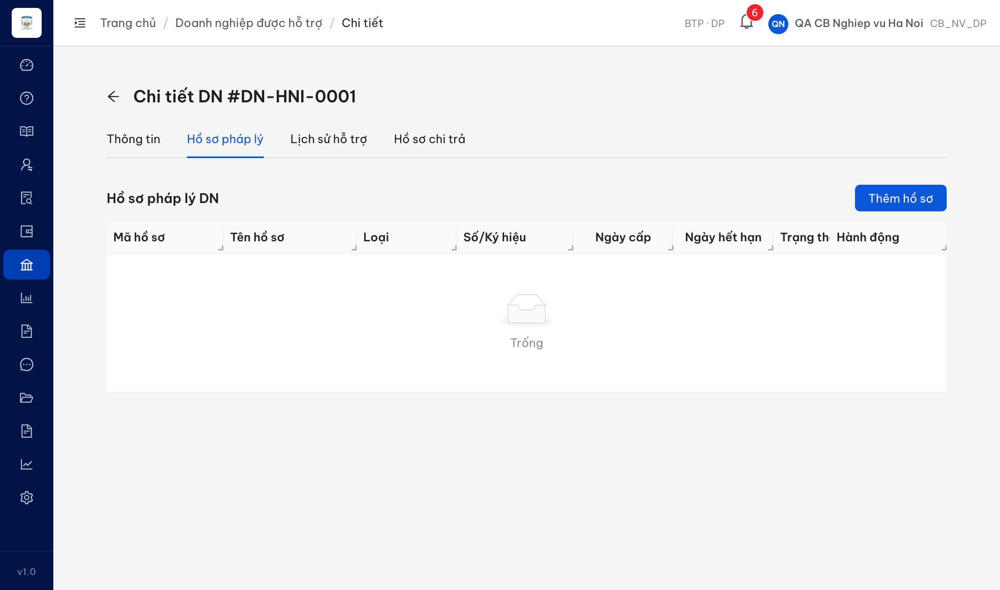
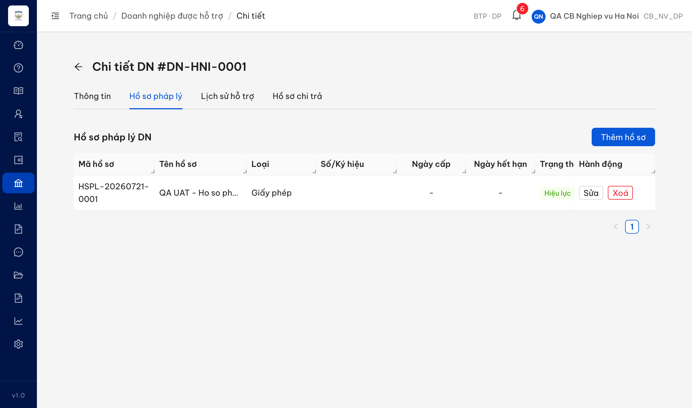
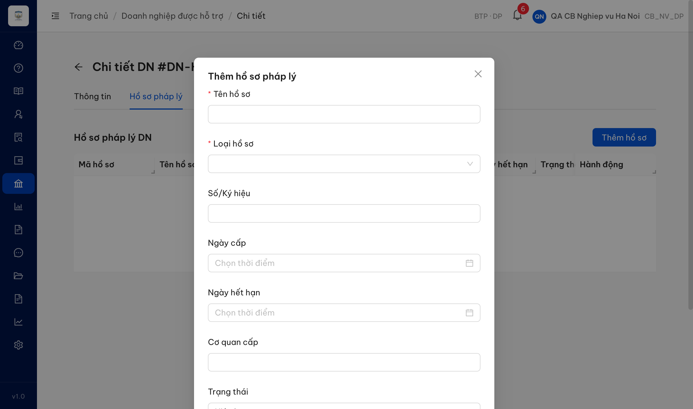
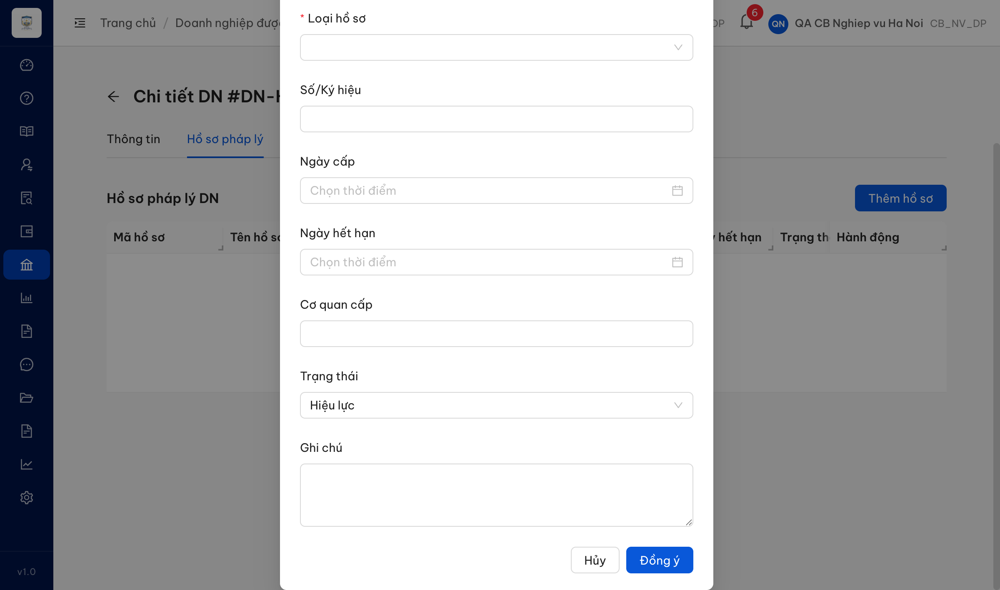

# Bug Report — Quản lý hồ sơ pháp lý doanh nghiệp (QLHSPLDN)

| Thông tin | Giá trị |
|-----------|---------|
| **Dự án** | PM HTPLDN — UAT đối tác, reverify tuần 3 |
| **Môi trường** | https://18.143.165.120.nip.io |
| **Người test** | QA Automation (Claude Code) |
| **Ngày** | 2026-07-27 11:46:00 |
| **Loại test** | Functional / UI (verify bug đối tác vòng đầu) |
| **Round** | Verify 1 |
| **Tài liệu tham chiếu** | SRS `srs-v3.5/srs-fr-12-tv-chuyen-sau.md` — FR-X.1-04 (UC150). Rows sheet 292-293. |

---

## Tổng hợp

> **Snapshot LATEST (2026-07-27 11:46):** **2 tổng · 2 Closed · 0 Open.** Cả 2 bug đã re-verify trực tiếp trên môi trường bằng Chrome DevTools MCP (tài khoản `cbnv_hn`, DN-HNI-0001): bảng danh sách nay đủ 3 cột mới và bỏ cột thừa (QLHSPLDN_02 — 5/5 điều kiện), biểu mẫu Thêm/Sửa nay có Lĩnh vực pháp lý + Tệp đính kèm, nhãn "Mô tả", và tệp mở được (QLHSPLDN_03 — 4/4 ý, đo trên hồ sơ mới HSPL-20260727-0001).

Verify **2** case đối tác phản ánh (rows 292-293) về chức năng Quản lý hồ sơ pháp lý doanh nghiệp — truy cập qua **Doanh nghiệp → Xem chi tiết → thẻ "Hồ sơ pháp lý"** (MH-07.2). Cả 2 là **bug hiển thị tĩnh** (bảng danh sách + biểu mẫu Thêm/Sửa thiếu/thừa cột-trường so SRS). Verify bằng tài khoản CB Nghiệp vụ Địa phương (Sở Tư pháp Hà Nội), DN DN-HNI-0001, seed 1 hồ sơ HSPL-20260721-0001. Ghi nhận **2** lỗi Open có SRS reference; các điểm còn lại tách sang [../../ba-confirm/qlhspldn/ba-confirmation-needed-qlhspldn.md](../../ba-confirm/qlhspldn/ba-confirmation-needed-qlhspldn.md).

### Severity breakdown

| Tổng | Critical | Major | Medium | Minor | Trivial | Closed | Open |
|------|----------|-------|--------|-------|---------|--------|------|
| 2    | 0        | 2     | 0      | 0     | 0       | 2      | 0    |

## Bug Summary Table

| Bug ID | Severity | Priority | Type | TC Ref | **SRS Reference** | Title | Status |
|--------|----------|----------|------|--------|-------------------|-------|--------|
| ~~BUG-QLHSPLDN_02~~ | Major | P1 | UI/UX | QLHSPLDN_02 (row 292) | `FR-X.1-04 (UC150) §Outputs dòng 654 (co_file)` | Bảng danh sách hồ sơ pháp lý thiếu cột "Có tệp đính kèm" | **Closed** |
| ~~BUG-QLHSPLDN_03~~ | Major | P1 | UI/UX | QLHSPLDN_03 (row 293) | `FR-X.1-04 (UC150) §Inputs dòng 556 (linh_vuc_id), 562 (file_dinh_kem)` | Biểu mẫu Thêm hồ sơ pháp lý thiếu "Lĩnh vực pháp lý" và "Tệp đính kèm" | **Closed** |

> **Chú thích Type / Severity / Priority:** xem template gốc `output/template/bug-report-template.md`.

---

## ~~BUG-QLHSPLDN_02~~ [CLOSED] — Bảng danh sách hồ sơ pháp lý DN thiếu cột "Có tệp đính kèm"

> **Re-test:** 2026-07-27 11:44 (`cbnv_hn`) — ✅ PASS (Closed) 5/5 điều kiện. Bảng danh sách hồ sơ pháp lý DN-HNI-0001 đọc qua DOM có 10 cột, hết cột "Số/Ký hiệu", đủ 3 cột mới "Lĩnh vực pháp lý" · "Nguồn" · "Có tệp đính kèm"; hồ sơ đã gán hiện tên "Lao động" (không phải id) còn hồ sơ chưa gán hiện "—"; cột Nguồn hiện nhãn tiếng Việt "Thủ công"; cột tệp đính kèm phân biệt Có/Không đúng thực tế. Bằng chứng: `image/RETEST-QLHSPLDN_02-2026-07-27-list-10cot.png`.

### Mô tả

Trong màn Chi tiết doanh nghiệp → thẻ **"Hồ sơ pháp lý"**, bảng danh sách hồ sơ pháp lý hiển thị 8 cột: `Mã hồ sơ · Tên hồ sơ · Loại · Số/Ký hiệu · Ngày cấp · Ngày hết hạn · Trạng thái · Hành động`. Bảng **không có cột "Có tệp đính kèm"** — trong khi SRS FR-X.1-04 §Outputs (dòng 654) quy định trường `co_file` (boolean) **luôn** được trả về để cho biết mỗi hồ sơ có tệp đính kèm hay không. Người dùng không có cách nào biết hồ sơ nào đã đính kèm tệp từ danh sách.

### Các bước tái hiện

1. Đăng nhập role **CB Nghiệp vụ Địa phương** (`cbnv_hn` — Sở Tư pháp Hà Nội; quyền truy cập chức năng Quản lý hồ sơ pháp lý DN theo FR-X.1-04 §Preconditions).
2. Vào menu **Doanh nghiệp** → chọn **DN-HNI-0001** → **Xem chi tiết**.
3. Mở thẻ **"Hồ sơ pháp lý"**.
4. Quan sát header bảng danh sách (đọc `<thead>` qua DOM để chắc chắn): 8 cột, **không có** "Có tệp đính kèm". Kết quả giống hệt khi bảng trống và khi đã seed 1 hồ sơ (HSPL-20260721-0001).

### Kết quả mong đợi

- Theo SRS FR-X.1-04 §Outputs (dòng 654), danh sách phải thể hiện được thông tin `co_file` — có một cột/dấu hiệu "Có tệp đính kèm" cho biết mỗi hồ sơ có tệp đính kèm hay không.

### Kết quả thực tế

- Bảng danh sách có 8 cột `Mã hồ sơ · Tên hồ sơ · Loại · Số/Ký hiệu · Ngày cấp · Ngày hết hạn · Trạng thái · Hành động` — **không có** cột "Có tệp đính kèm".
- DOM `<thead>` đọc được: `["Mã hồ sơ","Tên hồ sơ","Loại","Số/Ký hiệu","Ngày cấp","Ngày hết hạn","Trạng thái","Hành động"]`.

### Bằng chứng

**1. Ảnh chụp:**

**2. Ghi chú kiểm chứng:**

- Cột đọc từ DOM (`.ant-table-thead th`): 8 cột, không có "Có tệp đính kèm".
- Đối chiếu SRS §Outputs (dòng 642-656): có `co_file` (dòng 654) — luôn trả về.

---

## ~~BUG-QLHSPLDN_03~~ [CLOSED] — Biểu mẫu Thêm hồ sơ pháp lý thiếu "Lĩnh vực pháp lý" và "Tệp đính kèm"

> **Re-test:** 2026-07-27 11:46 (`cbnv_hn`) — ✅ PASS (Closed) 4/4 ý, đo trên hồ sơ tạo MỚI HSPL-20260727-0001. Biểu mẫu Thêm/Sửa 9 ô, hết ô "Số/Ký hiệu", đúng một ô văn bản dài nhãn "Mô tả" (không còn "Ghi chú"), có ô chọn "Lĩnh vực pháp lý" với 10 giá trị chọn được, có ô "Tệp đính kèm"; lưu 201 rồi mở lại bằng [Sửa] thấy đủ 3 giá trị (Lao động · mô tả · R27-HSPL-RETEST.pdf) và bấm [Xem] tải tệp trả **200** (trước là 403 `ERR-PERM-FILE-03`). Bằng chứng: `image/RETEST-QLHSPLDN_03-2026-07-27-form-9o.png`, `image/RETEST-QLHSPLDN_03-2026-07-27-mo-lai-du-3-gia-tri.png`.

### Mô tả

Biểu mẫu **[+ Thêm hồ sơ]** (và Chỉnh sửa) trong thẻ "Hồ sơ pháp lý" của DN chỉ có các trường: `Tên hồ sơ*, Loại hồ sơ*, Số/Ký hiệu, Ngày cấp, Ngày hết hạn, Cơ quan cấp, Trạng thái, Ghi chú`. Biểu mẫu **thiếu 2 trường mà SRS §Inputs quy định**: "Lĩnh vực pháp lý" (`linh_vuc_id`, dòng 556) và "Tệp đính kèm" (`file_dinh_kem`, dòng 562 — không có control upload nào). Không thể gán lĩnh vực hoặc đính kèm tệp cho hồ sơ khi tạo/sửa.

### Các bước tái hiện

1. Đăng nhập role **CB Nghiệp vụ Địa phương** (`cbnv_hn` — Sở Tư pháp Hà Nội; có quyền tạo hồ sơ pháp lý DN theo FR-X.1-04 §Preconditions).
2. Vào **Doanh nghiệp** → **DN-HNI-0001** → **Xem chi tiết** → thẻ **"Hồ sơ pháp lý"**.
3. Bấm **[+ Thêm hồ sơ]** → biểu mẫu "Thêm hồ sơ pháp lý" mở ra.
4. Quan sát danh sách trường (đọc label form qua DOM): không có trường "Lĩnh vực pháp lý", không có ô upload "Tệp đính kèm".

### Kết quả mong đợi

- Theo SRS FR-X.1-04 §Inputs (Thêm mới / Chỉnh sửa):
  - Dòng 556: `linh_vuc_id` — trường chọn **Lĩnh vực** (tra từ danh mục).
  - Dòng 562: `file_dinh_kem` — ô **upload tệp đính kèm** (PDF/image, max 20MB).
- Biểu mẫu phải có 2 trường này.

### Kết quả thực tế

- Biểu mẫu chỉ có: `Tên hồ sơ*, Loại hồ sơ*, Số/Ký hiệu, Ngày cấp, Ngày hết hạn, Cơ quan cấp, Trạng thái, Ghi chú`.
- DOM label đọc được: `["Tên hồ sơ","Loại hồ sơ","Số/Ký hiệu","Ngày cấp","Ngày hết hạn","Cơ quan cấp","Trạng thái","Ghi chú"]`; kiểm tra control upload (`input[type=file]`, `.ant-upload`): **không có** (`hasUpload=false`).
- **Không có** trường "Lĩnh vực pháp lý". Trường "Mô tả" (`mo_ta`, dòng 560) xuất hiện dưới nhãn "Ghi chú" (cần BA xác nhận nhãn — xem file BA confirm). Trường "Số/Ký hiệu" là trường thừa không có trong SRS §Inputs (cần BA xác nhận).

### Bằng chứng

**1. Ảnh chụp:**

**2. Ghi chú kiểm chứng:**

- Đối chiếu SRS §Inputs (dòng 548-562): thiếu `linh_vuc_id` (556) và `file_dinh_kem` (562).

---

## Phụ lục — Môi trường test

| Thành phần | Giá trị |
|------------|---------|
| URL ứng dụng | https://18.143.165.120.nip.io |
| OTP login | Lấy từ MailHog |
| MailHog (OTP inbox) | http://18.143.165.120:8025 |
| Tài khoản verify | `cbnv_hn` (CB Nghiệp vụ Địa phương — Sở Tư pháp Hà Nội) |
| DN test | DN-HNI-0001 (`0109998887`, Hà Nội) — seed hồ sơ HSPL-20260721-0001 |
| Tool test | Chrome DevTools MCP |

---

*Bug report generated: 2026-07-21 17:35:17 | QA Automation via Claude Code*
