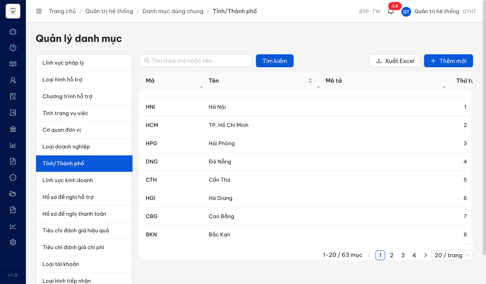

# Bug Report — Quản trị hệ thống (Batch 5 — DM List-level)

| Thông tin | Giá trị |
|-----------|---------|
| **Dự án** | PM HTPLDN |
| **Môi trường** | https://18.143.165.120.nip.io |
| **Người test** | QA Automation via Claude Code |
| **Ngày** | 2026-07-23 00:08:46 |
| **Loại test** | Reverify UAT đối tác (vòng 1) — tuần 3 |
| **Round** | Reverify week-3 |
| **Tài liệu tham chiếu** | `srs-v3.5/srs-fr-10-quan-tri.md` (TPL-DM-CRUD, SCR-VIII-01) |

---

## Tổng hợp

Batch 5 (màn Quản lý danh mục — cấp danh sách) có **1** lỗi. Sau reverify tuần 3: **1/1 Closed** — dev đã bổ sung tab "Tỉnh/Thành phố", verify chạy hết luồng đạt.

### Severity breakdown

| Tổng | Critical | Major | Medium | Minor | Trivial | Closed | Open |
|------|----------|-------|--------|-------|---------|--------|------|
| 1    | 0        | 0     | 1      | 0     | 0       | 1      | 0    |

## Bug Summary Table

| Bug ID | Severity | Priority | Type | TC Ref | **SRS Reference** | Title | Status |
|--------|----------|----------|------|--------|-------------------|-------|--------|
| BUG-QLDMLVPL_02 | Medium | P2 | UI/UX | QLDMLVPL_02 (row 122) | `SCR-VIII-01 §Thành phần row 2 (dòng 1569)` · `FR-VIII-30 (dòng 1477-1505)` | Màn Quản lý danh mục thiếu tab "Tỉnh/Thành phố" (hiện 14/15 tab) | Closed |

---

## ~~BUG-QLDMLVPL_02~~ [CLOSED] — Màn Quản lý danh mục thiếu tab "Tỉnh/Thành phố" (14/15 tab)

> **Re-test:** 2026-07-23 00:08:46 R1 (reverify tuần 3) — ✅ PASS (Closed-verified). Sidebar Quản lý danh mục nay đủ **15 tab**, có "Tỉnh/Thành phố" (vị trí 7). Click tab điều hướng `/quan-tri/danh-muc/TINH_THANH`, BE `GET /api/v1/danh-muc?loaiDanhMuc=TINH_THANH` trả **200 với 63 tỉnh**, đủ UI CRUD (Thêm mới / Sửa / Xóa / Xuất Excel / phân trang 63 mục). Khớp đúng KQ mong đợi FR-VIII-30.

### Mô tả

QTHT vào **Quản trị hệ thống → Danh mục dùng chung**, cột tab dọc bên trái chỉ hiển thị **14 loại danh mục**, thiếu tab **"Tỉnh/Thành phố"** (FR-VIII-30). Theo SRS SCR-VIII-01 §Thành phần màn hình (dòng 1569), sidebar phải có đủ **15 tab** gồm cả "Tỉnh/Thành phố" và "Lĩnh vực kinh doanh". App có "Lĩnh vực kinh doanh" nhưng thiếu "Tỉnh/Thành phố".

### Các bước tái hiện

1. Đăng nhập role **QTHT** (`admin` — quyền quản trị toàn bộ danh mục theo SCR-VIII-01 precondition dòng 72).
2. Vào **Quản trị hệ thống → Danh mục dùng chung** (URL `/quan-tri/danh-muc/LINH_VUC_PL`).
3. Đếm/liệt kê các tab ở cột dọc bên trái.
4. Quan sát: chỉ có 14 tab (Lĩnh vực pháp lý, Loại hình hỗ trợ, Chương trình hỗ trợ, Tình trạng vụ việc, Cơ quan đơn vị, Loại doanh nghiệp, Lĩnh vực kinh doanh, Hồ sơ đề nghị hỗ trợ, Hồ sơ đề nghị thanh toán, Tiêu chí đánh giá hiệu quả, Tiêu chí đánh giá chi phí, Loại tài khoản, Loại hình tiếp nhận, Kênh tiếp nhận). **Không có** tab "Tỉnh/Thành phố".

### Kết quả mong đợi

- Theo SRS SCR-VIII-01 §Thành phần màn hình row 2 (dòng 1569): sidebar hiển thị **15 tab**, trong đó có **"Tỉnh/Thành phố" (FR-VIII-30)** và "Lĩnh vực kinh doanh" (FR-VIII-31).
- FR-VIII-30 (dòng 1477-1505): danh mục Tỉnh/Thành phố là tab của SCR-VIII-01, seed sẵn 63 tỉnh, có UI CRUD cho QTHT.
- Tab đang chọn được tô màu nổi bật (phần này app đã đạt).

### Kết quả thực tế

- **[Bug gốc — 2026-07-21]** Sidebar chỉ có **14 tab**, thiếu tab **"Tỉnh/Thành phố"**. Kiểm DOM: `body.innerText` không chứa chuỗi "Tỉnh/Thành phố" → tab hoàn toàn không được render.
- **[Sau fix — 2026-07-23]** Sidebar nay đủ **15 tab**, `ul.side-tabs li.tab-item` đếm được đúng 15, có "Tỉnh/Thành phố" tại vị trí 7 (giữa "Loại doanh nghiệp" và "Lĩnh vực kinh doanh"). Click tab → điều hướng `/quan-tri/danh-muc/TINH_THANH`, bảng load **63 mục** (Hà Nội, TP. Hồ Chí Minh, Hải Phòng, Đà Nẵng, Cần Thơ...), có đủ nút Thêm mới / Sửa / Xóa / Xuất Excel + phân trang 4 trang. Network `GET /api/v1/danh-muc?loaiDanhMuc=TINH_THANH` = **200**, không 4xx/5xx.

### Bằng chứng

**1. Ảnh chụp bug gốc** *(sidebar 14 tab, không có "Tỉnh/Thành phố")*:


**2. Ảnh chụp sau fix** *(tab "Tỉnh/Thành phố" hoạt động, bảng 63 tỉnh + CRUD)*:



**3. Kết quả liệt kê tab qua DOM (`evaluate_script`) — sau fix:**

```json
{
  "so_tab": 15,
  "tabs": ["Lĩnh vực pháp lý","Loại hình hỗ trợ","Chương trình hỗ trợ","Tình trạng vụ việc","Cơ quan đơn vị","Loại doanh nghiệp","Tỉnh/Thành phố","Lĩnh vực kinh doanh","Hồ sơ đề nghị hỗ trợ","Hồ sơ đề nghị thanh toán","Tiêu chí đánh giá hiệu quả","Tiêu chí đánh giá chi phí","Loại tài khoản","Loại hình tiếp nhận","Kênh tiếp nhận"],
  "has_Tinh_Thanh_pho": true,
  "active_tab": ["Lĩnh vực pháp lý"]
}
```

---

## Phụ lục — Môi trường test

| Thành phần | Giá trị |
|------------|---------|
| URL ứng dụng | https://18.143.165.120.nip.io |
| OTP login | MailHog `http://18.143.165.120:8025/` |
| Tài khoản | `admin` / `Secret@123` (QTHT) |
| Tool test | Chrome DevTools MCP |

---

*Bug report generated: 2026-07-21 | Reverify week-3 PASS: 2026-07-23 | QA Automation via Claude Code*
