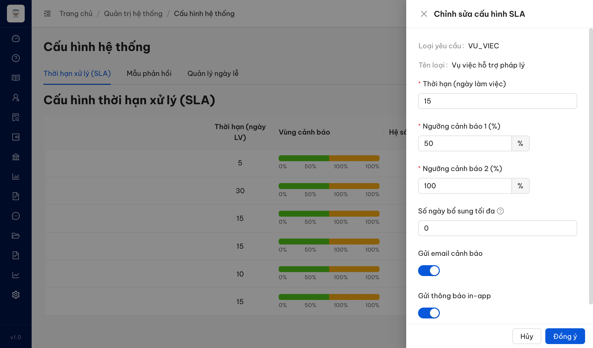
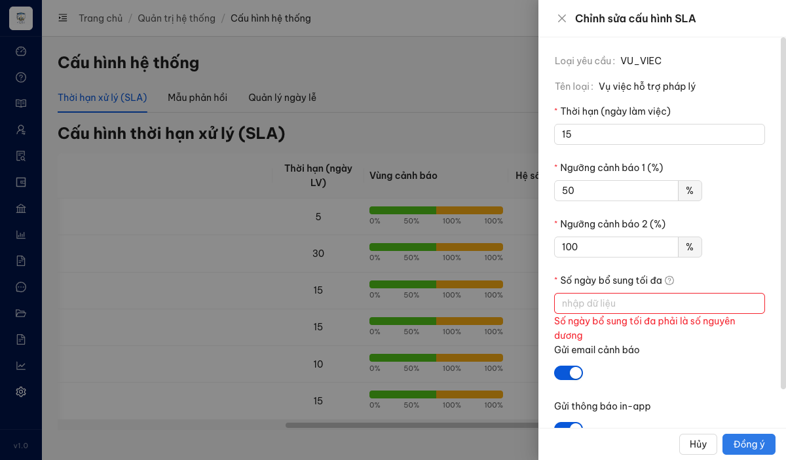

# Bug Report — QTHT Batch 7 (Cấu hình hệ thống / SLA — SCR-VIII-06)

| Thông tin | Giá trị |
|-----------|---------|
| **Dự án** | PM HTPLDN |
| **Môi trường** | https://18.143.165.120.nip.io/quan-tri/cau-hinh |
| **Người test** | QA Automation (Chrome DevTools MCP) |
| **Ngày** | 2026-07-23 14:35:00 |
| **Loại test** | UAT re-verify (bug đối tác vòng đầu) |
| **Round** | reverify-week-3 |
| **Tài liệu tham chiếu** | `input/srs-update-2026-5-5/srs-fr-10-quan-tri.md` (FR-VIII-10, SCR-VIII-06) |

---

## Tổng hợp

> **Re-verify reverify-week-3 (2026-07-23 14:35):** ✅ **PASS (Closed).** Dev đã đánh dấu bắt buộc trường `Số ngày bổ sung tối đa` (label có class `ant-form-item-required` / dấu *) và chặn ≤0 với loại ≠ HOI_DAP: gõ `0` bị kẹp về min 1 (nút Giảm disabled tại 1), để trống → chặn submit với lỗi inline "Số ngày bổ sung tối đa phải là số nguyên dương" (0 request PATCH, 0 toast thành công, modal giữ nguyên); giá trị hợp lệ (5) lưu OK. `Hệ số quá hạn` đã bỏ khỏi form. Open: 0.

Phát hiện **1** lỗi có SRS reference cụ thể trong form "Chỉnh sửa cấu hình SLA" (case QLCHTHXLHS_07). Lỗi gồm 2 điểm con: form thừa trường `Hệ số quá hạn` (SRS chốt phải ẩn) + thiếu trường `Số ngày bổ sung tối đa` (SRS bắt buộc).

> 4 case còn lại của batch 7 (152/153/154/155) là bất đồng ĐẶC TẢ (spec churn màn SCR-VIII-06) → verdict `BA confirm`, ghi ở `../../ba-confirm/qtht/ba-confirmation-needed-qtht-batch7.md`.

### Severity breakdown

| Tổng | Critical | Major | Medium | Minor | Trivial | Closed | Open |
|------|----------|-------|--------|-------|---------|--------|------|
| 1    | 0        | 1     | 0      | 0     | 0       | 1      | 0    |

## Bug Summary Table

| Bug ID | Severity | Priority | Type | TC Ref | **SRS Reference** | Title | Status |
|--------|----------|----------|------|--------|-------------------|-------|--------|
| BUG-QLCHTHXLHS_07 | Major | P1 | UI/UX | QLCHTHXLHS_07 (row 156) | `FR-VIII-10 Inputs #10 (dòng 474)` · `SCR-VIII-06 11a (dòng 1756)` · `AC E4 (dòng 512)` · `FR-VIII-10 Inputs #7 (dòng 471)` · `SCR-VIII-06 note (dòng 1759)` | Form sửa cấu hình SLA: trường "Số ngày bổ sung tối đa" chưa bắt buộc / chưa chặn ≤0 (reverify) | ~~Closed~~ |

---

## ~~BUG-QLCHTHXLHS_07~~ [CLOSED] — Form "Chỉnh sửa cấu hình SLA" thiếu trường "Số ngày bổ sung tối đa" + thừa trường "Hệ số quá hạn"

> **Re-test:** 2026-07-23 14:35:00 reverify-week-3 — ✅ **PASS (Closed-verified).** Trường "Số ngày bổ sung tối đa" nay đánh dấu bắt buộc (label `ant-form-item-required`) và chặn ≤0 với loại ≠ HOI_DAP (VU_VIEC): gõ `0`+Tab bị kẹp về min 1 (nút Giảm disabled tại 1), để trống → submit bị chặn với lỗi inline "Số ngày bổ sung tối đa phải là số nguyên dương" (0 PATCH, 0 toast thành công, modal giữ nguyên); giá trị hợp lệ (5) lưu OK, `Hệ số quá hạn` đã bỏ khỏi form. Cả 2 điểm reopen (bắt buộc + chặn ≤0) đều đã fix.

### Mô tả

Trong form (drawer) "Chỉnh sửa cấu hình SLA" mở từ nút "Sửa" của một dòng loại yêu cầu ≠ HOI_DAP (verify với VU_VIEC), hệ thống **thiếu trường bắt buộc "Số ngày bổ sung tối đa"** (SRS yêu cầu cho loại ≠ HOI_DAP) và **thừa trường "Hệ số quá hạn"** (SRS chốt trường này là ngầm, KHÔNG hiển thị UI). QTHT do đó không cấu hình được số ngày bổ sung, và lại chỉnh được một hệ số lẽ ra chỉ sửa qua DB/API.

### Các bước tái hiện

1. Đăng nhập role `admin` (vai trò QTHT — Tab 1 SLA chỉ QTHT truy cập theo SCR-VIII-06 dòng 1731).
2. Vào **Quản trị hệ thống → Cấu hình hệ thống** (`/quan-tri/cau-hinh`) → Tab "Thời hạn xử lý (SLA)".
3. Bấm nút "Sửa" ở dòng **VU_VIEC** (Vụ việc hỗ trợ pháp lý) — loại yêu cầu ≠ HOI_DAP.
4. Quan sát các trường trong form "Chỉnh sửa cấu hình SLA".

### Kết quả mong đợi

- Form phải có trường **"Số ngày bổ sung tối đa"** (bắt buộc, > 0, default 5) cho loại yêu cầu ≠ HOI_DAP — theo FR-VIII-10 Inputs #10 (dòng 474, BA chốt 2026-05-13), SCR-VIII-06 thành phần 11a (dòng 1756) và Acceptance Criteria (dòng 515).
- Form **KHÔNG** hiển thị trường **"Hệ số quá hạn"** — theo FR-VIII-10 Inputs #7 (dòng 471: "không hiển thị UI, dùng nội bộ") và SCR-VIII-06 note (dòng 1759: "ngầm, không UI ... Sửa qua DB hoặc API", BA chốt 2026-05-07 Q5).

### Kết quả thực tế

**Round 1 (2026-07-21):** Form thiếu "Số ngày bổ sung tối đa" + thừa "Hệ số quá hạn" (editable, = 2.0).

**Re-verify reverify-week-3 (2026-07-22):**
- ✅ Form nay CÓ trường "Số ngày bổ sung tối đa" và ĐÃ BỎ "Hệ số quá hạn" khỏi form. Đặt giá trị hợp lệ (5) → lưu thành công (BE nhận `soNgayBoSungToiDa`, KHÔNG còn gửi `quaHanHeSo`).
- ❌ Trường "Số ngày bổ sung tối đa" **chưa bắt buộc và chưa chặn giá trị ≤0** với loại ≠ HOI_DAP:
  - Sửa VU_VIEC nhập **0** → toast "Cập nhật cấu hình SLA thành công", BE lưu `soNgayBoSungToiDa:0`.
  - Sửa VU_VIEC **để trống** → cũng lưu thành công.
  - Không case nào hiển thị lỗi ERR-SLA-04 "Số ngày bổ sung tối đa phải là số nguyên dương".
- Ghi chú: bảng SLA (list) vẫn còn cột "Hệ số quá hạn" hiển thị; bug này scope theo form nên chỉ nêu để tham khảo.

**Re-verify #2 reverify-week-3 (2026-07-23) — ✅ PASS:**
- ✅ Trường "Số ngày bổ sung tối đa" (id `soNgayBoSungToiDa`) nay có class `ant-form-item-required` (đánh dấu bắt buộc, dấu *).
- ✅ Chặn ≤0: gõ `0` + Tab → InputNumber kẹp về `1` (min=1, nút Giảm disabled tại 1); lưu API xác nhận `soNgayBoSungToiDa` không nhận 0.
- ✅ Để trống → bấm Đồng ý bị chặn: **0 request PATCH, 0 toast thành công**, modal giữ nguyên, lỗi inline "Số ngày bổ sung tối đa phải là số nguyên dương" (đúng ERR-SLA-04, SRS AC E4 dòng 512).
- ✅ Giá trị hợp lệ (5) lưu OK (đã khôi phục `soNgayBoSungToiDa=5` sau test). `Hệ số quá hạn` không còn trong form.

### Bằng chứng

**Round 1 (2026-07-21):**

**Re-verify reverify-week-3 (2026-07-22):**

**Re-verify #2 reverify-week-3 (2026-07-23) — PASS:**

---

## Phụ lục — Môi trường test

| Thành phần | Giá trị |
|------------|---------|
| URL ứng dụng | https://18.143.165.120.nip.io/quan-tri/cau-hinh |
| OTP login | MailHog `http://18.143.165.120:8025` |
| Tool test | Chrome DevTools MCP |
| Account verify | `admin` / QTHT |

---

*Bug report generated: 2026-07-21 07:55:50 | QA Automation via Claude Code*
