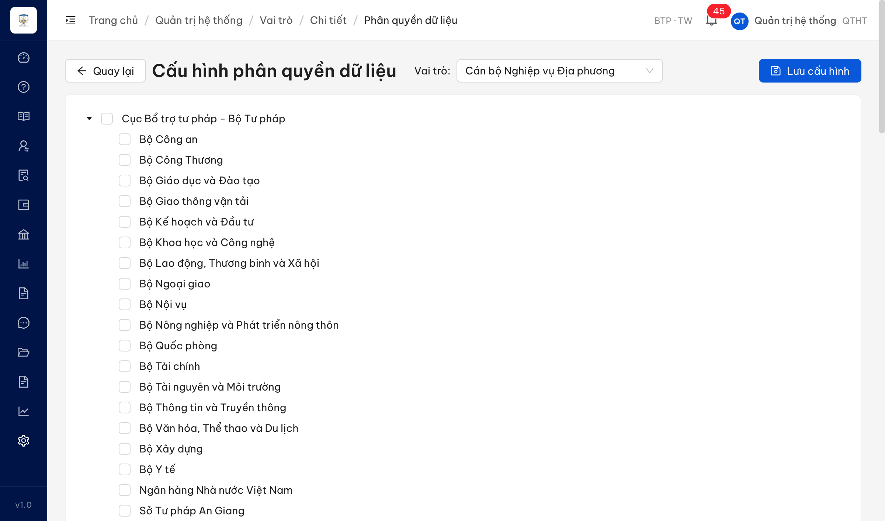
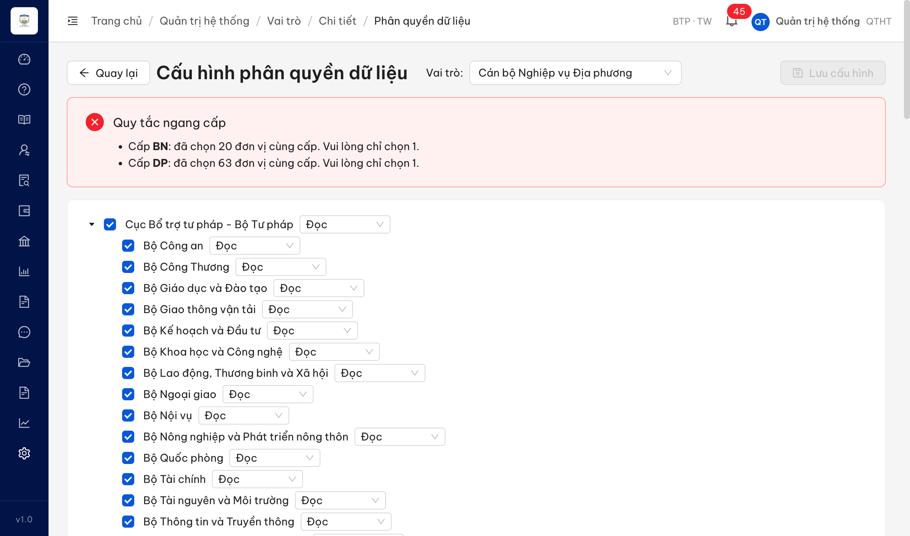

# Bug Report — Quản trị hệ thống · Batch 9 (Phân quyền dữ liệu + chức năng — SCR-VIII-04/05)

| Thông tin | Giá trị |
|-----------|---------|
| **Dự án** | PM HTPLDN — UAT đối tác tuần 3 (reverify week 3) |
| **Môi trường** | https://18.143.165.120.nip.io |
| **Người test** | QA Automation (Chrome DevTools MCP) |
| **Ngày** | 2026-07-23 05:07:33 |
| **Loại test** | Functional / Workflow (verify bug đối tác vòng 1) |
| **Round** | Reverify week 3 — Batch 9 |
| **Tài liệu tham chiếu** | `output/UAT_doi-tac/reverify-week-3/session-prompts/qtht/SESSION-qtht-batch9-prompt.md` · SRS `input/srs-update-2026-5-5/srs-fr-10-quan-tri.md` |

---

## Tổng hợp

> **Reverify tuần 3 R1 (2026-07-23):** 1/1 bug **PASS** — BUG-QLPQTCDL_06 Closed. Tick nút cha nay cascade đủ 84 nút con, bỏ tick cha thì con tự bỏ. **Open 0 / Closed 1.**

Verify 3 case Batch 9 (rows 172–174). Ghi vào file này các case verdict có SRS reference cụ thể. Case `BA confirm`/`Reject` không vào bug-report — lưu ở `../../ba-confirm/qtht/ba-confirmation-needed-qtht-batch9.md` + `reverify-audit/`.

### Severity breakdown

| Tổng | Critical | Major | Medium | Minor | Trivial | Closed | Open |
|------|----------|-------|--------|-------|---------|--------|------|
| 1    | 0        | 1     | 0      | 0     | 0       | 1      | 0    |

## Bug Summary Table

| Bug ID | Severity | Priority | Type | TC Ref | **SRS Reference** | Title | Status |
|--------|----------|----------|------|--------|-------------------|-------|--------|
| ~~BUG-QLPQTCDL_06~~ | Major | P1 | Workflow | QLPQTCDL_06 (row 172) | `SCR-VIII-05 §Thành phần màn hình dòng 1715` (FR-VIII-16 / UC114) | Tick checkbox nút cha trên cây đơn vị (Phân quyền dữ liệu) không tự tick nút con | Closed |

---

## ~~BUG-QLPQTCDL_06~~ [CLOSED] — Tick nút cha trên cây đơn vị (Phân quyền dữ liệu) không cascade xuống nút con

> **Re-test:** 2026-07-23 05:07:33 R1 — ✅ **PASS** (Closed-verified). Chạy lại luồng QTHT → Vai trò *Cán bộ Nghiệp vụ Địa phương* → **Phân quyền dữ liệu**: tick nút cha "Cục Bổ trợ tư pháp - Bộ Tư pháp" nay tự tick **toàn bộ 84 nút con** ("Đã chọn 84 đơn vị"); bỏ tick cha thì con tự bỏ tick ("Đã chọn 0 đơn vị"). Cascade 2 chiều hoạt động đúng SRS SCR-VIII-05 dòng 1715.

### Mô tả

Tại màn "Cấu hình phân quyền dữ liệu" (Quản trị hệ thống → Vai trò → Chi tiết → Phân quyền dữ liệu), cây đơn vị có root "Cục Bổ trợ tư pháp - Bộ Tư pháp" (cấp TW) là nút cha của 84 nút con (18 Bộ + 63 Sở Tư pháp + Thanh tra Chính phủ + Ủy ban Dân tộc). Khi QTHT tick checkbox **nút cha**, hệ thống **không tự tick toàn bộ nút con**. SRS SCR-VIII-05 §Thành phần màn hình (dòng 1715) yêu cầu "check cha (TW) → auto check con (BN và ĐP)".

### Các bước tái hiện

1. Đăng nhập role **QTHT** (`admin`, quyền cấu hình phân quyền dữ liệu — chỉ QTHT truy cập theo FR-VIII-16 Preconditions dòng 761).
2. Vào **Quản trị hệ thống → Vai trò**, chọn 1 vai trò (đã test với "Cán bộ Nghiệp vụ Địa phương", roleId `aaaaaaaa-0000-4000-8000-000000000010`), bấm icon **database** → mở "Cấu hình phân quyền dữ liệu".
3. Baseline: 84 checkbox đơn vị đều **chưa tick** (`checked=0, indeterminate=0`).
4. Tick checkbox **nút cha** "Cục Bổ trợ tư pháp - Bộ Tư pháp".
5. Quan sát: chỉ nút cha được tick (`checked=1`), mọi nút con vẫn trống; "Đã chọn (1 đơn vị)".

### Kết quả mong đợi

- Theo SRS SCR-VIII-05 §Thành phần màn hình dòng 1715: khi tick nút cha (cấp TW), hệ thống **tự động tick toàn bộ nút con** (cấp BN và ĐP). Bỏ tick cha → con tự bỏ tick theo.

### Kết quả thực tế

- Tick nút cha "Cục Bổ trợ tư pháp - Bộ Tư pháp" → chỉ nút cha được tick, **0 nút con** được tick. Đo trực tiếp DOM: `rootChecked=true, checked=1, indeterminate=0`; các con mẫu (Bộ Công an, Bộ Y tế, Sở Tư pháp An Giang, Sở Tư pháp Hà Nội) đều `unchecked`. Bảng "Đã chọn" chỉ hiện "1 đơn vị".
- Không cascade → mỗi nút con phải tick thủ công, trái với hành vi cây multi-select 2-tier trong SRS.

### Bằng chứng

**1. Ảnh chụp:**


**2. Đo trạng thái checkbox (evaluate_script):**

```json
{ "trước": { "total": 84, "checked": 0, "indeterminate": 0 },
  "sau_tick_nút_cha": { "rootChecked": true, "checked": 1, "indeterminate": 0,
    "đã_chọn": "1 đơn vị",
    "childSample": { "Bộ Công an": false, "Bộ Y tế": false, "Sở Tư pháp An Giang": false, "Sở Tư pháp Hà Nội": false } } }
```

**3. Bằng chứng re-test 2026-07-23 (đã fix):**




```json
{ "sau_fix_tick_nút_cha": { "total": 85, "checked": 84, "indeterminate": 0, "rootChecked": true,
    "uncheckedChildren": 0, "đã_chọn": "84 đơn vị" },
  "sau_fix_bỏ_tick_nút_cha": { "checked": 0, "indeterminate": 0, "rootChecked": false, "đã_chọn": "0 đơn vị" } }
```

---

## Phụ lục — Môi trường test

| Thành phần | Giá trị |
|------------|---------|
| URL ứng dụng | https://18.143.165.120.nip.io |
| OTP login | MailHog (`http://18.143.165.120:8025`) |
| Tool test | Chrome DevTools MCP |
| Xác thực | JWT + OTP |
| Frontend | React + Ant Design (cây `.ant-tree` checkable) |

---

*Bug report generated: 2026-07-21 10:12:54 | QA Automation via Claude Code*
