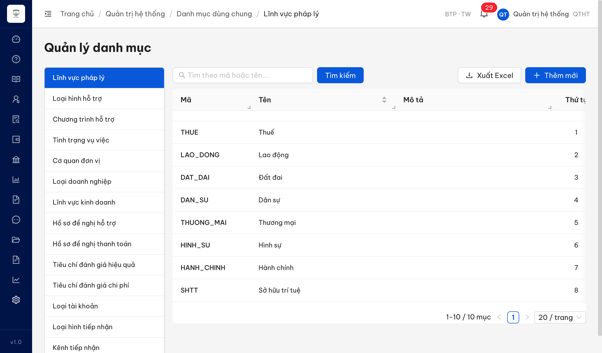
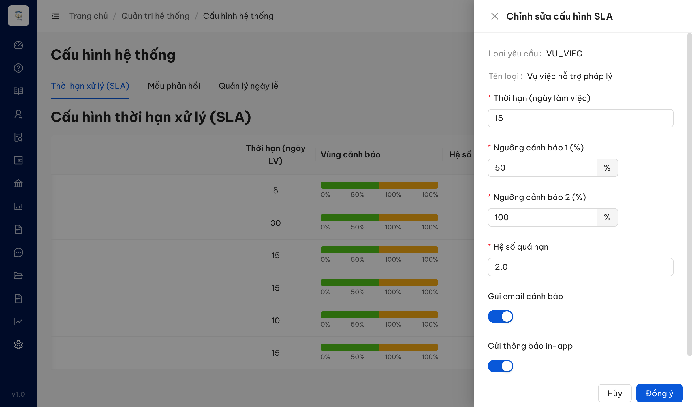
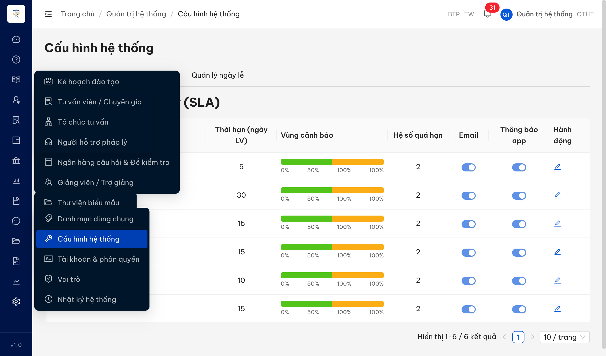
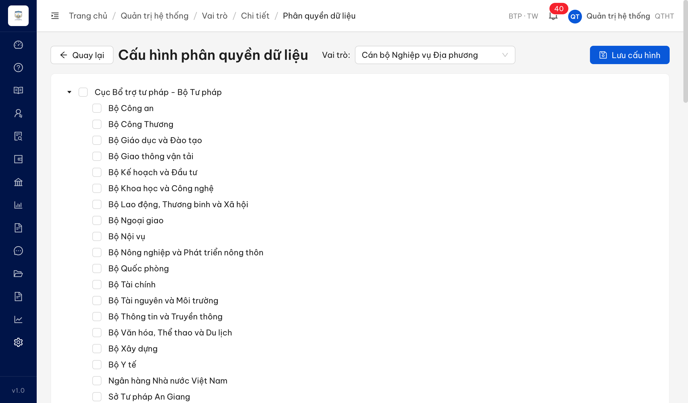
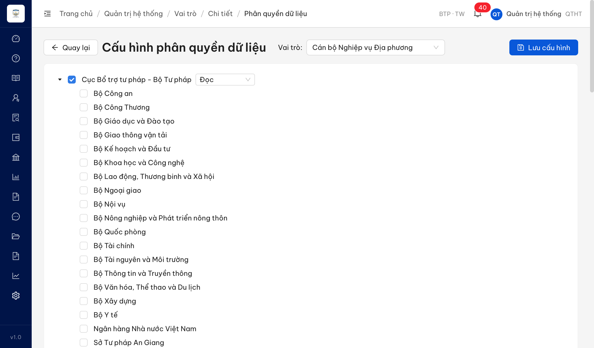

# Bug Report — Quản trị hệ thống

| Thông tin | Giá trị |
|-----------|---------|
| **Dự án** | PM HTPLDN — Trợ giúp pháp lý Doanh nghiệp |
| **Môi trường** | https://18.143.165.120.nip.io |
| **Người test** | QA Automation (Chrome DevTools MCP) |
| **Ngày** | 2026-07-21 |
| **Loại test** | UAT re-verify — Functional / UI / Workflow |
| **Round** | Reverify week 3 |
| **Tài liệu tham chiếu** | `input/srs-update-2026-5-5/srs-fr-10-quan-tri.md` |

---

## Tổng hợp

Phát hiện **6** lỗi có SRS reference cụ thể trong phân hệ Quản trị hệ thống.

> **Snapshot LATEST (2026-08-03):** **6 tổng · 5 Closed · 1 Reopen** (BUG-QLTKND_03 mở lại 2026-08-03 — còn sai bảng màu badge cột Trạng thái). Bằng chứng reverify PASS nằm ở [`Pass-bug-report-qtht-batch5.md`](Pass-bug-report-qtht-batch5.md) (QLDMLVPL_02) · [`batch7`](Pass-bug-report-qtht-batch7.md) (QLCHTHXLHS_07) · [`batch8`](bug-report-qtht-batch8.md) (QLTKND_02/03/15) · [`batch9`](Pass-bug-report-qtht-batch9.md) (QLPQTCDL_06).

### Severity breakdown

| Tổng | Critical | Major | Medium | Minor | Trivial | Closed | Open |
|------|----------|-------|--------|-------|---------|--------|------|
| 6    | 0        | 2     | 4      | 0     | 0       | 5      | 1    |

## Bug Summary Table

| Bug ID | Severity | Priority | Type | TC Ref | **SRS Reference** | Title | Status |
|--------|----------|----------|------|--------|-------------------|-------|--------|
| ~~BUG-QLDMLVPL_02~~ | Medium | P2 | UI/UX | QLDMLVPL_02 (row 122) | `SCR-VIII-01 §Thành phần row 2 (dòng 1569)` · `FR-VIII-30 (dòng 1477-1505)` | Màn Quản lý danh mục thiếu tab "Tỉnh/Thành phố" (hiện 14/15 tab) | **Closed** |
| BUG-QLCHTHXLHS_07 | Major | P1 | UI/UX | QLCHTHXLHS_07 (row 156) | `FR-VIII-10 Inputs #10 (dòng 474)` · `SCR-VIII-06 11a (dòng 1756)` · `AC (dòng 515)` · `FR-VIII-10 Inputs #7 (dòng 471)` · `SCR-VIII-06 note (dòng 1759)` | Form sửa cấu hình SLA thiếu "Số ngày bổ sung tối đa" + thừa "Hệ số quá hạn" (đã fix — reverify 2026-07-23) | ~~Closed~~ |
| ~~BUG-QLTKND_02~~ | Medium | P2 | UI/UX | QLTKND_02 (row 165) | `SCR-VIII-03 Thành phần row 5–6 (dòng 1649–1650)` · `SM-TAIKHOAN (dòng 2030)` | Bộ lọc: Đơn vị phẳng (không cây) · Trạng thái thiếu "Tất cả" · dư state "Chờ phân quyền" | **Closed** |
| BUG-QLTKND_03 | Medium | P2 | UI/UX | QLTKND_03 (row 166) | `SCR-VIII-03 Thành phần row 8 (dòng 1652)` · `BA 2026-05-07 Q3` | Thanh thẻ tab trạng thái có 6 thẻ (đặc tả 4), dư thẻ "Chờ phân quyền" (state đã bỏ) — thẻ đã đúng 4, còn sai bảng màu badge cột Trạng thái | **Reopen** |
| ~~BUG-QLTKND_15~~ | Medium | P2 | UI/UX | QLTKND_15 (row 168) | `FR-VIII-15 §Error Handling E1 ERR-TK-01 (dòng 727)` | Thêm TK trùng tên đăng nhập → 1 request nhưng hiện 2 thông báo lỗi | **Closed** |
| ~~BUG-QLPQTCDL_06~~ | Major | P1 | Workflow | QLPQTCDL_06 (row 172) | `SCR-VIII-05 §Thành phần màn hình dòng 1715` (FR-VIII-16 / UC114) | Tick checkbox nút cha trên cây đơn vị (Phân quyền dữ liệu) không tự tick nút con | **Closed** |

---

## ~~BUG-QLDMLVPL_02~~ [CLOSED] — Màn Quản lý danh mục thiếu tab "Tỉnh/Thành phố" (14/15 tab)

> **Re-test:** 2026-07-23 00:08:46 R1 (reverify tuần 3) — ✅ PASS (Closed-verified). Sidebar Quản lý danh mục nay đủ **15 tab**, có "Tỉnh/Thành phố" (vị trí 7). Click tab điều hướng `/quan-tri/danh-muc/TINH_THANH`, BE `GET /api/v1/danh-muc?loaiDanhMuc=TINH_THANH` trả **200 với 63 tỉnh**, đủ UI CRUD (Thêm mới / Sửa / Xóa / Xuất Excel / phân trang 63 mục). Khớp đúng KQ mong đợi FR-VIII-30. *(nguồn: `Pass-bug-report-qtht-batch5.md`)*


### Mô tả

QTHT vào **Quản trị hệ thống → Danh mục dùng chung**, cột tab dọc bên trái chỉ hiển thị **14 loại danh mục**, thiếu tab **"Tỉnh/Thành phố"** (FR-VIII-30). Theo SRS SCR-VIII-01 §Thành phần màn hình (dòng 1569), sidebar phải có đủ **15 tab** gồm cả "Tỉnh/Thành phố" và "Lĩnh vực kinh doanh". App có "Lĩnh vực kinh doanh" nhưng thiếu "Tỉnh/Thành phố".

### Các bước tái hiện

1. Đăng nhập role **QTHT** (`admin` — quyền quản trị toàn bộ danh mục theo SCR-VIII-01 precondition dòng 72).
2. Vào **Quản trị hệ thống → Danh mục dùng chung** (URL `/quan-tri/danh-muc/LINH_VUC_PL`).
3. Đếm/liệt kê các tab ở cột dọc bên trái.
4. Quan sát: chỉ có 14 tab (Lĩnh vực pháp lý, Loại hình hỗ trợ, Chương trình hỗ trợ, Tình trạng vụ việc, Cơ quan đơn vị, Loại doanh nghiệp, Lĩnh vực kinh doanh, Hồ sơ đề nghị hỗ trợ, Hồ sơ đề nghị thanh toán, Tiêu chí đánh giá hiệu quả, Tiêu chí đánh giá chi phí, Loại tài khoản, Loại hình tiếp nhận, Kênh tiếp nhận). **Không có** tab "Tỉnh/Thành phố".

### Kết quả mong đợi

- Theo SRS SCR-VIII-01 §Thành phần màn hình row 2 (dòng 1569): sidebar hiển thị **15 tab**, trong đó có **"Tỉnh/Thành phố" (FR-VIII-30)** và "Lĩnh vực kinh doanh" (FR-VIII-31).
- FR-VIII-30 (dòng 1477-1505): danh mục Tỉnh/Thành phố là tab của SCR-VIII-01, seed sẵn 63 tỉnh, có UI CRUD cho QTHT.
- Tab đang chọn được tô màu nổi bật (phần này app đã đạt).

### Kết quả thực tế

- Sidebar chỉ có **14 tab**, thiếu tab **"Tỉnh/Thành phố"**.
- Kiểm tra DOM (`evaluate_script`): `body.innerText` không chứa chuỗi "Tỉnh/Thành phố" ở bất kỳ đâu trong màn → tab hoàn toàn không được render (không phải bị cuộn ẩn).
- Tab "Lĩnh vực kinh doanh" (FR-VIII-31) CÓ hiển thị → chỉ riêng "Tỉnh/Thành phố" bị thiếu.
- Tab đang chọn ("Lĩnh vực pháp lý") được tô nền xanh nổi bật đúng thiết kế.

### Bằng chứng

**1. Ảnh chụp** *(sidebar 14 tab, không có "Tỉnh/Thành phố")*:



**2. Kết quả liệt kê tab qua DOM (`evaluate_script`):**

```json
{
  "tabs_found": ["Lĩnh vực pháp lý","Loại hình hỗ trợ","Chương trình hỗ trợ","Tình trạng vụ việc","Cơ quan đơn vị","Loại doanh nghiệp","Lĩnh vực kinh doanh","Hồ sơ đề nghị hỗ trợ","Hồ sơ đề nghị thanh toán","Tiêu chí đánh giá hiệu quả","Tiêu chí đánh giá chi phí","Loại tài khoản","Loại hình tiếp nhận","Kênh tiếp nhận"],
  "so_tab_found": 14,
  "body_co_Tinh_Thanh_pho": false,
  "body_co_Linh_vuc_kinh_doanh": true
}
```

---

## ~~BUG-QLCHTHXLHS_07~~ [CLOSED] — Form "Chỉnh sửa cấu hình SLA" thiếu trường "Số ngày bổ sung tối đa" + thừa trường "Hệ số quá hạn"

> **Re-test:** 2026-07-23 14:35:00 reverify-week-3 — ✅ **PASS (Closed).** Form đã thêm "Số ngày bổ sung tối đa" (đánh dấu bắt buộc, chặn ≤0: gõ 0 kẹp về 1, để trống báo lỗi inline "phải là số nguyên dương") + bỏ "Hệ số quá hạn". Chi tiết đo: `Pass-bug-report-qtht-batch7.md`.

### Mô tả

Trong form (drawer) "Chỉnh sửa cấu hình SLA" mở từ nút "Sửa" của một dòng loại yêu cầu ≠ HOI_DAP (verify với VU_VIEC), hệ thống **thiếu trường bắt buộc "Số ngày bổ sung tối đa"** (SRS yêu cầu cho loại ≠ HOI_DAP) và **thừa trường "Hệ số quá hạn"** (SRS chốt trường này là ngầm, KHÔNG hiển thị UI). QTHT do đó không cấu hình được số ngày bổ sung, và lại chỉnh được một hệ số lẽ ra chỉ sửa qua DB/API.

### Các bước tái hiện

1. Đăng nhập role `admin` (vai trò QTHT — Tab 1 SLA chỉ QTHT truy cập theo SCR-VIII-06 dòng 1731).
2. Vào **Quản trị hệ thống → Cấu hình hệ thống** (`/quan-tri/cau-hinh`) → Tab "Thời hạn xử lý (SLA)".
3. Bấm nút "Sửa" ở dòng **VU_VIEC** (Vụ việc hỗ trợ pháp lý) — loại yêu cầu ≠ HOI_DAP.
4. Quan sát các trường trong form "Chỉnh sửa cấu hình SLA".

### Kết quả mong đợi

- Form phải có trường **"Số ngày bổ sung tối đa"** (bắt buộc, > 0, default 5) cho loại yêu cầu ≠ HOI_DAP — theo FR-VIII-10 Inputs #10 (dòng 474, BA chốt 2026-05-13), SCR-VIII-06 thành phần 11a (dòng 1756) và Acceptance Criteria (dòng 515).
- Form **KHÔNG** hiển thị trường **"Hệ số quá hạn"** — theo FR-VIII-10 Inputs #7 (dòng 471: "không hiển thị UI, dùng nội bộ") và SCR-VIII-06 note (dòng 1759: "ngầm, không UI ... Sửa qua DB hoặc API", BA chốt 2026-05-07 Q5).

### Kết quả thực tế

- Form các trường: Loại yêu cầu (VU_VIEC) · Tên loại · Thời hạn (ngày làm việc)=15 · Ngưỡng cảnh báo 1 (%)=50 · Ngưỡng cảnh báo 2 (%)=100 · **Hệ số quá hạn=2.0** · Gửi email cảnh báo (toggle) · Gửi thông báo in-app (toggle) · [Hủy] [Đồng ý].
- **Thiếu** trường "Số ngày bổ sung tối đa" → QTHT không đặt được thời hạn DN gửi bổ sung.
- **Thừa** trường "Hệ số quá hạn" (editable) → hiển thị + cho sửa field mà SRS chốt phải ẩn.

### Bằng chứng





---

## ~~BUG-QLTKND_02~~ [CLOSED] — Bộ lọc màn Tài khoản: Đơn vị phẳng, Trạng thái thiếu "Tất cả" và dư state "Chờ phân quyền"

> **Re-test:** 2026-07-23 01:17:08 R1 — ✅ PASS (Closed-verified). Bộ lọc Đơn vị nay render dạng cây (AntD tree, node cha "Cục Bổ trợ tư pháp" có caret mở rộng, các Bộ thụt cấp); bộ lọc Trạng thái mặc định "Tất cả" và chỉ còn 4 trạng thái (Chờ kích hoạt / Hoạt động / Tạm khóa / Vô hiệu hóa) — đã bỏ "Chờ phân quyền". Cả 3 điểm khớp KQ mong đợi. *(nguồn: `bug-report-qtht-batch8.md`)*


### Mô tả

Trên màn **Quản lý tài khoản người dùng** (SCR-VIII-03, FR-VIII-15), QTHT mở thanh bộ lọc phía trên danh sách. Ba thành phần lọc sai so với đặc tả: (1) bộ lọc "Đơn vị" render **danh sách phẳng** (liệt kê các Bộ) thay vì **cây phân cấp**; (2) bộ lọc "Trạng thái" **không có lựa chọn "Tất cả"** và để **trống mặc định**; (3) bộ lọc "Trạng thái" có **5 giá trị**, dư trạng thái **"Chờ phân quyền"** (đã bị bỏ khỏi đặc tả).

### Các bước tái hiện

1. Đăng nhập `admin` (vai trò **QTHT**) → **Quản trị hệ thống → Tài khoản & phân quyền**.
2. Quan sát thanh bộ lọc: ô "Trạng thái" hiển thị placeholder "Trạng thái" (không có giá trị "Tất cả" mặc định).
3. Mở dropdown "Trạng thái" → đếm được 5 mục: Chờ kích hoạt / **Chờ phân quyền** / Hoạt động / Tạm khóa / Vô hiệu hóa (không có "Tất cả").
4. Mở dropdown "Đơn vị" → danh sách phẳng các Bộ (Bộ Công an, Bộ Công Thương, …), không có node cha/con, không mũi tên mở rộng, không thụt cấp.

### Kết quả mong đợi

- SCR-VIII-03 dòng 1649: bộ lọc Đơn vị = "select **(tree)** — cây đơn vị phân cấp".
- SCR-VIII-03 dòng 1650: bộ lọc Trạng thái = "**Tất cả** / CHO_KICH_HOAT / HOAT_DONG / TAM_KHOA / VO_HIEU_HOA" (có "Tất cả" + đúng **4** trạng thái).
- SM-TAIKHOAN (dòng 2030) + BA chốt 2026-05-07 Q3: chỉ còn **4** trạng thái, **đã bỏ CHO_PHAN_QUYEN**.

### Kết quả thực tế

- Bộ lọc Đơn vị hiển thị **phẳng** (không cây).
- Bộ lọc Trạng thái **không có "Tất cả"**, mặc định **rỗng**, và có **5** giá trị (dư "Chờ phân quyền").

### Bằng chứng

- `image/BUG-QLTKND_02-trangthai-5states.png` — dropdown Trạng thái 5 giá trị, không "Tất cả".
- `image/BUG-QLTKND_02-donvi-flat.png` — dropdown Đơn vị danh sách phẳng.
- Evidence đối tác: `partner-evidence/QLTKND_02.jpg`.

---

## BUG-QLTKND_03 [REOPEN] — Thanh thẻ tab trạng thái có 6 thẻ (đặc tả 4), dư thẻ "Chờ phân quyền"

> **Re-test:** 2026-08-03 18:27:00 R2 — ❌ REOPEN (fix một phần). **Đã hết lỗi gốc:** thanh thẻ nay đúng **4** thẻ — Tất cả 207 / Hoạt động 145 / Chờ kích hoạt 20 / Tạm khóa 2, không còn "Chờ phân quyền"; bấm từng thẻ lọc đúng (`admin` QTHT, build HTPLDN V1.0.4). Ý "thiếu thẻ Vô hiệu hóa" xác nhận **ngoài đặc tả** (`Docs-PM-HTPLDN/…/srs-fr-10-quan-tri.md:1713` chỉ liệt kê 4 thẻ; VO_HIEU_HOA lọc qua select `:1711` — chọn "Vô hiệu hóa" + bấm Tìm kiếm → 38 kết quả). **Còn lại:** ý "Chờ kích hoạt chưa có màu nhấn" **có cơ sở** — `srs-fr-10-quan-tri.md:1720` gán màu cho badge **cột Trạng thái** và 3/4 đang sai: CHO_KICH_HOAT xám `rgb(191,191,191)` (yêu cầu vàng) · TAM_KHOA hổ phách `rgb(212,136,6)` (yêu cầu đỏ) · VO_HIEU_HOA đỏ `rgb(245,34,45)` (yêu cầu đen); chỉ HOAT_DONG xanh `rgb(56,158,13)` đúng.


### Mô tả

Trên màn **Quản lý tài khoản người dùng** (SCR-VIII-03), thanh thẻ tab lọc theo trạng thái hiển thị **6 thẻ**: Tất cả / Hoạt động / Chờ kích hoạt / Tạm khóa / **Chờ phân quyền** / Vô hiệu hóa. Đặc tả chỉ quy định **4 thẻ**; thẻ "Chờ phân quyền" ứng với trạng thái đã bị bỏ.

### Các bước tái hiện

1. Đăng nhập `admin` (vai trò **QTHT**) → **Quản trị hệ thống → Tài khoản & phân quyền**.
2. Quan sát thanh thẻ tab ngay dưới tiêu đề "Tài khoản & phân quyền".
3. Đếm: Tất cả(27) / Hoạt động(19) / Chờ kích hoạt(4) / Tạm khóa / **Chờ phân quyền** / Vô hiệu hóa(4) = 6 thẻ.

### Kết quả mong đợi

- SCR-VIII-03 dòng 1652: Tab = "**Tất cả / Hoạt động / Chờ kích hoạt / Tạm khóa** (số đếm)" — đúng **4** thẻ.
- BA chốt 2026-05-07 Q3 + SM-TAIKHOAN (dòng 2030): đã bỏ trạng thái CHO_PHAN_QUYEN → không được có thẻ "Chờ phân quyền".

### Kết quả thực tế

- Thanh tab có **6** thẻ, trong đó **"Chờ phân quyền"** là trạng thái đã bỏ (không được xuất hiện) và **"Vô hiệu hóa"** không nằm trong danh sách tab của đặc tả.
- Ý phụ của đối tác "thẻ Chờ kích hoạt không có màu vàng": đặc tả không quy định màu cho **thẻ tab**, nhưng `srs-fr-10-quan-tri.md:1720` (SCR-VIII-03 item 15) quy định màu cho **badge cột Trạng thái**. Re-verify 2026-08-03 đo lại badge: 3/4 màu sai đặc tả (chi tiết ở dòng Re-test) → ý này **có cơ sở**, không còn xếp là "không tính là lỗi".

### Bằng chứng

- `image/BUG-QLTKND_03-tabs-6.png` — thanh 6 thẻ tab.
- `image/BUG-QLTKND_03-badge-mau.png` — re-verify 2026-08-03: 4 thẻ đúng, nhưng badge cột Trạng thái sai bảng màu.
- Evidence đối tác: `partner-evidence/QLTKND_03.jpg`.

---

## ~~BUG-QLTKND_15~~ [CLOSED] — Thêm tài khoản trùng tên đăng nhập: 1 request nhưng hiện 2 thông báo lỗi

> **Re-test:** 2026-07-23 01:22:04 R1 — ✅ PASS (Closed-verified). Chạy lại luồng Thêm mới với tên đăng nhập trùng `cbnv_tw` (đo bằng MutationObserver self-check observer=1, 2/2 lần): mỗi lần submit = 1 request `POST /api/v1/tai-khoan` → chỉ còn **1 khung thông báo** "Tên đăng nhập 'cbnv_tw' đã tồn tại". Không tạo bản ghi trùng. Khớp KQ mong đợi (ERR-TK-01: 1 thông báo). *(nguồn: `bug-report-qtht-batch8.md`)*


### Mô tả

Trên form **Thêm tài khoản mới** (SCR-VIII-03, FR-VIII-15), khi QTHT nhập **tên đăng nhập đã tồn tại** và bấm "Thêm mới", hệ thống gửi **1 request** (`POST /api/v1/tai-khoan`) nhưng hiển thị **2 thông báo lỗi** cùng lúc: "Username đã tồn tại trong hệ thống" và "Tên đăng nhập '{username}' đã tồn tại". Đặc tả chỉ yêu cầu 1 thông báo. Không tạo bản ghi trùng (chỉ 1 POST, hệ thống từ chối) → lỗi hiển thị FE.

### Các bước tái hiện

1. Đăng nhập `admin` (vai trò **QTHT**) → **Quản trị hệ thống → Tài khoản & phân quyền → Thêm mới**.
2. Nhập Tên đăng nhập = `cbnv_tw` (đã tồn tại), Họ tên bất kỳ, Email mới hợp lệ, chọn Loại TK / Đơn vị / Vai trò.
3. Bấm "Thêm mới".
4. Đo bằng `tools/toast-capture.js` (observer=1 đã self-check): 1 request `POST /api/v1/tai-khoan` → **2 khung thông báo** (2 chữ khác nhau); toast z-index 2010 > modal 1000 (nổi trên modal). Tái hiện ≥5/5 lần.

### Kết quả mong đợi

- FR-VIII-15 §Error Handling E1 (`ERR-TK-01`, dòng 727): username trùng → **1** thông báo "Username '{username}' đã tồn tại".

### Kết quả thực tế

- 1 lần submit → **2** thông báo lỗi cho cùng 1 lần vi phạm.

### Bằng chứng

- `../../reverify-audit/QLTKND_15/toast-capture-measurement.md` — log đo (JSON: 1 request → 2 toast, z-index, self-check observer=1).
- `image/BUG-QLTKND_15-dup-username-toast.png` — form nhập username trùng `cbnv_tw` (toast tự tắt ~3s, khung chụp lỡ nhịp; toast xác nhận qua observer + evidence đối tác).
- Evidence đối tác: `partner-evidence/QLTKND_15.jpg` (hiện đúng 2 toast).

---

## ~~BUG-QLPQTCDL_06~~ [CLOSED] — Tick nút cha trên cây đơn vị (Phân quyền dữ liệu) không cascade xuống nút con

> **Re-test:** 2026-07-23 05:07:33 R1 — ✅ **PASS** (Closed-verified). Chạy lại luồng QTHT → Vai trò *Cán bộ Nghiệp vụ Địa phương* → **Phân quyền dữ liệu**: tick nút cha "Cục Bổ trợ tư pháp - Bộ Tư pháp" nay tự tick **toàn bộ 84 nút con** ("Đã chọn 84 đơn vị"); bỏ tick cha thì con tự bỏ tick ("Đã chọn 0 đơn vị"). Cascade 2 chiều hoạt động đúng SRS SCR-VIII-05 dòng 1715. *(nguồn: `Pass-bug-report-qtht-batch9.md`)*


### Mô tả

Tại màn "Cấu hình phân quyền dữ liệu" (Quản trị hệ thống → Vai trò → Chi tiết → Phân quyền dữ liệu), cây đơn vị có root "Cục Bổ trợ tư pháp - Bộ Tư pháp" (cấp TW) là nút cha của 84 nút con (18 Bộ + 63 Sở Tư pháp + Thanh tra Chính phủ + Ủy ban Dân tộc). Khi QTHT tick checkbox **nút cha**, hệ thống **không tự tick toàn bộ nút con**. SRS SCR-VIII-05 §Thành phần màn hình (dòng 1715) yêu cầu "check cha (TW) → auto check con (BN và ĐP)".

### Các bước tái hiện

1. Đăng nhập role **QTHT** (`admin`, quyền cấu hình phân quyền dữ liệu — chỉ QTHT truy cập theo FR-VIII-16 Preconditions dòng 761).
2. Vào **Quản trị hệ thống → Vai trò**, chọn 1 vai trò (đã test với "Cán bộ Nghiệp vụ Địa phương", roleId `aaaaaaaa-0000-4000-8000-000000000010`), bấm icon **database** → mở "Cấu hình phân quyền dữ liệu".
3. Baseline: 84 checkbox đơn vị đều **chưa tick** (`checked=0, indeterminate=0`).
4. Tick checkbox **nút cha** "Cục Bổ trợ tư pháp - Bộ Tư pháp".
5. Quan sát: chỉ nút cha được tick (`checked=1`), mọi nút con vẫn trống; "Đã chọn (1 đơn vị)".

### Kết quả mong đợi

- Theo SRS SCR-VIII-05 §Thành phần màn hình dòng 1715: khi tick nút cha (cấp TW), hệ thống **tự động tick toàn bộ nút con** (cấp BN và ĐP). Bỏ tick cha → con tự bỏ tick theo.

### Kết quả thực tế

- Tick nút cha "Cục Bổ trợ tư pháp - Bộ Tư pháp" → chỉ nút cha được tick, **0 nút con** được tick. Đo trực tiếp DOM: `rootChecked=true, checked=1, indeterminate=0`; các con mẫu (Bộ Công an, Bộ Y tế, Sở Tư pháp An Giang, Sở Tư pháp Hà Nội) đều `unchecked`. Bảng "Đã chọn" chỉ hiện "1 đơn vị".
- Không cascade → mỗi nút con phải tick thủ công, trái với hành vi cây multi-select 2-tier trong SRS.

### Bằng chứng

**1. Ảnh chụp:**




**2. Đo trạng thái checkbox (evaluate_script):**

```json
{ "trước": { "total": 84, "checked": 0, "indeterminate": 0 },
  "sau_tick_nút_cha": { "rootChecked": true, "checked": 1, "indeterminate": 0,
    "đã_chọn": "1 đơn vị",
    "childSample": { "Bộ Công an": false, "Bộ Y tế": false, "Sở Tư pháp An Giang": false, "Sở Tư pháp Hà Nội": false } } }
```

---

## Phụ lục — Môi trường test

| Thành phần | Giá trị |
|------------|---------|
| URL ứng dụng | https://18.143.165.120.nip.io |
| OTP login | MailHog `http://18.143.165.120:8025/` |
| Tài khoản | `admin` / `Secret@123` (QTHT) |
| Tool test | Chrome DevTools MCP |

---

*Bug report generated: 2026-07-21 | QA Automation*
