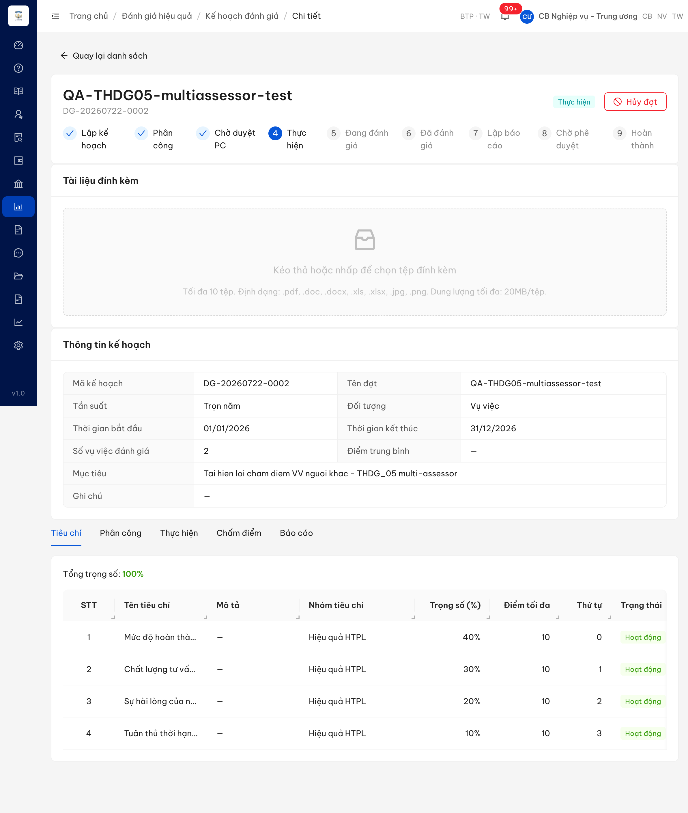
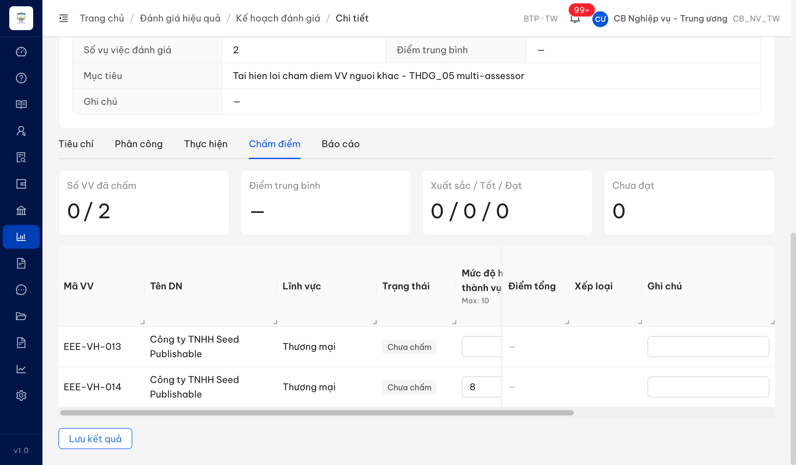
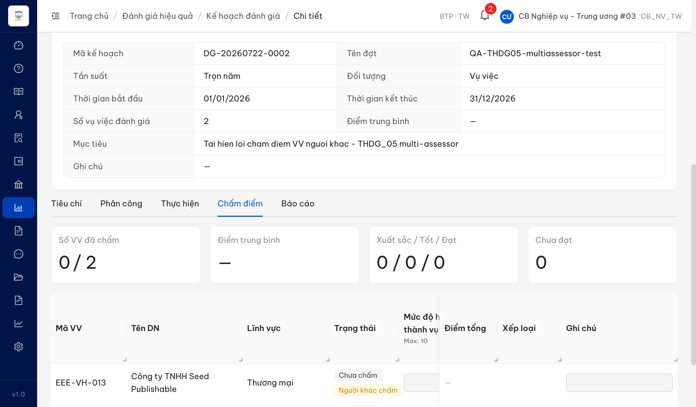
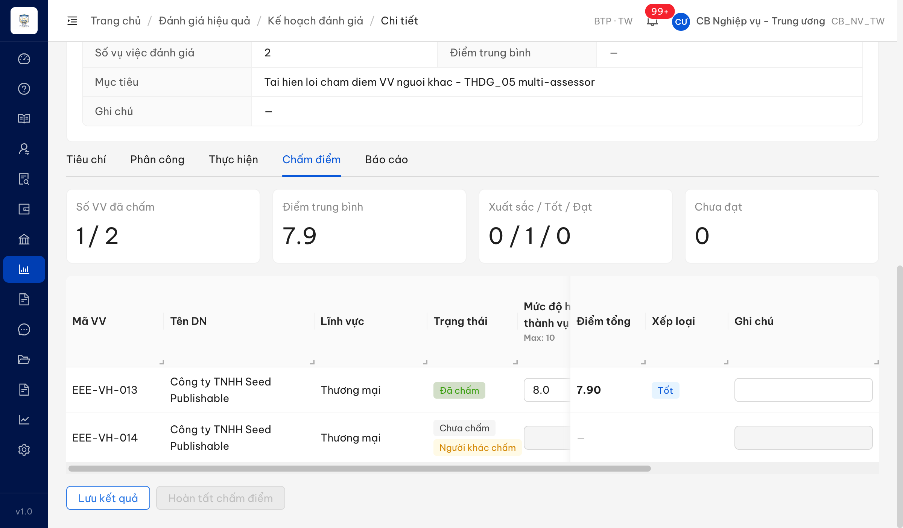

# Bug Report — Đánh giá hiệu quả (Chấm điểm đợt nhiều người đánh giá)

| Thông tin | Giá trị |
|-----------|---------|
| **Dự án** | UAT TGPL Doanh nghiệp — tuần 3 |
| **Môi trường** | https://18.143.165.120.nip.io |
| **Người test** | QA Automation (Chrome DevTools MCP) |
| **Ngày** | 2026-07-22 18:52:40 |
| **Loại test** | Re-verify (phúc tra bug đối tác) |
| **Round** | Reverify tuần 3 |
| **Tài liệu tham chiếu** | `srs-v3.5/srs-fr-08-danh-gia.md` (FR-VI-06 / UC88) |

---

## Tổng hợp

> **Re-test 2026-07-22 (Reverify tuần 3) — ✅ PASS · Đóng 1/1 (Open 0 · Closed 1).** Dev đã fix: Tab Chấm điểm nay **khoá ô nhập + gắn nhãn "Người khác chấm"** cho vụ việc phân cho người đánh giá khác; khi lưu, payload chỉ gồm vụ việc của người đăng nhập → không còn thông báo 422 sai bản chất. Kiểm bằng đợt gốc `DG-20260722-0002` (login `cbnv_tw` được phân `EEE-VH-013`, đối chứng `cbnv_tw_03`).

Phát hiện **1** lỗi có SRS reference cụ thể trong quá trình phúc tra testcase `THDG_05` (row 72) — Thực hiện chấm điểm đánh giá ở đợt có **nhiều người đánh giá**.

### Severity breakdown

| Tổng | Critical | Major | Medium | Minor | Trivial | Closed | Open |
|------|----------|-------|--------|-------|---------|--------|------|
| 1    | 0        | 1     | 0      | 0     | 0       | 1      | 0    |

## Bug Summary Table

| Bug ID | Severity | Priority | Type | TC Ref | **SRS Reference** | Title | Status |
|--------|----------|----------|------|--------|-------------------|-------|--------|
| BUG-THDG_05 | Major | P1 | UI/UX | THDG_05 | `FR-VI-06 (UC88) §Preconditions dòng 471` · `§Processing Bước 2 (BR-AUTH-01) dòng 488` · `§Error Handling dòng 517-520` | Màn Chấm điểm cho nhập điểm vụ việc đã phân cho người đánh giá khác rồi báo lỗi sai bản chất | Closed |

---

## ~~BUG-THDG_05~~ [CLOSED] — Màn Chấm điểm cho nhập điểm vụ việc đã phân cho người đánh giá khác, khi lưu báo lỗi sai bản chất

> **Re-test:** 2026-07-22 18:52:40 (Reverify tuần 3) — ✅ PASS (Closed-verified). Đợt gốc `DG-20260722-0002`, login `cbnv_tw` (người được phân `EEE-VH-013`) + đối chứng non-assignee `cbnv_tw_03`. Tab Chấm điểm nay **khoá toàn bộ ô nhập điểm + gắn nhãn "Người khác chấm"** cho vụ việc phân cho người đánh giá khác (`EEE-VH-014`); vụ việc của mình (`EEE-VH-013`) nhập được → lưu `PUT .../ket-quas` trả **200**, payload **chỉ gồm `...013`** (loại bỏ `...014`) → không còn thông báo 422 "không có kết quả đánh giá trong kế hoạch này".

### Mô tả

Trong đợt đánh giá có **nhiều người đánh giá** (mỗi vụ việc được phân cho một người chấm), Tab **Chấm điểm** hiển thị **tất cả vụ việc của đợt** cho người đang đăng nhập — **kể cả vụ việc đã phân cho người đánh giá khác** — và mở ô nhập điểm y hệt vụ việc của chính mình (không phân biệt, không khoá, không đánh dấu người phụ trách). Khi người dùng nhập điểm cho vụ việc **không thuộc phân công của mình** và bấm **"Lưu kết quả"**, hệ thống trả lỗi **HTTP 422** với thông báo *"Vụ việc '…' không có kết quả đánh giá trong kế hoạch này"*. Thông báo này **sai bản chất**: vụ việc VẪN thuộc kế hoạch, chỉ là được phân cho người đánh giá khác nên không có bản ghi kết quả gắn với người đang đăng nhập.

### Các bước tái hiện

1. Đăng nhập role **`cbnv_tw` (CB Nghiệp vụ - Trung ương / CB_NV_TW)** — role có quyền quản lý đợt đánh giá và là 1 trong các người đánh giá được phân của đợt (FR-VI-06 §Preconditions "User là người được phân công").
2. Mở một đợt đánh giá ở trạng thái **Thực hiện/Đang đánh giá** có **≥2 người đánh giá** và **≥2 vụ việc** được phân round-robin cho 2 người khác nhau (ví dụ đợt `DG-20260722-0002`: `EEE-VH-013` phân cho `cbnv_tw`, `EEE-VH-014` phân cho `cbnv_tw_02`).
3. Vào Tab **Chấm điểm** → quan sát bảng chấm điểm.
4. Quan sát: bảng liệt kê **cả hai vụ việc** với ô nhập điểm mở như nhau; không có cột/nhãn cho biết vụ việc thuộc phân công của ai.
5. Nhập điểm vào hàng vụ việc `EEE-VH-014` (đã phân cho `cbnv_tw_02`) → bấm **"Lưu kết quả"**.
6. Quan sát toast + phản hồi mạng.

### Kết quả mong đợi

- Theo **FR-VI-06 (UC88)** §Preconditions (dòng 471) *"User là người được phân công"* và §Processing Bước 2 (dòng 488) *"Kiểm tra quyền: user là người được phân công — BR-AUTH-01"*, mỗi người đánh giá chỉ chấm **vụ việc được phân cho mình**. Dữ liệu `KET_QUA_DANH_GIA` có trường `nguoi_danh_gia_id` (dòng 1048) → mỗi vụ việc gắn với một người đánh giá cụ thể.
- Do đó màn Chấm điểm **không nên để người đánh giá thao tác nhập điểm cho vụ việc thuộc phân công của người khác** — hoặc phân biệt rõ (ẩn/khoá/đánh dấu người phụ trách) để người dùng biết đâu là vụ việc của mình.
- Trường hợp hệ thống vẫn từ chối ở backend, thông báo trả về phải **đúng nguyên nhân** (vụ việc được phân cho người đánh giá khác), **không** dùng thông báo khiến người dùng hiểu nhầm rằng vụ việc không nằm trong kế hoạch. (§Error Handling FR-VI-06 dòng 517-520 chỉ định nghĩa 4 mã lỗi; **không có** mã/thông báo cho tình huống này.)

### Kết quả thực tế

- Tab Chấm điểm hiển thị **cả `EEE-VH-013` (của mình) lẫn `EEE-VH-014` (của `cbnv_tw_02`)** với ô nhập điểm mở như nhau; không có dấu hiệu phân biệt người phụ trách.
- Nhập điểm 8 cho `EEE-VH-014` rồi "Lưu kết quả" → **HTTP 422**, mã `ERR-DG-SC-04`, thông báo *"Vụ việc 'eeeeeeee-0000-4000-8000-000000000014' không có kết quả đánh giá trong kế hoạch này"* (toast đỏ). Backend chặn đúng (không ghi điểm sai người) nhưng **thông báo sai bản chất** và **FE không lọc/không phân biệt** vụ việc theo người đánh giá.
- `ERR-DG-SC-04` và nội dung thông báo **không tồn tại trong SRS v3.5** (grep toàn bộ `srs-fr-08-danh-gia.md` và thư mục `srs-v3.5/`).
- Đối chứng happy-path: nhập điểm cho vụ việc **của chính mình** (`EEE-VH-013`) thì lưu bình thường → chức năng chấm điểm cơ bản đúng; lỗi chỉ ở việc không phân biệt vụ việc theo người đánh giá + thông báo sai bản chất.

### Bằng chứng

**1. Ảnh chụp:**





**2. API response / log** *(phụ trợ):*

Toast đỏ bắt được qua MutationObserver (class `ant-message-notice-error`) ngay khi bấm "Lưu kết quả":

```
Vụ việc 'eeeeeeee-0000-4000-8000-000000000014' không có kết quả đánh giá trong kế hoạch này
```

Phản hồi mạng `PUT /api/v1/ke-hoach-danh-gias/de086bc5-.../ket-quas` (vụ việc phân cho người khác):

```json
{
  "success": false,
  "error": {
    "code": "ERR-DG-SC-04",
    "message": "Vụ việc 'eeeeeeee-0000-4000-8000-000000000014' không có kết quả đánh giá trong kế hoạch này"
  }
}
```

Xác nhận phân công (API `GET .../ket-quas`): `EEE-VH-013` → `nguoiDanhGiaId = f2e93500…` (cbnv_tw, người đăng nhập); `EEE-VH-014` → `nguoiDanhGiaId = 75ef9f6b…` (cbnv_tw_02). → `EEE-VH-014` **thuộc kế hoạch** nhưng được phân cho người khác.

**3. Bằng chứng re-test (2026-07-22 — sau khi dev fix):**





Luồng lưu re-test: nhập điểm cho `EEE-VH-013` → bấm **"Lưu kết quả"** → toast **"Đã lưu kết quả chấm điểm"**, `PUT /api/v1/ke-hoach-danh-gias/de086bc5-…/ket-quas` trả **HTTP 200**. Request body chỉ chứa một phần tử `vuViecId: eeeeeeee-…-013` — **không** kèm `…-014` (vụ việc người khác), nên đường dẫn phát sinh 422 `ERR-DG-SC-04` không còn khả năng chạm tới qua UI:

```json
{"ketQuas":[{"vuViecId":"eeeeeeee-0000-4000-8000-000000000013","chiTietDiem":[{"diem":8},{"diem":7},{"diem":9},{"diem":8}]}]}
```

---

## Phụ lục — Môi trường test

| Thành phần | Giá trị |
|------------|---------|
| URL ứng dụng | https://18.143.165.120.nip.io |
| OTP login | MailHog (http://18.143.165.120:8025) |
| Tài khoản verify | `cbnv_tw` (CB_NV_TW), người đánh giá của đợt; đối chứng người phân công khác `cbnv_tw_02` |
| Đợt kiểm thử | `DG-20260722-0002` — Năm 2026, Toàn quốc, 2 người đánh giá, 2 vụ việc (round-robin) |
| API base | https://18.143.165.120.nip.io/api/v1 |
| Frontend | React + Ant Design v5 |
| Xác thực | JWT (cookie access_token) + OTP |
| Tool test | Chrome DevTools MCP |

---

*Bug report generated: 2026-07-22 15:35:00 | QA Automation via Claude Code*
