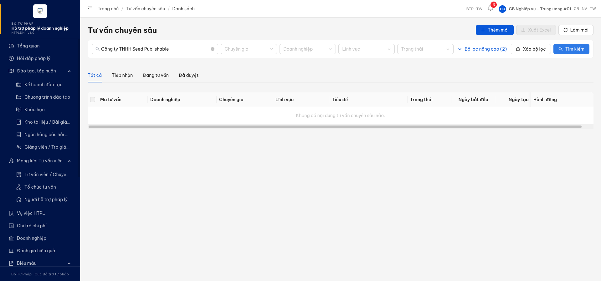

# Bug Report — Tư vấn pháp luật chuyên sâu (TVCS) — Batch A (Màn danh sách SCR-X1-01)

| Thông tin | Giá trị |
|-----------|---------|
| **Dự án** | PM HTPLDN — Hỗ trợ pháp lý doanh nghiệp |
| **Môi trường** | https://18.143.165.120.nip.io |
| **Người test** | QA Automation (Claude Code) |
| **Ngày** | 2026-07-23 00:23:31 |
| **Loại test** | Reverify bug đối tác (UAT tuần 3) |
| **Round** | Reverify week-3 — TVCS Batch A |
| **Tài liệu tham chiếu** | `Docs-PM-HTPLDN/_bmad-output/planning-artifacts/srs-v3.5/srs-fr-12-tv-chuyen-sau.md` (SCR-X1-01, FR-X.1-01/UC147, FR-X.1-02/UC148) |

---

## Tổng hợp

Reverify 4 case Batch A (màn danh sách TVCS SCR-X1-01: cột bảng / tab phân loại / xuất Excel / tìm kiếm). Phát hiện **2** lỗi có SRS reference cụ thể trên môi trường hiện tại.

> **Reverify week-3 R1 (2026-07-23):** 2/2 bug ✅ PASS — đóng cả 2 sau khi dev fix. BUG-QLNDTVVCG_04 (tab phân loại: 3 tab có số đếm, mặc định "Chờ xử lý") + BUG-TKNDTVVCG_03 (tìm kiếm toàn văn khớp tên DN + tiêu đề). Còn Open: 0.

> **Rule log bug:** Bug chỉ log khi có SRS reference cụ thể. Case verify KHÔNG tái hiện (đúng SRS) → Reject, không vào file này. Case tranh chấp đặc tả → BA confirm, không vào file này.

### Severity breakdown

| Tổng | Critical | Major | Medium | Minor | Trivial | Closed | Open |
|------|----------|-------|--------|-------|---------|--------|------|
| 2    | 0        | 1     | 1      | 0     | 0       | 2      | 0    |

## Bug Summary Table

| Bug ID | Severity | Priority | Type | TC Ref | **SRS Reference** | Title | Status |
|--------|----------|----------|------|--------|-------------------|-------|--------|
| ~~BUG-TKNDTVVCG_03~~ | Major | P1 | Happy | TKNDTVVCG_03 (row 291) | `SCR-X1-01 §Thành phần màn hình dòng 1092` + `FR-X.1-02 §Processing dòng 364` (UC148) | Tìm kiếm toàn văn không tìm được theo tên DN (và tiêu đề) — BE trả rỗng | Closed |
| ~~BUG-QLNDTVVCG_04~~ | Medium | P2 | UI/UX | QLNDTVVCG_04 (row 278) | `SCR-X1-01 §Thành phần màn hình dòng 1091` + `§Quy tắc tương tác dòng 1117` (FR-X.1-01 / UC147) | Tab phân loại danh sách TVCS: sai nhãn + thiếu số đếm + sai tab mặc định so với SRS | Closed |

> **Chú thích Type / Severity / Priority:** xem `output/template/bug-report-template.md`.

---

## ~~BUG-QLNDTVVCG_04~~ [CLOSED] — Thanh tab phân loại danh sách TVCS sai nhãn, thiếu số đếm, sai tab mặc định

> **Re-test:** 2026-07-23 00:14:52 Reverify week-3 R1 — ✅ PASS (Closed-verified). Thanh tab nay đúng **3 tab có số đếm** "Chờ xử lý (1) / Đang tư vấn (2) / Hoàn thành (3)", mặc định mở màn = "Chờ xử lý"; click qua từng tab lọc đúng record theo nhóm trạng thái (Chờ xử lý→Tiếp nhận; Đang tư vấn→Đang tư vấn/Chờ phê duyệt; Hoàn thành→Đã duyệt/Hủy). Không còn tab "Tất cả" thừa, đã bỏ nhãn sai "Tiếp nhận"/"Đã duyệt".

### Mô tả

Trên màn **Danh sách Tư vấn pháp luật chuyên sâu** (SCR-X1-01), thanh tab phân loại theo nhóm trạng thái không đúng đặc tả: hiển thị **4 tab** "Tất cả / Tiếp nhận / Đang tư vấn / Đã duyệt", **không tab nào có số đếm**, và **tab mặc định khi mở màn là "Tất cả"**. Theo SRS phải là **3 tab CÓ số đếm** "Chờ xử lý / Đang tư vấn / Hoàn thành", mặc định "Chờ xử lý".

### Các bước tái hiện

1. Đăng nhập vai trò **Cán bộ Nghiệp vụ Trung ương** (tài khoản `cbnv_tw_01` / `CB_NV_TW`, đơn vị BTP·TW — có quyền truy cập chức năng "Quản lý nội dung tư vấn chuyên sâu" theo FR-X.1-01).
2. Vào **Tư vấn → Tư vấn chuyên sâu** (URL `/tv-chuyen-sau/danh-sach`).
3. Quan sát thanh tab phân loại ngay dưới thanh lọc & tìm kiếm.
4. Đọc DOM tab (`.ant-tabs-tab`) và badge (`.ant-badge / sup`) để xác nhận có/không số đếm.

### Kết quả mong đợi

- Theo SRS `SCR-X1-01 §Thành phần màn hình` (dòng 1091): thanh tab phải có **đúng 3 tab, mỗi tab kèm số đếm**: "Chờ xử lý" (gộp TIEP_NHAN + PHAN_CONG) / "Đang tư vấn" (gộp DANG_TU_VAN + HOAN_THANH + CHO_PHE_DUYET) / "Hoàn thành" (gộp DA_DUYET + HUY).
- Theo SRS `§Quy tắc tương tác` (dòng 1117): tab mặc định khi mở màn là **"Chờ xử lý"**.

### Kết quả thực tế

- Thanh tab có **4 tab**: "Tất cả" · "Tiếp nhận" · "Đang tư vấn" · "Đã duyệt".
- **Không tab nào hiển thị số đếm** (đọc DOM: mảng badge trả về rỗng `[]`).
- Tab mặc định active khi mở màn là **"Tất cả"** (`aria-selected="true"`), không phải "Chờ xử lý".
- Nhãn sai so với SRS: "Tiếp nhận" thay cho "Chờ xử lý" (id nội bộ tab `MOI`; bản đối tác quay hiển thị nhãn "Mới tiếp nhận"), "Đã duyệt" thay cho "Hoàn thành"; thừa tab "Tất cả" (SRS chỉ quy định 3 tab).

### Bằng chứng

**1. Ảnh chụp** *(thanh tab 4 mục, không có số đếm)*:


**2. Log đọc DOM tab (phụ trợ):**

```json
{
  "tabs": [
    {"text": "Tất cả", "active": true, "id": "rc-tabs-1-tab-"},
    {"text": "Tiếp nhận", "active": false, "id": "rc-tabs-1-tab-MOI"},
    {"text": "Đang tư vấn", "active": false, "id": "rc-tabs-1-tab-DANG_XU_LY"},
    {"text": "Đã duyệt", "active": false, "id": "rc-tabs-1-tab-HOAN_TAT"}
  ],
  "badges": []
}
```

---

## ~~BUG-TKNDTVVCG_03~~ [CLOSED] — Tìm kiếm toàn văn không tìm được theo tên doanh nghiệp (và tiêu đề)

> **Re-test:** 2026-07-23 00:23:31 Reverify week-3 R1 — ✅ PASS (Closed-verified). Tìm kiếm toàn văn nay khớp cả **tên DN** và **tiêu đề**: tìm "Công ty TNHH Seed Publishable" trả về TVCS-SEED-0001 (đúng KQ mong đợi); tìm "Publishable" và tiêu đề "hợp đồng"/"Tiep nhan" đều ra đúng bản ghi; từ khóa vô nghĩa "zzzznomatch" trả 0 (đối chứng lọc thật). Mã nội dung + nội dung tư vấn vẫn khớp như trước.

### Mô tả

Trên màn **Danh sách Tư vấn pháp luật chuyên sâu** (SCR-X1-01), ô tìm kiếm toàn văn **không trả về kết quả khi tìm theo tên doanh nghiệp**, dù tồn tại bản ghi gắn đúng tên DN đó. Kiểm tra sâu cho thấy ô tìm kiếm chỉ khớp trên **mã nội dung** và **nội dung tư vấn**, KHÔNG khớp trên **tên DN** và **tiêu đề** — trong khi SRS yêu cầu full-text gồm cả 4 trường (tiêu đề + nội dung + mã + tên DN). API tìm kiếm trả `data: []`, `total: 0` → lỗi backend (không index tên DN/tiêu đề vào tìm kiếm).

### Các bước tái hiện

1. Đăng nhập vai trò **Cán bộ Nghiệp vụ Trung ương** (tài khoản `cbnv_tw_01` / `CB_NV_TW`, đơn vị BTP·TW — có quyền chức năng "Quản lý/Tìm kiếm nội dung tư vấn chuyên sâu" theo FR-X.1-01/FR-X.1-02).
2. Vào **Tư vấn → Tư vấn chuyên sâu** (`/tv-chuyen-sau/danh-sach`). Đảm bảo có ≥1 bản ghi (vd TVCS-SEED-0001 gắn DN "Công ty TNHH Seed Publishable"). Baseline không nhập từ khóa → 1 kết quả.
3. Nhập tên DN "Công ty TNHH Seed Publishable" (hoặc phần đặc trưng "Publishable" / "TNHH") vào ô tìm kiếm → bấm **Tìm kiếm**.
4. Quan sát danh sách + đọc payload API `GET /api/v1/noi-dung-tu-van-cs?search=...`.

### Kết quả mong đợi

- Theo SRS `SCR-X1-01 §Thành phần màn hình` (dòng 1092): ô tìm kiếm là **Full-text trên `tieu_de + noi_dung_tu_van + ma_noi_dung + ten DN`**.
- Theo SRS `FR-X.1-02 §Processing` (dòng 364): "tìm kiếm toàn văn trên tiêu đề + nội dung tư vấn, hoặc tìm gần đúng trên mã nội dung, **tên DN**".
- Tìm theo tên DN "Công ty TNHH Seed Publishable" phải trả về bản ghi TVCS-SEED-0001.

### Kết quả thực tế

- Tìm theo tên DN → **0 kết quả**, UI hiển thị "Không có nội dung tư vấn chuyên sâu nào."; API trả `{"success":true,"data":[],"meta":{"total":0}}`.
- Bảng đối chứng số bản ghi (cùng 1 record TVCS-SEED-0001):

  | Từ khóa | Trường chứa từ khóa | Kết quả (total) |
  |---|---|---|
  | (rỗng — baseline) | — | 1 ✅ |
  | `Công ty TNHH Seed Publishable` | tên DN (đầy đủ) | **0** ❌ |
  | `Publishable` | tên DN | **0** ❌ |
  | `TNHH` | tên DN | **0** ❌ |
  | `thương mại` / `hợp đồng` | tiêu đề | **0** ❌ |
  | `TVCS-SEED-0001` | mã nội dung | 1 ✅ |
  | `bảo mật` / `nội bộ` | nội dung tư vấn | 1 ✅ |

- Không phải lỗi từ khóa quá ngắn (cả tên DN đầy đủ vẫn 0). Không phải FE ẩn dữ liệu (API trả `total:0`). Kết luận: **tên DN + tiêu đề không được đưa vào tìm kiếm ở backend**.

### Bằng chứng

**1. Ảnh chụp** *(search theo tên DN → danh sách rỗng)*:



**2. API response (phụ trợ):**

```json
GET /api/v1/noi-dung-tu-van-cs?search=Công%20ty%20TNHH%20Seed%20Publishable&page=1&pageSize=20
{"success":true,"data":[],"meta":{"page":1,"pageSize":20,"total":0,"totalPages":0}}
```

---

## Phụ lục — Môi trường test

| Thành phần | Giá trị |
|------------|---------|
| URL ứng dụng | https://18.143.165.120.nip.io/tv-chuyen-sau/danh-sach |
| OTP login | Từ MailHog http://18.143.165.120:8025/ |
| API base | https://18.143.165.120.nip.io/api/v1 |
| Frontend | React + Ant Design (AntD v5) |
| Xác thực | JWT + OTP (email) |
| Tool test | Chrome DevTools MCP |

---

*Bug report generated: 2026-07-21 17:40:00 | QA Automation via Claude Code*
