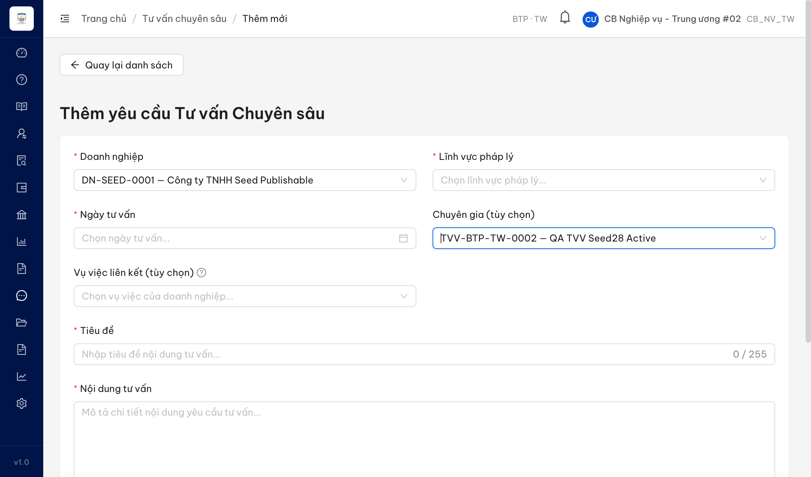
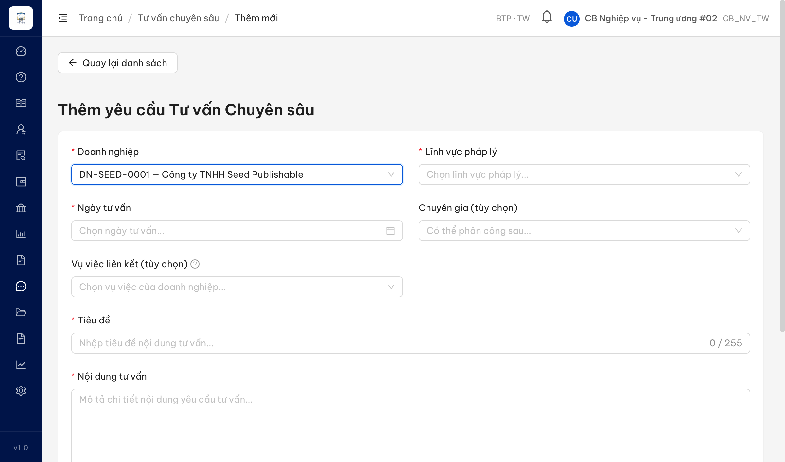
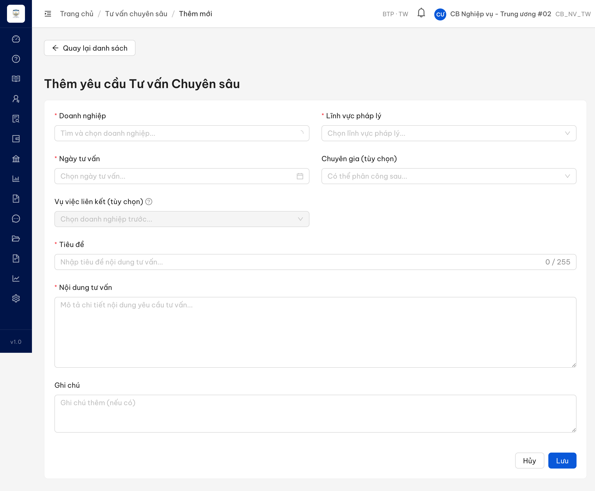

# Bug Report — Tư vấn pháp luật chuyên sâu (TVCS) — Batch B (Form Thêm/Sửa SCR-X1-02)

| Thông tin | Giá trị |
|-----------|---------|
| **Dự án** | PM HTPLDN — Hỗ trợ pháp lý doanh nghiệp |
| **Môi trường** | https://18.143.165.120.nip.io |
| **Người test** | QA Automation (Claude Code) |
| **Ngày** | 2026-07-23 00:24:00 |
| **Loại test** | Reverify bug đối tác (UAT tuần 3) |
| **Round** | Reverify week-3 — TVCS Batch B |
| **Tài liệu tham chiếu** | `Docs-PM-HTPLDN/_bmad-output/planning-artifacts/srs-v3.5/srs-fr-12-tv-chuyen-sau.md` (SCR-X1-02, FR-X.1-01 / UC147) |

---

## Tổng hợp

Reverify 4 case Batch B (form Thêm/Sửa yêu cầu TVCS — SCR-X1-02). Phát hiện **2** lỗi có SRS reference cụ thể trên môi trường hiện tại. Case còn lại: `QLNDTVVCG_06` → BA confirm (web khớp SRS, kỳ vọng đối tác khác đặc tả); `QLNDTVVCG_11` → Reject (không tái hiện — DANG_TU_VAN vẫn có nút Sửa).

> **Reverify R1 (2026-07-23) — sau dev fix:** 2 Closed / 0 Open. ✅ **BUG-QLNDTVVCG_07** Closed (panel thông tin DN + CG đã render sau khi chọn). ✅ **BUG-QLNDTVVCG_08** Closed (field Nội dung tư vấn chi tiết nay là Rich Text Editor TipTap, định dạng hoạt động). Cả 2 verify trực tiếp trên web bằng Chrome DevTools MCP, đúng vai trò/màn/DN/CG như bug gốc.

> **Rule log bug:** Bug chỉ log khi có SRS reference cụ thể. Case verify KHÔNG tái hiện (đúng SRS) → Reject, không vào file này. Case tranh chấp đặc tả → BA confirm (`../../ba-confirm/tvcs/ba-confirmation-needed-tvcs-batchB.md`).

### Severity breakdown

| Tổng | Critical | Major | Medium | Minor | Trivial | Closed | Open |
|------|----------|-------|--------|-------|---------|--------|------|
| 2    | 0        | 0     | 2      | 0     | 0       | 2      | 0    |

## Bug Summary Table

| Bug ID | Severity | Priority | Type | TC Ref | **SRS Reference** | Title | Status |
|--------|----------|----------|------|--------|-------------------|-------|--------|
| ~~BUG-QLNDTVVCG_08~~ | Medium | P2 | UI/UX | QLNDTVVCG_08 (row 281) | `SCR-X1-02 §Thành phần màn hình dòng 1143` (FR-X.1-01 / UC147) | Form Thêm TVCS: trường "Nội dung tư vấn chi tiết" là textarea thường, không phải Rich Text Editor theo SRS | Closed |
| ~~BUG-QLNDTVVCG_07~~ | Medium | P2 | UI/UX | QLNDTVVCG_07 (row 280) | `SCR-X1-02 §Thành phần màn hình dòng 1142` (FR-X.1-01 / UC147) | Form Thêm TVCS: chọn Doanh nghiệp / Chuyên gia không hiển thị thông tin đi kèm (MST, địa chỉ, người đại diện / chuyên môn, SĐT, email) | Closed |

> **Chú thích Type / Severity / Priority:** xem `output/template/bug-report-template.md`.

---

## ~~BUG-QLNDTVVCG_07~~ [CLOSED] — Form Thêm TVCS không hiển thị thông tin Doanh nghiệp / Chuyên gia sau khi chọn

> **Re-test:** 2026-07-23 00:20:00 R1 (reverify week-3) — ✅ PASS. Chọn DN "Công ty TNHH Seed Publishable" + CG "QA TVV Seed28 Active" trên form Thêm TVCS (cbnv_tw_01 / CB_NV_TW · BTP·TW): panel DN hiện đủ **MST 0100000001 · Địa chỉ · Người đại diện Nguyen Van Seed**; panel CG hiện đủ **Chuyên môn (—) · SĐT 0912280028 · Email**. Đo DOM (`evaluate_script`) tất cả label+value = true (bug gốc đo false toàn bộ). Khớp KQ mong đợi.

### Mô tả

Trên form **Thêm yêu cầu Tư vấn pháp luật chuyên sâu** (SCR-X1-02), sau khi cán bộ chọn **Doanh nghiệp** và **Chuyên gia** từ dropdown, hệ thống **không hiển thị các thông tin đi kèm** mà SRS yêu cầu: với Doanh nghiệp là **mã số thuế, địa chỉ, người đại diện**; với Chuyên gia là **chuyên môn, số điện thoại, email**. Kiểm tra `GET /api/v1/doanh-nghieps` xác nhận dữ liệu DN có sẵn đầy đủ (MST `0100000001`, địa chỉ, người đại diện), nhưng giao diện không render panel thông tin → lỗi Frontend.

### Các bước tái hiện

1. Đăng nhập vai trò **Cán bộ Nghiệp vụ Trung ương** (tài khoản `cbnv_tw_02` / `CB_NV_TW`, đơn vị BTP·TW — có quyền chức năng "Quản lý nội dung tư vấn chuyên sâu" theo FR-X.1-01).
2. Vào **Tư vấn → Tư vấn chuyên sâu**, bấm **[Thêm mới]** (URL `/tv-chuyen-sau/tao-moi`).
3. Ở Accordion "Thông tin cơ bản", mở dropdown **Doanh nghiệp** → chọn "Công ty TNHH Seed Publishable".
4. Mở dropdown **Chuyên gia** → chọn "QA TVV Seed28 Active".
5. Quan sát vùng ngay dưới 2 dropdown: kiểm tra có panel hiển thị MST / địa chỉ / người đại diện (DN) và chuyên môn / SĐT / email (CG) hay không (đọc DOM để xác nhận).

### Kết quả mong đợi

- Theo SRS `SCR-X1-02 §Thành phần màn hình` (dòng 1142): trường **DN (dropdown searchable, bắt buộc — khi chọn hiện MST, địa chỉ, người đại diện)**; trường **Chuyên gia (dropdown searchable, bắt buộc — khi chọn hiện chuyên môn, SĐT, email)**.
- Sau khi chọn DN + CG, form phải hiển thị các thông tin định danh tương ứng để cán bộ đối chiếu đúng đối tượng.

### Kết quả thực tế

- Sau khi chọn cả DN "Công ty TNHH Seed Publishable" + CG "QA TVV Seed28 Active", form **không hiển thị bất kỳ thông tin nào** (đo DOM: `showsMST / diaChi / nguoiDaiDien / chuyenMon = false`).
- Dữ liệu DN tồn tại đầy đủ trong payload `GET /api/v1/doanh-nghieps` (MST `0100000001`, địa chỉ, người đại diện `Nguyen Van Seed`) → FE có data nhưng không render panel.
- Không phụ thuộc DN cụ thể: đã test với DN có API trả đủ trường, panel vẫn không xuất hiện → lỗi ở logic render Frontend.

### Bằng chứng

**1. Ảnh chụp** *(DN + CG đã chọn, không có panel thông tin đi kèm)*:

**2. Ảnh phụ** *(chỉ chọn DN, cũng không có panel)*:

---

## ~~BUG-QLNDTVVCG_08~~ [CLOSED] — Trường "Nội dung tư vấn chi tiết" là textarea thường, không phải Rich Text Editor

> **Re-test:** 2026-07-23 00:24:00 R1 (reverify week-3) — ✅ PASS. Trên form Thêm TVCS (cbnv_tw_01 / CB_NV_TW · BTP·TW), trường "Nội dung tư vấn chi tiết" nay là **Rich Text Editor (TipTap/ProseMirror, contenteditable)** với thanh công cụ 6 nút (In đậm / In nghiêng / Gạch chân / Danh sách / Danh sách có số / Chèn liên kết). Thao tác thật: bật In đậm → gõ text → editor tạo `
<strong>…</strong>
` (định dạng hoạt động). `<textarea>` duy nhất còn lại là field "Ghi chú". Khớp KQ mong đợi.

### Mô tả

Trên form **Thêm yêu cầu Tư vấn pháp luật chuyên sâu** (SCR-X1-02), Accordion "Nội dung tư vấn", trường **"Nội dung tư vấn chi tiết"** được render là ô nhập văn bản thường (`<textarea>`), **không có** thanh công cụ định dạng (đậm/nghiêng/danh sách…). Theo SRS trường này phải là **Rich Text Editor**. Kiểm tra DOM: không có tín hiệu rich text editor (không `quill` / `ckeditor` / `tinymce` / `contenteditable`), phần tử là `<textarea>` thuần.

### Các bước tái hiện

1. Đăng nhập vai trò **Cán bộ Nghiệp vụ Trung ương** (tài khoản `cbnv_tw_02` / `CB_NV_TW`, đơn vị BTP·TW).
2. Vào **Tư vấn → Tư vấn chuyên sâu**, bấm **[Thêm mới]** (URL `/tv-chuyen-sau/tao-moi`).
3. Kéo tới Accordion "Nội dung tư vấn", quan sát trường **"Nội dung tư vấn chi tiết"**.
4. Đọc DOM phần tử nhập nội dung để xác định loại control (textarea vs rich text editor).

### Kết quả mong đợi

- Theo SRS `SCR-X1-02 §Thành phần màn hình` (dòng 1143): Accordion "Nội dung tư vấn" gồm **Tiêu đề (text, bắt buộc, max 255)** và **Nội dung TV chi tiết (Rich Text Editor, bắt buộc, max 50KB)**.
- Trường "Nội dung tư vấn chi tiết" phải là **Rich Text Editor** (cho phép định dạng văn bản), không phải ô nhập thô.

### Kết quả thực tế

- Trường "Nội dung tư vấn chi tiết" là `<textarea>` thường, **không có thanh định dạng** → không đáp ứng yêu cầu Rich Text Editor.
- Đọc DOM: 0 tín hiệu rich text (không `quill` / `ckeditor` / `tinymce` / `contenteditable`).
- **Ghi nhận cải thiện so với bản đối tác quay:** trường **Tiêu đề** (bắt buộc, max 255) **nay đã có** trên form (trước đối tác thấy thiếu Tiêu đề, chỉ có "Tóm tắt") → phần "thiếu Tiêu đề" đã được khắc phục, không còn là lỗi.

### Bằng chứng

**1. Ảnh chụp** *(form Thêm — Accordion Nội dung tư vấn với ô nhập nội dung dạng textarea)*:

> **Lưu ý liên quan (không thuộc bug này):** form Thêm còn có trường **"Vụ việc liên kết (tùy chọn)"** không nằm trong danh sách Inputs của SRS FR-X.1-01 → đã tách sang mục cần BA xác nhận (`../../ba-confirm/tvcs/ba-confirmation-needed-tvcs-batchB.md`).

---

## Phụ lục — Môi trường test

| Thành phần | Giá trị |
|------------|---------|
| URL ứng dụng | https://18.143.165.120.nip.io/tv-chuyen-sau/tao-moi |
| OTP login | Từ MailHog http://18.143.165.120:8025/ |
| API base | https://18.143.165.120.nip.io/api/v1 |
| Frontend | React + Ant Design (AntD v5) |
| Xác thực | JWT + OTP (email) |
| Tool test | Chrome DevTools MCP |
| Tài khoản verify | `cbnv_tw_02` / `CB_NV_TW` (đơn vị BTP·TW) |

---

*Bug report generated: 2026-07-21 19:05:00 | QA Automation via Claude Code*
