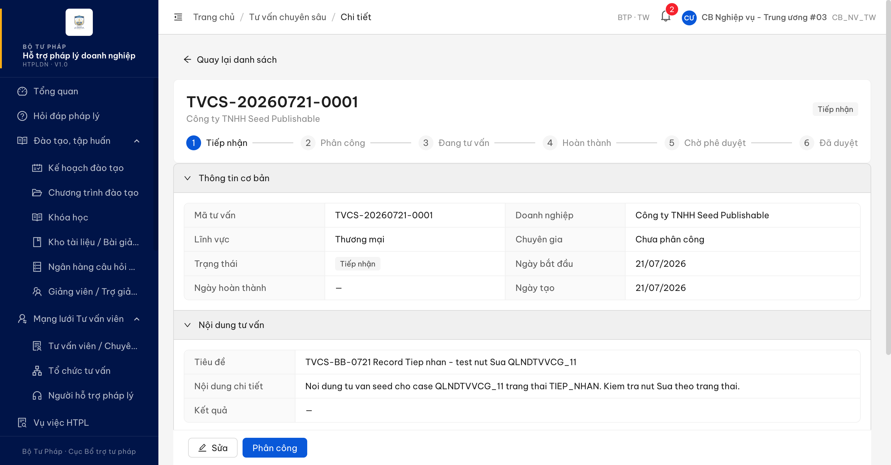
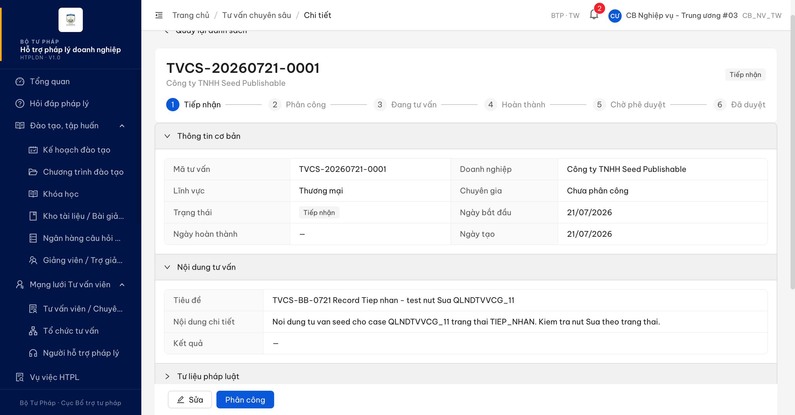
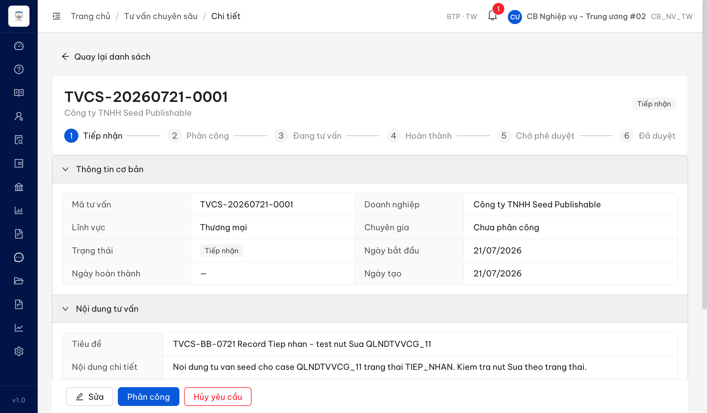
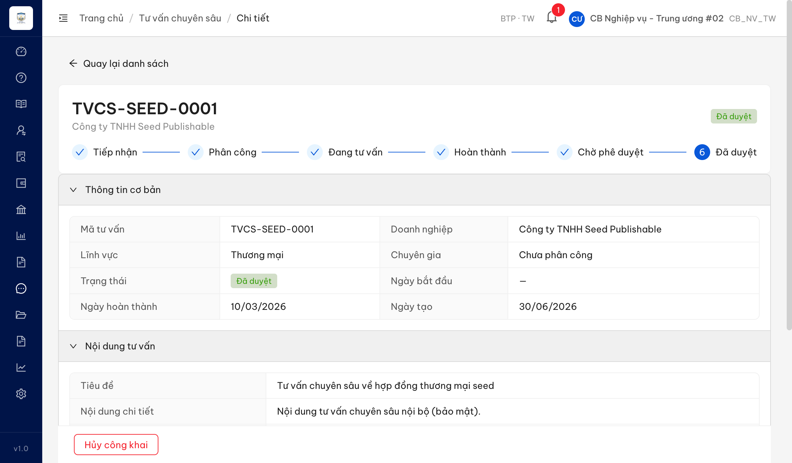

# Bug Report — Tư vấn pháp luật chuyên sâu (TVCS) — Batch C (Màn chi tiết SCR-X1-02)

| Thông tin | Giá trị |
|-----------|---------|
| **Dự án** | PM HTPLDN — Hỗ trợ pháp lý doanh nghiệp |
| **Môi trường** | https://18.143.165.120.nip.io |
| **Người test** | QA Automation (Claude Code) |
| **Ngày** | 2026-07-23 00:15:43 |
| **Loại test** | Reverify bug đối tác (UAT tuần 3) — phát hiện ngoài tiêu chí BA |
| **Round** | Reverify week-3 — TVCS Batch C |
| **Tài liệu tham chiếu** | `input/srs-update-2026-5-5/srs-fr-12-tv-chuyen-sau.md` (SCR-X1-02, CR-01, BR-PUBLIC-01) |

---

## Tổng hợp

Reverify 4 case Batch C (màn chi tiết TVCS SCR-X1-02: số nhóm/nhãn accordion / Nhóm 1-2 / Nhật ký / modal Phân công CG). 4 case gốc → verdict BA confirm ×3 (QLNDTVVCG_15, _17, _22) + Reject ×1 (QLNDTVVCG_20), **không** vào file bug này. Trong quá trình verify phát hiện **1** lỗi có SRS reference cụ thể **ngoài phạm vi 4 case** → log tại đây.

> **Snapshot reverify (2026-07-23 R-week3):** 1/1 bug **Closed** (BUG-TVCS-CONGKHAI-01 PASS). Dev đã sửa: nhóm "Trạng thái công khai" nay ẩn ở bản TIEP_NHAN, chỉ hiện khi DA_DUYET — đúng điều kiện hiển thị SRS. Open còn lại: 0.

> **Rule log bug:** Bug chỉ log khi có SRS reference cụ thể. Case verify KHÔNG tái hiện (đúng SRS) → Reject. Case tranh chấp đặc tả → BA confirm. Cả hai đều không vào file này.

### Severity breakdown

| Tổng | Critical | Major | Medium | Minor | Trivial | Closed | Open |
|------|----------|-------|--------|-------|---------|--------|------|
| 1    | 0        | 0     | 0      | 1     | 0       | 1      | 0    |

## Bug Summary Table

| Bug ID | Severity | Priority | Type | TC Ref | **SRS Reference** | Title | Status |
|--------|----------|----------|------|--------|-------------------|-------|--------|
| BUG-TVCS-CONGKHAI-01 | Minor | P3 | UI/UX | (ngoài case — phát hiện khi verify QLNDTVVCG_15/_20/_22) | `SCR-X1-02 §Thành phần dòng 1147` (#8b, cột Điều kiện hiển thị) + `§Quy tắc tương tác CR-01` + `BR-PUBLIC-01` | Nhóm "Trạng thái công khai" hiển thị ở bản chưa duyệt (TIEP_NHAN), trong khi SRS yêu cầu chỉ hiển thị khi DA_DUYET | Closed |

> **Chú thích Type / Severity / Priority:** xem `output/template/bug-report-template.md`.

---

## ~~BUG-TVCS-CONGKHAI-01~~ [CLOSED] — Nhóm "Trạng thái công khai" hiển thị ở bản chưa duyệt (TIEP_NHAN), lẽ ra chỉ hiển thị khi Đã duyệt

> **Re-test:** 2026-07-23 00:15:43 R-week3 — ✅ PASS (Closed-verified). Chạy đủ luồng 2 chiều với `cbnv_tw_02`: bản TIEP_NHAN (TVCS-20260721-0001) nay render **5 nhóm**, nhóm "Trạng thái công khai" đã **ẩn hoàn toàn** (DOM `.ant-collapse-header` không còn); bản DA_DUYET (TVCS-SEED-0001) vẫn hiện **6 nhóm** gồm "Trạng thái công khai" — đúng điều kiện hiển thị `trang_thai = DA_DUYET` theo SRS CR-01/BR-PUBLIC-01.

### Mô tả

Trên màn **Chi tiết TVCS** (SCR-X1-02, chế độ xem), nhóm accordion **"Trạng thái công khai"** (nhóm #8b theo SRS = "Công khai chuyên trang") hiển thị ở bản ghi trạng thái **Tiếp nhận (TIEP_NHAN)**. Theo SRS, nhóm này **chỉ được hiển thị khi trạng thái = DA_DUYET** (Đã duyệt). Hệ quả: bản ghi chưa duyệt vẫn phơi ra khối "Trạng thái công khai" (đọc-only, "Chưa công khai" + các trường trống), gây hiểu nhầm rằng chức năng công khai đã sẵn sàng ở giai đoạn chưa đủ điều kiện.

### Các bước tái hiện

1. Đăng nhập vai trò **Cán bộ Nghiệp vụ Trung ương** (tài khoản `cbnv_tw_03` / `CB_NV_TW`, đơn vị BTP·TW — có quyền truy cập "Quản lý nội dung tư vấn chuyên sâu", xem chi tiết TVCS theo FR-X.1-01/UC147).
2. Mở màn **Chi tiết** của một bản ghi TVCS đang ở trạng thái **Tiếp nhận** — URL `/tv-chuyen-sau/3045d37b-a714-4923-a13f-6d1a950668a6` (mã `TVCS-20260721-0001`, badge trạng thái "Tiếp nhận", stepper dừng ở bước 1).
3. Quan sát danh sách nhóm accordion. Đọc DOM `.ant-collapse-header` để đếm + lấy nhãn nhóm.
4. Mở nhóm "Trạng thái công khai" → đọc nội dung panel.

### Kết quả mong đợi

- Theo SRS `SCR-X1-02 §Thành phần màn hình dòng 1147` (#8b "Công khai chuyên trang"), cột **Điều kiện hiển thị** ghi nguyên văn: *"mode chi tiết, chỉ hiển thị khi trạng thái = DA_DUYET"*.
- Theo `§Quy tắc tương tác` mục **CR-01**: *"Accordion 'Công khai chuyên trang' chỉ hiển thị khi `trang_thai = DA_DUYET` (BR-PUBLIC-01)"*.
- → Với bản ghi trạng thái **TIEP_NHAN**, nhóm "Trạng thái công khai / Công khai chuyên trang" **phải ẩn hoàn toàn**. Bản chưa duyệt chỉ nên có 5 nhóm cơ bản (Thông tin cơ bản / Nội dung tư vấn / Tư liệu PL / Đánh giá chất lượng / Nhật ký).

### Kết quả thực tế

- Bản ghi `TVCS-20260721-0001` (trạng thái **Tiếp nhận**) hiển thị **6 nhóm** accordion, đọc DOM `.ant-collapse-header`:
  `["Thông tin cơ bản", "Nội dung tư vấn", "Tư liệu pháp luật", "Trạng thái công khai", "Đánh giá chất lượng", "Nhật ký"]`.
- Nhóm **"Trạng thái công khai"** hiện diện dù bản ghi **chưa duyệt** (không đạt điều kiện `trang_thai = DA_DUYET`).
- Mở nhóm → panel đọc-only hiển thị: *"Công khai: Chưa công khai · Thời gian đăng tải: — · Mô tả công khai: — · Ảnh đại diện: — · File đính kèm: —"*. Panel không chứa switch/nút thao tác (đọc DOM: mảng `button/a/switch` trong panel = rỗng) → không cho phép công khai thật ở trạng thái này, nhưng vẫn vi phạm **điều kiện hiển thị** của SRS (nhóm lẽ ra phải ẩn).
- So sánh: cùng render 6 nhóm này với bản `TVCS-SEED-0001` trạng thái **Đã duyệt** (khi verify QLNDTVVCG_15) — tức nhóm "Trạng thái công khai" hiển thị **không phụ thuộc trạng thái**, thay vì chỉ khi DA_DUYET.

### Bằng chứng

**1. Ảnh — bản TIEP_NHAN hiện 6 nhóm gồm "Trạng thái công khai":**

**2. Ảnh — mở nhóm "Trạng thái công khai" trên bản TIEP_NHAN (đọc-only, "Chưa công khai"):**

**3. Log đọc DOM (phụ trợ):**

- Đếm nhóm: `evaluate_script` đọc `.ant-collapse-header` → 6 nhóm (danh sách nhãn như trên).
- Panel nhóm khi mở: `itemInnerText = "Trạng thái công khai\nCông khai\tChưa công khai\tThời gian đăng tải\t—\nMô tả công khai\t—\nẢnh đại diện\t—\tFile đính kèm\t—"`; mảng `button/a/switch` trong panel = `[]`.
- Trạng thái bản ghi (API `GET /api/v1/noi-dung-tu-van-cs`): `TVCS-20260721-0001` → `trangThai = "TIEP_NHAN"`.

### Bằng chứng re-test (2026-07-23 R-week3 — PASS)

**4. Ảnh — bản TIEP_NHAN nay chỉ còn 5 nhóm, nhóm "Trạng thái công khai" đã ẩn:**

**5. Ảnh — bản DA_DUYET (TVCS-SEED-0001) vẫn hiện đủ 6 nhóm gồm "Trạng thái công khai":**

**6. Log đọc DOM re-test (`.ant-collapse-header`):**

- TIEP_NHAN (`3045d37b-a714-4923-a13f-6d1a950668a6`): 5 nhóm `["Thông tin cơ bản","Nội dung tư vấn","Tư liệu pháp luật","Đánh giá chất lượng","Nhật ký"]` → `hasCongKhaiGroup = false`.
- DA_DUYET (`5eed0008-0000-4000-8000-000000000001`): 6 nhóm `["Thông tin cơ bản","Nội dung tư vấn","Tư liệu pháp luật","Trạng thái công khai","Đánh giá chất lượng","Nhật ký"]` → `hasCongKhaiGroup = true`.

> **Ghi chú:** Việc nhãn hiển thị là "Trạng thái công khai" (web) vs "Công khai chuyên trang" (SRS) thuộc nhóm câu hỏi nhãn accordion đang chờ BA chốt tại `../../ba-confirm/tvcs/ba-confirmation-needed-tvcs-batchC.md` (QLNDTVVCG_15) — không lặp lại ở bug này. Bug này chỉ về **điều kiện hiển thị theo trạng thái**.
