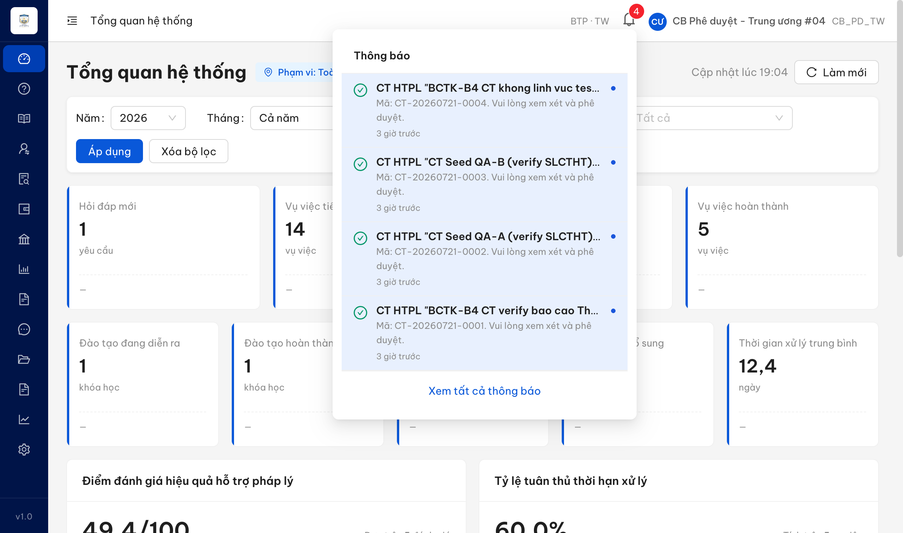
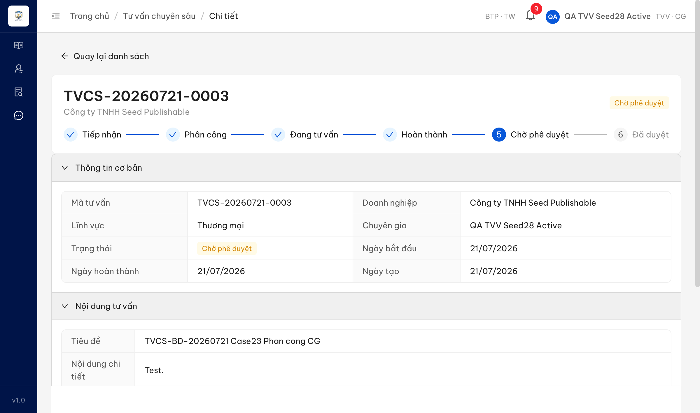
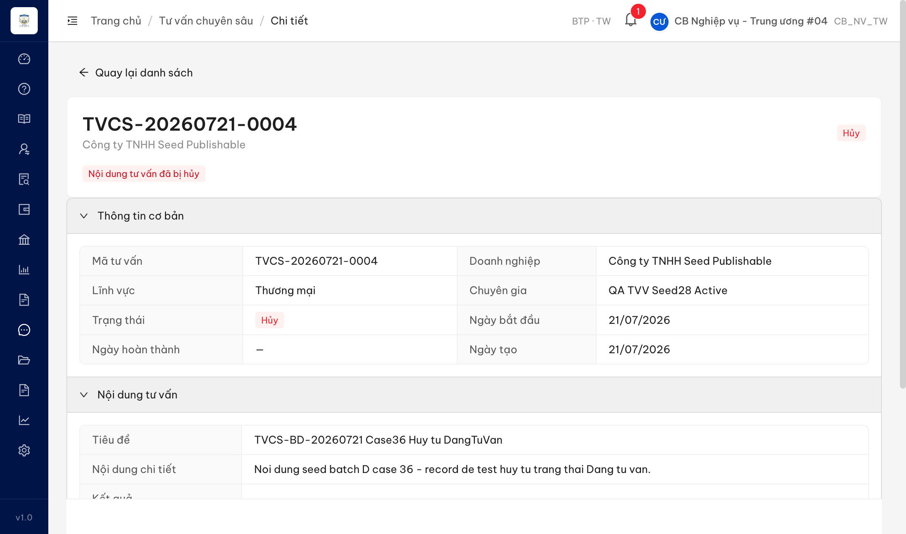
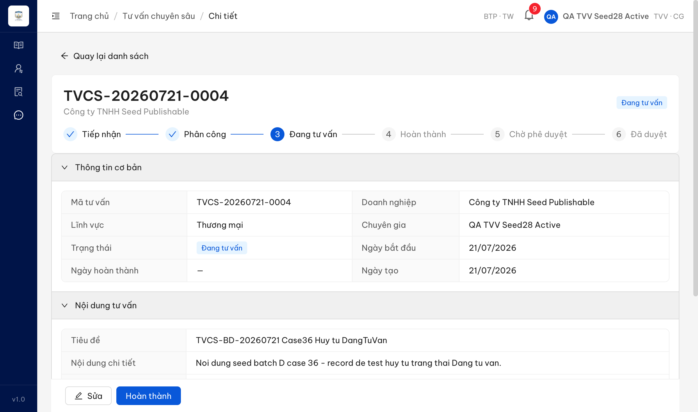

# Bug Report — Tư vấn pháp luật chuyên sâu (TVCS) — Batch D (Workflow / chuyển trạng thái SM-TVCS)

| Thông tin | Giá trị |
|-----------|---------|
| **Dự án** | PM HTPLDN — Hỗ trợ pháp lý doanh nghiệp |
| **Môi trường** | https://18.143.165.120.nip.io |
| **Người test** | QA Automation (Claude Code) |
| **Ngày** | 2026-07-23 00:30:00 |
| **Loại test** | Reverify bug đối tác (UAT tuần 3) — Workflow / chuyển trạng thái |
| **Round** | Reverify week-3 — TVCS Batch D (reverify sau dev fix lần 1) |
| **Tài liệu tham chiếu** | `srs-update-2026-5-5/srs-fr-12-tv-chuyen-sau.md` (FR-X.1-01 / UC147; Processing Hoàn thành TV dòng 188–197; SM-TVCS dòng 1499–1513) |

---

## Tổng hợp

> **Snapshot LATEST (2026-07-27):** **2 tổng · 2 Closed · 0 Open.** BUG-QLNDTVVCG_27 PASS ở reverify 2026-07-23; BUG-QLNDTVVCG_36 đã được BA chốt 2026-07-24 (ở Đang tư vấn chỉ CB Phê duyệt được hủy) và PASS ở round 6 ngày 2026-07-25. Chi tiết bằng chứng xem dòng Re-test của từng bug.

Reverify 3 case Batch D (workflow chuyển trạng thái SM-TVCS, rows 287–289). Phát hiện **2** lỗi có SRS reference cụ thể: `QLNDTVVCG_27` (Hoàn thành TV không gửi thông báo CB Phê duyệt) và `QLNDTVVCG_36` (hủy từ "Đang tư vấn" chuyển thẳng "Đã hủy", bỏ qua điều kiện DN đồng ý + CB PD duyệt hủy). Case còn lại: `QLNDTVVCG_23` (phân công CG) → **Reject** (không tái hiện — phân công CG hợp lệ thành công). Case `QLNDTVVCG_36` đồng thời cần **BA confirm** vì cơ chế "duyệt hủy" chưa có state riêng trong SM (xem `../../ba-confirm/tvcs/ba-confirmation-needed-tvcs-batchD.md`).

> **Rule log bug:** Bug chỉ log khi có SRS reference cụ thể. Case verify KHÔNG tái hiện (đúng SRS) → Reject (`../../reverify-audit/QLNDTVVCG_23/`), không vào file này.

> **Quan sát incidental (ngoài 3 case, chưa tạo bug entry riêng):** Hộp thoại **"Hoàn thành tư vấn"** hiển thị dòng auto-save nháp là **"Đã lưu nháp lúc NaN:NaN"** (format timestamp lỗi → `NaN:NaN`, tính năng auto-save draft SRS dòng 1516). Mức Minor/cosmetic. Bắt được qua a11y snapshot khi mở modal hoàn thành record TVCS-20260721-0003; chưa có screenshot chuyên biệt do record đã chuyển CHO_PHE_DUYET. Cần seed 1 record DANG_TU_VAN mới để chụp repro nếu muốn log chính thức.

### Severity breakdown

| Tổng | Critical | Major | Medium | Minor | Trivial | Closed | Open |
|------|----------|-------|--------|-------|---------|--------|------|
| 2    | 0        | 2     | 0      | 0     | 0       | 2      | 0    |

## Bug Summary Table

| Bug ID | Severity | Priority | Type | TC Ref | **SRS Reference** | Title | Status |
|--------|----------|----------|------|--------|-------------------|-------|--------|
| ~~BUG-QLNDTVVCG_36~~ | Major | P1 | Workflow | QLNDTVVCG_36 (row 289) | `FR-X.1-01 §Processing Hủy yêu cầu bước 4 dòng 229` + `SM-TVCS guard dòng 1512` | ⚠️ Hủy record "Đang tư vấn" chuyển thẳng "Đã hủy", bỏ qua điều kiện DN đồng ý hủy + CB Phê duyệt duyệt hủy | **Closed** |
| ~~BUG-QLNDTVVCG_27~~ | Major | P1 | Workflow | QLNDTVVCG_27 (row 288) | `FR-X.1-01 §Processing Hoàn thành TV bước 5 dòng 196` + `SM-TVCS dòng 1508` (BR-FLOW-01) | Hoàn thành TV: record auto chuyển "Chờ phê duyệt" nhưng KHÔNG gửi thông báo tới CB Phê duyệt cùng đơn vị | Closed |

> **Chú thích Type / Severity / Priority:** xem `output/template/bug-report-template.md`.

---

## ~~BUG-QLNDTVVCG_27~~ [CLOSED] — Hoàn thành TV: record chuyển "Chờ phê duyệt" nhưng CB Phê duyệt cùng đơn vị không nhận thông báo

> **Re-test:** 2026-07-23 00:30:00 Reverify-tuần3 (`cbpd_tw_03`) — ✅ PASS (Closed). Chạy lại đủ luồng qua Chrome DevTools MCP: CG `qa_tvvseed28` hoàn thành record TVCS-20260721-0002 (Đang tư vấn → Chờ phê duyệt, 1 POST `/hoan-thanh` → 200, toast "Đã hoàn thành tư vấn") → đăng nhập CB Phê duyệt cùng đơn vị `cbpd_tw_03` (BTP·TW): chuông hiện thông báo **"Nội dung tư vấn 'TVCS-20260721-0002' đã được gửi phê duyệt"** (23/07/2026 00:26, "3 phút trước") — đúng KQ mong đợi. Bằng chứng: `image/BD-case27-reverify-R1-cbpd-notification-list.png`, `image/BD-case27-reverify-R1-cbpd-notification-received.png`, `image/BD-case27-reverify-R1-chophduyet.png`.

### Mô tả

Khi Chuyên gia bấm **"Hoàn thành"** một yêu cầu Tư vấn pháp luật chuyên sâu (nhập văn bản kết quả hợp lệ), record chuyển trạng thái đúng: DANG_TU_VAN → HOAN_THANH → **auto CHO_PHE_DUYET**. Tuy nhiên, Cán bộ Phê duyệt **cùng đơn vị** (người có trách nhiệm duyệt record đó) **không nhận được thông báo** nào — chuông thông báo không tăng, danh sách thông báo không có mục về record vừa hoàn thành. Theo SRS (dòng 196 / SM dòng 1508, BR-FLOW-01), bước auto chuyển CHO_PHE_DUYET **phải kèm gửi thông báo CB Phê duyệt cùng đơn vị**. Record vẫn xuất hiện trong danh sách chờ duyệt của CB PD (auto-transition + lọc phạm vi hoạt động đúng), nên CB PD chỉ biết khi chủ động mở danh sách — không được thông báo chủ động.

### Các bước tái hiện

1. Đăng nhập **Chuyên gia được phân công** (`qa_tvvseed28` / TVV·CG, đơn vị Cục Bổ trợ tư pháp - Bộ Tư pháp, cấp TW — có quyền hoàn thành TV theo BR-AUTH-01) → mở record TVCS ở trạng thái "Đang tư vấn" (TVCS-20260721-0003).
2. Bấm **[Hoàn thành]** → nhập "Văn bản tư vấn pháp luật (kết quả)" hợp lệ (≥10 ký tự) → bấm **[Hoàn thành]** trong hộp thoại.
3. Quan sát: record chuyển sang **"Chờ phê duyệt"** (toast "Đã hoàn thành tư vấn"; API `GET /api/v1/noi-dung-tu-van-cs/{id}` trả `trangThai=CHO_PHE_DUYET`).
4. Đăng xuất, đăng nhập **CB Phê duyệt cùng đơn vị** (`cbpd_tw_04` / CB_PD_TW, cùng donViId `00000000-0000-4000-8000-000000000001` với record — xác minh qua `/api/v1/auth/me`).
5. Mở chuông thông báo + gọi `GET /api/v1/thong-baos?pageSize=100&sortBy=createdAt&sortOrder=DESC` và `GET /api/v1/thong-baos/unread-count`. Chờ thêm ~45s re-fetch để loại trừ độ trễ bất đồng bộ.

### Kết quả mong đợi

- Theo SRS `FR-X.1-01 §Processing Hoàn thành TV` bước 5 (dòng 196): "Auto chuyển → CHO_PHE_DUYET, **gửi thông báo CB Phê duyệt cùng đơn vị**" (BR-FLOW-01); SM-TVCS dòng 1508: `HOAN_THANH → CHO_PHE_DUYET | Auto | Action = **TB CB PD**`.
- Sau khi CG hoàn thành, CB Phê duyệt cùng đơn vị phải nhận được thông báo (chuông tăng + mục thông báo về record chờ duyệt) để biết có yêu cầu cần phê duyệt.

### Kết quả thực tế

- Record chuyển đúng sang "Chờ phê duyệt" (auto-transition hoạt động).
- CB Phê duyệt `cbpd_tw_04` (cùng đơn vị): chuông giữ nguyên **4 chưa đọc**, cả 4 đều là thông báo **CT HTPL** cũ (CT-20260721-0001→0004, timestamp 08:37–08:45Z, tồn tại trước thao tác hoàn thành lúc ~12:00Z). **Không có** thông báo nào về TVCS-20260721-0003.
- `GET /api/v1/thong-baos?pageSize=100`: tổng 4 item, không item nào tham chiếu record TVCS. Chờ 45s re-fetch: vẫn 4, unread-count vẫn `{count:4}` → không phải độ trễ.
- Đối chứng loại trừ "account không nhận được TB": cùng account `cbpd_tw_04` NHẬN được thông báo "gửi phê duyệt" cho CT HTPL → kênh thông báo/chuông của account hoạt động bình thường; riêng luồng TVCS `HOAN_THANH → CHO_PHE_DUYET` không phát thông báo cho CB PD.
- Record vẫn nằm trong danh sách chờ duyệt của CB PD (`GET /api/v1/noi-dung-tu-van-cs?trangThai=CHO_PHE_DUYET` trả đúng 1 record 0003, donViId khớp) → có workaround (CB PD tự mở danh sách), nên xếp Major thay vì Critical.

### Bằng chứng

**1. Ảnh chụp** *(bắt buộc)*:





**2. API response / log** *(phụ trợ)*:

```
# Sau khi CG hoàn thành record (POST /hoan-thanh → 200, toast "Đã hoàn thành tư vấn")
GET /api/v1/noi-dung-tu-van-cs/ab63d0a6-...  → trangThai = "CHO_PHE_DUYET", donViId = 00000000-0000-4000-8000-000000000001

# Đăng nhập cbpd_tw_04 (CB_PD_TW), /auth/me → donViId = 00000000-0000-4000-8000-000000000001 (KHỚP record)
GET /api/v1/thong-baos/unread-count           → { count: 4 }  (không đổi sau hoàn thành + sau 45s)
GET /api/v1/thong-baos?pageSize=100           → 4 item, tất cả loai="PHE_DUYET" tiêu đề 'CT HTPL "..." đã được gửi phê duyệt' (CT-20260721-0001→0004)
                                                → KHÔNG có item nào tham chiếu TVCS-20260721-0003
GET /api/v1/noi-dung-tu-van-cs?trangThai=CHO_PHE_DUYET → 1 record TVCS-20260721-0003 (record CÓ trong hàng chờ duyệt, nhưng không phát TB)
```

---

## ~~BUG-QLNDTVVCG_36~~ [CLOSED] — ⚠️ [OPEN · BA CONFIRM] — Hủy record "Đang tư vấn" chuyển thẳng "Đã hủy", bỏ qua điều kiện DN đồng ý + CB Phê duyệt duyệt hủy

> **Re-test:** 2026-07-25 R6 — ✅ PASS (Closed). BA chốt 24/07/2026: ở trạng thái Đang tư vấn chỉ Cán bộ Phê duyệt được hủy, CB Nghiệp vụ / Chuyên gia bị chặn. Chạy lại trên TVCS-20260725-0007: hủy TVCS ở Đang tư vấn không còn phần dư của luồng duyệt-hủy. Bằng chứng: `../../dev-fix-reverify-round-6-2026-07-25/README.md` (dòng 289).


### Mô tả

Khi Cán bộ Nghiệp vụ bấm **"Hủy yêu cầu"** trên một record Tư vấn pháp luật chuyên sâu ở trạng thái **"Đang tư vấn"** (DANG_TU_VAN), hệ thống mở hộp thoại chỉ yêu cầu nhập **Lý do hủy**, rồi sau khi xác nhận thì record **chuyển thẳng sang "Đã hủy"** (HUY). Không có bước lấy **đồng ý của Doanh nghiệp** về việc hủy, cũng không có bước **Cán bộ Phê duyệt duyệt hủy**. Theo SRS (Processing Hủy yêu cầu bước 4, dòng 229 + guard SM dòng 1512), hủy một record đang ở DANG_TU_VAN phải có điều kiện **DN đồng ý hủy + CB Phê duyệt duyệt hủy** trước khi record được chuyển sang HUY. Hệ thống hiện bỏ qua hoàn toàn điều kiện này.

> **Ghi chú (không thuộc phạm vi fix của bug này):** SM-TVCS chỉ có 7 trạng thái (TIEP_NHAN, PHAN_CONG, DANG_TU_VAN, HOAN_THANH, CHO_PHE_DUYET, DA_DUYET, HUY) — **không có trạng thái riêng** cho bước "duyệt hủy"; điều kiện duyệt hủy chỉ tồn tại dưới dạng guard, chưa có Processing sub-flow mô tả cơ chế. Phần cơ chế cần BA chốt → tách sang `../../ba-confirm/tvcs/ba-confirmation-needed-tvcs-batchD.md`. Bug này chỉ khẳng định: điều kiện guard đang bị bỏ qua hoàn toàn.

### Các bước tái hiện

1. Đăng nhập vai trò **Cán bộ Nghiệp vụ Trung ương** (`cbnv_tw_04` / CB_NV_TW, đơn vị Cục Bổ trợ tư pháp - Bộ Tư pháp cấp TW — có quyền hủy yêu cầu theo BR-AUTH-01/08).
2. Mở record TVCS ở trạng thái **"Đang tư vấn"** (TVCS-20260721-0004).
3. Bấm **[Hủy yêu cầu]** → hộp thoại "Hủy nội dung tư vấn" hiện ra.
4. Quan sát các trường trong hộp thoại (có chỉ Lý do hủy, hay có thêm bước DN đồng ý / CB PD duyệt?).
5. Nhập lý do hủy → bấm **[Xác nhận hủy]** → quan sát trạng thái record ngay sau đó (qua UI + API `GET /api/v1/noi-dung-tu-van-cs/{id}`).

### Kết quả mong đợi

- Theo SRS `FR-X.1-01 §Processing Hủy yêu cầu` bước 4 (dòng 229): "Nếu DANG_TU_VAN: **yêu cầu DN đồng ý hủy + CB Phê duyệt duyệt hủy**"; SM-TVCS guard dòng 1512: `DANG_TU_VAN → HUY` chỉ hợp lệ khi guard "**DN yêu cầu hủy + CB PD duyệt**" thỏa.
- Hệ thống KHÔNG được cho phép chuyển thẳng record DANG_TU_VAN sang HUY chỉ với lý do hủy của CB NV — phải thỏa điều kiện DN đồng ý hủy và CB Phê duyệt duyệt hủy trước.

### Kết quả thực tế

- Hộp thoại "Hủy nội dung tư vấn" **chỉ có 1 trường "Lý do hủy"** (bắt buộc). Không có bước lấy đồng ý DN, không có bước CB PD duyệt hủy.
- Sau khi xác nhận: **1 request** `POST /api/v1/noi-dung-tu-van-cs/{id}/huy` → toast "Đã hủy nội dung tư vấn"; API trả `trangThai=HUY` **ngay lập tức** (không qua trạng thái trung gian).
- Record chuyển **DANG_TU_VAN → HUY trực tiếp**, bỏ qua toàn bộ điều kiện guard SRS dòng 229/1512 → tái hiện đúng phản ánh đối tác.

### Bằng chứng

**1. Ảnh chụp** *(bắt buộc)*:





**2. API response / log** *(phụ trợ)*:

```
# Trước hủy: TVCS-20260721-0004 ở DANG_TU_VAN
# CB NV bấm Hủy yêu cầu → modal chỉ có field "Lý do hủy" → Xác nhận hủy
POST /api/v1/noi-dung-tu-van-cs/318a5e57-.../huy   → 200, toast "Đã hủy nội dung tư vấn"  (1 request duy nhất)
GET  /api/v1/noi-dung-tu-van-cs/318a5e57-...        → trangThai = "HUY"  (ngay sau xác nhận, không qua state trung gian)
```

---

## Phụ lục — Môi trường test

| Thành phần | Giá trị |
|------------|---------|
| URL ứng dụng | https://18.143.165.120.nip.io/tv-chuyen-sau |
| OTP login | Từ MailHog http://18.143.165.120:8025/ |
| API base | https://18.143.165.120.nip.io/api/v1 |
| Frontend | React + Ant Design (AntD v5) |
| Xác thực | JWT + OTP (email) |
| Tool test | Chrome DevTools MCP |
| Tài khoản verify | Case 27: CG `qa_tvvseed28` (hoàn thành) + CB PD `cbpd_tw_04` (nhận TB). Case 36: CB NV `cbnv_tw_04` (hủy). Tất cả cùng đơn vị Cục Bổ trợ tư pháp BTP·TW (donViId `00000000-0000-4000-8000-000000000001`) |

---

*Bug report generated: 2026-07-21 19:10:00 | QA Automation via Claude Code*
