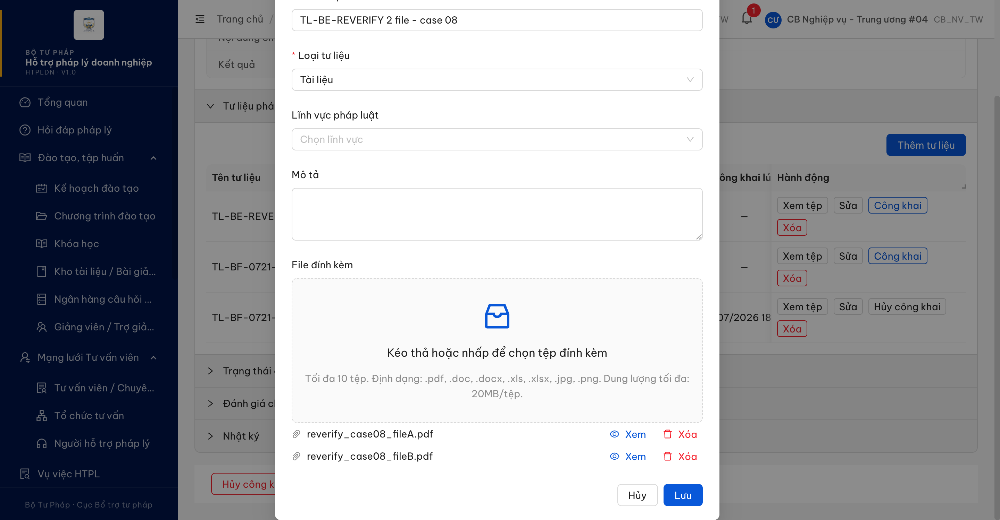
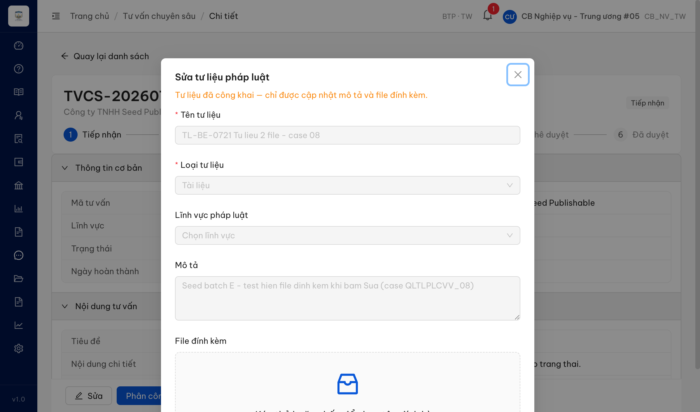

# Bug Report — Tư vấn pháp luật chuyên sâu (TVCS) — Batch E (Tư liệu PL — QLTLPLCVV, tab SCR-X1-02)

| Thông tin | Giá trị |
|-----------|---------|
| **Dự án** | PM HTPLDN — Hỗ trợ pháp lý doanh nghiệp |
| **Môi trường** | https://18.143.165.120.nip.io |
| **Người test** | QA Automation (Claude Code) |
| **Ngày** | 2026-07-23 00:25:31 |
| **Loại test** | Reverify bug đối tác (UAT tuần 3) |
| **Round** | Reverify week-3 — TVCS Batch E |
| **Tài liệu tham chiếu** | `input/srs-update-2026-5-5/srs-fr-12-tv-chuyen-sau.md` (FR-X.1-06/UC152, tab "Tư liệu PL liên kết" trong SCR-X1-02) |

---

## Tổng hợp

> **Re-test R1 (2026-07-23) — LATEST:** 1/1 bug Closed. BUG-QLTLPLCVV_08 ✅ PASS — modal Sửa nay hiện đủ file đính kèm (endpoint detail đã trả `files`). File 100% Closed.

Reverify 4 case Batch E (danh sách + hiển thị + điều kiện nút Thêm/Sửa của tab Tư liệu PL trong Chi tiết TVCS). Chỉ **1** case là lỗi có SRS reference cụ thể → log vào file này. 3 case còn lại (02, 03, 07) là tranh chấp đặc tả / SRS tự mâu thuẫn → chuyển `../../ba-confirm/tvcs/ba-confirmation-needed-tvcs-batchE.md`, không log ở đây.

> **Rule log bug:** Bug chỉ log khi có SRS reference cụ thể + tái hiện được. Case tranh chấp đặc tả → BA confirm, không vào file này.

### Severity breakdown

| Tổng | Critical | Major | Medium | Minor | Trivial | Closed | Open |
|------|----------|-------|--------|-------|---------|--------|------|
| 1    | 0        | 1     | 0      | 0     | 0       | 1      | 0    |

## Bug Summary Table

| Bug ID | Severity | Priority | Type | TC Ref | **SRS Reference** | Title | Status |
|--------|----------|----------|------|--------|-------------------|-------|--------|
| ~~BUG-QLTLPLCVV_08~~ | Major | P1 | Data | QLTLPLCVV_08 (row 297) | `FR-X.1-06 §AC dòng 962` + `§Outputs so_file dòng 936` + `§Processing Chỉnh sửa dòng 890` (UC152) | Sửa tư liệu không hiển thị tệp đính kèm — API detail trả `files:[]` dù tư liệu có 2 file | Closed |

> **Chú thích Type / Severity / Priority:** xem `output/template/bug-report-template.md`.

---

## ~~BUG-QLTLPLCVV_08~~ [CLOSED] — Bấm "Sửa" tư liệu không hiển thị tệp đính kèm dù tư liệu có 2 file

> **Re-test:** 2026-07-23 00:25:31 R1 — ✅ PASS (Closed-verified). Tài khoản cbnv_tw_04 (CB_NV_TW, BTP·TW). Chạy lại đủ luồng: tạo tư liệu 2 file (fileA + fileB) trong Tư liệu pháp luật của TVCS → bấm [Sửa]. Cửa sổ "Sửa tư liệu pháp luật" nay hiển thị **đủ 2 file** (Xem/Xóa), payload detail trả `files` gồm 2 phần tử (trước đây `files:[]`). Đã xóa tư liệu test sau khi verify. Bằng chứng: 

### Mô tả

Trên tab **"Tư liệu PL liên kết"** (Chi tiết TVCS, SCR-X1-02), một tư liệu có **2 file đính kèm** (cột "File" hiển thị `2`, API danh sách trả `so_file = 2`). Khi CB NV bấm **[Sửa]** trên tư liệu đó, cửa sổ "Sửa tư liệu pháp luật" mở ra nhưng vùng **"File đính kèm" trống** — không liệt kê file nào đang có. Nguyên nhân gốc phía backend: endpoint chi tiết `GET /api/v1/tu-lieu-phap-ly-vvs/{id}` trả `files: []` (mảng rỗng) dù file có thật, nên FE không có dữ liệu để render danh sách file.

### Các bước tái hiện

1. Đăng nhập role **CB Nghiệp vụ Trung ương** (`cbnv_tw_05` / `CB_NV_TW`, đơn vị BTP·TW — có quyền CRUD tư liệu theo FR-X.1-06 dòng 806/812, BR-AUTH-08).
2. Vào **Tư vấn → Tư vấn chuyên sâu** → mở 1 record chi tiết → mở accordion **"Tư liệu pháp luật"**.
3. Chọn tư liệu có cột **"File" ≥ 1** (vd `TL-BE-0721 Tu lieu 2 file - case 08`, File = 2) → bấm **[Sửa]**.
4. Quan sát vùng "File đính kèm" trong cửa sổ Sửa + đọc payload `GET /api/v1/tu-lieu-phap-ly-vvs/{id}`.

### Kết quả mong đợi

- Theo AC `FR-X.1-06 dòng 962`: khi CB NV chọn/mở tư liệu → hệ thống hiển thị **thông tin + danh sách file**.
- Cửa sổ Sửa phải liệt kê **2 file đang đính kèm** (cho phép xem/gỡ), khớp với `so_file = 2` (Output dòng 936).

### Kết quả thực tế

- Cửa sổ "Sửa tư liệu pháp luật" mở nhưng vùng "File đính kèm" **trống** (chỉ có khung kéo-thả upload, không có mục file nào). Đọc DOM: `fileListInModal = []`.
- API chi tiết trả mảng file rỗng trong khi danh sách đếm 2 file:

```json
GET /api/v1/tu-lieu-phap-ly-vvs/90268a74-9213-43bb-947f-d6ea6c0b0b9f
{ "trangThai": "CONG_KHAI", "files": [] }        // detail: RỖNG

GET /api/v1/tu-lieu-phap-ly-vvs?...              // danh sách cùng record
{ "soFile": 2 }                                   // đếm 2 file
```

- Đối chứng file có thật: lúc tạo tư liệu, 2 file đã upload thành công (`POST /tu-lieu-phap-ly-vvs/upload` → 201, `trangThaiQuet: SACH`) và create gửi `fileDinhKemIds: [<id1>, <id2>]`. → file tồn tại; chỉ endpoint **detail không join/trả** danh sách file. Đây là lỗi backend (không phải FE ẩn dữ liệu).

### Bằng chứng

**1. Ảnh chụp** *(cửa sổ Sửa tư liệu 2 file — vùng "File đính kèm" trống, không liệt kê file nào)*:



**2. API response (phụ trợ):**

```json
// Detail — files rỗng
{"success":true,"data":{"id":"90268a74-9213-43bb-947f-d6ea6c0b0b9f","tenTuLieu":"TL-BE-0721 Tu lieu 2 file - case 08","trangThai":"CONG_KHAI","files":[]}}
```

---

## Phụ lục — Môi trường test

| Thành phần | Giá trị |
|------------|---------|
| URL ứng dụng | https://18.143.165.120.nip.io/tv-chuyen-sau/{id} |
| OTP login | Từ MailHog http://18.143.165.120:8025/ |
| API base | https://18.143.165.120.nip.io/api/v1 |
| Frontend | React + Ant Design (AntD v5) |
| Xác thực | JWT + OTP (email) |
| Tool test | Chrome DevTools MCP |

---

*Bug report generated: 2026-07-21 19:05:00 | QA Automation via Claude Code*
