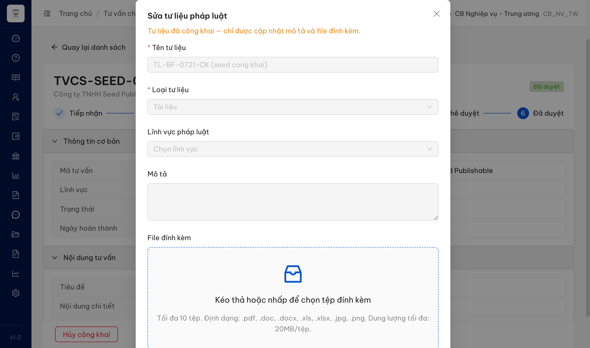
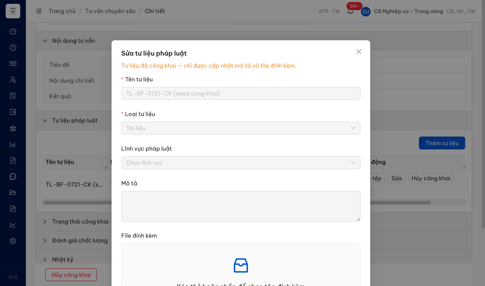
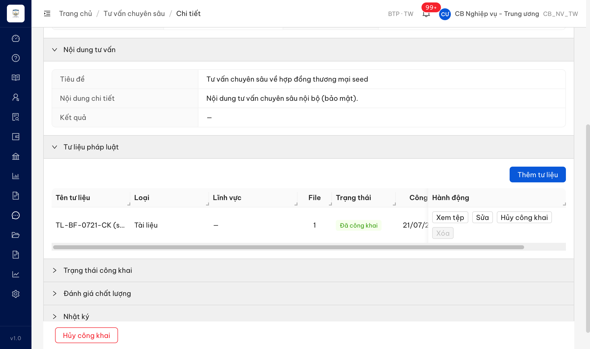

# Bug Report — TVCS Batch F (Tư liệu pháp lý — sửa/xóa/upload validation)

| Thông tin | Giá trị |
|-----------|---------|
| **Dự án** | PM HTPLDN — UAT đối tác (reverify tuần 3) |
| **Môi trường** | https://18.143.165.120.nip.io |
| **Người test** | QA Automation (Claude Code) |
| **Ngày** | 2026-07-23 00:26:00 |
| **Loại test** | Reverify bug đối tác — Functional / Validation / Workflow |
| **Round** | Reverify week 3 — Batch F |
| **Tài liệu tham chiếu** | `session-prompts/tvcs/SESSION-tvcs-batchF-prompt.md` · SRS `input/srs-update-2026-5-5/srs-fr-12-tv-chuyen-sau.md` (FR-X.1-06 / UC152) |

---

## Tổng hợp

Reverify 4 case Batch F (QLTLPLCVV_09/11/15/16). **Snapshot reverify tuần 3 (2026-07-23, tài khoản cbnv_tw_05):** cả **2** bug có SRS reference (QLTLPLCVV_09, QLTLPLCVV_11) trên chức năng "Quản lý tư liệu pháp lý của vụ việc" đã được dev fix và **PASS/Closed** sau khi chạy lại đủ luồng thật trên tư liệu CONG_KHAI. Breakdown: **2 Closed / 0 Open**. (15/16 giữ nguyên **BA confirm** — ngoài phạm vi reverify dev-fix.)

- **QLTLPLCVV_09 (row 298) — ✅ Closed (reverify tuần 3):** click Sửa tư liệu CONG_KHAI nay bị chặn ngay bằng thông báo nghiệp vụ "hủy công khai trước khi sửa", KHÔNG lộ field `moTa/fileDinhKemIds`, KHÔNG mở form mâu thuẫn. (entry dưới)
- **QLTLPLCVV_11 (row 299) — ✅ Closed (reverify tuần 3):** nút "Xóa" trên tư liệu CONG_KHAI nay **enable**; bấm → hộp xác nhận nêu rõ tự hủy công khai → `DELETE` trả **204**, xóa mềm thành công đúng SRS 899–901. (entry dưới)
- **QLTLPLCVV_15 (row 300) — BA confirm:** không tái hiện được path báo lỗi mã độc vì bước Quét virus (SRS dòng 858) trên env verify KHÔNG bắt file chứa chữ ký EICAR chuẩn — file PDF nhúng EICAR upload thành công (201, `trangThaiQuet="SACH"`). Nghi vấn quét virus **được hoãn/chưa bật** → cần BA chốt phạm vi + hướng phản hồi đối tác; kèm **cảnh báo bảo mật** (mã độc mẫu không bị chặn). Chi tiết: `../../ba-confirm/tvcs/ba-confirmation-needed-tvcs-batchF.md` + `cond/QLTLPLCVV_15.md`.
- **QLTLPLCVV_16 (row 301) — BA confirm:** xóa file đính kèm không hiện hộp xác nhận — KHỚP SRS 904–913 (spec không có step confirm cho xóa file, khác xóa tư liệu dòng 900); kỳ vọng đối tác (cần confirm) là spec silent → BA chốt. Kèm **anomaly**: form Sửa trên nip.io không render file cũ (API detail `files:[]` dù `soFile:1`). Chi tiết: `../../ba-confirm/tvcs/ba-confirmation-needed-tvcs-batchF.md` + `cond/QLTLPLCVV_16.md`.

### Severity breakdown

| Tổng | Critical | Major | Medium | Minor | Trivial | Closed | Open |
|------|----------|-------|--------|-------|---------|--------|------|
| 2    | 0        | 0     | 2      | 0     | 0       | 2      | 0    |

## Bug Summary Table

| Bug ID | Severity | Priority | Type | TC Ref | **SRS Reference** | Title | Status |
|--------|----------|----------|------|--------|-------------------|-------|--------|
| BUG-QLTLPLCVV_09 | Medium | P2 | UI/UX | QLTLPLCVV_09 (row 298) | `FR-X.1-06 (UC152) §Processing Chỉnh sửa tư liệu (dòng 888)` · §Error Handling (dòng 950–957) | Sửa tư liệu CONG_KHAI: thông báo lỗi kỹ thuật lộ tên field nội bộ `moTa, fileDinhKemIds`, mâu thuẫn hướng dẫn SRS "hủy công khai trước" | Closed |
| BUG-QLTLPLCVV_11 | Medium | P2 | Workflow | QLTLPLCVV_11 (row 299) | `FR-X.1-06 (UC152) §Processing Xóa mềm tư liệu (dòng 899, 901)` | Xóa tư liệu CONG_KHAI: nút "Xóa" bị disable dù SRS cho phép xóa (tự hủy công khai trước) | Closed |

---

## ~~BUG-QLTLPLCVV_09~~ [CLOSED] — Sửa tư liệu "Công khai": báo lỗi kỹ thuật lộ field `moTa, fileDinhKemIds`, không hướng dẫn hủy công khai

> **Re-test:** 2026-07-23 00:23 R-reverify-tuần-3 (cbnv_tw_05) — ✅ PASS. Chạy lại đủ luồng: tạo tư liệu → upload 1 file → Công khai → **Đã công khai (CONG_KHAI)** → bấm **Sửa**. Hệ thống chặn ngay bằng thông báo nghiệp vụ *"Tư liệu đang công khai, không thể chỉnh sửa. Vui lòng hủy công khai trước khi sửa."* — KHÔNG lộ field `moTa`/`fileDinhKemIds`, KHÔNG mở form mâu thuẫn (0 modal/drawer), KHÔNG bắn `PATCH` (chặn phía client). Đúng hướng dẫn SRS dòng 888.

### Mô tả

Đăng nhập **CB NV (cbnv_tw / CB_NV_TW)** — vai trò CRUD đầy đủ theo SRS dòng 806. Mở "Sửa" một tư liệu pháp lý đang ở trạng thái **CONG_KHAI (Đã công khai)** trong tab Tư liệu PL của TVCS: hệ thống mở form sửa với các trường Tên/Loại/Lĩnh vực/Mô tả **bị disable**, chỉ bật File đính kèm; đầu form có dòng cam "Tư liệu đã công khai — chỉ được cập nhật mô tả và file đính kèm". Khi bấm **Lưu**, hệ thống hiển thị toast lỗi **"Tư liệu đã công khai, chỉ cho phép cập nhật: moTa, fileDinhKemIds"** (lộ tên field API nội bộ) và **từ chối toàn bộ** (PATCH bị chối, modal giữ nguyên) — kể cả khi chỉ thêm/đổi file (mà chính message nói `fileDinhKemIds` được phép). Message không hướng dẫn người dùng "hủy công khai trước" như SRS dòng 888 mô tả, đồng thời tự mâu thuẫn (nói cho cập nhật mô tả nhưng ô Mô tả bị disable).

### Các bước tái hiện

1. Đăng nhập role **CB NV** (`cbnv_tw` / `Test@1234`) — quyền CRUD tư liệu theo SRS dòng 806.
2. Vào **Tư vấn → Tư vấn chuyên sâu** → mở 1 TVCS → mở accordion **Tư liệu pháp luật**.
3. Với 1 tư liệu ở trạng thái **Đã công khai (CONG_KHAI)** có ≥1 file → bấm **Sửa**.
4. Quan sát: các trường Tên/Loại/Lĩnh vực/**Mô tả** bị disable; chỉ File đính kèm enable; dòng cam đầu form "chỉ được cập nhật mô tả và file đính kèm".
5. Bấm **Lưu** (không đổi gì, hoặc chỉ thêm 1 file).
6. Quan sát toast + network.

### Kết quả mong đợi

- Theo SRS `srs-fr-12-tv-chuyen-sau.md:888` (Processing Chỉnh sửa, step 3): khi tư liệu ở CONG_KHAI, hệ thống **từ chối sửa và hướng dẫn người dùng phải hủy công khai trước** khi chỉnh sửa.
- Thông báo cho người dùng cuối phải bằng ngôn ngữ nghiệp vụ, **không lộ tên field kỹ thuật/nội bộ** (`moTa`, `fileDinhKemIds`).
- Thông báo/hành vi phải nhất quán: nếu form thông báo "được cập nhật mô tả và file" thì ô Mô tả phải cho nhập và thao tác Lưu (chỉ mô tả/file) phải thành công; nếu không cho sửa thì phải nói rõ hủy công khai trước.

### Kết quả thực tế

- Bấm Lưu → **1 toast** (đo bằng `tools/toast-capture.js`, không lọc trùng, BI_LAP=false, soObserverDangSong=1): `"Tư liệu đã công khai, chỉ cho phép cập nhật: moTa, fileDinhKemIds"` — lộ tên field API nội bộ.
- Network: **1 request** `PATCH /api/v1/tu-lieu-phap-ly-vvs/172a8cfa-cd62-4f52-9f14-dd1dd00abae5` bị từ chối; modal giữ nguyên (không lưu).
- Thử chỉ thêm 1 file rồi Lưu: **2 request** `POST /api/v1/tu-lieu-phap-ly-vvs/upload` + `PATCH .../172a8cfa-...` → PATCH vẫn bị chối toast y hệt, file **không** được lưu (row vẫn File=1). ⇒ Kể cả thao tác `fileDinhKemIds` (message nói được phép) cũng bị chặn.
- Form: ô **Mô tả disable** dù dòng cam nói "được cập nhật mô tả" → mâu thuẫn nội bộ.
- Message **không** hướng dẫn "hủy công khai trước" như SRS dòng 888.

### Bằng chứng

**1. Ảnh chụp:**





*(Toast kỹ thuật "…moTa, fileDinhKemIds": đo bằng observer (mục Kết quả thực tế) + ảnh đối tác `partner-evidence/QLTLPLCVV_09.jpg` cho toast y hệt trên env đối tác.)*

**2. Network / đo lường:**

```
Bấm Lưu: SO_REQUEST=1 [PATCH /api/v1/tu-lieu-phap-ly-vvs/172a8cfa-...] · SO_KHUNG_THONG_BAO=1
  chu = "Tư liệu đã công khai, chỉ cho phép cập nhật: moTa, fileDinhKemIds" · BI_LAP=false
Thử thêm file: SO_REQUEST=2 [POST .../upload, PATCH .../172a8cfa-...] · PATCH bị chối · file không lưu (File=1)
```

---

## ~~BUG-QLTLPLCVV_11~~ [CLOSED] — Xóa tư liệu "Công khai": nút "Xóa" bị disable dù SRS cho phép xóa (tự hủy công khai trước)

> **Re-test:** 2026-07-23 00:26 R-reverify-tuần-3 (cbnv_tw_05) — ✅ PASS. Chạy lại đủ luồng trên tư liệu **Đã công khai (CONG_KHAI)** `TL-REVERIFY-0911-CK`: nút **Xóa** nay **enable** (`disabled=false`, `ant-btn-dangerous`) → bấm hiện hộp xác nhận *"Xóa tư liệu…? Tư liệu đang công khai sẽ được tự động hủy công khai trước khi xóa."* → xác nhận → toast **"Đã xóa tư liệu"**, hàng biến mất, `DELETE /api/v1/tu-lieu-phap-ly-vvs/{id}` trả **204**. Xóa mềm CONG_KHAI (tự hủy công khai) hoạt động đúng SRS 899–901.

### Mô tả

Đăng nhập **CB NV (cbnv_tw / CB_NV_TW)** — vai trò CRUD đầy đủ (SRS dòng 806). Trong tab Tư liệu PL của 1 TVCS, một tư liệu ở trạng thái **CONG_KHAI (Đã công khai)** hiển thị nút **"Xóa" bị disable** (mờ xám, `disabled=true`), trong khi các nút Xem tệp / Sửa / Hủy công khai cùng hàng vẫn enable. Cùng tư liệu đó khi ở trạng thái **NHAP** thì nút Xóa enable (đỏ). Theo SRS dòng 899/901, xóa mềm một tư liệu CONG_KHAI **vẫn được phép**: hệ thống tự set `cong_khai=0` trước (hủy công khai) rồi soft-delete — không quy định disable nút Xóa.

### Các bước tái hiện

1. Đăng nhập role **CB NV** (`cbnv_tw` / `Test@1234`) — quyền CRUD tư liệu theo SRS dòng 806.
2. Vào **Tư vấn → Tư vấn chuyên sâu** → mở 1 TVCS → accordion **Tư liệu pháp luật**.
3. Chuẩn bị 1 tư liệu ở trạng thái **Đã công khai (CONG_KHAI)** (có ≥1 file, đã bấm Công khai).
4. Quan sát nút **Xóa** trên hàng tư liệu CONG_KHAI đó (so với tư liệu NHAP).

### Kết quả mong đợi

- Theo SRS `srs-fr-12-tv-chuyen-sau.md:899, 901` (Processing Xóa mềm tư liệu): tư liệu CONG_KHAI **vẫn xóa được** — hệ thống tự hủy công khai (set `cong_khai=0`) trước rồi soft-delete. Nút Xóa phải **enable**; khi bấm hệ thống hiển thị xác nhận (dòng 900) rồi thực hiện.

### Kết quả thực tế

- Với tư liệu **Đã công khai (CONG_KHAI)**: nút **"Xóa" disable** — `evaluate_script` đọc `{t:"Xóa", disabled:true, cls:"...ant-btn-dangerous ...ant-btn-variant-outlined ant-btn-sm"}`. Nút Xem tệp/Sửa/Hủy công khai cùng hàng: `disabled:false`.
- Baseline: cùng tư liệu lúc **NHAP** → nút Xóa `disabled:false` (đỏ, enable).
- ⇒ Người dùng không thể xóa trực tiếp tư liệu công khai; phải hủy công khai thủ công trước — trái với hành vi tự-hủy-công-khai mà SRS dòng 899 mô tả.

### Bằng chứng

**1. Ảnh chụp:**



**2. Đo lường (DOM):**

```
CONG_KHAI: button "Xóa" disabled=true (ant-btn-dangerous)  | Sửa/Hủy công khai/Xem tệp disabled=false
NHAP (baseline cùng tư liệu): button "Xóa" disabled=false (enable)
```

---

## Phụ lục — Môi trường test

| Thành phần | Giá trị |
|------------|---------|
| URL ứng dụng | https://18.143.165.120.nip.io |
| OTP login | MailHog http://18.143.165.120:8025 |
| API base | https://18.143.165.120.nip.io/api/v1 |
| Frontend | React + Ant Design (v5) |
| Xác thực | JWT + OTP (email) |
| Tool test | Chrome DevTools MCP |
| Tài khoản verdict | `cbnv_tw` (CB_NV_TW — đúng Tác nhân UC152, SRS dòng 806) |
| Data seed | TVCS-SEED-0001 · tư liệu `TL-BF-0721-CK` (CONG_KHAI, 1 file) |

---

*Bug report generated: 2026-07-21 19:00:00 | QA Automation via Claude Code*
