# Bug Report — UAT đối tác tuần 3 (Vụ việc HTPL)

| Thông tin | Giá trị |
|-----------|---------|
| **Dự án** | PM HTPLDN |
| **Môi trường** | https://18.143.165.120.nip.io |
| **Người test** | QA Automation (Claude Code) |
| **Ngày** | 2026-07-27 11:52:00 |
| **Loại test** | Verify bug đối tác — vòng đầu (Workflow) |
| **Round** | Reverify tuần 3 |
| **Tài liệu tham chiếu** | [QA_VERIFY_PROTOCOL.md](../../../QA_VERIFY_PROTOCOL.md) · SRS v3.5 `srs-fr-05-vu-viec.md` · Sheet tab `UAT_TGPL Doanh Nghiệp-tuần 3` |

---

## Tổng hợp

> **Snapshot LATEST (2026-07-27):** **14 tổng · 14 Closed · 0 Open.** 12 bug dev-done đã PASS ở reverify tuần 3 (2026-07-22). 2 case còn lại từng chờ BA nay đã chốt và PASS: **BUG-CNKQVV_02** (BA duyệt 2026-07-24 — Dev sửa theo SRS; PASS round 3 ngày 2026-07-25) và **BUG-CNKQHT_03** (BA duyệt 2026-07-24; PASS round 6 ngày 2026-07-25, re-verify lại đủ tiêu chí 2026-07-27). Bối cảnh BA xem [`../../ba-confirm/vu-viec/ba-confirmation-needed-vu-viec.md`](../../ba-confirm/vu-viec/ba-confirmation-needed-vu-viec.md).

### Severity breakdown

| Tổng | Critical | Major | Medium | Minor | Trivial | Closed | Open |
|------|----------|-------|--------|-------|---------|--------|------|
| 14 | 0 | 10 | 1 | 3 | 0 | 14 | 0 |

## Bug Summary Table

| Bug ID | Severity | Priority | Type | TC Ref | **SRS Reference** | Title | Status |
|--------|----------|----------|------|--------|-------------------|-------|--------|
| ~~BUG-CNKQHT_03~~ | Medium | P2 | UI/Design | CNKQHT_03 | `FR-V.I-15 §Inputs` (`srs-fr-05-vu-viec.md:1083-1085`) · `Accordion 6` (dòng 1721) · `FR-V.I-16` (dòng 1139) · *(ý 10.000 ký tự: chờ BA — [ba-confirmation](../../ba-confirm/vu-viec/ba-confirmation-needed-vu-viec.md))* | Modal "Cập nhật kết quả hỗ trợ" của người được phân công thiếu trường Tệp kết quả hỗ trợ và thừa trường Kết luận so với thiết kế | **Closed** |
| ~~BUG-CNKQVV_02~~ | Minor | P3 | UI/Design | CNKQVV_02 | `FR-V.I-16 §Inputs` (`srs-fr-05-vu-viec.md:1136-1140`) · `§AC` (dòng 1167) · `SCR-V.I-03 §Bảng nút hành động` (dòng 1739) · *(hướng xử lý chờ BA — [ba-confirmation](../../ba-confirm/vu-viec/ba-confirmation-needed-vu-viec.md))* | Modal/nút "Hoàn thành vụ việc" lệch đặc tả: nút tên "Hoàn thành" thay vì "Cập nhật kết quả cuối" + thừa trường "Kết quả xử lý" không có trong Inputs — vừa là bug vừa chờ BA chốt giữ app hay sửa theo đặc tả | **Closed** |
| ~~BUG-PDHSVV_02~~ | Major | P1 | Workflow | PDHSVV_02 | `FR-V.I-13 (UC 63) §Processing bước 2+4` (`srs-fr-05-vu-viec.md:984,986`) · `§Postconditions` (dòng 995) · `Accordion 7` (dòng 1722) · `BR-NOTIF-01` (dòng 2455) | Phê duyệt vụ việc thành công nhưng không gửi thông báo cho Cán bộ Nghiệp vụ phụ trách, và trường "Người duyệt" trong nhóm Phê duyệt hiển thị mã định danh (UUID) thay vì tên người duyệt | **Closed** |
| ~~BUG-VV-LICHSU-THATBAI~~ | Major | P2 | Data | — (phát sinh khi dựng tiền đề XNTGHTVV_04) | `FR-V.I-09 §Processing bước 8` (`srs-fr-05-vu-viec.md:750`) · `§Error Handling E1` (dòng 776) | Thao tác phân công bị máy chủ từ chối vẫn được ghi vào Dòng thời gian của vụ việc như một lần phân công đã diễn ra | **Closed** |
| ~~BUG-VV-MALOI-LO-UI~~ | Minor | P3 | UI/Copy | TPDHSVV_02 (hệ thống) | `§Error Handling` cột "Message" (chuẩn chung — vd `srs-v4/...:919` ERR-TR-03; `srs-v3.5/...:211,286`) · *(product owner xác nhận 2026-07-20: toast chỉ text, không mã lỗi — toàn hệ thống)* | Thông báo hiển thị cho người dùng bị lẫn mã lỗi kỹ thuật nội bộ ở đầu câu (vd "ERR-VAL-VI-TD-02: ...") — có tính hệ thống | **Closed** |
| ~~BUG-XNTGHTVV_04~~ | Major | P1 | Workflow | XNTGHTVV_04 | `FR-V.I-10 (UC 60) §Processing bước 5` (`srs-fr-05-vu-viec.md:824`) · `§Postconditions` (dòng 833) · `BR-NOTIF-01` (dòng 2455) | Tư vấn viên chấp nhận tham gia hỗ trợ nhưng cán bộ nghiệp vụ phụ trách không nhận được thông báo ở cả 2 kênh in-app và email | **Closed** |
| ~~BUG-CNKQHT_06~~ | Major | P2 | Workflow/Data | CNKQHT_06 | `SCR-V.I-03 §Trạng thái lỗi màn hình — "Xung đột optimistic lock"` (`srs-fr-05-vu-viec.md:1586`) · `"Hai cán bộ thao tác cùng lúc"` (dòng 1773) · `BR "Tất cả chuyển trạng thái SHALL dùng optimistic locking"` (dòng 2294) | Cập nhật kết quả hỗ trợ khi bản ghi đã bị người khác sửa: hệ thống lặng lẽ ghi đè, không hiện thông báo xung đột — thao tác không kèm phiên bản dù bản ghi có trường version (2 người khác nhau ghi đè, version 1→2→3, không 409) | **Closed** |
| ~~BUG-PDHSVV_05~~ | Major | P1 | Workflow | PDHSVV_05 | `FR-V.I-13 (UC 63) §Processing bước 3-4` (`srs-fr-05-vu-viec.md:985-986`) · `§Postconditions` (dòng 995) · `§AC` (dòng 1008) · `Accordion 7` (dòng 1722) · `BR-FLOW-04` (dòng 2395) · `BR-NOTIF-01` (dòng 2455) | Từ chối phê duyệt vụ việc thành công nhưng không gửi thông báo cho Cán bộ Nghiệp vụ + người được phân công, và màn chi tiết không hiển thị lý do từ chối | **Closed** |
| ~~BUG-PDHSVV_03~~ | Minor | P3 | UI/Copy | PDHSVV_03 | `FR-V.I-13 (UC 63) §Error Handling E2` mã ERR-PD-02 (`srs-fr-05-vu-viec.md:1002`) | Thông báo khi Cán bộ Phê duyệt khác đơn vị bấm Phê duyệt hiển thị sai nội dung so với đặc tả — lộ từ kỹ thuật "bản ghi" thay vì thông báo "Bạn không có quyền phê duyệt vụ việc này" | **Closed** |
| ~~BUG-TPDHSVV_04~~ | Major | P1 | Workflow | TPDHSVV_04 | `FR-V.I-11 (UC 61) §Processing bước 3` (`srs-fr-05-vu-viec.md:877`) · `§Postconditions` (dòng 884-885) · `AT-03` (dòng 78) · `BR-NOTIF-01` (dòng 2455) | Vụ việc trình phê duyệt thành công nhưng Cán bộ Phê duyệt cùng đơn vị không nhận được thông báo ở cả 2 kênh in-app và email | **Closed** |
| ~~BUG-CNKQVV_05~~ | Major | P2 | Workflow | CNKQVV_05 | `BR optimistic locking cho chuyển trạng thái` (`srs-fr-05-vu-viec.md:2294`) · `SCR-V.I-03 §Xung đột optimistic lock` (dòng 1586) · `"Hai cán bộ thao tác cùng lúc"` (dòng 1773) · *(mã lỗi lộ UI: cùng loại BUG-VV-MALOI-LO-UI)* | Hoàn thành vụ việc khi đã bị người khác hoàn thành: thông báo sai — lộ mã lỗi kỹ thuật ("ERR-STATE-V-HT-01: …") thay vì thông báo xung đột "vui lòng tải lại"; thao tác hoàn thành không kèm phiên bản. Ý "thông báo lặp" đối tác nêu không tái hiện | **Closed** |
| ~~BUG-DGKQHTVV_01~~ | Major | P1 | Workflow | DGKQHTVV_01 | `FR-V.I-17 (UC 67) §PRE-02+03` (`srs-fr-05-vu-viec.md:1186-1187`) · `§Processing bước 1-2` (dòng 1204-1205) · `SCR-V.I-03 §Bảng nút hành động` (dòng 1740) · `Accordion 8` (dòng 1723) · `§Quy ước hiển thị nút` (dòng 1747) | Vụ việc đã "Hoàn thành" nhưng Cán bộ Nghiệp vụ được giao không có nút [Đánh giá] + biểu mẫu chấm điểm trên giao diện — chức năng đánh giá (UC67) không truy cập được dù endpoint máy chủ tồn tại và cho phép | **Closed** |
| ~~BUG-XNTGHTVV_03~~ | Major | P1 | Workflow | XNTGHTVV_03 | `FR-V.I-10 (UC 60) §Processing bước 3` (`srs-fr-05-vu-viec.md:822`) · `§Acceptance Criteria` (dòng 845) · `§Error Handling E1` (dòng 839) | Từ chối tham gia hỗ trợ vụ việc thành công nhưng giao diện đẩy người dùng sang màn báo lỗi 403 "Vụ việc không được phân công cho bạn" | **Closed** |
| ~~BUG-VV-PHANCONGLAI~~ | Major | P1 | Workflow | — (phát sinh khi dựng tiền đề XNTGHTVV_04) | `SCR-V.I-03 §Bảng nút hành động theo trạng thái` (`srs-fr-05-vu-viec.md:1734`) · `FR-V.I-10 §Postconditions` (dòng 832) | Vụ việc bị tư vấn viên từ chối quay về "Đã tiếp nhận" nhưng không phân công lại được — màn hình không có nút Phân công và máy chủ cũng chặn thao tác | **Closed** |

---

## ~~BUG-XNTGHTVV_03~~ [CLOSED] — Từ chối tham gia hỗ trợ vụ việc thành công nhưng giao diện đẩy sang màn 403 "Vụ việc không được phân công cho bạn"

> **Re-test:** 2026-07-22 17:15:00 R2 (reverify tuần 3) — ✅ PASS. Login qa_tvvseed28, VV-BTP-TW-003 (Đã phân công) → Từ chối + nhập lý do → POST /tu-choi-phan-cong trả 201, UI điều hướng về màn DANH SÁCH (/vu-viec/danh-sach) + toast 'Đã từ chối phân công'. KHÔNG còn màn 403 'không được phân công cho bạn'.

### Mô tả

Tư vấn viên được phân công vụ việc, bấm **Từ chối** và nhập lý do hợp lệ. Thao tác **thành công** (vụ việc chuyển đúng về "Đã tiếp nhận", có thông báo "Đã từ chối phân công"), nhưng ngay sau đó hệ thống điều hướng người dùng sang màn báo lỗi **403 — "Vụ việc không được phân công cho bạn"** (`ERR-AUTH-VPD-00-04`) thay vì quay về màn hình danh sách. Người dùng hiểu nhầm là thao tác đã thất bại.

Tái hiện **2/2** trên 2 vụ việc khác nhau, với đúng vai trò của đối tác (TVV · CG).

### Các bước tái hiện

1. Đăng nhập tài khoản `qa_tvvseed28` — vai trò **Tư vấn viên (TVV) + Chuyên gia tư vấn (CG)**, đơn vị Cục Bổ trợ tư pháp - Bộ Tư pháp (cấp TW). Đây là tài khoản **được phân công** xử lý vụ việc (`nguoiXuLyId` = userId của tài khoản này), thoả điều kiện `FR-V.I-10 §Preconditions PRE-02` (`srs-fr-05-vu-viec.md:806`).
2. Vào menu **Vụ việc HTPL** → mở vụ việc **VV-BTP-TW-20260712-005** đang ở trạng thái **Đã phân công** (màn chi tiết hiển thị đủ 2 nút `[Chấp nhận]` `[Từ chối]`, bảng Phân công ghi "Chờ xác nhận").
3. Bấm nút **Từ chối** → hộp thoại "Từ chối phân công" mở ra.
4. Nhập lý do hợp lệ (≥10 ký tự), bấm **Xác nhận**.
5. Quan sát: hệ thống hiển thị thông báo "Đã từ chối phân công" rồi **chuyển sang màn 403** "Vụ việc không được phân công cho bạn".

### Kết quả mong đợi

- Theo `srs-fr-05-vu-viec.md:822` (FR-V.I-10 §Processing bước 3) và AC dòng 845: khi người được phân công từ chối và nhập lý do, vụ việc chuyển về **"Đã tiếp nhận" (DA_TIEP_NHAN)** để phân công lại — và người dùng được đưa về màn hình danh sách kèm thông báo xác nhận đã từ chối.
- Theo `srs-fr-05-vu-viec.md:839` (§Error Handling E1), thông báo "Bạn không được phân công cho vụ việc này" **chỉ được hiển thị khi tài khoản hiện tại KHÔNG phải người được phân công**. Ở đây tài khoản đúng là người được phân công nên không được hiện màn báo lỗi này.

### Kết quả thực tế

- Vụ việc **đã chuyển đúng** sang "Đã tiếp nhận", người xử lý được xoá về "—" (phần nghiệp vụ phía máy chủ chạy đúng).
- Nhưng giao diện điều hướng người dùng sang màn **403 — "Vụ việc không được phân công cho bạn"**, mã lỗi `ERR-AUTH-VPD-00-04`, dòng "Vai trò hiện tại: TVV CG". Người dùng không được quay về danh sách.
- Đo bằng `tools/toast-capture.js` (tự kiểm observer = 1, không lọc trùng, đọc `innerText`): **1 request ghi** `POST /api/v1/vu-viecs/{id}/tu-choi-phan-cong` · **1 khung thông báo** "Đã từ chối phân công" · không lặp. → Không phải lỗi gửi 2 lần, cũng không phải thông báo lặp.
- Kiểm chứng bằng phương pháp thứ hai (gọi API trực tiếp cùng thao tác trên VV-BTP-TW-20260712-003): trả **HTTP 201**, `trangThai` chuyển `DA_PHAN_CONG` → `DA_TIEP_NHAN`, `nguoiXuLyId`/`nguoiHoTroId`/`ngayPhanCong` được xoá null. → Nghiệp vụ phía máy chủ đúng; sai lệch nằm ở phía giao diện: sau khi từ chối xong, tài khoản không còn là người được phân công nên lần đọc lại chi tiết vụ việc trả 403, giao diện chuyển thẳng người dùng sang màn lỗi 403.

### Bằng chứng

**1. Ảnh chụp**

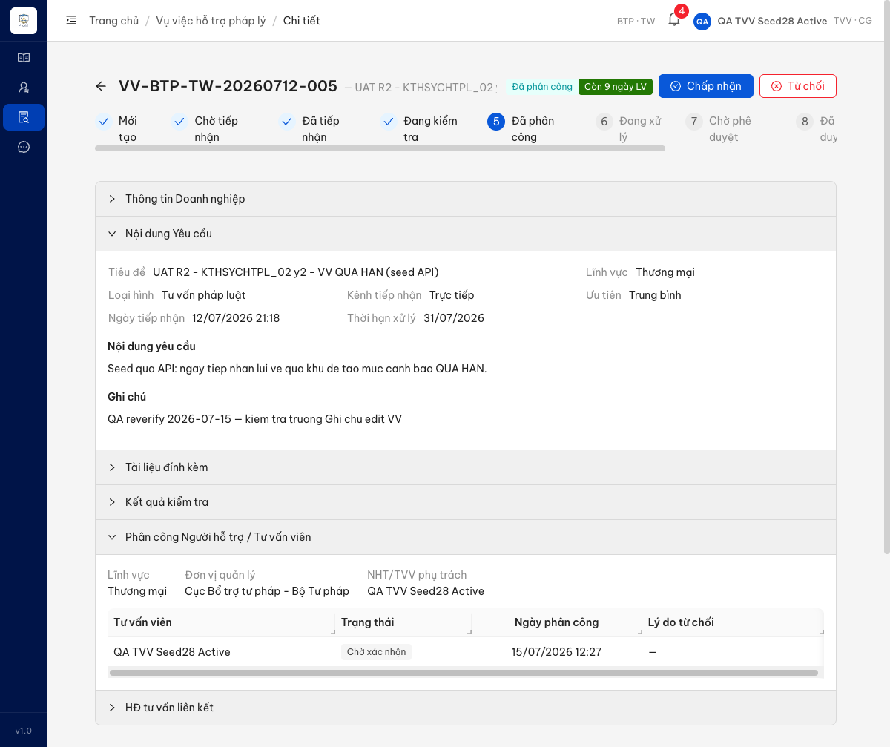

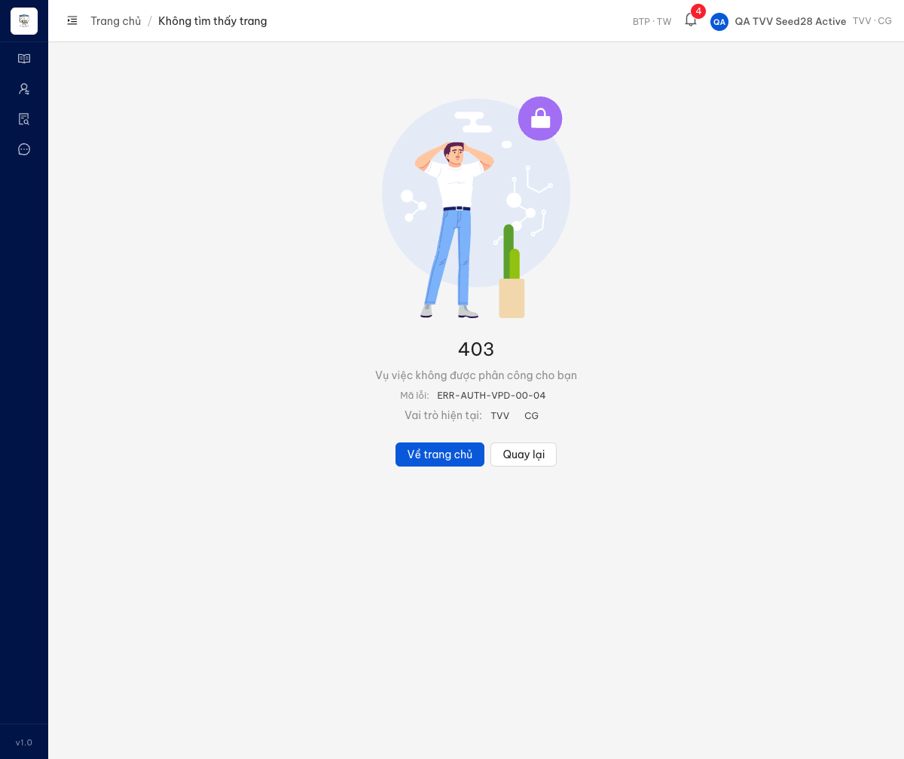

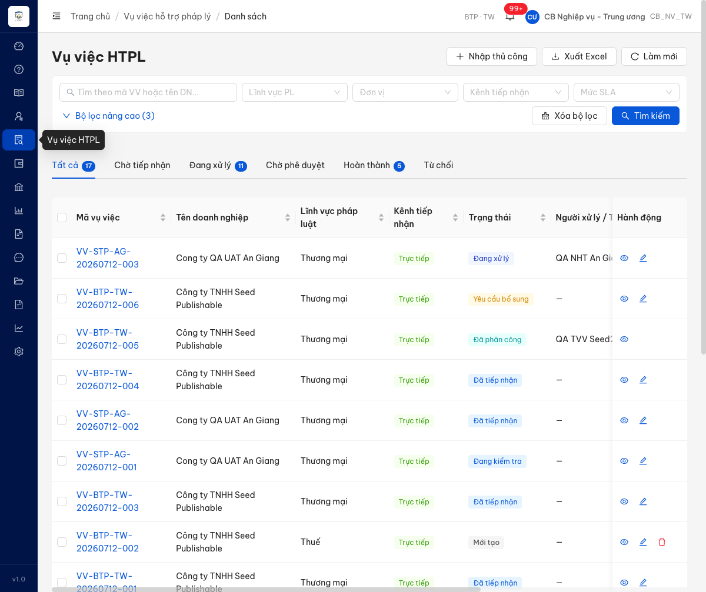

**2. API response** *(phụ trợ — gọi trực tiếp cùng thao tác, chứng minh nghiệp vụ máy chủ đúng)*

```json
{
  "success": true,
  "data": {
    "maVuViec": "VV-BTP-TW-20260712-003",
    "trangThai": "DA_TIEP_NHAN",
    "nguoiXuLyId": null,
    "nguoiHoTroId": null,
    "ngayPhanCong": null
  }
}
```

---

## ~~BUG-XNTGHTVV_04~~ [CLOSED] — Tư vấn viên chấp nhận tham gia hỗ trợ nhưng cán bộ nghiệp vụ phụ trách không nhận được thông báo ở cả 2 kênh in-app và email

> **Re-test:** 2026-07-22 18:22:00 R2 (reverify tuần 3) — ✅ PASS. Chạy đủ luồng: TVV qa_tvvseed28 bấm Chấp nhận tham gia VV-BTP-TW-004 → cán bộ nghiệp vụ phụ trách cbnv_tw NAY nhận thông báo ở CẢ 2 kênh. Email 'Người hỗ trợ đã xác nhận tham gia vụ việc - VV-BTP-TW-...-004' gửi tới cbnv_tw@... lúc 10:33:52Z. Chuông in-app cbnv_tw hiện mục PHAN_CONG cùng nội dung (42 phút trước). Không còn tình trạng 0 thông báo như trước.

### Mô tả

Tư vấn viên được phân công bấm **Chấp nhận** tham gia hỗ trợ vụ việc. Thao tác chạy đúng: vụ việc chuyển sang "Đang xử lý", bản ghi phân công cập nhật thành "Chấp nhận", nhóm "Kết quả hỗ trợ" mở ra. Nhưng **cán bộ nghiệp vụ phụ trách hồ sơ không nhận được thông báo nào** — không có trên chuông thông báo trong hệ thống, cũng không có email.

### Các bước tái hiện

1. Đăng nhập `qa_tvvseed28` — vai trò **Tư vấn viên (TVV) + Chuyên gia tư vấn (CG)**, đơn vị Cục Bổ trợ tư pháp - Bộ Tư pháp (cấp TW). Đây là tài khoản được phân công xử lý vụ việc **VV-BTP-TW-20260712-001**.
2. Ghi lại số thông báo hiện có của cán bộ nghiệp vụ phụ trách hồ sơ (`cbnv_tw`) trước khi thao tác: **117** thông báo, trong đó **0** thông báo thuộc về vụ việc.
3. Vào menu **Vụ việc HTPL** → mở vụ việc đang ở trạng thái **Đã phân công**.
4. Bấm **Chấp nhận** → hộp thoại "Chấp nhận phân công" hiện ra → bấm **Chấp nhận** để xác nhận.
5. Đăng xuất, đăng nhập lại bằng `cbnv_tw` (cán bộ nghiệp vụ phụ trách hồ sơ — đúng người được ghi ở trường "Người tiếp nhận" của vụ việc).
6. Mở chuông **Thông báo** và kiểm tra hộp thư email của tài khoản này.

### Kết quả mong đợi

- Theo `srs-fr-05-vu-viec.md:824` (FR-V.I-10 §Processing bước 5) và §Postconditions dòng 833: sau khi người được phân công xác nhận tham gia, cán bộ nghiệp vụ phụ trách hồ sơ phải nhận được thông báo.
- Theo `srs-fr-05-vu-viec.md:2455` (BR-NOTIF-01, áp dụng cho FR-V.I-10 theo bảng dòng 2326): thông báo phải được gửi qua **cả 2 kênh — trong hệ thống (in-app) và email**.

### Kết quả thực tế

- Phần nghiệp vụ chạy đúng: vụ việc chuyển "Đã phân công" → "Đang xử lý", bản ghi phân công thành "Chấp nhận", nhóm "Kết quả hỗ trợ" mở ra, người thao tác thấy thông báo "Đã chấp nhận phân công".
- **Kênh trong hệ thống:** sau thao tác, tài khoản `cbnv_tw` vẫn có đúng **117** thông báo như trước — không tăng, vẫn **0** thông báo thuộc về vụ việc, và **0** thông báo nào được tạo sau thời điểm chấp nhận (04:30:32Z).
- **Kênh email:** hộp thư không phát sinh thư nào sau thời điểm chấp nhận (thư gần nhất vẫn là mã xác thực đăng nhập lúc 04:29:04Z).
- Đo bằng `tools/toast-capture.js` (tự kiểm observer = 1, không lọc trùng, đọc `innerText`): **1 request ghi** `POST /api/v1/vu-viecs/{id}/nhan-phan-cong` · **1 khung thông báo** "Đã chấp nhận phân công" · không lặp.
- Đã loại trừ 2 khả năng gây nhầm: (a) *sai người nhận* — trường `nguoiTiepNhanId` của vụ việc trùng đúng định danh của `cbnv_tw`, nên đây đúng là cán bộ phụ trách; (b) *hệ thống thông báo hỏng toàn cục* — cùng phiên làm việc, sự kiện **phân công** vẫn gửi email thành công tới tư vấn viên lúc 04:27:03, tức hạ tầng gửi thông báo vẫn hoạt động, chỉ riêng sự kiện **xác nhận tham gia** không phát thông báo.

### Bằng chứng

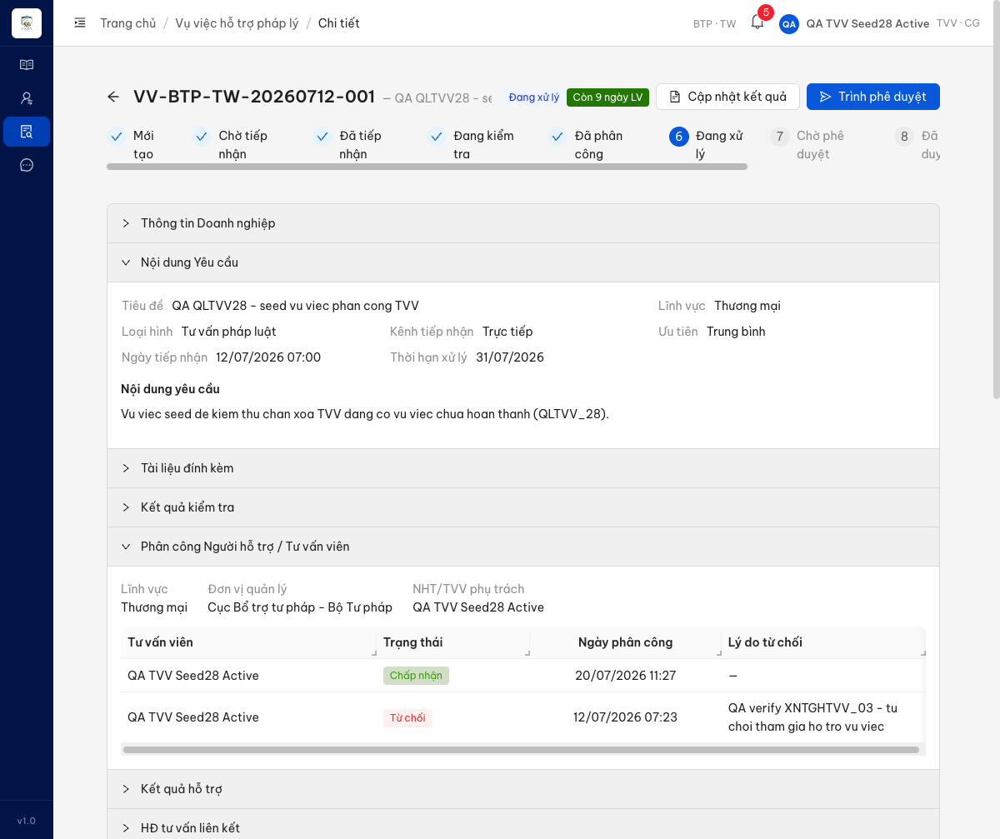

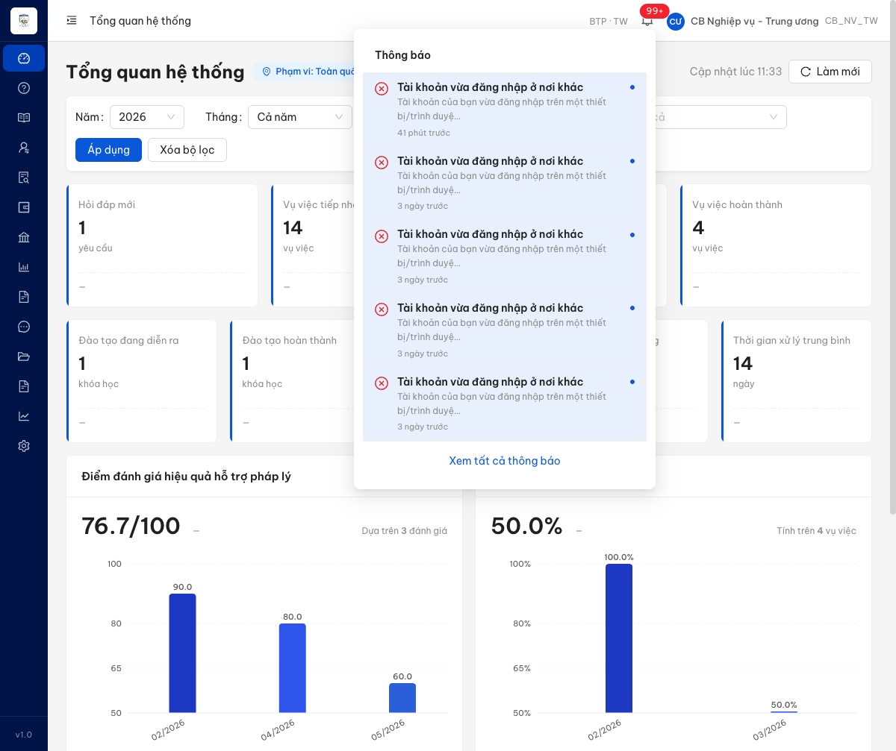

---

## ~~BUG-VV-PHANCONGLAI~~ [CLOSED] — Vụ việc bị tư vấn viên từ chối quay về "Đã tiếp nhận" nhưng không phân công lại được

> **Re-test:** 2026-07-22 17:10:00 R2 (reverify tuần 3) — ✅ PASS. Tại 'Đã tiếp nhận' sau khi bị từ chối (VV-BTP-TW-20260712-003) nay CÓ nút [Phân công]; chọn TVV → Xác nhận → POST /phan-cong trả 201, vụ việc chuyển 'Đã phân công' + toast thành công. Hết cả 2 lỗi (thiếu nút + BE 409).

### Mô tả

Khi tư vấn viên từ chối tham gia, vụ việc quay về trạng thái "Đã tiếp nhận" để cán bộ nghiệp vụ chọn người xử lý khác. Nhưng ở trạng thái này màn hình chi tiết **không hiển thị nút Phân công** — chỉ có nút "Kiểm tra hồ sơ". Gọi thẳng dịch vụ phân công của máy chủ cũng bị từ chối. Kết quả: không thể phân công lại cho người khác, buộc phải làm lại bước kiểm tra hồ sơ từ đầu.

### Các bước tái hiện

1. Đăng nhập `cbnv_tw` (Cán bộ Nghiệp vụ - Trung ương), mở vụ việc **VV-BTP-TW-20260712-001**.
2. Vụ việc đang ở trạng thái **Đã tiếp nhận**, và Dòng thời gian ghi rõ mục **"Từ chối phân công — 20/07/2026 10:50 — QA TVV Seed28 Active"**, tức đây đúng là tình huống "quay về Đã tiếp nhận sau khi bị từ chối".
3. Quan sát thanh nút hành động ở đầu màn hình chi tiết.
4. Kiểm chứng thêm bằng cách gọi trực tiếp dịch vụ phân công của máy chủ cho chính vụ việc này với một tư vấn viên hợp lệ.

### Kết quả mong đợi

- Theo `srs-fr-05-vu-viec.md:1734` (SCR-V.I-03, bảng nút hành động theo trạng thái): ở trạng thái **"DA_TIEP_NHAN (phân công lại sau khi bị từ chối)"**, cán bộ nghiệp vụ phải thấy nút **[Phân công]** để mở hộp thoại chọn người/tổ chức xử lý.
- Theo `srs-fr-05-vu-viec.md:832` (FR-V.I-10 §Postconditions): "Nếu từ chối: VV quay lại DA_TIEP_NHAN **để chọn người/tổ chức xử lý khác**" — tức trạng thái này tồn tại chính là để phân công lại.

### Kết quả thực tế

- Màn hình chi tiết chỉ có **một nút duy nhất: "Kiểm tra hồ sơ"**. Không có nút Phân công.
- Gọi trực tiếp dịch vụ phân công cho vụ việc này trả về **HTTP 409** với nội dung `ERR-STATE-VI-PC-01: Vụ việc không ở trạng thái cho phép phân công` → không phải chỉ giao diện thiếu nút, mà máy chủ cũng không chấp nhận phân công ở trạng thái này.
- Đường đi duy nhất còn lại là bấm "Kiểm tra hồ sơ" để đưa vụ việc trở lại "Đang kiểm tra" rồi mới phân công được — tức phải lặp lại bước kiểm tra đã hoàn tất trước đó.

### Bằng chứng

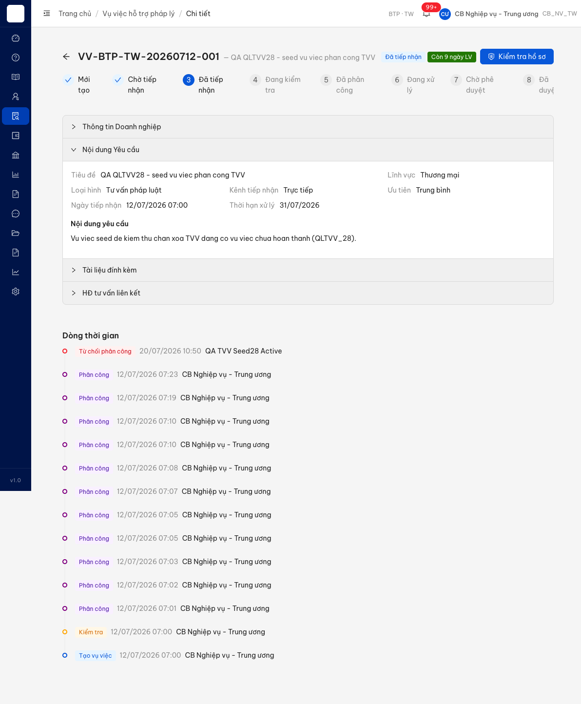

---

## ~~BUG-VV-LICHSU-THATBAI~~ [CLOSED] — Thao tác phân công bị máy chủ từ chối vẫn được ghi vào Dòng thời gian của vụ việc

> **Re-test:** 2026-07-22 18:38:00 R2 (reverify tuần 3) — ✅ PASS. Chạy đủ luồng phân công trên VV-BTP-TW-003 (2 tab): (1) phân công tới TVV đã bị vô hiệu hóa → máy chủ TỪ CHỐI (HTTP 422 ERR-PC-02, không lưu thay đổi); tải lại Dòng thời gian vẫn đúng 2 mục 'Phân công', KHÔNG phát sinh mục ma. (2) phân công tới TVV hợp lệ → THÀNH CÔNG (HTTP 201); Dòng thời gian tăng đúng 1 mục 'Phân công' (18:30). Vậy lịch sử chỉ ghi khi phân công thành công, không ghi khi bị từ chối. FE cũng chặn phân công vào vụ việc đã phân công (không nạp được TVV). Bổ trợ: trình phê duyệt lỗi 409 ở VV-BTP-TW-004 cũng không thêm mục lịch sử.

### Mô tả

Khi một yêu cầu phân công bị máy chủ từ chối (trả lỗi, không có thay đổi nào được lưu), hệ thống vẫn ghi thêm một mục "Phân công" vào Dòng thời gian của vụ việc. Người đọc hồ sơ sẽ thấy nhiều lần phân công không có thật. Trên vụ việc dùng để kiểm thử, Dòng thời gian có **14 mục "Phân công"** trong khi chỉ có 1 lần phân công thực sự thành công.

### Các bước tái hiện

1. Đăng nhập `cbnv_tw`, mở vụ việc **VV-BTP-TW-20260712-001** đang ở trạng thái **Đã phân công** (trạng thái không cho phép phân công tiếp).
2. Đếm số bản ghi lịch sử của vụ việc → **19**.
3. Gọi dịch vụ phân công cho chính vụ việc này (yêu cầu chắc chắn thất bại vì sai trạng thái).
4. Máy chủ trả **HTTP 409** — `ERR-STATE-VI-PC-01: Vụ việc không ở trạng thái cho phép phân công`.
5. Đếm lại số bản ghi lịch sử và mở Dòng thời gian trên màn hình chi tiết.

### Kết quả mong đợi

- Theo `srs-fr-05-vu-viec.md:750` (FR-V.I-09 §Processing bước 8), việc ghi lịch sử vụ việc là **bước cuối cùng**, chỉ chạy sau khi đã tạo bản ghi phân công (bước 5) và cập nhật trạng thái vụ việc (bước 6) thành công.
- Theo `srs-fr-05-vu-viec.md:776` (§Error Handling E1), khi vụ việc không ở trạng thái hợp lệ, hệ thống dừng xử lý và báo lỗi — do đó không được ghi lịch sử.

### Kết quả thực tế

- Số bản ghi lịch sử tăng **19 → 20** dù yêu cầu đã bị từ chối.
- Bản ghi mới có hành động `PHAN_CONG` nhưng phần dữ liệu thay đổi để **rỗng** — dấu hiệu cho thấy không có thao tác thật nào diễn ra.
- Trên màn hình chi tiết, các mục này hiện như những lần phân công bình thường ("Phân công — 20/07/2026 11:25 — CB Nghiệp vụ - Trung ương"), không phân biệt được với lần phân công thật.
- Hệ quả quan sát được: vụ việc này hiển thị **14 mục "Phân công"** trên Dòng thời gian, trong khi thực tế chỉ có **1** lần phân công thành công trong phiên kiểm thử.

### Bằng chứng

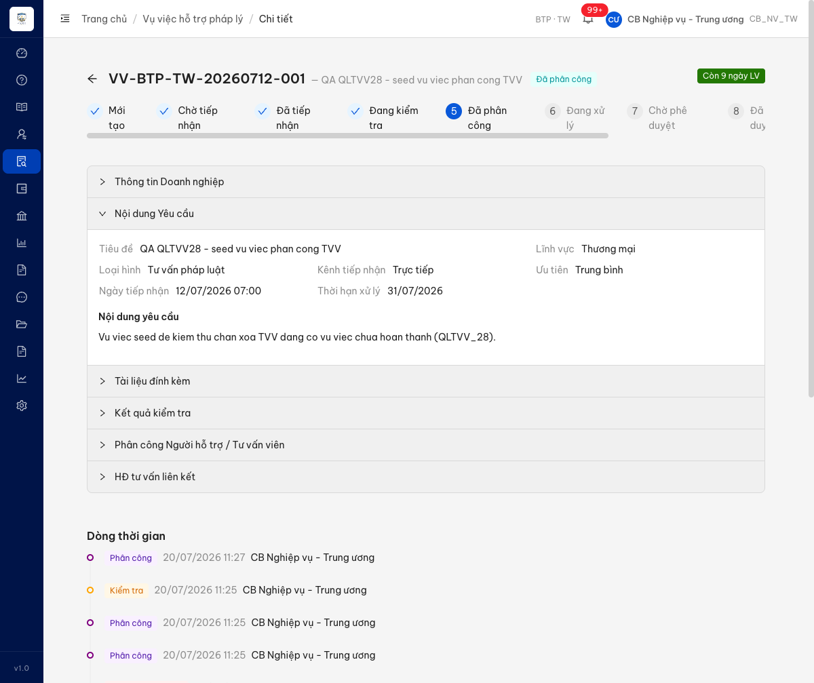

---

## ~~BUG-CNKQHT_03~~ [CLOSED] — Modal "Cập nhật kết quả hỗ trợ" của người được phân công thiếu trường Tệp kết quả hỗ trợ và thừa trường Kết luận so với thiết kế

> **Re-test:** 2026-07-27 11:52 (`cbnv_tw_05`, VV-BTP-TW-20260712-004 Đang xử lý) — ✅ PASS (Closed) đủ tiêu chí. Màn "Cập nhật kết quả hỗ trợ" đúng 3 ô Nội dung kết quả · Tệp kết quả hỗ trợ · Ghi chú, **không còn ô "Kết luận"**; ô Nội dung nhận đủ 10.000 ký tự (nhập thật 10.500 ký tự bị cắt còn 10.000, gõ thêm không vào, bộ đếm `10000 / 10000`); tệp kết quả đính kèm từ trước vẫn còn sau khi mở lại và bấm [Xem] tải về trả **200**. Bằng chứng: `image/RETEST-CNKQHT_03-2026-07-27-modal-3o-10000ky-tu.png`; ý tệp đính kèm đã đo ở `../../dev-fix-reverify-round-6-2026-07-25/README.md` (dòng 11).


### Mô tả

Ở chức năng **Cập nhật kết quả hỗ trợ** (dành cho người được phân công — tư vấn viên/chuyên gia), khi vụ việc ở trạng thái "Đang xử lý", modal nhập kết quả chỉ có 3 trường: **Nội dung kết quả**, **Kết luận**, **Ghi chú**. So với thiết kế (SRS v3.5, FR-V.I-15 §Inputs + Accordion 6):

- **Thiếu** trường **Tệp kết quả hỗ trợ** (`file_ket_qua`) — người được phân công không có chỗ đính kèm tài liệu kết quả (văn bản tư vấn, báo cáo).
- **Thừa** trường **Kết luận** — trường này theo thiết kế thuộc về **cán bộ nghiệp vụ** (trường "Kết luận cuối"), không phải của người được phân công.

Đối tác còn nêu ý thứ ba: Nội dung kết quả chỉ cho phép tối đa 5000 ký tự trong khi "SRS yêu cầu 10.000". Con số 10.000 **không có trong SRS v3.5** (bản được chỉ định dùng) mà chỉ có ở SRS v4 → ý này chờ BA chốt phiên bản, xem [`../../ba-confirm/vu-viec/ba-confirmation-needed-vu-viec.md`](../../ba-confirm/vu-viec/ba-confirmation-needed-vu-viec.md) mục BA-01. Vì 2 ý đầu đã là lỗi thật theo v3.5 nên tổng bug vẫn ghi nhận.

### Các bước tái hiện

1. Đăng nhập `qa_tvvseed28` — vai trò **Tư vấn viên (TVV) + Chuyên gia tư vấn (CG)**, là người được phân công của một vụ việc cấp TW đang ở trạng thái **Đang xử lý**.
2. Vào menu **Vụ việc HTPL** → mở vụ việc đó → nhóm "Kết quả hỗ trợ" hiển thị "Tư vấn viên chưa cập nhật kết quả".
3. Bấm nút **Cập nhật kết quả** trên đầu màn hình chi tiết → modal "Cập nhật kết quả hỗ trợ" mở ra.
4. Đối chiếu các trường trong modal với thiết kế Nhóm 6 (FR-V.I-15).

### Kết quả mong đợi

- Theo `srs-fr-05-vu-viec.md:1083-1085` (FR-V.I-15 §Inputs) và `srs-fr-05-vu-viec.md:1721` (Accordion 6 — Kết quả Hỗ trợ): bộ trường nhập kết quả của **người được phân công** gồm **Nội dung kết quả** (bắt buộc), **Tệp kết quả hỗ trợ** (tùy chọn — tài liệu kết quả) và **Ghi chú** (tùy chọn). Modal phải có chỗ đính kèm tệp kết quả.
- Trường **Kết luận cuối** (`ket_luan_cuoi`) theo `srs-fr-05-vu-viec.md:1139` (FR-V.I-16) và `srs-fr-05-vu-viec.md:1721` là trường của **cán bộ nghiệp vụ**, không được hiển thị trong modal cập nhật kết quả của người được phân công.

### Kết quả thực tế

- Modal "Cập nhật kết quả hỗ trợ" chỉ có 3 trường: **Nội dung kết quả** (bắt buộc, đếm 0/5000), **Kết luận** (tùy chọn), **Ghi chú** (tùy chọn).
- **Không có** ô đính kèm tệp nào — kiểm trực tiếp trong modal: 0 ô chọn tệp, 0 vùng tải lên, không có chữ nào nhắc tới "tệp"/"đính kèm".
- Trường **Kết luận** (vốn thuộc cán bộ nghiệp vụ theo thiết kế) lại xuất hiện trong modal của người được phân công.
- Đo bộ trường modal: `Nội dung kết quả` = ô nhập nhiều dòng, tối đa 5000, bắt buộc · `Kết luận` = ô nhập 1 dòng, tối đa 500, tùy chọn · `Ghi chú` = ô nhập nhiều dòng, tối đa 1000, tùy chọn.

### Bằng chứng


---

## ~~BUG-VV-MALOI-LO-UI~~ [CLOSED] — Thông báo hiển thị cho người dùng bị lẫn mã lỗi kỹ thuật nội bộ ở đầu câu

> **Re-test:** 2026-07-22 18:30:00 R2 (reverify tuần 3) — ✅ PASS. Chạy đủ luồng: cbnv_tw bấm Trình phê duyệt VV-BTP-TW-004 (Đang xử lý, chưa có kết quả). Thông báo hiển thị cho người dùng NAY chỉ còn câu thuần 'Chưa có kết quả xử lý từ tư vấn viên', KHÔNG còn tiền tố mã 'ERR-VAL-VI-TD-02:'. Đo bằng observer innerText 6 node (2 lần chạy) đều sạch mã. Mã kỹ thuật chỉ còn trong JSON lỗi của API (nội bộ, không đưa ra giao diện) — đúng yêu cầu SRS.

### Mô tả

Nhiều thông báo lỗi hiển thị cho người dùng nghiệp vụ bị **lẫn mã lỗi kỹ thuật nội bộ** ở đầu câu (dạng `ERR-XXX-NN: <nội dung>`) thay vì chỉ hiển thị câu thông báo dễ hiểu. Người dùng cuối (cán bộ nghiệp vụ) không cần và không nên thấy mã lỗi kỹ thuật.

Phát hiện khi verify TPDHSVV_02 (thao tác Trình phê duyệt lúc chưa có kết quả). Đây là hiện tượng **có tính hệ thống**, không riêng 1 màn: cũng gặp mã `ERR-AUTH-VPD-00-04` lộ ra ở màn báo lỗi 403 khi từ chối phân công (case XNTGHTVV_03), và `ERR-STATE-V-HT-01/02` khi hoàn thành vụ việc lỗi (case CNKQVV_05).

> **Cập nhật 2026-07-20 — product owner xác nhận:** quy tắc "thông báo (toast) chỉ hiển thị nội dung văn bản dễ hiểu, **KHÔNG kèm mã lỗi**" áp dụng cho **toàn bộ hệ thống**. Đây là căn cứ để verdict case **TPDHSVV_02** đổi từ Reject → **Open** (chính toast của case này lộ mã `ERR-VAL-VI-TD-02`). Ý "thông báo nhân đôi" đối tác báo ở TPDHSVV_02 vẫn không tái hiện, nhưng thao tác này có bug thật khác (lộ mã lỗi) nên không còn là Reject.

### Các bước tái hiện

1. Đăng nhập `cbnv_tw` (Cán bộ Nghiệp vụ - Trung ương), mở vụ việc **VV-BTP-TW-20260712-001** đang ở "Đang xử lý" và **chưa có kết quả hỗ trợ**.
2. Bấm **Trình phê duyệt** → hộp thoại xác nhận → bấm **Trình duyệt**.
3. Quan sát thông báo lỗi hiện lên.

### Kết quả mong đợi

- Theo cách SRS đặc tả **mọi** thông báo lỗi (các bảng Error Handling — cột "Message"): người dùng chỉ thấy **câu dễ hiểu**, không kèm mã lỗi. Ví dụ cùng tình huống này, SRS ghi thông báo là "Chưa có kết quả hỗ trợ từ NHT, không thể trình phê duyệt" (`srs-v4/srs-fr-05-vu-viec.md:919`, `ERR-TR-03`) — chỉ nội dung, **không có** tiền tố mã. Các ví dụ khác cùng chuẩn: `ERR-GHS-01` → "Nội dung yêu cầu là bắt buộc"; `ERR-DVC-01` → "Cấu trúc dữ liệu không hợp lệ" (`srs-v3.5/srs-fr-05-vu-viec.md:211,286`).
- Vậy thông báo hiển thị cần là câu thuần, mã lỗi kỹ thuật chỉ dùng nội bộ (log/trace), không đưa ra giao diện người dùng.

### Kết quả thực tế

- Thông báo hiển thị nguyên văn: **"ERR-VAL-VI-TD-02: Chưa có kết quả xử lý từ tư vấn viên"** — mã kỹ thuật `ERR-VAL-VI-TD-02:` bị đưa ra ngay đầu câu.
- Xác nhận bằng đọc DOM trực tiếp 6 lần (innerText của khung thông báo) + `outerHTML` khung `ant-message-notice-error` — đều chứa tiền tố mã.
- Hiện tượng lặp lại ở màn khác: màn 403 khi từ chối phân công hiện "ERR-AUTH-VPD-00-04" (case XNTGHTVV_03) → nhiều khả năng là cách xử lý chung của giao diện (đổ thẳng mã lỗi từ máy chủ ra thông báo), nên đề nghị dev xử lý tập trung ở lớp hiển thị thông báo.

### Bằng chứng

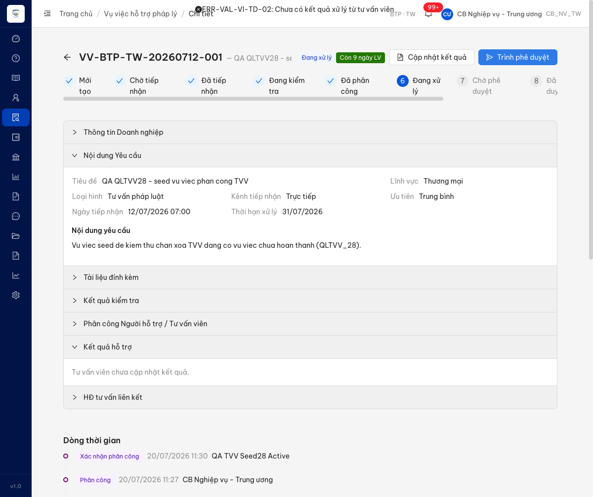

---

## ~~BUG-TPDHSVV_04~~ [CLOSED] — Vụ việc trình phê duyệt thành công nhưng Cán bộ Phê duyệt cùng đơn vị không nhận được thông báo ở cả 2 kênh in-app và email

> **Re-test:** 2026-07-22 18:05:00 R2 (reverify tuần 3) — ✅ PASS (cả 2 kênh). Login cbnv_tw trình phê duyệt VV-BTP-TW-005 (có kết quả) → Chờ phê duyệt. Cán bộ Phê duyệt cùng đơn vị (cbpd_tw) NAY NHẬN đủ 2 kênh: email 'Vụ việc chờ phê duyệt - VV-BTP-TW-005' (10:32:08) + chuông in-app 'Vụ việc chờ phê duyệt - VV-BTP-TW-20260712-005' (5 phút trước). Trước đây thiếu cả 2 kênh.

### Mô tả

Cán bộ Nghiệp vụ trình vụ việc (đã có kết quả hỗ trợ) lên phê duyệt. Thao tác **thành công**: vụ việc chuyển đúng "Đang xử lý" → "Chờ phê duyệt", có thông báo "Đã trình phê duyệt". Nhưng **Cán bộ Phê duyệt cùng đơn vị** — người thực sự phải duyệt vụ việc này — **không nhận được bất kỳ thông báo nào** (cả chuông trong hệ thống lẫn email) về việc có vụ việc mới chờ duyệt, dù vụ việc đã nằm trong danh sách "Chờ phê duyệt" của chính cán bộ đó.

Đây là lỗi **thiếu thông báo**, cùng nhóm với BUG-XNTGHTVV_04.

### Các bước tái hiện

1. (Tiền đề) Người được phân công cập nhật kết quả hỗ trợ cho vụ việc → vụ việc đủ điều kiện trình phê duyệt.
2. Ghi lại số thông báo hiện có của **Cán bộ Phê duyệt cùng đơn vị** (`cbpd_tw` — CB Phê duyệt Trung ương, BTP·TW): chuông **27 chưa đọc**, thông báo mới nhất **16/07/2026**, không có thông báo nào về vụ việc này; email chỉ có thư mã OTP đăng nhập.
3. Đăng nhập **Cán bộ Nghiệp vụ Trung ương** (`cbnv_tw`, BTP·TW — người tiếp nhận vụ việc). Mở vụ việc **VV-BTP-TW-20260712-001** đang ở "Đang xử lý" (đã có kết quả hỗ trợ).
4. Bấm **Trình phê duyệt** → hộp thoại "Gửi vụ việc lên cán bộ phê duyệt?" → bấm **Trình duyệt**.
5. Xác nhận vụ việc chuyển sang **"Chờ phê duyệt"** (timeline ghi "Trình phê duyệt 20/07/2026 12:43").
6. Đăng nhập lại **Cán bộ Phê duyệt cùng đơn vị** (`cbpd_tw`) → mở chuông thông báo và kiểm tra email.

### Kết quả mong đợi

- Theo `srs-fr-05-vu-viec.md:877` (FR-V.I-11 Trình phê duyệt, §Processing bước 3): sau khi trình, hệ thống **gửi thông báo cho Cán bộ Phê duyệt cùng cấp**.
- Theo `srs-fr-05-vu-viec.md:884-885` (§Postconditions): vụ việc chuyển "Chờ phê duyệt" **và** "Cán bộ Phê duyệt cùng cấp nhận thông báo".
- Theo `srs-fr-05-vu-viec.md:78` (AT-03) và `:2453-2455` (BR-NOTIF-01): sự kiện trình/phê duyệt phải gửi thông báo cho người liên quan qua **2 kênh in-app + email**.

### Kết quả thực tế

- Vụ việc chuyển sang "Chờ phê duyệt" **đúng** (postcondition 1 đạt), có 1 request `POST .../../trinh-phe-duyet` + 1 thông báo "Đã trình phê duyệt" (đo bằng `tools/toast-capture.js`, tự kiểm observer = 1).
- Nhưng **Cán bộ Phê duyệt cùng đơn vị không nhận thông báo** (postcondition 2 KHÔNG đạt): sau khi trình, chuông của `cbpd_tw` **vẫn 27 chưa đọc**, thông báo mới nhất **vẫn 16/07/2026**, **không** có thông báo nào về vụ việc vừa trình (kiểm cả danh sách API `/thong-baos` lẫn dropdown chuông trên giao diện). Email `cbpd_tw` **không** có thư nghiệp vụ nào.
- **Loại trừ nhiễu:** vụ việc đã nằm trong danh sách "Chờ phê duyệt" của chính `cbpd_tw` (giao diện hiện đủ nút **Phê duyệt/Từ chối**) → đúng người nhận. `cbpd_tw` **vẫn nhận** thông báo "chờ phê duyệt" cho khóa học + hồ sơ tư vấn viên → kênh thông báo còn hoạt động, chỉ **thiếu riêng** thông báo trình phê duyệt vụ việc. Vụ việc chuyển trạng thái thành công, đúng vai trò và đơn vị → không phải lỗi sai trạng thái/role/người nhận.

### Bằng chứng

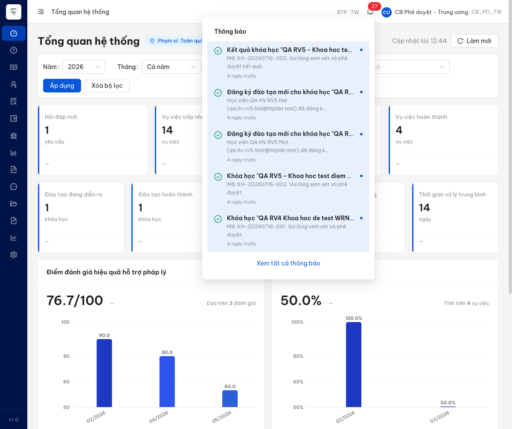

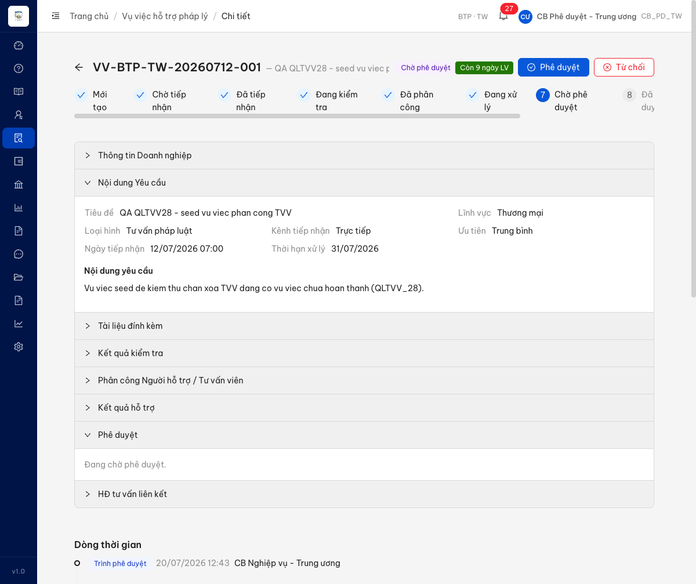

---

## ~~BUG-PDHSVV_05~~ [CLOSED] — Từ chối phê duyệt vụ việc thành công nhưng không gửi thông báo cho Cán bộ Nghiệp vụ + người được phân công, và màn chi tiết không hiển thị lý do từ chối

> **Re-test:** 2026-07-22 18:55:00 R2 (reverify tuần 3) — ✅ PASS (cả 2 ý). cbpd_tw Từ chối VV-BTP-TW-005 + nhập lý do → 201, chuyển 'Đang xử lý'. Ý(1) thông báo: cả Cán bộ Nghiệp vụ (cbnv_tw) VÀ người được phân công (qa_tvvseed28) NAY nhận đủ 2 kênh — email 'Vụ việc bị từ chối phê duyệt - VV-BTP-TW-005' (kèm lý do) + chuông in-app cùng nội dung. Ý(2) lý do: màn chi tiết NAY hiển thị banner cảnh báo cố định 'Vụ việc bị từ chối phê duyệt — Lý do từ chối: ...' ở đầu trang (state Đang xử lý), người được phân công thấy được lý do để sửa.

### Mô tả

Cán bộ Phê duyệt cùng đơn vị từ chối một vụ việc đang ở "Chờ phê duyệt" và nhập lý do hợp lệ. Thao tác **thành công**: vụ việc chuyển đúng "Chờ phê duyệt" → "Đang xử lý" (quay về người được phân công sửa lại kết quả), có thông báo "Đã từ chối phê duyệt". Nhưng phát sinh **2 lỗi**:

1. **Không gửi thông báo từ chối** cho Cán bộ Nghiệp vụ phụ trách hồ sơ và người được phân công (tư vấn viên) — cả chuông trong hệ thống lẫn email đều không có.
2. **Màn chi tiết vụ việc không hiển thị lý do từ chối** — người được phân công (và cán bộ nghiệp vụ) không biết vì sao bị từ chối để sửa lại, dù lý do đã được lưu trong dữ liệu.

Ý (1) cùng nhóm lỗi thiếu thông báo với BUG-XNTGHTVV_04 và BUG-TPDHSVV_04.

### Các bước tái hiện

1. Đăng nhập **Cán bộ Phê duyệt cùng đơn vị** với đơn vị tạo hồ sơ (`cbpd_tw` — CB Phê duyệt Trung ương, BTP·TW). Mở vụ việc **VV-BTP-TW-20260712-001** đang ở trạng thái **"Chờ phê duyệt"** (có nút Phê duyệt/Từ chối).
2. Bấm **Từ chối** → hộp thoại "Từ chối phê duyệt" mở ra → nhập lý do hợp lệ (110 ký tự, ≥10) → bấm **Xác nhận**.
3. Quan sát: thông báo "Đã từ chối phê duyệt", vụ việc chuyển sang **"Đang xử lý"** (timeline ghi "Từ chối duyệt 20/07/2026 13:03").
4. **Kiểm ý (1) — thông báo:** đăng nhập lần lượt **Cán bộ Nghiệp vụ phụ trách** (`cbnv_tw`) và **người được phân công** (`qa_tvvseed28` — tư vấn viên) → mở chuông thông báo + kiểm email.
5. **Kiểm ý (2) — hiển thị lý do:** mở lại màn chi tiết vụ việc (Dòng thời gian + các nhóm/accordion) → tìm lý do từ chối.

### Kết quả mong đợi

- Theo `srs-fr-05-vu-viec.md:986` (FR-V.I-13 §Processing bước 4) + `:995` (§Postconditions) + `:1008` (§AC): sau khi từ chối, hệ thống **gửi thông báo cho Cán bộ Nghiệp vụ phụ trách + người được phân công**.
- Theo `srs-fr-05-vu-viec.md:2453-2455` (BR-NOTIF-01): sự kiện **từ chối** là sự kiện workflow phải gửi thông báo qua **cả 2 kênh — in-app (THONG_BAO) + email**.
- Theo `srs-fr-05-vu-viec.md:1722` (màn chi tiết SCR — Accordion 7 "Phê duyệt", hiển thị khi vụ việc đã qua "Chờ phê duyệt") + `:2395` (BR-FLOW-04 "Lý do hiển thị cho người tạo ban đầu"): màn chi tiết phải **hiển thị lý do từ chối** (`ly_do_tu_choi`).

### Kết quả thực tế

- **Đổi trạng thái + thông báo cho người thao tác ĐẠT:** bấm Từ chối + nhập lý do → toast "Đã từ chối phê duyệt", vụ việc chuyển "Chờ phê duyệt" → "Đang xử lý". Đúng SRS.
- **Ý (1) — thông báo THIẾU (cả 2 người nhận, cả 2 kênh):** sau khi từ chối (13:03, tức 06:03Z), **Cán bộ Nghiệp vụ phụ trách** (`cbnv_tw`) và **người được phân công** (`qa_tvvseed28`) đều **không có thông báo nào** về việc vụ việc bị từ chối — kiểm danh sách API `/api/v1/thong-baos` (không có mục từ chối tạo sau 05:55Z) lẫn dropdown chuông trên giao diện (chỉ có các thông báo cũ: phân công, phê duyệt hồ sơ TVV, đăng nhập nơi khác); email không có thư từ chối.
- **Ý (2) — lý do KHÔNG hiển thị:** lý do từ chối **có được lưu** ở dữ liệu (`VU_VIEC.ghiChuPheDuyet` + bản ghi lịch sử `TU_CHOI_PD` có `duLieuMoi.lyDo`), nhưng màn chi tiết vụ việc **không hiển thị lý do ở bất kỳ đâu**: Dòng thời gian chỉ hiện dòng "Từ chối duyệt" + giờ + người (không kèm lý do); và **khi vụ việc bị từ chối quay về "Đang xử lý", màn chi tiết KHÔNG hiển thị nhóm "Phê duyệt"** (nhóm này chỉ xuất hiện khi vụ việc đang "Chờ phê duyệt" hoặc "Đã duyệt" — ở trạng thái "Đang xử lý" sau từ chối chỉ còn 7 nhóm: Thông tin DN, Nội dung Yêu cầu, Tài liệu đính kèm, Kết quả kiểm tra, Phân công, Kết quả hỗ trợ, HĐ tư vấn liên kết) → đúng lúc người được phân công cần biết lý do để sửa lại thì không có chỗ nào surface lý do. Kiểm ở cả 2 view (người được phân công + cán bộ nghiệp vụ): không tìm thấy chữ lý do trên trang.
- **Loại trừ nhiễu:** (a) *đúng người nhận* — `cbnv_tw` là cán bộ nghiệp vụ phụ trách (trường "Người tiếp nhận"), `qa_tvvseed28` là người được phân công (trường "Người xử lý") của chính vụ việc này; (b) *hệ thống thông báo còn sống* — cả 2 tài khoản vẫn nhận các thông báo workflow khác (phân công, phê duyệt hồ sơ TVV) → chỉ thiếu riêng thông báo **từ chối phê duyệt vụ việc**; (c) *đúng trạng thái* — vụ việc từ CHO_PHE_DUYET, thao tác từ chối thành công.

### Bằng chứng

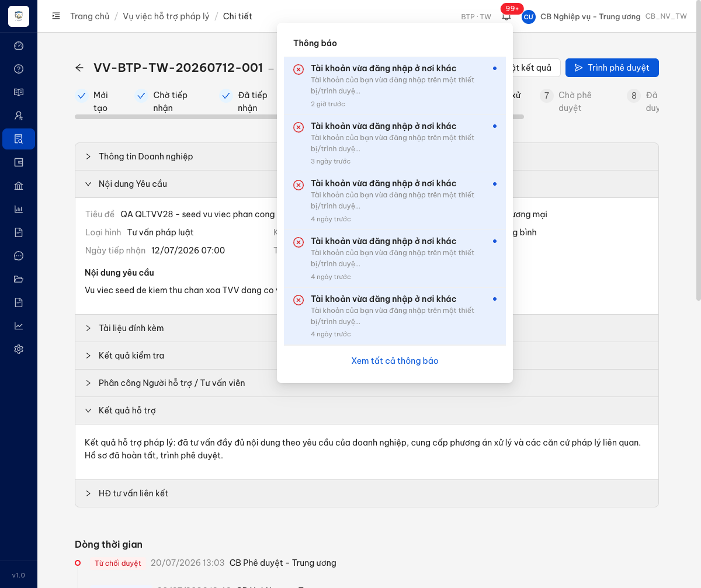

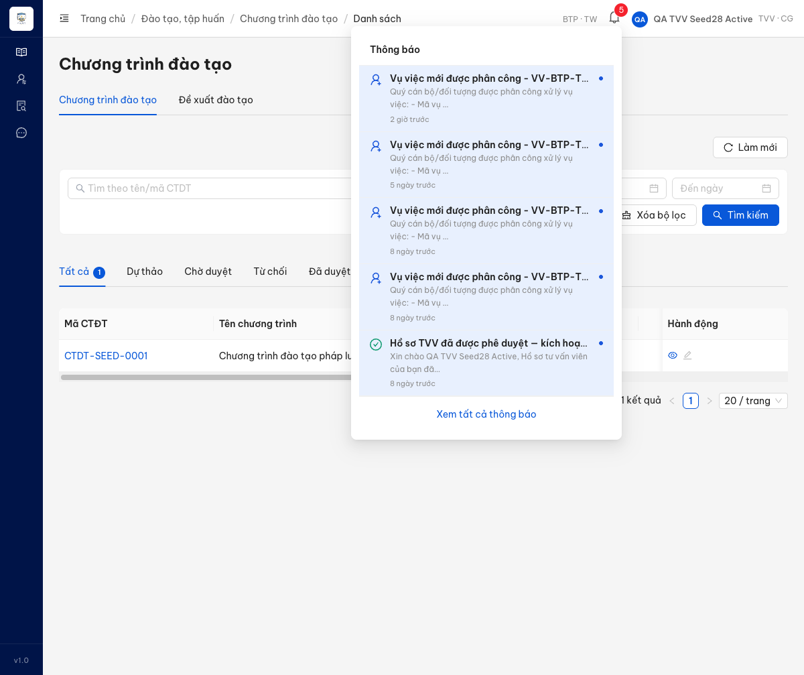

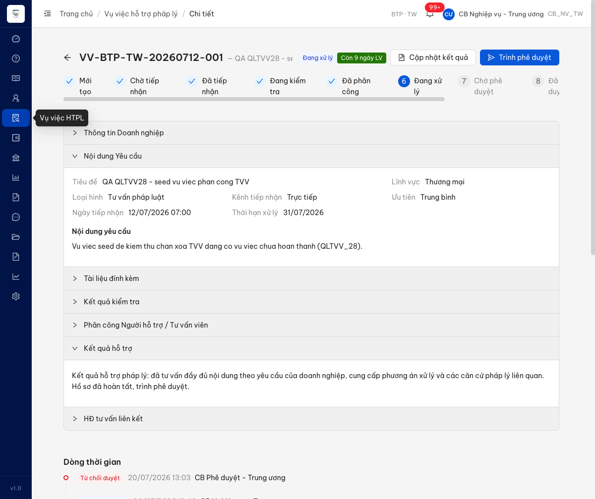

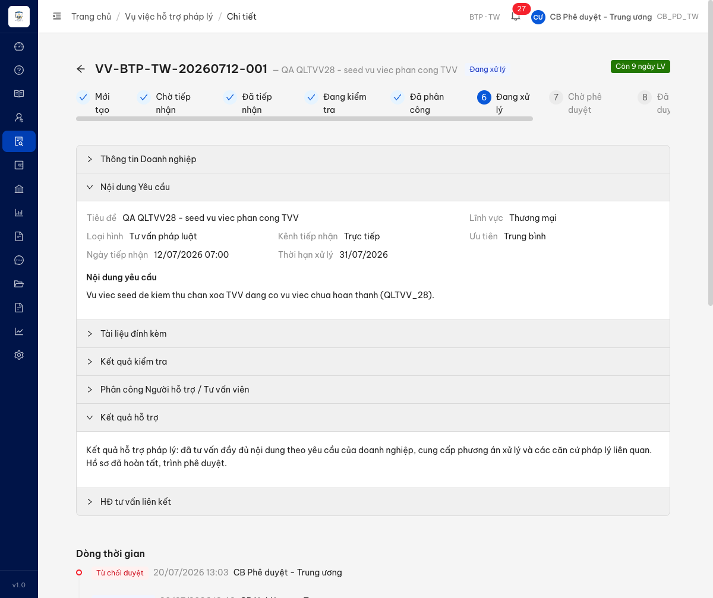

---

## ~~BUG-PDHSVV_02~~ [CLOSED] — Phê duyệt vụ việc thành công nhưng không gửi thông báo cho Cán bộ Nghiệp vụ phụ trách, và trường "Người duyệt" hiển thị mã định danh (UUID) thay vì tên

> **Re-test:** 2026-07-22 18:40:00 R2 (reverify tuần 3) — ✅ PASS cả 2 ý. Chạy đủ luồng: cbnv_tw trình lại VV-BTP-TW-005, cbpd_tw bấm Phê duyệt (HTTP 201) → 'Đã duyệt'. (1) THÔNG BÁO: cbnv_tw nhận đủ 2 kênh — email 'Vụ việc đã được phê duyệt - VV-BTP-TW-...-005' lúc 11:35:33Z + chuông in-app hiện mục PHE_DUYET cùng nội dung (số chưa đọc 225→226). (2) NGƯỜI DUYỆT: nhóm Phê duyệt hiển thị 'Người duyệt: CB Phê duyệt - Trung ương' (đúng tên/chức danh), KHÔNG còn 'ID: <UUID>' — đọc DOM xác nhận không còn tiền tố ID.

### Mô tả

Cán bộ Phê duyệt cùng đơn vị phê duyệt một vụ việc đang ở "Chờ phê duyệt". Thao tác **thành công**: vụ việc chuyển đúng "Chờ phê duyệt" → "Đã duyệt", ghi người duyệt + thời điểm duyệt, có thông báo "Đã phê duyệt". Nhưng phát sinh **2 lỗi**:

1. **Không gửi thông báo** cho Cán bộ Nghiệp vụ phụ trách hồ sơ — cả chuông trong hệ thống lẫn email đều không có thông báo vụ việc đã được duyệt.
2. **Trường "Người duyệt" trong nhóm "Phê duyệt" hiển thị mã định danh kỹ thuật (UUID)** thay vì tên người duyệt — hiện "ID: 4101cf26-cdbd-4f00-ae38-bc3e380366a3" thay vì "CB Phê duyệt - Trung ương".

Ý (1) cùng nhóm lỗi thiếu thông báo với BUG-PDHSVV_05, BUG-TPDHSVV_04, BUG-XNTGHTVV_04. Ý (2) cùng loại lộ mã định danh nội bộ ra giao diện với BUG-VV-MALOI-LO-UI.

### Các bước tái hiện

1. Đăng nhập **Cán bộ Phê duyệt cùng đơn vị** với đơn vị tạo hồ sơ (`cbpd_tw` — CB Phê duyệt Trung ương, BTP·TW). Mở vụ việc **VV-BTP-TW-20260712-001** đang ở trạng thái **"Chờ phê duyệt"** (có nút Phê duyệt/Từ chối).
2. (Ghi baseline) Trước đó ghi lại số thông báo của **Cán bộ Nghiệp vụ phụ trách** (`cbnv_tw`): **117 chưa đọc**, thông báo mới nhất là mục hệ thống lúc 20/07 10:52, không có mục nào về việc duyệt vụ việc này.
3. Bấm **Phê duyệt** → hộp thoại "Phê duyệt vụ việc" ("Bạn xác nhận phê duyệt kết quả xử lý vụ việc?") → bấm **Phê duyệt**.
4. Quan sát: thông báo "Đã phê duyệt", vụ việc chuyển **"Đã duyệt"** (timeline có mục phê duyệt, dữ liệu ghi người duyệt + thời điểm 13:23).
5. **Kiểm ý (1) — thông báo:** đăng nhập lại **Cán bộ Nghiệp vụ phụ trách** (`cbnv_tw`) → mở chuông thông báo + kiểm email.
6. **Kiểm ý (2) — Người duyệt:** mở nhóm **"Phê duyệt"** ở màn chi tiết vụ việc → đọc trường "Người duyệt".

### Kết quả mong đợi

- Theo `srs-fr-05-vu-viec.md:984` (FR-V.I-13 §Processing bước 2): phê duyệt → chuyển DA_DUYET, ghi người phê duyệt + ngày phê duyệt.
- Theo `srs-fr-05-vu-viec.md:986` (§Processing bước 4) + `:995` (§Postconditions): **Cán bộ Nghiệp vụ phụ trách nhận thông báo kết quả**. Theo `srs-fr-05-vu-viec.md:2453-2455` (BR-NOTIF-01): "phê duyệt" là sự kiện workflow phải gửi thông báo qua **cả 2 kênh — in-app + email**.
- Theo `srs-fr-05-vu-viec.md:1722` (màn chi tiết SCR — Accordion 7 "Phê duyệt"): trường `nguoi_duyet` phải hiển thị **danh tính người duyệt** (tên/chức danh), không phải mã định danh nội bộ.

### Kết quả thực tế

- **Đổi trạng thái + ghi người/thời điểm duyệt ĐẠT:** bấm Phê duyệt → toast "Đã phê duyệt", vụ việc chuyển "Chờ phê duyệt" → "Đã duyệt", ghi người duyệt + thời điểm 20/07/2026 13:23. Đo bằng `tools/toast-capture.js` (tự kiểm observer = 1): 1 toast "Đã phê duyệt", không lặp.
- **Ý (1) — thông báo THIẾU (cả 2 kênh):** sau khi phê duyệt (13:23), **Cán bộ Nghiệp vụ phụ trách** (`cbnv_tw`) **không có thông báo nào** về việc vụ việc được duyệt — kiểm danh sách API `/api/v1/thong-baos` (số chưa đọc giữ nguyên **117**, không có mục tạo sau thời điểm duyệt) lẫn dropdown chuông (mục mới nhất vẫn là thông báo cũ trước thời điểm duyệt); email chỉ có thư mã OTP đăng nhập, không có thư báo duyệt.
- **Ý (2) — Người duyệt hiển thị SAI:** nhóm "Phê duyệt" ở màn chi tiết hiển thị `Người duyệt` = **"ID: 4101cf26-cdbd-4f00-ae38-bc3e380366a3"** (mã định danh UUID nội bộ) thay vì tên "CB Phê duyệt - Trung ương". Đọc trực tiếp DOM: nội dung nhóm là "Người duyệt / ID: 4101cf26-... / Ngày duyệt / 20/07/2026 13:23 / Ghi chú / —". Nguyên nhân: API chi tiết trả `nguoiDuyetId` (UUID) mà không kèm tên đã phân giải → giao diện đổ thẳng UUID kèm tiền tố "ID: ".
- **Loại trừ nhiễu:** (a) *đúng người nhận* — `cbnv_tw` là cán bộ nghiệp vụ phụ trách (trường "Người tiếp nhận") của chính vụ việc này; (b) *cơ chế thông báo phê duyệt còn sống* — `cbnv_tw` vẫn nhận thông báo loại "phê duyệt" (`PHE_DUYET`) cho sự kiện khác (đăng ký/khóa học) → chỉ thiếu riêng thông báo **phê duyệt vụ việc**; (c) *đúng trạng thái/vai trò* — vụ việc chuyển DA_DUYET thành công, đúng CB PD cùng đơn vị.

### Bằng chứng

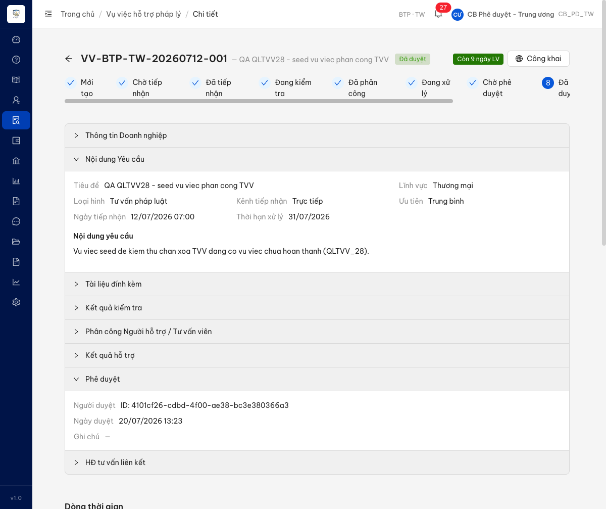


---

## ~~BUG-PDHSVV_03~~ [CLOSED] — Thông báo chặn phê duyệt vụ việc khác đơn vị hiển thị sai nội dung so với đặc tả (lộ từ kỹ thuật "bản ghi")

> **Re-test:** 2026-07-22 18:25:00 R2 (reverify tuần 3) — ✅ PASS. cbpd_tw (BTP·TW) bấm Phê duyệt VV-STP-AG-003 (Sở Tư pháp An Giang — khác đơn vị). Hệ thống chặn đúng HTTP 403, vụ việc GIỮ NGUYÊN 'Chờ phê duyệt'. Thông báo NAY hiển thị đúng đặc tả: 'Bạn không có quyền phê duyệt vụ việc này' — KHÔNG còn từ kỹ thuật 'bản ghi'. Đúng 1 request /phe-duyet (403), không lặp. Wording nội bộ đã được thay bằng thông báo hợp lệ.

### Mô tả

Cán bộ Phê duyệt ở đơn vị **khác** với đơn vị của vụ việc mở một vụ việc đang "Chờ phê duyệt" và bấm **Phê duyệt**. Hệ thống **chặn đúng** (không cho duyệt vụ việc thuộc đơn vị khác) — đây là hành vi mong muốn về mặt nghiệp vụ. Tuy nhiên **nội dung thông báo chặn hiển thị sai so với đặc tả**: hệ thống hiện *"Đơn vị của người phê duyệt khác đơn vị của bản ghi"* — dùng từ kỹ thuật **"bản ghi"** (record trong cơ sở dữ liệu) và khác nội dung mà SRS quy định cho tình huống này.

Phần "thông báo lặp (duplicate)" mà đối tác nêu **không tái hiện**: thao tác Phê duyệt chỉ gửi **1 request** và hiện **đúng 1 thông báo** (xem Kết quả thực tế). Vì vậy bug này chỉ log **1 ý** — nội dung wording.

Cùng loại lỗi lộ thuật ngữ kỹ thuật/nội bộ ra giao diện với BUG-VV-MALOI-LO-UI (lẫn mã lỗi kỹ thuật) và BUG-PDHSVV_02 (lộ mã định danh UUID).

### Các bước tái hiện

1. Dựng tiền đề: một vụ việc của **đơn vị địa phương** ở trạng thái **"Chờ phê duyệt"** (VV-STP-AG-20260712-003, đơn vị Sở Tư pháp An Giang).
2. Đăng nhập **Cán bộ Phê duyệt khác đơn vị** với đơn vị của vụ việc (`cbpd_tw` — CB Phê duyệt Trung ương, BTP·TW; vụ việc thuộc An Giang → khác đơn vị/khác cấp).
3. Mở chi tiết vụ việc → bấm **Phê duyệt** → hộp thoại xác nhận "Bạn xác nhận phê duyệt kết quả xử lý vụ việc?" → bấm **Phê duyệt**.
4. Quan sát nội dung thông báo hiển thị.

### Kết quả mong đợi

- Theo `srs-fr-05-vu-viec.md:1002` (FR-V.I-13 §Error Handling, exception E2 "CB PD không cùng cấp", mã ERR-PD-02): khi Cán bộ Phê duyệt không cùng cấp/khác đơn vị bấm phê duyệt, hệ thống phải chặn và hiển thị thông báo **"Bạn không có quyền phê duyệt vụ việc này"**.
- Thông báo cho người dùng cuối không được chứa thuật ngữ kỹ thuật/nội bộ như "bản ghi".

### Kết quả thực tế

- Hệ thống **chặn đúng**: máy chủ trả **HTTP 403**, vụ việc **giữ nguyên "Chờ phê duyệt"** (phần nghiệp vụ đúng — không cho phê duyệt chéo đơn vị).
- Nhưng thông báo hiển thị là **"Đơn vị của người phê duyệt khác đơn vị của bản ghi"** — dùng từ kỹ thuật **"bản ghi"** và khác nội dung SRS quy định ("Bạn không có quyền phê duyệt vụ việc này").
- **Phần "thông báo lặp" KHÔNG tái hiện:** đo bằng `tools/toast-capture.js` (tự kiểm observer = 1, không lọc trùng, đọc `innerText`) qua **3 lần** bấm Phê duyệt — mỗi lần **1 request** `POST /api/v1/vu-viecs/{id}/phe-duyet` (403) và **đúng 1 khung thông báo**, không lặp; ảnh chụp cũng chỉ có 1 thông báo. → Chỉ còn ý wording cần sửa.

### Bằng chứng


---

## ~~BUG-DGKQHTVV_01~~ [CLOSED] — Vụ việc đã "Hoàn thành" nhưng Cán bộ Nghiệp vụ không có nút/biểu mẫu để đánh giá kết quả hỗ trợ (chức năng đánh giá không truy cập được trên giao diện)

> **Re-test:** 2026-07-22 17:40:00 R2 (reverify tuần 3) — ✅ PASS. Login cbnv_tw, VV-BTP-TW-001 (Hoàn thành) → nút [Đánh giá] ĐÃ hiện trên thanh hành động → mở modal 'Đánh giá chất lượng' đủ 3 tiêu chí (chất lượng/thời gian/thái độ 0-10) + Nhận xét → nhập 9/8/9 + gửi → POST /danh-gia trả 201 + toast 'Đã đánh giá vụ việc' → vụ việc chuyển HOAN_THANH → 'Đã đánh giá'. Chức năng UC67 truy cập được qua giao diện.

### Mô tả

Vụ việc ở trạng thái **"Hoàn thành" (HOAN_THANH)**, Cán bộ Nghiệp vụ được giao mở màn chi tiết để đánh giá kết quả hỗ trợ (Nhóm 8 — Đánh giá). Theo đặc tả, ở trạng thái này Cán bộ Nghiệp vụ phải có nút **[Đánh giá]** để mở biểu mẫu chấm 3 tiêu chí (chất lượng / thời gian / thái độ) + nhận xét, gửi → chuyển "Đã đánh giá". Nhưng thực tế **không có bất kỳ nút/biểu mẫu đánh giá nào** trên giao diện: thanh hành động không hiện nút [Đánh giá], và mục "Đánh giá" (Nhóm 8) chỉ hiển thị trạng thái rỗng **"Chưa có thông tin"** (chỉ đọc), không có ô nhập điểm.

Đây **không phải** là trạng thái rỗng hợp lệ do thiếu dữ liệu: máy chủ **đã** hỗ trợ chức năng đánh giá (endpoint tồn tại và cho phép chính tài khoản này), nhưng **giao diện thiếu nút/biểu mẫu để gọi** → toàn bộ chức năng đánh giá (UC67) không dùng được qua giao diện. Khớp với hiện tượng đối tác báo ("Nhóm 8 Đánh giá — không hiện nút chức năng").

### Các bước tái hiện

1. Đăng nhập `cbnv_tw` — **Cán bộ Nghiệp vụ - Trung ương** (vai trò `CB_NV_TW`), đơn vị BTP·TW; là Cán bộ Nghiệp vụ được giao của vụ việc.
2. Mở vụ việc **VV-BTP-TW-20260712-001** đang ở trạng thái **"Hoàn thành"** (thoả `FR-V.I-17 §PRE-02`: HOAN_THANH; `§PRE-03`: role ∈ {CB_NV, DN} — tài khoản là CB_NV; scope đơn vị khớp theo `§Processing bước 2`).
3. Quan sát **thanh hành động** (góc trên phải màn chi tiết): không có nút [Đánh giá].
4. Mở mục **"Đánh giá"** (Nhóm 8, Accordion 8): chỉ hiển thị ảnh "Trống" + chữ **"Chưa có thông tin"**, không có ô nhập điểm/nhận xét, không có nút gửi.

### Kết quả mong đợi

- Theo `srs-fr-05-vu-viec.md:1740` (SCR-V.I-03 §Bảng nút hành động theo trạng thái): `HOAN_THANH → [Đánh giá] (CB NV/DN) → Mở Accordion 8. Gửi → DA_DANH_GIA`. Ở trạng thái "Hoàn thành", Cán bộ Nghiệp vụ phải có nút **[Đánh giá]**.
- Theo `srs-fr-05-vu-viec.md:1723` (Accordion 8 — Đánh giá): các trường điểm chất lượng / thời gian / thái độ (0-10) + điểm tổng (tự tính) + nhận xét, **"CB NV/DN nhập trực tiếp"**, hiển thị **khi vụ việc ở HOAN_THANH hoặc DA_DANH_GIA**.
- Theo `srs-fr-05-vu-viec.md:1747` (Quy ước hiển thị nút): nếu **đúng vai trò** thì nút phải **hiển thị** (nếu sai state/scope thì hiển thị mờ + tooltip, KHÔNG ẩn hẳn). Tài khoản đúng vai trò + đúng state + đúng scope → nút [Đánh giá] phải hiện.

### Kết quả thực tế

- Thanh hành động **không có** nút [Đánh giá]; mục "Đánh giá" (Nhóm 8) chỉ hiển thị **"Chưa có thông tin"** (chỉ đọc) — không có biểu mẫu chấm điểm. Cán bộ Nghiệp vụ **không có cách nào** đánh giá vụ việc qua giao diện.
- Kiểm chứng bằng phương pháp thứ hai (gọi API trực tiếp cùng thao tác): gọi endpoint đánh giá vụ việc với thân rỗng trả **HTTP 422** kèm thông báo *"Điểm chất lượng phải từ 0-10"* — nghĩa là **máy chủ đã có chức năng đánh giá và chấp nhận chính tài khoản này** (nếu không có quyền sẽ trả 403, đằng này trả về lỗi thiếu điểm). → Chức năng có ở phía máy chủ; **giao diện thiếu nút + biểu mẫu để gọi** (lỗi phía giao diện).
- Vụ việc xác nhận đang ở `HOAN_THANH`; tài khoản xác nhận vai trò `["CB_NV_TW"]`, cấp TW, đúng đơn vị của vụ việc.

### Bằng chứng

![BUG-DGKQHTVV_01 — Vụ việc VV-BTP-TW-20260712-001 ở trạng thái "Hoàn thành", tài khoản Cán bộ Nghiệp vụ được giao mở mục "Đánh giá" (Nhóm 8): chỉ hiển thị ảnh Trống + "Chưa có thông tin", không có nút [Đánh giá] trên thanh hành động và không có biểu mẫu chấm điểm — trong khi endpoint đánh giá phía máy chủ tồn tại và chấp nhận chính tài khoản này](image/DGKQHTVV_01-nhom8-danhgia-trong.png)

---

## ~~BUG-CNKQHT_06~~ [CLOSED] — Cập nhật kết quả hỗ trợ khi bản ghi đã bị người khác sửa: hệ thống lặng lẽ ghi đè, không hiện thông báo xung đột (thiếu khoá lạc quan)

> **Re-test:** 2026-07-22 19:20:00 R2 (reverify tuần 3) — ✅ PASS. Chạy đủ luồng 2 người sửa song song (2 tab qa_tvvseed28) trên VV-BTP-TW-005: tab B cập nhật kết quả nâng version bản ghi lên, tab A giữ bản cũ rồi bấm Xác nhận. Request cập-nhật NAY GỬI kèm 'version' (trước chỉ có noiDungKetQua). Server chặn xung đột: HTTP 409 ERR-STATE-LOCK-409, KHÔNG ghi đè âm thầm. UI hiện đúng Modal 'Kết quả đã bị thay đổi — Kết quả hỗ trợ đã bị người khác cập nhật... Vui lòng tải lại...' + nút [Tải lại], khớp SCR-V.I-03. Khoá lạc quan đã hoạt động đầu-cuối.

### Mô tả

Khi cập nhật **kết quả hỗ trợ** của một vụ việc đang xử lý mà bản ghi kết quả **đã bị người khác chỉnh** sau thời điểm người dùng mở màn, hệ thống **không phát hiện xung đột**: thao tác cập nhật vẫn **thành công và ghi đè** nội dung cũ, **không** hiển thị thông báo "Vụ việc đã được {người} cập nhật lúc {giờ}, vui lòng tải lại". Hai người dùng **khác nhau** có thể lần lượt ghi đè cùng một bản ghi mà không ai được cảnh báo → **mất dữ liệu âm thầm (last-write-wins)**.

Mô hình dữ liệu **có sẵn trường phiên bản** (`version`) — tức optimistic lock được **thiết kế** cho bản ghi này — nhưng thao tác cập nhật **không gửi/không kiểm** phiên bản kỳ vọng nên cơ chế bị vô hiệu.

### Các bước tái hiện

1. Dựng tiền đề: vụ việc **VV-BTP-TW-20260712-005** được đưa lên trạng thái **Đang xử lý** (Kiểm tra hồ sơ → Phân công cho `qa_tvvseed28` → tài khoản này Chấp nhận).
2. Đăng nhập `qa_tvvseed28` (người được phân công), cập nhật **Kết quả hỗ trợ** lần 1 → thành công (bản ghi kết quả có `version = 1`).
3. Cập nhật **Kết quả hỗ trợ** lần 2 với nội dung khác (mô phỏng thao tác dựa trên bản đã cũ) → thành công, ghi đè lần 1 (`version = 2`), **không** có thông báo xung đột.
4. Đăng nhập **`cbnv_tw`** (Cán bộ Nghiệp vụ cùng đơn vị BTP·TW — người **khác**), cập nhật **Kết quả hỗ trợ** cùng vụ việc → thành công, **ghi đè** nội dung của `qa_tvvseed28` (`version = 3`, người cập nhật đổi sang cbnv_tw), **không** có thông báo xung đột.

### Kết quả mong đợi

- Theo `srs-fr-05-vu-viec.md:1586` (SCR-V.I-03 §Trạng thái lỗi màn hình — "Xung đột optimistic lock"): khi bản ghi đã bị người khác cập nhật, hệ thống phải hiện **Modal** "Vụ việc đã được {ho_ten} cập nhật lúc {dd/mm HH:mm}. Vui lòng tải lại để xem thông tin mới nhất." + nút **[Tải lại]**, và **không được ghi đè âm thầm**.
- Theo `srs-fr-05-vu-viec.md:2294` (BR): mọi chuyển trạng thái vụ việc **SHALL** dùng optimistic locking; trường `version` đã tồn tại trên bản ghi kết quả cho thấy cơ chế này được thiết kế để áp dụng cho việc cập nhật bản ghi.

### Kết quả thực tế

Đọc trực tiếp phản hồi máy chủ khi cập nhật kết quả nhiều lần:

| Lần | Người thao tác | Thân request | HTTP | `version` bản ghi | Kết quả |
|---|---|---|:-:|:-:|---|
| 1 | `qa_tvvseed28` (được phân công) | `{"noiDungKetQua": …}` | **201** | **1** | Ghi bản ghi kết quả `c557f69b` |
| 2 | `qa_tvvseed28` | `{"noiDungKetQua": …}` (bản cũ) | **201** | **2** | **Ghi đè** lần 1, không 409, không thông báo |
| 3 | **`cbnv_tw` (người KHÁC)** | `{"noiDungKetQua": …}` | **201** | **3** | **Ghi đè** nội dung của qa_tvvseed28, không 409, không thông báo |

- Thân request cập nhật **chỉ gồm `{noiDungKetQua}`, không kèm version/updated_at** → máy chủ không có căn cứ phát hiện xung đột → không bao giờ trả 409, không hiện modal `:1586`.
- Trường `version` **tồn tại và tự tăng 1→2→3** → optimistic lock được thiết kế nhưng thao tác cập nhật không kiểm → cơ chế bị vô hiệu.
- Kiểm chứng phương pháp thứ hai (UI): mở modal "Cập nhật kết quả hỗ trợ", bấm Xác nhận trên bản ghi đã bị sửa → thao tác đi qua (POST `cap-nhat-ket-qua` [201]), **không** có modal xung đột.

### Bằng chứng


---

## ~~BUG-CNKQVV_05~~ [CLOSED] — Hoàn thành vụ việc khi đã bị người khác hoàn thành: thông báo sai (lộ mã lỗi kỹ thuật, không phải thông báo xung đột)

> **Re-test:** 2026-07-22 17:55:00 R2 (reverify tuần 3) — ✅ PASS. Login cbnv_tw, VV-SEED-0001 (Đã duyệt, chưa có kết quả) → bấm [Hoàn thành] → POST /hoan-thanh trả 409 nhưng toast hiển thị THUẦN 'Chưa có kết quả xử lý' (KHÔNG còn tiền tố mã 'ERR-STATE-V-HT-02:'), lặp 2 lần đều sạch mã. Thân request nay ĐÃ kèm 'version:1' → cơ chế khoá lạc quan đã được nối. Vụ việc giữ nguyên Đã duyệt.

### Mô tả

Khi Cán bộ Nghiệp vụ bấm **Hoàn thành** một vụ việc đã bị người khác hoàn thành trước (tình huống xung đột), hệ thống **không** hiển thị thông báo xung đột optimistic lock "Vụ việc đã được {người} cập nhật lúc {giờ}, vui lòng tải lại" như yêu cầu, mà hiển thị một **thông báo lỗi trạng thái lộ mã lỗi kỹ thuật** ("ERR-STATE-V-HT-01: …"). Thao tác hoàn thành cũng không kèm phiên bản bản ghi nên không có cơ chế phát hiện xung đột đúng thiết kế.

> **Minh bạch — ý con "thông báo lặp (duplicate)" đối tác báo: KHÔNG tái hiện.** Đo bằng bộ bắt thông báo (không lọc trùng), thao tác hoàn thành lỗi chỉ hiện **1** khung thông báo, không lặp. Verdict Open dựa trên ý "thông báo sai" (đã xác nhận là lỗi thật).

### Các bước tái hiện

1. Đăng nhập `cbnv_tw` (Cán bộ Nghiệp vụ - Trung ương — đúng nhóm vai trò được phép hoàn thành vụ việc).
2. Mô phỏng "người thứ 2": thực hiện thao tác **Hoàn thành** trên một vụ việc **đã ở trạng thái Hoàn thành** (VV-BTP-TW-20260712-001) — đúng tình huống người thứ 2 bấm hoàn thành sau khi người thứ nhất đã xong.
3. Quan sát thông báo hệ thống trả về.
4. Kiểm chứng thêm: bấm **[Hoàn thành]** trên vụ việc VV-SEED-0001 (Đã duyệt, chưa có kết quả) → quan sát render + số lượng khung thông báo.

### Kết quả mong đợi

- Theo `srs-fr-05-vu-viec.md:2294`: hoàn thành vụ việc là **một chuyển trạng thái** (Đã duyệt → Hoàn thành) → **SHALL** dùng optimistic locking.
- Theo `srs-fr-05-vu-viec.md:1586` / `:1773`: khi vụ việc đã bị người khác chuyển trạng thái, phải hiện thông báo xung đột đúng thiết kế ("Vụ việc đã được … cập nhật … vui lòng tải lại" hoặc "Vụ việc đang được {người} thao tác…").
- Thông báo hiển thị cho người dùng **không được lộ mã lỗi kỹ thuật nội bộ** (chuẩn chung — cùng loại BUG-VV-MALOI-LO-UI).

### Kết quả thực tế

- Người thứ 2 (`cbnv_tw`) hoàn thành vụ việc đã ở Hoàn thành → máy chủ trả **HTTP 409** với thông báo **"ERR-STATE-V-HT-01: Vụ việc không ở trạng thái DA_DUYET"**:
  - **Không** phải thông báo xung đột optimistic lock `:1586` mà đối tác kỳ vọng → **thông báo sai**.
  - **Lộ mã lỗi kỹ thuật** `ERR-STATE-V-HT-01` ra người dùng.
  - Thân request hoàn thành `{ketLuanCuoi, ketQuaXuLy}` **không kèm version** → không có cơ chế phát hiện xung đột đúng thiết kế.
- Kiểm chứng phương pháp thứ hai (UI trên VV-SEED-0001): POST `hoan-thanh` [409], thông báo hiển thị (observer bắt được): **"ERR-STATE-V-HT-02: Chưa có kết quả xử lý"** — cũng lộ mã lỗi. Số khung thông báo = **1** (không lặp).

### Bằng chứng


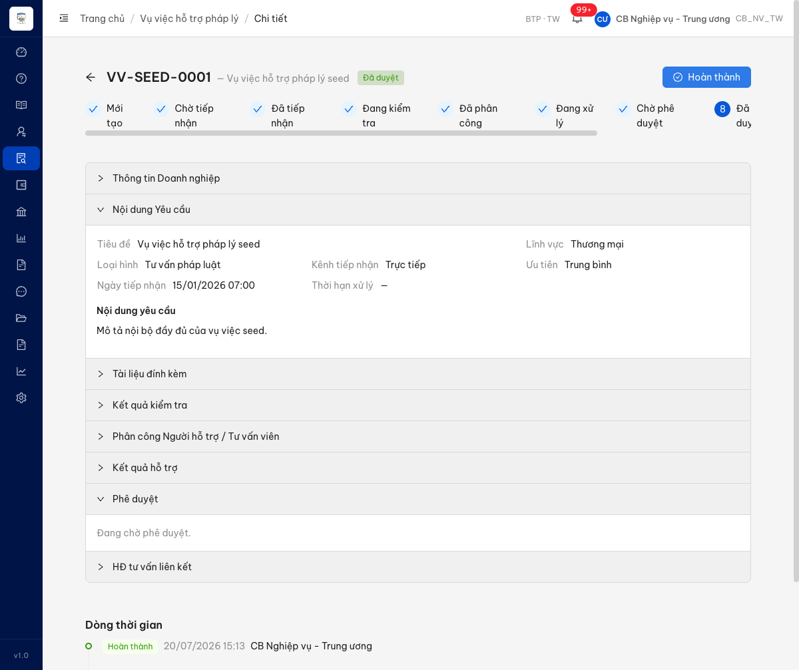

---

## ~~BUG-CNKQVV_02~~ [CLOSED] — Modal/nút "Hoàn thành vụ việc" lệch đặc tả: tên nút và bộ trường không khớp thiết kế (vừa là bug vừa chờ BA chốt hướng)

> **Re-test:** 2026-07-25 R3 (`cbnv_tw_05`, VV-BTP-TW-20260712-005) — ✅ PASS (Closed). BA chốt 24/07/2026 Loại 1 (Dev sửa theo SRS). Đo lại: nhãn nút là **"Cập nhật kết quả cuối"** (hết nhãn "Hoàn thành"), màn nhập chỉ còn ô "Kết luận cuối cùng" (**hết ô "Kết quả xử lý"**), 1 `POST /hoan-thanh` + 1 thông báo "Vụ việc đã hoàn thành", kết luận đọc lại đúng nguyên văn. Bằng chứng: `../../dev-fix-reverify-round-3-2026-07-25/M01-vu-viec/measurements.md` §CNKQVV_02.


### Mô tả

Ở chức năng cập nhật kết quả cuối / hoàn thành vụ việc (vụ việc "Đã duyệt"), giao diện app **lệch so với đặc tả v3.5** (FR-V.I-16 — bản đặc tả được chỉ định làm chuẩn chấm) ở 2 điểm: (1) nút hành động tên **"Hoàn thành"** (modal "Hoàn thành vụ việc", nút gửi "Xác nhận") trong khi đặc tả ghi nút **"Cập nhật kết quả cuối"**; (2) modal có thêm trường **"Kết quả xử lý"** (radio Thành công / Không thành công) không nằm trong danh sách Inputs của đặc tả (đặc tả chỉ có `ket_luan_cuoi` — "Kết luận cuối cùng"). Đối tác phản ánh đúng là "tên nút + các trường không giống thiết kế".

> **Vừa là bug vừa cần BA confirm.** Cả 2 điểm lệch đều nhẹ + hợp lý về nghiệp vụ (tên "Hoàn thành" rõ nghĩa theo transition → HOAN_THANH; trường "Kết quả xử lý" ánh xạ field `ketQuaXuLy` có sẵn trong mô hình dữ liệu) → có thể là quyết định thiết kế cố ý. Không có nguồn thiết kế uy tín (Figma) để khẳng định app SAI → bug này ghi nhận **lệch đặc tả** (describe), **không prescribe** hướng sửa; BA chốt giữ theo app (cập nhật đặc tả) hay sửa app theo đặc tả — xem [`../../ba-confirm/vu-viec/ba-confirmation-needed-vu-viec.md`](../../ba-confirm/vu-viec/ba-confirmation-needed-vu-viec.md) mục CNKQVV_02.

### Các bước tái hiện

1. Đăng nhập `cbnv_tw` (Cán bộ Nghiệp vụ được giao), mở vụ việc **VV-BTP-TW-20260712-001** ở trạng thái **"Đã duyệt"**.
2. Bấm nút hành động **"Hoàn thành"** trên header → modal **"Hoàn thành vụ việc"** mở ra.
3. Đọc tên nút, tiêu đề modal, danh sách trường → đối chiếu FR-V.I-16 (Inputs + bảng nút hành động SCR-V.I-03).

### Kết quả mong đợi

- Theo `srs-fr-05-vu-viec.md:1167` (AC) + `:1739` (bảng nút hành động): nút hành động ở trạng thái "Đã duyệt" của CB NV là **"Cập nhật kết quả cuối"** / [Cập nhật KQ cuối].
- Theo `srs-fr-05-vu-viec.md:1136-1140` (FR-V.I-16 §Inputs): trường người dùng nhập chỉ có **`ket_luan_cuoi`** ("Kết luận cuối cùng"), không có "Kết quả xử lý".

### Kết quả thực tế

- Nút hành động = **"Hoàn thành"**, tiêu đề modal = **"Hoàn thành vụ việc"**, nút gửi = **"Xác nhận"** (lệch tên so với "Cập nhật kết quả cuối").
- Modal có 2 trường: **"Kết luận cuối cùng"** (= `ket_luan_cuoi` ✅ khớp) + **"Kết quả xử lý"** (radio Thành công/Không thành công — không có trong Inputs đặc tả).
- Chức năng chạy đúng nghiệp vụ: điền kết luận + chọn kết quả → Xác nhận → `POST .../../hoan-thanh` [201], vụ việc → "Hoàn thành". Modal app giống hệt frame đối tác chụp.

### Bằng chứng

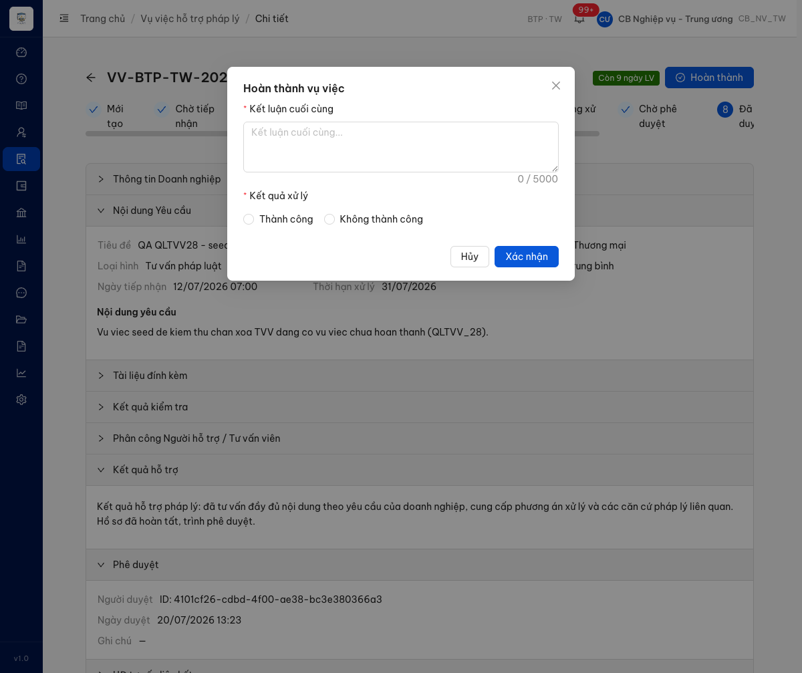

---

## Phụ lục — Môi trường test

| Thành phần | Giá trị |
|------------|---------|
| URL ứng dụng | https://18.143.165.120.nip.io |
| OTP login | Lấy từ MailHog (không có bypass) |
| MailHog (OTP inbox) | http://18.143.165.120:8025 |
| API base | https://18.143.165.120.nip.io/api/v1 |
| Frontend | React + Ant Design v5 |
| Xác thực | JWT (cookie) + OTP email |
| Tool test | Chrome DevTools MCP |
| Tài khoản dùng verify | `qa_tvvseed28` (TVV + CG, BTP·TW) · `cbnv_tw` (CB Nghiệp vụ TW) · `cbpd_tw` (CB Phê duyệt TW) · `cbnv_dp` + `nht_ag_uat2` (Sở Tư pháp An Giang — dựng tiền đề PDHSVV_03) · `admin` (chuẩn bị dữ liệu) |

---

*Bug report generated: 2026-07-20 11:00:00 | QA Automation via Claude Code*
