# Bug Report — Tổ chức tư vấn (SCR-IV-NEW-01/02/03)

| Thông tin | Giá trị |
|-----------|---------|
| **Dự án** | PM HTPLDN — UAT đối tác |
| **Môi trường** | https://18.143.165.120.nip.io — bản dựng **HTPLDN V1.0.5** |
| **Người test** | QA Automation (Claude Code) |
| **Ngày** | 2026-08-04 09:45:00 |
| **Loại test** | Re-verify vòng 2 (dev báo `dev done`) |
| **Round** | Re-verify tuần 3 — verify1-conlai-2026-08-03 |
| **Tài liệu tham chiếu** | `Docs-PM-HTPLDN/_bmad-output/planning-artifacts/srs-v3.5/srs-fr-04-chuyen-gia-tvv.md` · [danh sách việc](../../con-can-verify-tuan-3-2026-08-03.md) · artifact gốc `../../oos/QLDMTCTV_OOS_*.json` |

---

## Tổng hợp

Re-verify **9** bug `QLDMTCTV_OOS_*` do QA tự mở thêm khi kiểm 4 phiếu `QLDMTCTV_02 / _05 / _06 / _09` ngày 03/08/2026, tương ứng rows **327, 328, 329, 333, 334, 335, 336, 337, 338** của tab `UAT_TGPL Doanh Nghiệp-tuần 3` (sheet `1OKBN2otlmdZ44THkmhtsn-_63M2Boh7zQwearwjYR3s`). Cả 9 dòng có `Trạng thái dev fix 1 = dev done` + `Verify = Open` tại thời điểm bắt đầu.

> **Tài khoản re-verify:** bộ `_02` — `cbpd_tw_02` (CB Phê duyệt Trung ương) và `cbnv_tw_02` (CB Nghiệp vụ Trung ương), cùng đơn vị **Cục Bổ trợ tư pháp — Bộ Tư pháp** (`donViId 00000000-0000-4000-8000-000000000001`, `capDonVi TW`) — đúng đơn vị của lượt kiểm gốc (khi đó dùng `_04`).

> **Cập nhật 04/08/2026 (BƯỚC 2 — áp quyết định BA):** file nay có **11 bug — 9 Closed · 2 Open**. Hai bug Open là `BUG-QLDMTCTV_OOS_05` (row 331) và `BUG-QLDMTCTV_OOS_13` (row 339) — hai dòng vốn treo `BA confirm`, BA chốt là lỗi ngày 04/08/2026, và QA **đã đo lại trên môi trường bàn giao (bản dựng V1.0.5)** trước khi mở entry. **Tên file đã bỏ tiền tố `Pass-`** vì file không còn 100% đóng.

> **Kết quả re-verify vòng 3 (04/08/2026) — đóng đủ 9/9.** Vòng 2 đóng 7 và mở lại 2 (OOS_03, OOS_07); vòng 3 kiểm lại đúng 2 lỗi đó sau khi dev báo đã sửa — **cả 2 đều đạt**, không phát sinh lỗi mới trong cùng luồng. Trước khi đo có tải lại trang bỏ qua bộ nhớ đệm + xóa cache/storage và đăng nhập lại, để chắc chắn chạy trên mã mới.

### Severity breakdown

| Tổng | Critical | Major | Medium | Minor | Trivial | Closed | Open |
|------|----------|-------|--------|-------|---------|--------|------|
| 11   | 0        | 3     | 1      | 7     | 0       | 9      | 2    |

## Bug Summary Table

| Bug ID | Severity | Priority | Type | TC Ref | **SRS Reference** | Title | Status |
|--------|----------|----------|------|--------|-------------------|-------|--------|
| BUG-QLDMTCTV_OOS_05 | Minor | P3 | UI/UX | QLDMTCTV_OOS_05 (tuần 3 row 331 — QA mở mới) | `SCR-IV-NEW-01 §Thành phần` — 10 cột bảng `srs-fr-04-chuyen-gia-tvv.md:1636-1645` · bộ lọc Đơn vị quản lý `:1633` | Bảng danh sách có 11 cột, thừa cột "Đơn vị quản lý" — đẩy 3 cột cuối (Trạng thái · Công khai · Hành động) ra ngoài khung nhìn | Open |
| BUG-QLDMTCTV_OOS_13 | Minor | P3 | UI/UX | QLDMTCTV_OOS_13 (tuần 3 row 339 — QA mở mới) | `SCR-IV-NEW-02 §Thành phần` rows 2.5 `srs-fr-04-chuyen-gia-tvv.md:1680` · 2.6 `:1681` · thực thể `so_giay_dkhd` `:1052` | Cùng một loại giấy mang hai tên khác nhau trên biểu mẫu và trong câu báo lỗi, không tên nào là tên chuẩn "Giấy đăng ký hoạt động" | Open |
| ~~BUG-QLDMTCTV_OOS_03~~ | Major | P1 | UI/UX | QLDMTCTV_OOS_03 (tuần 3 row 329) | `SCR-IV-NEW-01 §Thành phần row 24` (srs-fr-04-chuyen-gia-tvv.md:1646) | Cột "Hành động" thiếu nhóm lệnh "..." (Trình phê duyệt / Phê duyệt / Từ chối / Cập nhật trạng thái) | Closed |
| ~~BUG-QLDMTCTV_OOS_07~~ | Minor | P3 | UI/UX | QLDMTCTV_OOS_07 (tuần 3 row 333) | `SCR-IV-NEW-01 §Thành phần row 27` (srs-fr-04-chuyen-gia-tvv.md:1649) | Màn hình rỗng chỉ hiện chữ "Trống", thiếu câu hướng dẫn theo đặc tả | Closed |
| ~~BUG-QLDMTCTV_OOS_09~~ | Minor | P3 | UI/UX | QLDMTCTV_OOS_09 (tuần 3 row 335) | `SCR-IV-NEW-02 §Thành phần row 1` (srs-fr-04-chuyen-gia-tvv.md:1675) | Đường dẫn điều hướng của biểu mẫu Chỉnh sửa không kèm tên tổ chức đang sửa | Closed |
| ~~BUG-QLDMTCTV_OOS_10~~ | Minor | P3 | UI/UX | QLDMTCTV_OOS_10 (tuần 3 row 336) | `SCR-IV-NEW-02 §Thành phần` rows 2.4 (srs-fr-04-chuyen-gia-tvv.md:1680) · 2.6 (:1682) · 3.1 (:1684) · 4.1 (:1687) · 4.2 (:1688) | 5 nhãn trường trên biểu mẫu hiển thị khác nhãn trong đặc tả | Closed |
| ~~BUG-QLDMTCTV_OOS_11~~ | Major | P1 | UI/UX | QLDMTCTV_OOS_11 (tuần 3 row 337) | `SCR-IV-NEW-03 §Loại màn hình` (srs-fr-04-chuyen-gia-tvv.md:1702) · `§Thành phần 3 Tab` rows 10-12b (:1729-:1733) · `§Header` row 1 (:1715) | Màn Chi tiết Tổ chức tư vấn thiếu toàn bộ 3 tab và không có vùng tệp đính kèm | Closed |
| ~~BUG-QLDMTCTV_OOS_12~~ | Medium | P2 | Data | QLDMTCTV_OOS_12 (tuần 3 row 338) | `SCR-IV-NEW-01 §Thành phần row 9` (srs-fr-04-chuyen-gia-tvv.md:1631) | Ô tìm kiếm không tìm được theo Người đại diện | Closed |
| ~~BUG-QLDMTCTV_OOS_08~~ | Minor | P3 | UI/UX | QLDMTCTV_OOS_08 (tuần 3 row 334) | `SCR-IV-NEW-02 §Loại màn hình` (:1664) · `§Mô tả` (:1669) · `§Thành phần` (:1676, :1683, :1686, :1691, :1694, :1695) | Biểu mẫu Thêm mới / Chỉnh sửa không chia 6 nhóm thu gọn như đặc tả | Closed |
| ~~BUG-QLDMTCTV_OOS_02~~ | Major | P1 | UI/UX | QLDMTCTV_OOS_02 (tuần 3 row 328) | `SCR-IV-NEW-01 §Thành phần row 23` (:1645) | Cột "Công khai" là nhãn tĩnh, bấm không mở được hộp thoại công khai | Closed |
| ~~BUG-QLDMTCTV_OOS_01~~ | Minor | P3 | UI/UX | QLDMTCTV_OOS_01 (tuần 3 row 327) | `SCR-IV-NEW-01 §Thành phần row 6` (:1628) · đối chiếu row 5 (:1627) | Thẻ "Chờ phê duyệt" không chuyển dấu đỏ khi đang có hồ sơ chờ xử lý | Closed |

> **Ghi chú tham chiếu chung:** chức năng "Quản lý Tổ chức tư vấn" (FR-IV-NEW-01) trong đặc tả **không được cấp mã UC** — dòng `1029` ghi nguyên văn `**UC Reference:** (chưa có trong CSV — gắn [GAP-IV-07])`. Vì vậy mọi bug dưới đây chỉ dẫn tên chức năng + tên màn hình + số dòng, không có mã UC để trích.

> **Cập nhật 04/08/2026 — 3 dòng `BA confirm` cùng nhóm đã có quyết định.** `QLDMTCTV_OOS_05` (row 331) và `_OOS_13` (row 339): **BA chốt là lỗi** → đã thêm entry vào chính file này, trạng thái `Open`. `_OOS_06` (row 332, số thẻ trạng thái): **BA chốt không phải lỗi** → `Reject`, không vào file bug, lưu vết ở [`../../../../reverify-week-4/reverify-audit/audit-reject-2026-08-04/`](../../../../reverify-week-4/reverify-audit/audit-reject-2026-08-04/). `_OOS_04` (row 330) đã đóng `Reject` từ vòng rà 03/08. Câu hỏi gốc gửi BA: [ba-confirmation-needed-luong4-to-chuc-tu-van-2026-08-03.md](../../ba-confirmation-needed-luong4-to-chuc-tu-van-2026-08-03.md).

---

## ~~BUG-QLDMTCTV_OOS_03~~ [CLOSED] — Cột "Hành động" thiếu nhóm lệnh "..." (Trình phê duyệt / Phê duyệt / Từ chối / Cập nhật trạng thái)

> **Re-test:** 2026-08-04 09:45:00 R3 — ✅ PASS (Closed-verified). Đúng 2 lệnh còn thiếu ở vòng 2 nay đã thao tác được từ danh sách. **"Trình phê duyệt"** mở hộp thoại "Xác nhận trình phê duyệt" nêu đúng tên hồ sơ; bấm xác nhận thì báo "Đã trình phê duyệt" và hồ sơ chuyển sang Chờ phê duyệt. **"Cập nhật trạng thái"** nay bung menu con đúng theo trạng thái hiện tại (Đang hoạt động → Tạm dừng / Vô hiệu hóa; Tạm dừng → Kích hoạt lại / Vô hiệu hóa), chọn "Tạm dừng" mở hộp thoại nhập lý do ≥ 10 ký tự, xác nhận thì hồ sơ chuyển Tạm dừng, rồi khôi phục lại Đang hoạt động cũng chạy đúng. Kiểm hồi quy 3 lệnh còn lại trong cùng nhóm: "Xóa", "Phê duyệt", "Từ chối" đều mở đúng hộp thoại — bản sửa không làm hỏng lệnh nào.

### Mô tả

Trên bảng danh sách Tổ chức tư vấn, cột "Hành động" chỉ có 3 biểu tượng rời (Xem, Sửa, Xóa), không có nhóm lệnh "..." nào. Hệ quả: các lệnh "Trình phê duyệt" và "Cập nhật trạng thái" không thao tác được từ danh sách, phải mở màn Chi tiết của từng tổ chức mới làm được.

### Các bước tái hiện

1. Đăng nhập role **Cán bộ Nghiệp vụ cấp Trung ương** (`cbnv_tw_02`, đơn vị Cục Bổ trợ tư pháp — Bộ Tư pháp). Theo `srs-fr-04-chuyen-gia-tvv.md:1614`, vai trò này có quyền "thêm/sửa/xóa … **cập nhật trạng thái**" với Tổ chức tư vấn thuộc đơn vị; theo `:1646` lệnh "Trình phê duyệt" dành cho hồ sơ trạng thái Mới đăng ký hoặc Đã từ chối.
2. Chọn menu "Mạng lưới Tư vấn viên" → "Tổ chức tư vấn".
3. Ở thẻ "Mới đăng ký", mở nhóm lệnh "..." của dòng `TC-BTP-TW-0003` → bấm **"Trình phê duyệt"**. Quan sát hệ thống có mở hộp thoại xác nhận không.
4. Về danh sách, sang thẻ "Đang hoạt động", mở nhóm lệnh "..." của dòng `TC-TW-DEMO-001` → bấm **"Cập nhật trạng thái"**. Quan sát tương tự.
5. Đối chứng trong cùng nhóm lệnh: bấm **"Xóa"** ở một dòng bất kỳ.
6. Đăng nhập role **Cán bộ Phê duyệt cấp Trung ương** (`cbpd_tw_02`), vào thẻ "Chờ phê duyệt", bấm **"Phê duyệt"** rồi **"Từ chối"** để đối chứng tiếp.

### Kết quả mong đợi

- Theo `srs-fr-04-chuyen-gia-tvv.md:1646`, cột "Hành động" gồm nhóm icon + dropdown "...", trong đó dropdown chứa "Trình phê duyệt", "Phê duyệt", "Từ chối", "Cập nhật trạng thái", "Xóa"; cột Hành vi ghi **"Click → tương ứng (mỗi mục mở modal MD-* tương ứng)"**.
- Nghĩa là khi người dùng bấm một lệnh trong nhóm "..." ngay trên dòng của danh sách, hệ thống phải thực hiện đúng lệnh đó (đưa ra bước xác nhận tương ứng) — chứ không bỏ dở giữa chừng và bắt người dùng tự tìm chỗ khác để làm lại thao tác.

### Kết quả thực tế

- **Lượt kiểm gốc (03/08/2026, `cbnv_tw_04`):** cột "Hành động" chỉ có 3 biểu tượng rời Xem / Sửa / Xóa, không có nhóm lệnh "..." nào.
- **Lượt re-verify (04/08/2026) — đã sửa phần hiển thị nhóm lệnh:** mọi dòng nay có nút "..." và danh sách lệnh đúng theo vai trò + trạng thái:

  | Vai trò | Thẻ / trạng thái dòng | Lệnh trong nhóm "..." | Khớp `:1646` |
  |---|---|---|:-:|
  | Cán bộ Nghiệp vụ | Mới đăng ký | Trình phê duyệt · Xóa | ✔ |
  | Cán bộ Nghiệp vụ | Đang hoạt động | Cập nhật trạng thái · Xóa | ✔ |
  | Cán bộ Phê duyệt | Chờ phê duyệt | Phê duyệt · Từ chối | ✔ |

- **Nhưng phần thao tác vẫn còn lỗi** — bấm lệnh xong hệ thống không thực hiện lệnh đó:

  | Lệnh bấm từ danh sách | Hệ thống làm gì | Có hộp thoại xác nhận? |
  |---|---|:-:|
  | **Trình phê duyệt** (`TC-BTP-TW-0003`) | Rời danh sách, mở màn Chi tiết `/chuyen-gia-tvv/to-chuc/8fd87219-…?action=trinh` | **Không** |
  | **Cập nhật trạng thái** (`TC-TW-DEMO-001`) | Rời danh sách, mở màn Chi tiết `/chuyen-gia-tvv/to-chuc/fbeea7e9-…` | **Không** |
  | Xóa (đối chứng) | Ở lại danh sách | Có — "Xóa tổ chức tư vấn" |
  | Phê duyệt (đối chứng) | Mở màn Chi tiết | Có — "Xác nhận phê duyệt và công bố" |
  | Từ chối (đối chứng) | Mở màn Chi tiết | Có — "Xác nhận từ chối" |

- Ở màn Chi tiết mở ra sau khi bấm "Trình phê duyệt", chờ thêm 2 giây vẫn không có hộp thoại; người dùng phải tự nhìn thấy và bấm nút "Trình phê duyệt" trong thanh nút của màn đó. Với "Cập nhật trạng thái" thì phải tự bấm "Tạm dừng" hoặc "Vô hiệu hóa".
- Đúng 2 lệnh này là 2 lệnh mà lỗi gốc đã nêu đích danh ("Trình phê duyệt" và "Cập nhật trạng thái" … "phải mở màn Chi tiết của từng tổ chức mới làm được") ⇒ hệ quả của lỗi gốc chưa được giải quyết.
- Tái hiện 2 lần ở 2 phiên đăng nhập khác nhau, một lần bấm bằng chuột trên giao diện.

### Bằng chứng

**1. Ảnh chụp:**

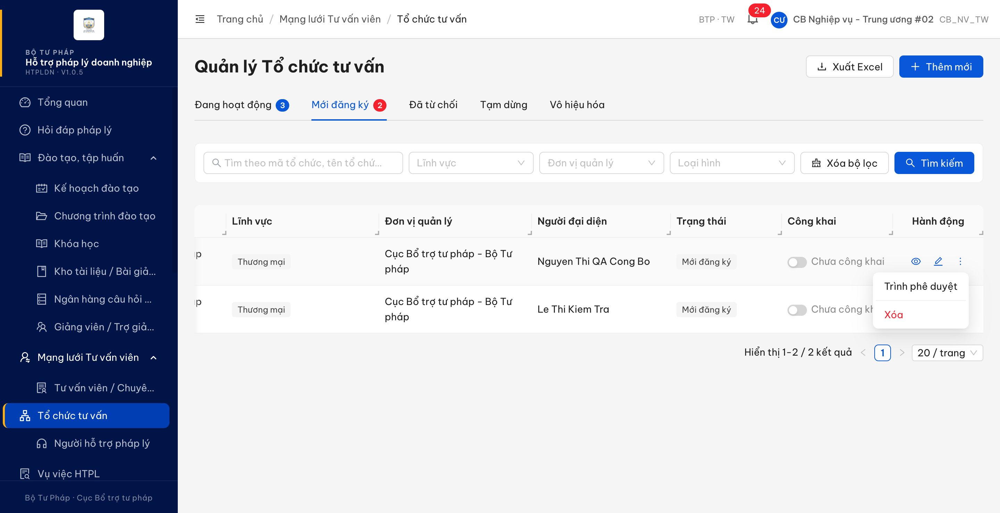

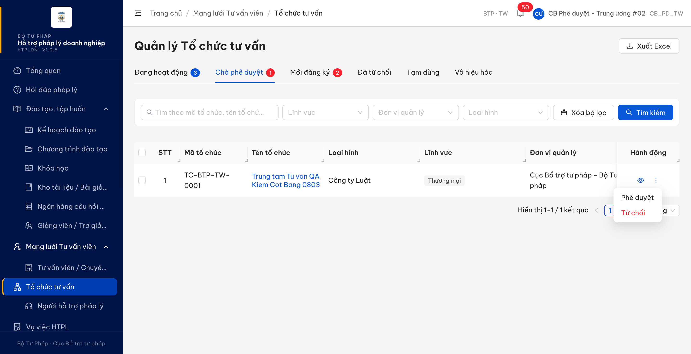

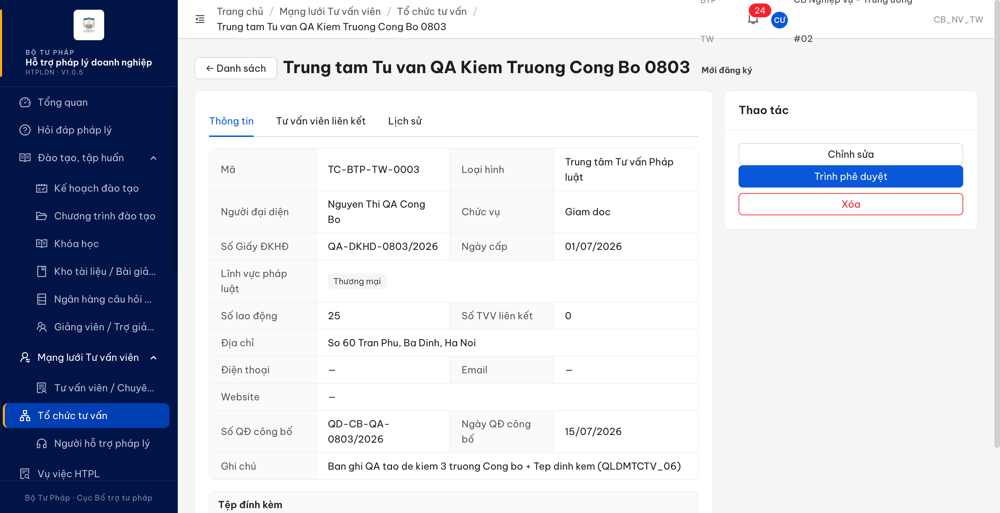

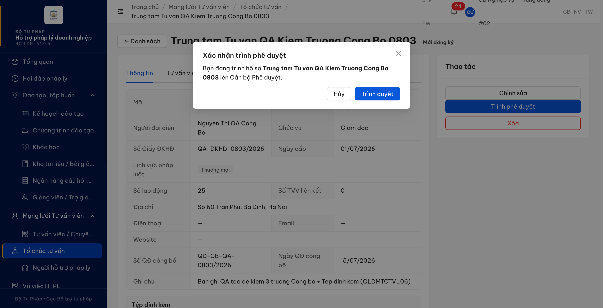

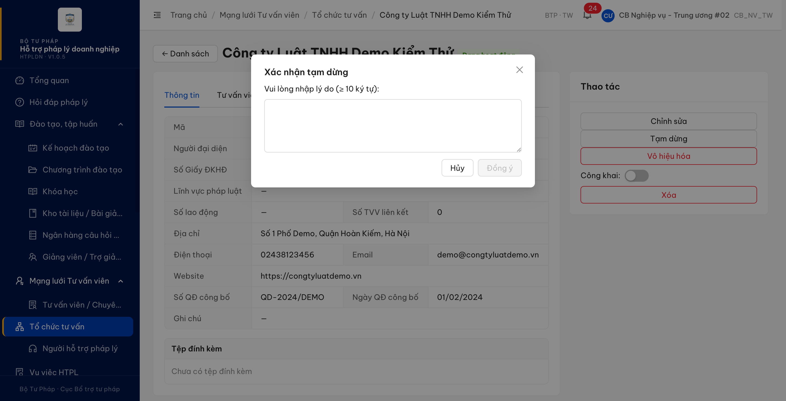

---

## ~~BUG-QLDMTCTV_OOS_07~~ [CLOSED] — Màn hình rỗng chỉ hiện chữ "Trống", thiếu câu hướng dẫn theo đặc tả

> **Re-test:** 2026-08-04 09:45:00 R3 — ✅ PASS (Closed-verified). Vùng rỗng nay có **đủ cả hình minh họa và câu hướng dẫn**: cả 3 thẻ "Đã từ chối" / "Tạm dừng" / "Vô hiệu hóa" đều hiện hình minh họa (đo được trong trang, kích thước 184×100) kèm nguyên văn "Chưa có tổ chức tư vấn nào trong mục này". Đóng nốt điểm còn bỏ ngỏ ở vòng 2: lọc cho thẻ "Mới đăng ký" rỗng (không xóa dữ liệu thật) thì thẻ này hiện đủ hình + câu hướng dẫn + nút "Thêm tổ chức tư vấn" đúng như `:1649`.

### Mô tả

Ở các thẻ không có bản ghi của màn danh sách Tổ chức tư vấn, vùng bảng chỉ hiện hình minh họa kèm đúng một chữ "Trống" — là chữ mặc định của thư viện giao diện, không phải câu tiếng Việt mà đặc tả yêu cầu. Không có câu hướng dẫn nào cho người dùng.

### Các bước tái hiện

1. Đăng nhập role **Cán bộ Nghiệp vụ cấp Trung ương** (`cbnv_tw_02`, đơn vị Cục Bổ trợ tư pháp — Bộ Tư pháp) — vai trò có quyền xem danh sách Tổ chức tư vấn thuộc đơn vị theo `srs-fr-04-chuyen-gia-tvv.md:1614`.
2. Chọn menu "Mạng lưới Tư vấn viên" → "Tổ chức tư vấn".
3. Bấm vào thẻ "Đã từ chối" (đang không có tổ chức nào).
4. Đọc nội dung hiển thị ở vùng bảng khi không có bản ghi.
5. Lặp lại với thẻ "Tạm dừng" và "Vô hiệu hóa".

### Kết quả mong đợi

- Theo `srs-fr-04-chuyen-gia-tvv.md:1649`, khi thẻ không có bản ghi thì vùng rỗng gồm **hình minh họa** + câu **"Chưa có tổ chức tư vấn nào trong mục này"** + nút "+ Thêm tổ chức tư vấn" (chỉ ở thẻ "Mới đăng ký").
- Tức người dùng phải thấy đủ cả phần hình và phần chữ hướng dẫn, không phải chỉ một trong hai.

### Kết quả thực tế

- **Lượt kiểm gốc (03/08/2026, `cbnv_tw_04`):** vùng bảng hiện hình minh họa + đúng một chữ "Trống" (chữ mặc định của thư viện giao diện), không có câu hướng dẫn.
- **Lượt re-verify (04/08/2026, `cbnv_tw_02`) — sửa được phần chữ, hỏng phần hình:**

  | Thẻ rỗng | Chữ hiển thị | Hình minh họa |
  |---|---|:-:|
  | Đã từ chối | "Chưa có tổ chức tư vấn nào trong mục này" ✔ | **không có** ✘ |
  | Tạm dừng | "Chưa có tổ chức tư vấn nào trong mục này" ✔ | **không có** ✘ |
  | Vô hiệu hóa | "Chưa có tổ chức tư vấn nào trong mục này" ✔ | **không có** ✘ |

- Vùng rỗng hiện chỉ chứa duy nhất một dòng chữ; không còn phần tử hình nào (không ảnh, không hình vẽ, cũng không phải hình nền).
- Phần nút "+ Thêm tổ chức tư vấn" ở thẻ "Mới đăng ký" **chưa kiểm được lượt này** vì thẻ đó đang có 2 tổ chức nên không rơi vào trạng thái rỗng — không kết luận gì về phần này.

### Bằng chứng

**1. Ảnh chụp:**

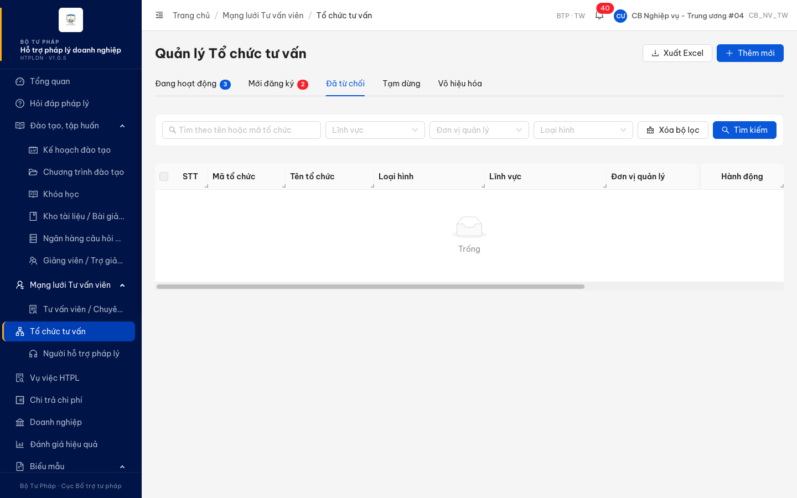

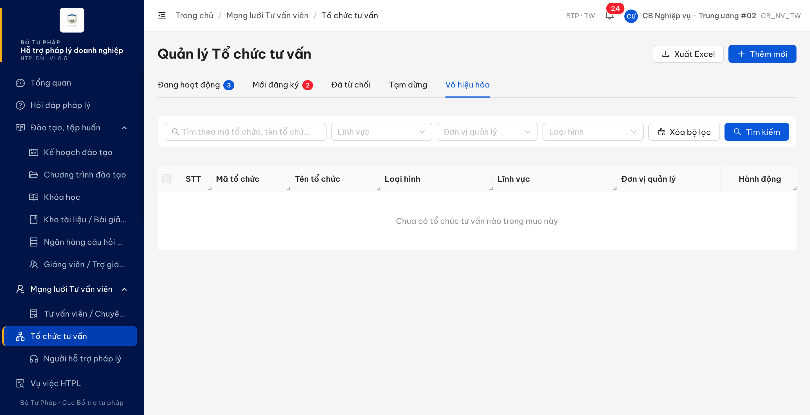

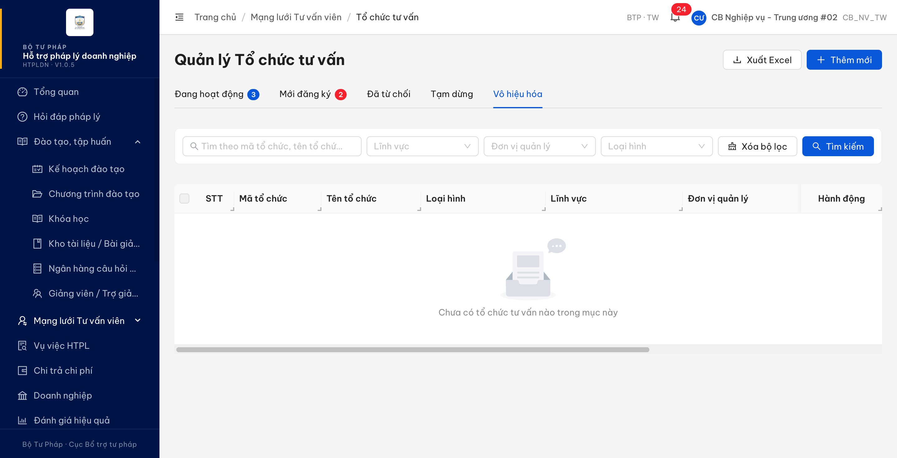

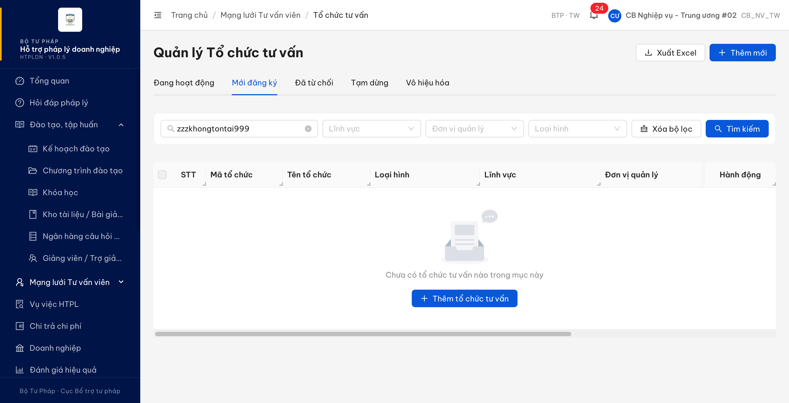

---

## ~~BUG-QLDMTCTV_OOS_09~~ [CLOSED] — Đường dẫn điều hướng của biểu mẫu Chỉnh sửa không kèm tên tổ chức đang sửa

> **Re-test:** 2026-08-04 01:20:00 R2 — ✅ PASS (Closed-verified). Đường dẫn điều hướng ở chế độ Chỉnh sửa nay là "Trang chủ / Mạng lưới Tư vấn viên / Tổ chức tư vấn / **Chỉnh sửa [Tên tổ chức]**" — đã kèm tên tổ chức và **đã bỏ** cấp thừa "Chi tiết". Chạy lại đủ luồng trên đúng hồ sơ gốc `TCTV-SEED-0001` và thêm 1 hồ sơ đối chứng `TC-TW-DEMO-001`, qua cả 2 lối vào (bấm Sửa từ danh sách · vào màn Chi tiết rồi bấm Chỉnh sửa) — cả 4 lượt đều đúng. Chế độ Thêm mới hiển thị "… / Thêm mới", cũng khớp đặc tả.

### Mô tả

Trên biểu mẫu Chỉnh sửa Tổ chức tư vấn, đường dẫn điều hướng ở thanh trên cùng chỉ ghi "… / Chi tiết / Chỉnh sửa", không kèm tên tổ chức đang sửa, đồng thời chèn thêm một cấp "Chi tiết" không có trong đặc tả. Hệ quả: mở nhiều hồ sơ liên tiếp thì người dùng không biết mình đang sửa hồ sơ nào nếu chỉ nhìn đường dẫn.

### Các bước tái hiện

1. Đăng nhập role **Cán bộ Nghiệp vụ cấp Trung ương** (`cbnv_tw_02`, đơn vị Cục Bổ trợ tư pháp — Bộ Tư pháp). Theo `srs-fr-04-chuyen-gia-tvv.md:1614`, vai trò này có quyền "thêm/sửa/xóa" Tổ chức tư vấn thuộc đơn vị, nên mở được biểu mẫu Chỉnh sửa.
2. Chọn menu "Mạng lưới Tư vấn viên" → "Tổ chức tư vấn".
3. Ở tab "Đang hoạt động", bấm biểu tượng Sửa trên dòng `TCTV-SEED-0001` — "Trung tâm Tư vấn Pháp luật Seed", trạng thái Đang hoạt động.
4. Đọc đường dẫn điều hướng ở thanh trên cùng.
5. Lặp lại theo lối vào thứ hai: bấm biểu tượng Xem để mở màn Chi tiết → bấm nút "Chỉnh sửa" → đọc lại đường dẫn điều hướng.

### Kết quả mong đợi

- Theo `srs-fr-04-chuyen-gia-tvv.md:1675` (màn hình `SCR-IV-NEW-02` §Thành phần row 1), đường dẫn điều hướng là `Trang chủ > Mạng lưới Tư vấn viên > Tổ chức tư vấn > Thêm mới`, hoặc `... > Chỉnh sửa [Tên TC]` khi ở chế độ sửa — tức phải kèm tên tổ chức đang sửa.
- Đặc tả không khai cấp "Chi tiết" trong đường dẫn của biểu mẫu Chỉnh sửa, nên không được chèn thêm cấp này.

### Kết quả thực tế

- **Đã đạt.** Hồ sơ gốc `TCTV-SEED-0001`, vào bằng biểu tượng Sửa từ danh sách: đường dẫn = `Trang chủ / Mạng lưới Tư vấn viên / Tổ chức tư vấn / Chỉnh sửa Trung tâm Tư vấn Pháp luật Seed` — có tên tổ chức, không còn cấp "Chi tiết".
- Hồ sơ đối chứng `TC-TW-DEMO-001`, vào bằng biểu tượng Sửa: `… / Chỉnh sửa Công ty Luật TNHH Demo Kiểm Thử`.
- Cùng hồ sơ đó, vào bằng lối màn Chi tiết → nút "Chỉnh sửa": đường dẫn giữ nguyên `… / Chỉnh sửa Công ty Luật TNHH Demo Kiểm Thử`, cấp "Chi tiết" không bị chèn lại. Kiểm cả 2 lối vào vì sửa một lối mà bỏ lối kia là kiểu fix một phần hay gặp.
- Đối chứng chế độ Thêm mới: `Trang chủ / Mạng lưới Tư vấn viên / Tổ chức tư vấn / Thêm mới`, đúng nhánh còn lại của cùng dòng đặc tả.
- Đường dẫn của màn Chi tiết (không phải biểu mẫu) là `… / Tổ chức tư vấn / Công ty Luật TNHH Demo Kiểm Thử` — cũng nêu tên hồ sơ, nhất quán với biểu mẫu.

### Bằng chứng

**1. Ảnh chụp:**

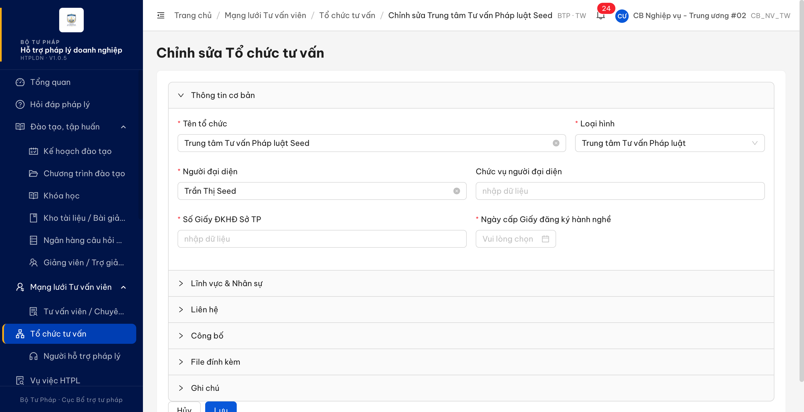

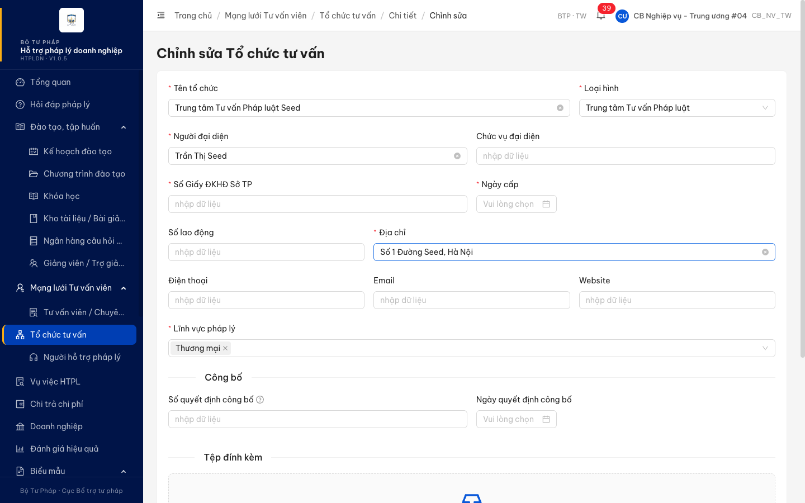

---

## ~~BUG-QLDMTCTV_OOS_10~~ [CLOSED] — 5 nhãn trường trên biểu mẫu hiển thị khác nhãn trong đặc tả

> **Re-test:** 2026-08-04 02:05:00 R2 — ✅ PASS (Closed-verified). Cả 5 nhãn đã đúng đặc tả ở **cả hai** chế độ Thêm mới và Chỉnh sửa: "Chức vụ người đại diện", "Ngày cấp Giấy đăng ký hành nghề", "Lĩnh vực pháp luật", "Địa chỉ trụ sở", "Số điện thoại"; 5 nhãn cũ không còn xuất hiện. Không dừng ở việc đọc nhãn: đã chạy trọn vòng ghi–đọc (tạo mới một hồ sơ với giá trị nhận dạng riêng cho từng trường → Lưu → mở lại ở chế độ Chỉnh sửa) để chắc chắn việc đổi nhãn không làm lệch trường dữ liệu bên dưới — mọi giá trị về đúng trường của nó. Hồ sơ dựng để kiểm đã được xóa, danh sách trở lại đúng số ban đầu.

### Mô tả

Biểu mẫu Thêm mới / Chỉnh sửa Tổ chức tư vấn hiển thị 5 nhãn trường khác với nhãn quy định trong đặc tả: "Chức vụ đại diện", "Ngày cấp", "Lĩnh vực pháp lý", "Địa chỉ", "Điện thoại". Nghĩa của trường không đổi, vẫn nhập liệu bình thường nên mức ảnh hưởng nhẹ. Hai chế độ Thêm mới và Chỉnh sửa dùng chung biểu mẫu nên sai giống nhau.

### Các bước tái hiện

1. Đăng nhập role **Cán bộ Nghiệp vụ cấp Trung ương** (`cbnv_tw_02`, đơn vị Cục Bổ trợ tư pháp — Bộ Tư pháp). Theo `srs-fr-04-chuyen-gia-tvv.md:1614`, vai trò này có quyền "thêm/sửa/xóa" Tổ chức tư vấn thuộc đơn vị, nên mở được cả hai chế độ của biểu mẫu.
2. Chọn menu "Mạng lưới Tư vấn viên" → "Tổ chức tư vấn".
3. Bấm nút "Thêm mới" để mở biểu mẫu Thêm mới, mở hết 6 nhóm rồi đọc lần lượt nhãn của từng trường.
4. So từng nhãn với bảng thành phần màn hình `SCR-IV-NEW-02` (dòng 1676 đến 1695).
5. Quay lại danh sách, bấm biểu tượng Sửa một tổ chức bất kỳ để đối chiếu nhãn ở chế độ Chỉnh sửa.

### Kết quả mong đợi

- Theo `srs-fr-04-chuyen-gia-tvv.md`, nhãn các trường phải là: "Chức vụ người đại diện" (`:1680`), "Ngày cấp Giấy đăng ký hành nghề" (`:1682`), "Lĩnh vực pháp luật" (`:1684`), "Địa chỉ trụ sở" (`:1687`), "Số điện thoại" (`:1688`).
- Đổi nhãn là thay đổi phần hiển thị, nên dữ liệu nhập vào từng trường vẫn phải được lưu và đọc lại đúng trường đó.

### Kết quả thực tế

- **Đã đạt.** Đọc toàn bộ nhãn ở chế độ Thêm mới, theo 6 nhóm: Thông tin cơ bản — "Tên tổ chức", "Loại hình", "Người đại diện", **"Chức vụ người đại diện"**, "Số Giấy ĐKHĐ Sở TP", **"Ngày cấp Giấy đăng ký hành nghề"** · Lĩnh vực & Nhân sự — **"Lĩnh vực pháp luật"**, "Số lao động" · Liên hệ — **"Địa chỉ trụ sở"**, **"Số điện thoại"**, "Email", "Website" · Công bố — "Số quyết định công bố", "Ngày quyết định công bố" · File đính kèm · Ghi chú.
- Chế độ Chỉnh sửa (hồ sơ `TCTV-SEED-0001`): danh sách nhãn trùng khớp hoàn toàn với chế độ Thêm mới. Đối chiếu ngược 5 nhãn cũ — "Chức vụ đại diện", "Ngày cấp", "Lĩnh vực pháp lý", "Địa chỉ", "Điện thoại" — không nhãn nào còn xuất hiện.
- Vòng ghi–đọc kiểm việc gán trường: tạo hồ sơ mới với giá trị nhận dạng riêng cho từng trường, Lưu thành công (hồ sơ `TC-BTP-TW-0004`, trạng thái Mới đăng ký), mở lại ở chế độ Chỉnh sửa thì mỗi giá trị nằm đúng nhãn của nó — "Chức vụ người đại diện" = `CHUC VU RT`, "Ngày cấp Giấy đăng ký hành nghề" = `10/03/2024`, "Lĩnh vực pháp luật" = `Hành chính`, "Địa chỉ trụ sở" = `DIA CHI TRU SO RT 0804`, "Số điện thoại" = `0912345678`. Không có hiện tượng đổi nhãn mà lệch trường.
- Hồ sơ dựng để kiểm đã xóa sau khi đo xong; thẻ "Mới đăng ký" trở lại đúng số trước đó.

### Bằng chứng

**1. Ảnh chụp:**

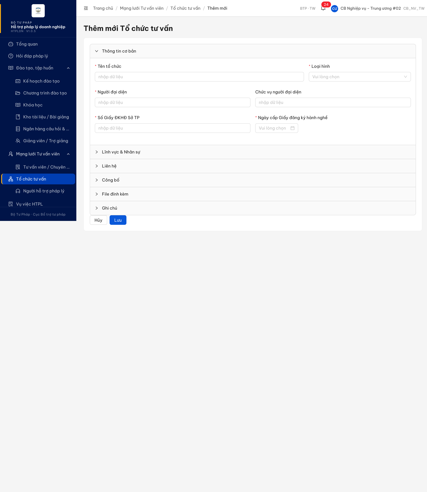

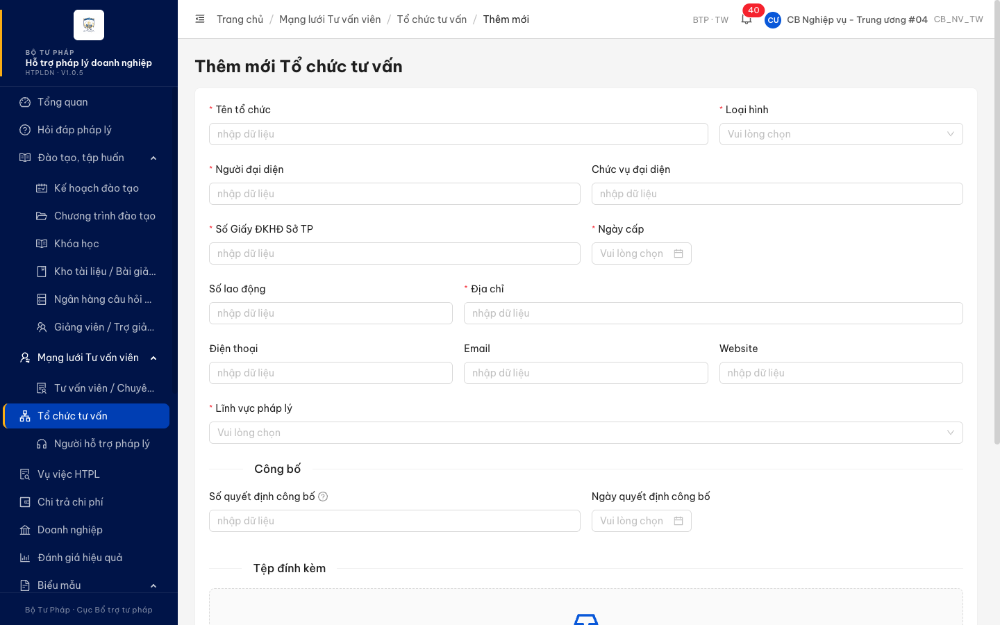

---

## ~~BUG-QLDMTCTV_OOS_11~~ [CLOSED] — Màn Chi tiết Tổ chức tư vấn thiếu toàn bộ 3 tab và không có vùng tệp đính kèm

> **Re-test:** 2026-08-04 02:40:00 R2 — ✅ PASS (Closed-verified). Cả 4 điểm thiếu của lỗi gốc đều đã có: màn Chi tiết nay đủ **3 tab** "Thông tin" / "Tư vấn viên liên kết" / "Lịch sử"; vùng **Tệp đính kèm** hiện tên tệp + dung lượng kèm 2 nút "Xem" và "Tải xuống"; bảng thông tin đã có mục "Lĩnh vực pháp luật"; đường dẫn điều hướng đã kèm tên tổ chức. Không dừng ở việc nhìn thấy tab: đã bấm vào từng tab để xem nội dung thật, và bấm cả "Xem" lẫn "Tải xuống" — tệp PDF mở được (nội dung trả về đúng định dạng PDF, phản hồi 200) và lệnh tải cũng chạy tới nơi.

### Mô tả

Màn Chi tiết Tổ chức tư vấn không có tab nào (đếm được 0 tab): thiếu cả "Thông tin", "Tư vấn viên liên kết" và "Lịch sử", nên không xem được danh sách tư vấn viên liên kết lẫn nhật ký thao tác. Màn cũng không có mục tệp đính kèm và không có nút "Xem" / "Tải xuống", dù tổ chức đang có tệp PDF (mở chế độ Chỉnh sửa mới thấy tệp). Ngoài ra bảng thông tin thiếu mục "Lĩnh vực", và đường dẫn điều hướng ghi "… / Tổ chức tư vấn / Chi tiết" thay vì kèm tên tổ chức.

### Các bước tái hiện

1. Đăng nhập role **Cán bộ Nghiệp vụ cấp Trung ương** (`cbnv_tw_02`, đơn vị Cục Bổ trợ tư pháp — Bộ Tư pháp). Theo `srs-fr-04-chuyen-gia-tvv.md:1706`, vai trò này được "xem + sửa + trình phê duyệt + cập nhật trạng thái + công khai" với Tổ chức tư vấn thuộc đơn vị, nên thấy được toàn bộ màn Chi tiết.
2. Chọn menu "Mạng lưới Tư vấn viên" → "Tổ chức tư vấn".
3. Ở thẻ "Mới đăng ký", bấm vào tên tổ chức `TC-BTP-TW-0003` (trạng thái Mới đăng ký, có 1 tệp PDF đính kèm) để mở màn Chi tiết.
4. Đếm số tab trên màn, rồi bấm lần lượt từng tab để xem nội dung.
5. Tìm mục tệp đính kèm, bấm "Xem" và "Tải xuống".
6. Đọc đường dẫn điều hướng ở thanh trên cùng và kiểm mục "Lĩnh vực" trong bảng thông tin.

### Kết quả mong đợi

- Theo `srs-fr-04-chuyen-gia-tvv.md:1702`, màn Chi tiết là "Trang chi tiết 3 tab + 6 nút hành động ở header". Ba tab bắt buộc: "Thông tin" (`:1729`), "Tư vấn viên liên kết" (`:1730`, kèm trạng thái rỗng ở `:1731`), "Lịch sử" (`:1732`).
- Tab "Thông tin" phải hiển thị đủ 6 nhóm thông tin, trong đó có nhóm tệp đính kèm và người dùng phải xem cùng tải được tệp ngay từ màn Chi tiết, không phải vòng qua chế độ Chỉnh sửa (`:1729`).
- Đường dẫn điều hướng phải là "… > [Tên tổ chức]" (`:1715`).

### Kết quả thực tế

- **Đã đạt.** Màn Chi tiết `TC-BTP-TW-0003` hiện đủ 3 tab đúng tên và đúng thứ tự: "Thông tin" · "Tư vấn viên liên kết" · "Lịch sử".
- Bấm vào tab "Tư vấn viên liên kết": bảng đủ 7 cột theo `:1730` (Số thứ tự, Mã tư vấn viên, Họ tên, Loại, Trạng thái tư vấn viên, Ngày tham gia, Trạng thái liên kết) và vì tổ chức chưa liên kết ai nên hiện đúng câu ở `:1731` — "Chưa có tư vấn viên nào liên kết với tổ chức này".
- Bấm vào tab "Lịch sử": bảng đủ 4 cột theo `:1732` (Thời gian, Người thực hiện, Hành động, Ghi chú / lý do) và có bản ghi thật "03/08/2026 16:44 — CB Nghiệp vụ - Trung ương #04 — Tạo mới", kèm phân trang.
- Tab "Thông tin" có đủ 6 nhóm nội dung: cơ bản, lĩnh vực & nhân sự (đã có **"Lĩnh vực pháp luật: Thương mại"** — mục mà lỗi gốc báo thiếu), liên hệ, công bố, tệp đính kèm, ghi chú.
- Vùng "Tệp đính kèm" hiện `QA-QD-cong-bo-QLDMTCTV06.pdf` kèm dung lượng và 2 nút "Xem", "Tải xuống". Bấm "Xem" → tệp PDF mở ra xem được, nội dung trả về đúng là tệp PDF thật (phản hồi 200, đúng định dạng `application/pdf`), không còn phải vòng qua chế độ Chỉnh sửa. Bấm "Tải xuống" → lệnh tải chạy tới nơi, phản hồi 200.
- Đường dẫn điều hướng: `Trang chủ / Mạng lưới Tư vấn viên / Tổ chức tư vấn / Trung tam Tu van QA Kiem Truong Cong Bo 0803` — đã kèm tên tổ chức, không còn cấp "Chi tiết".
- Ghi nhận thêm để đối tác nắm: nút "Xem" mở tệp ở một thẻ trình duyệt mới thay vì hộp xem ngay trong màn. Người dùng vẫn xem được tệp đúng như yêu cầu nghiệp vụ nên không mở lại lỗi ở điểm này; nếu muốn mở ngay trong màn thì nêu để dev cân nhắc riêng.

### Bằng chứng

**1. Ảnh chụp:**

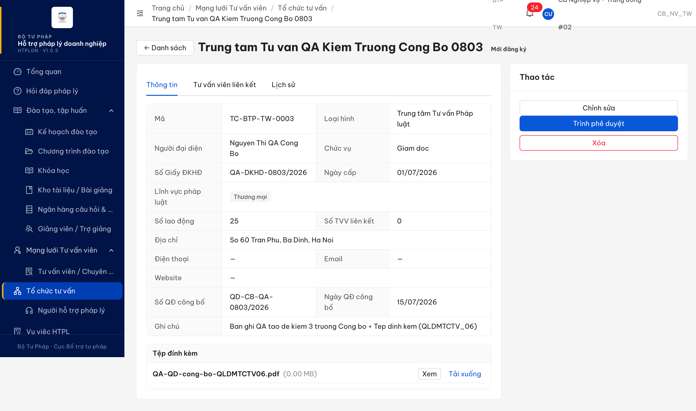

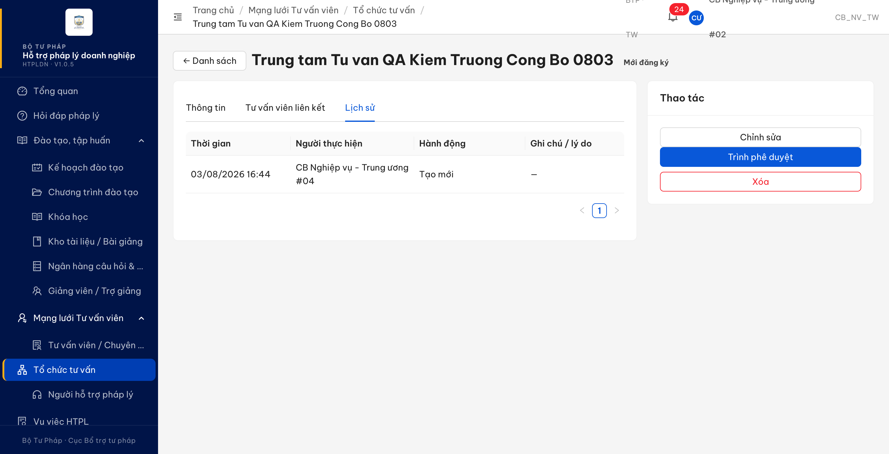

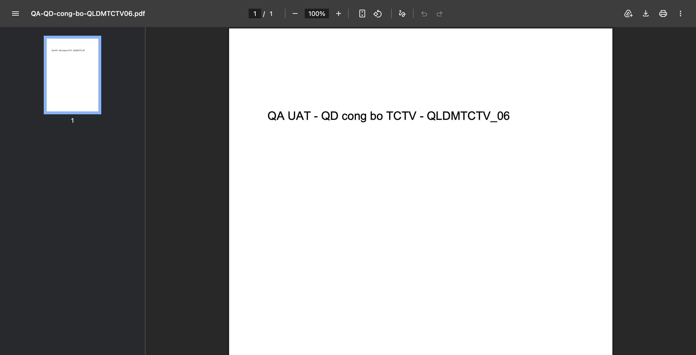

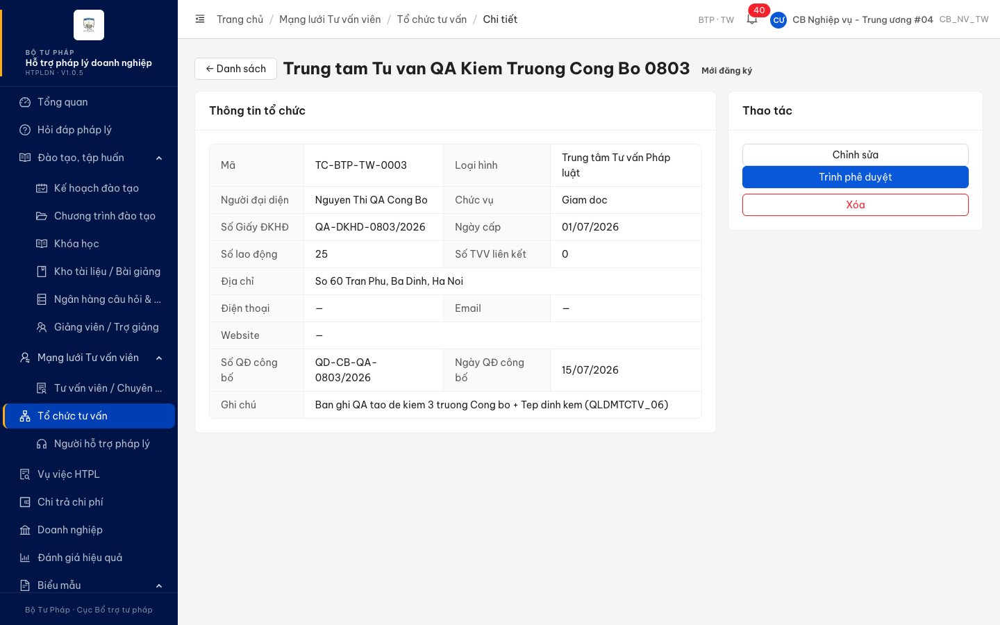

---

## ~~BUG-QLDMTCTV_OOS_12~~ [CLOSED] — Ô tìm kiếm không tìm được theo Người đại diện

> **Re-test:** 2026-08-04 03:05:00 R2 — ✅ PASS (Closed-verified). Chạy lại đúng 3 phép của lỗi gốc: tìm theo TÊN ra 2 tổ chức, tìm theo MÃ ra 1 tổ chức, và tìm theo NGƯỜI ĐẠI DIỆN "Nguyen Van QA" nay **ra đúng 1 tổ chức `TC-STP-AG-0001`** thay vì 0 kết quả. Nội dung gợi ý trong ô tìm kiếm cũng đã ghi đủ "Tìm theo mã tổ chức, tên tổ chức hoặc người đại diện". Kiểm thêm 3 phép để chắc không phải trùng hợp: tên riêng phần ("Nguyen Van") ra 2 tổ chức, và tên có dấu tiếng Việt ("Trần Thị Seed", "Nguyễn Văn Demo") đều ra đúng tổ chức tương ứng.

### Mô tả

Trên danh sách Tổ chức tư vấn, nhập đúng tên người đại diện của một tổ chức vào ô tìm kiếm rồi bấm "Tìm kiếm" thì không ra kết quả nào, dù tên đó đang hiển thị ở cột "Người đại diện" của chính tổ chức đó. Tìm theo tên tổ chức và theo mã tổ chức vẫn chạy bình thường. Nội dung gợi ý trong ô tìm kiếm cũng chỉ ghi "Tìm theo tên hoặc mã tổ chức", thiếu phần "người đại diện". Hệ quả: cán bộ không tra được tổ chức khi trong tay chỉ có tên người đại diện.

### Các bước tái hiện

1. Đăng nhập role **Cán bộ Nghiệp vụ cấp Trung ương** (`cbnv_tw_02`, đơn vị Cục Bổ trợ tư pháp — Bộ Tư pháp). Theo `srs-fr-04-chuyen-gia-tvv.md:1614`, vai trò này xem được danh sách Tổ chức tư vấn nên dùng được ô tìm kiếm.
2. Chọn menu "Mạng lưới Tư vấn viên" → "Tổ chức tư vấn", ở thẻ "Đang hoạt động".
3. Nhập "Trung tam Tu van" vào ô tìm kiếm rồi bấm "Tìm kiếm" — phép đối chứng theo TÊN.
4. Xóa ô tìm kiếm, nhập "TC-STP-AG-0001" rồi bấm "Tìm kiếm" — phép đối chứng theo MÃ.
5. Xóa ô tìm kiếm, nhập "Nguyen Van QA" rồi bấm "Tìm kiếm" — tìm theo NGƯỜI ĐẠI DIỆN. Đây là người đại diện của tổ chức `TC-STP-AG-0001`, đang hiện ở cột "Người đại diện" của bảng.
6. So ba kết quả và đọc nội dung gợi ý trong ô tìm kiếm.

### Kết quả mong đợi

- Theo `srs-fr-04-chuyen-gia-tvv.md:1631` (màn hình `SCR-IV-NEW-01` §Thành phần row 9), ô tìm kiếm có nội dung gợi ý "Tìm theo mã tổ chức, tên tổ chức hoặc người đại diện" và hành vi là tìm theo mã / tên / người đại diện.
- Vì vậy nhập đúng tên người đại diện của một tổ chức thì phải tìm ra tổ chức đó, giống như khi tìm theo tên hoặc theo mã.

### Kết quả thực tế

- **Đã đạt.** Tìm theo TÊN "Trung tam Tu van" → 2 tổ chức (`TC-STP-AG-0001`, `TCTV-SEED-0001`). Tìm theo MÃ "TC-STP-AG-0001" → 1 tổ chức. Tìm theo NGƯỜI ĐẠI DIỆN "Nguyen Van QA" → **1 tổ chức `TC-STP-AG-0001`**, đúng tổ chức mà người này đại diện; trước đây phép này ra 0 kết quả.
- Nội dung gợi ý trong ô tìm kiếm nay là "Tìm theo mã tổ chức, tên tổ chức hoặc người đại diện" — khớp nguyên văn `:1631`, không còn thiếu phần người đại diện.
- Kiểm thêm để loại khả năng trùng hợp: nhập một phần tên "Nguyen Van" → ra 2 tổ chức (`TC-STP-AG-0001` của "Nguyen Van QA" và `TC-TW-DEMO-001` của "Nguyễn Văn Demo", tức tìm không phân biệt dấu tiếng Việt). Nhập tên có dấu đầy đủ "Trần Thị Seed" → đúng `TCTV-SEED-0001`; "Nguyễn Văn Demo" → đúng `TC-TW-DEMO-001`.

### Bằng chứng

**1. Ảnh chụp:**

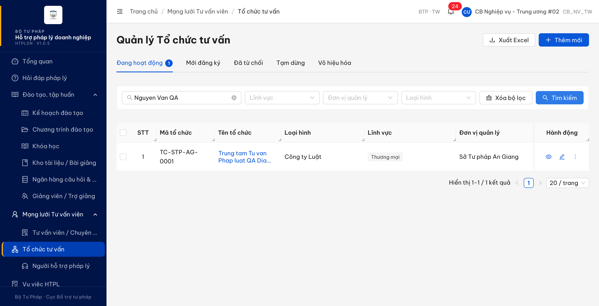

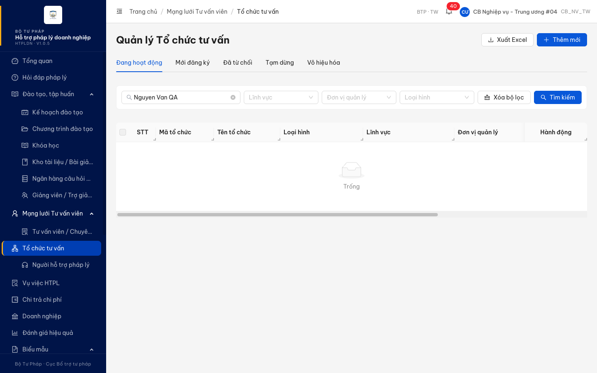

---

## ~~BUG-QLDMTCTV_OOS_08~~ [CLOSED] — Biểu mẫu Thêm mới / Chỉnh sửa không chia 6 nhóm thu gọn như đặc tả

> **Re-test:** 2026-08-04 01:08:00 R2 — ✅ PASS (Closed-verified). Biểu mẫu nay chia đúng **6 nhóm thu gọn** với tên khớp `:1669`; nhóm "Thông tin cơ bản" mở sẵn, 5 nhóm còn lại đóng — đúng `:1676`. Đã bấm đóng/mở thật nhóm "Liên hệ" để xác nhận là nhóm thu gọn hoạt động chứ không phải tiêu đề tĩnh. Giống nhau ở cả chế độ Thêm mới và Chỉnh sửa.

### Mô tả

Biểu mẫu Thêm mới / Chỉnh sửa Tổ chức tư vấn để phẳng, không có nhóm nào thu gọn hay mở ra được. Chỉ 2 trong 6 nhóm có tiêu đề mục hiển thị là "Công bố" và "Tệp đính kèm"; 4 nhóm còn lại không có tiêu đề phân tách. Không cản trở việc nhập liệu, nhưng biểu mẫu dài và khó tìm mục.

### Các bước tái hiện

1. Đăng nhập role **Cán bộ Nghiệp vụ cấp Trung ương** (`cbnv_tw_02`, đơn vị Cục Bổ trợ tư pháp — Bộ Tư pháp). Theo `srs-fr-04-chuyen-gia-tvv.md:1667`, chỉ vai trò Cán bộ Nghiệp vụ được tạo/sửa Tổ chức tư vấn thuộc đơn vị mình.
2. Chọn menu "Mạng lưới Tư vấn viên" → "Tổ chức tư vấn" → bấm **"Thêm mới"**.
3. Đọc bố cục biểu mẫu: đếm số nhóm có tiêu đề và thử bấm vào tiêu đề nhóm xem có đóng/mở được không.
4. Lặp lại ở chế độ Chỉnh sửa: về danh sách, bấm biểu tượng Sửa của một tổ chức (`TC-TW-DEMO-001`).

### Kết quả mong đợi

- Theo `srs-fr-04-chuyen-gia-tvv.md:1664` màn `SCR-IV-NEW-02` là "Biểu mẫu nhập liệu (**6 nhóm**)", và `:1669` liệt kê đúng 6 nhóm: Thông tin cơ bản, Lĩnh vực & Nhân sự, Liên hệ, Công bố, File đính kèm, Ghi chú.
- Các dòng `:1676`, `:1683`, `:1686`, `:1691` khai loại UI của từng nhóm là **"nhóm thu gọn"**, riêng nhóm 1 ghi "Mặc định mở".
- Nghĩa là người dùng phải thấy biểu mẫu được chia thành 6 nhóm có tiêu đề, đóng/mở được, và nhóm đầu tiên mở sẵn khi vào biểu mẫu.

### Kết quả thực tế

- **Lượt kiểm gốc (03/08/2026, `cbnv_tw_04`):** biểu mẫu để phẳng, không nhóm nào đóng/mở được; chỉ 2 nhóm có tiêu đề.
- **Lượt re-verify (04/08/2026, `cbnv_tw_02`) — đã hết lỗi.** Biểu mẫu "Thêm mới Tổ chức tư vấn" có đúng 6 nhóm thu gọn:

  | # | Tên nhóm trên biểu mẫu | Trạng thái khi mới mở | Số trường trong nhóm | Đối chiếu đặc tả |
  |:-:|---|---|:-:|---|
  | 1 | Thông tin cơ bản | **Mở sẵn** | 6 | `:1676` "Mặc định mở"; 6 trường = mục 2.1–2.6 |
  | 2 | Lĩnh vực & Nhân sự | Đóng | 2 | `:1683`; 2 trường = mục 3.1–3.2 |
  | 3 | Liên hệ | Đóng | 4 | `:1686`; 4 trường = mục 4.1–4.4 |
  | 4 | Công bố | Đóng | 2 | `:1691`; 2 trường = mục 5.1–5.2 |
  | 5 | File đính kèm | Đóng | 1 | `:1694` |
  | 6 | Ghi chú | Đóng | 1 | `:1695` |

- Bấm vào tiêu đề nhóm "Liên hệ": nhóm mở ra (hiện 4 trường "Địa chỉ trụ sở", "Số điện thoại", "Email", "Website"), bấm lần nữa thì đóng lại ⇒ là nhóm thu gọn thật, không phải tiêu đề tĩnh.
- Mở chế độ **Chỉnh sửa** (`TC-TW-DEMO-001`): bố cục y hệt — vẫn đúng 6 nhóm cùng tên, nhóm "Thông tin cơ bản" mở sẵn, 5 nhóm còn lại đóng.

### Bằng chứng

**1. Ảnh chụp:**

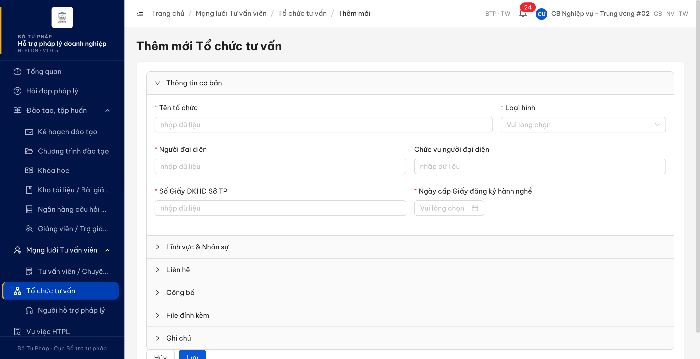

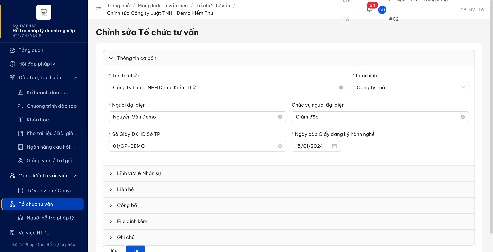

---

## ~~BUG-QLDMTCTV_OOS_02~~ [CLOSED] — Cột "Công khai" là nhãn tĩnh, bấm không mở được hộp thoại công khai

> **Re-test:** 2026-08-04 00:22:00 R2 — ✅ PASS (Closed-verified). Cột "Công khai" nay là công tắc bật/tắt thật, nhãn đã đổi đúng thành "Đã công khai" / "Chưa công khai"; bấm mở hộp thoại "Công khai lên Cổng pháp luật quốc gia" (bắt buộc nhập Mô tả công khai), xác nhận thì `POST /api/v1/to-chuc-tu-vans/{id}/cong-khai` trả 200 và dòng đổi sang "Đã công khai"; bấm lại mở hộp thoại "Hủy công khai tổ chức tư vấn" và trả về "Chưa công khai". Đã chạy trọn cả hai chiều rồi khôi phục nguyên trạng dữ liệu.

### Mô tả

Trên bảng danh sách Tổ chức tư vấn, cột "Công khai" chỉ là nhãn hiển thị: con trỏ chuột không đổi thành hình bàn tay, bấm vào không mở hộp thoại nào. Nhãn hiển thị cũng khác đặc tả (web dùng "Công khai" / "Riêng tư"). Cán bộ Nghiệp vụ chỉ công khai được bằng cách tích chọn dòng rồi bấm nút trên thanh thao tác hàng loạt.

### Các bước tái hiện

1. Đăng nhập role **Cán bộ Nghiệp vụ cấp Trung ương** (`cbnv_tw_02`, đơn vị Cục Bổ trợ tư pháp — Bộ Tư pháp). Theo `srs-fr-04-chuyen-gia-tvv.md:1614`, vai trò này có quyền "thêm/sửa/xóa, xuất Excel, **công khai**, cập nhật trạng thái" với Tổ chức tư vấn thuộc đơn vị.
2. Chọn menu "Mạng lưới Tư vấn viên" → "Tổ chức tư vấn", ở thẻ "Đang hoạt động".
3. Cuộn ngang bảng sang phải tới cột "Công khai", đọc nhãn đang hiển thị trên từng dòng.
4. Bấm vào phần tử ở cột đó và quan sát hệ thống có mở hộp thoại nào không.

### Kết quả mong đợi

- Theo `srs-fr-04-chuyen-gia-tvv.md:1645`, cột "Công khai" là **toggle**, nhãn "Đã công khai" (xanh) / "Chưa công khai" (xám); click → **mở MD-CONG-KHAI hoặc MD-HUY-CONG-KHAI**; chỉ bật được khi trạng thái = Đang hoạt động.
- Nghĩa là người dùng phải công khai / hủy công khai được ngay từ dòng trong bảng, qua một bước xác nhận, chứ không chỉ qua thao tác hàng loạt.

### Kết quả thực tế

- **Lượt kiểm gốc (03/08/2026, `cbnv_tw_04`):** cột "Công khai" là nhãn tĩnh, không bấm được, bấm vào không mở hộp thoại; nhãn là "Công khai" / "Riêng tư".
- **Lượt re-verify (04/08/2026, `cbnv_tw_02`) — đã hết lỗi**, chạy trọn luồng hai chiều trên `TC-TW-DEMO-001` (Cục Bổ trợ tư pháp — Bộ Tư pháp, trạng thái Đang hoạt động, ban đầu "Chưa công khai"):

  | Bước | Quan sát |
  |---|---|
  | Đọc cột "Công khai" | Là công tắc thật (`.ant-switch`), nhãn "Chưa công khai" / "Đã công khai" — khớp `:1645` |
  | Bấm công tắc | Mở hộp thoại **"Công khai lên Cổng pháp luật quốc gia"**, có ô "Nhập mô tả công khai" (bắt buộc, đếm 0/5000); nút "Công khai" bị khóa khi ô còn trống |
  | Nhập mô tả → bấm "Công khai" | `POST /api/v1/to-chuc-tu-vans/fbeea7e9-118e-49ce-abaf-6245a9ebe604/cong-khai` → **200**; danh sách tải lại, dòng đổi sang "Đã công khai", công tắc bật |
  | Bấm công tắc lần nữa | Mở hộp thoại **"Hủy công khai tổ chức tư vấn"** — "Tổ chức … sẽ được gỡ khỏi Cổng pháp luật quốc gia ở lần đồng bộ kế tiếp" |
  | Xác nhận "Hủy công khai" | Dòng trở lại "Chưa công khai" — dữ liệu đã khôi phục đúng nguyên trạng |

- Kiểm thêm điều kiện "chỉ bật được khi trạng thái = Đang hoạt động": ở thẻ "Mới đăng ký", hai dòng `TC-BTP-TW-0003` và `TC-BTP-TW-0002` có công tắc ở trạng thái **bị vô hiệu** — đúng đặc tả.
- Kiểm thêm phân quyền: với `cbpd_tw_02` (Cán bộ Phê duyệt) công tắc bị vô hiệu trên mọi dòng — đúng `:1614`/`:1615` (công khai là quyền của Cán bộ Nghiệp vụ).

### Bằng chứng

**1. Ảnh chụp:**

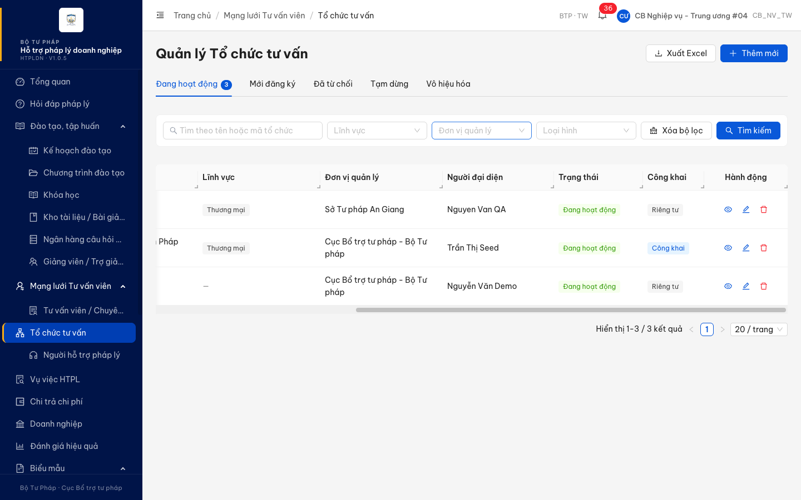

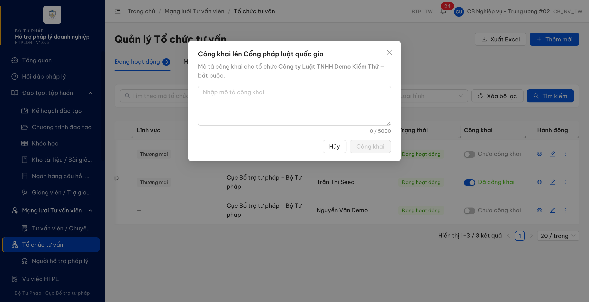

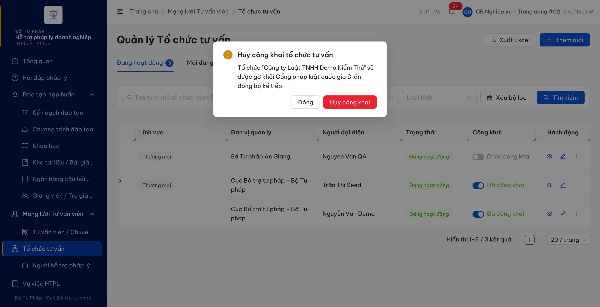

---

## ~~BUG-QLDMTCTV_OOS_01~~ [CLOSED] — Thẻ "Chờ phê duyệt" không chuyển dấu đỏ khi đang có hồ sơ chờ xử lý

> **Re-test:** 2026-08-04 00:08:00 R2 — ✅ PASS (Closed-verified). Huy hiệu số đếm của thẻ "Chờ phê duyệt" nay là nền ĐỎ `rgb(245, 34, 45)`, bằng đúng màu của thẻ đối chứng "Mới đăng ký" `rgb(245, 34, 45)`; thẻ "Đang hoạt động" (đặc tả không yêu cầu chấm đỏ) giữ nền xanh `rgb(9, 88, 217)`. Đã mở tab xác nhận số đếm là thật (1 hồ sơ `TC-BTP-TW-0001`), không phải số hiển thị sai.

### Mô tả

Trên màn danh sách Tổ chức tư vấn, thẻ trạng thái "Chờ phê duyệt" đang có 1 hồ sơ nhưng huy hiệu số đếm vẫn nền xanh, trong khi thẻ "Mới đăng ký" cùng tình huống thì nền đỏ. Hai thẻ được đặc tả bằng cùng một mệnh đề nhưng hiển thị khác nhau, khiến Cán bộ Phê duyệt mất tín hiệu cảnh báo trên đúng thẻ chứa việc của mình.

### Các bước tái hiện

1. Đăng nhập role **Cán bộ Phê duyệt cấp Trung ương** (`cbpd_tw_02`, đơn vị Cục Bổ trợ tư pháp — Bộ Tư pháp). Theo `srs-fr-04-chuyen-gia-tvv.md:1615`, vai trò này có quyền "xem + phê duyệt/từ chối tab Chờ phê duyệt", và theo `:1628` thẻ "Chờ phê duyệt" chỉ hiển thị với vai trò này.
2. Chọn menu "Mạng lưới Tư vấn viên" → "Tổ chức tư vấn".
3. Quan sát thanh thẻ trạng thái phía trên bảng, đọc màu huy hiệu của thẻ "Chờ phê duyệt".
4. So sánh với huy hiệu của thẻ "Mới đăng ký" (cũng đang có hồ sơ).

### Kết quả mong đợi

- Theo `srs-fr-04-chuyen-gia-tvv.md:1628`, thẻ "Chờ phê duyệt" thuộc loại "tab + số đếm + **chấm đỏ nếu >0**" — cùng một mệnh đề với thẻ "Mới đăng ký" ở `:1627`.
- Vậy khi thẻ đang có từ 1 hồ sơ trở lên, hệ thống phải hiện dấu đỏ để Cán bộ Phê duyệt nhận ra có việc cần xử lý, và hai thẻ này phải hiển thị giống nhau khi cùng có hồ sơ.

### Kết quả thực tế

- **Lượt kiểm gốc (03/08/2026, `cbpd_tw_04`):** thẻ "Chờ phê duyệt" có 1 hồ sơ nhưng huy hiệu nền XANH; thẻ "Mới đăng ký" cùng lúc có hồ sơ thì huy hiệu nền ĐỎ.
- **Lượt re-verify (04/08/2026, `cbpd_tw_02`) — đã hết lỗi:** đọc màu nền thực tế của từng huy hiệu trên trang:

  | Thẻ | Số đếm | Màu nền huy hiệu | Đặc tả |
  |---|:-:|---|---|
  | Đang hoạt động | 3 | `rgb(9, 88, 217)` (xanh) | `:1625` — chỉ "tab + số đếm", không yêu cầu chấm đỏ ⇒ đúng |
  | **Chờ phê duyệt** | **1** | **`rgb(245, 34, 45)` (đỏ)** | `:1628` — "chấm đỏ nếu >0" ⇒ **đúng** |
  | Mới đăng ký | 2 | `rgb(245, 34, 45)` (đỏ) | `:1627` — "chấm đỏ nếu >0" ⇒ đúng (nhóm đối chứng, khớp màu) |
  | Đã từ chối / Tạm dừng / Vô hiệu hóa | 0 | không có huy hiệu | — |

- Mở tab "Chờ phê duyệt" xác nhận số đếm là thật: bảng trả về đúng 1 dòng `TC-BTP-TW-0001` — "Trung tam Tu van QA Kiem Cot Bang 0803", trạng thái "Chờ phê duyệt", chân bảng ghi "Hiển thị 1-1 / 1 kết quả".

### Bằng chứng

**1. Ảnh chụp:**

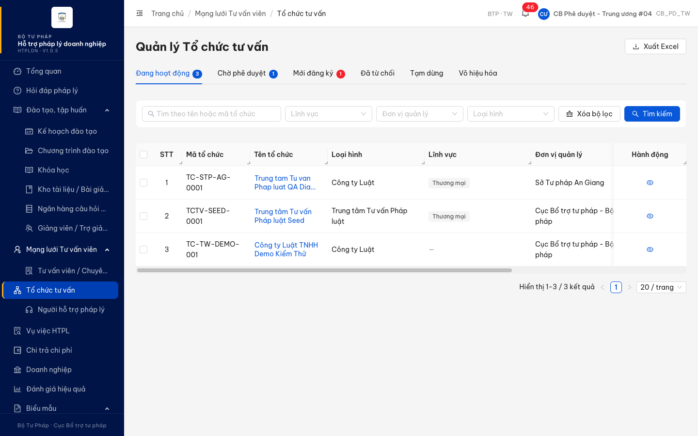

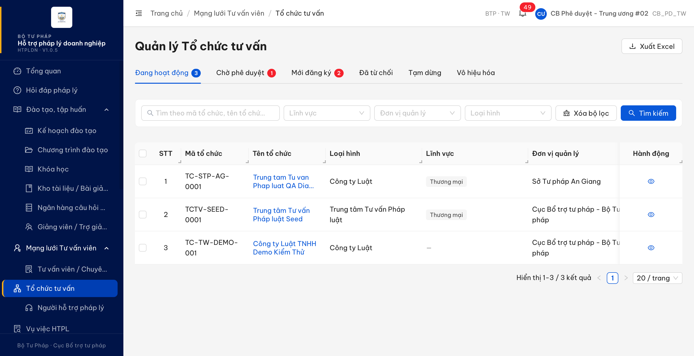

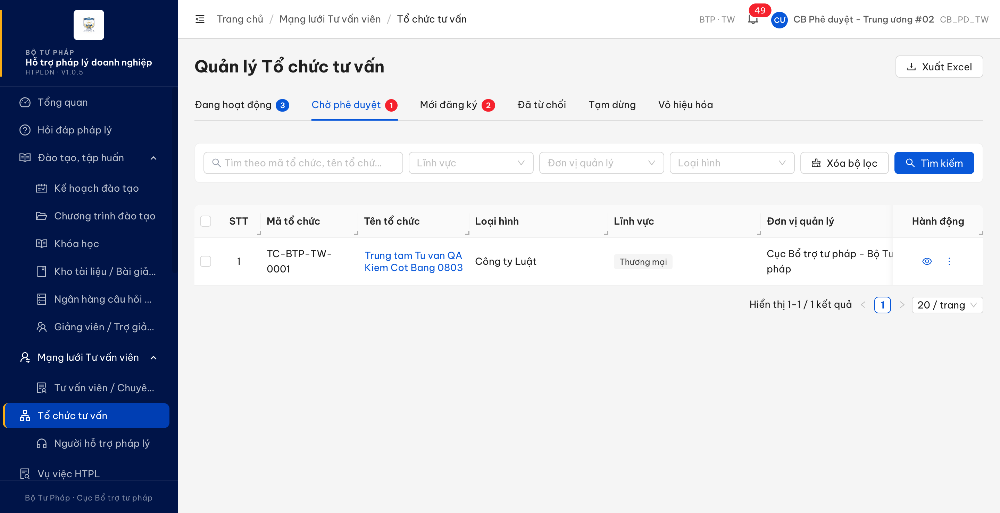

---

## BUG-QLDMTCTV_OOS_05 — Bảng danh sách Tổ chức tư vấn có 11 cột, thừa cột "Đơn vị quản lý" đẩy 3 cột cuối ra ngoài khung nhìn

### Mô tả

Bảng danh sách ở màn `Mạng lưới Tư vấn viên → Tổ chức tư vấn` đang hiển thị **11 cột**, trong đó có cột **"Đơn vị quản lý"** đặt giữa "Lĩnh vực" và "Người đại diện". Bảng thành phần màn hình `SCR-IV-NEW-01` liệt kê đúng **10 cột** và không có cột này — "Đơn vị quản lý" chỉ được quy định ở màn này với vai trò **bộ lọc**.

Không mất thông tin nào, nhưng cột thừa làm bảng rộng thêm, đẩy **ba cột cuối — Trạng thái · Công khai · Hành động — ra ngoài khung nhìn**, phải cuộn ngang mới thấy. "Hành động" là cột người dùng thao tác nhiều nhất, còn "Trạng thái" và "Công khai" là hai thông tin cần nhìn ngay.

### Các bước tái hiện

1. Đăng nhập vai trò **CB Nghiệp vụ Trung ương** (`CB_NV_TW`, tài khoản `cbnv_tw`, đơn vị Cục Bổ trợ tư pháp - Bộ Tư pháp) — vai trò có quyền xem danh sách Tổ chức tư pháp theo `SCR-IV-NEW-01`.
2. Đặt cửa sổ trình duyệt ở bề ngang **1440px**.
3. Vào `Mạng lưới Tư vấn viên` → `Tổ chức tư vấn`, thẻ **"Đang hoạt động"** (môi trường có 3 tổ chức).
4. Đọc lần lượt tiêu đề **tất cả** các cột của bảng, từ trái sang phải, cuộn ngang đến hết.
5. Không cuộn ngang, kiểm xem ba cột Trạng thái · Công khai · Hành động có nằm trong khung nhìn không.
6. Mở vùng bộ lọc phía trên bảng, kiểm bộ lọc theo đơn vị quản lý.

### Kết quả mong đợi

- `SCR-IV-NEW-01 §Thành phần` liệt kê đúng **10 cột** cho bảng danh sách — `srs-fr-04-chuyen-gia-tvv.md:1636` đến `:1645`: *Ô chọn* (`:1636`) · *Số thứ tự* (`:1637`) · *Mã tổ chức* (`:1638`) · *Tên tổ chức* (`:1639`) · *Loại hình* (`:1640`) · *Người đại diện* (`:1641`) · *Lĩnh vực* (`:1642`) · *Trạng thái* (`:1643`) · *Công khai* (`:1644`) · *Hành động* (`:1645`).
- "Đơn vị quản lý" được quy định ở màn này **chỉ với vai trò bộ lọc** — `:1633`: *"| 12 | **bộ lọc** | Đơn vị quản lý | dropdown có tìm kiếm | Danh sách đơn vị có quyền | Lọc theo đơn vị quản lý Tổ chức tư vấn |"*.
- ⇒ Bảng phải có đúng 10 cột trên; nhu cầu xem theo đơn vị quản lý đã có bộ lọc `:1633` phục vụ, không cần thêm cột.

### Kết quả thực tế

- Bảng có **11 cột** — thừa **"Đơn vị quản lý"** đặt giữa "Lĩnh vực" và "Người đại diện". Cột này có dữ liệu thật (*"Sở Tư pháp An Giang"*, *"Cục Bổ trợ tư pháp - Bộ Tư pháp"*).
- Ở bề ngang 1440px, bảng có **thanh cuộn ngang**; ba cột **Trạng thái · Công khai · Hành động** nằm ngoài khung nhìn, phải cuộn mới thấy. Cột "Hành động" bị ghim bên phải.
- Bộ lọc theo đơn vị quản lý **vẫn còn và vẫn dùng được** ⇒ cột thừa không phải là thứ duy nhất phục vụ nhu cầu này.
- **Đo lại ngày 04/08/2026** trên môi trường bàn giao `https://htpldn-uat.ospgroup.vn`, bản dựng **V1.0.5**, tài khoản `cbnv_tw`: cột "Đơn vị quản lý" **VẪN CÒN** ở đúng vị trí giữa "Lĩnh vực" và "Người đại diện".

### Bằng chứng

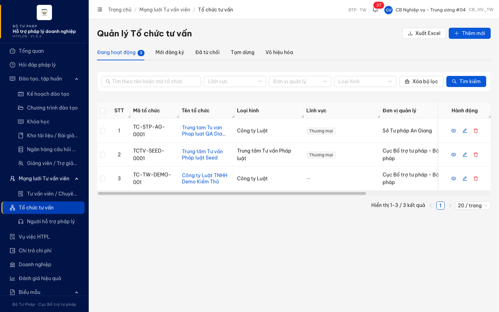

| Nội dung | Đường dẫn |
|---|---|
| Phiếu đo lại 04/08/2026 (mục C — ghi nhận cột vẫn còn trên V1.0.5) | [`../../../../reverify-week-4/reverify-round-2026-08-04/do-lai-nhom-xuat-pdf-va-row339-2026-08-04.md`](../../../../reverify-week-4/reverify-round-2026-08-04/do-lai-nhom-xuat-pdf-va-row339-2026-08-04.md) |
| Quyết định của BA (Vấn đề 19) | [`../../../../reverify-week-4/reverify-round-2026-08-04/phan-hoi-cac-diem-cho-BA-chot-2026-08-04.md`](../../../../reverify-week-4/reverify-round-2026-08-04/phan-hoi-cac-diem-cho-BA-chot-2026-08-04.md) |
| Câu hỏi gốc gửi BA (mục 3) | [`../../ba-confirmation-needed-luong4-to-chuc-tu-van-2026-08-03.md`](../../ba-confirmation-needed-luong4-to-chuc-tu-van-2026-08-03.md) |

> **⚠️ Bẫy khi re-test:** gỡ cột là đúng, nhưng **đừng gỡ luôn bộ lọc theo đơn vị quản lý** (`:1633`) — bộ lọc đó thuộc đặc tả và phải còn dùng được. Gỡ cả hai = FAIL.

> **⚠️ Lưu ý số dòng SRS:** số dòng trên được mở file kiểm lại ngày **04/08/2026** trên bản `Docs-PM-HTPLDN/_bmad-output/planning-artifacts/srs-v3.5/`. Các bug đã đóng ở phần trên file này (viết ngày 03–04/08) dẫn cùng bảng đó ở vị trí **lớn hơn 1 dòng** (vd cột "Hành động" ghi `:1646`) — do file đặc tả sau đó thêm một dòng phía trên. Nội dung trích dẫn không đổi.

---

## BUG-QLDMTCTV_OOS_13 — Giấy hành nghề của tổ chức mang hai tên khác nhau trên cùng biểu mẫu, không tên nào là tên chuẩn

### Mô tả

Trên biểu mẫu `Mạng lưới Tư vấn viên → Tổ chức tư vấn → Thêm mới`, **hai trường của cùng một loại giấy** đang mang **hai tên khác nhau**, và **không tên nào** trùng tên chuẩn trong đặc tả:

| Nơi hiển thị | Chữ đang dùng | Tên chuẩn theo đặc tả |
|---|---|---|
| Nhãn trường số giấy | "Số Giấy **ĐKHĐ Sở TP**" | "Số Giấy **đăng ký hoạt động**" |
| Nhãn trường ngày cấp | "Ngày cấp Giấy đăng ký **hành nghề**" | "Ngày cấp Giấy đăng ký **hoạt động**" |
| Câu báo lỗi khi bỏ trống số giấy | "Số Giấy đăng ký **hành nghề** là bắt buộc (NĐ 77/2008 Đ.13)" | — |
| Câu báo lỗi khi bỏ trống ngày cấp | "Ngày cấp Giấy **ĐKHĐ** là bắt buộc (NĐ 77/2008 Đ.13)" | — |

Điểm đáng chú ý: chính câu báo lỗi viện dẫn **NĐ 77/2008 Đ.13** — điều luật quy định *Giấy đăng ký **hoạt động*** do Sở Tư pháp cấp cho **tổ chức**. *"Giấy đăng ký hành nghề"* là khái niệm của **cá nhân** tư vấn viên, không áp cho tổ chức. Phần mềm dẫn đúng căn cứ pháp lý nhưng gọi sai tên ngay trong cùng một câu.

**Phần MỨC BẮT BUỘC thì phần mềm ĐANG ĐÚNG, Dev không đụng** — xem "Kết quả thực tế" mục 2. BA có nêu điều kiện *"nếu phần mềm đang cho lưu hồ sơ trống giấy này"*; QA đo và xác nhận **điều kiện đó không xảy ra**.

### Các bước tái hiện

1. Đăng nhập vai trò **CB Nghiệp vụ Trung ương** (`CB_NV_TW`, tài khoản `cbnv_tw`) — vai trò được `SCR-IV-NEW-02` cho phép thêm mới Tổ chức tư vấn.
2. Vào `Mạng lưới Tư vấn viên` → `Tổ chức tư vấn` → **Thêm mới**.
3. Đọc nhãn của **hai trường giấy tờ** trong nhóm "Thông tin cơ bản".
4. Để trống cả hai trường đó, điền đủ các trường bắt buộc còn lại → bấm **Lưu**, đọc câu báo lỗi.
5. Mở màn **Chỉnh sửa** một tổ chức đã có, đọc lại nhãn hai trường đó.

### Kết quả mong đợi

- `SCR-IV-NEW-02 §Thành phần` quy định nhãn của hai trường — `srs-fr-04-chuyen-gia-tvv.md:1680`: *"| 2.5 | nhóm 1 | **Số Giấy đăng ký hoạt động** \* | ô văn bản | **Bắt buộc** (theo NĐ 77/2008 Đ.13 — Sở Tư pháp cấp Giấy đăng ký hoạt động, điều kiện …) |"*; `:1681`: *"| 2.6 | nhóm 1 | **Ngày cấp Giấy đăng ký hoạt động** \* | bộ chọn ngày | **Bắt buộc**, ≤ hôm nay |"*.
- Thực thể cũng dùng cùng tên gọi — `:1052`: *"| 6 | `so_giay_dkhd` | text | **Y** | Bắt buộc theo NĐ 77/2008 Đ.13 — **Giấy đăng ký hoạt động** Sở Tư pháp `[BA chốt 2026-08-04]` |"*.
- ⇒ Cả nhãn trường lẫn câu báo lỗi phải dùng **cùng một tên gọi "Giấy đăng ký hoạt động"**, nhất quán giữa màn Thêm mới và màn Chỉnh sửa.
- Cả hai trường phải **bắt buộc** và hệ thống phải chặn khi để trống.

### Kết quả thực tế

Đo ngày **04/08/2026** trên môi trường bàn giao `https://htpldn-uat.ospgroup.vn`, bản dựng **V1.0.5**, tài khoản `cbnv_tw`:

**1. Tên gọi — SAI, và sai không nhất quán.** Bốn chỗ hiển thị dùng **ba cách gọi khác nhau** cho cùng một loại giấy (bảng ở mục "Mô tả"): hai nhãn trường ngay cạnh nhau đã khác nhau ("ĐKHĐ Sở TP" ↔ "đăng ký hành nghề"), và hai câu báo lỗi lại đảo ngược so với chính nhãn của trường mình. Không chỗ nào dùng tên chuẩn "Giấy đăng ký hoạt động" như `:1680` / `:1681`.

**2. Mức bắt buộc — ĐÚNG, không có việc cho Dev.** Đo **hai chiều độc lập**, cùng kết luận:

| # | Phương pháp | Kết quả |
|:-:|---|---|
| 1 | Đọc biểu mẫu Thêm mới | Cả hai trường **có dấu `*` đỏ** — được đánh dấu bắt buộc |
| 2 | Gửi hồ sơ **rỗng** thẳng lên máy chủ (chọn cách này để **không tạo ra bản ghi nào**) | Bị **từ chối**, kèm đúng hai câu báo lỗi ở bảng trên; **không bản ghi nào được tạo** |

⇒ Phần mềm **không cho lưu hồ sơ trống giấy này**. Điều kiện *"nếu phần mềm đang cho lưu hồ sơ trống"* mà BA nêu **không xảy ra** ⇒ phần bắt buộc **không phải sửa**. Phạm vi lỗi chỉ còn **tên gọi hiển thị ở bốn chỗ**.

### Bằng chứng

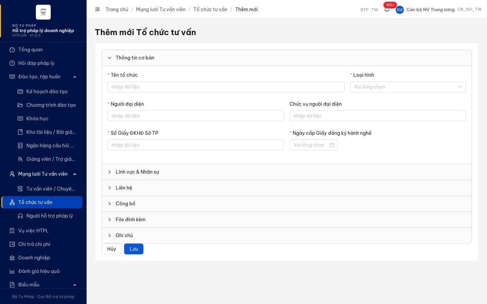

| Nội dung | Đường dẫn |
|---|---|
| Phiếu đo lại 04/08/2026 (mục B — đủ cả 2 chiều đo mức bắt buộc) | [`../../../../reverify-week-4/reverify-round-2026-08-04/do-lai-nhom-xuat-pdf-va-row339-2026-08-04.md`](../../../../reverify-week-4/reverify-round-2026-08-04/do-lai-nhom-xuat-pdf-va-row339-2026-08-04.md) |
| Quyết định của BA (Vấn đề 21) | [`../../../../reverify-week-4/reverify-round-2026-08-04/phan-hoi-cac-diem-cho-BA-chot-2026-08-04.md`](../../../../reverify-week-4/reverify-round-2026-08-04/phan-hoi-cac-diem-cho-BA-chot-2026-08-04.md) |
| Câu hỏi gốc gửi BA | [`../../ba-confirmation-needed-luong4-to-chuc-tu-van-2026-08-03.md`](../../ba-confirmation-needed-luong4-to-chuc-tu-van-2026-08-03.md) |

> **⚠️ Bẫy khi re-test — hai điều dễ chấm nhầm:**
> 1. Viết tắt **"ĐKHĐ"** chỉ được chấp nhận **nếu tên đầy đủ đã xuất hiện** ở nhãn hoặc chú giải cùng màn. Màn chỉ có chữ viết tắt ⇒ **chưa đạt**.
> 2. **Đừng chấm FAIL vì hệ thống chặn khi bỏ trống hai trường** — chặn là ĐÚNG. Phần phải sửa chỉ là **chữ hiển thị**, ở cả nhãn trường lẫn câu báo lỗi, trên **cả hai màn** Thêm mới và Chỉnh sửa.

---

## Phụ lục — Môi trường test

| Thành phần | Giá trị |
|------------|---------|
| URL ứng dụng | https://18.143.165.120.nip.io |
| OTP login | Lấy từ MailHog (không bypass) |
| MailHog (OTP inbox) | http://18.143.165.120:8025 |
| API base | https://18.143.165.120.nip.io/api/v1 |
| Frontend | React + Ant Design v5 (HTPLDN V1.0.5) |
| Xác thực | JWT (cookie) + OTP email |
| Tool test | Chrome DevTools MCP |

---

*Bug report generated: 2026-08-04 00:10:00 | QA Automation via Claude Code*
