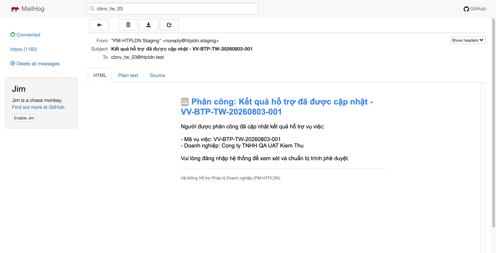
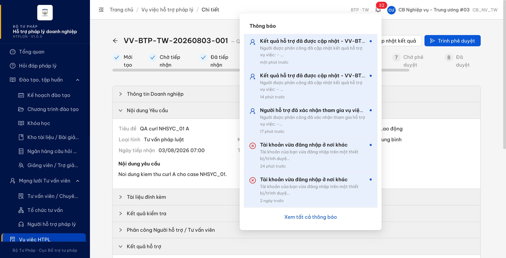

# Bug Report — Vụ việc hỗ trợ pháp lý (thông báo)

| Thông tin | Giá trị |
|-----------|---------|
| **Dự án** | PM HTPLDN — UAT đối tác |
| **Môi trường** | https://18.143.165.120.nip.io |
| **Người test** | QA Automation (Claude Code) |
| **Ngày** | 2026-08-04 01:28:20 |
| **Loại test** | Re-verify (Workflow + Notification) |
| **Round** | Re-verify tuần 3 — verify1-conlai-2026-08-03 |
| **Tài liệu tham chiếu** | `Docs-PM-HTPLDN/_bmad-output/planning-artifacts/srs-v3.5/srs-fr-05-vu-viec.md` · [audit CNKQHT_07](../../reverify-audit/CNKQHT_07.md) |

---

## Tổng hợp

> **R2 re-verify 2026-08-04 01:28:20 (tài khoản `cbnv_tw_01` + `qa_tvvseed28`, vụ việc mới `VV-BTP-TW-20260804-001`):** `BUG-CNKQHT_OOS_01` đã **Closed** — tiêu đề trong thân 2 thư "Kết quả hỗ trợ đã được cập nhật" và "Người hỗ trợ đã xác nhận tham gia vụ việc" không còn tiền tố `📋 Phân công:`, khớp đúng loại sự kiện. Breakdown: **0 Open / 1 Closed**.

Re-verify `CNKQHT_07` (row 315, tab `UAT_TGPL Doanh Nghiệp-tuần 3`) — lỗi gốc "CB NV phụ trách không nhận thông báo sau khi cập nhật kết quả hỗ trợ" **đã hết**, verdict `Pass`, không log bug cho case đó.

Lỗi ngoài phạm vi phát hiện khi verify đã mở dòng TC riêng trên sheet (`CNKQHT_OOS_01`, tab tuần 2 row 141) để tới được dev.

### Severity breakdown

| Tổng | Critical | Major | Medium | Minor | Trivial | Closed | Open |
|------|----------|-------|--------|-------|---------|--------|------|
| 1    | 0        | 0     | 0      | 1     | 0       | 1      | 0    |

## Bug Summary Table

| Bug ID | Severity | Priority | Type | TC Ref | **SRS Reference** | Title | Status |
|--------|----------|----------|------|--------|-------------------|-------|--------|
| BUG-CNKQHT_OOS_01 | Minor | P3 | UI/UX | CNKQHT_OOS_01 (sheet tuần 2 row 141) | `FR-V.I-15 (UC65) §Processing bước 5` (srs-fr-05-vu-viec.md:1106) · `§Postconditions` (:1114) · `BR-NOTIF-01` (:2466) | Tiêu đề trong thân email thông báo cập nhật kết quả bị gắn tiền tố "Phân công:", nói sai loại sự kiện | Closed |

---

## ~~BUG-CNKQHT_OOS_01~~ [CLOSED] — Tiêu đề thân email báo "cập nhật kết quả hỗ trợ" mở đầu bằng "Phân công:", sai bản chất sự kiện

> **Re-test:** 2026-08-04 01:28:20 — ✅ PASS (Closed-verified). Dựng lại đủ luồng trên vụ việc MỚI `VV-BTP-TW-20260804-001`: `cbnv_tw_01` kiểm tra hồ sơ → phân công `qa_tvvseed28` → TVV chấp nhận (vụ việc sang Đang xử lý) → TVV bấm [Cập nhật kết quả] (232 ký tự, khung "Đã cập nhật kết quả"). Thư gửi `cbnv_tw_01@htpldn.test`: dòng tiêu đề đầu thân thư = `Kết quả hỗ trợ đã được cập nhật - VV-BTP-TW-20260804-001` và `Người hỗ trợ đã xác nhận tham gia vụ việc - VV-BTP-TW-20260804-001`, **không còn tiền tố `📋 Phân công:`** ở cả 2 thư (đo 3 cách: mã nguồn thư gốc, `innerText` thẻ tiêu đề khi hiển thị, ảnh toàn cỡ). Đối chứng: nhóm khác vẫn sinh tiền tố (`🔗 Tích hợp:` ở thư "Vụ việc đã được tiếp nhận" cùng vụ việc, 04/08) ⇒ tiền tố vẫn phát theo nhóm thông báo, riêng nhóm phân công đã bỏ đúng chỗ. Gói giao diện `index-BrKDNUvo.js`. [Ảnh 1](image/CNKQHT_OOS_01-retest-2026-08-04-mail-ketqua-tieude-dung.png) · [Ảnh 2](image/CNKQHT_OOS_01-retest-2026-08-04-mail-xacnhan-thamgia-tieude-dung.png) · [Ảnh đối chứng](image/CNKQHT_OOS_01-retest-2026-08-04-doichung-nhom-khac-con-tien-to.png)

### Mô tả

Khi người được phân công lưu "Cập nhật kết quả hỗ trợ", hệ thống gửi email cho CB NV phụ trách. Tiêu đề thư (`Subject`) đúng, nhưng dòng tiêu đề lớn ở **đầu thân thư** lại là `📋 Phân công: Kết quả hỗ trợ đã được cập nhật - VV-BTP-TW-20260803-001`. Người nhận đọc dòng đầu sẽ hiểu nhầm là thư báo phân công vụ việc, trong khi sự kiện thật là cập nhật kết quả để chuẩn bị trình phê duyệt. Cùng hiện tượng ở thông báo "Người hỗ trợ đã xác nhận tham gia vụ việc". Trong dữ liệu API, các thông báo này đều mang `loaiThongBao = PHAN_CONG`.

### Các bước tái hiện

1. Đăng nhập role **CB Nghiệp vụ Trung ương** (`cbnv_tw_03`, quyền tiếp nhận/kiểm tra/phân công vụ việc theo `SCR-V.I-03` bảng nút hành động, srs-fr-05-vu-viec.md:1742-1745) → tạo/tiếp nhận vụ việc `VV-BTP-TW-20260803-001` → Kiểm tra hồ sơ → Phân công cho `qa_tvvseed28`.
2. Đăng nhập role **TVV · CG được phân công** (`qa_tvvseed28`) → Chấp nhận phân công → vụ việc sang `DANG_XU_LY`.
3. Vẫn ở `qa_tvvseed28`: bấm **[Cập nhật kết quả]** → nhập nội dung kết quả → **[Xác nhận]**.
4. Mở hộp thư của `cbnv_tw_03@htpldn.test`, mở thư `Kết quả hỗ trợ đã được cập nhật - VV-BTP-TW-20260803-001`.
5. Quan sát: dòng tiêu đề lớn ở đầu thân thư.

### Kết quả mong đợi

- Theo `srs-fr-05-vu-viec.md:1106` (FR-V.I-15 §Processing bước 5 "Gửi thông báo CB NV") và `:1114` (§Postconditions "CB NV nhận thông báo để review"), sự kiện được thông báo là **cập nhật kết quả hỗ trợ**, không phải phân công.
- `BR-NOTIF-01` (`:2466`) yêu cầu gửi thông báo cho người liên quan qua 2 kênh; nội dung thông báo phải cho người nhận biết đúng chuyện gì vừa xảy ra. Vì vậy phần tiêu đề hiển thị trong thân thư phải phản ánh đúng loại sự kiện, không được gọi tên một sự kiện khác.

### Kết quả thực tế

- Thân thư mở đầu bằng `📋 Phân công: Kết quả hỗ trợ đã được cập nhật - VV-BTP-TW-20260803-001`.
- Cùng lỗi ở thư `Người hỗ trợ đã xác nhận tham gia vụ việc - VV-BTP-TW-20260803-001` → thân thư `📋 Phân công: Người hỗ trợ đã xác nhận tham gia vụ việc - …`.
- Đối chứng nhóm khác: thư `Phản hồi đã được phê duyệt` → thân thư `Phản hồi đã được phê duyệt`, **không** có tiền tố ⇒ tiền tố sinh theo nhóm thông báo chứ không phải chuỗi cố định của mẫu thư dùng chung.
- `GET /api/v1/thong-baos` trả `loaiThongBao = "PHAN_CONG"` cho cả 2 thông báo trên.
- SRS `srs-fr-05-vu-viec.md:1056` chỉ khai `loai_thong_bao` kiểu `text`, không quy định bộ nhóm ⇒ chọn nhóm/đặt nhãn thế nào là quyền của dev/BA; ở đây chỉ nêu yêu cầu nghiệp vụ là tiêu đề phải đúng loại sự kiện.

### Bằng chứng

**1. Ảnh chụp:**





**2. API response (phụ trợ):**

```json
{
  "tieuDe": "Kết quả hỗ trợ đã được cập nhật - VV-BTP-TW-20260803-001",
  "noiDung": "Người được phân công đã cập nhật kết quả hỗ trợ vụ việc:\n\n- Mã vụ việc: VV-BTP-TW-20260803-001\n- Doanh nghiệp: Cong ty TNHH QA UAT Kiem Thu\n\nVui lòng đăng nhập hệ thống để xem xét và chuẩn bị trình phê duyệt.",
  "loai": "PHAN_CONG",
  "nguoiNhanId": "9b557200-be4b-46ac-b84b-fe6c154dc65f",
  "taoLuc": "2026-08-03T10:23:11.932Z"
}
```

---

## Phụ lục — Môi trường test

| Thành phần | Giá trị |
|------------|---------|
| URL ứng dụng | https://18.143.165.120.nip.io |
| OTP login | Lấy từ MailHog (không bypass) |
| MailHog (OTP inbox) | http://18.143.165.120:8025 |
| API base | https://18.143.165.120.nip.io/api/v1 |
| Frontend | React + Ant Design v5 (HTPLDN V1.0.5) |
| Xác thực | JWT (cookie) + OTP email |
| Tool test | Chrome DevTools MCP |

---

*Bug report generated: 2026-08-03 17:34:00 · cập nhật re-verify 2026-08-04 01:28:20 | QA Automation via Claude Code*
