# Bug Report — UAT đối tác tuần 4 (PM HTPLDN)

| Thông tin | Giá trị |
|-----------|---------|
| **Dự án** | Phần mềm Hỗ trợ pháp lý doanh nghiệp (PM HTPLDN) |
| **Môi trường** | https://18.143.165.120.nip.io |
| **Người test** | QA Automation (Claude Code) |
| **Ngày** | 2026-07-31 23:10:00 |
| **Loại test** | Verify bug đối tác — UAT (vòng 1: log bug · vòng 2: re-verify sau khi dev fix) |
| **Round** | Tuần 4 · **vòng 2** (re-verify sau khi dev báo fix) |
| **Tài liệu tham chiếu** | [QA_VERIFY_PROTOCOL.md](../../QA_VERIFY_PROTOCOL.md) · SRS v3.5 `Docs-PM-HTPLDN/_bmad-output/planning-artifacts/srs-v3.5/` · Sheet tab `UAT_TGPL Doanh Nghiệp-tuần 4` |

---

## Tổng hợp

Verify bug đối tác gửi tuần 4 (34 case). File này gộp **toàn bộ bug được chấm `Open`** của cả lô.

> **Tiến độ (ảnh chụp mới nhất 2026-07-30 — lượt R3, re-verify sau khi BA chốt 22 dòng `BA confirm` là bug và dev đánh `dev done`; bản dựng V1.0.3, bộ tài khoản `_02`):** phạm vi R3 là **18 dòng phiếu** đang `dev done` + Verify trống/Open/Reopen trên sheet tuần 4. Cách làm: chạy lại trọn luồng trên giao diện bằng Chrome DevTools MCP, đọc tệp Excel từng ô, đếm số lần gọi máy chủ kèm mỗi thông báo.
> **Kết quả R3: 18/18 dòng phiếu Pass · 0 Reopen.** Trong đó **17 dòng do QA tự chạy lại và tự đo**; dòng thứ 18 (`TKVVHTPLDN_01`, row 35) Pass **theo xác nhận của chủ đợt UAT** vì QA bị chặn khỏi cổng API — xem đoạn ngay dưới. 17 dòng QA tự đo = row 2 · 5 · 6 · 7 · 8 · 10 · 11 · 14 · 15 · 16 · 18 · 25 · 26 · 29 · 30 · 31 · 32 → **8 bug đóng mới** (`BUG-TK-KHONG-CO-XOA-BO-LOC`, `BUG-TK-THONG-DIEP-RONG`, `BUG-QLKCHTV_10`, `BUG-QLKCHTV_14`, `BUG-QLKCHTV_22`, `BUG-QLKCHTV_26A/26B/26C`); 9 dòng còn lại Pass mà không phát sinh bug entry riêng — ghi ở *Phụ lục R3* ngay dưới Bảng tổng hợp bug.
> **`TKVVHTPLDN_01` (row 35) — chấm `Pass` theo xác nhận của chủ đợt UAT, KHÔNG phải theo phép đo của QA.** Đây là API tích hợp dành cho hệ thống bên ngoài, **không có bề mặt giao diện nào để chạy lại**, mà toàn bộ đường `/api/v1/public/*` vẫn trả `ERR-AUTH-MTLS-01` vì môi trường chưa cấp chứng thư số phía khách — dò lại **30/07/2026 15:00 UTC** (lần gần nhất, sau khi có xác nhận đã fix): cả đường dẫn có thật lẫn đường dẫn bịa ra đều 401 ⇒ bị chặn **trước** khâu định tuyến. Ghi rõ nguồn kết luận ở đây và ở đầu bug entry để người đọc lại hồ sơ không hiểu nhầm là QA đã tái hiện được.
> **Trạng thái toàn file: 42 Closed · 0 Reopen · 0 Open.** Bug Open cuối cùng — `BUG-KCH-LOC-NGAY-KIEU-QUOC-TE` (`HIENTHI_OOS_16`, row 51) — đã đóng ở lượt **R4 (31/07/2026, bản dựng V1.0.4)**: ô lọc ngày màn Kho câu hỏi nay ghi đúng `dd/MM/yyyy` và nhận được ngày gõ tay theo khuôn đó. ⚠️ Ba lượt đóng ở R4 (`HIENTHI_OOS_16`, `HDPL_001`, `VVHT_001`) đều đo trên **env được giao `18.143.165.120.nip.io`**; env đối tác `htpldn-uat.ospgroup.vn` đang chạy **bản dựng khác** nên chứng minh được **mã nguồn đã sửa**, chưa chứng minh đã triển khai — chi tiết ở khối cảnh báo trong từng mục bug.

> **Ghi chú Luồng 6 — 4/5 phiếu KHÔNG thành lỗi, nhưng phát sinh 2 lỗi khác đối tác chưa thấy.** `KHTHCTHTPLDN_03` và `KHTHCTHTPLDN_08` bị chấm Reject vì kết quả mong đợi trong phiếu **trái với chính đặc tả v3.5** (cột "Số đợt BC" là đúng đặc tả; các nút vòng đời nằm ở thanh hành động màn chi tiết chứ không phải trên dòng). `KHTHCTHTPLDN_07` và `KHTHCTHTPLDN_12` chuyển BA vì đặc tả v3.5 không quy định tên tệp xuất và bố cục đầu trang chi tiết. Đổi lại, khi đo kỹ đã lộ 2 lỗi thật: bảng thiếu cột **Lĩnh vực pháp lý** và tệp Excel xuất ra **lệch 1 ngày** so với màn hình.

> **Ghi chú Luồng 7 — cùng một màn với Luồng 6 nhưng soi ở góc "tìm kiếm", và lần này đặc tả đứng về phía đối tác.** `TKKHCTHTPL_02` đòi câu thông báo *"Không tìm thấy chương trình phù hợp"* — chuỗi này **có thật trong đặc tả**, ở đúng chức năng tìm kiếm của đúng màn (`srs-fr-15-ct-htpldn.md:381`, mã `INF-CT-TK-01`). Hệ thống đang hiện "Trống" ⇒ Open. Đây là điểm **khác** với `TKCHTV_02` ở Luồng 5, nơi chuỗi đối tác mong đợi không tồn tại ở bất kỳ đâu trong SRS v3.5 — cùng một dạng khiếu nại nhưng kết luận ngược nhau, vì phải tra phạm vi (thuộc FR nào, màn nào) chứ không chỉ tra chuỗi.

> **Ghi chú Luồng 8 — triệu chứng đối tác ghi hình KHÔNG tái hiện, nhưng case vẫn HỎNG ở bước ngay sau đó.** Phiếu `LBCKQTHCT_01` báo lỗi 403 *"Đơn vị không nằm trong phạm vi truy cập của bạn"* khi mở chi tiết đợt báo cáo. Khi QA kiểm lại bằng đúng vai trò CB NV Địa phương, màn chi tiết **mở được bình thường** — đã xác nhận đơn vị của tài khoản nằm trong phạm vi của cả 2 đợt hiện có. Nhưng đi tiếp đúng kịch bản phiếu thì tắc ở bước kế: bấm **[Lập báo cáo]** bị từ chối với thông báo *"Bản ghi đã tồn tại"*, trong khi chính hệ thống báo đơn vị **chưa nộp** và **chưa có báo cáo nào**. Vì vậy kết quả mong đợi của phiếu (lưu nháp thành công, trạng thái chuyển "Đang lập") vẫn KHÔNG đạt ⇒ giữ **Open**, chỉ mô tả lại đúng điểm hỏng để dev không sửa nhầm chỗ. **Re-verify R2 (28/07/2026): cả 2 bug của luồng này đã hết** — bấm [Lập báo cáo] tạo được báo cáo nháp trên cả 2 đợt, trạng thái nộp chuyển sang *đang lập* và giữ sau khi tải lại trang; một lần bấm chỉ còn 1 thông báo (đo cả nhánh thành công lẫn nhánh lỗi).

> **Ghi chú Luồng 9 — case duy nhất QA KHÔNG thực thi lại được; nay chấm `Pass` theo xác nhận của chủ đợt UAT (trước đó là `Open`, cũng theo quyết định của chủ đợt UAT).** Phiếu `TKVVHTPLDN_01` test **API tích hợp dành cho hệ thống bên ngoài** (FR-XII-08 — `srs-fr-16-api.md:680`), báo 400 *"Validation failed (uuid is expected)"* khi truyền từ khóa hợp lệ. QA bị chặn hoàn toàn: toàn bộ bề mặt `/api/v1/public/*` trả `ERR-AUTH-MTLS-01` vì chưa được cấp chứng thư số phía khách, và chặn xảy ra **trước định tuyến** (một đường dẫn `public/` bịa ra cũng 401 chứ không phải 404). Đã thử cạn kiệt 10 hướng vào — bảng cạn kiệt + nhật ký gọi thật ở [BLOCKER-TKVVHTPLDN_01-cong-api-cong-khai-mtls.log.txt](image/BLOCKER-TKVVHTPLDN_01-cong-api-cong-khai-mtls.log.txt).
>
> **QA đã nêu là theo protocol thì trường hợp này phải để ô TRỐNG (blocker nhóm D) vì không đóng được GAP; chủ đợt UAT quyết định chấm `Open` và chuyển dev tự kiểm, rồi ngày 30/07/2026 xác nhận đã fix và quyết chấm `Pass`.** Cả hai lần đều là quyết định của chủ đợt UAT, không phải kết luận từ phép đo của QA — cổng API vẫn đóng ở lần dò gần nhất (30/07/2026 15:00 UTC). Ghi lại đây để người đọc sau không hiểu sai là QA đã tái hiện được. Bug entry `BUG-API-TIM-VUVIEC-BAO-LOI-UUID` **nói thẳng ở phần Kết quả thực tế** rằng dữ liệu đến từ bản ghi hình trong phiếu, không phải từ phép đo của QA.
>
> **Cơ sở để vẫn chấm được dù chưa chạy lại:** đối chiếu với **bản mô tả API của chính bản triển khai** (`GET /api/docs-json`, 530 đường dẫn, không cần xác thực — nguồn độc lập với phiếu). Đường dẫn đối tác gọi **có thật**; tham số bắt buộc duy nhất là `keyword` kiểu chuỗi ≥2 ký tự (cả 2 từ khóa trong phiếu đều hợp lệ); chức năng này **không có tham số bắt buộc nào kiểu uuid** (2 tham số uuid đều tùy chọn và phiếu không gửi) ⇒ thông báo đòi uuid **không thể** sinh ra từ dữ liệu người gọi nhập. Lỗi thuộc **tầng kiểm tra tham số** (mã `ERR-VAL-…`), tức phát sinh trước khi truy vấn dữ liệu ⇒ không phụ thuộc vai trò / trạng thái bản ghi ⇒ đủ điều kiện xử lý như **bug tĩnh**. Đối tác cũng chứng minh gián tiếp: 2 từ khóa khác nhau, cùng một lỗi.

> **Hiệu chỉnh từ Luồng 5 → phiếu TKCHTV_01/02:** phần đối tác phản ánh **nặng nhất** — *"Kho câu hỏi nhập từ khóa nhưng hệ thống hiển thị toàn bộ bản ghi"* — **không còn tái hiện**. Trên bản hiện tại, màn Kho câu hỏi lọc đúng (từ khóa `lao động` → 1/14 bản ghi, phân trang và số đếm trên thẻ đều đổi theo). Lỗi tìm kiếm còn lại nằm ở màn **Tư vấn nhanh**, cơ chế hỏng khác hẳn: không phải trả về tất cả mà trả về **rỗng**. Xem `BUG-TK-TVN-TIM-KIEM`.

> **Hiệu chỉnh từ Luồng 3 → Luồng 1:** phép đo ở PDNDCHTV_04 chứng minh nguyên nhân gốc của `BUG-QLKCHTV_02` **khác với mô tả ban đầu**. Hệ thống KHÔNG thiếu trạng thái `NHAP` — lựa chọn mang nhãn "Bị từ chối" thực chất lọc theo `NHAP` và chạy đúng. Đây là **lỗi gán sai chữ hiển thị**, hướng sửa là đổi nhãn chứ không phải thêm/bớt trạng thái. Mô tả bug đã được viết lại theo kết quả đo.

> **Phạm vi file:** chỉ chứa case verdict `Open`. Case `Reject` / `BA confirm` / `Resolved` lưu bằng chứng ở `../cond/` và `../reverify-audit/`; riêng câu hỏi cần BA chốt gom ở [ba-confirmation-needed-week-4.md](../ba-confirmation-needed-week-4.md).

### Đối chiếu ID — case phiếu ↔ bug ID (crosswalk)

**Vì sao có bảng này:** một số bug do QA phát hiện **trong lúc verify** một case khác, nên ID case gốc (nơi phát hiện) khác ID case trên sheet (nơi ghi bug). Bảng dưới ghi rõ cả hai để không lẫn.

**Nhóm 1 — bug đúng case phiếu đối tác** (ID case sheet = ID case phiếu):

| Case phiếu (row sheet) | Verdict sheet | Bug ID |
|---|---|---|
| `QLKCHTV_02` (row 2) | Open, BA confirm | `BUG-QLKCHTV_02` |
| `QLKCHTV_03` (row 3) | Open | `BUG-QLKCHTV_03` |
| `QLKCHTV_04` (row 4) | Open | `BUG-QLKCHTV_04` |
| `QLKCHTV_10` (row 5) | Open, BA confirm | `BUG-QLKCHTV_10` |
| `QLKCHTV_12` (row 6) | Open, BA confirm | `BUG-QLKCHTV_10` (cùng nhãn nguồn `IMPORT`) |
| `QLKCHTV_14` (row 8) | Open, BA confirm | `BUG-QLKCHTV_14` |
| `QLKCHTV_16` (row 9) | Open | `BUG-QLKCHTV_16` |
| `QLKCHTV_22` (row 11) | Open, BA confirm | `BUG-QLKCHTV_22` |
| `QLKCHTV_23` (row 12) | Open | `BUG-QLKCHTV_23` |
| `QLKCHTV_24` (row 13) | Open | `BUG-QLKCHTV_24` |
| `QLKCHTV_26` (row 14) | Open, BA confirm | `BUG-QLKCHTV_26A` · `BUG-QLKCHTV_26B` · `BUG-QLKCHTV_26C` |
| `QLKCHTV_35` (row 17) | Open | `BUG-QLKCHTV_35` |
| `QLKCHTV_37` (row 19) | Open | `BUG-QLKCHTV_37` |
| `PDNDCHTV_01` (row 20) | Open | `BUG-PD-THONG-BAO` |
| `PDNDCHTV_04` (row 21) | Open | `BUG-PD-THONG-BAO` · `BUG-QLKCHTV_02` (cùng gốc nhãn trạng thái) |
| `PDNDCHTV_07` (row 22) | Open | `BUG-PD-THONG-BAO` |
| `QLCKCHTV_02` (row 23) | Open | `BUG-CK-MODAL-THIEU-ANH-TEP` |
| `TKCHTV_01` (row 24) | Open | `BUG-TK-TVN-TIM-KIEM` |
| `TKCHTV_02` (row 25) | Open, BA confirm | `BUG-TK-TVN-TIM-KIEM` · `BUG-TK-THONG-DIEP-RONG` |
| `TKCHTV_03` (row 26) | Open, BA confirm | `BUG-TK-KHONG-CO-XOA-BO-LOC` |
| `KHTHCTHTPLDN_02` (row 27) | Open | `BUG-CT-LOC-THIEU-DONVI-TRANGTHAI` |
| `TKKHCTHTPL_01` (row 32) | Open, BA confirm | `BUG-CT-LOC-THIEU-DONVI-TRANGTHAI` |
| `TKKHCTHTPL_02` (row 33) | Open | `BUG-CT-TIM-KHONG-KET-QUA-TRONG` |
| `LBCKQTHCT_01` (row 34) | Open | `BUG-BC-KHONG-LAP-DUOC-BAO-CAO` · `BUG-BC-TOAST-LOI-HIEN-2-LAN` |
| `TKVVHTPLDN_01` (row 35) | Open | `BUG-API-TIM-VUVIEC-BAO-LOI-UUID` |
| `HDPL_001` (row 52) | dev done → Pass R4 | `BUG-HDPL_001` |
| `VVHT_001` (row 53) | dev done → Pass R4 | `BUG-VVHT_001` |

**Nhóm 2 — bug QA phát hiện thêm, KHÔNG thuộc case nào của đối tác** (QA mở dòng mới trên sheet; cột cuối ghi **case gốc nơi phát hiện**, đầy đủ ID, không viết tắt):

| Case QA mở (row sheet) | Bug ID | Phát hiện khi verify case nào |
|---|---|---|
| `QLKCHTV_OOS_01` (row 36) | `BUG-KCH-HTML-THO` | `QLKCHTV_12` (row 6) · `QLKCHTV_14` (row 8) · `QLKCHTV_18` (row 10) |
| `QLKCHTV_OOS_02` (row 37) | `BUG-KCH-TEMPLATE-LINHVUC` | `QLKCHTV_10` (row 5) |
| `QLKCHTV_OOS_03` (row 38) | `BUG-TVN-VUOT-GIOI-HAN-5000` | `QLKCHTV_31` (row 15) |
| `QLCKCHTV_OOS_04` (row 39) | `BUG-CK-HANH-DONG-DONG` | `QLCKCHTV_02` (row 23) |
| `KHTHCTHTPLDN_OOS_05` (row 40) | `BUG-CT-BANG-THIEU-COT-LINHVUC` | `KHTHCTHTPLDN_03` (row 28) |
| `KHTHCTHTPLDN_OOS_06` (row 41) | `BUG-CT-XUAT-EXCEL-SAI-NGAY` | `KHTHCTHTPLDN_07` (row 29) |
| `KHTHCTHTPLDN_OOS_07` (row 42) | `BUG-CT-XUAT-EXCEL-NGAYTAO-MUIGIO` | `KHTHCTHTPLDN_OOS_06` (row 41) — khi re-verify vòng 2 |
| `XUATTEP_OOS_08` (row 43) | `BUG-XUAT-TEP-LECH-MUI-GIO` | rà toàn bộ 16 chức năng xuất tệp, mở rộng từ `KHTHCTHTPLDN_OOS_07` (row 42) |
| `XUATTEP_OOS_09` (row 44) | `BUG-BCTK-XUAT-THIEU-BANG` | rà toàn bộ 16 chức năng xuất tệp, mở rộng từ `KHTHCTHTPLDN_OOS_07` (row 42) |
| `HIENTHI_OOS_10` (row 45) | `BUG-NHAN-MA-KY-THUAT-THO` | rà toàn bộ 16 chức năng xuất tệp, mở rộng từ `KHTHCTHTPLDN_OOS_07` (row 42) |
| `DAOTAO_OOS_11` (row 46) | `BUG-XUAT-TEP-KHOA-HOC-SAI-DU-LIEU` | rà nốt 9 chức năng xuất tệp còn lại (lượt 2, 28/07/2026) |
| `DGHQ_OOS_12` (row 47) | `BUG-BCDG-XLSX-KHONG-THEO-MAU-TT17` | rà nốt 9 chức năng xuất tệp còn lại (lượt 2, 28/07/2026) |
| `XUATTEP_OOS_13` (row 48) | `BUG-XUAT-TEP-THIEU-COT-SO-VOI-MAN-HINH` | rà 25 chức năng xuất tệp (lượt 1 + lượt 2), áp quy ước chủ đợt UAT 28/07/2026 |
| `BCTK_OOS_14` (row 49) | `BUG-BCTK-NHAN-KY-GHI-NGAY-ISO` | re-verify lượt 3 `XUATTEP_OOS_09` (row 44) — bảng "Theo kỳ" nay đã có, lộ tiếp lỗi giá trị bên trong |
| `HIENTHI_OOS_15` (row 50) | `BUG-HIENTHI-NGAY-THIEU-SO-0` | re-verify lượt 3 `XUATTEP_OOS_08` (row 43) — tệp xuất đã đạt, đối chiếu ngược lên màn hình thì màn mới là chỗ còn sai |
| `HIENTHI_OOS_16` (row 51) | `BUG-KCH-LOC-NGAY-KIEU-QUOC-TE` | `QLKCHTV_10` (row 5) — lượt R3 30/07/2026, khi mở màn Kho câu hỏi để kiểm nhãn nguồn |

**Case KHÔNG có bug trong file này** (verdict `Reject` hoặc `BA confirm` thuần — lý do ở [ba-confirmation-needed-week-4.md](../ba-confirmation-needed-week-4.md) và `../cond/`): `QLKCHTV_13` (row 7) · `QLKCHTV_18` (row 10) · `QLKCHTV_31` (row 15) · `QLKCHTV_32` (row 16) · `QLKCHTV_36` (row 18) · `KHTHCTHTPLDN_03` (row 28) · `KHTHCTHTPLDN_07` (row 29) · `KHTHCTHTPLDN_08` (row 30) · `KHTHCTHTPLDN_12` (row 31).

### Severity breakdown

| Tổng | Critical | Major | Medium | Minor | Trivial | Closed | Open |
|------|----------|-------|--------|-------|---------|--------|------|
| 42   | 0        | 16    | 15     | 11    | 0       | 42     | 0     |

## Bug Summary Table

| Bug ID | Severity | Priority | Type | TC Ref | **SRS Reference** | Title | Status |
|--------|----------|----------|------|--------|-------------------|-------|--------|
| BUG-QLKCHTV_04 | Major | P1 | Workflow | QLKCHTV_04 (row 4) | `srs-fr-13-tv-nhanh.md:538` (SCR-X2-01 cửa sổ thêm Q&A) | Cửa sổ "Thêm câu hỏi" thiếu nút [Lưu nháp] và [Gửi duyệt] — không tạo được câu hỏi ở trạng thái Nháp | Closed |
| BUG-QLKCHTV_16 | Major | P1 | Workflow | QLKCHTV_16 (row 9) | `srs-fr-13-tv-nhanh.md:540` (từ chối → SET NHAP) · `:103`, `:533` (NHAP là trạng thái hợp lệ) | Cửa sổ "Sửa câu hỏi" không có đường giữ hoặc đưa bản ghi về trạng thái "Nháp" | Closed |
| BUG-KCH-HTML-THO | Major | P1 | UI/UX | `QLKCHTV_OOS_01` (row 36 — QA mở mới; thấy khi verify QLKCHTV_12, QLKCHTV_14, QLKCHTV_18) | `srs-fr-13-tv-nhanh.md:549` (chi tiết Q&A — câu trả lời là rich text) | Nội dung "Câu trả lời" hiển thị nguyên văn thẻ HTML ở màn chi tiết và trong file Excel xuất | Closed |
| BUG-KCH-TEMPLATE-LINHVUC | Major | P1 | Data | `QLKCHTV_OOS_02` (row 37 — QA mở mới; thấy khi verify QLKCHTV_10) | `srs-fr-13-tv-nhanh.md:539` (modal Import) · `:154` (ERR-KHO-04 "Tải mẫu Excel") | File Excel mẫu do chính hệ thống cấp liệt kê mã lĩnh vực mà hệ thống từ chối khi nhập | Closed |
| BUG-QLKCHTV_26C | Major | P1 | Workflow | QLKCHTV_26 (row 14) | `srs-fr-13-tv-nhanh.md:578` (cột trái phải có "Lich su trao doi") · `:717-733` (entity chưa có bảng lượt trao đổi) | Cột trái màn trả lời không có "Lịch sử trao đổi" | Closed |
| BUG-QLKCHTV_35 | Major | P1 | Workflow | QLKCHTV_35 (row 17) | `srs-fr-13-tv-nhanh.md:207` (bước xử lý 9) · `:230` (`ERR-TVN-03`) · `:239` (AC) · `:579` (nút trên màn) | Thiếu chức năng "Đẩy sang Nhóm II" ở màn trả lời tư vấn nhanh | Closed |
| BUG-QLKCHTV_37 | Major | P1 | Workflow | QLKCHTV_37 (row 19) | `srs-fr-13-tv-nhanh.md:581` (khối Đánh giá: thẻ tổng hợp + [Xuat Excel]) | Khối "Đánh giá" thiếu nút [Xuất Excel] và thẻ tổng hợp (Tổng đánh giá / Điểm TB / Phân bố) | Closed |
| BUG-PD-THONG-BAO | Major | P1 | Workflow | PDNDCHTV_01 (row 20) · PDNDCHTV_04 (row 21) · PDNDCHTV_07 (row 22) | `srs-fr-13-tv-nhanh.md:540` (Duyệt / Từ chối đều kèm "TB CB NV") · `:541` (duyệt hàng loạt) | Duyệt, từ chối và duyệt hàng loạt câu hỏi đều không gửi thông báo cho cán bộ tạo | Closed |
| BUG-TK-TVN-TIM-KIEM | Major | P1 | Workflow | TKCHTV_01 (row 24) · TKCHTV_02 (row 25) | `srs-fr-13-tv-nhanh.md:574` (thanh lọc TV nhanh có "Tu khoa") · `:877-885` (BR-DATA-08 — entity khác tìm bằng LIKE/index) | Ô tìm kiếm màn Tư vấn nhanh trả về rỗng khi nhập mã phiên, từ khóa có dấu hoặc cụm từ nhiều chữ | Closed |
| BUG-QLKCHTV_02 | Medium | P2 | UI/UX | QLKCHTV_02 (row 2) · PDNDCHTV_04 (row 21) | `srs-fr-13-tv-nhanh.md:533` (SCR-X2-01 thanh lọc) · `:103` (FR-X.2-01 Inputs) · `:540` (từ chối → NHAP) | Trạng thái `NHAP` bị dán nhãn "Bị từ chối" ở cả ô lọc lẫn cột Trạng thái — không phân biệt được câu hỏi soạn dở với câu hỏi bị trả về | Closed |
| BUG-QLKCHTV_03 | Medium | P2 | UI/UX | QLKCHTV_03 (row 3) | `srs-fr-13-tv-nhanh.md:535` (SCR-X2-01 bảng kho Q&A) · `:133`, `:139` (FR-X.2-01 Outputs) | Bảng Kho câu hỏi thiếu cột "Câu trả lời"; cột điểm đặt nhãn "Đánh giá" thay vì "Điểm TB" | Closed |
| BUG-QLKCHTV_14 | Medium | P2 | UI/UX | QLKCHTV_14 (row 8) | `srs-fr-13-tv-nhanh.md:549` (chi tiết Q&A phải có "nguoi tao") | Màn chi tiết câu hỏi không hiển thị "Người tạo" | Closed |
| BUG-QLKCHTV_22 | Medium | P2 | UI/UX | QLKCHTV_22 (row 11) | `srs-fr-13-tv-nhanh.md:576` (tập cột bảng TV nhanh) · `:200` (không tự động tìm kiếm/prefill) | Bảng danh sách Tư vấn nhanh thiếu 2 cột "CB xử lý" + "Ngày trả lời", thừa cột "Số gợi ý" | Closed |
| BUG-QLKCHTV_23 | Medium | P2 | Workflow | QLKCHTV_23 (row 12) | `srs-fr-13-tv-nhanh.md:576` (Hành động = Xem / Trả lời) · `:578`, `:579` (điều kiện hiển thị "mode tra loi") | Nút "Xem chi tiết" mở thẳng chế độ nhập liệu; không có đường chỉ-xem cho phiên chưa hoàn thành | Closed |
| BUG-QLKCHTV_24 | Medium | P2 | UI/UX | QLKCHTV_24 (row 13) | `srs-fr-13-tv-nhanh.md:576` (Hành động = Xem / Trả lời) | Cột "Hành động" chỉ có 1 nút "Xem", thiếu hành động "Trả lời" | Closed |
| BUG-QLKCHTV_26A | Medium | P2 | UI/UX | QLKCHTV_26 (row 14) | `srs-fr-13-tv-nhanh.md:578` (cột trái 40% chứa Trạng thái C06/C17) | Thanh tiến trình ở cột trái màn trả lời bị vỡ chữ, mỗi ký tự xuống một dòng | Closed |
| BUG-QLKCHTV_26B | Medium | P2 | Data | QLKCHTV_26 (row 14) | `srs-fr-13-tv-nhanh.md:578` ("Thong tin DN" ở cột trái) | Khối "Thông tin Doanh nghiệp" hiện nhãn "MST" nhưng luôn bỏ trống vì máy chủ không trả mã số thuế | Closed |
| BUG-CK-MODAL-THIEU-ANH-TEP | Medium | P2 | UI/UX | QLCKCHTV_02 (row 23) | `srs-fr-13-tv-nhanh.md:542` (modal Công khai phải hiện ảnh + mô tả + file) · `:466` (bước 3 lưu cả 3) · `:105-107` (3 trường entity) | Hộp thoại xác nhận Công khai chỉ hiện "Mô tả công khai", thiếu ảnh đại diện và tệp đính kèm sắp công khai | Closed |
| BUG-CT-LOC-THIEU-DONVI-TRANGTHAI | Medium | P2 | UI/UX | KHTHCTHTPLDN_02 (row 27) · TKKHCTHTPL_01 (row 32) | `srs-fr-15-ct-htpldn.md:1110` (bộ lọc Đơn vị) · `:1111` (bộ lọc Trạng thái) | Thanh lọc màn Chương trình HTPLDN thiếu bộ lọc Đơn vị và Trạng thái; 2/8 trạng thái không lọc được từ giao diện | Closed |
| BUG-CT-BANG-THIEU-COT-LINHVUC | Medium | P2 | UI/UX | `KHTHCTHTPLDN_OOS_05` (row 40 — QA mở mới; thấy khi verify KHTHCTHTPLDN_03) | `srs-fr-15-ct-htpldn.md:1113` (tập cột bảng chương trình) | Bảng danh sách chương trình thiếu cột "Lĩnh vực pháp lý" dù máy chủ đã trả sẵn dữ liệu | Closed |
| BUG-CT-XUAT-EXCEL-SAI-NGAY | Medium | P2 | Data | `KHTHCTHTPLDN_OOS_06` (row 41 — QA mở mới; thấy khi verify KHTHCTHTPLDN_07) | `srs-fr-15-ct-htpldn.md:396` (cột Thời gian bắt đầu - kết thúc trong file xuất) | Tệp Excel xuất ra ghi thời gian lệch 1 ngày so với màn hình (01/01/2026 thành 31/12/2025) | Closed |
| BUG-CT-XUAT-EXCEL-NGAYTAO-MUIGIO | Medium | P2 | Data | `KHTHCTHTPLDN_OOS_07` (row 42 — QA mở mới; thấy khi re-verify KHTHCTHTPLDN_OOS_06) | `srs-v3.5.md:4640` (I18N-06 múi giờ UTC+7) · `:4637` (I18N-03 dd/MM/yyyy) · `:575` (UI-06) | Cột "Ngày tạo" trong tệp Excel xuất ghi sớm hơn giờ thật 7 tiếng và sai định dạng ngày | Closed |
| BUG-CT-TIM-KHONG-KET-QUA-TRONG | Minor | P3 | UI/UX | TKKHCTHTPL_02 (row 33) | `srs-fr-15-ct-htpldn.md:381` (INF-CT-TK-01) | Tìm kiếm không khớp chỉ hiện "Trống" thay vì câu thông báo đặc tả quy định; không phân biệt với trường hợp chưa có dữ liệu | Closed |
| BUG-BC-KHONG-LAP-DUOC-BAO-CAO | Major | P1 | Chức năng | LBCKQTHCT_01 (row 34) | `srs-fr-15-ct-htpldn.md:716`–`:718` (điều kiện tiên quyết FR-XI-06) · `:741` (bước xác minh trạng thái nộp) | CB NV Địa phương không lập được báo cáo nháp: hệ thống báo "Bản ghi đã tồn tại" dù chính nó báo đơn vị chưa nộp và chưa có báo cáo | Closed |
| BUG-BC-TOAST-LOI-HIEN-2-LAN | Minor | P3 | UI/UX | LBCKQTHCT_01 (row 34) | — (không có dòng đặc tả; lỗi hiển thị lặp) | Một lần bấm [Lập báo cáo] chỉ gửi 1 yêu cầu nhưng hiện 2 thông báo lỗi chồng nhau | Closed |
| BUG-API-TIM-VUVIEC-BAO-LOI-UUID | Major | P1 | Backend | TKVVHTPLDN_01 (row 35) | `srs-fr-16-api.md:680` (FR-XII-08) · `:686` · `:696` · `:705` · `danh-sach-api.md:67` | API tìm kiếm vụ việc cho hệ thống tích hợp trả 400 đòi mã định danh, dù thao tác là tìm theo từ khóa | Closed |
| BUG-QLKCHTV_10 | Minor | P3 | UI/UX | QLKCHTV_10 (row 5) · QLKCHTV_12 (row 6) | `srs-fr-13-tv-nhanh.md:536` (nhãn nguồn — chỉ quy định màu thẻ) · `:102`, `:695` (enum `IMPORT`) | Nhãn nguồn `IMPORT` để nguyên tiếng Anh "Import" trong khi 2 giá trị cùng cột đã Việt hoá | Closed |
| BUG-CK-HANH-DONG-DONG | Minor | P3 | UI/UX | `QLCKCHTV_OOS_04` (row 39 — QA mở mới; thấy khi verify QLCKCHTV_02) | `srs-fr-13-tv-nhanh.md:535` (cột Hành động = Xem / Sửa / Công khai / Hủy công khai) · `:542` ("Tren tung dong Q&A") | Cột "Hành động" thiếu nút [Công khai] cho dòng Đã duyệt và [Hủy công khai] cho dòng Công khai | Closed |
| BUG-TK-THONG-DIEP-RONG | Minor | P3 | UI/UX | TKCHTV_02 (row 25) | `srs-fr-13-tv-nhanh.md:228` · `:352` (`INF-TVN-TK-01` — "Không tìm thấy câu hỏi phù hợp") · `srs-fr-02-hoi-dap.md:1047` (quy ước 5 biến thể trạng thái trống) | Tìm kiếm không khớp vẫn báo "Chưa có câu hỏi nào." / "Không có phiên tư vấn nhanh nào." y như khi kho rỗng | Closed |
| BUG-TK-KHONG-CO-XOA-BO-LOC | Minor | P3 | UI/UX | TKCHTV_03 (row 26) | `srs-fr-13-tv-nhanh.md:533` (thanh lọc Kho câu hỏi) · `:574` (thanh lọc TV nhanh) · `srs-fr-02-hoi-dap.md:1033` (quy ước nút Xóa bộ lọc) | Màn Kho câu hỏi không có nút xóa toàn bộ bộ lọc; nút [Làm mới] cũng không đặt lại bộ lọc | Closed |
| BUG-TVN-VUOT-GIOI-HAN-5000 | Minor | P3 | Validation | `QLKCHTV_OOS_03` (row 38 — QA mở mới; thấy khi verify QLKCHTV_31) | `srs-fr-13-tv-nhanh.md:730` (`noi_dung_tra_loi` kiểu text long — không ràng buộc độ dài) | Chọn câu trả lời từ kho nạp quá giới hạn ô nhập; bộ đếm báo đỏ "5007 / 5000" nhưng vẫn gửi được | Closed |
| BUG-XUAT-TEP-LECH-MUI-GIO | Major | P1 | Data | `XUATTEP_OOS_08` (row 43 — QA mở mới; thấy khi rà 16 chức năng xuất tệp sau `KHTHCTHTPLDN_OOS_07`) | `srs-v3.5.md:4640` (I18N-06 múi giờ) · `:4637` (I18N-03 định dạng ngày) · `:575` (UI-06) | Tệp xuất ghi ngày theo giờ quốc tế — 20 bản ghi trên 3 màn bị lùi sang ngày hôm trước; 10/12 màn sai định dạng ngày | Closed |
| BUG-BCTK-XUAT-THIEU-BANG | Major | P1 | Data | `XUATTEP_OOS_09` (row 44 — QA mở mới; thấy khi rà 16 chức năng xuất tệp) | `srs-fr-11-bao-cao.md:213`–`:217` (FR-IX-02 output, cả 5 mục điều kiện "Luôn") · `:86` (Bước 8 — PDF giữ nguyên định dạng trình bày) | Báo cáo thống kê: màn hình có 3 bảng số liệu nhưng tệp Excel và PDF chỉ có 1 bảng | Closed |
| BUG-NHAN-MA-KY-THUAT-THO | Minor | P3 | UI/UX | `HIENTHI_OOS_10` (row 45 — QA mở mới; thấy khi rà 16 chức năng xuất tệp) | `srs-v3.5.md:575` (UI-06 — tiếng Việt là ngôn ngữ duy nhất) · `srs-fr-04-chuyen-gia-tvv.md:1502` (Trình độ) · `srs-fr-15-ct-htpldn.md:92`–`:93` (tên kỳ BC) | Màn Đợt báo cáo và tệp xuất TVV/CG hiện mã kỹ thuật (`SO_BO_NAM`, `TAO_DOT`, `THAC_SI`) thay cho chữ tiếng Việt | Closed |
| BUG-XUAT-TEP-KHOA-HOC-SAI-DU-LIEU | Major | P1 | Data | `DAOTAO_OOS_11` (row 46 — QA mở mới; thấy khi rà 9 chức năng xuất tệp còn lại) | `srs-fr-03-dao-tao.md:41` · `:544` (điểm danh gắn buổi học) · `:635` (bắt chọn buổi) · `srs-fr-11-bao-cao.md:1280` (BR-DATA-06 — xuất theo bộ lọc hiện tại) | Tệp điểm danh gộp cả 2 buổi thành dữ liệu mâu thuẫn (không có cột Buổi học); tệp kết quả học tập mất ô Họ tên và Kết quả | Closed |
| BUG-BCDG-XLSX-KHONG-THEO-MAU-TT17 | Major | P1 | Data | `DGHQ_OOS_12` (row 47 — QA mở mới; thấy khi rà 9 chức năng xuất tệp còn lại) | `srs-fr-08-danh-gia.md:900` (xuất Excel/Word theo template TT17/2025) · `:35` (mục đích nhóm) · `:883` (bảng tổng hợp) | Cùng 1 báo cáo đánh giá: bản Word đủ khung mẫu TT17, bản Excel không có khung nào; số dòng chỉ tiêu màn 11 vs tệp 13, 2 dòng dôi ghi khác nhau giữa 2 tệp | Closed |
| BUG-XUAT-TEP-THIEU-COT-SO-VOI-MAN-HINH | Medium | P2 | UI/UX | `XUATTEP_OOS_13` (row 48 — QA mở mới; thấy khi rà 25 chức năng xuất tệp) | Đặc tả IM LẶNG về tập cột 4 màn này — ghi theo quy ước chủ đợt UAT 28/07/2026, chờ BA chính thức hóa (BA-03). Đối chứng có mẫu: `srs-fr-04-chuyen-gia-tvv.md:1459` · `:1652` | Tệp xuất của 4 màn (Kho câu hỏi · Thư viện biểu mẫu · Chi trả chi phí · Nhật ký hệ thống) thiếu cột đang hiển thị trên giao diện | Closed |
| BUG-BCTK-NHAN-KY-GHI-NGAY-ISO | Minor | P3 | UI/UX | `BCTK_OOS_14` (row 49 — QA mở mới; thấy khi re-verify `XUATTEP_OOS_09` lượt 3) | `srs-fr-01-dashboard.md:209` (`scope_label` — nhãn kỳ là chữ, VD "Năm 2026") · `srs-v3.5.md:4637` (I18N-03) · `:952` (DG-01) | Nhãn kỳ của báo cáo thống kê ghi `2026-01-01` thay vì tên kỳ; sai ở cả biểu đồ trên màn lẫn bảng "Theo kỳ" trong tệp xuất | Closed |
| BUG-HIENTHI-NGAY-THIEU-SO-0 | Minor | P3 | UI/UX | `HIENTHI_OOS_15` (row 50 — QA mở mới; thấy khi re-verify `XUATTEP_OOS_08` lượt 3) | `srs-v3.5.md:4637` (I18N-03) · `:575` (UI-06) · `:952` (DG-01 — quy tắc dữ liệu chung cho bảng) | Hai bảng danh sách ghi ngày thiếu số 0 đứng trước (`1/9/2026`), trong khi màn chi tiết của cùng bản ghi ghi đúng `01/01/2026` | Closed |
| BUG-KCH-LOC-NGAY-KIEU-QUOC-TE | Minor | P3 | UI/UX | `HIENTHI_OOS_16` (row 51 — QA mở mới 30/07/2026; thấy khi verify QLKCHTV_10) | `srs-v3.5.md:4637` (I18N-03 — dd/MM/yyyy) · `:575` (UI-06) · `:952` (DG-01) · `srs-fr-02-hoi-dap.md:1031` (quy ước ô chọn ngày trên thanh lọc = dd/mm/yyyy) | Ô lọc "Từ ngày" / "Đến ngày" của màn Kho câu hỏi ghi ngày kiểu quốc tế `2026-07-01` thay vì `01/07/2026`; cùng ô lọc ở màn Tư vấn nhanh và màn Chương trình HTPLDN lại ghi đúng | Closed |
| BUG-HDPL_001 | Medium | P2 | Workflow | `HDPL_001` (row 52) | `srs-fr-02-hoi-dap.md:1053` (nút Công khai hàng loạt, tab Đã duyệt, hiện khi chọn ≥1) · `:1085` (chỉ CB PD cùng đơn vị) · `:1045` (vòng đời công khai riêng của hỏi đáp) · `srs-fr-13-tv-nhanh.md:494-498` (Postconditions công khai Kho câu hỏi — không chạm bản ghi hỏi đáp) | Phiếu 3 ý: thiếu nút công khai ở danh sách hỏi đáp · thiếu cột nội dung câu hỏi ở 3 tab · trạng thái 2 màn không khớp | Closed |
| BUG-VVHT_001 | Major | P1 | Workflow | `VVHT_001` (row 53) | `srs-fr-05-vu-viec.md:1698` (ô Ngày tiếp nhận — bắt buộc, mặc định ngày hiện tại) · `:1742` (Tiếp nhận → auto-fill ngay_tiep_nhan) · `:1654` (cột Ngày tiếp nhận dd/mm/yyyy) · `srs-fr-06-chi-tra.md:1130` (ô Ngày thanh toán — bắt buộc, mặc định hôm nay) | Thêm mới vụ việc bị máy chủ từ chối vì ngày tiếp nhận không hợp lệ, dù ô ngày hiện đúng và chưa ai chạm vào | Closed |


### Phụ lục R3 (30/07/2026) — các dòng phiếu BA vừa chốt là bug nhưng KHÔNG có bug entry riêng trong file này

**Vì sao có mục này:** 8 dòng dưới đây trước 30/07 nằm ở diện `BA confirm` nên theo phạm vi file (*chỉ chứa case verdict Open*) chúng chưa từng có bug entry. Ngày 30/07/2026 BA chốt **"Bug đúng"** và dev đã đánh `dev done`, nên lượt R3 phải verify cả 8 dòng. Dòng nào **Pass** thì chỉ ghi nhận ở bảng này; dòng nào **Reopen** sẽ được mở bug entry đầy đủ ở phần thân file.

| Mã TC (row sheet) | Căn cứ BA | Kết quả R3 | Ghi nhận |
|---|---|:-:|---|
| `QLKCHTV_13` (row 7) | BA-07 — chặn xuất khi 0 kết quả | ✅ Pass | Lọc `zz_no_match_1307` cho 0 dòng; bấm [Xuất Excel] 2 lần, mỗi lần hiện **đúng 1** thông báo *"Không có dữ liệu để xuất"*; đo bằng bộ bắt thông báo (`soObserverDangSong=1`) — **0 lời gọi máy chủ để xuất tệp** và **0 tệp/liên kết tải** được sinh ra. Đối chiếu chéo bằng nhật ký mạng của trang: không có lời gọi xuất nào sau thao tác. |
| `QLKCHTV_18` (row 10) | BA-06 — hộp thoại xác nhận bật/tắt hiệu lực phải nêu mã + trạng thái đích | ✅ Pass | Chạy trọn 3 bước trên `QA-20260708-0001` (Đã duyệt / Hiệu lực Có). **Chiều tắt:** bấm [Hết hiệu lực] → **đúng 1** hộp thoại *"Bạn có chắc chắn muốn đánh dấu câu hỏi «QA-20260708-0001» là «hết hiệu lực»?"* kèm [Hủy]/[Đồng ý]; bấm **[Hủy]** → bản ghi vẫn Đã duyệt / Hiệu lực Có và **0 lời gọi máy chủ**; bấm lại rồi **[Đồng ý]** → chuyển Hết hiệu lực / Hiệu lực Không, đúng 1 thông báo *"Đã đánh dấu hết hiệu lực"*. **Chiều bật:** nút đổi thành [Kích hoạt hiệu lực], hộp thoại đọc *"…«QA-20260708-0001» là «có hiệu lực»?"* — đúng chiều ngược; [Đồng ý] khôi phục Đã duyệt / Hiệu lực Có. Nhật ký mạng: **đúng 1** lời gọi cho mỗi lần [Đồng ý] (`…/het-hieu-luc` và `…/kich-hoat`), không có lời gọi nào ở nhánh [Hủy] ⇒ không xử lý hai lần. Ảnh: [chiều tắt](image/R3-QLKCHTV_18-01-hop-thoai-xac-nhan-het-hieu-luc-co-ma.png) · [chiều bật](image/R3-QLKCHTV_18-02-hop-thoai-xac-nhan-co-hieu-luc-chieu-nguoc.png) |
| `QLKCHTV_31` (row 15) | BA-11 — cảnh báo trước khi ghi đè nội dung cán bộ đã tự soạn | ✅ Pass | Chạy trọn 4 bước trên màn trả lời `TVN-20260727-0001`, tra từ khóa *đăng ký kinh doanh* (5 kết quả). **(1)** Nhập tay `QA_NOI_DUNG_TUY_CHINH_3107` vào ô Nội dung trả lời. **(2)** Bấm [Chọn] tại `QA-20260706-0002` → hiện **đúng 1** cảnh báo *"Bạn đang thay thế nội dung trả lời đã soạn. Tiếp tục?"* kèm [Hủy]/[Tiếp tục]; bấm **[Hủy]** → ô trả lời **giữ nguyên** `QA_NOI_DUNG_TUY_CHINH_3107`, không mất chữ. **(3)** Bấm [Chọn] lại rồi **[Tiếp tục]** → nội dung mới ghi đè (chuyển thành nội dung của `QA-20260706-0002`, 46 ký tự, chữ sạch). **(4)** Xóa trắng ô trả lời rồi bấm [Chọn] tại `QA-20260707-0006` → chép thẳng 5.000 ký tự, **0 cảnh báo** ⇒ không hỏi thừa khi ô trống. Ảnh: [cảnh báo ghi đè](image/R3-QLKCHTV_31-01-canh-bao-thay-the-noi-dung-da-soan.png) |
| `QLKCHTV_32` (row 16) | BA-12 — mã Q&A bấm được mở cửa sổ chi tiết chỉ-đọc | ✅ Pass | Trên màn trả lời `TVN-20260727-0001`, ô Nội dung trả lời đang giữ chuỗi `QA_DANG_SOAN_3207`. **(1)** Mã `QA-20260706-0001` trong kết quả tra cứu **bấm được** (là phần tử bấm, con trỏ dạng bàn tay) → mở cửa sổ *"Chi tiết câu hỏi QA-20260706-0001"*, đúng bản ghi đã bấm. **(2)** Cửa sổ có đủ **5 trường** `Câu hỏi · Câu trả lời · Lĩnh vực pháp lý · Từ khóa · Nguồn` và **chỉ-đọc** (0 ô nhập/vùng sửa được, nút duy nhất là [Đóng]). Câu trả lời **không bị cắt**: bản ghi này hiện đủ 58 ký tự không dấu lược, đo thêm bản ghi câu trả lời dài `QA-20260707-0006` thì cửa sổ hiện **đủ 5.000 ký tự**. Bản ghi không có từ khóa hiện giá trị rỗng `—` nhưng **vẫn giữ trường** Từ khóa trong cấu trúc. **(3)** Bấm [Đóng] → về màn trả lời, ô Nội dung trả lời **vẫn đúng** `QA_DANG_SOAN_3207` ⇒ thao tác xem không làm thay đổi nội dung đang soạn. Ảnh: [cửa sổ chi tiết chỉ-đọc](image/R3-QLKCHTV_32-01-cua-so-chi-tiet-chi-doc-du-5-truong.png) |
| `QLKCHTV_36` (row 18) | BA-13 — cảnh báo rời màn khi còn nội dung chưa gửi; KHÔNG bổ sung Lưu nháp | ✅ Pass | Chạy trọn 4 bước trên màn trả lời `TVN-20260727-0001`. **(1)** Nhập `QA_NOI_DUNG_CHUA_GUI_3607` rồi bấm [Quay lại danh sách] → hiện **đúng 1** cảnh báo *"Nội dung trả lời đang soạn chưa được gửi và sẽ bị mất nếu bạn rời đi"* kèm [Ở lại]/[Rời đi]. **(2)** Chọn **[Ở lại]** → vẫn ở màn trả lời và nội dung **còn nguyên** `QA_NOI_DUNG_CHUA_GUI_3607`. **(3)** Bấm [Quay lại danh sách] lần nữa → lại **đúng 1** cảnh báo (không lặp); chọn **[Rời đi]** → về đúng danh sách Tư vấn nhanh. **(4)** Mở lại phiên: thanh hành động chỉ có `Quay lại danh sách · Tìm kiếm · Gửi trả lời · Đẩy sang Nhóm II · Ghi nhận đánh giá` — **không có nút [Lưu nháp]** (đúng quyết định BA), chuỗi "Lưu nháp" không xuất hiện ở bất kỳ đâu trên màn; ô Nội dung trả lời **trống** ⇒ nội dung chưa gửi không bị tự lưu. Trạng thái phiên không đổi (vẫn *Cán bộ trả lời*). Ảnh: [cảnh báo rời màn](image/R3-QLKCHTV_36-01-canh-bao-roi-man-tra-loi-o-lai-roi-di.png) |
| `KHTHCTHTPLDN_07` (row 29) | BA-19 — tên tệp xuất danh sách chương trình | ✅ Pass | Màn CT HTPLDN → danh sách (14 bản ghi), tài khoản `cbnv_tw_02`. **(1)** Ghi giờ địa phương **21:27:20 ngày 30/07/2026** rồi bấm [Xuất Excel] → tệp về tên **`DanhSachChuongTrinh_20260730_2127.xlsx`**. **(2)** Đối chiếu: 8 chữ số ngày `20260730` và 4 chữ số giờ phút `2127` khớp đúng thời điểm xuất ⇒ đúng khuôn `DanhSachChuongTrinh_{YYYYMMDD_HHmm}.xlsx`, không còn dạng `ct-htpldn-YYYY-MM-DD.xlsx`. **(3)** Mở tệp đọc từng ô: 14 dòng dữ liệu khớp 14 bản ghi trên màn; dòng `CT-20260724-0001` ghi *Thời gian bắt đầu* **`01/01/2026`** và *Thời gian kết thúc* **`31/12/2026`** — **khớp đúng màn hình, không lùi một ngày** ⇒ lỗi lệch ngày (dòng riêng `KHTHCTHTPLDN_OOS_06`, đã đóng từ lượt trước) không tái phát và không bị che khuất bởi việc tên tệp đã đúng. |
| `KHTHCTHTPLDN_08` (row 30) | BA-24 — hành động nhanh trên dòng theo trạng thái và quyền | ✅ Pass | **(1)** Bằng `cbnv_tw_02`, xóa hết bộ lọc (14/14 bản ghi, đủ 8 trạng thái) rồi đọc hành động từng dòng — khớp đúng bảng BA: **mọi dòng đều có [Xem]**; *Dự thảo* → `Xem · Sửa · Xóa` (3 bản ghi `CT-20260729-0001`, `CT-20260728-0005`, `CT-20260728-0003`); *Đã duyệt* → `Xem · Kích hoạt` (5 bản ghi); *Đã công bố* `CTHTPL-SEED-0001` → `Xem · Kích hoạt`; *Đang thực hiện* `CT-20260721-0002` → `Xem · Tạm dừng`; các trạng thái còn lại (*Chờ phê duyệt · Đã hủy · Tạm dừng · Hoàn thành*) chỉ có `Xem`. **Không dòng nào có [Hoàn thành]**. **(2)** Bấm [Tạm dừng] trên `CT-20260721-0002` → hộp thoại *"Tạm dừng chương trình"* có ô **Lý do tạm dừng** (0/500); để trống rồi bấm xác nhận → **bị chặn** với thông báo *"Vui lòng nhập lý do"*, hộp thoại vẫn mở và trạng thái giữ nguyên *Đang thực hiện*; nhập `QA_TAM_DUNG_0807` rồi bấm [Hủy] → đóng hộp thoại, dữ liệu không đổi. **(3)** Đăng nhập `cbpd_tw_02` đọc lại danh sách: mọi dòng vẫn có [Xem], *Đang thực hiện* vẫn có [Tạm dừng], và **không dòng nào có [Hoàn thành]**. **(4)** Mở chi tiết `CT-20260721-0002` bằng `cbpd_tw_02` → thanh hành động cuối trang có **[Tạm dừng]** và **[Hoàn thành]** (cả hai hiện rõ, không bị vô hiệu) ⇒ [Hoàn thành] chỉ nằm đúng nơi/đúng quyền như BA chốt. Ảnh: [hành động theo trạng thái](image/R3-KHTHCTHTPLDN_08-01-hanh-dong-nhanh-tren-dong-theo-trang-thai.png) · [chi tiết có Hoàn thành](image/R3-KHTHCTHTPLDN_08-02-chi-tiet-cbpd-co-hoan-thanh-o-thanh-hanh-dong.png) |

> **Ghi chú 2 điểm lệch tiền đề, không ảnh hưởng kết luận (dòng `KHTHCTHTPLDN_08`):** (a) Bản ghi `CT-20260720-0001` mà phiếu nêu làm mẫu *Dự thảo* **không còn trong hệ thống**; QA chấm trên 3 bản ghi *Dự thảo* khác đang có, cùng trạng thái nên kết luận về ánh xạ trạng thái → hành động không đổi. (b) Với `cbpd_tw_02`, các dòng *Dự thảo* chỉ có `Xem · Sửa` (không có `Xóa`) và các dòng *Đã duyệt/Đã công bố* chỉ có `Xem` (không có `Kích hoạt`) — đây là khác biệt **theo quyền**, đúng tinh thần BA-24 (*hành động theo trạng thái **và quyền***), không phải thiếu hành động; tập hành động đầy đủ đã được chấm trên `cbnv_tw_02` ở bước 1.

| Mã TC (row sheet) | Căn cứ BA | Kết quả R3 | Ghi nhận |
|---|---|:-:|---|
| `KHTHCTHTPLDN_12` (row 31) | BA-20 — breadcrumb, tiêu đề, nhãn tiến trình đầy đủ | ✅ Pass | Bằng `cbnv_tw_02`, mở lần lượt **4 chương trình ở 4 trạng thái khác nhau**: `CT-20260721-0002` (Đang thực hiện), `CT-20260725-0002` (Đã duyệt), `CTHTPL-SEED-0001` (Đã công bố), `CT-20260721-0003` (Hoàn thành). Cả 4 đều đạt: **(a) Thanh điều hướng** kết thúc bằng đúng mã đang mở — `Trang chủ / Chương trình HTPLDN / Chi tiết CT-20260721-0002` (tương tự cho 3 mã còn lại), không còn dừng ở chữ *"Chi tiết"* trống. **(b) Tiêu đề** đúng khuôn `{Mã}: {Tên chương trình}` kèm nhãn trạng thái bên cạnh — vd *"CT-20260721-0002: CT Seed QA-A (verify SLCTHT)"* + *Đang thực hiện*. **(c) Thanh tiến trình** đủ **6 bước** `Dự thảo · Chờ phê duyệt · Đã duyệt · Đã công bố · Đang thực hiện · Hoàn thành`; bước 2 ghi **đầy đủ "Chờ phê duyệt"** ở cả 4 bản ghi, **không còn chuỗi "Chờ PD"** ở bất kỳ đâu trên trang; các bước đã qua đánh dấu hoàn tất, bước hiện tại nổi bật, bước sau còn mờ — đúng theo trạng thái từng bản ghi. **(d) Phần Thông tin** vẫn hiện đủ 4 thông tin nghiệp vụ `Ngân sách · Thời gian bắt đầu/kết thúc · Đơn vị · Đối tượng` ở cả 4 bản ghi (không dựng khối "thông tin nhanh" riêng — đúng quyết định BA). Ảnh: [đầu trang chi tiết](image/R3-KHTHCTHTPLDN_12-01-breadcrumb-tieu-de-6-buoc-cho-phe-duyet.png) |
| `TKKHCTHTPL_01` (row 32) | BA — giữ bộ tiêu chí đã chốt, KHÔNG thêm ô lọc Lĩnh vực | ✅ Pass | Màn `/ct-htpldn/danh-sach` bằng `cbnv_tw_02` (14 bản ghi, phân trang mặc định **20/trang**). **(1)** Thanh lọc nay có **ô Đơn vị** cùng `Trạng thái · Công bố · tìm theo tên/mã CT · Từ ngày · Đến ngày`; **không có ô lọc Lĩnh vực** nào được thêm — đúng quyết định BA. **(2)** Chọn `Cục Bổ trợ tư pháp - Bộ Tư pháp` rồi [Tìm kiếm] → địa chỉ trang nhận tham số đơn vị, trả **13/13 kết quả** và **mọi dòng** đều có cột Đơn vị là *Cục Bổ trợ tư pháp - Bộ Tư pháp*, không lẫn đơn vị khác. **(3)** Bấm [Xóa bộ lọc] → địa chỉ trang sạch hết tham số lọc, danh sách trở lại **đủ 14 bản ghi**, kích thước trang vẫn **20/trang**, ô Đơn vị về mặc định. **(4)** Cột **Lĩnh vực pháp lý** vẫn có mặt trên bảng và có dữ liệu (vd `CT-20260724-0001` → *Lao động*) ⇒ bug độc lập `KHTHCTHTPLDN_OOS_05` (đã đóng từ lượt trước) không tái phát; verdict cột này được chấm riêng, không gộp với quyết định BA về ô lọc. Ảnh: [thanh lọc có ô Đơn vị](image/R3-TKKHCTHTPL_01-01-thanh-loc-co-o-don-vi-khong-co-linh-vuc.png) |

---

## ~~BUG-QLKCHTV_02~~ [CLOSED] — Trạng thái `NHAP` bị dán nhãn "Bị từ chối" ở cả ô lọc lẫn cột Trạng thái của Kho câu hỏi

> **Re-test:** 2026-07-30 20:35:00 R3 — ✅ PASS (Closed-verified, gồm cả phạm vi BA-01/BA-04 bổ sung 30/07). Chạy trên `cbnv_tw_02` bản V1.0.3: tải lại trang khi chưa chọn điều kiện nào thì cả ba ô Lĩnh vực / Nguồn / Trạng thái đều hiển thị giá trị **"Tất cả"** (là giá trị thật, không phải chữ mờ gợi ý); ô Nguồn đổ ra `Tất cả · Tự động · Thủ công · Nhập Excel` — không còn chữ "Import"; ô Trạng thái đổ ra `Tất cả · Nháp · Chờ duyệt · Đã duyệt · Công khai · Hết hiệu lực` — có "Nháp", không còn "Bị từ chối". Lọc `Nguồn = Nhập Excel` + `Trạng thái = Nháp` trả 2/29 bản ghi và cả 2 dòng đều khớp đúng hai điều kiện; chọn lại "Tất cả" ở cả hai ô thì địa chỉ trang bỏ hết tham số lọc và danh sách trở lại đủ 29 bản ghi.

### Mô tả

Tại màn **Kho câu hỏi** (`/tv-nhanh/kho-cau-hoi`), ô lọc **Trạng thái** đổ ra 5 lựa chọn `Bị từ chối / Chờ duyệt / Đã duyệt / Công khai / Hết hiệu lực` — không có "Nháp", nhưng có "Bị từ chối" là trạng thái SRS không định nghĩa ở bất kỳ mục nào.

Đo ở tầng dữ liệu cho thấy bản chất **không phải thiếu/thừa trạng thái**: lựa chọn mang nhãn "Bị từ chối" **thực chất lọc theo `NHAP`** và cho kết quả đúng; cột **Trạng thái** trong bảng cũng hiển thị bản ghi `NHAP` thành "Bị từ chối". Tức hệ thống chỉ có `NHAP` như đặc tả, nhưng **gán sai chữ hiển thị** cho nó ở cả hai chỗ.

Hệ quả nghiệp vụ: `NHAP` gom hai tình huống khác hẳn nhau — câu hỏi cán bộ đang soạn dở, và câu hỏi bị phê duyệt trả về. Dán nhãn cố định "Bị từ chối" khiến câu hỏi mới soạn cũng bị gọi là "Bị từ chối", còn cán bộ thì không có cách nào lọc ra riêng nhóm "Nháp" theo đúng tên gọi trong đặc tả.

### Các bước tái hiện

1. Đăng nhập role **`CB_NV_TW`** (tài khoản `cbnv_tw`, "CB Nghiệp vụ - Trung ương", đơn vị BTP · TW). Đây là tác nhân được SRS giao quyền thao tác màn này — `srs-fr-13-tv-nhanh.md:86` "**Tác nhân:** Cán bộ Nghiệp vụ (TW/BN/ĐP)"; ma trận quyền `srs-v3.5.md:1327` cho `KHO_CAU_HOI` = `CRUD*` với CB_NV các cấp.
2. Vào menu **Tư vấn → Kho câu hỏi**.
3. Bấm mở ô lọc **Nguồn** → đọc danh sách lựa chọn.
4. Bấm mở ô lọc **Trạng thái** → đọc danh sách lựa chọn. Quan sát: có "Bị từ chối", không có "Nháp".
5. **(bổ sung 27/07 — phép đo tách nguyên nhân)** Chọn lựa chọn **"Bị từ chối"** → quan sát địa chỉ trang: `?page=1&trangThai=**NHAP**`. Bộ lọc chạy đúng, trả về bản ghi đang ở `NHAP`.
6. Tạo một bản ghi `NHAP` thật để đối chiếu: đăng nhập `cbpd_tw` (CB Phê duyệt - Trung ương), vào **Kho câu hỏi → tab Chờ duyệt**, bấm **Từ chối** một câu hỏi và nhập lý do.
7. Quay lại danh sách, đọc cột **Trạng thái** của bản ghi vừa bị từ chối → hiển thị "Bị từ chối", trong khi dữ liệu bản ghi là `NHAP`.

### Kết quả mong đợi

- Tập trạng thái theo `srs-fr-13-tv-nhanh.md:533` — §3 SCR-X2-01, dòng thanh lọc: *"Trang thai: NHAP/CHO_DUYET/DA_DUYET/CONG_KHAI/HET_HIEU_LUC"*.
- Khớp với `srs-fr-13-tv-nhanh.md:103` — §2 FR-X.2-01 Inputs: *"| 7 | trang_thai | text | Y (auto) | NHAP / CHO_DUYET / DA_DUYET / CONG_KHAI / HET_HIEU_LUC | CHO_DUYET | hệ thống |"*.
- Không tồn tại trạng thái riêng cho câu hỏi bị từ chối: `srs-fr-13-tv-nhanh.md:540` quy định hành động từ chối là *"[Tu choi] modal ly do bat buoc + **SET NHAP** + TB CB NV"* — tức đưa bản ghi **về Nháp**, không sinh trạng thái mới.
- Do đó, giá trị `NHAP` phải được gọi đúng tên "Nháp" ở mọi nơi người dùng nhìn thấy — cả ô lọc lẫn cột Trạng thái — để cán bộ phân biệt được câu hỏi đang soạn dở với câu hỏi bị trả về (lý do trả về đã được lưu riêng trong trường ghi chú phê duyệt).

### Kết quả thực tế

- Ô lọc **Trạng thái** đổ ra: `Bị từ chối` · `Chờ duyệt` · `Đã duyệt` · `Công khai` · `Hết hiệu lực` — không có mục nào tên "Nháp".
- **Lựa chọn "Bị từ chối" gửi đi `trangThai=NHAP`** (đọc từ địa chỉ trang sau khi chọn) và **lọc chạy đúng** — trả về bản ghi `QA-20260727-0002` vừa bị từ chối.
- Đọc trực tiếp bản ghi đó: `GET /api/v1/kho-cau-hois/{id}` → `"trangThai": "NHAP"`, `"ghiChuPheDuyet"` lưu đủ nguyên văn lý do từ chối. Máy chủ **đúng đặc tả**.
- Lọc theo giá trị giả định: `GET /api/v1/kho-cau-hois?trangThai=BI_TU_CHOI` → **0 bản ghi**; `?trangThai=NHAP` → trả đúng bản ghi. ⇒ Không tồn tại trạng thái `BI_TU_CHOI` trong dữ liệu.
- Cột **Trạng thái** trong bảng hiển thị bản ghi `NHAP` đó thành "Bị từ chối" ⇒ lỗi nhãn xuất hiện ở **2 chỗ**, không chỉ ô lọc.
- Chính giao diện gọi `GET /api/v1/kho-cau-hois?trangThai=CHO_DUYET,**NHAP**&page=1&pageSize=1` để đếm badge thẻ "Chờ duyệt" ⇒ `NHAP` là trạng thái đang được hệ thống dùng bình thường.
- `GET /api/docs-json`: `KhoCauHoiListQueryDto.trangThai` khai kiểu `string` trần, **không khai enum** ⇒ tầng API không ràng buộc tập trạng thái; tên hiển thị hoàn toàn do giao diện quyết định.

> **Ghi chú hiệu chỉnh (27/07/2026):** mô tả ban đầu của bug này ghi là "thanh lọc thừa Bị từ chối, thiếu Nháp". Sau khi verify PDNDCHTV_04 (Luồng 3) có bản ghi `NHAP` thật để đối chiếu, phép đo cho thấy bộ lọc **có** phủ `NHAP` — chỉ là gọi sai tên. Đã viết lại mô tả để dev sửa đúng chỗ (đổi bảng ánh xạ nhãn trạng thái dùng chung), tránh sửa nhầm thành thêm/bớt giá trị trạng thái.

> **Lưu ý cho dev/BA — mâu thuẫn đặc tả nêu ở lượt trước NAY ĐÃ ĐƯỢC CHỐT, không cần xử lý nữa.** Trước đây bảng thuộc tính entity thiếu trạng thái `NHAP` trong khi bốn vị trí khác của đặc tả (`srs-fr-13-tv-nhanh.md:103` · `:533` · `:538` nút [Luu nhap] · `:540` từ chối SET NHAP) đều yêu cầu có. BA đã bổ sung `NHAP` vào cả hai chỗ ràng buộc — `srs-fr-13-tv-nhanh.md:697` và `srs-v3.5.md:2219` nay đều ghi `CHECK IN ('NHAP','CHO_DUYET','DA_DUYET','CONG_KHAI','HET_HIEU_LUC')`, kèm ghi chú **[BA-08 tuần 4, chốt 2026-07-30]**. Giữ đoạn này để người đọc lại hồ sơ hiểu vì sao lượt trước có ghi chú mâu thuẫn.

### Bằng chứng

**1. Ảnh chụp**

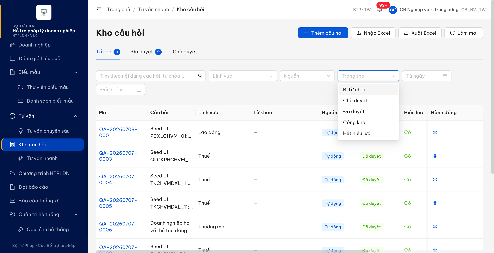


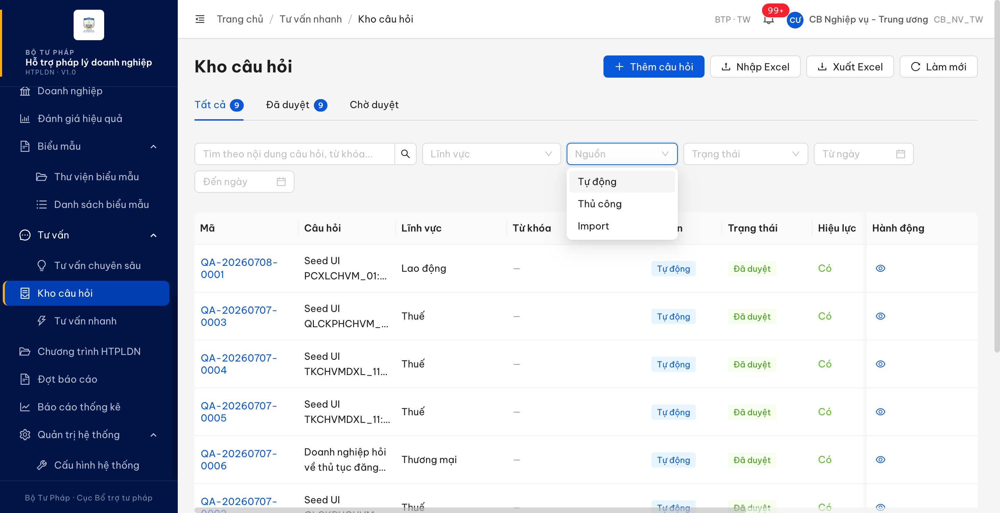

*Ảnh re-verify R2 (28/07/2026):*

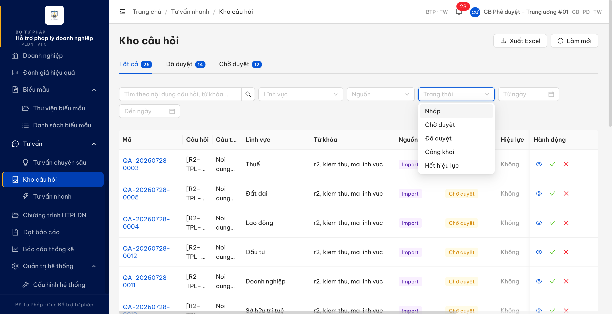


*Ảnh re-verify R3 (30/07/2026 — phạm vi BA-01/BA-04):*

![R3 — Sau khi tải lại trang, cả ba ô lọc Lĩnh vực / Nguồn / Trạng thái đều hiển thị giá trị "Tất cả"; thanh công cụ có thêm nút [Xóa bộ lọc]](image/R3-QLKCHTV_02-PASS-ba-o-loc-mac-dinh-tat-ca.png)

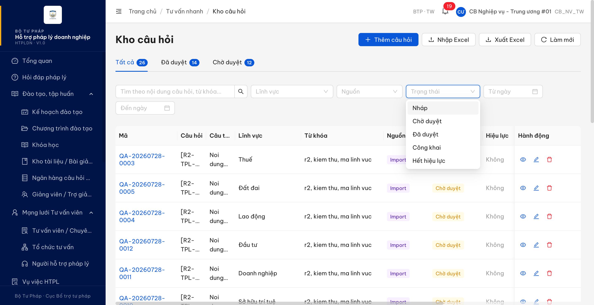

**2. Đọc DOM + network** *(phụ trợ)*

```
// Danh sách lựa chọn đọc từ .ant-select-dropdown đang mở
Nguồn      → ["Tự động", "Thủ công", "Import"]
Trạng thái → ["Bị từ chối", "Chờ duyệt", "Đã duyệt", "Công khai", "Hết hiệu lực"]

// Chọn "Bị từ chối" trên ô lọc → địa chỉ trang:
/tv-nhanh/kho-cau-hoi?page=1&trangThai=NHAP        // ❗ nhãn "Bị từ chối" = giá trị NHAP

// Đối chiếu 2 chiều:
GET /api/v1/kho-cau-hois?trangThai=NHAP        → 1 bản ghi (QA-20260727-0002)
GET /api/v1/kho-cau-hois?trangThai=BI_TU_CHOI  → 0 bản ghi
GET /api/v1/kho-cau-hois/{id}                  → "trangThai": "NHAP"   // BE ĐÚNG spec

// Chính FE cũng truy vấn NHAP ở chỗ khác:
GET /api/v1/kho-cau-hois?trangThai=CHO_DUYET,NHAP&page=1&pageSize=1  [200]
```

---
## ~~BUG-QLKCHTV_03~~ [CLOSED] — Bảng Kho câu hỏi thiếu cột "Câu trả lời"; cột điểm đặt nhãn "Đánh giá" thay vì "Điểm TB"

> **Re-test:** 2026-07-28 10:46:24 R2 — ✅ PASS (Closed-verified). Bảng Kho câu hỏi nay đủ 13 cột theo đặc tả: đã có cột "Câu trả lời" (cắt 100 ký tự + dấu …) ngay sau "Câu hỏi", cột điểm đổi nhãn thành "Điểm TB". Đo trên cả 2 vai trò CB Nghiệp vụ TW (thẻ Tất cả + Chờ duyệt) và CB Phê duyệt TW (thẻ Chờ duyệt, 14 cột gồm ô chọn).

### Mô tả

Bảng danh sách màn **Kho câu hỏi** hiển thị 12 cột nhưng **không có cột "Câu trả lời"**, và cột điểm trung bình đánh giá đang mang nhãn **"Đánh giá"** thay vì "Điểm TB" như đặc tả. Dữ liệu câu trả lời vẫn được máy chủ trả về đầy đủ, nên đây là sai lệch ở tầng hiển thị.

> **Ý thứ ba của phiếu test (thiếu cột "Ô chọn hàng loạt") KHÔNG được ghi nhận là lỗi** — cột đó có thật, xem mục Bằng chứng.

### Các bước tái hiện

1. Đăng nhập role **`CB_NV_TW`** (tài khoản `cbnv_tw`, đơn vị BTP · TW) — tác nhân của màn theo `srs-fr-13-tv-nhanh.md:86`, quyền `CRUD*` trên `KHO_CAU_HOI` theo `srs-v3.5.md:1327`.
2. Vào **Tư vấn → Kho câu hỏi**, thẻ "Tất cả".
3. Cuộn ngang bảng tới hết cột bên phải (cột "Hành động" là cột dính, che phần cuối khi chưa cuộn).
4. Quan sát dãy tiêu đề cột.
5. Lặp lại bước 1–4 với role **`CB_PD_TW`** (`cbpd_tw`) ở thẻ "Chờ duyệt" để đối chiếu.

### Kết quả mong đợi

- Bảng hiển thị tập cột theo `srs-fr-13-tv-nhanh.md:535` — §3 SCR-X2-01: *"Ma (QA-{YYYYMMDD}-{SEQ}) / Cau hoi (cat 100 ky tu) / **Cau tra loi (cat 100 ky tu)** / Linh vuc / Tu khoa / Nguon / Trang thai / Cong khai / Hieu luc / **Diem TB** / Ngay tao / Hanh dong"*.
- Cột câu trả lời hiển thị và cắt 100 ký tự ở danh sách — `srs-fr-13-tv-nhanh.md:133`: *"| 3 | cau_tra_loi | text | luôn | cắt 100 ký tự (danh sách) |"*.
- Cột điểm mang nhãn "Điểm TB" — `srs-fr-13-tv-nhanh.md:139`: *"| 9 | diem_tb | number | luôn | — |"*.

### Kết quả thực tế

- Tiêu đề bảng đọc trực tiếp từ DOM, **giống nhau ở cả 2 role**, 12 cột: `Mã | Câu hỏi | Lĩnh vực | Từ khóa | Nguồn | Trạng thái | Hiệu lực | Công khai | Lượt xem | Đánh giá | Ngày tạo | Hành động`.
- **Không có cột "Câu trả lời"** ở bất kỳ thẻ/role nào đã thử. Dữ liệu không thiếu: `GET /api/v1/kho-cau-hois` trả về trường `cauTraLoi` cho mọi bản ghi.
- Cột điểm mang nhãn **"Đánh giá"**, không phải "Điểm TB".
- Kèm theo: cột dính "Hành động" **đè lên** cột "Lượt xem" khi bảng chưa cuộn hết — nhãn bị cắt cụt còn "Lư" (xem ảnh nửa trái).

### Bằng chứng

**1. Ảnh chụp**

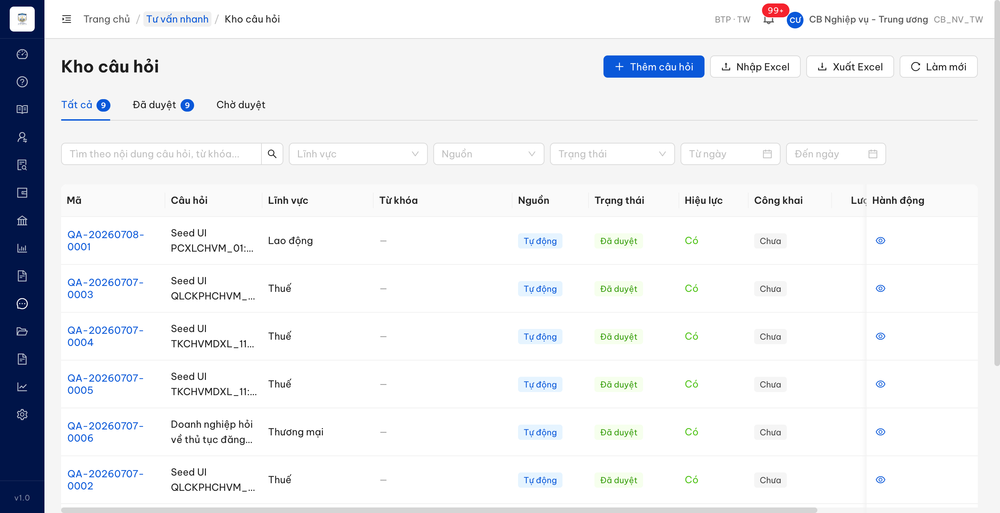

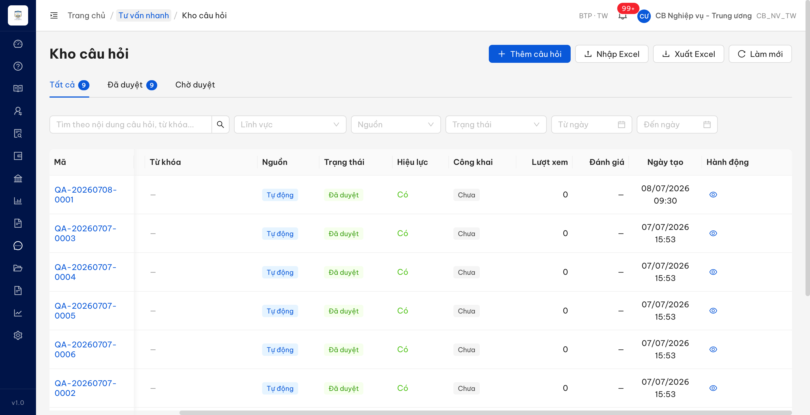

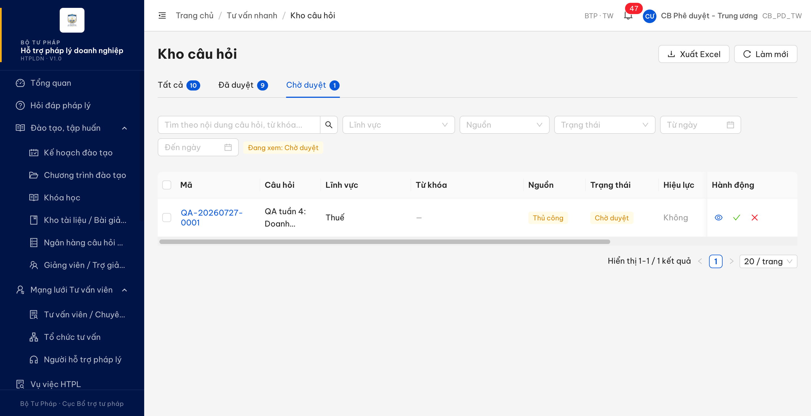

**Ảnh re-test R2 (28/07/2026)**


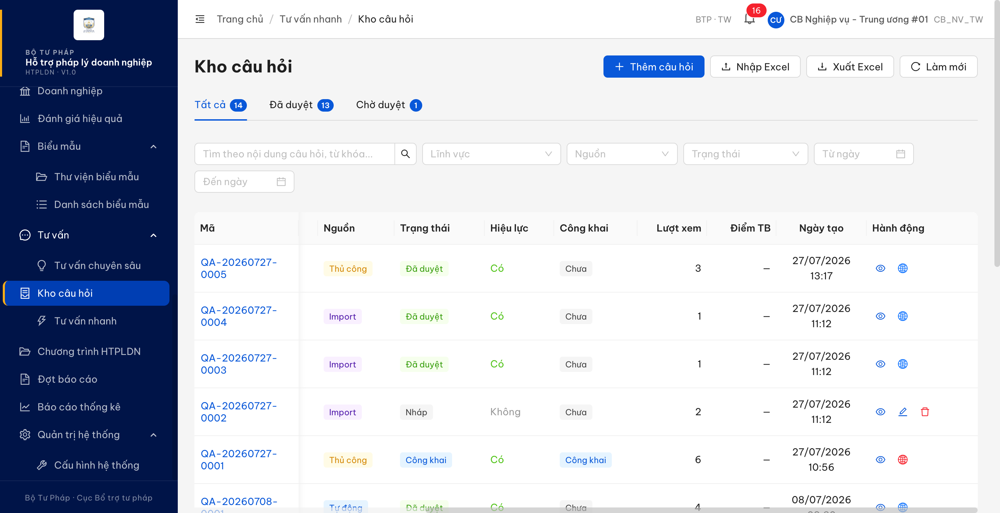

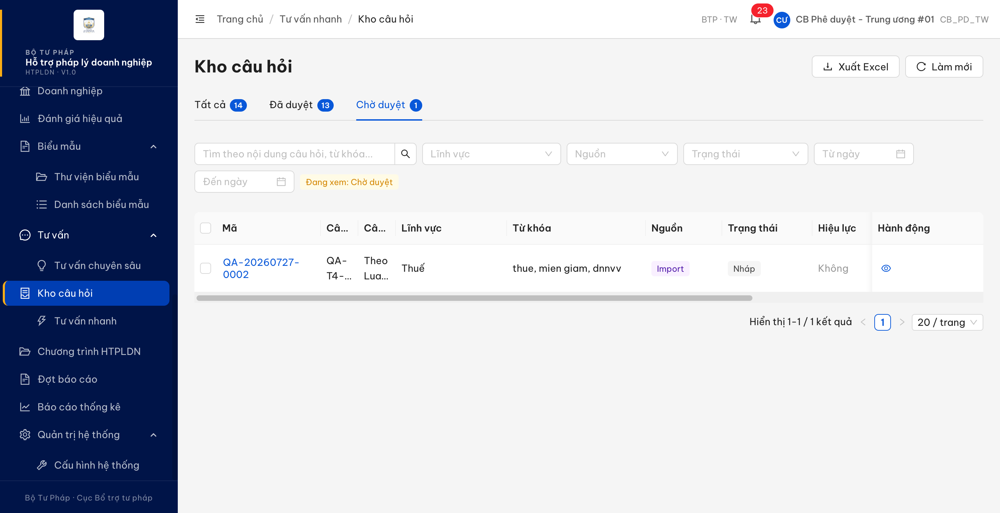

**2. Đọc DOM** *(phụ trợ)*

```
// role cbnv_tw, thẻ "Tất cả" VÀ thẻ "Chờ duyệt"
so_cot = 12, co_checkbox_header = false, so_checkbox_trong_bang = 0

// role cbpd_tw, thẻ "Chờ duyệt", cùng bản ghi QA-20260727-0001
checkbox "Select all"  +  checkbox từng dòng  +  nút Duyệt (check) / Từ chối (close)

// --- Đo lại R2 28/07/2026 (tài khoản cbnv_tw_01 / cbpd_tw_01) ---
// cbnv_tw_01, thẻ "Tất cả" và thẻ "Chờ duyệt": so_cot = 13
Mã | Câu hỏi | Câu trả lời | Lĩnh vực | Từ khóa | Nguồn | Trạng thái | Hiệu lực |
Công khai | Lượt xem | Điểm TB | Ngày tạo | Hành động
// nội dung cột "Câu trả lời" dài 101 ký tự = 100 ký tự + "…"  -> đúng quy tắc cắt 100
// cbpd_tw_01, thẻ "Chờ duyệt": so_cot = 14 (thêm cột ô chọn), tập cột còn lại giống trên
```

### So sánh (Comparison)

| Role | Thẻ "Tất cả" — ô chọn hàng loạt | Thẻ "Chờ duyệt" — ô chọn hàng loạt | Cột "Câu trả lời" | Nhãn cột điểm |
|------|:-:|:-:|:-:|---|
| CB_NV_TW | ❌ không có | ❌ không có | ❌ không có | "Đánh giá" |
| CB_PD_TW | ❌ không có | ✅ **có** | ❌ không có | "Đánh giá" |

---

## ~~BUG-QLKCHTV_04~~ [CLOSED] — Cửa sổ "Thêm câu hỏi" thiếu nút [Lưu nháp] và [Gửi duyệt]

> **Re-test:** 2026-07-28 10:52:34 R2 — ✅ PASS (Closed-verified). Cửa sổ "Thêm câu hỏi" nay có đủ 3 nút [Hủy] [Lưu nháp] [Gửi duyệt]. Chạy thật cả 2 đường: [Lưu nháp] tạo QA-20260728-0001 ra đúng trạng thái "Nháp" (Hiệu lực Không, thông báo "Đã lưu nháp câu hỏi"), [Gửi duyệt] tạo QA-20260728-0002 ra "Chờ duyệt"; mỗi lần 1 lần gọi máy chủ / 1 khung thông báo, không lặp.

### Mô tả

Cửa sổ **"Thêm câu hỏi"** chỉ có 2 nút ở vùng cố định đáy: **[Hủy]** và **[Lưu]**. Đặc tả yêu cầu 3 nút **[Hủy] [Lưu nháp] [Gửi duyệt]**. Hệ quả nghiệp vụ: không có đường nào tạo câu hỏi ở trạng thái **"Nháp"** — bấm [Lưu] là bản ghi ra thẳng "Chờ duyệt".

### Các bước tái hiện

1. Đăng nhập role **`CB_NV_TW`** (tài khoản `cbnv_tw`, BTP · TW) — vai trò duy nhất có quyền tạo câu hỏi: `srs-v3.5.md:1327` cho `KHO_CAU_HOI` = `CRUD*` với CB_NV, chỉ `RU*` với CB_PD.
2. Vào **Tư vấn → Kho câu hỏi**.
3. Bấm **[+ Thêm câu hỏi]** → cửa sổ mở bên phải.
4. Cuộn hết cửa sổ, quan sát vùng nút cố định ở đáy.
5. Nhập đủ trường bắt buộc (Câu hỏi, Câu trả lời, Lĩnh vực) rồi quan sát lại vùng nút.
6. Bấm **[Lưu]**, quan sát trạng thái bản ghi vừa tạo.

### Kết quả mong đợi

- Cửa sổ có đúng 3 nút theo `srs-fr-13-tv-nhanh.md:538` — §3 SCR-X2-01: *"... / File dinh kem cong khai (...) / **[Huy] [Luu nhap] [Gui duyet]** | input -> validate | khi nhan Them |"*.
- [Lưu nháp] giữ bản ghi ở trạng thái `NHAP` (`srs-fr-13-tv-nhanh.md:103` khai `NHAP` là một trạng thái hợp lệ); [Gửi duyệt] mới đẩy sang `CHO_DUYET` (`:115` *"Nguồn THU_CONG: CB NV nhập câu hỏi + trả lời -> trạng thái = CHO_DUYET -> CB PD duyệt"*).

### Kết quả thực tế

- Vùng nút cố định đáy chỉ có `["Hủy", "Lưu"]`. Đọc toàn bộ nút trong cửa sổ = `["Dùng ảnh hệ thống mặc định", "Hủy", "Lưu"]` ⇒ [Lưu nháp] và [Gửi duyệt] **không tồn tại**, không phải bị khuất do cuộn.
- Số nút không đổi sau khi đã nhập đủ trường bắt buộc.
- Bấm [Lưu] với dữ liệu hợp lệ: **1** request `POST /api/v1/kho-cau-hois`, **1** khung thông báo *"Tạo câu hỏi thành công, đang chờ duyệt"* (không có hiện tượng thông báo lặp), bản ghi `QA-20260727-0001` ra thẳng trạng thái **"Chờ duyệt"**, Hiệu lực "Không".
- ⇒ Nút [Lưu] đang gánh vai trò của [Gửi duyệt]; đường tạo bản ghi ở trạng thái "Nháp" không tồn tại trên giao diện. Cùng gốc với **BUG-QLKCHTV_02** (trạng thái "Nháp" cũng vắng ở ô lọc).
- Các **trường** của cửa sổ thì đã đúng đủ 7 mục theo `:538` (Câu hỏi, Câu trả lời, Lĩnh vực, Từ khóa, Ảnh đại diện công khai, Mô tả công khai, Tệp đính kèm công khai) — sai lệch chỉ ở vùng nút.

### Bằng chứng

**1. Ảnh chụp**

![BUG-QLKCHTV_04 — Cửa sổ "Thêm câu hỏi": vùng nút đáy chỉ có [Hủy] và [Lưu]](image/BUG-QLKCHTV_04-drawer-them-cau-hoi.png)

![BUG-QLKCHTV_04 — Sau khi bấm [Lưu]: bản ghi QA-20260727-0001 ra thẳng trạng thái "Chờ duyệt" (không qua được "Nháp")](../reverify-audit/seed-them-cau-hoi-toast.png)

**Ảnh re-test R2 (28/07/2026)**

![R2 — Cửa sổ "Thêm câu hỏi" nay có đủ 3 nút [Hủy] [Lưu nháp] [Gửi duyệt] ở đáy](image/R2-BUG-QLKCHTV_04-drawer-3-nut.png)

![R2 — Sau khi bấm [Lưu nháp]: bản ghi QA-20260728-0001 nằm đúng trạng thái "Nháp", Hiệu lực "Không"](image/R2-BUG-QLKCHTV_04-ban-ghi-nhap.png)

![R2 — Sau khi bấm [Gửi duyệt]: thông báo "Tạo câu hỏi thành công, đang chờ duyệt"; QA-20260728-0002 ra "Chờ duyệt", bản nháp QA-20260728-0001 vẫn giữ "Nháp"](image/R2-BUG-QLKCHTV_04-toast-gui-duyet.png)

**2. Đọc DOM + đo thao tác** *(phụ trợ)*

```
nut_footer  = ["Hủy", "Lưu"]
tat_ca_nut  = ["Dùng ảnh hệ thống mặc định", "Hủy", "Lưu"]
cac_truong  = ["Câu hỏi","Câu trả lời","Lĩnh vực","Từ khóa",
               "Ảnh đại diện công khai","Mô tả công khai","Tệp đính kèm công khai"]

// Đo bằng bộ bắt thông báo dùng chung (1 observer, đã tự kiểm):
SO_REQUEST = 1   → POST /api/v1/kho-cau-hois
SO_KHUNG_THONG_BAO = 1 → "Tạo câu hỏi thành công, đang chờ duyệt"
BI_LAP = false

// --- Đo lại R2 28/07/2026 (tài khoản cbnv_tw_01), bộ bắt thông báo tự kiểm = 1 observer ---
tat_ca_nut  = ["Dùng ảnh hệ thống mặc định", "Hủy", "Lưu nháp", "Gửi duyệt"]

[Lưu nháp]  → SO_REQUEST = 1 (POST /api/v1/kho-cau-hois)
              SO_KHUNG_THONG_BAO = 1 → "Đã lưu nháp câu hỏi"      BI_LAP = false
              bản ghi QA-20260728-0001: Trạng thái "Nháp", Hiệu lực "Không"

[Gửi duyệt] → SO_REQUEST = 1 (POST /api/v1/kho-cau-hois)
              SO_KHUNG_THONG_BAO = 1 → "Tạo câu hỏi thành công, đang chờ duyệt"   BI_LAP = false
              bản ghi QA-20260728-0002: Trạng thái "Chờ duyệt"
```

---

## ~~BUG-QLKCHTV_10~~ [CLOSED] — Nhãn nguồn `IMPORT` để nguyên tiếng Anh "Import" trong khi 2 giá trị cùng cột đã Việt hoá

> **Re-test:** 2026-07-30 20:52:00 R3 — ✅ PASS (Closed-verified). Nhãn nguồn nay là **"Nhập Excel"** trên cả 3 bề mặt: cột Nguồn của bảng danh sách, dòng Nguồn ở màn chi tiết, và cột Nguồn trong tệp Excel xuất ra (đọc từng ô: 13/13 dòng nguồn nhập đều ghi "Nhập Excel", không còn chuỗi "Import"). Nút mở hộp thoại cũng đã đổi thành **[Nhập Excel]**. Chạy lại trọn luồng nhập thật (tệp `kho-cau-hoi-import-QA-tuan4.xlsx`, 5 dòng): bước Xem trước báo 3 hợp lệ / 2 lỗi, xác nhận nhập tạo đúng 3 bản ghi mới `QA-20260730-0001/0002/0003` ở trạng thái **Chờ duyệt** với Nguồn "Nhập Excel" (thẻ đếm 29→32, Chờ duyệt 10→13); một lần bấm chỉ gọi máy chủ 1 lần cho mỗi bước.

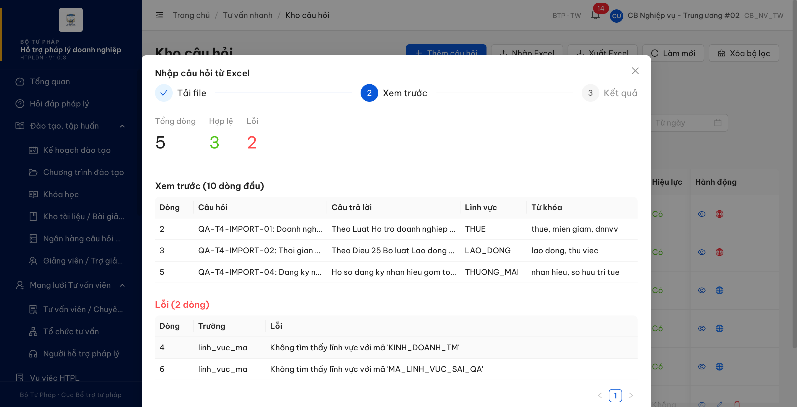

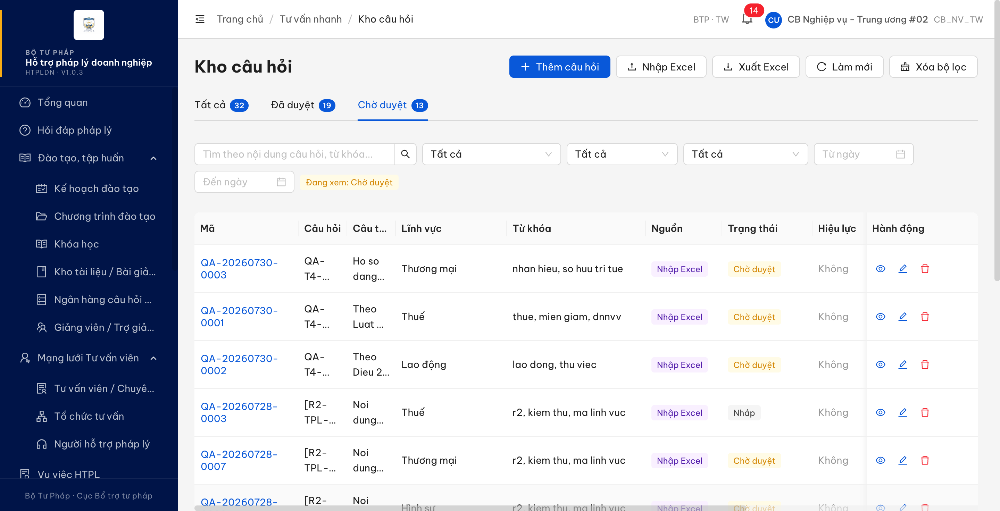

**Đo thêm cho dòng phiếu `QLKCHTV_12` (row 6) — chức năng Xuất Excel, theo đủ 4 bước BA chốt 30/07 (BA-02/BA-03):**

| Tiêu chí BA | Đo được ở R3 (30/07/2026 20:53–20:55, `cbnv_tw_02`, 32 bản ghi) | Kết quả |
|---|---|:-:|
| Tên tệp `kho-cau-hoi-{YYYYMMDD-HHmm}.xlsx` đúng phút xuất | Bấm 20:53:47 → `kho-cau-hoi-20260730-2053.xlsx`; bấm lần 2 lúc 20:54:59 → `kho-cau-hoi-20260730-2054.xlsx` | ✅ |
| Không bị cắt ở 20 dòng (xuất theo bộ lọc, không theo trang) | Bảng hiện "1-20 / 32"; tệp có **32 dòng dữ liệu** | ✅ |
| Đủ 14 cột đã chốt, không có ô chọn / cột Hành động | `Mã câu hỏi · Câu hỏi · Câu trả lời · Lĩnh vực · Từ khóa · Nguồn · Trạng thái · Công khai · Hiệu lực · Điểm TB · Ngày tạo · Câu hỏi (đầy đủ) · Câu trả lời (đầy đủ) · Ngày cập nhật` — đúng 14, không có ô chọn, không có Hành động | ✅ |
| Cột Nguồn là "Nhập Excel", không còn "Import" | 3 giá trị duy nhất trong tệp: `Nhập Excel · Thủ công · Tự động` | ✅ |
| Không còn thẻ HTML thô trong ô nội dung | Quét toàn bộ ô 32 dòng × 14 cột (cả 2 cột "(đầy đủ)"): **0 ô** chứa `<p>`/`</p>`/thẻ HTML | ✅ |
| Bộ lọc được áp đúng vào tệp xuất | Đặt `Nguồn = Nhập Excel` → bảng 16/16 kết quả; tệp `kho-cau-hoi-20260730-2054.xlsx` có 16 dòng, **mọi dòng** đều Nguồn "Nhập Excel" | ✅ |

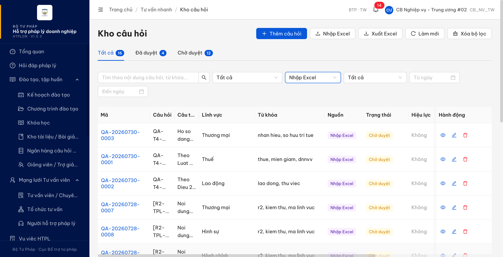

### Mô tả

Cột **Nguồn** của Kho câu hỏi hiển thị 3 giá trị, nhưng chỉ 2 giá trị được Việt hoá: `TU_DONG` → **"Tự động"**, `THU_CONG` → **"Thủ công"**, còn `IMPORT` giữ nguyên **"Import"**. Sai lệch xuất hiện đồng thời ở **3 bề mặt**: bảng danh sách, màn chi tiết, và file Excel xuất ra. Dữ liệu máy chủ trả về đúng enum đặc tả, nên đây thuần tuý là thiếu sót ở chữ hiển thị cho người dùng.

> **Đặc tả không quy định chữ hiển thị** — `srs-fr-13-tv-nhanh.md:536` chỉ quy định **màu thẻ**, và ứng dụng đang hiển thị đúng thẻ màu tím cho `IMPORT`. Vì vậy câu chữ tiếng Việt cụ thể cần BA chốt: xem [ba-confirmation-needed-week-4.md](../ba-confirmation-needed-week-4.md) mục **BA-04**.

### Các bước tái hiện

1. Đăng nhập role **`CB_NV_TW`** (tài khoản `cbnv_tw`, "CB Nghiệp vụ - Trung ương", đơn vị BTP · TW) — vai trò `CRUD*` duy nhất trên `KHO_CAU_HOI` theo `srs-v3.5.md:1327`.
2. Vào **Tư vấn → Kho câu hỏi**, bấm **[Nhập Excel]**.
3. Bấm **[Tải file mẫu]** để lấy file `.xlsx` đúng khuôn, điền vài dòng hợp lệ (mã lĩnh vực dùng `THUE`, `LAO_DONG`, `THUONG_MAI`).
4. Tải file lên → bấm **[Kiểm tra]** → bấm **[Xác nhận nhập N câu hỏi]**.
5. Đóng hộp thoại, đọc cột **Nguồn** của các dòng vừa nhập.
6. Bấm nút Xem (mắt) trên một dòng vừa nhập → đọc dòng **Nguồn** trên màn chi tiết.
7. Bấm **[Xuất Excel]**, mở file tải về, đọc cột **Nguồn**.

### Kết quả mong đợi

- Cột "Nguồn" hiển thị nhãn **tiếng Việt** thống nhất cho cả 3 giá trị nguồn, đồng bộ ở bảng danh sách / màn chi tiết / file xuất — cùng chuẩn với 2 giá trị còn lại vốn đã Việt hoá ("Tự động", "Thủ công") trong phần mềm tiếng Việt.
- Thẻ giữ đúng màu theo `srs-fr-13-tv-nhanh.md:536` — *"TU_DONG (xanh duong, ...) / THU_CONG (vang, ...) / IMPORT (tim, ...)"*.

### Kết quả thực tế

- Bảng danh sách: `QA-20260727-0002 | ... | **Import** | Chờ duyệt`, tương tự `-0003`, `-0004`.
- Màn chi tiết: dòng `Nguồn` = thẻ tím chữ **"Import"**.
- File Excel xuất (`kho-cau-hoi-20260727.xlsx`), cột E "Nguồn": **`Import`** — trong khi các dòng khác cùng cột là `Tự động` / `Thủ công`.
- Tầng dữ liệu KHÔNG sai: `GET /api/v1/kho-cau-hois` trả `"nguon":"IMPORT"`, đúng enum `srs-fr-13-tv-nhanh.md:102` (*"| 6 | nguon | text | Y | TU_DONG / THU_CONG / IMPORT | — | hệ thống |"*) và ràng buộc entity `:695` (*"CHECK IN ('TU_DONG','THU_CONG','IMPORT')"*).
- Màu thẻ ĐÚNG (tím) ⇒ phần đặc tả có quy định thì ứng dụng làm đúng; chỉ phần đặc tả im lặng (chữ) là chưa Việt hoá.

### Bằng chứng

**1. Ảnh chụp**

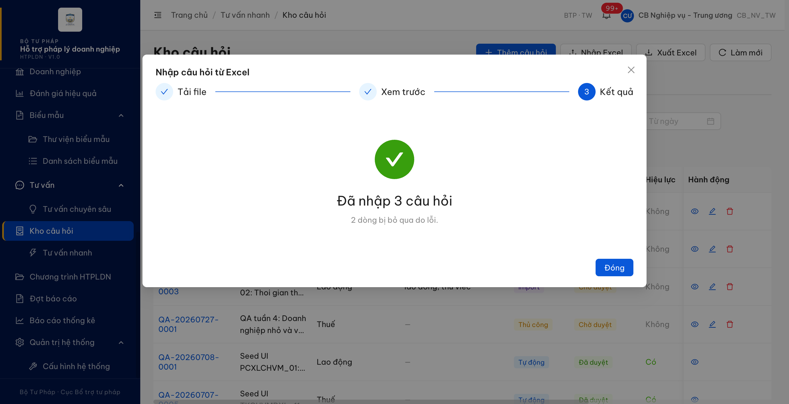

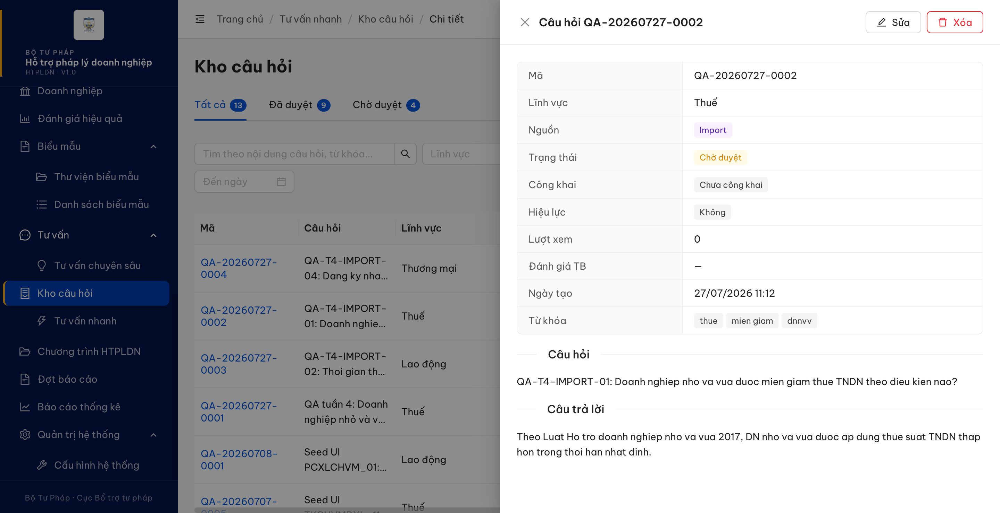

**2. Đọc dữ liệu 3 bề mặt** *(phụ trợ)*

```
// Bảng danh sách (đọc DOM)
QA-20260727-0002 | Thuế       | Import   | Chờ duyệt
QA-20260727-0001 | Thuế       | Thủ công | Chờ duyệt
QA-20260708-0001 | Lao động   | Tự động  | Đã duyệt

// Màn chi tiết (đọc DOM)  → "Nguồn  Import"
// File Excel xuất, cột E  → "Import"

// Tầng dữ liệu (API)      → "nguon":"IMPORT"   ⇒ enum ĐÚNG, chỉ sai chữ hiển thị
```

### So sánh (Comparison)

| Giá trị enum | Đặc tả quy định màu (`:536`) | Màu thực tế | Chữ hiển thị thực tế | Đã Việt hoá? |
|---|---|---|---|:-:|
| `TU_DONG` | xanh dương | xanh dương ✅ | "Tự động" | ✅ |
| `THU_CONG` | vàng | vàng ✅ | "Thủ công" | ✅ |
| `IMPORT` | tím | tím ✅ | **"Import"** | ❌ |

---

## ~~BUG-QLKCHTV_14~~ [CLOSED] — Màn chi tiết câu hỏi không hiển thị "Người tạo"

> **Re-test:** 2026-07-30 21:01:00 R3 — ✅ PASS (Closed-verified, gồm cả phạm vi **Lịch sử thẩm định** BA-05 bổ sung 30/07). Dựng dữ liệu MỚI qua đúng luồng thay vì đo bản ghi cũ: `cbnv_tw_02` tạo `QA-20260730-0004` rồi [Gửi duyệt] lúc **20:57** → `cbpd_tw_02` [Từ chối] lúc **20:59** với lý do `TU_CHOI_QA_1407` → `cbnv_tw_02` mở lại chi tiết. Màn chi tiết nay có dòng **Người tạo = "CB Nghiệp vụ - Trung ương #02"** (họ tên, không phải mã), **Ngày tạo 30/07/2026 20:57** và **Ngày cập nhật 30/07/2026 20:59** — khớp đúng thời điểm thao tác thật. Khối **Lịch sử thẩm định** có đủ 2 mốc kèm người và thời điểm: *"Gửi duyệt — CB Nghiệp vụ - Trung ương #02 · 30/07/2026 20:57"* và *"Từ chối — CB Phê duyệt - Trung ương #02 · 30/07/2026 20:59"* kèm *"Lý do: TU_CHOI_QA_1407"*. Kiểm thêm `QA-20260727-0002`: dòng Từ khóa hiện đủ `thue · mien giam · dnnvv`, câu trả lời là chữ sạch (không lộ thẻ HTML), Người tạo và cả 2 mốc thời gian đều có giá trị.

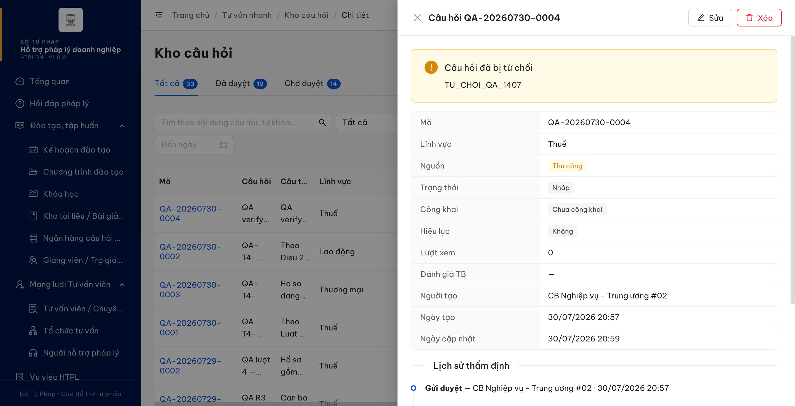

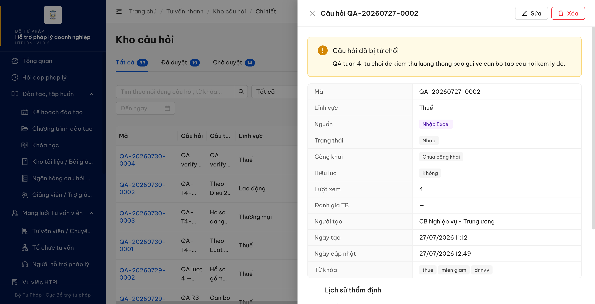

### Mô tả

Panel **chi tiết câu hỏi** liệt kê 10 trường (Mã, Lĩnh vực, Nguồn, Trạng thái, Công khai, Hiệu lực, Lượt xem, Đánh giá TB, Ngày tạo, Ngày duyệt) rồi tới nội dung Câu hỏi / Câu trả lời, **không có trường "Người tạo"** — trong khi đặc tả liệt kê rõ trường này. Thiếu ở cả tầng dữ liệu: máy chủ chỉ trả mã định danh người tạo, không kèm họ tên.

> **Hai ý còn lại của phiếu test được chấm khác:**
> - *"Thiếu Từ khóa"* — **KHÔNG phải lỗi**: trường này có, chỉ ẩn dòng khi bản ghi không có từ khóa (xem mục So sánh).
> - *"Thiếu Lịch sử thẩm định"* — đặc tả v3.5 **không có** mục này ⇒ chuyển BA, xem [ba-confirmation-needed-week-4.md](../ba-confirmation-needed-week-4.md) mục **BA-05**.

### Các bước tái hiện

1. Đăng nhập role **`CB_NV_TW`** (tài khoản `cbnv_tw`, BTP · TW).
2. Vào **Tư vấn → Kho câu hỏi**.
3. Bấm nút Xem (biểu tượng mắt) trên một bản ghi bất kỳ.
4. Đọc danh sách trường trong panel chi tiết bên phải.
5. Lặp lại với bản ghi **có** từ khóa và bản ghi **không có** từ khóa để tách bạch 2 hiện tượng.

### Kết quả mong đợi

- Panel chi tiết hiển thị đủ các trường theo `srs-fr-13-tv-nhanh.md:549` — §3 SCR-X2-01, Quy tắc tương tác: *"Chi tiet Q&A: side panel/modal hien thi day du cau hoi, cau tra loi (rich text), linh vuc, tu khoa, nguon, **nguoi tao**"*.

### Kết quả thực tế

- Danh sách trường đọc thẳng từ panel (bản ghi "Đã duyệt"): `Mã · Lĩnh vực · Nguồn · Trạng thái · Công khai · Hiệu lực · Lượt xem · Đánh giá TB · Ngày tạo · Ngày duyệt` → rồi "Câu hỏi" / "Câu trả lời". **Không có "Người tạo"** ở bất kỳ vị trí nào.
- Tầng dữ liệu cũng chưa đủ: `GET /api/v1/kho-cau-hois` trả `"nguoiTaoId":"f2e93500-f6dd-4660-a3f6-de7326acffd1"` nhưng **không kèm họ tên** ⇒ cần bổ sung ở cả hai phía.
- **Trường "Từ khóa" thì CÓ**: với bản ghi `QA-20260727-0002` (dữ liệu `tuKhoa=["thue","mien giam","dnnvv"]`), panel hiện đủ dòng *"Từ khóa: thue / mien giam / dnnvv"*. Với bản ghi không có từ khóa thì dòng bị ẩn — đây là trường hợp bản ghi trong ảnh của đối tác.

> **Lưu ý cho dev/BA khi fix:** đặc tả tự mâu thuẫn — dòng `:549` yêu cầu hiển thị *"nguoi tao"*, nhưng bảng thuộc tính entity `KHO_CAU_HOI` (`srs-fr-13-tv-nhanh.md:683-698`) **không khai trường người tạo** nào. Đề nghị chốt lại thuộc tính entity cùng lúc với fix hiển thị.

### Bằng chứng

**1. Ảnh chụp**


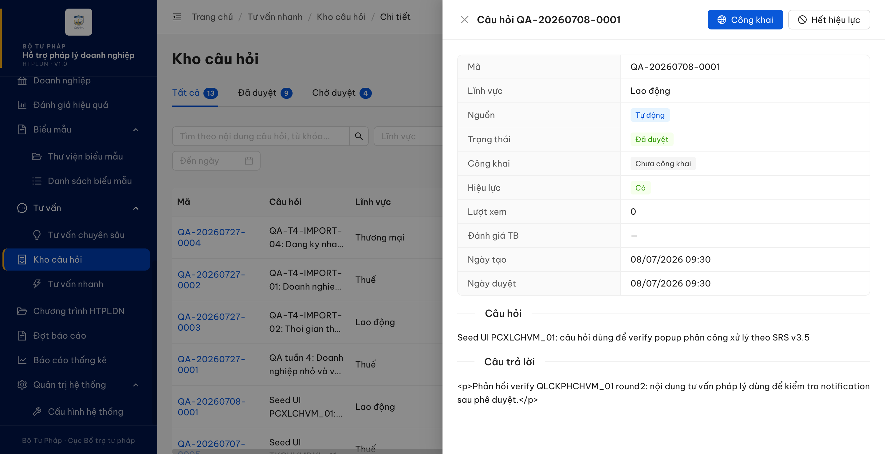

**2. Đọc DOM + dữ liệu máy chủ** *(phụ trợ)*

```
// Panel chi tiết — đọc DOM
truong_hien_thi = ["Mã","Lĩnh vực","Nguồn","Trạng thái","Công khai","Hiệu lực",
                   "Lượt xem","Đánh giá TB","Ngày tạo","Ngày duyệt"]
→ không có "Người tạo", không có mục "Lịch sử thẩm định"

// Dữ liệu máy chủ trả về cho cùng bản ghi
"nguoiTaoId": "f2e93500-..."      ← có mã, KHÔNG có họ tên
"tuKhoa": ["thue","mien giam","dnnvv"]   ← có dữ liệu, panel hiển thị ĐÚNG
// Có sẵn nguyên liệu cho lịch sử thẩm định (nếu BA yêu cầu):
"nguoiGuiDuyetId", "ngayGuiDuyet", "nguoiDuyetId", "ngayDuyet", "ghiChuPheDuyet"
```

### So sánh (Comparison)

| Trường | Đặc tả `:549` yêu cầu? | Bản ghi CÓ dữ liệu | Bản ghi KHÔNG có dữ liệu | Kết luận |
|---|:-:|---|---|---|
| Từ khóa | ✅ có | ✅ hiện đủ 3 thẻ | dòng bị ẩn | **Không phải lỗi** — đối tác gặp bản ghi trống |
| Người tạo | ✅ có | ❌ không hiện | ❌ không hiện | **Lỗi** — Open |
| Lịch sử thẩm định | ❌ không nhắc | ❌ không có | ❌ không có | Chuyển **BA confirm** |

---

## ~~BUG-QLKCHTV_16~~ [CLOSED] — Cửa sổ "Sửa câu hỏi" không có đường giữ hoặc đưa bản ghi về trạng thái "Nháp"

> **Re-test:** 2026-07-28 10:55:30 R2 — ✅ PASS (Closed-verified). Cửa sổ "Sửa câu hỏi" nay có 2 đường riêng biệt [Lưu nháp] và [Gửi duyệt]. Thao tác thật: sửa QA-20260728-0002 đang "Chờ duyệt" rồi bấm [Lưu nháp] → về "Nháp"; sửa QA-20260728-0001 đang "Nháp" rồi bấm [Gửi duyệt] → lên "Chờ duyệt". Mỗi lần 1 lần gọi máy chủ / 1 thông báo, không lặp.

### Mô tả

Cửa sổ **"Sửa câu hỏi"** chỉ có 2 nút ở vùng cố định đáy: **[Hủy]** và **[Lưu]**. Không có thao tác nào cho phép giữ bản ghi ở trạng thái **"Nháp"** hoặc chủ động gửi duyệt lại. Hệ quả nghiệp vụ nặng nhất nằm ở luồng bị từ chối: đặc tả quy định bản ghi bị Cán bộ phê duyệt từ chối sẽ **quay về Nháp**, cán bộ nghiệp vụ sửa rồi gửi duyệt lại — nhưng màn Sửa hiện tại không có đường đi đó. Cùng gốc với **BUG-QLKCHTV_04** (cửa sổ Thêm) và **BUG-QLKCHTV_02** (ô lọc thiếu "Nháp").

### Các bước tái hiện

1. Đăng nhập role **`CB_NV_TW`** (tài khoản `cbnv_tw`, BTP · TW) — vai trò duy nhất có quyền Sửa: `srs-v3.5.md:1327` cho `KHO_CAU_HOI` = `CRUD*` với CB_NV, chỉ `RU*` với CB_PD.
2. Vào **Tư vấn → Kho câu hỏi**.
3. Chọn một bản ghi đang ở trạng thái **"Chờ duyệt"** → bấm nút **Sửa** (biểu tượng bút) trên dòng.
4. Cuộn hết cửa sổ, quan sát vùng nút cố định ở đáy.

### Kết quả mong đợi

- Sau khi sửa nội dung, cán bộ nghiệp vụ phải có đường **giữ bản ghi ở trạng thái "Nháp"** và đường **chuyển sang "Chờ duyệt"** — hai kết quả nghiệp vụ khác nhau, không gộp làm một.
- Căn cứ: `srs-fr-13-tv-nhanh.md:103` khai `trang_thai` gồm *"NHAP / CHO_DUYET / DA_DUYET / CONG_KHAI / HET_HIEU_LUC"*; `:533` yêu cầu thanh lọc có `NHAP`; `:538` quy định cửa sổ nhập Q&A có *"[Huy] [Luu nhap] [Gui duyet]"*; và đặc biệt `:540` — *"[Tu choi] modal ly do bat buoc + **SET NHAP** + TB CB NV"* ⇒ trạng thái Nháp là điểm đến bắt buộc của luồng từ chối.

### Kết quả thực tế

- Vùng nút cố định đáy cửa sổ Sửa chỉ có `["Hủy", "Lưu"]`. Đọc **toàn bộ** nút trong cửa sổ = `["Dùng ảnh hệ thống mặc định", "Hủy", "Lưu"]` ⇒ không có đường thứ hai; không phải nút bị khuất do cuộn.
- Cửa sổ **Thêm** cũng cho đúng tập nút này (đo ở BUG-QLKCHTV_04) ⇒ thiếu sót ở cả 2 đường vào, không riêng màn Sửa.
- Đo bằng hành vi thật (BUG-QLKCHTV_04): bấm [Lưu] ở cửa sổ Thêm với dữ liệu hợp lệ → bản ghi ra thẳng **"Chờ duyệt"** (1 request `POST /api/v1/kho-cau-hois`, 1 thông báo *"Tạo câu hỏi thành công, đang chờ duyệt"*) ⇒ [Lưu] đang gánh vai trò [Gửi duyệt].
- Trạng thái `NHAP` có thật trong hệ thống — chính giao diện gọi `GET /api/v1/kho-cau-hois?trangThai=CHO_DUYET,**NHAP**&page=1&pageSize=1` để đếm badge thẻ "Chờ duyệt".
- Các **trường** của cửa sổ Sửa thì đúng và nạp đúng dữ liệu hiện tại (Câu hỏi, Câu trả lời, Lĩnh vực, Từ khóa, Ảnh đại diện công khai, Mô tả công khai, Tệp đính kèm công khai) — sai lệch chỉ ở vùng nút.

> **Ghi chú minh bạch về đặc tả:** SRS v3.5 mô tả cửa sổ **Thêm** (`:538`) nhưng **không mô tả riêng cửa sổ Sửa**; `:535` chỉ liệt kê nút "Sua" trong cột Hành động. Vì vậy bug này nêu **yêu cầu nghiệp vụ** (phải tồn tại đường giữ/đưa bản ghi về Nháp), không quy định dev đặt đúng tên nút nào.

### Bằng chứng

**1. Ảnh chụp**

![BUG-QLKCHTV_16 — Cửa sổ "Sửa câu hỏi QA-20260727-0002": vùng nút đáy chỉ có [Hủy] và [Lưu]](image/BUG-QLKCHTV_16-drawer-sua-nut.png)

**Ảnh re-test R2 (28/07/2026)**

![R2 — Cửa sổ "Sửa câu hỏi QA-20260728-0002" (bản ghi đang "Chờ duyệt") nay có đủ [Hủy] [Lưu nháp] [Gửi duyệt]](image/R2-BUG-QLKCHTV_16-drawer-sua-3-nut.png)

![R2 — Sau khi sửa nội dung rồi bấm [Lưu nháp]: QA-20260728-0002 chuyển từ "Chờ duyệt" về "Nháp"](image/R2-BUG-QLKCHTV_16-toast-luu-nhap.png)

![R2 — Sửa bản ghi đang "Nháp" (QA-20260728-0001) rồi bấm [Gửi duyệt]: thông báo "Đã gửi duyệt câu hỏi", bản ghi lên "Chờ duyệt"](image/R2-BUG-QLKCHTV_16-toast-gui-duyet-lai.png)

**2. Đọc DOM** *(phụ trợ)*

```
tieu_de_cua_so = "Sửa câu hỏi QA-20260727-0002"   (bản ghi: nguồn Import, trạng thái Chờ duyệt)
tat_ca_nut     = ["Dùng ảnh hệ thống mặc định", "Hủy", "Lưu"]
cac_truong     = ["Câu hỏi","Câu trả lời","Lĩnh vực","Từ khóa",
                  "Ảnh đại diện công khai","Mô tả công khai","Tệp đính kèm công khai"]

// Đối chứng cửa sổ Thêm (BUG-QLKCHTV_04): tat_ca_nut GIỐNG HỆT
// FE vẫn truy vấn NHAP ở chỗ khác:
GET /api/v1/kho-cau-hois?trangThai=CHO_DUYET,NHAP&page=1&pageSize=1  [200]

// --- Đo lại R2 28/07/2026 (tài khoản cbnv_tw_01), bộ bắt thông báo tự kiểm = 1 observer ---
tieu_de_cua_so = "Sửa câu hỏi QA-20260728-0002"   (bản ghi đang trạng thái "Chờ duyệt")
tat_ca_nut     = ["Dùng ảnh hệ thống mặc định", "Hủy", "Lưu nháp", "Gửi duyệt"]

Sửa nội dung + [Lưu nháp]  → 1 request PATCH /api/v1/kho-cau-hois/{id}
                             1 thông báo "Đã lưu nháp câu hỏi"    BI_LAP = false
                             QA-20260728-0002: "Chờ duyệt" → "Nháp"

Sửa nội dung + [Gửi duyệt] → 1 request PATCH /api/v1/kho-cau-hois/{id}
                             1 thông báo "Đã gửi duyệt câu hỏi"   BI_LAP = false
                             QA-20260728-0001: "Nháp" → "Chờ duyệt"
```

---

## ~~BUG-KCH-HTML-THO~~ [CLOSED] — Nội dung "Câu trả lời" hiển thị nguyên văn thẻ HTML ở màn chi tiết và trong file Excel xuất

> **Re-test:** 2026-07-29 17:05:00 R4 — ✅ PASS (Closed-verified). Bề mặt cuối đã sạch: dựng phiên tư vấn nhanh mới TVN-20260729-0001, tra cứu rồi bấm [Chọn] trên QA-20260706-0001 thì ô Nội dung trả lời nhận 58/5000 ký tự chữ thuần, không còn thẻ p (lượt 3 là 65/5000 kèm thẻ). Gửi trả lời chạy trọn, 1 lệnh, màn hình sau đó không còn chuỗi thẻ. Ba bề mặt còn lại đo lại vẫn sạch: màn chi tiết QA-20260708-0001, tệp Excel 0/29 ô, 12 thẻ kết quả tra cứu.

### Mô tả

Câu trả lời của các câu hỏi có nguồn **Tự động** được lưu dưới dạng HTML (`<p>...</p>`). Ở màn **chi tiết câu hỏi** và trong **file Excel xuất ra**, nội dung này hiện **nguyên văn thẻ HTML** cho người dùng thấy thay vì chữ đã định dạng/làm sạch. Đặc tả quy định câu trả lời ở màn chi tiết là **rich text**.

> Bug này **không nằm trong phiếu test của đối tác** — phát hiện khi verify QLKCHTV_12, QLKCHTV_14 và QLKCHTV_18; ảnh của đối tác ở cả 3 case đều có cùng hiện tượng.

> **Bổ sung 2026-07-27 (khi verify Luồng 2 — Tư vấn nhanh):** hiện tượng còn lộ ra ở **2 bề mặt nữa**, trong đó có một bề mặt **chạm tới doanh nghiệp**:
> - **Thẻ kết quả tra cứu Kho câu hỏi** ở màn trả lời tư vấn nhanh — phần câu trả lời rút gọn trên thẻ hiện nguyên văn `<p>`.
> - **Ô "Nội dung trả lời"** — bấm `[Chọn]` thì nội dung kèm nguyên thẻ `<p>...</p>` được chép thẳng vào ô soạn. Nếu cán bộ không tự xóa tay, **thẻ HTML thô sẽ được gửi tới doanh nghiệp**.
>
> Đề nghị dev xử lý làm sạch ở tầng dùng chung thay vì vá từng màn — hiện đã đếm được **4 bề mặt** cùng lỗi (chi tiết Kho câu hỏi · file Excel xuất · thẻ kết quả tra cứu · ô soạn trả lời).

### Các bước tái hiện

1. Đăng nhập role **`CB_NV_TW`** (tài khoản `cbnv_tw`, BTP · TW).
2. Vào **Tư vấn → Kho câu hỏi**.
3. Bấm nút Xem (mắt) trên một bản ghi có cột **Nguồn = "Tự động"** (ví dụ `QA-20260708-0001`).
4. Đọc phần **"Câu trả lời"** ở cuối panel chi tiết.
5. Đóng panel, bấm **[Xuất Excel]**, mở file tải về, đọc cột **C "Câu trả lời"** của các dòng nguồn Tự động.

### Kết quả mong đợi

- Nội dung câu trả lời hiển thị cho người dùng dưới dạng chữ đã định dạng, **không lộ thẻ đánh dấu**. Căn cứ `srs-fr-13-tv-nhanh.md:549` — *"Chi tiet Q&A: side panel/modal hien thi day du cau hoi, **cau tra loi (rich text)**, linh vuc, tu khoa, nguon, nguoi tao"*.
- Nội dung đưa ra file Excel là chữ sạch (Excel không hiển thị được HTML).

### Kết quả thực tế

- Màn chi tiết `QA-20260708-0001`, phần "Câu trả lời" hiện đúng chuỗi: `<p>Phản hồi verify QLCKPHCHVM_01 round2: nội dung tư vấn pháp lý dùng để kiểm tra notification sau phê duyệt.</p>`
- File Excel xuất (`kho-cau-hoi-20260727.xlsx`), cột C của **9/13 dòng** (toàn bộ dòng nguồn Tự động) đều bắt đầu bằng `<p>`.
- Kiểm bằng mã lệnh trên vùng panel: `coHtmlThoHienThi = true` (khớp `&lt;p&gt;` trong nội dung đã render).
- Hiện tượng lặp lại ở nhiều bản ghi và nhiều màn ⇒ không phải lỗi ngẫu nhiên một lần.
- **Bề mặt 3 — thẻ kết quả tra cứu** (màn trả lời tư vấn nhanh, tìm "đăng ký kinh doanh"): phần câu trả lời rút gọn trên thẻ hiện nguyên văn `<p>`.
- **Bề mặt 4 — ô "Nội dung trả lời"**: sau khi bấm `[Chọn]`, nội dung trong ô soạn bắt đầu bằng `<p>` và kết thúc bằng `</p>`. Đây là nội dung sẽ **gửi tới doanh nghiệp** nếu cán bộ không tự xóa tay. Đã xác nhận ở tầng lưu trữ: gửi 5007 ký tự có thẻ → máy chủ lưu 5000 ký tự sau khi bóc cặp thẻ (7 ký tự) ⇒ thẻ đi qua trọn vẹn tầng giao diện rồi mới bị bóc ở tầng lưu.

**Đo lại 28/07/2026 (R2) — fix mới đạt 2/4 bề mặt:**

- ✅ **Bề mặt 1 — màn chi tiết Kho câu hỏi:** `QA-20260708-0001` (nguồn Tự động) nay hiện chữ sạch *"Phản hồi verify QLCKPHCHVM_01 round2: nội dung tư vấn pháp lý dùng để kiểm tra notification sau phê duyệt."*; đo lại `coHtmlThoHienThi = false`.
- ✅ **Bề mặt 2 — file Excel xuất:** file mới `kho-cau-hoi-20260728.xlsx` (17 dòng, trong đó 9 dòng nguồn Tự động) — quét toàn bộ ô: **0 ô còn thẻ HTML**.
- ❌ **Bề mặt 3 — thẻ kết quả tra cứu Kho câu hỏi** (màn trả lời Tư vấn nhanh `TVN-20260727-0004`, từ khóa "đăng ký kinh doanh"): **vẫn hiện nguyên văn** `<p>Nội dung phản hồi test PHCHVM_09 để kiểm tra double toast.</p>` trên thẻ QA-20260706-0001, tương tự ở QA-20260706-0002 và QA-20260707-0001.
- ❌ **Bề mặt 4 — ô "Nội dung trả lời"**: bấm `[Chọn]` trên thẻ QA-20260706-0001 → ô soạn nhận nguyên `<p>Nội dung phản hồi test PHCHVM_09 để kiểm tra double toast.</p>` (65/5000 ký tự). Đây vẫn là nội dung sẽ gửi tới doanh nghiệp nếu cán bộ không tự xóa tay.

**Đo lại 29/07/2026 (R3) — fix đạt 3/4 bề mặt, còn đúng bề mặt chạm tới doanh nghiệp:**

- ✅ **Bề mặt 1 — màn chi tiết Kho câu hỏi:** `QA-20260708-0001` (nguồn Tự động) hiện chữ sạch, `coHtmlThoHienThi = false`. Không tái phát.
- ✅ **Bề mặt 2 — tệp Excel xuất:** file mới `kho-cau-hoi-20260729.xlsx` (28 dòng dữ liệu) — quét toàn bộ ô: **0 ô còn thẻ HTML**.
- ✅ **Bề mặt 3 — thẻ kết quả tra cứu Kho câu hỏi (ĐÃ SỬA):** cùng phiên `TVN-20260727-0003`, từ khóa "đăng ký kinh doanh" → thẻ QA-20260706-0001 nay hiện *"Nội dung phản hồi test PHCHVM_09 để kiểm tra double toast."* không còn `<p>`. Đo cả trang: `document.body.innerText` **không chứa** chuỗi `<p>`. Kiểm thêm mã nguồn thẻ: chữ nằm thẳng trong phần tử, không phải thẻ được chèn động ⇒ đúng là đã làm sạch, không phải đổi sang render HTML.
- ❌ **Bề mặt 4 — ô "Nội dung trả lời" (VẪN LỖI):** bấm `[Chọn]` trên chính thẻ đã sạch đó → ô soạn nhận `<p>Nội dung phản hồi test PHCHVM_09 để kiểm tra double toast.</p>` (65/5000 ký tự). ⇒ Việc làm sạch mới áp ở lớp hiển thị của thẻ, **chưa áp ở dữ liệu chép sang ô soạn** — vẫn đúng nội dung sẽ gửi tới doanh nghiệp nếu cán bộ không xóa tay.

### Bằng chứng

**1. Ảnh chụp**


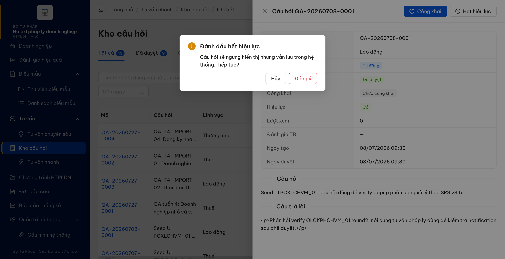

**2. Đọc nội dung file Excel xuất ra** *(phụ trợ — file thật: `../reverify-audit/QLKCHTV_12/files/lan1-kho-cau-hoi-20260727.xlsx`)*

```
Dòng 6 · cột C : <p>Phản hồi verify QLCKPHCHVM_01 round2: nội dun...
Dòng 7 · cột C : <p>Nội dung phản hồi seed cho batch approve QLCK...
Dòng 11 · cột C: <p>AAAAAAAAAAAAAAAAAAAAAAAAAAAAAAAAAAAAAAAAAAAAA...
→ 9/13 dòng (toàn bộ dòng nguồn "Tự động") lộ thẻ HTML
```

**Ảnh + số đo re-test R2 (28/07/2026, tài khoản `cbnv_tw_01`)**

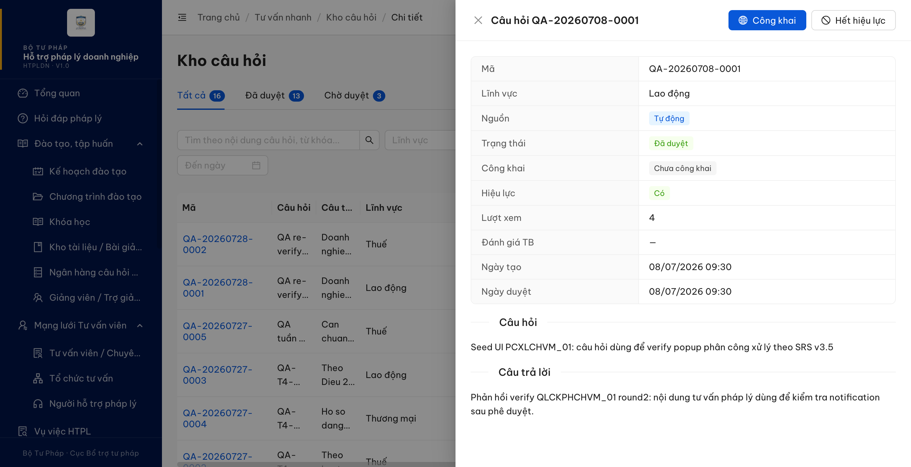


![R2 — Bề mặt 4 VẪN LỖI: sau khi bấm [Chọn], ô "Nội dung trả lời" chứa `<p>Nội dung phản hồi test PHCHVM_09 để kiểm tra double toast.</p>` — đây là nội dung sẽ gửi tới doanh nghiệp](image/R2-BUG-KCH-HTML-THO-o-soan-tra-loi.png)

**Ảnh + số đo re-test R3 (29/07/2026, tài khoản `cbnv_tw_01`, phiên `TVN-20260727-0003`)**

![R3 — Đối chứng trên cùng một màn: thẻ kết quả tra cứu (bên phải) nay sạch thẻ HTML, nhưng ô "Nội dung trả lời" sau khi bấm [Chọn] vẫn chứa `<p>…</p>` (65/5000)](image/R3-BUG-KCH-HTML-THO-o-soan-tra-loi-van-loi.png)

```
// R3 — Bề mặt 1: màn chi tiết QA-20260708-0001
coHtmlThoHienThi = false

// R3 — Bề mặt 2: kho-cau-hoi-20260729.xlsx (28 dòng dữ liệu)
so_o_con_the_HTML_tho = 0

// R3 — Bề mặt 3: thẻ kết quả tra cứu, từ khóa "đăng ký kinh doanh"
QA-20260706-0001 → "Nội dung phản hồi test PHCHVM_09 để kiểm tra double toast."   (sạch)
document.body.innerText chứa "<p>" = false

// R3 — Bề mặt 4: ô "Nội dung trả lời" sau khi bấm [Chọn] trên chính thẻ đó
giá trị ô soạn = "<p>Nội dung phản hồi test PHCHVM_09 để kiểm tra double toast.</p>"   (65/5000 ký tự)
```

```
// Bề mặt 1 — màn chi tiết QA-20260708-0001 (nguồn Tự động)
coHtmlThoHienThi = false   → "<p>" nay là thẻ thật đã render, không phải chữ người dùng đọc được

// Bề mặt 2 — file Excel xuất mới: kho-cau-hoi-20260728.xlsx (17 dòng, 9 dòng nguồn Tự động)
so_o_con_the_HTML_tho = 0/17   → toàn bộ cột "Câu trả lời" là chữ sạch

// Bề mặt 3 — thẻ kết quả tra cứu (màn trả lời TVN-20260727-0004, từ khóa "đăng ký kinh doanh")
QA-20260706-0001 → "<p>Nội dung phản hồi test PHCHVM_09 để kiểm tra double toast.</p>"
QA-20260706-0002 → "<p>Phản hồi test PHCHVM_01/03: đính kèm tệp VBPL.</p>"
QA-20260707-0001 → "<p>BBBBBB..."

// Bề mặt 4 — ô "Nội dung trả lời" sau khi bấm [Chọn]
giá trị ô soạn = "<p>Nội dung phản hồi test PHCHVM_09 để kiểm tra double toast.</p>"   (65/5000 ký tự)
```

### Kiểm tra lại lượt 4 — 29/07/2026 — ✅ ĐẠT

Bề mặt còn lại ở lượt 3 là **ô "Nội dung trả lời" sau khi bấm [Chọn]** — bề mặt duy nhất chạm tới doanh nghiệp, vì đó chính là chữ sắp gửi đi. Lượt này **dựng phiên tư vấn nhanh mới** thay vì mở lại phiên cũ, để chắc chắn đang đo hành vi hiện tại chứ không phải nội dung lưu từ trước.

| | Nội dung |
|---|---|
| Phiên mới | `TVN-20260729-0001` — câu hỏi *"[QA-T4-L4] Thủ tục đăng ký kinh doanh online gồm những bước nào?"* |
| Thao tác | tra cứu Kho câu hỏi với từ khóa *"đăng ký kinh doanh"* → 12 thẻ kết quả → bấm **[Chọn]** trên `QA-20260706-0001` (bản ghi vốn lưu câu trả lời dạng `<p>…</p>`) |

**Giá trị ô "Nội dung trả lời" ngay sau khi bấm [Chọn]:**

| Lượt | Giá trị | Đếm |
|---|---|---|
| Lượt 3 | `<p>Nội dung phản hồi test PHCHVM_09 để kiểm tra double toast.</p>` | 65 / 5000 |
| **Lượt 4** | `Nội dung phản hồi test PHCHVM_09 để kiểm tra double toast.` | **58 / 5000** |

Chênh đúng 7 ký tự — bằng đúng cặp thẻ đã được bỏ. Dò lại bằng biểu thức tìm `<p` / `</p` / `<br` / `<div` / `<span`: không khớp ô nào.

**Chạy hết luồng, không dừng ở chỗ nhìn ô soạn:** bấm [Gửi trả lời] → thông báo *"Gửi trả lời thành công"*, gửi đúng **1** lệnh, màn hình sau đó không còn chuỗi thẻ nào.

**Ba bề mặt kia đo lại vẫn sạch (kiểm xem có hỏng ngược không):**

| Bề mặt | Số đo lượt 4 |
|---|---|
| Màn chi tiết Kho câu hỏi — `QA-20260708-0001` (Nguồn *Tự động*) | không có thẻ HTML hiện thành chữ |
| Tệp Excel xuất mới từ Kho câu hỏi | cột *Câu trả lời*: 29 ô có dữ liệu, **0 ô** còn thẻ HTML |
| Thẻ kết quả tra cứu ở màn trả lời tư vấn nhanh | 12 thẻ, không thẻ nào còn `<p>` |

**Bằng chứng lượt 4**

![R4 — Màn trả lời phiên TVN-20260729-0002: thẻ kết quả tra cứu bên phải sạch thẻ HTML, và ô "Nội dung trả lời" sau khi bấm [Chọn] chứa chữ thuần 58/5000, không còn `<p>…</p>`](image/R4-BUG-KCH-HTML-THO-o-soan-tra-loi-sach.png)

Bản đo đầy đủ 4 bề mặt (giá trị ô soạn 2 lượt đối chiếu · kết quả gửi trả lời · nội dung tệp Excel): [R4-BUG-KCH-HTML-THO-noi-dung.log.txt](image/R4-BUG-KCH-HTML-THO-noi-dung.log.txt).

---

## ~~BUG-KCH-TEMPLATE-LINHVUC~~ [CLOSED] — File Excel mẫu do chính hệ thống cấp liệt kê mã lĩnh vực mà hệ thống từ chối khi nhập

> **Re-test:** 2026-07-28 11:05:04 R2 — ✅ PASS (Closed-verified). File mẫu tải mới có sheet "Ma linh vuc" đúng 10 mã trùng khít danh sách hộp thoại công bố (đã bỏ 4 mã lạ, bổ sung THUONG_MAI/SHTT/DAU_TU). Nhập thử file 10 dòng dùng đủ 10 mã lấy từ file mẫu: Tổng 10 · Hợp lệ 10 · Lỗi 0, xác nhận nhập thành công 10 câu hỏi, lĩnh vực hiển thị đúng trên từng bản ghi.

### Mô tả

Trong hộp thoại **"Nhập câu hỏi từ Excel"**, nút **[Tải file mẫu]** trả về file `kho-cau-hoi-template.xlsx`. Sheet **"Ma linh vuc"** của file này liệt kê danh sách mã lĩnh vực hợp lệ, nhưng danh sách đó **không khớp** với danh sách mà chính hộp thoại công bố và mà máy chủ thực sự chấp nhận. Người dùng làm đúng theo file mẫu của hệ thống vẫn bị báo lỗi và mất dòng dữ liệu.

> Bug này **không nằm trong phiếu test của đối tác** — phát hiện khi verify QLKCHTV_10. Nhiều khả năng đây là nguyên nhân dòng *"5 dòng bị bỏ qua do lỗi"* trong bằng chứng của đối tác.

### Các bước tái hiện

1. Đăng nhập role **`CB_NV_TW`** (tài khoản `cbnv_tw`, BTP · TW).
2. Vào **Tư vấn → Kho câu hỏi** → bấm **[Nhập Excel]**.
3. Bấm **[Tải file mẫu]**, mở file `kho-cau-hoi-template.xlsx`, xem sheet **"Ma linh vuc"**.
4. Điền dữ liệu vào sheet "Du lieu", dùng một mã lấy **đúng từ sheet "Ma linh vuc"** — ví dụ `KINH_DOANH_TM`.
5. Tải file lên → bấm **[Kiểm tra]**.
6. Đọc bảng "Lỗi" ở bước "Xem trước".

### Kết quả mong đợi

- Mọi mã lĩnh vực có trong file mẫu do hệ thống cấp đều được hệ thống chấp nhận khi nhập. Danh sách trong file mẫu, danh sách công bố trong hộp thoại, và danh sách máy chủ chấp nhận phải là **một**.
- Đặc tả gắn file mẫu vào chính luồng xử lý lỗi: `srs-fr-13-tv-nhanh.md:154` — *"E4 | ERR-KHO-04 | \"File không đúng định dạng. **Tải mẫu Excel**\" | ERROR"* ⇒ file mẫu là phương tiện chuẩn để người dùng làm đúng.

### Kết quả thực tế

- Sheet **"Ma linh vuc"** của file mẫu liệt kê 11 mã: `DAN_SU, HINH_SU, HANH_CHINH, LAO_DONG, DAT_DAI, HON_NHAN_GIA_DINH, KINH_DOANH_TM, KHIEU_NAI_TO_CAO, THUE, SO_HUU_TRI_TUE, DOANH_NGHIEP`.
- Hộp thoại "Nhập câu hỏi từ Excel" lại công bố 10 mã khác: `THUE, LAO_DONG, DAT_DAI, DAN_SU, THUONG_MAI, HINH_SU, HANH_CHINH, SHTT, DOANH_NGHIEP, DAU_TU`.
- Nhập dòng dùng mã `KINH_DOANH_TM` (lấy từ file mẫu) → bước "Xem trước" báo: *"Không tìm thấy lĩnh vực với mã 'KINH_DOANH_TM'"*, dòng bị loại.
- Nhập dòng dùng mã `THUONG_MAI` (chỉ có trong hộp thoại, **không** có trong file mẫu) → **hợp lệ**, nhập thành công.
- Danh mục thật của hệ thống (đọc từ ô lọc "Lĩnh vực" trên màn Kho câu hỏi) đúng 10 mục khớp hộp thoại: `Thuế, Lao động, Đất đai, Dân sự, Thương mại, Hình sự, Hành chính, Sở hữu trí tuệ, Doanh nghiệp, Đầu tư`.
- ⇒ **File mẫu là bản sai**: thừa 4 mã hệ thống không có (`HON_NHAN_GIA_DINH`, `KINH_DOANH_TM`, `KHIEU_NAI_TO_CAO`, `SO_HUU_TRI_TUE`) và thiếu 3 mã hệ thống có (`THUONG_MAI`, `SHTT`, `DAU_TU`).

### Bằng chứng

**1. Ảnh chụp**

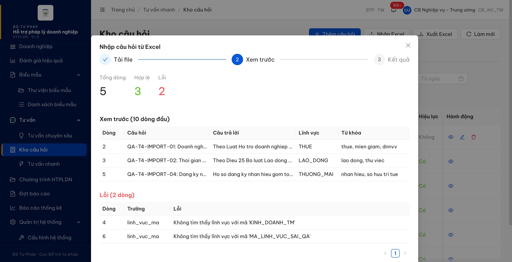

**Ảnh re-test R2 (28/07/2026)**

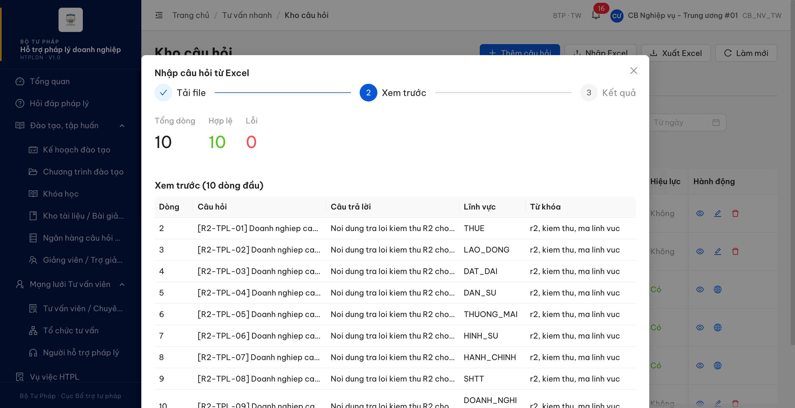

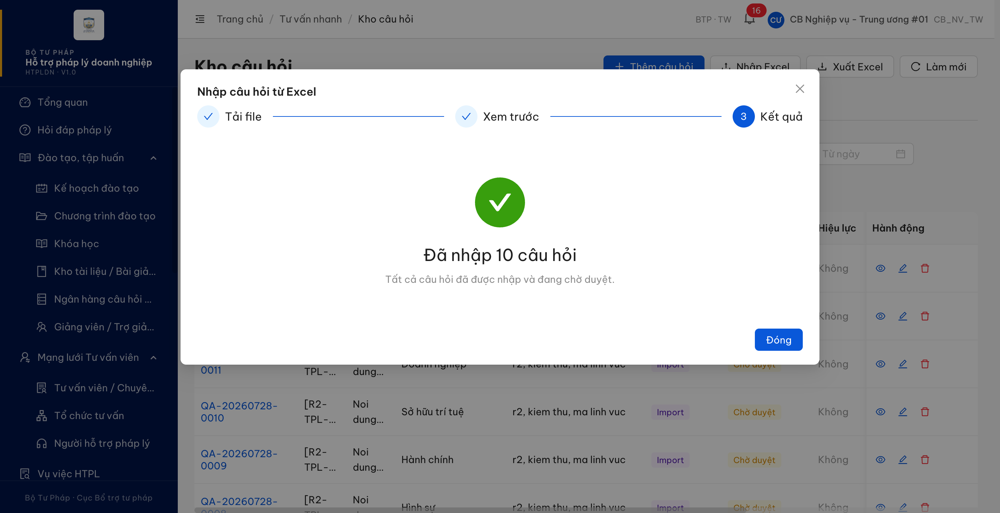

```
// --- Đo lại R2 28/07/2026 (tài khoản cbnv_tw_01) ---
// File mẫu tải mới (kho-cau-hoi-template.xlsx) · sheet "Ma linh vuc" — 10 mã:
THUE · LAO_DONG · DAT_DAI · DAN_SU · THUONG_MAI · HINH_SU · HANH_CHINH ·
SHTT · DOANH_NGHIEP · DAU_TU

// Hộp thoại "Nhập câu hỏi từ Excel" công bố — GIỐNG HỆT 10 mã trên
// 4 mã lạ cũ (HON_NHAN_GIA_DINH, KINH_DOANH_TM, KHIEU_NAI_TO_CAO, SO_HUU_TRI_TUE) đã bị gỡ

// Nhập thật file 10 dòng, mỗi dòng 1 mã lấy từ sheet "Ma linh vuc"
// (file: ../files/R2-import-ma-tu-file-mau.xlsx)
Tổng dòng 10 · Hợp lệ 10 · Lỗi 0
[Xác nhận nhập 10 câu hỏi] → "Đã nhập 10 câu hỏi, chờ duyệt"
QA-20260728-0003..0012 · nguồn Import · trạng thái Chờ duyệt
lĩnh vực hiển thị: Thuế · Lao động · Đất đai · Dân sự · Thương mại · Hình sự ·
                   Hành chính · Sở hữu trí tuệ · Doanh nghiệp · Đầu tư
```

**2. Đọc nội dung file mẫu tải từ hệ thống** *(phụ trợ)*

```
// kho-cau-hoi-template.xlsx · sheet "Ma linh vuc"
DAN_SU · HINH_SU · HANH_CHINH · LAO_DONG · DAT_DAI · HON_NHAN_GIA_DINH ·
KINH_DOANH_TM · KHIEU_NAI_TO_CAO · THUE · SO_HUU_TRI_TUE · DOANH_NGHIEP

// Hộp thoại "Nhập câu hỏi từ Excel" công bố
THUE · LAO_DONG · DAT_DAI · DAN_SU · THUONG_MAI · HINH_SU · HANH_CHINH ·
SHTT · DOANH_NGHIEP · DAU_TU

// Kết quả nhập thật (file: ../reverify-audit/QLKCHTV_10/files/kho-cau-hoi-import-QA-tuan4.xlsx)
Tổng dòng 5 · Hợp lệ 3 · Lỗi 2
  dòng 4 | linh_vuc_ma | Không tìm thấy lĩnh vực với mã 'KINH_DOANH_TM'      ← mã LẤY TỪ FILE MẪU
  dòng 6 | linh_vuc_ma | Không tìm thấy lĩnh vực với mã 'MA_LINH_VUC_SAI_QA' ← mã cố tình sai (đối chứng)
```

### So sánh (Comparison)

| Mã lĩnh vực | Có trong file mẫu? | Có trong hộp thoại? | Hệ thống chấp nhận? |
|---|:-:|:-:|:-:|
| `THUE`, `LAO_DONG`, `DAT_DAI`, `DAN_SU`, `HINH_SU`, `HANH_CHINH`, `DOANH_NGHIEP` | ✅ | ✅ | ✅ |
| `THUONG_MAI`, `SHTT`, `DAU_TU` | ❌ | ✅ | ✅ |
| `HON_NHAN_GIA_DINH`, `KINH_DOANH_TM`, `KHIEU_NAI_TO_CAO`, `SO_HUU_TRI_TUE` | ✅ | ❌ | ❌ |

---

## ~~BUG-QLKCHTV_22~~ [CLOSED] — Bảng danh sách Tư vấn nhanh thiếu 2 cột "CB xử lý" + "Ngày trả lời", thừa cột "Số gợi ý"

> **Re-test:** 2026-07-30 21:06:00 R3 — ✅ PASS (Closed-verified, gồm cả phạm vi BA-09/BA-10 bổ sung 30/07). Bảng danh sách Tư vấn nhanh nay có **đúng 9 cột** theo đặc tả: `Mã phiên · Câu hỏi DN · Kênh · CB xử lý · Trạng thái · Ngày gửi · Ngày trả lời · Ngày cập nhật · Hành động` — đã có "CB xử lý" và "Ngày trả lời", **không còn cột "Số gợi ý"**. Còn **đúng 3 thẻ** `Tất cả · Chờ xử lý · Hoàn thành` (bỏ "Đang tìm kiếm"/"Đã gợi ý") và ô lọc Trạng thái chỉ đổ ra **4 trạng thái đã chốt** `Mới · Cán bộ trả lời · Hoàn thành · Hết hạn`, không còn nhãn tàn dư. Đối chiếu trên dòng `TVN-20260727-0001`: CB xử lý "CB Nghiệp vụ - Trung ương", Ngày gửi `27/07/2026 11:54`, Ngày trả lời `27/07/2026 12:00`, Ngày cập nhật `27/07/2026 12:00` — mọi giá trị ngày-giờ đều đủ ngày kèm `HH:mm`. Cấu trúc 9 cột giữ nguyên khi chuyển qua cả 3 thẻ.

> **Ghi chú số liệu (không phải lỗi):** 2 phiên hiện "—" ở cột CB xử lý / Ngày trả lời là do bản chất dữ liệu, không phải lỗi hiển thị — `TVN-20260729-0002` chưa có cán bộ nào trả lời (Lịch sử trao đổi chỉ có câu hỏi của doanh nghiệp), còn `TVN-20260727-0004` sang Hoàn thành bằng đường "Đẩy sang Nhóm II" (đã đẩy sang hỏi đáp `HD-20260728-001`) nên không phát sinh câu trả lời. Mọi giá trị ngày-giờ CÓ dữ liệu đều đúng định dạng.

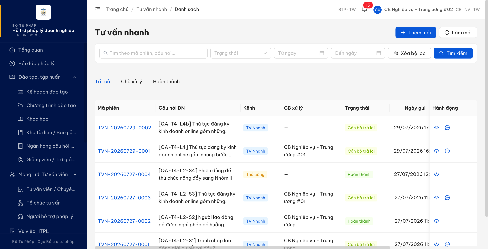

### Mô tả

Tại màn **Tư vấn nhanh** (`/tv-nhanh/tu-van-nhanh`), bảng danh sách đang hiển thị **8 cột** trong khi đặc tả quy định **9 cột**. Cụ thể: thiếu **"CB xử lý"** và **"Ngày trả lời"**, đồng thời có thêm cột **"Số gợi ý"** không nằm trong tập cột được đặc tả. Hệ quả nghiệp vụ: người quản lý không nhìn được ai đang xử lý phiên nào và phiên được trả lời lúc nào ngay trên danh sách — hai thông tin dùng để theo dõi tiến độ và phân công.

Dữ liệu cho 2 cột thiếu **đã có sẵn ở tầng máy chủ**, nên đây là thiếu ở khâu hiển thị chứ không phải thiếu dữ liệu.

### Các bước tái hiện

1. Đăng nhập role **`CB_NV_TW`** (tài khoản `cbnv_tw`, "CB Nghiệp vụ - Trung ương", đơn vị BTP · TW). Đặc tả giao màn này cho tác nhân Cán bộ Nghiệp vụ — `srs-fr-13-tv-nhanh.md:178` *"**Tác nhân:** Cán bộ Nghiệp vụ"*.
2. Vào menu **Tư vấn → Tư vấn nhanh**.
3. Đọc dãy tiêu đề cột của bảng danh sách.
4. Chuyển sang thẻ **"Hoàn thành"** (nơi phiên đã có người trả lời) → đọc lại dãy tiêu đề cột.

### Kết quả mong đợi

- Bảng danh sách hiển thị đủ tập cột theo `srs-fr-13-tv-nhanh.md:576` — §3 SCR-X2-03 dòng 5: *"Bang TV nhanh | table | Ma phien / Cau hoi DN (cat 100 ky tu) / Kenh (TV_NHANH xanh / TV_THU_CONG vang) / **CB xu ly** / Trang thai SM-TVNHANH (C06) / Ngay gui / **Ngay tra loi** / Ngay cap nhat / Hanh dong (Xem / Tra loi)"*.
- Các cột hiển thị nằm trong tập cột được đặc tả; cột nào ngoài tập này cần có căn cứ đặc tả tương ứng.

### Kết quả thực tế

- Bảng có **8 cột**: `Mã phiên` · `Câu hỏi DN` · `Kênh` · **`Số gợi ý`** · `Trạng thái` · `Ngày gửi` · `Ngày cập nhật` · `Hành động`.
- **Thiếu "CB xử lý"** và **thiếu "Ngày trả lời"**; **thừa "Số gợi ý"**.
- Kết quả giống nhau ở cả thẻ "Tất cả" và thẻ "Hoàn thành" — không phải cột bị ẩn theo trạng thái.
- Dữ liệu cho 2 cột thiếu đã có ở máy chủ: `GET /api/v1/tu-van-nhanhs/{id}` trả `"nguoiTraLoi": {"hoTen": "CB Nghiệp vụ - Trung ương"}` và `"ngayTraLoi": "2026-07-27T05:00:22.095Z"`.
- Cột "Số gợi ý" luôn hiển thị `0` và mảng gợi ý luôn rỗng trên mọi bản ghi; đặc tả `srs-fr-13-tv-nhanh.md:200` còn ghi rõ hệ thống *"không tự động tìm kiếm và không prefill"* ⇒ cột này vừa không có căn cứ đặc tả vừa không mang thông tin.

> **Phần tách riêng cho BA:** ý gốc đối tác nêu là cột "Ngày gửi" chỉ hiện `27/07/2026`, không có giờ phút (trong khi cột "Ngày cập nhật" ngay cạnh lại hiện `27/07/2026 11:54`). Đặc tả v3.5 **không quy định định dạng giờ** cho cột này nên không chấm lỗi — đã chuyển thành câu hỏi [BA-10](../ba-confirmation-needed-week-4.md).

### Bằng chứng

**1. Ảnh chụp**

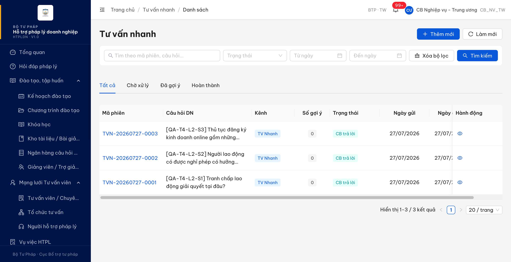

**2. Đọc DOM + network** *(phụ trợ)*

```
// Tiêu đề cột đọc từ .ant-table-thead th
["Mã phiên","Câu hỏi DN","Kênh","Số gợi ý","Trạng thái","Ngày gửi","Ngày cập nhật","Hành động"]

// Dữ liệu 2 cột thiếu vốn có sẵn ở máy chủ:
GET /api/v1/tu-van-nhanhs/{id}  [200]
  "nguoiTraLoi": { "hoTen": "CB Nghiệp vụ - Trung ương" }
  "ngayTraLoi":  "2026-07-27T05:00:22.095Z"
  "ngayGui":     "2026-07-27T04:54:02.624Z"   // có đủ giờ phút giây
```

---

## ~~BUG-QLKCHTV_23~~ [CLOSED] — Nút "Xem chi tiết" mở thẳng chế độ nhập liệu; không có đường chỉ-xem cho phiên chưa hoàn thành

> **Re-test:** 2026-07-28 11:09:47 R2 — ✅ PASS (Closed-verified). Bấm nút Xem chi tiết trên phiên TVN-20260727-0001 đang ở trạng thái CB trả lời: màn mở ra hoàn toàn chỉ đọc (0 ô nhập, chỉ còn nút Quay lại danh sách, không còn nút Gửi trả lời). Cột Hành động nay tách riêng Xem và Trả lời nên đã có đường chỉ-xem cho phiên chưa hoàn thành.

### Mô tả

Ở màn **Tư vấn nhanh**, với phiên đang ở trạng thái **"CB trả lời"**, bấm nút xem chi tiết (biểu tượng con mắt) thì hệ thống mở thẳng **màn trả lời ở chế độ nhập liệu**: ô "Nội dung trả lời" sửa được, ô tra cứu Kho câu hỏi dùng được, nút "Gửi trả lời" đang bật. Không có bất kỳ đường nào để chỉ xem mà không sửa.

Đã chứng minh chế độ chỉ-xem **có tồn tại** trong hệ thống (mở đúng nút đó trên phiên "Hoàn thành" thì màn hoàn toàn chỉ đọc) ⇒ đây là **gán sai chế độ theo trạng thái phiên** thay vì theo hành động người dùng bấm, không phải chức năng chưa làm.

### Các bước tái hiện

1. Đăng nhập role **`CB_NV_TW`** (tài khoản `cbnv_tw`, đơn vị BTP · TW) — tác nhân theo `srs-fr-13-tv-nhanh.md:178`.
2. Vào **Tư vấn → Tư vấn nhanh**.
3. Chọn một phiên đang ở trạng thái **"CB trả lời"** (ví dụ `TVN-20260727-0001`).
4. Bấm nút **con mắt** ở cột "Hành động".
5. Quan sát màn vừa mở: thử gõ vào ô "Nội dung trả lời", kiểm tra nút "Gửi trả lời".
6. **Đối chứng:** quay lại danh sách, bấm đúng nút con mắt đó trên phiên ở trạng thái **"Hoàn thành"** (ví dụ `TVN-20260727-0002`) → so sánh.

### Kết quả mong đợi

- Theo `srs-fr-13-tv-nhanh.md:576`, cột "Hành động" của bảng gồm **hai hành động tách biệt** — *"Hanh dong (**Xem** / **Tra loi**)"*. Hành động "Xem" phải cho người dùng đọc nội dung phiên mà không đưa thẳng vào trạng thái sửa được.
- Đặc tả cũng phân biệt rõ hai chế độ: điều kiện hiển thị của màn trả lời 2 cột (`srs-fr-13-tv-nhanh.md:578`, `:579`) được ghi là *"mode tra loi"* ⇒ chế độ trả lời là một chế độ riêng, không phải mặc định của mọi lần mở chi tiết.

### Kết quả thực tế

- Với phiên **"CB trả lời"**: nút con mắt mở màn trả lời ở chế độ nhập liệu — đọc trực tiếp thuộc tính các ô nhập cho thấy ô "Nội dung trả lời" **không** ở trạng thái chỉ đọc, nút "Gửi trả lời" **đang bật**.
- Không tồn tại nút/đường dẫn nào khác để xem phiên ở chế độ chỉ đọc khi phiên chưa hoàn thành.
- **Đối chứng quyết định:** cùng nút con mắt, mở phiên **"Hoàn thành"** → màn hoàn toàn chỉ đọc: `số ô nhập = 0`, chỉ còn nút "Quay lại danh sách", không có nút "Gửi trả lời". ⇒ Hệ thống đang chọn chế độ theo **trạng thái phiên**, không theo **hành động người dùng bấm**.

> **Cùng gốc với [BUG-QLKCHTV_24](#bug-qlkchtv_24--cột-hành-động-chỉ-có-1-nút-xem-thiếu-hành-động-trả-lời)** (cột Hành động chỉ có 1 nút) — đề nghị dev xử lý chung một lần.

### Bằng chứng

**1. Ảnh chụp**

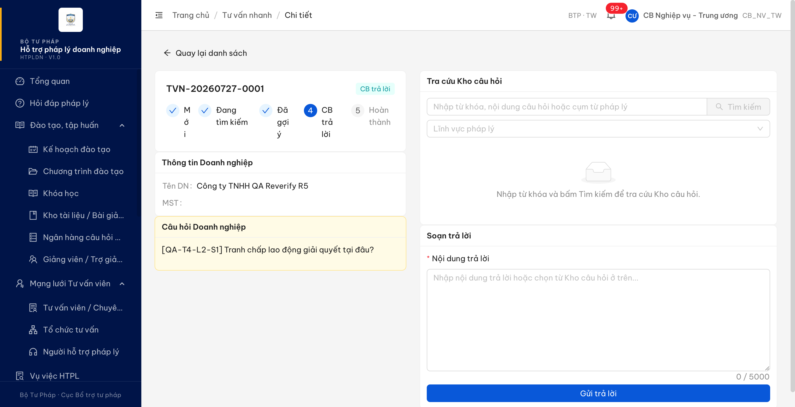

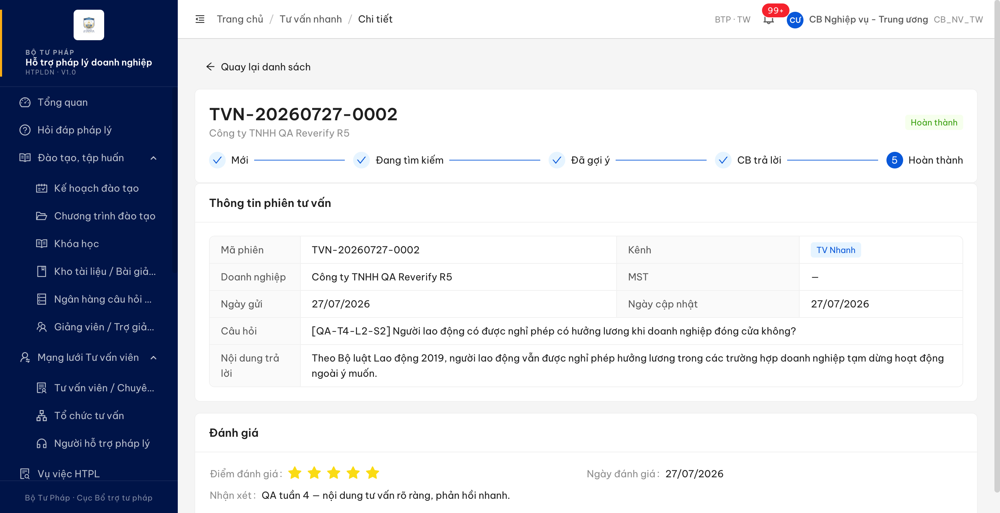

**Re-verify R2 — 28/07/2026:** nút "Xem chi tiết" trên phiên `TVN-20260727-0001` (trạng thái "CB trả lời") nay mở màn chỉ đọc.

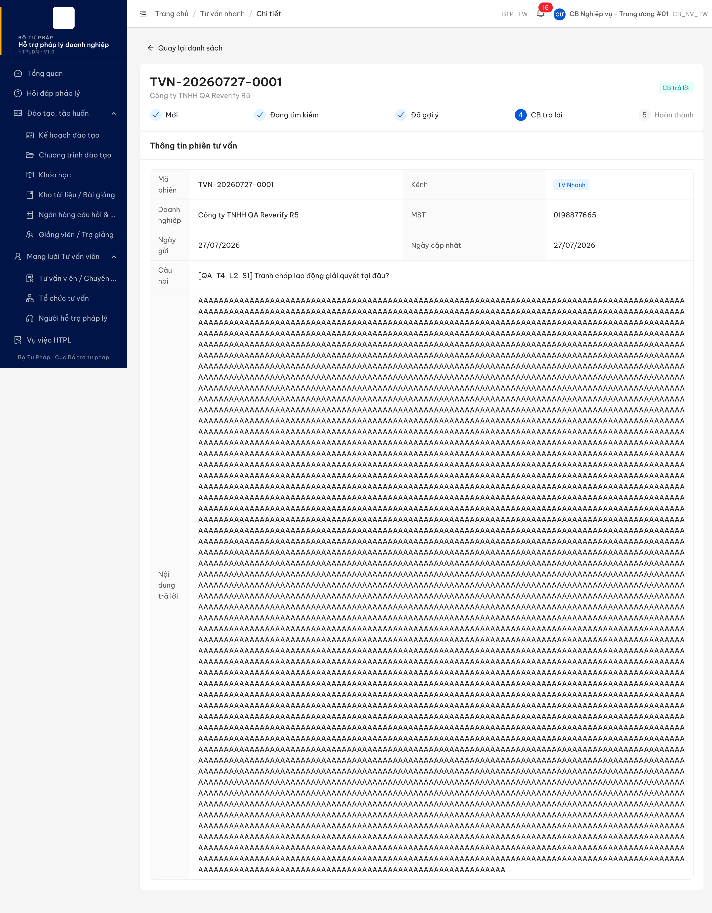

```
// Đo lại 28/07/2026 — TVN-20260727-0001 (CB trả lời) — mở từ nút "Xem chi tiết"
soInput = 0
cacNut = ["Quay lại danh sách"]     // không còn "Gửi trả lời"
```

**2. Đọc DOM** *(phụ trợ)*

```
// Phiên TVN-20260727-0001 (CB trả lời) — mở từ nút con mắt
soInput = 3   · oNoiDungTraLoi.readOnly = false · nut "Gửi trả lời" disabled = false
cacNut = ["Quay lại danh sách", "Tìm kiếm", "Gửi trả lời"]

// Phiên TVN-20260727-0002 (Hoàn thành) — mở từ CÙNG nút con mắt
soInput = 0
cacNut = ["Quay lại danh sách"]
```

---

## ~~BUG-QLKCHTV_24~~ [CLOSED] — Cột "Hành động" chỉ có 1 nút "Xem", thiếu hành động "Trả lời"

> **Re-test:** 2026-07-28 11:11:55 R2 — ✅ PASS (Closed-verified). Cột Hành động nay có đủ 2 nút: 3 phiên trạng thái CB trả lời đều hiện Xem chi tiết + Trả lời; phiên Hoàn thành chỉ còn Xem (đúng nghiệp vụ). Bấm thật nút Trả lời trên TVN-20260727-0001 mở đúng màn soạn trả lời 2 cột (ô Nội dung trả lời nhập được, nút Gửi trả lời bật).

### Mô tả

Ở bảng danh sách màn **Tư vấn nhanh**, cột **"Hành động"** chỉ có **duy nhất một nút** — biểu tượng con mắt, nhãn trợ năng *"Xem chi tiết tư vấn {mã phiên}"*. Không có nút **"Trả lời"** ở bất kỳ dòng nào, ở bất kỳ trạng thái nào.

Đã quét toàn bộ các trạng thái đang có dữ liệu để loại trừ khả năng nút bị ẩn theo điều kiện — kết quả không đổi.

### Các bước tái hiện

1. Đăng nhập role **`CB_NV_TW`** (tài khoản `cbnv_tw`, đơn vị BTP · TW) — tác nhân theo `srs-fr-13-tv-nhanh.md:178`.
2. Vào **Tư vấn → Tư vấn nhanh**.
3. Ở thẻ **"Tất cả"**: đếm số nút trong cột "Hành động" của từng dòng (dữ liệu gồm 3 phiên "CB trả lời" + 1 phiên "Hoàn thành").
4. Chuyển sang thẻ **"Hoàn thành"** → đếm lại.

### Kết quả mong đợi

- Cột "Hành động" cung cấp đủ **hai hành động** theo `srs-fr-13-tv-nhanh.md:576` — §3 SCR-X2-03 dòng 5: *"… / Hanh dong (**Xem** / **Tra loi**)"*.

### Kết quả thực tế

- Mọi dòng, mọi trạng thái, mọi thẻ: cột "Hành động" chỉ có **1 nút** (con mắt / "Xem chi tiết"). Đếm bằng mã lệnh, không phụ thuộc quan sát bằng mắt.
- Không trạng thái nào làm xuất hiện nút thứ hai ⇒ hành động "Trả lời" **chưa được dựng**, không phải ẩn theo điều kiện.
- Hệ quả nghiệp vụ: đường duy nhất để cán bộ vào soạn trả lời là bấm nút "Xem" — chính là hiện tượng ở [BUG-QLKCHTV_23](#bug-qlkchtv_23--nút-xem-chi-tiết-mở-thẳng-chế-độ-nhập-liệu-không-có-đường-chỉ-xem-cho-phiên-chưa-hoàn-thành). Hai bug cùng một gốc, đề nghị xử lý chung.

### Bằng chứng

**1. Ảnh chụp**


**Re-verify R2 — 28/07/2026:** cột "Hành động" đã có 2 nút; bấm nút "Trả lời" mở đúng màn soạn trả lời.


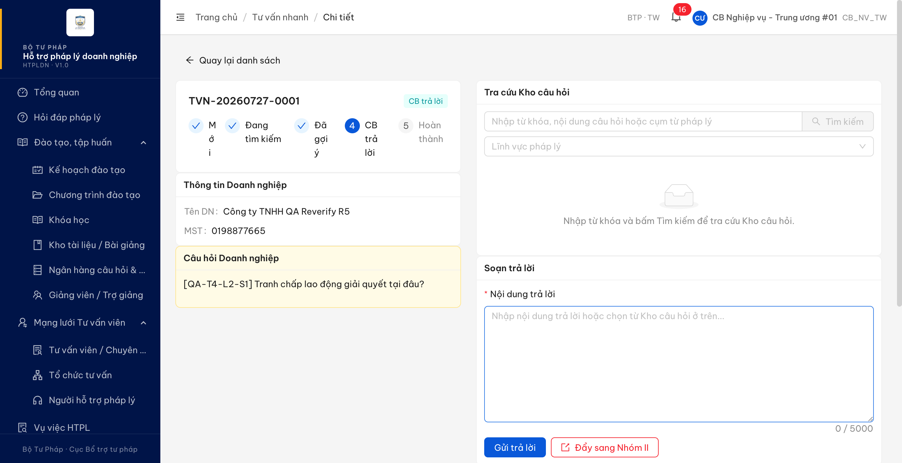

```
// Đo lại 28/07/2026 — đếm nút cột Hành động theo từng dòng
TVN-20260727-0004 (CB trả lời) → 2 nút: "Xem chi tiết tư vấn ...", "Trả lời tư vấn ..."
TVN-20260727-0003 (CB trả lời) → 2 nút
TVN-20260727-0001 (CB trả lời) → 2 nút
TVN-20260727-0002 (Hoàn thành) → 1 nút "Xem chi tiết tư vấn ..."   (đúng nghiệp vụ)
Thẻ "Hoàn thành" → 1 dòng, 1 nút "Xem chi tiết"
```

**2. Đọc DOM** *(phụ trợ)*

```
// Đếm nút trong cột Hành động của từng dòng (.ant-table-tbody tr.ant-table-row)
Thẻ "Tất cả"    → mọi dòng: soNut = 1, nhãn = "Xem chi tiết tư vấn TVN-20260727-000X"
Thẻ "Hoàn thành" → mọi dòng: soNut = 1
Tìm chữ "Trả lời" trong cột Hành động → 0 kết quả
```

---

## ~~BUG-QLKCHTV_26A~~ [CLOSED] — Thanh tiến trình ở cột trái màn trả lời bị vỡ chữ, mỗi ký tự xuống một dòng

> **Re-test:** 2026-07-30 21:09:00 R3 — ✅ PASS (Closed-verified). Chạy trên **`TVN-20260727-0001` ở bố cục trả lời hai cột** (`?mode=tra-loi`) đúng như phiếu yêu cầu, tài khoản `cbnv_tw_02`. Đo lại kích thước từng nhãn tiến trình: `Mới` **24,8 × 22 px**, `Cán bộ trả lời` **93 × 22 px**, `Hoàn thành` **78,7 × 22 px** — chiều cao 22 px đúng bằng một dòng chữ, không còn nhãn nào cao gấp nhiều dòng (lượt trước `Mới` chỉ rộng 11,9 px nhưng cao 66 px). Thanh tiến trình nay dựng theo trục dọc với tiêu đề nằm ngang, nên chữ không bị nhồi vào cột hẹp nữa. Thanh chỉ còn **3 mốc** `Mới · Cán bộ trả lời · Hoàn thành`, không còn "Đang tìm kiếm"/"Đã gợi ý".

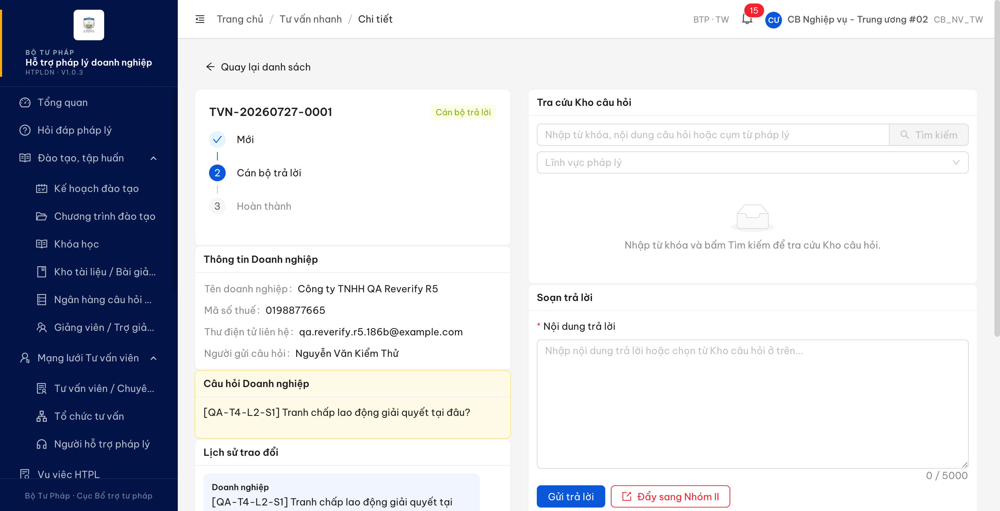

### Mô tả

Ở màn **trả lời tư vấn nhanh** (bố cục 2 cột), thanh tiến trình trạng thái đặt trong cột trái bị **bẻ chữ theo chiều dọc**: nhãn "Mới" hiển thị thành `M / ở / i`, "Đã gợi ý" thành `Đã / gợi / ý`, "CB trả lời" thành `CB / trả / lời`. Nhãn trở nên khó đọc, làm người dùng khó nhận biết phiên đang ở bước nào.

Đã tách được nguyên nhân: lỗi **chỉ xảy ra khi thanh tiến trình bị đặt vào cột trái hẹp** của chế độ trả lời; cùng thanh đó ở bố cục 1 cột toàn chiều rộng thì hiển thị bình thường trên một dòng.

### Các bước tái hiện

1. Đăng nhập role **`CB_NV_TW`** (tài khoản `cbnv_tw`, đơn vị BTP · TW) — tác nhân theo `srs-fr-13-tv-nhanh.md:178`.
2. Vào **Tư vấn → Tư vấn nhanh**, mở một phiên ở trạng thái **"CB trả lời"** → màn trả lời 2 cột hiện ra.
3. Đọc thanh tiến trình trạng thái ở đầu **cột trái**.
4. **Đối chứng:** mở phiên ở trạng thái **"Hoàn thành"** (màn dùng bố cục 1 cột toàn chiều rộng) → đọc lại thanh tiến trình.

### Kết quả mong đợi

- Nhãn từng bước của thanh tiến trình đọc được bình thường trong bố cục mà đặc tả quy định. `srs-fr-13-tv-nhanh.md:578` — §3 SCR-X2-03 dòng 7 yêu cầu cột trái (40%) chứa *"Ma phien + **Trang thai (C06/C17)**"*, tức thanh tiến trình là thành phần bắt buộc của cột này và phải dùng được ở đúng chiều rộng đó.
- Đặc tả liệt kê 6 nhãn trạng thái cần hiển thị: Mới / Đang tìm kiếm / Đã gợi ý / CB trả lời / Hoàn thành / Hết hạn.

### Kết quả thực tế

- 3/5 nhãn hiển thị trên thanh bị vỡ dọc từng ký tự. Số đo (rộng × cao) cho thấy rõ:
  - Mới → **11,9 × 66 px** (vỡ)
  - Đang tìm kiếm → 58,5 × 44 px (bình thường)
  - Đã gợi ý → **28,8 × 66 px** (vỡ)
  - CB trả lời → **33,8 × 66 px** (vỡ)
  - Hoàn thành → 46,8 × 44 px (bình thường)
- Nhãn 3 ký tự "Mới" rộng 11,9 px mà cao 66 px ⇒ mỗi ký tự nằm một dòng riêng.
- **Đối chứng quyết định:** cùng thanh tiến trình đó ở màn chi tiết phiên "Hoàn thành" (bố cục 1 cột toàn chiều rộng) hiển thị **bình thường trên một dòng** ⇒ nguyên nhân nằm ở chiều rộng khả dụng của cột trái chế độ trả lời, không phải lỗi phông chữ hay lỗi dữ liệu.

### Bằng chứng

**1. Ảnh chụp**


**2. Số đo DOM** *(phụ trợ)*

```
// Kích thước hộp nhãn từng bước (.ant-steps-item-title), đơn vị px
Mới            → w=11.9  h=66   ⚠️
Đang tìm kiếm  → w=58.5  h=44
Đã gợi ý       → w=28.8  h=66   ⚠️
CB trả lời     → w=33.8  h=66   ⚠️
Hoàn thành     → w=46.8  h=44
```

---

## ~~BUG-QLKCHTV_26B~~ [CLOSED] — Khối "Thông tin Doanh nghiệp" hiện nhãn "MST" nhưng luôn bỏ trống vì máy chủ không trả mã số thuế

> **Re-test:** 2026-07-30 21:09:00 R3 — ✅ PASS (Closed-verified, gồm cả 2 trường BA-14 bổ sung 30/07). Chạy trên **`TVN-20260727-0001` ở bố cục trả lời hai cột** (`?mode=tra-loi`) đúng như phiếu yêu cầu, tài khoản `cbnv_tw_02`. Khối **Thông tin Doanh nghiệp** nay có đủ **4 trường có giá trị đúng phiên**: Tên doanh nghiệp *"Công ty TNHH QA Reverify R5"*, Mã số thuế **`0198877665`**, Thư điện tử liên hệ **`qa.reverify.r5.186b@example.com`**, Người gửi câu hỏi *"Nguyễn Văn Kiểm Thử"*. Trường mã số thuế không còn trống, và 2 trường BA yêu cầu thêm (thư điện tử liên hệ, người gửi câu hỏi) đều đã có.

### Mô tả

Ở cột trái màn **trả lời tư vấn nhanh**, khối "Thông tin Doanh nghiệp" hiển thị nhãn **"MST:"** nhưng giá trị **luôn bỏ trống**, kể cả khi doanh nghiệp gắn với phiên **có** mã số thuế trong hồ sơ.

Đã truy tầng dữ liệu để chỉ đúng nơi hỏng: khối doanh nghiệp mà máy chủ trả về cho màn này **chỉ gồm 2 trường** (mã và tên doanh nghiệp), không kèm mã số thuế. ⇒ Giao diện dựng đúng nhãn nhưng **không có dữ liệu để hiển thị**.

### Các bước tái hiện

1. Đăng nhập role **`CB_NV_TW`** (tài khoản `cbnv_tw`, đơn vị BTP · TW) — tác nhân theo `srs-fr-13-tv-nhanh.md:178`.
2. Chuẩn bị dữ liệu để loại trừ khả năng "trống vì doanh nghiệp không khai": chọn phiên gắn với doanh nghiệp **có** mã số thuế — ví dụ "Công ty TNHH QA Reverify R5", mã số thuế `0198877665` (kiểm tra bằng `GET /api/v1/doanh-nghieps`).
3. Vào **Tư vấn → Tư vấn nhanh**, mở phiên đó (trạng thái "CB trả lời").
4. Đọc khối "Thông tin Doanh nghiệp" ở cột trái.

### Kết quả mong đợi

- Khối "Thông tin DN" ở cột trái hiển thị được thông tin doanh nghiệp gửi câu hỏi. Đặc tả `srs-fr-13-tv-nhanh.md:578` — §3 SCR-X2-03 dòng 7 quy định cột trái (40%) gồm *"Ma phien + Trang thai (C06/C17). **Thong tin DN**. Cau hoi DN (card nen nhat). Lich su trao doi (chat bubbles)"*.
- Trường đã được đặt nhãn trên giao diện thì phải có giá trị khi dữ liệu nguồn có sẵn.

### Kết quả thực tế

- Khối "Thông tin Doanh nghiệp" chỉ có 2 dòng: `Tên DN: Công ty TNHH QA Reverify R5` và `MST:` **bỏ trống**.
- Truy tầng dữ liệu — `GET /api/v1/tu-van-nhanhs/{id}` trả khối doanh nghiệp **rút gọn chỉ 2 trường**:
  `"doanhNghiep": { "id": "58288a29-…", "tenDoanhNghiep": "Công ty TNHH QA Reverify R5" }` — **không có** `maSoThue`, **không có** `email`.
- Cùng doanh nghiệp đó, `GET /api/v1/doanh-nghieps` trả đủ `maSoThue: "0198877665"` và `email: "qa.reverify.r5.186b@example.com"` ⇒ dữ liệu **có tồn tại trong hệ thống**, chỉ không được trả về cho màn này.

> **Phần tách riêng cho BA:** đối tác còn nêu thiếu "thư điện tử liên hệ" và "người gửi câu hỏi". Đặc tả `:578` chỉ ghi chung *"Thong tin DN"*, **không liệt kê trường cụ thể**, nên hai mục này không có căn cứ để chấm lỗi — đã chuyển thành câu hỏi [BA-14](../ba-confirmation-needed-week-4.md).

### Bằng chứng

**1. Ảnh chụp**


**2. Đối chiếu 2 endpoint** *(phụ trợ)*

```
GET /api/v1/tu-van-nhanhs/{id}   [200]
  "doanhNghiep": { "id": "58288a29-a8fe-4c46-b30f-52e89d89d00e",
                   "tenDoanhNghiep": "Công ty TNHH QA Reverify R5" }
                   // ❌ không có maSoThue, không có email

GET /api/v1/doanh-nghieps        [200]  (cùng doanh nghiệp)
  "maSoThue": "0198877665"
  "email":    "qa.reverify.r5.186b@example.com"
```

---

## ~~BUG-QLKCHTV_26C~~ [CLOSED] — Cột trái màn trả lời không có "Lịch sử trao đổi"

> **Re-test:** 2026-07-30 21:09:00 R3 — ✅ PASS (Closed-verified). Chạy trên **`TVN-20260727-0001` ở bố cục trả lời hai cột** (`?mode=tra-loi`) đúng như phiếu yêu cầu, tài khoản `cbnv_tw_02`. Mục **Lịch sử trao đổi** đã có và hiển thị đúng **2 lượt theo thứ tự thời gian**: (1) *Doanh nghiệp* — *"[QA-T4-L2-S1] Tranh chấp lao động giải quyết tại đâu?"* — `27/07/2026 11:54`; (2) *Cán bộ* — nội dung trả lời (5.000 ký tự, đúng giới hạn) — `27/07/2026 12:00`. Tác nhân, nội dung và mốc thời gian khớp đúng cột Ngày gửi 11:54 / Ngày trả lời 12:00 trên bảng danh sách.

### Mô tả

Ở cột trái màn **trả lời tư vấn nhanh**, **không có mục "Lịch sử trao đổi"** nào — trong khi đặc tả liệt kê đây là một trong bốn thành phần bắt buộc của cột này. Cán bộ không xem lại được diễn biến trao đổi giữa doanh nghiệp và cán bộ trước đó khi soạn câu trả lời.

**Lưu ý khối lượng cho dev:** đây không phải chỉnh giao diện đơn thuần — bảng dữ liệu phiên tư vấn nhanh hiện chỉ lưu **1 câu hỏi + 1 nội dung trả lời**, chưa có nơi lưu nhiều lượt trao đổi.

### Các bước tái hiện

1. Đăng nhập role **`CB_NV_TW`** (tài khoản `cbnv_tw`, đơn vị BTP · TW) — tác nhân theo `srs-fr-13-tv-nhanh.md:178`.
2. Vào **Tư vấn → Tư vấn nhanh**, mở một phiên ở trạng thái **"CB trả lời"**.
3. Đọc toàn bộ cột trái của màn trả lời, đối chiếu với 4 thành phần đặc tả yêu cầu.
4. Quét chữ toàn màn tìm cụm "Lịch sử trao đổi".

### Kết quả mong đợi

- Cột trái hiển thị đủ 4 thành phần theo `srs-fr-13-tv-nhanh.md:578` — §3 SCR-X2-03 dòng 7: *"| 7 | content (tra loi) | Cot trai (40%) | layout | Ma phien + Trang thai (C06/C17). Thong tin DN. Cau hoi DN (card nen nhat). **Lich su trao doi (chat bubbles)** | -- | mode tra loi |"*.

### Kết quả thực tế

- Đối chiếu từng thành phần `:578` trên hệ thống thực tế:
  - Mã phiên + Trạng thái (C06/C17) → có, nhưng thanh tiến trình vỡ chữ (xem BUG-QLKCHTV_26A)
  - Thông tin DN → có khối, thiếu dữ liệu MST (xem BUG-QLKCHTV_26B)
  - Câu hỏi DN (thẻ nền nhạt) → có
  - **Lịch sử trao đổi (bong bóng hội thoại) → KHÔNG CÓ**
- Quét chữ toàn màn: không tìm thấy cụm "Lịch sử trao đổi" ở bất kỳ đâu.
- Kiểm mô hình dữ liệu: bảng thuộc tính `TU_VAN_NHANH` (`srs-fr-13-tv-nhanh.md:717-733`) chỉ có 1 trường câu hỏi và 1 trường nội dung trả lời, **không có bảng lượt trao đổi** ⇒ để dựng được thành phần này cần bổ sung cả nơi lưu dữ liệu nhiều lượt.

### Bằng chứng

**1. Ảnh chụp**


**2. Quét DOM** *(phụ trợ)*

```
coLichSuTraoDoi = false          // không có cụm "Lịch sử trao đổi" trên toàn màn
Các khối có trên cột trái = ["Mã phiên + Trạng thái", "Thông tin Doanh nghiệp", "Câu hỏi của Doanh nghiệp"]
```

---

## ~~BUG-QLKCHTV_35~~ [CLOSED] — Thiếu chức năng "Đẩy sang Nhóm II" ở màn trả lời tư vấn nhanh

> **Re-test:** 2026-07-28 11:17:32 R2 — ✅ PASS (Closed-verified). Màn trả lời nay có nút Đẩy sang Nhóm II; bấm thật trên TVN-20260727-0004 mở modal xác nhận, xác nhận xong hiện 1 thông báo Đã đẩy sang Nhóm II: hỏi đáp HD-20260728-001 (1 lần gọi máy chủ, 1 khung thông báo). Phiên chuyển Hoàn thành kèm ghi chú Đã đẩy sang Nhóm II hỏi đáp HD-20260728-001; bản ghi Hỏi đáp HD-20260728-001 đã tạo với Kênh tiếp nhận Từ Tư vấn nhanh và có thông báo Câu hỏi từ Tư vấn nhanh cần tiếp nhận.

### Mô tả

Màn **trả lời tư vấn nhanh** **không có nút "Đẩy sang Nhóm II"** — chức năng cho phép cán bộ chuyển một câu hỏi cần xử lý chính thức từ luồng tư vấn nhanh sang luồng Hỏi đáp Nhóm II. Cuối cột phải chỉ có duy nhất nút "Gửi trả lời".

Đã kiểm cả tầng máy chủ: chức năng **chưa tồn tại ở cả hai tầng**, không phải chỉ thiếu nút — thông tin này để dev ước lượng đúng khối lượng.

### Các bước tái hiện

1. Đăng nhập role **`CB_NV_TW`** (tài khoản `cbnv_tw`, đơn vị BTP · TW). Đặc tả giao thao tác này cho *"CB NV/TVV"* — `srs-fr-13-tv-nhanh.md:207`.
2. Vào **Tư vấn → Tư vấn nhanh**, mở một phiên **chưa ở trạng thái "Hoàn thành"** (ví dụ `TVN-20260727-0001`, trạng thái "CB trả lời") → đúng điều kiện hiển thị mà đặc tả nêu.
3. Liệt kê toàn bộ nút trong vùng nội dung màn trả lời (không phụ thuộc vị trí cuộn).
4. Quét chữ toàn màn tìm cụm "Nhóm II".
5. Lặp lại trên một phiên **mới tạo** để loại trừ khả năng nút phụ thuộc lịch sử thao tác.

### Kết quả mong đợi

Yêu cầu này được đặc tả nêu ở **4 vị trí độc lập**:

- `srs-fr-13-tv-nhanh.md:207` — §2 FR-X.2-02 bước xử lý 9: *"**Đẩy sang Nhóm II giữa chừng (do CB/TVV chủ động):** Nếu CB NV/TVV phát hiện câu hỏi cần xử lý chính thức … → click nút "Đẩy sang Nhóm II" → mở modal xác nhận → tạo bản ghi HOI_DAP với `kenh_tiep_nhan = TVN_BRIDGE` + `tu_van_nhanh_goc_id = TU_VAN_NHANH.id` …; cập nhật trạng thái phiên TV nhanh sang HOAN_THANH với ghi chú "Đã đẩy sang Nhóm II hỏi đáp #{ma_hoi_dap}"; gửi thông báo cho cán bộ Nhóm II tiếp nhận."*
- `srs-fr-13-tv-nhanh.md:230` — bảng xử lý lỗi E4: *"Đẩy sang Nhóm II khi phiên đã HOAN_THANH | `ERR-TVN-03` | "Phiên tư vấn đã kết thúc, không thể đẩy sang Nhóm II" | ERROR"* ⇒ đặc tả cấp **mã lỗi riêng** cho thao tác này.
- `srs-fr-13-tv-nhanh.md:239` — tiêu chí nghiệm thu: *"**Given** CB NV/TVV đang trả lời phát hiện câu hỏi cần xử lý chính thức **When** click "Đẩy sang Nhóm II" + xác nhận **Then** tạo HOI_DAP với kênh = TVN_BRIDGE + liên kết phiên TV nhanh gốc; phiên TV nhanh đóng với ghi chú đã đẩy sang Nhóm II"*.
- `srs-fr-13-tv-nhanh.md:579` — §3 SCR-X2-03 cột phải: *"**Them nut phu "Day sang Nhom II"** (button warning, ben canh nut Gui tra loi) … click -> mo modal xac nhan"*.

### Kết quả thực tế

- Toàn bộ nút trong vùng nội dung màn trả lời: `["Quay lại danh sách", "Tìm kiếm", "Gửi trả lời"]` — **không có** "Đẩy sang Nhóm II".
- Quét chữ toàn màn: **0 kết quả** cho cụm "Nhóm II". Kết quả giống nhau trên phiên cũ và phiên mới tạo.
- **Kiểm tầng máy chủ (phép thử quyết định):** nhóm tư vấn nhanh có 10 đường dẫn; đường gần nghĩa nhất là `POST /api/v1/tu-van-nhanhs/{id}/chuyen-kenh`. Đã gọi thử trên phiên dựng riêng `TVN-20260727-0004`, đối chiếu với điều đặc tả yêu cầu (`:207`, `:216`, `:218`):
  - Tạo bản ghi Hỏi đáp Nhóm II với kênh tiếp nhận `TVN_BRIDGE` → ❌ `hoiDapId` vẫn `null`, không tạo bản ghi nào
  - Giữ liên kết về phiên tư vấn nhanh gốc → ❌ không có
  - Chuyển phiên sang trạng thái `HOAN_THANH` → ❌ vẫn ở `CB_TRA_LOI`
  - Ghi chú "Đã đẩy sang Nhóm II hỏi đáp {mã}" → ❌ không có
  - *Thực tế `chuyen-kenh` chỉ làm một việc:* đổi kênh từ `TV_NHANH` → `TV_THU_CONG`
  ⇒ `chuyen-kenh` là thao tác **khác**, không phải chức năng đẩy sang Nhóm II. Chức năng chưa có ở **cả giao diện lẫn máy chủ**.
- **Đầu nhận đã có trong đặc tả** nên đây không phải chức năng bị dời sang module khác: `srs-fr-13-tv-nhanh.md:580` mô tả luồng *"TV Thu cong -> UC12 (Nhóm II Hỏi đáp) với kênh tiếp nhận = TVN_BRIDGE + liên kết phiên Tư vấn nhanh gốc"*.

### Bằng chứng

**1. Ảnh chụp**


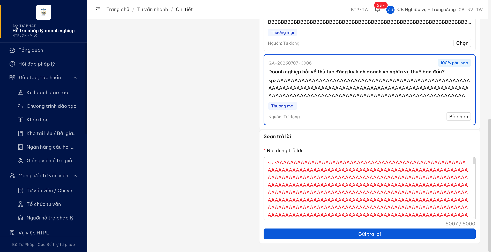

**Re-verify R2 — 28/07/2026:** chạy trọn luồng đẩy sang Nhóm II trên phiên `TVN-20260727-0004`.

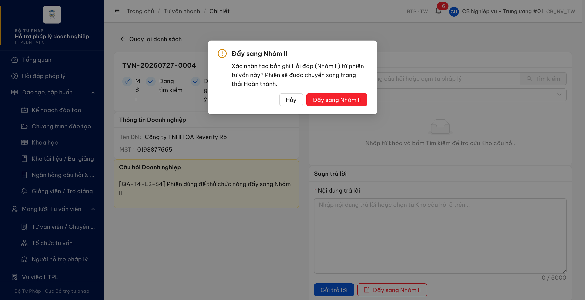


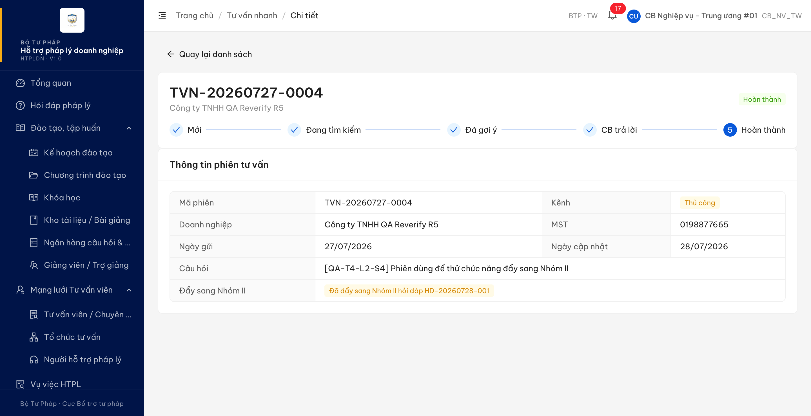

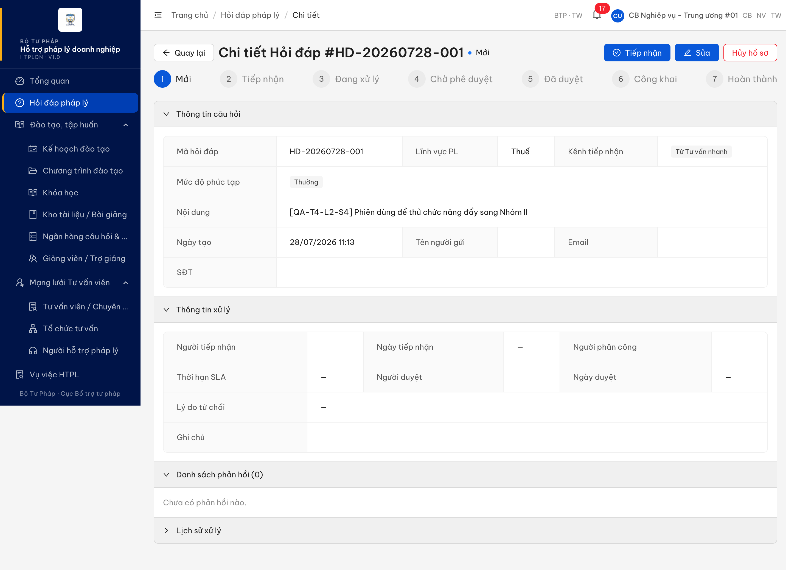

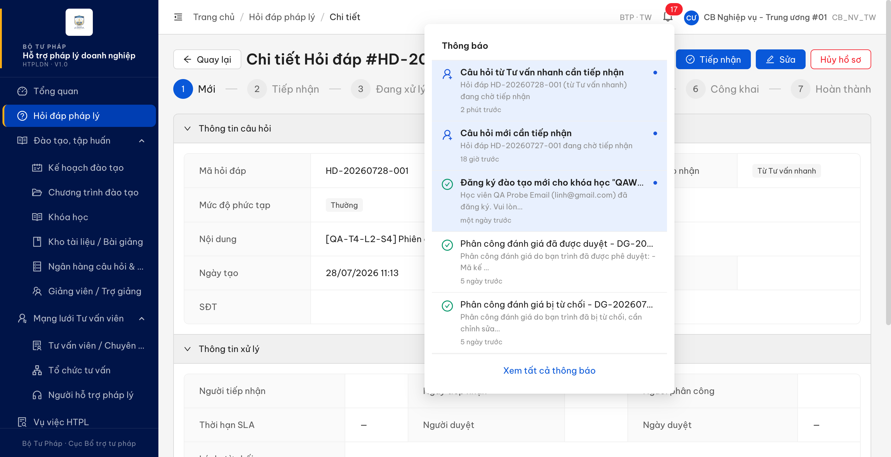

```
// Đo lại 28/07/2026 — bấm [Đẩy sang Nhóm II] → xác nhận trên modal
SO_REQUEST = 1  · SO_KHUNG_THONG_BAO = 1  (bộ đo tự kiểm: 1 observer)
Chữ trong khung: "Đã đẩy sang Nhóm II: hỏi đáp HD-20260728-001"

// Đối chiếu từng ý đặc tả yêu cầu:
Tạo bản ghi Hỏi đáp Nhóm II              → ✅ HD-20260728-001, Ngày tạo 28/07/2026 11:13
Kênh tiếp nhận = từ Tư vấn nhanh          → ✅ "Từ Tư vấn nhanh"
Liên kết về phiên tư vấn nhanh gốc        → ✅ phiên hiện "Đã đẩy sang Nhóm II hỏi đáp HD-20260728-001"
Phiên chuyển "Hoàn thành"                 → ✅ (trước: "CB trả lời"; Ngày cập nhật 28/07/2026)
Ghi chú trên phiên                        → ✅ "Đã đẩy sang Nhóm II hỏi đáp HD-20260728-001"
Thông báo cho cán bộ tiếp nhận            → ✅ "Câu hỏi từ Tư vấn nhanh cần tiếp nhận"
Chặn đẩy khi phiên đã "Hoàn thành"        → ✅ nút "Trả lời" (đường vào thao tác) không còn ở dòng Hoàn thành
```

**2. Liệt kê nút + kiểm máy chủ** *(phụ trợ)*

```
// Toàn bộ <button> trong vùng nội dung màn trả lời
["Quay lại danh sách", "Tìm kiếm", "Gửi trả lời"]
Tìm "Nhóm II" trên toàn màn → 0 kết quả

// 10 đường dẫn nhóm tư vấn nhanh (/api/docs-json) — không có đường nào cho "đẩy sang Nhóm II":
tu-van-nhanhs · {id} · {id}/goi-y · {id}/tra-cuu-kho · {id}/tra-loi · {id}/chuyen-kenh
{id}/danh-gia/cms-proxy · cms-create · public/…/inbound · public/…/{id}/danh-gia

// Sau POST {id}/chuyen-kenh trên TVN-20260727-0004:
"hoiDapId": null · "trangThai": "CB_TRA_LOI" · "kenhTuVan": "TV_NHANH" → "TV_THU_CONG"
```

---

## ~~BUG-QLKCHTV_37~~ [CLOSED] — Khối "Đánh giá" thiếu nút [Xuất Excel] và thẻ tổng hợp (Tổng đánh giá / Điểm TB / Phân bố)

> **Re-test:** 2026-07-28 11:19:46 R2 — ✅ PASS (Closed-verified). Khối Đánh giá của TVN-20260727-0002 nay có đủ nút Xuất Excel + 3 thẻ tổng hợp (Tổng đánh giá 1 lượt, Điểm trung bình 5.0/5, Phân bố điểm 5 sao x 1). Bấm thật nút Xuất Excel tải về danh-gia-tv-nhanh-TVN-20260727-0002-20260728-1119.xlsx; mở đọc nội dung thấy đủ tiêu đề và 1 dòng dữ liệu khớp màn hình (mã phiên, điểm 5, nhận xét, ngày 27/7/2026, tên DN, MST).

### Mô tả

Khối **"Đánh giá"** của phiên tư vấn nhanh **không có nút "Xuất Excel"**, đồng thời **thiếu luôn thẻ tổng hợp** mà đặc tả yêu cầu (Tổng đánh giá / Điểm trung bình / Phân bố điểm). Khối này hiện chỉ hiển thị 3 dòng: Điểm đánh giá, Ngày đánh giá, Nhận xét.

Đã kiểm **cả hai vị trí** mà đặc tả cho phép hiển thị (thẻ "Hoàn thành" ở danh sách và màn chi tiết phiên) — đều không có.

### Các bước tái hiện

1. Đăng nhập role **`CB_NV_TW`** (tài khoản `cbnv_tw`, đơn vị BTP · TW) — tác nhân theo `srs-fr-13-tv-nhanh.md:178`.
2. Chuẩn bị điều kiện tiên quyết: một phiên **đã hoàn thành và đã có đánh giá của doanh nghiệp**. Cách dựng: `POST /api/v1/tu-van-nhanhs/{id}/tra-loi` → `POST /api/v1/tu-van-nhanhs/{id}/danh-gia/cms-proxy` (điểm 5) → phiên tự chuyển sang "Hoàn thành". Ví dụ `TVN-20260727-0002`, đánh giá 5 sao.
3. Vào **Tư vấn → Tư vấn nhanh** → mở **màn chi tiết phiên** đó → liệt kê toàn bộ nút và các khối hiển thị.
4. Quay lại danh sách → chuyển sang thẻ **"Hoàn thành"** → liệt kê lại toàn bộ nút và tìm vùng thống kê.

### Kết quả mong đợi

- Khối Đánh giá hiển thị đủ nội dung theo `srs-fr-13-tv-nhanh.md:581` — §3 SCR-X2-03 dòng 10: *"Danh gia (v2.1 gop tu MH-13.4) | section/column | Diem (1-5 sao) / Nhan xet DN / Ngay danh gia. **The tong hop: Tong danh gia (COUNT) / Diem TB (AVG) / Phan bo (bar chart mini). [Xuat Excel]** | -- | hien thi trong tab Hoan thanh hoac chi tiet phien"*.
- Người dùng kết xuất được dữ liệu đánh giá ra tệp Excel từ một trong hai vị trí đặc tả nêu.

### Kết quả thực tế

- Tại **màn chi tiết phiên**: các khối hiển thị = `["TVN-20260727-0002", "Thông tin phiên tư vấn", "Đánh giá"]`; toàn bộ nút = `["Quay lại danh sách"]`. Không có nút xuất tệp; thẻ tổng hợp: Tổng đánh giá / Điểm TB / Phân bố đều **không có**.
- Tại **thẻ "Hoàn thành"** của danh sách: toàn bộ nút = `["Thêm mới", "Làm mới", "Xóa bộ lọc", "Tìm kiếm", "TVN-20260727-0002"]`. Không có nút xuất tệp, không có vùng thống kê nào phía trên/dưới bảng, tiêu đề cột không đổi.
- **Đã loại trừ khả năng "không có nút vì chưa có dữ liệu để xuất":** `GET /api/v1/tu-van-nhanhs/{id}` trả `"danhGiaTv": {"id": "20ec737d-…", "diem": "5", "nhanXet": "QA tuần 4 — nội dung tư vấn rõ ràng, phản hồi nhanh.", "ngayDanhGia": "2026-07-27T05:03:10.078Z"}` ⇒ dữ liệu đánh giá có thật, vẫn không có nút.
- **Kiểm tầng máy chủ:** nhóm tư vấn nhanh có 10 đường dẫn, **không có đường nào cho xuất tệp**. Đối chiếu: Kho câu hỏi **có** `POST /api/v1/kho-cau-hois/export` và chạy được ⇒ với Tư vấn nhanh, chức năng chưa dựng ở cả hai tầng.

> **Phần tách riêng cho BA:** phiếu test kỳ vọng tên tệp dạng `danh-gia-tv-nhanh-{mã phiên}{YYYYMMDD-HHmm}.xlsx`. Đã tìm toàn bộ `srs-v3.5/` — **không có** quy tắc đặt tên tệp hay tập cột cho tệp này; `:581` chỉ ghi `[Xuat Excel]`. Đã gộp vào câu hỏi [BA-03](../ba-confirmation-needed-week-4.md).

### Bằng chứng

**1. Ảnh chụp**

![BUG-QLKCHTV_37 — Khối "Đánh giá" chỉ có 3 dòng, không có nút [Xuất Excel] và không có thẻ tổng hợp](image/BUG-TVN-danh-gia-thieu-xuat-excel.png)

**Re-verify R2 — 28/07/2026:** khối "Đánh giá" đã có nút [Xuất Excel] + 3 thẻ tổng hợp; đã bấm nút và **mở đọc nội dung tệp tải về**.

![R2 — Khối "Đánh giá" có nút [Xuất Excel] và 3 thẻ Tổng đánh giá / Điểm trung bình / Phân bố điểm](image/R2-BUG-QLKCHTV_37-khoi-danh-gia-day-du.png)

```
// Đo lại 28/07/2026 — màn chi tiết phiên TVN-20260727-0002 (Hoàn thành, đã đánh giá 5 sao)
cacNut      = ["Quay lại danh sách", "Xuất Excel"]
theTongHop  = { "Tổng đánh giá": "1 lượt", "Điểm trung bình": "5.0 / 5", "Phân bố điểm": "5★ × 1" }

// Bấm [Xuất Excel] → tệp tải về: danh-gia-tv-nhanh-TVN-20260727-0002-20260728-1119.xlsx
// Mở đọc bằng openpyxl — sheet "Đánh giá TV nhanh", 4 dòng × 6 cột:
[Tiêu đề]  ĐÁNH GIÁ PHIÊN TƯ VẤN NHANH
[Cột]      Mã phiên | Điểm đánh giá | Nhận xét của doanh nghiệp | Ngày đánh giá | Tên doanh nghiệp | Mã doanh nghiệp
[Dữ liệu]  TVN-20260727-0002 | 5 | QA tuần 4 — nội dung tư vấn rõ ràng, phản hồi nhanh. | 27/7/2026 |
           Công ty TNHH QA Reverify R5 | 0198877665
⇒ nội dung tệp khớp đúng dữ liệu đang hiện trên màn hình.
```

**2. Liệt kê nút ở cả 2 vị trí đặc tả cho phép** *(phụ trợ)*

```
// Màn chi tiết phiên TVN-20260727-0002 (đã Hoàn thành, đã có đánh giá 5 sao)
cacKhoi   = ["TVN-20260727-0002", "Thông tin phiên tư vấn", "Đánh giá"]
cacNut    = ["Quay lại danh sách"]
coXuatExcel = false
theTongHop  = { "Tổng đánh giá": false, "Điểm TB": false, "Phân bố": false }

// Thẻ "Hoàn thành" ở danh sách (?tab=HOAN_TAT)
cacNut    = ["Thêm mới", "Làm mới", "Xóa bộ lọc", "Tìm kiếm", "TVN-20260727-0002"]
coXuatExcel = false · theTongHop: cả 3 đều false
```

---

## ~~BUG-TVN-VUOT-GIOI-HAN-5000~~ [CLOSED] — Chọn câu trả lời từ kho nạp quá giới hạn ô nhập; bộ đếm báo đỏ nhưng vẫn gửi được

> **Re-test:** 2026-07-28 11:25:06 R2 — ✅ PASS (Closed-verified). Chọn lại câu trả lời dài từ kho trên phiên TVN-20260727-0003: ô nhập nhận đủ 5007 ký tự, bộ đếm 5007/5000, nay hiện dòng cảnh báo Nội dung trả lời vượt quá 5000 ký tự. Vui lòng rút gọn trước khi gửi và nút Gửi trả lời bị khóa, bấm không ăn (0 lần gọi máy chủ, 0 thông báo). Chọn câu trả lời 65 ký tự thì nút mở lại và gửi thành công (1 lần gọi, 1 thông báo Gửi trả lời thành công) nên khóa là có điều kiện, không phải hỏng chức năng.

### Mô tả

*(Bug phát hiện ngoài phiếu đối tác, khi verify QLKCHTV_31 — đã mở dòng mới `QLKCHTV_OOS_03` trên sheet.)*

Ô "Nội dung trả lời" ở màn trả lời tư vấn nhanh gắn bộ đếm giới hạn **5000 ký tự**. Khi cán bộ bấm **[Chọn]** ở một kết quả tra cứu Kho câu hỏi có câu trả lời dài, hệ thống nạp **toàn bộ 5007 ký tự** vào ô. Bộ đếm chuyển **đỏ hiển thị "5007 / 5000"**, nhưng nút **[Gửi trả lời] vẫn bật** và bấm gửi thì **gửi thành công**.

Đây là **mâu thuẫn giữa cảnh báo hiển thị và hành vi thực tế**: người dùng thấy báo lỗi vượt giới hạn nhưng hệ thống vẫn chấp nhận. Đã kiểm: máy chủ **không hề áp giới hạn độ dài** (gửi thẳng 5005 ký tự thuần qua API → lưu đủ 5005), nên con số 5000 là ràng buộc do giao diện tự đặt và tự không thực thi.

### Các bước tái hiện

1. Đăng nhập role **`CB_NV_TW`** (tài khoản `cbnv_tw`, đơn vị BTP · TW) — tác nhân theo `srs-fr-13-tv-nhanh.md:178`.
2. Vào **Tư vấn → Tư vấn nhanh**, mở phiên ở trạng thái "CB trả lời" → màn trả lời 2 cột.
3. Ở ô tra cứu Kho câu hỏi, tìm với từ khóa **"đăng ký kinh doanh"** → nhận danh sách kết quả.
4. Bấm **[Chọn]** ở kết quả có câu trả lời dài (bản ghi dùng khi đo có nội dung 5007 ký tự).
5. Đọc bộ đếm dưới ô "Nội dung trả lời" và kiểm tra trạng thái nút [Gửi trả lời].

### Kết quả mong đợi

- Giới hạn độ dài mà giao diện công bố với người dùng phải nhất quán với hành vi thực tế: hoặc hệ thống chặn không cho gửi khi vượt, hoặc không hiển thị cảnh báo vượt giới hạn.
- Đặc tả **không đặt giới hạn độ dài** cho trường này — `srs-fr-13-tv-nhanh.md:730` khai `noi_dung_tra_loi | text (long) | N |`, không có ràng buộc số ký tự. Vì vậy khi giao diện tự đặt mức 5000, mức đó phải được áp dụng nhất quán.

### Kết quả thực tế

- Sau khi bấm [Chọn]: ô nội dung chứa **5007 ký tự**, bộ đếm hiển thị **"5007 / 5000"** màu đỏ.
- Nút **[Gửi trả lời] vẫn bật** (`disabled = false`); bấm gửi → hệ thống **nhận và lưu thành công**.
- **Kiểm máy chủ có áp giới hạn không (phép thử quyết định):** gửi thẳng 5005 ký tự thuần (không thẻ HTML) qua `POST /api/v1/tu-van-nhanhs/{id}/tra-loi` → lưu đủ **5005** ký tự, không lỗi ⇒ máy chủ **không có giới hạn độ dài**.
- Ghi chú kỹ thuật cho dev: chênh lệch 5007 → 5000 quan sát ban đầu **không phải cắt bớt nội dung** — hệ thống loại bỏ cặp thẻ `<p></p>` (7 ký tự) khi lưu. Đã xác minh lại để không báo nhầm thành lỗi mất dữ liệu.

### Bằng chứng

**1. Ảnh chụp**

![BUG-TVN-VUOT-GIOI-HAN-5000 — Bộ đếm đỏ "5007 / 5000" nhưng nút [Gửi trả lời] vẫn bật](image/BUG-TVN-chon-tu-kho-vuot-gioi-han-5000.png)

**Re-verify R2 — 28/07/2026:** chạy lại đúng luồng trên phiên `TVN-20260727-0003`; hệ thống nay chặn thật.

![R2 — Bộ đếm "5007 / 5000", dòng cảnh báo "Nội dung trả lời vượt quá 5000 ký tự. Vui lòng rút gọn trước khi gửi.", nút [Gửi trả lời] bị khóa](image/R2-BUG-TVN-VUOT-GIOI-HAN-5000-nut-gui-bi-khoa.png)

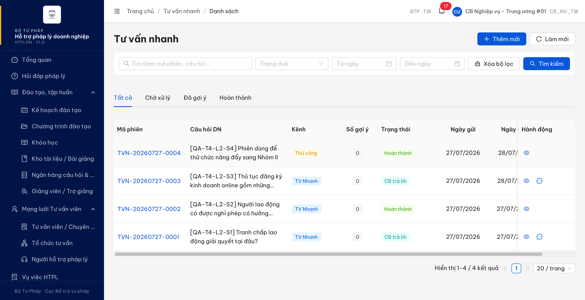

```
// Đo lại 28/07/2026 — bấm [Chọn] ở kết quả tra cứu có câu trả lời dài (QA-20260707-0001)
soKyTuTrongO = 5007 · boDem = "5007 / 5000"
canhBao      = "Nội dung trả lời vượt quá 5000 ký tự. Vui lòng rút gọn trước khi gửi."
nut "Gửi trả lời" .disabled = true → bấm KHÔNG ăn (công cụ báo phần tử không tương tác được)
SO_REQUEST = 0 · SO_KHUNG_THONG_BAO = 0        ⇒ không gửi được nữa

// Đối chứng (để loại trừ "nút hỏng luôn"): bấm [Chọn] ở kết quả ngắn QA-20260706-0001
soKyTuTrongO = 65 · boDem = "65 / 5000" · canhBao = (không có) · .disabled = false
Bấm gửi → SO_REQUEST = 1 · SO_KHUNG_THONG_BAO = 1 · chữ: "Gửi trả lời thành công"
(bộ đo tự kiểm: 1 observer ở cả 2 lần đo)
```

**2. Đọc DOM + kiểm máy chủ** *(phụ trợ)*

```
// Sau khi bấm [Chọn] ở kết quả tra cứu
soKyTuTrongO = 5007 · boDem.text = "5007 / 5000" · boDem có class cảnh báo (đỏ)
nut "Gửi trả lời" .disabled = false   → bấm gửi: 200, lưu thành công

// Máy chủ có áp giới hạn không?
POST /api/v1/tu-van-nhanhs/{id}/tra-loi  body.noiDungTraLoi = "X" * 5005   [200]
GET  /api/v1/tu-van-nhanhs/{id}  → noiDungTraLoi.length = 5005   // ❗ không bị chặn
```

---

## ~~BUG-PD-THONG-BAO~~ [CLOSED] — Duyệt, từ chối và duyệt hàng loạt câu hỏi đều không gửi thông báo cho cán bộ tạo

> **Re-test:** 2026-07-28 11:44:52 R2 — ✅ PASS (Closed-verified). Re-verify 28/07/2026: cả 3 thao tác (duyệt đơn lẻ QA-20260728-0001, từ chối QA-20260728-0003, duyệt hàng loạt QA-20260728-0004+0005) đều sinh thông báo cho cán bộ tạo — khay chuông của cbnv_tw_01 hiện đủ 4 mục entityType KHO_CAU_HOI, thông báo từ chối kèm nguyên văn lý do; email tương ứng cũng về đủ.

### Mô tả

Ở màn **Phê duyệt câu hỏi** (`/tv-nhanh/kho-cau-hoi`, tab **Chờ duyệt**, role `CB_PD_TW`), cả **3 thao tác phê duyệt** — Duyệt đơn lẻ, Từ chối, Duyệt hàng loạt — đều hoàn tất đúng về mặt dữ liệu nhưng **không sinh bất kỳ thông báo nào** cho cán bộ nghiệp vụ đã tạo câu hỏi.

`srs-fr-13-tv-nhanh.md:540` định nghĩa hành động phê duyệt gồm **3 vế**, trong đó vế thứ ba là gửi thông báo. Hai vế đầu (đặt trạng thái, bật hiệu lực / lưu lý do) chạy đúng; **riêng vế thông báo không chạy ở cả 3 thao tác**.

Đây là một lỗi gốc chung cho 3 case của đối tác (`PDNDCHTV_01`, `PDNDCHTV_04`, `PDNDCHTV_07`) nên gộp thành một bug để dev sửa một lần.

Hệ quả nghiệp vụ: cán bộ nghiệp vụ không biết câu hỏi của mình đã được duyệt hay bị trả về, cũng không biết lý do trả về — dù lý do đã được lưu trong dữ liệu. Vòng phản hồi giữa người tạo và người duyệt bị đứt hoàn toàn.

### Các bước tái hiện

1. Đăng nhập `cbnv_tw` ("CB Nghiệp vụ - Trung ương", BTP · TW) — đây là **người tạo câu hỏi** và cũng là tài khoản dùng để kiểm thông báo. Tạo 4 câu hỏi và gửi duyệt (`QA-20260727-0001` … `QA-20260727-0004`, đều ở `CHO_DUYET`).
2. Ghi nhận **mốc đối chiếu**: mở `GET /api/v1/thong-baos` của `cbnv_tw` → đếm tổng số thông báo hiện có.
3. Đăng nhập `cbpd_tw` ("CB Phê duyệt - Trung ương", BTP · TW) ở phiên riêng, vào **Kho câu hỏi → tab Chờ duyệt**.
4. **Duyệt đơn lẻ:** bấm nút **Duyệt** trên dòng `QA-20260727-0001` → hộp thoại "Bạn xác nhận phê duyệt câu hỏi?" → bấm **[Duyệt]**.
5. **Từ chối:** bấm nút **Từ chối** trên dòng `QA-20260727-0002` → nhập **Lý do từ chối** → bấm **[Từ chối]**.
6. **Duyệt hàng loạt:** tích chọn `QA-20260727-0003` + `QA-20260727-0004` → bấm **[Duyệt hàng loạt]** → hộp thoại xác nhận → bấm **[Duyệt]**.
7. Quay về phiên `cbnv_tw`, mở biểu tượng **Thông báo** trên thanh trên cùng và đếm lại `GET /api/v1/thong-baos` → so với mốc ở bước 2.

### Kết quả mong đợi

- `srs-fr-13-tv-nhanh.md:540` — §3 SCR-X2-01, dòng 10 "Duyet don le": *"Tab \"Cho duyet\": [Duyet] SET DA_DUYET + hieu_luc=1 + **TB CB NV**. [Tu choi] modal ly do bat buoc + SET NHAP + **TB CB NV**"*.
  ⇒ Sau khi duyệt, cán bộ nghiệp vụ đã tạo câu hỏi phải nhận được thông báo về việc câu hỏi được duyệt.
  ⇒ Sau khi từ chối, cán bộ đó phải nhận được thông báo về việc câu hỏi bị trả về, kèm lý do đã nhập.
- `srs-fr-13-tv-nhanh.md:541` — dòng 11 "Duyet hang loat": *"[Duyet hang loat] -> modal xac nhan. Khong tu choi hang loat"*. Dòng này mô tả hành vi của nút, **không định nghĩa lại** hành động Duyệt. Duyệt hàng loạt tạo ra đúng cùng chuyển trạng thái `CHO_DUYET → DA_DUYET` như duyệt đơn lẻ ⇒ áp dụng cùng nghĩa vụ thông báo ở `:540`, tức mỗi cán bộ tạo của từng câu hỏi trong lô đều phải nhận được thông báo.
- Quy trình xử lý `srs-fr-13-tv-nhanh.md:95-163` (FR-X.2-01, 7 bước) không có câu nào miễn trừ nghĩa vụ thông báo cho thao tác hàng loạt.

### Kết quả thực tế

- **Tổng số thông báo của cán bộ tạo không đổi qua cả 3 thao tác: 253 → 253, chênh lệch 0.**

  | Thao tác | Thời điểm | Bản ghi | Kết quả dữ liệu | Thông báo sinh ra |
  |---|---|---|---|:-:|
  | Duyệt đơn lẻ | 05:47:16 | `QA-20260727-0001` | `DA_DUYET` + `hieuLuc: true` ✅ | **0** |
  | Từ chối | 05:49:57 | `QA-20260727-0002` | `NHAP` + `ghiChuPheDuyet` lưu đủ lý do ✅ | **0** |
  | Duyệt hàng loạt | 05:53:24 | `QA-20260727-0003` + `0004` | cả 2 `DA_DUYET` ✅ | **0** |

- Đo lại lúc 05:53:58 (chờ thêm 34 giây sau thao tác cuối, phòng trường hợp gửi bất đồng bộ): `total = 253`, thông báo mới nhất vẫn là `2026-07-27T05:43:25` — **cũ hơn cả 3 thao tác**; `unread-count = 252` không đổi; **0** bản ghi nhắc tới bất kỳ mã `QA-20260727-0001…0004` nào.
- **Đối chứng dương loại trừ "hệ thống thông báo hỏng chung"** — đây là dữ liệu khoanh vùng lỗi cho dev. Rà toàn bộ 253 thông báo hiện có của **chính tài khoản này**, thông báo loại `PHE_DUYET` vẫn về đều từ 8 nhóm chức năng khác:

  `HOI_DAP` (25) · `DANG_KY_DAO_TAO` (12) · `VU_VIEC` (4) · `CHUONG_TRINH_HTPL` (3) · `KE_HOACH_DANH_GIA` (2) · `NOI_DUNG_TU_VAN_CS` (1) · `KHOA_HOC` (1) · `DE_XUAT_DAO_TAO` (1)

  Riêng `entityType = KHO_CAU_HOI`: **0 bản ghi, chưa từng có mục nào trong toàn bộ lịch sử 253 thông báo.**
  ⇒ Đường truyền thông báo và tài khoản đều bình thường; chỉ chức năng phê duyệt Kho câu hỏi chưa gắn bước gửi thông báo.
- **Đã loại trừ khả năng "thông báo có gửi nhưng gửi cho người khác":** cả 4 câu hỏi đều có `nguoiTaoId = f2e93500-f6dd-4660-a3f6-de7326acffd1` = chính tài khoản `cbnv_tw` đang kiểm thông báo (xác minh bằng `GET /api/v1/auth/me`).
- **Phần chạy đúng, đề nghị dev không sửa nhầm phạm vi:** trạng thái, hiệu lực, lưu vết người duyệt / thời điểm duyệt, hộp thoại lý do từ chối bắt buộc, không có từ chối hàng loạt, và duyệt hàng loạt chỉ tốn 1 lần gọi xử lý cho cả lô — tất cả đều đúng đặc tả.

### Bằng chứng

**1. Ảnh chụp**

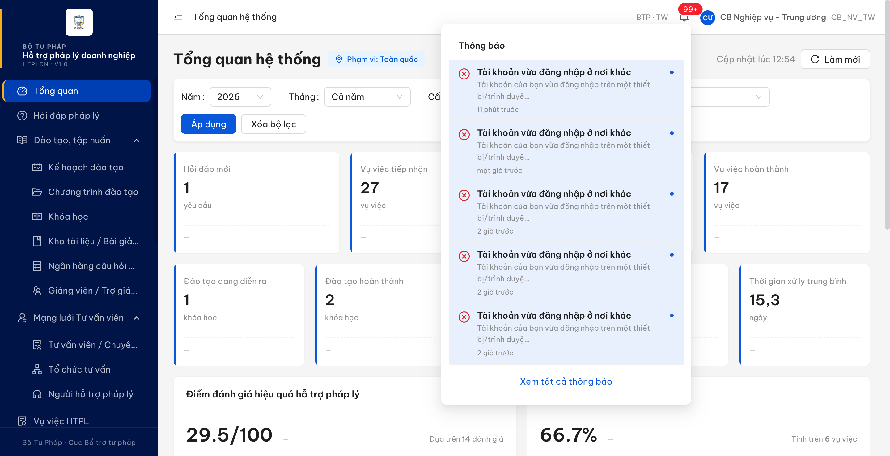

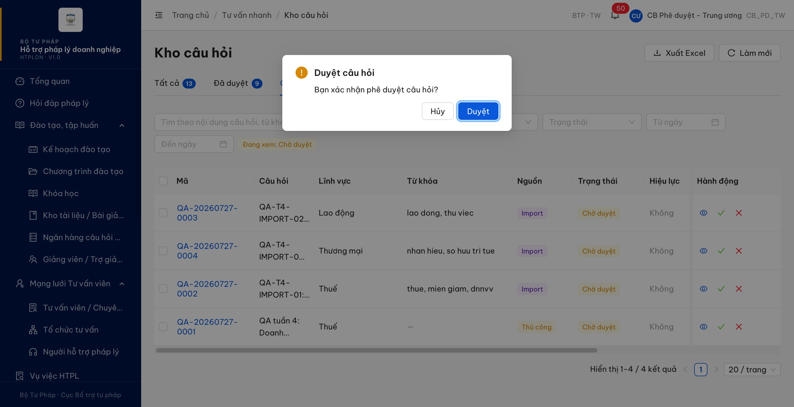

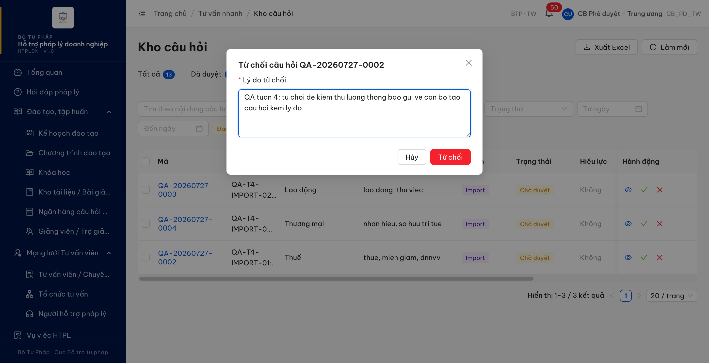

![BUG-PD-THONG-BAO — Đã chọn 2 câu hỏi, hiện nút [Duyệt hàng loạt]; không có nút từ chối hàng loạt](image/BUG-PD-07-duyet-hang-loat-truoc-khi-bam.png)

*Ảnh re-verify R2 (28/07/2026):*

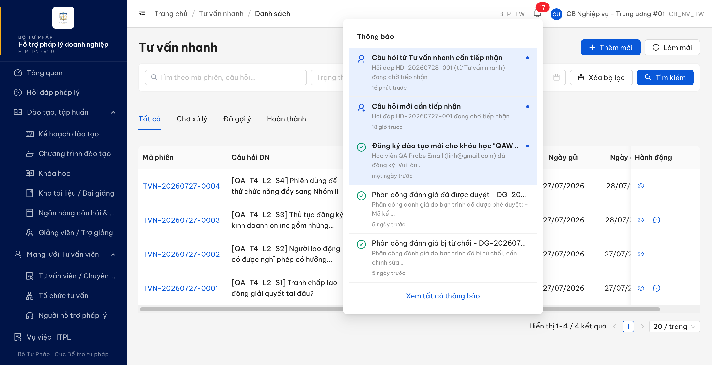

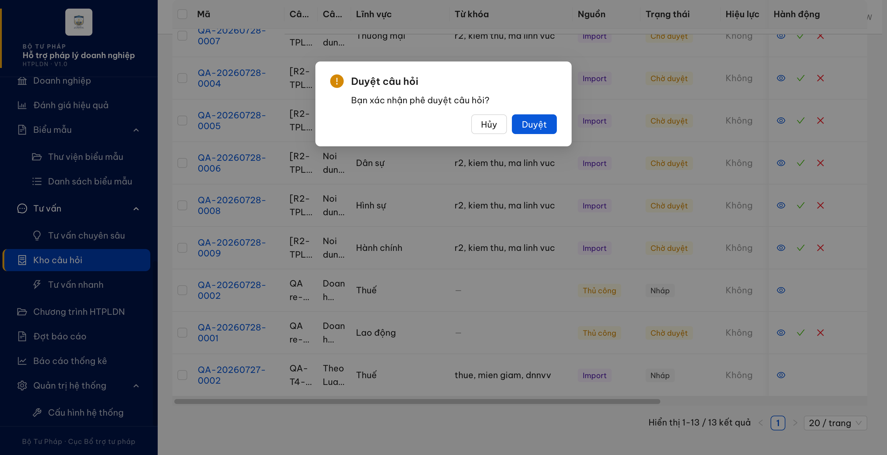

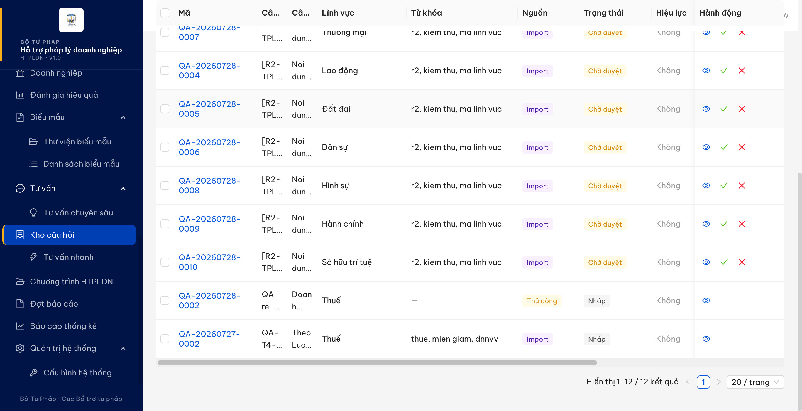

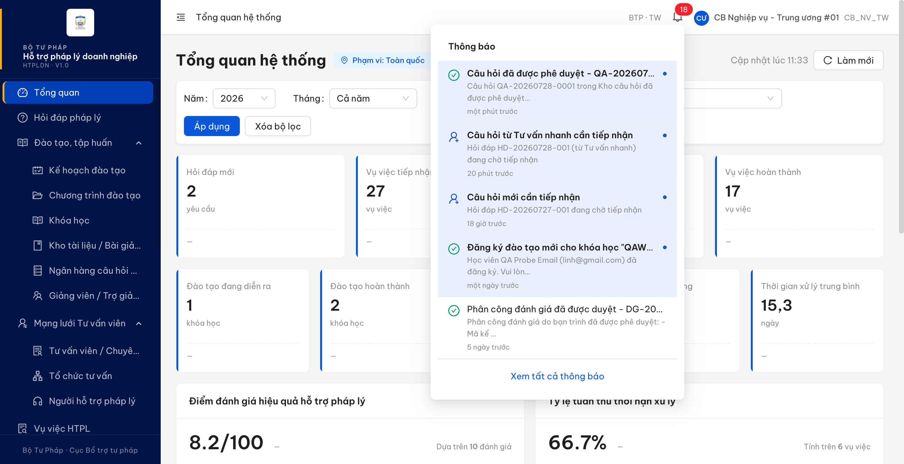

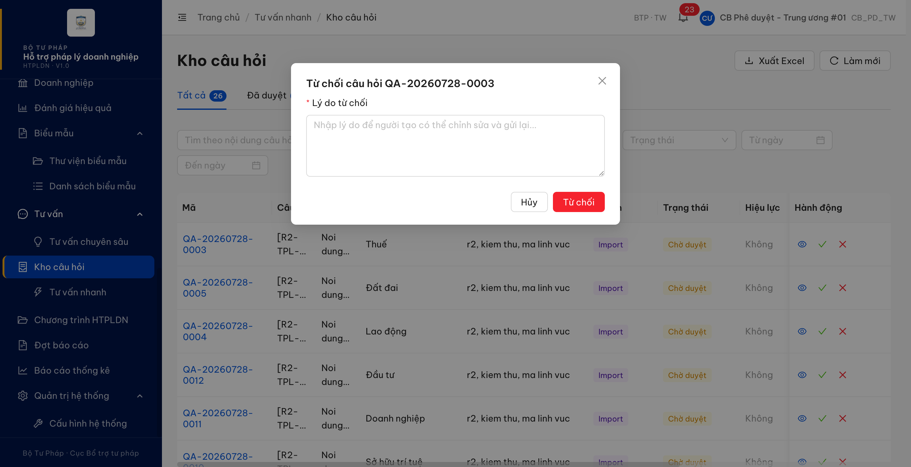

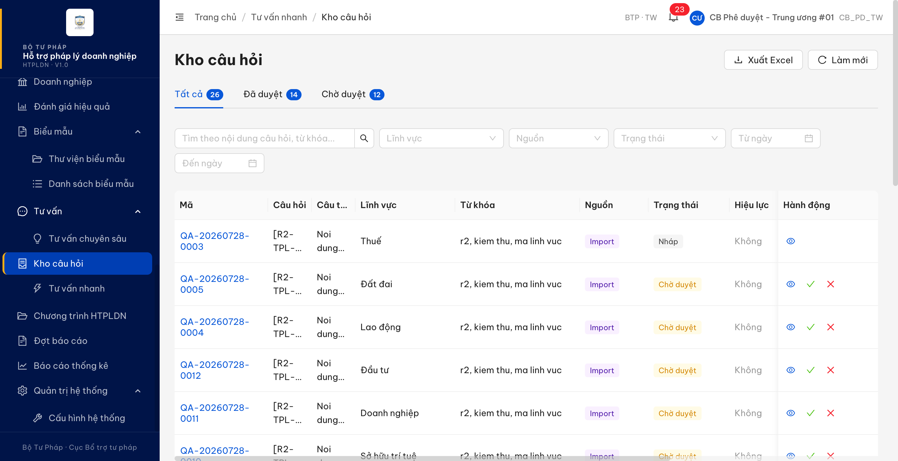

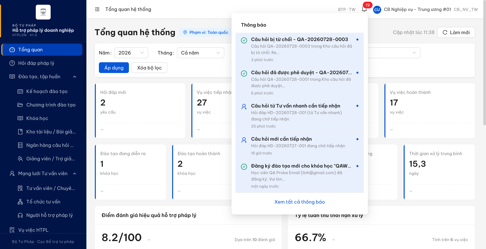

![R2 — Đã chọn 2 câu hỏi (QA-20260728-0004 + 0005), hiện nút [Duyệt hàng loạt]; không có nút từ chối hàng loạt](image/R2-BUG-PD-THONG-BAO-07-chon-2-cau-hoi-duyet-hang-loat.png)

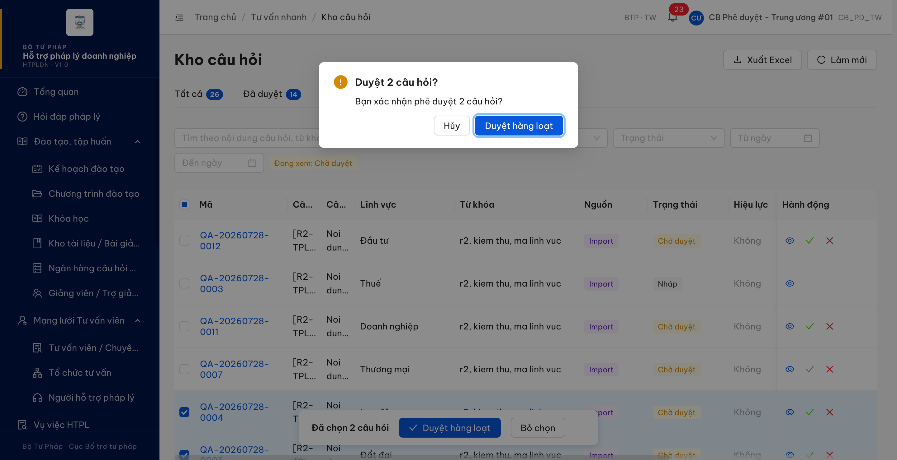

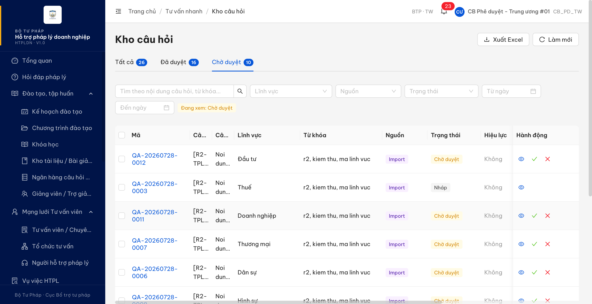

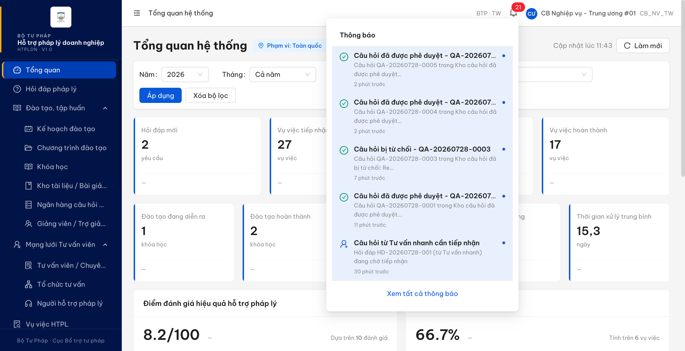

**2. Đo tầng dữ liệu** *(phép thử quyết định)*

```
// Moc doi chieu TRUOC thao tac (tai khoan cbnv_tw = nguoi tao ca 4 cau hoi)
GET /api/v1/thong-baos?page=1&pageSize=100   → total = 253
   quet du 3 trang (253/253 ban ghi) → entityType=KHO_CAU_HOI xuat hien 0 lan

// 3 thao tac phe duyet (tai khoan cbpd_tw)
POST /api/v1/kho-cau-hois/{id-0001}/approve   [200]  05:47:16  → DA_DUYET, hieuLuc=true
POST /api/v1/kho-cau-hois/{id-0002}/reject    [200]  05:49:57  → NHAP, ghiChuPheDuyet="Noi dung cau hoi chua ro rang..."
POST /api/v1/kho-cau-hois/approve-bulk        [200]  05:53:24  → 0003 + 0004 deu DA_DUYET

// Do lai SAU ca 3 thao tac (05:53:58 — cho them 34 giay)
GET /api/v1/thong-baos            → total = 253          // ❗ delta = 0
   moi nhat: 2026-07-27T05:43:25  // cu hon ca 3 thao tac
GET /api/v1/thong-baos/unread-count → 252                // khong doi
   so ban ghi nhac QA-20260727-0001..0004 → 0

// Doi chung duong: cung tai khoan nay VAN nhan PHE_DUYET tu 8 entity khac
HOI_DAP 25 · DANG_KY_DAO_TAO 12 · VU_VIEC 4 · CHUONG_TRINH_HTPL 3
KE_HOACH_DANH_GIA 2 · NOI_DUNG_TU_VAN_CS 1 · KHOA_HOC 1 · DE_XUAT_DAO_TAO 1
KHO_CAU_HOI 0    // ❗ chi rieng nhom nay im lang
```

---

## ~~BUG-CK-MODAL-THIEU-ANH-TEP~~ [CLOSED] — Hộp thoại xác nhận Công khai chỉ hiện "Mô tả công khai", thiếu ảnh đại diện và tệp đính kèm sắp công khai

> **Re-test:** 2026-07-29 16:55:00 R4 — ✅ PASS (Closed-verified). Dựng bản ghi mới QA-20260729-0002 (ảnh anh-dai-dien-R4.png + tệp tai-lieu-cong-khai-R4.pdf) rồi chạy trọn luồng: hộp thoại nay hiện đủ 3 hạng mục, tên tệp đúng tên thật kèm ảnh xem trước, bấm [Xem] không còn văng 403 và hộp thoại vẫn giữ, xác nhận xong trạng thái đổi sang Công khai. Bản ghi cũ QA-20260727-0005 / QA-20260728-0013 cũng đã hiện đúng tên tệp.

### Mô tả

Ở màn **Kho câu hỏi** (`/tv-nhanh/kho-cau-hoi`), mở chi tiết một câu hỏi đã duyệt rồi bấm **[Công khai]** — hộp thoại xác nhận hiện lên chỉ gồm khối thông tin nền xanh, ô **"Mô tả công khai"** và 2 nút [Hủy] [Công khai].

`srs-fr-13-tv-nhanh.md:542` yêu cầu hộp thoại này hiển thị **cả 3** thứ sắp được đưa lên Cổng Pháp luật quốc gia: ảnh đại diện, mô tả công khai, tệp đính kèm công khai. Hệ thống chỉ hiện **1 trong 3**.

Đã loại trừ giả thuyết "ẩn vì bản ghi chưa có ảnh/tệp": QA tự tạo bản ghi `QA-20260727-0005` có đủ ảnh đại diện và tệp đính kèm rồi mở lại hộp thoại — vẫn không hiện.

Hệ quả nghiệp vụ: đây là chốt kiểm soát cuối trước khi nội dung ra Cổng PLQG. Cán bộ không nhìn thấy ảnh và tệp sắp công khai thì không phát hiện được ảnh/tệp gắn nhầm trước khi đưa ra ngoài.

> **Đính chính một ý trong phiếu test (để dev không tìm nhầm lỗi):** phiếu ghi *"Hệ thống không hiển thị các trường thông tin cho phép NSD bổ sung mô tả hiển thị trên chuyên trang"*. Ý này **không đúng** — ô "Mô tả công khai" có thật, nhập được, tối đa 2000 ký tự; chính ảnh đối tác gửi kèm cũng cho thấy ô đó đang hiện với nội dung 56/2000. Lỗi thật nằm ở **ảnh đại diện** và **tệp đính kèm**.

### Các bước tái hiện

1. Đăng nhập role **`CB_NV_TW`** (tài khoản `cbnv_tw`, "CB Nghiệp vụ - Trung ương", đơn vị BTP · TW) — đúng tác nhân `srs-fr-13-tv-nhanh.md:444` *"Tác nhân: Cán bộ Nghiệp vụ (TW/BN/ĐP)"*.
2. Vào menu **Tư vấn → Kho câu hỏi**.
3. Mở chi tiết một câu hỏi đang ở trạng thái **"Đã duyệt"**, cờ công khai **"Chưa công khai"** (thoả điều kiện tiên quyết `:447`).
4. Bấm **[Công khai]** ở góc phải trên panel chi tiết.
5. Đọc nội dung hộp thoại xác nhận.
6. **(phép thử quyết định)** Lặp lại bước 1–5 với một câu hỏi **đã có sẵn ảnh đại diện và tệp đính kèm**. Cách dựng: form **[Thêm câu hỏi]** → tải lên 1 ảnh `.png` + 1 tệp `.pdf` + nhập mô tả công khai → **[Lưu]** → nhờ tài khoản `cbpd_tw` duyệt → mở chi tiết → **[Công khai]**.

### Kết quả mong đợi

- `srs-fr-13-tv-nhanh.md:542` — §3 SCR-X2-01, dòng 12 "Hanh dong Cong khai / Huy cong khai (FR-X.2-06)": *"Click [Cong khai] -> modal xac nhan + **hien thi anh dai dien / mo ta cong khai / file dinh kem cong khai sap cong khai**; xac nhan -> SET cong_khai = 1 + trang_thai = CONG_KHAI + thoi_gian_dang_tai = thoi diem hien tai (BR-PUBLIC-03)"*.
  ⇒ Hộp thoại phải cho cán bộ soát được **cả 3** hạng mục trước khi xác nhận.
- `srs-fr-13-tv-nhanh.md:466` — Processing Công khai, bước 3: *"Lưu nội dung công khai: **ảnh đại diện + mô tả công khai + file đính kèm công khai**"* ⇒ cả 3 đều là nội dung sẽ đăng lên Cổng PLQG.
- Ba trường này là thuộc tính có thật của entity: `:105` `anh_dai_dien` *"jpg/png/gif, max 5MB; mặc định ảnh hệ thống"* · `:106` `mo_ta_cong_khai` *"mô tả hiển thị trên Cổng PLQG"* · `:107` `file_dinh_kem_cong_khai` *"PDF/DOC/DOCX/XLS/XLSX, max 20MB/file, nhiều file"*.

### Kết quả thực tế

- Hộp thoại chỉ có **1 nhãn duy nhất: "Mô tả công khai"**. Đo bằng mã lệnh: `số thẻ ảnh = 0`, `số khối tải tệp = 0`, `số ô chọn tệp = 0`, `số liên kết = 0`; chữ trong hộp thoại **không chứa** cụm "ảnh đại diện" và "đính kèm".
- **Lặp lại với bản ghi đã có đủ dữ liệu — kết quả không đổi.** `QA-20260727-0005` có `anhDaiDien = {fileId: 743d5cfc-…}`, `fileDinhKemCongKhai = [{fileId: 8ae94569-…}]`, `moTaCongKhai` 110 ký tự. Hộp thoại vẫn chỉ hiện ô "Mô tả công khai" (110/2000). ⇒ Không phải ẩn vì rỗng; giao diện **không dựng** 2 phần này.
- **Ba trường ĐÃ được dựng ở nơi khác** — nên đây là lỗi thiếu hiển thị, không phải tính năng chưa làm: form "Thêm câu hỏi" có đủ **Ảnh đại diện công khai** (kèm nút "Dùng ảnh hệ thống mặc định", ghi chú `.jpg, .png, .gif`, tối đa 1 tệp ≤5MB), **Mô tả công khai**, **Tệp đính kèm công khai** (tối đa 10 tệp `.pdf, .doc, .docx, .xls, .xlsx`, ≤20MB/tệp) — khớp đúng `:105-107`.
- **Phần nghiệp vụ chạy đúng, đề nghị dev không sửa nhầm phạm vi:** bấm [Công khai] → 1 lần gọi `POST /api/v1/kho-cau-hois/{id}/cong-khai`, 1 khung thông báo "Đã công khai câu hỏi", không lặp (bộ bắt thông báo dùng chung, tự kiểm `soObserverDangSong = 1`). Đọc lại bản ghi: `trangThai = CONG_KHAI`, `congKhai = true`, `thoiGianDangTai = 2026-07-27T06:14:49.373Z` — khớp `:464` (bước 4, BR-PUBLIC-03).

#### Đo lại 28/07/2026 (R2) — vai trò `CB_NV_TW` (`cbnv_tw_01`), bản ghi `QA-20260728-0013`

**✅ Phần đã sửa được — đúng yêu cầu `:542` về nội dung hộp thoại:**

- Hộp thoại "Công khai câu hỏi QA-20260728-0013" nay có **đủ 3 nhãn**: `["Ảnh đại diện công khai", "Mô tả công khai", "Tệp đính kèm công khai"]` (trước chỉ 1). Đo DOM: `số khối tải tệp = 4`, `số ô chọn tệp = 2`, chữ trong hộp thoại **có chứa** cả "ảnh đại diện" lẫn "đính kèm".
- Có thêm khối chỉ dẫn *"Câu hỏi sẽ được đánh dấu công khai — Ảnh đại diện, mô tả công khai và tệp đính kèm dưới đây sẽ được công khai trên Cổng PLQG"*.
- Thao tác nghiệp vụ vẫn đúng: bấm [Công khai] → **1 request** `POST /api/v1/kho-cau-hois/{id}/cong-khai` [200] · **1 khung thông báo** "Đã công khai câu hỏi" (tự kiểm `soObserverDangSong = 1`, không lặp). Dòng trong bảng chuyển `Trạng thái = Công khai`, cột `Công khai = Công khai`.

**❌ Lỗi mới phát sinh trong chính luồng Công khai (chưa từng có ở lần đo 27/07 vì hộp thoại khi đó không dựng 2 phần này):**

1. **Tên tệp/tên ảnh hiển thị thành chuỗi định danh thô, không phải tên tệp người dùng tải lên.** Hộp thoại hiện `0ed17a7a-08e1-4938-b817-2e0ed4053de2` (ảnh đại diện) và `07322b8c-484a-4a4c-b239-0cbf2cd5df73` (tệp đính kèm). **Phép thử quyết định:** QA tải lên tệp đặt tên rõ ràng `tai-lieu-cong-khai-R2.pdf` ngay trong hộp thoại — lúc chưa lưu thì hiện đúng `tai-lieu-cong-khai-R2.pdf (408 B)`; sau khi bấm [Công khai] rồi mở lại hộp thoại thì **chính tệp đó hiện thành `9cc6c71b-80dc-4c77-810c-7db676a0ae9f`**. ⇒ Tên gốc mất khi đọc lại bản ghi, cán bộ duyệt không biết mình sắp công khai tệp nào.
2. **Bấm [Xem] làm cả màn hình nhảy sang trang báo không có quyền, mất hộp thoại đang dở.** Tái hiện với **cả** [Xem] của ảnh đại diện lẫn [Xem] của tệp đính kèm: `GET /api/v1/files/{fileId}/download` trả **403**, cả tab chuyển sang `/403` — *"Tệp chưa gắn với đối tượng — bản ghi cũ, cần backfill · Mã lỗi: ERR-PERM-FILE-03 · Vai trò hiện tại: CB_NV_TW"*. Xảy ra cả với tệp **vừa được chính cán bộ đó tải lên vài phút trước**, nên thông điệp "bản ghi cũ" không khớp thực tế. Phiên đăng nhập không mất, nhưng hộp thoại và các thay đổi chưa lưu thì mất.
3. **Mục "Ảnh đại diện công khai" không có ảnh xem trước** (`số thẻ ảnh = 0`) — chỉ có một dòng chữ định danh. Cộng với ý (2), cán bộ **không có đường nào** nhìn thấy ảnh sắp đăng lên Cổng PLQG trước khi xác nhận, tức mục tiêu "soát trước khi công khai" của `:542` vẫn chưa đạt.

#### Đo lại 29/07/2026 (R3) — vai trò `CB_NV_TW` (`cbnv_tw_01`), bản ghi MỚI `QA-20260729-0001`

**Cách dựng dữ liệu (chạy trọn luồng, không đo trên bản ghi cũ):** form [Thêm câu hỏi] → tải lên ảnh `anh-dai-dien-R3.png` (225 B) + tệp `tai-lieu-cong-khai-R3.pdf` (395 B) + nhập mô tả công khai → [Gửi duyệt] → đăng nhập `cbpd_tw_01` duyệt (trạng thái sang *Đã duyệt*) → quay lại `cbnv_tw_01` mở chi tiết → [Công khai].
⇒ Toàn bộ tệp được tạo trong ngày 29/07, **loại trừ hoàn toàn giả thuyết "bản ghi cũ chưa backfill"** mà chính thông báo lỗi của hệ thống đang viện dẫn.

**✅ Giữ được phần đã sửa ở R2:** hộp thoại đủ 3 nhãn `["Ảnh đại diện công khai", "Mô tả công khai", "Tệp đính kèm công khai"]` + khối chỉ dẫn Cổng PLQG. Luồng nghiệp vụ chạy tới cùng: bấm [Công khai] → **1 khung thông báo** *"Đã công khai câu hỏi"* (bộ bắt thông báo không lọc trùng, đếm được đúng 1), dòng trong bảng chuyển `Trạng thái = Công khai`, `Công khai = Công khai`.

**❌ Cả 3 lỗi của R2 tái hiện nguyên vẹn trên dữ liệu mới:**

1. **Tên tệp vẫn là chuỗi định danh thô.** Lúc chưa lưu, form hiện đúng `anh-dai-dien-R3.png (225 B)` và `tai-lieu-cong-khai-R3.pdf (395 B)`; sau khi lưu, hộp thoại Công khai hiện `e01b5447-4a34-41f9-831d-8f7353570bf3` (ảnh) và `cbb91a0e-6fba-4664-a036-c9898aed7a03` (tệp). Tên gốc vẫn mất khi đọc lại bản ghi.
2. **Bấm [Xem] vẫn nhảy sang trang 403.** Cả tab chuyển sang `/403` — *"Tệp chưa gắn với đối tượng — bản ghi cũ, cần backfill · Mã lỗi: ERR-PERM-FILE-03 · Vai trò hiện tại: CB_NV_TW"* — trên tệp **vừa tải lên vài phút trước**, nên câu "bản ghi cũ" không phản ánh đúng tình huống. Hộp thoại đang dở bị mất.
3. **Vẫn không có ảnh xem trước** (`số thẻ ảnh = 0` trong hộp thoại). Cộng với ý (2), cán bộ vẫn không có đường nào nhìn thấy ảnh sắp đăng lên Cổng PLQG.

### Bằng chứng

**1. Ảnh chụp**

![BUG-CK-MODAL-THIEU-ANH-TEP — Hộp thoại "Công khai câu hỏi QA-20260727-0001": chỉ có khối thông tin + ô "Mô tả công khai" + [Hủy] [Công khai]](image/BUG-CK-modal-cong-khai-thieu-anh-va-tep.png)

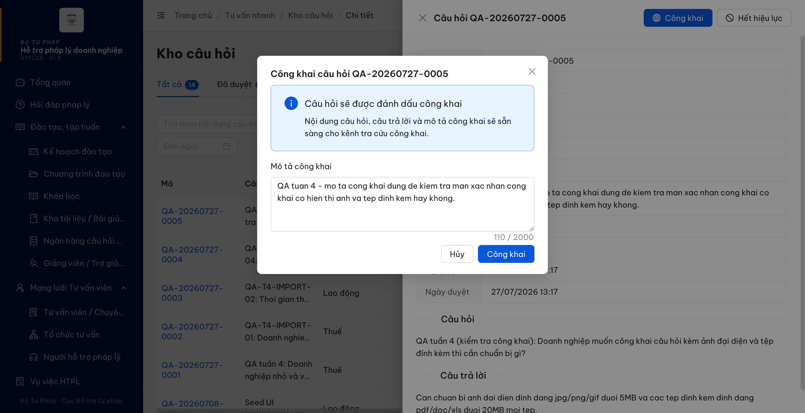

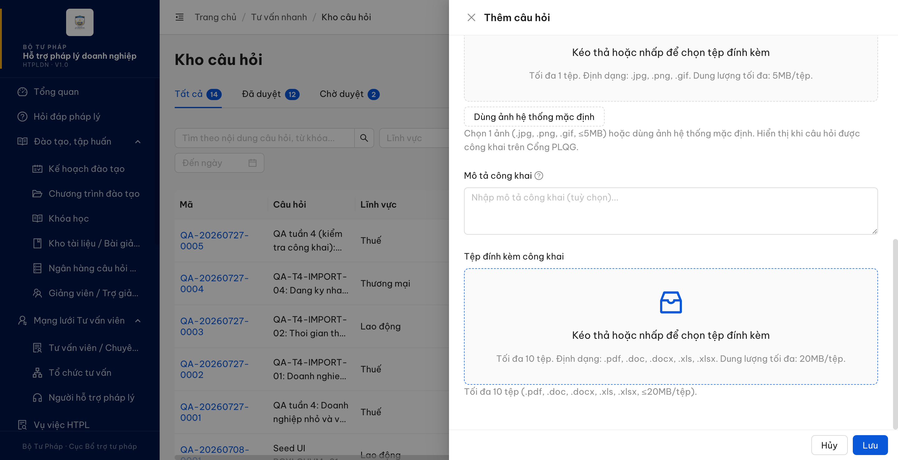

**1b. Ảnh chụp đo lại 28/07/2026 (R2)**

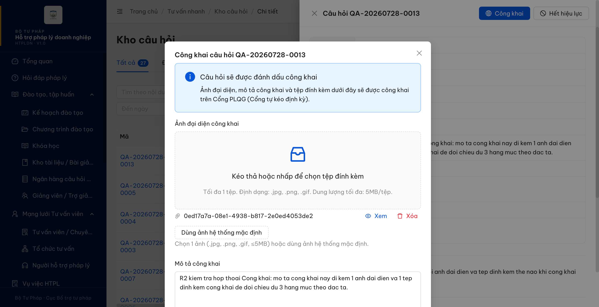


![R2 — Bấm [Xem] trong hộp thoại: cả màn hình nhảy sang trang 403 "Tệp chưa gắn với đối tượng — bản ghi cũ, cần backfill" (ERR-PERM-FILE-03), hộp thoại biến mất](image/R2-BUG-CK-MODAL-THIEU-ANH-TEP-R2-bam-xem-vang-403.png)


**1c. Ảnh chụp đo lại 29/07/2026 (R3) — bản ghi mới `QA-20260729-0001`**


![R3 — Bấm [Xem] trên tệp vừa tải lên vài phút trước: vẫn nhảy sang trang 403 "Tệp chưa gắn với đối tượng — bản ghi cũ, cần backfill" (ERR-PERM-FILE-03)](image/R3-BUG-CK-MODAL-bam-xem-van-403.png)

**2. Đo DOM + tầng dữ liệu** *(phụ trợ)*

```
// Do noi dung hop thoai Cong khai (ca 2 lan)
nhan            = ["Mô tả công khai"]      // ❗ chi 1/3 hang muc
soTheAnh        = 0
soKhoiTaiTep    = 0
soOChonTep      = 0
soLienKet       = 0
coChu "anh dai dien" = false
coChu "dinh kem"     = false

// Ban ghi dung o lan do thu 2 — DA CO du du lieu
GET /api/v1/kho-cau-hois/fad1c39b-...  →
   anhDaiDien           = {fileId: "743d5cfc-1e7b-411f-a537-f6b384fa257b"}
   fileDinhKemCongKhai  = [{fileId: "8ae94569-db6e-4c30-8189-dd94166100ec"}]
   moTaCongKhai         = "QA tuan 4 - mo ta cong khai..." (110 ky tu)
   trangThai            = "DA_DUYET"       // thoa dieu kien :447

// Phan nghiep vu van dung
POST /api/v1/kho-cau-hois/{id}/cong-khai  [200]   1 request · 1 toast · khong lap
GET  /api/v1/kho-cau-hois/{id}  →  trangThai="CONG_KHAI", congKhai=true,
                                   thoiGianDangTai="2026-07-27T06:14:49.373Z"
```

### Kiểm tra lại lượt 4 — 29/07/2026 — ✅ ĐẠT

Lỗi cũ nằm ở **tên tệp đã lưu trong bản ghi**, nên mở lại bản ghi cũ không tách được "đã sửa" với "dữ liệu cũ đóng băng từ trước lúc sửa". Vì vậy lượt này **dựng bản ghi hoàn toàn mới** rồi chạy trọn luồng, không dừng ở chỗ nhìn màn hình.

| | Nội dung |
|---|---|
| Bản ghi mới | `QA-20260729-0002` — lĩnh vực *Thuế*, ảnh `anh-dai-dien-R4.png` (191 B), tệp `tai-lieu-cong-khai-R4.pdf` (407 B), mô tả công khai 133/2000 |
| Luồng chạy | `cbnv_tw_01` [Thêm câu hỏi] → [Gửi duyệt] → `cbpd_tw_01` [Duyệt] → trạng thái *Đã duyệt* → mở chi tiết → [Công khai] |

**Ba hạng mục đặc tả đòi hỏi — nay đủ cả ba:**

| Hạng mục | Lượt 3 | Lượt 4 |
|---|---|---|
| Ảnh đại diện công khai | có mục nhưng tên hiện `e01b5447-…`, không có ảnh xem trước | tên hiện **`anh-dai-dien-R4.png (191 B)`** + **có ảnh xem trước** (đo được 120×60, đúng ảnh đã tải lên) |
| Mô tả công khai | có | có (133/2000) |
| Tệp đính kèm công khai | có mục nhưng tên hiện `cbb91a0e-…` | tên hiện **`tai-lieu-cong-khai-R4.pdf (407 B)`** |

**Nút [Xem] — phần hỏng nặng nhất ở lượt 3 — nay chạy được.** Lượt 3 bấm [Xem] thì cả màn hình nhảy sang trang 403 *"Tệp chưa gắn với đối tượng"* (`ERR-PERM-FILE-03`) và mất luôn hộp thoại. Lượt 4 bấm [Xem] ở **cả hai** hạng mục: không rời trang, hộp thoại vẫn giữ nguyên, không còn chữ 403 nào; ảnh mở được lớp xem trước phóng to, tệp PDF mở liên kết tải về giữ đúng tên `tai-lieu-cong-khai-R4.pdf`.

**Chạy hết luồng, không dừng ở quan sát:** bấm [Công khai] → thông báo *"Đã công khai câu hỏi"*, chỉ gửi **1** lệnh (không lặp), bảng danh sách sau đó ghi `QA-20260729-0002` — *Trạng thái* = **Công khai**, cột *Công khai* = **Công khai**.

**Kiểm thêm dữ liệu cũ:** `QA-20260727-0005` (dựng ở lượt 1) hiện `qa-anh-dai-dien.png (7.7 KB)`, `QA-20260728-0013` (lượt 2) hiện `R2-CK-anh-dai-dien.png (204 B)` — cả hai đều đúng tên thật và tải được ảnh xem trước. Bản ghi cũ **không** bị kẹt chuỗi định danh, nên không phát sinh việc phải làm sạch dữ liệu cũ.

> **Ghi chú tài khoản:** tài khoản `cbpd_tw` đăng nhập trả *"Tên đăng nhập hoặc mật khẩu không đúng"* (`ERR-AUTH-LOGIN-01`). Theo quy tắc đổi tài khoản cùng vai trò và cùng cấp, bước duyệt dùng `cbpd_tw_01` (CB Phê duyệt · Trung ương). Việc đổi này không làm đổi phạm vi dữ liệu của phép thử.

**Bằng chứng lượt 4**

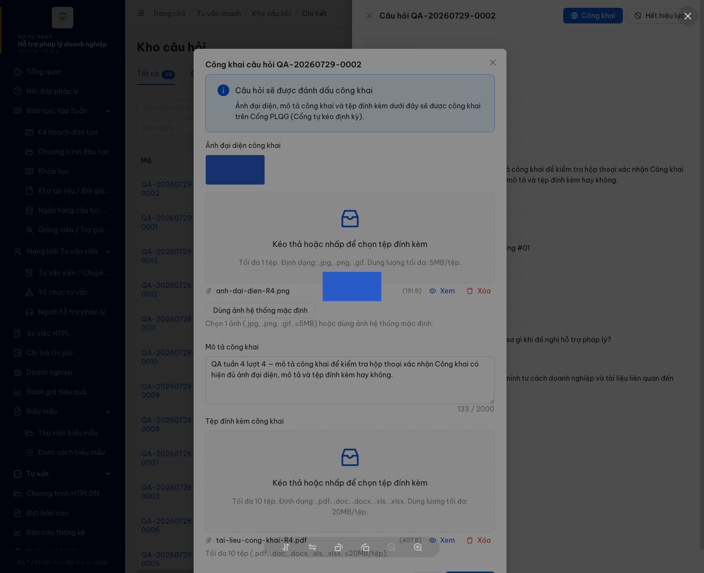

Bản đo đầy đủ (nội dung hộp thoại 2 lượt đối chiếu · kết quả bấm [Xem] · kết quả chạy hết luồng · kiểm dữ liệu cũ): [R4-BUG-CK-MODAL-noi-dung.log.txt](image/R4-BUG-CK-MODAL-noi-dung.log.txt).

---

## ~~BUG-CK-HANH-DONG-DONG~~ [CLOSED] — Cột "Hành động" thiếu nút [Công khai] cho dòng Đã duyệt và [Hủy công khai] cho dòng Công khai

> **Re-test:** 2026-07-28 13:54:50 R2 — ✅ PASS (Closed-verified). Cột Hành động nay hiện [Công khai] trên mọi dòng Đã duyệt và [Hủy công khai] (biểu tượng đỏ) trên dòng Công khai; đã bấm thật cả hai chiều ngay từ danh sách với QA-20260728-0013 và trạng thái đổi đúng.

### Mô tả

Ở bảng **Kho câu hỏi**, cột **"Hành động"** chỉ hiển thị **một biểu tượng con mắt (Xem)** cho mọi dòng ở trạng thái "Đã duyệt" và "Công khai".

`srs-fr-13-tv-nhanh.md:535` quy định cột Hành động gồm *"Xem / Sua / Cong khai / Huy cong khai"*, và `:542` nêu rõ điều kiện hiển thị **trên từng dòng**: trạng thái `DA_DUYET` → hiện [Công khai]; trạng thái `CONG_KHAI` → hiện [Hủy công khai]. Cả hai nút này đều không có.

Đây là bug **QA phát hiện ngoài phiếu đối tác**, thấy khi verify QLCKCHTV_02. Đã mở dòng mới `QLCKCHTV_OOS_04` (row 39) trên sheet.

Nghiệp vụ **không bị chặn** — chức năng vẫn vào được qua màn chi tiết câu hỏi — nên xếp Minor. Nhưng cán bộ phải thêm 2 thao tác cho mỗi câu hỏi cần công khai.

### Các bước tái hiện

1. Đăng nhập role **`CB_NV_TW`** (tài khoản `cbnv_tw`, "CB Nghiệp vụ - Trung ương", đơn vị BTP · TW).
2. Vào menu **Tư vấn → Kho câu hỏi**.
3. Cuộn ngang bảng đến cột cuối cùng **"Hành động"**.
4. Đọc các nút trên dòng đang ở trạng thái **"Đã duyệt"** (vd `QA-20260727-0005`, `QA-20260727-0004`, `QA-20260727-0003`).
5. Đọc các nút trên dòng đang ở trạng thái **"Công khai"** (vd `QA-20260727-0001`).

### Kết quả mong đợi

- `srs-fr-13-tv-nhanh.md:535` — §3 SCR-X2-01, dòng 5 "Bang kho Q&A": *"... / Hieu luc (Toggle) / Diem TB / Ngay tao / **Hanh dong (Xem / Sua / Cong khai / Huy cong khai)**"*.
- `srs-fr-13-tv-nhanh.md:542` — dòng 12: *"**Tren tung dong Q&A: trang_thai = DA_DUYET -> hien nut [Cong khai]; trang_thai = CONG_KHAI -> hien nut [Huy cong khai]**"*.
  ⇒ Cán bộ nghiệp vụ công khai / hủy công khai được ngay từ danh sách, không cần mở màn chi tiết.

### Kết quả thực tế

| Dòng | Trạng thái | Nút thực tế ở cột Hành động | Theo `:542` phải có |
|---|---|---|---|
| `QA-20260727-0005` · `0004` · `0003` | Đã duyệt | chỉ `Xem` | `Xem` + **[Công khai]** |
| `QA-20260727-0001` | Công khai | chỉ `Xem` | `Xem` + **[Hủy công khai]** |
| `QA-20260727-0002` | Nháp (giao diện hiện "Bị từ chối") | `Xem` · `Sửa` · `Xóa` | — |

- **Đối chứng loại trừ "bảng không dựng được nhiều nút":** dòng ở trạng thái Nháp hiện đủ 3 biểu tượng ⇒ cột này hoàn toàn hiển thị được nhiều hành động; vấn đề là **thiếu cấu hình nút theo trạng thái**, không phải giới hạn kỹ thuật.
- Chức năng công khai vẫn dùng được qua đường vòng: mở chi tiết câu hỏi → nút **[Công khai]** ở góc phải trên panel. Đã kiểm chạy đúng (xem BUG-CK-MODAL-THIEU-ANH-TEP).

#### Đo lại 28/07/2026 (R2) — vai trò `CB_NV_TW` (`cbnv_tw_01`) — ✅ đã đạt

| Dòng | Trạng thái | Nút thực tế ở cột Hành động (R2) | Kết luận |
|---|---|---|---|
| `QA-20260728-0013` · `0005` · `0004` · `0001` · `QA-20260727-0005` · `0004` · `0003` · `QA-20260708-0001` · `QA-20260707-0002` (8 dòng) | Đã duyệt | `Xem` + **[Công khai]** (biểu tượng quả cầu xanh, chú thích "Công khai") | ✅ đủ theo `:542` |
| `QA-20260727-0001` | Công khai | `Xem` + **[Hủy công khai]** (biểu tượng quả cầu **đỏ**, chú thích "Hủy công khai") | ✅ đủ theo `:542` |
| `QA-20260728-0003` · `0002` · `QA-20260727-0002` · các dòng Chờ duyệt | Nháp / Chờ duyệt | `Xem` · `Sửa` · `Xóa` | ✅ không đổi |

**Đã bấm thật cả hai chiều ngay từ danh sách (không mở màn chi tiết), bản ghi `QA-20260728-0013`:**

- **[Công khai]** trên dòng *Đã duyệt* → hộp thoại xác nhận → **1 request** `POST /api/v1/kho-cau-hois/{id}/cong-khai` [200] · **1 khung thông báo** "Đã công khai câu hỏi" → dòng đổi `Trạng thái = Công khai`, cột `Công khai = Công khai`, nút chuyển thành quả cầu đỏ.
- **[Hủy công khai]** trên dòng *Công khai* → hộp thoại *"Câu hỏi sẽ được gỡ khỏi trạng thái công khai và quay lại Đã duyệt."* → **1 request** `POST /api/v1/kho-cau-hois/{id}/huy-cong-khai` [200] · **1 khung thông báo** "Đã hủy công khai câu hỏi" → dòng quay về `Đã duyệt / Chưa`, nút chuyển lại quả cầu xanh.
- Bộ bắt thông báo tự kiểm `soObserverDangSong = 1` ở cả hai lượt đo; không có thông báo lặp.

### Bằng chứng

**1. Ảnh chụp**

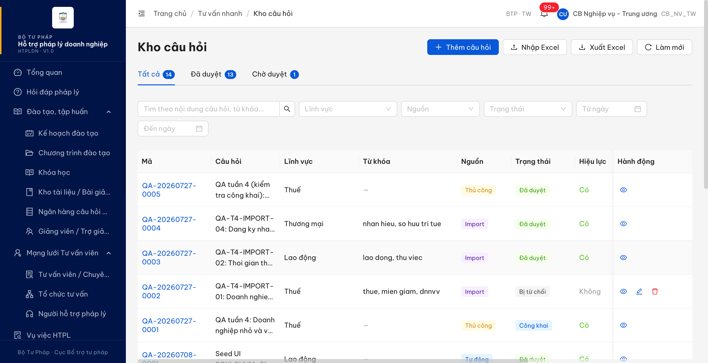

**1b. Ảnh chụp đo lại 28/07/2026 (R2)**

![R2 — Cột Hành động theo trạng thái: dòng Đã duyệt có quả cầu xanh [Công khai], dòng `QA-20260727-0001` trạng thái Công khai có quả cầu đỏ [Hủy công khai], dòng Nháp giữ xem/sửa/xóa](image/R2-BUG-CK-HANH-DONG-DONG-R2-cot-hanh-dong-theo-trang-thai.png)

![R2 — Bấm [Công khai] ngay từ danh sách: `QA-20260728-0013` chuyển sang Trạng thái "Công khai", cột Công khai = "Công khai", nút đổi thành quả cầu đỏ](image/R2-BUG-CK-HANH-DONG-DONG-R2-sau-khi-bam-cong-khai-tu-danh-sach.png)

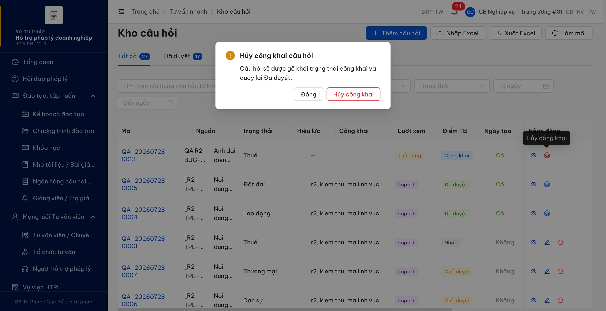


**2. Đo DOM** *(phụ trợ)*

```
// Doc bieu tuong trong cot Hanh dong cua tung dong
QA-20260727-0005  Da duyet  → ["eye"]                      // thieu [Cong khai]
QA-20260727-0004  Da duyet  → ["eye"]                      // thieu [Cong khai]
QA-20260727-0003  Da duyet  → ["eye"]                      // thieu [Cong khai]
QA-20260727-0001  Cong khai → ["eye"]                      // thieu [Huy cong khai]
QA-20260727-0002  Nhap      → ["eye","edit","delete"]      // doi chung: cot dung duoc nhieu nut
```

```
// Doc lai 28/07/2026 (R2) — quet toan bo 20 dong trang 1
QA-20260728-0013  Da duyet  → ["eye","global"]             // [Cong khai]      ✅
QA-20260728-0005  Da duyet  → ["eye","global"]             // [Cong khai]      ✅
QA-20260728-0004  Da duyet  → ["eye","global"]             // [Cong khai]      ✅
QA-20260728-0001  Da duyet  → ["eye","global"]             // [Cong khai]      ✅
QA-20260727-0005  Da duyet  → ["eye","global"]             // [Cong khai]      ✅
QA-20260727-0004  Da duyet  → ["eye","global"]             // [Cong khai]      ✅
QA-20260727-0003  Da duyet  → ["eye","global"]             // [Cong khai]      ✅
QA-20260708-0001  Da duyet  → ["eye","global"]             // [Cong khai]      ✅
QA-20260707-0002  Da duyet  → ["eye","global"]             // [Cong khai]      ✅
QA-20260727-0001  Cong khai → ["eye","global(do)"]         // [Huy cong khai]  ✅
QA-20260728-0003  Nhap      → ["eye","edit","delete(do)"]  // khong doi
QA-20260728-0007  Cho duyet → ["eye","edit","delete(do)"]  // khong doi

// Bam that tu danh sach — QA-20260728-0013
[Cong khai]      → 1 request POST .../cong-khai      [200] · 1 thong bao "Da cong khai cau hoi"
                 → dong: "Cong khai / Cong khai", nut -> global(do)
[Huy cong khai]  → 1 request POST .../huy-cong-khai  [200] · 1 thong bao "Da huy cong khai cau hoi"
                 → dong: "Da duyet / Chua",        nut -> global(xanh)
soObserverDangSong = 1 (ca 2 luot)
```

---

## ~~BUG-TK-TVN-TIM-KIEM~~ [CLOSED] — Ô tìm kiếm màn Tư vấn nhanh trả về rỗng khi nhập mã phiên, từ khóa có dấu hoặc cụm từ nhiều chữ

> **Re-test:** 2026-07-28 14:05:47 R2 — ✅ PASS (Closed-verified). Màn Tư vấn nhanh nay lọc đúng cả 3 nhóm từ khóa bug gốc nêu: mã phiên TVN-20260727-0001 ra 1 kết quả đúng phiên, từ khóa có dấu "động" ra 2, cụm nhiều chữ "lao động" ra 2 và "Thủ tục" ra 1. Đối chứng âm "zzzkhongtontai" ra 0 nên ô tìm kiếm thực sự có lọc; màn Kho câu hỏi không hồi quy (2/27).

### Mô tả

Ô tìm kiếm ở màn **Tư vấn nhanh** ghi rõ placeholder *"Tìm theo mã phiên, câu hỏi..."*, nhưng thực tế **không tìm được theo mã phiên**, và bỏ sót phần lớn từ khóa người dùng gõ theo thói quen tiếng Việt.

Đo trên 4 phiên có sẵn, xác định được **3 nhóm từ khóa luôn trả về rỗng** dù bản ghi khớp đang nằm ngay trên màn hình:

1. **Mã phiên** — đúng thứ placeholder hứa. Gõ nguyên `TVN-20260727-0001` → 0 kết quả, trong khi phiên đó đang hiển thị ở danh sách.
2. **Từ khóa có dấu tiếng Việt** — `động`, `Thủ`, `tục` → 0 kết quả; bỏ dấu thành `dong` thì lại ra 2 kết quả. Người dùng gõ tiếng Việt có dấu là mặc định, nên đây là nhóm ảnh hưởng rộng nhất.
3. **Cụm từ có dấu cách** — `lao động`, `chấp lao`, `Thủ tục` → 0 kết quả, dù `lao` một mình ra 2 kết quả.

Đây đúng là hiện tượng đối tác mô tả ở TKCHTV_01 bước 4: *"Nhập từ khóa có kết quả nhưng hệ thống hiển thị 'Không có phiên tư vấn nhanh nào.'"*

**Đối chứng quan trọng:** cùng hệ thống, cùng phiên đăng nhập, ô tìm kiếm màn **Kho câu hỏi** xử lý đúng cả 3 nhóm trên (`lao động` → 1, `động` → 1, `thử việc` → 1). Vậy không phải hạ tầng thiếu khả năng, mà là một màn đã làm đúng còn màn kia chưa.

### Các bước tái hiện

1. Đăng nhập role **`CB_NV_TW`** (tài khoản `cbnv_tw`, "CB Nghiệp vụ - Trung ương", đơn vị BTP · TW).
2. Vào menu **Tư vấn → Tư vấn nhanh**. Danh sách hiện 4 phiên, trong đó:
   - `TVN-20260727-0001` — câu hỏi *"[QA-T4-L2-S1] Tranh chấp lao động giải quyết tại đâu?"*
   - `TVN-20260727-0003` — câu hỏi *"[QA-T4-L2-S3] Thủ tục đăng ký kinh doanh online gồm những bước nào?"*
3. Gõ vào ô tìm kiếm đúng chuỗi `TVN-20260727-0001` → bấm **[Tìm kiếm]**.
4. Xóa ô tìm kiếm, gõ `Thủ tục` → bấm **[Tìm kiếm]**.
5. Xóa ô tìm kiếm, gõ `lao động` → bấm **[Tìm kiếm]**.
6. Đối chứng: sang **Tư vấn → Kho câu hỏi**, gõ `lao động` → bấm biểu tượng tìm kiếm.

### Kết quả mong đợi

- `srs-fr-13-tv-nhanh.md:574` — §3 SCR-X2-03, dòng 4 "Thanh loc": *"**Tu khoa**. Trang thai SM-TVNHANH. Khoang ngay"* ⇒ màn Tư vấn nhanh phải lọc được theo từ khóa.
- `srs-fr-13-tv-nhanh.md:884` — BR-DATA-08, ô "Ngoại lệ": *"Các entity khác: search by LIKE/index"* ⇒ với entity `TU_VAN_NHANH`, từ khóa được tìm theo kiểu khớp chuỗi. Chuỗi `lao động` là chuỗi con nguyên vẹn của *"Tranh chấp lao động giải quyết tại đâu?"*, nên phải khớp.
- Chữ trên chính giao diện (placeholder *"Tìm theo mã phiên, câu hỏi..."*) là cam kết với người dùng: nhập mã phiên phải ra phiên đó.
- Nói chung: khi tồn tại bản ghi phù hợp với tiêu chí tìm kiếm, hệ thống phải trả bản ghi đó, không phân biệt người dùng gõ có dấu hay không dấu, một chữ hay một cụm.

### Kết quả thực tế

Đo trực tiếp trên máy chủ (cùng phiên đăng nhập, cùng bộ 4 phiên tư vấn):

| Từ khóa gõ vào | Bản ghi đang có khớp | Tư vấn nhanh trả về | Kho câu hỏi trả về (đối chứng) |
|---|---|---|:-:|
| `TVN-20260727-0001` | có — chính là mã phiên đang hiển thị | **0** | — (kho không nhận tìm theo mã) |
| `Thủ tục` | có — `TVN-20260727-0003` mở đầu bằng đúng cụm này | **0** | — |
| `lao động` | có — `TVN-20260727-0001`, `0002` | **0** | **1** ✅ |
| `động` | có — 2 phiên trên | **0** | **1** ✅ |
| `dong` (bỏ dấu) | 2 phiên trên | **2** ✅ | **1** ✅ |
| `lao` | 2 phiên trên | **2** ✅ | **1** ✅ |
| `Tranh` | `TVN-20260727-0001` | **1** ✅ | — |
| `thử việc` / `thu viec` | — | — | **1** / **1** ✅ |
| `hợp đồng` / `hop dong` | — | — | **1** / **1** ✅ |

Đọc bảng theo hàng ngang: **màn Tư vấn nhanh chỉ khớp khi từ khóa là một chữ đơn, không dấu, và nằm ở đầu một từ trong câu hỏi.** Ba điều kiện đó cộng lại thì hầu hết cách gõ tự nhiên của cán bộ đều rơi vào ô rỗng. Cột phải cho thấy màn Kho câu hỏi không có hạn chế nào trong số đó.

Bổ sung: mã phiên hoàn toàn không được đưa vào phạm vi tìm — `TVN` → 0, `20260727` → 0, `0001` → 0. Nghĩa là placeholder đang hứa một khả năng chưa tồn tại.

### Bằng chứng

**1. Ảnh chụp**

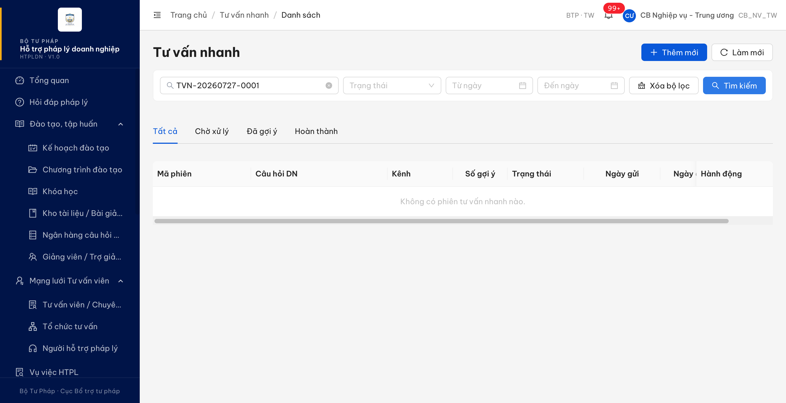

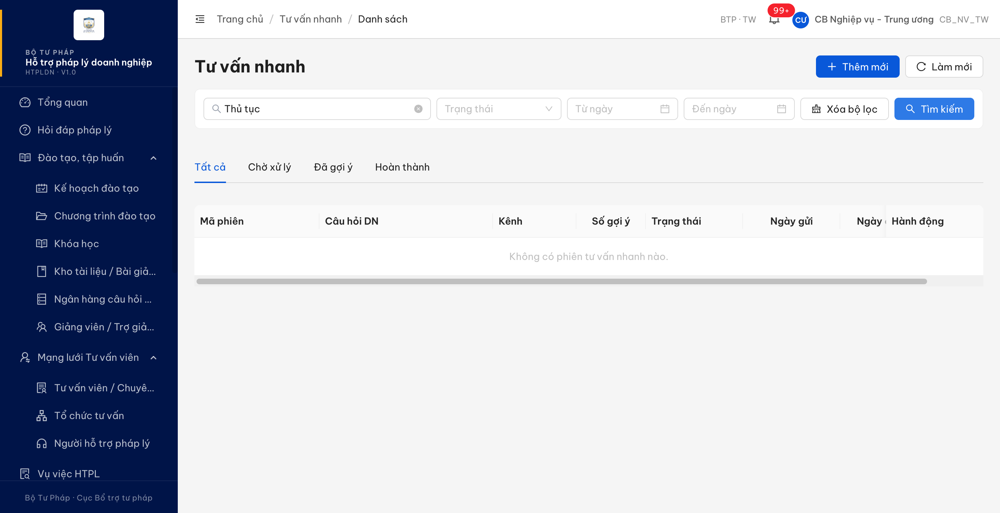

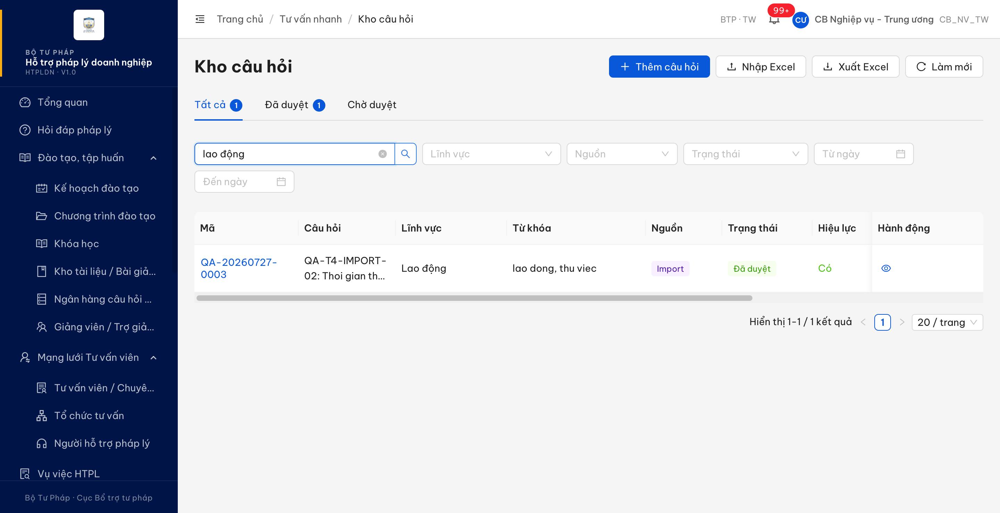

**2. Đo trên máy chủ** *(phụ trợ — chạy lần lượt, cùng phiên đăng nhập)*

```
Tu van nhanh  (tong 4 phien)
  (khong tu khoa)        -> 4
  TVN-20260727-0001      -> 0     <-- dung ma phien dang hien thi
  TVN                    -> 0
  20260727               -> 0
  0001                   -> 0
  Thu tuc (co dau)       -> 0     <-- TVN-...-0003 mo dau bang cum nay
  lao dong (co dau)      -> 0     <-- 2 phien chua cum nay
  dong (co dau)          -> 0
  dong (khong dau)       -> 2     ok
  lao                    -> 2     ok
  Tranh / tranh / TRANH  -> 1 / 1 / 1   ok (khong phan biet hoa thuong)
  ranh                   -> 0     (khong khop giua tu)

Kho cau hoi   (tong 14 cau hoi) -- doi chung
  lao dong (co dau)      -> 1     ok
  lao dong (khong dau)   -> 1     ok
  dong (co dau)          -> 1     ok
  thu viec (co dau)      -> 1     ok
  hop dong (co dau)      -> 1     ok
```

**3. Đo lại 28/07/2026 (R2) — trên giao diện, vai trò CB Nghiệp vụ - Trung ương**

Chạy lần lượt trên màn **Tư vấn nhanh** (`/tv-nhanh/danh-sach`), cùng một phiên đăng nhập, mỗi lần gõ vào ô tìm kiếm rồi bấm **[Tìm kiếm]**; số bản ghi đọc từ dòng "Hiển thị … kết quả" dưới bảng.

| Truy vấn gõ vào | Thuộc nhóm bug gốc nêu | Kỳ vọng | Thực tế 28/07 | Bản ghi trả về |
|---|---|:-:|:-:|---|
| *(để trống — baseline)* | — | 4 | **4** ✅ | 0001 · 0002 · 0003 · 0004 |
| `TVN-20260727-0001` | 1 — mã phiên | ≥1 | **1** ✅ | TVN-20260727-0001 |
| `0001` | 1 — một phần mã phiên | ≥1 | **1** ✅ | TVN-20260727-0001 |
| `động` | 2 — từ khóa có dấu | ≥1 | **2** ✅ | TVN-20260727-0001 · -0002 |
| `chấp` | 2 — từ khóa có dấu | ≥1 | **1** ✅ | TVN-20260727-0001 |
| `lao động` | 3 — cụm nhiều chữ có dấu | ≥1 | **2** ✅ | TVN-20260727-0001 · -0002 |
| `Thủ tục` | 3 — cụm nhiều chữ có dấu | ≥1 | **1** ✅ | TVN-20260727-0003 |
| `lao dong` (bỏ dấu) | đối chiếu | ≥1 | **2** ✅ | TVN-20260727-0001 · -0002 |
| `zzzkhongtontai` | **đối chứng âm** | 0 | **0** ✅ | — (hiện "Không có phiên tư vấn nhanh nào.") |
| `ranh chấp` (mảnh giữa từ) | ngoài phạm vi bug | — | 0 | — (khớp từ đầu từ, y như đo lần đầu) |

Đối chứng không hồi quy — màn **Kho câu hỏi** (`/tv-nhanh/kho-cau-hoi`, tổng 27 câu hỏi): `lao động` → **2** bản ghi (`QA-20260727-0003`, `QA-20260728-0004`), số đếm trên thẻ đổi theo (Tất cả 2 / Đã duyệt 2).

Đối chứng âm là phần quan trọng: nó cho thấy ô tìm kiếm thật sự đang lọc chứ không phải bỏ qua từ khóa mà trả về toàn bộ.

**4. Ảnh chụp lần đo lại (R2 — 28/07/2026)**

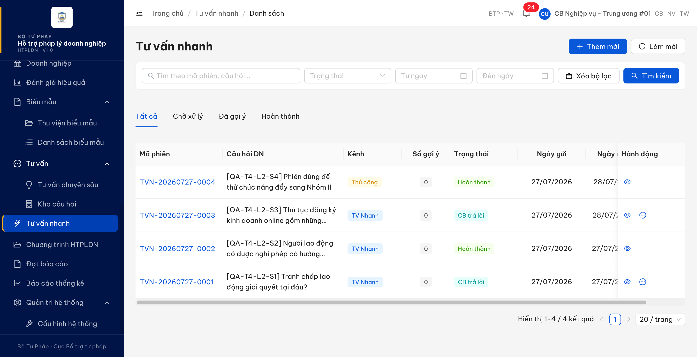


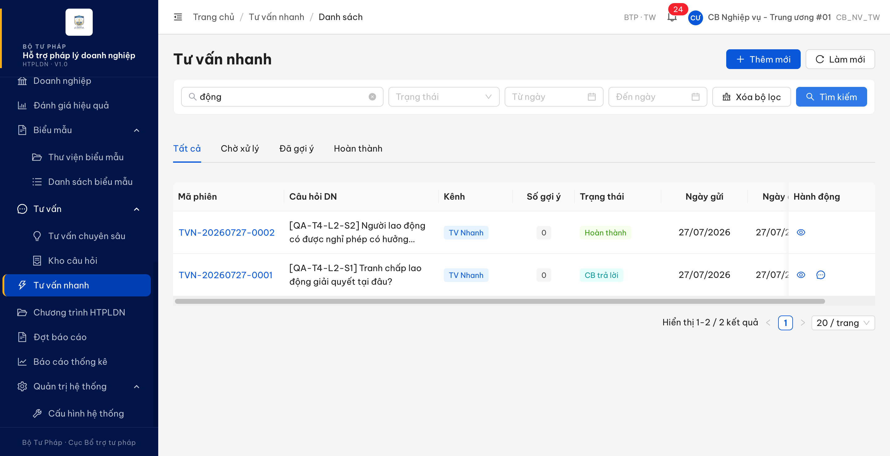


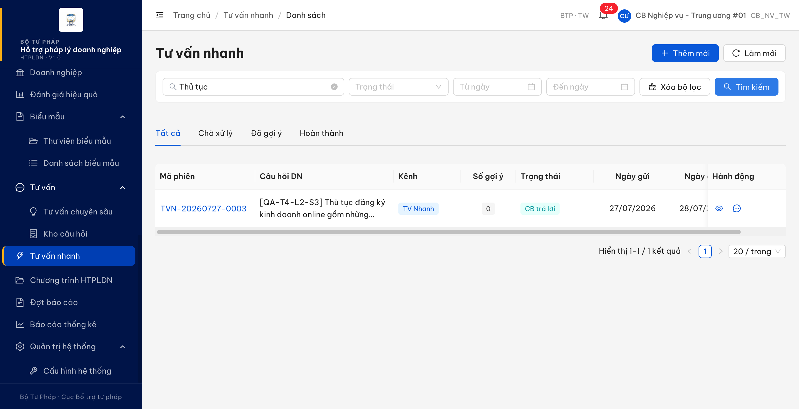

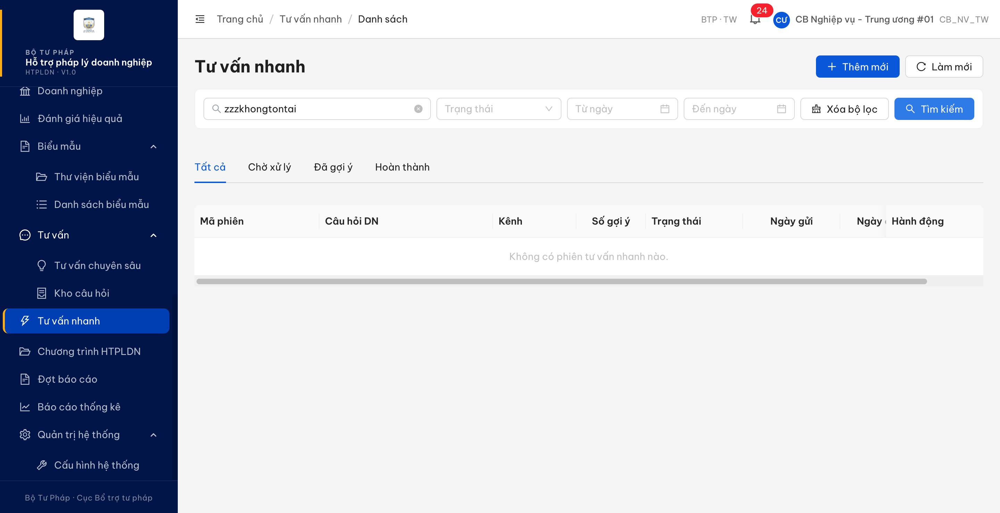

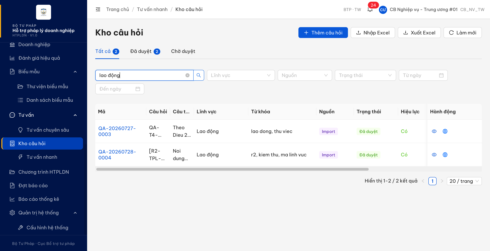

---

## ~~BUG-TK-THONG-DIEP-RONG~~ [CLOSED] — Tìm kiếm không khớp vẫn báo "Chưa có câu hỏi nào." / "Không có phiên tư vấn nhanh nào." y như khi kho rỗng

> **Re-test:** 2026-07-30 21:02:00 R3 — ✅ PASS (Closed-verified). Chạy trên `cbnv_tw_02` bản V1.0.3, cả hai màn đều đang CÓ dữ liệu (Kho câu hỏi 29 bản ghi · Tư vấn nhanh 6 phiên). Nhập từ khóa không khớp `abcdxyzqwerty`: màn Kho câu hỏi trả 0 dòng và hiện đúng **"Không tìm thấy câu hỏi phù hợp."**; màn Tư vấn nhanh trả 0 dòng và hiện đúng **"Không tìm thấy phiên tư vấn phù hợp."** — không còn dùng câu dành cho kho rỗng. Cả hai trạng thái rỗng đều kèm thao tác **[Xóa bộ lọc]** ngay tại chỗ; bấm vào thì danh sách phục hồi đủ 29 bản ghi và 6 phiên. Tìm không khớp cũng không trả về toàn bộ dữ liệu như lỗi cũ.

### Mô tả

Khi tìm kiếm không ra kết quả, cả hai màn đều hiện câu thông báo dành cho trường hợp **chưa có dữ liệu**, chứ không phải trường hợp **có dữ liệu nhưng không khớp bộ lọc**:

- Kho câu hỏi (14 câu hỏi đang có): tìm `abcdxyzqwerty` → *"Chưa có câu hỏi nào."*
- Tư vấn nhanh (4 phiên đang có): tìm `abcdxyzqwerty` → *"Không có phiên tư vấn nhanh nào."*

Cả hai câu đều nói sai sự thật với người dùng: kho **đang có** dữ liệu. Cán bộ đọc xong dễ hiểu nhầm là hệ thống mất dữ liệu hoặc mình không có quyền xem, thay vì hiểu đơn giản là từ khóa không khớp.

Hệ quả nặng hơn ở màn Kho câu hỏi vì màn đó **không có nút xóa bộ lọc** (xem `BUG-TK-KHONG-CO-XOA-BO-LOC`): người dùng vừa bị báo sai, vừa không được chỉ đường quay lại.

Xếp Minor vì không chặn nghiệp vụ — xóa từ khóa thì danh sách trở lại bình thường.

> **Ghi chú phạm vi:** phần đối tác phản ánh ở TKCHTV_02 là *"Kho câu hỏi hiển thị toàn bộ bản ghi khi tìm không có kết quả"* — điểm đó **không còn tái hiện**, hệ thống trả đúng 0 dòng. Bug này chỉ còn ở phần **chữ thông báo**. Câu chữ chính xác cần BA chốt — xem BA-17 trong [ba-confirmation-needed-week-4.md](../ba-confirmation-needed-week-4.md).

### Các bước tái hiện

1. Đăng nhập role **`CB_NV_TW`** (tài khoản `cbnv_tw`, "CB Nghiệp vụ - Trung ương", đơn vị BTP · TW).
2. Vào **Tư vấn → Kho câu hỏi**. Ghi nhận danh sách đang có **14 câu hỏi** ("Hiển thị 1-14 / 14 kết quả").
3. Gõ vào ô tìm kiếm chuỗi vô nghĩa `abcdxyzqwerty` → bấm biểu tượng tìm kiếm.
4. Đọc câu thông báo hiện trong vùng bảng.
5. Vào **Tư vấn → Tư vấn nhanh**. Ghi nhận danh sách đang có **4 phiên**.
6. Gõ `abcdxyzqwerty` → bấm **[Tìm kiếm]** → đọc câu thông báo.

### Kết quả mong đợi

- `srs-fr-13-tv-nhanh.md:228` — FR-X.2-02, bảng Error Handling dòng E2: *"| E2 | Không có kết quả tìm kiếm | INF-TVN-TK-01 | **"Không tìm thấy câu hỏi phù hợp"** | INFO |"*. Dòng `:352` (FR-X.2-04) lặp lại đúng câu này. Cùng nghiệp vụ nhóm X.2, tình huống "tìm không ra" đã có câu chữ chuẩn.
- `srs-fr-02-hoi-dap.md:1047` — quy ước chung của hệ thống, phân biệt rõ 5 biến thể trạng thái trống, trong đó biến thể (1) *"Chưa có hỏi đáp nào"* dùng khi **không có dữ liệu**, còn biến thể (4) *"Không tìm thấy hỏi đáp phù hợp với bộ lọc. [Xóa bộ lọc]"* dùng khi **lọc không khớp**.
- Nói chung: khi danh sách rỗng vì bộ lọc không khớp, thông báo phải cho người dùng biết là **do bộ lọc**, không được nói như thể kho chưa có dữ liệu.

### Kết quả thực tế

| Màn | Dữ liệu đang có | Từ khóa | Số dòng trả về | Câu thông báo hiển thị | Ý nghĩa câu đó |
|---|:-:|---|:-:|---|---|
| Kho câu hỏi | 14 | `abcdxyzqwerty` | 0 | *"Chưa có câu hỏi nào."* | "kho chưa có dữ liệu" — sai |
| Tư vấn nhanh | 4 | `abcdxyzqwerty` | 0 | *"Không có phiên tư vấn nhanh nào."* | "chưa có phiên nào" — sai |

- Đọc trực tiếp từ vùng bảng, không suy diễn: chuỗi hiển thị lấy ra đúng nguyên văn hai câu trên.
- Không màn nào kèm gợi ý thao tác tiếp theo (kiểu "xóa bộ lọc để xem lại").
- Xóa từ khóa thì danh sách quay lại đủ 14 / 4 dòng ⇒ dữ liệu vẫn nguyên, chỉ có câu thông báo mô tả sai tình huống.

### Bằng chứng

**1. Ảnh chụp**

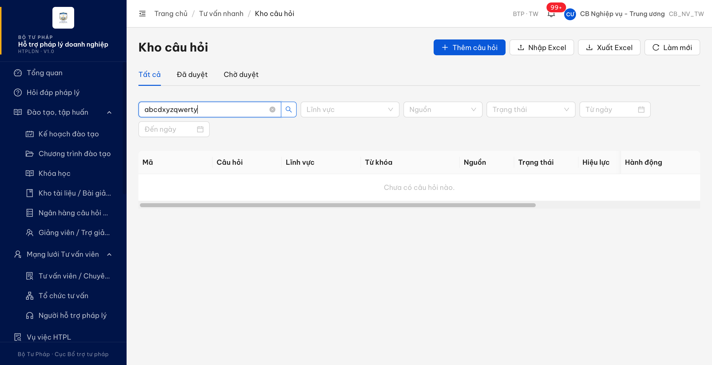


**2. Đọc chữ trong vùng bảng** *(phụ trợ)*

```
Kho cau hoi   ?search=abcdxyzqwerty  -> so dong = 0 · chu hien thi = "Chua co cau hoi nao."
Tu van nhanh  ?search=abcdxyzqwerty  -> so dong = 0 · chu hien thi = "Khong co phien tu van nhanh nao."
Xoa tu khoa   -> Kho cau hoi tro lai 14 dong · Tu van nhanh tro lai 4 dong
```

---

## ~~BUG-TK-KHONG-CO-XOA-BO-LOC~~ [CLOSED] — Màn Kho câu hỏi không có nút xóa toàn bộ bộ lọc; nút [Làm mới] cũng không đặt lại bộ lọc

> **Re-test:** 2026-07-30 20:52:00 R3 — ✅ PASS (Closed-verified). Chạy trên `cbnv_tw_02` bản V1.0.3: màn Kho câu hỏi nay CÓ nút **[Xóa bộ lọc]** trên thanh công cụ. Đặt đủ 4 điều kiện (từ khóa `lao động` + Lĩnh vực `Lao động` + Từ ngày 01/07/2026 + Đến ngày 30/07/2026) cho 2/29 bản ghi; bấm **[Làm mới]** thì cả 4 điều kiện và 2 kết quả **giữ nguyên** (đúng phân vai BA-18); bấm **[Xóa bộ lọc]** thì ô tìm kiếm rỗng, cả 3 danh sách chọn về "Tất cả", 2 ô ngày rỗng, thẻ vẫn "Tất cả" và danh sách trở lại đủ 29 bản ghi. Kiểm thêm ở thẻ "Chờ duyệt": [Xóa bộ lọc] giữ đúng thẻ đang chọn và trả về 10 bản ghi mặc định của thẻ, không tự nhảy thẻ. Hồi quy màn Tư vấn nhanh: [Xóa bộ lọc] vẫn chạy đúng, phục hồi 6/6 phiên.

### Mô tả

Thanh lọc màn **Kho câu hỏi** có 6 tiêu chí (từ khóa, Lĩnh vực, Nguồn, Trạng thái, Từ ngày, Đến ngày) nhưng **không có nút nào xóa hết trong một thao tác**. Người dùng phải xóa từng ô một.

Đã thử nút **[Làm mới]** ở góc phải trên — nút này **không** đặt lại bộ lọc: bấm xong ô tìm kiếm vẫn giữ nguyên từ khóa và bảng vẫn đang lọc.

Đối chứng ngay trong cùng nhóm chức năng: màn **Tư vấn nhanh** **có** nút **[Xóa bộ lọc]**, và nút đó chạy đúng — xóa sạch từ khóa, trạng thái, khoảng ngày, đưa danh sách về mặc định. Vậy hai màn anh em của cùng một nhóm đang không đồng nhất.

Đây đúng phần đối tác phản ánh ở TKCHTV_03 bước 2. Bước 6 (Tư vấn nhanh) thì hệ thống làm đúng.

> **Ghi chú căn cứ:** đặc tả `srs-fr-13-tv-nhanh.md` mô tả thanh lọc của cả hai màn (`:530` cho Kho câu hỏi, `:568` cho Tư vấn nhanh) nhưng **không** liệt kê nút xóa bộ lọc ở màn nào. Nút này là quy ước chung của hệ thống, thấy ở nhiều nhóm khác. Vì đặc tả nhóm X.2 chưa ghi, QA gửi kèm câu hỏi BA-18 để BA chốt — xem [ba-confirmation-needed-week-4.md](../ba-confirmation-needed-week-4.md).

### Các bước tái hiện

1. Đăng nhập role **`CB_NV_TW`** (tài khoản `cbnv_tw`, "CB Nghiệp vụ - Trung ương", đơn vị BTP · TW).
2. Vào **Tư vấn → Kho câu hỏi**. Đọc thanh lọc: ô tìm kiếm, Lĩnh vực, Nguồn, Trạng thái, Từ ngày, Đến ngày.
3. Tìm nút có chữ "Xóa bộ lọc" trên toàn màn.
4. Gõ từ khóa `lao động` → bấm biểu tượng tìm kiếm. Danh sách còn 1/14 dòng.
5. Bấm nút **[Làm mới]** ở góc phải trên → đọc lại ô tìm kiếm và số dòng.
6. Sang **Tư vấn → Tư vấn nhanh**, gõ từ khóa bất kỳ → bấm **[Tìm kiếm]** → bấm **[Xóa bộ lọc]** → đọc lại toàn bộ ô lọc và số dòng.

### Kết quả mong đợi

- `srs-fr-02-hoi-dap.md:1033` — quy ước chung của hệ thống cho màn danh sách: *"| 18 | filter-bar | Nút Xóa bộ lọc | button | "Xóa bộ lọc" — reset tất cả | click → reset | luôn hiển thị |"*.
- `srs-fr-13-tv-nhanh.md:533` và `:574` mô tả thanh lọc hai màn của cùng nhóm X.2 với cùng vai trò ⇒ hai màn cần hành xử nhất quán, không thể một màn có đường đặt lại còn màn kia không.
- Nói chung: khi màn danh sách cho phép đặt nhiều tiêu chí lọc, người dùng phải có một thao tác đưa danh sách về mặc định, không phải nhớ và gỡ thủ công từng tiêu chí.

### Kết quả thực tế

| Màn | Nút [Xóa bộ lọc] | [Làm mới] có đặt lại bộ lọc? | Cách duy nhất để về mặc định |
|---|:-:|:-:|---|
| **Kho câu hỏi** | **không có** | **không** — sau khi bấm, ô tìm kiếm vẫn là `lao động`, bảng vẫn 1/14 dòng | gỡ tay từng ô: dấu ✕ trong ô tìm kiếm + 3 danh sách chọn + 2 ô ngày |
| Tư vấn nhanh | **có** | — | bấm [Xóa bộ lọc] ⇒ ô tìm kiếm rỗng, trạng thái rỗng, hai ô ngày rỗng, thẻ về "Tất cả", danh sách về 4/4 dòng |

- Đọc toàn bộ nút trên màn Kho câu hỏi: `Thêm câu hỏi`, `Nhập Excel`, `Xuất Excel`, `Làm mới` — không có nút nào mang nghĩa xóa bộ lọc.
- Phép thử [Làm mới]: trước khi bấm — từ khóa `lao động`, 1 dòng, thẻ đếm "Tất cả 1". Sau khi bấm — vẫn từ khóa `lao động`, vẫn 1 dòng, thẻ vẫn "Tất cả 1". Không đổi.
- Phép thử [Xóa bộ lọc] ở Tư vấn nhanh: trước — từ khóa `abcdxyzqwerty`, 0 dòng. Sau — từ khóa rỗng, 4 dòng, "Hiển thị 1-4 / 4 kết quả", thẻ "Tất cả". Chạy đúng, dùng làm đối chứng là thành phần này đã có sẵn trong hệ thống.

### Bằng chứng

**1. Ảnh chụp**


![Đối chứng — Tư vấn nhanh có đủ [Xóa bộ lọc] và [Tìm kiếm] trên cùng thanh lọc](image/BUG-TK-tv-nhanh-tim-dung-ma-phien-ra-0.png)

**2. Đo giao diện** *(phụ trợ)*

```
Kho cau hoi   nut tren man = ["Them cau hoi","Nhap Excel","Xuat Excel","Lam moi"]
              co chu "Xoa bo loc"? = khong
              bam [Lam moi]:  truoc = {o tim: "lao dong", so dong: 1}
                              sau   = {o tim: "lao dong", so dong: 1}   <-- khong doi

Tu van nhanh  nut tren man = ["Them moi","Lam moi","Xoa bo loc","Tim kiem", ...]
              bam [Xoa bo loc]: truoc = {o tim: "abcdxyzqwerty", so dong: 0}
                                sau   = {o tim: "", tu ngay: "", den ngay: "",
                                         trang thai: trong, tab: "Tat ca", so dong: 4}
```

---

## ~~BUG-CT-LOC-THIEU-DONVI-TRANGTHAI~~ [CLOSED] — Thanh lọc màn Chương trình HTPLDN thiếu bộ lọc Đơn vị và Trạng thái; 2/8 trạng thái không lọc được từ giao diện

> **Re-test:** 2026-07-28 14:19:00 R2 — ✅ PASS (Closed-verified). Thanh lọc đã có đủ ô Đơn vị và Trạng thái, dùng thật đều lọc đúng: chọn đơn vị Cục Bổ trợ tư pháp ra 11/12 bản ghi, chọn Bộ Công an ra 0; ô Trạng thái liệt kê đủ 8 trạng thái và mỗi lựa chọn trả về đúng bản ghi (tổng 8 nhánh = 12 = tổng danh sách). Hàng thẻ phân loại cũng đã bổ sung Tạm dừng và Đã hủy.

### Mô tả

Thanh lọc màn **Chương trình HTPLDN** hiện có 4 thành phần: ô tìm theo tên/mã, **một** danh sách chọn mang nhãn **"Công bố"**, và cặp ô Từ ngày / Đến ngày. Không có bộ lọc **Đơn vị**, cũng không có bộ lọc **Trạng thái** — hai thứ mà `srs-fr-15-ct-htpldn.md:1110` và `:1111` quy định là "luon hien thi".

Danh sách chọn duy nhất đó **không phải** bộ lọc Trạng thái: mở ra chỉ có 2 lựa chọn *"Đã công bố"* / *"Chưa công bố"*, tức là lọc theo cờ công khai, không phải theo 8 trạng thái vòng đời.

Hàng thẻ phân loại phía dưới (Tất cả / Dự thảo / Chờ phê duyệt / Đã duyệt / Đã công bố / Đang thực hiện / Hoàn thành) có thể coi là cách lọc trạng thái thay thế, nhưng **thiếu 2 trong 8 trạng thái** của máy trạng thái: **Tạm dừng** và **Đã hủy**. Nghĩa là chương trình đang tạm dừng hoặc đã hủy thì không có đường nào lọc ra từ giao diện.

Máy chủ đã hỗ trợ sẵn cả hai bộ lọc — đây thuần là phần giao diện chưa dựng.

### Các bước tái hiện

1. Đăng nhập role **`CB_NV_TW`** (tài khoản `cbnv_tw`, "CB Nghiệp vụ - Trung ương", đơn vị BTP · TW).
2. Vào menu **CT HTPLDN**.
3. Đọc thanh lọc phía trên bảng: đếm số ô nhập và số danh sách chọn.
4. Mở danh sách chọn mang nhãn **"Công bố"** → đọc các lựa chọn bên trong.
5. Đọc hàng thẻ phân loại phía dưới thanh lọc, đối chiếu với 8 trạng thái của máy trạng thái chương trình.

### Kết quả mong đợi

- `srs-fr-15-ct-htpldn.md:1110` — §3 SCR-XI-01, Trang Danh sách, dòng 4: *"| 4 | filter-bar | **Don vi** | select | Auto phân quyền theo đơn vị (BR-AUTH-05) | change -> filter | **luon hien thi** |"*.
- `srs-fr-15-ct-htpldn.md:1111` — dòng 5: *"| 5 | filter-bar | **Trang thai** | select | **Tat ca trang thai SM-KH-CTHTPL** | change -> filter | **luon hien thi** |"*.
- `srs-fr-15-ct-htpldn.md:1173-1180` liệt kê máy trạng thái SM-KH-CTHTPL gồm **8 trạng thái**: Dự thảo, Chờ phê duyệt, Đã duyệt, Đã công bố, Đang thực hiện, **Tạm dừng**, Hoàn thành, **Đã hủy**.
  ⇒ Cán bộ phải lọc được danh sách theo đơn vị, và theo **mọi** trạng thái trong máy trạng thái.

### Kết quả thực tế

| Thành phần lọc theo `:1109-1112` | Có trên màn? | Ghi nhận |
|---|:-:|---|
| Từ khóa (tên / mã CT) | **có** | ô "Tìm theo tên hoặc mã CT..." |
| **Đơn vị** | **không** | không có danh sách chọn nào cho đơn vị |
| **Trạng thái** | **không** | danh sách chọn duy nhất là "Công bố", chỉ 2 lựa chọn *Đã công bố* / *Chưa công bố* |
| Khoảng ngày | **có** | Từ ngày / Đến ngày |

- Hàng thẻ phân loại có 7 mục: `Tất cả 8` · `Dự thảo` · `Chờ phê duyệt` · `Đã duyệt 5` · `Đã công bố 1` · `Đang thực hiện 1` · `Hoàn thành 1`. **Không có thẻ Tạm dừng, không có thẻ Đã hủy.**
- **Máy chủ đã sẵn sàng, chỉ thiếu giao diện.** Dịch vụ dữ liệu của màn này nhận cả `donViId` lẫn `trangThai` và trả kết quả đúng: lọc theo một đơn vị cụ thể → 7/8 chương trình; lọc trạng thái Đã duyệt → 5/8; lọc trạng thái Tạm dừng → 0 (môi trường chưa có bản ghi ở trạng thái này). ⇒ Không phải hạn chế phía máy chủ.
- Ảnh hưởng: tài khoản cấp Trung ương nhìn thấy chương trình của **mọi** đơn vị, không có bộ lọc đơn vị thì phải cuộn tay để tách theo địa phương / bộ ngành.

> **Đính chính ảnh gửi kèm phiếu:** ảnh `KHTHCTHTPLDN_02.jpg` đối tác đính kèm là **màn Tư vấn nhanh** (`/tv-nhanh/danh-sach`), không phải màn Chương trình HTPLDN đang nói tới. Nội dung phản ánh trong phiếu thì đúng — QA đã kiểm lại trực tiếp trên đúng màn và chụp bổ sung.

### Bằng chứng

**1. Ảnh chụp**

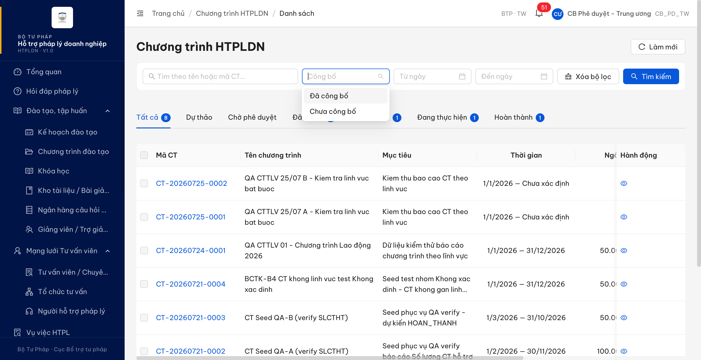

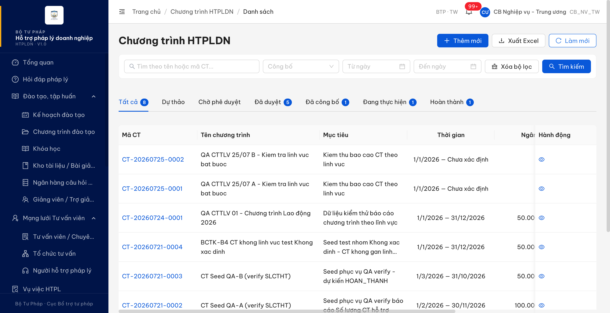

**2. Đo giao diện và máy chủ** *(phụ trợ)*

```
Thanh loc tren man:
  o nhap    = ["Tim theo ten hoac ma CT...", "Tu ngay", "Den ngay"]
  danh sach = ["Cong bo"]  -> lua chon: ["Da cong bo", "Chua cong bo"]
  KHONG co danh sach "Don vi", KHONG co danh sach "Trang thai"

The phan loai = ["Tat ca 8","Du thao","Cho phe duyet","Da duyet 5",
                 "Da cong bo 1","Dang thuc hien 1","Hoan thanh 1"]
  -> thieu "Tam dung" va "Da huy" (2/8 trang thai SM-KH-CTHTPL)

May chu (cung phien dang nhap) da ho tro san:
  khong loc                -> 8
  donViId=<mot don vi>     -> 7      <-- tham so co tac dung
  trangThai=DA_DUYET       -> 5      <-- tham so co tac dung
  trangThai=TAM_DUNG       -> 0      (moi truong chua co ban ghi)
```

**3. Đo lại 28/07/2026 (R2) — đã đạt**

Tài khoản `cbnv_tw_01` (CB Nghiệp vụ - Trung ương). Thanh lọc nay có đủ **Đơn vị** và **Trạng thái**; hàng thẻ phân loại có đủ 9 thẻ (Tất cả + 8 trạng thái, gồm cả **Tạm dừng** và **Đã hủy**).

Để đo được cả 8 nhánh, QA đã dựng thêm 4 chương trình cho 4 trạng thái môi trường đang trống (`CT-20260728-0001` Tạm dừng · `CT-20260728-0002` Đã hủy · `CT-20260728-0003` Dự thảo · `CT-20260728-0004` Chờ phê duyệt). Tổng danh sách sau khi dựng: **12**.

*Bộ lọc Trạng thái — chọn từng lựa chọn rồi bấm [Tìm kiếm]:*

| # | Lựa chọn trong ô Trạng thái | Số bản ghi | Mã CT trả về |
|:-:|---|:-:|---|
| 1 | Dự thảo | 1 | CT-20260728-0003 |
| 2 | Chờ phê duyệt | 1 | CT-20260728-0004 |
| 3 | Đã duyệt | 5 | CT-20260725-0002 · CT-20260725-0001 · CT-20260724-0001 · CT-20260721-0004 · CT-20260721-0001 |
| 4 | Đã công bố | 1 | CTHTPL-SEED-0001 |
| 5 | Đang thực hiện | 1 | CT-20260721-0002 |
| 6 | **Tạm dừng** | 1 | CT-20260728-0001 |
| 7 | Hoàn thành | 1 | CT-20260721-0003 |
| 8 | **Đã hủy** | 1 | CT-20260728-0002 |
|  | **Cộng 8 nhánh** | **12** | = đúng tổng danh sách khi không lọc |

Mọi bản ghi trả về đều đúng trạng thái đã chọn (đối chiếu cột Trạng thái từng dòng).

*Bộ lọc Đơn vị:*

| Lựa chọn trong ô Đơn vị | Số bản ghi | Ghi nhận |
|---|:-:|---|
| (không lọc) | 12 | toàn bộ danh sách |
| Cục Bổ trợ tư pháp - Bộ Tư pháp | 11 | đúng 11 chương trình mang đơn vị này; loại `CTHTPL-SEED-0001` (bản ghi không gắn đơn vị) |
| Bộ Công an | 0 | hiện "Không tìm thấy chương trình phù hợp" |

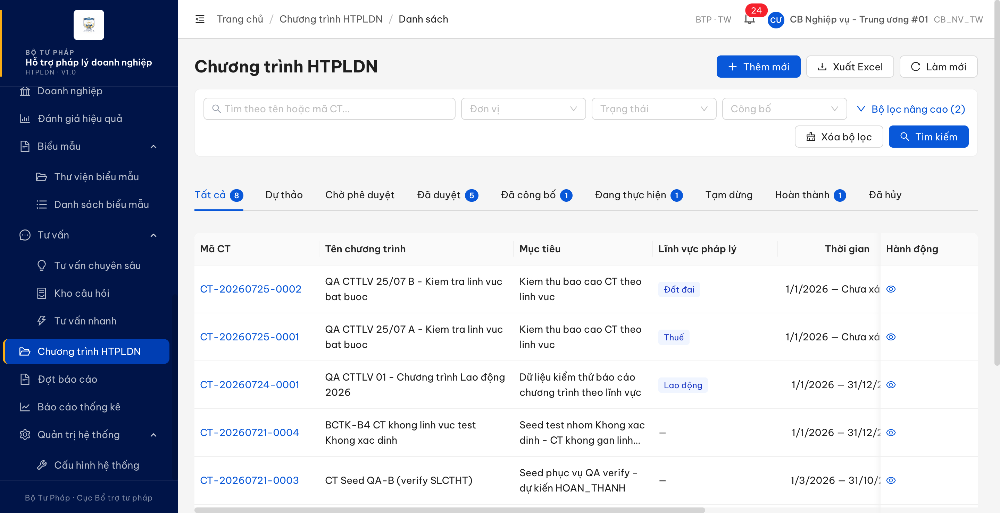

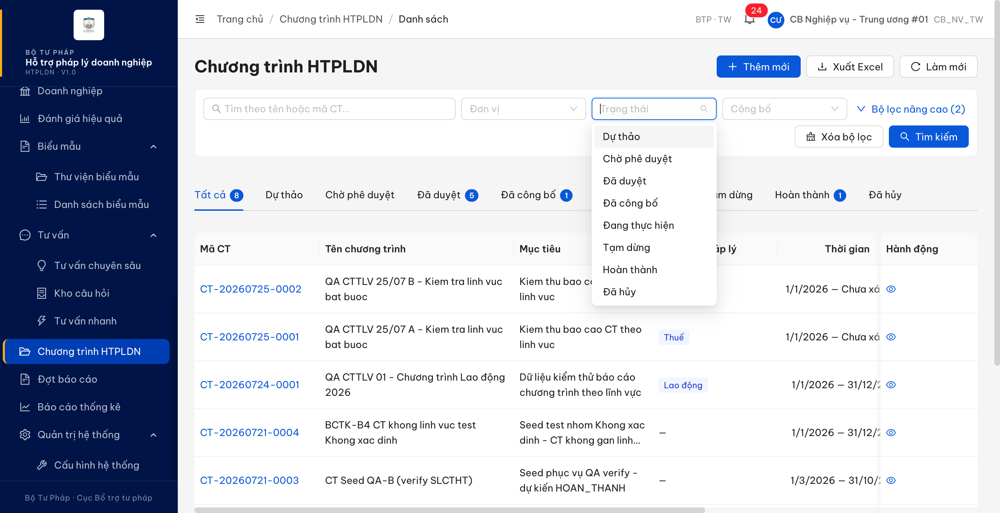

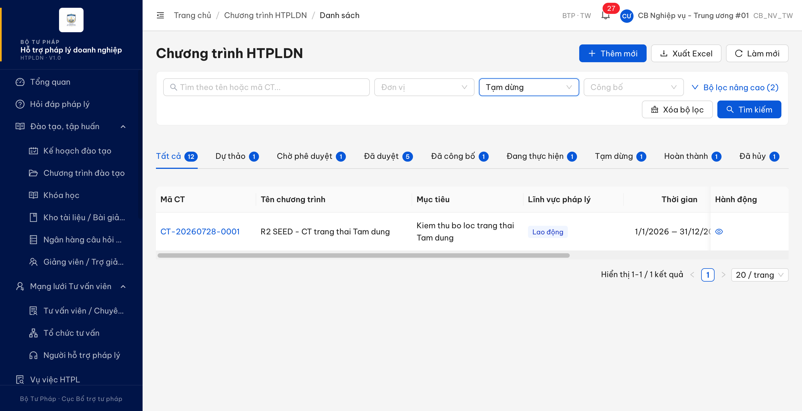

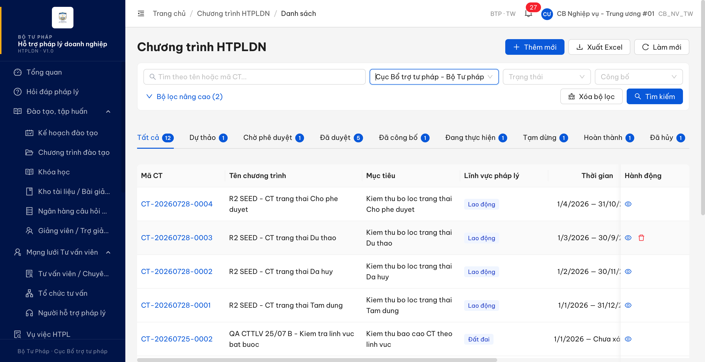

---

## ~~BUG-CT-BANG-THIEU-COT-LINHVUC~~ [CLOSED] — Bảng danh sách chương trình thiếu cột "Lĩnh vực pháp lý" dù máy chủ đã trả sẵn dữ liệu

> **Re-test:** 2026-07-28 14:21:18 R2 — ✅ PASS (Closed-verified). Bảng danh sách nay có đủ 10 cột đúng thứ tự đặc tả, cột Lĩnh vực pháp lý nằm ngay sau Mục tiêu và có dữ liệu thật trên từng dòng (Lao động / Đất đai / Thuế / Thương mại); 3 dòng hiện dấu — là chương trình cũ vốn không gắn lĩnh vực, không phải cột rỗng. Đã cuộn ngang hết bảng để đối chiếu, không cột nào bị che.

### Mô tả

Bảng danh sách màn **Chương trình HTPLDN** hiển thị 9 cột, thiếu **"Lĩnh vực pháp lý"** — cột mà `srs-fr-15-ct-htpldn.md:1113` liệt kê ngay sau "Muc tieu".

Dữ liệu thì đã có sẵn: máy chủ trả về `tenLinhVuc` cho từng chương trình ("Đất đai", "Thuế", "Lao động"...), và **file Excel xuất ra từ chính màn này lại có cột "Lĩnh vực"**. Nghĩa là chỉ thiếu phần dựng cột trên bảng.

Đây là bug **QA phát hiện ngoài phiếu đối tác**, thấy khi verify KHTHCTHTPLDN_03. Đã mở dòng mới `KHTHCTHTPLDN_OOS_05` trên sheet.

Đáng lưu ý vì lĩnh vực pháp lý là **trường bắt buộc** khi tạo chương trình (`:1130`) và là chiều gom số liệu của báo cáo thống kê — cán bộ không nhìn được ngay trên danh sách thì phải mở từng chương trình để biết.

### Các bước tái hiện

1. Đăng nhập role **`CB_NV_TW`** (tài khoản `cbnv_tw`, "CB Nghiệp vụ - Trung ương", đơn vị BTP · TW).
2. Vào menu **CT HTPLDN**.
3. Đọc hàng tiêu đề của bảng, liệt kê đủ các cột (cuộn ngang hết bảng).
4. Đối chiếu với tập cột quy định ở `srs-fr-15-ct-htpldn.md:1113`.
5. Đối chứng: bấm **[Xuất Excel]**, mở tệp tải về và đọc hàng tiêu đề.

### Kết quả mong đợi

- `srs-fr-15-ct-htpldn.md:1113` — §3 SCR-XI-01, Trang Danh sách, dòng 7 "Bang chuong trinh": *"Ma CT (CT-{YYYYMMDD}-{SEQ}) / Ten CT / Muc tieu (cat 100 ky tu) / **Linh vuc phap ly** / Thoi gian (bat dau -- ket thuc, hoac "Chua xac dinh") / Ngan sach (format tien hoac "--") / Don vi / Trang thai SM-KH-CTHTPL (C06) / So dot BC / Hanh dong (conditional)"* ⇒ **10 cột**, trong đó có Lĩnh vực pháp lý.
- `srs-fr-15-ct-htpldn.md:1130` xác nhận đây là trường bắt buộc của chương trình: *"| 16a | form | Linh vuc phap ly | select | **Bat buoc**, chon mot ... La chieu gom so lieu BC FR-IX-22"*.

### Kết quả thực tế

| # | Cột theo `:1113` | Có trên bảng? |
|:-:|---|:-:|
| 1 | Mã CT | có |
| 2 | Tên CT | có ("Tên chương trình") |
| 3 | Mục tiêu | có |
| 4 | **Lĩnh vực pháp lý** | **KHÔNG** |
| 5 | Thời gian | có |
| 6 | Ngân sách | có |
| 7 | Đơn vị | có |
| 8 | Trạng thái | có |
| 9 | Số đợt BC | có |
| 10 | Hành động | có |

- Bảng thực tế đúng 9 cột, thiếu duy nhất mục số 4.
- **Đối chứng loại trừ "chưa có dữ liệu":** máy chủ trả kèm `tenLinhVuc` cho từng chương trình — `CT-20260725-0002` → "Đất đai", `CT-20260725-0001` → "Thuế", `CT-20260724-0001` → "Lao động". Dữ liệu sẵn sàng, chỉ không được dựng thành cột.
- **Đối chứng thứ hai:** tệp Excel xuất ra từ chính màn này **có** cột "Lĩnh vực" với đúng các giá trị trên. ⇒ Cùng một nguồn dữ liệu, đường xuất tệp dùng được còn bảng thì không.

### Bằng chứng

**1. Ảnh chụp**


**2. Đối chiếu bảng ↔ máy chủ ↔ tệp xuất** *(phụ trợ)*

```
Cot tren bang  = ["Ma CT","Ten chuong trinh","Muc tieu","Thoi gian",
                  "Ngan sach","Don vi","Trang thai","So dot BC","Hanh dong"]   (9 cot)
Cot theo :1113 = 10 cot, co "Linh vuc phap ly" giua "Muc tieu" va "Thoi gian"

May chu tra kem linh vuc cho tung ban ghi:
  CT-20260725-0002 -> tenLinhVuc = "Dat dai"
  CT-20260725-0001 -> tenLinhVuc = "Thue"
  CT-20260724-0001 -> tenLinhVuc = "Lao dong"

Tep Excel xuat ra tu chinh man nay CO cot "Linh vuc" voi dung 3 gia tri tren.
```

**3. Đo lại 28/07/2026 (R2) — đã đạt**

Tài khoản `cbnv_tw_01`. Đọc hàng tiêu đề trực tiếp từ bảng và cuộn ngang hết bề rộng (bảng rộng 1730px trong khung 1128px) để chắc không cột nào bị cột dính che.

Hàng tiêu đề đọc được — **đúng 10 cột, đúng thứ tự đặc tả**:

`Mã CT · Tên chương trình · Mục tiêu · **Lĩnh vực pháp lý** · Thời gian · Ngân sách · Đơn vị · Trạng thái · Số đợt BC · Hành động`

Cột "Lĩnh vực pháp lý" có dữ liệu thật trên từng dòng (12/12 dòng đọc được ô):

| Mã CT | Lĩnh vực pháp lý trên bảng |
|---|---|
| CT-20260728-0004 · 0003 · 0002 · 0001 | Lao động |
| CT-20260725-0002 | Đất đai |
| CT-20260725-0001 | Thuế |
| CT-20260724-0001 | Lao động |
| CT-20260721-0001 · CTHTPL-SEED-0001 | Thương mại |
| CT-20260721-0004 · 0003 · 0002 | — |

3 dòng hiện dấu `—` là chương trình cũ **vốn không gắn lĩnh vực** (đã đối chứng: hồ sơ của cả 3 đều trống trường lĩnh vực), tức đây là hiển thị đúng cho dữ liệu trống chứ không phải cột rỗng.

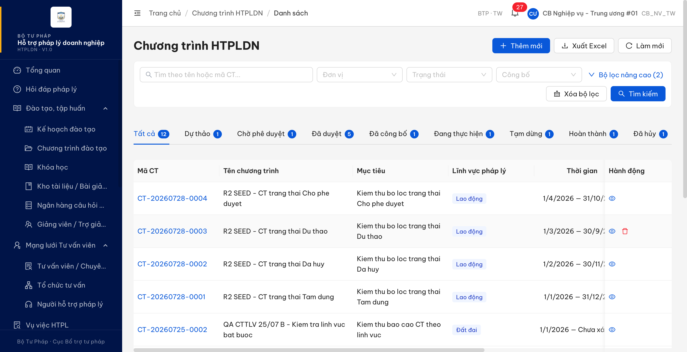

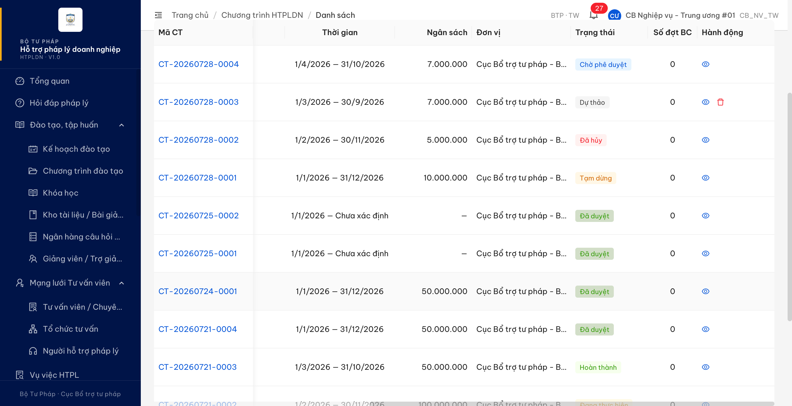

---

## ~~BUG-CT-XUAT-EXCEL-SAI-NGAY~~ [CLOSED] — Tệp Excel xuất ra ghi thời gian lệch 1 ngày so với màn hình

> **Re-test:** 2026-07-28 14:23:49 R2 — ✅ PASS (Closed-verified). Bấm [Xuất Excel] trên màn, tải tệp ct-htpldn-2026-07-28.xlsx rồi mở đọc nội dung: cả 12/12 dòng có hai cột Thời gian bắt đầu / kết thúc trùng khớp tuyệt đối với giá trị đang hiển thị trên bảng, không còn lệch 1 ngày và không còn phần giờ 17:00. Ba chương trình nêu trong bug (CT-20260724-0001, CT-20260725-0002, CT-20260721-0002) đều đã đúng.

### Mô tả

Bấm **[Xuất Excel]** ở màn Chương trình HTPLDN, mở tệp tải về và đọc hai cột thời gian: mọi giá trị đều **sớm hơn 1 ngày** so với chính con số hiển thị trên bảng, kèm phần giờ `17:00` không có ý nghĩa nghiệp vụ.

Ví dụ `CT-20260724-0001`: bảng hiển thị *1/1/2026 — 31/12/2026*, tệp Excel ghi *2025-12-31 17:00* và *2026-12-30 17:00*.

Nguyên nhân quan sát được: máy chủ lưu mốc thời gian ở dạng giờ quốc tế (`2025-12-31T17:00:00.000Z` chính là 01/01/2026 00:00 giờ Việt Nam). Màn hình quy đổi đúng về giờ Việt Nam, còn tệp xuất thì ghi thẳng giá trị gốc.

Đây là bug **QA phát hiện ngoài phiếu đối tác**, thấy khi verify KHTHCTHTPLDN_07. Đã mở dòng mới `KHTHCTHTPLDN_OOS_06` trên sheet.

Ảnh hưởng thực tế: tệp này dùng để tổng hợp và gửi ra ngoài; sai 1 ngày làm lệch kỳ báo cáo, và những chương trình bắt đầu đúng ngày đầu tháng hoặc đầu năm sẽ bị đẩy về tháng/năm trước.

### Các bước tái hiện

1. Đăng nhập role **`CB_NV_TW`** (tài khoản `cbnv_tw`, "CB Nghiệp vụ - Trung ương", đơn vị BTP · TW).
2. Vào menu **CT HTPLDN**.
3. Ghi lại giá trị cột **"Thời gian"** của dòng `CT-20260724-0001` trên bảng — hiển thị *1/1/2026 — 31/12/2026*.
4. Bấm **[Xuất Excel]** (không đặt bộ lọc nào).
5. Mở tệp tải về, đọc hai cột "Thời gian bắt đầu" và "Thời gian kết thúc" của đúng dòng đó.

### Kết quả mong đợi

- `srs-fr-15-ct-htpldn.md:396` — FR-XI-02, Processing "Xuất Excel DS CT", bước 4: *"Tạo file .xlsx với các cột: Mã CT, Tên CT, Mục tiêu, Đối tượng, Lĩnh vực pháp lý, **Thời gian (bắt đầu - kết thúc)**, Ngân sách, Đơn vị, Trạng thái, Số đợt BC"*.
- Nói chung: mốc thời gian trong tệp xuất phải là **cùng một ngày** mà cán bộ đang nhìn trên màn hình. Cùng một chương trình không thể có hai ngày bắt đầu khác nhau tùy chỗ đọc.

### Kết quả thực tế

| Chương trình | Bảng trên màn hiển thị | Tệp Excel ghi | Lệch |
|---|---|---|---|
| `CT-20260724-0001` | 1/1/2026 — 31/12/2026 | `2025-12-31 17:00` — `2026-12-30 17:00` | **−1 ngày** cả hai mốc |
| `CT-20260725-0002` | 1/1/2026 — Chưa xác định | `2025-12-31 17:00` — (trống) | **−1 ngày** |
| `CT-20260721-0002` | 1/2/2026 — 30/11/2026 | `2026-01-31 17:00` — `2026-11-29 17:00` | **−1 ngày** cả hai mốc |

- **Khoanh vùng nguyên nhân:** đọc thẳng dữ liệu máy chủ cho `CT-20260725-0002` → `thoiGianBatDau = "2025-12-31T17:00:00.000Z"`. Cộng 7 giờ ra đúng 01/01/2026 00:00 giờ Việt Nam. ⇒ Dữ liệu lưu **đúng**, màn hình quy đổi **đúng**, chỉ khâu ghi ra tệp Excel không quy đổi.
- Hệ quả rõ nhất: chương trình bắt đầu 01/01/2026 vào tệp thành 31/12/2025 — **lệch cả năm** khi lọc theo năm.
- Phần còn lại của tệp thì đủ: đã đối chiếu 10 cột bắt buộc ở `:396` đều có mặt (Mã CT, Tên CT, Mục tiêu, Đối tượng, Lĩnh vực, Đơn vị, Thời gian bắt đầu, Thời gian kết thúc, Ngân sách, Trạng thái, Số đợt BC), thêm 2 cột ngoài danh sách là "Là công bố" và "Ngày tạo".

### Bằng chứng

**1. Ảnh chụp**


**2. Đọc nội dung tệp Excel tải về** *(phụ trợ — mở tệp thật, không chỉ kiểm tra tệp có tải được)*

```
Tep: ct-htpldn-2026-07-27.xlsx | sheet "Chuong trinh HTPL" | 8 dong du lieu, 13 cot

Tieu de: Ma CT | Ten CT | Muc tieu | Doi tuong | Trang thai | Linh vuc | Don vi |
         Thoi gian bat dau | Thoi gian ket thuc | Ngan sach | La cong bo | So dot BC | Ngay tao

CT-20260724-0001
   man hinh : 1/1/2026 -- 31/12/2026
   tep excel: 2025-12-31 17:00  --  2026-12-30 17:00        <-- lech 1 ngay
   may chu  : thoiGianBatDau = "2025-12-31T17:00:00.000Z"   (= 01/01/2026 00:00 gio VN)
```

**3. Bản đọc đầy đủ tệp Excel** — [`image/BUG-CT-xuat-excel-noi-dung-tep.log.txt`](image/BUG-CT-xuat-excel-noi-dung-tep.log.txt): tên tệp + kích thước, 13 tiêu đề cột, đối chiếu 10 cột bắt buộc, và **toàn bộ 8 dòng dữ liệu** đọc trực tiếp từ tệp tải về. Dùng chung cho `BUG-CT-XUAT-EXCEL-SAI-NGAY` và phần tên tệp ở BA-19.

**4. Đo lại 28/07/2026 (R2) — đã đạt**

Tài khoản `cbnv_tw_01`. Bấm **[Xuất Excel]** ngay trên màn (không đặt bộ lọc), tệp tải về `ct-htpldn-2026-07-28.xlsx` (8.351 byte, sheet "Chương trình HTPL", 12 dòng × 13 cột), rồi **mở đọc nội dung từng ô** — không chỉ kiểm tệp tải được.

Đối chiếu **toàn bộ 12/12 dòng** giữa cột "Thời gian" trên màn và hai cột "Thời gian bắt đầu" / "Thời gian kết thúc" trong tệp:

| Mã CT | Màn hình hiển thị | Tệp Excel — bắt đầu | Tệp Excel — kết thúc | Kết luận |
|---|---|---|---|:-:|
| CT-20260728-0004 | 1/4/2026 — 31/10/2026 | 01/04/2026 | 31/10/2026 | khớp |
| CT-20260728-0003 | 1/3/2026 — 30/9/2026 | 01/03/2026 | 30/09/2026 | khớp |
| CT-20260728-0002 | 1/2/2026 — 30/11/2026 | 01/02/2026 | 30/11/2026 | khớp |
| CT-20260728-0001 | 1/1/2026 — 31/12/2026 | 01/01/2026 | 31/12/2026 | khớp |
| **CT-20260725-0002** | 1/1/2026 — Chưa xác định | 01/01/2026 | (trống) | khớp |
| CT-20260725-0001 | 1/1/2026 — Chưa xác định | 01/01/2026 | (trống) | khớp |
| **CT-20260724-0001** | 1/1/2026 — 31/12/2026 | 01/01/2026 | 31/12/2026 | khớp |
| CT-20260721-0004 | 1/1/2026 — 31/12/2026 | 01/01/2026 | 31/12/2026 | khớp |
| CT-20260721-0003 | 1/3/2026 — 31/10/2026 | 01/03/2026 | 31/10/2026 | khớp |
| **CT-20260721-0002** | 1/2/2026 — 30/11/2026 | 01/02/2026 | 30/11/2026 | khớp |
| CT-20260721-0001 | 1/1/2026 — 31/12/2026 | 01/01/2026 | 31/12/2026 | khớp |
| CTHTPL-SEED-0001 | 1/1/2026 — 31/12/2026 | 01/01/2026 | 31/12/2026 | khớp |

**12/12 dòng khớp tuyệt đối, 0 dòng lệch.** Ba chương trình in đậm chính là 3 ví dụ nêu ở bảng "Kết quả thực tế" vòng trước — nay đều đúng ngày. Phần giờ `17:00` đã biến mất; hai cột thời gian ghi ra dạng `dd/MM/yyyy`, và ô "Thời gian kết thúc" của chương trình chưa có ngày kết thúc thì để trống thay vì ghi bừa.

![R2 — Cột "Thời gian" trên màn dùng để đối chiếu với tệp xuất, ngay trước khi bấm [Xuất Excel]](image/R2-BUG-CT-XUAT-EXCEL-01-man-hinh-truoc-khi-xuat.png)

**Bản đọc đầy đủ tệp lần R2** — [`image/R2-BUG-CT-XUAT-EXCEL-noi-dung-tep.log.txt`](image/R2-BUG-CT-XUAT-EXCEL-noi-dung-tep.log.txt): bảng đối chiếu 12 dòng + toàn bộ dữ liệu đọc trực tiếp từ tệp.

---

## ~~BUG-CT-TIM-KHONG-KET-QUA-TRONG~~ [CLOSED] — Tìm kiếm không khớp chỉ hiện "Trống" thay vì câu thông báo đặc tả quy định

> **Re-test:** 2026-07-28 14:27:55 R2 — ✅ PASS (Closed-verified). Tìm từ khóa không khớp (KHONGTONTAI-XYZ-999) nay hiện đúng chuỗi đặc tả "Không tìm thấy chương trình phù hợp"; chữ "Trống" đã biến mất. Hai tình huống cũng đã phân biệt: danh sách vốn chưa có dữ liệu (vai trò CB NV Địa phương, không đặt bộ lọc) hiện "Chưa có chương trình nào". Đo định lượng: không lọc 12 bản ghi, từ khóa có thật 1, từ khóa vô nghĩa 0.

| Trường | Giá trị |
|---|---|
| **Severity** | Minor |
| **Priority** | P3 |
| **Loại** | UI/UX |
| **Case đối tác** | TKKHCTHTPL_02 (row 33) |
| **Màn hình** | Chương trình HTPLDN — Danh sách (`/ct-htpldn/danh-sach`) |
| **Tài khoản** | `cbnv_tw` — CB Nghiệp vụ - Trung ương, BTP · TW |
| **Căn cứ SRS** | `srs-fr-15-ct-htpldn.md:381` — mã `INF-CT-TK-01` |

### Mô tả

Khi tìm kiếm chương trình mà không có bản ghi nào khớp, màn danh sách chỉ hiển thị chữ **"Trống"** kèm hình hộp rỗng. Đặc tả quy định trường hợp này phải báo **"Không tìm thấy chương trình phù hợp"**.

Ngoài việc sai chữ, hệ thống còn dùng **đúng một câu "Trống"** cho hai tình huống bản chất khác nhau: *chưa có dữ liệu nào* và *có dữ liệu nhưng bộ lọc không khớp*. Cán bộ không phân biệt được mình đang gặp tình huống nào để biết nên nới bộ lọc hay nên tạo mới.

### Bước tái hiện

1. Đăng nhập `cbnv_tw` / `Test@1234` (OTP qua MailHog).
2. Chọn menu **Chương trình HTPLDN** → màn Danh sách (đang có 8 chương trình).
3. Nhập vào ô tìm kiếm chuỗi chắc chắn không khớp, ví dụ `KHONGTONTAI-XYZ-999`.
4. Bấm **[Tìm kiếm]**.
5. Đọc phần thân bảng.
6. *(Đối chiếu)* Bấm **[Xóa bộ lọc]**, chuyển sang thẻ **Dự thảo** (0 bản ghi) và đọc lại phần thân bảng.

### Kết quả mong đợi

Theo `srs-fr-15-ct-htpldn.md:381` — *"| E1 | Không có kết quả | INF-CT-TK-01 | \"Không tìm thấy chương trình phù hợp\" | INFO |"* — thuộc **FR-XI-02: Tìm kiếm CT HTPL (UC161)** (`:331`), màn hình **SCR-XI-01** (`:337`), tức đúng chức năng tìm kiếm của đúng màn danh sách này.

Khi tìm kiếm không cho kết quả, hệ thống phải cho người dùng biết là **không tìm thấy chương trình nào khớp với điều kiện đang lọc**, và phân biệt được với trường hợp danh sách vốn chưa có dữ liệu.

### Kết quả thực tế

1. **Tìm không khớp → chỉ có chữ "Trống".** Bảng còn 0 dòng, phần thân hiện khối rỗng của thư viện giao diện với chữ mô tả là `"Trống"`. Đọc toàn bộ chữ trên màn bằng mã lệnh: chuỗi `"Không tìm thấy chương trình phù hợp"` **không xuất hiện ở bất kỳ đâu**.

2. **Không phân biệt hai tình huống.** Chuyển sang thẻ **Dự thảo** (0 bản ghi, không đặt bộ lọc nào — ô tìm kiếm đã rỗng): phần thân bảng hiện **y hệt** chữ `"Trống"`. Hai tình huống khác hẳn nhau về cách xử lý tiếp theo nhưng hiển thị giống nhau.

3. **Bản thân chức năng tìm kiếm chạy đúng** — đây chỉ là lỗi thông báo, không phải lỗi tìm kiếm. Gọi thẳng dịch vụ dữ liệu của màn: từ khóa không khớp trả HTTP 200 với `total = 0`; từ khóa khớp thật (`CT-20260724-0001`) trả `total = 1`; không lọc trả `total = 8`. Số liệu khớp đúng những gì màn hình hiển thị.

4. **Phía máy chủ không trả kèm câu thông báo nào** (trường thông báo rỗng), nên phần cần bổ sung nằm ở lớp hiển thị.

### Bằng chứng

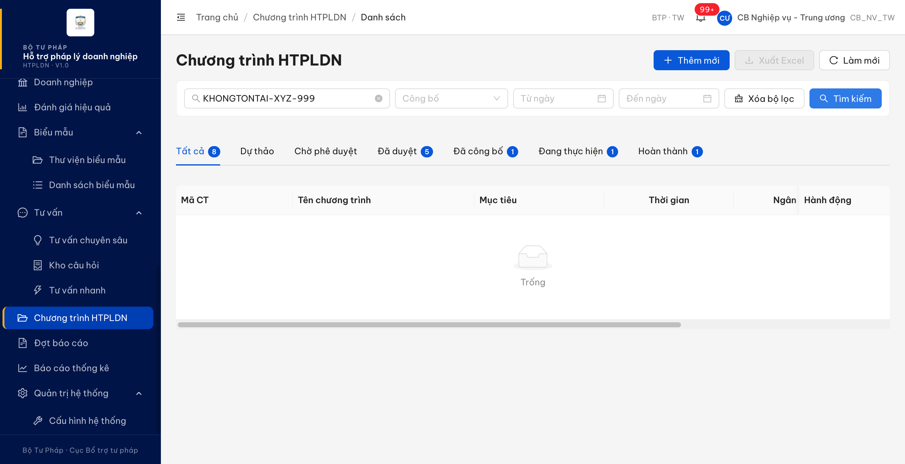

```
Doc bang ma lenh sau khi bam [Tim kiem]
  url                : /ct-htpldn/danh-sach?keyword=KHONGTONTAI-XYZ-999&page=1
  so dong bang       : 0
  chu mo ta khoi rong: "Trong"
  co chuoi dac ta?   : false   <-- "Khong tim thay chuong trinh phu hop" khong xuat hien

Doi chieu the "Du thao" (0 ban ghi, KHONG dat bo loc)
  o tim kiem         : ""      <-- da rong, khong phai loc khong khop
  so dong bang       : 0
  chu mo ta khoi rong: "Trong" <-- GIONG HET truong hop tren

Kiem dich vu du lieu cua man
  keyword=KHONGTONTAI-XYZ-999  -> HTTP 200, total 0   (thong bao: rong)
  keyword=CT-20260724-0001     -> HTTP 200, total 1
  khong loc                    -> HTTP 200, total 8
```

### Đo lại 28/07/2026 (R2) — đã đạt

Đo định lượng trên đúng màn Danh sách, nhập từ khóa bằng bàn phím rồi kiểm lại cả giá trị trong ô lẫn tham số gửi đi (tránh đo nhầm khi từ khóa chưa được gửi):

| Bước đo | Vai trò | Ô tìm kiếm | Tham số gửi đi | Số bản ghi | Chữ hiện ở thân bảng |
|---|---|---|:-:|:-:|---|
| Nền — không lọc | CB NV Trung ương | (rỗng) | (không) | **12** | — (có dữ liệu) |
| Từ khóa có thật | CB NV Trung ương | `Chương trình Lao động` | `keyword=Chương trình Lao động` | **1** (CT-20260724-0001) | — (có dữ liệu) |
| Từ khóa vô nghĩa | CB NV Trung ương | `KHONGTONTAI-XYZ-999` | `keyword=KHONGTONTAI-XYZ-999` | **0** | **"Không tìm thấy chương trình phù hợp"** |
| Danh sách vốn chưa có dữ liệu | CB NV Địa phương #01 | (rỗng) | (không) | **0** | **"Chưa có chương trình nào"** |

- Chuỗi đặc tả `INF-CT-TK-01` (`srs-fr-15-ct-htpldn.md:381` — đã mở file xác nhận lại dòng) hiện **đúng nguyên văn**. Quét toàn bộ chữ trên màn: chuỗi cũ **"Trống"** không còn xuất hiện.
- Hai tình huống nay **phân biệt được**: lọc không khớp → "Không tìm thấy chương trình phù hợp"; danh sách vốn rỗng (tài khoản Địa phương, đơn vị chưa có chương trình nào, không đặt bộ lọc) → "Chưa có chương trình nào".

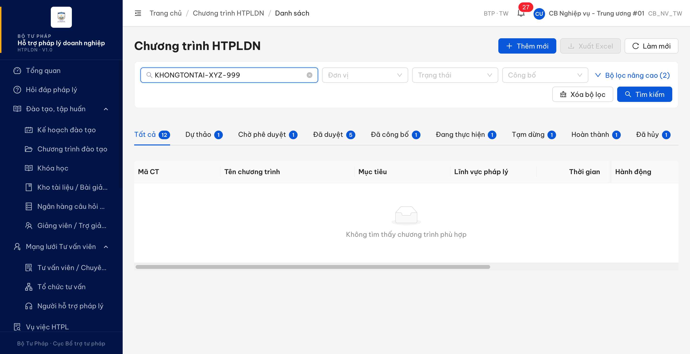

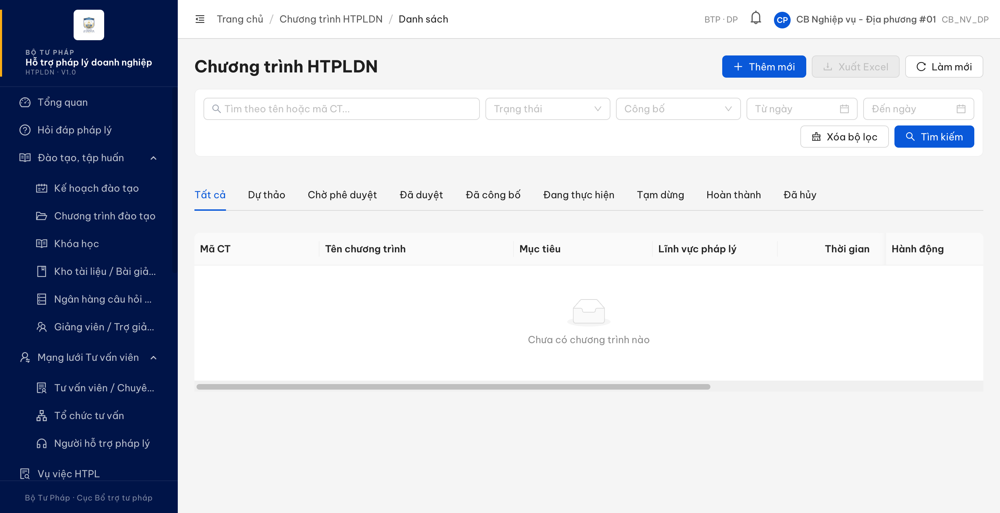

### So sánh với màn khác cùng hệ thống

Cùng dạng khiếu nại nhưng kết luận **ngược** với `TKCHTV_02` (Luồng 5, màn Kho câu hỏi / Tư vấn nhanh): ở đó chuỗi đối tác mong đợi *không tồn tại* trong SRS v3.5 nên phải chuyển BA. Ở màn này chuỗi **có**, gắn đúng FR và đúng màn, nên chấm Open thẳng. Điểm phân biệt là phạm vi của mã thông báo, không phải bản thân câu chữ.

---

## ~~BUG-BC-KHONG-LAP-DUOC-BAO-CAO~~ [CLOSED] — CB NV Địa phương không lập được báo cáo nháp; hệ thống báo "Bản ghi đã tồn tại" dù chưa có báo cáo nào

> **Re-test:** 2026-07-28 14:45:48 R2 — ✅ PASS (Closed-verified). Chạy lại đúng vai trò CB NV Địa phương (đơn vị ...8002-000000000006) trên cả 2 đợt: bấm [Lập báo cáo] → [Đồng ý] tạo được báo cáo nháp, biểu mẫu 21a chuyển sang chế độ nhập liệu với [Lưu nháp]/[Trình duyệt KQ], trạng thái nộp của đơn vị đổi từ chưa nộp sang đang lập và giữ nguyên sau khi tải lại trang. Không còn thông báo "Bản ghi đã tồn tại".

| Trường | Giá trị |
|---|---|
| **Severity** | Major |
| **Priority** | P1 |
| **Loại** | Chức năng |
| **Case đối tác** | LBCKQTHCT_01 (row 34) |
| **Màn hình** | Đợt báo cáo — Chi tiết (`/ct-htpldn/dot-bao-cao/{id}`) |
| **Tài khoản** | `cbnv_dp` — CB Nghiệp vụ - Địa phương (đơn vị `…8002-000000000006`) |
| **Căn cứ SRS** | `srs-fr-15-ct-htpldn.md:716`–`:718` · `:741` · `:746` |

### Mô tả

Cán bộ nghiệp vụ cấp Địa phương thuộc phạm vi đợt báo cáo **không lập được báo cáo kết quả**. Bấm **[Lập báo cáo]** → xác nhận → hệ thống từ chối với thông báo *"Bản ghi đã tồn tại — vui lòng thử lại"*.

Điểm mâu thuẫn: **chính hệ thống báo là chưa có báo cáo nào**. Cùng lúc đó, dữ liệu của màn trả về trạng thái nộp của đơn vị là *chưa nộp*, mã báo cáo là *rỗng*, và vẫn quảng bá thao tác "bắt đầu lập" là hợp lệ. Nghĩa là hai phần của hệ thống đang nói ngược nhau, và cán bộ bị chặn hoàn toàn khỏi nghiệp vụ.

Toàn bộ luồng FR-XI-06 dừng ở đây: không tạo được báo cáo nháp thì không nhập được số liệu 21a/21b, không lưu nháp, không trình duyệt, không nộp lên TW.

**Quan hệ với triệu chứng đối tác ghi hình:** phiếu báo lỗi 403 *"Đơn vị không nằm trong phạm vi truy cập của bạn"* ở bước **mở màn chi tiết**. Khi QA kiểm lại, bước đó **chạy được** (xem mục Bằng chứng). Điểm hỏng đã dịch sang bước kế tiếp. Kết quả mong đợi của phiếu vẫn không đạt.

### Bước tái hiện

1. Đăng nhập `cbnv_dp` / `Test@1234` (OTP qua MailHog).
2. Chọn menu **Đợt báo cáo** → danh sách hiện 2 đợt (`DOT-SO_BO_NAM-2026-1`, `DOT-SO_BO_6_THANG-2026-1`), cột Phạm vi ghi "83 đơn vị".
3. Bấm biểu tượng **Xem** ở dòng `DOT-SO_BO_NAM-2026-1` → màn chi tiết mở bình thường, hiện biểu mẫu 21a/TP/HTPLDN với 13 chỉ tiêu.
4. Bấm nút **[Lập báo cáo]** ở cuối trang.
5. Hộp thoại *"Bắt đầu lập báo cáo? — Hệ thống sẽ tạo báo cáo nháp để bạn nhập số liệu."* → bấm **[Đồng ý]**.
6. Đọc thông báo hiện ra.
7. *(Lặp lại bước 3–6 với đợt còn lại `DOT-SO_BO_6_THANG-2026-1`.)*

### Kết quả mong đợi

Theo `srs-fr-15-ct-htpldn.md:716`–`:718`, điều kiện tiên quyết của chức năng lập báo cáo gồm: *"User đã đăng nhập là CB NV cấp ĐP/BN"*, *"Đợt BC định kỳ đã tạo (FR-XI-05a) và đơn vị user nằm trong `pham_vi_don_vi_nop_ids[]`"*, và *"`DOT_BAO_CAO_DON_VI_NOP` của (đợt, đơn vị) ở trạng thái CHUA_NOP hoặc DANG_LAP"*.

Cả ba điều kiện đều đang thoả (xem Bằng chứng). Vì vậy khi cán bộ bấm lập báo cáo, hệ thống phải tạo được bản nháp và mở form nhập số liệu — `:741` mô tả bước xác minh trạng thái nộp, `:746` mô tả việc chuyển trạng thái nộp sang *đang lập*.

Nếu hệ thống cho rằng đã có báo cáo, thì phải mở báo cáo đang có đó ra cho cán bộ làm tiếp, chứ không được vừa báo "đã tồn tại" vừa không cho vào.

### Kết quả thực tế

1. **Bị chặn ở bước tạo bản nháp.** Bấm [Lập báo cáo] → [Đồng ý] → hiện thông báo lỗi *"Bản ghi đã tồn tại — vui lòng thử lại"*. Không có bản nháp nào được tạo, không có form nhập số liệu, trạng thái không đổi.

2. **Ba điều kiện tiên quyết đều thoả — đã kiểm từng cái:**
   - Vai trò: `CB_NV_DP`, cấp đơn vị `DP` ✔
   - Đơn vị nằm trong phạm vi: đọc danh sách đợt, đối chiếu mã đơn vị của tài khoản với danh sách đơn vị thuộc phạm vi → **có mặt ở CẢ HAI đợt** ✔
   - Trạng thái nộp: hệ thống trả về *chưa nộp* (`CHUA_NOP`), mã báo cáo *rỗng*, không có báo cáo đính kèm ✔

3. **Hệ thống tự mâu thuẫn.** Cùng một lần đọc dữ liệu màn chi tiết vừa cho biết "chưa nộp / chưa có báo cáo", vừa liệt kê thao tác "bắt đầu lập" là thao tác hợp lệ đang mở cho người dùng. Nhưng khi thực hiện đúng thao tác đó thì bị từ chối vì "đã tồn tại".

4. **Không phải lỗi của riêng một đợt.** Thử cả 2 đợt đang có, kết quả giống hệt nhau: cùng bị từ chối với cùng một mã lỗi. ⇒ Không phải dữ liệu hỏng của một bản ghi cá biệt.

5. **Không có đường đi vòng.** Màn chi tiết chỉ có duy nhất nút [Lập báo cáo]. Vì hệ thống khẳng định chưa có báo cáo nên cũng không có báo cáo nào để mở ra làm tiếp. Cán bộ bị chặn hoàn toàn.

6. **Bước mà phiếu báo lỗi thì lại chạy được.** Mở màn chi tiết đợt báo cáo bằng đúng vai trò CB NV Địa phương: vào được, không có màn 403, không có thông báo về phạm vi truy cập.

### Bằng chứng

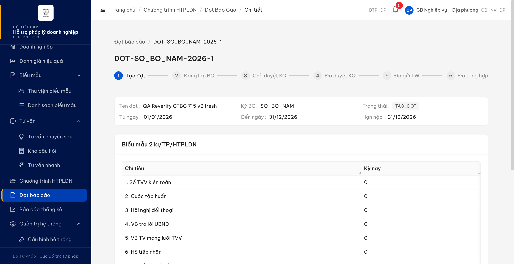

![BUG-BC-KHONG-LAP-DUOC-BAO-CAO — Hộp thoại "Bắt đầu lập báo cáo?" ngay trước khi bấm Đồng ý; phía sau là biểu mẫu 21a với 13 chỉ tiêu và nút [Lập báo cáo]](image/BUG-BC-hop-thoai-bat-dau-lap-bao-cao.png)

```
1) DIEU KIEN TIEN QUYET — do bang ma lenh, tai khoan cbnv_dp
   vai tro                       : CB_NV_DP        cap don vi: DP
   ma don vi cua toi             : ...8002-000000000006
   DOT-SO_BO_NAM-2026-1          : 83 don vi trong pham vi -> don vi cua toi CO trong pham vi = true
   DOT-SO_BO_6_THANG-2026-1      : 83 don vi trong pham vi -> don vi cua toi CO trong pham vi = true

2) TRANG THAI NOP CUA DON VI (doc tu du lieu man chi tiet)
   DOT-SO_BO_NAM-2026-1     -> trangThaiNop = "CHUA_NOP" | baoCaoId = null | baoCao = null
   DOT-SO_BO_6_THANG-2026-1 -> trangThaiNop = "CHUA_NOP" | baoCaoId = null | baoCao = null
   Thao tac he thong dang mo cho nguoi dung: "start" (bat dau lap)

3) KET QUA KHI THUC HIEN DUNG THAO TAC DO
   DOT-SO_BO_NAM-2026-1     -> HTTP 409  ERR-STATE-SYS-00-01  "Ban ghi da ton tai — vui long thu lai"
   DOT-SO_BO_6_THANG-2026-1 -> HTTP 409  ERR-STATE-SYS-00-01  "Ban ghi da ton tai — vui long thu lai"

   => He thong noi "chua co bao cao" va "duoc phep bat dau", nhung tu choi vi "da ton tai".

4) BUOC MA PHIEU BAO LOI THI CHAY DUOC
   Mo man chi tiet 2 dot bang tai khoan CB NV Dia phuong -> vao duoc, hien du thong tin dot + bieu mau 21a.
   Khong co man 403, khong co thong bao ve pham vi truy cap.
```

**Đo lại 28/07/2026 (R2) — đã hết lỗi:**

![BUG-BC-KHONG-LAP-DUOC-BAO-CAO — R2 đợt DOT-SO_BO_NAM-2026-1: ngay sau khi bấm Đồng ý, biểu mẫu 21a chuyển sang chế độ nhập liệu (chỉ tiêu 12, 13 thành ô nhập) và xuất hiện nút [Trình duyệt KQ]](image/R2-BUG-BC-KHONG-LAP-DUOC-BAO-CAO-form-nhap-lieu-va-nut-trinh-duyet.png)

![BUG-BC-KHONG-LAP-DUOC-BAO-CAO — R2 đợt DOT-SO_BO_NAM-2026-1 nhìn từ đầu trang: khối biểu mẫu 21a nay có 2 nút [Làm mới] và [Lưu nháp], nghĩa là báo cáo nháp đã được tạo](image/R2-BUG-BC-KHONG-LAP-DUOC-BAO-CAO-sau-khi-lap-form-nhap-lieu-mo.png)

![BUG-BC-KHONG-LAP-DUOC-BAO-CAO — R2 đợt DOT-SO_BO_6_THANG-2026-1 sau khi tải lại trang: vẫn giữ chế độ nhập liệu với [Lưu nháp], chứng tỏ bản nháp được lưu thật chứ không chỉ đổi trên màn hình](image/R2-BUG-BC-KHONG-LAP-DUOC-BAO-CAO-nhap-luu-sau-khi-tai-lai-trang.png)

```
DO LAI 28/07/2026 (R2) — tai khoan cbnv_dp_01 (CB_NV_DP, don vi ...8002-000000000006)

1) TRANG THAI TRUOC KHI BAM (doc tu du lieu man chi tiet)
   DOT-SO_BO_NAM-2026-1     -> trangThaiNop = "CHUA_NOP" | baoCaoId = null | baoCao = null
                               don vi cua toi CO trong pham vi 83 don vi = true
   Thao tac he thong dang mo cho nguoi dung: "start" (bat dau lap)

2) KET QUA KHI BAM [Lap bao cao] -> [Dong y]
   DOT-SO_BO_NAM-2026-1     -> thanh cong. Thong bao: "Da bat dau lap bao cao"
   DOT-SO_BO_6_THANG-2026-1 -> thanh cong. Thong bao: "Da bat dau lap bao cao"
   Khong con thong bao "Ban ghi da ton tai — vui long thu lai".

3) TRANG THAI SAU KHI BAM
   DOT-SO_BO_NAM-2026-1     -> trangThaiNop = "DANG_LAP" | bao cao nhap da duoc tao,
                               trang thai bao cao = "DU_THAO"
   Man hinh: bieu mau 21a chuyen sang che do nhap lieu, hien [Lam moi] [Luu nhap] [Trinh duyet KQ].

4) KIEM TRA GIU DUOC SAU KHI TAI LAI TRANG
   Tai lai man chi tiet DOT-SO_BO_6_THANG-2026-1 -> van o che do nhap lieu, van co [Luu nhap].
   Bam [Luu nhap] -> "Da luu nhap thanh cong".

=> Ca 3 dieu kien tien quyet van thoa nhu cu, nhung nay he thong tao duoc ban nhap
   va chuyen dung trang thai. Ket qua mong doi cua phieu DAT.
```

---

## ~~BUG-BC-TOAST-LOI-HIEN-2-LAN~~ [CLOSED] — Một lần bấm [Lập báo cáo] nhưng hiện 2 thông báo lỗi chồng nhau

> **Re-test:** 2026-07-28 14:46:46 R2 — ✅ PASS (Closed-verified). Đo lại bằng bộ bắt thông báo (không lọc trùng, tự kiểm chỉ 1 bộ đo đang chạy): mỗi lần bấm [Lập báo cáo] → [Đồng ý] chỉ gửi 1 yêu cầu và chỉ hiện 1 khung thông báo. Đo cả nhánh thành công (2 đợt) lẫn nhánh lỗi cố ý gây ra (bấm lại trên đơn vị đã có báo cáo) đều ra 1 yêu cầu / 1 thông báo.

| Trường | Giá trị |
|---|---|
| **Severity** | Minor |
| **Priority** | P3 |
| **Loại** | UI/UX |
| **Case đối tác** | LBCKQTHCT_01 (row 34) — QA phát hiện khi verify |
| **Màn hình** | Đợt báo cáo — Chi tiết (`/ct-htpldn/dot-bao-cao/{id}`) |
| **Tài khoản** | `cbnv_dp` — CB Nghiệp vụ - Địa phương |
| **Căn cứ SRS** | Không có dòng đặc tả riêng — lỗi hiển thị lặp, đối chiếu hành vi hợp lý của giao diện |

### Mô tả

Khi thao tác lập báo cáo bị từ chối, giao diện hiện **2 thông báo lỗi giống hệt nhau chồng lên nhau**, dù người dùng chỉ bấm một lần và hệ thống chỉ gửi đi **một** yêu cầu.

Đây là lỗi phụ đi kèm `BUG-BC-KHONG-LAP-DUOC-BAO-CAO`, nhưng tách riêng vì hướng sửa khác nhau: lỗi kia nằm ở phần xử lý nghiệp vụ, lỗi này nằm ở chỗ gắn thông báo vào giao diện. Sửa lỗi kia xong thì lỗi này vẫn còn với các thông báo khác.

### Bước tái hiện

1. Đăng nhập `cbnv_dp` / `Test@1234`.
2. Vào **Đợt báo cáo** → mở chi tiết `DOT-SO_BO_NAM-2026-1`.
3. Bấm **[Lập báo cáo]** → **[Đồng ý]** (đúng một lần).
4. Quan sát góc trên màn hình ngay trong khoảng 3 giây đầu.

### Kết quả mong đợi

Một thao tác của người dùng dẫn tới một lần hệ thống phản hồi thì chỉ hiển thị **một** thông báo. Thông báo lặp làm người dùng tưởng đã bấm nhiều lần hoặc hệ thống đã gửi nhiều yêu cầu.

### Kết quả thực tế

Hiện **2 thông báo** cùng nội dung *"Bản ghi đã tồn tại — vui lòng thử lại"*, sinh ra trong cùng một mốc thời gian.

Đã loại khả năng do bấm trùng hoặc gửi trùng yêu cầu: theo dõi tầng mạng cho thấy chỉ có **đúng 1 yêu cầu** được gửi đi cho lần bấm đó. Vậy 2 thông báo đến từ việc giao diện gắn xử lý hiển thị lỗi ở hai nơi cho cùng một phản hồi.

### Bằng chứng

```
Bo bat thong bao (chi dem the bao ngoai, KHONG loc trung), 1 lan bam [Dong y]:
  so thong bao hien ra : 2
  [1] t=1785138553169  "Ban ghi da ton tai — vui long thu lai"
  [2] t=1785138553169  "Ban ghi da ton tai — vui long thu lai"

Doi chieu tang mang cho dung lan bam do:
  POST .../dot-bao-caos/e9909d96-.../start   -> 409   (dung 1 yeu cau)

=> 1 thao tac + 1 yeu cau nhung 2 thong bao.
```

*Ghi chú về ảnh:* thông báo tự tắt sau ~3 giây nên không kịp lọt vào ảnh chụp màn hình; QA giữ lại bản đọc trực tiếp từ giao diện ở trên cùng phản hồi tầng mạng làm bằng chứng, vì đây là dữ liệu chính xác hơn ảnh.

**Đo lại 28/07/2026 (R2) — không còn nhân đôi:**

```
Bo do: bo bat thong bao dung chung cua doi QA (KHONG loc trung, doc bang chu NHIN THAY).
Truoc moi phep do deu chay TU KIEM -> "so bo do dang chay = 1" (so lieu hop le).
Tai khoan cbnv_dp_01 (CB_NV_DP, don vi ...8002-000000000006).

A) NHANH THANH CONG — bam [Lap bao cao] -> [Dong y], moi dot dung 1 lan
   DOT-SO_BO_NAM-2026-1      so yeu cau gui di = 1 | so khung thong bao = 1
                             chu: "Da bat dau lap bao cao"
   DOT-SO_BO_6_THANG-2026-1  so yeu cau gui di = 1 | so khung thong bao = 1
                             chu: "Da bat dau lap bao cao"

B) NHANH LOI — co y tao lai tinh huong loi de do dung hanh vi cu:
   mo man chi tiet dot 6 thang o mot cua so, tao bao cao o cua so khac,
   roi quay lai bam [Lap bao cao] tren cua so cu (= bam lan 2 tren don vi DA CO bao cao).
   Lap lai 4 lan, lan nao cung:
       so yeu cau gui di = 1 | so khung thong bao = 1
       chu: "Don vi da bat dau lap bao cao cho dot nay"

C) DOI CHUNG THEM — nut [Luu nhap] tren cung man:
       so yeu cau gui di = 1 | so khung thong bao = 1
       chu: "Da luu nhap thanh cong"

=> Khong con truong hop 1 yeu cau ma hien 2 thong bao. Loi hien thi lap da het.
   Ghi nhan them: chu cua thong bao loi nay da doi tu cau chung chung
   "Ban ghi da ton tai — vui long thu lai" sang cau dung nghiep vu
   "Don vi da bat dau lap bao cao cho dot nay".
```

*Ghi chú về ảnh (R2):* thông báo vẫn tự tắt sau ~3 giây và công cụ chụp màn hình của QA trả về khung hình cũ nên không chụp được đúng khoảnh khắc thông báo hiện; QA giữ lại số đo trực tiếp từ giao diện (đã tự kiểm bộ đo) làm bằng chứng, đúng như cách đã dùng khi log bug này.

---

## ~~BUG-API-TIM-VUVIEC-BAO-LOI-UUID~~ [CLOSED] — API tìm kiếm vụ việc cho hệ thống tích hợp trả 400 đòi mã định danh, dù thao tác là tìm theo từ khóa

> **Re-test:** 2026-07-30 22:05:00 R3 — ✅ PASS (đóng theo **xác nhận của chủ đợt UAT**, KHÔNG phải phép đo của QA). QA dò lại cổng API lúc 30/07/2026 15:00 UTC: cả đường dẫn thật `\`/api/v1/public/vu-viecs/search\`` lẫn một đường dẫn bịa ra đều trả 401 `ERR-AUTH-MTLS-01` ⇒ vẫn bị chặn **trước định tuyến** vì môi trường chưa cấp chứng thư số phía khách, nên QA không tái hiện được để tự chấm. Ghi rõ nguồn kết luận ở đây để người đọc lại hồ sơ không hiểu nhầm là QA đã đo lại.

| Trường | Giá trị |
|---|---|
| **Severity** | Major |
| **Priority** | P1 |
| **Loại** | Backend |
| **Case đối tác** | TKVVHTPLDN_01 (row 35) |
| **Màn hình** | Không có giao diện — API tích hợp dành cho hệ thống bên ngoài (`GET /api/v1/public/vu-viecs/search`) |
| **Tài khoản** | Hệ thống tiêu thụ bên ngoài (Cổng PLQG) — không phải tài khoản cán bộ |
| **Căn cứ SRS** | `srs-fr-16-api.md:680` (FR-XII-08 — API Tìm kiếm vụ việc, UC178) · `:686` · `:696` · `:698` · `:705` · `danh-sach-api.md:67` |

> ⚠️ **Đọc mục "Kết quả thực tế" trước.** Số liệu lỗi trong bug này lấy từ **bản ghi hình trong phiếu đối tác**, KHÔNG phải từ phép đo của QA — QA bị chặn hoàn toàn khỏi nhóm API này. Phần QA tự kiểm và tự chịu trách nhiệm là **đối chiếu hợp đồng API** ở mục Bằng chứng.

### Mô tả

Chức năng tìm kiếm vụ việc của nhóm API tích hợp nhận **từ khóa** (chuỗi văn bản) và phải trả về danh sách vụ việc khớp từ khóa. Thực tế hệ thống từ chối lời gọi với mã lỗi thuộc nhóm **kiểm tra tham số**, kèm thông báo đòi một **mã định danh** — trong khi chức năng này không có tham số nào ở dạng mã định danh là bắt buộc, và bên gọi cũng không gửi tham số dạng đó.

Hệ quả: hệ thống bên ngoài (Cổng PLQG) **không tra cứu được vụ việc theo từ khóa**. Đây là một trong hai chức năng của nhóm vụ việc; chức năng còn lại (lấy danh sách) vẫn hoạt động, nên bên tiêu thụ chỉ lấy được toàn bộ danh sách rồi tự lọc phía họ, không dùng được tìm kiếm toàn văn theo độ liên quan như đặc tả mô tả.

### Bước tái hiện

1. Dùng một hệ thống tiêu thụ đã được cấp quyền truy cập nhóm API tích hợp (chứng thư số phía khách + phạm vi `htpldn:vu-viec:search`).
2. Gọi chức năng **lấy danh sách vụ việc công khai** để lấy tiêu đề của một vụ việc đang có → ghi lại tiêu đề đó.
3. Gọi chức năng **tìm kiếm vụ việc công khai**, truyền tham số `keyword` bằng đúng tiêu đề vừa lấy ở bước 2.
4. Đọc mã trạng thái và thân phản hồi.
5. Lặp lại bước 3 với một từ khóa khác (bỏ dấu) để loại khả năng lỗi do ký tự có dấu.

### Kết quả mong đợi

Theo `srs-fr-16-api.md:696`, đầu vào của chức năng này là *"keyword (text, Y) + linh_vuc_id + trang_thai + page + size"* — chỉ **từ khóa** là bắt buộc. `:698` mô tả xử lý: *"Xác thực JWT -> rate limit -> tìm kiếm toàn văn trên lĩnh vực, đơn vị, mã vụ việc -> loại trừ thông tin nhạy cảm -> sắp relevance, phân trang -> ghi log"*. Tiêu chí nghiệm thu `:705` ghi rõ: *"**Given** consumer gửi keyword "hợp đồng" **When** search **Then** trả DS VV liên quan đến hợp đồng"*.

Vậy khi bên tiêu thụ gửi một từ khóa hợp lệ, hệ thống phải trả về danh sách vụ việc khớp từ khóa (kèm phân trang), không được từ chối lời gọi.

### Kết quả thực tế

**Nguồn số liệu: bản ghi hình trong phiếu đối tác** (`TKVVHTPLDN_01.webm`, QA đã trích 8 khung hình và đọc tới khoảnh khắc lỗi). **QA không tái hiện lại được** — xem mục "Vì sao QA không kiểm lại được" bên dưới.

Hệ thống trả **400 Bad Request** cho cả 2 lần thử, thân phản hồi:

```
{
  "success": false,
  "error": {
    "code": "ERR-VAL-SYS-00-00",
    "message": "Validation failed (uuid is expected)",
    "timestamp": "2026-07-23T03:35:22.265Z",
    "requestId": "49e00921-d3fd-4e2c-b764-884124e6eb1a"
  }
}
```

| Lần | Từ khóa gửi | Kết quả |
|:-:|---|---|
| 1 | `tieu de vu viec` (bỏ dấu) | 400 · `ERR-VAL-SYS-00-00` · 867 B · 46 ms |
| 2 | `Tiêu đề vụ việc` (trùng khớp tiêu đề một vụ việc đang có) | 400 · `ERR-VAL-SYS-00-00` · 867 B · 24 ms |

**Đối chứng trong cùng phiên làm việc:** chức năng lấy danh sách vụ việc công khai trả **200 OK** với dữ liệu thật (mã `VV-BKH-20260526-001`, tiêu đề *"Tiêu đề vụ việc"*, lĩnh vực *Thuế*, trạng thái `DA_DUYET`). ⇒ **quyền truy cập của bên gọi hoạt động bình thường**; lỗi 400 không phải lỗi xác thực và cũng không phải do thiếu dữ liệu.

**Vì sao QA không kiểm lại được:** toàn bộ bề mặt `/api/v1/public/*` yêu cầu chứng thư số phía khách mà QA chưa được cấp, trả `ERR-AUTH-MTLS-01` cho mọi lời gọi. Chặn xảy ra **trước định tuyến** (một đường dẫn `public/` bịa ra cũng trả 401, còn đường dẫn bịa ngoài nhóm `public/` trả 404). Đã thử cạn kiệt 10 hướng vào: giả lập các tiêu đề xác thực · 6 cổng ứng dụng trực tiếp · 5 cổng HTTPS thay thế · đường dẫn theo đặc tả · kiểm bước bắt tay bảo mật (máy chủ **không** yêu cầu chứng thư ở bước này nên kể cả có chứng thư cũng chưa trình lên được) · rà mã nguồn giao diện (0 lần gọi nhóm API này) · rà hồ sơ tài khoản được bàn giao (không có chứng thư/khóa nào).

### Bằng chứng

**Phần QA tự kiểm được và chịu trách nhiệm — đối chiếu hợp đồng API của chính bản triển khai** (`GET /api/docs-json`, HTTP 200, 1.529.509 byte, 530 đường dẫn, không cần xác thực; nguồn độc lập với phiếu đối tác):

```
GET /api/v1/public/vu-viecs/search      "Tìm kiếm vụ việc công khai"
   tham so keyword        BAT BUOC = True   kieu = {"minLength": 2, "type": "string"}
   tham so linhVucId      BAT BUOC = False  kieu = {"format": "uuid", "type": "string"}
   tham so trangThai      BAT BUOC = False  kieu = enum[HOAN_THANH, DA_DUYET, DA_DANH_GIA]
   tham so doanhNghiepId  BAT BUOC = False  kieu = {"format": "uuid", "type": "string"}

GET /api/v1/public/vu-viecs/{id}        "Chi tiết vụ việc theo quyền sở hữu"
   tham so id             BAT BUOC = True   (path)
   tham so doanhNghiepId  BAT BUOC = True   kieu = {"format": "uuid", "type": "string"}
```

Bốn điểm rút ra:

1. Đường dẫn đối tác gọi **là đường dẫn có thật** trong hợp đồng API đang công bố ⇒ không phải gọi sai đường dẫn.
2. Tham số bắt buộc duy nhất là `keyword`, chuỗi tối thiểu 2 ký tự. Cả 2 giá trị trong phiếu đều hợp lệ ⇒ không phải thiếu hoặc sai định dạng tham số.
3. Chức năng này **không có tham số bắt buộc nào kiểu mã định danh**; 2 tham số kiểu đó đều tùy chọn và phiếu không gửi ⇒ **thông báo đòi mã định danh không thể phát sinh từ dữ liệu người gọi nhập**. Đây là điểm then chốt loại bỏ khả năng lỗi do người dùng.
4. Mã lỗi thuộc nhóm kiểm tra tham số ⇒ phát sinh **trước** khi truy vấn dữ liệu ⇒ kết quả không phụ thuộc vai trò người gọi, không phụ thuộc trạng thái hay số lượng bản ghi vụ việc. Đối tác cũng chứng minh gián tiếp: 2 từ khóa khác nhau, cùng một lỗi.

**Gợi ý hướng truy nguyên (giả thuyết — dev tự quyết cách sửa):** đường dẫn liền kề cùng nhóm là *xem chi tiết vụ việc theo mã định danh* và nó **bắt buộc** một tham số kiểu mã định danh. Đề nghị dev kiểm xem lời gọi tìm kiếm có bị xử lý nhầm sang nhánh xem chi tiết hay không.

**Tệp bằng chứng:**

- [BUG-API-tim-vu-viec-400-doi-chieu-hop-dong.log.txt](image/BUG-API-tim-vu-viec-400-doi-chieu-hop-dong.log.txt) — lời gọi đối tác đã thực hiện (đọc từ khung hình), hợp đồng API đầy đủ, và 6 kết luận rút ra kèm trích dẫn đặc tả.
- [BLOCKER-TKVVHTPLDN_01-cong-api-cong-khai-mtls.log.txt](image/BLOCKER-TKVVHTPLDN_01-cong-api-cong-khai-mtls.log.txt) — bảng 10 hướng vào đã thử + nhật ký gọi thật, chứng minh QA đã cạn kiệt cách kiểm.
- `../reverify-audit/TKVVHTPLDN_01/frames/t015.44s.jpg` và `t022.17s.jpg` — 2 khung hình bắt đúng khoảnh khắc lỗi (URL, tham số, mã 400 và thân phản hồi đọc được rõ).
- `../reverify-audit/TKVVHTPLDN_01/frames/t009.38s.jpg` — khung đối chứng: chức năng lấy danh sách trả 200 với dữ liệu thật trong cùng phiên.

### So sánh

| Chức năng cùng nhóm API tích hợp | Kết quả trong phiếu |
|---|---|
| Lấy danh sách vụ việc công khai (FR-XII-07) | 200 OK — trả dữ liệu bình thường |
| **Tìm kiếm vụ việc công khai (FR-XII-08)** | **400 — bị từ chối** |

Hai chức năng dùng cùng một cách xác thực, cùng một nhóm dữ liệu, khác nhau ở chỗ một cái có đoạn `/search`. Đặt cạnh nhau để dev khoanh vùng: phần xác thực và phần dữ liệu đều bình thường, vấn đề nằm ở riêng nhánh xử lý tìm kiếm.

---

## ~~BUG-CT-XUAT-EXCEL-NGAYTAO-MUIGIO~~ [CLOSED] — Cột "Ngày tạo" trong tệp Excel xuất ghi sớm hơn giờ thật 7 tiếng và sai định dạng ngày

> **Re-test:** 2026-07-29 10:15:00 R3 — ✅ PASS (Closed-verified). Tạo mới CT-20260729-0001 lúc 10:07 giờ VN rồi xuất tệp ngay: ô Ngày tạo ghi '29/07/2026' dạng chuỗi dd/MM/yyyy, hết lệch 7 tiếng và hết định dạng tháng-ngày-năm. Đối chiếu 13/13 dòng có ngày trong mã CT: khớp tuyệt đối, CT-20260724-0001 nay ghi 24/07 thay vì 23/07.

### Mô tả

Ở màn **Chương trình HTPLDN**, bấm **[Xuất Excel]**. Cột cuối cùng của tệp — **"Ngày tạo"** — ghi giờ **sớm hơn giờ thật đúng 7 tiếng**, bằng đúng khoảng cách giữa giờ Việt Nam và giờ quốc tế. Vì bị lùi 7 tiếng, bản ghi nào được tạo trong khoảng **00:00–06:59 giờ Việt Nam** sẽ bị ghi **lùi sang ngày hôm trước**. Điều này **đã xảy ra trong dữ liệu hiện có**: `CT-20260724-0001` có mã sinh theo ngày **24/07** nhưng ô "Ngày tạo" của chính nó ghi **23/07**.

Cùng ô đó còn ghi ở **dạng thô kèm phần lẻ mili-giây** (`2026-07-28 08:21:19.443`) và được đặt định dạng **tháng-ngày-năm kiểu Mỹ**, nên khi mở bằng Excel ô hiển thị `07-28-26` và **mất hẳn phần giờ**.

Đây là **cột khác** với 2 cột "Thời gian bắt đầu / kết thúc" của `BUG-CT-XUAT-EXCEL-SAI-NGAY` — 2 cột đó dev đã sửa xong, nay ghi đúng `dd/MM/yyyy` và khớp màn hình 12/12 dòng. Cột "Ngày tạo" không nằm trong phạm vi lần sửa đó nên vẫn giữ cách ghi cũ.

> **Điểm cần BA lưu ý khi tiếp nhận:** `srs-fr-15-ct-htpldn.md:396` liệt kê tệp xuất gồm **10 cột và không có "Ngày tạo"** (tệp thực tế có 13 cột — thêm "Là công bố", "Ngày tạo", và tách "Thời gian" thành 2 cột). QA vẫn ghi nhận là lỗi vì quy ước múi giờ và định dạng ngày ở `srs-v3.5.md` áp cho **toàn hệ thống**, cột nào đã hiện ra cho người dùng thì phải theo. Nếu BA chốt cột này không thuộc đặc tả thì hướng xử lý là **bỏ cột**, chứ không để nguyên cách ghi hiện tại.

### Các bước tái hiện

1. Đăng nhập role **`CB_NV_TW`** (tài khoản `cbnv_tw_01`, đơn vị Cục Bổ trợ tư pháp · TW) — vai trò có quyền tạo và xuất danh sách chương trình.
2. Vào **Chương trình HTPLDN**.
3. Bấm **[+ Thêm CT]**, điền các trường bắt buộc rồi bấm lưu. **Ghi lại giờ đồng hồ tại thời điểm bấm lưu** và **mã CT** hệ thống sinh ra.
4. Bấm **[Xuất Excel]**, mở tệp tải về, tìm dòng của mã CT vừa tạo.
5. Đọc ô cột **"Ngày tạo"** → so với giờ đã ghi ở bước 3.
6. **Cách đối chiếu không cần đồng hồ** (dùng dữ liệu có sẵn): tìm dòng `CT-20260724-0001` trong cùng tệp → so **ngày trong mã CT** (24/07) với **ngày trong ô "Ngày tạo"** (23/07).
7. **Cách đối chiếu nội bộ ứng dụng:** vào **Tư vấn → Kho câu hỏi**, cuộn sang phải đọc cột "Ngày tạo" của một câu hỏi → đây là cách chính ứng dụng hiển thị ngày tạo cho người dùng, so với cách tệp Excel màn CT đang ghi.

### Kết quả mong đợi

- Ngày giờ hiển thị cho người dùng phải theo **giờ Việt Nam** — `srs-v3.5.md:4640` (**I18N-06**): *"Múi giờ | Asia/Ho_Chi_Minh (UTC+7). Server và client cùng múi giờ | ✅ CĐT xác nhận"*.
- Ngày phải theo định dạng **`dd/MM/yyyy`** — `srs-v3.5.md:4637` (**I18N-03**): *"Định dạng ngày | dd/MM/yyyy (ví dụ: 25/03/2026)"*, nhắc lại ở `:575` (**UI-06**): *"Định dạng ngày: dd/MM/yyyy"*.
- Giá trị trong tệp xuất phải **nhất quán với cách chính ứng dụng đang hiển thị** cùng loại dữ liệu: màn Kho câu hỏi hiển thị ngày tạo là `28/07/2026 11:52` (đã theo giờ Việt Nam, đúng định dạng).
- Ngày ghi trong tệp phải **cùng ngày** với ngày nằm trong mã chương trình, vì cả hai đều lấy từ thời điểm tạo bản ghi.

### Kết quả thực tế

**Đo trên bản ghi tạo mới ngay trong phiên — `CT-20260728-0005`:**

| Nguồn | Giá trị |
|---|---|
| Đồng hồ máy lúc bấm lưu | `2026-07-28 15:21:16 +07` → `15:21:22 +07` |
| Đồng hồ máy chủ (tiêu đề phản hồi của chính yêu cầu tạo) | `Tue, 28 Jul 2026 08:21:19 GMT` = **15:21:19 giờ VN** — máy chủ khớp máy trạm |
| Ô "Ngày tạo" trong tệp Excel | **`2026-07-28 08:21:19.443`** |
| **Chênh lệch** | **đúng 7 giờ 00 phút 00 giây** |

**Thuộc tính ô — so 2 cột trong cùng một dòng:**

| | Ô "Ngày tạo" | Ô "Thời gian bắt đầu" *(cột đã được sửa)* |
|---|---|---|
| Giá trị | `datetime(2026, 7, 28, 8, 21, 19, 443000)` | `'01/01/2026'` |
| Kiểu dữ liệu | `datetime` (ngày giờ thô) | `str` (chuỗi) |
| Định dạng ô | **`mm-dd-yy`** (tháng-ngày-năm kiểu Mỹ) | `General` |

Cả **13/13 dòng** của cột "Ngày tạo" đều mang định dạng `mm-dd-yy`. Cột đã sửa thì ghi sẵn thành chuỗi `dd/MM/yyyy` nên hiển thị đúng ở mọi máy; cột "Ngày tạo" thì không.

**Bằng chứng không phụ thuộc đồng hồ — mâu thuẫn ngay trong cùng một tệp:**

| Mã CT | Ngày nằm trong mã | Ô "Ngày tạo" trong tệp | |
|---|---|---|---|
| `CT-20260724-0001` | **24**/07/2026 | `2026-07-**23** 18:29:59` | ❗ lùi sang ngày hôm trước |
| `CT-20260728-0001` | 28/07/2026 | `2026-07-28 07:13:53.845` | +7 = 14:13:53 giờ VN — khớp lượt đo trước, lỗi ổn định |

**Mâu thuẫn nội bộ giữa 2 màn của cùng ứng dụng** (cùng loại dữ liệu "ngày tạo"):

| Nơi hiển thị | Giá trị |
|---|---|
| Màn Kho câu hỏi (giao diện) | `28/07/2026 11:52` — đã theo giờ Việt Nam, đúng định dạng |
| Tệp Excel màn CT HTPLDN | `2026-07-28 08:21:19.443` — giờ quốc tế, định dạng thô |

**Người dùng không có cách tự phát hiện:** màn Chương trình HTPLDN **không hiển thị "Ngày tạo" ở bất kỳ đâu** — bảng danh sách 10 cột (đã cuộn hết sang phải để kiểm) và màn chi tiết đều không có trường này. Sai lệch 7 tiếng chỉ lộ ra khi mở tệp xuất.

### Bằng chứng

**1. Ảnh chụp**

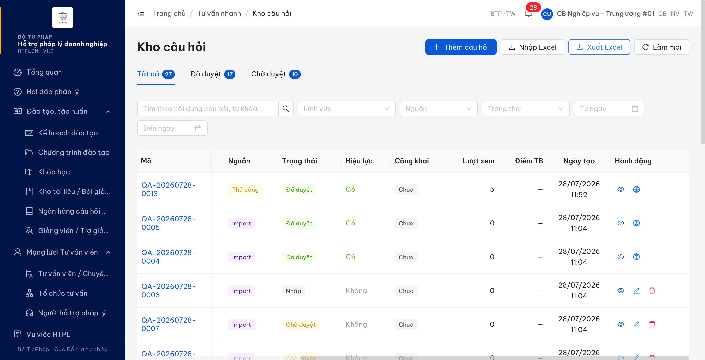

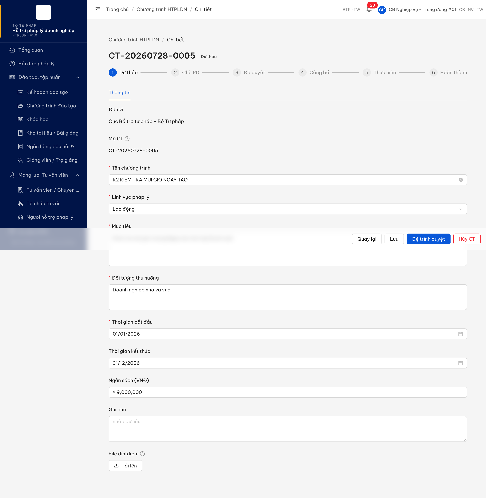

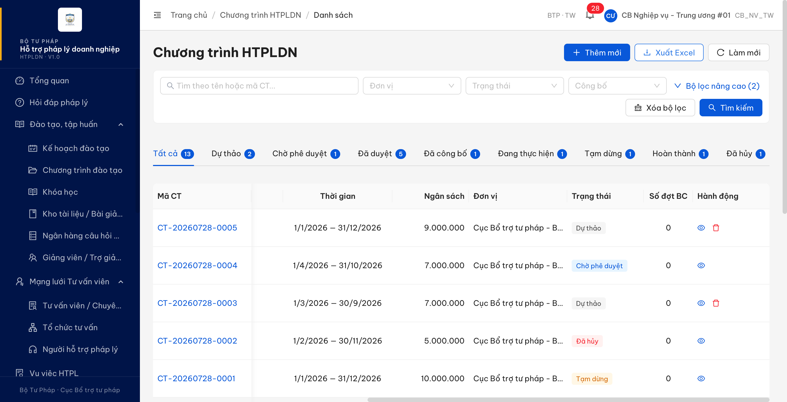

**2. Nội dung tệp đã đọc** *(phụ trợ)*

Bản đọc đầy đủ 2 tệp (dãy tiêu đề cột, thuộc tính từng ô, toàn bộ dữ liệu, mã kiểm tra sha256, bảng đối chiếu cột "Ngày tạo" cho cả 13 bản ghi): [R2-BUG-CT-NGAYTAO-MUIGIO-noi-dung-tep.log.txt](image/R2-BUG-CT-NGAYTAO-MUIGIO-noi-dung-tep.log.txt)

#### Đo lại 29/07/2026 (R3) — ✅ đã hết lỗi

**Phép thử quyết định — dựng bản ghi mới ngay trong phiên đo:** tạo `CT-20260729-0001` lúc **10:07:20–10:07:25 giờ VN** (đồng hồ máy ghi trước và sau khi bấm Lưu) → bấm [Xuất Excel] ngay → ô "Ngày tạo" của chính dòng đó ghi **`'29/07/2026'`**, kiểu **chuỗi**, định dạng ô **`General`**.

| Hạng mục | R2 (28/07) | R3 (29/07) |
|---|---|---|
| Giá trị ô "Ngày tạo" | `datetime(2026,7,28,8,21,19,443000)` — giờ quốc tế | `'29/07/2026'` — ngày giờ Việt Nam |
| Kiểu dữ liệu ô | `datetime` (ngày giờ thô kèm mili-giây) | `str` |
| Định dạng ô | `mm-dd-yy` (tháng-ngày-năm kiểu Mỹ) | `General` (giá trị đã sẵn `dd/MM/yyyy`) |
| Lệch so với giờ thật | **đúng 7 tiếng** | **0** |

**Bằng chứng không phụ thuộc đồng hồ — quét toàn bộ tệp:** đối chiếu *ngày nằm trong mã CT* với *ô "Ngày tạo"* cho **13/13 dòng có mã mang ngày** → **0 dòng lệch**. Riêng `CT-20260724-0001` — dòng từng là bằng chứng khoá của bug (mã ngày 24/07 nhưng ô ghi 23/07) — nay ghi đúng **`24/07/2026`**.

**Định dạng toàn bộ cột ngày trong tệp:** `Thời gian bắt đầu` 14/14 `dd/MM/yyyy` · `Thời gian kết thúc` 12/12 `dd/MM/yyyy` (2 ô trống là CT chưa có ngày kết thúc) · `Ngày tạo` **14/14 `dd/MM/yyyy`**.

> **Ghi chú phạm vi:** cột "Ngày tạo" nay chỉ còn phần ngày, không còn phần giờ. QA **không tính đây là lỗi**: hai điều đặc tả ràng buộc là múi giờ (I18N-06) và định dạng ngày (I18N-03) đều đã đạt; `srs-fr-15-ct-htpldn.md:396` vốn không liệt kê cột này nên cũng không quy định nó phải kèm giờ.

**Bằng chứng R3:**


Bản đọc đầy đủ tệp `ct-htpldn-2026-07-29.xlsx` (sha256, tiêu đề cột, bảng đối chiếu 14 dòng, thống kê định dạng từng cột ngày): [R3-BUG-CT-NGAYTAO-noi-dung-tep.log.txt](image/R3-BUG-CT-NGAYTAO-noi-dung-tep.log.txt)

```
Tep : ct-htpldn-2026-07-28.xlsx | sheet "Chương trình HTPL" | 13 dong x 13 cot
Cot : Ma CT | Ten CT | Muc tieu | Doi tuong | Trang thai | Linh vuc | Don vi |
      Thoi gian bat dau | Thoi gian ket thuc | Ngan sach | La cong bo | So dot BC | Ngay tao

O M2 (Ngay tao)          value=datetime(2026,7,28,8,21,19,443000)  format='mm-dd-yy'
O H2 (Thoi gian bat dau) value='01/01/2026'                        format='General'

Gio may luc bam luu      : 2026-07-28 15:21:16 +07
Gio may chu (header date): Tue, 28 Jul 2026 08:21:19 GMT = 15:21:19 gio VN
O "Ngay tao" trong tep   : 2026-07-28 08:21:19.443   -> lech 7h00m00s
```

---

## ~~BUG-XUAT-TEP-LECH-MUI-GIO~~ [CLOSED] — Tệp xuất ghi ngày theo giờ quốc tế: 20 bản ghi trên 3 màn bị lùi sang ngày hôm trước

> **Re-test:** 2026-07-29 18:10:00 R4 — ✅ PASS (Closed-verified). Bộ lọc ngày màn Nhật ký hệ thống nay khoanh đúng: lọc 22/07→22/07 trả 141 dòng đều là 22/07 (13:36–23:58), lọc 23/07→23/07 trả 180 dòng đều là 23/07 (00:01–15:51) — mốc 00:01 chứng minh chặn dưới đã về 00:00 giờ Việt Nam, không còn dòng nào của ngày kế bên lọt vào. Phần tệp xuất vẫn đạt: quét lại 1.794 ô ngày trên 29 tệp, 0 ô sai dd/MM/yyyy.

### Mô tả

Rà **16 chức năng xuất tệp** trên toàn ứng dụng (nút **[Xuất Excel]** / **[Xuất PDF]**). Ngày giờ trong tệp xuất **không được quy đổi về giờ Việt Nam** mà giữ nguyên **giờ quốc tế** — tức sớm hơn giờ thật đúng **7 tiếng**.

Nói cho dễ hình dung: bản ghi nào có mốc thời gian rơi vào khoảng **00:00–06:59 sáng giờ Việt Nam**, khi trừ đi 7 tiếng sẽ lùi về **ngày hôm trước**. Lúc đó tệp không chỉ hiện sai giờ mà **ghi sai hẳn ngày**.

Đây không còn là suy đoán. Đã đối chiếu **từng dòng** giữa màn hình và tệp trên cả 16 chức năng: **20 bản ghi trên 3 màn đang mang ngày sai**, trong đó có trường hợp **lùi qua tận tháng trước** — màn hình `01/03/2026`, tệp ghi `28/2/2026`.

Kèm theo, cùng một loại dữ liệu "ngày" nhưng **mỗi màn ghi một kiểu**: có màn `27/7/2026`, có màn `07:00 25/07/2026` (giờ đặt trước ngày), có màn `19:38 24/7/26` (năm 2 chữ số), có màn để Excel hiện theo kiểu Mỹ tháng-ngày-năm. Chỉ **2/12 màn** ghi đúng `dd/MM/yyyy`.

`BUG-CT-XUAT-EXCEL-NGAYTAO-MUIGIO` (dòng phiếu `KHTHCTHTPLDN_OOS_07`) là **một ca lẻ của đúng lỗi này**, ghi trước khi rà toàn hệ thống. Bug này ghi phần còn lại và phần nặng hơn: **sai chính giá trị ngày**, không chỉ sai cách hiển thị.

### Các bước tái hiện

Ví dụ rõ nhất là màn **Vụ việc HTPL** — không cần đồng hồ, chỉ so màn hình với tệp:

1. Đăng nhập **`cbnv_tw_01`** (CB Nghiệp vụ · Trung ương · Cục Bổ trợ tư pháp).
2. Vào **Vụ việc HTPL → Danh sách**.
3. Đọc cột **"Ngày tiếp nhận"** của dòng `VV-QAW7-DG01` trên màn hình → ghi lại.
4. Bấm **[Xuất Excel]**, mở tệp tải về, tìm đúng dòng `VV-QAW7-DG01`, đọc cột "Ngày tiếp nhận".
5. So hai giá trị.
6. Lặp cách trên cho **Biểu mẫu → Thư viện biểu mẫu** (cột "Ngày tạo", dòng `QA-DESELECT-B`) và **Đánh giá hiệu quả → Kế hoạch đánh giá** (dòng `DG-20260725-0002`).

### Kết quả mong đợi

- Ngày giờ đưa tới người dùng — **kể cả trong tệp xuất** — phải theo giờ Việt Nam. `srs-v3.5.md:4640` (**I18N-06**): *"Múi giờ | Asia/Ho_Chi_Minh (UTC+7). Server và client cùng múi giờ | ✅ CĐT xác nhận"*.
- Ngày phải theo định dạng **`dd/MM/yyyy`**. `srs-v3.5.md:4637` (**I18N-03**): *"Định dạng ngày | dd/MM/yyyy (ví dụ: 25/03/2026)"*; nhắc lại ở `srs-v3.5.md:575` (**UI-06**): *"Định dạng ngày: dd/MM/yyyy"*.
- Giá trị trong tệp phải **trùng với giá trị màn hình đang hiển thị cho cùng bản ghi** — người dùng bấm xuất tệp là để giữ lại đúng thứ họ vừa nhìn thấy. `srs-fr-11-bao-cao.md:1280` (**BR-DATA-06**) đặt tệp xuất ở thế bám theo màn hình: *"File xuất **theo bộ lọc hiện tại**"*.

> **Ranh giới của căn cứ — ghi rõ để khỏi tranh luận vòng vo:** phần **sai giá trị ngày** (mục 1 bên dưới) đứng độc lập với mọi tranh luận về định dạng — ngày `01/03/2026` bị ghi thành `28/2/2026` là **sai dữ liệu**, dù đọc theo quy ước nào cũng sai. Phần **định dạng** (mục 2) dựa vào I18N-03 / UI-06. Nếu có ý kiến cho rằng I18N-06 chỉ điều chỉnh múi giờ lúc hệ thống chạy chứ không điều chỉnh nội dung tệp, thì mục 1 **vẫn giữ nguyên** vì nó không cần viện tới I18N-06: chỉ cần so tệp với chính màn hình của cùng bản ghi là thấy lệch.

### Kết quả thực tế

**1) Sai giá trị ngày — 20 bản ghi trên 3 màn**

| Màn | Cột | Số bản ghi sai / tổng đối chiếu |
|---|---|---|
| **Quản trị hệ thống → Nhật ký hệ thống** | Thời gian | **629 / 1.635 (38,5%)** |
| Vụ việc HTPL → Danh sách | Ngày tiếp nhận | **13 / 20** |
| Biểu mẫu → Thư viện biểu mẫu | Ngày tạo | **5 / 13** |
| Đánh giá hiệu quả → Kế hoạch đánh giá | Ngày tạo | **2 / 9** |

*(Nhật ký hệ thống bổ sung ở lượt rà thứ hai ngày 28/07/2026 — đây là màn có khối lượng sai lớn nhất.)*

> **Cách ra con số 629 — nói rõ để không ai hiểu nhầm là đã so tay 1.635 dòng:** QA đối chiếu **trực tiếp màn hình ↔ tệp trên 15 bản ghi** (10 bản ghi trang 1 + 5 bản ghi lọc riêng ngày 22/07). Cả 15 đều lệch đúng −7 giờ, trong đó 5 bản ghi có giờ Việt Nam rơi vào rạng sáng thì lệch hẳn 1 ngày — cặp đối chứng rõ nhất: màn hiện `23/07/2026 05:36:42`, tệp ghi `2026-07-22 22:36:42`. Từ quy tắc đó, **đếm trên toàn tệp** được **629/1.635 bản ghi có giờ trong tệp trước 07:00**, tức 629 bản ghi rơi vào diện bị lùi ngày. Con số 629 là **suy ra từ quy tắc đã kiểm chứng**, không phải 629 phép so tay. Nếu dev muốn tự kiểm thì chỉ cần lấy 1 bản ghi bất kỳ có giờ tệp < 07:00 rồi mở màn hình so.

**Lỗi này KHÔNG chỉ nằm trong tệp xuất — nó ảnh hưởng cả BỘ LỌC trên màn hình.** Ở màn Nhật ký hệ thống, đặt bộ lọc `22/07/2026 → 22/07/2026` thì bảng vẫn trả về bản ghi hiển thị ngày `23/07/2026` (ví dụ `23/07/2026 05:36:42`). Nguyên nhân khớp với phần trên: bản ghi đó có mốc giờ quốc tế là `2026-07-22 22:36`, nên khi lọc theo ngày quốc tế thì nó rơi vào 22/07, nhưng khi hiển thị theo giờ Việt Nam thì thành 23/07. Người dùng lọc một ngày lại nhận về dữ liệu của ngày khác.

Trích màn **Vụ việc HTPL** (đã đối chiếu đủ 20/20 dòng trang 1):

| Mã vụ việc | Màn hình | Trong tệp | |
|---|---|---|---|
| `VV-QAW7-DG01` | **01/03/2026** | **28/2/2026** | ❗ lùi sang **tháng trước** |
| `VV-QA-002` | **01/04/2026** | **31/3/2026** | ❗ lùi sang **tháng trước** |
| `VV-QAW7-TV-MANGLUOI` | 12/04/2026 | 11/4/2026 | ❗ lùi 1 ngày |
| `VV-QAW7-TRALOI-UBND` | 10/04/2026 | 9/4/2026 | ❗ lùi 1 ngày |
| `VV-QA-010` → `VV-QA-001` (9 dòng) | 22/04 · 20/04 · 25/03 · 20/02 · 10/02 · 15/04 · 10/04 · 05/04 · 20/03 | đều lùi đúng 1 ngày | ❗ |
| `VV-STP-AG-20260712-003` và 6 dòng cùng ngày | 12/07/2026 | 12/7/2026 | khớp |

7 dòng khớp là các vụ việc tiếp nhận vào **giữa ban ngày** — trừ 7 tiếng vẫn còn trong cùng ngày. Nên lỗi **không lộ ra ở mọi bản ghi**, chỉ lộ ở bản ghi có mốc giờ sáng sớm. Đây là lý do nó dễ bị bỏ qua khi chỉ liếc vài dòng đầu.

Màn **Thư viện biểu mẫu** cho thấy rõ cơ chế — cộng lại đúng 7 tiếng là khớp màn hình:

| Thư mục | Màn hình | Giá trị trong tệp | Cộng 7h |
|---|---|---|---|
| `QA-DESELECT-B` | 25/07/2026 | `2026-07-24 19:08:30` | `25/07/2026 02:08` ✔ |
| `QA-CK-DU` | 25/07/2026 | `2026-07-24 19:08:11` | `25/07/2026 02:08` ✔ |
| `QA-IMPORT-KQ` | 25/07/2026 | `2026-07-24 19:59:48` | `25/07/2026 02:59` ✔ |

**2) Định dạng ngày — mỗi màn một kiểu; 10/12 màn không đúng `dd/MM/yyyy`**

| Màn | Giá trị mẫu trong tệp | Vấn đề |
|---|---|---|
| Chương trình HTPLDN | `01/01/2026` | ✔ đúng định dạng |
| Thư viện biểu mẫu | ô ngày thật, định dạng `dd/mm/yyyy` | ✔ đúng định dạng (nhưng giá trị vẫn là giờ quốc tế) |
| Vụ việc HTPL · Chi trả chi phí · Hỏi đáp pháp lý · Tổ chức tư vấn · Kế hoạch đào tạo · Chương trình đào tạo · Tư vấn nhanh | `11/4/2026` · `24/7/2026` · `28/7/2026` · `10/1/2020` · `1/1/2026` · `25/7/2026` · `27/7/2026` | thiếu số 0 ở ngày và tháng |
| Tư vấn chuyên sâu | `07:00 25/07/2026` | giờ đặt **trước** ngày |
| Kế hoạch đánh giá | `19:38 24/7/26` | năm chỉ **2 chữ số** + giờ đặt trước ngày |
| Ngân hàng câu hỏi & Đề kiểm tra | ô ngày thật, định dạng `mm-dd-yy` | Excel hiện **tháng-ngày-năm kiểu Mỹ**, mất luôn phần giờ |

### Bằng chứng

**1. Ảnh chụp**

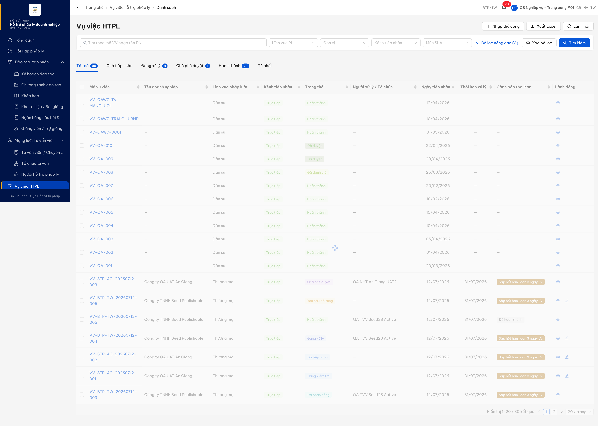

**2. Nội dung tệp đã đọc** *(phụ trợ)*

Bản đọc đầy đủ **16 tệp xuất** — dãy tiêu đề cột của từng tệp, thuộc tính từng ô (giá trị · kiểu dữ liệu · định dạng ô), và bảng đối chiếu màn hình ↔ tệp cho từng bản ghi: [R2-QUET-XUAT-TEP-noi-dung.log.txt](image/R2-QUET-XUAT-TEP-noi-dung.log.txt) *(mục "ĐỐI CHIẾU NGÀY" ở cuối tệp)*.

```
VU VIEC HTPL — cot 'Ngay tiep nhan' (doi chieu du 20/20 ban ghi trang 1)
   VV-QAW7-DG01     man hinh 01/03/2026  ->  trong tep 28/2/2026   -1 ngay (qua thang truoc)
   VV-QA-002        man hinh 01/04/2026  ->  trong tep 31/3/2026   -1 ngay (qua thang truoc)
   ... 11 dong nua cung kieu ...
   => Khop 7 / Lech 13 tren tong 20

THU VIEN BIEU MAU — cot 'Ngay tao' (13/13 ban ghi)   => Khop 8 / Lech 5
KE HOACH DANH GIA — cot 'Ngay tao'  (9/9 ban ghi)    => Lech 2
```

### Kiểm tra lại lượt 3 — 29/07/2026

Chạy lại toàn bộ trên dữ liệu hiện có, xuất tệp bằng **nút [Xuất Excel] trên giao diện** (không gọi API), rồi mở từng tệp đọc giá trị và định dạng của từng ô ngày.

**Phần tệp xuất — đã hết lỗi.**

*Giá trị ngày đã đúng.* Chính những bản ghi trước đây bị lùi ngày nay ghi trùng khớp màn hình:

| Mã vụ việc | Màn hình | Tệp lượt trước | Tệp lần này | |
|---|---|---|---|---|
| `VV-QAW7-DG01` | 01/03/2026 | 28/2/2026 | **01/03/2026** | ✔ hết lùi tháng |
| `VV-QA-002` | 01/04/2026 | 31/3/2026 | **01/04/2026** | ✔ hết lùi tháng |
| `VV-QAW7-TV-MANGLUOI` | 12/04/2026 | 11/4/2026 | **12/04/2026** | ✔ |
| `VV-QAW7-TRALOI-UBND` | 10/04/2026 | 9/4/2026 | **10/04/2026** | ✔ |
| `VV-QA-010` | 22/04/2026 | 21/4/2026 | **22/04/2026** | ✔ |
| `VV-QA-001` | 20/03/2026 | 19/3/2026 | **20/03/2026** | ✔ |

Thư viện biểu mẫu cũng vậy — `QA-DESELECT-B` trước ghi `2026-07-24 19:08:30` (giờ quốc tế), nay ghi `25/07/2026 02:08`, đúng bằng giờ Việt Nam mà màn hình đang hiện. `QA-CK-DU` và `QA-IMPORT-KQ` tương tự.

*Định dạng ngày đã thống nhất.* Đọc **12 màn có nút xuất tệp**, tổng **1.549 ô ngày**: **100% ghi `dd/MM/yyyy`** (hoặc `dd/MM/yyyy HH:mm` khi có giờ), **0 ô sai**. Bốn kiểu sai cũ đều không còn: thiếu số 0 (`11/4/2026`), giờ đặt trước ngày (`07:00 25/07/2026`), năm 2 chữ số (`19:38 24/7/26`), và ô kiểu Mỹ tháng-ngày-năm ở Ngân hàng câu hỏi.

*Đối chứng đồng hồ:* đăng nhập lúc **10:19 giờ Việt Nam**, Nhật ký hệ thống ghi `29/07/2026 10:19:26` — phần hiển thị đã đúng múi giờ Việt Nam.

**Phần bộ lọc trên màn hình — vẫn còn lỗi y như cũ.**

Vào **Quản trị hệ thống → Nhật ký hệ thống → Bộ lọc nâng cao**, gõ tay vào hai ô ngày rồi bấm **[Tìm kiếm]**:

| Lọc | Số kết quả | Ngày **hiển thị** của bản ghi trả về |
|---|---|---|
| `22/07/2026 → 22/07/2026` | 201 | Trang đầu **toàn bộ là `23/07/2026`** — từ `23/07/2026 05:36:42` xuống `23/07/2026 00:12:19`. **Không một dòng nào mang ngày 22/07.** |
| `23/07/2026 → 23/07/2026` | 195 | Trang đầu chạy từ **`24/07/2026 02:03:04`** xuống `23/07/2026 11:57:16` — lọt cả bản ghi của **ngày 24/07**. |

Người dùng chọn đúng một ngày nhưng nhận về dữ liệu của ngày khác. Cửa sổ lọc thực tế đang chạy từ **07:00 ngày được chọn đến 06:59 ngày hôm sau** — lệch đúng 7 tiếng, cùng bản chất với lỗi cũ, chỉ là chỗ khoanh vùng ngày chưa được sửa theo.

**Kết luận:** phần **tệp xuất đã đạt**; phần **bộ lọc ngày ở màn Nhật ký hệ thống chưa đạt** → giữ mở.

**Bằng chứng lượt 3**

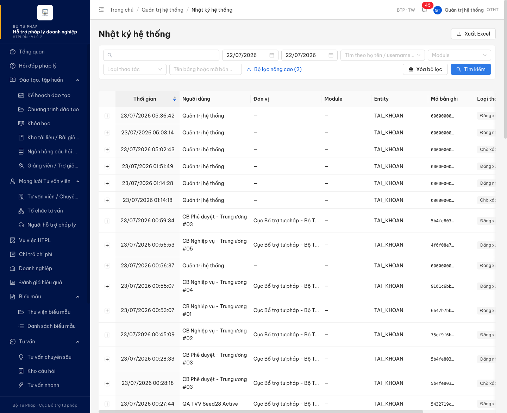

Bản đọc đầy đủ 12 tệp xuất (giá trị · định dạng từng ô ngày) và ba lượt thử bộ lọc: [R3-BUG-XUAT-TEP-noi-dung.log.txt](image/R3-BUG-XUAT-TEP-noi-dung.log.txt).

### Kiểm tra lại lượt 4 — 29/07/2026

Chạy lại đúng hai phép thử của lượt 3 trên màn **Quản trị hệ thống → Nhật ký hệ thống**. Để không chỉ nhìn 50 dòng của trang đầu, sau mỗi lần [Tìm kiếm] bấm luôn **[Xuất Excel]** rồi đọc cột "Thời gian" của **toàn bộ** kết quả.

| Lọc | Lượt 3 | Lượt 4 |
|---|---|---|
| `22/07/2026 → 22/07/2026` | 201 dòng, trang đầu **toàn bộ là 23/07** (05:36:42 → 00:12:19), không một dòng nào mang ngày 22/07 | **141 dòng, 141/141 đều là 22/07** (13:36 → 23:58) |
| `23/07/2026 → 23/07/2026` | 195 dòng, trang đầu chạy từ **24/07 02:03:04**, lọt cả bản ghi ngày 24/07 | **180 dòng, 180/180 đều là 23/07** (**00:01** → 15:51) |

**Vì sao mốc `00:01` là bằng chứng quyết định.** Cửa sổ lọc cũ bắt đầu lúc 07:00, nên bản ghi lúc 00:01 ngày 23/07 sẽ bị đẩy sang kết quả của ngày 22/07 — đúng như lượt 3 đã thấy. Lần này bản ghi 00:01 nằm đúng trong kết quả của ngày 23/07 → chặn dưới đã về **00:00 giờ Việt Nam**. Đối xứng, không còn bản ghi 24/07 nào lọt vào → chặn trên đã về **23:59 cùng ngày**.

**Đối chứng đồng hồ:** đăng nhập lúc 17:20 giờ Việt Nam, nhật ký ghi `29/07/2026 17:20:24` — phần hiển thị đúng múi giờ.

**Phần tệp xuất — vẫn giữ nguyên kết quả đạt.** Quét lại toàn bộ tệp `.xlsx` xuất qua giao diện trong ngày (23 tệp Báo cáo thống kê · 3 tệp Nhật ký hệ thống · 2 tệp Điểm danh khóa học · 1 tệp DS Tư vấn viên), tổng **1.794 ô ngày**: **0 ô sai**, tất cả ghi `dd/MM/yyyy` (hoặc `dd/MM/yyyy HH:mm` khi có giờ). Bốn kiểu sai cũ đều không còn.

**Kết luận:** cả hai phần — giá trị/định dạng ngày trong tệp xuất và bộ lọc ngày trên màn hình — đều đạt.

**Bằng chứng lượt 4**

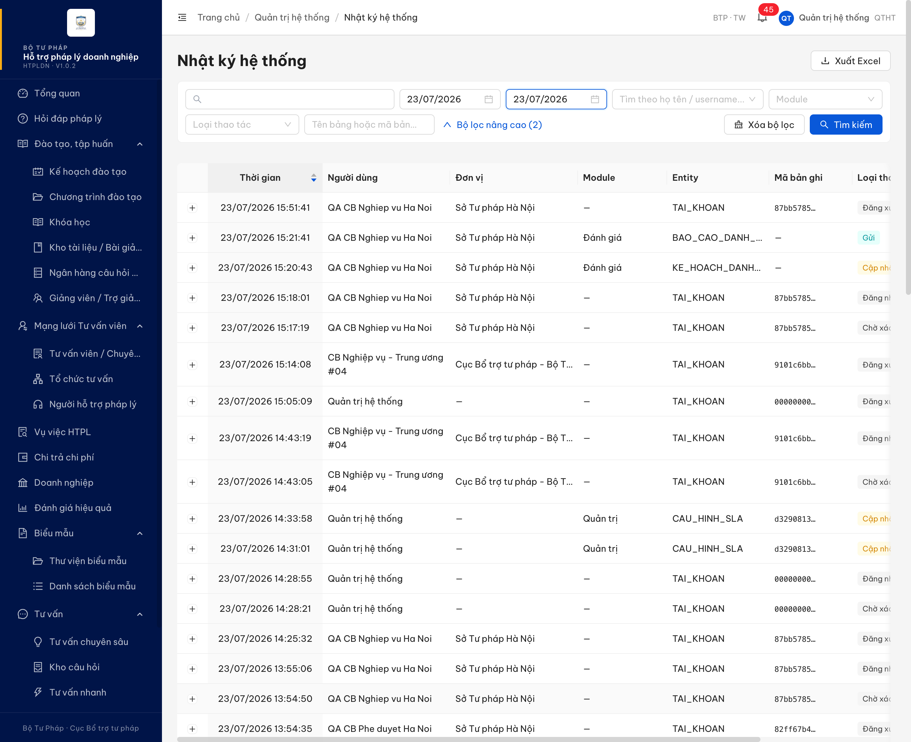

Bản đọc đầy đủ (hai lượt lọc kèm phân bố ngày của toàn bộ kết quả, và kết quả quét 1.794 ô ngày trên 29 tệp): [R4-BUG-XUAT-TEP-noi-dung.log.txt](image/R4-BUG-XUAT-TEP-noi-dung.log.txt).

---

## ~~BUG-BCTK-XUAT-THIEU-BANG~~ [CLOSED] — Báo cáo thống kê: màn hình có 3 bảng số liệu nhưng tệp Excel và PDF xuất ra chỉ có 1 bảng

> **Re-test:** 2026-07-30 16:12:00 R6 — ✅ PASS (Closed-verified). 2 báo cáo bảng chéo còn lại nay xuất đủ phần chia theo đơn vị ở cả Excel lẫn PDF, khớp từng ô với màn hình; còn đúng khi đổi kỳ báo cáo và khi lọc một đơn vị. Quét lại đủ 23 loại: 45/45 thẻ số liệu, 0 loại thiếu bảng/dòng/cột.

### Mô tả

Ở màn **Báo cáo thống kê**, chọn báo cáo **"BC Vụ việc đã tiếp nhận"** rồi bấm **[Xem báo cáo]**, màn hình dựng ra **3 bảng số liệu**: thống kê theo *kênh tiếp nhận*, theo *lĩnh vực pháp luật*, và theo *đơn vị*.

Bấm **[Xuất Excel]** thì tệp nhận được **chỉ có bảng thứ nhất**. Hai bảng còn lại — *lĩnh vực pháp luật* và *đơn vị* — **biến mất hoàn toàn**, không phải bị cắt bớt dòng mà là không có bảng nào cả. Bấm **[Xuất PDF]** cũng cho kết quả y hệt.

Người dùng xuất báo cáo để gửi đi hoặc lưu hồ sơ, nên thứ họ nhận được đang **thiếu 2/3 nội dung** so với thứ họ vừa duyệt trên màn hình, và **không có dấu hiệu nào báo là đã bị lược bớt**.

### Các bước tái hiện

1. Đăng nhập **`cbnv_tw_01`** (CB Nghiệp vụ · Trung ương — vai trò thấy phạm vi toàn quốc).
2. Vào **Báo cáo thống kê**.
3. Chọn báo cáo **"BC Vụ việc đã tiếp nhận"**, kỳ **Năm 2026**, đơn vị **Toàn quốc**.
4. Bấm **[Xem báo cáo]** → đếm số bảng hiện trên màn hình và ghi lại số liệu từng bảng.
5. Bấm **[Xuất Excel]** → mở tệp, đếm số bảng trong tệp.
6. Quay lại, bấm **[Xuất PDF]** → mở tệp, đếm số bảng trong tệp.

### Kết quả mong đợi

- Đặc tả **FR-IX-02 (UC125) — BC Vụ việc đã tiếp nhận** liệt kê phần kết xuất ở `srs-fr-11-bao-cao.md:213`–`:217`. Cả **5 mục đều ghi điều kiện "Luôn"**, tức luôn phải có:

  | # | Tên | Điều kiện |
  |---|---|---|
  | 1 | `tong_vu_viec` | **Luôn** |
  | 2 | `theo_kenh[]` | **Luôn** |
  | 3 | `theo_linh_vuc[]` | **Luôn** |
  | 4 | `theo_don_vi[]` | **Luôn** |
  | 5 | `theo_ky[]` | **Luôn** |

- Riêng bản PDF, `srs-fr-11-bao-cao.md:86` (Bước 8 của phần Processing chung) yêu cầu: *"Nếu xuất PDF: tạo file .pdf **giữ nguyên định dạng trình bày** theo Thông tư 17/2025 (khổ A4, font Times New Roman cỡ 13)"* — giữ nguyên trình bày thì không thể mất 2 trong 3 bảng. **Đây là căn cứ chắc nhất của bug này.**
- Trường hợp duy nhất đặc tả cho phép lược bớt nội dung là vượt hạn mức dòng — `srs-fr-11-bao-cao.md:87`: *"Giới hạn tối đa 10.000 dòng xuất; nếu vượt thì cắt + cảnh báo"*, quy tắc gốc ở `srs-fr-11-bao-cao.md:1280` (**BR-DATA-06**): *"Mọi danh sách có tính năng xuất Excel. File xuất **theo bộ lọc hiện tại**, không vượt quá 10,000 rows/file"*. Báo cáo này tổng cộng 7 dòng số liệu, không chạm ngưỡng đó, và cũng không có cảnh báo nào hiện ra.

> **Ranh giới của căn cứ — ghi rõ để dev không mất công tranh luận:** với bản **PDF**, `:86` quy định thẳng nên không cần bàn thêm. Với bản **Excel**, `srs-fr-11-bao-cao.md:85` chỉ nói *"tạo file .xlsx theo TT17/2025"* mà **QA không có bản mẫu TT17 để đối chiếu từng cột**. Vì vậy phần Excel của bug này dựa trên: (a) đặc tả FR-IX-02 liệt kê cả 3 nhóm số liệu ở điều kiện "Luôn", và (b) nguyên tắc tệp xuất phải phản ánh đúng nội dung màn hình đang hiển thị. Nếu dev có bản mẫu TT17 chứng minh biểu mẫu chỉ gồm bảng "Kênh tiếp nhận" thì phần Excel xin rút, **phần PDF vẫn giữ**.

### Kết quả thực tế

**Màn hình** (kỳ Năm 2026 · Toàn quốc · đo lúc 28/07/2026 15:45) — 3 bảng:

| Bảng | Nội dung trên màn hình |
|---|---|
| 1. Kênh tiếp nhận | Trực tiếp = 27 |
| 2. Thống kê theo lĩnh vực pháp luật | Thương mại 14 (51,9%) · Dân sự 13 (48,1%) |
| 3. Đơn vị | Cục Bổ trợ tư pháp 20 · Bộ KH&ĐT 3 · STP An Giang 3 · STP Hà Nội 1 |

**Tệp Excel** `bao-cao-vu-viec-tiep-nhan-2026-07-28.xlsx` — toàn bộ nội dung chỉ nằm gọn trong vùng **A1:B7**:

| Ô | Giá trị |
|---|---|
| A1 | `BC Vụ việc đã tiếp nhận` |
| A2 | `Kỳ báo cáo: Năm (từ 01/01/2026 đến 31/12/2026)` |
| A3 | `Đơn vị: Toàn quốc` |
| A4 | `Ngày tạo: 28/07/2026` |
| A6 · B6 | `Kênh tiếp nhận` · `Số lượng` |
| A7 · B7 | `Trực tiếp` · `27` |

Hết tệp. Không có bảng "Lĩnh vực pháp luật", không có bảng "Đơn vị".

**Tệp PDF** `bao-cao-vu-viec-tiep-nhan-2026-07-23.pdf` của cùng báo cáo: cũng chỉ có bảng "Kênh tiếp nhận".

**Bổ sung 28/07/2026 — đo thêm 3 báo cáo khác, lỗi là của TOÀN BỘ chức năng báo cáo:**

| Báo cáo | Trên màn hình | Trong tệp (cả Excel lẫn PDF) | Mất gì |
|---|---|---|---|
| BC Vụ việc đã tiếp nhận | 3 bảng | 1 bảng | bảng *Lĩnh vực PL* · bảng *Đơn vị* |
| BC Vụ việc đã hoàn thành | 3 bảng + 4 thẻ số liệu | 1 bảng · 0 thẻ | bảng *Kết quả* · bảng *Đơn vị* · **cả 4 thẻ số** |
| BC Số lượng CG/TVV | 2 bảng + 3 thẻ số liệu | 1 bảng · 0 thẻ | bảng *Lĩnh vực PL* · **cả 3 thẻ số** |
| BC Chi phí chi trả hỗ trợ | 1 bảng + 3 thẻ số liệu | 1 bảng · 0 thẻ | **cả 3 thẻ số** |

Hai điểm quan trọng lộ ra khi đo diện rộng:

1. **Mọi báo cáo đều chỉ xuất được BẢNG ĐẦU TIÊN.** Không phải lỗi riêng của một báo cáo mà là cách hoạt động chung — báo cáo nào có nhiều bảng thì mất hết từ bảng thứ hai trở đi.
2. **Không báo cáo nào xuất được các thẻ số liệu tổng hợp.** Kể cả BC Chi phí chi trả hỗ trợ — báo cáo vốn chỉ có 1 bảng nên tệp có đủ bảng — vẫn mất trọn 3 thẻ số. Nghĩa là ngay cả báo cáo "đủ bảng" cũng chưa đủ nội dung.

Đo trên 4 báo cáo × 2 định dạng = **8 tệp, cả 8 đều thiếu**. Riêng nút [Xuất PDF] còn mở hộp thoại *"Tùy chọn in báo cáo PDF"* (khổ giấy · hướng giấy) trước khi tải — lần đo này chọn mặc định A4 · Dọc.

### Bằng chứng

**1. Ảnh chụp**

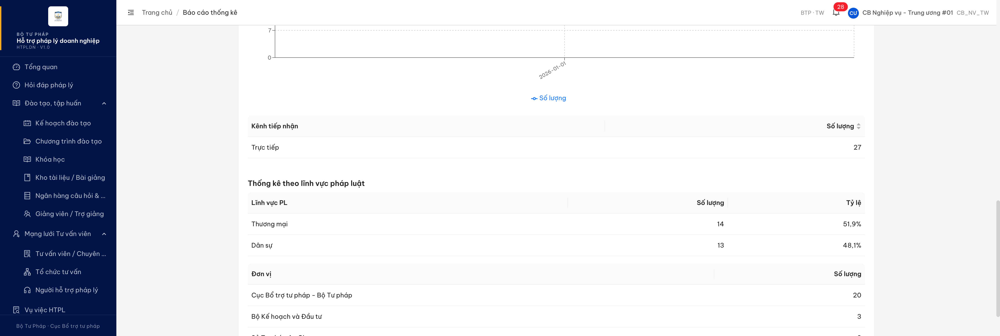

**2. Nội dung tệp đã đọc** *(phụ trợ)*

[R2-QUET-XUAT-TEP-noi-dung.log.txt](image/R2-QUET-XUAT-TEP-noi-dung.log.txt) — mục *"MÀN: Báo cáo thống kê (BC Vụ việc đã tiếp nhận)"* và mục đối chiếu số 5 ở cuối tệp.

```
Tep : bao-cao-vu-viec-tiep-nhan-2026-07-28.xlsx (6542 byte)
      sheet 'BC Vu viec da tiep nhan'  vung = A1:B7  (7 dong x 2 cot)

Man hinh : Bang 1 'Kenh tiep nhan'        -> Truc tiep = 27
           Bang 2 'Linh vuc phap luat'    -> Thuong mai 14 (51,9%) · Dan su 13 (48,1%)
           Bang 3 'Don vi'                -> Cuc Bo tro tu phap 20 · Bo KH&DT 3 · STP An Giang 3 · STP Ha Noi 1
Tep Excel: CHI co Bang 1. Thieu toan bo Bang 2 va Bang 3.
Tep PDF  : cung chi co Bang 1.
```

### Kiểm tra lại lượt 3 — 29/07/2026

Lần này quét **đủ 7 loại báo cáo** có trong ô "Loại báo cáo" của vai trò `cbnv_tw_01` (kỳ **Năm 2026**, đơn vị **Toàn quốc**), mỗi loại đều: bấm **[Xem báo cáo]** → đếm bảng và thẻ số liệu trên màn hình → bấm **[Xuất Excel]** trên giao diện → mở tệp đếm lại.

**Đúng 1 trên 7 báo cáo được sửa.**

| Báo cáo | Trên màn hình | Trong tệp Excel | |
|---|---|---|---|
| **BC Vụ việc đã tiếp nhận** | 3 bảng + 1 thẻ | **đủ 5 phần** | ✔ đã sửa |
| BC Vụ việc đã hoàn thành | 3 bảng + 4 thẻ | 1 bảng · 0 thẻ | ❗ vẫn thiếu |
| BC Số lượng hỏi đáp/vướng mắc pháp luật | 2 bảng + 4 thẻ | 1 bảng · 0 thẻ | ❗ vẫn thiếu |
| BC Vụ việc đang hỗ trợ | 3 bảng + 1 thẻ | 1 bảng · 0 thẻ | ❗ vẫn thiếu |
| BC Vụ việc theo thời gian | 2 bảng + 1 thẻ | 1 bảng · 0 thẻ | ❗ vẫn thiếu |
| BC Lớp đào tạo đang diễn ra | 1 bảng + 3 thẻ | 1 bảng · 0 thẻ | ❗ mất thẻ |
| BC Lớp đào tạo đã diễn ra | 1 bảng + 2 thẻ | 1 bảng · 0 thẻ | ❗ mất thẻ |

**Báo cáo duy nhất đã sửa** — *BC Vụ việc đã tiếp nhận* nay xuất đủ cả 5 phần mà đặc tả liệt kê ở điều kiện "Luôn": *Tổng số vụ việc* · *Theo kênh tiếp nhận* · *Theo lĩnh vực pháp luật* · *Theo đơn vị* · *Theo kỳ*. Bản PDF cũng đủ 5 phần. Tệp còn có thêm phần *Theo kỳ* mà màn hình không dựng ra.

**Ca còn hỏng rõ nhất** — *BC Vụ việc đã hoàn thành*:

| | Nội dung |
|---|---|
| Màn hình | 4 thẻ số (*Tổng vụ việc 17* · *Thành công 2* · *Không thành công 0* · *Tỷ lệ thành công 11,8%*) + 3 bảng (*Lĩnh vực PL* · *Kết quả* · *Đơn vị*) |
| Tệp Excel | vùng `A1:B8` — chỉ có bảng *Lĩnh vực PL* (Dân sự 11 · Thương mại 6). Không có bảng *Kết quả*, không có bảng *Đơn vị*, không có thẻ số nào |
| Tệp PDF | y hệt Excel — cũng chỉ 1 bảng |

Vẫn đúng hai điểm đã ghi ở lượt trước: **chỉ xuất được bảng đầu tiên**, và **không xuất được thẻ số liệu tổng hợp nào**. Kể cả *BC Lớp đào tạo đang diễn ra* — báo cáo vốn chỉ có 1 bảng nên tệp có đủ bảng — vẫn mất trọn 3 thẻ số.

**Kết luận:** cách sửa mới áp cho một báo cáo, 6 báo cáo còn lại giữ nguyên → giữ mở.

**Bằng chứng lượt 3**

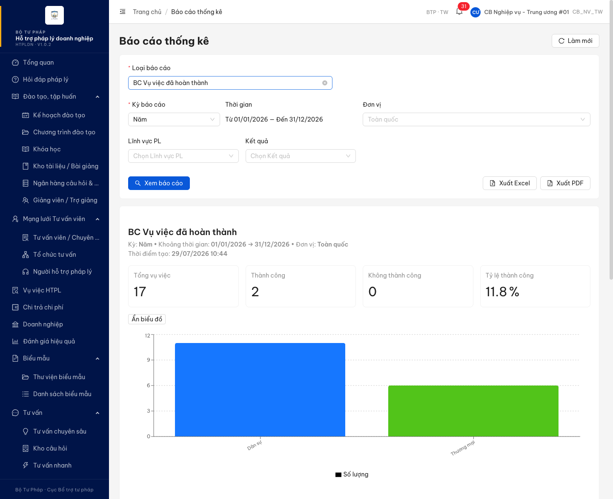

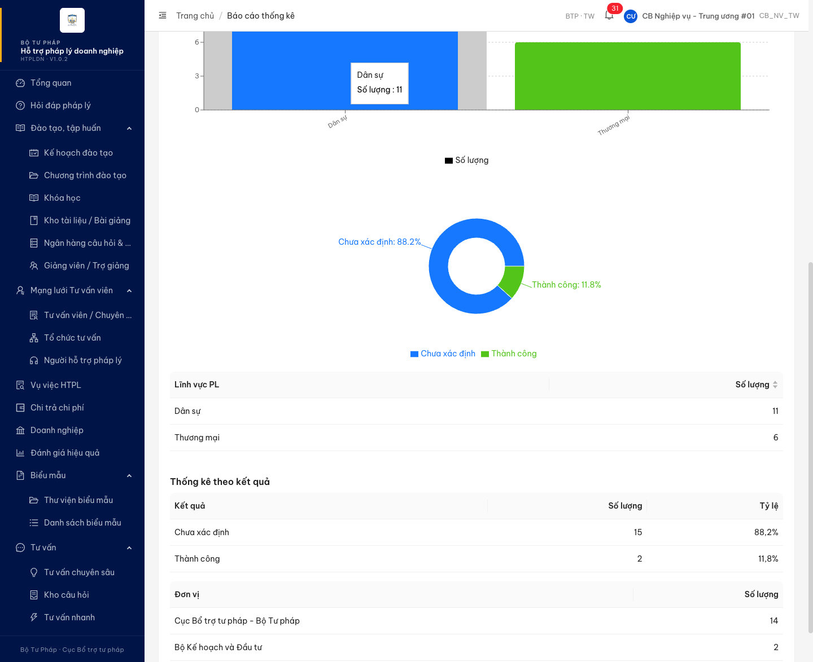

Bản đọc đầy đủ 7 báo cáo (số bảng · số thẻ trên màn hình và toàn bộ nội dung tệp Excel/PDF từng báo cáo): [R3-BUG-BCTK-noi-dung.log.txt](image/R3-BUG-BCTK-noi-dung.log.txt).

### Kiểm tra lại lượt 4 — 29/07/2026 — ❌ VẪN CÒN LỖI

**Trước hết, đính chính phạm vi đo của lượt 3.** Ô *"Loại báo cáo"* là danh sách cuộn ảo — mỗi lần mở chỉ dựng ra khoảng 8 mục quanh mục đang chọn, nên lượt 3 tưởng chỉ có **7 loại**. Thực tế ô này có **23 loại báo cáo**, đúng bằng con số đặc tả ghi. Lượt 4 lấy đủ 23 loại bằng cách gõ chữ vào ô tìm kiếm của chính ô chọn đó, rồi đo lần lượt từng loại: bấm **[Xem báo cáo]** → đếm thẻ số liệu và bảng trên màn hình → bấm **[Xuất Excel]** rồi **[Xuất PDF]** trên giao diện → mở tệp đếm lại. Kỳ **Năm 2026**, đơn vị **Toàn quốc**, tài khoản `cbnv_tw_01`.

**Kết quả: 11 loại đã đủ, 11 loại vẫn thiếu, 1 loại không đo được vì kỳ đó chưa có dữ liệu.**

| Nhóm | Loại báo cáo |
|---|---|
| ✔ **Đã đủ** — tệp có đúng mọi thẻ số liệu và mọi bảng như màn hình | BC Số lượng hỏi đáp/vướng mắc pháp luật · BC Vụ việc đã tiếp nhận · BC Vụ việc đang hỗ trợ · BC Vụ việc đã hoàn thành · BC Vụ việc theo thời gian · BC Lớp đào tạo đang diễn ra · BC Lớp đào tạo đã diễn ra *(7 loại lượt 3 đã đo — nay sửa xong cả 7)* · BC Vụ việc theo đơn vị quản lý · BC Vụ việc theo lĩnh vực · BC Vụ việc theo loại hình DN · BC Vụ việc theo thời gian chi tiết *(4 loại này màn hình vốn chỉ có 1 bảng, không có thẻ số)* |
| ❗ **Vẫn thiếu** — tệp chỉ có bảng đầu tiên, không có thẻ số liệu nào | BC Chất lượng đào tạo · BC Đánh giá hiệu quả HTPL · BC Số lượng CG/TVV · BC Chi phí chi trả hỗ trợ · BC Chi phí theo đơn vị · BC Chi phí theo loại hình DN · BC Chi phí theo thời gian · BC Số lượng chương trình hỗ trợ · BC Chương trình theo đơn vị · BC Chương trình theo lĩnh vực · BC Chương trình theo thời gian |
| — **Không đo được** | BC Chi phí theo lĩnh vực — màn hình báo *"Không có dữ liệu báo cáo cho kỳ và đơn vị đã chọn"*, hai nút Xuất đúng ra bị khoá. Không tính vào phép đếm |

**Hai ca cho thấy rõ nhất — màn hình có 2 bảng, tệp chỉ ra 1 bảng:**

| | BC Đánh giá hiệu quả HTPL | BC Số lượng CG/TVV |
|---|---|---|
| Màn hình | 4 thẻ số (*Tổng đợt đánh giá 3* · *Tổng lượt đánh giá 5* · *Tổng số vụ việc đã đánh giá 4* · *Điểm trung bình chung 49*) + 2 bảng: *Đơn vị* (3 dòng) và *Thống kê theo tiêu chí* (5 dòng) | 3 thẻ số (*Tổng Tư vấn viên 5* · *Số Tư vấn viên 4* · *Số Chuyên gia 1*) + 2 bảng: *Đơn vị* (4 dòng) và *Lĩnh vực PL* (2 dòng) |
| Tệp Excel | chỉ có bảng *Đơn vị*. Mất 4 thẻ số + bảng *Thống kê theo tiêu chí* | chỉ có bảng *Đơn vị*. Mất 3 thẻ số + bảng *Lĩnh vực PL* |
| Tệp PDF | y hệt Excel — cũng chỉ 1 bảng, không thẻ số | y hệt Excel — cũng chỉ 1 bảng, không thẻ số |

**Căn cứ đặc tả.** Với cả ba loại còn hỏng nặng nhất, cột *"Điều kiện"* trong bảng **Output đặc thù** của đặc tả đều ghi **"Luôn"** cho mọi mục — nghĩa là mục nào cũng bắt buộc có trong kết quả báo cáo, không phải tùy chọn:

- `srs-fr-11-bao-cao.md:458`–`:465` — FR-IX-08 *BC Số lượng CG/TVV*: `tong_tvv` · `so_tvv` · `so_cg` · `theo_don_vi[]` · `theo_linh_vuc[]`
- `srs-fr-11-bao-cao.md:501`–`:507` — FR-IX-09 *BC Đánh giá hiệu quả HTPL*: `diem_trung_binh` · `so_vu_viec_danh_gia` · `theo_don_vi[]` · `theo_tieu_chi[]` · `theo_dot[]`
- `srs-fr-11-bao-cao.md:542`–`:549` — FR-IX-10 *BC Chất lượng đào tạo*: `diem_trung_binh` · `ty_le_dat` · `tong_hoc_vien` · `theo_khoa_hoc[]` · `theo_don_vi[]`

Tệp xuất của cả ba loại trên chỉ chứa **đúng 1 mục**. Còn `srs-fr-11-bao-cao.md:85`–`:86` yêu cầu tệp `.xlsx` và tệp `.pdf` là bản kết xuất của chính báo cáo đó theo Thông tư 17/2025, nên thứ người dùng tải về phải là báo cáo đầy đủ chứ không phải một phần của nó.

**Kết luận:** cách sửa mới áp được cho nhóm báo cáo vụ việc / hỏi đáp / lớp đào tạo. Toàn bộ nhóm **chi phí**, nhóm **chương trình hỗ trợ**, cùng ba báo cáo **chất lượng đào tạo · đánh giá hiệu quả · số lượng CG/TVV** vẫn giữ nguyên lỗi cũ → giữ mở.

**Bằng chứng lượt 4**

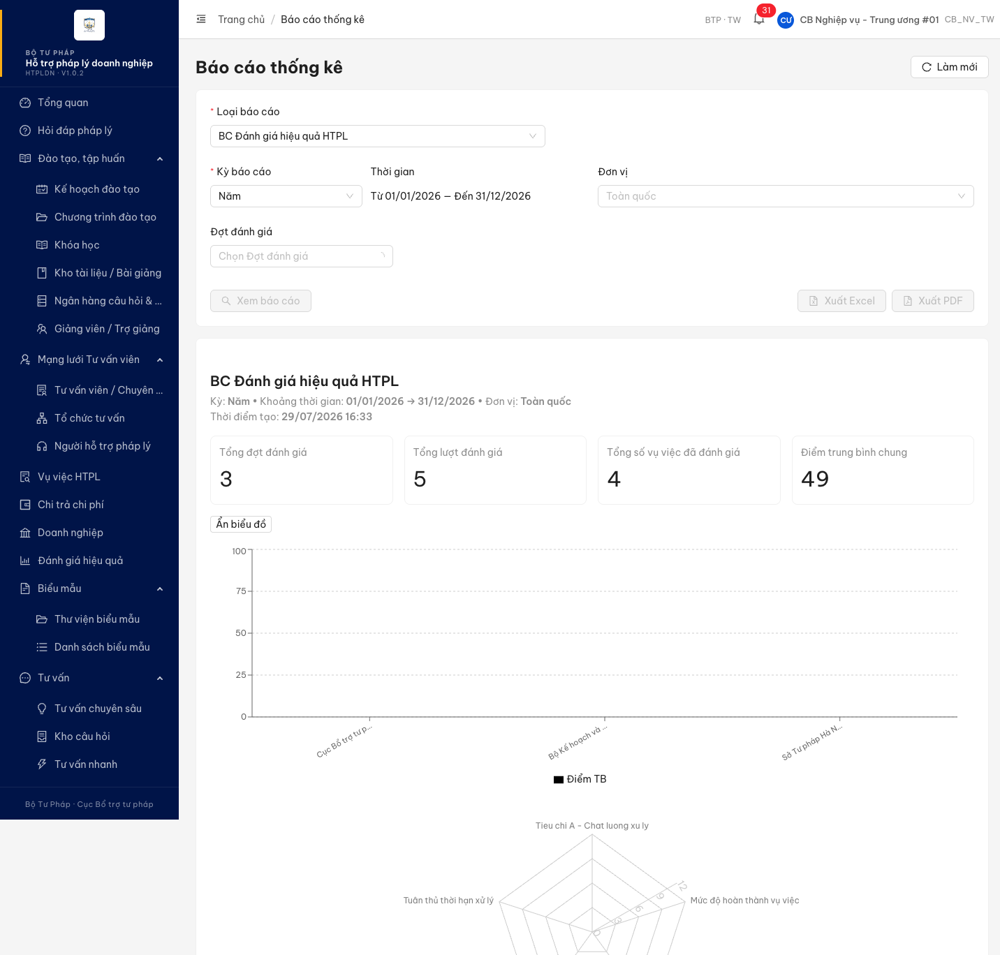

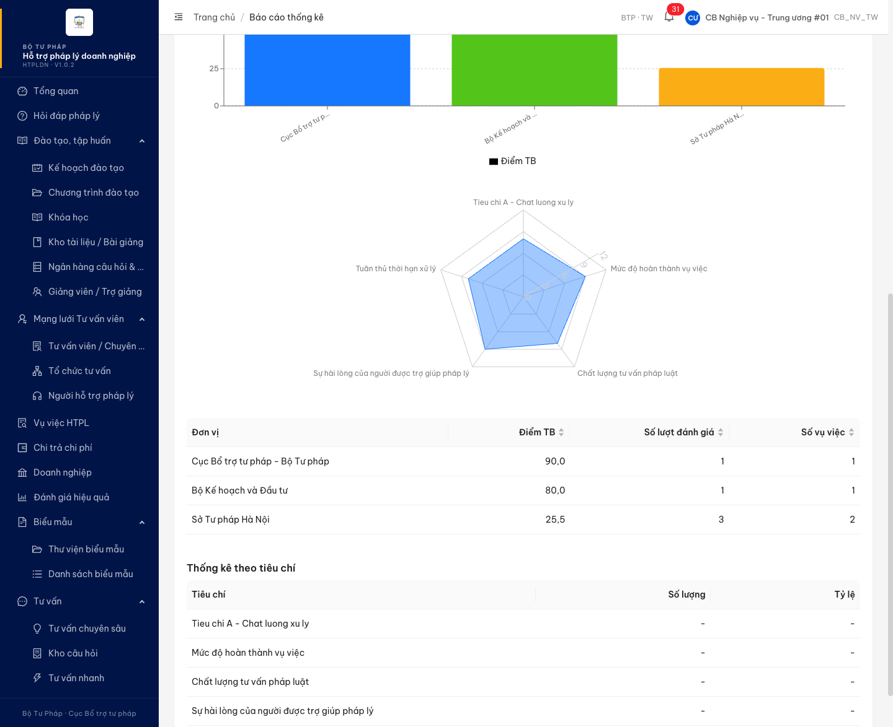

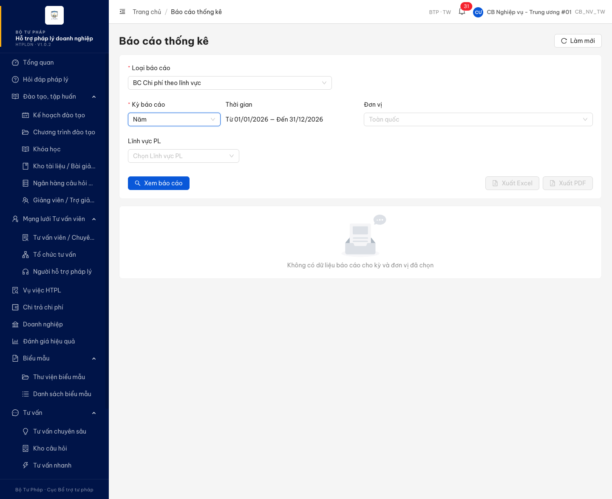

Bản đo đầy đủ 23 loại báo cáo (số thẻ · số bảng trên màn hình đối chiếu từng mục trong tệp Excel và PDF, kèm nội dung tệp của hai ca quyết định): [R4-BUG-XUAT-THIEU-BANG-noi-dung.log.txt](image/R4-BUG-XUAT-THIEU-BANG-noi-dung.log.txt).

### Kiểm tra lại lượt 5 — 30/07/2026 — ❌ VẪN CÒN LỖI (phần chính đã sửa)

Bản dựng **V1.0.3**, tài khoản `cbnv_tw_02`, kỳ **Năm 2026**, đơn vị **Toàn quốc**. Quét lại đủ 23 loại: [Xem báo cáo] → đọc màn hình → [Xuất Excel] → [Xuất PDF] → mở tệp đối chiếu.

**1. Phần chính — đã sửa, đo bằng giá trị chứ không chỉ đếm mục**

| Phép đo | Kết quả |
|---|---|
| Thẻ số liệu trên 22 loại có dữ liệu | **45 thẻ** |
| Thẻ không tìm thấy giá trị trong tệp Excel | **0** |
| Thẻ không tìm thấy giá trị trong tệp PDF | **0** |
| Số loại có bảng lệch số dòng so với màn hình | **0 / 22** |

11 loại từng hỏng ở lượt 4 nay đều đủ. Hai ca từng dùng làm ví dụ:

| | BC Đánh giá hiệu quả HTPL | BC Số lượng CG/TVV |
|---|---|---|
| Lượt 4 — tệp | chỉ bảng *Đơn vị*; mất 4 thẻ + bảng *Theo tiêu chí* | chỉ bảng *Đơn vị*; mất 3 thẻ + bảng *Lĩnh vực PL* |
| Lượt 5 — Excel | **4 thẻ + cả 2 bảng**, khớp từng ô (Cục Bổ trợ `90｜1｜1` · Bộ KH&ĐT `80｜1｜1` · Sở TP Hà Nội `25.53｜3｜2`) | **3 thẻ + cả 2 bảng**, khớp từng ô (`1｜1｜2` · `1｜0｜1` · `1｜0｜1` · `1｜0｜1`) |
| Lượt 5 — PDF | 6 bảng (4 chỉ tiêu + 2 bảng) | 5 bảng (3 chỉ tiêu + 2 bảng) |

**2. Còn lỗi — 2 báo cáo dạng bảng chéo bị thu về 1 cột tổng**

Lượt 4 chấm 4 báo cáo `BC Vụ việc theo …` là "đã đủ" vì khi đó **chỉ đếm số bảng**. Lượt 5 đo thêm **từng cột** thì lộ ra 2 báo cáo vẫn mất nội dung:

| | Màn hình | Trong tệp Excel và PDF |
|---|---|---|
| **BC Vụ việc theo lĩnh vực** | bảng chéo 6 cột: `Lĩnh vực PL` + 4 đơn vị + `Tổng số`, 3 dòng → **15 ô số liệu** | chỉ `Lĩnh vực pháp luật ｜ Tổng số`, 3 dòng → **3 ô**. Mất **12 ô** |
| **BC Vụ việc theo loại hình DN** | bảng chéo 6 cột, 2 dòng → **10 ô** | chỉ `Quy mô DN ｜ Tổng số` → **2 ô**. Mất **8 ô** |

Không có dấu hiệu nào trong tệp báo là phần chia theo đơn vị đã bị lược bỏ.

**Phép thử đối chứng — hai báo cáo chéo còn lại xuất đủ 6 cột.** Màn Báo cáo thống kê có 4 báo cáo dạng bảng chéo; hai cái kia ra đúng:

- `BC Vụ việc theo đơn vị quản lý` — tệp có đủ `Đơn vị ｜ Mới ｜ Tiếp nhận ｜ Đang hỗ trợ ｜ Hoàn thành ｜ Tổng số`, 4 dòng khớp từng ô.
- `BC Vụ việc theo thời gian chi tiết` — tệp có đủ 6 cột, `Năm 2026 ｜ 1 ｜ 1 ｜ 6 ｜ 17 ｜ 29`.

Nghĩa là bộ máy kết xuất **làm được** bảng chéo — đây là thiếu sót riêng của hai báo cáo kia, không phải hạn chế của định dạng tệp.

**Căn cứ đặc tả.** `srs-fr-11-bao-cao.md:602` (FR-IX-12) — *"Báo cáo cross-tab vụ việc theo lĩnh vực PL: hàng = lĩnh vực, cột = đơn vị"*; `:619` Output #4 `theo_don_vi[]` điều kiện **"Luôn"**; `:622` AC — *"cross-tab: hàng = lĩnh vực, cột = đơn vị"*. Tương ứng `:635` · `:658` · `:661` cho FR-IX-13. Điều kiện "Luôn" nghĩa là phần chia theo đơn vị bắt buộc có trong kết quả, không phải tùy chọn. Riêng bản PDF còn có `:86` — *"giữ nguyên định dạng trình bày"*.

**Ghi nhận thêm — không đề xuất sửa**

- Cột **Tỷ lệ** có trên màn mà tệp không có, ở 4 báo cáo (CG/TVV `66,7%`/`33,3%`, Vụ việc đã tiếp nhận, Vụ việc đang hỗ trợ, Vụ việc đã hoàn thành `88,2%`/`11,8%`). **Không tính là lỗi:** `srs-fr-11-bao-cao.md:465` định nghĩa `theo_linh_vuc[]` = `{linh_vuc, ten, so_luong}` — không có `ty_le`. Tức màn hình hiện thừa một cột dẫn xuất, chứ không phải tệp thiếu.
- `BC Đánh giá hiệu quả` — bảng *Theo tiêu chí*: **màn hình** đặt tên cột `Số lượng`/`Tỷ lệ` nhưng mọi ô đều là dấu `-`, trong khi tệp ghi `Trọng số`/`Điểm TB` có số thật (`100｜8` · `40｜9` · `30｜8` · `20｜9` · `10｜8`). Ở đây **màn hình** mới là bên thiếu — ghi để theo dõi riêng.
- Một số tệp có **thêm** mục màn hình không hiện (tệp nhiều hơn màn, không phải lỗi): Chi phí chi trả thêm bảng *Theo quy mô doanh nghiệp*; Số lượng chương trình thêm *Theo trạng thái* + *Theo kỳ*; Vụ việc đã tiếp nhận thêm *Theo kỳ*.
- `BC Chi phí theo lĩnh vực` vẫn báo *"Không có dữ liệu báo cáo cho kỳ và đơn vị đã chọn"*, hai nút Xuất bị khoá — không đo được, không tính vào phép đếm.

**Lưu ý cho dev:** hai báo cáo bảng chéo trên **không phải lỗi mới phát sinh từ bản sửa lần này** — lượt 4 chấm chúng "đã đủ" do phép đo khi đó chỉ đếm số bảng, chưa đối chiếu từng cột.

**Kết luận:** phần chính (thẻ số liệu + bảng) đã sạch trên toàn bộ 22 loại có dữ liệu; còn đúng 2 báo cáo bảng chéo mất phần chia theo đơn vị → giữ mở.

**Bằng chứng lượt 5**

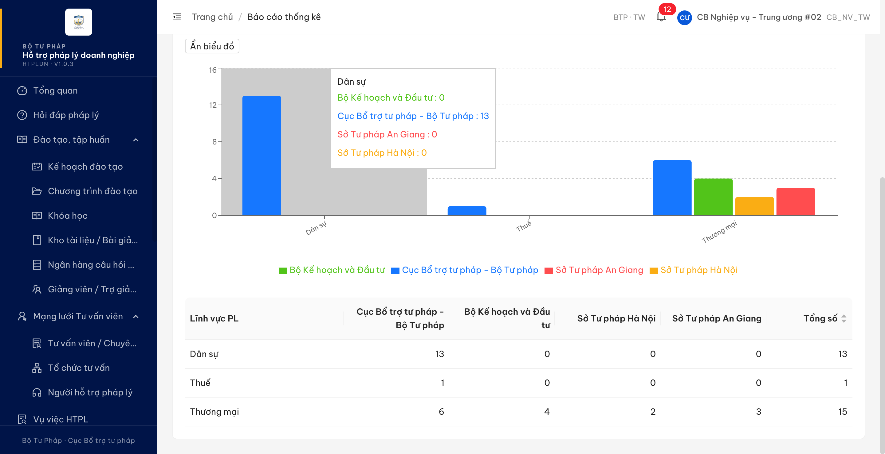

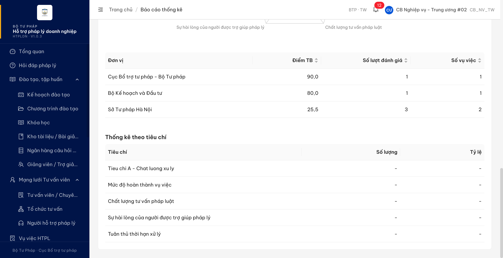

Bản đo đầy đủ 23 loại (đối chiếu giá trị từng thẻ, số dòng từng bảng, từng cột của 2 báo cáo còn lỗi, kèm phép thử đối chứng 2 báo cáo chéo xuất đúng): [R5-BUG-XUAT-THIEU-BANG-noi-dung.log.txt](image/R5-BUG-XUAT-THIEU-BANG-noi-dung.log.txt).

### Kiểm tra lại lượt 6 — 30/07/2026 — ✅ ĐÃ SỬA XONG

**Môi trường:** `https://18.143.165.120.nip.io` · bản dựng **V1.0.3** · tài khoản `cbnv_tw_04` (cùng vai trò và cùng cấp TW với tài khoản dùng ở lượt 5 → phạm vi dữ liệu không đổi, phép đo so sánh được). Thao tác hoàn toàn trên giao diện; tệp Excel đọc trực tiếp từng ô, tệp PDF mở bằng trình xem PDF rồi đọc lại — tức đúng thứ người dùng thấy khi mở tệp.

**Hai báo cáo còn lỗi — nay xuất đủ, khớp từng ô**

| Báo cáo | Màn hình | Tệp Excel | Tệp PDF | Lượt 5 |
|---|---|---|---|---|
| BC Vụ việc theo lĩnh vực | 6 cột × 3 dòng | **6 cột × 3 dòng, khớp từng ô** | **6 cột × 3 dòng, khớp** | mất 12/15 ô |
| BC Vụ việc theo loại hình DN | 6 cột × 2 dòng | **6 cột × 2 dòng, khớp từng ô** | **6 cột × 2 dòng, khớp** | mất 8/10 ô |

Giá trị đọc được ở cả màn hình và hai tệp: *Dân sự* 13·0·0·0·13 · *Thuế* 1·0·0·0·1 · *Thương mại* 8·4·2·3·17 (báo cáo lĩnh vực); *Nhỏ* 3·0·0·0·3 · *Siêu nhỏ* 0·9·4·2·15 (báo cáo loại hình DN).

**Đổi tham số để chắc bản sửa không cứng theo một bộ**

Nếu bản sửa chỉ ghi cứng 4 cột đơn vị thì đổi tham số sẽ lộ ra. Đã thử hai hướng, cả hai đều đúng:

| Phép thử | Màn hình | Tệp xuất |
|---|---|---|
| Đổi kỳ sang **Quý** (01/07–30/09) — chỉ 2 đơn vị có dữ liệu | 4 cột × 3 dòng | đúng 4 cột, giá trị 13·0·13 / 1·0·1 / 6·3·9, tổng 23 |
| Lọc **một đơn vị** (Sở Tư pháp An Giang) | 3 cột × 1 dòng | đúng 3 cột, *Nhỏ* 3·3, đầu trang ghi *"Đơn vị: Sở Tư pháp An Giang"* |

Tức tệp bám theo đúng số đơn vị thực có dữ liệu và theo đúng bộ lọc đang áp dụng — khớp `srs-fr-11-bao-cao.md:87` (BR-DATA-06).

**Quét chống hỏng ngược — đủ 23 loại báo cáo**

Với từng loại: đọc màn hình (số thẻ số liệu, mỗi bảng bao nhiêu cột × dòng) rồi mở tệp `.xlsx` vừa xuất và soi lại. 22/23 loại có dữ liệu; riêng *BC Chi phí theo lĩnh vực* màn hình trống (chưa có dữ liệu) — đúng như lượt 5.

| Chỉ số | Kết quả |
|---|---|
| Thẻ số liệu có trong tệp | **45/45** |
| Loại bị thiếu bảng | **0** |
| Loại bị thiếu dòng | **0** |
| Loại bị thiếu cột | **0** |

Nhiều loại tệp còn **nhiều hơn** màn hình (thêm bảng phụ, thêm cột *Từ ngày / Đến ngày*, thêm bảng tổng) — hướng lệch này không phải lỗi của bug này.

> **Giới hạn của lượt này, nói rõ để không hiểu quá phép đo:** PDF lượt này đo cho **4 báo cáo dạng bảng chéo** — đúng nhóm mà bản sửa động vào (*theo lĩnh vực*, *theo loại hình DN*, *theo đơn vị quản lý*, *theo thời gian chi tiết*); cả 4 đều đủ cột và khớp màn hình. 19 loại còn lại lượt này chỉ đo ở Excel; cả hai định dạng của 19 loại đó đã đo đầy đủ và đạt ở lượt 5.

**Ghi nhận thêm — đã xem xét, không log thành lỗi**

- Vài báo cáo có cột *"Tỷ lệ (%)"* trên **màn hình** mà tệp không có. Không tính là tệp thiếu: đặc tả không đặt trường tỷ lệ trong kết quả đầu ra của các mục đó — `srs-fr-11-bao-cao.md:166` · `:216` · `:305` đều đặt `theo_don_vi[] = {don_vi, ten, so_luong}`. Đây là màn hình có **thêm**, không phải tệp **bớt**.
- Nhãn cột đầu của báo cáo loại hình DN: màn ghi *"Loại hình DN"*, tệp ghi *"Quy mô DN"* — lệch **chữ**, không lệch **nội dung**; đã có từ trước, không thuộc phạm vi bug này.
- Với đơn vị Sở Tư pháp An Giang, bảng trạng thái ghi *Mới 0 / Tiếp nhận 1 / Đang hỗ trợ 1 / Hoàn thành 0* nhưng *Tổng số 3* (4 cột cộng lại là 2). Số này **giống nhau** trên màn hình, tệp Excel và tệp PDF, và giống nhau giữa 3 báo cáo khác nhau → không phải lỗi xuất tệp. Có thể còn trạng thái khác không nằm trong 4 cột. Nếu CĐT/BA muốn làm rõ thì đây là điểm cần chốt riêng.

**Kết luận:** cả 2 báo cáo bảng chéo còn lại đã xuất đủ phần chia theo đơn vị ở cả Excel lẫn PDF, khớp từng ô với màn hình, và còn đúng khi đổi kỳ báo cáo cũng như khi lọc một đơn vị; quét lại đủ 23 loại không loại nào hỏng ngược → **đóng lỗi**.

**Bằng chứng lượt 6**

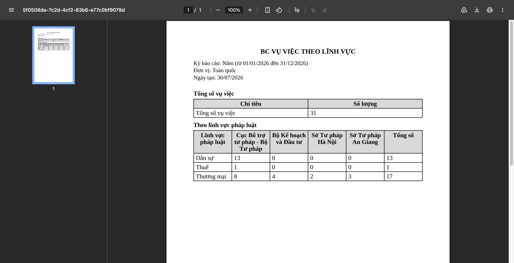

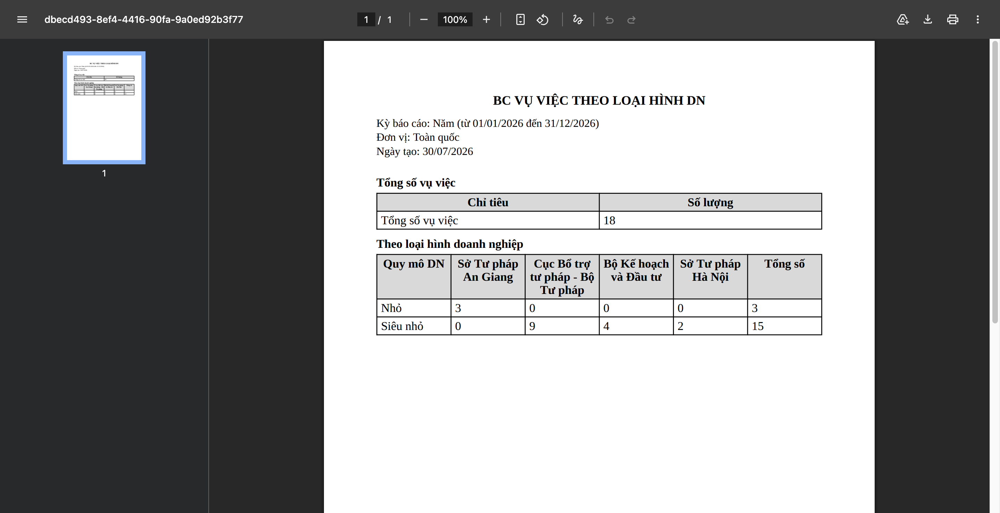

Bản đo đầy đủ (đối chiếu từng ô 2 báo cáo đích ở cả 2 định dạng, 2 phép thử đổi tham số, bảng quét 23 loại): [R6-BUG-XUAT-THIEU-BANG-noi-dung.log.txt](image/R6-BUG-XUAT-THIEU-BANG-noi-dung.log.txt).

---

## ~~BUG-NHAN-MA-KY-THUAT-THO~~ [CLOSED] — Màn Đợt báo cáo và tệp xuất Tư vấn viên/Chuyên gia hiện mã kỹ thuật thay cho chữ tiếng Việt

> **Re-test:** 2026-07-30 11:52:00 R5 — ✅ PASS (Closed-verified). Tên trang tính tệp Nhật ký hệ thống đã có dấu ('Nhật ký hệ thống'). Cả 5 chỗ đóng ở lượt trước không hỏng ngược; 22/22 tệp báo cáo sạch mã nội bộ và chữ bỏ dấu. Quan sát 'CU_NHAN' ở form Sửa TVV là dữ liệu mẫu QA nạp ngoài miền giá trị đặc tả, không phải lỗi sản phẩm.

### Mô tả

Một số chỗ trong ứng dụng đang **hiện thẳng mã nội bộ của hệ thống ra cho người dùng** thay vì chữ tiếng Việt tương ứng. Người dùng nghiệp vụ không có cách nào hiểu `SO_BO_NAM` nghĩa là *kỳ báo cáo sơ bộ năm* hay `THAC_SI` nghĩa là *Thạc sĩ*.

Hai nơi ghi nhận được:

1. **Màn Chương trình HTPLDN → Đợt báo cáo → Chi tiết** — ô *"Kỳ BC"* hiện `SO_BO_NAM`, ô *"Trạng thái"* hiện `TAO_DOT`. Cùng màn đó, đường dẫn phía trên hiện *"Dot Bao Cao"* và mục sườn trái hiện *"Vu viec HTPL"* — **mất hết dấu tiếng Việt**, trong khi mọi mục khác cùng sườn đều có dấu đầy đủ.
2. **Mạng lưới TV → Tư vấn viên / Chuyên gia → [Xuất Excel]** — cột *"Trình độ"* ghi `THAC_SI` (3 ô) và `CU_NHAN` (1 ô), thay vì *"Thạc sĩ"* / *"Cử nhân"*.

### Các bước tái hiện

**Phần 1 — màn Đợt báo cáo:**

1. Đăng nhập **`cbnv_tw_01`** (CB Nghiệp vụ · Trung ương).
2. Vào **Chương trình HTPLDN → Đợt báo cáo**.
3. Mở chi tiết đợt `DOT-SO_BO_NAM-2026-1` (tên đợt *"QA Reverify CTBC 715 v2 fresh"*).
4. Đọc ô **"Kỳ BC"**, ô **"Trạng thái"**, đường dẫn phía trên đầu trang, và mục **"Vu viec HTPL"** ở sườn trái.

**Phần 2 — tệp xuất Tư vấn viên / Chuyên gia:**

5. Vào **Mạng lưới Tư vấn viên → Tư vấn viên / Chuyên gia**.
6. Bấm **[Xuất Excel]**, mở tệp, đọc cột **"Trình độ"**.

### Kết quả mong đợi

- `srs-v3.5.md:575` (**UI-06 — Localization**): *"Tiếng Việt là ngôn ngữ duy nhất. Unicode UTF-8..."*, nhắc lại ở `srs-v3.5.md:4635` (**I18N-01 — Ngôn ngữ chính**): *"Tiếng Việt là ngôn ngữ duy nhất cho giao diện CMS"* — trạng thái **✅ CĐT xác nhận**. Thứ hiện ra cho người dùng phải là tiếng Việt có dấu, không phải mã nội bộ.
- Đặc tả còn **tách bạch rõ chỗ nào được dùng mã tiếng Anh, chỗ nào không** — `srs-v3.5.md:4641` (**I18N-07**): *"Sử dụng tiếng Anh cho thuật ngữ kỹ thuật **trong code, API** (field names, endpoint paths). **Giao diện hiển thị tiếng Việt**"*. Đúng ranh giới bug này: `SO_BO_NAM` / `TAO_DOT` / `THAC_SI` hợp lệ khi nằm trong mã nguồn và dữ liệu trao đổi, nhưng đã lọt ra tới màn hình và tệp người dùng mở. *(Lưu ý: riêng I18N-07 mang trạng thái* 🟡 *Đề xuất, nên căn cứ chính vẫn là UI-06 và I18N-01 — hai điều khoản đã được CĐT xác nhận.)*
- Trường **Trình độ** được đặc tả bằng đúng 4 giá trị tiếng Việt — `srs-fr-04-chuyen-gia-tvv.md:1502`: *"Trình độ * | dropdown | "Cử nhân" / "Thạc sĩ" / "Tiến sĩ" / "Khác""*, nhắc lại ở `:145` và `:382`. Người dùng chọn *"Thạc sĩ"* trên màn thì tệp xuất phải ghi *"Thạc sĩ"*.
- **Kỳ báo cáo** cũng có sẵn tên tiếng Việt trong đặc tả — `srs-fr-15-ct-htpldn.md:92`–`:93` gọi các kỳ là *"Sơ bộ 6 tháng"* và *"Sơ bộ năm"*. Chuỗi `SO_BO_NAM` ở `srs-fr-15-ct-htpldn.md:640` và `TAO_DOT` ở `:654` là **mã nội bộ dùng trong xử lý**, không phải chữ để hiển thị.

### Kết quả thực tế

**Màn Đợt báo cáo → Chi tiết** (`DOT-SO_BO_NAM-2026-1`):

| Vị trí trên màn | Đang hiện | Đáng lẽ phải hiện |
|---|---|---|
| Ô "Kỳ BC" | `SO_BO_NAM` | Sơ bộ năm |
| Ô "Trạng thái" | `TAO_DOT` | *(tên trạng thái bằng tiếng Việt)* |
| Đường dẫn đầu trang | `Trang chủ / Chương trình HTPLDN / Dot Bao Cao / Chi tiết` | Đợt báo cáo |
| Mục sườn trái | `Vu viec HTPL` | Vụ việc HTPL |

Hai mục cuối đáng chú ý vì **mất dấu ngay cạnh các mục có dấu đầy đủ** trong cùng một sườn trái ("Kế hoạch đào tạo", "Chương trình đào tạo", "Người hỗ trợ pháp lý"…), nên không phải vấn đề phông chữ hay mã hoá mà là chữ được đặt sai ngay từ đầu.

**Tệp xuất Tư vấn viên / Chuyên gia** — cột "Trình độ":

| Ô | Giá trị trong tệp |
|---|---|
| F6 | `CU_NHAN` *(kèm mã quyết định ở dòng dưới)* |
| F7 · F8 · F9 | `THAC_SI` |

**Bổ sung 28/07/2026 — rà thêm 9 chức năng xuất tệp, phát hiện 3 nơi nữa cùng loại lỗi:**

| Nơi | Đang hiện | Đáng lẽ phải hiện |
|---|---|---|
| Báo cáo đánh giá hiệu quả → tệp `.xlsx` — cột "Vụ việc" | `8e259653-e0a5-49e8-…` (chuỗi định danh nội bộ) | mã vụ việc / tên doanh nghiệp |
| Báo cáo đánh giá hiệu quả → tệp `.xlsx` — nhãn chỉ tiêu | `CHI TIEU HOAT DONG (Nhom VI)` · `Tong so vu viec` · `So TVV kien toan/cong bo` — **bỏ dấu tiếng Việt** | có dấu đầy đủ |
| Nhật ký hệ thống → tệp Excel — tiêu đề cột | `Don vi` · `Vai tro` — **bỏ dấu** | Đơn vị · Vai trò |

Riêng tệp báo cáo đánh giá còn cho thấy đây **không phải lỗi phông chữ hay mã hoá**: trong cùng một tệp, nhãn chỉ tiêu thì mất dấu nhưng tiêu đề bảng ở dòng 23 lại có dấu đầy đủ (`Vụ việc ID`, `Điểm tổng`, `Xếp loại`). Tức chữ được đặt sai ngay từ lúc sinh tệp, chứ không phải hỏng khi mở.

### Bằng chứng

**1. Ảnh chụp**

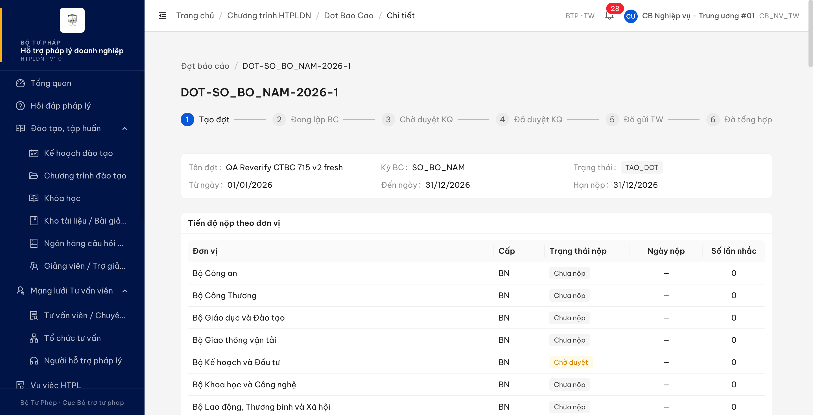

**2. Nội dung tệp đã đọc** *(phụ trợ)*

[R2-QUET-XUAT-TEP-noi-dung.log.txt](image/R2-QUET-XUAT-TEP-noi-dung.log.txt) — mục *"MÀN: Mạng lưới TV → Tư vấn viên / Chuyên gia"*.

```
O F6  'CU_NHAN\nQD-SEED28-2026'
O F7  'THAC_SI'      !! MA KY THUAT CHUA VIET HOA
O F8  'THAC_SI'      !! MA KY THUAT CHUA VIET HOA
O F9  'THAC_SI'      !! MA KY THUAT CHUA VIET HOA
```

### Kiểm tra lại lượt 3 — 29/07/2026

Kiểm lại **cả 5 chỗ** đã ghi ở hai lượt trước. **4 chỗ đã sửa, còn 1 chỗ giữ nguyên.**

**Đã sửa**

| Chỗ | Lượt trước | Lần này |
|---|---|---|
| Màn Đợt báo cáo → Chi tiết — ô "Kỳ BC" | `SO_BO_NAM` | **Sơ bộ năm** |
| — ô "Trạng thái" | `TAO_DOT` | **Tạo đợt** |
| — đường dẫn đầu trang | `Dot Bao Cao` | **Đợt báo cáo** |
| — mục sườn trái | `Vu viec HTPL` | **Vụ việc HTPL** |
| Tệp Tư vấn viên / Chuyên gia — cột trình độ | `THAC_SI` · `CU_NHAN` | **Thạc sĩ** · **Cử nhân** |
| Tệp báo cáo đánh giá — cột "Vụ việc" | `8e259653-e0a5-49e8-…` | **`VV-BTP-TW-20260712-001`** · `EEE-VH-012` · `EEE-VH-011` |
| Tệp báo cáo đánh giá — nhãn chỉ tiêu | `CHI TIEU HOAT DONG (Nhom VI)` · `Tong so vu viec` · `So TVV kien toan/cong bo` | **CHỈ TIÊU HOẠT ĐỘNG HTPLDN (Nhóm VI)** · **Tổng số vụ việc** · **Số TVV kiện toàn/công bố** |

Màn **danh sách** Đợt báo cáo cũng đã đổi theo: cột "Kỳ BC" ghi *Sơ bộ năm* / *Sơ bộ 6 tháng*, cột "Trạng thái" ghi *Tạo đợt*.

**Còn lỗi — tệp Excel của Nhật ký hệ thống**

Tiêu đề cột thứ 9 và 10 vẫn bỏ dấu, trong khi các tiêu đề **ngay cạnh** đều có dấu đầy đủ:

```
1. 'Thời gian'      5. 'Hành động'         9. 'Don vi'    <-- vẫn mất dấu
2. 'Module'         6. 'Chi tiết thay đổi'  10. 'Vai tro'  <-- vẫn mất dấu
3. 'Entity type'    7. 'Username'           11. 'Nguồn hệ thống'
4. 'Entity ID'      8. 'Họ và tên'          15. 'Mã phản hồi'
```

Đây vẫn là bằng chứng cho thấy **không phải lỗi phông chữ hay mã hoá** — cùng một tệp, cùng một dòng tiêu đề, chữ bên cạnh có dấu mà hai chữ này thì không.

**Kết luận:** 4/5 chỗ đã sạch; riêng hai tiêu đề cột của tệp Nhật ký hệ thống chưa sửa → giữ mở.

**Bằng chứng lượt 3**

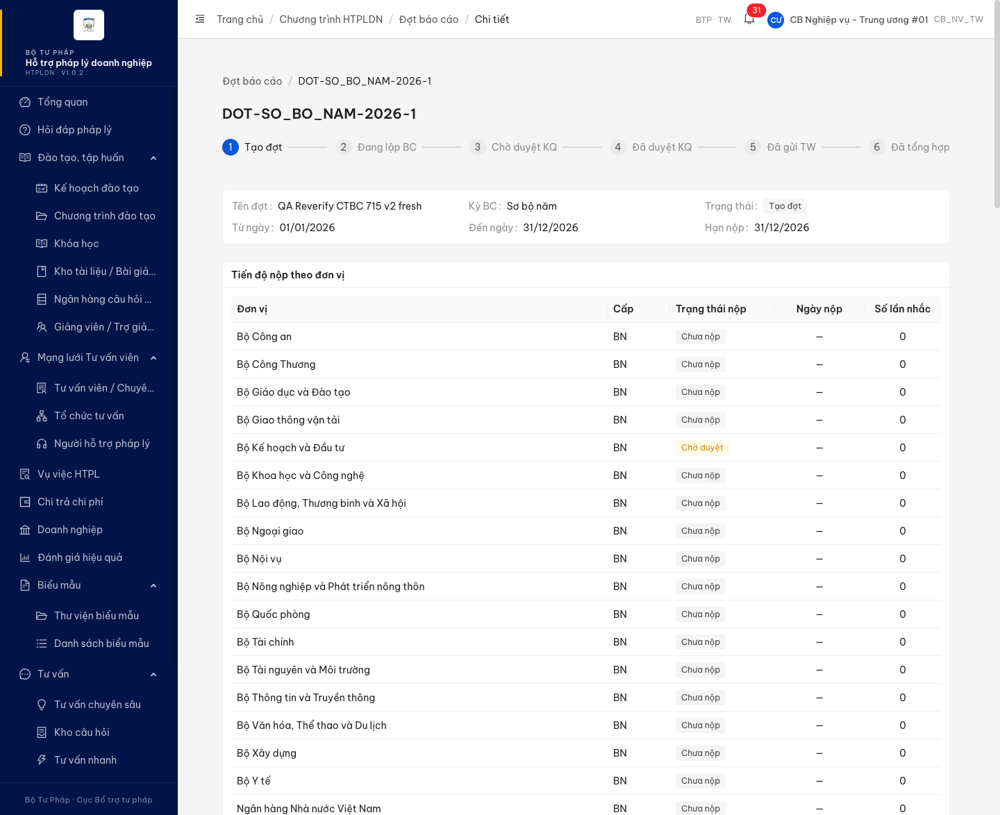

Bản đọc đầy đủ cả 5 chỗ (giá trị từng ô trong 3 tệp xuất): [R3-BUG-NHAN-MA-noi-dung.log.txt](image/R3-BUG-NHAN-MA-noi-dung.log.txt).

### Kiểm tra lại lượt 4 — 29/07/2026

**Cả 5 chỗ từng ghi nhận nay đều sạch** — kể cả chỗ còn lại của lượt 3:

| Chỗ | Lượt 3 | Lượt 4 |
|---|---|---|
| Màn Đợt báo cáo — Kỳ BC / Trạng thái / đường dẫn / sườn trái | đã sửa | vẫn sạch (*Sơ bộ năm* · *Tạo đợt* · *Đợt báo cáo* · *Vụ việc HTPL*) |
| Tệp Tư vấn viên / Chuyên gia — cột trình độ | đã sửa | vẫn sạch (*Thạc sĩ* · *Cử nhân*) |
| Tệp báo cáo đánh giá — cột "Vụ việc" + nhãn chỉ tiêu | đã sửa | vẫn sạch — quét lại **toàn bộ 23 tệp `.xlsx`** của màn Báo cáo thống kê, không còn ô nào chứa chuỗi định danh nội bộ, mã kỹ thuật hay nhãn bỏ dấu |
| Tệp Nhật ký hệ thống — tiêu đề cột 9 và 10 | `Don vi` · `Vai tro` | **`Đơn vị`** · **`Vai trò`** ✔ |

Giá trị trong cột "Hành động" của tệp nhật ký cũng đều là chữ tiếng Việt có dấu (*Chờ xác minh OTP*, *Đăng nhập*, *Cập nhật*, *Xuất dữ liệu*, *Thẩm định*, *Phê duyệt*…).

**Còn lỗi — tên trang tính của chính tệp Nhật ký hệ thống**

Tệp `audit-log-2026-07-29.xlsx` chỉ có một trang tính, tên hiện ở thẻ dưới cùng khi mở tệp là:

```
'Nhat ky he thong'      <-- vẫn bỏ dấu
```

So với các tệp xuất khác của cùng sản phẩm, xuất trong cùng ngày:

| Trang tính | Màn xuất |
|---|---|
| `Điểm danh` | Khóa học → tab Điểm danh |
| `DS Tư vấn viên` | Mạng lưới TV → Tư vấn viên / Chuyên gia |
| `BC Chất lượng đào tạo` · `Chương trình theo lĩnh vực` · `Chương trình theo đơn vị` · `Chương trình theo thời gian` · `BC Chi phí chi trả` | Báo cáo thống kê |
| **`Nhat ky he thong`** | **Quản trị hệ thống → Nhật ký hệ thống** |

8/9 trang tính có dấu đầy đủ, riêng trang tính của Nhật ký hệ thống thì không — vẫn đúng lập luận đã dùng ở hai lượt trước: không phải hạn chế của định dạng Excel hay lỗi phông chữ, mà là chữ được đặt sai ngay từ lúc sinh tệp. Đây cũng là **đúng tệp mà bản sửa lần này vừa động đến**: tiêu đề cột đã sửa nhưng tên trang tính thì chưa.

**Ghi nhận thêm — không đề xuất sửa trong lần này**

- Cột "Entity type" ghi tên bảng dạng `TAI_KHOAN` / `TU_VAN_VIEN`. **Không tính là lỗi**: `srs-fr-10-quan-tri.md:1982` (SCR-VIII-10 mục 7) định nghĩa ô lọc "Entity" là *"Tên bảng hoặc mã bản ghi"* — tức chính đặc tả yêu cầu hiện tên bảng, và màn hình cũng hiện đúng như vậy.
- Cột "Nguồn hệ thống" có 9 ô ghi mã công việc nền (`ACCOUNT_UNLOCK_JOB`, `LOCK_ACCOUNT_AUTO`…).
- Một số tiêu đề cột dùng từ tiếng Anh (`Entity type`, `Entity ID`, `Username`, `Consumer`, `IP`, `Endpoint`, `Session`) — có từ lượt 1, không nằm trong phạm vi đã mở của lỗi này.
- 98 ô cột "Họ và tên" ghi tên tài khoản không dấu (`QA CB Nghiep vu Ha Noi`) — dữ liệu QA nhập từ trước, không phải lỗi ứng dụng.

**Căn cứ đặc tả:** `srs-v3.5.md:575` (UI-06 — *"Tiếng Việt là ngôn ngữ duy nhất. Unicode UTF-8…"*) và `srs-v3.5.md:4635` (I18N-01 — *"Tiếng Việt là ngôn ngữ duy nhất cho giao diện CMS"*, ✅ CĐT xác nhận).

**Kết luận:** 5/5 chỗ đã mở trước đây đều sạch; còn lại duy nhất tên trang tính của chính tệp Nhật ký hệ thống → giữ mở, chờ sửa nốt.

**Bằng chứng lượt 4**

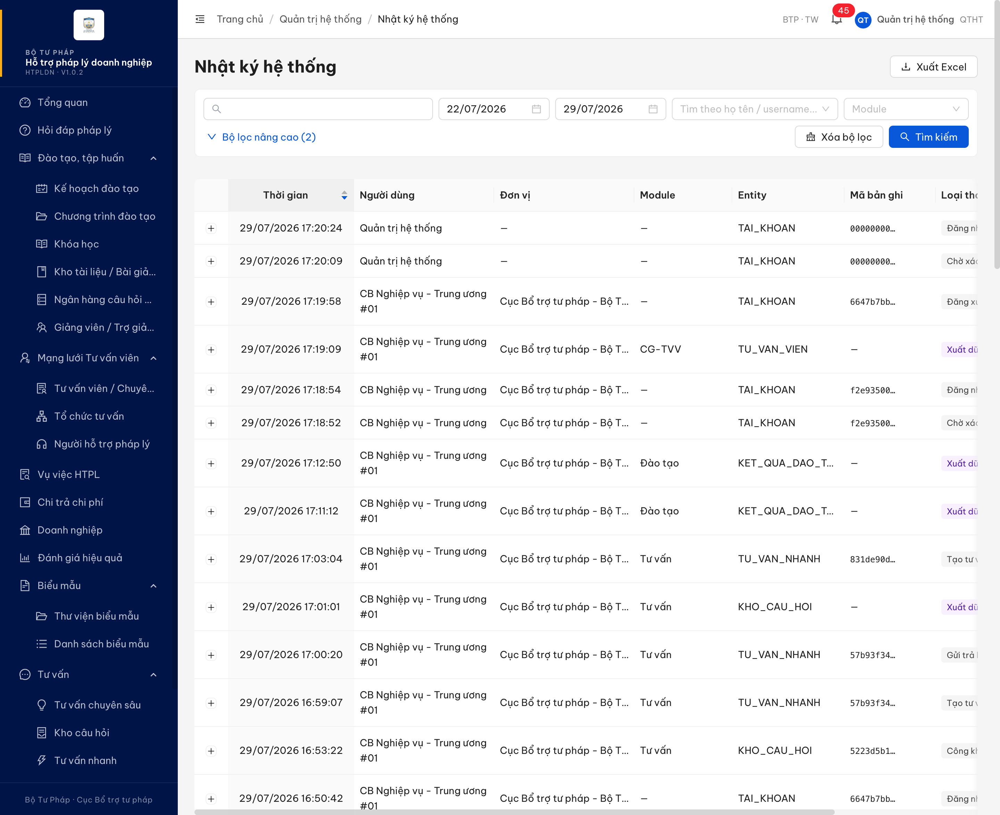

Bản đọc đầy đủ (16 tiêu đề cột của tệp nhật ký, kết quả quét 23 tệp báo cáo, bảng so tên trang tính giữa 9 tệp): [R4-BUG-NHAN-MA-noi-dung.log.txt](image/R4-BUG-NHAN-MA-noi-dung.log.txt).

### Kiểm tra lại lượt 5 — 30/07/2026 — ✅ ĐÃ SỬA XONG

**Môi trường:** `https://18.143.165.120.nip.io` · bản dựng **V1.0.3** · tài khoản `admin` (phần Nhật ký hệ thống) + `cbnv_tw_02` (phần Đợt báo cáo và Tư vấn viên/Chuyên gia). Thao tác hoàn toàn trên giao diện.

**Điểm duy nhất còn lại của lượt 4 — đã sửa**

Bấm [Xuất Excel] ở màn Quản trị hệ thống → Nhật ký hệ thống, đọc thẳng phần lưu tên trang tính trong tệp `audit-log-2026-07-30.xlsx` (271.836 byte, bộ lọc 23/07–30/07):

| | Tên trang tính |
|---|---|
| Lượt 4 | `Nhat ky he thong` — bỏ dấu |
| **Lượt 5** | **`Nhật ký hệ thống`** — có dấu đầy đủ |

**Kiểm lại 5 chỗ đã đóng ở lượt trước — không chỗ nào hỏng ngược**

| Chỗ kiểm | Kết quả lượt 5 |
|---|---|
| Tệp Nhật ký hệ thống — tiêu đề cột 9 và 10 | `Đơn vị` · `Vai trò` — vẫn có dấu |
| Màn Đợt báo cáo (danh sách + chi tiết) | ô "Kỳ BC" ghi *Sơ bộ năm* / *Sơ bộ 6 tháng*; ô "Trạng thái" ghi *Tạo đợt*; đường dẫn đầu trang ghi *Đợt báo cáo*; mục sườn trái ghi *Vụ việc HTPL* |
| Bảng bước tiến độ trên màn chi tiết đợt | cả 6 trạng thái đều là tiếng Việt có dấu — *Tạo đợt*, *Đang lập BC*, *Chờ duyệt KQ*, *Đã duyệt KQ*, *Đã gửi TW*, *Đã tổng hợp* |
| Tệp xuất Tư vấn viên / Chuyên gia — cột trình độ | F5 *Thạc sĩ* · F6 *Cử nhân* · F7–F9 *Thạc sĩ*; trang tính `DS Tư vấn viên` |
| 22 tệp `.xlsx` của màn Báo cáo thống kê (gồm BC Đánh giá hiệu quả) | quét 3 loại lỗi — chuỗi định danh nội bộ: **0** · mã enum: **0** · chữ bỏ dấu: **0**; 22/22 tên trang tính có dấu |

Bảng bước tiến độ đáng chú ý: nó cho thấy bảng chuyển mã trạng thái sang chữ đã phủ **hết** giá trị của kỳ đợt báo cáo, không phải chỉ đúng cho một trạng thái đang test.

**Một quan sát đã truy đến gốc và kết luận không phải lỗi**

Khi kiểm lại tệp xuất Tư vấn viên/Chuyên gia, mở form **Sửa** hồ sơ `TVV-BTP-TW-0002` thì ô *"Trình độ học vấn"* hiện `CU_NHAN`, còn danh sách tùy chọn của chính ô đó lại là *"Cử nhân / Thạc sĩ / Tiến sĩ / Khác"*. Thoạt nhìn đúng là lỗi này, nhưng ba căn cứ sau cho thấy không phải:

1. **Đặc tả đặt trường này là ô chữ, miền giá trị là chính 4 chữ tiếng Việt** — `srs-fr-04-chuyen-gia-tvv.md:145`: *"trinh_do | text | Y | Cử nhân/Thạc sĩ/Tiến sĩ/Khác"*, nhắc lại ở `:382`, và `:1502`: *"Trình độ * | dropdown | "Cử nhân" / "Thạc sĩ" / "Tiến sĩ" / "Khác""*. Tức giá trị đúng để lưu chính là *"Cử nhân"*; `CU_NHAN` **không** thuộc miền giá trị đặc tả cho phép.
2. **Riêng hồ sơ này lưu `CU_NHAN` là do QA tự nạp dữ liệu mẫu từ ngoài giao diện** ngày 12/07/2026 — cả hồ sơ đầy chuỗi không dấu kiểu dữ liệu mẫu (*"Ha Noi"*, *"Dai hoc Luat Ha Noi"*). 4 hồ sơ còn lại trong cùng danh sách đều lưu đúng chữ tiếng Việt và form Sửa hiện đúng: kiểm `TVV-STP-AG-0001`, ô đó hiện *"Thạc sĩ"* ngay từ 0,5 giây đầu, đo 6 lần liên tiếp không đổi.
3. **Đường đi của chính sản phẩm ghi xuống đúng chữ tiếng Việt.** Phép thử: mở form Sửa hồ sơ đó, chọn *"Tiến sĩ"* từ dropdown rồi [Lưu] → thông báo *"Cập nhật hồ sơ TVV thành công"*; mở lại form hiện *"Tiến sĩ"* (không phải `TIEN_SI`), màn xem chi tiết cũng hiện *"Tiến sĩ"*. Chọn lại *"Cử nhân"* rồi [Lưu] → mở lại form hiện *"Cử nhân"*. Form không hỏng: nó hiện đúng mọi giá trị do chính giao diện ghi ra.

Cùng giá trị `CU_NHAN` đó, màn **xem chi tiết** và **tệp xuất** lại hiện *"Cử nhân"* — hai chỗ này có thêm bước đổi mã cũ sang chữ. Vậy chênh lệch giữa form Sửa và hai chỗ kia chỉ là mức độ đỡ với dữ liệu ngoài miền giá trị, không phải lỗi hiện mã kỹ thuật của sản phẩm.

> **Ghi nhận để BA xem xét — không log thành lỗi:** không kiểm được bằng giao diện rằng hệ thống có chặn giá trị ngoài 4 giá trị cho phép hay không, vì ô này là dropdown đóng kín, không gõ tay được. Nếu BA muốn chặn từ gốc thì đây là điểm cần chốt riêng.
>
> **Lưu ý về dữ liệu:** phép thử (3) có ghi xuống thật. Hồ sơ `TVV-BTP-TW-0002` trước đó lưu `CU_NHAN`, sau phép thử lưu *"Cử nhân"* — tức đã về đúng miền giá trị đặc tả; giá trị hiện ra cho người dùng và tệp xuất không đổi, các trường khác giữ nguyên.

**Kết luận:** 6/6 chỗ của lỗi này đã đạt, kể cả điểm duy nhất còn lại ở lượt 4 → **đóng lỗi**.

**Bằng chứng lượt 5**

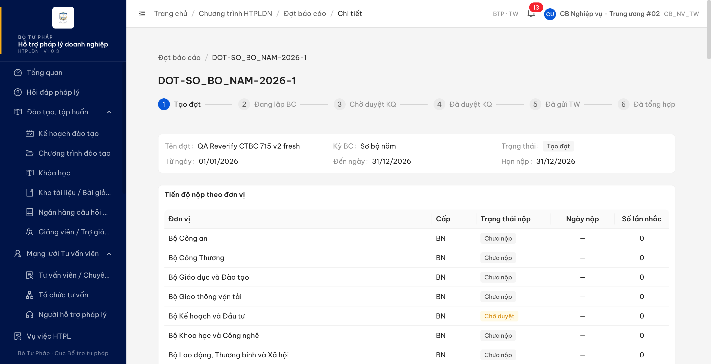

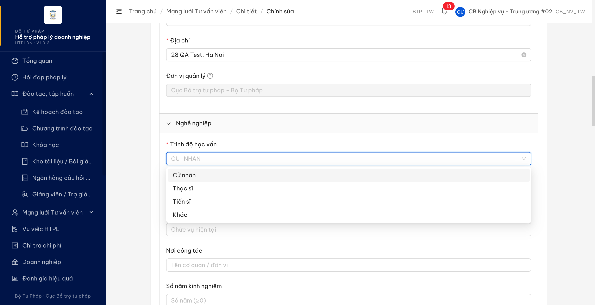

Bản đọc đầy đủ (tên trang tính, 16 tiêu đề cột tệp nhật ký, kết quả quét 22 tệp báo cáo, 3 phép thử của quan sát `CU_NHAN`): [R5-BUG-NHAN-MA-noi-dung.log.txt](image/R5-BUG-NHAN-MA-noi-dung.log.txt).

---

## ~~BUG-XUAT-TEP-KHOA-HOC-SAI-DU-LIEU~~ [CLOSED] — Tệp xuất của Khóa học không khớp màn hình: điểm danh gộp cả 2 buổi thành dữ liệu mâu thuẫn, kết quả học tập mất ô

> **Re-test:** 2026-07-29 17:45:00 R4 — ✅ PASS (Closed-verified). Cả 3 điểm đã sửa: tệp điểm danh bám đúng buổi đang chọn (thử cả buổi SÁNG và CHIỀU, nội dung đổi theo), tệp kết quả không còn ô trống, và cột Xếp loại nay ghi chữ tiếng Việt (Không đạt / Giỏi / Khá) thay vì mã KHONG_DAT — kiểm trên 2 khóa học khác nhau.

### Mô tả

Hai chức năng xuất tệp trong màn **Khóa học** đều cho ra tệp **không dùng được để đối chiếu** với thứ người dùng đang nhìn.

**1. Tab Điểm danh — tệp bỏ qua buổi học đang chọn.** Điểm danh trong hệ thống này luôn gắn với **một buổi cụ thể**: cùng một học viên, buổi sáng có thể "Có mặt" còn buổi chiều "Vắng có phép". Màn hình bắt buộc phải chọn buổi trước khi hiện bảng. Nhưng khi bấm **[Xuất Excel]**, tệp lại **gộp hết mọi buổi** và **không có cột nào cho biết dòng đó thuộc buổi nào**. Kết quả là trong tệp, cùng một học viên, cùng một ngày, xuất hiện **hai dòng mang hai trạng thái trái ngược nhau** — người đọc không có cách nào biết dòng nào là buổi nào, cũng không biết dòng nào ứng với thứ mình vừa xem trên màn.

**2. Tab Kết quả — tệp Word thiếu ô dữ liệu.** Dòng thứ 2 của bảng trong tệp `.docx` có ô **"Họ và tên" trống** và ô **"Kết quả" trống**, trong khi màn hình hiện đủ cả hai.

### Các bước tái hiện

**Phần 1 — Điểm danh:**

1. Đăng nhập **`cbnv_tw_01`** (CB Nghiệp vụ · Trung ương).
2. Vào **Đào tạo, tập huấn → Khóa học**, mở khóa **`KH-20260716-002`**.
3. Sang **tab Điểm danh**. Ô chọn buổi có 2 lựa chọn cùng ngày 20/09/2026: *buổi SÁNG (08:00–11:30)* và *buổi CHIỀU (13:30–17:00)*.
4. Chọn **buổi SÁNG** → bảng hiện **2 dòng**: `QA HV RV5 Hai` = *Có mặt* · `QA HV RV5 Mot` = *Vắng không phép*. Ghi lại.
5. Chọn thử **buổi CHIỀU** để biết dữ liệu khác: `Hai` = *Vắng có phép* · `Mot` = *Vắng không phép*. Rồi **chọn lại buổi SÁNG**.
6. Bấm **[Xuất Excel]**, mở tệp → đếm số dòng và đọc cột "Trạng thái".

**Phần 2 — Kết quả:**

7. Vẫn khóa `KH-20260716-002`, sang **tab Kết quả** → ghi lại bảng trên màn (có `QA HV RV5 Mot`, cột Kết quả hiện `—`).
8. Bấm **[Xuất DOCX]**, mở tệp, đọc **dòng thứ 2** của bảng.

### Kết quả mong đợi

- Tệp xuất phải phản ánh đúng **buổi học đang được chọn** trên màn — hoặc nếu chủ ý xuất mọi buổi thì **bắt buộc phải có cột "Buổi học"** để phân biệt. Đặc tả xác định điểm danh là dữ liệu **per-buổi**: `srs-fr-03-dao-tao.md:41` — *"Điểm danh per-buổi (KET_QUA_DAO_TAO + lich_hoc_id, enum CO_MAT/VANG_PHEP/VANG_KHONG_PHEP)"*; `srs-fr-03-dao-tao.md:544` quy định trường `lich_hoc_id`: *"**Bắt buộc khi nhập điểm danh** — điểm danh phải gắn với 1 buổi cụ thể"*.
- Chính đặc tả cũng bắt màn hình phải chọn buổi trước — `srs-fr-03-dao-tao.md:635`: *"**Given** CB NV chưa chọn buổi học **When** mở Tab 4 "Điểm danh" **Then** hiển thị "Vui lòng chọn buổi học để bắt đầu điểm danh", không hiển thị bảng trống không chú thích"*. Dữ liệu đã bắt buộc gắn buổi khi nhập thì lúc xuất ra không được đánh mất chiều đó.
- Nguyên tắc chung cho tệp xuất — `srs-fr-11-bao-cao.md:1280` (**BR-DATA-06**): *"File xuất **theo bộ lọc hiện tại**"*.
- Tệp xuất phải chứa **đủ giá trị mà màn hình đang hiển thị**, không được để trống ô đã có dữ liệu.

### Kết quả thực tế

**1. Điểm danh — màn 2 dòng, tệp 4 dòng, và tệp tự mâu thuẫn**

Màn hình (đang chọn **buổi SÁNG**):

| # | Họ tên | Trạng thái |
|---|---|---|
| 1 | QA HV RV5 Hai | Có mặt |
| 2 | QA HV RV5 Mot | Vắng không phép |

Tệp `diem-danh-033910fc-895d-432a-8407-8f7f0a9516c2.xlsx` (vùng A1:G5 — **4 dòng dữ liệu**):

| Dòng | Họ tên | Ngày điểm danh | Trạng thái | |
|---|---|---|---|---|
| 2 | QA HV RV5 Hai | 2026-09-20 | **Có mặt** | ← buổi sáng |
| 3 | QA HV RV5 Hai | 2026-09-20 | **Vắng có phép** | ← buổi chiều, không được yêu cầu |
| 4 | QA HV RV5 Mot | 2026-09-20 | Vắng không phép | |
| 5 | QA HV RV5 Mot | 2026-09-20 | Vắng không phép | ← trùng hệt dòng 4 |

Dãy cột của tệp là `Mã học viên · Họ tên · Đơn vị · Ngày điểm danh · Trạng thái · Có mặt (1/0) · Ghi chú` — **không có cột "Buổi học"**. Ô "Ngày điểm danh" của cả 4 dòng đều là `2026-09-20 00:00:00`, giờ luôn bằng 0 nên cũng không dùng để phân biệt buổi được.

Hệ quả cụ thể: đọc tệp này thì học viên `QA HV RV5 Hai` vừa *Có mặt* vừa *Vắng có phép* trong cùng ngày, còn `QA HV RV5 Mot` có 2 dòng giống hệt nhau. Không ai đối chiếu được tệp với màn hình.

**Cột bị mất so với màn hình:** `STT` · `Email` · `Số điện thoại`.

**2. Kết quả học tập — tệp Word mất ô dữ liệu**

| Dòng 2 của bảng | Màn hình | Trong tệp `.docx` |
|---|---|---|
| Họ và tên | `QA HV RV5 Mot` | **(trống)** |
| Kết quả | `—` | **(trống)** |

**Cột bị mất so với màn hình:** `Email` · `Số điện thoại` · `Đơn vị` · `Xếp loại` · `Ghi chú` (màn 10 cột → tệp 7 cột).

**3. Ghi nhận thêm khi đo (không thuộc 2 điểm trên)**

- Tab **Kết quả chỉ có nút [Xuất DOCX]**, không có [Xuất Excel] — trong khi tab Điểm danh thì chỉ có [Xuất Excel]. *(Đã kiểm bằng `closest('.ant-tabs-tabpane')`: nút "Xuất Excel" còn nằm trong DOM là của tab Điểm danh đang ẩn, không phải của tab Kết quả.)*
- Tên tệp của cả 2 chức năng dùng **chuỗi định danh nội bộ của khóa học** (`diem-danh-033910fc-895d-432a-8407-8f7f0a9516c2.xlsx`) thay vì mã khóa `KH-20260716-002`.
- Ô "Ngày điểm danh" mang định dạng ô **`mm-dd-yy`** (tháng-ngày-năm kiểu Mỹ) — cùng loại lỗi định dạng đã ghi ở `BUG-XUAT-TEP-LECH-MUI-GIO`.
- **Đơn vị của học viên khác nhau giữa 2 tab của cùng một khóa học:** tab Điểm danh ghi `Cong ty QA RV5`, tab Kết quả ghi `Cục Bổ trợ tư pháp - Bộ Tư pháp`.

### Bằng chứng

**1. Ảnh chụp**

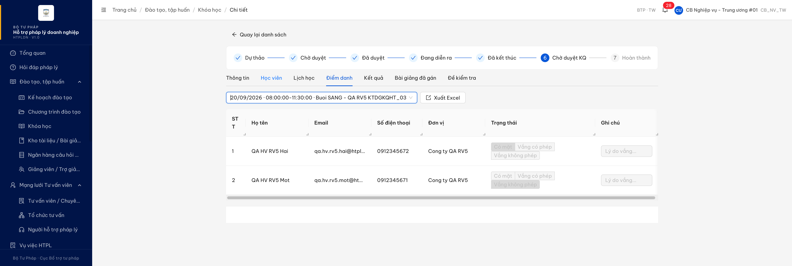

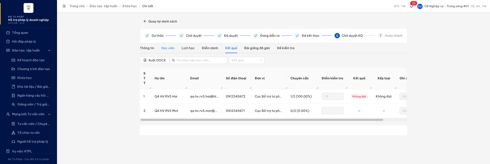

**2. Nội dung tệp đã đọc** *(phụ trợ)*

[R2-QUET2-XUAT-TEP-noi-dung.log.txt](image/R2-QUET2-XUAT-TEP-noi-dung.log.txt) — mục *"MÀN: Đào tạo → Khóa học KH-20260716-002 → Tab Điểm danh"* và *"→ Tab Kết quả"*.

```
Man hinh (dang chon buoi SANG) : 2 dong
   QA HV RV5 Hai  -> Co mat
   QA HV RV5 Mot  -> Vang khong phep

Tep diem-danh-033910fc-....xlsx : sheet 'Điểm danh'  vung A1:G5 = 4 dong du lieu
   Cot: Ma hoc vien | Ho ten | Don vi | Ngay diem danh | Trang thai | Co mat (1/0) | Ghi chu
        (KHONG co cot 'Buoi hoc')
   Dong 2  QA HV RV5 Hai  2026-09-20 00:00:00  'Có mặt'
   Dong 3  QA HV RV5 Hai  2026-09-20 00:00:00  'Vắng có phép'   <-- buoi CHIEU, khong duoc yeu cau
   Dong 4  QA HV RV5 Mot  2026-09-20 00:00:00  'Vắng không phép'
   Dong 5  QA HV RV5 Mot  2026-09-20 00:00:00  'Vắng không phép'
```

### Kiểm tra lại lượt 3 — 29/07/2026

Chạy lại đủ cả hai phần trên chính khóa `KH-20260716-002`.

**1. Điểm danh — đã sửa**

Chọn **buổi SÁNG (20/09/2026 08:00–11:30)**, màn hình 2 dòng, bấm **[Xuất Excel]**:

| | Lượt trước | Lần này |
|---|---|---|
| Số dòng trong tệp | 4 (gộp cả buổi chiều) | **2** — đúng bằng buổi đang chọn |
| Cột "Buổi học" | không có | **có** — ghi `20/09/2026 08:00-11:30` |
| Cột so với màn hình | thiếu `STT` · `Email` · `Số điện thoại` | **đủ cả 3** |
| Ô "Ngày điểm danh" | ô kiểu ngày, định dạng `mm-dd-yy` | **`20/09/2026`** |

Trạng thái trong tệp khớp màn hình: `QA HV RV5 Hai` = *Có mặt*, `QA HV RV5 Mot` = *Vắng không phép*. Không còn cảnh một học viên vừa *Có mặt* vừa *Vắng có phép* trong cùng ngày.

**2. Kết quả học tập — hai ô trống đã sửa, nhưng cột mới bổ sung lại hỏng**

Hai ô từng trống nay đã đầy đủ, và bảng nay có đủ 12 cột (trước chỉ 7):

| Dòng 2 của bảng | Màn hình | Tệp lượt trước | Tệp lần này |
|---|---|---|---|
| Họ và tên | `QA HV RV5 Mot` | *(trống)* | **`QA HV RV5 Mot`** |
| Kết quả | `—` | *(trống)* | **`—`** |

**Nhưng cột `Xếp loại` — cột vừa được bổ sung ở lượt sửa này — lại ghi mã nội bộ:**

| Dòng 1 | Màn hình | Trong tệp |
|---|---|---|
| Kết quả | Không đạt | `Không đạt` ✔ |
| **Xếp loại** | **Không đạt** | **`KHONG_DAT`** ❗ |

Hai cột nằm cạnh nhau trong cùng một dòng, cột trước ghi đúng chữ tiếng Việt còn cột sau ghi mã. Đây là **điểm mới phát sinh trong chính tệp vừa được sửa** — cùng loại lỗi đang mở ở `BUG-NHAN-MA-KY-THUAT-THO`.

**3. Các ghi nhận thêm — chưa thay đổi**

- Tab **Kết quả** vẫn chỉ có nút **[Xuất DOCX]**, không có [Xuất Excel].
- Tên tệp vẫn dùng chuỗi định danh nội bộ: `diem-danh-033910fc-895d-432a-8407-8f7f0a9516c2.xlsx` · `ket-qua-033910fc-….docx`, thay vì mã khóa `KH-20260716-002`.
- Đơn vị của học viên vẫn khác nhau giữa hai tab của cùng khóa: tab Điểm danh ghi `Cong ty QA RV5`, tab Kết quả ghi `Cục Bổ trợ tư pháp - Bộ Tư pháp`.

**Kết luận:** hai điểm chính đã sửa, nhưng bản sửa làm phát sinh mã `KHONG_DAT` ở cột mới trong cùng tệp → giữ mở.

**Bằng chứng lượt 3**

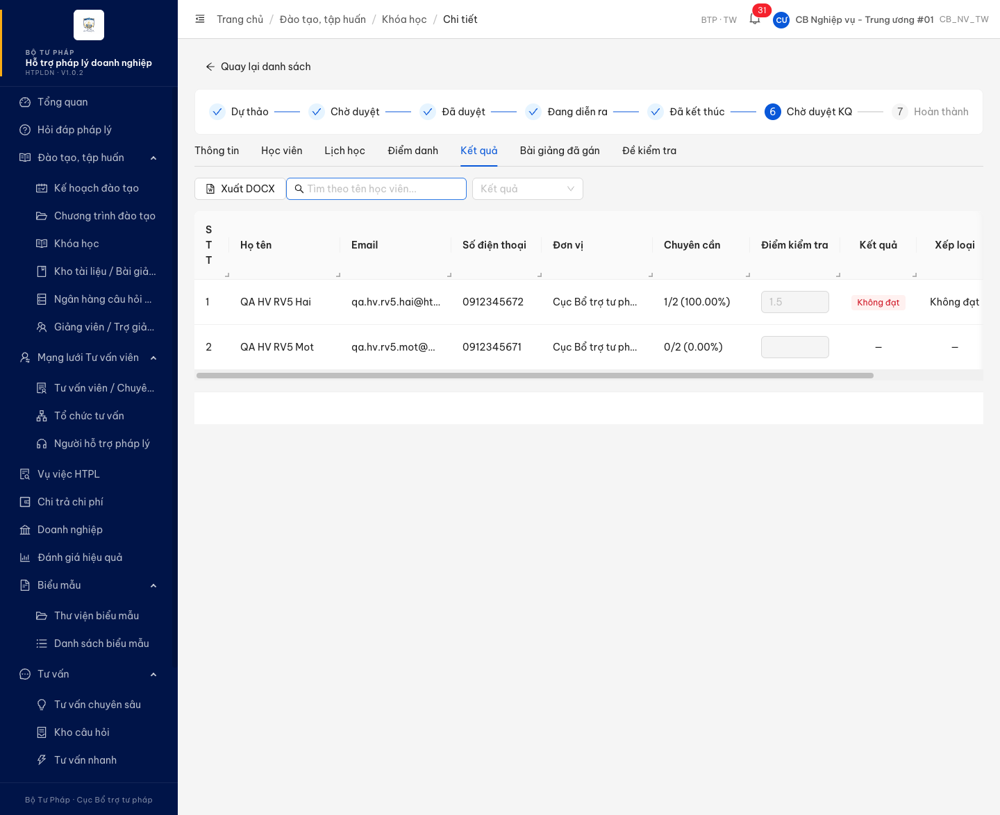

Bản đọc đầy đủ hai tệp (từng ô của tệp điểm danh, toàn bộ đoạn văn và bảng của tệp kết quả): [R3-BUG-KHOAHOC-noi-dung.log.txt](image/R3-BUG-KHOAHOC-noi-dung.log.txt).

### Kiểm tra lại lượt 4 — 29/07/2026

Chạy lại cả ba điểm trên khóa `KH-20260716-002` — chính khóa từng hỏng — và kiểm chéo thêm một khóa khác.

**1. Điểm danh — tệp bám đúng buổi đang chọn**

Lượt 3 mới thử một buổi, nên chưa loại được khả năng tệp luôn trả về buổi đầu tiên. Lượt 4 xuất **hai lần với hai buổi khác nhau**, không đổi gì khác:

| | Buổi SÁNG (08:00–11:30) | Buổi CHIỀU (13:30–17:00) |
|---|---|---|
| Màn hình — `QA HV RV5 Hai` | Có mặt | Vắng có phép |
| Trong tệp — cột "Trạng thái" | **Có mặt** | **Vắng có phép** |
| Trong tệp — cột "Buổi học" | **20/09/2026 08:00-11:30** | **20/09/2026 13:30-17:00** |
| Số dòng | 2 | 2 |

Nội dung tệp đổi theo đúng buổi vừa chọn. Không còn cảnh một học viên có hai dòng trái ngược trong cùng một tệp (lượt 1: 4 dòng gộp cả hai buổi, không có cột nào cho biết buổi).

**2. Kết quả học tập — không còn ô trống, cột "Xếp loại" đã ghi bằng chữ**

| Ô | Lượt 1 | Lượt 3 | Lượt 4 |
|---|---|---|---|
| Dòng 2 — "Họ và tên" | *(trống)* | đã có | `QA HV RV5 Mot` ✔ |
| Dòng 2 — "Kết quả" | *(trống)* | đã có | `—` ✔ |
| Dòng 1 — "Xếp loại" | *(chưa có cột)* | `KHONG_DAT` | **`Không đạt`** ✔ |
| Số cột của bảng | 7 | 12 | 12 ✔ |

**3. Kiểm chéo trên khóa học khác** — để loại khả năng chỉ vá riêng một giá trị. Mở thêm khóa `KH-2026-001`: màn hình ghi *Giỏi* và *Khá*, tệp cũng ghi **`Giỏi`** và **`Khá`**. Cả ba giá trị xếp loại gặp được đều ra chữ tiếng Việt đúng như màn hình.

**Về dữ liệu thử:** lỗi nằm ở khâu kết xuất chứ không phải ở dữ liệu đã lưu, nên phép thử mạnh nhất là lấy lại chính bản ghi từng hỏng — nếu bản ghi cũ nay ra chữ đúng thì không còn khả năng "chỉ dữ liệu tạo mới mới đúng". Phần điểm danh được chạy bằng một lần chọn buổi mới ngay tại lượt 4.

**Ghi nhận thêm — không thuộc phạm vi lỗi này, không chặn việc đóng**

- Tên tệp tải về vẫn dùng chuỗi định danh nội bộ: `diem-danh-033910fc-895d-432a-8407-8f7f0a9516c2.xlsx`.
- Cột "Mã học viên" trong tệp điểm danh ghi chuỗi định danh nội bộ; màn hình tab Học viên không có cột mã nào để đối chiếu. Có từ lượt 1, không phải do bản sửa này sinh ra.
- Tab Kết quả vẫn chỉ có **[Xuất DOCX]**, không có [Xuất Excel].
- **Đã hết lệch:** đơn vị của học viên nay khớp nhau giữa hai tab — cả tab Điểm danh lẫn tab Kết quả đều ghi `Cong ty QA RV5` (lượt 3 tab Kết quả còn ghi `Cục Bổ trợ tư pháp - Bộ Tư pháp`).

**Căn cứ đặc tả:** `srs-fr-03-dao-tao.md:604` — trường xếp loại nhận giá trị *Giỏi / Khá / Trung bình / Không đạt*; `:544` — điểm danh bắt buộc gắn với một buổi cụ thể; `srs-fr-11-bao-cao.md:1280` (BR-DATA-06) — tệp xuất theo bộ lọc hiện tại.

**Bằng chứng lượt 4**

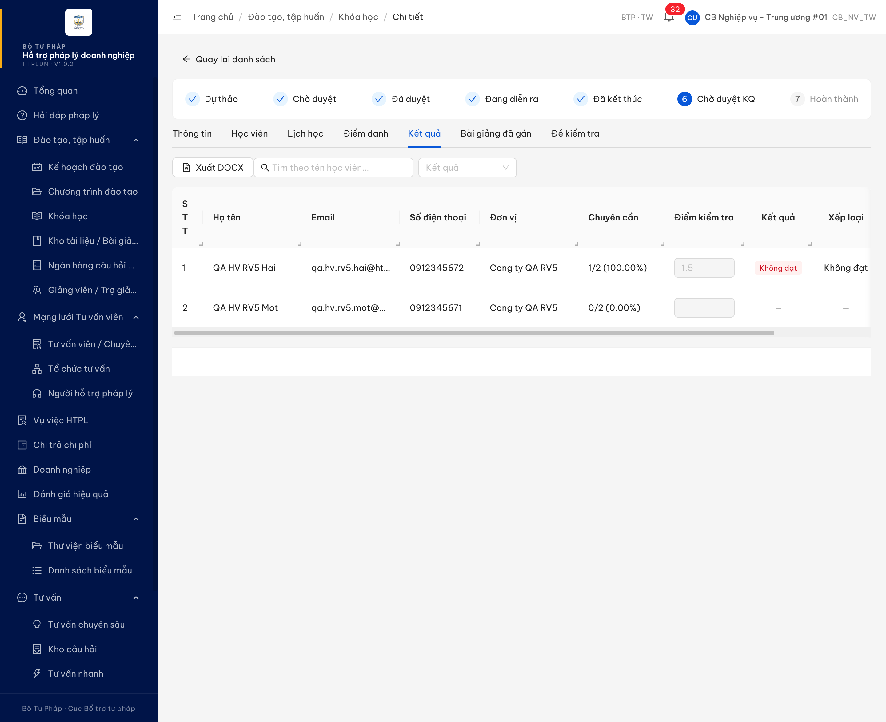

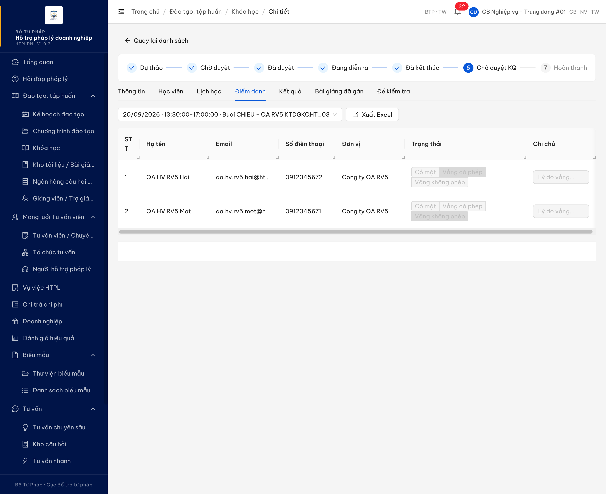

Bản đọc đầy đủ (từng ô của cả hai lần xuất điểm danh và hai tệp kết quả): [R4-BUG-KHOAHOC-noi-dung.log.txt](image/R4-BUG-KHOAHOC-noi-dung.log.txt).

---

## ~~BUG-BCDG-XLSX-KHONG-THEO-MAU-TT17~~ [CLOSED] — Báo cáo đánh giá hiệu quả: bản Word đúng mẫu Thông tư 17 nhưng bản Excel của cùng báo cáo không có khung mẫu nào

> **Re-test:** 2026-07-29 11:20:00 R3 — ✅ PASS (Closed-verified). Bản Excel nay có đủ khung TT17 (quốc hiệu, dòng dẫn mẫu, mục I-V, bảng ký); 2 ô kinh phí chưa nhập ghi '—' thay vì 0; bảng chi tiết cả 2 tệp đã có đủ Doanh nghiệp, Lĩnh vực, Điểm từng tiêu chí.

### Mô tả

Ở tab **Báo cáo** của một đợt đánh giá hiệu quả có **hai nút xuất nằm cạnh nhau**: **[Xuất XLSX]** và **[Xuất DOCX]**. Hai nút này lẽ ra cho ra cùng một báo cáo ở hai định dạng, nhưng thực tế cho ra **hai tài liệu khác hẳn nhau**:

- Bản **`.docx`** là văn bản hành chính hoàn chỉnh: có quốc hiệu, tiêu ngữ, dòng ghi rõ *"(Theo mẫu Thông tư số 17/2025/TT-BTP)"*, đủ 5 mục I→V, phần nhận xét, phần kiến nghị và bảng ký tên *Người lập báo cáo / Thủ trưởng đơn vị*.
- Bản **`.xlsx`** của **cùng báo cáo đó** **không có bất kỳ phần nào ở trên** — không quốc hiệu, không dòng dẫn mẫu, không mục I→V, không nhận xét, không kiến nghị, không bảng ký.

Nghĩa là ai xuất bản Excel sẽ nhận được một tài liệu **không dùng được để trình hay lưu hồ sơ**, dù bấm đúng nút xuất của cùng một báo cáo.

Ngoài ra, với hai chỉ tiêu kinh phí **chưa được nhập số liệu**, bản Excel ghi thành số **`0`** trong khi màn hình ghi `--` và bản Word ghi `—`. Với một báo cáo kinh phí, `0` nghĩa là "không chi đồng nào", khác hẳn "chưa có số liệu".

### Các bước tái hiện

1. Đăng nhập **`cbnv_tw_01`** (CB Nghiệp vụ · Trung ương).
2. Vào **Đánh giá hiệu quả**, mở đợt **`DG-20260722-0001`**.
3. Sang **tab Báo cáo** → đếm số dòng chỉ tiêu đang hiển thị trên màn.
4. Bấm **[Xuất DOCX]** → mở tệp, ghi lại cấu trúc văn bản (quốc hiệu, các mục I→V, bảng ký) và số dòng bảng chỉ tiêu.
5. Bấm **[Xuất XLSX]** → mở tệp, so cấu trúc và số dòng với bước 4 và với màn hình ở bước 3.

### Kết quả mong đợi

- Cả hai định dạng đều phải theo **cùng một biểu mẫu TT17/2025**. `srs-fr-08-danh-gia.md:900` quy định cho tab Báo cáo: *"Xuất Excel/Word **theo template TT17/2025**"* — câu này áp cho **cả hai** định dạng, không tách riêng. Mục đích của cả nhóm chức năng cũng nêu ở `srs-fr-08-danh-gia.md:35`: *"…tổng hợp kết quả hiệu quả HTPLDN **theo biểu mẫu TT17/2025/TT-BTP**"*.
- Hai tệp xuất từ cùng một báo cáo, tại cùng một thời điểm, phải mang **cùng số liệu**; và số liệu đó phải **khớp màn hình** người dùng vừa duyệt.

### Kết quả thực tế

**1. Khung biểu mẫu — có ở Word, mất hẳn ở Excel**

| Thành phần | `.docx` | `.xlsx` |
|---|---|---|
| Quốc hiệu · tiêu ngữ | ✔ | ✘ |
| Dòng *"(Theo mẫu Thông tư số 17/2025/TT-BTP)"* | ✔ | ✘ |
| Tên đợt · Mã kế hoạch | ✔ | ✘ |
| Mục **IV. Nhận xét tổng thể** | ✔ | ✘ |
| Mục **V. Kiến nghị** | ✔ | ✘ |
| Dòng *"Phân bố xếp loại: Tốt: 3"* | ✔ | ✘ |
| Bảng ký *Người lập báo cáo / Thủ trưởng đơn vị* | ✔ | ✘ |

Chiều ngược lại: **không có mục nào** mà bản `.xlsx` có còn bản `.docx` thiếu. Tức bản Excel là tập con thực sự của bản Word, không phải "cùng nội dung trình bày khác".

**2. Bản Excel biến ô "chưa có số liệu" thành số `0`**

Hai chỉ tiêu kinh phí — *"KP chi HĐ khác (NSNN)"* và *"KP xã hội hóa"* — hiện **chưa được nhập số liệu**. Ba nơi thể hiện cùng hai giá trị đó theo ba cách:

| Nơi | Cách thể hiện | Người đọc hiểu là |
|---|---|---|
| Màn hình *(2 trường riêng phía trên bảng chỉ tiêu)* | `--` | chưa có số liệu |
| Tệp `.docx` *(Bảng 3, dòng 12–13)* | `—` | chưa có số liệu |
| Tệp `.xlsx` *(ô E17, E18)* | **`0`** *(kiểu số nguyên)* | **đã có số liệu và bằng không** |

Đây là báo cáo về **kinh phí hỗ trợ pháp lý**. Ghi `0` cho khoản chưa nhập là khẳng định đơn vị **không chi đồng nào**, khác hẳn với "chưa có số liệu". Bản Word của cùng báo cáo giữ đúng `—`, nên đây là điểm lệch riêng của bản Excel.

*(Lưu ý cho người kiểm lại: bảng chỉ tiêu trên màn hình có 11 dòng còn trong tệp có 13 dòng — nhưng **không phải tệp tự thêm dữ liệu**. Màn hình đặt 2 chỉ tiêu kinh phí này thành 2 trường riêng phía trên bảng, còn tệp gộp chúng vào bảng thành dòng 12–13. Đây là khác biệt cách trình bày, không phải thiếu/thừa số liệu.)*

**3. Bảng tổng hợp thiếu cột so với đặc tả — cả hai tệp**

Bảng chi tiết trong `.xlsx` (vùng A23:E26) và trong `.docx` (Bảng 2) chỉ có 4 cột: `Vụ việc` · `Điểm tổng` · `Xếp loại` · `Trạng thái`. So với đặc tả tại `srs-fr-08-danh-gia.md:883` mô tả bảng gồm *Vụ việc / DN / Lĩnh vực / Điểm từng tiêu chí / Điểm tổng / Xếp loại*, hai tệp **thiếu**: `DN` · `Lĩnh vực` · `Điểm từng tiêu chí`.

Bảng này **không có trên màn hình** — chỉ xuất hiện trong tệp. Nên ở điểm này tệp *nhiều* hơn màn hình, nhưng vẫn *thiếu* so với đặc tả.

*(Cột "Vụ việc" của bảng này ghi chuỗi định danh nội bộ và nhãn chỉ tiêu trong `.xlsx` bị bỏ dấu tiếng Việt — 2 điểm đó đã ghi ở `BUG-NHAN-MA-KY-THUAT-THO`, không lặp lại ở đây.)*

### Bằng chứng

**Nội dung tệp đã đọc**

[R2-QUET2-XUAT-TEP-noi-dung.log.txt](image/R2-QUET2-XUAT-TEP-noi-dung.log.txt) — mục *"MÀN: Đánh giá hiệu quả → đợt DG-20260722-0001 → Tab Báo cáo → [Xuất XLSX]"* và *"→ [Xuất DOCX]"*, cùng phần **A.2** của mục "ĐỐI CHIẾU CỘT".

```
Cung 1 bao cao DG-20260722-0001, 2 nut xuat canh nhau:

.docx : co quoc hieu/tieu ngu · "(Theo mau Thong tu so 17/2025/TT-BTP)" · muc I->V
        · Nhan xet tong the · Kien nghi · bang ky ten   -> 16 doan + 4 bang
.xlsx : KHONG co bat ky phan nao o tren                 -> 26 dong x 6 cot

2 chi tieu kinh phi CHUA NHAP so lieu — 3 noi ghi 3 kieu:
   Man hinh (2 truong rieng)  : '--'   -> chua co so lieu
   .docx  (Bang 3, dong 12-13): '—'    -> chua co so lieu
   .xlsx  (o E17, E18)        : 0      -> DA co so lieu va bang khong   <<< lech
```

### Kiểm tra lại lượt 3 — 29/07/2026 — ✅ ĐẠT

Bấm lần lượt **[Xuất XLSX]** và **[Xuất DOCX]** trên tab Báo cáo của đúng đợt `DG-20260722-0001`, rồi mở cả hai tệp đọc từng thành phần. **Cả 3 điểm của bug đều đạt.**

**1. Khung biểu mẫu TT17 — bản Excel nay có đủ**

| Thành phần | `.docx` | `.xlsx` lượt trước | `.xlsx` lần này |
|---|---|---|---|
| Quốc hiệu · tiêu ngữ | ✔ | ✘ | **✔** |
| Dòng *"(Theo mẫu Thông tư số 17/2025/TT-BTP)"* | ✔ | ✘ | **✔** |
| Tên đợt · Mã kế hoạch | ✔ | ✘ | **✔** |
| Mục **IV. Nhận xét tổng thể** | ✔ | ✘ | **✔** |
| Mục **V. Kiến nghị** | ✔ | ✘ | **✔** |
| Dòng *"Phân bố xếp loại: Tốt: 3"* | ✔ | ✘ | **✔** |
| Bảng ký *Người lập báo cáo / Thủ trưởng đơn vị* | ✔ | ✘ | **✔** |

Bản Excel nay đi đủ mục **I → V** giống bản Word, không còn là tập con.

**2. Ô "chưa có số liệu" không còn bị ghi thành `0`**

| Chỉ tiêu | Màn hình | `.docx` | `.xlsx` lượt trước | `.xlsx` lần này |
|---|---|---|---|---|
| KP chi HĐ khác (NSNN) | `--` | `—` | **`0`** (kiểu số) | **`—`** |
| KP xã hội hóa | `--` | `—` | **`0`** (kiểu số) | **`—`** |

Cả ba nơi nay cùng thể hiện "chưa có số liệu".

**3. Bảng chi tiết đã đủ cột theo đặc tả — ở cả hai tệp**

| | Dãy cột |
|---|---|
| Đặc tả `srs-fr-08-danh-gia.md:883` | Vụ việc · DN · Lĩnh vực · Điểm từng tiêu chí · Điểm tổng · Xếp loại |
| Lượt trước (cả 2 tệp) | Vụ việc · Điểm tổng · Xếp loại · Trạng thái — thiếu 3 cột |
| **Lần này — cả `.xlsx` lẫn `.docx`** | **STT · Vụ việc · Doanh nghiệp · Lĩnh vực · Điểm từng tiêu chí · Điểm tổng · Xếp loại** |

Cột "Vụ việc" nay ghi mã vụ việc (`VV-BTP-TW-20260712-001`) thay cho chuỗi định danh nội bộ, và các nhãn chỉ tiêu đã có dấu tiếng Việt.

**Khác biệt nhỏ còn lại giữa hai tệp** *(không thuộc phạm vi bug này, ghi để dev biết)*: khối ký của bản `.docx` có dòng địa điểm/ngày tháng *"..........., ngày 29 tháng 7 năm 2026"* đặt trên *"THỦ TRƯỞNG ĐƠN VỊ"*, bản `.xlsx` không có dòng này. Tiêu đề mục III của `.xlsx` có thêm *"(Nhóm VI)"*. Bảng chỉ tiêu bản `.docx` có cột STT riêng còn bản `.xlsx` đánh số ngay trong nhãn. Ba điểm này không làm sai số liệu.

**Bằng chứng lượt 3**

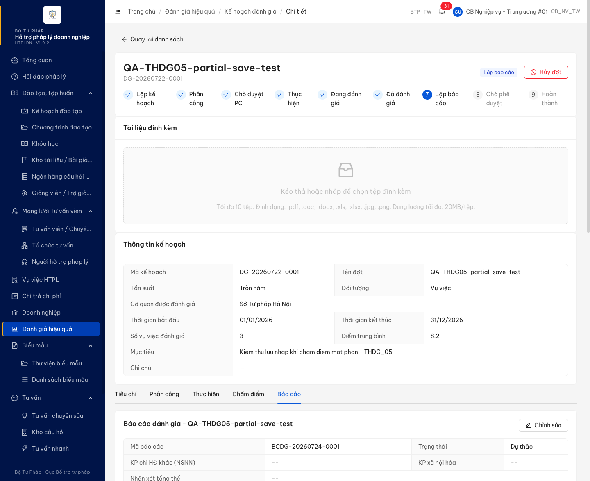

Bản đọc đầy đủ cả hai tệp (bảng đối chiếu từng thành phần biểu mẫu, giá trị hai ô kinh phí, dãy cột bảng chi tiết): [R3-BUG-BCDG-noi-dung.log.txt](image/R3-BUG-BCDG-noi-dung.log.txt).

---

## ~~BUG-XUAT-TEP-THIEU-COT-SO-VOI-MAN-HINH~~ [CLOSED] — Tệp xuất của 4 màn thiếu cột đang hiển thị trên giao diện

> **Re-test:** 2026-07-29 11:30:00 R3 — ✅ PASS (Closed-verified). Cả 4 màn đã có đủ cột giao diện: Kho câu hỏi (+5 cột), Thư viện biểu mẫu (+2), Chi trả chi phí (+Mức HT %), Nhật ký hệ thống (+Chi tiết thay đổi). Đã kiểm cột mới có dữ liệu thật, số ô có nội dung khớp số dòng có giá trị trên màn.

### Mô tả

Rà toàn bộ **25 chức năng xuất tệp** của ứng dụng, đối chiếu dãy cột trong tệp với dãy cột người dùng đang nhìn thấy trên màn. **4 màn cho ra tệp thiếu cột** so với giao diện — người dùng xuất tệp về thì mất một phần thông tin họ vừa xem, và không có dấu hiệu nào báo là đã lược bớt.

Đáng chú ý là **thiếu cột không đồng nghĩa với tệp ít cột hơn**. Ba trong bốn màn dưới đây có tệp **nhiều cột hơn** màn hình (tệp bổ sung các cột khác), nên nếu chỉ so số lượng cột thì tưởng đủ; phải đối chiếu từng tên cột mới thấy.

> **Căn cứ của bug này khác 2 bug xuất tệp còn lại — nêu rõ để dev khỏi mất công tra:** đặc tả **không quy định tập cột** cho 4 màn này (đã tìm hết `srs-v3.5/`). Bug được ghi theo **quy ước do chủ đợt UAT chốt ngày 28/07/2026**: *nơi nào đặc tả có quy định biểu mẫu thì theo biểu mẫu; nơi nào đặc tả im lặng thì tệp xuất phải có đủ các cột đang hiển thị trên giao diện*. Đề nghị biến quy ước này thành điều khoản chính thức — câu hỏi đã gửi BA tại **BA-03** trong [ba-confirmation-needed-week-4.md](../ba-confirmation-needed-week-4.md).
>
> Ngược lại, 2 màn **Tư vấn viên / Chuyên gia** và **Tổ chức tư vấn** tuy có tệp khác hẳn giao diện nhưng **KHÔNG phải lỗi**, vì đặc tả chỉ định xuất theo mẫu Nhà nước: `srs-fr-04-chuyen-gia-tvv.md:1459` (*"theo mẫu **Phụ lục 1 — QĐ 1322/QĐ-BTP ngày 01/6/2020** (10 cột cố định)"*) và `:1652` (Phụ lục 2). Đã kiểm và cả hai **đạt**.

### Các bước tái hiện

Lặp cách sau cho từng màn ở bảng "Kết quả thực tế":

1. Đăng nhập **`cbnv_tw_01`** (CB Nghiệp vụ · Trung ương). Riêng **Nhật ký hệ thống** phải dùng **`admin`** — tài khoản CB Nghiệp vụ không nhìn thấy menu đó.
2. Mở màn cần kiểm, **cuộn hết sang phải** để nhìn đủ dãy cột, ghi lại tên từng cột *(bỏ cột chọn và cột "Hành động")*.
3. Bấm **[Xuất Excel]**, mở tệp tải về, đọc **hàng tiêu đề**.
4. Đối chiếu từng tên cột — không so số lượng cột, vì tệp có thể thêm cột khác che mất phần thiếu.

### Kết quả mong đợi

- Tệp xuất phải chứa **đủ các cột đang hiển thị trên giao diện** (quy ước chủ đợt UAT 28/07/2026, đang chờ BA chính thức hóa qua BA-03). Được phép bổ sung cột, được phép đổi tên cột, nhưng **không được bỏ mất cột người dùng đang xem**.
- Nếu có lý do chủ ý lược bớt cột thì phải có **quy định biểu mẫu trong đặc tả** — như 2 màn Tư vấn viên và Tổ chức tư vấn đã có.

### Kết quả thực tế

| Màn | Cột giao diện → cột tệp | **Cột bị mất trong tệp** | Cột tệp thêm vào |
|---|---|---|---|
| **Tư vấn → Kho câu hỏi** | 12 → 7 | **Từ khóa · Hiệu lực · Công khai · Điểm TB · Ngày tạo** | — |
| **Biểu mẫu → Thư viện biểu mẫu** | 6 → **8** | **Số biểu mẫu · Đồng bộ** | STT · Mô tả · Thứ tự · Ngày cập nhật |
| **Chi trả chi phí → Danh sách** | 9 → 9 | **Mức HT %** | Deadline SLA |
| **Quản trị hệ thống → Nhật ký hệ thống** | 8 → **15** | **Chi tiết thay đổi** | Entity ID · Username · Vai trò · Nguồn hệ thống · Consumer · IP · Endpoint · Mã phản hồi · Session |

Chi tiết từng màn:

**1. Kho câu hỏi** — trường hợp mất nhiều nhất, 5/12 cột.

| Giao diện (12 cột) | Tệp (7 cột) |
|---|---|
| Mã · Câu hỏi · Câu trả lời · Lĩnh vực · **Từ khóa** · Nguồn · Trạng thái · **Hiệu lực** · **Công khai** · Lượt xem · **Điểm TB** · **Ngày tạo** | Mã câu hỏi · Câu hỏi · Câu trả lời · Lĩnh vực · Nguồn · Trạng thái · Số lượt xem |

**2. Thư viện biểu mẫu** — tệp *nhiều hơn* màn 2 cột nhưng vẫn mất 2 cột. Cột "Số biểu mẫu" cho biết mỗi thư mục có bao nhiêu biểu mẫu, cột "Đồng bộ" cho biết trạng thái đồng bộ — cả hai đều không có cột nào trong tệp thay thế được.

**3. Chi trả chi phí** — số cột bằng nhau (9 → 9) nên rất dễ tưởng đủ. Đối chiếu từng cột thì có 3 cột chỉ đổi tên (*Mã HS → Mã hồ sơ* · *Tên DN → Doanh nghiệp* · *SLA → Mức cảnh báo*), tệp thêm *Deadline SLA*, và **"Mức HT %" thì mất hẳn** — không có cột nào trong tệp mang giá trị này.

**4. Nhật ký hệ thống** — tệp thêm tới 9 cột kỹ thuật nhưng lại bỏ **"Chi tiết thay đổi"**, tức cột ghi nội dung thay đổi của mỗi thao tác. Đây là cột mang giá trị tra cứu chính của một nhật ký.

*(Cột "Chi tiết thay đổi" bị mất là điểm riêng của bug này; các vấn đề khác của cùng tệp nhật ký — sai ngày ở 629/1.635 bản ghi, tiêu đề cột `Don vi`/`Vai tro` mất dấu — đã ghi ở `BUG-XUAT-TEP-LECH-MUI-GIO` và `BUG-NHAN-MA-KY-THUAT-THO`, không lặp lại.)*

### Bằng chứng

**1. Ảnh chụp**

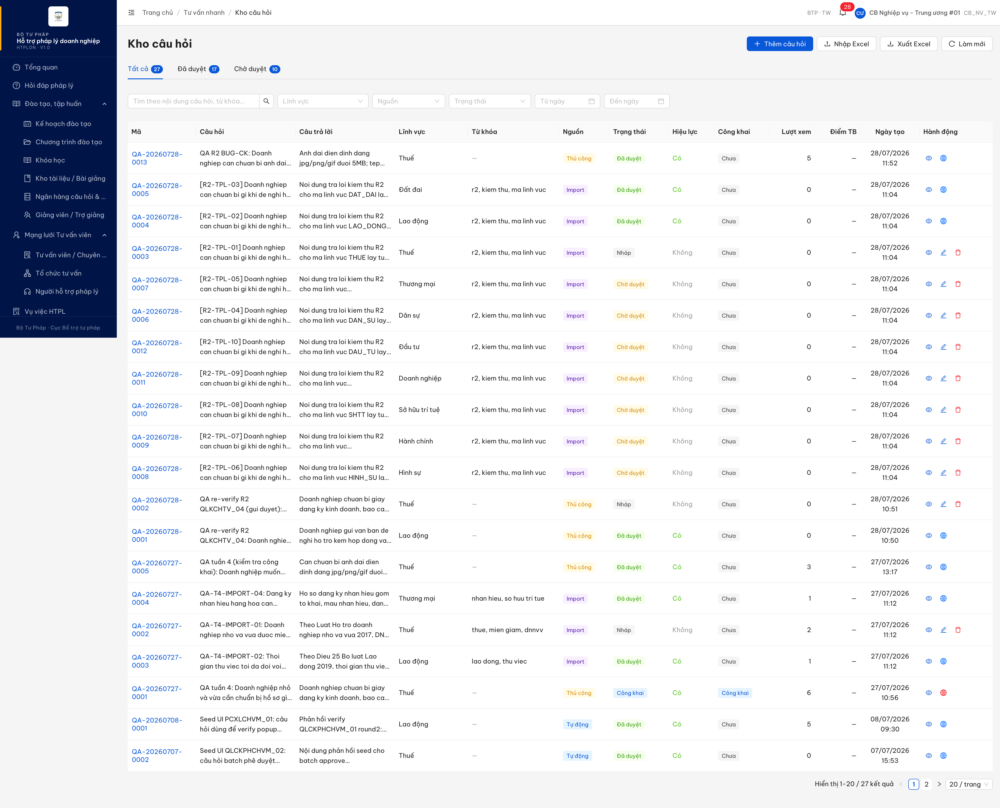

**2. Nội dung tệp đã đọc** *(phụ trợ)*

Bản đọc từng ô của toàn bộ 25 tệp xuất, kèm mục "ĐỐI CHIẾU CỘT" đối chiếu tên cột giao diện với tên cột tệp:
[R2-QUET-XUAT-TEP-noi-dung.log.txt](image/R2-QUET-XUAT-TEP-noi-dung.log.txt) *(16 chức năng lượt 1)* · [R2-QUET2-XUAT-TEP-noi-dung.log.txt](image/R2-QUET2-XUAT-TEP-noi-dung.log.txt) *(9 chức năng lượt 2, mục B)*

```
Man hinh                          GD -> tep    Cot bi MAT trong tep
--------------------------------  -----------  ----------------------------------------
Tu van -> Kho cau hoi             12 -> 7      Tu khoa · Hieu luc · Cong khai · Diem TB · Ngay tao
Bieu mau -> Thu vien bieu mau      6 -> 8      So bieu mau · Dong bo
Chi tra chi phi -> Danh sach       9 -> 9      Muc HT %
QTHT -> Nhat ky he thong           8 -> 15     Chi tiet thay doi

Doi chung (KHONG phai loi — dac ta co quy dinh mau):
Tu van vien / Chuyen gia           9 -> 10     theo Phu luc 1 QD 1322 (10 cot co dinh) -> DAT
To chuc tu van                     8 -> 18     theo Phu luc 2 QD 1322                  -> DAT
```

### Kiểm tra lại lượt 3 — 29/07/2026 — ✅ ĐẠT

Xuất lại tệp của cả 4 màn rồi **đối chiếu từng tên cột** (không so số lượng cột). **Cả 4 màn đều đã có đủ cột đang hiển thị trên giao diện.**

| Màn | Cột từng bị mất | Trong tệp lần này |
|---|---|---|
| **Tư vấn → Kho câu hỏi** | Từ khóa · Hiệu lực · Công khai · Điểm TB · Ngày tạo | **có đủ 5** — tệp 12 cột, khớp 12 cột dữ liệu của màn |
| **Biểu mẫu → Thư viện biểu mẫu** | Số biểu mẫu · Đồng bộ | **có đủ 2** |
| **Chi trả chi phí → Danh sách** | Mức HT % | **có** |
| **Quản trị hệ thống → Nhật ký hệ thống** | Chi tiết thay đổi | **có** |

Ba cột chỉ đổi tên ở màn Chi trả vẫn giữ nguyên cách gọi cũ trong tệp (*Mã HS → Mã hồ sơ* · *Tên DN → Doanh nghiệp* · *SLA → Mức cảnh báo*) — đổi tên thì được phép, miễn không mất cột.

**Đã kiểm thêm: cột mới có dữ liệu thật, không phải tiêu đề rỗng.** Số ô có nội dung trong tệp khớp đúng số dòng có giá trị trên màn hình:

| Cột | Trong tệp | Trên màn hình |
|---|---|---|
| Kho câu hỏi — Từ khóa | 13/28 ô có nội dung | đúng 13 dòng có từ khóa |
| Kho câu hỏi — Hiệu lực · Công khai · Ngày tạo | 28/28 | mọi dòng đều có |
| Kho câu hỏi — Điểm TB | 0/28 | **cả 28 dòng đều hiện `—`** (chưa có điểm) → khớp |
| Thư viện biểu mẫu — Số biểu mẫu | 13/13 | mọi dòng đều có (kể cả giá trị `0`) |
| Thư viện biểu mẫu — Đồng bộ | 7/13 | đúng 7 dòng *Đã đồng bộ*, 6 dòng `—` → khớp |
| Chi trả chi phí — Mức HT % | 11/13 | đúng 11 dòng có `%`, 2 dòng `—` → khớp |
| Nhật ký hệ thống — Chi tiết thay đổi | 407/1.379 | ô có nội dung thật (dạng `Mới: {…}`) |

Không cột nào chỉ có tiêu đề rỗng: mọi ô trống trong tệp đều ứng với ô `—` trên màn hình, tức đúng nghĩa "chưa có dữ liệu".

**Bằng chứng lượt 3**

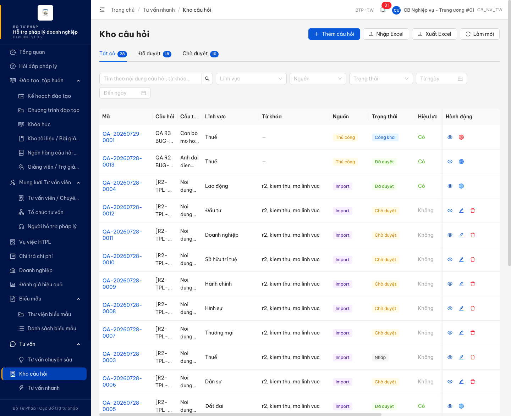

Bảng đối chiếu từng tên cột giao diện ↔ tệp của cả 4 màn, kèm phần kiểm dữ liệu từng cột: [R3-BUG-THIEU-COT-noi-dung.log.txt](image/R3-BUG-THIEU-COT-noi-dung.log.txt).

---

## ~~BUG-BCTK-NHAN-KY-GHI-NGAY-ISO~~ [CLOSED] — Báo cáo thống kê: nhãn kỳ ghi thành một ngày kiểu quốc tế `2026-01-01` thay vì tên kỳ

> **Re-test:** 2026-07-29 15:57:00 R4 — ✅ PASS (Closed-verified). Nhãn kỳ nay là chữ ở cả hai nơi: biểu đồ trên màn ghi 'Năm 2026', ô A28 bảng Theo kỳ trong tệp Excel cũng ghi 'Năm 2026'. Thử thêm kỳ Tháng và Quý cho ra 'Tháng 7/2026' và 'Quý 3/2026' nên là sửa đúng bản chất, không vá cứng riêng kỳ Năm.

### Mô tả

Ở màn **Báo cáo thống kê**, báo cáo *"BC Vụ việc đã tiếp nhận"* có phần thống kê **theo kỳ**. Người dùng chọn kỳ là **Năm**, nhưng thứ hệ thống ghi ra làm nhãn của kỳ đó là chuỗi **`2026-01-01`** — một ngày viết theo thứ tự năm-tháng-ngày.

Lỗi xuất hiện ở **cả hai nơi**: nhãn trục của biểu đồ trên màn hình, và ô dưới cột *"Kỳ"* của bảng *"Theo kỳ"* trong tệp Excel xuất ra.

Điều đáng nói là **ngay trong cùng một tệp**, dòng mô tả kỳ ở đầu trang lại ghi đúng: *"Kỳ báo cáo: Năm (từ 01/01/2026 đến 31/12/2026)"*. Nghĩa là hệ thống có sẵn cách ghi đúng, chỉ riêng ô nhãn kỳ là ghi theo kiểu khác.

### Các bước tái hiện

1. Đăng nhập **`cbnv_tw_01`** (CB Nghiệp vụ · Trung ương — vai trò được phép xem báo cáo thống kê toàn quốc).
2. Vào menu **Báo cáo thống kê**.
3. Ô **"Loại báo cáo"** chọn *"BC Vụ việc đã tiếp nhận"*.
4. Ô **"Kỳ báo cáo"** chọn *"Năm"* (khoảng thời gian hệ thống tự điền: 01/01/2026 — 31/12/2026).
5. Bấm **[Xem báo cáo]** → đọc nhãn nằm dưới biểu đồ cột của phần thống kê theo kỳ.
6. Bấm **[Xuất Excel]** → mở tệp, đọc ô nằm dưới tiêu đề **"Kỳ"** của bảng **"Theo kỳ"**.

### Kết quả mong đợi

- Nhãn của một kỳ báo cáo phải là **chữ đọc được**, không phải một ngày. `srs-fr-01-dashboard.md:209` đặc tả trường nhãn kỳ như sau: *"`scope_label` | text | — | UI text hiển thị scope. VD: **"Năm 2026"**, **"Tháng 4/2026"**, "Năm 2025""*. Người dùng chọn kỳ *Năm* thì nhãn phải cho biết đó là năm nào, chứ không phải ngày đầu tiên của năm đó.
- Nếu vì lý do kỹ thuật vẫn phải hiển thị dạng ngày, thì ngày đó cũng phải theo đúng quy ước chung của hệ thống: `srs-v3.5.md:4637` (**I18N-03**, trạng thái **✅ CĐT xác nhận**): *"Định dạng ngày | dd/MM/yyyy (ví dụ: 25/03/2026)"*; nhắc lại cho dữ liệu dạng bảng ở `srs-v3.5.md:952` (**DG-01**): *"Định dạng ngày | dd/mm/yyyy HH:mm hoặc dd/mm/yyyy"*.
- Cùng một tệp thì cách ghi ngày phải nhất quán từ đầu đến cuối.

### Kết quả thực tế

Đo ngày 29/07/2026, báo cáo *"BC Vụ việc đã tiếp nhận"*, kỳ **Năm**, đơn vị **Toàn quốc**:

| Nơi hiển thị | Đang ghi | Đáng lẽ |
|---|---|---|
| Dòng mô tả kỳ, ngay dưới tiêu đề báo cáo trên màn | `Kỳ: Năm • Khoảng thời gian: 01/01/2026 → 31/12/2026` | *(đúng — dùng làm đối chứng)* |
| Nhãn trục của biểu đồ thống kê theo kỳ, trên màn | **`2026-01-01`** | `Năm 2026` |
| Tệp Excel — dòng A2 đầu trang | `Kỳ báo cáo: Năm (từ 01/01/2026 đến 31/12/2026)` | *(đúng — dùng làm đối chứng)* |
| Tệp Excel — bảng "Theo kỳ", ô A28 dưới cột "Kỳ" | **`2026-01-01`** | `Năm 2026` |

Hai dòng đối chứng cho thấy đây **không phải** vấn đề toàn hệ thống về ngày tháng: cùng khoảng thời gian đó, cùng màn đó, cùng tệp đó, chỗ khác vẫn ghi `01/01/2026` đúng quy ước. Chỉ riêng ô nhãn kỳ dùng cách ghi thứ ba.

Với kỳ **Năm**, chuỗi `2026-01-01` còn dễ gây hiểu nhầm về nghiệp vụ: người đọc báo cáo có thể tưởng con số 27 vụ việc là của **riêng ngày 01/01/2026**, trong khi thực tế đó là số liệu của **cả năm 2026**.

### Bằng chứng

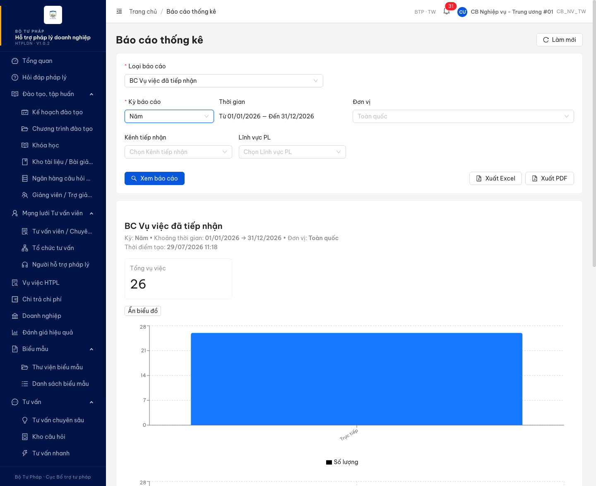

**Nội dung tệp đã đọc:** [R3-BUG-NHAN-KY-ISO-noi-dung.log.txt](image/R3-BUG-NHAN-KY-ISO-noi-dung.log.txt)

```
Tep bc-vuviec-tiepnhan-R3.xlsx, sheet "BC Vu viec da tiep nhan":
   A2  = "Ky bao cao: Nam (tu 01/01/2026 den 31/12/2026)"   -> DUNG
   A26 = "Theo ky"                     (tieu de bang)
   A27 = "Ky"        | B27 = "So luong" (tieu de cot)
   A28 = "2026-01-01"| B28 = 27         <<< SAI
```

### So sánh với bug đã có trong file này

`BUG-BCTK-XUAT-THIEU-BANG` (`XUATTEP_OOS_09`, row 44) nói về việc bảng *"Theo kỳ"* **không có** trong tệp xuất. Bảng đó **nay đã có** — chính vì vậy mới nhìn thấy được lỗi này. Bug hiện tại nói về **giá trị bên trong** bảng, và còn xuất hiện **trên màn hình** chứ không riêng tệp. Hai lỗi khác nhau, sửa ở hai chỗ khác nhau.

### Kiểm tra lại lượt 4 — 29/07/2026 — ✅ ĐẠT

Chạy lại đúng kịch bản gốc: *BC Vụ việc đã tiếp nhận*, kỳ **Năm**, đơn vị **Toàn quốc**; đọc nhãn trên màn rồi bấm **[Xuất Excel]** đọc tệp.

| Nơi hiển thị | Lượt 3 | Lượt 4 |
|---|---|---|
| Nhãn trục biểu đồ thống kê theo kỳ, trên màn | `2026-01-01` | **`Năm 2026`** |
| Tệp Excel — bảng "Theo kỳ", ô A28 dưới cột "Kỳ" | `2026-01-01` | **`Năm 2026`** |
| Tệp Excel — dòng A2 đầu trang *(đối chứng)* | `Kỳ báo cáo: Năm (từ 01/01/2026 đến 31/12/2026)` | không đổi, vẫn đúng |

**Không phải vá cứng riêng kỳ Năm.** Đổi lần lượt sang các kỳ khác rồi đọc lại nhãn trục:

| Kỳ chọn | Nhãn hiện ra |
|---|---|
| Năm | `Năm 2026` |
| Tháng | `Tháng 7/2026` |
| Quý | `Quý 3/2026` |

Đúng mẫu đặc tả mô tả cho `scope_label` tại `srs-fr-01-dashboard.md:209` — *"VD: "Năm 2026", "Tháng 4/2026""*. Quét lại toàn vùng báo cáo ở cả 4 kỳ đã thử: **không còn chuỗi nào dạng năm-tháng-ngày**.

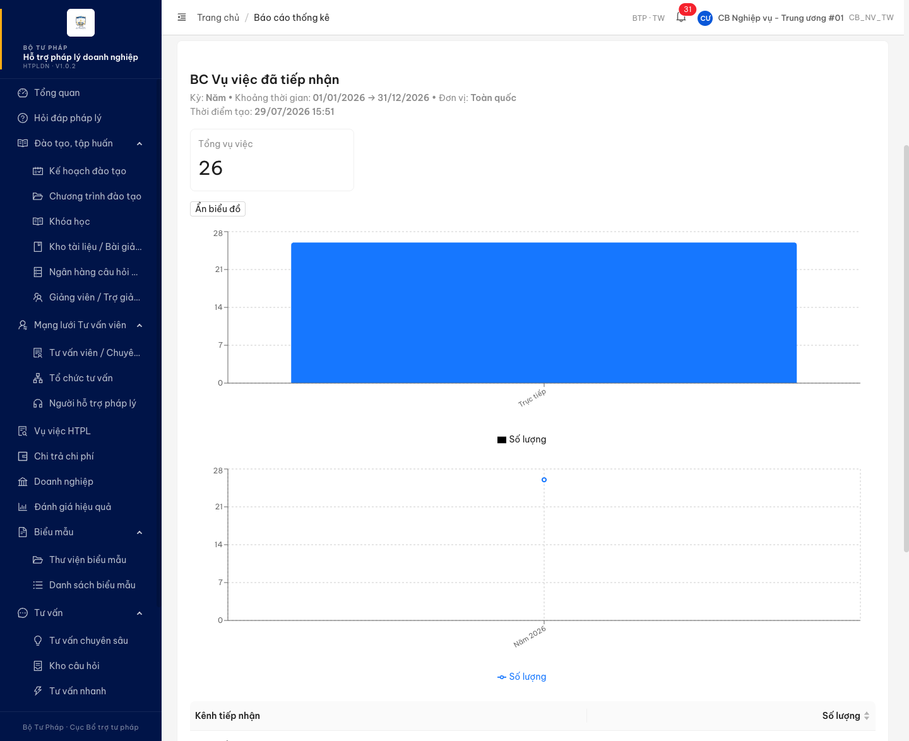

**Nội dung tệp đã đọc:** [R4-BUG-NHAN-KY-noi-dung.log.txt](image/R4-BUG-NHAN-KY-noi-dung.log.txt)

---

## ~~BUG-HIENTHI-NGAY-THIEU-SO-0~~ [CLOSED] — Hai bảng danh sách ghi ngày thiếu số 0 đứng trước (`1/9/2026`), trong khi màn chi tiết của cùng bản ghi ghi đúng

> **Re-test:** 2026-07-29 15:52:00 R4 — ✅ PASS (Closed-verified). Cả 2 bảng danh sách nay ghi đủ số 0: Chương trình HTPLDN 28/28 ô ngày đúng dd/MM/yyyy (CT-20260728-0003 sửa cả 2 mốc thành 01/03/2026 — 30/09/2026), Đợt báo cáo ghi 01/01/2026 và 01/07/2026. Màn chi tiết vẫn đúng, không hỏng ngược.

### Mô tả

Trên **bảng danh sách** của màn *Chương trình HTPLDN* và màn *Đợt báo cáo*, cột thời gian ghi ngày và tháng **không có số 0 đứng trước** khi giá trị nhỏ hơn 10 — ví dụ `1/9/2026`, `1/1/2026`, `30/9/2026`.

Mở **màn chi tiết** của chính bản ghi đó thì cùng mốc thời gian ấy lại ghi đúng `01/01/2026`. Nghĩa là dữ liệu không sai, chỉ riêng cách trình bày ở bảng danh sách là khác.

### Các bước tái hiện

**Phần 1 — màn Chương trình HTPLDN:**

1. Đăng nhập **`cbnv_tw_01`** (CB Nghiệp vụ · Trung ương — vai trò được phép xem danh sách chương trình toàn quốc).
2. Vào **Chương trình HTPLDN → Danh sách**.
3. Đọc cột **"Thời gian"** của các dòng có ngày hoặc tháng nhỏ hơn 10.

**Phần 2 — màn Đợt báo cáo, và đối chứng với màn chi tiết:**

4. Vào **Chương trình HTPLDN → Đợt báo cáo**.
5. Đọc cột **"Khoảng thời gian"** trên bảng.
6. Bấm vào đợt `DOT-SO_BO_NAM-2026-1` để mở **màn chi tiết**, đọc hai ô **"Từ ngày"** và **"Đến ngày"** — so với giá trị vừa đọc ở bước 5.

### Kết quả mong đợi

- Ngày hiển thị cho người dùng phải theo đúng **`dd/MM/yyyy`** — `srs-v3.5.md:4637` (**I18N-03**, trạng thái **✅ CĐT xác nhận**): *"Định dạng ngày | dd/MM/yyyy (ví dụ: 25/03/2026)"*. Ví dụ trong chính đặc tả là `25/03/2026`, tức tháng 3 vẫn viết `03`.
- Quy ước này được nhắc lại ở `srs-v3.5.md:575` (**UI-06 — Localization**): *"Tiếng Việt là ngôn ngữ duy nhất. Unicode UTF-8. **Định dạng ngày: dd/MM/yyyy**"*, và áp riêng cho dữ liệu dạng bảng ở `srs-v3.5.md:952` (**DG-01 — quy tắc dữ liệu chung**): *"Định dạng ngày | dd/mm/yyyy HH:mm hoặc dd/mm/yyyy"*.
- Cùng một mốc thời gian của cùng một bản ghi thì màn danh sách và màn chi tiết phải ghi giống nhau.

### Kết quả thực tế

**1. Màn Chương trình HTPLDN → Danh sách, cột "Thời gian"** *(đọc ngày 29/07/2026)*

| Mã chương trình | Đang ghi | Đáng lẽ |
|---|---|---|
| `CT-20260729-0001` | `1/9/2026 — 31/12/2026` | `01/09/2026 — 31/12/2026` |
| `CT-20260728-0005` | `1/1/2026 — 31/12/2026` | `01/01/2026 — 31/12/2026` |
| `CT-20260728-0004` | `1/4/2026 — 31/10/2026` | `01/04/2026 — 31/10/2026` |
| `CT-20260728-0003` | `1/3/2026 — 30/9/2026` | `01/03/2026 — 30/09/2026` |

**2. Màn Chương trình HTPLDN → Đợt báo cáo, cột "Khoảng thời gian"**

| Mã đợt | Đang ghi | Đáng lẽ |
|---|---|---|
| `DOT-SO_BO_NAM-2026-1` | `1/1/2026 — 31/12/2026` | `01/01/2026 — 31/12/2026` |
| `DOT-SO_BO_6_THANG-2026-1` | `1/7/2026 — 31/12/2026` | `01/07/2026 — 31/12/2026` |

**3. Đối chứng — cùng bản ghi, màn chi tiết ghi đúng**

Mở chi tiết đợt `DOT-SO_BO_NAM-2026-1`: ô **"Từ ngày"** ghi `01/01/2026`, ô **"Đến ngày"** ghi `31/12/2026`, ô **"Hạn nộp"** ghi `31/12/2026` — cả ba đều đủ số 0.

Đối chứng này cho thấy phạm vi lỗi hẹp: nằm ở cách bảng danh sách dựng chuỗi ngày, không phải ở dữ liệu và cũng không phải toàn hệ thống. Những mốc như `31/12/2026` trông đúng chỉ vì cả ngày lẫn tháng đều từ 10 trở lên, không phải vì đã được xử lý.

### Bằng chứng

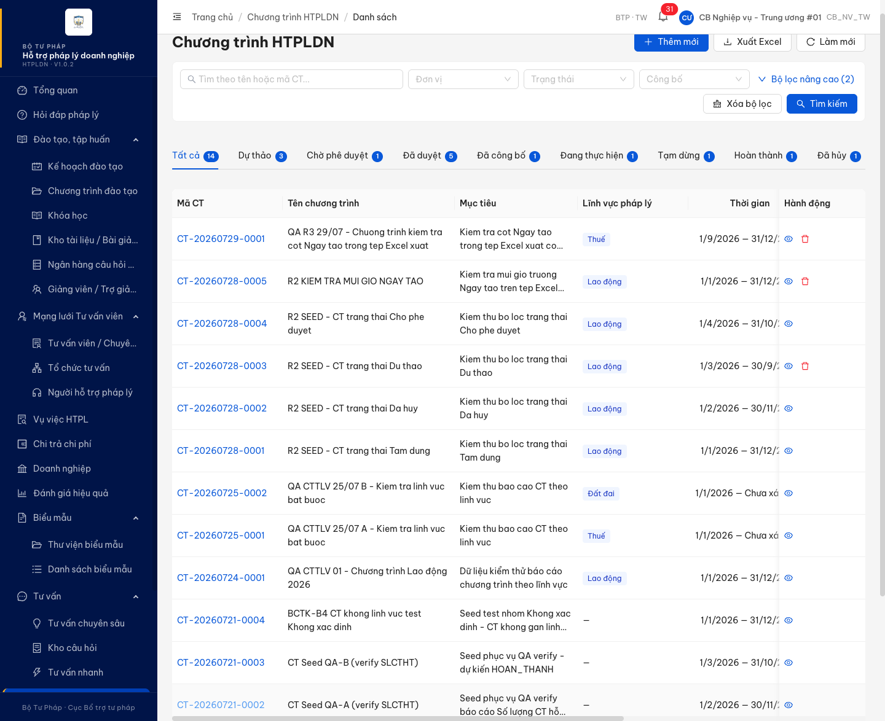

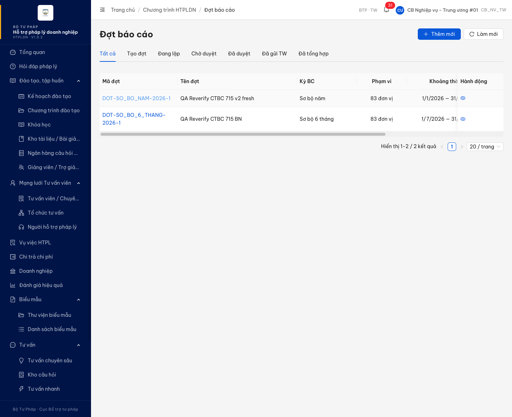

**Giá trị đã đọc trên màn:** [R3-BUG-NGAY-THIEU-SO-0-noi-dung.log.txt](image/R3-BUG-NGAY-THIEU-SO-0-noi-dung.log.txt)

### So sánh với bug đã có trong file này

`BUG-XUAT-TEP-LECH-MUI-GIO` (`XUATTEP_OOS_08`, row 43) có sẵn một dòng ghi *"thiếu số 0 ở ngày và tháng"* — nhưng dòng đó nói về **nội dung tệp xuất**. Kiểm tra lại lượt 3 ngày 29/07/2026 đã xác nhận phần tệp xuất **đã đạt**: 12 màn có nút xuất, 1.549 ô ngày, 100% ghi `dd/MM/yyyy`, 0 ô sai.

Bug hiện tại nằm ở **màn hình**, là bề mặt khác. **Không đóng bug này bằng lý do "tệp xuất đã sửa rồi".**

*(Ghi chú cho người đọc lại hồ sơ: `BUG-CT-XUAT-EXCEL-SAI-NGAY` — đã đóng — từng lấy chính chuỗi `1/1/2026` trên màn làm mốc chuẩn để đối chiếu với tệp. Lượt đó QA chỉ soi tệp nên chưa ghi nhận phần màn hình; nay bổ sung.)*

### Kiểm tra lại lượt 4 — 29/07/2026 — ✅ ĐẠT

Đọc lại giá trị từng ô trên đúng hai bảng của bug, cùng tài khoản `cbnv_tw_01`.

| Bản ghi | Lượt 3 (sáng) | Lượt 4 (chiều) |
|---|---|---|
| `CT-20260729-0001` | `1/9/2026 — 31/12/2026` | **`01/09/2026 — 31/12/2026`** |
| `CT-20260728-0003` | `1/3/2026 — 30/9/2026` | **`01/03/2026 — 30/09/2026`** *(sửa cả hai mốc)* |
| `CT-20260728-0004` | `1/4/2026 — 31/10/2026` | **`01/04/2026 — 31/10/2026`** |
| `DOT-SO_BO_NAM-2026-1` | `1/1/2026 — 31/12/2026` | **`01/01/2026 — 31/12/2026`** |
| `DOT-SO_BO_6_THANG-2026-1` | `1/7/2026 — 31/12/2026` | **`01/07/2026 — 31/12/2026`** |

Rà **hết 14 chương trình** trên bảng (toàn bộ danh sách): **28/28 ô ngày đúng `dd/MM/yyyy`, 0 ô thiếu số 0**.

**Màn chi tiết không bị hỏng ngược:** mở lại đợt `DOT-SO_BO_NAM-2026-1` — *Từ ngày* `01/01/2026`, *Đến ngày* `31/12/2026`, *Hạn nộp* `31/12/2026`, vẫn như trước.

**Về độ phủ của phép đo:** lỗi cũ phát sinh khi ngày **hoặc** tháng nhỏ hơn 10, và dữ liệu hiện có phủ cả hai chiều — mọi bản ghi đều bắt đầu ngày `01`, và các tháng xuất hiện gồm `01, 02, 03, 04, 07, 09`. Nên không cần tạo thêm dữ liệu. Các mốc kiểu `31/12/2026` **không** được dùng làm bằng chứng vì ngày và tháng đều từ 10 trở lên, trông đúng ngay cả khi lỗi chưa sửa.

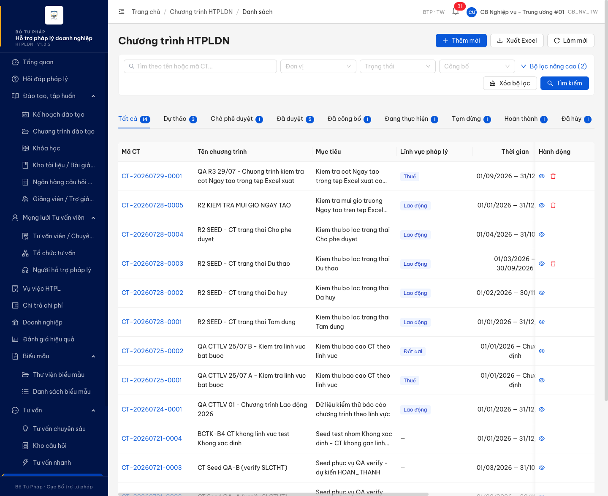

**Giá trị đã đọc:** [R4-BUG-NGAY-THIEU-SO-0-noi-dung.log.txt](image/R4-BUG-NGAY-THIEU-SO-0-noi-dung.log.txt)

---

## Phụ lục — Môi trường test

| Thành phần | Giá trị |
|------------|---------|
| URL ứng dụng | https://18.143.165.120.nip.io |
| MailHog (OTP inbox) | http://18.143.165.120:8025 |
| API base | https://18.143.165.120.nip.io/api/v1 |
| Frontend | React + Ant Design v5 |
| Xác thực | JWT + OTP qua email (MailHog) |
| Tool test | Chrome DevTools MCP |

---

*Bug report generated: 2026-07-27 | QA Automation via Claude Code*

---

## ~~BUG-KCH-LOC-NGAY-KIEU-QUOC-TE~~ [CLOSED] — Ô lọc "Từ ngày" / "Đến ngày" của màn Kho câu hỏi ghi ngày kiểu quốc tế `2026-07-01` thay vì `01/07/2026`

> **Re-test:** 2026-07-31 21:50:00 R4 — ✅ PASS (Closed-verified) trên bản dựng **V1.0.4**, tài khoản `cbnv_tw_02`. Bấm lịch chọn 01/07 và 31/07 → hai ô ghi **`01/07/2026`** / **`31/07/2026`**; tải lại trang từ địa chỉ có tham số khuôn quốc tế vẫn hiện đúng khuôn Việt. Hệ quả kèm theo cũng hết: gõ tay `15/07/2026` lịch nhận đúng ngày (gõ `2026-07-15` không nhận — đúng hướng theo I18N-03). Hai màn đối chứng (Tư vấn nhanh · Chương trình HTPLDN) không hồi quy và nay xử lý gõ tay y hệt; bộ lọc vẫn đúng (01–31/07 → 33 kết quả, 15–31/07 → 24 kết quả). Bằng chứng: [R4-HIENTHI_OOS_16-01](image/R4-HIENTHI_OOS_16-01-kho-cau-hoi-o-loc-dd-mm-yyyy.png) · [R4-HIENTHI_OOS_16-02](image/R4-HIENTHI_OOS_16-02-doi-chung-ct-htpldn-dd-mm-yyyy.png).

> ⚠️ **Giới hạn phạm vi của kết luận Pass (đọc trước khi dùng):** lượt đo trên thực hiện ở **env được giao `18.143.165.120.nip.io`** (bản dựng `V1.0.4`, tài nguyên `assets/index-C-Au2yTy.js`). Env đối tác `htpldn-uat.ospgroup.vn` **đang chạy bản dựng KHÁC** (`assets/index-B4L2Psgc.js`, nhãn `V1.0.3`) và trên bản đó **lỗi vẫn tái hiện** — ảnh [R4-OOS-NGAY-ISO-moi-truong-moi-ospgroup-tai-hien](image/R4-OOS-NGAY-ISO-moi-truong-moi-ospgroup-tai-hien.png) chụp 31/07/2026 14:41 cho thấy hai ô lọc màn Kho câu hỏi vẫn ghi `2026-07-01` / `2026-07-31`. Vậy kết luận này chứng minh **mã nguồn đã được sửa**, **chưa** chứng minh bản sửa đã được triển khai lên env đối tác. Nếu đối tác kiểm tra lại trên env của họ mà vẫn thấy lỗi thì nguyên nhân là **chưa triển khai**, không phải fix hỏng — dev cần xác nhận việc triển khai. (QA không đăng nhập được env đối tác ở lượt này: mã xác thực gửi tới hộp thư `***@htpldn.gov.vn` không về MailHog `18.143.165.120:8025`, nên phần đối chiếu env dựa trên tài nguyên bản dựng + ảnh đã chụp.)

### Mô tả

Trên thanh lọc màn *Tư vấn → Kho câu hỏi*, sau khi chọn ngày từ lịch thì **chữ hiện trong ô** không phải `01/07/2026` mà là **`2026-07-01`** — dạng năm-tháng-ngày kiểu quốc tế. Cả hai ô *Từ ngày* và *Đến ngày* đều như vậy.

Đây là **lỗi trình bày ở ô lọc**, không phải lỗi dữ liệu: bộ lọc vẫn chạy đúng và bảng kết quả vẫn trả về đúng khoảng thời gian đã chọn.

Phạm vi hẹp và đã khoanh được: **cùng một loại ô lọc ngày** trên hai màn khác lại ghi đúng `01/07/2026` — trong đó có màn *Tư vấn nhanh*, tức là **màn anh em nằm ngay trong cùng nhóm chức năng Tư vấn**. Vậy khuôn ngày đúng đã có sẵn trong chính ứng dụng, chỉ riêng màn Kho câu hỏi dùng khác.

Lỗi này **QA phát hiện thêm** trong lúc verify dòng phiếu `QLKCHTV_10` (row 5) ở lượt R3, không thuộc nội dung phiếu nào của đối tác. Đã mở dòng riêng trên sheet: **`HIENTHI_OOS_16` (row 51)**, Trạng thái `Fail`, chuyển dev ngày 30/07/2026.

### Các bước tái hiện

1. Đăng nhập **`cbnv_tw_02`** (CB Nghiệp vụ · Trung ương).
2. Vào **Tư vấn → Kho câu hỏi**.
3. Bấm ô **"Từ ngày"**, chọn **ngày 1 tháng 7 năm 2026** trên lịch.
4. Bấm ô **"Đến ngày"**, chọn **ngày 31 tháng 7 năm 2026**.
5. Đọc chữ đang hiện trong hai ô vừa chọn.
6. **Đối chứng 1 (cùng nhóm chức năng):** vào **Tư vấn → Tư vấn nhanh**, làm lại bước 3 với đúng ngày 1 tháng 7 năm 2026, đọc chữ trong ô.
7. **Đối chứng 2 (khác nhóm chức năng):** vào **Chương trình HTPLDN → Danh sách**, làm lại bước 3 và 4 với đúng hai ngày trên, đọc chữ trong hai ô.
8. **Thử gõ tay thay vì bấm lịch** — quay lại ô *Từ ngày* của **Kho câu hỏi**, gõ `15/07/2026` và xem lịch có nhận diện được ngày vừa gõ không; xóa đi, gõ `2026-07-15` rồi xem lại. Làm y hệt trên ô *Từ ngày* của **Chương trình HTPLDN** để so.

### Kết quả mong đợi

- Ngày hiển thị cho người dùng phải theo đúng **`dd/MM/yyyy`** — `srs-v3.5.md:4637` (**I18N-03**, trạng thái **✅ CĐT xác nhận**): *"Định dạng ngày | dd/MM/yyyy (ví dụ: 25/03/2026). Lưu trữ DB: kiểu ngày/thời gian chuẩn"*. Đặc tả tách bạch rõ: khuôn `dd/MM/yyyy` là **cho phần hiển thị**, còn kiểu chuẩn của cơ sở dữ liệu là chuyện lưu trữ bên trong — không phải thứ đem hiện lên màn.
- Quy ước này được nhắc lại ở `srs-v3.5.md:575` (**UI-06 — Localization**): *"Tiếng Việt là ngôn ngữ duy nhất. Unicode UTF-8. **Định dạng ngày: dd/MM/yyyy**"*, và ở `srs-v3.5.md:952` (**DG-01 — quy tắc dữ liệu chung**): *"Định dạng ngày | dd/mm/yyyy HH:mm hoặc dd/mm/yyyy"*.
- **Quy định này áp dụng cho chính loại thành phần đang lỗi — ô chọn ngày trên thanh lọc, không chỉ cột ngày trong bảng.** Đặc tả có dòng riêng cho thành phần này ở màn danh sách nhóm Hỏi đáp — `srs-fr-02-hoi-dap.md:1031`: *"| 16 | filter-bar | **DatePicker Từ/Đến ngày** | date-picker | **dd/mm/yyyy**. Validation: tu_ngay <= den_ngay | change → filter | luôn hiển thị |"*. Đây là quy ước dùng chung cho màn danh sách, và chính đặc tả Kho câu hỏi cũng dẫn chiếu sang nhóm Hỏi đáp cho các quy ước loại này (`srs-fr-13-tv-nhanh.md:534` dẫn `srs-fr-02-hoi-dap.md:1047` cho quy ước trạng thái trống).
- **Khuôn quốc tế `yyyy-MM-dd` chỉ được dùng ở tầng kỹ thuật, không dùng để hiển thị.** Đặc tả cho phép khuôn này ở hai nơi: lưu trữ trong cơ sở dữ liệu (I18N-03) và tham số/dữ liệu của nhóm API tích hợp (`srs-fr-16-api.md` — các trường `tu_ngay`/`den_ngay` ghi *"ISO 8601"*). Không có ngoại lệ nào cho giao diện người dùng.
- Cùng một loại ô nhập ngày thì các màn phải ghi giống nhau; người dùng không phải đọc hai khuôn ngày khác nhau trong cùng một phần mềm.

### Kết quả thực tế

*(Đo ngày 30/07/2026 trên bản dựng V1.0.3, tài khoản `cbnv_tw_02`; mỗi ô đều chọn ngày bằng cách bấm trên lịch, không gõ tay.)*

| Màn | Ô lọc | Chữ đang hiện trong ô | Đáng lẽ |
|---|---|---|---|
| **Tư vấn → Kho câu hỏi** | Từ ngày | **`2026-07-01`** | `01/07/2026` |
| **Tư vấn → Kho câu hỏi** | Đến ngày | **`2026-07-31`** | `31/07/2026` |
| Tư vấn → Tư vấn nhanh *(đối chứng, cùng nhóm)* | Từ ngày | `01/07/2026` | — đã đúng |
| Chương trình HTPLDN → Danh sách *(đối chứng)* | Từ ngày | `01/07/2026` | — đã đúng |
| Chương trình HTPLDN → Danh sách *(đối chứng)* | Đến ngày | `31/07/2026` | — đã đúng |

**Bộ lọc vẫn chạy đúng.** Sau khi chọn, địa chỉ trang nhận đúng khoảng thời gian và bảng kết quả lọc theo đúng khoảng đó — nên phần dữ liệu không sai.

**Phép đo bằng cách gõ tay — cho thấy đây là khuôn ngày được cấu hình thật cho ô đó, kèm một hệ quả cho người dùng:**

| Ô lọc | Gõ `15/07/2026` (khuôn tiếng Việt) | Gõ `2026-07-15` (khuôn quốc tế) |
|---|---|---|
| **Kho câu hỏi → Từ ngày** | **lịch KHÔNG nhận diện** — chữ nằm trong ô nhưng không ngày nào được chọn | lịch nhận diện đúng ngày 15/07/2026 |
| Chương trình HTPLDN → Từ ngày *(đối chứng)* | lịch nhận diện đúng ngày 15/07/2026 | lịch nhận diện đúng ngày 15/07/2026 |

Nghĩa là ở màn Kho câu hỏi, cán bộ **gõ đúng khuôn ngày mà đặc tả quy định thì ô lọc không hiểu**, phải gõ theo khuôn quốc tế hoặc bấm chọn trên lịch. Màn đối chứng nhận cả hai khuôn.

**Đối chiếu đặc tả bằng 2 nguồn (theo quy trình bắt buộc trước khi log bug):** tra cơ sở tri thức SRS HTPLDN và mở trực tiếp tệp đặc tả gốc để lấy số dòng — hai nguồn khớp nhau ở cả 4 căn cứ (I18N-03, UI-06, DG-01, và dòng `DatePicker Từ/Đến ngày` của thanh lọc). Nguồn tra cứu còn xác nhận thêm: **không có ngoại lệ nào** cho phép hiện ngày kiểu quốc tế trên giao diện.

**Đã loại 2 khả năng nhầm lẫn trước khi kết luận:**

- **(a) Không phải ô chọn ngày mặc định của trình duyệt.** Ô này không có thuộc tính `type`, nằm trong khối `ant-picker` do ứng dụng tự dựng. Điều này quan trọng: với ô chọn ngày mặc định của trình duyệt thì giá trị bên trong **luôn** ở khuôn quốc tế theo chuẩn kỹ thuật, trong khi chữ hiện ra cho người dùng vẫn có thể đúng — đọc giá trị bên trong rồi kết luận sẽ là lỗi ma.
- **(b) Không phải do cách QA thao tác.** Cùng một cách bấm lịch và cùng một cách gõ tay, hai màn đối chứng đều cho kết quả đúng.

**Vì sao chỉ ghi nhận đúng một màn:** hai màn đối chứng dùng đúng loại ô lọc ngày và đúng cách chọn, đo trong cùng một phiên đăng nhập, cùng ngày. Một trong hai còn nằm chung nhóm *Tư vấn* với màn hỏng. Nên chênh lệch này không phải do tài khoản, do phiên hay do thời điểm đo.

### Bằng chứng

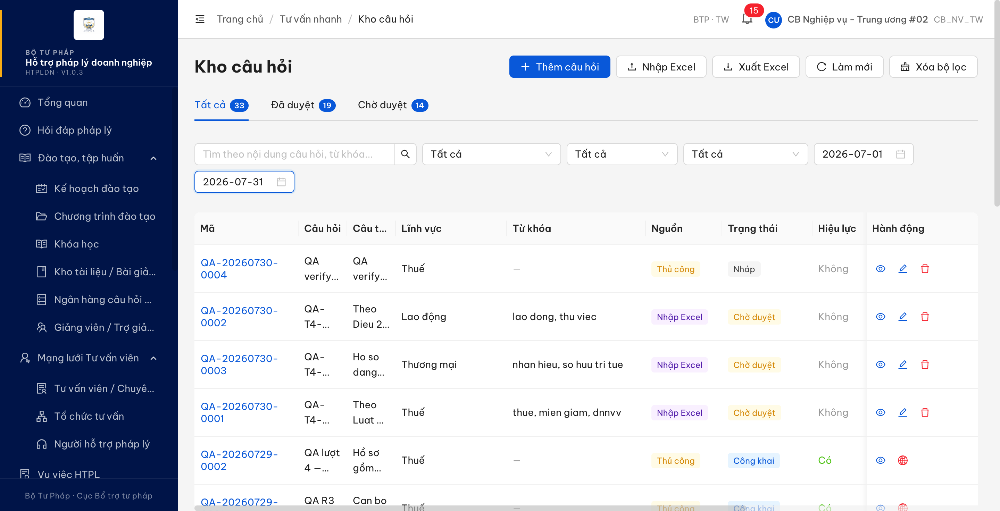

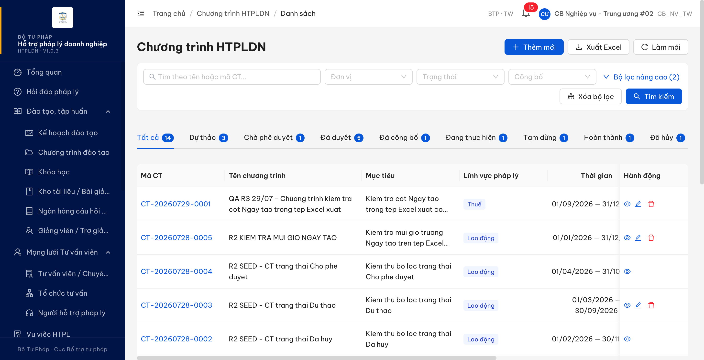

### So sánh với bug đã có trong file này

Hai bug đã đóng cùng chủ đề ngày tháng nằm ở **bề mặt khác**, không trùng và không thay thế bug này:

- `BUG-HIENTHI-NGAY-THIEU-SO-0` (`HIENTHI_OOS_15`, row 50) — nói về **cột ngày trong bảng danh sách** thiếu số 0 đứng trước (`1/9/2026`). Bug hiện tại nằm ở **ô nhập trên thanh lọc**, và sai khác hẳn: đảo thứ tự thành năm-tháng-ngày chứ không phải thiếu số 0.
- `BUG-BCTK-NHAN-KY-GHI-NGAY-ISO` (`BCTK_OOS_14`, row 49) — nói về **nhãn kỳ của báo cáo thống kê** ghi `2026-01-01` thay vì tên kỳ (*"Năm 2026"*). Chỗ đó lẽ ra phải là **tên kỳ dạng chữ**; còn ở đây đúng là một ngày, chỉ viết sai khuôn.

**Không đóng bug này bằng lý do "phần ngày tháng đã sửa ở lượt trước".**


---

## ~~BUG-HDPL_001~~ [CLOSED] — Phiếu "Quản lý công khai phản hồi câu hỏi, vướng mắc": thiếu nút công khai ở danh sách, thiếu cột nội dung câu hỏi, và trạng thái hai màn không khớp

> **Re-test:** 2026-07-31 22:35:00 R4 — ✅ PASS (Closed-verified) trên bản dựng **V1.0.4**, chạy lại trọn luồng bằng **dữ liệu mới tự dựng** (`HD-20260731-001` và `HD-20260731-002`, đi từ Thêm mới đến Đã duyệt). Ý1 đạt: tab "Đã duyệt" tích 1 dòng → hiện thanh "Đã chọn 1 bản ghi" + nút **[Công khai hàng loạt]**, tích 2 dòng vẫn hiện (công khai được nhiều bản ghi), bấm → hộp thoại *"Công khai 1 hồ sơ lên Cổng PLQG?"* → *"Đã công khai 1 hồ sơ lên Cổng PLQG"*, hồ sơ chuyển sang tab **Công khai**. Ý2 đạt: cả 3 tab Đã duyệt / Công khai / Hoàn thành đều có cột **"Nội dung"** ở vị trí thứ 3 trong 13 cột, ô có dữ liệu thật. Ý3: hai màn vẫn **không** đồng bộ trạng thái — đo cả hai chiều — nhưng khớp đặc tả hiện hành và đã có quyết định của chủ đầu tư từ vòng 1, xem mục "Kết quả thực tế" bên dưới. Bằng chứng: [01](image/R4-HDPL_001-01-nut-cong-khai-hang-loat-tab-da-duyet.png) · [02](image/R4-HDPL_001-02-sau-cong-khai-hd-002-sang-tab-cong-khai.png) · [03](image/R4-HDPL_001-03-kho-cau-hoi-QA-0001-cong-khai.png) · [04](image/R4-HDPL_001-04-cot-noi-dung-tab-hoan-thanh.png) · [05](image/R4-HDPL_001-05-hoi-dap-HD-001-van-da-duyet-sau-khi-cong-khai-o-kho.png).

### Mô tả

Phiếu `HDPL_001` (row 52, tab tuần 4) phản ánh **ba việc** trên nhóm chức năng *Quản lý tiếp nhận hỏi đáp vướng mắc pháp lý*:

1. Màn **danh sách hỏi đáp pháp lý** không có nút công khai cho bản ghi ở trạng thái *Đã duyệt*; đối tác muốn bổ sung nút này và muốn công khai được **nhiều** bản ghi một lượt.
2. Các tab **Đã duyệt / Công khai / Hoàn thành** không có **cột nội dung câu hỏi**.
3. Trạng thái của cùng một câu hỏi ở **hai màn không khớp nhau**: câu hỏi đã được công khai ở menu *Kho câu hỏi*, nhưng ở menu *Hỏi đáp pháp lý* trạng thái vẫn là *Đã duyệt*.

Phiếu ghi tài khoản dùng để phản ánh là `cb_nv_tw_03` (Cán bộ Nghiệp vụ Trung ương), trong khi phần "Dữ liệu đầu vào" của chính phiếu lại mô tả hành động thuộc về **Cán bộ phê duyệt**. Chênh lệch này là mấu chốt của ý 1 nên lượt re-verify đo bằng **cả hai** vai trò.

### Các bước tái hiện

1. Đăng nhập **`cbnv_tw_03`** (CB Nghiệp vụ · Trung ương).
2. Vào **Hỏi đáp pháp lý** → tab **Đã duyệt** → tích chọn 1 dòng → đọc thanh hành động xem có nút công khai không.
3. Mở lần lượt 3 tab **Đã duyệt / Công khai / Hoàn thành** → đọc danh sách tên cột và giá trị ô ở cột nội dung.
4. Đăng nhập lại bằng **`cbpd_tw_01`** (CB Phê duyệt · Trung ương, cùng đơn vị Cục Bổ trợ tư pháp) → lặp bước 2 → tích thêm dòng thứ 2 → bấm nút công khai → đọc hộp thoại, thông báo và tab đích của bản ghi.
5. Đăng nhập lại **`cbnv_tw_03`** → vào **Tư vấn → Kho câu hỏi** → công khai bản ghi kho tương ứng của một hồ sơ hỏi đáp đang *Đã duyệt*.
6. Quay lại **Hỏi đáp pháp lý** → tra đúng mã hồ sơ đó → đọc trạng thái.

*(Tiền đề dựng mới cho lượt re-verify, không dùng lại bản ghi cũ: tạo 2 hồ sơ hỏi đáp rồi đưa trọn vòng đời Thêm mới → Tiếp nhận → Phân công → Gửi phản hồi → Phê duyệt để có 2 bản ghi **Đã duyệt** sạch.)*

### Kết quả mong đợi

- **Ý1 — nút công khai ở màn danh sách:** `srs-fr-02-hoi-dap.md:1053` quy định màn danh sách hỏi đáp có **nút "Công khai hàng loạt"**, đặt ở thanh hành động của **tab "Đã duyệt"**, và **hiện khi chọn ≥ 1 bản ghi** — tức nút được thiết kế để ẩn khi chưa chọn dòng nào. Nút đặt cờ công khai + chuyển trạng thái theo từng bản ghi, kèm hộp thoại xác nhận.
- **Quyền dùng nút:** `srs-fr-02-hoi-dap.md:1085` — *"Nút Công khai hàng loạt (dòng 35): chỉ CB PD cùng đơn vị với bản ghi chọn"*. Vậy tài khoản Cán bộ Nghiệp vụ **không** được thấy nút này; đó là phân quyền theo đặc tả, không phải thiếu chức năng.
- **Ý2 — cột nội dung:** cột "Nội dung" phải có mặt ở các tab của màn danh sách để cán bộ đọc được câu hỏi ngay trên bảng.
- **Ý3 — quan hệ trạng thái hai màn:** `srs-fr-13-tv-nhanh.md:494-498` liệt kê **đầy đủ** hệ quả của việc công khai/hủy công khai một bản ghi Kho câu hỏi: cập nhật cờ công khai + trạng thái của **chính bản ghi kho**, Cổng Pháp luật Quốc gia tự kéo dữ liệu ở lượt sau, và ghi nhật ký. **Không có** mục nào yêu cầu đổi trạng thái bản ghi hỏi đáp. Ở chiều ngược lại, hỏi đáp có **đường công khai riêng của nó** (`srs-fr-02-hoi-dap.md:1053`) và có ràng buộc vòng đời riêng (`:1045` — bản ghi đã công khai phải "Hủy công khai về Đã duyệt" trước khi làm việc khác). Vậy theo đặc tả hiện hành, đây là **hai bản ghi có hai vòng đời tách biệt**, không đồng bộ chéo.

### Kết quả thực tế

*(Đo 31/07/2026 trên bản dựng V1.0.4. Dữ liệu dựng mới: `HD-20260731-001` (A) và `HD-20260731-002` (B), cùng 2 bản ghi kho tự sinh `QA-20260731-0001` / `QA-20260731-0002` nguồn "Tự động".)*

**Ý1 — ĐẠT.**

| Vai trò | Thao tác | Quan sát |
|---|---|---|
| `cbnv_tw_03` (CB Nghiệp vụ) | Tab Đã duyệt, tích 1 dòng rồi 2 dòng | Không hiện nút công khai nào — **đúng phân quyền** `srs-fr-02-hoi-dap.md:1085` |
| `cbpd_tw_01` (CB Phê duyệt, cùng đơn vị) | Tích 1 dòng | Hiện thanh **"Đã chọn 1 bản ghi"** + nút **[Công khai hàng loạt]** + [Bỏ chọn] |
| `cbpd_tw_01` | Tích thêm dòng thứ 2 | **"Đã chọn 2 bản ghi"**, nút vẫn hiện ⇒ công khai được **nhiều** bản ghi |
| `cbpd_tw_01` | Bấm [Công khai hàng loạt] | Hộp thoại *"Công khai 1 hồ sơ lên Cổng PLQG?"* |
| `cbpd_tw_01` | Xác nhận | Thông báo *"Đã công khai 1 hồ sơ lên Cổng PLQG"*; `HD-20260731-002` chuyển sang tab **Công khai**, cột Trạng thái = "Công khai"; số đếm tab đổi "Đã duyệt 9 → 8", "Công khai 1 → 2" |

Ảnh minh chứng của đối tác chụp bằng tài khoản Cán bộ Nghiệp vụ và ở trạng thái **chưa tích dòng nào** — hai điều kiện đều làm nút không hiện theo đúng thiết kế.

**Ý2 — ĐẠT.** Đọc trực tiếp cấu trúc bảng (không kết luận bằng nhìn ảnh) trên cả 3 tab, bằng chính tài khoản `cbnv_tw_03` của phiếu:

| Tab | Tổng số cột | Vị trí cột "Nội dung" | Ô dữ liệu |
|---|---|---|---|
| Đã duyệt | 13 | thứ 3 | có nội dung câu hỏi thật (8/8 dòng) |
| Công khai | 13 | thứ 3 | có nội dung câu hỏi thật (2/2 dòng) |
| Hoàn thành | 13 | thứ 3 | có nội dung câu hỏi thật (2/2 dòng) |

Cột nằm ở vị trí thứ 3 nên không cần cuộn ngang mới thấy.

**Ý3 — hai màn vẫn KHÔNG đồng bộ; đo cả hai chiều đều đối xứng.**

| Chiều | Thao tác | Bản ghi bên kia sau thao tác |
|---|---|---|
| Kho câu hỏi → Hỏi đáp *(đúng chiều đối tác nêu)* | Công khai `QA-20260731-0001` ở Kho câu hỏi → Trạng thái "Công khai" | `HD-20260731-001` ở màn Hỏi đáp **vẫn "Đã duyệt"** |
| Hỏi đáp → Kho câu hỏi *(chiều ngược, QA tự thêm)* | Công khai `HD-20260731-002` ở màn Hỏi đáp → Trạng thái "Công khai" | `QA-20260731-0002` ở Kho câu hỏi **vẫn "Đã duyệt"**, cột Công khai = "Chưa" |

Hai chiều đối xứng ⇒ đây là **thiết kế tách đôi vòng đời**, không phải lỗi một chiều. Đối chiếu đặc tả (mở tệp lấy số dòng): khối *Postconditions* `srs-fr-13-tv-nhanh.md:494-498` liệt kê đủ hệ quả của hành động công khai Kho câu hỏi và **không** có mục nào chạm tới bản ghi hỏi đáp; đồng thời hỏi đáp có đường công khai riêng ở `srs-fr-02-hoi-dap.md:1053`. Vậy hành vi đang chạy **khớp đặc tả hiện hành**; mong muốn "đồng bộ trạng thái giữa 2 màn" là **thay đổi thiết kế**, đã được chủ đầu tư quyết ở vòng 1 là giữ nguyên.

**Đính chính một trích dẫn của vòng 1 (ghi lại để hồ sơ không bị dẫn sai về sau):** ghi chú vòng 1 dẫn *"srs-fr-13:498 — công khai bên này không đổi trạng thái bên kia, có chủ đích"*. Mở bản đặc tả v3.5 đang dùng thì **dòng 498 là "AUDIT_LOG ghi nhận"**, và không tìm thấy câu trích đó ở chỗ nào khác trong tệp. Kết luận của ý3 **vẫn đứng vững**, nhưng căn cứ đúng là **khối Postconditions 494-498 liệt kê đủ hệ quả mà không có hỏi đáp**, không phải câu trích kia. Bản đặc tả "Phase 12" kèm dấu `[HDPL_001 chốt 2026-07-31]` mà ghi chú vòng 1 nhắc tới không có trong kho tài liệu QA đang dùng.

### Bằng chứng

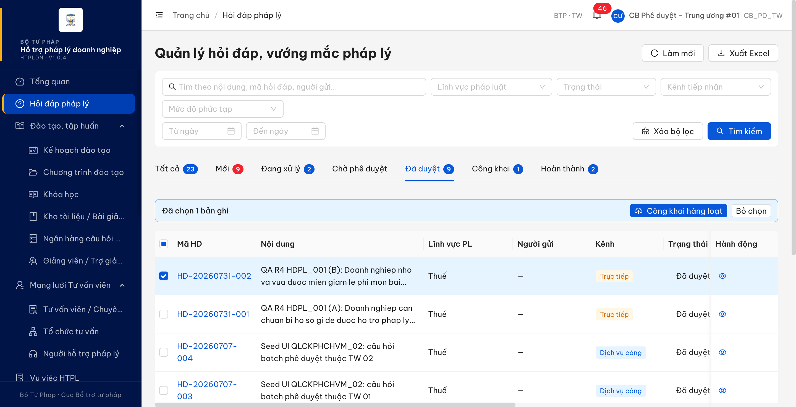

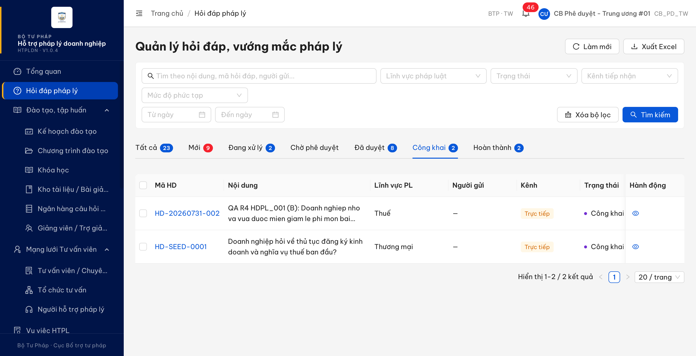

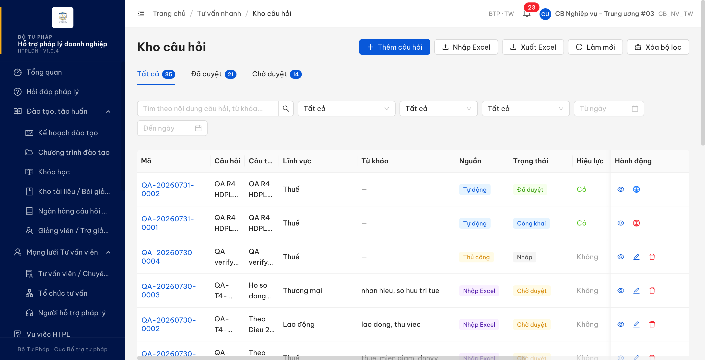

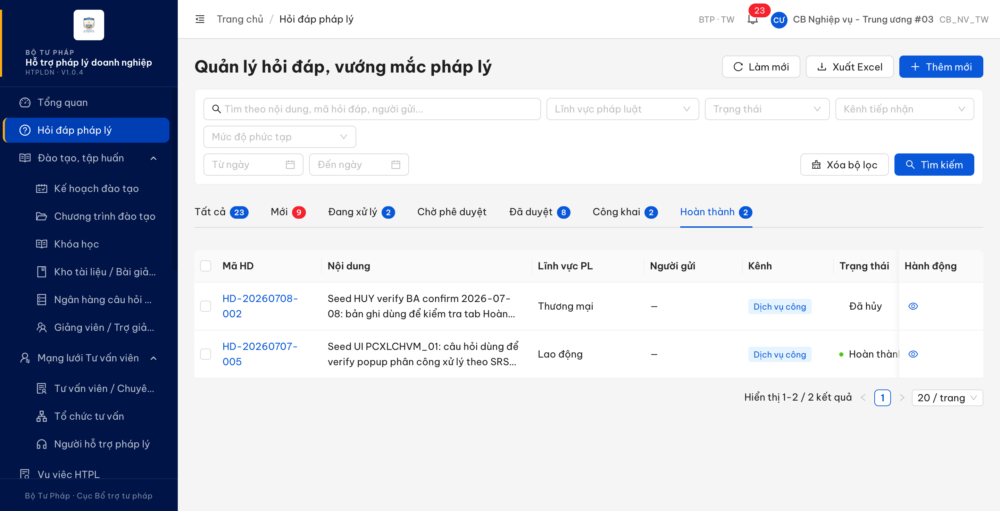

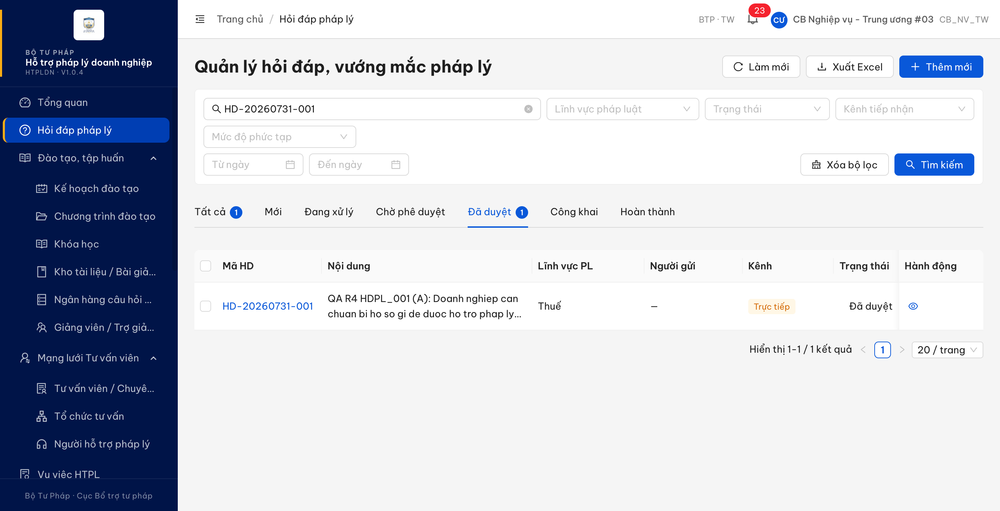

### Ghi nhận thêm khi đo (chưa đủ căn cứ để mở dòng lỗi riêng)

Đặc tả `srs-fr-02-hoi-dap.md:1053` mô tả kết quả của lượt công khai hàng loạt là một **hộp thoại tổng hợp** dạng *"Đã công khai {S} bản ghi thành công, {E} bản ghi lỗi"* kèm cột chi tiết lý do từng bản ghi. Lượt đo này (1 bản ghi, không có lỗi) hệ thống chỉ hiện **thông báo ngắn** *"Đã công khai 1 hồ sơ lên Cổng PLQG"*, không có hộp thoại tổng hợp. QA **chưa** dựng được lô có bản ghi lỗi (cần bản ghi khác đơn vị trong cùng danh sách) nên **chưa kết luận** nhánh có lỗi cũng thiếu hộp thoại — ghi lại để dev/BA tự soát, không mở dòng lỗi mới trên phiếu.

---

## ~~BUG-VVHT_001~~ [CLOSED] — Thêm mới vụ việc hỗ trợ pháp lý bị máy chủ từ chối vì ngày tiếp nhận không hợp lệ, dù ô ngày đang hiện đúng và chưa ai chạm vào

> **Re-test:** 2026-07-31 23:10:00 R4 — ✅ PASS (Closed-verified) trên bản dựng **V1.0.4**, tài khoản `cbnv_tw` (CB Nghiệp vụ · Trung ương), **dữ liệu mới hoàn toàn**. Vụ việc HTPL → Nhập thủ công → chọn doanh nghiệp `DN-HNI-0001` + điền đủ, để nguyên ô "Ngày tiếp nhận" mặc định 31/07/2026 → **[Lưu & Tiếp nhận]** lưu thành công: *"Đã tiếp nhận — VV-BTP-TW-20260731-001"*, máy chủ trả **201**, nội dung gửi lên chứa `"ngayTiepNhan":"2026-07-31"` (đúng khuôn), 0 dòng báo lỗi dưới ô. Nút submit còn lại của cùng form (**[Lưu nháp]**) cũng lưu được (`VV-BTP-TW-20260731-002`) ⇒ không phải fix nửa vời. Bề mặt thứ hai dev khai sửa chung (ô "Ngày thanh toán" màn Chi trả) cũng gửi `"ngayThanhToan":"2026-07-31"` đúng khuôn. Bằng chứng: [01](image/R4-VVHT_001-01-form-truoc-khi-luu-tiep-nhan.png) · [02](image/R4-VVHT_001-02-danh-sach-vu-viec-moi-da-tiep-nhan.png) · [03](image/R4-VVHT_001-03-post-vu-viecs-manual-201.network-response) · [04](image/R4-VVHT_001-04-vu-viec-luu-nhap-thanh-cong.png).

### Mô tả

Phiếu `VVHT_001` (row 53, tab tuần 4) báo: **thêm mới vụ việc hỗ trợ pháp lý thì báo lỗi**, không lưu được hồ sơ.

Tái hiện ở vòng 1 cho thấy điểm hỏng cụ thể: cán bộ mở màn *Vụ việc HTPL → Thêm mới*, chọn doanh nghiệp và điền đủ các trường, bấm **[Lưu & Tiếp nhận]** thì máy chủ từ chối với thông báo *"ngayTiepNhan must be a valid ISO 8601 date string"*, hiện ngay dưới ô **"Ngày tiếp nhận"** — trong khi chính ô đó đang hiển thị đúng ngày hôm nay theo mặc định và cán bộ **chưa hề chạm vào**. Hồ sơ không lưu được.

Nguyên nhân được mô tả ở vòng 1: khi gửi đi, giá trị ô ngày bị chuyển thành chuỗi theo khuôn ngày/tháng/năm; đoạn chuẩn hóa không khai khuôn nguồn nên đọc không ra ngày và gửi lên một chuỗi ngày rỗng nghĩa. Vòng 1 cũng ghi nhận cùng lỗi này ở màn **"Ghi thanh toán"** (Chi trả), trường **"Ngày thanh toán"**, và khai đã sửa chung.

### Các bước tái hiện

1. Đăng nhập **`cbnv_tw`** (CB Nghiệp vụ · Trung ương).
2. Vào **Vụ việc HTPL** → bấm **[Nhập thủ công]**.
3. Bấm **[Tìm doanh nghiệp]** → chọn một doanh nghiệp.
4. Điền đủ các trường bắt buộc: Tiêu đề vụ việc, Nội dung yêu cầu, Lĩnh vực pháp luật, Loại hình hỗ trợ, Độ ưu tiên (kèm Lý do ưu tiên), Kênh tiếp nhận.
5. **Không chạm vào ô "Ngày tiếp nhận"** — để nguyên giá trị mặc định là ngày hôm nay.
6. Bấm **[Lưu & Tiếp nhận]**.
7. *(Kiểm thêm nút submit còn lại của cùng form)* Lặp bước 2-5 rồi bấm **[Lưu nháp]**.
8. *(Kiểm bề mặt thứ hai dev khai sửa chung)* Vào **Chi trả chi phí** → hồ sơ ở trạng thái *Đã duyệt* → **[Cập nhật TT]** → để nguyên ô **"Ngày thanh toán"** mặc định → bấm **[Cập nhật thanh toán]**.

### Kết quả mong đợi

- Form phải lưu được vụ việc với ngày hợp lệ. `srs-fr-05-vu-viec.md:1698` quy định ô ngày tiếp nhận là **bắt buộc** và **mặc định là ngày hiện tại** — nghĩa là giá trị hệ thống tự điền phải là giá trị hợp lệ để gửi đi, người dùng không phải sửa gì thêm.
- `srs-fr-05-vu-viec.md:1742` — khi tiếp nhận, hệ thống chuyển vụ việc sang trạng thái *đã tiếp nhận* và tự điền ngày tiếp nhận + người tiếp nhận.
- Ngày hiển thị cho người dùng theo khuôn `dd/mm/yyyy` (`srs-fr-05-vu-viec.md:1654` — cột "Ngày tiếp nhận" trên bảng danh sách), còn khuôn ngày quốc tế chỉ dùng ở tầng kỹ thuật khi trao đổi dữ liệu.
- Cùng nguyên tắc áp cho ô "Ngày thanh toán" của màn Chi trả: `srs-fr-06-chi-tra.md:1130` — **bắt buộc, mặc định hôm nay**.

### Kết quả thực tế

*(Đo 31/07/2026 trên bản dựng V1.0.4, tài khoản `cbnv_tw`. Toàn bộ bản ghi đều tạo mới trong lượt đo này, không dùng lại dữ liệu cũ.)*

**Luồng chính — ĐẠT.**

| Bước | Quan sát |
|---|---|
| Ô "Ngày tiếp nhận" trước khi bấm lưu | **31/07/2026** (mặc định, chưa chạm vào) |
| Bấm **[Lưu & Tiếp nhận]** | Thông báo *"Đã tiếp nhận — VV-BTP-TW-20260731-001"*; chuyển sang màn chi tiết; **0 dòng báo lỗi đỏ** dưới bất kỳ ô nào |
| Máy chủ trả về | **201 — tạo mới thành công** (bug gốc là bị từ chối) |
| Nội dung gửi lên | `"ngayTiepNhan":"2026-07-31"` — đúng khuôn ngày máy chủ đòi (bug gốc gửi chuỗi ngày rỗng nghĩa) |
| Bản ghi sau khi lưu | Trạng thái **"Đã tiếp nhận"**; mốc "Ngày tiếp nhận" = **31/07/2026**; dòng thời gian có mục *"Tạo vụ việc 31/07/2026 22:02"* |
| Trên bảng danh sách | `VV-BTP-TW-20260731-001` · Ngày tiếp nhận **31/07/2026** · Trạng thái **Đã tiếp nhận** |

**Nút submit còn lại của cùng form — ĐẠT.** Lặp lại toàn bộ luồng rồi bấm **[Lưu nháp]**: thông báo *"Đã lưu nháp — VV-BTP-TW-20260731-002"*, không có lỗi ngày. Đo cả hai nút để loại khả năng chỉ một đường được sửa.

**Bề mặt thứ hai dev khai sửa chung (ô "Ngày thanh toán" — màn Chi trả) — ĐẠT phần khuôn ngày.** Mở hồ sơ `CT-SEED-107` (trạng thái *Đã duyệt*) → [Cập nhật TT] → ô "Ngày thanh toán" mặc định **31/07/2026**, giữ nguyên → bấm gửi. Nội dung gửi lên chứa `"ngayThanhToan":"2026-07-31"` — **đúng khuôn**. Lượt gửi này bị từ chối, nhưng lý do là **quy tắc nghiệp vụ**: *"Tổng chi trả trong năm vượt trần hỗ trợ (5.000.000,00 VNĐ)"* (mã `ERR-CT-TD-03`), **không phải** lỗi khuôn ngày như bug gốc. QA dừng ở đây, không hạ số tiền để hoàn tất thanh toán, vì thao tác đó sẽ tiêu mất bản ghi chi trả duy nhất đang ở trạng thái *Đã duyệt* của môi trường trong khi mục này nằm ngoài phạm vi phiếu.

**Không tái hiện lại được lỗi cũ ở bất kỳ đâu trong luồng:** chuỗi *"must be a valid ISO 8601 date string"* không xuất hiện trong thông báo trên màn, dưới ô nhập, hay trong phần trả về của máy chủ ở cả 3 lượt gửi đã đo.

### Bằng chứng

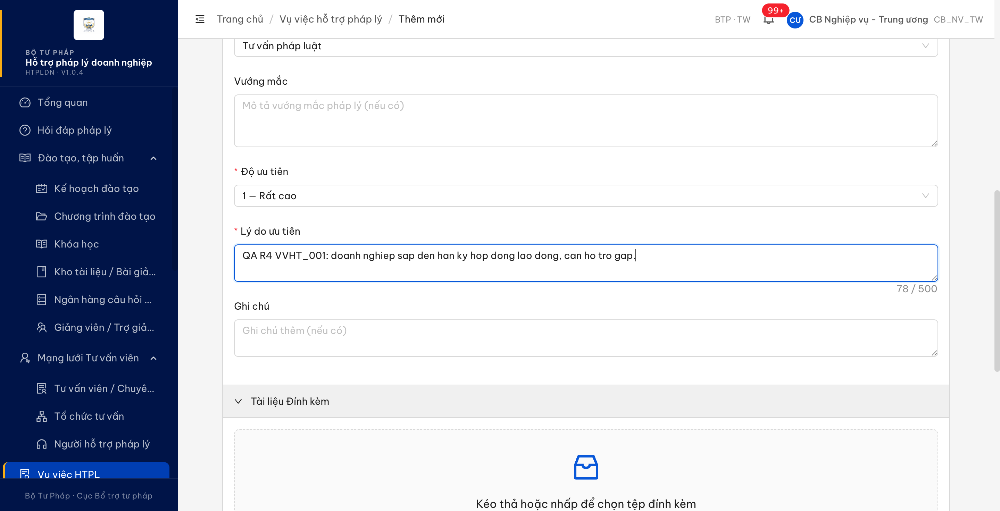

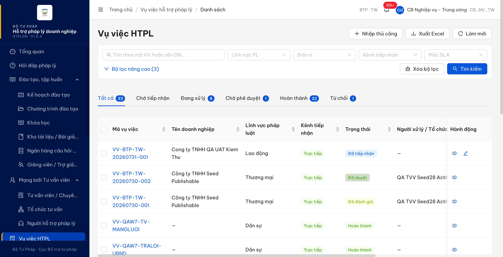

![Bản ghi tạo bằng nút [Lưu nháp] — VV-BTP-TW-20260731-002](image/R4-VVHT_001-04-vu-viec-luu-nhap-thanh-cong.png)

Phần trả về của lượt tạo vụ việc (mã 201) lưu tại [R4-VVHT_001-03-post-vu-viecs-manual-201.network-response](image/R4-VVHT_001-03-post-vu-viecs-manual-201.network-response).

### Ghi nhận thêm khi đo (không phải lỗi, ghi lại để khỏi hiểu nhầm ở lượt sau)

Màn **chi tiết** vụ việc ghi mốc ngày tiếp nhận là *"31/07/2026 07:00"* — có kèm giờ, trong khi bảng danh sách ghi gọn *"31/07/2026"*. Phần **ngày không bị lệch** (vẫn đúng 31/07), và trường này ở tầng dữ liệu là kiểu ngày-giờ (`srs-fr-05-vu-viec.md:138`) nên hiện kèm giờ không trái đặc tả; cột trên bảng danh sách vẫn đúng khuôn `dd/mm/yyyy` như `:1654` quy định. Ghi lại vì đây là chỗ dễ bị nhầm với nhóm lỗi lệch múi giờ đã đóng trước đó — lượt đo này **không** thấy lệch ngày.
