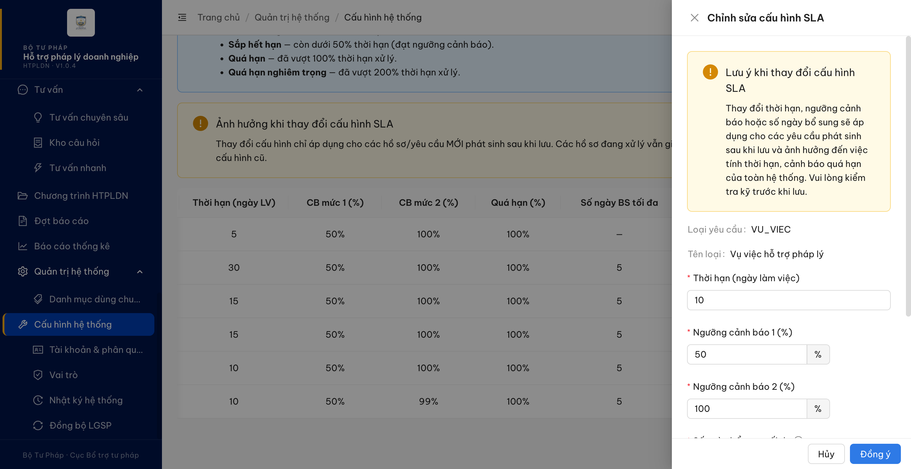

# Bug Report — Quản trị hệ thống (phát hiện thêm trong vòng re-verify 2)

| Thông tin | Giá trị |
|-----------|---------|
| **Dự án** | PM HTPLDN — Hỗ trợ pháp lý Doanh nghiệp |
| **Môi trường** | https://htpldn-uat.ospgroup.vn — build **HTPLDN V1.0.4** |
| **Người test** | QA Automation (Chrome DevTools MCP) |
| **Ngày** | 2026-08-03 20:00:32 |
| **Loại test** | UAT re-verify vòng 2 — lỗi phát hiện ngoài phạm vi 54 case |
| **Round** | Re-verify vòng 2 (2026-08-03) |
| **Tài liệu tham chiếu** | SRS v3.5 bản chuẩn `Docs-PM-HTPLDN/_bmad-output/planning-artifacts/srs-v3.5/srs-fr-10-quan-tri.md` · [KET-QUA-REVERIFY-VONG-2.md](../../KET-QUA-REVERIFY-VONG-2.md) |

---

**Nguồn SRS:** mọi trích dẫn dạng `srs-v3.5/<file>:<dòng>` lấy từ `Docs-PM-HTPLDN/_bmad-output/planning-artifacts/srs-v3.5/` (bản chuẩn duy nhất). KHÔNG dùng bản `input/srs-update-2026-5-5/` vì lệch số dòng.

## Tổng hợp

Phát hiện **1** lỗi có SRS reference cụ thể, gặp khi chạy lại các case cấu hình SLA của vòng 2. Lỗi này **không thuộc** 54 case đối tác báo, nên **không ghi vào sheet đối tác**.

> **Snapshot LATEST (2026-08-03):** **1 tổng · 0 Closed · 1 Open.**

### Severity breakdown

| Tổng | Critical | Major | Medium | Minor | Trivial | Closed | Open |
|------|----------|-------|--------|-------|---------|--------|------|
| 1    | 0        | 0     | 1      | 0     | 0       | 0      | 1    |

## Bug Summary Table

| Bug ID | Severity | Priority | Type | TC Ref | **SRS Reference** | Title | Status |
|--------|----------|----------|------|--------|-------------------|-------|--------|
| BUG-QLCHTHXLHS-SLA-01 | Medium | P2 | Negative | — (phát hiện thêm, liên quan QLCHTHXLHS_03/_07) | `FR-VIII-10 Inputs #5` (`srs-v3.5/srs-fr-10-quan-tri.md:472`) · `SCR-VIII-06 Thành phần row 8` (`srs-v3.5/srs-fr-10-quan-tri.md:1813`) · `Seed Data` (`srs-v3.5/srs-fr-10-quan-tri.md:524-530`) | Cấu hình SLA nhận và lưu "Ngưỡng cảnh báo 2" = 100%, vượt giới hạn đặc tả (CB1 < CB2 < 100) | Open |

---

## BUG-QLCHTHXLHS-SLA-01 — Cấu hình SLA nhận và lưu "Ngưỡng cảnh báo 2" = 100%, vượt giới hạn đặc tả

### Mô tả

Ở màn Cấu hình hệ thống → tab "Thời hạn xử lý (SLA)", Quản trị viên đặt **Ngưỡng cảnh báo 2 = 100%** thì hệ thống lưu thành công, trong khi đặc tả quy định ngưỡng này phải **nhỏ hơn 100**. Hệ quả: mốc cảnh báo mức 2 trùng đúng mốc quá hạn (cột "Quá hạn (%)" cũng là 100%), nên cảnh báo mức 2 không còn tác dụng báo trước. Cả **6/6** dòng cấu hình đang ở trạng thái này.

### Các bước tái hiện

1. Đăng nhập role `admin` (vai trò **QTHT** — có quyền `read_cau_hinh_sla` + sửa cấu hình SLA theo `SCR-VIII-06`).
2. Vào **Quản trị hệ thống → Cấu hình hệ thống**, tab **"Thời hạn xử lý (SLA)"**.
3. Quan sát bảng: cả 6 dòng (`HOI_DAP`, `HOI_DAP_PHUC_TAP`, `HO_SO_CHI_TRA`, `HO_SO_HT`, `HO_SO_TT`, `VU_VIEC`) đều có **CB mức 2 (%) = 100%**, trùng cột **Quá hạn (%) = 100%**.
4. Bấm **Sửa** ở dòng `VU_VIEC`. Quan sát ô "Ngưỡng cảnh báo 2 (%)": giá trị 100, giới hạn trên của ô là **100** và nút tăng đã bị vô hiệu ở mức này; trong khi ô "Ngưỡng cảnh báo 1 (%)" có giới hạn trên là **99**.
5. Đổi "Ngưỡng cảnh báo 2" thành **99** → bấm **Đồng ý** → hệ thống báo "Cập nhật cấu hình SLA thành công", bảng hiện 99%.
6. Bấm **Sửa** lại chính dòng đó, đổi "Ngưỡng cảnh báo 2" về **100** → bấm **Đồng ý**.
7. Quan sát: hệ thống báo **"Cập nhật cấu hình SLA thành công"**, không có thông báo từ chối, không có dòng lỗi nào dưới ô nhập; bảng hiện lại **100%**.

### Kết quả mong đợi

- Theo `srs-v3.5/srs-fr-10-quan-tri.md:472` (FR-VIII-10 §Inputs, trường `canh_bao_2_phan_tram`): *"Mức CB2 (% thời hạn), **CB1 < CB2 < 100**"* — giá trị mặc định **90**.
- Theo `srs-v3.5/srs-fr-10-quan-tri.md:1813` (SCR-VIII-06 thành phần "Cot CB muc 2 (%)"): *"Mac dinh: 90. Validate: **CB1 < CB2 < 100** (ERR-SLA-02)"*.
- Theo `srs-v3.5/srs-fr-10-quan-tri.md:524-530` (§Seed Data): cả 6 loại yêu cầu đều có **CB2 = 90** và **Quá hạn = 100**.
- Khi người dùng nhập ngưỡng cảnh báo 2 từ 100 trở lên, hệ thống phải từ chối lưu, báo cho người dùng biết giá trị không hợp lệ và giữ nguyên cấu hình cũ.

### Kết quả thực tế

- Giá trị 100 được chấp nhận ở cả giao diện lẫn phía máy chủ: bấm lưu ra thông báo thành công, dữ liệu ghi nhận 100% và hiển thị lại trên bảng.
- Giới hạn trên của ô nhập đang là **100** (`aria-valuemax="100"`, nút tăng vô hiệu tại 100) — tức đang chặn theo `CB2 ≤ 100` thay vì `CB2 < 100`. Cùng màn hình, ô "Ngưỡng cảnh báo 1" chặn đúng ở **99**.
- Toàn bộ 6 dòng cấu hình hiện có CB2 = 100%, lệch so với giá trị 90 mà đặc tả quy định ở §Seed Data.
- Vì cột "Quá hạn (%)" cũng là 100%, mốc cảnh báo mức 2 và mốc quá hạn trùng nhau nên không còn khoảng báo trước.

### Bằng chứng

**1. Ảnh chụp:**



**2. Thông báo hệ thống bắt được bằng bộ quan sát DOM (cài trước khi bấm, không lọc trùng):**

```
20:00:04  ant-notification  "Cập nhật cấu hình SLA thành công"   (lưu CB2 = 99)
20:00:32  ant-notification  "Cập nhật cấu hình SLA thành công"   (lưu CB2 = 100)
.ant-form-item-explain-error : không có dòng nào
```

**3. Trạng thái bảng sau khi chạy** *(đã trả về đúng như lúc chưa test)*:

```
HOI_DAP            5   50%  100%  100%  —
HOI_DAP_PHUC_TAP  30   50%  100%  100%  5
HO_SO_CHI_TRA     15   50%  100%  100%  5
HO_SO_HT          15   50%  100%  100%  5
HO_SO_TT          10   50%  100%  100%  5
VU_VIEC           10   50%  100%  100%  5
```

---

*Bug report generated: 2026-08-03 20:05:00 | QA Automation via Claude Code*
