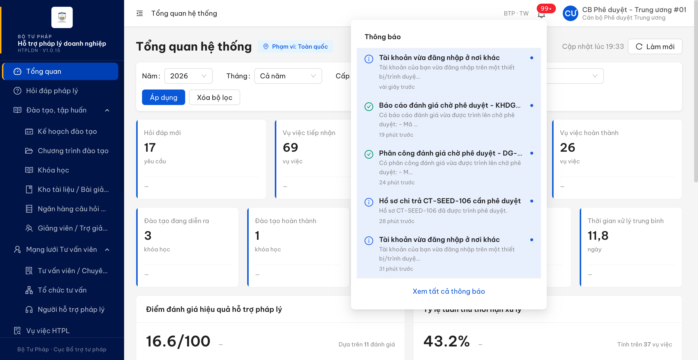
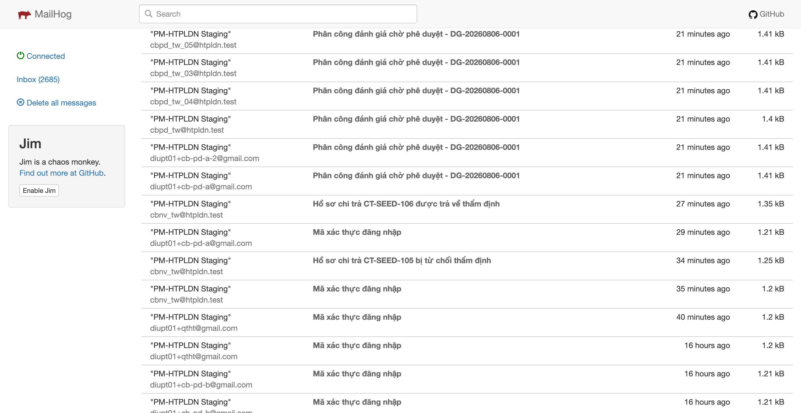
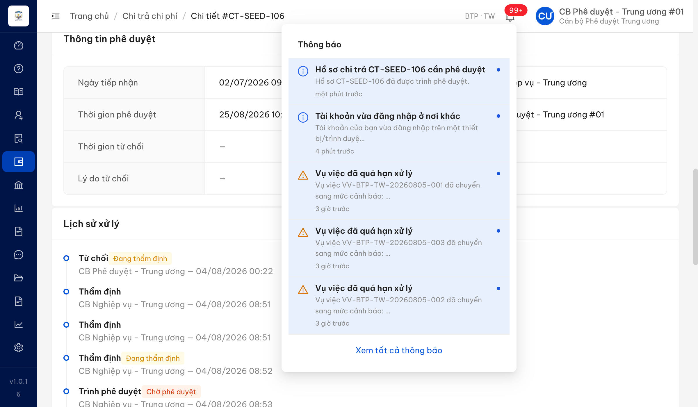

# Bug Report — Chi trả chi phí (thông báo nghiệp vụ qua email)

| Thông tin | Giá trị |
|-----------|---------|
| **Dự án** | PM HTPLDN — UAT reverify email |
| **Môi trường** | https://18.143.165.120.nip.io (DEV, bản dựng V1.0.15) · MailHog http://18.143.165.120:8025 |
| **Người test** | QA Automation |
| **Ngày** | 2026-08-25 10:12:13 |
| **Loại test** | Workflow (thông báo email + in-app) |
| **Round** | Reverify email — File 03 Batch 5 (Chi trả) |
| **Tài liệu tham chiếu** | [03-TC-email-notification-workflow.md](../03-TC-email-notification-workflow.md) · SRS v3.5 `Docs-PM-HTPLDN/_bmad-output/planning-artifacts/srs-v3.5/srs-fr-06-chi-tra.md` + `srs-v3.5.md` |

---

## Tổng hợp

Phát hiện **1** lỗi có tham chiếu đặc tả cụ thể khi chạy batch `EM-NOT-CT-*` trên DEV bằng MailHog: thao tác **Trình phê duyệt hồ sơ thanh toán** chạy đúng, sinh đúng thông báo trên chuông cho Cán bộ Phê duyệt, nhưng không phát ra thư điện tử nào.

Kênh thư của môi trường **đang hoạt động** trên chính hồ sơ này: cùng phiên, cách nhau chưa tới một phút, thao tác **trả về thẩm định** trên hồ sơ `CT-SEED-106` phát thư *"Hồ sơ chi trả CT-SEED-106 được trả về thẩm định"* về `cbnv_tw@htpldn.test` lúc 12:04:56Z, và thao tác **từ chối thẩm định** trên `CT-SEED-105` phát thư lúc 11:58:00Z. Vì vậy việc thiếu thư dưới đây là thiếu theo từng sự kiện, không phải do máy chủ thư tắt.

Bốn trường hợp còn lại của nhóm Chi trả (`EM-NOT-CT-01`, `-02`, `-04`, `-05`) **không dựng được tiền đề** trên dữ liệu DEV hiện có nên được chấm Blocked, không log lỗi — lý do chi tiết ghi ở cột Ghi chú của từng dòng trong file testcase.

### Severity breakdown

| Tổng | Critical | Major | Medium | Minor | Trivial | Closed | Open |
|------|----------|-------|--------|-------|---------|--------|------|
| 1    | 0        | 1     | 0      | 0     | 0       | 1      | 0    |

## Bug Summary Table

| Bug ID | Severity | Priority | Type | TC Ref | **SRS Reference** | Title | Status |
|--------|----------|----------|------|--------|-------------------|-------|--------|
| BUG-EM-CT-001 | Major | P1 | Workflow | EM-NOT-CT-03 | `srs-fr-06-chi-tra.md:819` (FR-V.II-11 Processing bước 4 — "Gửi thông báo CB PD cùng đơn vị") · `:831` (Postconditions — "CB PD nhận thông báo") · `:840` (Acceptance Criteria — "HS → CHO_PHE_DUYET, CB PD cùng đơn vị nhận thông báo") · `srs-v3.5.md:5745` (BR-NOTIF-01 sự kiện 1, kênh "in-app + email", Áp dụng FR có "FR-V.II (chi trả)") | Trình phê duyệt hồ sơ thanh toán chỉ sinh thông báo trong ứng dụng, không phát thư điện tử cho Cán bộ Phê duyệt | Closed |

---

## ~~BUG-EM-CT-001~~ [CLOSED] — Trình phê duyệt hồ sơ thanh toán: có thông báo trong ứng dụng nhưng không phát thư điện tử

> **Re-test:** 2026-08-25 10:12:13 R3 — ✅ PASS (Closed-verified). Trình CT-SEED-106 lúc 10:04:55 (UTC+7) chuyển sang Chờ phê duyệt; in-app sinh thông báo mới và MailHog tăng 2997→3003, riêng hộp cbpd_tw_01 tăng 48→49.

### Mô tả

Thao tác **Trình phê duyệt** hồ sơ chi trả chuyển trạng thái đúng (`DANG_THAM_DINH → CHO_PHE_DUYET`) và sinh đúng thông báo trên chuông cho Cán bộ Phê duyệt cùng đơn vị, nhưng **không phát ra thư điện tử nào** — kho thư MailHog của môi trường không tăng thêm một bản ghi nào, kể cả hộp thư của người nhận lẫn toàn bộ các hộp thư khác. Hiện tượng lặp lại nguyên vẹn ở hai lần thực hiện cách nhau 5 phút trên cùng một hồ sơ. Giữa hai lần đó, thao tác **trả về thẩm định** trên chính hồ sơ này phát thư bình thường, nên kênh thư của môi trường đang bật.

### Các bước tái hiện

1. Đăng nhập `cbnv_tw` (vai trò `CB_NV_TW`, đơn vị *Cục Bổ trợ tư pháp — Bộ Tư pháp*, là người xử lý hồ sơ chi trả theo SCR-V.II-02).
2. Ghi lại mốc thời gian và **tổng số thư của cả kho** MailHog, kèm số thư của hộp thư Cán bộ Phê duyệt cùng đơn vị (`cbpd_tw_01` = `diupt01+cb-pd-a@gmail.com`).
3. Mở hồ sơ chi trả `CT-SEED-106` ở trạng thái *Đang thẩm định* với kết quả thẩm định **Đạt** → bấm **Trình phê duyệt**. Hồ sơ chuyển sang *Chờ phê duyệt* lúc **12:00:31Z**.
4. Chờ hơn 80 giây rồi đếm lại tổng số thư của cả kho.
5. **Vòng lặp lại:** đưa hồ sơ về *Đang thẩm định* bằng thao tác **Trả về thẩm định** lúc **12:04:56Z**, rồi bấm **Trình phê duyệt** lần hai lúc **12:05:44Z**; chờ 40 giây và đếm lại tổng số thư.
6. Đăng nhập `cbpd_tw_01` (vai trò `CB_PD_TW`, cùng đơn vị, là người nhận theo đặc tả), mở chuông thông báo và gọi `GET /api/v1/thong-baos` để đối chiếu.

### Kết quả mong đợi

- Theo `srs-fr-06-chi-tra.md:819` (FR-V.II-11 Processing bước 4), khi Cán bộ Nghiệp vụ trình phê duyệt hồ sơ thanh toán, hệ thống phải **gửi thông báo cho Cán bộ Phê duyệt cùng đơn vị**; `:831` (Postconditions) và `:840` (Acceptance Criteria) lặp lại yêu cầu này.
- Theo `srs-v3.5.md:5745` (BR-NOTIF-01), sự kiện *(1) Trình phê duyệt* nằm trong nhóm sự kiện phải phát thông báo và quy tắc ghi rõ **"Kênh: in-app + email"**, cột *Áp dụng FR* liệt kê **"FR-V.II (chi trả)"** — nghĩa là thông báo phải đi qua **cả hai** kênh, không được chỉ có một.

### Kết quả thực tế

- Hồ sơ chuyển trạng thái đúng ở cả hai lần và **có** thông báo trong ứng dụng cho Cán bộ Phê duyệt: chuông của `cbpd_tw_01` hiện *"Hồ sơ chi trả CT-SEED-106 cần phê duyệt — Hồ sơ CT-SEED-106 đã được trình phê duyệt."*; `GET /api/v1/thong-baos` trả về **đúng 2 bản ghi** tương ứng hai lần trình (`72d37047-2a7b-4236-8df0-b7534e18308b` và `87224a67-7ddf-4734-937e-eb9db2051dc1`, cùng `entityType = HO_SO_CHI_TRA`).
- **Không có thư điện tử nào** được phát ra ở cả hai lần:
  - Lần 1: tổng số thư của cả kho trước thao tác **2667**, sau khi chờ 85 giây vẫn **2667** — chênh **0**.
  - Lần 2: tổng số thư trước thao tác **2669**, sau khi chờ 40 giây vẫn **2669** — chênh **0**.
- Vì phép đếm lấy trên **tổng kho** chứ không lọc theo một hộp thư, kết quả này loại trừ cả khả năng thư được gửi nhầm sang địa chỉ khác.

### Bằng chứng

**1. Ảnh chụp**:




**Reverify R3 — 2026-08-25:**



- Condition table: [`../cond/BUG-EM-CT-001.md`](../cond/BUG-EM-CT-001.md)
- MailHog: tổng kho `2997 → 3003`; hộp `diupt01+cb-pd-a@gmail.com` `48 → 49`; 6 thư cùng subject “Hồ sơ chi trả CT-SEED-106 cần phê duyệt” được tạo lúc `2026-08-25T03:04:55Z`.

**2. Đối chứng kênh thư trong cùng phiên và trên cùng hồ sơ** — hai sự kiện khác của nhóm Chi trả phát thư bình thường:

```
2026-08-23T11:58:00Z  To: cbnv_tw@htpldn.test
  Subject: Hồ sơ chi trả CT-SEED-105 bị từ chối thẩm định
2026-08-23T12:04:56Z  To: cbnv_tw@htpldn.test
  Subject: Hồ sơ chi trả CT-SEED-106 được trả về thẩm định
```

**3. Phép đếm kho thư quanh hai lần trình phê duyệt**:

```
12:00:20Z  tổng kho = 2667
12:00:31Z  POST .../ho-so-chi-tra/{id}/trinh-phe-duyet  → 200, trang_thai = CHO_PHE_DUYET
12:01:56Z  tổng kho = 2667   (chênh 0 sau 85 giây)

12:04:56Z  POST .../tra-ve-tham-dinh                    → 200 + thư về cbnv_tw@htpldn.test
12:05:30Z  tổng kho = 2669
12:05:44Z  POST .../ho-so-chi-tra/{id}/trinh-phe-duyet  → 200, trang_thai = CHO_PHE_DUYET
12:06:24Z  tổng kho = 2669   (chênh 0 sau 40 giây)
```
