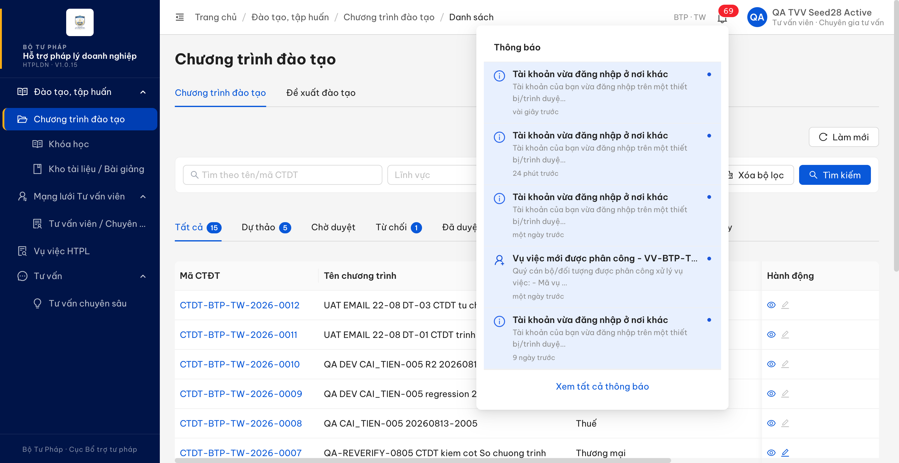
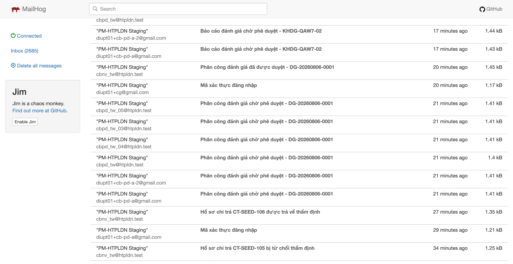
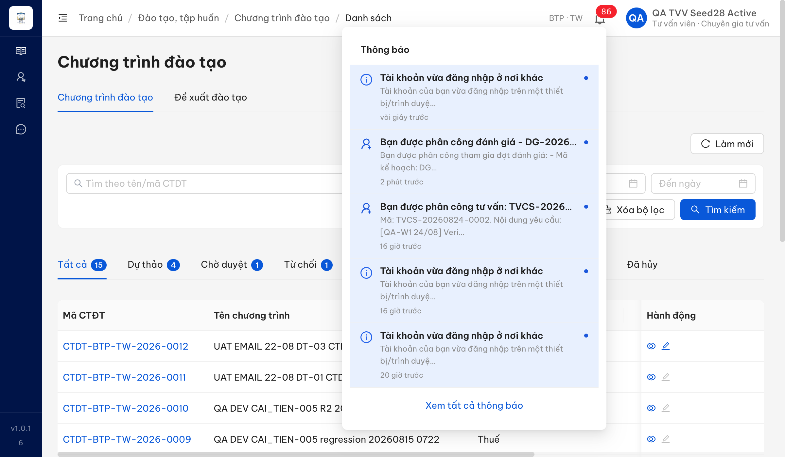
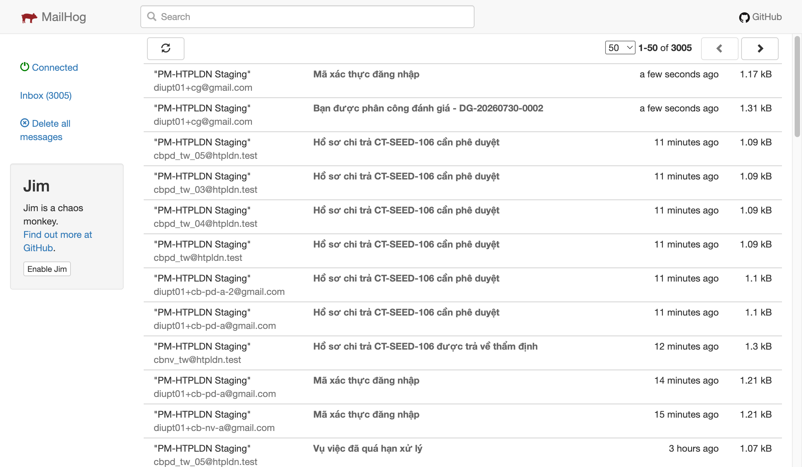

# Bug Report — Đánh giá hiệu quả (thông báo nghiệp vụ qua email)

| Thông tin | Giá trị |
|-----------|---------|
| **Dự án** | PM HTPLDN — UAT reverify email |
| **Môi trường** | https://18.143.165.120.nip.io (DEV, bản dựng V1.0.15) · MailHog http://18.143.165.120:8025 |
| **Người test** | QA Automation |
| **Ngày** | 2026-08-25 10:17:46 |
| **Loại test** | Workflow (thông báo email + in-app) |
| **Round** | Reverify email — File 03 Batch 5 (Đánh giá) |
| **Tài liệu tham chiếu** | [03-TC-email-notification-workflow.md](../03-TC-email-notification-workflow.md) · SRS v3.5 `Docs-PM-HTPLDN/_bmad-output/planning-artifacts/srs-v3.5/srs-fr-08-danh-gia.md` + `srs-v3.5.md` |

---

## Tổng hợp

Phát hiện **1** lỗi có tham chiếu đặc tả cụ thể khi chạy batch `EM-NOT-DG-*` trên DEV bằng MailHog: **người được phân công đánh giá không nhận được bất kỳ thông báo nào** — không có thư điện tử và cũng không có thông báo trong ứng dụng.

Đây là trường hợp nặng hơn kiểu lỗi "thiếu một kênh" thường gặp ở các nhóm khác: ở đây **cả hai kênh đều trống**, nên người được giao việc không có cách nào biết mình phải thực hiện đánh giá ngoài việc tự mở màn hình kiểm tra.

Ba trường hợp còn lại của nhóm Đánh giá đều **Đạt** với đủ hai kênh và đúng bộ người nhận: trình phân công (`EM-NOT-DG-02`), trình báo cáo đánh giá (`EM-NOT-DG-03`), phê duyệt báo cáo đánh giá (`EM-NOT-DG-04`). Vì vậy kênh thư của môi trường đang bật và module Đánh giá vẫn phát thư ở các bước khác — thiếu thư ở đây là thiếu theo từng sự kiện.

### Severity breakdown

| Tổng | Critical | Major | Medium | Minor | Trivial | Closed | Open |
|------|----------|-------|--------|-------|---------|--------|------|
| 1    | 0        | 1     | 0      | 0     | 0       | 1      | 0    |

## Bug Summary Table

| Bug ID | Severity | Priority | Type | TC Ref | **SRS Reference** | Title | Status |
|--------|----------|----------|------|--------|-------------------|-------|--------|
| BUG-EM-DG-001 | Major | P1 | Workflow | EM-NOT-DG-01 | `srs-fr-08-danh-gia.md:280` (FR-VI-03 Processing bước 7 — "Gửi thông báo người được phân công") · `:293` (Outputs #2 — "Thông báo phân công … Gửi người được phân công") · `:299` (Postconditions — "Thông báo gửi đến người được phân công") · `:315` (Acceptance Criteria — "lưu phân công, gửi thông báo") · `:1222` và `:1276` (BR-NOTIF-01 áp dụng cho FR-VI-03) · `srs-v3.5.md:5745` (BR-NOTIF-01, kênh "in-app + email", Áp dụng FR có "FR-VI (đánh giá)") | Người được phân công đánh giá không nhận được thông báo nào: không có thư điện tử và cũng không có thông báo trong ứng dụng | Closed |

---

## ~~BUG-EM-DG-001~~ [CLOSED] — Phân công người đánh giá: người được phân công không nhận thư điện tử lẫn thông báo trong ứng dụng

> **Re-test:** 2026-08-25 10:17:46 R3 — ✅ PASS (Closed-verified). Phân công QA TVV Seed28 Active đã lưu; in-app sinh thông báo mới và MailHog tăng 3003→3004, riêng hộp diupt01+cg@gmail.com tăng 22→23. UI có false-failure do request bị hủy sau khoảng 10 giây, đã ghi nhận riêng.

### Mô tả

Khi Cán bộ Nghiệp vụ thêm một người đánh giá vào đợt đánh giá, bản ghi phân công được lưu đúng nhưng **người được phân công không nhận được thông báo nào**: kho thư MailHog không tăng thêm bản ghi nào, và chuông thông báo của chính tài khoản đó cũng không có mục nào về phân công đánh giá. Ở bước **trình phê duyệt** ngay sau đó, hệ thống lại phát thư đầy đủ cho cả 6 Cán bộ Phê duyệt Trung ương — chứng tỏ đường phát thông báo của module Đánh giá vẫn chạy, chỉ riêng người nhận là *người được phân công* bị bỏ sót.

### Các bước tái hiện

1. Đăng nhập `cbnv_tw` (vai trò `CB_NV_TW`, đơn vị *Cục Bổ trợ tư pháp — Bộ Tư pháp*, là người lập đợt đánh giá theo SCR-VI-01).
2. Mở đợt đánh giá `DG-20260806-0001` ở trạng thái *Phân công*, bộ tiêu chí đã thỏa cả hai cổng kiểm tra của `srs-fr-08-danh-gia.md:257` (tổng trọng số = 100% và chuẩn thang điểm = 100), nên thao tác thêm người đánh giá được phép.
3. Ghi lại mốc thời gian và **tổng số thư của cả kho** MailHog, kèm số thư của hộp thư người sắp được phân công (`qa_tvvseed28` = `diupt01+cg@gmail.com`).
4. Sang tab **Phân công** → thêm người đánh giá `qa_tvvseed28` ("QA TVV Seed28 Active", *Tư vấn viên · Chuyên gia tư vấn*, **cùng đơn vị** Cục Bổ trợ tư pháp) với vai trò *Đánh giá viên* → lưu. Bản ghi phân công `5449d8e0-7ba0-4ba5-b253-627cf66768fb` được tạo lúc **12:09:28Z**.
5. Chờ hơn 45 giây rồi đếm lại tổng số thư của cả kho.
6. Bấm **Trình phê duyệt** lúc **12:10:14Z** (đợt chuyển sang *Chờ duyệt phân công*), rồi đếm lại kho thư và liệt kê người nhận.
7. Đăng nhập `qa_tvvseed28`, mở chuông thông báo và gọi `GET /api/v1/thong-baos` để đối chiếu.

### Kết quả mong đợi

- Theo `srs-fr-08-danh-gia.md:280` (FR-VI-03 Processing bước 7), sau khi lưu bản ghi phân công hệ thống phải **gửi thông báo cho người được phân công**. Yêu cầu này được nhắc lại ở `:293` (Outputs #2 — *"Thông báo phân công … Gửi người được phân công"*, điều kiện *"Khi lưu"*), `:299` (Postconditions — *"Thông báo gửi đến người được phân công"*) và `:315` (Acceptance Criteria — *"Given CB NV chọn người When xác nhận Then lưu phân công, gửi thông báo"*).
- Theo `srs-fr-08-danh-gia.md:1222` và `:1276`, `BR-NOTIF-01` được áp dụng cho FR-VI-03; và theo `srs-v3.5.md:5745`, quy tắc này ghi rõ **"Kênh: in-app + email"** với cột *Áp dụng FR* có **"FR-VI (đánh giá)"** — nghĩa là thông báo cho người được phân công phải đi qua **cả hai** kênh.

### Kết quả thực tế

- Bản ghi phân công được lưu đúng (dịch vụ trả 200, phân công hiện trong danh sách của đợt) và bước trình phê duyệt sau đó chạy đúng.
- **Không có thư điện tử nào** cho người được phân công: tổng số thư của cả kho trước thao tác **2669**, sau khi chờ 46 giây vẫn **2669** — chênh **0**. Vì phép đếm lấy trên tổng kho, kết quả này loại trừ cả khả năng thư đi nhầm địa chỉ khác.
- **Không có thông báo trong ứng dụng**: chuông của `qa_tvvseed28` không có mục nào liên quan đến phân công đánh giá; mục nghiệp vụ gần nhất là *"Vụ việc mới được phân công - VV-BTP-TW-20260806-001"* từ **một ngày trước**, tức trước thời điểm phân công ở bước 4.
- Trong khi đó, bước **trình phê duyệt** lúc 12:10:14Z phát **6 thư** *"Phân công đánh giá chờ phê duyệt - DG-20260806-0001"* tới đủ 6 Cán bộ Phê duyệt Trung ương — cùng đợt, cùng phiên, cách bước phân công chưa tới một phút.

### Bằng chứng

**1. Ảnh chụp**:




**Reverify R3 — 2026-08-25:**




- Condition table: [`../cond/BUG-EM-DG-001.md`](../cond/BUG-EM-DG-001.md)
- MailHog: tổng kho `3003 → 3004`; hộp `diupt01+cg@gmail.com` `22 → 23`; subject “Bạn được phân công đánh giá - DG-20260730-0002”.
- In-app: thông báo `2e3ea426-241f-45ad-8b32-4e5af1f473f2` được tạo cho đúng tài khoản lúc `2026-08-25T03:14:56.250Z`.

> **Ghi nhận ngoài triệu chứng gốc:** giao diện hiện toast “Thêm người đánh giá thất bại” do request bị `net::ERR_ABORTED` sau khoảng 10 giây, dù backend đã lưu bản ghi và phát đủ hai kênh thông báo. Cần theo dõi riêng hiện tượng false-failure này.

**2. Phép đếm kho thư quanh hai thao tác**:

```
12:08:42Z  tổng kho = 2669
12:09:28Z  POST .../ke-hoach-danh-gias/{id}/phan-cong  → 200, phan_cong_id = 5449d8e0-7ba0-4ba5-b253-627cf66768fb
12:10:14Z  tổng kho = 2669   (chênh 0 sau 46 giây — không thư nào cho người được phân công)

12:10:14Z  POST .../ke-hoach-danh-gias/{id}/trinh-phe-duyet → 200, trang_thai = CHO_DUYET_PC
12:10:14Z  6 thư "Phân công đánh giá chờ phê duyệt - DG-20260806-0001" gửi tới:
           cbpd_tw@htpldn.test · cbpd_tw_03@htpldn.test · cbpd_tw_04@htpldn.test
           cbpd_tw_05@htpldn.test · diupt01+cb-pd-a@gmail.com · diupt01+cb-pd-a-2@gmail.com
           (không có diupt01+cg@gmail.com trong danh sách người nhận)
```

**3. Thư duy nhất về hộp thư người được phân công trong cả cửa sổ thời gian** — là thư mã xác thực do chính thao tác đăng nhập kiểm chứng ở bước 7 sinh ra, không phải thư nghiệp vụ:

```
2026-08-23T12:11:07Z  To: diupt01+cg@gmail.com
  Subject: Mã xác thực đăng nhập
```

---

## Ghi nhận thêm (chưa log thành lỗi — cần BA xác nhận)

Khi lấy danh sách người đủ điều kiện phân công, dịch vụ `GET /api/v1/ke-hoach-danh-gias/lookup/danh-gia-vien` trả về **56 người thuộc nhiều đơn vị khác nhau** (có cả Bộ Công an, Bộ Kế hoạch & Đầu tư, Sở Tư pháp An Giang), trong khi `srs-fr-08-danh-gia.md:264` (Inputs #2) ràng buộc `nguoi_danh_gia_id` là *"FK → NGUOI_DUNG, cùng đơn vị"* và `:278` (Processing bước 5) ghi *"Hiển thị danh sách CB/CG đủ điều kiện tham gia (cùng đơn vị)"*.

Chưa kiểm chứng bằng thao tác lưu nên **chưa kết luận là lỗi**: chỉ mới thấy danh sách gợi ý rộng hơn phạm vi đặc tả, chưa biết phía sau có chặn khi lưu người khác đơn vị hay không. Người được phân công trong ca kiểm thử ở trên (`qa_tvvseed28`) **cùng đơn vị** với người phân công nên tiền đề của BUG-EM-DG-001 không bị ảnh hưởng bởi ghi nhận này.
