# Bug Report — Email Doanh nghiệp (file 02)

| Thông tin | Giá trị |
|-----------|---------|
| **Dự án** | PM HTPLDN — UAT reverify tuần Email |
| **Môi trường** | https://18.143.165.120.nip.io (DEV nội bộ) · MailHog http://18.143.165.120:8025 |
| **Người test** | QA Automation (Chrome DevTools MCP) |
| **Ngày** | 2026-08-25 14:39:30 |
| **Loại test** | Functional / UI / Negative |
| **Round** | Batch 1 + Batch 2 + Batch 3 — file 02 (EM-DN-UI-01..03, EM-DN-VAL-01..05, EM-DN-REG-01..06, EM-DN-CLAIM-01..06, EM-DN-UPD-01..04, EM-DN-NOMAIL-01..05) |
| **Tài liệu tham chiếu** | [02-TC-email-doanh-nghiep.md](../02-TC-email-doanh-nghiep.md) · SRS `Docs-PM-HTPLDN/_bmad-output/planning-artifacts/srs-v3.5/` |

---

## Tổng hợp

> **Batch 3 file 02 (2026-08-21):** chạy 9 testcase cập nhật email DN + ca không gửi thư, phát hiện thêm **1** lỗi có SRS reference cụ thể (BUG-EM-DN-006 — xóa trống ô Email trên form Chỉnh sửa DN báo lưu thành công nhưng giá trị cũ vẫn còn). Tổng file: **6** lỗi.

> **Kết quả reverify R4 (2026-08-25):** cả 6 lỗi đã Closed. Riêng `BUG-EM-DN-003` được xác nhận PASS bằng doanh nghiệp và token mới sinh sau bản fix; hệ thống phân biệt đúng token đã dùng với token sai.

### Severity breakdown

| Tổng | Critical | Major | Medium | Minor | Trivial | Closed | Open |
|------|----------|-------|--------|-------|---------|--------|------|
| 6    | 0        | 3     | 1      | 2     | 0       | 6      | 0    |

## Bug Summary Table

| Bug ID | Severity | Priority | Type | TC Ref | **SRS Reference** | Title | Status |
|--------|----------|----------|------|--------|-------------------|-------|--------|
| BUG-EM-DN-001 | Major | P1 | UI/UX | EM-DN-UI-02 | `FR-V.III-NEW-02 §Inputs rows 4/7/10/12/14` (srs-fr-07-doanh-nghiep.md:365,368,371,373,375) · `SCR-V.III-04 Thành phần row 9` (srs-fr-07-doanh-nghiep.md:529) | Form DN tự cập nhật hồ sơ thiếu 5 trường mà SRS cho phép DN tự sửa | Closed |
| BUG-EM-DN-002 | Minor | P3 | UI/UX | EM-DN-UI-03 | `FR-VIII-22 §Error Handling E6 ERR-REG-06` (srs-fr-10-quan-tri.md:1101) · `SCR-VIII-08 Thành phần row 28` (srs-fr-10-quan-tri.md:1941) | Thông báo khi chưa tích ô cam kết yêu cầu đồng ý "Điều khoản sử dụng" — control không tồn tại trên form đăng ký | Closed |
| BUG-EM-DN-003 | Medium | P2 | UI/UX | EM-DN-REG-06 | `FR-VIII-22 §Error Handling E9 ERR-REG-ACT-02` (srs-fr-10-quan-tri.md:1104) · đối chiếu E8 (srs-fr-10-quan-tri.md:1103) | Liên kết kích hoạt đã dùng vẫn bị báo là "Link không hợp lệ" — hai tình huống SRS tách riêng dùng chung một thông báo | Closed |
| BUG-EM-DN-004 | Minor | P3 | Data | EM-DN-CLAIM-01 | `FR-VIII-26 §Processing bước 16` (srs-fr-10-quan-tri.md:1333) · `§Processing bước 4b` (srs-fr-10-quan-tri.md:1320) | Luồng Claim Flow ghi nhật ký là "Doanh nghiệp tự đăng ký" nên không phân biệt được với DN tự đăng ký mới | Closed |
| BUG-EM-DN-005 | Major | P1 | Function | EM-DN-CLAIM-05 | `FR-VIII-26 §Processing bước 5-6` (srs-fr-10-quan-tri.md:1322,1323) · `§Error Handling E7-NEW` (srs-fr-10-quan-tri.md:1347) | Yêu cầu "Quên mật khẩu" lần thứ hai cho cùng một tài khoản không phát sinh thư và không sinh liên kết mới, trong khi màn hình vẫn báo đã gửi | Closed |
| BUG-EM-DN-006 | Major | P1 | Function | EM-DN-UPD-03 | `FR-V.III-01 §Inputs row 15` (srs-fr-07-doanh-nghiep.md:114) · `§Processing Chỉnh sửa bước 1-2` (srs-fr-07-doanh-nghiep.md:135,136) · `§Postconditions` (srs-fr-07-doanh-nghiep.md:179) · `§Error Handling` (srs-fr-07-doanh-nghiep.md:184-190) | Xóa trống ô Email trên form Chỉnh sửa DN: xác nhận và báo lưu thành công nhưng giá trị cũ vẫn còn | Closed |

---

## ~~BUG-EM-DN-001~~ [CLOSED] — Form "Hồ sơ doanh nghiệp" của DN thiếu 5 trường DN được quyền tự cập nhật

> **Re-test:** 2026-08-25 10:19:07 R3 — ✅ PASS (Closed-verified). Đăng nhập DN 0109998887 và mở /doanh-nghiep/me/sua trên v1.0.16: form đã có đủ 14 control, bao gồm cả Fax, Phụ nữ làm chủ, Số LĐ khuyết tật, Tổng nguồn vốn và Ghi chú.

### Mô tả

Doanh nghiệp đăng nhập vào màn hình hồ sơ của chính mình (`/doanh-nghiep/me/sua`) chỉ được cấp 9 ô nhập, trong khi SRS cho DN tự cập nhật 14 trường. Năm trường `fax`, `la_nu_lam_chu` (DN do phụ nữ làm chủ), `so_lao_dong_khuyet_tat`, `tong_nguon_von`, `ghi_chu` không được hiển thị ở bất kỳ nhóm nào trên form, nên DN không có cách nào tự sửa. Cả 5 trường đều tồn tại trong dữ liệu trả về của `GET /api/v1/doanh-nghieps/me`, nên đây là thiếu ở màn hình chứ không phải thiếu ở mô hình dữ liệu.

### Các bước tái hiện

1. Đăng nhập tài khoản Doanh nghiệp `0109998887` (vai trò DN — theo SCR-V.III-04 "Quyền truy cập: Doanh nghiệp", phạm vi dữ liệu theo MST khớp tên đăng nhập). Lấy mã xác thực trong MailHog tại địa chỉ `diupt01+dn-login@gmail.com`.
2. Ở menu trái bấm **Doanh nghiệp** → hệ thống mở `https://18.143.165.120.nip.io/doanh-nghiep/me/sua` ("Hồ sơ doanh nghiệp — Cong ty TNHH QA UAT Kiem Thu").
3. Mở lần lượt cả 4 nhóm trên form: "Thông tin liên hệ", "Người đại diện", "Lao động & tài chính", "Lĩnh vực kinh doanh" (cả 4 nhóm đều đang ở trạng thái mở sẵn).
4. Đếm số ô nhập: chỉ có 9 ô — Địa chỉ, Điện thoại, Email, Người đại diện, Chức vụ đại diện, Số lao động, Số lao động nữ, Doanh thu (VNĐ), Lĩnh vực kinh doanh.
5. Tìm các ô Fax / Doanh nghiệp do phụ nữ làm chủ / Số lao động khuyết tật / Tổng nguồn vốn / Ghi chú — không có ô nào trong số này trên màn hình.
6. Kiểm bằng đường thứ hai: gọi `GET /api/v1/doanh-nghieps/me` (200) — dữ liệu trả về có đủ khóa `fax`, `laNuLamChu`, `soLaoDongKhuyetTat`, `tongNguonVon`, `ghiChu`.

### Kết quả mong đợi

- Theo `srs-fr-07-doanh-nghiep.md:365,368,371,373,375` (FR-V.III-NEW-02 §Inputs rows 4, 7, 10, 12, 14) và `srs-fr-07-doanh-nghiep.md:529` (SCR-V.III-04 Thành phần row 9 — "Trường DN edit: Địa chỉ / Điện thoại / Email / **Fax** / Người ĐD / Chức vụ ĐD / **Phụ nữ làm chủ** / Số LĐ / Số LĐ nữ / **Số LĐ khuyết tật** / Doanh thu / **Tổng vốn** / Lĩnh vực KD multi-select / **Ghi chú**"), màn hình hồ sơ của DN phải cho DN tự cập nhật đủ 14 trường, trong đó có 5 trường đang thiếu.
- Riêng `tong_nguon_von` là một trong ba đầu vào của BR-CALC-05 (`srs-fr-07-doanh-nghiep.md:380` — Processing bước 3 auto-tính `quy_mo` từ `so_lao_dong` + `doanh_thu_nam` + `tong_nguon_von`), nên khi DN không nhập được trường này thì hệ thống không đủ dữ liệu để tự tính quy mô theo đúng quy định.

### Kết quả thực tế

- Form chỉ render 9 ô nhập; 5 trường `fax`, `la_nu_lam_chu`, `so_lao_dong_khuyet_tat`, `tong_nguon_von`, `ghi_chu` không xuất hiện ở bất kỳ nhóm nào, DN không có đường nào tự sửa.
- Dữ liệu hiện tại của 5 trường này trên bản ghi DN-HNI-0001: `fax = null`, `laNuLamChu = false`, `soLaoDongKhuyetTat = null`, `tongNguonVon = null`, `ghiChu = null` — tức DN cũng không thể bổ sung giá trị lần đầu.

### Bằng chứng

**1. Ảnh chụp**:

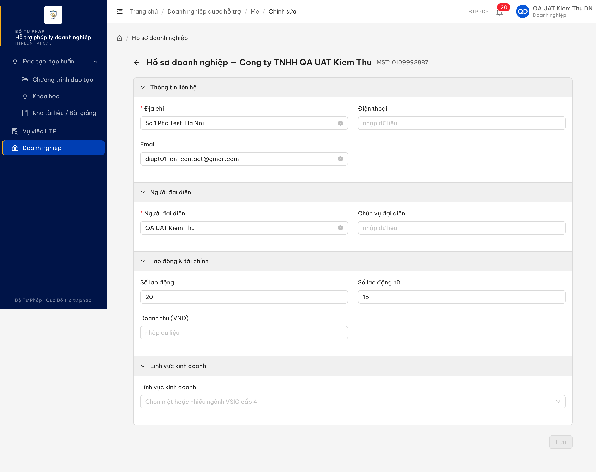

**Reverify R3 — 2026-08-25:**

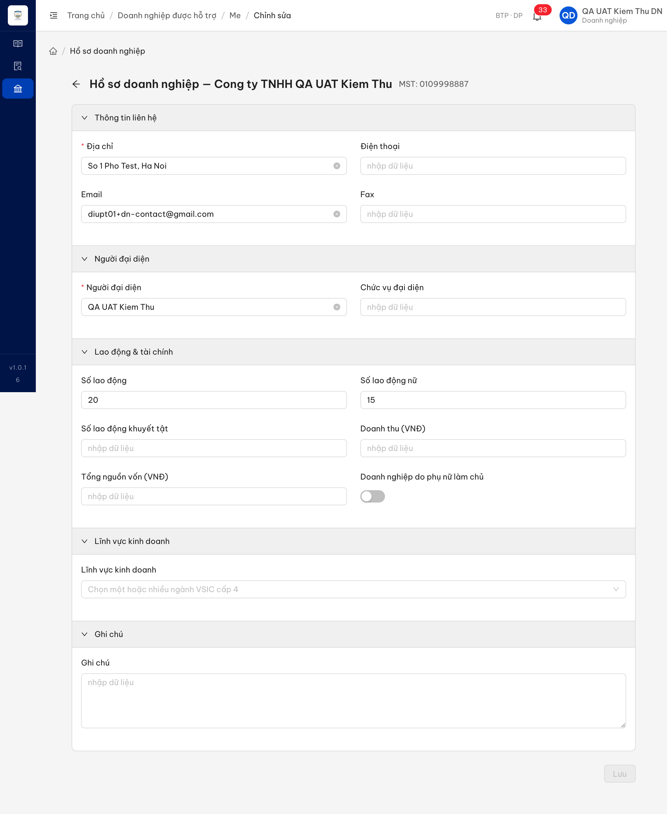

- Condition table: [`../cond/BUG-EM-DN-001.md`](../cond/BUG-EM-DN-001.md)
- Trên UI v1.0.16 đã thấy đủ: Fax, Doanh nghiệp do phụ nữ làm chủ, Số lao động khuyết tật, Tổng nguồn vốn và Ghi chú.

**2. API response** — `GET /api/v1/doanh-nghieps/me` (200), trích các khóa liên quan:

```json
{
  "maDoanhNghiep": "DN-HNI-0001",
  "maSoThue": "0109998887",
  "email": "diupt01+dn-contact@gmail.com",
  "fax": null,
  "laNuLamChu": false,
  "soLaoDongKhuyetTat": null,
  "tongNguonVon": null,
  "ghiChu": null
}
```

---

## ~~BUG-EM-DN-002~~ [CLOSED] — Thông báo lỗi khi chưa tích ô cam kết yêu cầu "đồng ý Điều khoản sử dụng", không phải cam kết thông tin đúng sự thật

> **Re-test:** 2026-08-25 10:20:02 R3 — ✅ PASS (Closed-verified). Form đăng ký công khai trên v1.0.16 chặn đúng khi chưa tích checkbox và hiển thị “Vui lòng tích cam kết thông tin đúng sự thật để tiếp tục”; không còn nhắc tới Điều khoản sử dụng.

### Mô tả

Trên form đăng ký tài khoản doanh nghiệp, ô bắt buộc cuối cùng có nhãn "Tôi cam kết các thông tin doanh nghiệp khai báo ở trên là đúng sự thật và chịu trách nhiệm trước pháp luật về nội dung khai báo." Khi bỏ trống ô này và bấm Đăng ký, hệ thống chặn đúng nhưng thông báo lại là "Vui lòng đồng ý Điều khoản sử dụng để tiếp tục". Form đăng ký hiện không có mục Điều khoản sử dụng nào, nên người dùng được hướng dẫn đi tìm một thứ không tồn tại trên màn hình.

### Các bước tái hiện

1. Mở `https://18.143.165.120.nip.io/register/doanh-nghiep` (form công khai, theo `srs-fr-10-quan-tri.md:1035` không yêu cầu đăng nhập trước).
2. Để trống toàn bộ form, hoặc điền các trường khác nhưng KHÔNG tích ô cam kết ở cuối form.
3. Bấm nút **Đăng ký**.
4. Đọc dòng lỗi màu đỏ ngay dưới ô cam kết.

### Kết quả mong đợi

- Theo `srs-fr-10-quan-tri.md:1101` (FR-VIII-22 §Error Handling E6, mã `ERR-REG-06`), khi người dùng chưa tích cam kết, hệ thống phải chặn đăng ký và đưa ra thông báo nói về **việc tích cam kết thông tin đúng sự thật** — đúng với ô mà người dùng đang phải thao tác.
- Thông báo phải trỏ tới đúng control có trên form; `srs-fr-10-quan-tri.md:1941` (SCR-VIII-08 Thành phần row 28) chỉ định ô này là "Cam kết thông tin đúng sự thật", và `srs-fr-10-quan-tri.md:18` ghi rõ nội dung "đồng ý Điều khoản + Chính sách" đã được thay bằng "cam kết thông tin đúng sự thật".

### Kết quả thực tế

- Hệ thống chặn đăng ký (đúng), nhưng hiển thị "Vui lòng đồng ý Điều khoản sử dụng để tiếp tục".
- Trên form không tồn tại ô, liên kết hay khối nội dung nào tên "Điều khoản sử dụng" — nhãn duy nhất là câu cam kết thông tin đúng sự thật.
- Bấm Đăng ký khi form trống cho ra đúng 13 dòng lỗi bắt buộc, khớp 13 trường bắt buộc của FR-VIII-22 §Inputs; chỉ riêng nội dung dòng lỗi của ô cam kết là sai.

### Bằng chứng

**1. Ảnh chụp**:

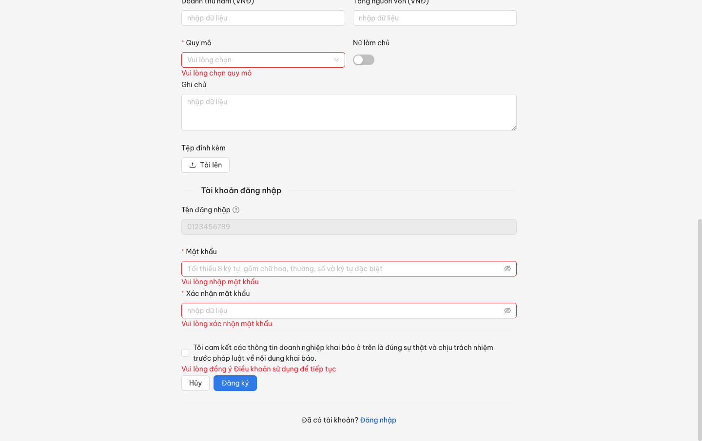

**Reverify R3 — 2026-08-25:**

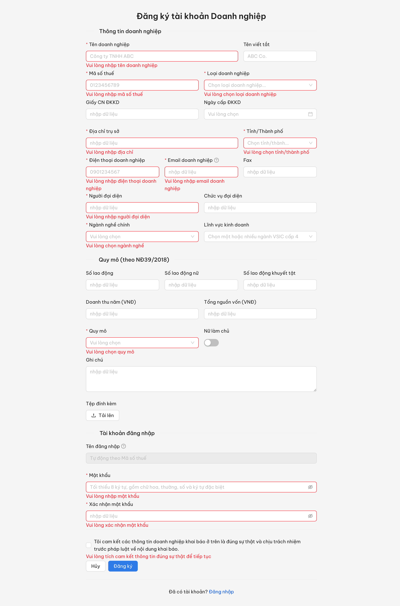

- Condition table: [`../cond/BUG-EM-DN-002.md`](../cond/BUG-EM-DN-002.md)
- DOM trả đúng lỗi: `Vui lòng tích cam kết thông tin đúng sự thật để tiếp tục`.

**2. Trích dòng lỗi đọc từ DOM** (`.ant-form-item-explain-error` của ô cam kết):

```text
Vui lòng đồng ý Điều khoản sử dụng để tiếp tục
```

---

## ~~BUG-EM-DN-003~~ [CLOSED] — Liên kết kích hoạt đã dùng vẫn bị báo "Link không hợp lệ", không phân biệt được với liên kết sai

> **Re-test:** 2026-08-25 14:39:30 R4 — ✅ PASS (Closed-verified). Dùng DN mới 0108251437 và token sinh lúc 14:38 sau fix: kích hoạt lần đầu thành công. Mở lại đúng token trả ERR-REG-ACT-02 với hướng dẫn đăng nhập; token sửa một ký tự trả ERR-AUTH-VIII-22-05 Link kích hoạt không hợp lệ.

**Bằng chứng R4:** QA tự đăng ký mới doanh nghiệp MST `0108251437`, nhận token mới trong thư lúc `2026-08-25T07:38:20.615Z`, kích hoạt lần đầu thành công và tài khoản chuyển `CHO_KICH_HOAT → HOAT_DONG` (`version = 3`). Mở lại đúng token: API 400 `ERR-REG-ACT-02`, UI ghi rõ “Liên kết kích hoạt đã được sử dụng” và hướng dẫn đăng nhập. Sửa một ký tự cuối token: API 400 `ERR-AUTH-VIII-22-05`, UI “Link không hợp lệ”. Xem [condition table](../cond/BUG-EM-DN-003.md).

### Mô tả

Trang xác thực liên kết kích hoạt tài khoản doanh nghiệp trả về cùng một màn hình cho hai tình huống mà SRS tách thành hai lỗi riêng: liên kết bị sửa/không tồn tại, và liên kết hợp lệ nhưng đã dùng rồi. Ở cả hai lần, tiêu đề đều là "Link không hợp lệ" và phần thân là câu gộp "Link có thể đã được sử dụng trước đó hoặc không hợp lệ." Hệ quả là doanh nghiệp đã kích hoạt xong, bấm lại liên kết trong thư cũ, bị thông báo rằng liên kết của mình sai — trong khi liên kết đó vốn đúng và tài khoản đang hoạt động bình thường.

### Các bước tái hiện

1. Mở `https://18.143.165.120.nip.io/register/doanh-nghiep` (form công khai, không cần đăng nhập theo `srs-fr-10-quan-tri.md:1035`), đăng ký một doanh nghiệp mới với mã số thuế và email chưa tồn tại — ví dụ MST `0100000201`, email `diupt01+uat-em-dn-reg-01@gmail.com`.
2. Mở MailHog `http://18.143.165.120:8025`, lọc theo địa chỉ vừa đăng ký, mở thư "Kích hoạt tài khoản doanh nghiệp HTPLDN" và lấy nguyên liên kết trong thân thư.
3. Bấm liên kết lần thứ nhất — tài khoản chuyển sang Hoạt động (kiểm bằng `GET /api/v1/tai-khoan?search=0100000201` thấy `trangThai = HOAT_DONG`).
4. Bấm lại **chính liên kết đó** lần thứ hai.
5. Đọc tiêu đề và nội dung màn hình hiện ra; mở tab Network xem phản hồi của `POST /api/v1/auth/verify-email`.
6. Đối chứng tình huống còn lại: lấy liên kết kích hoạt của một tài khoản khác đang Chờ kích hoạt, sửa một ký tự cuối của tham số `token` rồi mở — so sánh màn hình với bước 5.

### Kết quả mong đợi

- Theo `srs-fr-10-quan-tri.md:1104` (FR-VIII-22 §Error Handling E9), khi mã kích hoạt **đã được sử dụng**, hệ thống phải cho người dùng biết liên kết đã dùng rồi và tài khoản có thể đã kích hoạt, kèm hướng dẫn đăng nhập — tức là khẳng định đúng tình huống, không nói liên kết sai.
- Theo `srs-fr-10-quan-tri.md:1103` (E8), chỉ khi mã kích hoạt **sai hoặc không tồn tại** thì hệ thống mới báo liên kết không hợp lệ và hướng dẫn kiểm tra lại thư điện tử hoặc liên hệ hỗ trợ.
- Hai tình huống được SRS đặc tả thành hai lỗi riêng với hai phản hồi riêng, nên người dùng phải phân biệt được mình đang ở tình huống nào.

### Kết quả thực tế

- Bấm lại liên kết đã dùng: màn hình hiện "Link không hợp lệ" kèm câu "Link có thể đã được sử dụng trước đó hoặc không hợp lệ. Nếu tài khoản của bạn đã được kích hoạt, vui lòng đăng nhập. Nếu chưa, vui lòng kiểm tra lại email hoặc liên hệ quản trị viên." Không có câu nào khẳng định liên kết đã được sử dụng.
- Mở liên kết bị sửa token: hiện **đúng y hệt** màn hình trên, không có khác biệt nào về tiêu đề hay nội dung.
- `POST /api/v1/auth/verify-email` trả HTTP 400 với cùng một nội dung ở cả hai lần, nên hai tình huống không tách được kể cả ở tầng phản hồi.
- Phần trạng thái vẫn đúng: tài khoản `0100000201` giữ nguyên Hoạt động, version 5, đúng 1 vai trò DN, số dòng nhật ký giữ nguyên 5 dòng, MailHog không phát sinh thư mới; tài khoản `0100000203` sau khi mở liên kết bị sửa vẫn Chờ kích hoạt và liên kết gốc sau đó vẫn kích hoạt được. Sai lệch nằm hoàn toàn ở nội dung thông báo.

### Bằng chứng

**1. Ảnh chụp**:

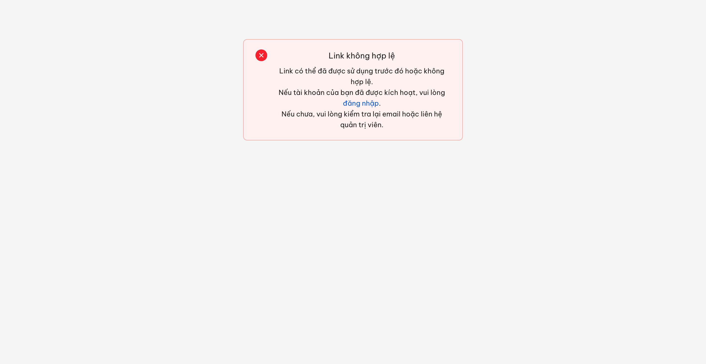
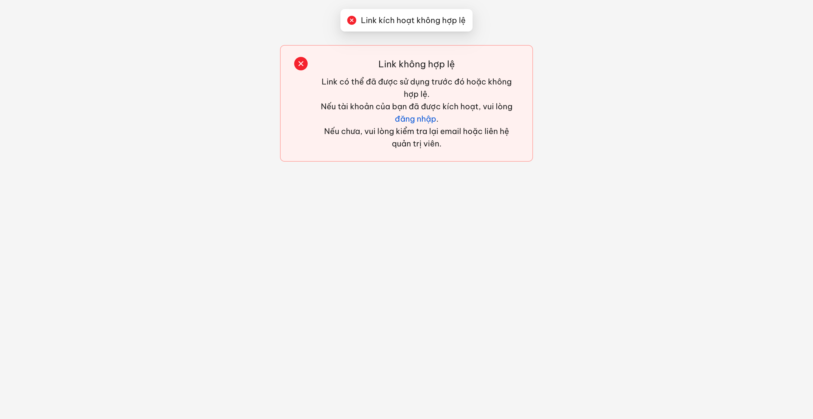

**Reverify R3 — 2026-08-25:**

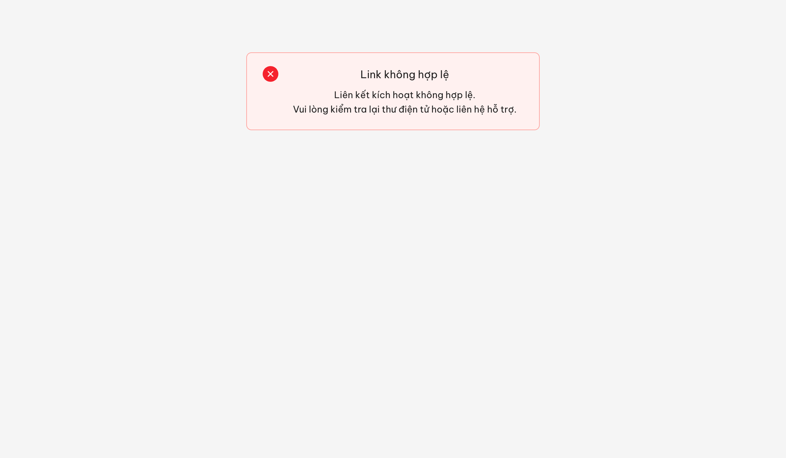


- Condition table: [`../cond/BUG-EM-DN-003.md`](../cond/BUG-EM-DN-003.md)
- Hai ảnh đối chứng có cùng SHA-256 `ab12f9ba341a8c815c56b9c3a7a96584cf5e0eec00e31c2bc8b7cb263311b539`, xác nhận UI không phân biệt hai tình huống.

**2. API response** — `POST /api/v1/auth/verify-email`, liên kết ĐÃ DÙNG (token `23ea167a-4603-446b-a076-1aef4b106685`), HTTP 400:

```json
{
  "success": false,
  "error": {
    "code": "ERR-AUTH-VIII-22-05",
    "message": "Link kích hoạt không hợp lệ",
    "timestamp": "2026-08-21T05:19:17.964Z"
  }
}
```

Liên kết SAI TOKEN (token `bd95e1ab-9d6e-46da-9362-367585e2375f`), cũng HTTP 400 — nội dung không khác:

```json
{
  "success": false,
  "error": {
    "code": "ERR-AUTH-VIII-22-05",
    "message": "Link kích hoạt không hợp lệ",
    "timestamp": "2026-08-21T05:17:20.831Z"
  }
}
```

---

## ~~BUG-EM-DN-004~~ [CLOSED] — Claim Flow ghi nhật ký là "Doanh nghiệp tự đăng ký", không tách được với luồng DN tự đăng ký mới

> **Re-test:** 2026-08-25 10:26:54 R3 — ✅ PASS (Closed-verified). Đối chiếu Claim post-fix của MST 0127000002: API audit trả hanhDong=DN_CLAIM và UI Nhật ký hiển thị “Doanh nghiệp nhận lại quyền truy cập (Claim)”, đã tách khỏi SELF_REGISTER_DN.

### Mô tả

Khi doanh nghiệp đã có hồ sơ sẵn trên hệ thống nhưng chưa có tài khoản, dùng chức năng Quên mật khẩu với mã số thuế của mình, hệ thống tạo tài khoản mới và gắn vào hồ sơ cũ đúng như đặc tả. Nhưng dòng nhật ký sinh ra cho thao tác này lại mang loại thao tác "Doanh nghiệp tự đăng ký" — trùng đúng loại thao tác của luồng doanh nghiệp tự đăng ký tài khoản mới. Kết quả là khi tra nhật ký, không phân biệt được hai luồng nghiệp vụ khác nhau: một bên doanh nghiệp tự khai hồ sơ mới, một bên nhận lại quyền truy cập hồ sơ do cán bộ hoặc cổng dịch vụ công tạo trước đó.

### Các bước tái hiện

1. Đăng nhập `cbnv_tw_01` (vai trò CB Nghiệp vụ Trung ương, có quyền tạo hồ sơ doanh nghiệp) và tạo một doanh nghiệp mới có email liên hệ hợp lệ — ví dụ mã số thuế `0100000301`, email `diupt01+uat-em-dn-claim-01@gmail.com`. Kiểm `GET /api/v1/tai-khoan?search=0100000301` cho `total = 0` để chắc chắn hồ sơ chưa có tài khoản.
2. Đăng xuất. Mở `https://18.143.165.120.nip.io/auth/forgot-password`, nhập đúng mã số thuế `0100000301` vào ô "Email hoặc Mã số thuế" rồi bấm **Gửi link đặt lại mật khẩu**.
3. Kiểm `GET /api/v1/tai-khoan?search=0100000301` — hệ thống đã tạo 1 tài khoản mới `username = 0100000301`, trạng thái Chờ kích hoạt, vai trò DN.
4. Đăng nhập `admin` (vai trò QTHT — theo menu **Quản trị hệ thống → Nhật ký hệ thống**), mở màn hình Nhật ký hệ thống và tìm dòng nhật ký của tài khoản vừa tạo tại đúng mốc thời gian ở bước 2.
5. Đọc cột **Loại thao tác** của dòng đó.

### Kết quả mong đợi

- Theo `srs-fr-10-quan-tri.md:1333` (FR-VIII-26 §Processing bước 16), nhánh Claim Flow phải được ghi nhật ký bằng một loại thao tác riêng dành cho việc doanh nghiệp nhận lại quyền truy cập hồ sơ đã có (`DN_CLAIM`), tách khỏi loại thao tác của luồng tự đăng ký và của reset mật khẩu thông thường.
- Nhánh Claim Flow được `srs-fr-10-quan-tri.md:1320` (bước 4b) định nghĩa là một nhánh xử lý khác hẳn FR-VIII-22: hồ sơ doanh nghiệp đã tồn tại từ trước do cán bộ hoặc cổng tạo, hệ thống chỉ tạo tài khoản và gắn vào hồ sơ cũ — nên nhật ký phải phản ánh đúng bản chất này để tra soát được.

### Kết quả thực tế

- Dòng nhật ký lúc 21/08/2026 12:23:27 cho tài khoản `62ec71a5-ce45-4203-897b-7b4976b4395f` (`username = 0100000301`) hiển thị Loại thao tác **"Doanh nghiệp tự đăng ký"**, đúng bằng loại thao tác của luồng FR-VIII-22.
- Đọc thẳng `GET /api/v1/audit-logs?entityId=62ec71a5-ce45-4203-897b-7b4976b4395f` trả về đúng 3 dòng với `hanhDong` lần lượt là `SELF_REGISTER_DN`, `PASSWORD_CHANGE`, `ACTIVATE_ACCOUNT` — không có dòng nào mang loại thao tác riêng của Claim Flow.
- Doanh nghiệp `0100000301` chưa từng dùng màn hình đăng ký `/register/doanh-nghiep`; hồ sơ DN-01-0004 do `cbnv_tw_01` tạo lúc 12:23:01, trước thời điểm nhật ký ghi "tự đăng ký" 26 giây.

### Bằng chứng

**1. Ảnh chụp**:

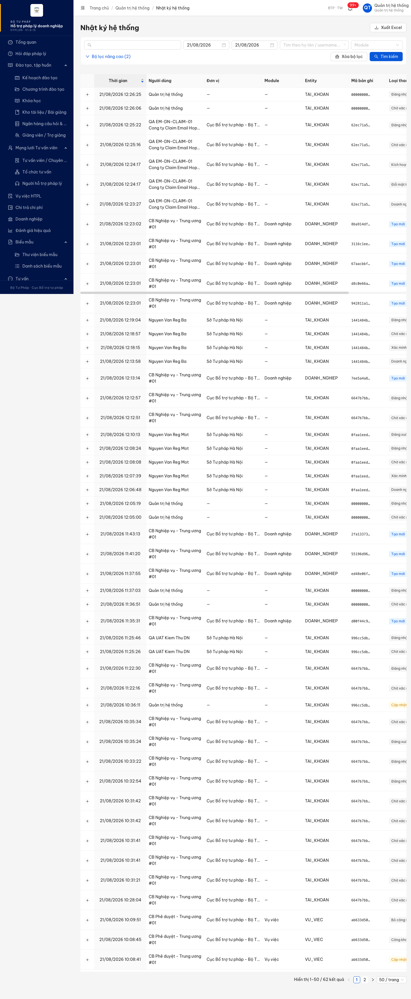

**Reverify R3 — 2026-08-25:**

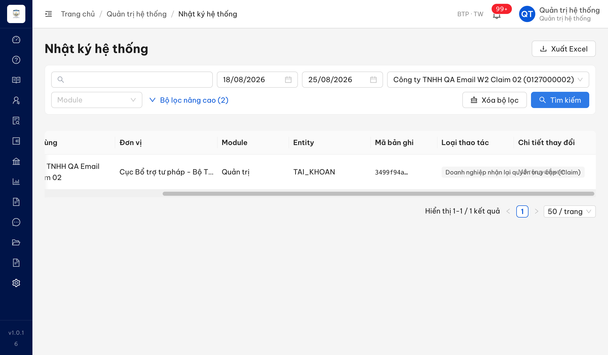

- Condition table: [`../cond/BUG-EM-DN-004.md`](../cond/BUG-EM-DN-004.md)
- API audit: id `87e170a4-7541-4984-b71d-dc4ff39c2476`, `hanhDong = DN_CLAIM`, tài khoản `0127000002`, thời gian `2026-08-24T10:53:35.825Z`.

**2. API response** — `GET /api/v1/audit-logs?entityId=62ec71a5-ce45-4203-897b-7b4976b4395f`, trích cột thời gian và hành động:

```text
2026-08-21T05:24:17.817Z | ACTIVATE_ACCOUNT | TAI_KHOAN
2026-08-21T05:24:17.816Z | PASSWORD_CHANGE  | TAI_KHOAN
2026-08-21T05:23:27.218Z | SELF_REGISTER_DN | TAI_KHOAN
```

---

## ~~BUG-EM-DN-005~~ [CLOSED] — Xin lại liên kết đặt mật khẩu lần thứ hai không phát sinh thư nào, màn hình vẫn báo đã gửi

> **Re-test:** 2026-08-25 10:30:00 R3 — ✅ PASS (Closed-verified). Tài khoản CHO_KICH_HOAT 0127000002 nhận thư kích hoạt gửi lại riêng với token mới; bản ghi tăng version 2.

**Bằng chứng R3:** thư đầu lúc `2026-08-24T10:53:35.885Z`, thư gửi lại lúc `10:57:23.991Z`, token gửi lại `cc0c2cbf-baae-4afe-9baa-9bded7eac625`. Xem [MailHog có đủ hai thư](image/bug-em-dn-005-r3-mailhog-two-activation-mails-2026-08-25.png) và [condition table](../cond/BUG-EM-DN-005.md).

### Mô tả

Doanh nghiệp dùng chức năng "Quên mật khẩu" với mã số thuế của mình. Lần đầu tiên hệ thống gửi thư kèm liên kết đặt mật khẩu đúng như đặc tả. Nhưng từ lần thứ hai trở đi, cùng tài khoản đó bấm gửi lại thì màn hình vẫn hiện thông báo đã gửi liên kết, còn thực tế hệ thống không gửi bất kỳ thư nào và cũng không sinh liên kết mới — bản ghi tài khoản giữ nguyên phiên bản và ngày cập nhật.

Hệ quả nghiệp vụ: doanh nghiệp nào không nhận được thư lần đầu (thư vào hòm thư không truy cập được, địa chỉ liên hệ trong hồ sơ đã cũ, thư bị mất) thì không còn cách nào tự xin lại liên kết. Đây cũng chính là đường thoát mà đặc tả dành cho tình huống email doanh nghiệp không khả dụng: cán bộ xác minh giấy đăng ký kinh doanh rồi cập nhật email doanh nghiệp, sau đó doanh nghiệp làm lại "Quên mật khẩu" — nhưng bước cuối này không tạo ra thư nào nên đường thoát đó không đi được đến cùng.

Hiện tượng không phải do chạm giới hạn tần suất: mọi lần thử đều trả HTTP 200 kèm `x-ratelimit-remaining` còn 1-2 lượt, không có mã lỗi nào và không có phản hồi 429.

### Các bước tái hiện

1. Đăng nhập `cbnv_tw_01` (CB Nghiệp vụ Trung ương) tạo hồ sơ doanh nghiệp mã số thuế `0100000305`, email liên hệ `bounce-claim05@example.invalid`. Kiểm `GET /api/v1/tai-khoan?search=0100000305` cho `total = 0`.
2. Ghi số thư trong MailHog trước khi test.
3. Mở `https://18.143.165.120.nip.io/auth/forgot-password`, nhập `0100000305`, bấm **Gửi link đặt lại mật khẩu**. Hệ thống tạo tài khoản `username = 0100000305` trạng thái Chờ kích hoạt và gửi 1 thư kèm liên kết đặt mật khẩu lần đầu tới `bounce-claim05@example.invalid` — đến đây đúng đặc tả.
4. Đăng nhập lại `cbnv_tw_01`, sửa email liên hệ của hồ sơ doanh nghiệp `0100000305` thành `diupt01+uat-em-dn-claim-05-new@gmail.com` (mô phỏng đúng bước cán bộ cập nhật email sau khi xác minh giấy đăng ký kinh doanh).
5. Quay lại `/auth/forgot-password`, nhập lại `0100000305`, bấm **Gửi link đặt lại mật khẩu** lần thứ hai. Đọc thông báo trên màn hình.
6. Chờ 30 giây rồi đếm lại số thư trong MailHog cho cả hai địa chỉ cũ và mới. Kiểm lại lần nữa sau đó.
7. Chờ hết cửa sổ giới hạn tần suất (`x-ratelimit-reset` 60 giây) rồi lặp lại bước 5-6 thêm một lần nữa.

### Kết quả mong đợi

- Theo `srs-fr-10-quan-tri.md:1322` và `:1323` (FR-VIII-26 §Processing bước 5 và 6), khi tra thấy tài khoản hợp lệ và tài khoản không ở trạng thái tạm khóa hay vô hiệu hóa, hệ thống phải sinh token đặt lại mật khẩu rồi gửi thư kèm liên kết chứa token đó tới hộp thư của tài khoản. Đặc tả không mô tả bất kỳ điều kiện nào cho phép bỏ qua việc gửi thư khi người dùng yêu cầu lại.
- Theo `srs-fr-10-quan-tri.md:1347` (FR-VIII-26 §Error Handling E7-NEW), cách xử lý chính thức khi email lưu trong hồ sơ doanh nghiệp không khả dụng là: doanh nghiệp liên hệ hỗ trợ → cán bộ nghiệp vụ xác minh giấy đăng ký kinh doanh thủ công → cập nhật email doanh nghiệp → doanh nghiệp làm lại "Quên mật khẩu". Vì vậy sau khi email đã được cập nhật, thao tác "Quên mật khẩu" lặp lại phải đưa được liên kết đặt mật khẩu tới doanh nghiệp.
- Nếu hệ thống có chủ đích không gửi lại trong một số tình huống thì màn hình không được báo là đã gửi, vì người dùng sẽ ngồi chờ một thư không bao giờ đến.

### Kết quả thực tế

- Lần gửi thứ hai lúc 21/08/2026 05:41:41 UTC: `POST /api/v1/auth/forgot-password` trả HTTP 200, `x-ratelimit-remaining: 1` (không bị chặn tần suất), màn hình hiện "Yêu cầu đã được gửi — Nếu 0100000305 khớp với một tài khoản trong hệ thống, link đặt lại mật khẩu sẽ được gửi đến email tương ứng. Link có hiệu lực trong 30 phút." Sau 32 giây và kiểm lại lần hai ở giây thứ 91: tổng số thư MailHog giữ nguyên 2491, địa chỉ cũ vẫn đúng 1 thư (thư của lần gửi đầu), địa chỉ mới 0 thư.
- Lần gửi thứ ba lúc 05:46:17 UTC, sau khi cửa sổ giới hạn tần suất đã reset (`x-ratelimit-remaining: 2`): vẫn HTTP 200, chờ 41 giây, tổng số thư MailHog giữ nguyên 2493, địa chỉ cũ 1 thư, địa chỉ mới 0 thư.
- Bản ghi tài khoản `7e79b0c8-5e87-41cf-a9ee-cc7915264ec7` sau cả hai lần gửi lại vẫn ở `version` 1 với `ngayCapNhat` bằng đúng `ngayTao` (05:40:42.265Z) — không có token mới nào được sinh ra. Nhật ký của tài khoản này cũng chỉ có đúng 1 dòng lúc 05:40:42.
- Không phải hiện tượng riêng của một bản ghi: lặp lại trên tài khoản `0100000304` lúc 05:47:22 (thư lần đầu đã gửi lúc 05:33:52, cách 13 phút 30 giây) cũng không phát sinh thư nào sau 36 giây. Trên tài khoản `0100000306` đã kích hoạt, ba lần xin lại lúc 05:49:00, 05:49:53 và 05:54:57 đều không phát sinh thư, trong khi lần xin lúc 05:48:10 trước đó thì thư về ngay sau 1 giây — nghĩa là lần đầu gửi được, các lần sau im lặng.
- Kèm theo, việc cán bộ cập nhật email liên hệ của hồ sơ doanh nghiệp không làm thay đổi địa chỉ nhận thư của tài khoản: sau bước 4, hồ sơ doanh nghiệp `DN-01-0007` đã sang `diupt01+uat-em-dn-claim-05-new@gmail.com` (version 2) nhưng tài khoản `0100000305` vẫn giữ `bounce-claim05@example.invalid`.

### Bằng chứng

**1. Ảnh chụp** — màn hình báo "Yêu cầu đã được gửi" ở lần gửi thứ hai, trong khi MailHog không nhận thêm thư nào:

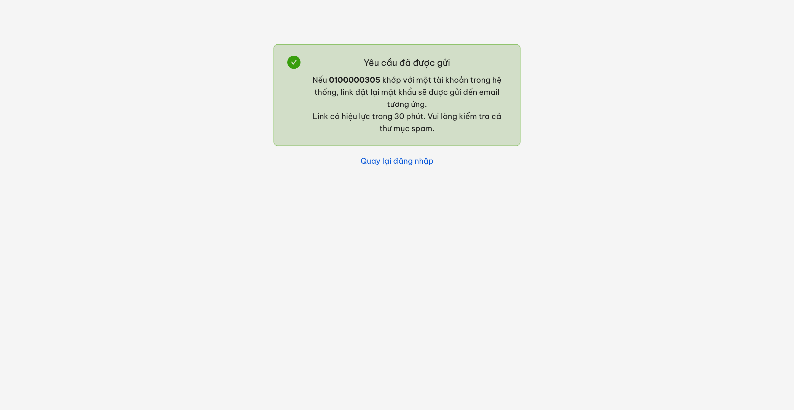

**2. Đối chiếu MailHog trước/sau từng lần gửi** (đếm theo địa chỉ nhận, chờ tối thiểu 30 giây sau mỗi lần bấm):

```text
thời điểm (UTC)  thao tác                                   tổng thư MailHog  bounce-claim05@example.invalid  diupt01+uat-em-dn-claim-05-new@gmail.com
05:40:26         trước lần gửi 1                            2490              0                               0
05:41:01         sau lần gửi 1 (05:40:41)                   2491              1                               0
05:41:38         trước lần gửi 2                            2491              1                               0
05:42:18         sau lần gửi 2 (05:41:41) + 32 giây         2491              1                               0
05:43:12         kiểm lại lần hai, 91 giây sau lần gửi 2    2491              1                               0
05:46:17         trước lần gửi 3                            2493              1                               0
05:46:58         sau lần gửi 3 + 41 giây                    2493              1                               0
```

**3. Trạng thái bản ghi** — `GET /api/v1/tai-khoan/7e79b0c8-5e87-41cf-a9ee-cc7915264ec7` sau cả ba lần gửi:

```json
{"username": "0100000305", "email": "bounce-claim05@example.invalid", "trangThai": "CHO_KICH_HOAT", "version": 1, "ngayTao": "2026-08-21T05:40:42.265Z", "ngayCapNhat": "2026-08-21T05:40:42.265Z"}
```

**4. Đối chứng trên tài khoản khác** — `0100000306` (đã kích hoạt, trạng thái Hoạt động):

```text
05:48:10  xin lại lần 1  -> thư "Đặt lại mật khẩu" về lúc 05:48:10.46
05:49:00  xin lại lần 2  -> không có thư (kiểm lúc 05:49:36)
05:49:53  xin lại lần 3  -> không có thư (kiểm lúc 05:50:29)
05:54:57  xin lại lần 4  -> không có thư (kiểm lúc 05:55:33), x-ratelimit-remaining 2
```


## ~~BUG-EM-DN-006~~ [CLOSED] — Xóa trống ô Email trên form Chỉnh sửa DN: hệ thống xác nhận và báo lưu thành công nhưng giá trị cũ vẫn còn

> **Re-test:** 2026-08-25 10:33:43 R3 — ✅ PASS (Closed-verified). cbnv_hn xóa Email qua UI; API trả email=null, version 7→8; tải lại form Email vẫn trống.

**Bằng chứng R3:** đăng nhập `cbnv_hn`, xóa Email của `DN-HNI-0001`; API trả `email = null`, `version = 8`, `ngayCapNhat = 2026-08-25T03:32:20.946Z`; reload không cache vẫn trống. Xem [ảnh sau tải lại](image/bug-em-dn-006-r3-email-cleared-after-reload-2026-08-25.png) và [condition table](../cond/BUG-EM-DN-006.md).

### Mô tả

Trên màn Chi tiết/Chỉnh sửa doanh nghiệp, cán bộ nghiệp vụ xóa trống ô **Email** (trường tùy chọn) rồi bấm **Lưu**. Hệ thống mở hộp "Xác nhận thay đổi" ghi rõ một dòng `Email: <địa chỉ cũ> → —`, sau khi xác nhận thì hiện thông báo "Cập nhật doanh nghiệp thành công". Nhưng tải lại hồ sơ thì ô Email vẫn giữ nguyên địa chỉ cũ, `GET /api/v1/doanh-nghieps/{id}` cũng trả về địa chỉ cũ và `ngayCapNhat` không đổi. Người dùng không nhận được bất kỳ cảnh báo nào nên tin rằng email liên hệ đã bị gỡ, trong khi hệ thống vẫn tiếp tục dùng địa chỉ cũ để liên hệ. Đã tái hiện 2 lần liên tiếp, và kiểm chéo bằng phương pháp thứ hai (gọi thẳng API cập nhật với `email` = rỗng) cho thấy nghiệp vụ xóa email vẫn thực hiện được ở tầng dịch vụ, nên khác biệt nằm ở đường đi qua màn hình.

### Các bước tái hiện

1. Đăng nhập `cbnv_hn` — vai trò **CB_NV_DP** (Sở Tư pháp Hà Nội), có quyền CRUD doanh nghiệp trong phạm vi tỉnh của đơn vị theo `SCR-V.III-02 §Quyền truy cập` (srs-fr-07-doanh-nghiep.md:461). Lấy mã xác thực trong MailHog tại `diupt01+cb-nv-dn@gmail.com`.
2. Mở `/doanh-nghiep/829abcac-b0af-4cde-9af9-ec51bc79014c/sua` (DN-HNI-0001, MST `0109998887`). Ghi lại ô **Email** đang là `diupt01+dn-contact@gmail.com`.
3. Bấm nút xóa nhanh trong ô **Email** để ô rỗng hoàn toàn. Các trường bắt buộc khác (Tên DN, MST, Loại DN, Quy mô, Ngành nghề, Người đại diện, Địa chỉ, Tỉnh/Thành phố) giữ nguyên và vẫn hợp lệ.
4. Bấm **Lưu** → hệ thống mở hộp "Xác nhận thay đổi" với đúng một dòng: `Email` — Giá trị cũ `diupt01+dn-contact@gmail.com`, Giá trị mới `—`.
5. Bấm **Lưu thay đổi** → hiện thông báo "Cập nhật doanh nghiệp thành công", hộp thoại đóng lại, không có cảnh báo hay lỗi nào.
6. Tải lại trang `/doanh-nghiep/829abcac-b0af-4cde-9af9-ec51bc79014c/sua` và đọc lại `GET /api/v1/doanh-nghieps/829abcac-b0af-4cde-9af9-ec51bc79014c`.
7. Quan sát: ô Email hiện lại `diupt01+dn-contact@gmail.com`; API trả `email` = `diupt01+dn-contact@gmail.com`; `ngayCapNhat` vẫn là mốc trước thao tác.

### Kết quả mong đợi

- Theo `FR-V.III-01 §Inputs row 15` (srs-fr-07-doanh-nghiep.md:114) `email` là trường **Bắt buộc = N** (tùy chọn) và theo Đối tượng dữ liệu DOANH_NGHIEP (srs-fr-07-doanh-nghiep.md:697) `email` cũng để **N** — nên trạng thái "không có email liên hệ" là giá trị hợp lệ của hồ sơ DN, và người dùng phải gỡ bỏ được giá trị đang có khi các trường bắt buộc khác vẫn hợp lệ.
- Theo `FR-V.III-01 §Processing — Chỉnh sửa` bước 1-2 (srs-fr-07-doanh-nghiep.md:135-136) hệ thống xác nhận dữ liệu đầu vào rồi **Cập nhật DOANH_NGHIEP**, và `§Postconditions` (srs-fr-07-doanh-nghiep.md:179) yêu cầu "Bản ghi DOANH_NGHIEP được tạo/cập nhật/xóa mềm" — nghĩa là sau khi thao tác lưu kết thúc thành công, bản ghi phải mang đúng dữ liệu vừa được xác nhận.
- `FR-V.III-01 §Error Handling` (srs-fr-07-doanh-nghiep.md:184-190) chỉ liệt kê 4 tình huống lỗi (tên DN trống, MST trùng, quy mô không phù hợp, xóa DN đang có vụ việc) — không có tình huống nào cho phép hệ thống bỏ qua thay đổi mà vẫn báo thành công. Nếu vì lý do nào đó không thể áp dụng thay đổi thì hệ thống phải báo cho người dùng biết thay vì báo thành công.

### Kết quả thực tế

- Hộp "Xác nhận thay đổi" khẳng định thay đổi `Email: diupt01+dn-contact@gmail.com → —`, sau đó thông báo "Cập nhật doanh nghiệp thành công".
- Sau khi tải lại: ô Email và `GET /api/v1/doanh-nghieps/{id}` đều trả về `diupt01+dn-contact@gmail.com`; `ngayCapNhat` không đổi (`2026-08-21T06:54:00.427Z`, tức mốc trước thao tác).
- Dữ liệu gửi đi trong thao tác lưu **không chứa khóa `email`** (đọc từ tab Network, 2 lần tái hiện đều giống nhau), nên phía dịch vụ hiểu là "không đụng tới trường này" và giữ nguyên giá trị cũ:
  `{"tenDoanhNghiep":"Cong ty TNHH QA UAT Kiem Thu","maSoThue":"0109998887","loaiDnId":"…","diaChi":"So 1 Pho Test, Ha Noi","tinhThanhId":"…","nganhNghe":"THUONG_MAI","nguoiDaiDien":"QA UAT Kiem Thu","quyMo":"NHO","tenVietTat":"QAUAT","soLaoDong":20,"soLaoDongNu":15,"laNuLamChu":false,"linhVucIds":[],"version":7}`
- Nhật ký thao tác cũng ghi nhận đây là bản cập nhật rỗng: bản ghi audit lúc `06:51:49` có `duLieuCu.email` và `duLieuMoi.email` **bằng nhau** (`diupt01+uat-em-dn-upd-02-shared@gmail.com`), tức không có thay đổi nào được ghi dù người dùng đã xác nhận thay đổi.
- Kiểm chéo bằng phương pháp thứ hai (gọi thẳng API cập nhật, cùng tài khoản `cbnv_hn`): gửi `email` = `null` → HTTP 200 và bản ghi về `email = null` (nghiệp vụ xóa email thực hiện được); gửi `email` = chuỗi rỗng `""` → HTTP 422 `ERR-VAL-SYS-00-01` "Email không hợp lệ". Như vậy khả năng gỡ email liên hệ vẫn tồn tại, chỉ riêng đường đi qua màn Chỉnh sửa là không tới đích.

### Bằng chứng

**1. Ảnh chụp**:

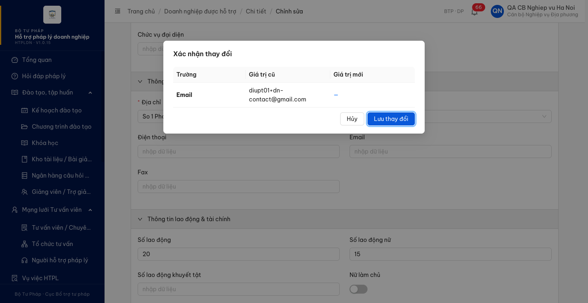
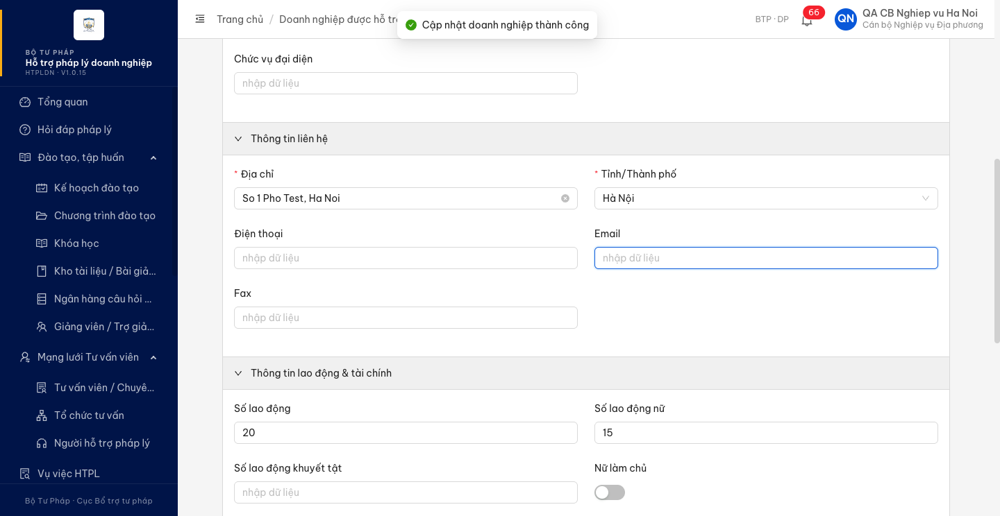
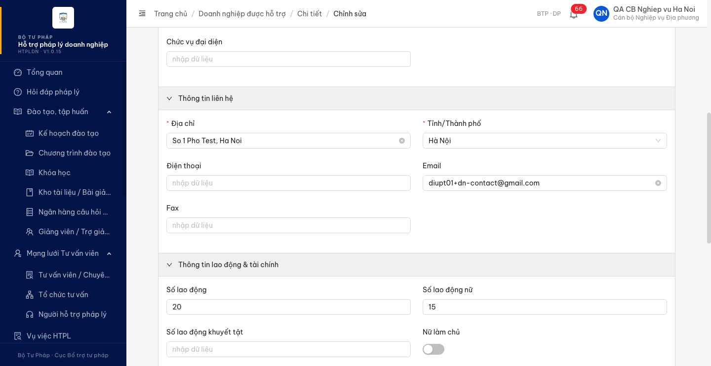
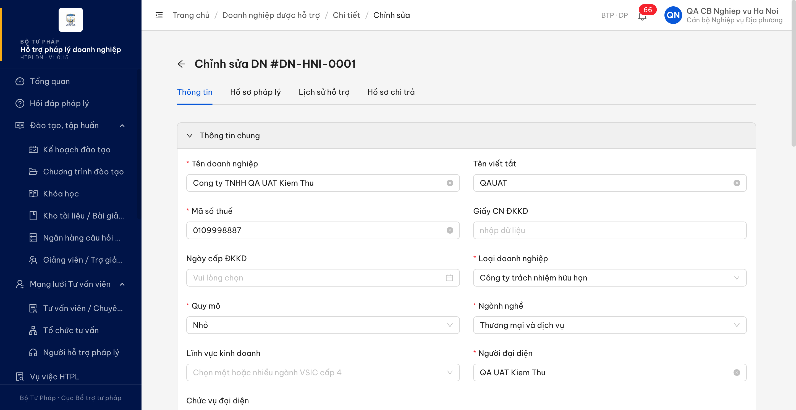

**2. API response / log**:

```json
// Đọc lại hồ sơ sau khi màn hình báo lưu thành công (giá trị cũ vẫn còn)
{"email": "diupt01+dn-contact@gmail.com", "version": 7, "ngayCapNhat": "2026-08-21T06:54:00.427Z"}

// Nhật ký thao tác của chính lần lưu đó — cũ và mới bằng nhau
{"hanhDong": "UPDATE", "thoiGian": "2026-08-21T06:51:49.307Z", "responseCode": 200,
 "duLieuCu.email": "diupt01+uat-em-dn-upd-02-shared@gmail.com",
 "duLieuMoi.email": "diupt01+uat-em-dn-upd-02-shared@gmail.com"}

// Kiểm chéo bằng API: gửi chuỗi rỗng bị từ chối, gửi null thì xóa được
{"success": false, "error": {"code": "ERR-VAL-SYS-00-01", "field": "email", "message": "Email không hợp lệ"}}   // email: ""
{"success": true,  "data": {"email": null, "version": 6}}                                                       // email: null
```

---
---

## Phụ lục — Môi trường test

| Thành phần | Giá trị |
|------------|---------|
| URL ứng dụng | https://18.143.165.120.nip.io |
| OTP login | Lấy trong MailHog theo địa chỉ người nhận của tài khoản |
| MailHog (OTP inbox) | http://18.143.165.120:8025 |
| API base | https://18.143.165.120.nip.io/api/v1 |
| Frontend | React + Ant Design v5 (HTPLDN · V1.0.15) |
| Xác thực | Đăng nhập + mã xác thực qua email |
| Tool test | Chrome DevTools MCP |

---

*Bug report generated: 2026-08-21 11:35:00 | QA Automation via Claude Code*
