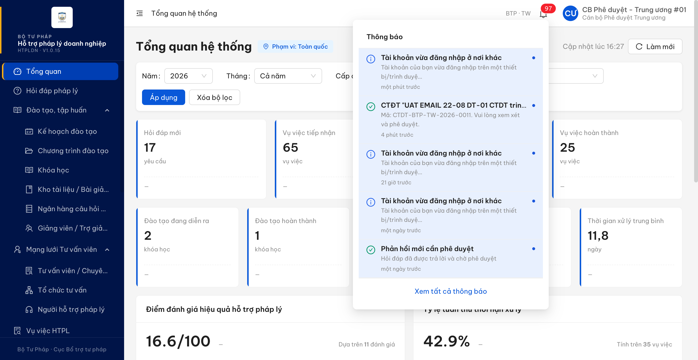
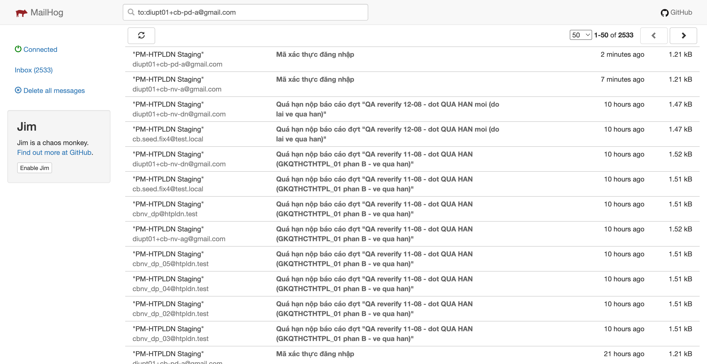
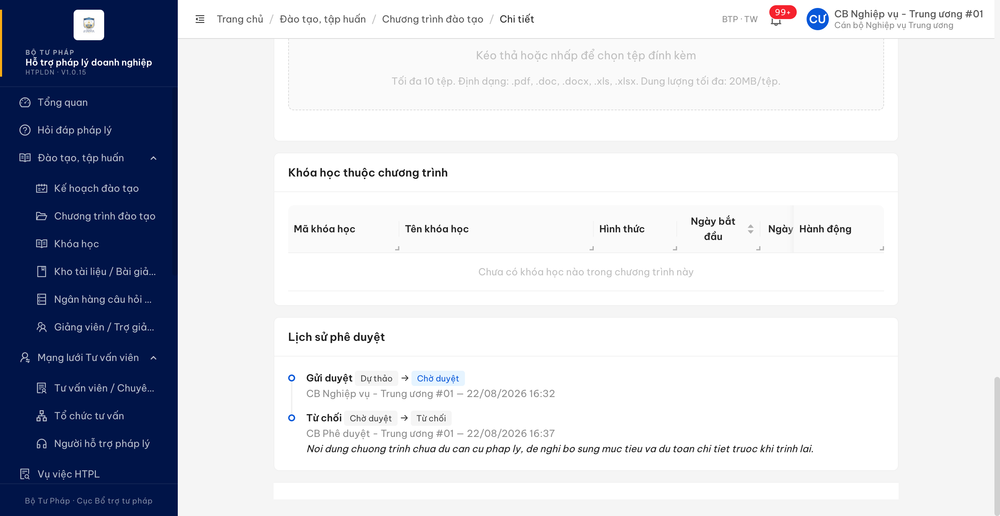
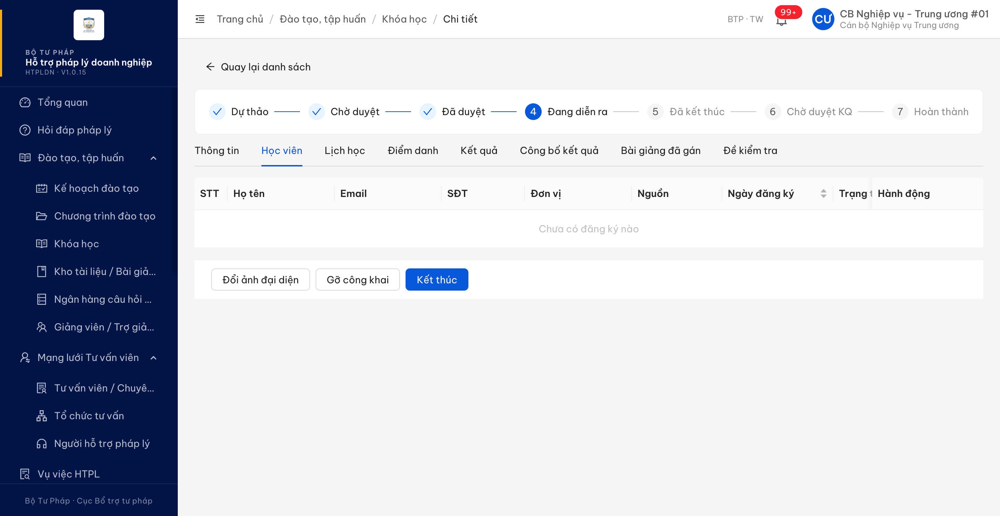
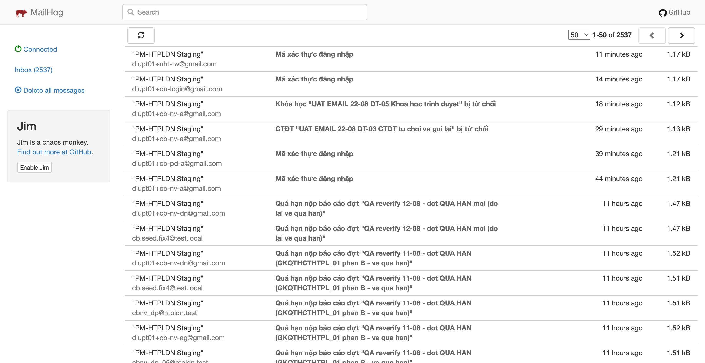
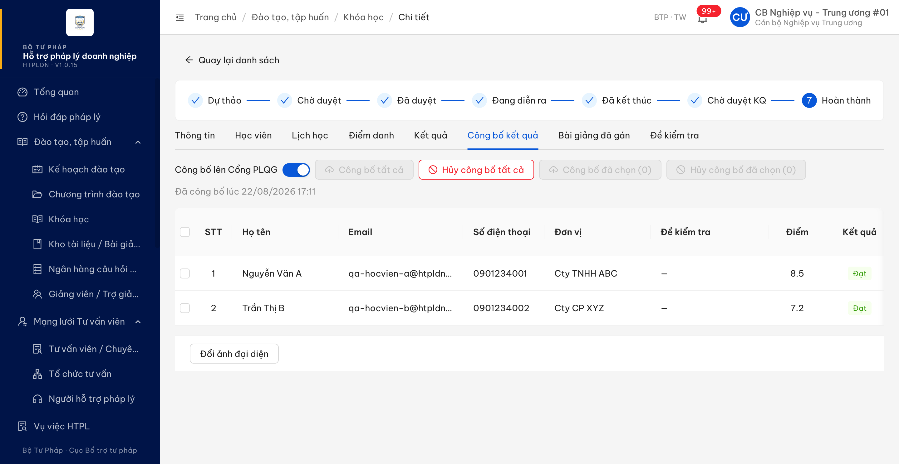
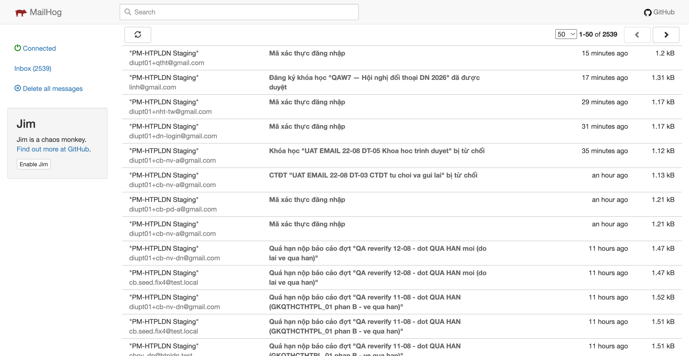

# Bug Report — Đào tạo, tập huấn (thông báo nghiệp vụ qua email)

| Thông tin | Giá trị |
|-----------|---------|
| **Dự án** | PM HTPLDN — UAT reverify email |
| **Môi trường** | https://18.143.165.120.nip.io (DEV, bản dựng V1.0.15) · MailHog http://18.143.165.120:8025 |
| **Người test** | QA Automation |
| **Ngày** | 2026-08-25 14:34:00 |
| **Loại test** | Workflow (thông báo email + in-app) |
| **Round** | Reverify email — File 03 Batch 2 (Đào tạo) |
| **Tài liệu tham chiếu** | [03-TC-email-notification-workflow.md](../03-TC-email-notification-workflow.md) · SRS v3.5 `Docs-PM-HTPLDN/_bmad-output/planning-artifacts/srs-v3.5/srs-fr-03-dao-tao.md` + `srs-v3.5.md` |

---

## Tổng hợp

Phát hiện **4** lỗi có tham chiếu đặc tả cụ thể khi chạy batch `EM-NOT-DT-*` / `EM-FLD-DT-*` trên DEV bằng MailHog. Ba lỗi cùng một biểu hiện — sự kiện chuyển trạng thái chạy đúng, thông báo trong ứng dụng có, nhưng không phát ra thư điện tử — trải trên ba nhóm người nhận khác nhau (cán bộ có tài khoản · giảng viên không có tài khoản · học viên không có tài khoản). Lỗi còn lại chặn hẳn một nhánh trạng thái của Chương trình đào tạo nên không có sự kiện để kiểm thư.

Kênh thư của môi trường **đang hoạt động**: trong cùng phiên, hai sự kiện từ chối (EM-NOT-DT-03, EM-NOT-DT-06) và một sự kiện duyệt đăng ký học (EM-NOT-DT-09) đều phát thư về đúng hộp thư trong dưới 1 giây, thư mã xác thực đăng nhập và thư nhắc quá hạn nộp báo cáo cũng về bình thường. Vì vậy các trường hợp thiếu thư dưới đây là thiếu theo từng sự kiện, không phải do máy chủ thư tắt.

> **Kết quả reverify R4 (2026-08-25):** `BUG-EM-DT-001` đã PASS khi kiểm đúng tài khoản người tạo và chạy fresh nhánh Khóa học. `BUG-EM-DT-004` giữ **Chờ BA**, chưa retest và không tính Reopen vì SRS chưa chốt rõ đích nhận thư.

### Severity breakdown

| Tổng | Critical | Major | Medium | Minor | Trivial | Closed | Open |
|------|----------|-------|--------|-------|---------|--------|------|
| 4    | 0        | 4     | 0      | 0     | 0       | 3      | 1    |

## Bug Summary Table

| Bug ID | Severity | Priority | Type | TC Ref | **SRS Reference** | Title | Status |
|--------|----------|----------|------|--------|-------------------|-------|--------|
| BUG-EM-DT-001 | Major | P1 | Workflow | EM-NOT-DT-01 · EM-NOT-DT-02 · EM-NOT-DT-05 | `srs-fr-03-dao-tao.md:195` (Gửi phê duyệt CTĐT → "Gửi thông báo CB PD cùng đơn vị") · `:205` (Phê duyệt CTĐT → "Gửi thông báo CB NV") · `:227` (Gửi phê duyệt Khóa học → "Gửi thông báo CB PD cùng đơn vị") · `srs-v3.5.md:5745` (BR-NOTIF-01 sự kiện 1 và 2, kênh "in-app + email") | Ba sự kiện trình duyệt và phê duyệt của Chương trình đào tạo / Khóa học chỉ sinh thông báo trong ứng dụng, không phát thư điện tử cho người nhận theo đặc tả | Closed |
| BUG-EM-DT-002 | Major | P1 | Workflow | EM-NOT-DT-04 | `srs-fr-03-dao-tao.md:192` (guard trạng thái CTĐT `IN ('DU_THAO','TU_CHOI')`) · `:195` · `srs-v3.5.md:6558` (SM-CTDT dòng `TU_CHOI → CHO_DUYET`) · `:5671` (BR-FLOW-04) · `:5745` (BR-NOTIF-01 sự kiện 4a) | Chương trình đào tạo đã bị từ chối không trình phê duyệt lại được: màn chi tiết không có thao tác nào, gọi thẳng dịch vụ trả lỗi "không thể gửi phê duyệt ở trạng thái hiện tại" | Closed |
| BUG-EM-DT-003 | Major | P1 | Workflow | EM-NOT-DT-08 | `srs-v3.5.md:5976` (SM-KHOAHOC dòng `DA_CONG_KHAI → DANG_DIEN_RA`, Action "Thông báo HV + GV") · `:5745` (BR-NOTIF-01 sự kiện 6 và quy định người nhận chưa có tài khoản chỉ gửi thư điện tử) | Khai giảng khóa học không phát thư cho giảng viên của khóa, trong khi giảng viên không có tài khoản nên thư điện tử là kênh duy nhất | Closed |
| BUG-EM-DT-004 | Major | P1 | Workflow | EM-NOT-DT-11 | `srs-fr-03-dao-tao.md:1433` (FR-III-19 Processing Công bố KQ bước 5 — "Tạo thông báo 'KQ đào tạo đã có' cho từng học viên (in-app + email theo TK doanh nghiệp / NHT đã đăng ký HV)") · `srs-v3.5.md:5745` (BR-NOTIF-01) | Công bố kết quả đào tạo: cần BA chốt người nhận là học viên hay tài khoản DN/NHT đã đăng ký học viên trước khi retest | Chờ BA |

---

## ~~BUG-EM-DT-001~~ [CLOSED] — Trình phê duyệt và phê duyệt Chương trình đào tạo / Khóa học: có thông báo trong ứng dụng nhưng không phát thư điện tử

> **Re-test:** 2026-08-25 14:34:00 R4 — ✅ PASS (Closed-verified). Đối chiếu đúng người tạo CTDT-BTP-TW-2026-0006 là cbnv_tw_02: API có in-app ID 7b963a3a... và MailHog có thư phê duyệt lúc 03:35:34.124Z. Chạy fresh nhánh Khóa học KH-20260822-001: DU_THAO→CHO_DUYET, CBPD có in-app ID 23544ae7... và email lúc 07:32:54.792Z.

**Bằng chứng R4:** QA đã sửa đúng dữ liệu người nhận theo hồ sơ. Người tạo `CTDT-BTP-TW-2026-0006` là `cbnv_tw_02` (`diupt01+cb-nv-a-2@gmail.com`), không phải `cbnv_tw_01`. API của đúng người tạo có thông báo ID `7b963a3a-aa1a-4828-aca9-0ea4e47b73d4`; MailHog có thư phê duyệt lúc `2026-08-25T03:35:34.179Z`. Chạy fresh vế Khóa học với `KH-20260822-001` lúc `07:32:54Z`: hồ sơ chuyển `DU_THAO → CHO_DUYET`, CBPD có in-app ID `23544ae7-5539-486d-895b-4c992e39a3c9`, MailHog tăng `55 → 56` và có thư cùng sự kiện tới `diupt01+cb-pd-a@gmail.com`. Xem [condition table](../cond/BUG-EM-DT-001.md).

### Mô tả

Ba sự kiện chuyển trạng thái của nhóm Đào tạo — **Gửi phê duyệt Chương trình đào tạo**, **Phê duyệt Chương trình đào tạo**, **Gửi phê duyệt Khóa học** — chuyển trạng thái đúng và sinh đúng thông báo trên chuông cho người nhận, nhưng **không phát ra thư điện tử nào**. Kho thư MailHog của môi trường không tăng thêm bản ghi nào sau khi chờ hơn 5 phút, cho cả hộp thư của người nhận lẫn toàn bộ các hộp thư khác. Trong cùng phiên và chỉ cách vài phút, hai sự kiện **từ chối** trên chính hai hồ sơ này vẫn phát thư bình thường, nên kênh thư của môi trường đang bật.

### Các bước tái hiện

1. Đăng nhập `cbnv_tw_01` (vai trò `CB_NV_TW`, đơn vị *Cục Bổ trợ tư pháp — Bộ Tư pháp*, có quyền tạo và trình duyệt Chương trình đào tạo / Khóa học theo SCR-III-01, SCR-III-02).
2. Ghi lại mốc thời gian và đếm số thư hiện có trong MailHog cho hộp thư Cán bộ Phê duyệt cùng đơn vị (`cbpd_tw_01` = `diupt01+cb-pd-a@gmail.com`) và hộp thư người tạo (`cbnv_tw_01` = `diupt01+cb-nv-a@gmail.com`), kèm tổng số thư của cả kho.
3. **Vế 1 — Gửi phê duyệt CTĐT:** mở Chương trình đào tạo `CTDT-BTP-TW-2026-0011` ở trạng thái *Dự thảo* → bấm **Gửi phê duyệt**. Hồ sơ chuyển sang *Chờ duyệt* lúc 09:24:28Z.
4. **Vế 2 — Phê duyệt CTĐT:** đăng nhập `cbpd_tw_01` (vai trò `CB_PD_TW`, cùng đơn vị, có quyền phê duyệt), mở chính hồ sơ đó → bấm **Phê duyệt**. Hồ sơ chuyển sang *Đã duyệt* lúc 09:30:16Z.
5. **Vế 3 — Gửi phê duyệt Khóa học:** quay lại `cbnv_tw_01`, mở Khóa học `KH-20260822-001` ở trạng thái *Dự thảo* (đã đủ giảng viên + lịch học) → bấm **Gửi phê duyệt**. Hồ sơ chuyển sang *Chờ duyệt* lúc 09:43:19Z.
6. Sau mỗi vế, chờ tối thiểu 5 phút rồi đếm lại số thư trong MailHog theo từng địa chỉ ở bước 2 và đếm tổng số thư của cả kho.
7. Đăng nhập tài khoản người nhận tương ứng, mở chuông thông báo và gọi `GET /api/v1/thong-baos` để đối chiếu.

### Kết quả mong đợi

- Theo `srs-fr-03-dao-tao.md:195`, khi Cán bộ Nghiệp vụ gửi phê duyệt Chương trình đào tạo, hệ thống phải gửi thông báo cho Cán bộ Phê duyệt cùng đơn vị.
- Theo `srs-fr-03-dao-tao.md:205`, khi Cán bộ Phê duyệt duyệt Chương trình đào tạo, hệ thống phải gửi thông báo cho người tạo Chương trình đào tạo.
- Theo `srs-fr-03-dao-tao.md:227`, khi Cán bộ Nghiệp vụ gửi phê duyệt Khóa học, hệ thống phải gửi thông báo cho Cán bộ Phê duyệt cùng đơn vị.
- Theo `srs-v3.5.md:5745` (BR-NOTIF-01), cả ba sự kiện trên đều nằm trong nhóm sự kiện (1) *Trình phê duyệt* và (2) *Phê duyệt*, và quy tắc ghi rõ **"Kênh: in-app + email"** — nghĩa là thông báo phải đi qua **cả hai** kênh, không được chỉ có một.

### Kết quả thực tế

- Cả ba vế đều chuyển trạng thái đúng và **có** thông báo trong ứng dụng cho đúng người nhận (kiểm bằng chuông và bằng `GET /api/v1/thong-baos`).
- **Không có thư điện tử nào** được phát ra ở cả ba vế:
  - Vế 1: đếm từ 09:24:20Z, chờ hơn 5 phút — số thư tới `diupt01+cb-pd-a@gmail.com` chênh **0**; thư duy nhất xuất hiện trong cửa sổ là thư mã xác thực đăng nhập do chính thao tác đăng nhập sinh ra.
  - Vế 2: cửa sổ 09:29:50Z–09:35:21Z — số thư tới `diupt01+cb-nv-a@gmail.com` chênh **0**.
  - Vế 3: cửa sổ 09:43:05Z–09:49:12Z — số thư tới `diupt01+cb-pd-a@gmail.com` chênh **0**; thư duy nhất trong cửa sổ là thư *từ chối khóa học* của ca EM-NOT-DT-06 (bằng chứng kênh thư vẫn chạy).

### Bằng chứng

**1. Ảnh chụp**:




**2. Đối chứng kênh thư trong cùng phiên** — hai sự kiện *từ chối* trên chính hai hồ sơ này phát thư bình thường:

```
2026-08-22T09:37:04Z  To: diupt01+cb-nv-a@gmail.com
  Subject: CTĐT "UAT EMAIL 22-08 DT-03 CTDT tu choi va gui lai" bị từ chối
2026-08-22T09:48:17Z  To: diupt01+cb-nv-a@gmail.com
  Subject: Khóa học "UAT EMAIL 22-08 DT-05 Khoa hoc trinh duyet" bị từ chối
```

---

## ~~BUG-EM-DT-002~~ [CLOSED] — Chương trình đào tạo đã bị từ chối không trình phê duyệt lại được, cả trên giao diện lẫn qua dịch vụ

> **Re-test:** 2026-08-25 10:38:18 R3 — ✅ PASS (Closed-verified). CTDT 0012 hiện nút Gửi phê duyệt lại, chuyển TU_CHOI→CHO_DUYET và phát email CBPD.

**Bằng chứng R3:** `CTDT-BTP-TW-2026-0012` từ trạng thái Từ chối đã hiện nút “Gửi phê duyệt lại”, chuyển thành công sang Chờ duyệt và phát thư CBPD lúc `03:37:33.426Z`. Xem [ảnh sau gửi lại](image/bug-em-dt-002-r3-resubmitted-2026-08-25.png) và [condition table](../cond/BUG-EM-DT-002.md).

### Mô tả

Chương trình đào tạo ở trạng thái **Từ chối** không có đường quay lại luồng duyệt: màn chi tiết của Cán bộ Nghiệp vụ tạo hồ sơ không hiện thao tác **Sửa** hay **Gửi phê duyệt**, ngoài danh sách cũng chỉ còn **Xem**. Gọi thẳng dịch vụ trình phê duyệt thì bị từ chối vì trạng thái. Hệ quả nghiệp vụ: hồ sơ bị từ chối trở thành ngõ cụt, Cán bộ Nghiệp vụ buộc phải tạo hồ sơ mới; đồng thời không có sự kiện `TU_CHOI → CHO_DUYET` nào phát sinh nên nhánh thông báo gửi lại cũng không kiểm được.

### Các bước tái hiện

1. Đăng nhập `cbnv_tw_01` (vai trò `CB_NV_TW`, đơn vị *Cục Bổ trợ tư pháp — Bộ Tư pháp*, là **người tạo** hồ sơ, có quyền sửa và trình duyệt Chương trình đào tạo theo SCR-III-01).
2. Chuẩn bị hồ sơ: tạo Chương trình đào tạo `CTDT-BTP-TW-2026-0012`, gửi phê duyệt; đăng nhập `cbpd_tw_01` từ chối kèm lý do (hồ sơ chuyển **Từ chối** lúc 09:37:04Z, thư từ chối về đúng người tạo).
3. Quay lại `cbnv_tw_01`, mở màn chi tiết chính hồ sơ đó → quan sát toàn bộ nút thao tác trên màn và trên dòng danh sách.
4. Kiểm chứng bằng đường thứ hai: gọi `POST /api/v1/chuong-trinh-dao-taos/{id}/submit` với phiên của người tạo.

### Kết quả mong đợi

- Theo `srs-v3.5.md:6558` (bảng chuyển trạng thái SM-CTDT), tồn tại chuyển tiếp `TU_CHOI → CHO_DUYET` với trigger *"CB NV gửi phê duyệt lại"*, guard *"Đã sửa (updated_at > thoi_gian_tu_choi)"*, action *"TB CB PD; clear ly_do_tu_choi"*.
- Theo `srs-fr-03-dao-tao.md:192`, guard của thao tác Gửi phê duyệt kiểm trạng thái Chương trình đào tạo **`IN ('DU_THAO', 'TU_CHOI')`** — tức trạng thái Từ chối nằm trong tập được phép trình lại.
- Theo `srs-v3.5.md:5745` (BR-NOTIF-01 sự kiện 4a), sự kiện gửi phê duyệt lại `TU_CHOI → CHO_DUYET` của Chương trình đào tạo phải phát thông báo cho Cán bộ Phê duyệt.
- Vậy hệ thống phải cho người tạo sửa và trình phê duyệt lại hồ sơ đang ở trạng thái Từ chối, và phát thông báo tương ứng.

### Kết quả thực tế

- Màn chi tiết hồ sơ ở trạng thái **Từ chối** không có nút **Sửa** cũng không có nút **Gửi phê duyệt**; ngoài danh sách dòng hồ sơ chỉ còn thao tác **Xem**.
- Gọi thẳng dịch vụ trả lỗi:

```json
{
  "success": false,
  "error": {
    "code": "ERR-STATE-III-02-01",
    "message": "Không thể gửi phê duyệt ở trạng thái hiện tại (TU_CHOI)"
  }
}
```

- Không có chuyển trạng thái nào xảy ra, do đó cũng không có thông báo trong ứng dụng và không có thư điện tử nào — nhánh thông báo gửi lại không kiểm được.

### Bằng chứng

**1. Ảnh chụp**:



**2. Phản hồi dịch vụ**: `POST /api/v1/chuong-trinh-dao-taos/71bf7b5c-9f55-484b-9ef6-ea556ade58cc/submit` → HTTP 409, mã lỗi `ERR-STATE-III-02-01` (nội dung như trên).

---

## ~~BUG-EM-DT-003~~ [CLOSED] — Khai giảng khóa học không phát thư cho giảng viên của khóa

> **Re-test:** 2026-08-25 10:40:14 R3 — ✅ PASS (Closed-verified). Khai giảng KH-20260803-002 thành công; MailHog giảng viên diupt01+gv-01@gmail.com tăng 0→1.

**Bằng chứng R3:** khai giảng `KH-20260803-002` thành công; MailHog giảng viên tăng 0→1, thư tới `diupt01+gv-01@gmail.com` lúc `03:39:12.960Z`. Xem [ảnh MailHog](image/bug-em-dt-003-r3-mailhog-lecturer-2026-08-25.png) và [condition table](../cond/BUG-EM-DT-003.md).

### Mô tả

Khi Cán bộ Nghiệp vụ bấm **Khai giảng**, khóa học chuyển đúng sang **Đang diễn ra** nhưng **không có thư điện tử nào** được phát ra — kho thư MailHog không tăng thêm bản ghi nào trong 70 giây theo dõi liên tục sau thao tác, cho cả hộp thư giảng viên lẫn tổng số thư của cả kho. Giảng viên của khóa **không có tài khoản trong hệ thống**, nên thư điện tử là kênh duy nhất có thể tới được người này.

### Các bước tái hiện

1. Đăng nhập `cbnv_tw_01` (vai trò `CB_NV_TW`, đơn vị *Cục Bổ trợ tư pháp — Bộ Tư pháp*, có quyền công khai / khai giảng khóa học theo SCR-III-02).
2. Chuẩn bị khóa `KH-20260822-003`: ngày bắt đầu 22/08/2026 (đúng hôm nay), có 2 buổi lịch học, có gắn giảng viên `GV-QA-001` — *TS. Lê Hoàng Thái*, thư điện tử `diupt01+gv-01@gmail.com`, trường tài khoản để trống.
3. Đếm số thư trong MailHog tới `diupt01+gv-01@gmail.com` (tìm theo người nhận trên toàn kho) và ghi tổng số thư của cả kho. *(Kết quả: 0 thư và 2537 thư.)*
4. Mở chi tiết khóa → bấm **Khai giảng** → xác nhận trên hộp thoại *"Khóa học sẽ chuyển sang trạng thái Đang diễn ra…"* (thực hiện lúc 10:03:45Z).
5. Đếm lại số thư tới địa chỉ ở bước 3 và tổng số thư của cả kho, lặp 7 lần cách nhau 10 giây trong 70 giây.

### Kết quả mong đợi

- Theo `srs-v3.5.md:5976` (bảng chuyển trạng thái SM-KHOAHOC, dòng `DA_CONG_KHAI → DANG_DIEN_RA`), action của chuyển tiếp là **"Thông báo HV + GV"**.
- Theo `srs-v3.5.md:5745` (BR-NOTIF-01 sự kiện 6 *"Khóa kích hoạt (DA_CONG_KHAI → DANG_DIEN_RA): TB HV + GV"*), thông báo đi qua kênh in-app + email; riêng **bên nhận chưa có tài khoản trong hệ thống thì chỉ gửi thư điện tử** tới địa chỉ liên hệ của bên đó.
- Giảng viên của khóa không có tài khoản, nên phải nhận được thư điện tử báo khóa bắt đầu.

### Kết quả thực tế

- Khóa chuyển đúng sang **Đang diễn ra** (thông báo trên màn *"Đã khai giảng khóa học"*; đọc lại hồ sơ qua dịch vụ: trạng thái `DANG_DIEN_RA`, phiên bản 5).
- Số thư tới `diupt01+gv-01@gmail.com` giữ nguyên **0** ở cả 7 lần đo trong 70 giây; tổng số thư của cả kho giữ nguyên **2537** — tức không hộp thư nào nhận được gì.
- Phạm vi kiểm chứng: khóa này có **0 đăng ký học viên** (môi trường không tạo được đăng ký mới — xem ghi chú EM-NOT-DT-07), nên chỉ kiểm được vế giảng viên.

### Bằng chứng

**1. Ảnh chụp**:





**2. Số liệu đo**:

```
baseline 10:03:23Z   thư tới diupt01+gv-01@gmail.com = 0   tổng kho = 2537
thao tác 10:03:45Z   Khai giảng → DANG_DIEN_RA (version 5)
t+0s .. t+60s        thư tới diupt01+gv-01@gmail.com = 0 (7 lần đo)   tổng kho = 2537
```

---

## BUG-EM-DT-004 [CHỜ BA] — Công bố kết quả đào tạo: chưa chốt người nhận thư "kết quả đào tạo đã có"

> **Re-test:** 2026-08-25 14:41:00 R4 — ⏸ CHỜ BA, chưa retest. R3 kiểm hộp thư học viên, trong khi SRS bước 5 còn chỉ định kênh theo tài khoản DN/NHT đã đăng ký học viên; Dev chưa báo đã fix theo đích nhận được BA chốt.

**Đối chiếu R4:** `FR-III-19 Processing#5` vừa ghi “cho từng học viên”, vừa ghi rõ “in-app + email theo TK doanh nghiệp/NHT đã đăng ký HV”. Fixture R3 là học viên nhập tay/không có tài khoản và QA chỉ đếm `HOC_VIEN.email`, nên bằng chứng đó không đủ để kết luận bản fix sai. Giữ lịch sử R3 để tham chiếu, nhưng không gắn nhãn Reopen cho tới khi BA chốt đích nhận và Dev xác nhận đã triển khai. Xem [condition table](../cond/BUG-EM-DT-004.md).

### Mô tả

Cán bộ Nghiệp vụ bấm **Công bố tất cả** trên tab Công bố kết quả của một khóa đã **Hoàn thành**: hệ thống ghi nhận công bố đúng (trạng thái công bố và thời điểm công bố được cập nhật cho từng học viên) nhưng **không phát thư điện tử nào**. Kho thư MailHog không tăng thêm bản ghi nào trong 70 giây theo dõi liên tục. Hai học viên của khóa đều **không có tài khoản trong hệ thống**, nên thư điện tử là kênh duy nhất tới được họ.

### Các bước tái hiện

1. Đăng nhập `cbnv_tw_01` (vai trò `CB_NV_TW`, đơn vị *Cục Bổ trợ tư pháp — Bộ Tư pháp*, có quyền công bố kết quả khóa theo SCR-III-02 Tab 8).
2. Mở khóa `KH-2026-001` — trạng thái **Hoàn thành** (kết quả đã được Cán bộ Phê duyệt duyệt), 2 học viên có kết quả: *Nguyễn Văn A* 8.5 Đạt (`qa-hocvien-a@htpldn.test`) và *Trần Thị B* 7.2 Đạt (`qa-hocvien-b@htpldn.test`), cả hai đang ở *Chưa công bố*.
3. Đếm số thư trong MailHog tới từng địa chỉ học viên và tổng số thư của cả kho. *(Kết quả: 0, 0 và 2539.)*
4. Sang tab **Công bố kết quả** → bấm **Công bố tất cả** → xác nhận trên hộp thoại (thực hiện lúc 10:11:41Z).
5. Đếm lại số thư tới hai địa chỉ ở bước 3 và tổng số thư của cả kho, lặp 7 lần cách nhau 10 giây trong 70 giây.

### Kết quả mong đợi

- Theo `srs-fr-03-dao-tao.md:1433` (FR-III-19 Processing — Công bố KQ, bước 5), hệ thống phải **"Tạo thông báo 'KQ đào tạo đã có' cho từng học viên (in-app + email theo TK doanh nghiệp / NHT đã đăng ký HV)"**, áp dụng BR-NOTIF-01.
- Theo `srs-v3.5.md:5745` (BR-NOTIF-01), bên nhận chưa có tài khoản trong hệ thống thì **chỉ gửi thư điện tử** tới địa chỉ liên hệ của bên đó — hệ thống vẫn tạo bản ghi thông báo để lưu vết nhưng không hiện trong ứng dụng.
- Mỗi học viên có kết quả được công bố phải nhận được một thư báo kết quả đào tạo đã có.

### Kết quả thực tế

- Công bố ghi nhận đúng: đọc lại qua dịch vụ `GET /api/v1/khoa-hocs/{id}/ket-quas` cho thấy cả 2 học viên có `congBo = true` và `thoiGianCongBo = 2026-08-22T10:11:41.641Z`; trên màn hiện *"Đã công bố lúc 22/08/2026 17:11"*.
- Số thư tới `qa-hocvien-a@htpldn.test` và `qa-hocvien-b@htpldn.test` giữ nguyên **0** ở cả 7 lần đo trong 70 giây; tổng số thư của cả kho giữ nguyên **2539** — không hộp thư nào nhận được gì.
- Bản ghi học viên `f0dddddd-0000-4000-8000-000000000001` (*Nguyễn Văn A*) có trường tài khoản để trống (đọc bằng quyền Quản trị hệ thống), nên không có kênh trong ứng dụng thay thế.

### Bằng chứng

**1. Ảnh chụp**:




**2. Số liệu đo**:

```
baseline 10:11:15Z   qa-hocvien-a@htpldn.test = 0   qa-hocvien-b@htpldn.test = 0   tổng kho = 2539
thao tác 10:11:41Z   Công bố tất cả → congBo=true, thoiGianCongBo=2026-08-22T10:11:41.641Z
t+0s .. t+61s        a = 0, b = 0 (7 lần đo)        tổng kho = 2539
```

---

## Phụ lục — Môi trường test

| Thành phần | Giá trị |
|------------|---------|
| URL ứng dụng | https://18.143.165.120.nip.io (bản dựng V1.0.15) |
| OTP login | Lấy từ MailHog (không có mã bỏ qua) |
| MailHog (hộp thư môi trường) | http://18.143.165.120:8025 |
| API base | https://18.143.165.120.nip.io/api/v1 · mô tả dịch vụ tại `/api/docs-json` |
| Frontend | React + Ant Design v5 |
| Xác thực | JWT qua cookie HttpOnly + mã xác thực đăng nhập qua thư |
| Tool test | Chrome DevTools MCP |

---

*Bug report generated: 2026-08-22 10:21:15 | QA Automation via Claude Code*
