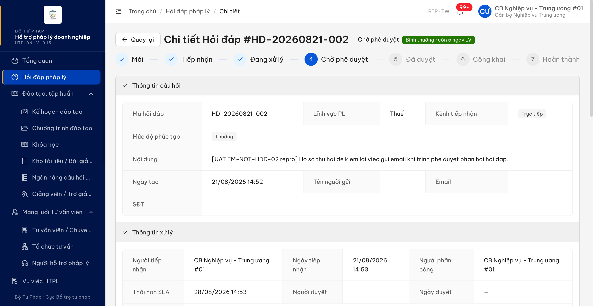
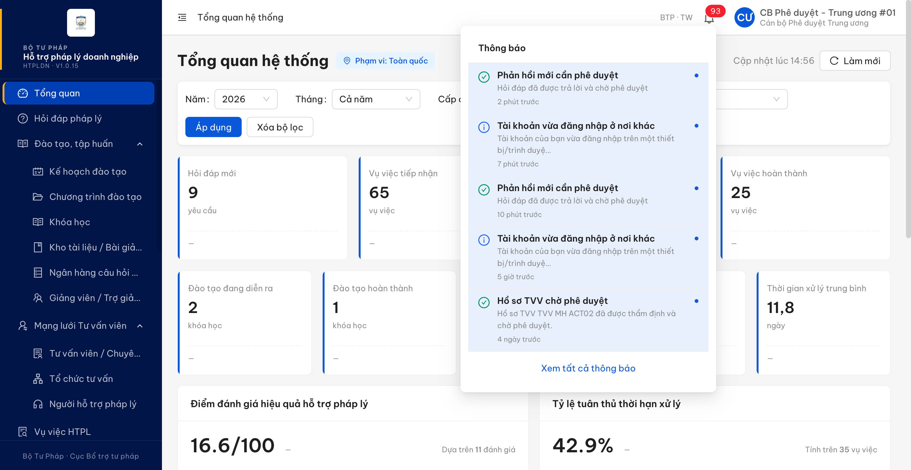
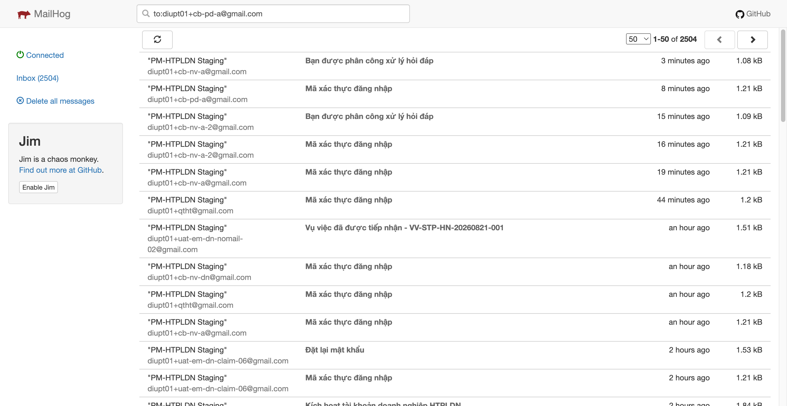
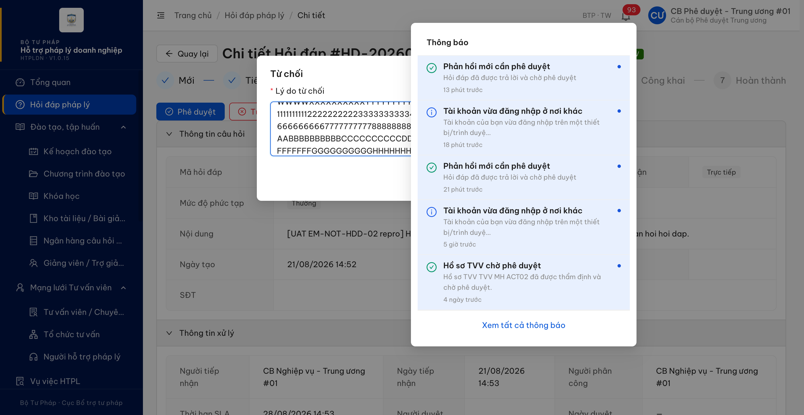
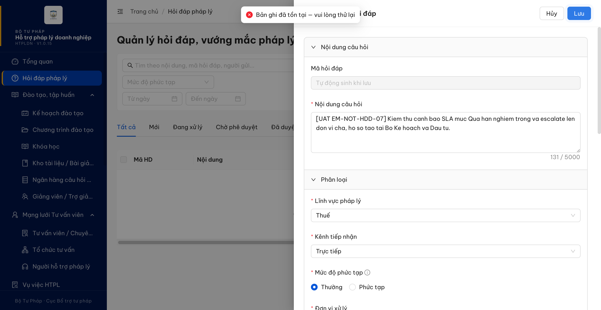

# Bug Report — Hỏi đáp pháp lý (thông báo nghiệp vụ qua email)

| Thông tin | Giá trị |
|-----------|---------|
| **Dự án** | PM HTPLDN — UAT reverify email |
| **Môi trường** | https://18.143.165.120.nip.io (DEV) · MailHog http://18.143.165.120:8025 |
| **Người test** | QA Automation |
| **Ngày** | 2026-08-25 14:42:00 |
| **Loại test** | Workflow (thông báo email + in-app) |
| **Round** | Reverify email — File 03 Batch 1 (Hỏi đáp) |
| **Tài liệu tham chiếu** | [03-TC-email-notification-workflow.md](../03-TC-email-notification-workflow.md) · SRS v3.5 `Docs-PM-HTPLDN/_bmad-output/planning-artifacts/srs-v3.5/srs-fr-02-hoi-dap.md` |

---

## Tổng hợp

Còn lại **6** lỗi có SRS reference cụ thể khi chạy batch `EM-NOT-HDD-*` / `EM-FLD-HDD-*` trên DEV bằng MailHog. Trong đó 2 lỗi lộ ra ngoài phạm vi ca kiểm (dựng dữ liệu và thao tác kèm) nhưng vẫn được ghi theo quy định.

> **Rà soát lại 2026-08-24:** gỡ **BUG-EM-HDD-004** — không phải lỗi. Ô Email người gửi vẫn chặn đúng và báo lỗi ngay dưới ô; chỉ khác câu chữ ("Email không hợp lệ" so với "Email không đúng định dạng" ở `srs-fr-02-hoi-dap.md:1070`), nghĩa và việc người dùng phải làm không đổi.

> **Kết quả reverify R4 (2026-08-25):** `BUG-EM-HDD-006` giữ **Chờ BA**, chưa retest và không tính Reopen vì Dev xác nhận chưa có bản fix để kiểm; 5 lỗi còn lại đã Closed.

### Severity breakdown

| Tổng | Critical | Major | Medium | Minor | Trivial | Closed | Open |
|------|----------|-------|--------|-------|---------|--------|------|
| 6    | 0        | 4     | 1      | 1       | 0       | 5      | 1    |

## Bug Summary Table

| Bug ID | Severity | Priority | Type | TC Ref | **SRS Reference** | Title | Status |
|--------|----------|----------|------|--------|-------------------|-------|--------|
| BUG-EM-HDD-001 | Major | P1 | Workflow | EM-NOT-HDD-02 | `srs-fr-02-hoi-dap.md:1181` (bảng Thông báo trigger, dòng "Gửi phản hồi + tích Đã trả lời (→ CHO_PHE_DUYET)") | Hỏi đáp chuyển sang Chờ phê duyệt chỉ sinh thông báo trong ứng dụng, không có thư điện tử cho Cán bộ Phê duyệt cùng đơn vị | Closed |
| BUG-EM-HDD-002 | Minor | P3 | Negative | EM-NOT-HDD-03 (phát hiện kèm) | `srs-fr-02-hoi-dap.md:682` (Inputs — Từ chối, field `ly_do_tu_choi`) | Ô Lý do từ chối chỉ nhận tối đa 500 ký tự trong khi đặc tả cho phép tới 1000, phần gõ vượt bị bỏ đi không báo gì | Closed |
| BUG-EM-HDD-003 | Major | P1 | Functional | EM-NOT-HDD-07 (phát hiện khi dựng dữ liệu) | `srs-fr-02-hoi-dap.md:1344` (ma_hoi_dap UNIQUE, auto-gen) · `:117` (Processing Thêm mới bước 2) · `:1597` (BR-DATA-04) | Cán bộ của đơn vị chưa có hồ sơ hỏi đáp nào trong ngày không tạo được hồ sơ mới, hệ thống luôn báo "Bản ghi đã tồn tại" | Closed |
| BUG-EM-HDD-005 | Medium | P2 | Negative | EM-FLD-HDD-03 | `srs-fr-02-hoi-dap.md:104` (Inputs #5 email_nguoi_gui) · `:1070` (SCR-II-01 dòng 41) | Email người gửi vượt 100 ký tự vẫn được lưu, cả giao diện lẫn API đều không chặn | Closed |
| BUG-EM-HDD-006 | Major | P1 | Workflow | EM-NOT-HDD-06 · EM-NOT-HDD-07 | `srs-fr-02-hoi-dap.md:985` (mức QUA_HAN → "Thông báo CB NV + CB PD") · `:986` (mức QUA_HAN_NGHIEM_TRONG → "Thông báo CB NV + CB PD + escalate") · `:1187` (Auto-escalate → CB PD cấp trên) · `:761` (EC-01 → cấp trên) · `:976`, `:1188`, `:1658` | Cảnh báo Quá hạn thiếu CBPD và Quá hạn nghiêm trọng thiếu escalation; Dev chưa fix vì chờ BA xác nhận đích escalation | Chờ BA |
| BUG-EM-HDD-007 | Major | P1 | UI/API/Data | EM-FLD-HDD-04 | `srs-fr-02-hoi-dap.md:155` (Cấu trúc file Excel xuất — Columns theo thứ tự) · `:157` (Format header) · `:162`-`:166` (Footer) · `:151` (Tên file) | File Excel xuất từ danh sách hỏi đáp thiếu hẳn cột Email và 8 cột khác so với đặc tả, không có khối chân trang, không cố định dòng tiêu đề, tên file sai quy ước | Closed |

---

## ~~BUG-EM-HDD-001~~ [CLOSED] — Hỏi đáp chuyển sang Chờ phê duyệt: có thông báo trong ứng dụng nhưng không phát sinh thư điện tử cho Cán bộ Phê duyệt cùng đơn vị

> **Re-test:** 2026-08-25 10:43:26 R3 — ✅ PASS (Closed-verified). HD-20260824-003 có in-app CBPD và email MailHog cùng sự kiện, độ trễ khoảng 86 ms.

**Bằng chứng R3:** `HD-20260824-003` ghi `SUBMIT` lúc `10:57:34.331Z`, in-app CBPD lúc `10:57:34.434Z` và MailHog CBPD lúc `10:57:34.520Z`. Xem [condition table](../cond/BUG-EM-HDD-001.md).

### Mô tả

Khi Cán bộ Nghiệp vụ được phân công bấm **Gửi phản hồi** trên màn Chi tiết hỏi đáp, hồ sơ chuyển đúng sang trạng thái **Chờ phê duyệt** và Cán bộ Phê duyệt cùng đơn vị nhận đúng một thông báo trên chuông. Nhưng **không có thư điện tử nào được phát ra** — kho thư MailHog của môi trường không tăng thêm bản ghi nào sau hơn 5 phút, cho cả tài khoản nhận lẫn mọi hộp thư khác. Sự kiện phân công (`TIEP_NHAN → DANG_XU_LY`) chạy trên cùng hồ sơ, cùng phiên, chỉ cách vài phút thì vẫn gửi thư bình thường, nên đây không phải do kênh thư của môi trường bị tắt.

### Các bước tái hiện

1. Đăng nhập `cbnv_tw_01` (vai trò `CB_NV_TW`, đơn vị *Cục Bổ trợ tư pháp - Bộ Tư pháp*, có quyền `create_hoi_dap` / `assign_hoi_dap` / `update_hoi_dap`). Vào **Hỏi đáp pháp lý → Thêm mới**, tạo hồ sơ (lĩnh vực Thuế, kênh Trực tiếp, đơn vị xử lý *Cục Bổ trợ tư pháp - Bộ Tư pháp*).
2. Mở chi tiết hồ sơ → **Tiếp nhận** → **Phân công** cho một Cán bộ Nghiệp vụ cùng đơn vị. *(Ghi nhận: thư "Bạn được phân công xử lý hỏi đáp" về đúng hộp thư người được phân công sau ~5–10 giây — chứng minh kênh thư đang bật.)*
3. Ghi lại mốc thời gian và số thư hiện có trong MailHog cho hộp thư của Cán bộ Phê duyệt cùng đơn vị (`cbpd_tw_01` = `diupt01+cb-pd-a@gmail.com`, `cbpd_tw_02` = `diupt01+cb-pd-a-2@gmail.com`).
4. Đăng nhập tài khoản Cán bộ Nghiệp vụ được phân công, mở chi tiết hồ sơ, nhập **Nội dung phản hồi**, bấm **Gửi phản hồi** → xác nhận trên hộp thoại "Sau khi gửi, hồ sơ sẽ chuyển sang trạng thái Chờ phê duyệt".
5. Chờ tối thiểu 5 phút, đếm lại số thư trong MailHog cho các hộp thư ở bước 3 và đếm tổng số thư của cả kho.
6. Đăng nhập `cbpd_tw_01`, mở chuông thông báo.

### Kết quả mong đợi

- Theo `srs-fr-02-hoi-dap.md:1181`: sự kiện *Gửi phản hồi + tích "Đã trả lời" (→ CHO_PHE_DUYET)* phải phát thông báo qua **cả hai kênh "In-app + email"**, người nhận là **Cán bộ Phê duyệt cùng đơn vị (BR-AUTH-05)**, với ghi chú **"SLA email ≤ 5 phút"**.
- Cán bộ Phê duyệt cùng đơn vị phải nhận được thư điện tử báo có hồ sơ chờ phê duyệt trong vòng 5 phút kể từ khi hồ sơ chuyển trạng thái.

### Kết quả thực tế

- Hồ sơ chuyển trạng thái đúng: `DANG_XU_LY → CHO_PHE_DUYET` (đọc lại `GET /api/v1/hoi-daps/{id}` → `"trangThai":"CHO_PHE_DUYET"`).
- Thông báo trong ứng dụng **có**: `cbpd_tw_01` nhận đúng một bản ghi *"Phản hồi mới cần phê duyệt — Hỏi đáp đã được trả lời và chờ phê duyệt"*, `loai: PHE_DUYET`, `entityId` khớp hồ sơ; số chưa đọc tăng đúng 1 đơn vị.
- Thư điện tử **không có**: sau hơn 5 phút, số thư của mọi hộp thư trong MailHog không đổi (`total` giữ nguyên 2504), không có thư nào tới `diupt01+cb-pd-a@gmail.com` / `diupt01+cb-pd-a-2@gmail.com` hay bất kỳ địa chỉ nào khác.
- Tái hiện **2/2 lần** trên hai hồ sơ khác nhau, hai người gửi phản hồi khác nhau:

| Hồ sơ | Người gửi phản hồi | Giờ chuyển CHO_PHE_DUYET (UTC) | Thông báo chuông | Thư điện tử sau 5 phút |
|---|---|---|---|---|
| `HD-20260821-001` (`8ccfd11d-237b-4a15-be95-89c0ad7d2a28`) | `cbnv_tw_02` | 2026-08-21T07:46:11 | ✅ 1 bản ghi lúc 07:46:11 | ❌ 0 thư (kiểm tới 07:51:17) |
| `HD-20260821-002` (`3981af61-dfb6-4b94-9fc5-997a7d502b1c`) | `cbnv_tw_01` | 2026-08-21T07:54:28 | ✅ 1 bản ghi lúc 07:54:28 | ❌ 0 thư (kiểm tới 07:59:36) |

- Đối chứng cùng phiên, cùng môi trường: sự kiện **Phân công** trên chính hai hồ sơ này gửi thư thành công (07:42:30 tới `diupt01+cb-nv-a-2@gmail.com`; 07:53:36 tới `diupt01+cb-nv-a@gmail.com`), nên kênh thư của phân hệ Hỏi đáp đang bật tại thời điểm kiểm thử.

### Bằng chứng

**1. Ảnh chụp**





**2. API response / log**

Đọc lại trạng thái hồ sơ sau khi bấm Gửi phản hồi:

```json
{ "trangThai": "CHO_PHE_DUYET", "version": 4 }
```

Thông báo trong ứng dụng của `cbpd_tw_01` (`GET /api/v1/thong-baos?page=1&limit=6`):

```json
{
  "tieuDe": "Phản hồi mới cần phê duyệt",
  "noiDung": "Hỏi đáp đã được trả lời và chờ phê duyệt",
  "loai": "PHE_DUYET",
  "entityId": "3981af61-dfb6-4b94-9fc5-997a7d502b1c",
  "ngayTao": "2026-08-21T07:54:28.563Z"
}
```

Đếm thư trong MailHog theo mốc thời gian (`GET http://18.143.165.120:8025/api/v2/messages`, lọc theo `Created >= mốc trigger`):

```text
mốc 2026-08-21T07:54:13Z (trước khi bấm Gửi phản hồi)
07:55:13Z  TOTAL_IN_STORE=2504  MATCHED=0
07:55:49Z  TOTAL_IN_STORE=2504  MATCHED=0
07:59:36Z  TOTAL_IN_STORE=2504  MATCHED=0     ← quá 5 phút, vẫn 0 thư
```

---

## ~~BUG-EM-HDD-002~~ [CLOSED] — Ô "Lý do từ chối" chỉ nhận được 500 ký tự, đặc tả cho phép 1000

> **Re-test:** 2026-08-25 10:45:15 R3 — ✅ PASS (Closed-verified). Dialog Từ chối có maxlength=1000; nhập được 574 ký tự và bộ đếm hiển thị 574/1000.

**Bằng chứng R3:** dialog Từ chối của `HD-20260824-003` có `maxlength=1000`; nhập được 574 ký tự, bộ đếm `574 / 1000`. Xem [ảnh UI](image/bug-em-hdd-002-r3-573-of-1000-2026-08-25.png) và [condition table](../cond/BUG-EM-HDD-002.md).

### Mô tả

Trên hộp thoại **Từ chối** của màn Chi tiết hỏi đáp, ô *Lý do từ chối* chỉ nhận tối đa 500 ký tự: bộ đếm hiển thị "n / 500" và khi gõ quá 500 ký tự thì phần vượt bị bỏ đi ngay lúc gõ, không có thông báo nào cho người dùng. Đặc tả cho phép lý do dài tới 1000 ký tự, nên Cán bộ Phê duyệt không nhập được lý do từ 501 đến 1000 ký tự.

### Các bước tái hiện

1. Đăng nhập `cbpd_tw_01` (vai trò `CB_PD_TW`, đơn vị *Cục Bổ trợ tư pháp - Bộ Tư pháp* — vai trò được phép từ chối hồ sơ cùng đơn vị theo `srs-fr-02-hoi-dap.md:688`).
2. Mở một hỏi đáp cùng đơn vị đang ở trạng thái **Chờ phê duyệt** (ví dụ `HD-20260821-002`).
3. Bấm **Từ chối** để mở hộp thoại.
4. Gõ bằng bàn phím một lý do dài 573 ký tự vào ô *Lý do từ chối*.
5. Quan sát bộ đếm ký tự và độ dài thực tế còn lại trong ô.

### Kết quả mong đợi

- Theo `srs-fr-02-hoi-dap.md:682`, `ly_do_tu_choi` là *"Min 10 ký tự, max 1000 ký tự"* → người dùng phải nhập được lý do dài tới 1000 ký tự; nếu vượt ngưỡng cho phép thì hệ thống phải cho biết là đã vượt, không âm thầm cắt bớt.

### Kết quả thực tế

- Gõ 573 ký tự nhưng ô chỉ giữ lại 500 ký tự (`value.length = 500`), phần còn lại mất hẳn, không có thông báo.
- Bộ đếm của ô hiển thị `500 / 500`, tức ngưỡng giao diện đang là 500 chứ không phải 1000. Thuộc tính của ô nhập: `maxlength=500`.

### Bằng chứng

**1. Ảnh chụp**



**2. API response / log**

Đọc lại ô nhập ngay sau khi gõ 573 ký tự bằng bàn phím:

```json
{ "intendedLen": 573, "actualLen": 500, "counter": "500 / 500", "maxlength": 500 }
```


---

## ~~BUG-EM-HDD-003~~ [CLOSED] — Cán bộ của đơn vị chưa có hồ sơ hỏi đáp nào trong ngày không tạo được hồ sơ mới, hệ thống luôn báo "Bản ghi đã tồn tại"

> **Re-test:** 2026-08-25 10:47:44 R3 — ✅ PASS (Closed-verified). cbnv_bn_01 tạo mới HD-20260825-001 thành công; fixture 24/08 dùng đúng sequence toàn cục 005.

**Bằng chứng R3:** `cbnv_bn_01` tạo mới thành công `HD-20260825-001`; fixture hậu-fix cùng đơn vị ngày 24/08 mang mã toàn cục `HD-20260824-005`. Xem [ảnh danh sách sau tạo](image/bug-em-hdd-003-r3-create-success-2026-08-25.png) và [condition table](../cond/BUG-EM-HDD-003.md).

### Mô tả

Cán bộ Nghiệp vụ của **Bộ Kế hoạch và Đầu tư** (`cbnv_bn_01`) không tạo được hồ sơ hỏi đáp mới: mọi lần bấm **Lưu** đều bị chặn với thông báo *"Bản ghi đã tồn tại — vui lòng thử lại"*, dù nội dung nhập mỗi lần một khác và không có hồ sơ nào của đơn vị này tồn tại. Cùng thời điểm, cán bộ của đơn vị *Cục Bổ trợ tư pháp - Bộ Tư pháp* (đơn vị đã có 3 hồ sơ trong ngày) vẫn tạo được bình thường. Mã hỏi đáp là trường hệ thống tự sinh, người dùng không nhập và không sửa được, nên người dùng không có cách nào tự thoát khỏi lỗi này.

### Các bước tái hiện

1. Trong ngày kiểm thử, để một đơn vị bất kỳ tạo trước ít nhất một hồ sơ hỏi đáp (ở đây `cbnv_tw_01` của *Cục Bổ trợ tư pháp - Bộ Tư pháp* đã tạo `HD-20260821-001`, `-002`, `-003`).
2. Đăng nhập `cbnv_bn_01` (vai trò `CB_NV_BN`, đơn vị *Bộ Kế hoạch và Đầu tư*, trạng thái Hoạt động).
3. Vào **Hỏi đáp pháp lý** → xác nhận danh sách hiển thị *"Chưa có hỏi đáp nào trong phạm vi quản lý"* (đơn vị chưa có hồ sơ nào).
4. Bấm **Thêm mới**, nhập Nội dung câu hỏi hợp lệ, chọn Lĩnh vực *Thuế*, Kênh tiếp nhận *Trực tiếp*, để Đơn vị xử lý mặc định *Bộ Kế hoạch và Đầu tư (BN)*, bấm **Lưu**.
5. Lặp lại bước 4 với nội dung khác nhau (đã thử 4 lần liên tiếp trong ~6 giây và 2 lần nữa trên giao diện).
6. Mở lại danh sách hỏi đáp của đơn vị và đếm tổng số hồ sơ toàn hệ thống.

### Kết quả mong đợi

- Theo `srs-fr-02-hoi-dap.md:117` (Processing — Thêm mới, bước 2 *"Tự sinh mã hỏi đáp: HD-{YYYYMMDD}-{SEQ}"*, áp dụng BR-DATA-04) và `:1344` (`ma_hoi_dap | text | Y | UNIQUE | Auto-gen`): hệ thống phải tự sinh cho mỗi hồ sơ một mã duy nhất rồi tạo bản ghi (bước 7). Cán bộ có quyền tạo, nhập đủ trường bắt buộc hợp lệ thì phải tạo được hồ sơ.
- `srs-fr-02-hoi-dap.md:1597` (BR-DATA-04) ghi tiêu chí kiểm thử là *"Verify uniqueness + format"* — tức việc bảo đảm mã không trùng là trách nhiệm của hệ thống, không phải điều kiện người dùng phải tự xoay xở.
- Bảng Error Handling của FR-II-01 không có tình huống lỗi nào cho việc trùng mã tự sinh.

### Kết quả thực tế

- Cả 6 lần thử đều bị chặn. Giao diện hiện thông báo đỏ *"Bản ghi đã tồn tại — vui lòng thử lại"*; `POST /api/v1/hoi-daps` trả **409** với `"code":"ERR-STATE-SYS-00-01"`.
- Không hồ sơ nào được tạo: danh sách của *Bộ Kế hoạch và Đầu tư* vẫn trống, tổng số hồ sơ toàn hệ thống không đổi.
- Đối chứng cùng phiên, cách nhau vài phút:

| Người tạo | Đơn vị của người tạo | Số hồ sơ người tạo nhìn thấy trong ngày | Kết quả |
|---|---|---|---|
| `cbnv_tw_01` | Cục Bổ trợ tư pháp - Bộ Tư pháp | 2 | ✅ tạo được `HD-20260821-003` lúc 08:15:32Z |
| `cbnv_bn_01` | Bộ Kế hoạch và Đầu tư | 0 | ❌ 409 lúc 08:18:09Z, 08:18:5xZ (×4), 08:20:36Z, 08:20:54Z |
| `cbnv_tw_01` (tạo hộ, chọn Đơn vị xử lý = *Bộ Kế hoạch và Đầu tư*) | Cục Bổ trợ tư pháp - Bộ Tư pháp | 3 | ✅ tạo được `HD-20260821-004` lúc 08:21:32Z, hồ sơ về đúng Bộ KH&ĐT |

- Quy luật quan sát được: số thứ tự trong mã bám theo **số hồ sơ mà người tạo nhìn thấy** chứ không theo toàn hệ thống. Đơn vị chưa có hồ sơ nào trong ngày luôn xin số `001`, trùng với `HD-20260821-001` mà đơn vị khác đã tạo trước đó, nên bị chặn vĩnh viễn trong ngày. Đây cũng là lý do cách tạo hộ ở dòng 3 lại chạy được: người tạo nhìn thấy 3 hồ sơ nên xin số `004` còn trống.
- Hệ quả nghiệp vụ: mỗi ngày chỉ đơn vị tạo hồ sơ đầu tiên là dùng được chức năng; các đơn vị còn lại bị chặn cho tới khi có ai đó tạo hộ.

### Bằng chứng

**1. Ảnh chụp**



**2. API response / log**

`POST https://18.143.165.120.nip.io/api/v1/hoi-daps` — phiên `cbnv_bn_01`:

```json
// Request body
{"noiDung":"[UAT EM-NOT-HDD-07] Kiem thu canh bao SLA muc Qua han nghiem trong va escalate len don vi cha, ho so tao tai Bo Ke hoach va Dau tu.","linhVucId":"bbbbbbbb-0000-4000-8000-000000000018","kenhTiepNhan":"TRUC_TIEP","mucDoPhucTap":"THUONG","donViId":"00000000-0000-4000-8001-000000000001"}

// Response 409
{"success":false,"error":{"code":"ERR-STATE-SYS-00-01","message":"Bản ghi đã tồn tại — vui lòng thử lại","timestamp":"2026-08-21T08:20:54.861Z","requestId":"a421c0a7-7e4c-46b2-9b5d-31d3af637ff0"}}
```

Đối chứng — cùng payload nhưng gửi từ phiên `cbnv_tw_01` (chỉ khác người tạo):

```json
// Response 201
{"success":true,"data":{"id":"869cfacf-b94a-4fb0-90b7-0edd55afa4e1","maHoiDap":"HD-20260821-004","donViId":"00000000-0000-4000-8001-000000000001", "...": "..."}}
```

---

## ~~BUG-EM-HDD-005~~ [CLOSED] — Email người gửi vượt 100 ký tự vẫn được lưu, cả giao diện lẫn API đều không chặn

> **Re-test:** 2026-08-25 10:49:03 R3 — ✅ PASS (Closed-verified). UI maxlength=100; API nhận biên 100 (201) và chặn 101 bằng 422 với field emailNguoiGui.

**Bằng chứng R3:** UI `maxlength=100`; API email 100 ký tự trả 201 (`HD-20260825-002`), email 101 ký tự trả 422 `ERR-VAL-SYS-00-01` với field `emailNguoiGui`. Xem [condition table](../cond/BUG-EM-HDD-005.md).

### Mô tả

Đặc tả giới hạn **Email người gửi** tối đa 100 ký tự. Thực tế địa chỉ dài 101 ký tự được lưu thành công và địa chỉ dài 201 ký tự cũng được lưu thành công, giữ nguyên toàn bộ độ dài. Ô nhập trên giao diện không có giới hạn độ dài, không có bộ đếm ký tự, không báo lỗi; tầng API cũng không chặn.

### Các bước tái hiện

1. Đăng nhập `cbnv_tw_01`, vào **Hỏi đáp pháp lý** → **Thêm mới**, nhập Nội dung hợp lệ, Lĩnh vực *Thuế*, Kênh *Trực tiếp*.
2. Gõ bằng bàn phím vào ô **Email người gửi** một địa chỉ đúng cú pháp dài **đúng 100 ký tự**: `qa.fld03.hundred@` + 63 ký tự `d` + `.eeeeee.example.test`. Bấm **Lưu**, ghi lại mã hồ sơ.
3. Mở lại form **Thêm mới**, lặp bước 2 với địa chỉ dài **101 ký tự** (thêm một ký tự `e` vào nhãn thứ hai của tên miền). Bấm **Lưu**.
4. Đọc lại giá trị đã lưu của cả hai hồ sơ bằng `GET /api/v1/hoi-daps/{id}` và đo độ dài.
5. Gửi thêm một yêu cầu tạo qua API với địa chỉ đúng cú pháp dài 201 ký tự.

### Kết quả mong đợi

- Theo `srs-fr-02-hoi-dap.md:104` (FR-II-01, Inputs #5 `email_nguoi_gui`): *"Max 100 ký tự; định dạng email RFC 5322"*, và `:1070` (SCR-II-01 dòng 41): *"Tối đa 100 ký tự"*.
- Địa chỉ dài đúng 100 ký tự được chấp nhận và lưu nguyên văn.
- Địa chỉ dài hơn 100 ký tự bị từ chối, và không được cắt bớt âm thầm.

### Kết quả thực tế

| Độ dài nhập | Cách nhập | Kết quả | Giá trị lưu trong hệ thống |
|---|---|---|---|
| 100 ký tự | Gõ bàn phím trên form | ✅ Lưu được — `HD-20260821-007` | đúng 100 ký tự, nguyên văn |
| 101 ký tự | Gõ bàn phím trên form | ❌ Vẫn lưu được — `HD-20260821-008`, không có lỗi tại chỗ, không có cảnh báo | đúng 101 ký tự, **không bị cắt** |
| 201 ký tự | Gọi API `POST /api/v1/hoi-daps` | ❌ Vẫn lưu được — `HD-20260821-009`, HTTP 201 | đúng 201 ký tự |

- Ô nhập Email người gửi trên form không đặt giới hạn độ dài (`maxlength` = không có) và không có bộ đếm ký tự, khác với ô Nội dung câu hỏi (`5000`) và ô Ghi chú (`2000`) trên cùng form.
- Vế "không cắt bớt âm thầm" thì đạt — giá trị luôn được giữ nguyên; vế "chặn khi vượt 100" thì không đạt ở cả hai tầng.

### Bằng chứng

**1. API response / log**

```json
// HD-20260821-008 — nhập 101 ký tự trên giao diện, đọc lại sau khi lưu
{"maHoiDap":"HD-20260821-008","emailNguoiGui":"qa.fld03.hundred@ddddddddddddddddddddddddddddddddddddddddddddddddddddddddddddddd.eeeeeee.example.test","len":101}

// HD-20260821-009 — gửi 201 ký tự qua API
{"status":201,"maHoiDap":"HD-20260821-009","storedLen":201}
```

**2. Đối chứng biên dưới**

```json
// HD-20260821-007 — 100 ký tự, lưu đúng nguyên văn
{"maHoiDap":"HD-20260821-007","len":100,"khopNguyenVan":true}
```

---

## BUG-EM-HDD-006 [CHỜ BA] — Cảnh báo thời hạn xử lý thiếu Cán bộ Phê duyệt và escalation cấp trên

> **Re-test:** 2026-08-25 14:42:00 R4 — ⏸ CHỜ BA, chưa retest. Dev xác nhận phiếu chưa từng được fix vì đang treo BA; không có bản sửa mới để chạy lại cron SLA.

**Đối chiếu R4:** SRS đủ rõ rằng `QUA_HAN` phải gửi CB_NV + CB_PD. Với `QUA_HAN_NGHIEM_TRONG`, SRS thêm `escalate`; bảng thông báo EC-01 chỉ ra đối tượng là CB_PD cấp trên, nhưng Dev vẫn đang chờ BA xác nhận cách áp dụng cho SLA Hỏi đáp. Giữ bằng chứng R3 làm baseline lỗi; chưa gắn nhãn Reopen vì chưa có bản fix để verify. Xem [ảnh MailHog baseline chỉ có người xử lý](image/bug-em-hdd-006-r3-only-cbnv-email-2026-08-25.png) và [condition table](../cond/BUG-EM-HDD-006.md).

### Mô tả

Tác vụ tự động rà thời hạn xử lý hỏi đáp chạy đúng chu kỳ 30 phút, tính mức cảnh báo đúng và chuyển mức đúng thời điểm. Nhưng ở khâu gửi thông báo, hệ thống chỉ gửi cho **Cán bộ Nghiệp vụ đang xử lý** hồ sơ, ở cả bốn mức. Với mức **Quá hạn** và **Quá hạn nghiêm trọng**, đặc tả yêu cầu thông báo thêm cho **Cán bộ Phê duyệt**, và riêng mức Quá hạn nghiêm trọng còn phải chuyển lên cấp trên; thực tế Cán bộ Phê duyệt không nhận được thư điện tử lẫn thông báo trong ứng dụng, và không có thông báo nào đi lên đơn vị cấp trên.

Ghi nhận trong 6 lần chuyển mức của 3 hồ sơ, thuộc 2 đơn vị khác nhau, qua 4 lần chạy tác vụ.

### Các bước tái hiện

1. Chuẩn bị 3 hồ sơ hỏi đáp ở trạng thái **Đang xử lý** đã có người xử lý và có thời hạn:
   - `HD-20260821-001` — đơn vị Cục Bổ trợ tư pháp (Bộ Tư pháp), người xử lý `cbnv_tw_02`.
   - `HD-20260821-003` — cùng đơn vị trên, người xử lý `cbnv_tw_01`.
   - `HD-20260821-004` — đơn vị Bộ Kế hoạch và Đầu tư, người xử lý `cbnv_bn_01`.
2. Đặt thời hạn xử lý của từng hồ sơ (chức năng **Cập nhật thời hạn**) sao cho tỷ lệ thời gian đã dùng rơi vào các mức cần kiểm ở lần chạy tác vụ kế tiếp.
3. Ghi lại số thư trong hộp thư dùng chung và số thông báo chưa đọc của từng tài khoản trước mỗi mốc chạy.
4. Chờ tác vụ chạy (đúng phút :00 và :30), không thao tác gì thêm.
5. Sau mỗi lần chạy, đếm lại số thư theo từng địa chỉ nhận và mở chuông thông báo của: người xử lý, Cán bộ Phê duyệt **cùng đơn vị** với hồ sơ, và các tài khoản khác đơn vị.
6. Với `HD-20260821-004`, đọc thêm đơn vị cấp trên của Bộ Kế hoạch và Đầu tư và danh sách Cán bộ Phê duyệt Trung ương đang hoạt động tại đơn vị cấp trên đó, rồi kiểm hộp thư của họ.

### Kết quả mong đợi

- Theo `srs-fr-02-hoi-dap.md:985` (bảng 4 mức cảnh báo), mức **QUA_HAN**: *"Thông báo CB NV + CB PD"*.
- Theo `:986`, mức **QUA_HAN_NGHIEM_TRONG**: *"Thông báo CB NV + CB PD + escalate"*.
- Theo `:976` (Processing bước 6): *"Nếu cấu hình gửi email: gửi email cho CB NV + CB PD"*.
- Theo `:1188` (bảng thông báo hệ thống): *"Cảnh báo SLA (4 mức) | In-app + email | CB NV + CB PD theo mức"*.
- Theo `:1658` (BR-SLA-03): *"Khi chuyển mức cảnh báo, gửi thông báo trong hệ thống + email cho CB NV xử lý + CB PD quản lý."*
- Do đó: mức Sắp hết hạn chỉ báo cho Cán bộ Nghiệp vụ; mức Quá hạn và Quá hạn nghiêm trọng phải báo cho cả Cán bộ Phê duyệt, qua cả hai kênh thư điện tử và thông báo trong ứng dụng; riêng mức Quá hạn nghiêm trọng còn phải có bước chuyển lên cấp trên.

### Kết quả thực tế

**Toàn bộ các lần chuyển mức trong ngày 21/08/2026 (giờ quốc tế):**

| Lần chạy | Hồ sơ | Mức mới | Người nhận thư thực tế | Người nhận thông báo trong ứng dụng | Cán bộ Phê duyệt cùng đơn vị có nhận? |
|---|---|---|---|---|---|
| 08:30 | HD-20260821-004 | Quá hạn nghiêm trọng | `cbnv_bn_01` (1 thư) | `cbnv_bn_01` | ❌ `cbpd_bn_01` — không thư, không thông báo |
| 09:00 | HD-20260821-001 | Sắp hết hạn | `cbnv_tw_02` (1 thư) | `cbnv_tw_02` | *(mức này không yêu cầu)* |
| 09:00 | HD-20260821-003 | Quá hạn | `cbnv_tw_01` (1 thư) | `cbnv_tw_01` | ❌ `cbpd_tw_01` — không thư, không thông báo |
| 09:30 | HD-20260821-001 | Quá hạn | `cbnv_tw_02` (1 thư) | `cbnv_tw_02` | ❌ `cbpd_tw_01` — không thư, không thông báo |
| 09:30 | HD-20260821-003 | Quá hạn nghiêm trọng | `cbnv_tw_01` (1 thư) | `cbnv_tw_01` | ❌ `cbpd_tw_01` — không thư, không thông báo |
| 11:30 | HD-20260821-001 | Quá hạn nghiêm trọng | `cbnv_tw_02` (1 thư) | `cbnv_tw_02` | ❌ `cbpd_tw_01` — không thư, không thông báo |

- **Thư điện tử:** đếm toàn bộ hộp thư dùng chung, mỗi lần chuyển mức sinh **đúng 1 thư duy nhất**, luôn gửi cho người xử lý. Không có địa chỉ nào khác nhận thư ở các mốc trên — kể cả Cán bộ Phê duyệt cùng đơn vị.
- **Thông báo trong ứng dụng:** số chưa đọc của `cbpd_tw_01` chỉ tăng do thông báo đăng nhập; đọc 20 thông báo mới nhất của tài khoản này không có bất kỳ thông báo cảnh báo thời hạn nào, trong khi cùng khoảng thời gian có 4 lần chuyển mức của hồ sơ thuộc chính đơn vị mình. Tài khoản `cbpd_bn_01` cũng không có thông báo nào mới kể từ 11/08/2026.
- **Chuyển lên cấp trên:** với `HD-20260821-004` (Bộ Kế hoạch và Đầu tư, đơn vị cấp trên là Cục Bổ trợ tư pháp - Bộ Tư pháp, có 6 tài khoản Cán bộ Phê duyệt Trung ương đang hoạt động), lần chạy 08:30 chỉ sinh đúng 1 thư cho người xử lý. Không có tài khoản nào ở đơn vị cấp trên nhận được thư hay thông báo.

**Phần đang chạy đúng, nêu để khoanh vùng:** chu kỳ 30 phút đúng; ngưỡng 4 mức đúng (`HD-20260821-001` chỉ lên Quá hạn nghiêm trọng ở lần chạy 11:30, tức lần chạy đầu tiên sau khi vượt mốc 200%, không lên sớm ở 11:00); không gửi lặp khi không chuyển mức (các lần chạy 10:00, 10:30, 11:00, 12:00 không sinh thư nào); mỗi người nhận đúng 1 thư cho 1 sự kiện; nội dung thư và thông báo nêu đúng mã hồ sơ và đúng mức.

### Bằng chứng

**1. Ảnh chụp màn hình**

- Cán bộ Phê duyệt Trung ương #01 (cùng đơn vị với `HD-20260821-001` và `HD-20260821-003`) — chuông nhảy thẳng từ thông báo đăng nhập "vài giây trước" sang "4 giờ trước", không có cảnh báo thời hạn nào dù đơn vị vừa có 4 lần chuyển mức: [bug-em-hdd-006-cbpd-tw01-khong-nhan-canh-bao-qua-han.png](image/bug-em-hdd-006-cbpd-tw01-khong-nhan-canh-bao-qua-han.png)
- Cán bộ Phê duyệt của Bộ Kế hoạch và Đầu tư — không nhận cảnh báo của `HD-20260821-004`: [bug-em-hdd-006-cbpd-bn01-khong-nhan-canh-bao-sla.png](image/bug-em-hdd-006-cbpd-bn01-khong-nhan-canh-bao-sla.png)
- Hộp thư dùng chung sau lần chạy 08:30 — chỉ có đúng 1 thư cho `HD-20260821-004`: [bug-em-hdd-006-mailhog-chi-1-thu-sla-hd004.png](image/bug-em-hdd-006-mailhog-chi-1-thu-sla-hd004.png)
- Đối chứng: Cán bộ Nghiệp vụ Trung ương #01 nhận đúng cảnh báo Quá hạn của `HD-20260821-003`: [em-not-hdd-06-cbnv-tw01-nhan-canh-bao-qua-han.png](image/em-not-hdd-06-cbnv-tw01-nhan-canh-bao-qua-han.png)

**2. Hộp thư dùng chung — đếm trước/sau từng lần chạy**

```
Tổng số thư 08:58:44Z = 2514   (trước lần chạy 09:00)
Tổng số thư 09:00:45Z = 2516   (+2)
Tổng số thư 09:01:44Z = 2516   (+0 sau 90 giây — không có thư đến muộn)

Liệt kê toàn bộ thư từ 08:59Z, lọc theo từng địa chỉ:
  diupt01+cb-nv-a@gmail.com    (cbnv_tw_01, người xử lý HD-003)  : 1
  diupt01+cb-nv-a-2@gmail.com  (cbnv_tw_02, người xử lý HD-001)  : 1
  diupt01+cb-pd-a@gmail.com    (cbpd_tw_01, CB PD cùng đơn vị)   : 0
  diupt01+cb-nv-b@gmail.com    (cbnv_bn_01, khác đơn vị)         : 0
  diupt01+cb-pd-b@gmail.com    (cbpd_bn_01, CB PD Bộ KH&ĐT)      : 0
  địa chỉ khác                                                   : không có
```

```
Toàn bộ thư cảnh báo thời hạn trong ngày (mọi địa chỉ):
2026-08-21T08:30:00 | diupt01+cb-nv-b@gmail.com   | Câu hỏi quá hạn nghiêm trọng | HD-20260821-004 | QUA_HAN_NGHIEM_TRONG
2026-08-21T09:00:00 | diupt01+cb-nv-a-2@gmail.com | Sắp hết hạn xử lý câu hỏi    | HD-20260821-001 | SAP_HET_HAN
2026-08-21T09:00:00 | diupt01+cb-nv-a@gmail.com   | Câu hỏi đã quá hạn xử lý     | HD-20260821-003 | QUA_HAN
2026-08-21T09:30:00 | diupt01+cb-nv-a-2@gmail.com | Câu hỏi đã quá hạn xử lý     | HD-20260821-001 | QUA_HAN
2026-08-21T09:30:00 | diupt01+cb-nv-a@gmail.com   | Câu hỏi quá hạn nghiêm trọng | HD-20260821-003 | QUA_HAN_NGHIEM_TRONG
2026-08-21T11:30:00 | diupt01+cb-nv-a-2@gmail.com | Câu hỏi quá hạn nghiêm trọng | HD-20260821-001 | QUA_HAN_NGHIEM_TRONG
→ 6/6 thư gửi cho người xử lý; 0 thư cho bất kỳ Cán bộ Phê duyệt nào.
```

**3. Thông báo trong ứng dụng — số chưa đọc trước/sau**

```
Mốc 08:48Z (trước lần chạy 09:00) → mốc 09:01Z (sau lần chạy 09:00):
  cbnv_tw_01  216 → 217  (+1: "Câu hỏi đã quá hạn xử lý — HD-20260821-003 ... QUA_HAN", 09:00:00.181Z)
  cbnv_tw_02  120 → 121  (+1: "Sắp hết hạn xử lý câu hỏi — HD-20260821-001 ... SAP_HET_HAN", 09:00:00.160Z)
  cbpd_tw_01   94 →  94  (+0)
  cbpd_bn_01    4 →   4  (+0, thông báo mới nhất vẫn là 11/08/2026)

Mốc 12:31Z (sau cả 4 lần chuyển mức tại đơn vị Trung ương):
  cbpd_tw_01 — đọc 20 thông báo mới nhất: 0 thông báo cảnh báo thời hạn.
  Thông báo mới nhất là "Tài khoản vừa đăng nhập ở nơi khác" (12:31:13Z), kế đó là 08:46:01Z.
```

**4. Trạng thái hồ sơ sau các lần chạy (đọc qua API)**

```json
{"ma":"HD-20260821-001","trangThai":"DANG_XU_LY","muc":"SAP_HET_HAN","tn":"2026-08-21T07:40:45.185Z","dl":"2026-08-21T09:20:45.185Z"}   // lúc 09:01Z
{"ma":"HD-20260821-003","trangThai":"DANG_XU_LY","muc":"QUA_HAN","tn":"2026-08-21T08:15:32.875Z","dl":"2026-08-21T08:45:32.875Z"}      // lúc 09:01Z
```

**5. Đơn vị cấp trên dùng cho vế chuyển lên cấp trên**

```
Hồ sơ HD-20260821-004 — đơn vị: Bộ Kế hoạch và Đầu tư (00000000-0000-4000-8001-000000000001)
Đơn vị cấp trên          : Cục Bổ trợ tư pháp - Bộ Tư pháp (00000000-0000-4000-8000-000000000001)
Cán bộ Phê duyệt Trung ương đang hoạt động tại đơn vị cấp trên: 6 tài khoản
  cbpd_tw (cbpd_tw@htpldn.test) · cbpd_tw_01 (diupt01+cb-pd-a@gmail.com) · cbpd_tw_02 (diupt01+cb-pd-a-2@gmail.com)
  cbpd_tw_03 · cbpd_tw_04 · cbpd_tw_05 (@htpldn.test)
→ Hộp thư dùng chung nhận mọi tên miền nên cả 6 địa chỉ đều kiểm được; không địa chỉ nào có thư ở mốc 08:30.
```

Ghi nhận thêm (đặc tả không quy định nội dung mẫu thư cảnh báo thời hạn nên không tính vào lỗi này): thân thư chỉ có mã hồ sơ và tên mức, không nêu thời hạn xử lý cũng như đường dẫn mở hồ sơ.

---

## ~~BUG-EM-HDD-007~~ [CLOSED] — File Excel xuất từ danh sách hỏi đáp thiếu cột Email và 8 cột khác, không có khối chân trang, không cố định dòng tiêu đề, tên file sai quy ước

> **Re-test:** 2026-08-25 11:04:37 R3 — ✅ PASS (Closed-verified). File xuất có đủ 19 cột đúng thứ tự, Email ở cột 7, freeze A2, header đúng, đủ footer và tên file đúng quy ước.

**Bằng chứng R3:** file `HoiDap_20260825_1103.xlsx` có 19 cột đúng thứ tự, Email ở cột 7, `freeze_panes=A2`, header bold nền `FFCCCCCC`, đủ 4 dòng footer. Xem [workbook evidence](evidence/BUG-EM-HDD-007-r3-export-2026-08-25.xlsx) và [condition table](../cond/BUG-EM-HDD-007.md).

### Mô tả

Đặc tả liệt kê 19 cột cho file Excel xuất từ màn hình **Hỏi đáp pháp lý**, kèm quy định định dạng dòng tiêu đề và bốn dòng chân trang. File thực tế chỉ có **11 cột**, **không có cột Email** — đúng cột mà phiếu kiểm thử này cần đối chiếu — và thiếu thêm 8 cột khác. File cũng không có khối chân trang, không cố định dòng tiêu đề, và tên file không theo quy ước đặt tên trong đặc tả.

### Các bước tái hiện

1. Đăng nhập `cbnv_tw_01`, mở **Hỏi đáp pháp lý**.
2. Dựng sẵn 3 hồ sơ cùng chứa từ khóa `EM-FLD-HDD-04`: một hồ sơ có Email người gửi hợp lệ, một hồ sơ để trống Email, một hồ sơ có dấu tiếng Việt ở Người gửi và giá trị bắt đầu bằng dấu `=`.
3. Gõ `EM-FLD-HDD-04` vào ô tìm kiếm; danh sách trả về đúng 3 hồ sơ.
4. Bấm **Xuất Excel** và tải file về.
5. Mở file, đọc dòng tiêu đề, số dòng dữ liệu, các dòng cuối file, thuộc tính cố định dòng và tên file trả về từ máy chủ.

### Kết quả mong đợi

- Theo `srs-fr-02-hoi-dap.md:155`, file phải có đủ 19 cột theo đúng thứ tự: *"Số thứ tự · Mã hỏi đáp · Tiêu đề · Nội dung đầy đủ (không truncate) · Lĩnh vực pháp luật · Người gửi · Email · Số điện thoại · Doanh nghiệp · Kênh tiếp nhận · Trạng thái (tiếng Việt, không dùng mã) · Đơn vị tiếp nhận · Ngày tạo · Ngày tiếp nhận · Hạn xử lý · Mức thời hạn xử lý (Trong hạn/Sắp hết hạn/Quá hạn/Quá hạn nghiêm trọng) · Người xử lý · Người duyệt · Ngày duyệt."*
- Theo `:157`: *"Header row: in đậm, background xám nhạt, freeze row 1."*
- Theo `:162`-`:166`, sau vùng dữ liệu phải có 4 dòng chân trang: *"Xuất lúc: {dd/mm/yyyy HH:mm}"*, *"Bởi: {ho_ten} ({username}) — Đơn vị: {ten_don_vi}"*, *"Bộ lọc áp dụng: {filter_summary}"*, *"Tổng số bản ghi: {N}"*.
- Theo `:151`: *"Trả về file tải về. Tên file: `HoiDap_{YYYYMMDD_HHmm}.xlsx`"*.

### Kết quả thực tế

File tải về mở được bình thường, có đúng 3 dòng dữ liệu khớp bộ lọc, giữ nguyên dấu tiếng Việt, và giá trị bắt đầu bằng dấu `=` đã được vô hiệu hóa nên không chạy như công thức. Nhưng phần cấu trúc thì sai ở bốn điểm:

**a. Thiếu 8 cột, trong đó có cột Email**

| Đặc tả `:155` (19 cột) | File thực tế (11 cột) |
|---|---|
| Số thứ tự | *(thiếu)* |
| Mã hỏi đáp | Mã hỏi đáp |
| Tiêu đề | *(thiếu)* |
| Nội dung đầy đủ (không truncate) | *(thiếu)* — file có cột "Trích yếu" không nằm trong danh sách đặc tả |
| Lĩnh vực pháp luật | Lĩnh vực |
| Người gửi | Người gửi |
| **Email** | **(thiếu)** |
| Số điện thoại | *(thiếu)* |
| Doanh nghiệp | *(thiếu)* |
| Kênh tiếp nhận | Kênh tiếp nhận |
| Trạng thái | Trạng thái |
| Đơn vị tiếp nhận | *(thiếu)* |
| Ngày tạo | Ngày tạo |
| Ngày tiếp nhận | Ngày tiếp nhận |
| Hạn xử lý | "Deadline" (tiếng Anh) |
| Mức thời hạn xử lý | Mức độ cảnh báo |
| Người xử lý | Người xử lý |
| Người duyệt | *(thiếu)* |
| Ngày duyệt | *(thiếu)* |

Thứ tự 11 cột hiện có cũng khác đặc tả: hai cột thời hạn bị đẩy xuống sau *Ngày tiếp nhận*, còn *Ngày tạo* bị đẩy xuống cuối cùng.

Vì không có cột Email nên hai vế kiểm của phiếu — *"có cột Email đúng thứ tự"* và *"email rỗng vẫn rỗng"* — đều không đối chiếu được.

**b. Không có khối chân trang**

Vùng dữ liệu kết thúc ở dòng 4 và file cũng kết thúc ở đó (`A1:K4`). Không có dòng nào trong bốn dòng chân trang mà `:162`-`:166` yêu cầu.

**c. Không cố định dòng tiêu đề**

Dòng tiêu đề có in đậm và có nền xám (`FFCCCCCC`) đúng yêu cầu, nhưng thuộc tính cố định dòng không được đặt (`freeze_panes` rỗng), nên khi cuộn danh sách dài thì tiêu đề trôi mất.

**d. Tên file sai quy ước**

Máy chủ trả về `hoi-dap-1787301595818.xlsx` (mốc thời gian dạng số nguyên), trong khi `:151` quy định `HoiDap_{YYYYMMDD_HHmm}.xlsx`.

### Bằng chứng

**1. Ảnh chụp màn hình**

- Bộ lọc trả đúng 3 hồ sơ trước khi bấm Xuất Excel: [bug-em-hdd-007-loc-3-ho-so-truoc-khi-xuat-excel.png](image/bug-em-hdd-007-loc-3-ho-so-truoc-khi-xuat-excel.png)

**2. API response / log**

```
GET /api/v1/hoi-daps/export?search=EM-FLD-HDD-04&tab=TAT_CA
→ 200 · 6851 bytes
   content-type: application/vnd.openxmlformats-officedocument.spreadsheetml.sheet
   content-disposition: attachment; filename="hoi-dap-1787301595818.xlsx"
```

**3. Nội dung file đã tải về**

```
sheet: "Hỏi đáp"   vùng dữ liệu: A1:K4   (11 cột × 1 dòng tiêu đề + 3 dòng dữ liệu)

dòng 1 | Mã hỏi đáp | Trích yếu | Lĩnh vực | Kênh tiếp nhận | Người gửi | Người xử lý | Trạng thái | Mức độ cảnh báo | Ngày tiếp nhận | Deadline | Ngày tạo
dòng 2 | HD-20260821-012 | ... | Thuế | Trực tiếp | '=HYPERLINK("http://evil.test";"Bấm vào đây") |  | Mới | — |  |  | 21/08/2026
dòng 3 | HD-20260821-011 | ... | Thuế | Trực tiếp | Đặng Văn Đức |  | Mới | — |  |  | 21/08/2026
dòng 4 | HD-20260821-010 | ... | Thuế | Trực tiếp | Lê Thị Hồng Ánh |  | Mới | — |  |  | 21/08/2026

ô công thức thực sự trong file: không có (giá trị `=...` được lưu dạng chuỗi, có dấu nháy dẫn đầu)
dòng tiêu đề: in đậm = có · nền = FFCCCCCC · cố định dòng = không đặt
dòng chân trang: không có
```

Ghi nhận thêm (đạt yêu cầu, nêu để đối chứng): 3 dòng dữ liệu khớp đúng 3 hồ sơ của bộ lọc; dấu tiếng Việt giữ nguyên; nội dung không bị cắt; giá trị bắt đầu bằng `=` không chạy như công thức.

---

## Phụ lục — Môi trường test

| Thành phần | Giá trị |
|------------|---------|
| URL ứng dụng | https://18.143.165.120.nip.io |
| OTP login | Lấy trong MailHog, tiêu đề "Mã xác thực đăng nhập" |
| MailHog (OTP inbox) | http://18.143.165.120:8025 |
| API base | https://18.143.165.120.nip.io/api/v1 |
| Frontend | React + Ant Design (HTPLDN V1.0.15) |
| Xác thực | JWT (cookie) + OTP qua thư |
| Tool test | Chrome DevTools MCP |

---

*Bug report generated: 2026-08-21 15:34:00 | QA Automation via Claude Code*
