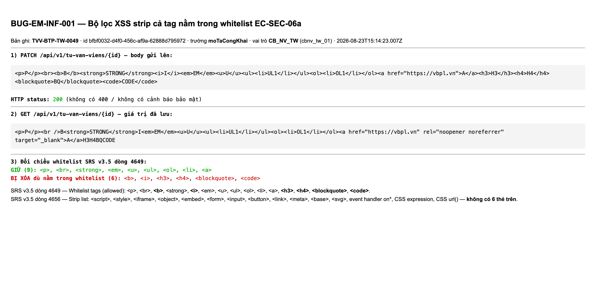
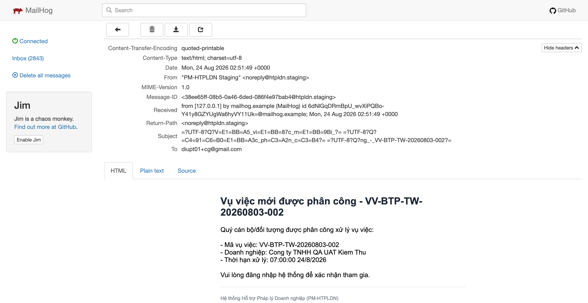
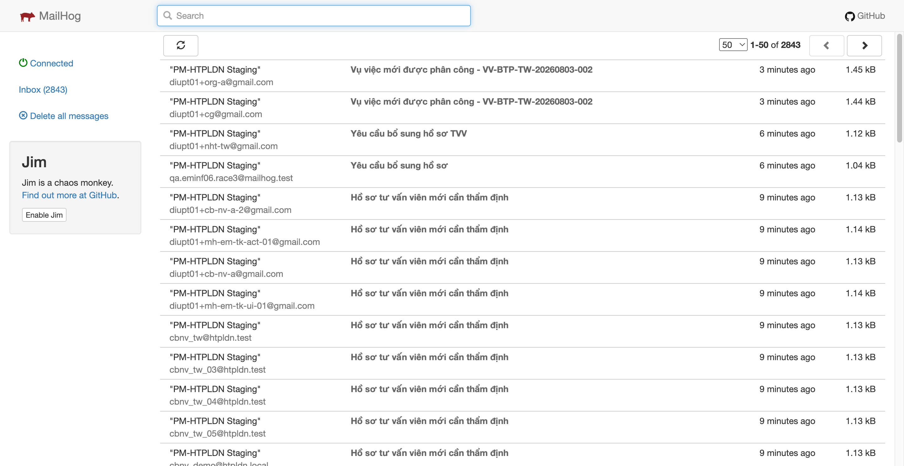

# Bug Report — SMTP, Bảo mật và NFR (file 04)

| Thông tin | Giá trị |
|-----------|---------|
| **Dự án** | PM HTPLDN — UAT reverify email |
| **Môi trường** | https://18.143.165.120.nip.io (MailHog http://18.143.165.120:8025) |
| **Người test** | QA Automation |
| **Ngày** | 2026-08-25 11:07:59 |
| **Loại test** | Security / Integration |
| **Round** | File 04 · Batch 2 — Bảo mật nội dung thư · Batch 3 — Toàn vẹn dữ liệu và chống gửi trùng |
| **Tài liệu tham chiếu** | [04-TC-email-smtp-security-nfr.md](../04-TC-email-smtp-security-nfr.md) · SRS v3.5 `Docs-PM-HTPLDN/_bmad-output/planning-artifacts/srs-v3.5/` |

---

## Tổng hợp

Phát hiện **2** lỗi có SRS reference cụ thể khi chạy file 04 — batch 2 (EM-INF-08, 10, 11, 12, 13, 19) và batch 3 (EM-INF-06, 07, 09, 15, 18, 20, 21). Cả 2 đều đang Open.

### Severity breakdown

| Tổng | Critical | Major | Medium | Minor | Trivial | Closed | Open |
|------|----------|-------|--------|-------|---------|--------|------|
| 2    | 0        | 0     | 0      | 2     | 0       | 2      | 0    |

## Bug Summary Table

| Bug ID | Severity | Priority | Type | TC Ref | **SRS Reference** | Title | Status |
|--------|----------|----------|------|--------|-------------------|-------|--------|
| BUG-EM-INF-001 | Minor | P3 | Data | EM-INF-10 | `EC-SEC-06a §2 Whitelist tags; srs-v3.5.md:4649` + `Strip list; srs-v3.5.md:4656` + `Xử lý vi phạm; srs-v3.5.md:4663` | Bộ lọc XSS xóa cả 6 thẻ nằm trong danh sách được phép của EC-SEC-06a (`b`, `i`, `h3`, `h4`, `blockquote`, `code`) | Closed |
| BUG-EM-INF-002 | Minor | P3 | Workflow | EM-INF-09 | `FR-V.I-04 §Processing Bước 7; srs-fr-05-vu-viec.md:750` + `BR-NOTIF-01 nhóm V.I; srs-fr-05-vu-viec.md:2496` + `Acceptance; srs-fr-05-vu-viec.md:787` | Phân công vụ việc qua tổ chức tư vấn: thư báo cho tư vấn viên không có người nhận bản sao, điểm liên hệ tổ chức nhận một thư riêng | Closed |

---

## ~~BUG-EM-INF-001~~ [CLOSED] — Bộ lọc XSS xóa cả 6 thẻ nằm trong danh sách được phép của EC-SEC-06a

> **Re-test:** 2026-08-25 11:06:11 R3 — ✅ PASS (Closed-verified). PATCH 200; GET giữ đủ 15 thẻ whitelist, gồm 6 thẻ từng bị xóa; fixture đã hoàn nguyên.

**Bằng chứng R3:** PATCH 200 và GET đọc lại còn đủ 15 thẻ whitelist, gồm cả `<b>`, `<i>`, `<h3>`, `<h4>`, `<blockquote>`, `<code>` từng bị xóa. Fixture đã hoàn nguyên sau kiểm tra. Xem [ảnh API](image/bug-em-inf-001-r3-all-whitelist-tags-preserved-2026-08-25.png) và [condition table](../cond/BUG-EM-INF-001.md).

### Mô tả

Khi lưu nội dung công khai của hồ sơ tư vấn viên (`moTaCongKhai` — nội dung được đẩy lên Cổng pháp luật quốc gia), bộ lọc phía máy chủ xóa cả những thẻ HTML mà SRS liệt kê trong danh sách **được phép**. Sáu thẻ `<b>`, `<i>`, `<h3>`, `<h4>`, `<blockquote>`, `<code>` bị xóa, chỉ giữ lại phần chữ; trong khi `<p>`, `<br>`, `<strong>`, `<em>`, `<u>`, `<ul>`, `<ol>`, `<li>`, `<a href="https://…">` được giữ nguyên. Sáu thẻ này không nằm trong danh sách bắt buộc xóa của SRS.

### Các bước tái hiện

1. Đăng nhập vai trò `CB_NV_TW` (`cbnv_tw_01`) — vai trò có quyền tạo/cập nhật hồ sơ tư vấn viên cùng đơn vị theo `srs-v3.5.md:1411` (ô `CRU*◈` cho ba trường nội dung công khai).
2. Chọn hồ sơ tư vấn viên `TVV-BTP-TW-0049` (id `bfbf0032-d4f0-456c-af9a-62888d795972`, đơn vị Cục Bổ trợ tư pháp - Bộ Tư pháp).
3. Gọi `PATCH /api/v1/tu-van-viens/{id}` với `moTaCongKhai` chứa đúng 15 thẻ trong danh sách được phép của SRS:
   `<p>P</p><br><b>B</b><strong>STRONG</strong><i>I</i><em>EM</em><u>U</u><ul><li>UL1</li></ul><ol><li>OL1</li></ol><a href="https://vbpl.vn">A</a><h3>H3</h3><h4>H4</h4><blockquote>BQ</blockquote><code>CODE</code>`
4. Gọi `GET /api/v1/tu-van-viens/{id}` đọc lại `moTaCongKhai`.
5. Quan sát: 9 thẻ còn, 6 thẻ mất.

### Kết quả mong đợi

- Theo `srs-v3.5.md:4649` (EC-SEC-06a §2): *"Whitelist tags (allowed): `<p>, <br>, <b>, <strong>, <i>, <em>, <u>, <ul>, <ol>, <li>, <a>, <h3>, <h4>, <blockquote>, <code>`. KHÔNG cho phép tags khác."* — mười lăm thẻ này là tập được phép tồn tại trong nội dung sau khi lọc.
- Theo `srs-v3.5.md:4656`: *"Strip list (luôn xóa bất kể context): `<script>, <style>, <iframe>, <object>, <embed>, <form>, <input>, <button>, <link>, <meta>, <base>, <svg>`, toàn bộ event handlers (`on*`), CSS expressions, CSS url()."* — sáu thẻ `b`, `i`, `h3`, `h4`, `blockquote`, `code` không nằm trong danh sách phải xóa.
- Theo `srs-v3.5.md:4663`, câu thông báo chuẩn khi nội dung vi phạm còn nói rõ với người dùng rằng định dạng cơ bản gồm *"đậm, nghiêng, list, link"* — tức nội dung in đậm và in nghiêng phải dùng được.
- Vì vậy khi yêu cầu được chấp nhận, nội dung lưu lại phải còn đủ các thẻ thuộc danh sách được phép.

### Kết quả thực tế

- `PATCH` trả `200`. Giá trị lưu lại:
  `<p>P</p><br />B<strong>STRONG</strong>I<em>EM</em><u>U</u><ul><li>UL1</li></ul><ol><li>OL1</li></ol><a href="https://vbpl.vn" rel="noopener noreferrer" target="_blank">A</a>H3H4BQCODE`
- Giữ (9): `<p>`, `<br>`, `<strong>`, `<em>`, `<u>`, `<ul>`, `<ol>`, `<li>`, `<a>`.
- Xóa mất (6): `<b>`, `<i>`, `<h3>`, `<h4>`, `<blockquote>`, `<code>` — chỉ còn phần chữ `B`, `I`, `H3`, `H4`, `BQ`, `CODE`.
- Lặp lại với nội dung chỉ có cặp đậm/nghiêng: gửi `<b>Chu dam (the b)</b> - <strong>Chu dam (the strong)</strong> - <i>Chu nghieng (the i)</i> - <em>Chu nghieng (the em)</em> - <code>Ma nguon (the code)</code>` → lưu lại `Chu dam (the b) - <strong>Chu dam (the strong)</strong> - Chu nghieng (the i) - <em>Chu nghieng (the em)</em> - Ma nguon (the code)`. Cùng một ý nghĩa định dạng nhưng viết bằng `<b>` / `<i>` thì mất, viết bằng `<strong>` / `<em>` thì còn.
- Phần chặn nội dung nguy hiểm vẫn đúng: `<script>`, `` bị xóa hẳn, `href="javascript:…"` bị gỡ thuộc tính.

### Bằng chứng

**1. Ảnh chụp:**



**2. API response:**

```json
// PATCH /api/v1/tu-van-viens/bfbf0032-d4f0-456c-af9a-62888d795972  -> 200
// body gửi lên
{"moTaCongKhai":"<p>P</p><br><b>B</b><strong>STRONG</strong><i>I</i><em>EM</em><u>U</u><ul><li>UL1</li></ul><ol><li>OL1</li></ol><a href=\"https://vbpl.vn\">A</a><h3>H3</h3><h4>H4</h4><blockquote>BQ</blockquote><code>CODE</code>","version":8}

// GET /api/v1/tu-van-viens/bfbf0032-d4f0-456c-af9a-62888d795972  -> 200
{"moTaCongKhai":"<p>P</p><br />B<strong>STRONG</strong>I<em>EM</em><u>U</u><ul><li>UL1</li></ul><ol><li>OL1</li></ol><a href=\"https://vbpl.vn\" rel=\"noopener noreferrer\" target=\"_blank\">A</a>H3H4BQCODE"}
```

### So sánh (Comparison)

| Thẻ gửi lên | SRS xếp nhóm | Sau khi lưu |
|---|---|---|
| `<p>` `<br>` `<strong>` `<em>` `<u>` `<ul>` `<ol>` `<li>` `<a href=https>` | Được phép (4649) | Giữ |
| `<b>` `<i>` `<h3>` `<h4>` `<blockquote>` `<code>` | Được phép (4649) | **Bị xóa** |
| `<script>` `` `href="javascript:"` | Luôn xóa (4656) | Bị xóa (đúng) |

---

## ~~BUG-EM-INF-002~~ [CLOSED] — Phân công vụ việc qua tổ chức tư vấn: thư báo cho tư vấn viên không có người nhận bản sao, điểm liên hệ tổ chức nhận một thư riêng

> **Re-test:** 2026-08-25 11:07:59 R3 — ✅ PASS (Closed-verified). Một thư duy nhất: TVV ở To, email tổ chức ở Cc; không Bcc và không còn thư tách riêng.

**Bằng chứng R3:** phân công `VV-BTP-TW-20260805-001` trả 201 và chỉ sinh một thư mới (`Message-ID <ef7d10fd-aa53-97e1-d323-4d44196c8c4a@htpldn.staging>`), `To: diupt01+cg@gmail.com`, `Cc: diupt01+org-a@gmail.com`, không Bcc hay thư tách riêng. Xem [MailHog API](image/bug-em-inf-002-r3-single-message-to-cc-2026-08-25.png) và [condition table](../cond/BUG-EM-INF-002.md).

### Mô tả

Khi cán bộ nghiệp vụ phân công vụ việc theo hình thức **Tổ chức tư vấn** (`loai_doi_tuong_xu_ly = 'TO_CHUC'`), hệ thống phát **hai thư riêng biệt** cùng tiêu đề và cùng nội dung: một thư gửi tư vấn viên được cử, một thư gửi điểm liên hệ của tổ chức. Thư gửi tư vấn viên **không có người nhận bản sao nào** (không có dòng `Cc` trong phần đầu thư), nên người được phân công không thấy tổ chức của mình đã được báo, và bản của tổ chức không phải là bản sao của thư gốc mà là một thư độc lập với `Message-ID` khác.

### Các bước tái hiện

1. Đăng nhập vai trò `CB_NV_TW` (`cbnv_tw_01`, Cục Bổ trợ tư pháp - Bộ Tư pháp) — vai trò được phép phân công vụ việc cùng đơn vị theo `srs-fr-05-vu-viec.md:1756` (nút **[Phân công]** ở trạng thái `DA_TIEP_NHAN`).
2. Chuẩn bị 2 tổ chức có địa chỉ thư riêng: tổ chức A `TCTV-SEED-0001` (`diupt01+org-a@gmail.com`, Cục Bổ trợ tư pháp - Bộ Tư pháp) và tổ chức B `TC-STP-AG-0001` (`diupt01+org-b@gmail.com`, Sở Tư pháp An Giang). Tư vấn viên A `TVV-BTP-TW-0002` thuộc tổ chức A, tài khoản `qa_tvvseed28`, `TAI_KHOAN.email = diupt01+cg@gmail.com`. Tư vấn viên B `TVV-STP-AG-0001` thuộc tổ chức B, `diupt01+tvv-ag@gmail.com`.
3. Ghi mốc thời gian trước khi kích hoạt (02:51:42Z) để lát nữa lọc thư theo cửa sổ thời gian. Lưu ý: API MailHog trả tối đa 250 thư mỗi lượt, phải phân trang quét hết hộp thư mới đếm đúng.
4. Phân công vụ việc `VV-BTP-TW-20260803-002` (id `4f340b58-ce76-4274-86ad-a0e3cd0c638d`, trạng thái `DA_TIEP_NHAN`) theo hình thức tổ chức: chọn tổ chức A + tư vấn viên A.
5. Chờ 45 giây, quét toàn bộ hộp thư MailHog (2844 thư, phân trang 250 thư mỗi lượt), lọc các thư sinh trong khoảng 02:51:42Z-02:52:27Z, rồi mở phần đầu thư (headers) của thư gửi tư vấn viên A.

### Kết quả mong đợi

- Theo `srs-fr-05-vu-viec.md:750` (FR-V.I-04 §Processing bước 7): *"Gửi thông báo trong hệ thống + email cho cá nhân được phân công (TVV cụ thể, cả 2 loại); nếu `loai='TO_CHUC'` **kèm CC email cho điểm liên hệ chính của tổ chức**"*.
- Theo `srs-fr-05-vu-viec.md:2496` (BR-NOTIF-01 áp cho nhóm V.I): *"Khi `loai_doi_tuong_xu_ly='TO_CHUC'`: **kèm CC email tới điểm liên hệ tổ chức** (`TO_CHUC_TU_VAN.email_lien_he`)"*.
- Theo `srs-fr-05-vu-viec.md:787` (Acceptance): *"gửi thông báo TVV được cử + **CC email TC TV**"*.
- Vì vậy thư báo phân công gửi tư vấn viên được cử phải có điểm liên hệ của tổ chức ở dòng người nhận bản sao; tổ chức B và tư vấn viên B không được nhận gì.

### Kết quả thực tế

- Phân công trả `201`, vụ việc chuyển `DA_TIEP_NHAN` -> `DA_PHAN_CONG` (version 3 -> 4) — phần nghiệp vụ đúng.
- MailHog sinh **2 thư** cách nhau 4 ms, cùng tiêu đề `Vụ việc mới được phân công - VV-BTP-TW-20260803-002` và **thân thư giống hệt nhau**:
  - `To: diupt01+cg@gmail.com`, `Message-ID: <38ee65ff-08b5-0a46-6ded-086f4e97bab4@htpldn.staging>` — phần đầu thư chỉ có `Content-Transfer-Encoding`, `Content-Type`, `Date`, `From`, `MIME-Version`, `Message-ID`, `Received`, `Return-Path`, `Subject`, `To`. **Không có dòng `Cc`, cũng không có `Bcc`.** Người nhận ở tầng SMTP (`Raw.To`) đúng 1 địa chỉ.
  - `To: diupt01+org-a@gmail.com`, `Message-ID: <df6b08c5-82c5-debf-9ce6-e2643275017b@htpldn.staging>` — cũng chỉ 1 người nhận, không `Cc`/`Bcc`.
- Trong cửa sổ 02:51:42Z-02:52:27Z, quét hết 2844 thư của hộp thư: **đúng 2 thư** nói trên, không có thư nào khác. Tổ chức B `diupt01+org-b@gmail.com` không có thư nào trong toàn bộ hộp thư (0/2844); tư vấn viên B `diupt01+tvv-ag@gmail.com` có 5 thư cũ từ các đợt trước nhưng **không có thư nào** trong cửa sổ này. Vế mailbox âm (tổ chức B và tư vấn viên B không nhận) **đạt**.
- Đây là hành vi chung của hệ thống chứ không riêng luồng này: đợt kiểm `EM-INF-08` đã quét 2744 thư trong MailHog và không có thư nào mang dòng `Cc` hoặc `Bcc`.

### Bằng chứng

**1. Ảnh chụp:**





**2. API response / dữ liệu thư:**

```json
// POST /api/v1/vu-viecs/4f340b58-ce76-4274-86ad-a0e3cd0c638d/phan-cong -> 201
{"tvvId":"98cfd963-3cd3-4c8a-bfa9-625460824d6d","toChucTuVanId":"5eed0004-0000-4000-8000-000000000001","ghiChu":"EM-INF-09 phan cong qua to chuc A"}
// -> data.trangThai = "DA_PHAN_CONG", data.version = 4

// MailHog /api/v2/messages (quét hết 2844 thư, lọc cửa sổ 02:51:42Z-02:52:27Z) — đúng 2 bản ghi, cùng sinh lúc 02:51:49Z
{"To":["diupt01+cg@gmail.com"],    "Cc":[], "Bcc":[], "Message-ID":"<38ee65ff-08b5-0a46-6ded-086f4e97bab4@htpldn.staging>"}
{"To":["diupt01+org-a@gmail.com"], "Cc":[], "Bcc":[], "Message-ID":"<df6b08c5-82c5-debf-9ce6-e2643275017b@htpldn.staging>"}
```

### So sánh (Comparison)

| Địa chỉ | Vai trò trong luồng | SRS yêu cầu | Thực tế |
|---|---|---|---|
| `diupt01+cg@gmail.com` | Tư vấn viên A được cử | Người nhận chính (`To`) | `To` — đúng |
| `diupt01+org-a@gmail.com` | Điểm liên hệ tổ chức A | Người nhận **bản sao** trên chính thư gửi tư vấn viên A | Nhận **thư riêng** với `To` của chính họ, `Message-ID` khác |
| `diupt01+org-b@gmail.com` | Điểm liên hệ tổ chức B | Không nhận | Không nhận — đúng |
| `diupt01+tvv-ag@gmail.com` | Tư vấn viên B | Không nhận | Không nhận — đúng |

---

## Phụ lục — Môi trường test

| Thành phần | Giá trị |
|------------|---------|
| URL ứng dụng | https://18.143.165.120.nip.io/login |
| OTP login | Lấy từ MailHog theo địa chỉ của từng tài khoản |
| MailHog (OTP inbox) | http://18.143.165.120:8025 |
| API base | https://18.143.165.120.nip.io/api/v1 |
| Frontend | React + Ant Design v5 (HTPLDN V1.0.15) |
| Xác thực | JWT cookie + OTP qua email |
| Tool test | Chrome DevTools MCP |

---

*Bug report cập nhật: 2026-08-24 02:55:00 | QA Automation via Claude Code*
