# Bug Report — Email Tài khoản

| Thông tin | Giá trị |
|-----------|---------|
| **Dự án** | PM-HTPLDN |
| **Môi trường** | DEV — https://18.143.165.120.nip.io |
| **Người test** | QA Automation |
| **Ngày** | 2026-08-25 11:25:08 |
| **Loại test** | Functional / UI |
| **Round** | Reverify week email |
| **Tài liệu tham chiếu** | `01-TC-email-tai-khoan.md`; LOCAL SRS v3.5 `srs-fr-10-quan-tri.md` |

---

## Tổng hợp

Còn lại **9 bug record** có SRS reference cụ thể: **8 lỗi mở, 1 lỗi đã đóng**. BUG-EM-TK-008 được đóng sau khi recheck đúng thư và hoàn tất luồng token một lần dùng; SRS không quy định SLA thư phải đến trong 5 phút. Vấn đề cột `Ngày tạo` đã được hợp nhất tại mục [`BA-CLAR-EM-TK-001`](../BA%20confirm/ba-confirmation-needed-reverify-week-email-consolidated-2026-08-25.md#ba-clar-em-tk-001--em-tk-ui-01--cột-ngày-tạo-và-đăng-nhập-cuối) vì FR Outputs và SCR-VIII-03 chưa thống nhất.

> **Rà soát lại 2026-08-24 (chạy lại trên DEV bằng Chrome DevTools MCP + đếm hộp thư MailHog):** đã gỡ 8 phiếu không phải lỗi.
> - 3 phiếu kết luận sai vì tra hộp thư Gmail thật, còn môi trường DEV phát thư vào MailHog: **TK-005** (phê duyệt TVV-BTP-TW-0003 lúc 11:30:39 → thư *"Hồ sơ TVV đã được phê duyệt — kích hoạt tài khoản"* về 11:30:40), **TK-006** (tạo Người hỗ trợ 11:28:37 → thư kích hoạt về 11:28:38), **TK-009** (doanh nghiệp tự đăng ký 11:25:12 → thư *"Kích hoạt tài khoản doanh nghiệp HTPLDN"* về cùng giây).
> - 6 phiếu chỉ lệch câu chữ so với cột "Phản hồi hệ thống" của đặc tả, còn hành vi và mã lỗi đều đúng, người dùng hiểu và làm được đúng việc cần làm: **TK-004**, **TK-010**, **TK-011**, **TK-012**, **TK-014**, **TK-015**. Riêng TK-004 còn có một mô tả sai sự thật: giao diện CÓ hiện thông báo "Email đã tồn tại trong hệ thống" (bắt được lúc 11:05:42 ngày 24/08), không phải "không hiển thị lỗi" như phiếu ghi. Riêng TK-010: tài khoản CÓ thật (`0409998821`) hiện đúng cùng một câu với tài khoản không tồn tại, nên mục đích chống dò tài khoản của đặc tả vẫn đạt.
> - **TK-013** nâng lên Critical sau khi chạy lại: tài khoản bị QTHT tạm khóa vẫn tự đặt lại mật khẩu, đăng nhập lại được và tự trở về `Hoạt động` mà không ai mở khóa. Phiếu nay chỉ còn đúng một nội dung — lỗi hành vi ở nhánh `Tạm khóa`, dev fix được ngay, không chờ ai. Chuyện câu chữ phản hồi đã được hợp nhất tại mục [`BA-CLAR-EM-TK-002`](../BA%20confirm/ba-confirmation-needed-reverify-week-email-consolidated-2026-08-25.md#ba-clar-em-tk-002--em-tk-pwd-06-em-tk-pwd-07--tài-khoản-khóa-dùng-câu-trung-tính-hay-báo-rõ-trạng-thái) và không còn nằm trong phiếu bug.

### Severity breakdown

| Tổng | Critical | Major | Medium | Minor | Trivial | Closed | Open |
|------|----------|-------|--------|-------|---------|--------|------|
| 9 | 1 | 6 | 2 | 0 | 0 | 9 | 0 |

## Bug Summary Table

| Bug ID | Severity | Priority | Type | TC Ref | **SRS Reference** | Title | Status |
|--------|----------|----------|------|--------|-------------------|-------|--------|
| BUG-EM-TK-002 | Medium | P0 | UI/UX | EM-TK-UI-01 | `SCR-VIII-03 Form tạo/sửa TK row 21; srs-fr-10:1740` | Form sửa tài khoản doanh nghiệp thiếu trường Vai trò | Closed |
| BUG-EM-TK-003 | Medium | P0 | UI/UX | EM-TK-UI-02 | `SCR-VIII-08 row 14; srs-fr-10:1924` | Tooltip Email doanh nghiệp thiếu các mục đích sử dụng theo SRS | Closed |
| BUG-EM-TK-007 | Major | P0 | Workflow | EM-TK-ACT-08 | `FR-VIII-26 E4 ERR-PWD-04` | Link đặt mật khẩu lần đầu đã dùng hiển thị form và trả sai thông báo | Closed |
| BUG-EM-TK-008 | Major | P0 | Workflow | EM-TK-ACT-09 | `SCR-VIII-03 srs-fr-10:1726; FR-VIII-26 Processing#5 srs-fr-10:1322` | Gửi lại email kích hoạt chưa thấy thư trong cửa sổ kiểm tra ban đầu | Closed |
| BUG-EM-TK-013 | Critical | P0 | Workflow/Negative | EM-TK-PWD-06 | `FR-VIII-26 Preconditions + Processing#4a,#13; srs-fr-10:1298,1319,1330` | Tài khoản bị QTHT tạm khóa vẫn tự đặt lại mật khẩu và đăng nhập lại được | Closed |
| BUG-EM-TK-016 | Major | P0 | Workflow | EM-TK-ACT-06 (setup) | `FR-VIII-22 Processing#12; srs-fr-10:1090,1119` | Gửi lại email kích hoạt cho DN sinh sai link đặt mật khẩu lần đầu | Closed |
| BUG-EM-TK-017 | Major | P1 | Workflow | EM-TK-CHG-04 | `BR-AUTH-EMAIL-01; srs-v3.5.md:5640` + `entity TAI_KHOAN.email; srs-v3.5.md:2126` | Thông báo workflow của vụ việc gửi tới DOANH_NGHIEP.email thay vì TAI_KHOAN.email | Closed |
| BUG-EM-TK-018 | Major | P1 | Data | EM-TK-CHG-06 | `SCR-VIII-10 row 9; srs-fr-10:1989` + `Quy tac tuong tac; srs-fr-10:1995` | Nhật ký hệ thống không lưu Dữ liệu cũ cho thao tác Sửa tài khoản nên không có JSON diff old→new | Closed |
| BUG-EM-TK-019 | Major | P1 | Data | EM-TK-CHG-06 | `FR-VIII-28 Inputs row 4; srs-fr-10:1392` + `bảng Entity → Module; srs-v3.5.md:1268` | Cột Module của nhật ký hệ thống bỏ trống với entity TAI_KHOAN (và một phần TU_VAN_VIEN / NGUOI_HO_TRO) | Closed |

---

## ~~BUG-EM-TK-002~~ [CLOSED] — Form sửa tài khoản doanh nghiệp thiếu trường Vai trò

> **Re-test:** 2026-08-25 11:10:43 R3 — ✅ PASS (Closed-verified). Form sửa DN có trường Vai trò bắt buộc, dạng multi-select và giữ role hiện tại; không lưu thay đổi.

**Bằng chứng R3:** form sửa tài khoản DN `9908070802` đã hiển thị `* Vai trò`; control là multi-select và giữ chip `Doanh nghiep`. Không lưu thay đổi. Xem [ảnh form](image/bug-em-tk-002-r3-edit-form-co-vai-tro-2026-08-25.png) và [condition table](../cond/BUG-EM-TK-002.md).

### Mô tả

QTHT mở form sửa một tài khoản doanh nghiệp ở trạng thái Chờ kích hoạt. Form không hiển thị trường `Vai trò`, trong khi SCR-VIII-03 quy định multi-select Vai trò bắt buộc trên trang tạo/sửa.

### Các bước tái hiện

1. Đăng nhập vai trò `QTHT`, có quyền sửa tài khoản theo FR-VIII-15/SCR-VIII-03.
2. Mở `Quản trị hệ thống > Tài khoản & phân quyền`.
3. Tại tài khoản doanh nghiệp `9908070802`, bấm biểu tượng sửa.
4. Quan sát form `Chỉnh sửa tài khoản` không có trường `Vai trò`.

### Kết quả mong đợi

- Form tạo/sửa hiển thị trường `Vai trò` dạng multi-select, bắt buộc, theo SCR-VIII-03 row 21.

### Kết quả thực tế

- Form sửa chỉ có Tên đăng nhập, Họ tên, Email, Điện thoại, Loại tài khoản và Đơn vị; không có Vai trò.

### Bằng chứng

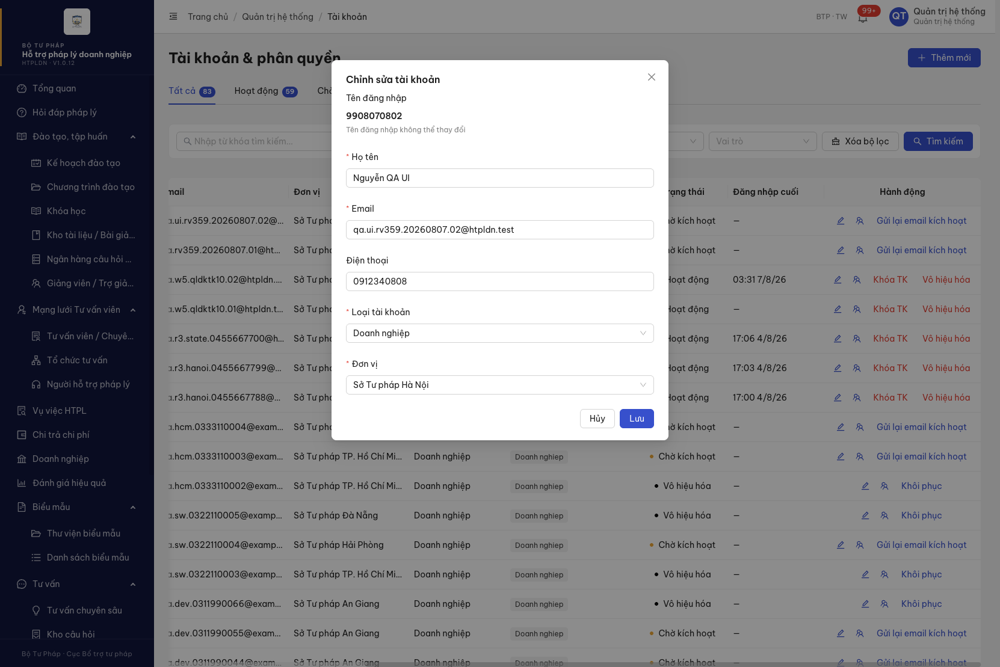

### So sánh (Comparison)

| Form | Trường Vai trò |
|---|---|
| Tạo mới | Có, bắt buộc |
| Sửa tài khoản doanh nghiệp | Không có |

---

## ~~BUG-EM-TK-003~~ [CLOSED] — Tooltip Email doanh nghiệp thiếu các mục đích sử dụng theo SRS

> **Re-test:** 2026-08-25 11:11:33 R3 — ✅ PASS (Closed-verified). Tooltip đã nêu đủ login, kích hoạt, reset mật khẩu, thông báo và email liên hệ DN.

**Bằng chứng R3:** tooltip đã nêu đủ login, nhận mail kích hoạt, reset mật khẩu, thông báo và email liên hệ DN; đồng thời giải thích hai trường có thể đổi độc lập sau đăng ký. Xem [ảnh tooltip](image/bug-em-tk-003-r3-tooltip-day-du-2026-08-25.png) và [condition table](../cond/BUG-EM-TK-003.md).

### Mô tả

Tại form DN tự đăng ký, tooltip của trường Email chỉ nêu nhận link kích hoạt và liên hệ chính thức. Nội dung không nêu email dùng cho login, reset mật khẩu và thông báo như SCR-VIII-08 yêu cầu.

### Các bước tái hiện

1. Truy cập màn `Đăng ký tài khoản doanh nghiệp` với tác nhân DN chưa có tài khoản theo SCR-VIII-08.
2. Di chuột vào biểu tượng trợ giúp cạnh trường `Email doanh nghiệp`.
3. Đọc nội dung tooltip.
4. Quan sát tooltip hiển thị: `Email này dùng để nhận link kích hoạt và liên hệ chính thức`.

### Kết quả mong đợi

- Tooltip nêu email dùng cho login, nhận mail kích hoạt, reset mật khẩu, thông báo và đồng thời là email liên hệ của DN, theo SCR-VIII-08 row 14.

### Kết quả thực tế

- Tooltip chỉ nêu nhận link kích hoạt và liên hệ chính thức; thiếu login, reset mật khẩu và thông báo.

### Bằng chứng

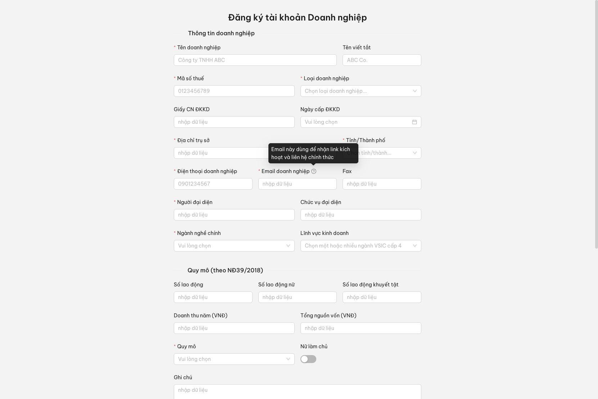

### So sánh (Comparison)

| Nội dung | SRS | Actual DEV |
|---|---|---|
| Login | Có | Thiếu |
| Kích hoạt | Có | Có |
| Reset mật khẩu | Có | Thiếu |
| Thông báo | Có | Thiếu |
| Email liên hệ DN | Có | Có |

---

## ~~BUG-EM-TK-007~~ [CLOSED] — Link đặt mật khẩu lần đầu đã dùng hiển thị form và trả sai thông báo

> **Re-test:** 2026-08-25 11:13:16 R3 — ✅ PASS (Closed-verified). Link dùng lần hai không hiện form; validate trả reason=USED và UI hướng dẫn yêu cầu link mới/đăng nhập.

**Bằng chứng R3:** dùng link của `0127000002` đặt mật khẩu thành công một lần, sau đó mở lại chính token: API validate trả `valid=false, reason=USED`; UI không còn form và hiển thị `Link đặt mật khẩu đã được sử dụng. Vui lòng yêu cầu link mới`. Xem [ảnh UI](image/bug-em-tk-007-r3-used-link-message-2026-08-25.png) và [condition table](../cond/BUG-EM-TK-007.md).

### Mô tả

Người dùng mở lại link đặt mật khẩu lần đầu đã sử dụng thành công. UI vẫn hiển thị form cho phép nhập mật khẩu; khi submit, API trả lỗi phiên hết hạn và giao diện chuyển về đăng nhập, không hiển thị ERR-PWD-04 theo SRS.

### Các bước tái hiện

1. Với tài khoản cán bộ `cb_email_01`, dùng link kích hoạt để đặt mật khẩu lần đầu thành công và đăng nhập xác nhận tài khoản hoạt động.
2. Mở lại đúng link `auth/first-login-password` vừa dùng.
3. Quan sát form vẫn có hai trường mật khẩu; nhập mật khẩu hợp lệ khác và bấm `Đặt mật khẩu`.
4. Quan sát UI và response `POST /api/v1/auth/first-login-password`.

### Kết quả mong đợi

- Theo FR-VIII-26 E4 ERR-PWD-04, hệ thống hiển thị `Link đặt mật khẩu đã được sử dụng. Vui lòng yêu cầu link mới`.
- Không cho đổi mật khẩu/trạng thái lần hai và không tạo session/token mới.

### Kết quả thực tế

- Link đã dùng vẫn mở form đặt mật khẩu như link còn hiệu lực.
- Submit trả 401 `ERR-AUTH-VIII-20-08` với message `Phiên đổi mật khẩu đã hết hạn. Vui lòng mở lại link kích hoạt trong email.`, sau đó UI hiển thị lỗi phiên làm việc và chuyển về đăng nhập.

### Bằng chứng

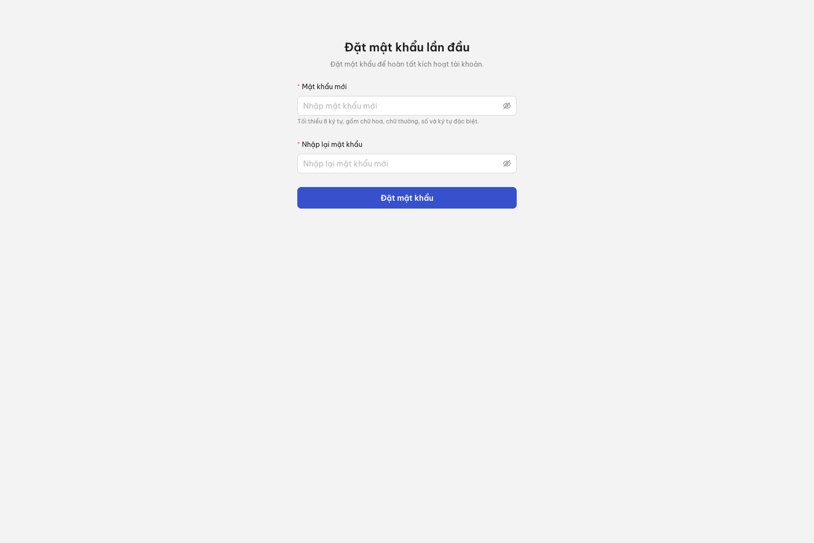

```json
{
  "success": false,
  "error": {
    "code": "ERR-AUTH-VIII-20-08",
    "message": "Phiên đổi mật khẩu đã hết hạn. Vui lòng mở lại link kích hoạt trong email."
  }
}
```

### So sánh (Comparison)

| Nội dung | Expected ERR-PWD-04 | Actual DEV |
|---|---|---|
| Khi mở link đã dùng | Báo link đã được sử dụng | Vẫn hiện form đặt mật khẩu |
| Khi submit | `Link đặt mật khẩu đã được sử dụng. Vui lòng yêu cầu link mới` | `Phiên đổi mật khẩu đã hết hạn...` rồi chuyển về đăng nhập |

---

## BUG-EM-TK-008 — Gửi lại email kích hoạt chưa thấy thư trong cửa sổ kiểm tra ban đầu

### Mô tả

QTHT bấm Gửi lại email kích hoạt cho tài khoản cán bộ đang `CHO_KICH_HOAT`. Trong cửa sổ kiểm tra ban đầu 5 phút chưa thấy thư nên bug được mở. Recheck sau đó tìm thấy đúng thư đích và hoàn tất được toàn bộ luồng; do SRS không quy định SLA nhận thư 5 phút, bug được đóng.

### Các bước tái hiện

1. Đăng nhập vai trò `QTHT`, có quyền quản lý tài khoản và gửi lại email kích hoạt theo SCR-VIII-03.
2. Mở `Quản trị hệ thống > Tài khoản & phân quyền`, tìm `uat_em_tk_val_03_20260812` ở trạng thái `Chờ kích hoạt`; lưu link cũ trong Gmail.
3. Bấm `Gửi lại email kích hoạt` đúng một lần.
4. Quan sát response/UI và tìm `to:(diupt01+uat-em-tk-val-03@gmail.com)` trong Gmail thật qua CDP `127.0.0.1:9223` đến đủ 5 phút.
5. Đối chiếu thời gian và URL của các thư trong Gmail.

### Kết quả mong đợi

- Theo SCR-VIII-03 và FR-VIII-26 Processing#5, hành động gửi lại phải phát sinh email kích hoạt tới email tài khoản.
- Link trong thư thực hiện đúng luồng kích hoạt và bị từ chối khi dùng lại sau lần sử dụng đầu tiên.

### Kết quả thực tế

- `POST /api/v1/tai-khoan/03a24b51-fbb7-4d88-bcd6-6ddc8ead0013/resend-activation` trả 200, UI báo `Đã gửi lại email kích hoạt`.
- Recheck đúng message `To: diupt01+uat-em-tk-val-03@gmail.com`, username `uat_em_tk_val_03_20260812`; Gmail có thư resend với token `1d4457e6-9528-46ef-8ea8-ff7acda37dcb`.
- Submit link lần đầu trả 200 và kích hoạt/đặt mật khẩu thành công; dùng lại chính link trả 401, không thực hiện lần hai.
- Audit lúc 17:47 ghi `Kích hoạt tài khoản` và `Đổi mật khẩu` cho account `03a24b51-fbb7-4d88-bcd6-6ddc8ead0013`.
- SRS không quy định thời gian tối đa 5 phút cho email delivery, vì vậy quan sát thư đến muộn không đủ điều kiện Fail.

### Bằng chứng

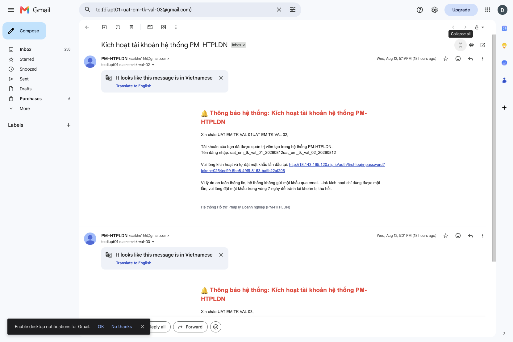

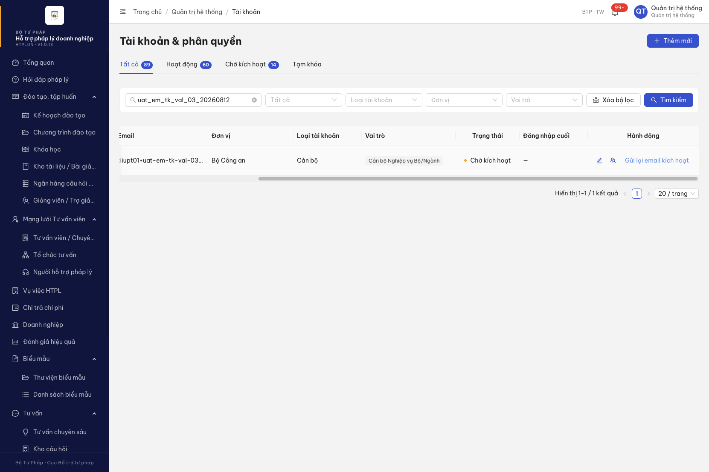

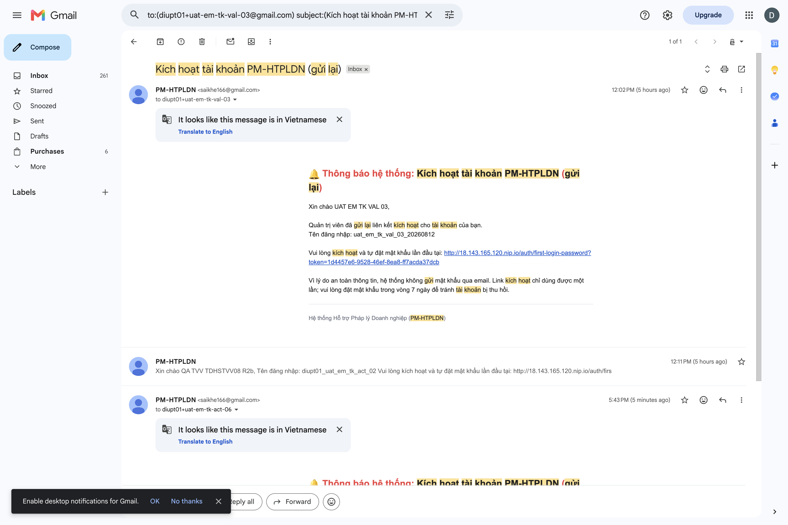

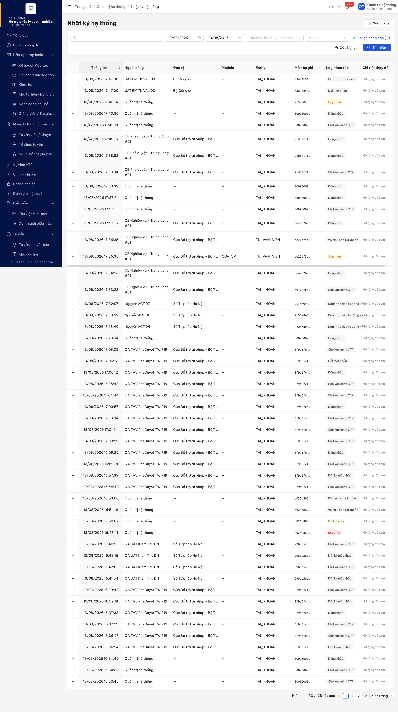

```json
{
  "success": true,
  "data": {
    "message": "Đã gửi lại liên kết kích hoạt qua email"
  }
}
```

### So sánh (Comparison)

| Kiểm tra | Expected | Actual DEV |
|---|---|---|
| API/UI resend | Báo thành công khi thư được phát sinh | Trả 200 và báo thành công |
| Gmail | Nhận email kích hoạt để tiếp tục luồng | Recheck có đúng thư resend; SRS không quy định SLA 5 phút |
| Token một lần dùng | Link hoạt động lần đầu và bị từ chối khi dùng lại | Lần đầu 200; dùng lại cùng link 401 |
| Audit | Có nhật ký thao tác theo BR-DATA-05 | Có log kích hoạt tài khoản và đổi mật khẩu lúc 17:47 |

---

## ~~BUG-EM-TK-013~~ [CLOSED] — Tài khoản bị QTHT tạm khóa vẫn tự đặt lại mật khẩu và đăng nhập lại được

> **Re-test:** 2026-08-25 11:16:21 R3 — ✅ PASS (Closed-verified). TAM_KHOA: forgot-password trả ERR-PWD-02, không sinh thư/token; login 401; QTHT đã hoàn nguyên HOAT_DONG.

**Bằng chứng R3:** khóa `0409998821` về `Tạm khóa`; hai yêu cầu quên mật khẩu đều trả 400 `ERR-PWD-02`, MailHog giữ nguyên 7 thư và không sinh reset token/email; đăng nhập bằng mật khẩu đúng cũng trả 401. QTHT đã mở khóa hoàn nguyên fixture sau kiểm tra. Xem [ảnh quên mật khẩu](image/bug-em-tk-013-r3-forgot-password-blocked-2026-08-25.png), [ảnh đăng nhập](image/bug-em-tk-013-r3-locked-account-login-blocked-2026-08-25.png) và [condition table](../cond/BUG-EM-TK-013.md).

### Mô tả

QTHT tạm khóa một tài khoản, nhưng chính người dùng của tài khoản đó vẫn dùng được luồng "Quên mật khẩu" để nhận link, đặt mật khẩu mới và đăng nhập trở lại. Sau khi đặt mật khẩu, trạng thái tài khoản tự chuyển từ `Tạm khóa` về `Hoạt động`, nên biện pháp khóa của quản trị viên bị vô hiệu hoàn toàn.

### Các bước tái hiện

1. Đăng nhập `admin`, vào `Quản trị hệ thống > Tài khoản & phân quyền`, tìm tài khoản `0409998821` (email `diupt01+uat-em-tk-act-r2@gmail.com`) và bấm khóa tài khoản.
2. Xác minh danh sách hiển thị trạng thái `Tạm khóa`.
3. Mở `Đăng nhập > Quên mật khẩu` ở phiên trình duyệt tách biệt, nhập email của tài khoản trên, bấm `Gửi link đặt lại mật khẩu`.
4. Đếm tổng số thư trong hộp thư trước và sau khi bấm, rồi mở thư mới nhất.
5. Bấm link trong thư, đặt mật khẩu mới và xác nhận.
6. Quay lại màn đăng nhập, đăng nhập bằng chính tài khoản đó với mật khẩu vừa đặt, lấy mã OTP trong hộp thư để hoàn tất.
7. Mở lại danh sách tài khoản và nhật ký hệ thống của tài khoản để đối chiếu trạng thái và chuỗi thao tác.

### Kết quả mong đợi

- Theo `Docs-PM-HTPLDN/_bmad-output/planning-artifacts/srs-v3.5/srs-fr-10-quan-tri.md:1298` (Preconditions của FR-VIII-26): *"Sau khi lookup: tài khoản tương ứng (nếu có) không ở TAM_KHOA/VO_HIEU_HOA"* — luồng quên mật khẩu không áp dụng cho tài khoản đang bị khóa hoặc vô hiệu hóa.
- Theo `srs-fr-10-quan-tri.md:1319` (Processing bước 4a): chỉ nhánh *"Lookup found TAI_KHOAN + không TAM_KHOA/VO_HIEU_HOA"* mới được đi tiếp bước sinh token và gửi thư. Tài khoản đang tạm khóa vì vậy không được sinh token, không được nhận link đặt lại mật khẩu.
- Theo `srs-fr-10-quan-tri.md:1330` (Processing bước 13): *"Nếu TK đang CHO_KICH_HOAT → chuyển HOAT_DONG …; Nếu TK đang HOAT_DONG → giữ nguyên"* — đặc tả không cho phép việc đặt lại mật khẩu tự gỡ trạng thái tạm khóa. Khóa do quản trị viên đặt phải giữ nguyên cho tới khi chính quản trị viên mở.
- Hệ quả: người dùng của tài khoản bị tạm khóa không được đăng nhập trở lại bằng cách tự đặt lại mật khẩu.

### Kết quả thực tế

- 08:32:05 — `admin` khóa tài khoản thành công (`PATCH /api/v1/tai-khoan/ef45bec4…/trang-thai`, mã 200), danh sách hiển thị `Tạm khóa`.
- 08:33:00 — gửi yêu cầu quên mật khẩu bằng email của tài khoản. Giao diện báo `Yêu cầu đã được gửi`. Tổng hộp thư tăng 2903 → 2904, thư `Đặt lại mật khẩu` đề ngày `Mon, 24 Aug 2026 08:32:56 +0000` kèm link `…/reset-password?token=2a40b496-5212-48b0-a261-221d371b30bf`.
- 08:34:37 — mở link, đặt mật khẩu mới thành công và được chuyển về màn đăng nhập.
- 08:35:37 — đăng nhập bằng chính tài khoản đó với mật khẩu mới, qua bước OTP lấy từ hộp thư, vào thẳng màn hình làm việc `/dao-tao/chuong-trinh/danh-sach`.
- Trạng thái tài khoản sau đó là `Hoạt động`. Nhật ký hệ thống của tài khoản **không có bản ghi mở khóa nào** giữa lúc khóa và lúc đăng nhập:

```text
2026-08-24T08:35:37.357Z | LOGIN             | actor=0409998821
2026-08-24T08:35:00.815Z | LOGIN_OTP_PENDING | actor=0409998821
2026-08-24T08:34:37.356Z | RESET_PASSWORD    | actor=0409998821
2026-08-24T08:32:05.202Z | LOCK_ACCOUNT      | actor=admin | PATCH /api/v1/tai-khoan/ef45bec4-940b-4849-86fb-11e6aeff39b6/trang-thai | rc=200
```

- Khoanh vùng: cũng luồng này nhưng với tài khoản đang `Vô hiệu hóa` (`0409998822`, vô hiệu hóa lúc 08:36:45) thì hệ thống **không sinh thư nào** — tổng hộp thư giữ nguyên 2905 suốt 3,5 phút, trong khi đối chứng cùng phiên lúc 08:42:23 trên tài khoản `Hoạt động` cho thư về sau 5 giây. Lỗi vì vậy chỉ nằm ở nhánh `Tạm khóa`, không phải toàn bộ luồng quên mật khẩu.

### Bằng chứng

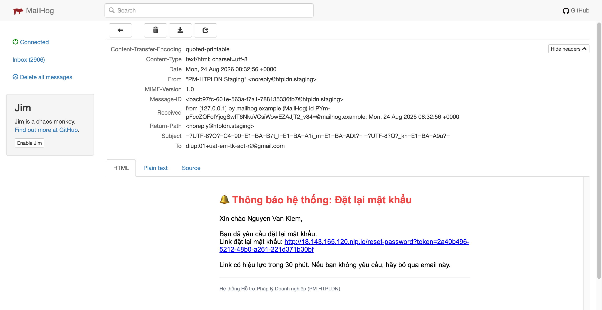

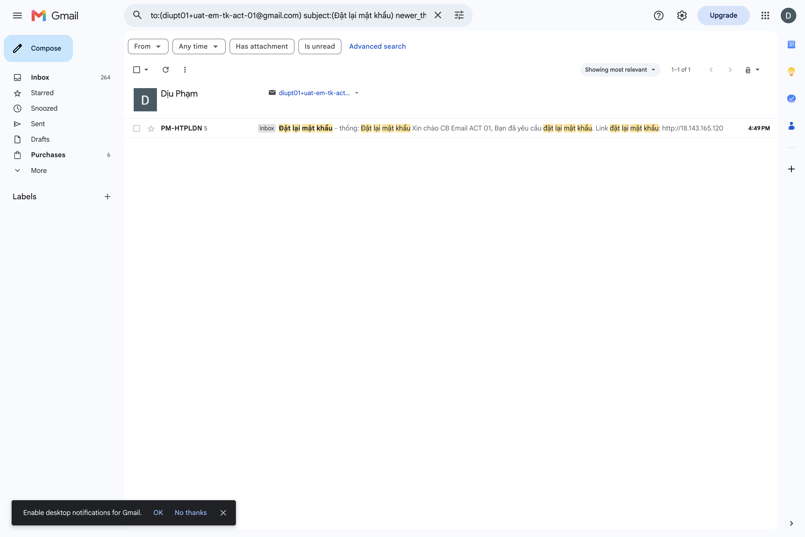

---

## ~~BUG-EM-TK-016~~ [CLOSED] — Gửi lại email kích hoạt cho DN sinh sai link đặt mật khẩu lần đầu

> **Re-test:** 2026-08-25 11:17:52 R3 — ✅ PASS (Closed-verified). Resend DN sinh đúng một thư /auth/verify-email; không có first-login-password; hướng dẫn dùng mật khẩu đã đăng ký.

**Bằng chứng R3:** gửi lại cho DN `0108172026` ở Chờ kích hoạt sinh đúng một thư mới; URL là `/auth/verify-email?token=...`, không có `/auth/first-login-password`; nội dung hướng dẫn dùng mật khẩu đã đặt khi đăng ký. Xem [MailHog API](image/bug-em-tk-016-r3-verify-email-link-2026-08-25.png) và [condition table](../cond/BUG-EM-TK-016.md).

### Mô tả

QTHT gửi lại email kích hoạt cho tài khoản DN tự đăng ký đang `CHO_KICH_HOAT`. Gmail nhận đúng người nhận nhưng nội dung và URL yêu cầu DN đặt mật khẩu lần đầu, trong khi FR-VIII-22 quy định DN đã đặt mật khẩu khi đăng ký và liên kết chỉ được kích hoạt tài khoản.

### Các bước tái hiện

1. Đăng nhập QTHT, có quyền quản lý tài khoản theo FR-VIII-15/SCR-VIII-03.
2. Tạo DN tự đăng ký MST `0108132027`, email `diupt01+uat-em-tk-act-06@gmail.com`, trạng thái `CHO_KICH_HOAT`.
3. Tại `Quản trị hệ thống > Tài khoản & phân quyền`, tìm MST trên và bấm `Gửi lại email kích hoạt` một lần.
4. Mở message mới trong Gmail thật, kiểm chính xác trường `To`, username, nội dung và URL.

### Kết quả mong đợi

- Theo FR-VIII-22 Processing bước 12, liên kết dành cho DN chỉ kích hoạt tài khoản, không yêu cầu đặt lại mật khẩu đã nhập khi đăng ký.

### Kết quả thực tế

- API resend trả 200 và Gmail nhận thư đúng `To: diupt01+uat-em-tk-act-06@gmail.com`, username `0108132027`.
- Nội dung ghi `tự đặt mật khẩu lần đầu`; URL là `/auth/first-login-password?token=d7fb5590-7312-48cb-a301-4ce68087eed4`, sai loại link kích hoạt-only của DN.

### Bằng chứng

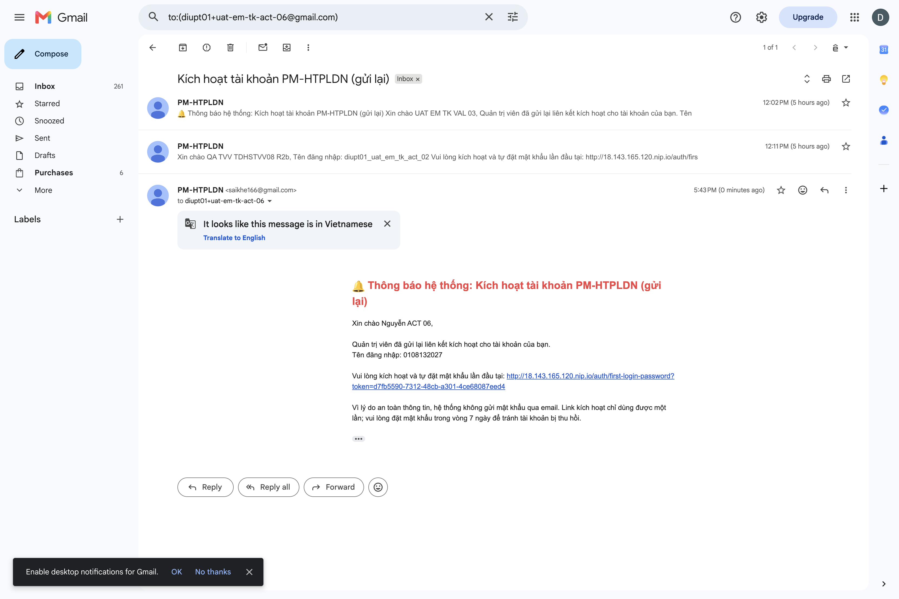

---

## ~~BUG-EM-TK-017~~ [CLOSED] — Thông báo workflow của vụ việc gửi tới DOANH_NGHIEP.email thay vì TAI_KHOAN.email

> **Re-test:** 2026-08-25 11:20:20 R3 — ✅ PASS (Closed-verified). Hai workflow mail đều tới TAI_KHOAN.email (9→11); DOANH_NGHIEP.email giữ 8; fixture đã hoàn nguyên không công khai.

**Bằng chứng R3:** công khai rồi hủy công khai `VV-BTP-TW-20260814-002`: mailbox `TAI_KHOAN.email` tăng 9→10→11, còn `DOANH_NGHIEP.email` giữ nguyên 8; `To` và `Raw.To` đều chỉ là `diupt01+dn-login@gmail.com`. Vụ việc đã hoàn nguyên `congKhai=false`. Xem [MailHog API](image/bug-em-tk-017-r3-workflow-to-account-email-2026-08-25.png) và [condition table](../cond/BUG-EM-TK-017.md).

### Mô tả

Sau khi Quản trị hệ thống đổi `TAI_KHOAN.email` của tài khoản doanh nghiệp `0109998887` sang địa chỉ mới, mọi thông báo gắn workflow vụ việc của doanh nghiệp đó vẫn chỉ được gửi tới `DOANH_NGHIEP.email` (email liên hệ tổ chức). Hộp thư của `TAI_KHOAN.email` — kênh mà SRS quy định — không nhận được thư nào.

### Các bước tái hiện

1. Đăng nhập role `QTHT` (`admin`) — vai trò duy nhất có quyền `Quản trị hệ thống > Tài khoản & phân quyền` theo `SCR-VIII-03`.
2. Mở form `Sửa` tài khoản `0109998887` (DN-HNI-0001 `Cong ty TNHH QA UAT Kiem Thu`), đổi `Email` từ `diupt01+tk-old@gmail.com` sang `diupt01+tk-new@gmail.com`, bấm `Lưu`. `DOANH_NGHIEP.email` giữ nguyên `diupt01+dn-contact@gmail.com`.
3. Ghi số thư MailHog tới từng địa chỉ trước khi trigger (`GET /api/v2/search?kind=to&query=...`): `diupt01+tk-new@gmail.com` = 0, `diupt01+tk-old@gmail.com` = 0, `diupt01+dn-contact@gmail.com` = 4.
4. Đăng nhập role `CB_PD_TW` (`cbpd_tw_01`) ở phiên riêng, phát sinh thông báo workflow trên vụ việc `VV-BTP-TW-20260814-002` của chính doanh nghiệp này: `POST /api/v1/vu-viecs/{id}/cong-khai` (200) rồi `POST /api/v1/vu-viecs/{id}/huy-cong-khai` (200).
5. Chờ 30 giây sau mỗi lần trigger rồi đếm lại số thư tới ba địa chỉ trên trong MailHog.

### Kết quả mong đợi

- Theo `BR-AUTH-EMAIL-01` (`srs-v3.5.md:5640`): "**Mọi notification gắn workflow** (kết quả vụ việc, thanh toán, phê duyệt) gửi đến `TAI_KHOAN.email` (vì người login là người xử lý đọc)."
- Theo mô tả entity `TAI_KHOAN.email` (`srs-v3.5.md:2126`): "Email cá nhân của người login. Kênh nhận: mail kích hoạt + reset MK + 2FA + workflow notification."
- Theo mô tả entity `DOANH_NGHIEP.email` (`srs-v3.5.md:1719`): email liên hệ DN, KHÔNG UNIQUE, khác `TAI_KHOAN.email`.
- Vậy hai thông báo workflow ở bước 4 phải tới `diupt01+tk-new@gmail.com` (`TAI_KHOAN.email` sau khi đổi).

### Kết quả thực tế

- `TAI_KHOAN.email` sau khi đổi (`diupt01+tk-new@gmail.com`): **0 thư** cả trước và sau trigger (Δ = 0 sau 30 giây ở cả hai lần).
- `diupt01+tk-old@gmail.com` (email cũ): 0 thư — đúng.
- `DOANH_NGHIEP.email` (`diupt01+dn-contact@gmail.com`): tăng từ 4 → 6, nhận đúng hai thông báo workflow vừa phát sinh:
  - `2026-08-21T03:08:45Z` — `Vụ việc đã được công khai - VV-BTP-TW-20260814-002`
  - `2026-08-21T03:09:51Z` — `Vụ việc đã được gỡ khỏi Cổng PLQG - VV-BTP-TW-20260814-002`
- Cả hai thư chỉ có một người nhận duy nhất ở trường `To`, không có `Cc`/`Bcc` tới `TAI_KHOAN.email`.
- Lịch sử MailHog cho thấy đây là hành vi hệ thống chứ không phải sự cố một lần: các thư `Vụ việc đã được tiếp nhận`, `Yêu cầu bổ sung hồ sơ`, `Vụ việc đã hoàn thành` của cùng vụ việc (2026-08-14) cũng đều tới `diupt01+dn-contact@gmail.com`, trong khi `TAI_KHOAN.email` lúc đó (`diupt01+dn-login@gmail.com`) chỉ nhận thư `Mã xác thực đăng nhập`.

**Đã loại trừ 3 khả năng khiến đây là lỗi giả (kiểm lại 2026-08-21):**

- **Không phải "gửi đúng người, khác địa chỉ":** tra `GET /api/v1/tai-khoan?search=diupt01+dn-contact@gmail.com` trả **0 bản ghi** — không TAI_KHOAN nào mang địa chỉ này, nên thư đi tới `DOANH_NGHIEP.email` chứ không phải `TAI_KHOAN.email` của một tài khoản khác.
- **Không phải "vụ việc của doanh nghiệp khác":** `GET /api/v1/vu-viecs/ab633d50-9560-42e5-9b73-33dce7d85ab6` trả `doanhNghiepId = 829abcac-b0af-4cde-9af9-ec51bc79014c` — "Cong ty TNHH QA UAT Kiem Thu", MST `0109998887`; tài khoản bị đổi email có `username = 0109998887` (theo `BR-AUTH-USERNAME-01`, username DN tự đăng ký = MST) và là **tài khoản duy nhất** gắn với DN này.
- **Không phải ngoại lệ đã được đặc tả:** toàn SRS chỉ có một chỗ cho phép gửi tới `DOANH_NGHIEP.email` là nhóm Tư vấn chuyên sâu (`srs-fr-12-tv-chuyen-sau.md:1661`, `BR-NOTIF-01`), kèm lý do ghi rõ *"Doanh nghiệp ở nhóm này **chưa có tài khoản**"*. Doanh nghiệp trong ca này CÓ tài khoản. Hai bước gửi thư đang xét thuộc `FR-V.I-NEW-05` (`srs-fr-05-vu-viec.md:1378` và `:1389`) — hai dòng này chỉ ghi *"Gửi thông báo DN"* + `BR-NOTIF-01`, **không chỉ định địa chỉ nhận**, nên địa chỉ do `BR-AUTH-EMAIL-01` quyết định.

### Bằng chứng

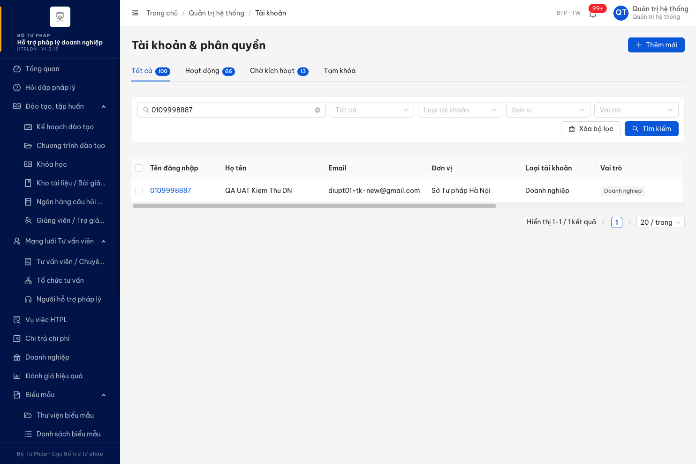

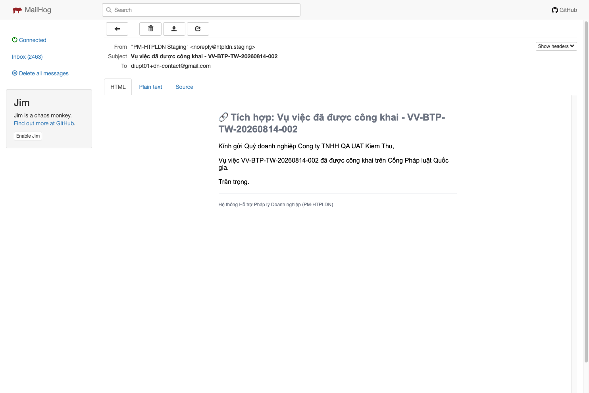

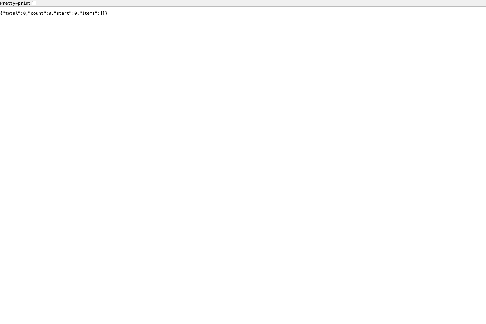

**API response — trigger thông báo workflow (role CB_PD_TW):**

```json
POST /api/v1/vu-viecs/ab633d50-9560-42e5-9b73-33dce7d85ab6/cong-khai   -> 200
{"success":true,"data":{"id":"ab633d50-9560-42e5-9b73-33dce7d85ab6","version":10,"trangThai":"HOAN_THANH"}}

POST /api/v1/vu-viecs/ab633d50-9560-42e5-9b73-33dce7d85ab6/huy-cong-khai -> 200
{"success":true,"data":{"id":"ab633d50-9560-42e5-9b73-33dce7d85ab6","version":11}}
```

**MailHog — đếm theo người nhận (`GET /api/v2/search?kind=to&query=<địa chỉ>`):**

```json
// diupt01+tk-new@gmail.com  (TAI_KHOAN.email sau khi đổi)
{"total":0,"count":0,"start":0,"items":[]}

// diupt01+dn-contact@gmail.com  (DOANH_NGHIEP.email) — total 4 -> 6
{"total":6, "items":[
  {"Created":"2026-08-21T03:09:51.702175857Z","Subject":"Vụ việc đã được gỡ khỏi Cổng PLQG - VV-BTP-TW-20260814-002","To":["diupt01+dn-contact@gmail.com"]},
  {"Created":"2026-08-21T03:08:45.823322126Z","Subject":"Vụ việc đã được công khai - VV-BTP-TW-20260814-002","To":["diupt01+dn-contact@gmail.com"]}
]}
```

**Header thư thực tế (MailHog message source):**

```
From: "PM-HTPLDN Staging" <noreply@htpldn.staging>
To: diupt01+dn-contact@gmail.com
Subject: Vụ việc đã được công khai - VV-BTP-TW-20260814-002
(không có Cc / Bcc)
```

---

## ~~BUG-EM-TK-018~~ [CLOSED] — Nhật ký hệ thống không lưu Dữ liệu cũ cho thao tác Sửa tài khoản nên không có JSON diff old→new

> **Re-test:** 2026-08-25 11:23:30 R3 — ✅ PASS (Closed-verified). Audit UPDATE mới lưu đủ duLieuCu và duLieuMoi; dienThoai 0912345678 → 0912345679, đã hoàn nguyên fixture.

**Bằng chứng R3:** QTHT `admin` đổi số điện thoại tài khoản `0109998887` từ `0912345678` sang `0912345679`; API cập nhật trả 200 và tạo audit `0648f3de-b0d7-48c7-a137-76b3702b089d`. Audit detail trả đồng thời `duLieuCu.dienThoai=0912345678` và `duLieuMoi.dienThoai=0912345679`, đủ JSON old → new; fixture đã được hoàn nguyên về `0912345678` (version 129). Xem [ảnh audit detail](image/bug-em-tk-018-r3-audit-old-new-diff-2026-08-25.png) và [condition table](../cond/BUG-EM-TK-018.md).

### Mô tả

Quản trị hệ thống đổi `TAI_KHOAN.email` qua form Sửa tài khoản. Dòng nhật ký tương ứng trên màn `Nhật ký hệ thống` chỉ hiển thị `Dữ liệu mới`, còn `Dữ liệu cũ` là `—`. Vì không lưu giá trị cũ nên nhật ký không thể hiện được thay đổi email từ giá trị nào sang giá trị nào.

### Các bước tái hiện

1. Đăng nhập role `QTHT` (`admin`) — vai trò duy nhất được truy cập `Nhật ký hệ thống` theo `FR-VIII-28` (Preconditions: vai trò QTHT) và `SCR-VIII-10`.
2. Vào `Quản trị hệ thống > Tài khoản & phân quyền`, mở `Sửa` tài khoản `0109998887`, đổi `Email` từ `diupt01+tk-old@gmail.com` sang `diupt01+tk-new@gmail.com`, bấm `Lưu` (toast `Cập nhật tài khoản thành công`, lúc 21/08/2026 10:01:59).
3. Vào `Quản trị hệ thống > Nhật ký hệ thống`, lọc khoảng thời gian chứa ngày 21/08/2026.
4. Tìm dòng `21/08/2026 10:01:59 · Quản trị hệ thống · TAI_KHOAN · 996cc5db… · Cập nhật`, bấm mở rộng cột `Chi tiết thay đổi`.
5. Kiểm chéo bằng API: `GET /api/v1/audit-logs/{id}` của chính dòng đó.

### Kết quả mong đợi

- Theo `SCR-VIII-10` row 9 (`srs-fr-10-quan-tri.md:1989`): cột `Chi tiet thay doi (JSON diff: old_value → new_value, expandable)`.
- Theo `SCR-VIII-10` Quy tắc tương tác (`srs-fr-10-quan-tri.md:1995`): `Chi tiet thay doi luu dang JSON: {"field": "trang_thai", "old": "DANG_XU_LY", "new": "CHO_PHE_DUYET"}`.
- Vậy dòng nhật ký phải cho thấy giá trị cũ `diupt01+tk-old@gmail.com` và giá trị mới `diupt01+tk-new@gmail.com` của trường email.

### Kết quả thực tế

- Trên UI, vùng mở rộng hiển thị `Dữ liệu cũ:` `—` và `Dữ liệu mới:` `{ "email": "diupt01+tk-new@gmail.com", "hoTen": "QA UAT Kiem Thu DN", "donViId": "00000000-0000-4000-8002-000000000001" }`.
- API xác nhận `duLieuCu: null` ở cả hai lần Sửa email trong ngày (10:01:06 và 10:01:59), tức giá trị cũ không được ghi chứ không phải chỉ lỗi hiển thị.
- Cơ chế lưu `Dữ liệu cũ` vẫn hoạt động với thực thể khác: dòng `VU_VIEC` cùng ngày (10:08:41, 10:09:51) có `Dữ liệu cũ` đầy đủ.
- Đo lại toàn bộ 49 dòng có hành động thay đổi dữ liệu trong khoảng 01/07–21/08/2026, hỏi từng dòng bằng `GET /api/v1/audit-logs/{id}` (endpoint danh sách KHÔNG trả `duLieuCu`/`duLieuMoi` nên không dùng để đo được):

| Entity / hành động | Số dòng | Có `duLieuCu` | Có `duLieuMoi` |
|---|---|---|---|
| **TAI_KHOAN / UPDATE** | 4 | **0** | 4 |
| VU_VIEC / UPDATE | 3 | 3 | 3 |
| VU_VIEC / CONG_KHAI + HUY_CONG_KHAI | 4 | 2 | 2 |
| DOT_BAO_CAO_DON_VI_NOP / UPDATE | 18 | 18 | 18 |
| KHOA_HOC / UPDATE | 6 | 3 | 6 |
| TU_VAN_VIEN / UPDATE | 1 | 0 | 1 |

- Với các hành động đổi trạng thái tài khoản (`LOCK_ACCOUNT`, `UNLOCK_ACCOUNT`, `DISABLE_ACCOUNT`), `duLieuCu` cũng rỗng nhưng `duLieuMoi` chứa `{fromState, toState}` nên vẫn suy ra được giá trị cũ. Riêng `TAI_KHOAN / UPDATE` thì `duLieuMoi` chỉ có `{email, hoTen, donViId}` — **không còn đường nào lấy lại giá trị cũ**.
- Ghi nhận để đối chiếu công bằng: ở mức thực thể, `AUDIT_LOG.du_lieu_cu` được đặc tả `Bắt buộc = N` (`srs-v3.5.md` §3.4.3.11) — hợp lý vì `CREATE` / `LOGIN` / `LOGOUT` không có giá trị cũ. Vì vậy yêu cầu bị vi phạm ở đây là yêu cầu của **màn hình** `SCR-VIII-10` (phải hiển thị được diff cũ → mới cho thao tác Sửa), không phải ràng buộc bắt buộc của cột.

### Bằng chứng

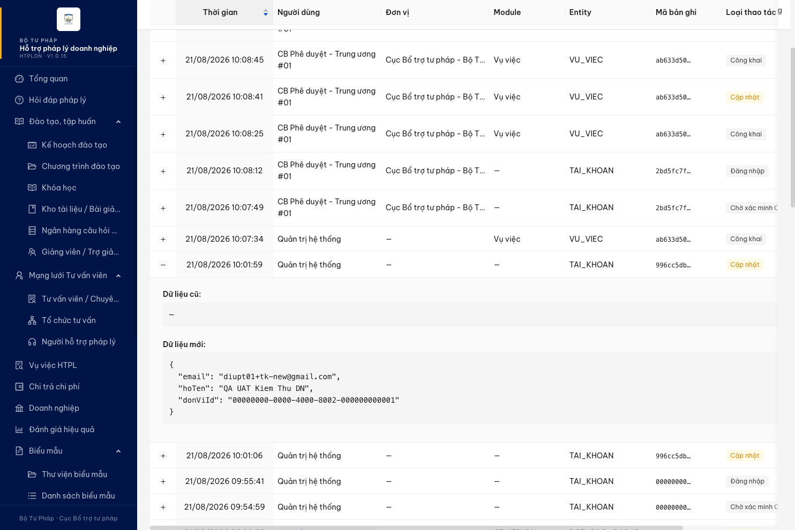

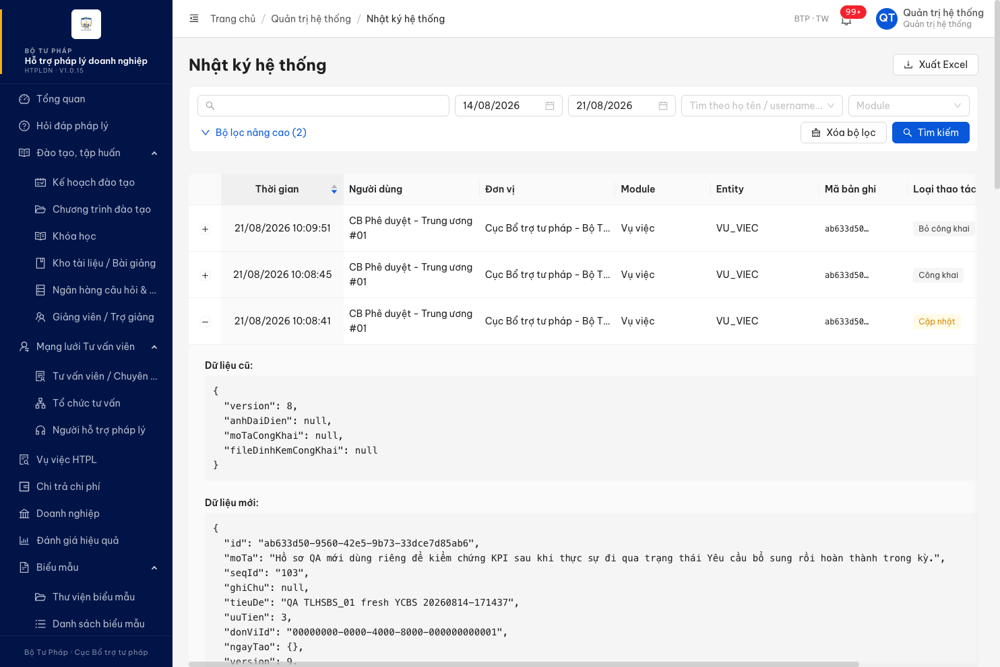

**API response — `GET /api/v1/audit-logs/{id}` cho hai dòng Sửa email:**

```json
[
  {
    "id": "550ee795-fb76-40a4-8550-549c9334a9f7",
    "thoiGian": "2026-08-21T03:01:59.009Z",
    "entityType": "TAI_KHOAN",
    "entityId": "996cc5db-43c5-4903-b3d1-1c21adb2ece8",
    "hanhDong": "UPDATE",
    "nguoiThucHienUsername": "admin",
    "duLieuCu": null,
    "duLieuMoi": {"email": "diupt01+tk-new@gmail.com", "hoTen": "QA UAT Kiem Thu DN", "donViId": "00000000-0000-4000-8002-000000000001"}
  },
  {
    "id": "67f23e8e-b4f8-462b-8db1-de8029a90a6f",
    "thoiGian": "2026-08-21T03:01:06.176Z",
    "entityType": "TAI_KHOAN",
    "entityId": "996cc5db-43c5-4903-b3d1-1c21adb2ece8",
    "hanhDong": "UPDATE",
    "nguoiThucHienUsername": "admin",
    "duLieuCu": null,
    "duLieuMoi": {"email": "diupt01+tk-old@gmail.com", "hoTen": "QA UAT Kiem Thu DN", "donViId": "00000000-0000-4000-8002-000000000001"}
  }
]
```

---

## ~~BUG-EM-TK-019~~ [CLOSED] — Cột Module của nhật ký hệ thống bỏ trống với entity TAI_KHOAN

> **Re-test:** 2026-08-25 11:25:08 R3 — ✅ PASS (Closed-verified). TAI_KHOAN hiển thị Quản trị; lọc QUAN_TRI trả kết quả; API 25/25 dòng ngày 25/08 có module QUAN_TRI.

**Bằng chứng R3:** Trên UI v1.0.16, các audit `TAI_KHOAN` mới và các log đăng nhập/OTP/khóa tài khoản đều hiển thị Module `Quản trị`; chọn bộ lọc Module = `Quản trị` trả danh sách đúng thay vì bảng `Trống`. API ngày 25/08 nhóm được 25 dòng `TAI_KHOAN -> QUAN_TRI`, không có `TAI_KHOAN -> null`; API lọc 18–25/08 trả 48/48 dòng `TAI_KHOAN -> QUAN_TRI`. Xem [ảnh UI lọc Quản trị](image/bug-em-tk-019-r3-filter-quan-tri-results-2026-08-25.png), [audit detail có module](image/bug-em-tk-018-r3-audit-old-new-diff-2026-08-25.png) và [condition table](../cond/BUG-EM-TK-019.md).

### Mô tả

Trên màn `Nhật ký hệ thống`, mọi dòng có `Entity = TAI_KHOAN` đều hiển thị cột `Module` là `—`. API trả `module: null` cho các dòng này, trong khi các thực thể khác (`VU_VIEC`, `KHOA_HOC`, `DOT_BAO_CAO_DON_VI_NOP`) đều có giá trị Module.

### Các bước tái hiện

1. Đăng nhập role `QTHT` (`admin`) — vai trò duy nhất được truy cập `Nhật ký hệ thống` theo `FR-VIII-28` Preconditions và `SCR-VIII-10`.
2. Vào `Quản trị hệ thống > Nhật ký hệ thống`, để khoảng thời gian mặc định (7 ngày gần nhất).
3. Quan sát cột `Module` của các dòng có `Entity = TAI_KHOAN` (Đăng nhập, Chờ xác minh OTP, Cập nhật tài khoản...) so với các dòng `Entity = VU_VIEC`.
4. Kiểm chéo bằng API: `GET /api/v1/audit-logs?tuNgay=2026-08-14&denNgay=2026-08-21&pageSize=100`, nhóm theo `entityType` và `module`.

### Kết quả mong đợi

- Theo `FR-VIII-28` Inputs row 4 (`srs-fr-10-quan-tri.md:1392`): "Giá trị Module của một dòng nhật ký lấy theo bảng ánh xạ Entity → Module (`srs-v3.5.md` §3.4.3, cột Module) — không lấy theo tên thực thể."
- Theo bảng ánh xạ (`srs-v3.5.md:1268`): `TAI_KHOAN` thuộc module `quan-tri`.
- Vậy các dòng nhật ký của `TAI_KHOAN` phải hiển thị Module `Quản trị`, và bộ lọc Module = `Quản trị` phải tìm được các dòng này.

### Kết quả thực tế

- UI: toàn bộ dòng `TAI_KHOAN` hiển thị `Module` = `—`.
- API, thống kê 100 dòng gần nhất theo cặp `entityType -> module`:
  - `TAI_KHOAN -> null`: 45 dòng
  - `TU_VAN_VIEN -> null`: 4 dòng, trong khi `TU_VAN_VIEN -> CHUYEN_GIA_TVV`: 7 dòng
  - `NGUOI_HO_TRO -> null`: 1 dòng, trong khi `NGUOI_HO_TRO -> NGUOI_HO_TRO`: 2 dòng
  - `VU_VIEC -> VU_VIEC`: 9 dòng; `KHOA_HOC -> DAO_TAO`: 14 dòng; `DOT_BAO_CAO_DON_VI_NOP -> DOT_BAO_CAO`: 18 dòng
- Cùng một thực thể (`TU_VAN_VIEN`, `NGUOI_HO_TRO`) lúc có lúc không có Module, cho thấy Module đang được ghi rời rạc theo nơi phát sinh chứ không suy ra từ bảng ánh xạ Entity → Module.
- Giá trị `NGUOI_HO_TRO -> NGUOI_HO_TRO` còn lấy thẳng **tên thực thể** làm Module — đúng điều `FR-VIII-28` Inputs row 4 cấm (*"không lấy theo tên thực thể"*); `NGUOI_HO_TRO` cũng không nằm trong 12 giá trị Module mà `SCR-VIII-10` row 5 liệt kê.
- **Hệ quả đo được trên bộ lọc:** trong khoảng 01/07–21/08/2026 có **4.720** dòng nhật ký `entityType = TAI_KHOAN`, nhưng lọc Module = `Quản trị` trả về **0 dòng** (bảng hiện "Trống"), trong khi lọc Module = `Vụ việc` vẫn trả 379 dòng — bộ lọc chạy đúng với module khác, riêng nhóm Quản trị mất trắng. Người kiểm tra lọc theo Module sẽ kết luận nhầm "không có thao tác quản trị nào được ghi nhật ký", và hệ thống không báo lỗi gì.

### Bằng chứng

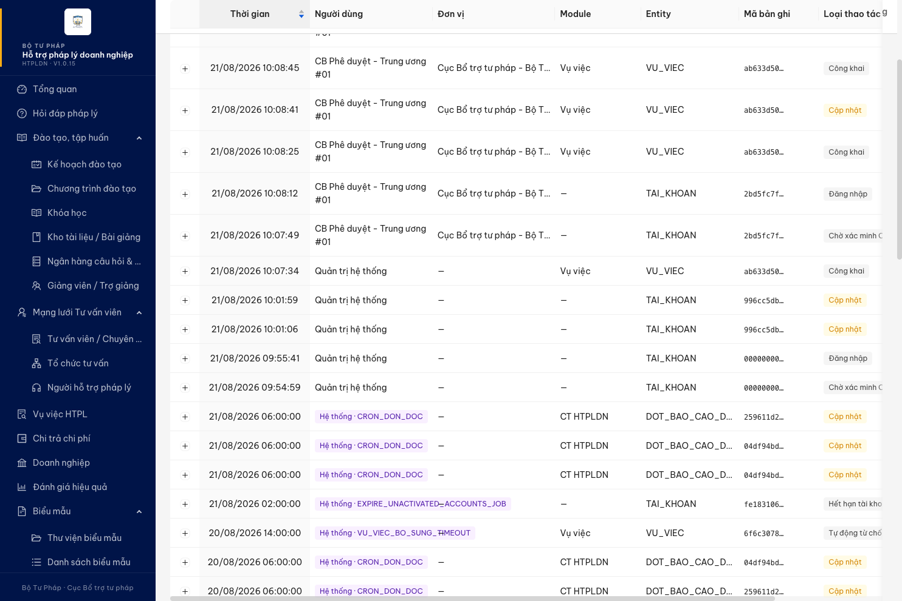

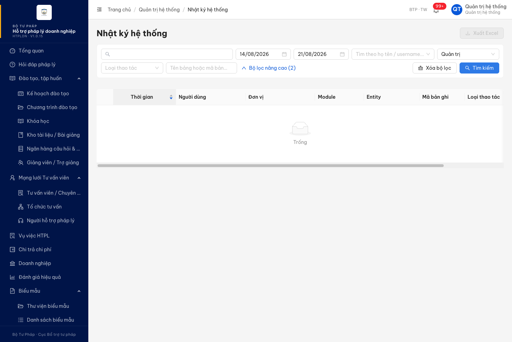

**API response — thống kê `entityType -> module` trên 100 dòng gần nhất:**

```json
{
  "VU_VIEC -> VU_VIEC": 9,
  "TAI_KHOAN -> null": 45,
  "DOT_BAO_CAO_DON_VI_NOP -> DOT_BAO_CAO": 18,
  "TU_VAN_VIEN -> null": 4,
  "TU_VAN_VIEN -> CHUYEN_GIA_TVV": 7,
  "NGUOI_HO_TRO -> null": 1,
  "NGUOI_HO_TRO -> NGUOI_HO_TRO": 2,
  "KHOA_HOC -> DAO_TAO": 14
}
```

---

## Phụ lục — Môi trường test

| Thành phần | Giá trị |
|---|---|
| URL ứng dụng | https://18.143.165.120.nip.io |
| Gmail OTP/inbox | Gmail thật `diupt01@gmail.com` qua CDP 127.0.0.1:9223 |
| Frontend | SPA, HTPLDN V1.0.13 |
| Xác thực | Username/password + OTP email |
| Tool test | Chrome DevTools MCP |

---

*Bug report updated: 2026-08-21 11:05:00 +07 | QA Automation*
