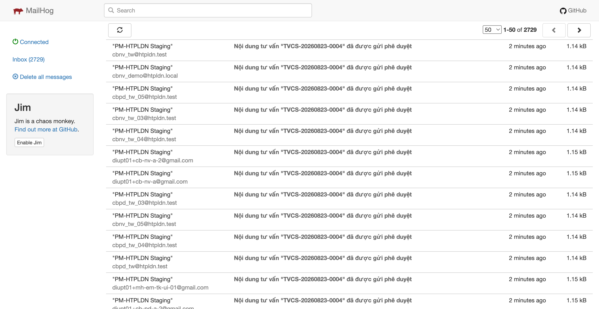
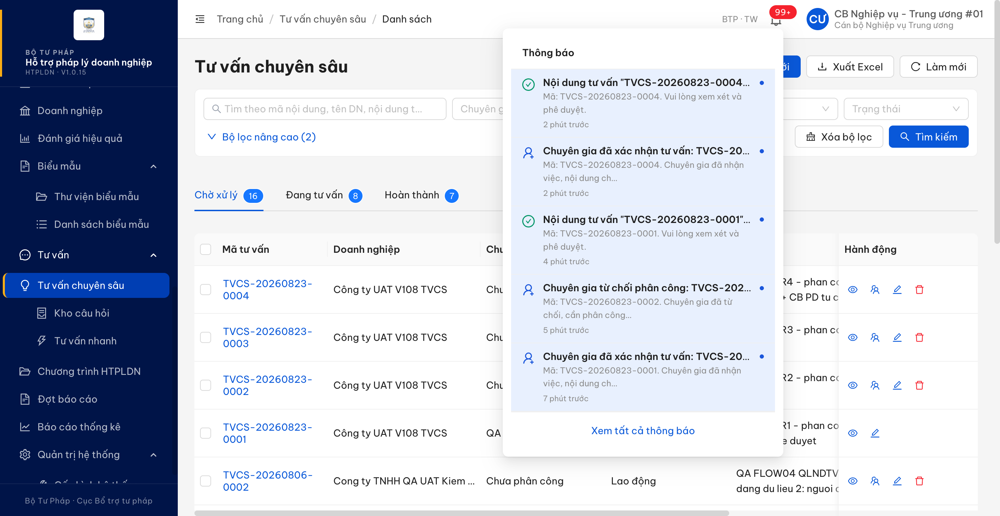

# Bug Report — Tư vấn chuyên sâu (thông báo nghiệp vụ qua email)

| Thông tin | Giá trị |
|-----------|---------|
| **Dự án** | PM HTPLDN — UAT reverify email |
| **Môi trường** | https://18.143.165.120.nip.io (DEV, bản dựng V1.0.15) · MailHog http://18.143.165.120:8025 |
| **Người test** | QA Automation |
| **Ngày** | 2026-08-25 11:29:15 |
| **Loại test** | Workflow (thông báo email + in-app) |
| **Round** | Reverify email — File 03 Batch 6 (Tư vấn chuyên sâu / Negative / API) |
| **Tài liệu tham chiếu** | [03-TC-email-notification-workflow.md](../03-TC-email-notification-workflow.md) · SRS v3.5 `Docs-PM-HTPLDN/_bmad-output/planning-artifacts/srs-v3.5/srs-fr-12-tv-chuyen-sau.md` + `srs-v3.5.md` |

---

## Tổng hợp

Phát hiện **1** lỗi có tham chiếu đặc tả cụ thể khi chạy batch `EM-NOT-TVCS-*` trên DEV bằng MailHog.

Sáu mốc chuyển trạng thái còn lại của luồng Tư vấn chuyên sâu (`phân công CG`, `CG xác nhận`, `CG từ chối`, `phê duyệt kết quả`, `từ chối phê duyệt`, `hủy khi CG chưa xác nhận`) gửi thư **đúng và đủ** người nhận theo đặc tả, không thừa hộp thư nào. Riêng mốc **hoàn thành tư vấn tự trình duyệt** phát thư cho **toàn bộ cán bộ của đơn vị** thay vì chỉ nhóm Cán bộ Phê duyệt như đặc tả quy định.

### Severity breakdown

| Tổng | Critical | Major | Medium | Minor | Trivial | Closed | Open |
|------|----------|-------|--------|-------|---------|--------|------|
| 1    | 0        | 1     | 0      | 0     | 0       | 1      | 0    |

## Bug Summary Table

| Bug ID | Severity | Priority | Type | TC Ref | **SRS Reference** | Title | Status |
|--------|----------|----------|------|--------|-------------------|-------|--------|
| BUG-EM-TVCS-001 | Major | P1 | Workflow | EM-NOT-TVCS-04 | `srs-fr-12-tv-chuyen-sau.md:214` (FR-X.1-01 Processing — Hoàn thành TV, bước 5: "Auto chuyển → CHO_PHE_DUYET, gửi thông báo CB Phê duyệt cùng đơn vị (in-app + email)") · `:1558` (Bảng chuyển trạng thái SM-TVCS: `HOAN_THANH → CHO_PHE_DUYET` — "TB CB PD cùng đơn vị") · `:1661` (BR-NOTIF-01 bản trích nhóm X.1 — "hoàn thành TV (TB CB PD cùng đơn vị)") · `srs-v3.5.md:5745` (BR-NOTIF-01 gốc, sự kiện (9) nhóm Tư vấn chuyên sâu) · `srs-v3.5.md:6398` (Phụ lục SM-TVCS) | Hoàn thành tư vấn tự trình duyệt phát thư và thông báo cho toàn bộ cán bộ trong đơn vị, gồm cả 9 Cán bộ Nghiệp vụ không thuộc nhóm người nhận theo đặc tả | Closed |

---

## ~~BUG-EM-TVCS-001~~ [CLOSED] — Hoàn thành tư vấn tự trình duyệt: thư báo phê duyệt gửi cho cả Cán bộ Nghiệp vụ, không chỉ Cán bộ Phê duyệt cùng đơn vị

> **Re-test:** 2026-08-25 11:29:15 R3 — ✅ PASS (Closed-verified). TVCS-20260823-0002 chỉ gửi 6 CB_PD_TW; CB_NV_TW không có email/in-app; fixture đã hoàn nguyên.

**Bằng chứng R3:** Chuyên gia `qa_tvvseed28` hoàn thành `TVCS-20260823-0002` lúc `2026-08-25T04:27:03Z`; hồ sơ sang `CHO_PHE_DUYET` và MailHog sinh đúng 6 thư, toàn bộ cho 6 tài khoản `CB_PD_TW`, không có địa chỉ `CB_NV_TW`. In-app của `cbpd_tw_01` có đúng một thông báo `PHE_DUYET` mới; `cbnv_tw_01` có 0 thông báo mới của entity này sau trigger. Fixture đã được hoàn nguyên về `DANG_TU_VAN`. Xem [ảnh MailHog](image/bug-em-tvcs-001-r3-only-six-cbpd-recipients-2026-08-25.png) và [condition table](../cond/BUG-EM-TVCS-001.md).

### Mô tả

Khi Chuyên gia bấm **Hoàn thành** một nội dung tư vấn chuyên sâu, hồ sơ tự chuyển `DANG_TU_VAN → HOAN_THANH → CHO_PHE_DUYET` đúng như đặc tả, nhưng thông báo *"Nội dung tư vấn … đã được gửi phê duyệt"* được phát cho **toàn bộ 15 tài khoản cán bộ của đơn vị**: 6 tài khoản vai trò `CB_PD_TW` (đúng đối tượng) **và 9 tài khoản vai trò `CB_NV_TW`** không liên quan tới hồ sơ. Cả thư điện tử lẫn thông báo trên chuông đều đi tới nhóm thừa này. Đặc tả chỉ định người nhận của mốc này là **Cán bộ Phê duyệt cùng đơn vị**.

Hiện tượng lặp lại nguyên vẹn ở hai hồ sơ khác nhau trong cùng phiên, cách nhau chưa tới hai phút, với đúng cùng 15 địa chỉ nhận.

### Các bước tái hiện

1. Đăng nhập `cbnv_tw_01` (vai trò `CB_NV_TW`, đơn vị *Cục Bổ trợ tư pháp — Bộ Tư pháp*, có quyền tạo và phân công nội dung tư vấn chuyên sâu theo SCR-X1-01). Tạo nội dung tư vấn chuyên sâu cho doanh nghiệp `Công ty UAT V108 TVCS` (mã số thuế `0108051801`), lĩnh vực *Thương mại* → hệ thống sinh `TVCS-20260823-0004` ở trạng thái *Tiếp nhận*.
2. Vẫn ở tài khoản này, bấm **Phân công chuyên gia** → chọn `QA TVV Seed28 Active` (`qa_tvvseed28`, vai trò `TVV, CG`, cùng đơn vị). Hồ sơ chuyển sang *Phân công*.
3. Đăng nhập `qa_tvvseed28` (vai trò `CG`, là chuyên gia được phân công cho chính hồ sơ này) → **Xác nhận** nhận việc. Hồ sơ chuyển sang *Đang tư vấn* lúc **13:19:03Z**.
4. Ghi lại mốc thời gian và danh sách thư mới nhất trong MailHog làm mốc đối chiếu.
5. Vẫn ở tài khoản chuyên gia, nhập văn bản tư vấn rồi bấm **Hoàn thành** lúc **13:19:09Z**. Hồ sơ chuyển thẳng sang *Chờ phê duyệt*.
6. Chờ 35 giây, lấy toàn bộ thư phát sinh sau mốc ở bước 4 và đối chiếu từng địa chỉ nhận với danh sách tài khoản của đơn vị (`GET /api/v1/tai-khoan?donViId=00000000-0000-4000-8000-000000000001`, quyền quản trị).
7. Đăng nhập lại `cbnv_tw_01` → mở chuông thông báo để kiểm kênh trong ứng dụng.
8. **Lặp lại toàn bộ trên hồ sơ thứ hai** `TVCS-20260823-0001` (hoàn thành lúc **13:17:22Z**) để loại trừ trường hợp cá biệt.

### Kết quả mong đợi

- Theo `srs-fr-12-tv-chuyen-sau.md:214` (FR-X.1-01, Processing — *Hoàn thành TV*, bước 5), khi hồ sơ tự chuyển sang `CHO_PHE_DUYET`, hệ thống phải **gửi thông báo cho Cán bộ Phê duyệt cùng đơn vị (in-app + email)**.
- `srs-fr-12-tv-chuyen-sau.md:1558` và `srs-v3.5.md:6398` (bảng chuyển trạng thái SM-TVCS, dòng `HOAN_THANH → CHO_PHE_DUYET`) ghi hành động của chuyển tiếp này đúng một đối tượng: **"TB CB PD cùng đơn vị (in-app + email)"**.
- `srs-fr-12-tv-chuyen-sau.md:1661` và `srs-v3.5.md:5745` (BR-NOTIF-01, sự kiện (9) — nhóm Tư vấn chuyên sâu) liệt kê người nhận theo từng mốc; mốc *hoàn thành TV* được ghi là **"TB CB PD cùng đơn vị"**, tách bạch với các mốc khác vốn có ghi rõ Cán bộ Nghiệp vụ khi Cán bộ Nghiệp vụ là người nhận (*CG xác nhận*, *CG từ chối*). Cán bộ Nghiệp vụ không nằm trong nhóm người nhận của mốc này.

### Kết quả thực tế

- Trạng thái hồ sơ đúng: `DANG_TU_VAN → CHO_PHE_DUYET` ở cả hai lần.
- **Thư điện tử phát cho 15 tài khoản** thay vì 6, giống hệt nhau ở cả hai hồ sơ. Đối chiếu từng địa chỉ với danh sách tài khoản của đơn vị:

  | Vai trò | Số tài khoản nhận thư | Địa chỉ |
  |---|---|---|
  | `CB_PD_TW` — **đúng đối tượng** | 6 | `diupt01+cb-pd-a@gmail.com` (cbpd_tw_01), `diupt01+cb-pd-a-2@gmail.com` (cbpd_tw_02), `cbpd_tw@htpldn.test`, `cbpd_tw_03@htpldn.test`, `cbpd_tw_04@htpldn.test`, `cbpd_tw_05@htpldn.test` |
  | `CB_NV_TW` — **thừa so với đặc tả** | 9 | `diupt01+cb-nv-a@gmail.com` (cbnv_tw_01), `diupt01+cb-nv-a-2@gmail.com` (cbnv_tw_02), `diupt01+mh-em-tk-act-01@gmail.com` (cb_mh_email_01), `diupt01+mh-em-tk-ui-01@gmail.com` (cb_mh_ui_01), `cbnv_tw@htpldn.test`, `cbnv_tw_03@htpldn.test`, `cbnv_tw_04@htpldn.test`, `cbnv_tw_05@htpldn.test`, `cbnv_demo@htpldn.local` |

- Kênh trong ứng dụng cũng sai cùng kiểu: chuông của `cbnv_tw_01` hiện *"Nội dung tư vấn "TVCS-20260823-0004" đã được gửi phê duyệt — Mã: TVCS-20260823-0004. Vui lòng xem xét và phê duyệt."* lúc `2026-08-23T13:19:09.122Z`, và bản ghi tương ứng cho `TVCS-20260823-0001` lúc `2026-08-23T13:17:22.140Z`.
- Nội dung thư yêu cầu người nhận hành động (*"Vui lòng xem xét và phê duyệt"*) trong khi Cán bộ Nghiệp vụ không có quyền phê duyệt hồ sơ này.
- Chiều ngược lại đúng: không có thư nào tới doanh nghiệp, chuyên gia hay tài khoản ngoài đơn vị trong cùng cửa sổ.

### Bằng chứng

**1. Ảnh chụp**:




**2. Danh sách người nhận đọc từ MailHog, đối chiếu vai trò theo `GET /api/v1/tai-khoan`** (lần chạy trên `TVCS-20260823-0004`):

```
13:19:09Z  diupt01+mh-em-tk-act-01@gmail.com   cb_mh_email_01   CB_NV_TW   <-- thua
13:19:09Z  diupt01+cb-pd-a@gmail.com           cbpd_tw_01       CB_PD_TW
13:19:09Z  diupt01+cb-pd-a-2@gmail.com         cbpd_tw_02       CB_PD_TW
13:19:09Z  diupt01+mh-em-tk-ui-01@gmail.com    cb_mh_ui_01      CB_NV_TW   <-- thua
13:19:09Z  cbpd_tw@htpldn.test                 cbpd_tw          CB_PD_TW
13:19:09Z  cbpd_tw_04@htpldn.test              cbpd_tw_04       CB_PD_TW
13:19:09Z  cbnv_tw_05@htpldn.test              cbnv_tw_05       CB_NV_TW   <-- thua
13:19:09Z  cbpd_tw_03@htpldn.test              cbpd_tw_03       CB_PD_TW
13:19:09Z  diupt01+cb-nv-a@gmail.com           cbnv_tw_01       CB_NV_TW   <-- thua
13:19:09Z  diupt01+cb-nv-a-2@gmail.com         cbnv_tw_02       CB_NV_TW   <-- thua
13:19:09Z  cbnv_tw_04@htpldn.test              cbnv_tw_04       CB_NV_TW   <-- thua
13:19:09Z  cbnv_tw_03@htpldn.test              cbnv_tw_03       CB_NV_TW   <-- thua
13:19:09Z  cbpd_tw_05@htpldn.test              cbpd_tw_05       CB_PD_TW
13:19:09Z  cbnv_demo@htpldn.local              cbnv_demo        CB_NV_TW   <-- thua
13:19:09Z  cbnv_tw@htpldn.test                 cbnv_tw          CB_NV_TW   <-- thua
```

Lần chạy đối chứng trên `TVCS-20260823-0001` lúc `13:17:22Z` cho **đúng 15 địa chỉ này**, không sai khác.

**3. Nội dung thư** (giống nhau ở cả 15 người nhận):

```
Subject: Nội dung tư vấn "TVCS-20260823-0004" đã được gửi phê duyệt
Body:    Mã: TVCS-20260823-0004. Vui lòng xem xét và phê duyệt.
```
