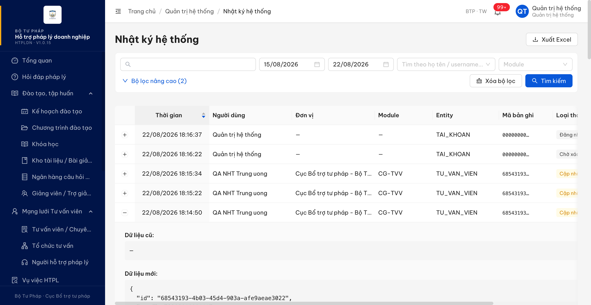

# Bug Report — Tư vấn viên / Chuyên gia (thông báo nghiệp vụ qua email)

| Thông tin | Giá trị |
|-----------|---------|
| **Dự án** | PM HTPLDN — UAT reverify email |
| **Môi trường** | https://18.143.165.120.nip.io (DEV) · MailHog http://18.143.165.120:8025 |
| **Người test** | QA Automation |
| **Ngày** | 2026-08-25 11:34:24 |
| **Loại test** | Workflow (thông báo email + in-app) · UI/API/Data |
| **Round** | Reverify email — File 03 Batch 3 (Tư vấn viên và Chuyên gia) · bổ sung 2026-08-24 từ File 04 Batch 3 (EM-INF-18) |
| **Tài liệu tham chiếu** | [03-TC-email-notification-workflow.md](../03-TC-email-notification-workflow.md) · [04-TC-email-smtp-security-nfr.md](../04-TC-email-smtp-security-nfr.md) · SRS v3.5 `Docs-PM-HTPLDN/_bmad-output/planning-artifacts/srs-v3.5/srs-fr-04-chuyen-gia-tvv.md` |

---

## Tổng hợp

Chạy 9 ca `EM-NOT-TVV-*` / `EM-FLD-TVV-*` trên DEV bằng MailHog. Toàn bộ luồng thư thông báo nghiệp vụ (yêu cầu bổ sung, kết luận không đạt, phê duyệt kèm link kích hoạt, từ chối ở bước phê duyệt) gửi đúng người nhận và không rò sang hộp thư âm. Phát hiện **1** lỗi có căn cứ đặc tả cụ thể ở phần nhật ký thao tác khi Người hỗ trợ cập nhật hồ sơ Tư vấn viên.

> **Bổ sung 2026-08-24 (File 04 · EM-INF-18):** khi kiểm tra phạm vi người nhận theo đơn vị, phát hiện thêm mốc **trình duyệt hồ sơ Tư vấn viên** (`DANG_THAM_DINH → CHO_PHE_DUYET`) chỉ sinh thông báo trong ứng dụng, không phát thư điện tử → `BUG-EM-TVV-002`. Mốc này không nằm trong 4 ca `EM-NOT-TVV-01..04` nên chưa được ghi ở đợt File 03. Tổng cộng **2** lỗi.

### Severity breakdown

| Tổng | Critical | Major | Medium | Minor | Trivial | Closed | Open |
|------|----------|-------|--------|-------|---------|--------|------|
| 2    | 0        | 2     | 0      | 0     | 0       | 2      | 0    |

## Bug Summary Table

| Bug ID | Severity | Priority | Type | TC Ref | **SRS Reference** | Title | Status |
|--------|----------|----------|------|--------|-------------------|-------|--------|
| BUG-EM-TVV-001 | Major | P1 | Data | EM-FLD-TVV-04 | `srs-fr-04-chuyen-gia-tvv.md:852` (FR-IV-11 §Processing bước 7 — "Ghi nhật ký thao tác (giá trị cũ → mới)") · `BR-DATA-05` | Nhật ký thao tác của lần cập nhật hồ sơ Tư vấn viên chỉ lưu dữ liệu mới, ô Dữ liệu cũ để trống nên không tra được email đổi từ giá trị nào sang giá trị nào | Closed |
| BUG-EM-TVV-002 | Major | P1 | Workflow | EM-INF-18 (File 04, phát hiện tình cờ) | `srs-fr-04-chuyen-gia-tvv.md:528` (FR-IV-06 §Processing bước 4 — "Nếu DAT + Trình duyệt: chuyển trạng thái CHO_PHE_DUYET, gửi thông báo CB_PD **cùng đơn vị với CB NV thẩm định**") · `:565` (Acceptance Criteria — "TVV → CHO_PHE_DUYET, CB PD nhận thông báo") · `:2368` (bảng chuyển trạng thái SM-TVV, dòng `DANG_THAM_DINH → CHO_PHE_DUYET` — "thông báo Cán bộ Phê duyệt") · `srs-v3.5.md:5745` (BR-NOTIF-01 sự kiện (1) *Trình phê duyệt (X → CHO_DUYET): TB CB PD cùng đơn vị*, **Kênh: in-app + email**, cột Áp dụng FR có "FR-IV-06/07 (TVV)") | Trình duyệt hồ sơ Tư vấn viên chỉ sinh thông báo trong ứng dụng, không phát thư điện tử cho Cán bộ Phê duyệt cùng đơn vị | Closed |

---

## ~~BUG-EM-TVV-001~~ [CLOSED] — Nhật ký thao tác khi Người hỗ trợ cập nhật hồ sơ Tư vấn viên không lưu giá trị cũ

> **Re-test:** 2026-08-25 11:32:38 R3 — ✅ PASS (Closed-verified). Audit UPDATE TVV lưu đủ duLieuCu/duLieuMoi; dienThoai 0912340811 → 0912340812; đã hoàn nguyên.

**Bằng chứng R3:** PASS ngày 25/08/2026. CBNV `cbnv_tw_01` đổi điện thoại TVV `TVV-BTP-TW-0049` từ `0912340811` (version 11) sang `0912340812` (version 12). Audit `761ac895-e229-479c-b895-1e1990b9c5ee` lưu đầy đủ `duLieuCu` và `duLieuMoi`, thể hiện đúng cũ → mới; API trả 200. Dữ liệu đã được hoàn nguyên về `0912340811` (version 13). Chi tiết: [condition table R3](../cond/BUG-EM-TVV-001.md); ảnh [dữ liệu cũ](image/bug-em-tvv-001-r3-audit-old-new-diff-2026-08-25.png) và [dữ liệu mới](image/bug-em-tvv-001-r3-audit-new-value-2026-08-25.png).

### Mô tả

Người hỗ trợ pháp lý đổi email liên hệ của một Tư vấn viên cùng đơn vị qua màn Chi tiết Tư vấn viên (chế độ sửa). Thao tác lưu thành công và dòng nhật ký tương ứng có được ghi nhận. Nhưng trong dòng nhật ký đó, phần **Dữ liệu cũ** để trống (`—` trên giao diện, `duLieuCu: null` trên API), chỉ có **Dữ liệu mới**. Vì vậy nhật ký không thể hiện được thay đổi email diễn ra từ giá trị nào sang giá trị nào — mất khả năng đối chiếu khi cần truy vết ai đã đổi email của Tư vấn viên và đổi từ đâu.

Lỗi cùng bản chất với `BUG-EM-TK-018` (đã ghi ở [bug-report-em-tk.md](bug-report-em-tk.md), thực thể `TAI_KHOAN`, căn cứ `SCR-VIII-10` / `srs-fr-10:1989`), nhưng đây là thực thể `TU_VAN_VIEN` với căn cứ riêng ở `FR-IV-11`, nên ghi thành mục riêng để đội phát triển không bỏ sót khi sửa theo từng nghiệp vụ.

### Các bước tái hiện

1. Đăng nhập `nht_qa_tw` — vai trò Người hỗ trợ pháp lý, đơn vị *Cục Bổ trợ tư pháp - Bộ Tư pháp*; đây đúng là vai trò được `FR-IV-11` giao quyền cập nhật thông tin liên hệ Tư vấn viên cùng đơn vị.
2. Vào **Mạng lưới Tư vấn viên > Tư vấn viên / Chuyên gia**, tab **Mới đăng ký**, mở hồ sơ `TVV-BTP-TW-0047` (*UAT EM 2208 TVV FLD01 Email hop le*, đơn vị Cục Bổ trợ tư pháp - Bộ Tư pháp).
3. Bấm **Sửa hồ sơ**, đổi ô **Email** từ `new.tvv@example.test` sang `qatvvfld04new@mailhog.test`, bấm **Lưu**. Toast báo *"Cập nhật hồ sơ TVV thành công"* lúc 22/08/2026 18:14:50.
4. Đăng nhập `admin` (Quản trị hệ thống — vai trò duy nhất xem được Nhật ký hệ thống), vào **Quản trị hệ thống > Nhật ký hệ thống**, lọc khoảng ngày chứa 22/08/2026.
5. Tìm dòng `22/08/2026 18:14:50 · QA NHT Trung uong · CG-TVV · TU_VAN_VIEN · 68543193… · Cập nhật`, bấm dấu `+` để mở cột **Chi tiết thay đổi**.
6. Kiểm chéo bằng API: `GET /api/v1/audit-logs/222d367e-117f-4f83-acdf-be323f9907cc`.

### Kết quả mong đợi

- Theo `Docs-PM-HTPLDN/_bmad-output/planning-artifacts/srs-v3.5/srs-fr-04-chuyen-gia-tvv.md:852` — FR-IV-11 §Processing, bước 7: *"Ghi nhật ký thao tác (giá trị cũ → mới)"*, BR áp dụng `BR-DATA-05`.
- Nhật ký của lần cập nhật thành công phải lưu đủ cả giá trị trước và giá trị sau của trường bị đổi, để đọc được thay đổi email theo dạng cũ → mới.

### Kết quả thực tế

- Trên giao diện Nhật ký hệ thống, dòng 18:14:50 mở rộng ra: **Dữ liệu cũ: —**; **Dữ liệu mới** là JSON đầy đủ bản ghi sau khi sửa, trong đó `"email": "qatvvfld04new@mailhog.test"`.
- API `GET /api/v1/audit-logs/222d367e-117f-4f83-acdf-be323f9907cc` trả `"duLieuCu": null`, `"duLieuMoi": { … "email": "qatvvfld04new@mailhog.test" … }`, `responseCode: 200`, `endpoint: "PATCH /api/v1/tu-van-viens/68543193-4b03-45d4-903a-afe9aeae3022"`, `nguoiThucHienUsername: "nht_qa_tw"`.
- Không phải trường hợp cá biệt: dòng nhật ký của lần cập nhật thành công trước đó trên cùng hồ sơ (`c9f515ea-6a5c-4624-82b2-9893dd382fdb`, 18:06:56) cũng có `duLieuCu: null`.
- Các phần khác của dòng nhật ký đều đủ: thời gian, người thực hiện, đơn vị, module `CG-TVV`, entity `TU_VAN_VIEN`, mã bản ghi, loại thao tác **Cập nhật**.

### Bằng chứng

**1. Ảnh chụp**



**2. API response**

```json
// GET /api/v1/audit-logs/222d367e-117f-4f83-acdf-be323f9907cc  (rút gọn)
{
  "id": "222d367e-117f-4f83-acdf-be323f9907cc",
  "entityType": "TU_VAN_VIEN",
  "entityId": "68543193-4b03-45d4-903a-afe9aeae3022",
  "hanhDong": "UPDATE",
  "duLieuCu": null,
  "duLieuMoi": {
    "email": "qatvvfld04new@mailhog.test",
    "maTvv": "TVV-BTP-TW-0047",
    "version": 3,
    "...": "..."
  },
  "thoiGian": "2026-08-22T11:14:50.821Z",
  "endpoint": "PATCH /api/v1/tu-van-viens/68543193-4b03-45d4-903a-afe9aeae3022",
  "responseCode": 200,
  "module": "CHUYEN_GIA_TVV",
  "nguoiThucHienUsername": "nht_qa_tw"
}
```

### So sánh (Comparison)

| Thành phần dòng nhật ký | Yêu cầu FR-IV-11 bước 7 | Thực tế |
|---|---|---|
| Có dòng nhật ký cho lần cập nhật thành công | Có | Có |
| Giá trị mới | Có | Có (`email: qatvvfld04new@mailhog.test`) |
| Giá trị cũ | Có | Trống (`—` / `null`) |


---

## ~~BUG-EM-TVV-002~~ [CLOSED] — Trình duyệt hồ sơ Tư vấn viên: chỉ có thông báo trên chuông, không có thư điện tử cho Cán bộ Phê duyệt

> **Re-test:** 2026-08-25 11:34:24 R3 — ✅ PASS (Closed-verified). Trình duyệt TVV gửi đủ in-app và 6 email cho 6 CBPD cùng đơn vị; không có CB NV.

**Bằng chứng R3:** PASS ngày 25/08/2026 trên `TVV-BTP-TW-0051`. `cbnv_tw_01` bắt đầu thẩm định rồi gửi kết luận `DAT`, `trinhDuyet=true`; API trả 200 và hồ sơ sang `CHO_PHE_DUYET` lúc 04:33:19Z. Thông báo của `cbpd_tw_01` (`11df56e3-c441-4491-8614-01755e2b39f9`) có `daGuiEmail=true`, `emailNhan=diupt01+cb-pd-a@gmail.com`. MailHog tăng từ 3043 lên 3049 và có đúng 6 thư “Hồ sơ TVV chờ phê duyệt” tới 6 CBPD cùng đơn vị, không có CB NV. Chi tiết: [condition table R3](../cond/BUG-EM-TVV-002.md); [ảnh MailHog](image/bug-em-tvv-002-r3-six-cbpd-emails-2026-08-25.png).

### Mô tả

Cán bộ Nghiệp vụ thẩm định một hồ sơ Tư vấn viên với kết luận **ĐẠT** và bấm **Trình duyệt**. Hồ sơ chuyển trạng thái đúng (`DANG_THAM_DINH → CHO_PHE_DUYET`) và sinh đúng thông báo trên chuông cho **Cán bộ Phê duyệt cùng đơn vị** — phạm vi người nhận cũng đúng: chỉ nhóm Cán bộ Phê duyệt của đơn vị nhận, Cán bộ Nghiệp vụ cùng đơn vị và toàn bộ cán bộ đơn vị khác đều không nhận. Nhưng **không có thư điện tử nào được phát**: kho thư MailHog của môi trường không tăng thêm một bản ghi nào trong hơn 5 phút sau thao tác, kể cả hộp thư của người nhận lẫn mọi hộp thư khác. Chính bản ghi thông báo cũng cho biết hệ thống không hề thử gửi thư — `daGuiEmail = false`, `ngayGuiEmail = null`, `emailNhan = null`.

Cả bốn Cán bộ Phê duyệt được kiểm đều có địa chỉ thư hợp lệ trong hồ sơ tài khoản, và kênh thư của môi trường đang bật bình thường (cùng phiên, thao tác đăng nhập của chính QA vẫn phát thư mã xác thực đều đặn).

Lỗi cùng bản chất với `BUG-EM-CT-001` (chi trả — [bug-report-em-ct.md](bug-report-em-ct.md)), `BUG-EM-HDD-001` (hỏi đáp — [bug-report-em-hdd.md](bug-report-em-hdd.md)) và `BUG-EM-DT-001` (đào tạo — [bug-report-em-dt.md](bug-report-em-dt.md)), nhưng đây là nghiệp vụ Tư vấn viên với căn cứ riêng ở `FR-IV-06`, nên ghi thành mục riêng để đội phát triển không bỏ sót khi sửa theo từng nghiệp vụ. Mốc này không nằm trong 4 ca `EM-NOT-TVV-01..04` của đợt File 03 (4 ca đó phủ *yêu cầu bổ sung*, *kết luận không đạt*, *phê duyệt*, *từ chối ở bước phê duyệt*).

### Các bước tái hiện

1. Đăng nhập `cbnv_tw` — vai trò `CB_NV_TW`, đơn vị *Cục Bổ trợ tư pháp - Bộ Tư pháp* (`00000000-0000-4000-8000-000000000001`).
2. Mở hồ sơ Tư vấn viên `f81c4779-7396-4565-a46a-242e49fa9661` (*QA EMINF06 Race Hai*, cùng đơn vị) đang ở `MOI_DANG_KY`, bấm **Bắt đầu thẩm định** → hồ sơ sang `DANG_THAM_DINH` (lúc 03:12:23Z ngày 24/08/2026).
3. Nhập kết quả 4 nhóm tiêu chí đạt (nhóm 1 đạt, nhóm 2 = 5, nhóm 3 = 4, nhóm 4 có tham gia), chọn kết luận **ĐẠT** và bật **Trình duyệt**, bấm lưu — `POST /api/v1/tu-van-viens/{id}/tham-dinh` trả 200 lúc **03:12:38.9Z**, hồ sơ sang `CHO_PHE_DUYET` (`version` 2 → 3). Không bấm lặp.
4. Ghi nhận mốc thời gian ngay trước bước 2 rồi quét **toàn bộ** kho thư MailHog (phân trang 250 thư mỗi lượt, tổng 2851 thư) và lọc theo trường `Created` trong cửa sổ 03:12:23Z–03:18:12Z. Kiểm 6 lượt rải trong 5 phút 33 giây.
5. Đăng nhập lần lượt `cbpd_tw_01`, `cbpd_tw_02` (Cán bộ Phê duyệt cùng đơn vị), `cbnv_tw_02` (Cán bộ Nghiệp vụ cùng đơn vị, không liên quan hồ sơ) và đọc `GET /api/v1/thong-baos`; mở chi tiết bản ghi thông báo vừa sinh bằng `GET /api/v1/thong-baos/{id}` để xem trạng thái gửi thư.

### Kết quả mong đợi

- Theo `srs-fr-04-chuyen-gia-tvv.md:528` (FR-IV-06, §Processing bước 4): khi kết luận **ĐẠT** và chọn **Trình duyệt**, hồ sơ chuyển `CHO_PHE_DUYET` và hệ thống **gửi thông báo cho Cán bộ Phê duyệt cùng đơn vị với Cán bộ Nghiệp vụ thẩm định**.
- `srs-fr-04-chuyen-gia-tvv.md:565` (Acceptance Criteria) và `:2368` (bảng chuyển trạng thái SM-TVV, dòng `DANG_THAM_DINH → CHO_PHE_DUYET`) lặp lại cùng một yêu cầu: chuyển trạng thái này phải **thông báo Cán bộ Phê duyệt**.
- `srs-v3.5.md:5745` định nghĩa quy tắc chung `BR-NOTIF-01`: với sự kiện **(1) Trình phê duyệt** hệ thống **PHẢI gửi thông báo in-app + email** cho Cán bộ Phê duyệt cùng đơn vị; cột *Áp dụng FR* của quy tắc này liệt kê tường minh **FR-IV-06/07 (TVV)**. Vậy mốc trình duyệt hồ sơ Tư vấn viên phải phát **đủ hai kênh**, trong đó có thư điện tử tới địa chỉ thư của Cán bộ Phê duyệt cùng đơn vị.

### Kết quả thực tế

- Hồ sơ chuyển trạng thái đúng: đọc lại `GET /api/v1/tu-van-viens/{id}` → `"trangThai": "CHO_PHE_DUYET"`, `"version": 3`.
- Thông báo trên chuông có và đúng phạm vi người nhận: `cbpd_tw_01` nhận lúc `03:12:39.154Z`, `cbpd_tw_02` nhận lúc `03:12:39.160Z`, cùng tiêu đề *"Hồ sơ TVV chờ phê duyệt"*; `cbnv_tw` (chính người thẩm định) và `cbnv_tw_02` (Cán bộ Nghiệp vụ cùng đơn vị) không nhận.
- **Không có thư điện tử nào**: trong cửa sổ 03:12:23Z–03:18:12Z, toàn bộ kho thư 2851 bản ghi chỉ có đúng 2 thư và cả hai là *"Mã xác thực đăng nhập"* do chính QA tạo ở bước 5 (03:15:32Z và 03:15:35Z). Không có thư nào gắn với hồ sơ Tư vấn viên vừa trình duyệt, ở bất kỳ hộp thư nào.
- Bản ghi thông báo tự khai là chưa gửi thư: `GET /api/v1/thong-baos/27e9a29a-7209-4049-9a7d-39c4455a65a3` → `"daGuiEmail": false`, `"ngayGuiEmail": null`, `"emailNhan": null`.
- Địa chỉ thư của người nhận có sẵn và hợp lệ: `cbpd_tw_01` = `diupt01+cb-pd-a@gmail.com`, `cbpd_tw_02` = `diupt01+cb-pd-a-2@gmail.com` (đọc từ `GET /api/v1/tai-khoan`); cả hai hộp thư này vẫn nhận thư mã xác thực bình thường trong cùng phiên.

### Bằng chứng

Nhật ký thao tác và kết quả quét kho thư (giờ UTC, ngày 24/08/2026):

```
03:12:23.5Z  POST /api/v1/tu-van-viens/{id}/bat-dau-tham-dinh  -> 200, MOI_DANG_KY -> DANG_THAM_DINH
03:12:38.9Z  POST /api/v1/tu-van-viens/{id}/tham-dinh          -> 200 (ketLuan=DAT, trinhDuyet=true)
             GET  /api/v1/tu-van-viens/{id}                    -> trangThai=CHO_PHE_DUYET, version=3

Quét toàn bộ MailHog (2851 thư, phân trang 250) lọc Created trong 03:12:23Z-03:18:12Z:
  03:12:53Z  in-window 0
  03:13:10Z  in-window 0
  03:13:26Z  in-window 0
  03:13:42Z  in-window 0
  03:16:40Z  in-window 2  -> 03:15:32Z diupt01+cb-pd-a-2@gmail.com | Mã xác thực đăng nhập
                            03:15:35Z diupt01+cb-nv-a-2@gmail.com | Mã xác thực đăng nhập
  03:18:12Z  in-window 2  (không đổi — 5 phút 33 giây sau thao tác trình duyệt)
```

Bản ghi thông báo sinh ra từ thao tác trình duyệt (tài khoản `cbpd_tw_01`):

```json
{
  "id": "27e9a29a-7209-4049-9a7d-39c4455a65a3",
  "tieuDe": "Hồ sơ TVV chờ phê duyệt",
  "noiDung": "Hồ sơ TVV QA EMINF06 Race Hai đã được thẩm định và chờ phê duyệt.",
  "loai": "PHE_DUYET",
  "entityType": "TU_VAN_VIEN",
  "entityId": "f81c4779-7396-4565-a46a-242e49fa9661",
  "ngayTao": "2026-08-24T03:12:39.154Z",
  "daGuiEmail": false,
  "ngayGuiEmail": null,
  "emailNhan": null,
  "sdtNhan": null
}
```

### So sánh (Comparison)

| Người nhận | Vai trò / đơn vị | Thông báo trên chuông | Thư điện tử sau 5 phút 33 giây |
|---|---|---|---|
| `cbpd_tw_01` | CB_PD_TW · Cục Bổ trợ tư pháp - Bộ Tư pháp | Có — 03:12:39.154Z | Không |
| `cbpd_tw_02` | CB_PD_TW · Cục Bổ trợ tư pháp - Bộ Tư pháp | Có — 03:12:39.160Z | Không |
| `cbnv_tw` (người thẩm định) | CB_NV_TW · cùng đơn vị | Không (đúng đặc tả) | Không |
| `cbnv_tw_02` | CB_NV_TW · cùng đơn vị | Không (đúng đặc tả) | Không |
| Toàn bộ hộp thư khác trong MailHog | — | — | Không |
