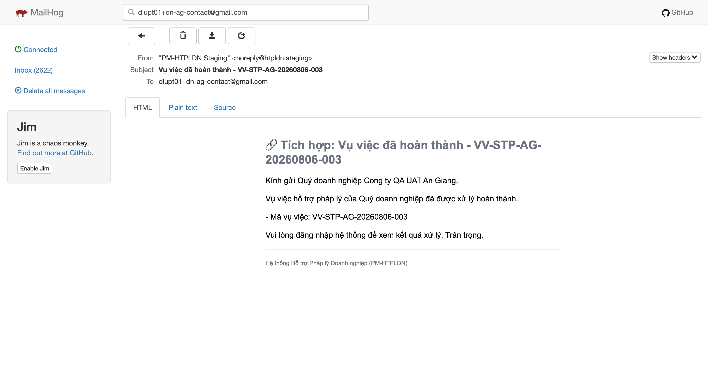
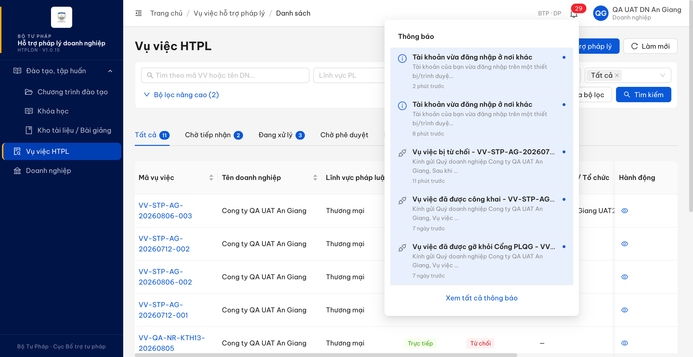
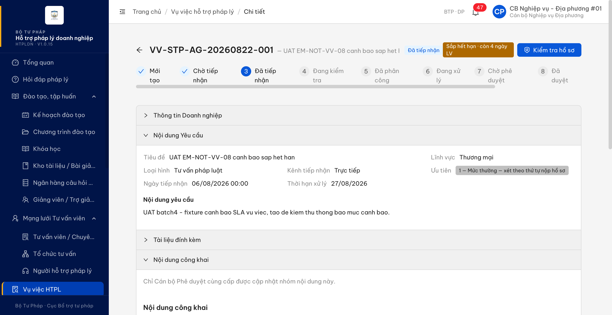
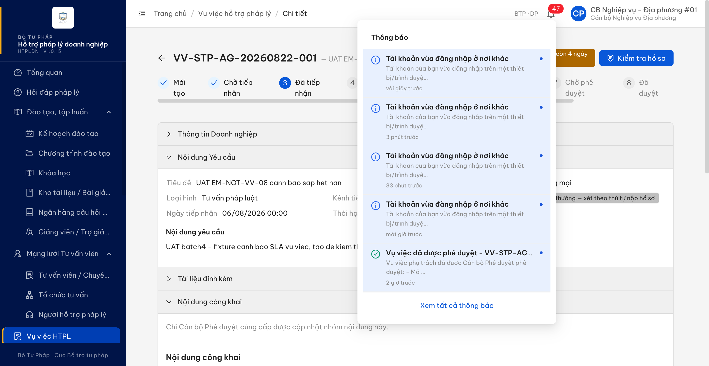

# Bug Report — Email Vụ việc HTPL (file 03)

| Thông tin | Giá trị |
|-----------|---------|
| **Dự án** | PM HTPLDN — UAT reverify tuần Email |
| **Môi trường** | https://18.143.165.120.nip.io (DEV nội bộ) · MailHog http://18.143.165.120:8025 |
| **Người test** | QA Automation (Chrome DevTools MCP) |
| **Ngày** | 2026-08-25 12:02:47 |
| **Loại test** | Functional / Workflow |
| **Round** | Batch 4 — file 03 (EM-NOT-VV-01..VV-11) |
| **Tài liệu tham chiếu** | [03-TC-email-notification-workflow.md](../03-TC-email-notification-workflow.md) · SRS `Docs-PM-HTPLDN/_bmad-output/planning-artifacts/srs-v3.5/` |

---

## Tổng hợp

> **Batch 4 file 03 (2026-08-22):** chạy 11 testcase thông báo workflow Vụ việc HTPL (EM-NOT-VV-01..VV-11), phát hiện **2** lỗi mới có tham chiếu đặc tả cụ thể. Lỗi định tuyến địa chỉ thư của doanh nghiệp (thư workflow gửi tới `DOANH_NGHIEP.email` thay vì `TAI_KHOAN.email`, gặp lại ở 4 testcase VV-04/05/06/11) **không log lại** ở đây vì đã có `BUG-EM-TK-017` trong [bug-report-em-tk.md](bug-report-em-tk.md) đang Open. File này chỉ chứa lỗi mới của nhóm Vụ việc.

### Severity breakdown

| Tổng | Critical | Major | Medium | Minor | Trivial | Closed | Open |
|------|----------|-------|--------|-------|---------|--------|------|
| 2    | 0        | 2     | 0      | 0     | 0       | 2      | 0    |

## Bug Summary Table

| Bug ID | Severity | Priority | Type | TC Ref | **SRS Reference** | Title | Status |
|--------|----------|----------|------|--------|-------------------|-------|--------|
| BUG-EM-VV-001 | Major | P1 | Workflow | EM-NOT-VV-05 | `BR-NOTIF-01` (srs-fr-05-vu-viec.md:2496 — sự kiện "hoàn thành", kênh "in-app (THONG_BAO) + email"; §Applied in gồm FR-V.I-16 tại :2498) · `FR-V.I-16 §Processing bước 3` (srs-fr-05-vu-viec.md:1160) · `§Postconditions` (srs-fr-05-vu-viec.md:1169) | Vụ việc chuyển Hoàn thành chỉ phát thư điện tử, doanh nghiệp không có thông báo trong ứng dụng | Closed |
| BUG-EM-VV-002 | Major | P1 | Workflow | EM-NOT-VV-08 · EM-NOT-VV-09 · EM-NOT-VV-10 | `FR-V.I-CROSS-01 §Processing bước 6` (srs-fr-05-vu-viec.md:1449) · `§4 mức cảnh báo` (srs-fr-05-vu-viec.md:1458, :1459, :1460) · `§Postconditions` (srs-fr-05-vu-viec.md:1464) · `BR-SLA-03` (srs-fr-05-vu-viec.md:2460) | Vụ việc đổi mức cảnh báo thời hạn nhưng không phát thư và không có thông báo trong ứng dụng cho ai | Closed |

---

## ~~BUG-EM-VV-001~~ [CLOSED] — Vụ việc chuyển Hoàn thành chỉ phát thư điện tử, doanh nghiệp không có thông báo trong ứng dụng

> **Re-test:** 2026-08-25 11:38:55 R3 — ✅ PASS (Closed-verified). DN 0109998887 nhận đủ in-app và email khi VV-BTP-TW-20260803-002 hoàn thành.

**Bằng chứng R3:** PASS ngày 25/08/2026 trên `VV-BTP-TW-20260803-002`, DN `0109998887`. `cbnv_tw_01` cập nhật kết quả cuối thành công; API 201, hồ sơ `DA_DUYET → HOAN_THANH`, version 7 → 8 lúc 04:37:27Z. Tài khoản DN nhận đúng 1 thông báo `a89a7598-f4d9-4eee-9cdd-6fbbf29461c0`; bản ghi có `daGuiEmail=true`, `emailNhan=diupt01+dn-login@gmail.com`. MailHog tăng 3059 → 3060 với đúng 1 thư hoàn thành tới cùng địa chỉ. Chi tiết: [condition table R3](../cond/BUG-EM-VV-001.md); ảnh [chuông DN](image/bug-em-vv-001-r3-dn-inapp-completed-2026-08-25.png) và [MailHog](image/bug-em-vv-001-r3-mailhog-completed-2026-08-25.png).

### Mô tả

Khi Cán bộ Nghiệp vụ cập nhật kết quả cuối và vụ việc chuyển sang `HOAN_THANH`, hệ thống chỉ phát thư điện tử cho doanh nghiệp. Tài khoản doanh nghiệp không nhận được thông báo nào trong ứng dụng: chuông không tăng mục mới và danh sách thông báo cá nhân không có bản ghi tương ứng. Doanh nghiệp trong ca này **có tài khoản đang hoạt động** nên không rơi vào ngoại lệ "bên nhận chưa có tài khoản" của `BR-NOTIF-01`.

### Các bước tái hiện

1. Đăng nhập `nht_ag_uat2` (vai trò `NHT`, là người được phân công vụ việc `VV-STP-AG-20260806-003`, đơn vị An Giang `00000000-0000-4000-8002-000000000006`) → nhận phân công, cập nhật kết quả, trình phê duyệt. Đăng nhập `cbpd_dp_01` (vai trò `CB_PD_DP`, quyền phê duyệt vụ việc cùng đơn vị) → phê duyệt. Vụ việc về `DA_DUYET`.
2. Đăng nhập `cbnv_dp_01` (vai trò `CB_NV_DP`, quyền cập nhật kết quả cuối theo SCR-V.I-03 Accordion 6). Ghi nhận mốc thời gian và tổng số thư MailHog trước khi bấm: `2026-08-22T14:51:10Z`, tổng `2621`.
3. Thực hiện cập nhật kết quả cuối (`ketQuaXuLy = THANH_CONG`) để vụ việc chuyển `HOAN_THANH`. Không bấm lặp.
4. Sau 35 giây, liệt kê toàn bộ thư MailHog phát sinh sau mốc `14:51:10Z`.
5. Đăng nhập tài khoản doanh nghiệp `0209888006` (`QA UAT DN An Giang`, `HOAT_DONG`) → mở chuông thông báo và danh sách thông báo cá nhân; kiểm tra lại sau 20 giây và sau ~5 phút.

### Kết quả mong đợi

- Theo `BR-NOTIF-01` (srs-fr-05-vu-viec.md:2496), sự kiện **hoàn thành** là sự kiện workflow được liệt kê, phải gửi thông báo cho người liên quan qua **cả hai kênh: trong ứng dụng (THONG_BAO) và thư điện tử**; §Applied in (:2498) có FR-V.I-16.
- Theo `FR-V.I-16 §Processing bước 3` (:1160) và `§Postconditions` (:1169), doanh nghiệp phải nhận được thông báo kết quả.
- Doanh nghiệp có tài khoản đang hoạt động nên không thuộc ngoại lệ "bên nhận chưa có tài khoản → chỉ gửi thư điện tử" của `BR-NOTIF-01` (srs-v3.5.md:5745).

### Kết quả thực tế

- Vụ việc chuyển đúng `HOAN_THANH` (API trả `201`, `trangThai = HOAN_THANH`); danh sách vụ việc của doanh nghiệp hiển thị "Hoàn thành".
- Kênh thư điện tử có phát: đúng **một** thư mới `Vụ việc đã hoàn thành - VV-STP-AG-20260806-003` lúc `14:51:20.431Z` (tổng MailHog `2621 → 2622`).
- Kênh trong ứng dụng **không có gì**: chuông của tài khoản doanh nghiệp vẫn dừng ở mục cũ nhất là `Vụ việc bị từ chối - VV-STP-AG-20260712-002` (14:45), không xuất hiện mục "Vụ việc đã hoàn thành"; `GET /api/v1/thong-baos?keyword=20260806-003` trả `total = 0`.
- Không phải sự cố một lần: duyệt toàn bộ 28 thông báo trong ứng dụng của tài khoản doanh nghiệp này, không có bản ghi loại "Vụ việc đã hoàn thành" nào, dù doanh nghiệp đang có 3 vụ việc ở trạng thái Hoàn thành / Đã đánh giá (`VV-STP-AG-20260712-003`, `VV-STP-AG-20260806-003`, `VV-STP-AG-20260806-005`). Các loại khác vẫn vào chuông bình thường (`Vụ việc bị từ chối` 1, `Yêu cầu bổ sung hồ sơ` 2, `Vụ việc đã được công khai` 9, `Vụ việc đã được gỡ khỏi Cổng PLQG` 8).

### Bằng chứng

**1. Ảnh chụp**:




**2. API response / log**:

```json
// POST /api/v1/vu-viecs/86495522-d5e9-4803-b0ea-f44fd9418309/hoan-thanh  (cbnv_dp_01)
{"status": 201, "success": true, "data": {"trangThai": "HOAN_THANH"}}

// MailHog — toàn bộ thư phát sinh sau mốc 2026-08-22T14:51:10Z (đo lúc 14:51:59Z, tổng 2621 -> 2622)
2026-08-22T14:51:20.431 | TO=diupt01+dn-ag-contact@gmail.com | "Vụ việc đã hoàn thành - VV-STP-AG-20260806-003"

// GET /api/v1/thong-baos?keyword=20260806-003   (tài khoản 0209888006)
{"success": true, "data": [], "meta": {"page": 1, "pageSize": 20, "total": 0, "totalPages": 0}}

// GET /api/v1/thong-baos  (tài khoản 0209888006) — 28 bản ghi, thống kê theo tiêu đề
{"Vụ việc đã được công khai": 9, "Tài khoản vừa đăng nhập ở nơi khác": 8,
 "Vụ việc đã được gỡ khỏi Cổng PLQG": 8, "Yêu cầu bổ sung hồ sơ": 2,
 "Vụ việc bị từ chối": 1, "Vụ việc đã hoàn thành": 0}
```

---

## ~~BUG-EM-VV-002~~ [CLOSED] — Vụ việc đổi mức cảnh báo thời hạn nhưng không phát thư và không có thông báo trong ứng dụng cho ai

> **Re-test:** 2026-08-25 12:02:47 R3 — ✅ PASS (Closed-verified). Job SLA gửi đủ in-app và email cho cbnv_hn khi VV-STP-HN-20260821-001 chuyển BINH_THUONG → SAP_HET_HAN; cấu hình đã hoàn nguyên.

**Bằng chứng R3:** PASS ngày 25/08/2026 trên `VV-STP-HN-20260821-001`. Với hai kênh SLA bật, job 05:00Z đổi hồ sơ `BINH_THUONG → SAP_HET_HAN` (version 2 → 3, `ngayCapNhat=05:00:00.163Z`). `cbnv_hn` nhận in-app `7aa5b7c2-27cf-4aaa-9d2d-275ce79d6f0b` lúc 05:00:00.188Z; bản ghi có `daGuiEmail=true`, `ngayGuiEmail=05:00:00.273Z`, `emailNhan=diupt01+cb-nv-dn@gmail.com`. MailHog có thư tương ứng lúc 05:00:00.272Z. Cấu hình SLA đã hoàn nguyên đầy đủ về 15 ngày, ngưỡng 50/100%, hệ số 2 và hai kênh bật (version 19). Chi tiết: [condition table R3](../cond/BUG-EM-VV-002.md); ảnh [in-app](image/bug-em-vv-002-r3-inapp-sla-warning-2026-08-25.png) và [MailHog](image/bug-em-vv-002-r3-mailhog-sla-warning-2026-08-25.png).

### Mô tả

Công việc chạy nền cập nhật mức cảnh báo thời hạn của vụ việc hoạt động đúng: cứ 30 phút một lần, nó tính lại và ghi mức mới lên hồ sơ. Nhưng bước gửi thông báo kèm theo thì không chạy: qua ba lần đổi mức đã đo (lên Sắp hết hạn, xuống Quá hạn, lên Quá hạn nghiêm trọng), không hộp thư nào nhận được thư và không tài khoản nào có thông báo mới trong ứng dụng — kể cả Cán bộ Nghiệp vụ phụ trách hồ sơ, Cán bộ Phê duyệt cùng đơn vị và Cán bộ Phê duyệt ở đơn vị cấp trên. Cấu hình đang bật cả hai kênh (`guiEmailCanhBao = true`, `guiThongBaoApp = true`).

### Các bước tái hiện

1. Đăng nhập `admin` (vai trò `QTHT`, quyền cấu hình SLA theo UC108) → `GET /api/v1/cau-hinh/sla/VU_VIEC`, xác nhận `guiEmailCanhBao = true`, `guiThongBaoApp = true`, `thoiHanNgay = 15`, `canhBao1PhanTram = 50`, `canhBao2PhanTram = 100`, `quaHanHeSo = 2`.
2. Đăng nhập `cbnv_dp_01` (vai trò `CB_NV_DP`, đơn vị An Giang) → tạo hồ sơ `VV-STP-AG-20260822-001` với ngày tiếp nhận lùi về 06/08/2026 (hạn xử lý 27/08/2026, đã dùng ~81% thời hạn). Đăng nhập `cbnv_bn_01` (vai trò `CB_NV_BN`, đơn vị Bộ KH&ĐT `00000000-0000-4000-8001-000000000001`, đơn vị cha là Trung ương `00000000-0000-4000-8000-000000000001` đang có 6 tài khoản `CB_PD_TW` hoạt động) → tạo hồ sơ `VV-BKH-20260822-001` với ngày tiếp nhận lùi về 01/06/2026 (đã dùng ~395% thời hạn).
3. Đổi ngưỡng cảnh báo qua `PATCH /api/v1/cau-hinh/sla/{id}` để ép hai hồ sơ đổi mức ở lần chạy nền kế tiếp, ghi lại số thư MailHog và mốc thời gian ngay trước mỗi lần chạy.
4. Sau mỗi lần chạy nền, đọc lại `mucDoCanhBao` và `ngayCapNhat` của hồ sơ để xác nhận mức đã thực sự đổi.
5. Liệt kê toàn bộ thư MailHog phát sinh sau mốc đã ghi; đăng nhập từng tài khoản người nhận theo đặc tả (`cbnv_dp_01`, `cbnv_bn_01`, `cbpd_bn_01`, `cbpd_tw_01`) và mở chuông thông báo.

### Kết quả mong đợi

- Theo `FR-V.I-CROSS-01 §Processing` bước 5 rồi bước 6 (srs-fr-05-vu-viec.md:1448, :1449): sau khi cập nhật mức cảnh báo, hệ thống "Gửi email + in-app nếu cấu hình" theo `BR-SLA-03`.
- Theo bảng 4 mức cảnh báo của cùng FR: `SAP_HET_HAN` → "Thông báo CB NV" (:1458); `QUA_HAN` → "Thông báo CB NV + CB PD" (:1459); `QUA_HAN_NGHIEM_TRONG` → "Thông báo + escalate" (:1460). §Postconditions (:1464): "Thông báo gửi theo mức cảnh báo".
- Theo `BR-SLA-03` (srs-fr-05-vu-viec.md:2460): "Khi VU_VIEC chuyển mức cảnh báo (BR-SLA-02), hệ thống gửi thông báo theo mức … SAP_HET_HAN → CB NV phụ trách; QUA_HAN → CB NV + CB PD cùng cấp; QUA_HAN_NGHIEM_TRONG → CB NV + CB PD + escalate cấp trên. Kênh: in-app + email theo cấu hình." Điều khoản chỉ loại trừ trường hợp **xoá** mức, không loại trừ trường hợp đặt mức lần đầu hay đổi mức theo chiều nào.

### Kết quả thực tế

- Mức cảnh báo được cập nhật đúng và đúng nhịp 30 phút, có ghi `ngayCapNhat`:
  - 15:30:00 — ba hồ sơ mới nhận mức lần đầu: `VV-STP-AG-20260822-001` → Sắp hết hạn, `VV-STP-AG-20260822-002` → Quá hạn, `VV-BKH-20260822-001` → Quá hạn nghiêm trọng.
  - 16:30:00.479 — `VV-STP-AG-20260822-001` đổi **Bình thường → Sắp hết hạn**; giao diện chi tiết hiển thị "Sắp hết hạn · còn 4 ngày LV".
  - 16:30:00.162 — `VV-BKH-20260822-001` đổi **Quá hạn → Quá hạn nghiêm trọng**.
  - 17:00:00.232 — `VV-BKH-20260822-001` đổi **Quá hạn nghiêm trọng → Quá hạn**.
- Không có thư nào được phát. Số thư MailHog giữ nguyên `2654 → 2654` trong cửa sổ 16:02:31Z–16:31:56Z (bao trọn lần chạy 16:30). Trong cửa sổ 16:33:25Z–19:38:25Z (bao 6 lần chạy nền: 17:00, 17:30, 18:00, 18:30, 19:00, 19:30) chỉ có đúng 3 thư và cả 3 đều là "Mã xác thực đăng nhập" do chính người kiểm thử đăng nhập.
- Không có thông báo trong ứng dụng. Chuông của `cbnv_dp_01` (Cán bộ Nghiệp vụ phụ trách `VV-STP-AG-20260822-001`) không có mục nào sau 15:00; mục gần nhất liên quan vụ việc vẫn là "Vụ việc đã được phê duyệt - VV-STP-AG-20260806-001" lúc 15:00:58. Chuông của `cbnv_bn_01`, `cbpd_bn_01` và `cbpd_tw_01` cũng không có mục cảnh báo nào ở các mốc 16:30 và 17:00.
- Cơ chế thông báo của hệ thống không hỏng nói chung: cùng tài khoản `cbnv_bn_01` vẫn có mục "Câu hỏi quá hạn nghiêm trọng" ngày 21/08/2026 lúc 08:30:00 do công việc chạy nền của phân hệ Hỏi đáp sinh ra.
- Cấu hình SLA đã được khôi phục nguyên trạng sau khi đo (`thoiHanNgay 15`, `canhBao1PhanTram 50`, `canhBao2PhanTram 100`, `quaHanHeSo 2`, `soNgayBoSungToiDa 5`, hai công tắc thông báo giữ bật).

### Bằng chứng

**1. Ảnh chụp**:




**2. API response / log**:

```json
// GET /api/v1/cau-hinh/sla/VU_VIEC  (admin) — hai kênh thông báo đều bật
{"loaiYeuCau":"VU_VIEC","thoiHanNgay":15,"canhBao1PhanTram":50,"canhBao2PhanTram":100,
 "quaHanHeSo":2,"guiEmailCanhBao":true,"guiThongBaoApp":true}

// Mức cảnh báo sau các lần chạy nền
{"maVuViec":"VV-STP-AG-20260822-001","mucDoCanhBao":"BINH_THUONG",          "ngayCapNhat":"2026-08-22T16:00:00.342Z"}
{"maVuViec":"VV-STP-AG-20260822-001","mucDoCanhBao":"SAP_HET_HAN",          "ngayCapNhat":"2026-08-22T16:30:00.479Z"}
{"maVuViec":"VV-BKH-20260822-001",   "mucDoCanhBao":"QUA_HAN",              "ngayCapNhat":"2026-08-22T16:00:00.167Z"}
{"maVuViec":"VV-BKH-20260822-001",   "mucDoCanhBao":"QUA_HAN_NGHIEM_TRONG", "ngayCapNhat":"2026-08-22T16:30:00.162Z"}
{"maVuViec":"VV-BKH-20260822-001",   "mucDoCanhBao":"QUA_HAN",              "ngayCapNhat":"2026-08-22T17:00:00.232Z"}

// MailHog — toàn bộ thư phát sinh sau 2026-08-22T16:33:25Z, đo lúc 19:38:25Z (6 lần chạy nền)
TOTAL=2660
2026-08-22T16:34:27.289 | TO=diupt01+cb-nv-ag@gmail.com | "Mã xác thực đăng nhập"
2026-08-22T16:34:04.569 | TO=diupt01+cb-pd-a@gmail.com  | "Mã xác thực đăng nhập"
2026-08-22T16:33:39.497 | TO=diupt01+cb-pd-b@gmail.com  | "Mã xác thực đăng nhập"

// GET /api/v1/thong-baos  — 4 mục mới nhất của từng người nhận theo đặc tả (không có mục cảnh báo nào)
cbnv_dp_01 : 16:32:10 "Tài khoản vừa đăng nhập ở nơi khác" | 15:00:58 "Vụ việc đã được phê duyệt - VV-STP-AG-20260806-001"
cbnv_bn_01 : 19:38:43 "Tài khoản vừa đăng nhập ở nơi khác" | 2026-08-21T08:30:00 "Câu hỏi quá hạn nghiêm trọng"
cbpd_bn_01 : 20:39:41 "Tài khoản vừa đăng nhập ở nơi khác" | 2026-08-11T23:40:35 "Báo cáo đợt ... đã được trình duyệt"
cbpd_tw_01 : 16:34:08 "Tài khoản vừa đăng nhập ở nơi khác" | 2026-08-22T11:00:09 "Hồ sơ TVV chờ phê duyệt"
```
