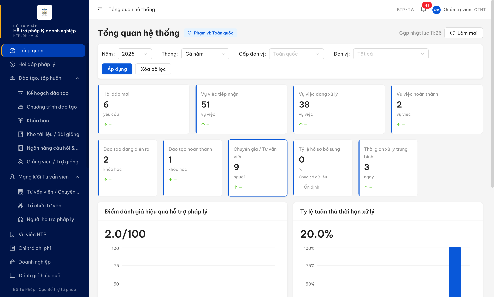
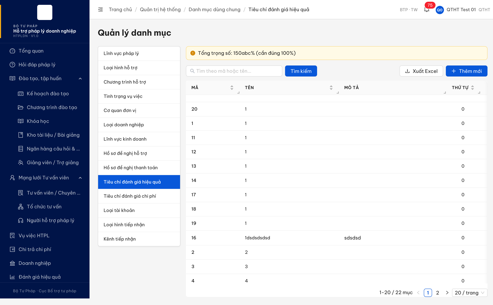
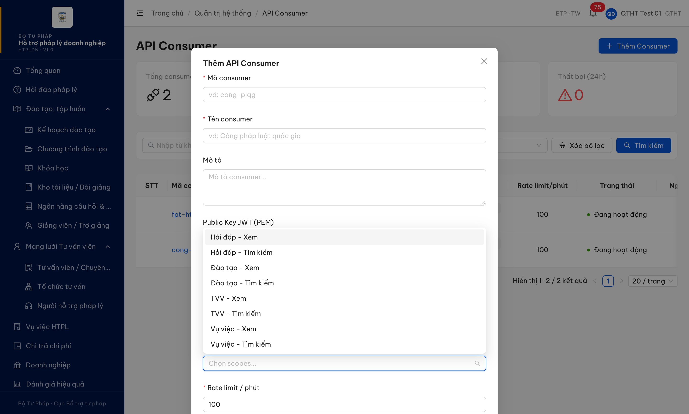

# Bug Report — Quản trị hệ thống (Auth / Danh mục / Vai trò / Đơn vị / API Consumer)

| Thông tin | Giá trị |
|-----------|---------|
| **Dự án** | PM HTPLDN |
| **Môi trường** | http://103.172.236.130:3000/ |
| **Người test** | QA Automation (Claude Code via MCP) |
| **Ngày** | 2026-05-28 11:25:00 |
| **Loại test** | Functional + API contract (qua UI session) |
| **Round** | R8 |
| **Tài liệu tham chiếu** | [verify-todo-expanded-2026-05-27.md](../../verify-todo-expanded-2026-05-27.md) · [clawpatch-bug-summary-2026-05-27.md](../../clawpatch-bug-summary-2026-05-27.md) |

---

## Tổng hợp

Phát hiện **6** lỗi có SRS reference cụ thể trong module Quản trị hệ thống (Round 8 verify pass).

### Severity breakdown

| Tổng | Critical | Major | Medium | Minor | Trivial | Closed | Open |
|------|----------|-------|--------|-------|---------|--------|------|
| 6    | 1        | 4     | 1      | 0     | 0       | 0      | 6    |

## Bug Summary Table

| Bug ID | Severity | Priority | Type | TC Ref | **SRS Reference** | Title | Status |
|--------|----------|----------|------|--------|-------------------|-------|--------|
| H007 | Critical | P0 | Permission | TC-AUTH-01 | `srs-update-2026-5-5/srs-fr-10-quan-tri.md FR-VIII-15 §Account + BR-AUTH-01 + BR-AUTH-02` | Tài khoản `admin` đăng nhập được với mật khẩu mặc định `Secret@123` qua flow OTP bypass | Open |
| H040 | Major | P1 | Negative | TC-DM-NEG-01 | `srs-update-2026-5-5/srs-fr-08-danh-gia.md:1099 §3.4.3.42 row 5` + `srs-fr-08-danh-gia.md:190 FR-VI-02 row 4` + `srs-fr-10-quan-tri.md:539 FR-VIII-11 row 3` | trongSo nhận giá trị chuỗi 'abc' bypass validate kiểu number, record vẫn được commit | Open |
| H066 | Major | P1 | Data | TC-DM-CONC-01 | `srs-update-2026-5-5/srs-fr-10-quan-tri.md FR-VIII-11 §Processing + BR-DATA-05 §3.4 entity DANH_MUC` | Optimistic lock danh-muc — 2 PATCH cùng version=1 đều succeed, lost update | Open |
| H067 | Major | P1 | Data | TC-VT-CONC-01 | `srs-update-2026-5-5/srs-fr-10-quan-tri.md FR-VIII-15 + §3.4 VAI_TRO` | Optimistic lock vai-tro — 2 PATCH cùng version=1 đều succeed, lost update | Open |
| H068 | Major | P1 | Data | TC-DV-CONC-01 | `srs-update-2026-5-5/srs-fr-10-quan-tri.md FR-VIII-19 + §3.4 DON_VI` | Optimistic lock don-vi — 2 PATCH cùng version=1 đều succeed, lost update | Open |
| H087 | Medium | P2 | UI/UX | TC-APIC-01 | `srs-update-2026-5-5/srs-fr-16-api.md:30-31 + :959 FR-XII-19 §Scope JWT inbound:write` | Form API Consumer scope dropdown thiếu các scope `write/inbound` mà SRS quy định | Open |

---

## H007 — Tài khoản `admin` đăng nhập được với mật khẩu mặc định `Secret@123`

### Mô tả

Tài khoản root `admin` (Quản trị viên cao nhất, email `adm***@htpldn.gov.vn`) cho phép đăng nhập bằng mật khẩu mặc định `Secret@123` — giống password mặc định của toàn bộ tài khoản test trong `input/users.csv`. Sau OTP `666666` (bypass dev), session full quyền với role QTHT cap "BTP · TW" + access toàn bộ menu Quản trị hệ thống. Tài khoản này là default seed có lifecycle vĩnh viễn, không có policy ép đổi mật khẩu first-login.

### Các bước tái hiện

1. Mở incognito hoặc isolated context, vào http://103.172.236.130:3000/login.
2. Nhập `Tên đăng nhập = admin`, `Mật khẩu = Secret@123`.
3. Click **Đăng nhập** → hệ thống chuyển sang trang OTP, hiển thị `Mã 6 chữ số đã gửi đến email adm***@htpldn.gov.vn`.
4. Nhập `666666` (OTP bypass dev environment).
5. Quan sát: vào thẳng `/dashboard` với role hiển thị "Quản trị viên" / "QTHT" / "BTP · TW", sidebar full Quản trị hệ thống.

### Kết quả mong đợi

- Theo SRS `srs-update-2026-5-5/srs-fr-10-quan-tri.md FR-VIII-15 §Tài khoản & phân quyền + BR-AUTH-01/02`: account default/seed bắt buộc ép đổi mật khẩu first-login HOẶC mật khẩu phải được set unique per account (không dùng pattern dùng chung như `Secret@123`).
- Hệ thống không được giữ password mặc định dễ đoán cho tài khoản root sau khi triển khai.
- Phải có policy strong password (min length, complexity) bắt buộc cho account cấp cao nhất.

### Kết quả thực tế

- `admin / Secret@123` login thành công sang OTP page.
- OTP `666666` bypass thành công → vào dashboard full quyền QTHT/TW.
- Account không bị flag "first login phải đổi password".
- Mật khẩu trùng pattern `Secret@123` áp dụng cho 33 account test khác trong cùng môi trường.

### Bằng chứng



```
URL sau OTP: http://103.172.236.130:3000/dashboard
User display: QV · Quản trị viên · QTHT
Phạm vi: Toàn quốc / BTP · TW
```

Source ref clawpatch: cấu hình seed account + thiếu force-change-password policy ở `packages/api/src/modules/auth/*` (BE) và policy thiếu UI ép đổi mật khẩu first-login.

---

## H040 — POST danh mục TIEU_CHI_DG_HIEU_QUA với `duLieuMoRong.trongSo='abc'` lưu được dù backend trả 500

### Mô tả

QTHT POST `/api/v1/danh-muc` tạo tiêu chí đánh giá hiệu quả với `duLieuMoRong.trongSo = "abc"` (chuỗi, không phải số). Backend trả HTTP 500 `ERR-SYS-00-00-01` nhưng record vẫn được commit vào DB với trạng thái `KICH_HOAT`. Sau reload, FE hiển thị cảnh báo "Tổng trọng số: 150abc% (cần đúng 100%)" — chứng tỏ giá trị chuỗi đã trộn vào phép tính tổng, làm cảnh báo trọng số mất ý nghĩa nghiệp vụ.

### Các bước tái hiện

1. Login `qtht_01 / Secret@123` → OTP `666666` → Dashboard.
2. Menu *Quản trị hệ thống* → *Danh mục dùng chung* → tab **Tiêu chí đánh giá hiệu quả**.
3. Mở DevTools console, gửi POST trực tiếp qua session đã auth:
   ```js
   await fetch('/api/v1/danh-muc', {
     method: 'POST', credentials: 'include',
     headers: { 'Content-Type': 'application/json' },
     body: JSON.stringify({
       ma: 'TCH040-799740', ten: 'H040 verify trongSo abc',
       loaiDanhMuc: 'TIEU_CHI_DG_HIEU_QUA', thuTu: 99, trangThai: 'HOAT_DONG',
       duLieuMoRong: { trongSo: 'abc', thangDiemMin: 0, thangDiemMax: 10 }
     })
   })
   ```
4. Response: HTTP 500 `ERR-SYS-00-00-01 "Lỗi hệ thống, vui lòng thử lại sau"`.
5. GET `/api/v1/danh-muc/tree?loaiDanhMuc=TIEU_CHI_DG_HIEU_QUA&includeInactive=true` — record `TCH040-799740` xuất hiện với `duLieuMoRong.trongSo: "abc"`, `trangThai: "KICH_HOAT"`.
6. Reload trang — count tăng từ 21 → 22 mục; cảnh báo trên trang đổi từ `"Tổng trọng số: 150%"` thành `"Tổng trọng số: 150abc%"`.

### Kết quả mong đợi

- Theo SRS `srs-update-2026-5-5/srs-fr-08-danh-gia.md:1099` §3.4.3.42 TIEU_CHI_DANH_GIA row 5: `trong_so | number | CHECK BETWEEN 0 AND 100` — DB-level constraint phải reject giá trị non-numeric / ngoài 0-100.
- Theo SRS `srs-fr-08-danh-gia.md:190` FR-VI-02 Inputs row 4: `trong_so | number | Y | 1-100, SUM = 100%` — Application-level validate kiểu số TRƯỚC khi commit.
- Hệ thống phải trả lỗi validate 4xx (vd `ERR-VAL-VIII-99-XX`) trước khi insert, KHÔNG được commit row sai kiểu rồi mới crash hậu kỳ.

### Kết quả thực tế

- Validate chỉ kiểm tra `duLieuMoRong` là `object`, không validate kiểu/range cho field `trongSo` → string `"abc"` lọt.
- Record INSERT commit vào DB TRƯỚC khi nghiệp vụ tính trọng số chạy.
- Post-save warning query cast `::numeric` crash với input `"abc"` → response 500 ERR-SYS-00-00-01.
- Row sai kiểu nằm trong DB sau khi request fail → "poisoned row".
- FE chuỗi-cộng `150 + "abc" = "150abc"` thay vì raise → cảnh báo `"Tổng trọng số: 150abc%"`.

### Bằng chứng



```json
// POST /api/v1/danh-muc → HTTP 500
{ "success": false, "error": { "code": "ERR-SYS-00-00-01", "message": "Lỗi hệ thống" } }

// GET /api/v1/danh-muc/tree?loaiDanhMuc=TIEU_CHI_DG_HIEU_QUA&includeInactive=true
// → record vẫn còn:
{ "id": "d6af145f-...", "ma": "TCH040-799740", "duLieuMoRong": { "trongSo": "abc", ... }, "trangThai": "KICH_HOAT" }
```

Source ref clawpatch: `packages/api/src/modules/danh-muc/dto/create-danh-muc.dto.ts:49-51` (`CreateDanhMucDto.duLieuMoRong`) + `packages/api/src/modules/danh-muc/danh-muc.service.ts` (save trước, warning query sau).

---

## H066 — Optimistic lock /api/v1/danh-muc bypass: 2 PATCH cùng version=1 đều thành công, lost update

### Mô tả

Hai PATCH request đến `/api/v1/danh-muc/:id` với cùng `version=1` (gửi đồng thời) đều trả về HTTP 200 SUCCESS. Cả hai update đều report thành công nhưng chỉ một update được persist; update còn lại bị mất silently. Đây là pattern "lost update" do optimistic lock được check OUT-OF-WRITE (read version → check → write) thay vì atomic CAS trong cùng query.

### Các bước tái hiện

1. Login `qtht_01`, mở DevTools console.
2. Tạo record test:
   ```js
   const c = await (await fetch('/api/v1/danh-muc', { method:'POST', credentials:'include', headers:{'Content-Type':'application/json'}, body: JSON.stringify({ ma:'LOCK-975470', ten:'H066 test', loaiDanhMuc:'LINH_VUC_PL', thuTu:99, trangThai:'HOAT_DONG' })})).json();
   const id = c.data.id; const version = c.data.version; // version=1
   ```
3. Bắn 2 PATCH song song với cùng `version=1`:
   ```js
   await Promise.all([
     fetch(`/api/v1/danh-muc/${id}`, { method:'PATCH', credentials:'include', headers:{'Content-Type':'application/json'}, body: JSON.stringify({ ten:'Updated by A', version: 1 }) }),
     fetch(`/api/v1/danh-muc/${id}`, { method:'PATCH', credentials:'include', headers:{'Content-Type':'application/json'}, body: JSON.stringify({ ten:'Updated by B', version: 1 }) })
   ]);
   ```
4. Quan sát: cả 2 trả `HTTP 200, success:true`. GET sau cùng → `ten = "Updated by request A"`, `version = 2` (đáng ra phải = 3 nếu cả 2 đều ghi đè đúng cách).

### Kết quả mong đợi

- Theo SRS `srs-update-2026-5-5/srs-fr-10-quan-tri.md FR-VIII-11 §Processing` + `BR-DATA-05` và pattern optimistic locking chung trong §3.4 các entity DANH_MUC:
- Update sau (PATCH B) khi version DB đã bằng 2 (sau khi A commit) phải bị reject với HTTP `409 Conflict` (vd `ERR-DATA-09-CONFLICT-VERSION`).
- Atomic CAS UPDATE phải đảm bảo: `UPDATE ... SET ten=?, version=version+1 WHERE id=? AND version=?` — chỉ thành công nếu version khớp.

### Kết quả thực tế

- Cả 2 PATCH cùng `version=1` đều trả `200 SUCCESS`, đều report thành công.
- Final DB state: `ten = "Updated by request A"`, `version = 2`.
- Update của request B mất hoàn toàn (lost update), không có conflict notification.
- Pattern: BE đọc record + check version trong code → write — race condition giữa check và write.

### Bằng chứng

```json
// PATCH A response: HTTP 200 { "success": true, "data": { "ten": "Updated by request A", ... } }
// PATCH B response: HTTP 200 { "success": true, "data": { "ten": "Updated by request B", ... } }
// GET /api/v1/danh-muc/<id> sau cùng:
{ "id": "e9afa65c-a2cc-4ccc-a278-36e9598f5917", "ten": "Updated by request A", "version": 2 }
// → A thắng nhưng B mất (báo cáo success false-positive)
```

Source ref clawpatch: `packages/api/src/modules/danh-muc/danh-muc.service.ts:167-180 DanhMucService.updateDanhMuc` — optimistic lock checked outside write.

---

## H067 — Optimistic lock /api/v1/vai-tro bypass: lost update khi 2 PATCH song song

### Mô tả

Pattern tương tự H066 nhưng trên endpoint `/api/v1/vai-tro/:id`. Hai PATCH cùng `version=1` gửi đồng thời đều trả 200 success. Final state version=2 thay vì 3, update B bị mất.

### Các bước tái hiện

1. Login `qtht_01`, mở DevTools console.
2. Tạo vai trò test rồi bắn 2 PATCH parallel:
   ```js
   const c = await (await fetch('/api/v1/vai-tro', { method:'POST', credentials:'include', headers:{'Content-Type':'application/json'}, body: JSON.stringify({ maVaiTro:'TLOCK_997147', tenVaiTro:'H067 test', moTa:'lock test', maQuyenCacQuyen:[], trangThai:'KICH_HOAT' })})).json();
   const id = c.data.id;
   await Promise.all([
     fetch(`/api/v1/vai-tro/${id}`, { method:'PATCH', credentials:'include', headers:{'Content-Type':'application/json'}, body: JSON.stringify({ tenVaiTro:'Updated A', version: 1 }) }),
     fetch(`/api/v1/vai-tro/${id}`, { method:'PATCH', credentials:'include', headers:{'Content-Type':'application/json'}, body: JSON.stringify({ tenVaiTro:'Updated B', version: 1 }) })
   ]);
   ```
3. GET `/api/v1/vai-tro/${id}` — final `tenVaiTro = "Updated B"`, `version = 2`.

### Kết quả mong đợi

- Theo SRS `srs-fr-10-quan-tri.md FR-VIII-15` + entity VAI_TRO §3.4 + BR-DATA-05: PATCH thứ 2 phải bị reject HTTP 409 do version mismatch.

### Kết quả thực tế

- Cả 2 PATCH trả `200 SUCCESS`.
- Final state: `tenVaiTro = "Updated B"`, `version = 2` (mất 1 update).

### Bằng chứng

```json
// PATCH A: HTTP 200 { "success": true, "data": { "tenVaiTro": "Updated A", ... } }
// PATCH B: HTTP 200 { "success": true, "data": { "tenVaiTro": "Updated B", ... } }
// GET sau cùng:
{ "id": "537cdf9c-...", "tenVaiTro": "Updated B", "version": 2 }
```

Source ref clawpatch: `packages/api/src/modules/vai-tro/dto/update-vai-tro.dto.ts:7-10` (version field) — optimistic locking checked outside write.

---

## H068 — Optimistic lock /api/v1/don-vi bypass: lost update khi 2 PATCH song song

### Mô tả

Pattern lặp lại trên endpoint `/api/v1/don-vi/:id`. 2 PATCH cùng version=1 đều thành công, final version=2 thay vì 3.

### Các bước tái hiện

1. Login `qtht_01`, mở DevTools console.
2. Tạo đơn vị test (cần parent `donViChaId`) rồi bắn 2 PATCH parallel:
   ```js
   const c = await (await fetch('/api/v1/don-vi', { method:'POST', credentials:'include', headers:{'Content-Type':'application/json'}, body: JSON.stringify({ maDonVi:'TDV...', tenDonVi:'H068 test', cap:'BN', donViChaId:'00000000-0000-4000-8000-000000000001', trangThai:'HOAT_DONG' })})).json();
   const id = c.data.id;
   await Promise.all([
     fetch(`/api/v1/don-vi/${id}`, { method:'PATCH', credentials:'include', headers:{'Content-Type':'application/json'}, body: JSON.stringify({ tenDonVi:'Updated A', version: 1 }) }),
     fetch(`/api/v1/don-vi/${id}`, { method:'PATCH', credentials:'include', headers:{'Content-Type':'application/json'}, body: JSON.stringify({ tenDonVi:'Updated B', version: 1 }) })
   ]);
   ```
3. GET sau cùng → `tenDonVi = "Updated B"`, `version = 2`.

### Kết quả mong đợi

- Theo SRS `srs-fr-10-quan-tri.md FR-VIII-19` + entity DON_VI §3.4 + BR-DATA-05: PATCH thứ 2 phải bị reject HTTP 409.

### Kết quả thực tế

- Cả 2 PATCH trả `200 SUCCESS`.
- Final state: `tenDonVi = "Updated B"`, `version = 2`.

### Bằng chứng

```json
// PATCH A: HTTP 200 success: true
// PATCH B: HTTP 200 success: true
// GET sau cùng:
{ "id": "cba5248a-...", "tenDonVi": "Updated B", "version": 2 }
```

---

## H087 — Form API Consumer thiếu scope `write` / `inbound` mà SRS yêu cầu

### Mô tả

Form *Quản trị hệ thống → API Consumer → Thêm Consumer* — dropdown "Scopes" chỉ hiển thị 19 scope với hậu tố "- Xem" (read) hoặc "- Tìm kiếm" (search). KHÔNG có scope hậu tố "- Ghi" (write) cho luồng Inbound. Hệ quả: QTHT không thể cấp scope cho integration đẩy data vào (vd Cổng PLQG inbound hỏi đáp) qua UI — phải tự inject DB hoặc dùng API admin riêng.

### Các bước tái hiện

1. Login `qtht_01`, vào *Quản trị hệ thống → API Consumer*.
2. Click **Thêm Consumer** → modal mở.
3. Click dropdown **Scopes**, scroll virtual list top-to-bottom.
4. Quan sát toàn bộ 19 option — toàn bộ là `:read` hoặc `:search`, không có `:write` / `:inbound`.

### Kết quả mong đợi

- Theo SRS `srs-update-2026-5-5/srs-fr-16-api.md:30-31`:
  > "Outbound: ... mTLS + JWT scope `read`/`search`."
  > "Inbound: Cổng PLQG đẩy câu hỏi DN về CMS để CB nghiệp vụ tiếp nhận. Auth: mTLS + JWT scope `write`."
- Theo SRS `srs-fr-16-api.md:959` FR-XII-19 §Scope JWT:
  > "Scope JWT: `htpldn:inbound:hoi-dap:write`"
- Theo SRS `srs-fr-12-tv-chuyen-sau.md:432`:
  > "JWT bearer token với scope `htpldn:inbound:tvcs:write`"
- UI form API Consumer phải có đủ scope `htpldn:<resource>:read`, `htpldn:<resource>:search`, `htpldn:inbound:<resource>:write` để QTHT cấp đúng theo loại consumer (outbound vs inbound).

### Kết quả thực tế

- 19 scope hiện hữu: `Biểu mẫu/CT HTPL/Hỏi đáp/Hồ sơ DN/TVV/Tư vấn CS/Tư vấn nhanh/Vụ việc/Đào tạo/Đánh giá — Xem | Tìm kiếm`.
- Không có scope nào dạng "- Ghi" / "Inbound - Ghi".
- Hệ quả: integration inbound Cổng PLQG không thể được cấp scope qua UI; QTHT phải intervention thủ công (DB seed).

### Bằng chứng



```js
// Scope dropdown scroll full virtual list (qua evaluate_script):
{
  "total": 19,
  "all_scopes_sorted": [
    "Biểu mẫu - Tìm kiếm","Biểu mẫu - Xem",
    "CT HTPL - Tìm kiếm","CT HTPL - Xem",
    "Hỏi đáp - Tìm kiếm","Hỏi đáp - Xem",
    "Hồ sơ DN - Tìm kiếm","Hồ sơ DN - Xem",
    "TVV - Tìm kiếm","TVV - Xem",
    "Tư vấn CS - Tìm kiếm","Tư vấn CS - Xem",
    "Tư vấn nhanh - Tìm kiếm",
    "Vụ việc - Tìm kiếm","Vụ việc - Xem",
    "Đào tạo - Tìm kiếm","Đào tạo - Xem",
    "Đánh giá - Tìm kiếm","Đánh giá - Xem"
  ]
}
// → KHÔNG có scope nào có hậu tố ":write" / "- Ghi"
```

Source ref clawpatch: `packages/web/src/pages/quan-tri/api-consumer/constants.ts:1-20` (`PREDEFINED_SCOPES`).

Quan sát phụ: "Tư vấn nhanh" chỉ có scope "- Tìm kiếm", không có "- Xem". Có thể là gap thứ 2 (FE constants thiếu).

---

## Phụ lục — Môi trường test

| Thành phần | Giá trị |
|------------|---------|
| URL ứng dụng | http://103.172.236.130:3000 |
| OTP login | `666666` (bypass) |
| MailHog (OTP inbox) | http://103.172.236.130:8025 |
| API base | /api/v1 |
| Frontend | React + Vite + Ant Design v5 |
| Xác thực | JWT trong HttpOnly cookie, fetch credentials: 'include' |
| Tool test | Chrome DevTools MCP (evaluate_script + take_screenshot) |
| Account | qtht_01 (QTHT, TW) |
| Verify method | UI navigate + browser-session fetch (KHÔNG curl direct) |

---

*Bug report generated: 2026-05-28 11:30:00 | QA Automation via Claude Code MCP*
