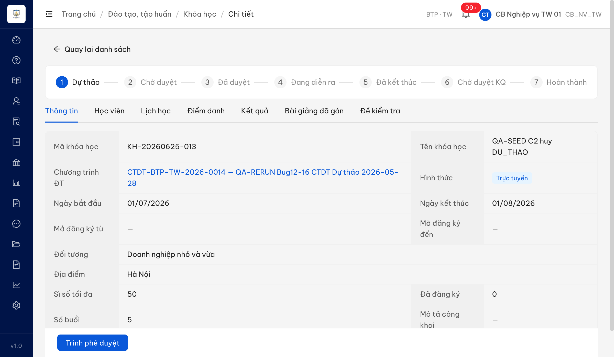
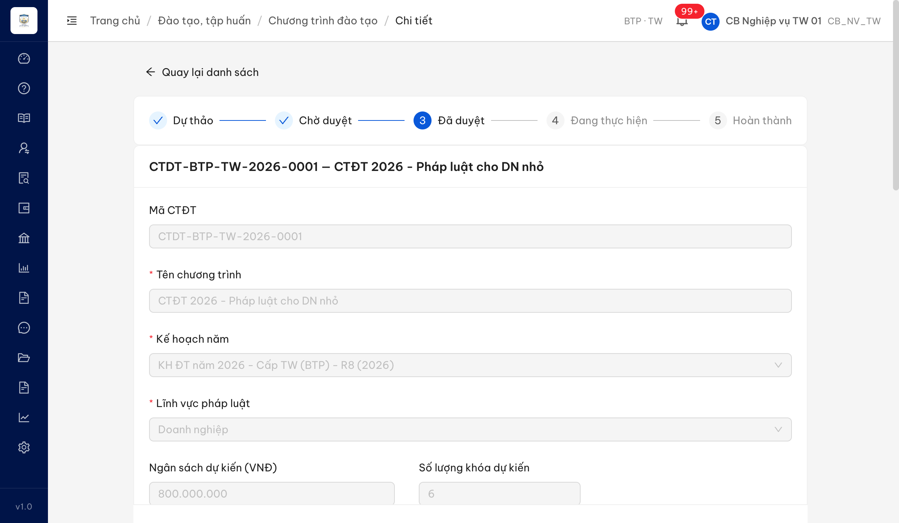

# Bug Report — Đào tạo, tập huấn (re-test dot-3, FAIL reconcile)

| Thông tin | Giá trị |
|-----------|---------|
| **Dự án** | PM HTPLDN |
| **Môi trường** | http://103.172.236.130:3000/ |
| **Người test** | QA (Claude Code + Chrome DevTools MCP) |
| **Ngày** | 2026-06-26 17:30:00 |
| **Loại test** | Functional / Workflow re-test (FAIL reconcile vs SRS v3.5) |
| **Round** | dot-3 rerun 2026-06-26 |
| **Tài liệu tham chiếu** | [FAIL-reconcile-srs-dao-tao.md](../../dao-tao/FAIL-reconcile-srs-dao-tao.md) · SRS `input/srs-update-2026-5-5/srs-fr-03-dao-tao.md` |

---

## Tổng hợp

Re-test 15 FAIL của module Đào tạo (report-dot-3) đối chiếu SRS v3.5. Sau khi loại 1 false-FAIL (→PASS), 6 TC reclass Chờ BA, 3 TC thiếu seed, còn **2 lỗi thật** có SRS reference cụ thể.

### Severity breakdown

| Tổng | Critical | Major | Medium | Minor | Trivial | Closed | Open |
|------|----------|-------|--------|-------|---------|--------|------|
| 2    | 0        | 2     | 0      | 0     | 0       | 0      | 2    |

## Bug Summary Table

| Bug ID | Severity | Priority | Type | TC Ref | **SRS Reference** | Title | Status |
|--------|----------|----------|------|--------|-------------------|-------|--------|
| BUG-DT-RR-001 | Major | P1 | Workflow | TC-KH-H-015, TC-KH-S-026 | `SM-KHOAHOC` srs-fr-03-dao-tao.md:2011 | Khóa học DU_THAO không hủy được (→DA_HUY) — chỉ có Xóa vĩnh viễn | Open |
| BUG-DT-RR-002 | Major | P1 | UI/UX | TC-XUAT-H-003, TC-XUAT-H-004, TC-XUAT-H-006 | `FR-III-20` srs-fr-03-dao-tao.md:1366 | Trang chi tiết CTĐT không có chức năng Xuất DOCX/PDF | Open |

---

## BUG-DT-RR-001 — Khóa học ở trạng thái Dự thảo (DU_THAO) không có hành động "Hủy" để chuyển sang Đã hủy (DA_HUY)

### Mô tả

Theo máy trạng thái SM-KHOAHOC, cán bộ nghiệp vụ phải hủy được khóa học đang ở trạng thái Dự thảo (DU_THAO → DA_HUY). Thực tế trên UI, khóa DU_THAO chỉ có hành động "Trình phê duyệt" (ở trang chi tiết) và "Xóa" (ở danh sách) — không có hành động "Hủy". "Xóa" là xóa vĩnh viễn ("Hành động này không thể hoàn tác"), khác bản chất với "Hủy" (chuyển trạng thái DA_HUY, giữ bản ghi, badge "Đã hủy").

### Các bước tái hiện

1. Đăng nhập role **`CB_NV_TW`** (`cb_nv_tw_01`, quyền quản lý Khóa học đào tạo theo SCR-III-02).
2. Vào **Đào tạo → Khóa học**, mở chi tiết 1 khóa trạng thái **Dự thảo** (vd `KH-20260625-013 — QA-SEED C2 huy DU_THAO`).
3. Quan sát thanh hành động ở trang chi tiết.
4. Quay lại danh sách, quan sát các icon hành động trên dòng khóa DU_THAO.

### Kết quả mong đợi

- Theo SRS SM-KHOAHOC (srs-fr-03-dao-tao.md:2011 — `DU_THAO --> DA_HUY : CB NV hủy`), khóa DU_THAO phải có hành động "Hủy": nhập lý do → chuyển trạng thái **DA_HUY**, giữ bản ghi, hiển thị badge "Đã hủy", ghi nhật ký CANCEL.

### Kết quả thực tế

- Trang chi tiết khóa DU_THAO chỉ có nút **"Trình phê duyệt"** (+ "Quay lại danh sách") — không có nút "Hủy".
- Dòng danh sách khóa DU_THAO chỉ có 3 icon: **Xem / Sửa / Xóa**.
- Bấm "Xóa" hiện popup **"Xóa khóa học? Hành động này không thể hoàn tác"** → đây là xóa vĩnh viễn, KHÔNG phải chuyển DA_HUY.
- Kết luận: không có đường nào để đưa khóa DU_THAO sang trạng thái DA_HUY qua UI.

### Bằng chứng

---

## BUG-DT-RR-002 — Trang chi tiết Chương trình đào tạo (CTĐT) không có chức năng Xuất file DOCX/PDF

### Mô tả

Theo FR-III-20, cán bộ nghiệp vụ phải xuất được file DOCX/PDF cho CTĐT ở trạng thái DA_DUYET / DA_CONG_KHAI / HOAN_THANH (sinh file từ template → tải về). Thực tế trang chi tiết CTĐT không có bất kỳ nút Xuất DOCX/PDF nào.

### Các bước tái hiện

1. Đăng nhập role **`CB_NV_TW`** (`cb_nv_tw_01`, quyền quản lý CTĐT theo SCR-III-01).
2. Vào **Đào tạo → Chương trình đào tạo**, mở chi tiết 1 CTĐT trạng thái **Đã duyệt** (vd `CTDT-BTP-TW-2026-0001`).
3. Quan sát toàn bộ nút/hành động trên trang chi tiết.

### Kết quả mong đợi

- Theo SRS FR-III-20 (srs-fr-03-dao-tao.md:1366–1386), trang chi tiết CTĐT (DA_DUYET) phải có chức năng "Xuất DOCX" và "Xuất PDF": sinh file từ template → trả file download; file mở được, nội dung CTĐT đầy đủ (tên/mã/đơn vị/danh sách khóa).

### Kết quả thực tế

- Trang chi tiết CTĐT chỉ có 2 nút: **"Quay lại danh sách"** và **"Tạo khóa học"**.
- Không có nút Xuất DOCX / Xuất PDF / Xuất ký số ở bất kỳ vị trí nào (đã quét toàn bộ button + icon, 68 phần tử tương tác).
- Chức năng FR-III-20 chưa hiện diện trên UI CTĐT.

> Ghi chú đối chiếu SRS: TC gốc kỳ vọng outbound `/api/v1/ky-so/sign-doc` + chữ ký số nhúng + audit `EXPORT_SIGNED` — các kỳ vọng này **vượt SRS** (FR-III-20 chỉ yêu cầu sinh file từ template → download). TC đã được sửa lại bám AC SRS. Tuy nhiên dù theo kỳ vọng đã sửa (chỉ export đơn thuần), chức năng vẫn FAIL vì **không có nút xuất**.

### Bằng chứng

---

## Phụ lục — Môi trường test

| Thành phần | Giá trị |
|------------|---------|
| URL ứng dụng | http://103.172.236.130:3000/ |
| OTP login | `666666` (bypass) |
| MailHog | http://103.172.236.130:8025 |
| API base | http://103.172.236.130:3000/api/v1 |
| Frontend | React + Vite + Ant Design v5 |
| Xác thực | JWT + OTP (cookie httpOnly + localStorage auth-store) |
| Tool test | Chrome DevTools MCP |

---

*Bug report generated: 2026-06-26 17:30:00 | QA via Claude Code*
