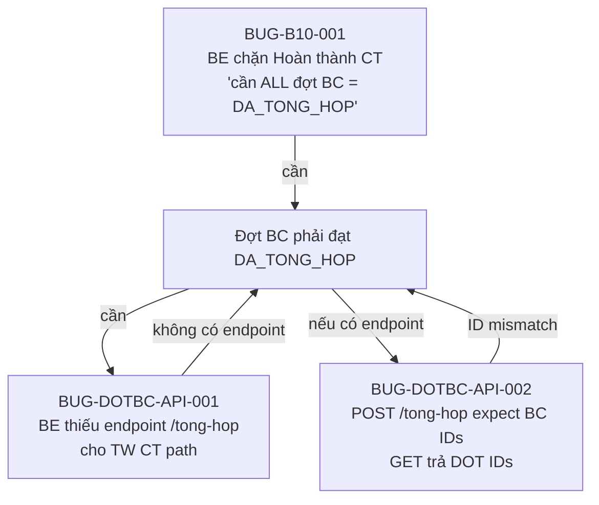
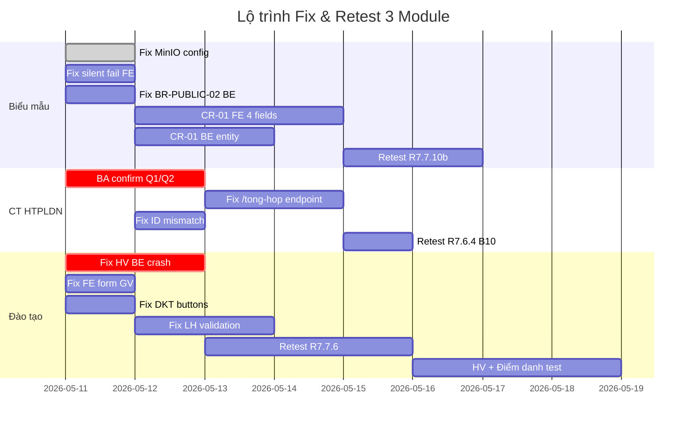

# Báo cáo Tổng hợp Chất lượng — 3 Module: Đào tạo · Biểu mẫu · CT HTPLDN

**Ngày:** 2026-05-10 · **Nguồn dữ liệu:** QA Round 7 (R7.3–R7.8, 2026-05-06 → 2026-05-10)  
**Tài liệu gốc:** Bug reports, Functional reports, Workflow reports, SRS update 2026-05-04/05  
**Mục đích:** Đánh giá khả năng chạy full-flow, xác định blockers, rủi ro và hạng mục cần đồng bộ

---

## Tổng quan nhanh (Executive Dashboard)

| Module | Full Flow? | Health Score | Bugs Open | Critical Blockers | Verdict |
|--------|:---:|:---:|:---:|:---:|---|
| **Đào tạo** | ❌ Chưa | **45/100** | 8+ | 3 | 🔴 **BLOCK NẶNG** — Nhiều sub-module chưa implement, BE crash, FE form thiếu field |
| **Biểu mẫu** | ⚠️ Gần (~60%) | **55/100** | 8 | 3 | 🟡 **CONDITIONAL** — Core CRUD OK, nhưng MinIO config sai + CR-01 chưa apply |
| **CT HTPLDN** | ✅ GĐ1: 90% · ⚠️ GĐ2: 70% | **75/100** | 5 | 2 | 🟢 **KHÁ** — GĐ1 gần hoàn chỉnh, GĐ2 (Đợt BC) vướng BE endpoint + FE chưa build |

---

## I. MODULE ĐÀO TẠO — 🔴 BLOCK NẶNG

### 1. Đánh giá khả năng Full Flow

```
Kế hoạch ĐT NĂM → Chương trình ĐT → Khóa học → Lịch học → Học viên → Điểm danh → KQ → Công bố
     ✅              ✅              ⚠️          ⚠️          ❌          ❌       ⚠️      ❌
```

**Kết luận: KHÔNG thể chạy full flow.** Luồng bị đứt tại nhiều điểm:

| Sub-module | Trạng thái | Chi tiết |
|---|:---:|---|
| Kế hoạch ĐT | ✅ OK | CRUD + workflow duyệt hoạt động |
| Chương trình ĐT | ✅ OK | State machine 7 states verified, 5 CTDT ở DA_DUYET |
| **Khóa học** | ⚠️ **Partial** | SM 11 states verified (7 inherit + 6 new TC). **DT-004 BLOCKED** — FE form thiếu field `giangVienIds` |
| Bài giảng | ⚠️ **Partial** | CRUD API OK nhưng FE thiếu button action (BUG-DKT-FE-REGRESSION-01) |
| Đề kiểm tra | ⚠️ **Partial** | BE OK nhưng FE thiếu action buttons trên list + detail |
| **Lịch học** | ⚠️ **Partial** | CRUD UI OK (8/8 bước). **4 BUG validation** Open (overlap, date range, 500 errors) |
| **Học viên** | ❌ **BLOCK** | POST `/hoc-viens` crash 500 (BUG-HV-BE-01). Entity deployed nhưng không tạo được |
| Điểm danh | ❌ **BLOCK** | Cascade — cần Học viên hoạt động |
| Kết quả học tập | ⚠️ **Partial** | SM duyệt KQ PASS (B11), nhưng chưa có HV data thực |
| Công bố KQ | ❌ **BLOCK** | Cascade — cần HV + Cổng PLQG mock |

### 2. Danh sách Bug & Issue tồn tại

> [!CAUTION]
> **3 blocker nghiêm trọng** cần fix trước khi có thể tiếp tục test downstream.

| Bug ID | Severity | Module con | Mô tả | Tác động |
|---|:---:|---|---|---|
| **BUG-HV-BE-01** | 🔴 Critical | Học viên | POST `/hoc-viens` crash 500 `ERR-SYS-00-00-01` | Block toàn bộ: điểm danh, KQ, công bố |
| **BUG-DT-FORM-GV-01** | 🔴 Major | Khóa học | FE form thiếu dropdown "Giảng viên" (required) → POST 422 | Không tạo được KH qua UI |
| **BUG-DKT-FE-REGRESSION-01** | 🔴 Major | Đề kiểm tra | FE thiếu action buttons trên list/detail | Không quản lý ĐKT qua UI |
| BUG-BG-001 | Major | Bài giảng | BE thiếu validation `fileBaiGiang` → phantom records | Dữ liệu rác |
| BUG-LH-CONFLICT-01 | Major | Lịch học | BE không validate overlap time cùng KH | Lịch học trùng nhau |
| BUG-LH-ERR-01 | Major | Lịch học | BE accept ngày ngoài khoảng thời gian KH | Vi phạm logic nghiệp vụ |
| BUG-LH-ERR-03/04 | Minor | Lịch học | Thiếu link/địa điểm → 500 generic thay vì 422 | UX kém, debug khó |
| DT-038 (N-N) | Major | KH↔BG | FE thiếu button "Gán bài giảng" + BE thiếu nested route | Không gán BG cho KH |

### 3. Phụ thuộc ngoài hệ thống

| Phụ thuộc | Module con | Mô tả | Trạng thái |
|---|---|---|:---:|
| Chuyên trang DN/NHT (FR-III-04) | Học viên | Entry-point tạo HV qua portal riêng, không qua CMS | ❓ Chưa rõ |
| Cổng PLQG mock | Công bố KQ | API push KQ ra cổng công khai | ❓ Chưa setup |

### 4. Đánh giá rủi ro

> [!WARNING]
> **Rủi ro RẤT CAO.** Module Đào tạo có SRS thay đổi lớn nhất (+133% dòng mới), nhưng tỷ lệ implement thực tế chỉ ~50-60% sub-modules. Nhiều FE form chưa đồng bộ với BE schema. Cần ít nhất **2-3 sprint** để unblock toàn bộ downstream tests.

---

## II. MODULE BIỂU MẪU — 🟡 CONDITIONAL PASS

### 1. Đánh giá khả năng Full Flow

```
Tạo Thư mục → Tạo Biểu mẫu → Upload file → Preview/Download → Công khai → Sync Cổng PLQG
     ✅              ✅            ✅            ❌ (MinIO)        ⚠️           ⚠️
```

**Kết luận: Gần hoàn thiện (~60%).** Core CRUD + State machine hoạt động. Bị block bởi cấu hình MinIO và thiếu 4 trường công khai mới (CR-01 v3.5).

### 2. Kết quả test

| Nhóm | TC | PASS | FAIL | BLOCKED | Pass Rate |
|---|:---:|:---:|:---:|:---:|:---:|
| Happy (CRUD + list + filter) | 14 | 9 | 2 | 3 | 64% |
| Negative (validate) | 9 | 4 | 1 | 2 | 44% |
| Workflow (SM + công khai) | 8 | 6 | 0 | 2 | 75% |
| CR-01 Switch (4 trường mới) | 8 | 0 | 0 | 8 | 0% |
| Authorization | 5 | 0 | 0 | 5 | 0% (defer) |
| **Tổng** | **47** | **22** | **3** | **23** | **47%** |

### 3. Danh sách Bug & Issue tồn tại

> [!IMPORTANT]
> **3 bug Critical** cần fix trước release v3.5.

| Bug ID | Severity | Mô tả | TC bị chặn | Trạng thái |
|---|:---:|---|:---:|:---:|
| **BUG-BM-007** | 🔴 Critical | MinIO trỏ `localhost:9000` → preview/download `ERR_CONNECTION_REFUSED` | BM-007, BM-008, BM-010 | Open |
| **BUG-BM-001** | 🔴 Critical | FE form thiếu 4 trường công khai (Switch + ảnh + mô tả CK + file CK) | 10 TC (BM-041→050) | Open |
| **BUG-BM-002** | 🔴 Critical | BR-PUBLIC-02 vi phạm: `ngayCongKhai` KHÔNG clear khi BM chuyển sang ẨN | BM-043 cascade | Open |
| BUG-BM-003 | Major | BE chưa rename `laCongKhai → congKhai`, `ngayCongKhai → thoiGianDangTai` | Entity response | Open |
| BUG-BM-004 | Major | BE entity thiếu 3 fields mới: `anh_dai_dien`, `mo_ta_cong_khai`, `file_dinh_kem_cong_khai` | BM-049, BM-050 | Open |
| BUG-BM-005 | Medium | UI silent fail khi BE trả 409 (công khai TM rỗng) — không hiện toast/error | BM-026 UX | Open |
| BUG-BM-006 | Medium | Cột "Số biểu mẫu" trên list TM không cập nhật sau khi thêm BM | UI counter | Open |
| BUG-BM-008 | Medium | Upload file sai format → silent reject, không có toast/error | BM-016 | Open |

### 4. Phụ thuộc ngoài hệ thống

| Phụ thuộc | Mô tả | Hành động cần thiết |
|---|---|---|
| **MinIO Storage** | Cấu hình `MINIO_PUBLIC_HOST` = `localhost:9000` → cần đổi sang `103.172.236.130:9000` | 🔧 DevOps chỉnh env config |
| API Cổng PLQG | Sync biểu mẫu công khai qua API JWT mTLS | ⏭ Defer — cần Postman setup |

### 5. Đánh giá rủi ro

> [!NOTE]
> **Rủi ro TRUNG BÌNH.** Core hoạt động tốt. Fix MinIO config (1 dòng env) sẽ unblock preview/download ngay. CR-01 (4 trường công khai) cần FE + BE cùng implement — ước tính 1 sprint.

---

## III. MODULE CT HTPLDN — 🟢 KHÁ

### 1. Đánh giá khả năng Full Flow

#### Giai đoạn 1 — Quản lý Chương trình (SM-KH-CTHTPL 8 states)

```
Tạo CT → Đệ trình → Phê duyệt → Công bố → Kích hoạt → Tạm dừng/Tiếp tục → Hoàn thành → Hủy
  ✅       ✅          ✅          ✅         ✅              ✅                  ❌          ✅
```

**GĐ1: 10/11 transitions PASS (90.9%).** Chỉ vướng bước **Hoàn thành** (B10).

#### Giai đoạn 2 — Đợt Báo cáo (SM-DOT-BC 6 states)

```
Tạo đợt → Lập BC → Trình duyệt → Duyệt KQ → Gửi TW (BN/ĐP) → Tổng hợp TW
   ✅        ✅        ✅           ✅           ✅                  ❌
```

**GĐ2 API: 5/7 transitions PASS.** UI Story 13.6 đã build phần lớn (R3 reconcile). Vướng endpoint tổng hợp TW.

### 2. Kết quả test chi tiết

| Round | Scope | TC | PASS | FAIL | Pass Rate |
|---|---|:---:|:---:|:---:|:---:|
| R7.7.15 GĐ1 (Functional P0) | CRUD + SM CT + Auth + Cross-cutting | 16 | 16 | 0 | **100%** |
| R7.7.15.b GĐ2 (Functional Đợt BC) | SM-DOT-BC API + BN/ĐP walk | 9 | 8 | 0 | **88.9%** (1 partial CT-038) |
| R7.6.4 (Workflow GĐ1) | 11 transitions SM-CT | 11 | 10 | 1 | **90.9%** |
| R7.6.5 (Workflow GĐ2) | 7 transitions SM-DOT-BC | 7 | 5 | 1 | **71.4%** (1 N/A) |

### 3. Danh sách Bug & Issue tồn tại

| Bug ID | Severity | Mô tả | Trạng thái |
|---|:---:|---|:---:|
| **BUG-CTHTPLDN-B10-001** | 🔴 Major | BE chặn Hoàn thành CT: "còn 2/2 đợt BC chưa DA_TONG_HOP" — pre-condition ngoài SRS? | Open — **cần BA confirm** |
| **BUG-DOTBC-API-001** | 🔴 Major | TW CT path: BE thiếu endpoint `/tong-hop` cho sub-resource → deadlock vĩnh viễn ở DA_DUYET_KQ | Open |
| BUG-DOTBC-API-002 | Major | POST `/tong-hop` expect BC IDs nhưng GET trả DOT IDs — ID mismatch | Open |
| BUG-DOTBC-UI-001 | Minor ↓ | Tab "Đợt báo cáo" UI — đã build phần lớn (R3), còn thiếu button [Tổng hợp] (cascade BE) | Close-candidate |
| BUG-LUUNHAP-01/02 | — | Button [Lưu nháp] → đã fix thành [Lưu] + [Đệ trình duyệt] + [Quay lại] | ✅ **Closed** |

#### Observations (Minor, không block release)

| ID | Mô tả |
|---|---|
| OBS-A | Counter "Số đợt BC" trong list = 0 mặc dù thực tế có 2 đợt |
| OBS-B | List CT không filter theo cấp đơn vị — CB BN thấy được TW CT (metadata leak) |
| OBS-C | Error code generic (`ERR-AUTH-VPD-00-02`) thay vì business-specific (`ERR-XI-04-03`) |
| OBS-D | Field naming inconsistency: `lyDo` vs `lyDoTuChoi` vs `ghiChuPheDuyet` |
| OBS-E | `/start` Đợt BC accept số liệu rỗng `{fields:{}}` không validate |

### 4. Cascade Deadlock Analysis

> [!CAUTION]
> **Deadlock vĩnh viễn cho CT cấp TW:** 3 bug tạo thành vòng deadlock khép kín.



→ **CT cấp TW hiện KHÔNG THỂ Hoàn thành** dù đã chạy đúng 90% workflow.

### 5. Phụ thuộc ngoài hệ thống

| Phụ thuộc | Mô tả | Hành động |
|---|---|---|
| **BA confirm** | Pre-condition "ALL đợt BC = DA_TONG_HOP" có đúng spec không? | 📋 BA trả lời → Dev sửa BE hoặc update SRS |
| Seed BN/ĐP CT | Cần CT cấp BN + ĐP để test full Gửi TW + Tổng hợp | ✅ Đã seed R7.7.15.b R2 (2 CT: BN + ĐP) |

### 6. Đánh giá rủi ro

> [!NOTE]
> **Rủi ro THẤP-TRUNG BÌNH.** GĐ1 rất ổn (100% P0 functional). GĐ2 cần BE fix 2 endpoints + BA clarify 1 pre-condition. Ước tính **0.5-1 sprint** để unblock hoàn toàn.

---

## IV. BẢNG TỔNG HỢP HẠNG MỤC CẦN ĐỒNG BỘ & ACTION ITEMS

### Ưu tiên 1 — Fix ngay (Unblock testing)

| # | Module | Hạng mục | Owner | Effort | Impact |
|:---:|---|---|---|:---:|---|
| 1 | Biểu mẫu | Chỉnh `MINIO_PUBLIC_HOST` = `103.172.236.130:9000` | DevOps | 🟢 5 phút | Unblock preview/download |
| 2 | Đào tạo | Fix POST `/hoc-viens` crash 500 (BUG-HV-BE-01) | BE Dev | 🟡 1-2 ngày | Unblock 9 TC downstream |
| 3 | Đào tạo | Thêm dropdown "Giảng viên" vào form Tạo KH (BUG-DT-FORM-GV-01) | FE Dev | 🟢 0.5 ngày | Unblock DT-004 happy path |
| 4 | CT HTPLDN | Expose endpoint `/tong-hop` cho TW CT path (BUG-DOTBC-API-001) | BE Dev | 🟡 1-2 ngày | Unblock Hoàn thành CT |

### Ưu tiên 2 — Fix trong sprint hiện tại

| # | Module | Hạng mục | Owner | Effort |
|:---:|---|---|---|:---:|
| 5 | Biểu mẫu | FE: Implement 4 trường công khai CR-01 (Switch + 3 fields) | FE Dev | 🟡 2-3 ngày |
| 6 | Biểu mẫu | BE: Thêm 3 cột entity + rename fields (BUG-BM-003/004) | BE Dev | 🟡 1-2 ngày |
| 7 | Biểu mẫu | FE: Map error 409/422 → Toast notification (BUG-BM-005/008) | FE Dev | 🟢 0.5 ngày |
| 8 | Biểu mẫu | BE: Clear `ngayCongKhai` khi ẨN (BR-PUBLIC-02, BUG-BM-002) | BE Dev | 🟢 0.5 ngày |
| 9 | Đào tạo | FE: Restore action buttons cho Đề kiểm tra (BUG-DKT-FE-REGRESSION-01) | FE Dev | 🟢 0.5 ngày |
| 10 | Đào tạo | BE: Validate overlap lịch học + date range (BUG-LH-CONFLICT-01) | BE Dev | 🟡 1 ngày |
| 11 | CT HTPLDN | Fix ID mismatch: GET `/tong-hop` trả thêm `baoCaoId` (BUG-DOTBC-API-002) | BE Dev | 🟢 0.5 ngày |

### Ưu tiên 3 — BA/PO cần xác nhận

| # | Câu hỏi | Module | Impact nếu chưa trả lời |
|:---:|---|---|---|
| Q1 | Pre-condition "ALL đợt BC = DA_TONG_HOP" khi Hoàn thành CT — đúng spec hay bug? | CT HTPLDN | Block Hoàn thành CT vĩnh viễn |
| Q2 | TW CT path: DA_DUYET_KQ → DA_TONG_HOP cần qua DA_GUI_TW (auto-skip) hay endpoint riêng? | CT HTPLDN | Ảnh hưởng thiết kế API |
| Q3 | Entry-point Học viên: Chuyên trang DN/NHT (FR-III-04) hay Admin seed qua `/hoc-viens`? | Đào tạo | Ảnh hưởng luồng test + seed data |
| Q4 | CT TW không có đợt BC (chỉ thực hiện, không báo cáo) → có cho Hoàn thành với count=0? | CT HTPLDN | Logic edge case |

---

## V. ROADMAP ĐỀ XUẤT



---

## VI. KẾT LUẬN

| Tiêu chí | Đào tạo | Biểu mẫu | CT HTPLDN |
|---|:---:|:---:|:---:|
| **Core CRUD** | ⚠️ Partial | ✅ OK | ✅ OK |
| **State Machine** | ⚠️ 11/11 states OK, vướng FE | ✅ 3/3 TM transitions | ✅ GĐ1: 10/11, GĐ2: 5/7 |
| **UI hoàn chỉnh** | ❌ Nhiều form thiếu fields | ❌ CR-01 chưa build | ⚠️ GĐ2 mới build xong |
| **BE ổn định** | ❌ Crash 500, thiếu validation | ⚠️ MinIO sai, entity thiếu cột | ⚠️ Thiếu 1-2 endpoints |
| **Sẵn sàng release** | ❌ **KHÔNG** | ❌ **KHÔNG** (cần fix 3 Critical) | ⚠️ **CHƯA** (cần BA confirm + fix BE) |
| **Ước tính unblock** | 2-3 sprints | 1 sprint | 0.5-1 sprint |

> [!IMPORTANT]
> **Khuyến nghị:** Tập trung fix **CT HTPLDN** trước (effort thấp nhất, impact cao nhất). Tiếp theo fix **Biểu mẫu** (MinIO 5 phút + CR-01 1 sprint). **Đào tạo** cần roadmap riêng do scope thay đổi lớn (+133% SRS) và nhiều sub-module chưa hoàn thiện.

---

*Báo cáo tổng hợp từ 15+ tài liệu QA Round 7 (2026-05-06 → 2026-05-10) | Tổng hợp bởi QA Team*
