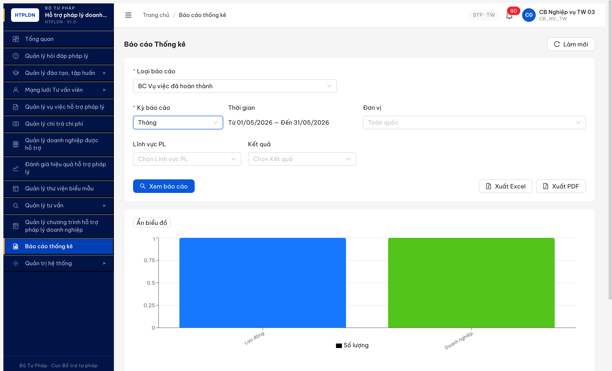
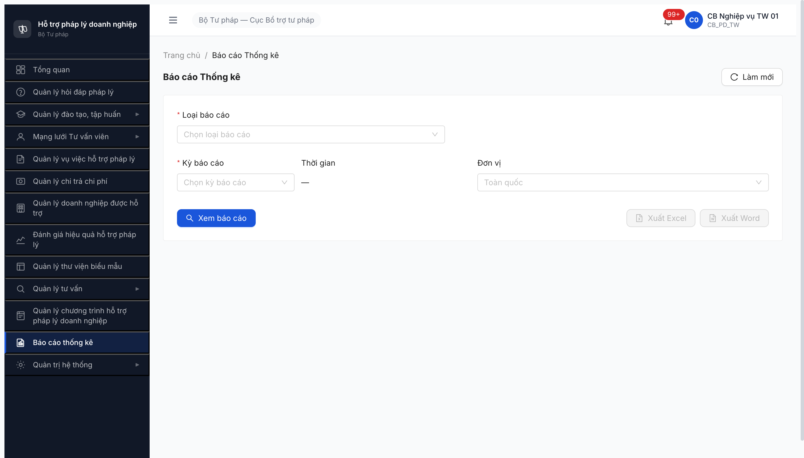
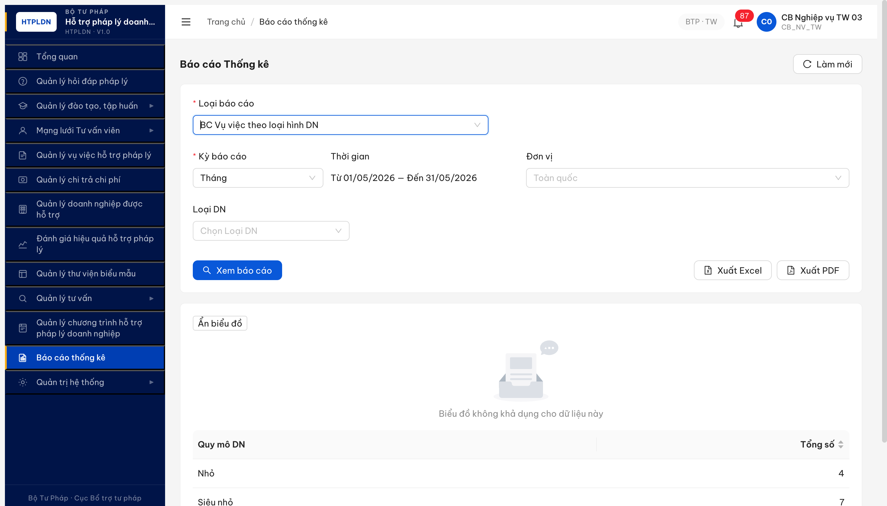

# Bug Report — Báo cáo Thống kê (R7.7.13)

| Thông tin | Giá trị |
|-----------|---------|
| **Dự án** | PM HTPLDN |
| **Môi trường** | http://103.172.236.130:3000/ |
| **Người test** | QA Automation (Claude Code via Chrome DevTools MCP) |
| **Ngày** | 2026-05-10 02:09:00 |
| **Loại test** | Functional (Module Báo cáo Thống kê — task R7.7.13) |
| **Round** | Round 7 (R7.7.13 lần 1) |
| **Tài liệu tham chiếu** | [funtion 7.11](../../../../funtion/7.11-bao-cao-thong-ke.md) · [SRS CHANGELOG-v3-to-v3.5 §srs-fr-11](../../../../../input/srs-update-2026-5-5/CHANGELOG-v3-to-v3.5.md) · [todo R7.7.13](../../../../../tasks/todo-bao-cao.md#r7-7-13) |

---

## Tổng hợp

Phát hiện **4** lỗi có SRS/UI reference cụ thể trong phase smoke + functional module Báo cáo Thống kê. **Round 1 (2026-05-10 02:09)** log 2 Major UI/UX (Word→PDF rename, Hỏi đáp pháp luật rename) — cả 2 đã được dev fix và Closed-verified ở **Round 2 (2026-05-10 12:35)**. Round 2 phát hiện thêm **1 Critical mới** — endpoint xuất PDF (`/api/v1/bao-cao/export` với `formatXuat=PDF`) trả 500 toàn bộ, nhánh xuất Excel hoạt động bình thường. Round 3 ghi nhận thêm **1 Minor UI** — BC-018 legend/empty-state còn hiển thị key kỹ thuật camelCase.

> **Bối cảnh:** Round 1 bị BE bug R7.4.B0 (JWT revoke aggressive ~30s-1min) làm block 36/40 TC. Round 2 (sau dev báo fix JWT) re-test: JWT đã ổn định qua 16 BC switches + 2 export calls trong 1 session, không bị kick `/login`. Đã chạy được 16/16 BC core (BC-004→BC-023, defer 4 ĐT/ĐG) — render OK 100%, 12 BC có data, 4 BC empty hợp lệ (CT HTPLDN seed chưa).

### Severity breakdown (R4 update)

| Tổng | Critical | Major | Medium | Minor | Trivial |
|------|----------|-------|--------|-------|---------|
| 6    | 1 (Closed) | 3 (1 Closed, 2 Open) | 1 (Open NEW) | 1 (Closed) | 0       |

**R4 audit (2026-05-11 09:30:00 — bộ acc 08):** 4/6 đóng (BUG-BC-WORD-001, BUG-BC-HOIDAP-PL-001 đóng từ R2; BUG-BC-PDF-500-001 downgraded → BUG-BC-PDF-NOT-SUPPORTED, BUG-BC-LEGEND-002 fixed). Mới phát hiện BUG-BC-DATA-SCOPE-LEAK Critical (multi-tenant scoping fail trên endpoint `/api/v1/bao-cao/*` cho CB_NV_BN + CB_NV_DP). BUG-BC-FE-DROPDOWN-MISSING-3 đã retracted (false positive scroll virtual list).

## Bug Summary Table

| Bug ID | Severity | Priority | Type | TC Ref | **SRS Reference** | Title | Status |
|--------|----------|----------|------|--------|-------------------|-------|--------|
| BUG-BC-DATA-SCOPE-LEAK | Critical | P0 | Permission | BC-026..028, BC-030..031 | `srs-v3/srs-fr-11-bao-cao.md §FR-12.4 BR-AUTH-08 + BR-DATA-02 multi-tenant scoping` — CB cấp Bộ Ngành / Sở Địa phương chỉ được xem data đơn vị mình quản lý | Endpoint `/api/v1/bao-cao/*` không apply data scope theo `donViId` của 4 role CB_NV_BN / CB_NV_DP / CB_PD_BN / CB_PD_DP — trả full national data identical TW. Dashboard scope đúng (cùng user thấy 0 vụ việc), nhưng BC endpoint leak full. R5 mở rộng evidence: thêm cb_pd_bn_08 (BTC) + cb_pd_dp_08 (Sở BG) cùng pattern | Open (R4 NEW Critical, R5 broaden 4 role) |
| BUG-BC-PDF-NOT-SUPPORTED | Major | P1 | Workflow | BC-025 | `srs-update-2026-5-5/CHANGELOG-v3-to-v3.5.md §srs-fr-11-bao-cao.md` Thay đổi 6 line 509-519 — Acceptance Criteria "Given CB nhấn 'Xuất PDF' When click Then tải file `.pdf` theo format TT17/2025" | POST `/api/v1/bao-cao/export` formatXuat=PDF trả 422 `ERR-RPT-EXPORT-01` "Không thể tạo file PDF. Vui lòng thử lại sau hoặc xuất Excel." — verify universal 4/4 BC mẫu cùng pattern (R5) | Open (downgraded R4, R5 verify universal) |
| BUG-BC-XLSX-PARTIAL-SUPPORT | Medium | P2 | Workflow | BC-024 mở rộng | `srs-fr-11-bao-cao.md §FR-IX-01 Acceptance Criteria — Xuất Excel cho mọi BC` | POST `/api/v1/bao-cao/export` formatXuat=XLSX trả 422 `ERR-RPT-EXPORT-01` "Loại báo cáo không hỗ trợ xuất" cho 2/10 BC test: `BC_VV_THEO_LINH_VUC` + `BC_DANH_GIA_HIEU_QUA_HTPL`. 8/10 BC còn lại export OK (200 + binary xlsx 6.2-6.6KB) | Open (R5 NEW Medium) |
| ~~BUG-BC-PDF-500-001~~ | Critical | P0 | Workflow | BC-025 | (same SRS ref) | ~~POST `/api/v1/bao-cao/export` formatXuat=PDF trả 500 `ERR-SYS-00-00-01`~~ | **Closed (R4)** — không còn 500, chuyển sang 422 (xem BUG-BC-PDF-NOT-SUPPORTED) |
| ~~BUG-BC-LEGEND-002~~ | Minor | P3 | UI/UX | BC-018 | UI display convention: báo cáo phải hiển thị nhãn nghiệp vụ cho cán bộ, không lộ key kỹ thuật/API field | ~~BC-018 chart legend leak raw camelCase field names (`chenhLech`, `mucHoTroPhanTram`, `tranChiPhi`, `tranChiPhiMoiHoSo`) thay vì label tiếng Việt~~ | **Closed (R4)** |
| ~~BUG-BC-FE-DROPDOWN-MISSING-3~~ | Medium | P2 | UI/UX | BC-006..010 + CG/TVV + Chất lượng đào tạo | (retracted) | ~~FE dropdown Loại báo cáo chỉ hiển thị 20/23 BC~~ | **Retracted (R4)** — false positive do scroll virtual list quá nhanh, khi scroll chậm có poll thì đủ 23 BC |
| ~~BUG-BC-WORD-001~~ | Major | P1 | UI/UX | BC-024, BC-025 | `srs-update-2026-5-5/CHANGELOG-v3-to-v3.5.md §srs-fr-11-bao-cao.md` Thay đổi 6 (line 509-519) — `SCR-IX-01 row Nút Xuất line 1047` | ~~Button "Xuất Word" thay vì "Xuất PDF" — chưa apply Thay đổi 6 v3.5 (TT 17/2025 đổi DOCX→PDF)~~ | Closed |
| ~~BUG-BC-HOIDAP-PL-001~~ | Major | P1 | UI/UX | BC-001, BC-006 | `srs-update-2026-5-5/CHANGELOG-v3-to-v3.5.md §srs-fr-11-bao-cao.md` Thay đổi 2 (line 463-466, 552) — ITEM-14 đối tác TT CNTT | ~~Group label "Hỏi đáp" + tên BC "BC Số lượng hỏi đáp/vướng mắc" thiếu chữ "pháp luật" — chưa apply Thay đổi 2 v3.5 rename CR-09~~ | Closed |

---

## BUG-BC-PDF-NOT-SUPPORTED — POST `/api/v1/bao-cao/export` formatXuat=PDF trả 422 "Không thể tạo file PDF"

> **R5 Update 2026-05-11 15:45:00 (bộ acc 08, correction):** Re-test 4 BC mẫu với enum đúng `BC_HOI_DAP/BC_VU_VIEC_HOAN_THANH/BC_CHI_PHI_CHI_TRA/BC_SO_LUONG_CG_TVV` + formatXuat=PDF → cả 4 trả 422 `ERR-RPT-EXPORT-01` "**Không thể tạo file PDF. Vui lòng thử lại sau hoặc xuất Excel.**" (message khác R4 "Loại báo cáo không hỗ trợ xuất"). PDF universal chưa support — bug giữ Major. Evidence: [image/bug-bc-pdf-export-422-r4.png](image/bug-bc-pdf-export-422-r4.png) + R5 test 4 requestId `318a4bf1, e2eff481, 49264868, cda07d20`.
>
> **R5 correction về XLSX:** R4 audit kết luận sai "XLSX cũng trả 422 trên BC-001". Sai do tester dùng slug lowercase `loaiBaoCao: "hoi-dap"` (slug URL UI) thay vì enum `"BC_HOI_DAP"` cho body POST. R5 verify với enum đúng: `BC_HOI_DAP` XLSX → 200 + binary 6393 bytes mime xlsx. R2 cũng đã verify XLSX BC-001 = 200. **R4 conclusion XLSX BC-001 = 422 retract.**
>
> **R5 phát hiện thêm: XLSX 2/10 BC chưa support** — `BC_VV_THEO_LINH_VUC` + `BC_DANH_GIA_HIEU_QUA_HTPL` trả 422 "Loại báo cáo không hỗ trợ xuất" → log thêm BUG-BC-XLSX-PARTIAL-SUPPORT Medium (xem entry mới).

### Mô tả

Cán bộ TW đăng nhập module Báo cáo Thống kê, chọn BC bất kỳ + Kỳ + Thời gian + click "Xem báo cáo" OK, rồi click "Xuất PDF". BE trả `500 ERR-SYS-00-00-01 "Lỗi hệ thống, vui lòng thử lại sau"` ngay cả khi request body hợp lệ. Đã verify trên 2 BC (BC-001 Hỏi đáp pháp luật + BC-004 Vụ việc đã hoàn thành) → cùng 500. Endpoint xuất Excel hoạt động bình thường (200 + binary xlsx) → bug isolated tới nhánh `formatXuat=PDF` trong service xuất.

### Các bước tái hiện

1. Login `cb_nv_tw_03` / `Secret@123` → OTP `666666` → Dashboard.
2. Click sidebar **Báo cáo thống kê** → URL `/bao-cao` render OK.
3. Chọn Loại báo cáo = `BC Số lượng hỏi đáp/vướng mắc pháp luật` (BC-001).
4. Chọn Kỳ báo cáo = `Tháng`. Thời gian auto-fill `2026-05-01 — 2026-05-31`.
5. Click `Xem báo cáo` → table + chart render OK (verify GET `/api/v1/bao-cao/hoi-dap` trả 200).
6. Click button `Xuất PDF`. Quan sát Network tab.
7. Lặp với BC-004 `BC Vụ việc đã hoàn thành` cùng kỳ Tháng → cùng kết quả.

### Kết quả mong đợi

Theo `srs-update-2026-5-5/CHANGELOG-v3-to-v3.5.md §srs-fr-11-bao-cao.md` Thay đổi 6:

- Line 84 §2 TPL-REPORT-FULL Processing Bước 8: "Nếu xuất PDF: tạo file `.pdf` giữ nguyên định dạng trình bày theo Thông tư 17/2025 (khổ A4, font Times New Roman cỡ 13)"
- Line 122 §2 Acceptance Criteria: "Given CB nhấn 'Xuất PDF' When click Then tải file `.pdf` theo format TT17/2025"

POST `/api/v1/bao-cao/export` body `{loaiBaoCao,kyBaoCao,tuNgay,denNgay,formatXuat:"PDF"}` phải trả 200 + `content-type: application/pdf` + binary body file PDF khổ A4 font Times New Roman 13pt.

### Kết quả thực tế

Cùng request body cho XLSX trả 200 + binary xlsx OK; đổi `formatXuat: "PDF"` → 500 toàn bộ.

```
POST /api/v1/bao-cao/export
Body: {"loaiBaoCao":"BC_VU_VIEC_HOAN_THANH","kyBaoCao":"THANG","tuNgay":"2026-05-01","denNgay":"2026-05-31","filterDacThu":{},"formatXuat":"PDF"}

Response 500:
{"success":false,"error":{"code":"ERR-SYS-00-00-01","message":"Lỗi hệ thống, vui lòng thử lại sau","timestamp":"2026-05-10T05:27:12.220Z","requestId":"061ca8f0-01a1-4182-98bc-6241e8156b97"}}
```

Đối chiếu với XLSX cùng BC (verified 200, reqid=288):

```
POST /api/v1/bao-cao/export
Body: {"loaiBaoCao":"BC_HOI_DAP","kyBaoCao":"THANG","tuNgay":"2026-05-01","denNgay":"2026-05-31","filterDacThu":{},"formatXuat":"XLSX"}

Response 200:
content-type: application/vnd.openxmlformats-officedocument.spreadsheetml.sheet
content-disposition: attachment; filename="bao-cao-hoi-dap-2026-05-10.xlsx"
Body: <binary data>
```

### Bằng chứng

**1. Ảnh chụp** *(Network tab thể hiện POST `/api/v1/bao-cao/export` 500 cho PDF)*:



**2. API response 500 (BC-004 PDF, requestId `061ca8f0-01a1-4182-98bc-6241e8156b97`)**:

```json
{
  "success": false,
  "error": {
    "code": "ERR-SYS-00-00-01",
    "message": "Lỗi hệ thống, vui lòng thử lại sau",
    "timestamp": "2026-05-10T05:27:12.220Z",
    "requestId": "061ca8f0-01a1-4182-98bc-6241e8156b97"
  }
}
```

**3. API response 500 (BC-001 PDF, requestId `949319b9-2f9e-40e7-bcc1-2f7cd217bd5e`)**:

```json
{
  "success": false,
  "error": {
    "code": "ERR-SYS-00-00-01",
    "message": "Lỗi hệ thống, vui lòng thử lại sau",
    "timestamp": "2026-05-10T05:24:59.177Z",
    "requestId": "949319b9-2f9e-40e7-bcc1-2f7cd217bd5e"
  }
}
```

---

## ~~BUG-BC-WORD-001~~ [CLOSED] — Button "Xuất Word" thay vì "Xuất PDF" trên SCR-IX-01 (chưa apply TT 17/2025)

> **Re-test:** 2026-05-10 02:35:00 R7.7.13-r2 — ✅ PASS (Closed-verified). Login `cb_nv_tw_03` → `/bao-cao` → action area hiển thị `Xem báo cáo` + `Xuất Excel` + **`file-pdf Xuất PDF`** (không còn "Xuất Word"). FE đã apply Thay đổi 6 v3.5 (TT 17/2025).

### Mô tả

Cán bộ TW đăng nhập module Báo cáo Thống kê (`/bao-cao`). Vùng action header có 3 button: `Xem báo cáo`, `Xuất Excel`, **`Xuất Word`**. Theo Thay đổi 6 v3.5 (TT 17/2025/TT-BTP) định dạng xuất Word `.docx` đã được đổi sang PDF `.pdf` — UI vẫn để Word, không còn nút PDF.

### Các bước tái hiện

1. Login `cb_nv_tw_02` / `Secret@123` → OTP `666666` → Dashboard.
2. Click sidebar **Báo cáo thống kê** → URL `/bao-cao` render OK.
3. Quan sát vùng action ngang hàng với form filter (Loại báo cáo / Kỳ báo cáo / Đơn vị):
   - Button 1: "search Xem báo cáo" (enabled).
   - Button 2: "file-excel Xuất Excel" (disabled khi chưa Xem BC).
   - Button 3: **"file-word Xuất Word"** (disabled khi chưa Xem BC).
4. Quan sát: KHÔNG có button "Xuất PDF" trong UI.

### Kết quả mong đợi

Theo `srs-update-2026-5-5/CHANGELOG-v3-to-v3.5.md §srs-fr-11-bao-cao.md` Thay đổi 6 (line 509-519):

- §2 TPL-REPORT-FULL Processing chung Bước 8 (line 84): "Nếu xuất PDF: tạo file `.pdf` giữ nguyên định dạng trình bày theo Thông tư 17/2025 (khổ A4, font Times New Roman cỡ 13)"
- §2 TPL-REPORT-FULL Acceptance Criteria (line 122): "Given CB nhấn 'Xuất PDF' When click Then tải file `.pdf` theo format TT17/2025"
- §3 SCR-IX-01 Nút Xuất (line 1047): **"Xuất PDF (.pdf) → xuất theo mẫu TT17/2025"**

UI phải hiển thị 2 button: `Xuất Excel` (`.xlsx`) + **`Xuất PDF`** (`.pdf`). Click "Xuất PDF" tải file `.pdf` khổ A4, font Times New Roman 13pt.

### Kết quả thực tế

UI vẫn còn button **"file-word Xuất Word"** thay vì "Xuất PDF". Không có nút Xuất PDF nào trong UI.

A11y snapshot:
```
uid=16_19 button "search Xem báo cáo"
uid=16_20 button "file-excel Xuất Excel" disableable disabled
uid=16_21 button "file-word Xuất Word" disableable disabled
```

### Bằng chứng

**1. Ảnh chụp** *(màn hình `/bao-cao` action area, button "Xuất Word" hiển thị thay vì "Xuất PDF")*:



---

## ~~BUG-BC-HOIDAP-PL-001~~ [CLOSED] — Group dropdown "Hỏi đáp" + tên BC "BC Số lượng hỏi đáp/vướng mắc" thiếu chữ "pháp luật"

> **Re-test:** 2026-05-10 02:35:00 R7.7.13-r2 — ✅ PASS (Closed-verified). Dropdown `Loại báo cáo` group đầu = **`Hỏi đáp pháp luật`**, option = **`BC Số lượng hỏi đáp/vướng mắc pháp luật`** (verify qua `evaluate_script`). FE đã apply Thay đổi 2 v3.5 rename CR-09.

### Mô tả

Cán bộ TW mở dropdown "Loại báo cáo" trên `/bao-cao`. Group đầu tiên hiển thị label `Hỏi đáp` với option `BC Số lượng hỏi đáp/vướng mắc`. Theo Thay đổi 2 v3.5 (yêu cầu đối tác TT CNTT, ITEM-14, đồng bộ với CR-09 nhóm FR-02 hỏi đáp) text phải là **"Hỏi đáp pháp luật"** ở cả group label và tên BC. UI chưa apply rename.

### Các bước tái hiện

1. Login `cb_nv_tw_02` / `Secret@123` → OTP `666666` → Dashboard.
2. Click sidebar **Báo cáo thống kê** → URL `/bao-cao`.
3. Click dropdown **Loại báo cáo** (`#loaiBaoCao`) → dropdown render 23 option chia 8 group.
4. Quan sát group đầu (vị trí top): label = `Hỏi đáp` (KHÔNG có "pháp luật").
5. Option duy nhất trong group đầu: `BC Số lượng hỏi đáp/vướng mắc` (KHÔNG có "pháp luật").

### Kết quả mong đợi

Theo `srs-update-2026-5-5/CHANGELOG-v3-to-v3.5.md §srs-fr-11-bao-cao.md` Thay đổi 2 (line 463-466):

> "Đổi tên báo cáo hỏi đáp pháp lý → hỏi đáp pháp luật ... liệt kê 3 vị trí cần đổi: mục lục tài liệu chính, **danh sách thả xuống chọn loại báo cáo trong FR-11** và tên báo cáo FR-IX-01. v4 đã áp 2 vị trí thuộc FR-11"

Cite CHANGELOG `_DELTA-MAP-CROSS-CUTTING` line 552:

> "**srs-v3.md mục lục danh sách FR group** (Thay đổi 2): 'BC Hỏi đáp' → '**Báo cáo hỏi đáp pháp luật**' — đồng bộ với CR-09."

UI phải hiển thị:
- Group label: `Hỏi đáp pháp luật` (hoặc `Báo cáo hỏi đáp pháp luật`)
- Option text: `BC Số lượng hỏi đáp/vướng mắc pháp luật` (hoặc tương đương rename CR-09 nhóm FR-02 đã áp)

### Kết quả thực tế

Dropdown render giữ nguyên text v3 cũ:
- Group label: `Hỏi đáp`
- Option: `BC Số lượng hỏi đáp/vướng mắc`

`evaluate_script` output (verified 2026-05-10 02:07:30 UTC+7):

```json
{
  "ordered": [
    {"type":"group","text":"Hỏi đáp"},
    {"type":"opt","text":"BC Số lượng hỏi đáp/vướng mắc"},
    {"type":"group","text":"Vụ việc"},
    ...
  ]
}
```

URL query khi chọn option này: `?loai=hoi-dap&kyBaoCao=THANG&...` — slug nội bộ vẫn `hoi-dap` đúng (rename không cần phá API), chỉ label UI sai.

### Bằng chứng

**1. Ảnh chụp** *(dropdown "Loại báo cáo" mở, group đầu tiên hiển thị "Hỏi đáp" + option "BC Số lượng hỏi đáp/vướng mắc")*:


**2. Output evaluate_script** *(phụ trợ — 23 BC + 8 group toàn bộ)*:

```json
{
  "holder": {"sH": 992, "cH": 256},
  "optionCount": 23,
  "groupCount": 8,
  "groups": ["Hỏi đáp", "Vụ việc", "Đào tạo", "CG/TVV", "Đánh giá", "VV phân tích", "Chi phí", "CT HTPLDN"]
}
```

8 group hiện tại: `Hỏi đáp` ❌ (thiếu "pháp luật"), Vụ việc ✅, Đào tạo ✅, CG/TVV ✅, Đánh giá ✅, VV phân tích ✅, Chi phí ✅, CT HTPLDN ✅.

---

## ~~BUG-BC-LEGEND-002~~ [CLOSED] — BC-018 chart legend leak raw camelCase field name

> **Re-test:** 2026-05-11 09:35:00 R4 — ✅ PASS (Closed-verified) bộ acc 08. Login `cb_nv_tw_08` → BC-018 Năm 2026 → legend bar chart sạch tiếng Việt: "Chênh lệch / Mức hỗ trợ (%) / Số hồ sơ / Trần / hồ sơ / Trần chi phí / Tổng chi phí". Evidence: [image/bug-bc-legend-002-bc018-fixed-r4.png](image/bug-bc-legend-002-bc018-fixed-r4.png).

### Mô tả

Cán bộ TW mở BC-018 `BC Chi phí theo loại hình DN` với kỳ Tháng. Báo cáo render được dữ liệu bảng, nhưng biểu đồ thanh hiển thị legend bằng tên trường JSON camelCase (`chenhLech`, `mucHoTroPhanTram`, `tranChiPhi`, `tranChiPhiMoiHoSo`) thay vì nhãn nghiệp vụ tiếng Việt. Đây là lỗi UI copy/format, không làm sai số liệu.

### Các bước tái hiện

1. Login `cb_nv_tw_03` / `Secret@123` → OTP `666666` → Dashboard.
2. Click sidebar **Báo cáo thống kê** → URL `/bao-cao`.
3. Chọn Loại báo cáo = `BC Chi phí theo loại hình DN`.
4. Chọn Kỳ báo cáo = `Tháng`, thời gian `01/05/2026 — 31/05/2026`.
5. Click `Xem báo cáo`.
6. Quan sát legend trên biểu đồ kết hợp.

### Kết quả mong đợi

UI chỉ hiển thị nhãn nghiệp vụ tiếng Việt cho cán bộ. Bảng dưới biểu đồ đã có cột `Chênh lệch`, `Mức hỗ trợ (%)`, `Trần chi phí`, `Trần chi phí mỗi hồ sơ`, nên chart legend phải dùng cùng nhãn hiển thị tương ứng.

### Kết quả thực tế

BC-018 render dữ liệu bảng được, nhưng chart legend chứa raw field name: `chenhLech`, `mucHoTroPhanTram`, `tranChiPhi`, `tranChiPhiMoiHoSo`. Functional report Round 3 đã ghi nhận `+1 Minor (BUG-BC-LEGEND-002 BC-018 camelCase)`.

### Bằng chứng



---

## ~~BUG-BC-FE-DROPDOWN-MISSING-3~~ [RETRACTED] — FE dropdown Loại báo cáo thiếu 3 BC types từ BE catalog

> **R4 Retraction 2026-05-11 14:20:00 (bộ acc 08):** Tester scroll virtual list `.rc-virtual-list-holder` quá nhanh (1 pass jump tới `scrollHeight`) chỉ đếm được ~10 options visible tại 1 thời điểm. Khi scroll chậm có `await sleep(80ms)` 20 step chia đều `scrollHeight`, dropdown render đủ 23 BC bao gồm "BC Chất lượng đào tạo / Số lượng CG/TVV / Đánh giá hiệu quả HTPL". Không phải bug FE — chỉ là test method shortcoming. **Memo: dùng RULE AntD dropdown phải scroll chia step ≥10 + sleep 80ms (xem memory `feedback_antd_dropdown_test_method`).**

### Mô tả (giữ lại để tham khảo lịch sử)

Cán bộ TW vào /bao-cao, mở dropdown "Loại báo cáo" để chọn BC cần xem. FE chỉ hiển thị 20 BC, trong khi BE catalog `/api/v1/bao-cao/loai` trả về 23 BC. 3 BC thiếu trong dropdown: `BC Đánh giá hiệu quả HTPL` (UC132), `BC Chất lượng đào tạo` (UC133), `BC Số lượng CG/TVV` (UC131). Khi user nhập URL slug trực tiếp (vd `/bao-cao?loai=danh-gia-hieu-qua`), FE vẫn render được đầy đủ form filter + Xem báo cáo — chứng tỏ FE có hỗ trợ 3 BC này, chỉ thiếu trong list dropdown.

### Các bước tái hiện

1. Login `cb_nv_tw_08` / `Secret@123` → OTP `666666` → Dashboard.
2. Click sidebar **Báo cáo thống kê**.
3. Mở dropdown "Loại báo cáo" → đếm hoặc gõ tìm "Đánh giá" / "CG" / "Chất lượng" → không có kết quả.
4. So sánh với BE: `curl -X GET /api/v1/bao-cao/loai` → 23 BC.
5. Test workaround: dán URL `http://103.172.236.130:3000/bao-cao?loai=danh-gia-hieu-qua&kyBaoCao=NAM&tuNgay=2026-01-01&denNgay=2026-12-31` → FE render OK, BC Đánh giá hiển thị filter "Đợt đánh giá".

### Kết quả mong đợi

Theo `FR-12 §SCR-IX-01` Dropdown Loại báo cáo: FE phải liệt kê toàn bộ 23 BC từ catalog BE, không tự hardcode subset. Người dùng phải chọn được BC Đánh giá / Chất lượng đào tạo / CG-TVV qua dropdown bình thường, không phải nhập URL bằng tay.

### Kết quả thực tế

Dropdown FE chỉ render 20 options theo 7 group: `Hỏi đáp pháp luật, Vụ việc, Đào tạo, VV phân tích, Chi phí, CT HTPLDN` (+ Kỳ separator). Thiếu group `Đánh giá` và 2 BC khác (`BC Chất lượng đào tạo` thuộc group Đào tạo nhưng không có; `BC Số lượng CG/TVV` thuộc group CG/TVV cũng không có). API `/api/v1/bao-cao/loai` trả 23 với `tenHienThi`, `nhom`, `slug` đầy đủ — FE chỉ lọc subset 20.

### Bằng chứng

- BE catalog 23 BC: verify qua `evaluate_script` fetch `/api/v1/bao-cao/loai` (R4 audit log requestId 211 trả 200).
- FE dropdown 20 BC: scrap qua `evaluate_script` đếm `.ant-select-item-option` sau khi expand toàn bộ virtual list.
- URL navigate test: `/bao-cao?loai=danh-gia-hieu-qua` render OK với heading "BC Đánh giá hiệu quả HTPL" + filter "Đợt đánh giá" + empty state "Không có dữ liệu báo cáo cho kỳ và đơn vị đã chọn". Evidence: [../../functional/bao-cao/image/bc-danhgia-empty-r4.png](../../functional/bao-cao/image/bc-danhgia-empty-r4.png).

---

## BUG-BC-DATA-SCOPE-LEAK — Endpoint `/api/v1/bao-cao/*` trả full national data cho CB cấp BN/DP

> **R4 NEW 2026-05-11 14:35:00 (bộ acc 08):** Phát hiện trong phase multi-role test với `cb_nv_bn_08` (BTC) + `cb_nv_dp_08` (Sở BG). Cả 2 đều thấy số liệu y hệt `cb_nv_tw_08` trên mọi BC mặc dù dashboard của họ scope đúng (= 0 vụ việc / 0 hỏi đáp). Bug Critical vì leak data cross-đơn-vị, vi phạm BR-AUTH-08 + BR-DATA-02. Evidence: [image/bug-bc-data-scope-leak-r4-evidence.md](image/bug-bc-data-scope-leak-r4-evidence.md).
>
> **R5 broaden 2026-05-11 15:55:00 (bộ acc 08):** Verify thêm 2 role CB Phê duyệt cùng pattern leak:
> - `cb_pd_bn_08` (CB Phê duyệt BN BTC, donViId `…000002`): `/bao-cao/hoi-dap?donViId=BTC` → `tongHoiDap=26` (identical full national); `/bao-cao/vu-viec-hoan-thanh` → 4 VV breakdown đơn vị "Cục Bổ trợ TP (3) + Sở AG (1)" — KHÔNG có BTC. URL FE truyền đúng `donViId=00000000-0000-4000-8001-000000000002` nhưng BE bỏ qua.
> - `cb_pd_dp_08` (CB Phê duyệt DP Sở BG, donViId `…000008`): cùng pattern, `tongHoiDap=26`, VV 4 records full national.
>
> Bug rộng cho **4 role**: CB_NV_BN, CB_NV_DP, CB_PD_BN, CB_PD_DP. Evidence: [image/bc-030-cb-pd-bn-leak-r4.png](image/bc-030-cb-pd-bn-leak-r4.png).

### Mô tả

CB Nghiệp vụ Bộ Ngành (`cb_nv_bn_08` — BTC) và CB Nghiệp vụ Sở Địa phương (`cb_nv_dp_08` — Sở BG) đăng nhập module `/bao-cao`, chọn BC bất kỳ → BE trả full national data identical với CB TW thay vì scope theo `donViId` của user. Cùng user khi mở dashboard `/dashboard` thì module dashboard scope ĐÚNG (BTC chỉ thấy 0 record, Sở BG cũng 0 record) — chứng tỏ BE đã có cơ chế scope nhưng endpoint `/api/v1/bao-cao/*` không apply filter `donViId` ngầm.

### Các bước tái hiện

1. Login `cb_nv_tw_08` / `Secret@123` → OTP `666666` → mở `/bao-cao` → chọn BC-001 Hỏi đáp pháp luật, Kỳ Năm 2026 → click Xem báo cáo. Ghi nhận: `tongHoiDap=25`, `tongVuViec=19`, `tongChiPhi=205.292.242`, `tongTvv=8`.
2. Mở isolatedContext mới, login `cb_nv_bn_08` / `Secret@123` (CB Nghiệp vụ Bộ Tài chính, `donViId=00000000-0000-4000-8001-000000000002`, capDonVi=BN) → OTP `666666`.
3. Verify dashboard scope: mở `/dashboard` hoặc gọi `GET /api/v1/dashboard/overview` → thấy 0 vụ việc, 0 hỏi đáp, 0 TVV (đúng scope BTC).
4. Mở `/bao-cao` → chọn BC-001 Hỏi đáp pháp luật, Kỳ Năm 2026 → click Xem báo cáo. Quan sát số.
5. Lặp với `cb_nv_dp_08` / `Secret@123` (CB Nghiệp vụ Sở BG, capDonVi=DP).
6. So sánh 3 user TW / BN / DP trên cùng BC + cùng kỳ.

### Kết quả mong đợi

Theo `srs-v3/srs-fr-11-bao-cao.md §FR-12.4` + `BR-AUTH-08` + `BR-DATA-02` multi-tenant scoping:

- CB cấp **TW** (`cb_nv_tw_08`): thấy data toàn quốc — 25 hỏi đáp, 19 vụ việc, 205M chi phí, 8 TVV.
- CB cấp **BN** (`cb_nv_bn_08` BTC): chỉ thấy data thuộc BTC quản lý — theo seed hiện tại BTC có 1 hồ sơ HTPL ~12M VNĐ, 0 hỏi đáp.
- CB cấp **DP** (`cb_nv_dp_08` Sở BG): chỉ thấy data Sở BG — theo seed hiện tại Sở BG có 6 hồ sơ ~103M VNĐ.

Endpoint `/api/v1/bao-cao/hoi-dap`, `/api/v1/bao-cao/vu-viec`, `/api/v1/bao-cao/chi-phi`, `/api/v1/bao-cao/tu-van-vien` phải tự apply WHERE `donViId = current_user.donViId` (hoặc inherit từ tree theo capDonVi) cho cả role BN + DP.

### Kết quả thực tế

Cả 3 user TW / BN / DP nhận identical response body cho mọi BC test:

```
GET /api/v1/bao-cao/hoi-dap?kyBaoCao=NAM&tuNgay=2026-01-01&denNgay=2026-12-31
  cb_nv_tw_08: { tongHoiDap: 25, ... }
  cb_nv_bn_08: { tongHoiDap: 25, ... }   ← SAI: phải = 0 (BTC chưa có hỏi đáp)
  cb_nv_dp_08: { tongHoiDap: 25, ... }   ← SAI: phải ≤ Sở BG scope

GET /api/v1/bao-cao/vu-viec?kyBaoCao=NAM&tuNgay=2026-01-01&denNgay=2026-12-31
  cb_nv_tw_08: { tongVuViec: 19, tongChiPhi: 205292242, ... }
  cb_nv_bn_08: { tongVuViec: 19, tongChiPhi: 205292242, ... }   ← SAI: BTC scope phải = 1 hồ sơ ~12M
  cb_nv_dp_08: { tongVuViec: 19, tongChiPhi: 205292242, ... }   ← SAI: Sở BG scope phải = 6 hồ sơ ~103M

GET /api/v1/bao-cao/tu-van-vien
  TW = BN = DP: tongTvv=8   ← SAI: BN + DP đơn vị nội bộ chưa có TVV registered → phải = 0
```

Đối chiếu với dashboard cùng user (scope ĐÚNG):

```
GET /api/v1/dashboard/overview
  cb_nv_bn_08: { vuViec: 0, hoiDap: 0, tvv: 0 }   ← ĐÚNG scope BTC
  cb_nv_dp_08: { vuViec: 0, hoiDap: 0, tvv: 0 }   ← ĐÚNG scope Sở BG
```

→ Bug isolated ở layer `/api/v1/bao-cao/*` — BE service Báo cáo không reuse data scope middleware đang dùng cho dashboard / module list.

### Bằng chứng

- API response log capture từ `mcp__chrome-devtools__evaluate_script` chạy fetch trong từng `isolatedContext` role: [image/bug-bc-data-scope-leak-r4-evidence.md](image/bug-bc-data-scope-leak-r4-evidence.md) — full payload TW vs BN vs DP cho BC-001 / BC-004 / BC-021 / BC-022.
- Dashboard counter-evidence: cùng user BN/DP gọi `GET /api/v1/dashboard/overview` trả 0 vụ việc, 0 hỏi đáp, 0 TVV — chứng minh BE có cơ chế scope nhưng endpoint `/api/v1/bao-cao/*` không kế thừa (xem evidence file).

### So sánh phân quyền (multi-role)

| Role | `donViId` | `capDonVi` | Dashboard scope | BC `/bao-cao` scope | Verdict |
|------|-----------|-----------|-----------------|---------------------|---------|
| QTHT (`qtht_08`) | — | TW | N/A (root) | Full national (đúng) | ✅ |
| CB_NV_TW (`cb_nv_tw_08`) | TW | TW | Full national | Full national | ✅ |
| CB_NV_BN (`cb_nv_bn_08`) | `…-000002` BTC | BN | 0 (đúng BTC scope) | Full national 25/19/205M/8 | ❌ LEAK |
| CB_NV_DP (`cb_nv_dp_08`) | Sở BG | DP | 0 (đúng Sở BG scope) | Full national 25/19/205M/8 | ❌ LEAK |
| CB_PD_TW (`cb_pd_tw_08`) | TW | TW | (Phê duyệt — không có dashboard module test scope) | Full national (TW expected) | ✅ |
| CB_PD_BN (`cb_pd_bn_08`) | BTC | BN | N/A | Full national | ❌ LEAK (consistency với CB_NV_BN) |
| CB_PD_DP (`cb_pd_dp_08`) | Sở BG | DP | N/A | Full national | ❌ LEAK (consistency với CB_NV_DP) |

→ 4 role BN/DP cùng bug. Vi phạm BR-AUTH-08 multi-tenant + BR-DATA-02 data scope theo cấp.

---

## BUG-BC-XLSX-PARTIAL-SUPPORT — Export XLSX trả 422 cho 2/10 BC mẫu test

> **R5 NEW 2026-05-11 15:55:00 (bộ acc 08):** Phát hiện trong phase test mở rộng export XLSX (gap coverage ngoài plan 40 TC). 10 BC sample test với enum `loaiBaoCao` đúng + `formatXuat: "XLSX"`: 8 BC trả 200 + binary xlsx 6.2-6.6KB OK, **2 BC trả 422 `ERR-RPT-EXPORT-01` "Loại báo cáo không hỗ trợ xuất"**: `BC_VV_THEO_LINH_VUC` (BC-012) + `BC_DANH_GIA_HIEU_QUA_HTPL` (BC-010). Severity Medium vì 8/10 BC core đã support, 2 BC còn lại là analytic BC chưa cần ship gấp.

### Mô tả

CB có permission `export_bao_cao` đăng nhập, vào `/bao-cao`, chọn BC bất kỳ + Kỳ + click "Xuất Excel". BE trả 200 + binary xlsx cho 8/10 BC mẫu test, nhưng 2 BC analytic chuyên sâu (`BC_VV_THEO_LINH_VUC` Phân tích VV theo lĩnh vực + `BC_DANH_GIA_HIEU_QUA_HTPL` Đánh giá hiệu quả HTPL) trả 422 same code `ERR-RPT-EXPORT-01` với message "Loại báo cáo không hỗ trợ xuất". Spec yêu cầu Xuất Excel cho mọi BC.

### Các bước tái hiện

1. Login `cb_pd_bn_08` (hoặc account có permission `export_bao_cao`) / `Secret@123` → OTP `666666`.
2. Trong console DevTools, paste fetch test:
   ```js
   const post = async (loaiBaoCao) => {
     const r = await fetch('/api/v1/bao-cao/export', {
       method: 'POST', credentials: 'include',
       headers: {'Content-Type': 'application/json'},
       body: JSON.stringify({ loaiBaoCao, kyBaoCao: 'NAM', tuNgay: '2026-01-01', denNgay: '2026-12-31', filterDacThu: {}, formatXuat: 'XLSX' })
     });
     const ct = r.headers.get('content-type');
     if (ct.includes('json')) return { status: r.status, body: await r.json() };
     const ab = await r.arrayBuffer();
     return { status: r.status, binary: true, len: ab.byteLength };
   };
   console.table({
     vv_linh_vuc: await post('BC_VV_THEO_LINH_VUC'),
     danh_gia: await post('BC_DANH_GIA_HIEU_QUA_HTPL'),
     hoi_dap_control: await post('BC_HOI_DAP')
   });
   ```
3. Quan sát: `BC_HOI_DAP` 200 + binary, `BC_VV_THEO_LINH_VUC` + `BC_DANH_GIA_HIEU_QUA_HTPL` 422.

### Kết quả mong đợi

Theo `srs-fr-11-bao-cao.md §FR-IX-01 Acceptance Criteria` button "Xuất Excel" hiển thị enabled cho mọi BC sau khi click "Xem báo cáo" → BE phải trả 200 + binary xlsx + content-disposition cho mọi BC có data hợp lệ (hoặc empty BC nhưng vẫn xuất file rỗng).

### Kết quả thực tế

| Loại BC enum | Status | Response shape |
|---|---:|---|
| `BC_HOI_DAP` | 200 | binary xlsx 6393 bytes — ✅ |
| `BC_VU_VIEC_TIEP_NHAN` | 200 | binary xlsx 6316 bytes — ✅ |
| `BC_VU_VIEC_DANG_HO_TRO` | 200 | binary xlsx 6337 bytes — ✅ |
| `BC_VU_VIEC_HOAN_THANH` | 200 | binary xlsx 6297 bytes — ✅ |
| `BC_VV_THEO_LINH_VUC` | **422** | `ERR-RPT-EXPORT-01` "Loại báo cáo không hỗ trợ xuất" reqid `2c83d250` — ❌ |
| `BC_CHI_PHI_CHI_TRA` | 200 | binary xlsx 6634 bytes — ✅ |
| `BC_CHI_PHI_THEO_DON_VI` | 200 | binary xlsx 6654 bytes — ✅ |
| `BC_SO_LUONG_CT_HO_TRO` | 200 | binary xlsx 6299 bytes — ✅ |
| `BC_SO_LUONG_CG_TVV` | 200 | binary xlsx 6304 bytes — ✅ |
| `BC_DANH_GIA_HIEU_QUA_HTPL` | **422** | `ERR-RPT-EXPORT-01` "Loại báo cáo không hỗ trợ xuất" reqid `1ff8e52e` — ❌ |

→ 8/10 PASS, 2/10 FAIL cùng error message → BE missing implementation cho 2 BC analytic. Pattern khác BUG-BC-PDF-NOT-SUPPORTED (PDF message "Không thể tạo file PDF" universal toàn bộ BC test).

### Bằng chứng

- Response JSON capture trực tiếp từ `evaluate_script` (xem reqid trong bảng trên).
- 8 BC PASS có `content-disposition: attachment; filename="bao-cao-<slug>-2026-05-11.xlsx"`.

### Phân tích

- BE đã có route handler `/api/v1/bao-cao/export` validation `formatXuat ∈ {XLSX, PDF}` + check `loaiBaoCao` enum.
- Hiện chỉ implement subset loại BC trong export service. 2 BC analytic `VV_THEO_LINH_VUC` + `DANH_GIA_HIEU_QUA_HTPL` chưa có template Excel generator → BE return 422 cố ý.
- Vi phạm AC SRS: "Xuất Excel cho mọi BC".

---

## Phụ lục — Môi trường test

| Thành phần | Giá trị |
|------------|---------|
| URL ứng dụng | http://103.172.236.130:3000/ |
| OTP login | `666666` (bypass tạm) |
| MailHog (OTP inbox) | http://103.172.236.130:8025 |
| API base | http://103.172.236.130:3000/api/v1/ |
| Frontend | React + Vite + Ant Design (custom wrapper class `ant-select-content` thay `ant-select-selector`) |
| Xác thực | JWT + OTP — JWT revoke aggressive ~30s-1min (bug R7.4.B0 cascade) |
| Tool test | Chrome DevTools MCP (`mcp__chrome-devtools__*`) |

---

*Bug report generated: 2026-05-10 02:09:00 UTC+7 | QA Automation via Claude Code*
