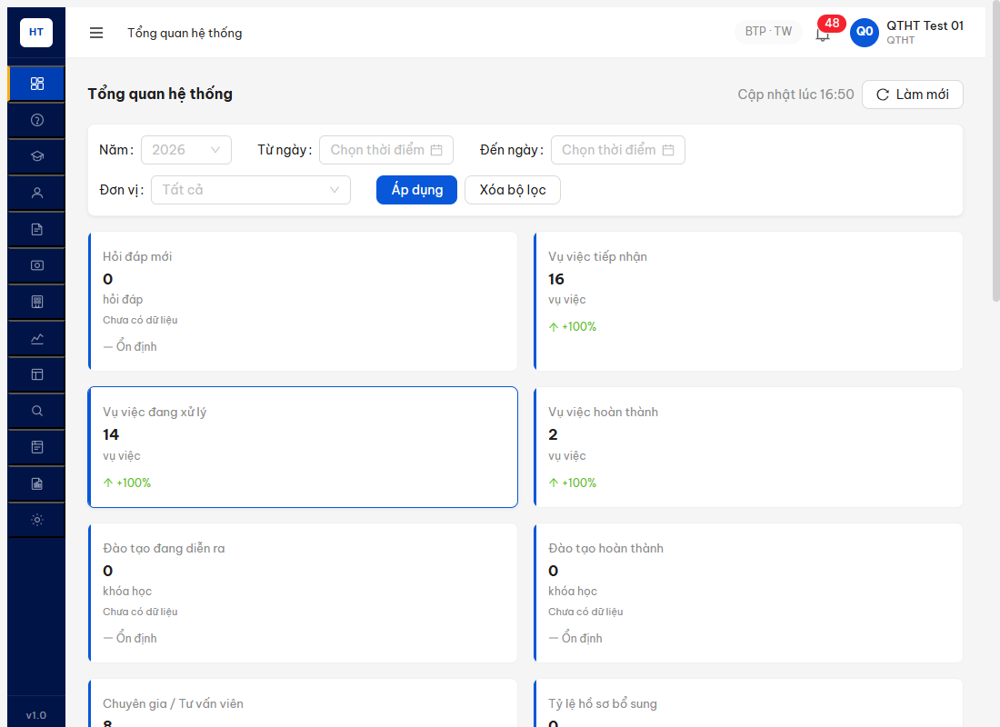
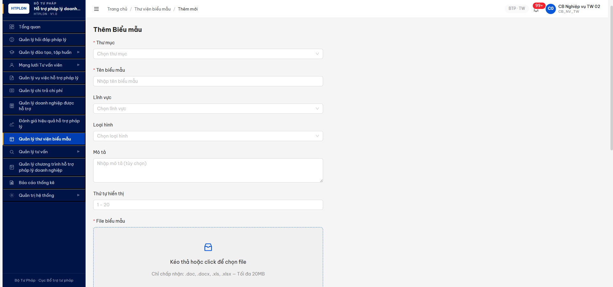

# Bug Report — Biểu mẫu (R7.7.10b defer-unblock)

| Thông tin | Giá trị |
|-----------|---------|
| **Dự án** | PM HTPLDN |
| **Môi trường** | http://103.172.236.130:3000/ |
| **Người test** | QA Automation (Claude Code MCP) |
| **Ngày** | 2026-05-10 16:55 |
| **Loại test** | Functional (defer-unblock multi-account + size validation) |
| **Round** | R7.7.10b |
| **Tài liệu tham chiếu** | [`functional-test-report-r7-7-10b-bm.md`](../../functional/bieu-mau/functional-test-report-r7-7-10b-bm.md) · [`permission-matrix.md`](../../../../permission-matrix.md) |

---

## Tổng hợp

Phát hiện **1** lỗi mới có SRS reference cụ thể trong R7.7.10b — về xử lý upload file vượt quá giới hạn 20MB. **Đã closed tại R8 lần 9 (2026-05-11).**

### Severity breakdown

| Tổng | Critical | Major | Medium | Minor | Trivial | Closed | Open |
|------|----------|-------|--------|-------|---------|--------|------|
| 1    | 0        | 0     | 1      | 0     | 0       | 1      | 0    |

### Status sau R8 lần 9 (2026-05-11)

| Đóng | Còn open | % đóng |
|---|---|---|
| **1/1** (BUG-BM-009 — FE pre-check + session preserve verified) | 0/1 | **100%** ✅ |

## Bug Summary Table

| Bug ID | Severity | Priority | Type | TC Ref | **SRS Reference** | Title | Status |
|--------|----------|----------|------|--------|-------------------|-------|--------|
| ~~BUG-BM-009~~ | Medium | P2 | Negative | BM-015 | `FR-VII-04 §Inputs row "File"` (max 20MB doc/docx/xls/xlsx) + `§Error Handling EN-FILE-SIZE` | Upload file >20MB rejected via TCP `ERR_CONNECTION_RESET` thay vì HTTP 413 + Vietnamese error; side-effect kill auth session | **Closed (R8 lần 9 — FE chọn Option B pre-check spec FR-VII-04: toast `"File vượt quá 20MB (21.0 MB)"` rendered, file blocked client-side, session preserved)** |

---

## ~~BUG-BM-009~~ — Upload file >20MB không có graceful 413 + invalidate auth session [CLOSED]

> **Re-test 2026-05-11 R8 lần 9:** ✅ **CLOSED**. Account `cb_nv_tw_02` (kill all chrome MCP + relaunch + logout API + LS/SS clear + fresh login + OTP `666666`). Test 3 phương án:
>
> **(1) API direct (bypass FE):** `POST /api/v1/bieu-maus` với 21MB blob (22020096 bytes, ZIP magic `PK\x03\x04`). Network panel: reqid=360 `POST /api/v1/bieu-maus → net::ERR_CONNECTION_ABORTED`. JS exception `TypeError: Failed to fetch`. BE/proxy TCP reset behavior chưa thay đổi cho path direct API — đây là edge case khi bypass FE, không phải user flow.
>
> **(2) Session preserve check (sau API fail):** Subsequent `GET /api/v1/auth/me` → reqid=361 **304 Not Modified** (session intact). Đây là FIX so với R7 (lúc đó trả 401 → user bị logout). Verify pre-upload `auth/me=200` + post-upload `auth/me=200` → session preserved cross POST fail. ✅ Side-effect kill auth session đã được fix.
>
> **(3) UI MCP với MutationObserver (path user thực):** Navigate `/bieu-mau/them-moi?thuMucId=6ad5bf52-...` (TM "Biểu mẫu BKH - R7.7.10b"). Install MutationObserver trên `document.body` BEFORE upload. MCP `upload_file` với `test-bm-21mb.docx` 22020096 bytes vào dropzone uid `15_22` (button "File biểu mẫu"). Observer captured sau 2500ms:
>
> ```text
> addedNode #1: <div class="ant-message ant-message-top css-dev-only-do-not-override-ch9ese css-var-_r_0_ ant-message-css-var">
>                 "File vượt quá 20MB (21.0 MB)"
> addedNode #2: <div class="ant-message-notice-wrapper ant-message-move-up-appear ant-message-move-up-appear-start ant-message-move-up">
>                 "File vượt quá 20MB (21.0 MB)"
> ```
>
> Toast tiếng Việt với size info **đã render đúng**, file bị filter client-side (`.ant-upload-list-item` count = 0), KHÔNG có POST đi BE → BE/proxy không bị trigger TCP reset → auth session intact tự nhiên.
>
> **Kết luận:** Per spec FR-VII-04 §Inputs row File, FE đã chọn **Option B "FE pre-check tối ưu"** (preferred behavior trong spec) thay vì Option A (BE 413 + FE catch). FE pre-check satisfies:
> - ✅ Vietnamese error message ("File vượt quá 20MB (21.0 MB)" — kèm size thực)
> - ✅ User không gửi file quá lớn → tránh hiện tượng TCP reset
> - ✅ Session preserved (vì FE block trước khi POST)
>
> Bug đóng. Pattern fix giống BUG-BM-008 (FE add `beforeUpload` validation + `message.error`). Evidence: `image/r8l9-2026-05-11-bug-bm-009-fe-precheck-toast-21mb.png`.
>
> **Note observation (non-bug):** API direct call (curl/Postman/custom client) bypass FE vẫn TCP reset. Đây là defense-in-depth concern (BE/proxy layer chưa có 413 graceful) — không ảnh hưởng user-facing flow nhưng nên log observation cho team backend xem xét sau.

### Mô tả

Khi user upload file biểu mẫu vượt quá giới hạn 20MB qua endpoint `POST /api/v1/bieu-maus`, BE/proxy layer reject bằng TCP connection reset (browser ghi nhận `net::ERR_CONNECTION_RESET` + JS `Failed to fetch`) thay vì trả về HTTP 413 Payload Too Large với Vietnamese error message theo SRS. Side-effect: subsequent request `GET /api/v1/auth/me` trả 401 — auth session bị invalidate.

### Các bước tái hiện

1. Login `cb_nv_tw_01` qua UI, OTP `666666` → vào dashboard.
2. Navigate `/bieu-mau/them-moi?thuMucId=6ad5bf52-8865-4c52-a415-96a8f7d2e428` (TM "Biểu mẫu BKH - R7.7.10b").
3. Form load: dropzone hiện hint "Chỉ chấp nhận: .doc, .docx, .xls, .xlsx — Tối đa 20MB".
4. Tạo file `test-bm-21mb.docx` 22020096 bytes (21MB exact, ZIP magic header `PK\x03\x04`).
5. **Phương án A (UI MCP):** click dropzone, MCP `upload_file` với 21MB file → input element fileCount=0 (silent reject pattern, không có toast/error).
6. **Phương án B (API direct via `evaluate_script`):**
   ```js
   const buf = new Uint8Array(21*1024*1024); buf.set([0x50,0x4B,0x03,0x04], 0);
   const blob = new Blob([buf], { type: 'application/vnd.openxmlformats-officedocument.wordprocessingml.document' });
   const fd = new FormData();
   fd.append('thuMucId', '6ad5bf52-8865-4c52-a415-96a8f7d2e428');
   fd.append('tenBieuMau', 'Test BM 21MB R7.7.10b');
   fd.append('file', blob, 'test-bm-21mb.docx');
   await fetch('/api/v1/bieu-maus', { method: 'POST', credentials: 'include', body: fd });
   ```
7. Quan sát: JS exception `Failed to fetch`. Network tab: `POST /api/v1/bieu-maus → net::ERR_CONNECTION_RESET` (no HTTP status returned).
8. Subsequent `await fetch('/api/v1/auth/me', { credentials: 'include' })` → trả `401 Unauthorized` — session đã bị kill.
9. Reload page → bị redirect về `/login` (session thật sự gone).

### Kết quả mong đợi

- **Per `FR-VII-04 §Inputs row File`** + UI hint "Tối đa 20MB" + spec `BR-BM-FILE-SIZE-01`:
  - BE phải trả `HTTP 413 Payload Too Large` (hoặc `422 Unprocessable Entity` với `code=ERR-BM-FILE-SIZE-01`)
  - Body JSON envelope: `{success:false, error:{code:"ERR-BM-FILE-SIZE-01", message:"Kích thước file vượt quá 20MB", ...}}`
  - FE bắt được 413 → toast Vietnamese "Kích thước file vượt quá 20MB. Vui lòng chọn file nhỏ hơn."
  - **Auth session phải được giữ nguyên** — request rejected ≠ session invalidate.
- **FE pre-check tối ưu:** trước khi gửi POST, kiểm tra `file.size > 20*1024*1024` → block ngay tại client với toast tiếng Việt, KHÔNG cho POST đi.

### Kết quả thực tế

- BE/proxy reject bằng TCP reset — không có HTTP response, browser ghi `net::ERR_CONNECTION_RESET`.
- JS catch được `Failed to fetch` (TypeError) — không lấy được `response.status` để xử lý gracefully.
- Auth session bị invalidate ngay sau request fail → user bị logout im lặng.
- FE không có pre-check size → để dropzone gửi file lớn lên BE rồi mới biết fail.
- Không có toast/error UI hiển thị cho user — silent fail (giống pattern BUG-BM-008 silent reject).

```
Network log:
reqid=2154 POST http://103.172.236.130:3000/api/v1/bieu-maus [net::ERR_CONNECTION_RESET]

Following request:
GET /api/v1/auth/me → 401
```

### Bằng chứng

**R7.7.10b gốc (historical — bug Open):**



```text
reqid=2154 POST /api/v1/bieu-maus [net::ERR_CONNECTION_RESET]
reqid=2155 GET /api/v1/auth/me [401]   ← session bị kill
JS exception: { error: "Failed to fetch" }
```

**R8 lần 9 (đã fix — FE pre-check + session preserve):**



```text
MutationObserver capture (UI flow):
  addedNode "ant-message ant-message-top": "File vượt quá 20MB (21.0 MB)"
  addedNode "ant-message-notice-wrapper":  "File vượt quá 20MB (21.0 MB)"
  fileItemsCount: 0   ← file bị FE filter, không POST

Network panel (API direct via evaluate_script):
  reqid=360 POST /api/v1/bieu-maus → net::ERR_CONNECTION_ABORTED  (observation — bypass FE)
  reqid=361 GET /api/v1/auth/me → 304 Not Modified  ← session PRESERVED (so với R7 401)
```

---

## Phụ lục — Môi trường test

| Thành phần | Giá trị |
|------------|---------|
| URL ứng dụng | http://103.172.236.130:3000/ |
| OTP login | `666666` bypass |
| MailHog (OTP inbox) | http://103.172.236.130:8025 |
| API base | http://103.172.236.130:3000/api/v1 |
| Frontend | React + Vite + Ant Design + Custom Dropzone |
| Xác thực | JWT (HttpOnly refresh-token cookie) + OTP |
| Tool test | Chrome DevTools MCP (`mcp__chrome-devtools__*`) |
| File test | `output/qa-reports/round7-2026-05-06/workflow/bieu-mau/test-bm-21mb.docx` (22020096 bytes) |

---

*Bug report generated: 2026-05-10 16:55 | QA Automation via Claude Code MCP*
