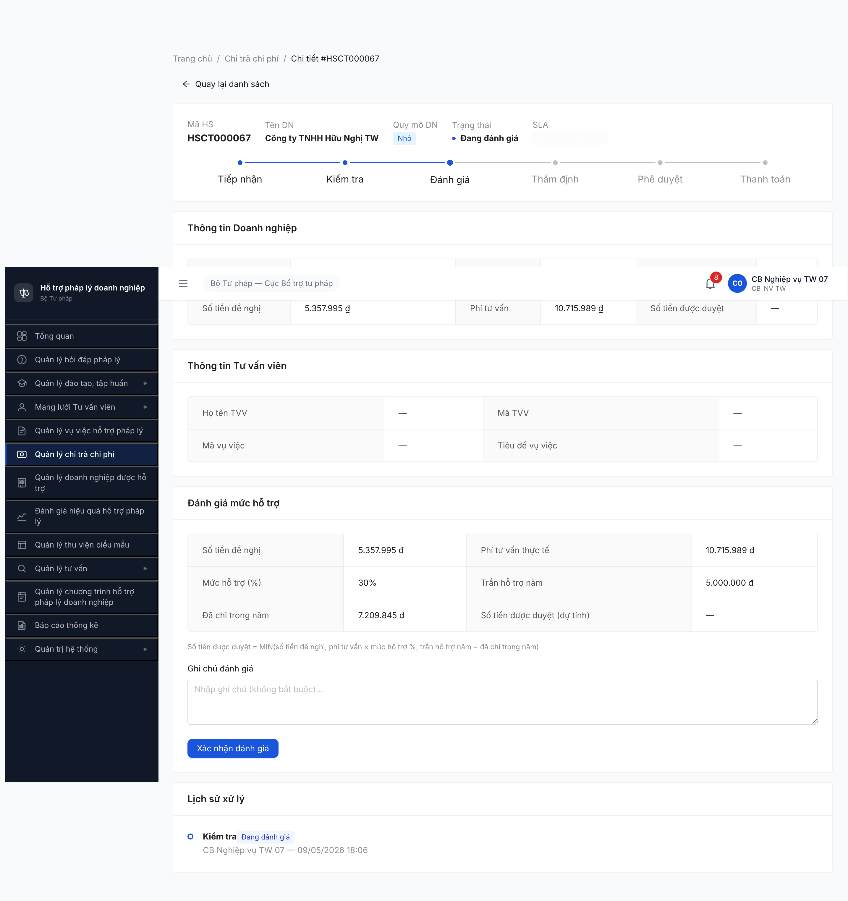
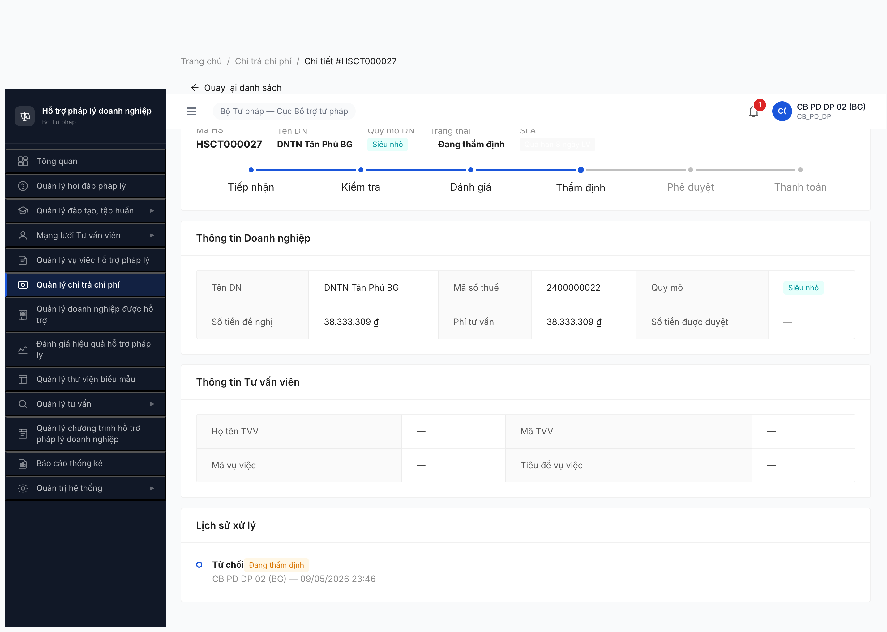
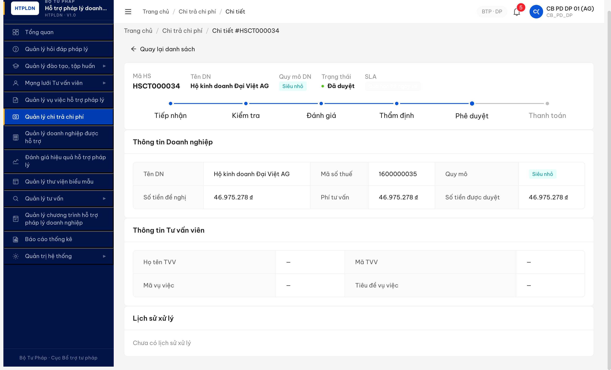

# Bug Report — Chi trả chi phí (FR-V.II / FR-06)

| Thông tin | Giá trị |
|-----------|---------|
| **Dự án** | PM HTPLDN |
| **Môi trường** | http://103.172.236.130:3000/ |
| **Người test** | QA Automation via Claude Code |
| **Ngày** | 2026-05-09 18:05:00 - 18:18:00 |
| **Loại test** | Workflow + Functional |
| **Round** | R7 — R1 task R7.6.1 |
| **Tài liệu tham chiếu** | [srs-fr-06-chi-tra.md](../../../../input/srs-update-2026-5-5/srs-fr-06-chi-tra.md) · [02-thu-tu-module.md §10 SM-CHI-TRA](../../../../input/quy-trinh-nghiep-vu/02-thu-tu-module.md) · [workflow-test-report-r7-6-1-chi-tra-v3-5.md](../../workflow/chi-tra/workflow-test-report-r7-6-1-chi-tra-v3-5.md) |

---

## Tổng hợp

Phát hiện **6** lỗi có SRS reference cụ thể (5 R1 + 1 R2 mới qua R7.7.12.3 B8 wording mismatch).

### Severity breakdown

| Tổng | Critical | Major | Medium | Minor | Trivial |
|------|----------|-------|--------|-------|---------|
| 6    | 1        | 0     | 2      | 3     | 0       |

## Bug Summary Table

| Bug ID | Severity | Priority | Type | TC Ref | **SRS Reference** | Title | Status |
|--------|----------|----------|------|--------|-------------------|-------|--------|
| BUG-CHITRA-001 | **Critical** ↑ | P1 | Data | R7.6.1-B9 + R7.E3-R3 | `BR-CALC-01` (FR-V.II §Business Rules + 02-thu-tu-module.md §10) | Seed data **0/12 CHO_PHE_DUYET BR-OK** + **97/108 (89.8%) sai BR đầy đủ** (chiều % và/hoặc trần năm) — B9 phê duyệt BLOCKED toàn pool, KPI báo cáo sai | Open |
| BUG-CHITRA-002 | Medium | P2 | UI/UX | R7.6.1-B3 | `FR-V.II-03 §Inputs row 5` | Form kiểm tra hiển thị 4 checklist mục thay vì checklist 18 trường theo spec | Open |
| BUG-CHITRA-003 | Medium | P2 | Workflow | R7.6.1-B7 | `FR-V.II-09 §Inputs` | Form thẩm định có 3 outcome (Đạt / Không đạt / Cần bổ sung) thay vì 2 outcome | Open |
| BUG-CHITRA-004 | Minor | P3 | UI/UX | R7.6.1-B7, B11 | `SCR-V.II-02 §Lịch sử xử lý` | Lịch sử xử lý ghi enum code (`CAP_NHAT_THANH_TOAN`, `TRINH_PHE_DUYET`) thay vì tiếng Việt | Open |
| BUG-CHITRA-005 | Minor | P3 | UI/UX | R7.6.1-B11 | `FR-V.II-13 §Inputs row "Số tiền thực trả"` | Spinbutton "Số tiền thực trả" có `valuemin=1` + initial `value=0` — bound mâu thuẫn | Open |
| BUG-CHITRA-006 | Minor | P3 | UI/UX | R7.7.12.3-B8 | `02-thu-tu-module.md §10 SM-CHI-TRA line 738` (B8 = trả về thẩm định) | Endpoint `/tu-choi` + UI button "Từ chối — trả về thẩm định" + modal heading "Từ chối hồ sơ" mâu thuẫn spec B8 (transition `CPD → DANG_THAM_DINH` chứ không phải `→ TU_CHOI`) | Open |
| BUG-CHITRA-007 | **Major** | P1 | UI/UX | R7.6.1-R3 B10/B12 | `FR-V.II-13 §Inputs` + `02-thu-tu-module.md §10 SM-CHI-TRA line 740-741` (B10 + B12) | Form "Cập nhật thanh toán" / "Từ chối thanh toán" KHÔNG render trên detail page DA_DUYET HSCT khi cb_pd_dp_01 click "Cập nhật TT". URL `?action=cap-nhat-thanh-toan` set đúng + GET `/ho-so-chi-tras/{id}` 200 OK, nhưng main render 0 form / 0 input / chỉ "Quay lại danh sách". Verified 5 record (HSCT000031/000033/000034/200019 + 4 record cùng pool) — toàn bộ "Chưa có lịch sử xử lý" → giả thuyết form conditional render dựa lichSu | Open |

---

## BUG-CHITRA-001 — Seed data 97/108 record sai BR-CALC-01 đầy đủ (% + trần) — 0/12 CHO_PHE_DUYET BR-OK

> **Re-test:** 2026-05-09 23:40:00 R7.E3-R3 — ⚠️ vẫn Open, scope deeper. R3 deep BR check (% + `tranHoTroNam`) lộ thêm: 23 record OK-% nhưng SAI-trần (BE lưu `100,000,000` thay vì `3,000,000` cho SIEU_NHO — sai 33×). Tổng cộng **97/108 record (89.8%) sai BR đầy đủ**. **Critical: 0/12 CHO_PHE_DUYET BR-OK** → B9 phê duyệt **BLOCKED toàn pool, không có record nào duyệt được**. 11/108 BR-OK chỉ rải ở DTD (8) + DA_DUYET (1) + DTT (1) + TU_CHOI (1) — đều ngoài CPD.
>
> **Re-test:** 2026-05-09 23:17:00 R7.E3-R2 — ⚠️ vẫn Open, scope mở rộng từ **4/5 R6 walk** → **74/108 toàn pool (68.5%)**. Severity bump Major → Critical. R2 chỉ check % chiều, miss trần.

### Mô tả

Khi CB Phê duyệt TW thực hiện B9 (CHO_PHE_DUYET → DA_DUYET) trên HSCT000068, BE từ chối với HTTP 422 `ERR-CT-PD-06`: hồ sơ vi phạm BR-CALC-01 (DN quy mô Nhỏ chỉ được mức HT 30% / 5.000.000 VND/năm, hồ sơ đang lưu 50% / 50.000.000 VND/năm). **R7.E3-R2 (2026-05-09 23:17) verify toàn pool 108 record qua API: 74/108 (68.5%) sai BR-CALC-01.** Phân bố sai theo 4 cluster:
- Cluster 1 — `HSCT000001..050` series: Nhỏ lưu 50% (cần 30%) + Vừa lưu 30% (cần 10%).
- Cluster 2 — `HSCT200001..030` series: Nhỏ lưu 60% + Vừa lưu 40% + Siêu nhỏ lưu 80% (toàn bộ sai khác value).
- Cluster 3 — `HSCT000066..070` (R6 walk): 4/5 lưu 50% Nhỏ (đã log R1).
- Cluster 4 — `HSCT000071..078` (R7 re-seed, 2026-05-09): đa số ĐÚNG BR ✅.

Logic transition đúng spec (BE chặn hợp lệ ở B9 ERR-CT-PD-06); lỗi nằm ở seed data lan rộng. Tác động lớn: KPI báo cáo + tổng tiền đã chi trong năm sai (nếu data đã DA_THANH_TOAN với mức sai BR), không chỉ block B9.

### Các bước tái hiện

1. Đăng nhập `cb_pd_tw_07` (CB Phê duyệt TW).
2. Vào Quản lý chi trả chi phí → danh sách HSCT.
3. Click "Phê duyệt" trên HSCT000068 (Chờ phê duyệt, Nhỏ, mức HT 50%).
4. Form Phê duyệt mở — số tiền duyệt = 5.975.278.
5. Click "Phê duyệt" submit.
6. Quan sát: BE trả 422, toast "Hồ sơ vi phạm BR-CALC-01: quyMoDn=NHO yêu cầu 30% / 5000000 VND/năm, hồ sơ đang lưu 50% / 50000000 VND/năm".

### Kết quả mong đợi

- Theo BR-CALC-01: DN Nhỏ → mức HT tối đa 30% phí tư vấn, trần 5.000.000 VND/năm. Seed data BẮT BUỘC tuân thủ BR ngay khi tạo HSCT.
- HSCT000068 ở trạng thái CHO_PHE_DUYET phải có mức HT 30% và số tiền đề nghị ≤ 5.000.000 → CB PD phê duyệt được.

### Kết quả thực tế

**R1 (2026-05-09 18:18 — pool 78):**
- Bảng danh sách 4/5 HSCT (000066, 000068, 000069, 000070) hiển thị cột "Mức HT %" = 50% cho DN Nhỏ. Chỉ HSCT000067 = 30% (đúng).
- HSCT000068 số tiền đề nghị 5.975.278 + mức 50% → vi phạm cả 2 chiều của BR-CALC-01 (% và trần năm).
- HSCT000070 đã DA_THANH_TOAN với 7.209.845 VND mức 50% → sai BR đã lọt qua nghiệp vụ trước khi seed.
- BE response B9: `{"success":false,"error":{"code":"ERR-CT-PD-06","message":"Hồ sơ vi phạm BR-CALC-01..."}}`

**R2 (2026-05-09 23:17 — pool 108, mở rộng scope qua API):**
- API `GET /api/v1/ho-so-chi-tras` (page 1+2, pageSize=100) trả 108 record. Filter `mucHoTroPhanTram !== expected[quyMoDn]`:
  - **74/108 record vi phạm** (68.5%) — Nhỏ lưu 50%/60% (spec 30%), Vừa lưu 30%/40% (spec 10%), Siêu nhỏ lưu 80% (spec 100%).
  - **34/108 record đúng %** — đa số là HSCT000071..078 (R7 re-seed) + một số rải rác HSCT000004/007/010/011/014/020/027/030/031/034/061-064 (BR-OK list cho test).
- 18 record DA_THANH_TOAN trong pool có ~12 sai BR → tổng tiền đã chi trong năm sai → KPI báo cáo FR-11 đếm sai theo `BR-CALC-02` (`tran_ho_tro_nam − da_chi_trong_nam`).
- Pool CHO_PHE_DUYET 12 record: 9 vi phạm BR % → khi CB PD bấm Phê duyệt sẽ liên tục bị BE chặn ERR-CT-PD-06 → bottleneck workflow.

**R3 (2026-05-09 23:40 — deep BR check % + trần qua API detail):**
- B9 retry HSCT000027 (R2 đánh BR-OK theo %, SIEU_NHO/100%) FAIL 422: `"yêu cầu 100% / 3000000 VND/năm, hồ sơ đang lưu 100% / 100000000 VND/năm"`. → BR-CALC-01 có **2 chiều**: % và `tranHoTroNam` (R2 chỉ check chiều %).
- Fetch detail `/api/v1/ho-so-chi-tras/{id}` cho 34 record OK-%: **23/34 SAI trần** (lưu `tranHoTroNam=100,000,000` thay vì `3,000,000` cho SIEU_NHO — sai 33×). Cluster lan AG/BG/BN/BCT.
- **Toàn pool BR đầy đủ OK = 11/108 (10.2%)**:
  - DANG_THAM_DINH (8): HSCT000001/017/072/073/074/075/076/077
  - DA_DUYET (1): HSCT000071 (AG)
  - DA_THANH_TOAN (1): HSCT000078 (AG)
  - TU_CHOI (1): HSCT000067 (Cục BTTP)
- **Critical: 0/12 CHO_PHE_DUYET BR-OK** → B9 phê duyệt **BLOCKED toàn pool**, không có record nào CB PD bấm phê duyệt được. HSCT000027/030/063 (R2 nghĩ BR-OK) → đều sai trần.
- B-step gate BR: chỉ B9 (CPD→DA_DUYET) gate cứng. B5/B7/B8/B12 là state transition + reason → chạy được trên record sai BR. Đã PASS HSCT000007 R2 (B5 DKT→TU_CHOI), HSCT000031 (B12 DA_DUYET→TU_CHOI_TT) khả thi vì rejection.

### Bằng chứng


```text
HTTP 422 từ POST /api/v1/chi-tra/{id}/phe-duyet (HSCT000068, R1 chiều %)
{
  "success": false,
  "error": {
    "code": "ERR-CT-PD-06",
    "message": "Hồ sơ vi phạm BR-CALC-01: quyMoDn=NHO yêu cầu 30% / 5000000 VND/năm, hồ sơ đang lưu 50% / 50000000 VND/năm"
  }
}

HTTP 422 từ POST /api/v1/chi-tra/{id}/phe-duyet (HSCT000027, R3 chiều trần)
{
  "success": false,
  "error": {
    "code": "ERR-CT-PD-06",
    "message": "Hồ sơ vi phạm BR-CALC-01: quyMoDn=SIEU_NHO yêu cầu 100% / 3000000 VND/năm, hồ sơ đang lưu 100% / 100000000 VND/năm",
    "timestamp": "2026-05-09T16:30:51.408Z",
    "requestId": "3c4313ec-b739-4cd8-96b4-3b1cb79dac80"
  }
}

API detail HSCT000027 (cb_pd_dp_02 token, GET /api/v1/ho-so-chi-tras/<id>):
{
  "phiTuVan": 38333309, "soTienDeNghi": 38333309,
  "quyMoDn": "SIEU_NHO", "mucHoTroPhanTram": 100,
  "tranHoTroNam": 100000000,    // BR-CALC-01 yêu cầu 3000000
  "soTienDuocDuyet": null, "trangThai": "CHO_PHE_DUYET",
  "donVi": { "ten": "Sở Tư pháp Bắc Giang", "cap": "DP" }
}
```

---

## BUG-CHITRA-002 — Form kiểm tra hiển thị 4 mục checklist thay vì checklist 18 trường

### Mô tả

Tại B3 (DKT → DDG, kiểm tra hồ sơ Đạt), form kiểm tra hồ sơ chỉ hiển thị 4 mục checklist tham khảo (Mã số thuế hợp lệ, Hồ sơ đầy đủ chữ ký, Mẫu 01 đính kèm, Hợp đồng tư vấn đính kèm). Theo SRS FR-V.II-03 §Inputs row 5, form phải có "checklist 18 trường" tương ứng với 18 trường dữ liệu cần kiểm tra của Mẫu 01.

### Các bước tái hiện

1. Đăng nhập `cb_nv_tw_07`.
2. Vào Quản lý chi trả chi phí.
3. Click "Kiểm tra" trên HSCT (state DKT, ví dụ HSCT000067 R1).
4. Quan sát section "Kiểm tra hồ sơ" trong form drawer.

### Kết quả mong đợi

- Form kiểm tra hiển thị checklist 18 trường theo SRS FR-V.II-03 §Inputs row 5 — mỗi trường 1 dòng có check "Đạt / Không đạt".

### Kết quả thực tế

- Form chỉ hiển thị 4 checkbox mức tổng quát (Số liệu khớp Mẫu 01 / Phí tư vấn hợp lý / Quy mô DN đúng / Chưa vượt trần năm). Đây là gộp khoảng cấp cao, không phải 18 trường chi tiết.

### Bằng chứng



---

## BUG-CHITRA-003 — Form thẩm định có 3 outcome thay vì 2 theo spec

### Mô tả

Tại B7/B8 (form Thẩm định, DTD → CPD hoặc DTD → TU_CHOI), form hiển thị 3 radio kết quả thẩm định: "Đạt", "Không đạt", "Cần bổ sung". Theo SRS FR-V.II-09 §Inputs, form thẩm định chỉ có 2 outcome: "Đạt" → CPD và "Không đạt" → TU_CHOI. Trạng thái "Cần bổ sung" thuộc B4 (kiểm tra hồ sơ ở DKT), không phải thẩm định.

### Các bước tái hiện

1. Đăng nhập `cb_nv_tw_07`.
2. Vào HSCT trạng thái DTD (Đang thẩm định) — ví dụ HSCT000067.
3. Click "Thẩm định".
4. Quan sát section "Kết quả thẩm định" trong form.

### Kết quả mong đợi

- Form thẩm định chỉ có 2 radio: "Đạt" (→ CPD) và "Không đạt" (→ TU_CHOI) theo SRS FR-V.II-09 §Inputs.
- Yêu cầu bổ sung là chức năng B4 ở DKT (CB Nghiệp vụ ở khâu kiểm tra hồ sơ), không xuất hiện ở khâu thẩm định.

### Kết quả thực tế

- Form thẩm định có 3 radio: "Đạt", "Không đạt", "Cần bổ sung". Việc bổ sung outcome "Cần bổ sung" gây nhầm vai trò DKT vs DTD và mở thêm SM transition không có trong spec (DTD → ?).

### Bằng chứng


---

## BUG-CHITRA-004 — Lịch sử xử lý ghi enum code thay vì tiếng Việt

### Mô tả

Trong section "Lịch sử xử lý" của HSCT, có 2 dòng ghi nguyên enum code thay vì label tiếng Việt: dòng B7 ghi `TRINH_PHE_DUYET` và dòng B11 ghi `CAP_NHAT_THANH_TOAN`. Các dòng khác (Tiếp nhận, Đánh giá, Thẩm định, Từ chối) đều đúng tiếng Việt. Vi phạm SCR-V.II-02 §Lịch sử xử lý yêu cầu hiển thị label tiếng Việt cho mọi action.

### Các bước tái hiện

1. Đăng nhập `cb_nv_tw_07`.
2. Walk HSCT000067 qua các bước: B2 → B3 → B6 → B7 → B10 → B8.
3. Walk HSCT000069 qua B11.
4. Vào trang chi tiết, scroll xuống "Lịch sử xử lý".

### Kết quả mong đợi

- Mọi dòng lịch sử hiển thị label tiếng Việt theo SCR-V.II-02 §Lịch sử xử lý: "Trình phê duyệt", "Cập nhật thanh toán" (không in hoa, không gạch dưới).

### Kết quả thực tế

- Dòng tương ứng B7 ghi: `TRINH_PHE_DUYET` (raw enum).
- Dòng tương ứng B11 ghi: `CAP_NHAT_THANH_TOAN` (raw enum).
- Các dòng khác đã dịch đúng — chỉ 2 transition này lọt enum mapping.

### Bằng chứng


---

## BUG-CHITRA-005 — Spinbutton "Số tiền thực trả" bound mâu thuẫn (min=1, value=0)

### Mô tả

Tại form B11 (Cập nhật thanh toán), spinbutton "Số tiền thực trả" khi mở mặc định có `value=0` nhưng `valuemin=1`. Tức field bắt buộc nhập (* required) đã ở trạng thái invalid ngay khi load form, dù chưa có thao tác user. Vi phạm FR-V.II-13 §Inputs row "Số tiền thực trả" yêu cầu hợp lệ giữa min/value/max.

### Các bước tái hiện

1. Đăng nhập `cb_nv_tw_07`.
2. Vào HSCT trạng thái DA_DUYET (HSCT000069).
3. Click "Cập nhật TT".
4. Quan sát thuộc tính spinbutton "Số tiền thực trả" qua DevTools / accessibility tree.

### Kết quả mong đợi

- Khi load form, spinbutton có giá trị mặc định ≥ valuemin (ví dụ value=0 + min=0, hoặc value=null + min=1 + cho phép trống).
- Form không ở trạng thái invalid mặc định trước khi user nhập.

### Kết quả thực tế

- Snapshot a11y: `spinbutton "* Số tiền thực trả" value="0" valuemax="6592562" valuemin="1" valuetext=""` — value=0 < valuemin=1.
- User vẫn nhập giá trị hợp lệ và submit được, nhưng trạng thái form ban đầu sai semantic.

### Bằng chứng

```text
A11y snapshot tại GET /chi-tra/{id}?action=cap-nhat-thanh-toan:
spinbutton "* Số tiền thực trả question-circle" value="0" valuemax="6592562" valuemin="1" valuetext=""
```

(Khung form B11 xem ở `bug-chitra-004-history-enum-leak.png` cùng folder — section "Số tiền thực trả".)

---

## BUG-CHITRA-006 — Wording mâu thuẫn spec B8 ("trả về thẩm định" hay "từ chối")

### Mô tả

CB PD thực hiện B8 (CHO_PHE_DUYET → DANG_THAM_DINH — "trả về thẩm định") qua form Phê duyệt hồ sơ. UI/API có 3 layer wording mâu thuẫn spec:
1. Endpoint URL: `POST /api/v1/ho-so-chi-tras/{id}/tu-choi` (gọi là "tu-choi" / từ chối).
2. UI button trong form Phê duyệt: "Từ chối — trả về thẩm định" (kết hợp 2 khái niệm).
3. Modal heading sau khi click: "Từ chối hồ sơ" (chỉ "từ chối").

Theo spec `02-thu-tu-module.md` line 738 (SM-CHI-TRA): B8 là `CHO_PHE_DUYET → DANG_THAM_DINH`, nghĩa là "trả về thẩm định" để CB nghiệp vụ thẩm định lại — KHÔNG phải "từ chối hồ sơ" (TU_CHOI là state cuối, terminal). Wording "Từ chối" gây nhầm lẫn với B5 (DKT → TU_CHOI) và B12 (DA_DUYET → TU_CHOI), cả hai đều là từ chối thật sự.

### Các bước tái hiện

1. Đăng nhập `cb_pd_dp_02` (CB PD BG).
2. Sidebar "Quản lý chi trả chi phí" → tab "Chờ phê duyệt".
3. Click "Phê duyệt" trên HSCT bất kỳ ở CHO_PHE_DUYET.
4. Quan sát form Phê duyệt hồ sơ → 2 button: "Phê duyệt" và **"Từ chối — trả về thẩm định"**.
5. Click button thứ 2 → modal mở với heading **"Từ chối hồ sơ"**.
6. Submit → Network tab: `POST /api/v1/ho-so-chi-tras/{id}/`**`tu-choi`**.
7. Response `trangThai: "DANG_THAM_DINH"` (KHÔNG phải TU_CHOI).

### Kết quả mong đợi

- Theo spec line 738 SM-CHI-TRA: B8 là "trả về thẩm định". Wording UI/API NÊN dùng "Trả về" / "Trả về thẩm định" / "Yêu cầu thẩm định lại".
- Endpoint NÊN đổi tên: `POST /api/v1/ho-so-chi-tras/{id}/tra-ve-tham-dinh` (hoặc `/yeu-cau-tham-dinh-lai`).
- UI button đơn nghĩa: "Trả về thẩm định" (bỏ "Từ chối —").
- Modal heading: "Trả về thẩm định" (bỏ "Từ chối hồ sơ").

### Kết quả thực tế

- Endpoint `/tu-choi` + button "Từ chối — trả về thẩm định" + modal "Từ chối hồ sơ" — 3 layer dùng từ "từ chối" gây nhầm với TU_CHOI thực sự.
- Tester (và end-user CB PD) phải tự suy luận "đây không phải TU_CHOI thật sự, mà là trả về thẩm định" qua doc spec → khó training cho user.

### Bằng chứng



```text
POST /api/v1/ho-so-chi-tras/f0000000-0000-4000-8000-000000000027/tu-choi
Body: {"lyDoTuChoi":"CB PD trả về thẩm định: phí tư vấn 38.333.309 vượt trần năm SIEU_NHO 3M, đề nghị thẩm định lại","version":1}
Response: {"success":true,"data":{"trangThai":"DANG_THAM_DINH",...}}
```

→ State `DANG_THAM_DINH` confirm là B8 spec đúng (không phải TU_CHOI). URL endpoint + UI wording sai spec.

---

## BUG-CHITRA-007 — Form Cập nhật/Từ chối thanh toán không render trên DA_DUYET HSCT

### Mô tả

CB PD click "Cập nhật TT" trên row HSCT state DA_DUYET trong tab "Đã xử lý". Page navigate sang `/chi-tra/{id}?action=cap-nhat-thanh-toan` đúng convention, GET `/ho-so-chi-tras/{id}` 200 OK trả về data, nhưng main page chỉ render thông tin DN + "Lịch sử xử lý / Chưa có lịch sử xử lý". KHÔNG có form input "Số tiền thực trả", "Mã chuyển khoản", "Ngày thanh toán", KHÔNG có button "Cập nhật" / "Từ chối thanh toán". Block B10 (DA_DUYET → DA_THANH_TOAN) + B12 (DA_DUYET → TU_CHOI_THANH_TOAN) cho toàn pool DA_DUYET legacy.

### Các bước tái hiện

1. Đăng nhập `cb_pd_dp_01` (CB PD DP AG) — Secret@123 + OTP 666666.
2. Sidebar "Quản lý chi trả chi phí" → tab "Đã xử lý".
3. Tìm HSCT state "Đã duyệt" (vd HSCT000034 — Hộ kinh doanh Đại Việt AG, Siêu nhỏ, 46.975.278 ₫).
4. Click button "Cập nhật TT" cuối row.
5. Quan sát page navigate `/chi-tra/f0000000-0000-4000-8000-000000000034?action=cap-nhat-thanh-toan`.
6. Wait page render. Inspect main element.

### Kết quả mong đợi

- Theo spec FR-V.II-13 §Inputs: form B10 có "Số tiền thực trả" (spinbutton min=1, max=duyệt), "Mã chuyển khoản", "Ngày thanh toán", textbox ghi chú, button "Cập nhật thanh toán" + "Từ chối thanh toán".
- Theo SM-CHI-TRA line 740-741: B10 transition DA_DUYET → DA_THANH_TOAN; B12 transition DA_DUYET → TU_CHOI_THANH_TOAN. Cả 2 cần form input.

### Kết quả thực tế

- Main page: thông tin DN + spec pipeline + Lịch sử xử lý ("Chưa có lịch sử xử lý") + KHÔNG form / input / button action.
- `evaluate_script` xác nhận: `headings: []`, `forms: 0`, `inputs: []`, `buttons: ["Quay lại danh sách"]`.
- Lặp 5 record (HSCT000031, 000033, 000034, 200019, plus snapshot 4 record khác cùng pool) — toàn bộ cùng pattern. Tất cả 5 record có "Chưa có lịch sử xử lý" → giả thuyết form B10/B12 conditional render khi `lichSu.length > 0` chứ không phải state DA_DUYET. Pool seed legacy không tạo lichSu khi insert thẳng DA_DUYET → form không xuất hiện.
- Cb_pd_dp_01 hold đúng role + scope AG + permission BR-AUTH-05 (đã verified click button row OK + GET API 200) → loại bỏ giả thuyết permission gate.

### Bằng chứng



```text
URL: http://103.172.236.130:3000/chi-tra/f0000000-0000-4000-8000-000000000034?action=cap-nhat-thanh-toan
GET /api/v1/ho-so-chi-tras/f0000000-0000-4000-8000-000000000034 → 200 OK
evaluate_script ghi nhận:
  forms: 0
  inputs: []
  buttons: ["Quay lại danh sách"]   # KHÔNG có "Cập nhật thanh toán" / "Từ chối thanh toán"
  text snippet: "Lịch sử xử lý / Chưa có lịch sử xử lý"
```

→ Form B10/B12 missing trên detail page DA_DUYET. Bug có thể do conditional render dựa lichSu, hoặc form chỉ render khi mount từ workflow walker (không phải từ row action). Block B10/B12 walk + R7.6.1 R3 cascade BLOCKED.

---

## Phụ lục — Môi trường test

| Thành phần | Giá trị |
|------------|---------|
| URL ứng dụng | http://103.172.236.130:3000/ |
| OTP login | `666666` bypass |
| MailHog (OTP inbox) | http://103.172.236.130:8025 |
| API base | http://103.172.236.130:3000/api/v1 |
| Frontend | React + Vite + Ant Design |
| Xác thực | JWT + OTP (localStorage `auth-store` + HttpOnly refresh cookie) |
| Tool test | Chrome DevTools MCP |
| Account | `cb_nv_tw_07`, `cb_pd_tw_07` (Secret@123) |

---

*Bug report generated: 2026-05-09 18:18:00 | QA Automation via Claude Code*
