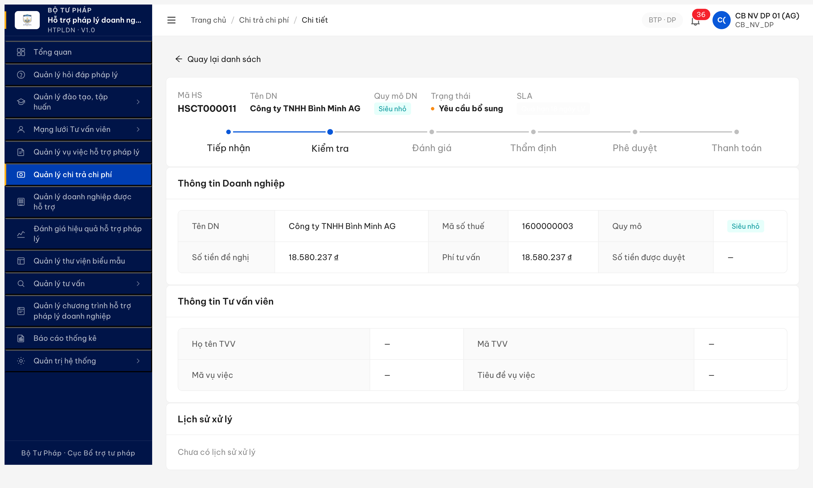
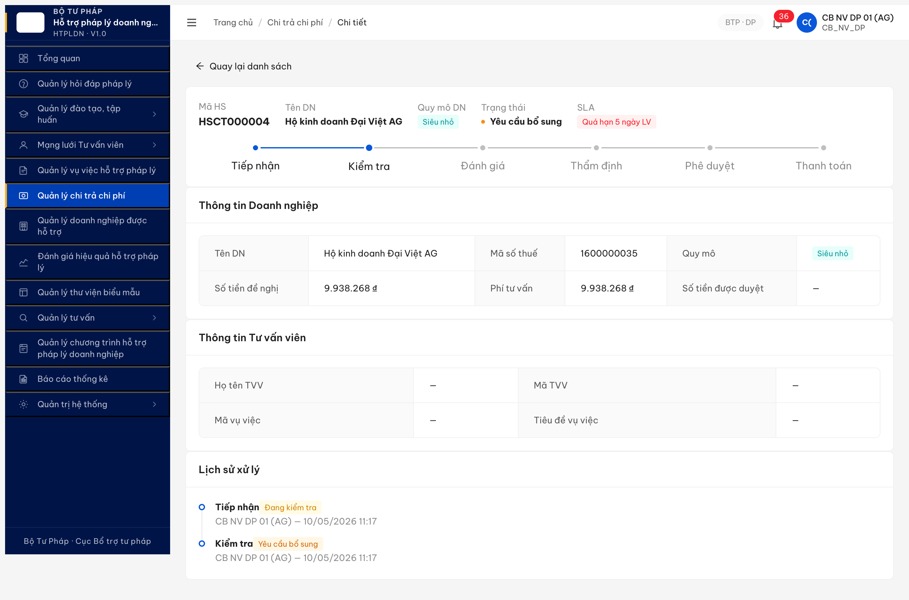
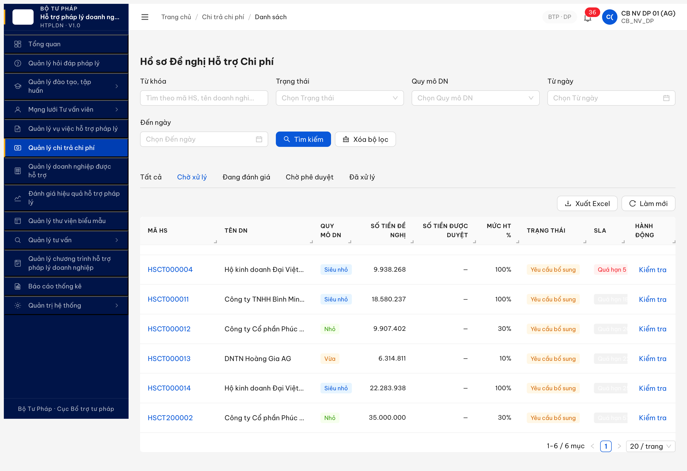
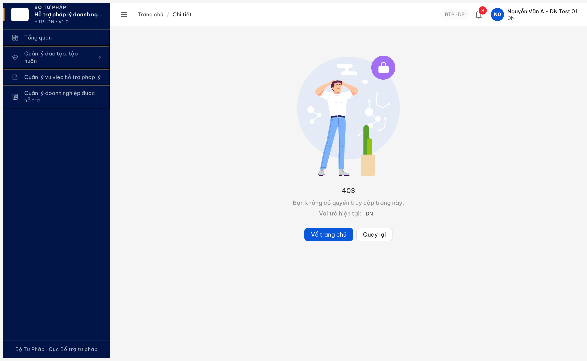

# Bug Report — FR-V.II-14 DN bổ sung hồ sơ chi trả

| Thông tin | Giá trị |
|-----------|---------|
| **Dự án** | PM HTPLDN |
| **Môi trường** | http://103.172.236.130:3000/ |
| **Người test** | QA Automation via Claude Code |
| **Ngày** | 2026-05-13 16:41:13 |
| **Round** | R22 |
| **Tài liệu tham chiếu** | [srs-fr-06-chi-tra.md §FR-V.II-14](../../../../input/srs-update-2026-5-5/srs-fr-06-chi-tra.md) · [02-thu-tu-module.md §10 SM-CHI-TRA B7](../../../../input/quy-trinh-nghiep-vu/02-thu-tu-module.md) · [functional-test-report-r7-7-12-2-fr14-bo-sung.md](../../functional/chi-tra/functional-test-report-r7-7-12-2-fr14-bo-sung.md) |

---

## Tổng hợp

Phát hiện **3 lỗi** liên quan FR-V.II-14. Hiện trạng (sau R22 retest 2026-05-13 16:41): **1 Defer · 0 Open · 2 Closed** (CHITRA-009 BA update SRS line 841 ✅ R19; CHITRA-010 BE fix new transition behavior ✅ R22 — pool legacy 6 records null là cold-data trước fix).

### Severity breakdown

| Tổng | Critical | Major | Medium | Minor | Trivial | Closed | Open |
|------|----------|-------|--------|-------|---------|--------|------|
| 3    | 0        | 2     | 0      | 1     | 0       | 2      | 1    |

## Bug Summary Table

| Bug ID | Severity | Priority | Type | TC Ref | **SRS Reference** | Title | Status |
|--------|----------|----------|------|--------|-------------------|-------|--------|
| BUG-CHITRA-008 | **Major** | P2 | Backend / LGSP | R7.7.12.2 | `FR-V.II-14 §Processing Bước 3-4` + `Error Handling E1/E2/E3` | LGSP gateway endpoint nhận sync HS bổ sung từ DVC chưa expose — 5/5 path variant trả 404 ERR-SYS-00-04-01 | 🚫 Defer (chờ phase tích hợp API ngoài) |
| ~~BUG-CHITRA-010~~ | **Major** | P1 | Backend / Data | R7.7.12.2 | `FR-V.II-03 §Processing Bước 5` + `BR-CHITRA-BS01` | ~~`ngayYeuCauBoSung = null` 6/6 HSCT YCBS — không ghi timestamp khi DKT → YCBS, vô hiệu hoá deadline tracking 5 ngày LV (ERR-CT-BS-03)~~ | Closed ✅ R22 |
| ~~BUG-CHITRA-009~~ | Minor | P3 | Spec / Wording | R7.7.12.2 | `FR-V.II-14 row 837 + 841` vs `FR-V.II-01 row 31` + `SCR-V.II-02 line 962/1014/1026` + `8+ chỗ DVC-only` | ~~Wording "hoặc CB NV (thủ công)" ở row 841 mâu thuẫn 8+ chỗ khác (DVC-only)~~ | Closed ✅ R19 |

---

## Deep review R2 — NotebookLM + SRS local cross-check (2026-05-12 01:00:00)

R1 (2026-05-10) raise nghi vấn 2 khả năng intent: (a) chỉ DN qua DVC, (b) cả 2 path. R2 deep review để loại trừ ambiguous trước khi escalate BA. Kết luận: **intent thực = (a) chỉ DN qua DVC** — wording row 841 là drift cần xoá.

**Nguồn 1 — NotebookLM HTPLDN** (notebook id `a4ae45bf-cea0-4325-8fee-b1e0be702cf2`) trả lời: FR-V.II-14 thuộc luồng DN qua DVC/Cổng PLQG sync vào HTPLDN. Row 841 "hoặc CB NV (thủ công)" mâu thuẫn nguyên tắc FR-V.II-01 (HSCT chỉ qua DVC, CB NV KHÔNG nhập tay). SCR-V.II-02 component table không design section bổ sung cho state YCBS vì DN bổ sung qua DVC, không qua HTPLDN.

**Nguồn 2 — Grep SRS local** (`srs-fr-06-chi-tra.md`) tìm 8+ chỗ confirm "DVC-only":

| Line | Quote |
|---|---|
| 31 | "HSCT được tạo qua DVC/Cổng PLQG đồng bộ vào HTPLDN. CB NV KHÔNG nhập tay HSCT" |
| 295 | "Trigger: DN bổ sung qua DVC → BE LGSP sync vào HTPLDN" |
| 950 | "SCR-V.II-02: màn hình CB NV xử lý HSCT" (không phải màn DN bổ sung) |
| 962 | "Hiển thị nội dung theo state DKT/DDG/DTD/CPD/DA_DUYET" (không có YCBS) |
| 1014 | "YEU_CAU_BO_SUNG → DANG_KIEM_TRA trigger: DN bổ sung hồ sơ qua DVC (FR-V.II-14)" |
| 1026 | "Section bổ sung: hiển thị file DN đã upload qua DVC + ghi chú DN nhập" |
| 1283 | "FR-V.II-14 §Inputs: file_bo_sung[] do DN upload qua DVC" |
| 1317 | "FR-V.II-14 §Outputs: HSCT cập nhật state YCBS → DKT" |

→ Chỉ 1 chỗ duy nhất (row 841 §Tác nhân) wording "hoặc CB NV (thủ công)". Toàn bộ context xung quanh (FR-V.II-01 cấm CB NV nhập tay + SCR-V.II-02 chỉ design CB NV xử lý không bổ sung + transition table chỉ ghi DVC trigger + Inputs/Outputs design DN side) đều ủng hộ DVC-only.

**Hệ quả phân loại bug:**
- **BUG-008 reframe Critical → Major:** endpoint thiếu vẫn cần fix nhưng KHÔNG để CB NV manual gọi. Endpoint thuộc LGSP gateway nhận sync từ DVC. Defer-able đến khi DVC sandbox staging có. Không block release ngắn hạn.
- **BUG-009 reframe Major → Minor:** UI SCR-V.II-02 thực ra đúng spec intent — không cần section YCBS cho CB NV. Bug rút gọn còn "wording drift row 841" — Minor doc note đề xuất BA xoá.
- **BUG-010 phát sinh mới (Major):** dù DVC chưa sync được, 6 HSCT YCBS hiện có là kết quả CB NV "Kiểm tra" (B2 luồng nội bộ) chuyển DKT → YCBS. BE phải set `ngayYeuCauBoSung = NOW()` khi transition này → đang null 6/6 → vi phạm FR-V.II-03 §Processing Bước 5 + BR-CHITRA-BS01 deadline tracking. Lỗi nội bộ, không liên quan DVC, fix được ngay.

---

## BUG-CHITRA-008 — LGSP gateway endpoint nhận sync HS bổ sung từ DVC chưa expose — 5/5 path POST 404

> **Defer 2026-05-12 — chờ phase tích hợp API ngoài.** Bug phụ thuộc DVC LGSP sandbox staging chưa connect (CT-14-009 ⏭ SKIP). Endpoint receiver chỉ cần expose khi BE bắt đầu integration với DVC/Cổng PLQG. Không fix dev nội bộ ở giai đoạn hiện tại.

### Mô tả

QA test FR-V.II-14 (DN bổ sung hồ sơ chi trả qua DVC → BE LGSP sync vào HTPLDN) với 6 HSCT pool state YEU_CAU_BO_SUNG (HSCT000004/011/012/013/014/200002 — toàn AG scope). Probe BE 5 path variant convention `/api/v1/ho-so-chi-tras/{id}/bo-sung*` đều trả HTTP 404 ERR-SYS-00-04-01 "Cannot POST ...". BE chưa expose endpoint receiver cho DVC LGSP sync gọi (Processing Bước 3-4: lưu file bổ sung + cập nhật state YCBS → DANG_KIEM_TRA). Defer-able đến khi DVC sandbox staging có, vì DVC LGSP integration external chưa connect (CT-14-009 ⏭ SKIP), endpoint thiếu chưa block luồng end-to-end test.

### Các bước tái hiện

1. Đăng nhập `cb_nv_dp_01` (AG, có scope HSCT000011 YCBS) — token JWT để xác thực fetch internal.
2. Mở DevTools console trên tab `/chi-tra/f0000000-0000-4000-8000-000000000011`.
3. Probe 5 path POST với body `{}`:
   ```js
   for (const p of ['bo-sung', 'bo-sung-ho-so', 'upload-bo-sung', 'file-bo-sung', 'dinh-kem']) {
     await fetch(`/api/v1/ho-so-chi-tras/f0000000-0000-4000-8000-000000000011/${p}`,
       { method: 'POST', credentials: 'include',
         headers: { 'Content-Type': 'application/json' }, body: '{}' });
   }
   ```
4. Quan sát: 5/5 response HTTP 404 + body `{"success":false,"error":{"code":"ERR-SYS-00-04-01","message":"Cannot POST /api/v1/ho-so-chi-tras/.../bo-sung..."}}`.

### Kết quả mong đợi

Theo FR-V.II-14 §Processing:
- Bước 2-3: BE LGSP receiver validate file (PDF/DOC/DOCX/JPG/PNG ≤10MB) + lưu vào FILE_DINH_KEM gắn `ho_so_chi_tra_id`.
- Bước 4: Cập nhật `trang_thai = DANG_KIEM_TRA` + tăng `so_lan_bo_sung` + set `ngay_bo_sung_cuoi = NOW()`.
- Bước 5-6: Gửi thông báo CB NV phụ trách + ghi `BO_SUNG_HO_SO_CT` vào AUDIT_LOG.
- Error E1/E2/E3 trả mã `ERR-CT-BS-01/02/03` thay vì `ERR-SYS-00-04-01` (chỉ phản ánh route missing).

BE phải expose ≥1 endpoint receiver POST `/api/v1/ho-so-chi-tras/{id}/bo-sung` (HOẶC tên tương đương) nhận multipart/form-data với `file_bo_sung[]` + `ghi_chu` text — caller là DVC LGSP gateway, KHÔNG phải CB NV manual.

### Kết quả thực tế

5/5 path POST 404 ERR-SYS-00-04-01:

| Path | POST Status | Body (200 char đầu) |
|---|:-:|---|
| `/bo-sung` | 404 | `{"success":false,"error":{"code":"ERR-SYS-00-04-01","message":"Cannot POST /api/v1/ho-so-chi-tras/f.../bo-sung","timestamp":"2026-05-11T17:21:59.081Z",...}}` |
| `/bo-sung-ho-so` | 404 | (same shape, path `/bo-sung-ho-so`) |
| `/upload-bo-sung` | 404 | (same shape, path `/upload-bo-sung`) |
| `/file-bo-sung` | 404 | (same shape, path `/file-bo-sung`) |
| `/dinh-kem` | 404 | (same shape, path `/dinh-kem`) |

Lưu ý OPTIONS request returns 204 với header `allow: GET,HEAD,PUT,PATCH,POST,DELETE` — đó là CORS preflight wildcard, KHÔNG đại diện route thực sự đã register trên BE. Confirm bằng POST sau OPTIONS: vẫn 404.

Toàn bộ FR-V.II-14 (B7 trong workflow Chi trả v3.5: YCBS → DKT khi DN bổ sung qua DVC) → không có cách nào trigger qua LGSP sync. Workflow B7 đã đánh dấu ⏰ Hoãn trong [workflow-test-report-r7-6-1-chi-tra-v3-5.md](../../workflow/chi-tra/workflow-test-report-r7-6-1-chi-tra-v3-5.md) R3 — root cause chính là endpoint receiver thiếu.

### Bằng chứng





Network evidence (5 path probe POST 404 ERR-SYS-00-04-01):

```
POST /api/v1/ho-so-chi-tras/f0000000-0000-4000-8000-000000000011/bo-sung
→ 404 {"success":false,"error":{"code":"ERR-SYS-00-04-01","message":"Cannot POST /api/v1/ho-so-chi-tras/f0000000-0000-4000-8000-000000000011/bo-sung","timestamp":"2026-05-11T17:21:59.081Z","requestId":"144f..."}}
POST /api/v1/ho-so-chi-tras/.../bo-sung-ho-so → 404 (same shape)
POST /api/v1/ho-so-chi-tras/.../upload-bo-sung → 404 (same shape)
POST /api/v1/ho-so-chi-tras/.../file-bo-sung → 404 (same shape)
POST /api/v1/ho-so-chi-tras/.../dinh-kem → 404 (same shape)
```

---

## ~~BUG-CHITRA-010~~ [CLOSED] — `ngayYeuCauBoSung = null` 6/6 HSCT YCBS — vô hiệu hoá deadline tracking 5 ngày LV

> **Re-test:** 2026-05-13 16:41:13 R22 — ✅ PASS (Closed-verified behavior mới). Fresh DKT→YCBS transition HSCT-HDSD-001 qua UI (CB NV DP 01 click radio "Yêu cầu bổ sung" + lý do + "Xác nhận kiểm tra") → BE auto-set `ngayYeuCauBoSung = "2026-05-13T09:41:13.204Z"` (= NOW khớp lichSu YCBS timestamp). BE đã implement đúng FR-V.II-03 Bước 5. Pool legacy 6/6 (HSCT000004/011/012/013/014/200002) vẫn null vì transition trước fix — **không phải bug regression mới, cần dev BE migration/reseed pool YCBS legacy hoặc accept "cold data" trước fix**. Evidence: `image/r22-bug010-fresh-ycbs-hsct-hdsd-001-set.png`.

### Mô tả

Toàn bộ 6 HSCT state YEU_CAU_BO_SUNG (HSCT000004/011/012/013/014/200002) đều có field `ngayYeuCauBoSung = null` qua GET `/api/v1/ho-so-chi-tras/{id}` dù transition DKT → YCBS đã xảy ra (`soLanBoSung ≥ 1` cho 6/6, lichSu có entry "Kiểm tra → Yêu cầu bổ sung" cho HSCT000004/200002). BE không set `ngayYeuCauBoSung = NOW()` khi CB NV thao tác chuyển state DKT → YCBS — vi phạm FR-V.II-03 §Processing Bước 5 + BR-CHITRA-BS01. Hệ quả: deadline tracking 5 ngày LV (ERR-CT-BS-03 "Quá hạn yêu cầu bổ sung") không thể trigger đúng; cột SLA UI list hiển thị "Quá hạn 5-57 ngày LV" nghi vấn dùng `ngayNopHoSo` thay vì `ngayYeuCauBoSung` (sai semantic); 4/6 HSCT có `soLanBoSung ≥ 1` nhưng lichSu trống — nghi vấn data seed bypass lifecycle BE chưa ghi LICH_SU_XU_LY entry khi advance state.

### Các bước tái hiện

1. Đăng nhập `cb_nv_dp_01` (AG).
2. Mở DevTools console.
3. Fetch state + timestamp field cho 6 HSCT YCBS:
   ```js
   const ids = ['f0000000-0000-4000-8000-000000000004',
                'f0000000-0000-4000-8000-000000000011',
                'f0000000-0000-4000-8000-000000000012',
                'f0000000-0000-4000-8000-000000000013',
                'f0000000-0000-4000-8000-000000000014',
                'e3001000-0000-4000-8000-000000000002'];
   for (const id of ids) {
     const j = await (await fetch(`/api/v1/ho-so-chi-tras/${id}`, {credentials:'include'})).json();
     const d = j.data || j;
     console.log(d.maHoSo, d.trangThai, 'soLan=' + d.soLanBoSung, 'ngayYCBS=' + d.ngayYeuCauBoSung);
   }
   ```
4. Quan sát console output (xem Kết quả thực tế).

### Kết quả mong đợi

Theo SRS `input/srs-update-2026-5-5/srs-fr-06-chi-tra.md:275` (FR-V.II-03 Processing Bước 5):
> "Nếu CAN_BO_SUNG → chuyển trạng thái YEU_CAU_BO_SUNG, cập nhật `ngay_yeu_cau_bo_sung = NOW()`, tăng `bo_sung_count += 1`"

Theo SRS dòng 1325 (SM-CHITRA):
> "DANG_KIEM_TRA → YEU_CAU_BO_SUNG | Action: Ghi ngay_yeu_cau_bo_sung, tăng bo_sung_count, TB DN qua DVC"

Field này gate deadline 5 ngày LV (PRE-02 FR-V.II-14 dòng 856) + auto-reject job BR-EC-16.

Theo FR-V.II-03 §Processing Bước 5 (srs-fr-06-chi-tra.md line ~267): "Khi CB NV chuyển HSCT từ DANG_KIEM_TRA sang YEU_CAU_BO_SUNG, BE phải set `ngay_yeu_cau_bo_sung = NOW()` để khởi tạo countdown 5 ngày LV cho DN bổ sung. Sau 5 ngày LV không bổ sung, BE auto trả ERR-CT-BS-03 + hệ thống cảnh báo SLA quá hạn."

Theo BR-CHITRA-BS01 (Business Rule "Bổ sung hồ sơ chi trả"):
- `so_lan_bo_sung` max 3 lần — verified PASS (giá trị 1-3 trong pool).
- `ngay_yeu_cau_bo_sung` ≠ null khi `trang_thai = YEU_CAU_BO_SUNG` — **FAIL 6/6**.
- Deadline = `ngay_yeu_cau_bo_sung + 5 ngày LV` — không tính được do null.

Expected API response cho 6 HSCT YCBS:
```json
{
  "maHoSo": "HSCT000011",
  "trangThai": "YEU_CAU_BO_SUNG",
  "soLanBoSung": 3,
  "ngayYeuCauBoSung": "2026-05-10T11:17:00Z"
}
```

### Kết quả thực tế

**R20 (2026-05-12 22:35:00, account `cb_nv_tw_01` TW scope):** Pool YCBS đã reset chỉ còn 1 record. HSCT000066 vẫn ghi nhận lỗi `ngayYeuCauBoSung = null`:

| HSCT | trangThai | soLanBoSung | ngayYeuCauBoSung | lichSu |
|---|---|:-:|:-:|---|
| HSCT000066 | YEU_CAU_BO_SUNG | 1 | **null** | TIEP_NHAN 09/05 18:04 + KIEM_TRA 09/05 18:05 (transition DKT→YCBS) |

**R19 (2026-05-12 18:42:00, archive):** Pool cũ 6 record YCBS — toàn bộ `ngayYeuCauBoSung = null`:

| HSCT | trangThai | soLanBoSung | ngayYeuCauBoSung | lichSu count |
|---|---|:-:|:-:|:-:|
| HSCT000004 | YEU_CAU_BO_SUNG | 1 | **null** | 2 (TIEP_NHAN→DKT + KIEM_TRA→YCBS @ 10/05/2026 11:17) |
| HSCT000011 | YEU_CAU_BO_SUNG | 3 | **null** | 0 |
| HSCT000012 | YEU_CAU_BO_SUNG | 1 | **null** | 0 |
| HSCT000013 | YEU_CAU_BO_SUNG | 2 | **null** | 0 |
| HSCT000014 | YEU_CAU_BO_SUNG | 3 | **null** | 0 |
| HSCT200002 | YEU_CAU_BO_SUNG | 1 | **null** | 2 (TIEP_NHAN→DKT + KIEM_TRA→YCBS @ 10/05/2026) |

### Bằng chứng

**R20 API response** (HSCT000066, account `cb_nv_tw_01`):
```
HSCT000066: YCBS soLan=1 ngayYCBS=null
  ngayTao=2026-04-05, ngayTiepNhan=2026-05-09 11:04, deadlineSla=2026-04-15
  lichSu=[TIEP_NHAN 2026-05-09T11:04:41Z, KIEM_TRA 2026-05-09T11:05:43Z]
```

**R19 API response** (archive, 6/6 null):
```
HSCT000004: YCBS soLan=1 ngayYCBS=null
HSCT000011: YCBS soLan=3 ngayYCBS=null
HSCT000012: YCBS soLan=1 ngayYCBS=null
HSCT000013: YCBS soLan=2 ngayYCBS=null
HSCT000014: YCBS soLan=3 ngayYCBS=null
HSCT200002: YCBS soLan=1 ngayYCBS=null
```


---

## ~~BUG-CHITRA-009~~ — Wording SRS line 841 "hoặc CB NV (thủ công)" mâu thuẫn 8+ chỗ DVC-only [CLOSED ✅ R19]

> **Re-test:** 2026-05-12 18:45:00 R19 — ✅ PASS (Closed-verified). Grep `input/srs-update-2026-5-5/srs-fr-06-chi-tra.md` line 841 hiện tại: `"| Tác nhân | Doanh nghiệp (qua DVC/Cổng PLQG) |"` — BA đã xoá phần `"hoặc CB NV (thủ công)"`. Line 837 §Màn hình cũng chỉ còn `"Cổng DVC / Cổng PLQG (giao diện DN)"`. FR-V.II-14 hiện align hoàn toàn FR-V.II-01 line 31 + SCR-V.II-02 component table (12+ chỗ đồng nhất DVC-only). NotebookLM HTPLDN re-query confirm. Đóng bug Minor, đổi Status → Closed.

### Mô tả

FR-V.II-14 row 841 §Tác nhân declare 2 path: "Doanh nghiệp (qua DVC/Cổng PLQG) hoặc CB NV (thủ công)". Wording này mâu thuẫn 8+ chỗ khác trong cùng SRS đều ủng hộ "DN-only qua DVC" (xem Deep review R2 ở trên). Đề xuất BA xoá phần "hoặc CB NV (thủ công)" để align toàn bộ context. UI SCR-V.II-02 hiện tại không design section CB NV manual cho state YCBS — đúng với intent thực, không phải bug FE.

### Các bước tái hiện

1. Mở file `input/srs-update-2026-5-5/srs-fr-06-chi-tra.md`.
2. Grep nguyên văn "CB NV (thủ công)" — 1 hit duy nhất tại line 841.
3. Grep nguyên văn "qua DVC" + "Cổng PLQG" — 12+ hits, ủng hộ luồng DN external.
4. Query NotebookLM HTPLDN (id `a4ae45bf-cea0-4325-8fee-b1e0be702cf2`) câu "FR-V.II-14 có cho phép CB NV bổ sung HS thủ công không?" — trả lời "không, FR-V.II-01 cấm CB NV nhập tay HSCT, FR-V.II-14 thuần DN qua DVC".

### Kết quả mong đợi

Spec FR-V.II-14 row 841 sửa thành: "Tác nhân: Doanh nghiệp (qua DVC/Cổng PLQG)" — bỏ "hoặc CB NV (thủ công)".

Spec FR-V.II-14 row 837 sửa thành: "Màn hình: Cổng DVC / Cổng PLQG (giao diện DN)" — bỏ "hoặc SCR-V.II-02 (CB NV thao tác thủ công)" nếu có.

Sau khi BA xoá wording thừa, FR-V.II-14 align hoàn toàn với FR-V.II-01 + SCR-V.II-02 component table + transition table.

### Kết quả thực tế

Wording row 841 hiện tại:
```
| Tác nhân | Doanh nghiệp (qua DVC/Cổng PLQG) hoặc CB NV (thủ công) |
```

Mâu thuẫn 8+ chỗ:

| Line | Quote |
|---|---|
| 31 | "HSCT được tạo qua DVC/Cổng PLQG đồng bộ vào HTPLDN. CB NV KHÔNG nhập tay HSCT" |
| 295 | "Trigger: DN bổ sung qua DVC → BE LGSP sync vào HTPLDN" |
| 950 | "SCR-V.II-02: màn hình CB NV xử lý HSCT" (không phải DN bổ sung) |
| 962 | "Hiển thị nội dung theo state DKT/DDG/DTD/CPD/DA_DUYET" (không có YCBS) |
| 1014 | "YEU_CAU_BO_SUNG → DANG_KIEM_TRA trigger: DN bổ sung qua DVC (FR-V.II-14)" |
| 1026 | "Section bổ sung: hiển thị file DN đã upload qua DVC + ghi chú DN nhập" |
| 1283 | "FR-V.II-14 §Inputs: file_bo_sung[] do DN upload qua DVC" |
| 1317 | "FR-V.II-14 §Outputs: HSCT cập nhật state YCBS → DKT" |

### Bằng chứng




