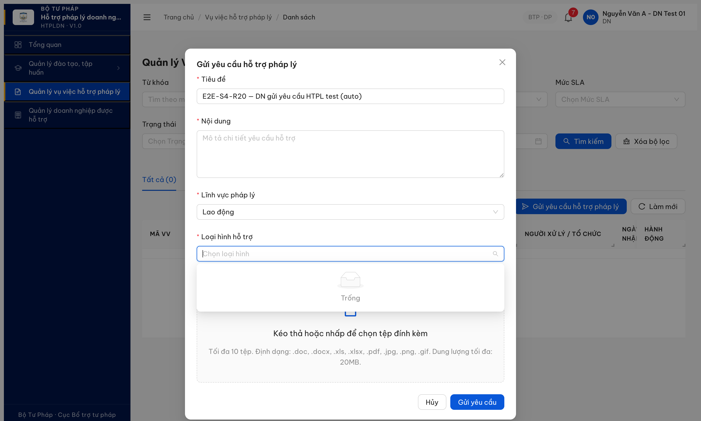
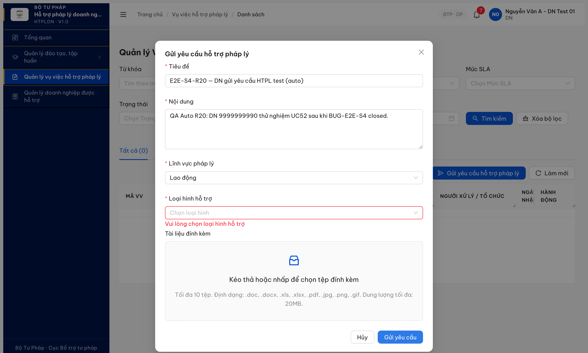

# Bug Report — R7.8.7 E2E S4 follow-up: LOAI_HINH_HT empty dropdown

| Thông tin | Giá trị |
|-----------|---------|
| **Dự án** | PM Hỗ trợ Pháp lý Doanh nghiệp |
| **Môi trường** | http://103.172.236.130:3000 |
| **Người test** | QA huongttt via Claude Code (Chrome DevTools MCP) |
| **Ngày** | 2026-05-14 01:05:00 |
| **Round** | R23 |
| **Loại test** | E2E DN UC52 — Seam 4 form submit |
| **Tài liệu tham chiếu** | [`Pass-bug-report-r7-8-7-e2e-seam-gaps.md`](Pass-bug-report-r7-8-7-e2e-seam-gaps.md) · [`functional-test-report-r7-8-7-s5-phancong.md`](../../functional/vu-viec/functional-test-report-r7-8-7-s5-phancong.md) · [`srs-fr-05-vu-viec.md`](../../../../input/srs-update-2026-5-5/srs-fr-05-vu-viec.md) |

---

## Tổng hợp

Sau khi BUG-E2E-S4 closed R20 (button "Gửi yêu cầu HTPL" + modal mở), retest end-to-end submit luồng UC52 phát hiện 1 lỗi data-seed: dropdown "Loại hình hỗ trợ" trong modal **rỗng** vì BE/seed gọi sai key `LOAI_HINH_HT` (data=[]) thay vì `LOAI_HINH_HO_TRO` (6 items). Trường required → DN không submit được → UC52 vẫn block end-to-end.

### Severity breakdown

| Tổng | Critical | Major | Medium | Minor | Trivial | Closed | Open |
|------|----------|-------|--------|-------|---------|--------|------|
| 1    | 0        | 1     | 0      | 0     | 0       | 1      | 0    |

## Bug Summary Table

| Bug ID | Severity | Priority | Type | TC Ref | **SRS Reference** | Title | Status |
|---|---|---|---|---|---|---|---|
| ~~BUG-E2E-S4-011~~ | ~~Major~~ | ~~P1~~ | Data/Integration | E2E-S4-01 | `srs-update-2026-5-5/srs-fr-05-vu-viec.md UC52 §Inputs.loaiHinhHt` | ~~Dropdown "Loại hình hỗ trợ" trong modal UC52 rỗng — FE gọi `loaiDanhMuc=LOAI_HINH_HT` trả `data:[]` (đúng key BE seed là `LOAI_HINH_HO_TRO` có 6 items)~~ | Closed |

---

## ~~BUG-E2E-S4-011~~ [CLOSED] — Modal UC52 dropdown "Loại hình hỗ trợ" rỗng do FE/BE mismatch key `LOAI_HINH_HT` vs `LOAI_HINH_HO_TRO`

> **Re-test:** 2026-05-14 01:05:00 R23 — ✅ PASS (Closed-verified). Fresh probe MCP DN `9999999990` (isolatedContext `reverify_2026_05_14_DN_loaihinh`): login DN → mở modal "Gửi yêu cầu hỗ trợ pháp lý" → click dropdown "Loại hình hỗ trợ". **Network capture (`list_network_requests`)**: FE gọi `GET /api/v1/danh-muc/tree?loaiDanhMuc=LOAI_HINH_HO_TRO` → 200 (reqid=211), KHÔNG còn gọi `LOAI_HINH_HT`. Dropdown render 6 options đúng spec: Tư vấn pháp luật / Tham gia tố tụng / Đại diện ngoài tố tụng / Hòa giải / Đào tạo bồi dưỡng / Trợ giúp khác. FE đã align về `LOAI_HINH_HO_TRO` (FR-10 QTHT source-of-truth) → contradiction SRS-C-001 đã giải quyết phía FE. Evidence: [../../reverify-2026-05-12/image/r23-bug-e2e-s4-FIXED-dropdown-6-options-2026-05-14.png](../../reverify-2026-05-12/image/r23-bug-e2e-s4-FIXED-dropdown-6-options-2026-05-14.png). *Note R23 verify lần 1 sai method (chỉ probe API trực tiếp 2 key thay vì capture FE network) → false negative; lần 2 verify đúng method capture FE request thực tế.*

### Mô tả

DN account `9999999990` mở modal "Gửi yêu cầu hỗ trợ pháp lý" qua button trên `/vu-viec/danh-sach`, fill Tiêu đề + Nội dung + Lĩnh vực "Lao động", nhưng dropdown **"Loại hình hỗ trợ" (required)** rỗng — không option nào hiển thị, không click chọn được. Submit form → toast validation `"Vui lòng chọn loại hình hỗ trợ"`. DN không thể hoàn tất submit. Network trace: FE gọi `GET /api/v1/danh-muc/tree?loaiDanhMuc=LOAI_HINH_HT` → 200 nhưng `data:[]`. Probe các key khác: `LOAI_HINH_HO_TRO` → 200 + 6 items (Tư vấn pháp luật, …). FE đang ref sai key danh mục so với seed BE.

**Root cause: SRS contradict giữa 2 module:**
- FR-05 (Vụ việc) `srs-fr-05-vu-viec.md:176` dùng `LOAI_HINH_HT`
- FR-10 (QTHT) `srs-fr-10-quan-tri.md:234` dùng `LOAI_HINH_HO_TRO`

FE follow FR-05 spec → gọi `LOAI_HINH_HT` (empty). BE seed theo FR-10 → có data dưới key `LOAI_HINH_HO_TRO`. Mismatch nguồn → dropdown rỗng → DN bị block UC52.

### Các bước tái hiện

1. Login DN `9999999990` / `Secret@123` + OTP `666666`.
2. App auto navigate `/vu-viec/danh-sach`.
3. Click button "Gửi yêu cầu hỗ trợ pháp lý".
4. Modal mở — fill Tiêu đề: "E2E-S4-R20 — DN gửi yêu cầu HTPL test (auto)".
5. Fill Nội dung: "QA Auto R20: DN 9999999990 thử nghiệm UC52...".
6. Click dropdown "Lĩnh vực pháp lý" → chọn "Lao động" (LV dropdown có 10 options OK).
7. Click dropdown "Loại hình hỗ trợ" → **dropdown hiện rỗng** (không có option).
8. Click "Gửi yêu cầu" → validation error: `"Vui lòng chọn loại hình hỗ trợ"`.
9. Mở DevTools Network → `GET /api/v1/danh-muc/tree?loaiDanhMuc=LOAI_HINH_HT` trả `{"data":[]}`. Probe `loaiDanhMuc=LOAI_HINH_HO_TRO` → 6 items.

### Kết quả mong đợi

Theo SRS `input/srs-update-2026-5-5/srs-fr-05-vu-viec.md:176` UC52 §Inputs.loaiHinhHt:
> "loai_hinh_ht_id | identifier | Y | FK → DANH_MUC (loai='LOAI_HINH_HT'): Tư vấn / Đại diện / Hỗ trợ khác"

Theo SRS `input/srs-update-2026-5-5/srs-fr-10-quan-tri.md:234` (QTHT danh mục seed):
> "loai_danh_muc | text | Y (system) | = 'LOAI_HINH_HO_TRO' | LOAI_HINH_HO_TRO | system"

→ **SRS 2 module contradict** về enum key. Cần BA chốt 1 enum chuẩn. **Khuyến nghị `LOAI_HINH_HO_TRO`** vì QTHT (FR-10) là source-of-truth danh mục dùng chung — module Vụ việc (FR-05) phải align theo QTHT, không ngược lại.

Dropdown Loại hình hỗ trợ phải có ≥4 options chuẩn (Tư vấn pháp luật, Tham gia tố tụng, Đại diện ngoài tố tụng, Tư vấn ngoài tố tụng) để DN chọn 1 → submit form thành công với `loaiHinhHtId` đính kèm body POST `/vu-viec` → BE 201 + tạo VV state `DA_TIEP_NHAN`.

### Kết quả thực tế

Dropdown rỗng (`data:[]` trả về cho key `LOAI_HINH_HT`). Field required → DN bị block ở step 7. Submit form → validation error `"Vui lòng chọn loại hình hỗ trợ"`. Toàn bộ flow UC52 (DN gửi yêu cầu HTPL → CB tiếp nhận → phân công TVV…) bị chặn ở seam 4.

API probe (cb_nv_tw_05 session, `evaluate_script` fetch):
```
GET /api/v1/danh-muc/tree?loaiDanhMuc=LOAI_HINH_HT       → 200, data=[]                  (FE gọi cái này)
GET /api/v1/danh-muc/tree?loaiDanhMuc=LOAI_HINH_HO_TRO   → 200, data=[6 items]           (BE seed cái này)
GET /api/v1/danh-muc/tree?loaiDanhMuc=LOAI_HINH_TV       → 200, data=[]
GET /api/v1/danh-muc/tree?loaiDanhMuc=LOAI_HINH_TU_VAN   → 200, data=[]
```

### Bằng chứng

**1. Modal UC52 mở với dropdown "Loại hình hỗ trợ" rỗng (DN 9999999990):**



**2. Validation error sau submit:**



### So sánh

**SRS contradiction giữa 2 module — cần BA chốt:**

| Module | SRS file | Line | Enum key |
|---|---|---|---|
| FR-05 (Vụ việc) | `srs-fr-05-vu-viec.md` | 176 | `LOAI_HINH_HT` |
| FR-10 (QTHT) | `srs-fr-10-quan-tri.md` | 234 | `LOAI_HINH_HO_TRO` |

Recommend: align về `LOAI_HINH_HO_TRO` vì FR-10 QTHT là source-of-truth danh mục.

---

*Bug log R20 retest 2026-05-13 11:55:00 — Chrome DevTools MCP isolatedContext `tvcs-e2e-r20-fresh-cbnvtw06`, DN account `9999999990`, sau khi parent bug BUG-E2E-S4 (CTA + modal mở) đã Closed R20.*
