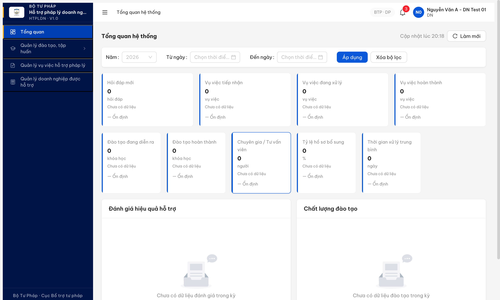
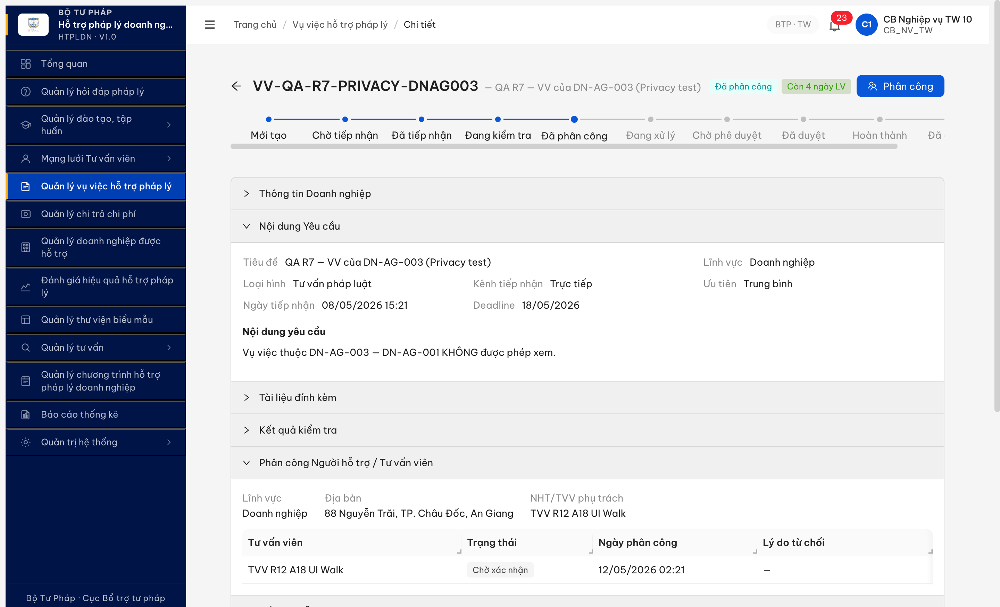

# Bug Report — R7.8.7 E2E DN seam handoff gaps

| Thông tin | Giá trị |
|-----------|---------|
| **Dự án** | PM Hỗ trợ Pháp lý Doanh nghiệp |
| **Môi trường** | http://103.172.236.130:3000 |
| **Người test** | QA huongttt via Claude Code (Chrome DevTools MCP) |
| **Ngày** | 2026-05-12 02:25:00 |
| **Loại test** | Cross-cutting / E2E Workflow / Seam handoff |
| **Round** | Round 7 — R7.8.7 |
| **Tài liệu tham chiếu** | [`workflow-test-report-r7-8-7-e2e-dn.md`](../../workflow/cross-cutting/workflow-test-report-r7-8-7-e2e-dn.md) · [`functional-test-report-r7-8-7-s5-phancong.md`](../../functional/vu-viec/functional-test-report-r7-8-7-s5-phancong.md) · [`02-thu-tu-module.md`](../../../../input/quy-trinh-nghiep-vu/02-thu-tu-module.md) · [`srs-v3.5.md`](../../../../input/srs-update-2026-5-5/srs-v3.5.md) |

---

## Tổng hợp

Phát hiện **2 lỗi có SRS reference cụ thể** khi run E2E 12 bước DN + Re-verify S5 (2026-05-12 02:25:00). BUG-E2E-S4 (UC52 DN portal chưa triển khai) vẫn **block golden path** — DN không thể tự gửi yêu cầu HTPL theo SCR-V.I-04. BUG-E2E-S6 closed-verified do SRS local đã trả lời (NHT/TVV PL toàn quốc theo NĐ 77/2008 Đ.19 → mix cấp đúng spec, không phải bug). Bug mới BUG-E2E-S5 phát hiện sau re-run đầy đủ S5: Outputs SCR-V.I-03 Accordion 5 vẫn label "Địa bàn" + address thay vì "Đơn vị quản lý" + Sở TP/Bộ ngành (v3.5 rev. 2 G2+G4 chưa apply ở FE).

### Severity breakdown

| Tổng | Critical | Major | Medium | Minor | Trivial |
|------|----------|-------|--------|-------|---------|
| 3    | 1        | 0     | 1 (closed) | 1     | 0       |

## Bug Summary Table

| Bug ID | Severity | Priority | Type | TC Ref | **SRS Reference** | Title | Status |
|---|---|---|---|---|---|---|---|
| BUG-E2E-S4 | **Critical** | P0 | Workflow | R7.8.7-S4 | `srs-update-2026-5-5/srs-v3.5.md SCR-V.I-04 + FR-V.I-02 UC52` | DN không có CTA gửi yêu cầu HTPL — UC52 chưa triển khai (app tự khai báo qua toast) | Open |
| BUG-E2E-S5 | Minor | P2 | UI/UX | R7.8.7-S5 | `srs-fr-05-vu-viec.md` line 18 (v3.5 rev. 2 G2+G4) + FR-V.I-09 Outputs.6 (`don_vi_quan_ly`) | SCR-V.I-03 Accordion 5 hiển thị label "Địa bàn" + value address thay vì "Đơn vị quản lý" + Sở TP/Bộ ngành | Open |
| ~~BUG-E2E-S6~~ | ~~Medium~~ | ~~P2~~ | ~~Workflow~~ | ~~R7.8.7-S6~~ | ~~`srs-update-2026-5-5/srs-v3.5.md BR-CALC-04 + FR-V.I-09`~~ | ~~BR-CALC-04 suggest mix cấp TW+BN+AG, không scope theo cấp đơn vị VV — chờ BA confirm~~ | Closed |

---

## BUG-E2E-S4 — DN không có CTA gửi yêu cầu HTPL, UC52 chưa triển khai

> **Re-test:** 2026-05-12 02:05:00 R7.8.7 — Open giữ nguyên. DN `9999999990` login OK, 16 button trên `/vu-viec/danh-sach`, **0 button** match `Tạo mới/Gửi yêu cầu/Thêm mới`. Probe POST `/api/v1/vu-viecs` với DN auth cookie → 404 `ERR-SYS-00-04-01`. Bug chưa fix.

### Mô tả

DN account 9999999990 ("Công ty TNHH DN Test 01") login vào portal KHÔNG có CTA (button/menu/link) nào để gửi yêu cầu hỗ trợ pháp lý theo SCR-V.I-04. Click sidebar "Quản lý vụ việc hỗ trợ pháp lý" landing tại `/vu-viec/danh-sach` chỉ thấy form filter + bảng empty (0 record), không thấy nút "Tạo mới" / "Gửi yêu cầu". Probe BE POST `/api/v1/vu-viecs` (và 6 variants path khác) đều trả 404 `ERR-SYS-00-04-01`. Khi CB_NV_TW click [Thêm mới] trên list VV, toast app tự khai báo: `"Tính năng tạo VV qua kênh chính (UC52) sẽ được triển khai trong story tiếp theo"`.

### Các bước tái hiện

1. Mở Chrome DevTools MCP `new_page` với `isolatedContext=r787_dn_e2e_2026_05_11`.
2. Login DN `9999999990` / `Secret@123` qua `/login` → OTP `666666` → landing `/dashboard`.
3. Click sidebar "Quản lý vụ việc hỗ trợ pháp lý" → URL `/vu-viec/danh-sach` render.
4. Inspect DOM `document.querySelectorAll('button')` — chỉ thấy: Tổng quan, sidebar items, Tìm kiếm, Xóa bộ lọc, Làm mới. **Không có** "Tạo mới" / "Gửi yêu cầu" / "Tạo VV mới".
5. Probe API trực tiếp qua DevTools console:
   ```js
   const r = await fetch('/api/v1/vu-viecs', {method:'POST', credentials:'include',
     headers:{'Content-Type':'application/json'}, body:JSON.stringify({})});
   console.log(r.status, await r.text());
   ```
6. Quan sát: 404 `ERR-SYS-00-04-01 "Cannot POST /api/v1/vu-viecs"`.
7. Switch sang CB_NV_TW (login isolatedContext khác) → vào VV list → click [Thêm mới] → toast hiện `"Tính năng tạo VV qua kênh chính (UC52) sẽ được triển khai trong story tiếp theo"`.

### Kết quả mong đợi

Theo `srs-v3.5.md SCR-V.I-04` + `FR-V.I-02 UC52`:
- DN portal phải có CTA "Gửi yêu cầu hỗ trợ pháp lý" (button/menu/link) hiển thị cho role DN khi VV list empty.
- Click CTA mở form SCR-V.I-04 với các field theo spec (tiêu đề, nội dung, lĩnh vực, loại hình, tài liệu đính kèm).
- DN submit form → BE tạo VV state `MOI_TAO` hoặc `CHO_TIEP_NHAN`, sync MST DN từ session (Seam 2).
- Kênh tiếp nhận = "Doanh nghiệp" (DN tự gửi qua portal), không phải "Trực tiếp" (CB nhập thủ công).

### Kết quả thực tế

- DN portal KHÔNG có CTA gửi yêu cầu HTPL nào.
- Backend endpoint `POST /api/v1/vu-viecs` (kênh chính UC52) 404.
- Endpoint `POST /api/v1/vu-viecs/manual` (kênh phụ CB nhập tay) 201 — đây là workaround của CB, không phải UC52.
- App **tự khai báo** chưa triển khai qua toast khi CB click [Thêm mới].

**Network evidence:**
```json
HTTP 404
{
  "success": false,
  "error": {
    "code": "ERR-SYS-00-04-01",
    "message": "Cannot POST /api/v1/vu-viecs",
    "timestamp": "2026-05-11T13:20:33.986Z",
    "requestId": "24dfc0d5-f469-446d-bee2-75c4c162de2b"
  }
}
```

**Probed variants (tất cả 404):**
```
POST /api/v1/vu-viecs                       → 404
POST /api/v1/vu-viecs/cb-tao-moi            → 404
POST /api/v1/yeu-cau-htpl                   → 404
POST /api/v1/yeu-cau-htpls                  → 404
POST /api/v1/yeu-cau-ho-tro                 → 404
POST /api/v1/ho-so-vu-viec                  → 404
POST /api/v1/ho-so-vu-viecs                 → 404
POST /api/v1/doanh-nghiep/me/yeu-cau-htpl   → 404
GET  /api/v1/yeu-cau-htpls                  → 404
```

### Bằng chứng

**1. DN dashboard 9999999990 — sidebar 4 menu items, không có CTA Gửi yêu cầu:**



**2. Toast app tự khai báo UC52 chưa triển khai (verify bằng CB_NV_TW account):**

```text
Toast (uid 32_1) hiện sau click [Thêm mới] tại /vu-viec/danh-sach (CB_NV_TW_10):
"Tính năng tạo VV qua kênh chính (UC52) sẽ được triển khai trong story tiếp theo"
```

**3. Sample VV tạo thành công qua endpoint phụ (workaround `/vu-viecs/manual` 201):**


---

## BUG-E2E-S5 — SCR-V.I-03 Accordion 5 vẫn label "Địa bàn" + value address (chưa apply v3.5 rev. 2 G2+G4)

### Mô tả

Sau khi CB_NV_TW phân công VV cho cá nhân (TVV/NHT) thành công, accordion "Phân công Người hỗ trợ / Tư vấn viên" mở ra hiển thị Outputs với label `Địa bàn` + value là **địa chỉ thường trú** (vd `"88 Nguyễn Trãi, TP. Châu Đốc, An Giang"`). Theo SRS v3.5 rev. 2 G2+G4 ([`srs-fr-05-vu-viec.md` line 18](../../../../../input/srs-update-2026-5-5/srs-fr-05-vu-viec.md) + FR-V.I-09 Outputs.6) phải đổi label thành `Đơn vị quản lý` + value phải là **Sở TP/Bộ ngành công nhận** TVV (vd `Sở Tư pháp An Giang`), KHÔNG dùng "địa bàn" vì Thẻ TVV PL có hiệu lực toàn quốc theo NĐ 77/2008 Điều 19. App FE chưa apply rename label/data field này.

### Các bước tái hiện

1. Login CB_NV_TW_10 / `Secret@123` qua MCP isolatedContext `r787_s5_cb_nv_tw_10`.
2. Mở VV `VV-QA-R7-PRIVACY-DNAG003` (UUID `aaff0000-0000-4000-8000-000000000002`) state "Đã tiếp nhận".
3. Click "Kiểm tra hồ sơ" → 6 hạng mục defaults Đạt → click "Xác nhận" → state advance "Đang kiểm tra" (`POST /api/v1/vu-viecs/{id}/kiem-tra 201`).
4. Click button "Phân công" → modal "Phân công tư vấn viên" mở.
5. Giữ thẻ default "Cá nhân" → click dropdown "Chọn người được phân công" → pick TVV `TVV-BTP-TW-0034 "TVV R12 A18 UI Walk"` (0 VV).
6. Click "Xác nhận" → state advance "Đã phân công" + timeline ghi `Phân công (cá nhân) 12/05/2026 02:21 CB Nghiệp vụ TW 10`.
7. Click accordion "Phân công Người hỗ trợ / Tư vấn viên" mở rộng.
8. **Quan sát:** field hiển thị `Địa bàn | 88 Nguyễn Trãi, TP. Châu Đốc, An Giang` (address của TVV) — KHÔNG có label "Đơn vị quản lý" + KHÔNG có "Sở TP/Bộ ngành".

### Kết quả mong đợi

Theo [`srs-fr-05-vu-viec.md`](../../../../../input/srs-update-2026-5-5/srs-fr-05-vu-viec.md):
- **Line 18** (v3.5 rev. 2, G2+G4): "SCR-V.I-03 Accordion 5 thêm 'Khi loai=`TO_CHUC` → hiển thị tên tổ chức' + đổi label '**địa bàn**' → '**đơn vị quản lý**' (NĐ 77/2008 Đ.19)".
- **FR-V.I-09 Outputs.6** (`don_vi_quan_ly`): "Đơn vị quản lý (Sở TP/Bộ ngành công nhận) — **KHÔNG dùng 'địa bàn'** do Thẻ TVV PL có hiệu lực toàn quốc theo NĐ 77/2008 Điều 19".
- Value mong đợi: `Sở Tư pháp <tỉnh>` hoặc `<Bộ ngành công nhận>` của TVV được chọn.
- Bonus G2: nếu phân công loại `TO_CHUC`, thêm row "Tên tổ chức: <tên TC TV>".

### Kết quả thực tế

Accordion 5 sau phân công cá nhân hiển thị 4 fields:
```
Lĩnh vực:                Doanh nghiệp
Địa bàn:                 88 Nguyễn Trãi, TP. Châu Đốc, An Giang   ← SAI label + sai data
NHT/TVV phụ trách:       TVV R12 A18 UI Walk
[Sub-table 4 cột]        Tư vấn viên | Trạng thái | Ngày phân công | Lý do từ chối
                         TVV R12 A18 UI Walk | Chờ xác nhận | 12/05/2026 02:21 | —
```

→ App vẫn hiển thị label `Địa bàn` + value là address (không phải Sở TP/Bộ ngành). 2 thẻ Cá nhân/Tổ chức trong modal phân công đã đúng spec v3.5 (UC59 refactor), nhưng Outputs UI chưa rename label theo G2+G4.

### Bằng chứng

**Screenshot accordion 5 sau phân công, hiển thị label "Địa bàn":**



**Endpoint trace verify phân công thành công:**

```
POST /api/v1/vu-viecs/aaff0000-0000-4000-8000-000000000002/kiem-tra → 201 (state DA_TIEP_NHAN → DANG_KIEM_TRA)
GET  /api/v1/vu-viecs/aaff0000-0000-4000-8000-000000000002/goi-y-tvv?limit=20 → 200 (4 records sort workload ASC)
POST /api/v1/vu-viecs/aaff0000-0000-4000-8000-000000000002/phan-cong → 201 (state DANG_KIEM_TRA → DA_PHAN_CONG)
```

**API response `goi-y-tvv` shape:**
```json
{
  "success": true,
  "data": [
    {"maTvv":"TVV-BTP-TW-0034","hoTen":"TVV R12 A18 UI Walk","loaiTvv":"TVV","diemDanhGiaTb":null,"activeWorkload":0},
    {"maTvv":"TVV-BTP-TW-0035","hoTen":"TVV R13 A19 Gate Verify","loaiTvv":"TVV","activeWorkload":0},
    {"maTvv":"NHT-STP-AG-0001","hoTen":"Phùng Thị NHT An Giang","loaiTvv":"NHT","activeWorkload":0},
    {"maTvv":"TVV-BTP-TW-0032","hoTen":"TVV R11 Verify Mail Fix","loaiTvv":"TVV","diemDanhGiaTb":8.3,"activeWorkload":2}
  ],
  "meta": {"total":4,"casePriorityScore":2,"isHighPriority":false,"linhVucId":"bbbbbbbb-0000-4000-8000-00000000001a","boRaLinhVuc":false}
}
```

→ Response BE chỉ có field `maTvv` / `hoTen` / `loaiTvv` / `diemDanhGiaTb` / `activeWorkload`. **KHÔNG có field `don_vi_quan_ly`** (Sở TP/Bộ ngành) trong response gợi ý. FE đang fallback render `dia_chi` của TVV thay vì query thêm `don_vi_quan_ly` từ entity TVV.

---

## ~~BUG-E2E-S6~~ [CLOSED] — BR-CALC-04 suggest mix cấp TW+BN+AG (Not a bug, SRS verified)

> **Re-test:** 2026-05-11 19:05:00 R7.8.7 — ✅ Closed (Not a bug). SRS local verified [`srs-fr-05-vu-viec.md:65-70`](../../../../../input/srs-update-2026-5-5/srs-fr-05-vu-viec.md) (BR-CALC-04 chỉ 4 tiêu chí: DN nữ làm chủ +3, LĐ nữ +2, LĐ KT +2, FIFO +1 — KHÔNG có rule filter cấp đơn vị) + FR-V.I-09 Outputs.6 (`don_vi_quan_ly`): "KHÔNG dùng 'địa bàn' do Thẻ TVV PL có hiệu lực toàn quốc theo NĐ 77/2008 Điều 19" + CHANGELOG-v3-to-v3.5.md line 340 (bỏ "địa bàn" trong Processing filter) → **App đúng spec**, mix cấp TW+BN+AG là feature theo NĐ 77/2008 Đ.19 (TVV PL có hiệu lực toàn quốc).

### Mô tả

Khi CB_NV_TW (cấp TW) tạo VV mới và click [Phân công], dropdown gợi ý `GET /api/v1/vu-viecs/{id}/goi-y-tvv?limit=20` trả 8 NHT/TVV gồm 3 cấp khác nhau: TW (BTP-TW-*), Bộ ngành (BKH-*), tỉnh (STP-AG-*). Theo SRS BR-CALC-04 + FR-V.I-09, gợi ý phải cân nhắc cấp đơn vị quản lý VV — VV cấp TW thường ưu tiên NHT/TVV cùng cấp TW, không nên mix với cấp BN/tỉnh. Spec hiện không nêu rõ filter cấp → cần BA confirm.

### Các bước tái hiện

1. Login CB_NV_TW_10 (cấp TW, đơn vị BTP-TW).
2. Tạo VV mới qua [Nhập thủ công] với lĩnh vực Lao động, loại hình Tư vấn pháp luật.
3. Click [Kiểm tra hồ sơ] → Xác nhận → state advance `Đang kiểm tra`.
4. Click [Phân công] → modal mở → click dropdown "Chọn người được phân công".
5. Inspect items qua `evaluate_script`:
   ```js
   const items = document.querySelectorAll('.ant-select-dropdown:not(.ant-select-dropdown-hidden) .ant-select-item-option');
   Array.from(items).map(i => i.textContent.trim())
   ```

### Kết quả mong đợi

Theo `srs-v3.5.md BR-CALC-04` (cần BA confirm):
- Gợi ý NHT/TVV cùng cấp đơn vị quản lý với CB tạo VV (TW → ưu tiên NHT cấp TW).
- Hoặc nếu cross-level cho phép, spec phải nêu rõ thứ tự ưu tiên: cùng cấp > cấp dưới > cấp khác.
- Load balance theo "VV đang xử lý" ASC (verified ✓).
- Filter theo lĩnh vực PL của VV (Lao động) — verify chuyên môn NHT.

### Kết quả thực tế

Dropdown trả 8 records mix 3 cấp:
```
[NHT] Phùng Thị NHT An Giang (NHT-STP-AG-0001) — 0 VV         ← cấp tỉnh
[TVV] hương tvv1 (TVV-BTP-TW-0029) — 0 VV                     ← TW
[NHT] NHT R10 BUG003 Mail Verify (NHT-BTP-TW-0007) — 0 VV     ← TW
[NHT] NHT R11 BUG003 Verify (NHT-BTP-TW-0008) — 0 VV          ← TW
[NHT] hương 2 nht (NHT-BTP-TW-0011) — 0 VV                    ← TW
[NHT] NHT R12 BUG003 Verify BN (NHT-BKH-0002) — 0 VV          ← Bộ ngành
[NHT] hương 3 NHT (NHT-BKH-0004) — 0 VV                       ← Bộ ngành
[NHT] NHT TC001 Test BTP TW (NHT-BTP-TW-0005) — 2 VV          ← TW
```

Sort load balance OK (0 → 2). Nhưng cấp đơn vị (TW/BN/tỉnh) trộn lẫn — không clear logic.

### Bằng chứng

**Inspection dropdown gợi ý qua `evaluate_script` (NHT/TVV với cấp đơn vị + count VV):**

```json
[
  {"text":"[NHT] Phùng Thị NHT An Giang (NHT-STP-AG-0001) — 0 VV đang xử lý"},
  {"text":"[TVV] hương tvv1 (TVV-BTP-TW-0029) — 0 VV đang xử lý"},
  {"text":"[NHT] NHT R10 BUG003 Mail Verify (NHT-BTP-TW-0007) — 0 VV đang xử lý"},
  {"text":"[NHT] NHT R11 BUG003 Verify (NHT-BTP-TW-0008) — 0 VV đang xử lý"},
  {"text":"[NHT] hương 2 nht (NHT-BTP-TW-0011) — 0 VV đang xử lý"},
  {"text":"[NHT] NHT R12 BUG003 Verify BN (NHT-BKH-0002) — 0 VV đang xử lý"},
  {"text":"[NHT] hương 3 NHT (NHT-BKH-0004) — 0 VV đang xử lý"},
  {"text":"[NHT] NHT TC001 Test BTP TW (NHT-BTP-TW-0005) — 2 VV đang xử lý"}
]
```

Endpoint trace:
```
GET /api/v1/vu-viecs/cdeb01f4-0f80-4b7a-ac1f-7f439c9bcd32/goi-y-tvv?limit=20 → 200
```

---

## Phụ lục — Môi trường test

| Thành phần | Giá trị |
|------------|---------|
| URL ứng dụng | http://103.172.236.130:3000 |
| OTP login | `666666` bypass |
| MailHog (OTP inbox) | http://103.172.236.130:8025 |
| API base | http://103.172.236.130:3000/api/v1 |
| Frontend | React + Vite + Ant Design v5 |
| Xác thực | JWT + OTP + HttpOnly refresh cookie |
| Tool test | Chrome DevTools MCP + isolatedContext per role |

**Accounts dùng:**
- DN: `9999999990` / `Secret@123` (DN-HNI-0004 "Công ty TNHH DN Test 01")
- CB workaround: `cb_nv_tw_10` / `Secret@123` (CB Nghiệp vụ TW 10, BTP-TW)
- NHT chosen for assign (S6 original): `NHT-BTP-TW-0008` "NHT R11 BUG003 Verify"
- TVV chosen for assign (S5 re-verify 2026-05-12): `TVV-BTP-TW-0034` "TVV R12 A18 UI Walk"

---

*Bug report generated: 2026-05-11 20:30:00 | Updated 2026-05-12 02:25:00 — re-verify S5 + close S6 (Not a bug) + log new BUG-E2E-S5 label "Địa bàn" | QA huongttt via Claude Code (Chrome DevTools MCP)*
