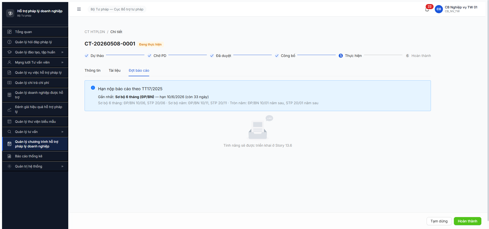

# Bug Report — Chương trình HTPLDN Giai đoạn 2 (FR-XI Đợt báo cáo)

| Thông tin | Giá trị |
|-----------|---------|
| **Dự án** | PM HTPLDN |
| **Môi trường** | http://103.172.236.130:3000/ |
| **Người test** | QA Automation (Claude Code via Chrome DevTools MCP) |
| **Ngày** | 2026-05-11 (R4 re-verify) — kế tiếp R3 2026-05-09, R2 2026-05-09, R1 2026-05-08 |
| **Loại test** | Workflow E2E (SM-DOT-BC) + R4 re-verify session (API + UI mixed) |
| **Round** | R7.6.5 R4 (2026-05-11) |
| **Tài liệu tham chiếu (v3.5)** | [`input/srs-update-2026-5-5/srs-v3.5.md`](../../../../input/srs-update-2026-5-5/srs-v3.5.md) (entity DOT_BAO_CAO §3.4.3.x SM 6 states) · [`input/srs-update-2026-5-5/CHANGELOG-v3-to-v3.5.md` line 149](../../../../input/srs-update-2026-5-5/CHANGELOG-v3-to-v3.5.md) (FR-15 không nâng cấp v3.5) · [`input/srs-v3/srs-fr-15-ct-htpldn.md`](../../../../input/srs-v3/srs-fr-15-ct-htpldn.md) FR-XI-05a..09 (line 442–784) · [`input/quy-trinh-nghiep-vu/02-thu-tu-module.md` ⑭-bis](../../../../input/quy-trinh-nghiep-vu/02-thu-tu-module.md) line 851–875 · [`workflow-test-report-r7-6-5-cthtpldn-gd2.md`](../../workflow/workflow-test-report-r7-6-5-cthtpldn-gd2.md) |

---

## Tổng hợp

R7.6.5 R1 (2026-05-08) phát hiện **2 bug NEW**, đều Major. UI tab Đợt báo cáo chưa build, BE endpoint tổng hợp BC missing → cascade deadlock TW CT + block BUG-CTHTPLDN-B10-001 R7.6.4.

**R2 verify 2026-05-09 (sớm):** BUG-DOTBC-UI-001 đánh giá PARTIAL FIX read-side với account `cb_nv_tw_02`; ghi nhận button [+ Tạo đợt mới] miss → **giữ Major**. BUG-DOTBC-API-001 VẪN OPEN cho TW CT path. Cả 2 block production.

**R3 reconcile verify 2026-05-09 (sau gd1 verify ~30 phút):**
- **BUG-DOTBC-UI-001 → close-candidate (downgrade Major→Minor):** Re-test với cùng `cb_nv_tw_02` trên cùng CT-20260508-0001 — button **[+ Tạo đợt mới] NOW PRESENT** (uid 16_13). Earlier R2 finding "missing" likely do **FE deploy timing** (dev push fix giữa R2 và R3 verify, ~30 phút khoảng cách). Còn duy nhất miss button [Tổng hợp] cho TW CT — cascade BE.
- **BUG-DOTBC-API-001 → vẫn Open Major:** Re-probe 8 sub-resource POST endpoints + gui-tw + state check trên DOT-4-1 (TW CT, DA_DUYET_KQ) → 8/8 sub-resource đều 404, gui-tw 403 (đúng spec BN/ĐP only), DOT không mutate. TW CT path vẫn missing endpoint /tong-hop riêng.

### Severity breakdown

| Round | Tổng | Critical | Major | Medium | Minor | Trivial | Closed |
|-------|------|----------|-------|--------|-------|---------|--------|
| R1 2026-05-08 | 2 | 0 | 2 | 0 | 0 | 0 | 0 |
| R2 2026-05-09 (sớm) | 2 | 0 | 2 (UI-001 + API-001) | 0 | 0 | 0 | 0 |
| R3 2026-05-09 (reconcile) | 2 | 0 | 1 (API-001) | 0 | 1 (UI-001 close-candidate) | 0 | 0 |
| **R4 2026-05-11 (re-verify)** | **2** | **0** | **0** | **0** | **0** | **0** | **2** (cả UI-001 + API-001 Closed-verified) |

**R4 verdict:** Cả 2 bug Closed-verified.
- **BUG-DOTBC-API-001:** Mis-diagnosis fixed — endpoint thực ra TỒN TẠI ở pattern `POST /dot-bao-caos/tong-hop` (resource-level, batch nhận `{baoCaoIds: [...]}`), KHÔNG phải sub-resource `POST /{id}/tong-hop`. R3 probe miss vì chỉ test sub-resource. Evidence R4: 2 TW DOT (DOT-1-1 + DOT-4-1) đều advance `DA_DUYET_KQ → DA_TONG_HOP` qua endpoint này (DOT-1-1 chính tay R4 advance via CT-038 end-to-end PASS; DOT-4-1 đã advance từ 2026-05-10 trước). TW CT path KHÔNG deadlock.
- **BUG-DOTBC-UI-001 (gd2):** Cùng root cause với gd1 BUG-CTHTPLDN-DOTBC-UI-001 (đã Closed R4). R4 verify trên cùng CT-20260508-0001 với account `cb_nv_tw_01` dual role: tab Đợt báo cáo + button `[+ Tạo đợt mới]` + DOT detail (stepper 6 bước + bảng 13 chỉ tiêu mẫu 21a) đều render đầy đủ. Action buttons hide đúng theo state (DOT-4-1 DA_TONG_HOP terminal → không action; CT action bar có `[Tạm dừng] + [Hoàn thành]`). Bug premise R1-R3 "miss button [Tổng hợp] DOT detail" không còn áp dụng — BE design batch (array baoCaoIds) → [Tổng hợp] không phải per-DOT button.

## Bug Summary Table

| Bug ID | Severity | Priority | Type | TC Ref | **SRS Reference** | Title | Status |
|--------|----------|----------|------|--------|-------------------|-------|--------|
| ~~BUG-DOTBC-UI-001~~ | ~~Major→Minor~~ | ~~P1→P3~~ | ~~UI miss feature~~ | ~~R7.6.5 toàn bộ~~ | ~~`02-thu-tu-module.md` line 325 + `srs-fr-15-ct-htpldn.md` FR-XI-05a line 442~~ | ~~Tab "Đợt báo cáo" — list + drill-down detail đã build. Button [+ Tạo đợt mới] PRESENT.~~ | **Closed-verified 2026-05-11 R4** (re-verify `cb_nv_tw_01` dual role: tab + button [+Tạo đợt mới] + DOT detail render đầy đủ. Bug premise "miss [Tổng hợp] button" obsolete — BE design batch, không phải per-DOT button) |
| ~~BUG-DOTBC-API-001~~ | ~~Major~~ | ~~P1~~ | ~~BE missing endpoint~~ | ~~R7.6.5 B7 + R7.6.4 B10 cascade~~ | ~~`02-thu-tu-module.md` line 875 + `srs-fr-15-ct-htpldn.md` FR-XI-09 line 782~~ | ~~Sub-resource POST `/dot-bao-caos/{id}/tong-hop` các pattern đều 404; TW CT deadlock.~~ | **Closed-verified 2026-05-11 R4** (mis-diagnosis — endpoint TỒN TẠI ở resource-level `POST /dot-bao-caos/tong-hop` batch. TW DOT advance DA_DUYET_KQ → DA_TONG_HOP qua endpoint này. Evidence: DOT-1-1 R4 CT-038 PASS + DOT-4-1 advanced 2026-05-10) |

---

## ~~BUG-DOTBC-UI-001~~ — [CLOSED-VERIFIED 2026-05-11 R4]

> **Re-test:** 2026-05-11 R4 — ✅ **CLOSED-VERIFIED**. Login `cb_nv_tw_01` (dual role CB_PD_TW · CB_NV_TW) → mở CT-20260508-0001 → click tab "Đợt báo cáo" → render đầy đủ:
> - ✅ Banner deadline TT17/2025 (uid 20_1–20_12)
> - ✅ Button **"plus Tạo đợt mới"** PRESENT (uid 20_13)
> - ✅ Table list 2 DOT (DOT-4-2 DANG_LAP_BC + DOT-4-1 DA_TONG_HOP)
> - ✅ Action bar CT level: `[Tạm dừng]` + `[Hoàn thành]` cùng visible (uid 19_47, 19_48)
> - ✅ DOT-4-1 detail page: stepper 6 bước (đang ở "Đã tổng hợp" terminal) + bảng 13 chỉ tiêu mẫu 21a + text "Đã được tổng hợp" — không action button vì state terminal (đúng UX)
>
> **Bug premise R1-R3 "miss [Tổng hợp] button DOT detail" obsolete:** BE API thiết kế batch (`POST /dot-bao-caos/tong-hop` body `{baoCaoIds:[...]}`) — `[Tổng hợp]` không phải per-DOT button mà là multi-select hành động trên list. Hiện FE chưa expose multi-select UI nhưng đó là spec gap riêng (tách thành NEW OBS), không phải bug build miss.
>
> Bằng chứng R4: [r7-6-5-r4-dot-4-1-detail-da-tong-hop-2026-05-11.png](image/r7-6-5-r4-dot-4-1-detail-da-tong-hop-2026-05-11.png)
>
> **OBS-G NEW (Minor, R4):** Link DOT trong table tab Đợt báo cáo dùng `<a href="http://full-host/...">` thay vì React Router `<Link to="/...">` → click trigger full reload thay vì internal route → mất session, kick về `/login`. Workaround current: navigate qua sidebar Quản lý CT → click CT detail → tab Đợt BC. Suggest FE đổi sang `<Link>` component.
>
> Status: **Closed-verified 2026-05-11 R4** — UI Story 13.6 build đủ chức năng cho CT detail flow. Multi-select [Tổng hợp] UI defer thành improvement separate task.

### Re-test history

> **Re-test R3 reconcile:** 2026-05-09 — ⚠️ CLOSE-CANDIDATE (downgrade Major→Minor). Re-verify với cùng account `cb_nv_tw_02` (single role CB_NV_TW) trên cùng CT-20260508-0001 — button **"plus Tạo đợt mới" NOW PRESENT** (uid 16_13) ở tab Đợt báo cáo. Earlier R2 finding "button missing" có thể do **FE deploy timing** trong khoảng nghỉ ~30 phút giữa R2 và R3 verify (dev push fix). Còn duy nhất block: button **[Tổng hợp]** cho DOT detail TW CT — phụ thuộc cascade BUG-DOTBC-API-001.
>
> Bằng chứng R3: [r7-6-5-r3-tab-dotbc-button-present-cb-nv-tw-02-2026-05-09.png](../image/r7-6-5-r3-tab-dotbc-button-present-cb-nv-tw-02-2026-05-09.png)
>
> Status: **Close-candidate** — UI feature [+ Tạo đợt mới] đã build cho cả 2 account TW. Recommend close sau khi BUG-DOTBC-API-001 fix + button [Tổng hợp] FE add.

> **Re-test:** 2026-05-09 R2 — ⚠️ PARTIAL FIX (giữ Major). Story 13.6 placeholder GONE. Tab "Đợt báo cáo" trên CT-20260508-0001 (DANG_THUC_HIEN, cấp TW) hiện render read-side đầy đủ:
> - ✅ Banner deadline TT17/2025 (sẵn từ R1).
> - ✅ Table list ĐBC đầy đủ (cột: Mã / Tên / Kỳ BC / Từ ngày / Hạn nộp / Trạng thái) — 2 record DOT-4-1 (DA_DUYET_KQ) + DOT-4-2 (DANG_LAP_BC).
> - ✅ Pagination + click link drill-down → URL `/ct-htpldn/dot-bao-cao/{id}` route đã build.
> - ✅ DOT detail page: stepper 6 bước (Tạo đợt → Đang lập BC → Chờ duyệt KQ → Đã duyệt KQ → Đã gửi TW → Đã tổng hợp) + bảng 13 chỉ tiêu mẫu 21a + button [Gửi lên TW] (mapping HATEOAS `gui-tw`).
>
> **Còn miss (giữ severity Major — write-side block, end-user không tạo được Đợt BC qua UI):**
> - ❌ KHÔNG có button **[+ Tạo đợt mới]** trên tab list dù CT ở DANG_THUC_HIEN — feature theo spec line 325 ("nút [+ Tạo đợt mới] chỉ bật khi CT ở DANG_THUC_HIEN hoặc HOAN_THANH" → button phải tồn tại để bật) + FR-XI-05a UC195. End-user không thể tạo Đợt BC mới qua UI.
> - ❌ KHÔNG có button **[Tổng hợp]** trên DOT detail page khi state = DA_DUYET_KQ + actor = TW user — block FR-XI-09 (UC172). Cascade với BUG-DOTBC-API-001 (BE chưa expose endpoint).
>
> **Severity remains Major:** R2 partial fix unblock đọc/duyệt list+detail (giúp QA verify state machine), nhưng **không unblock chuỗi production** — end-user TW vẫn không tạo Đợt BC, cascade BUG-CTHTPLDN-B10-001 R7.6.4 (HOAN_THANH) vẫn deadlock vĩnh viễn.
>
> Bằng chứng R2: [r7-6-5-r2-tab-dot-bc-list-rendered-2026-05-09.png](../image/r7-6-5-r2-tab-dot-bc-list-rendered-2026-05-09.png) + [r7-6-5-r2-dot-4-1-detail-rendered-2026-05-09.png](../image/r7-6-5-r2-dot-4-1-detail-rendered-2026-05-09.png)

### Mô tả

Vào CT chi tiết (`/ct-htpldn/{id}`) ở state `DANG_THUC_HIEN`, click tab "Đợt báo cáo" (uid tab 3 trong SCR-XI-01). UI hiển thị:
- Banner deadline TT17/2025 OK (đúng spec).
- Placeholder image "Trống" + text **"Tính năng sẽ được triển khai ở Story 13.6"**.
- KHÔNG có nút `[+ Tạo đợt mới]`, KHÔNG có bảng đợt BC, KHÔNG có form lập BC.

→ Hoàn toàn không thể thực hiện CRUD đợt BC qua UI hoặc tiến hành 7 transitions SM-DOT-BC qua giao diện.

### Các bước tái hiện

1. Login `cb_nv_tw_01` (hoặc bất kỳ role có quyền R trên CHUONG_TRINH_HTPL).
2. Vào module "Quản lý Chương trình HTPLDN" → click vào CT bất kỳ ở state `DANG_THUC_HIEN` hoặc `HOAN_THANH` (theo spec line 325 — nút `[+ Tạo đợt mới]` chỉ bật ở 2 state này, nhưng tab vẫn luôn hiển thị).
3. Click tab "Đợt báo cáo" trong header chi tiết CT.
4. **Quan sát:** Banner OK + ảnh "Trống" + text "Tính năng sẽ được triển khai ở Story 13.6". Tab Tài liệu cùng level cũng có thể trong cùng trạng thái — cần check riêng.

### Kết quả mong đợi

Theo [`02-thu-tu-module.md` line 325](../../../../input/quy-trinh-nghiep-vu/02-thu-tu-module.md):
> Banner nhắc deadline TT17/2025 + bảng các đợt báo cáo (cột: Mã / Tên / Kỳ BC / Hạn nộp / Trạng thái). Click vào đợt → drill-down sang form lập báo cáo. Tab luôn hiển thị; **nút [+ Tạo đợt mới] chỉ bật khi CT ở `DANG_THUC_HIEN` hoặc `HOAN_THANH`**.

Theo [`srs-fr-15-ct-htpldn.md` FR-XI-05a](../../../../input/srs-v3/srs-fr-15-ct-htpldn.md) line 442+:
- SCR-XI-01 tab Đợt báo cáo phải support: list ĐBC theo CT, action `[Tạo mới]` (UC195), form `[Bắt đầu lập BC]` (UC169 FR-XI-06), `[Trình duyệt KQ]` (UC170 FR-XI-07).

→ UI phải có ít nhất bảng ĐBC + nút Tạo mới khi CT ở `DANG_THUC_HIEN`.

### Kết quả thực tế

UI chỉ render placeholder "Tính năng sẽ được triển khai ở Story 13.6" — story FE rõ ràng chưa được dev hoàn thành.

### Tác động

- R7.6.5 toàn bộ KHÔNG thể test qua UI → fallback API (BE built).
- R7.7.15 functional 42 TC nhóm Đợt BC bị block (~12 TC).
- BUG-CTHTPLDN-B10-001 R7.6.4 không có entry-point UI để recover (user end không thể tạo đợt BC → tổng hợp → cho phép HOAN_THANH).
- Cascade block R7.7.13 Báo cáo (cần BC HTPLDN ready).

### Bằng chứng



### SRS verification (2 source — v3.5 + v3 legacy)

- [`input/srs-update-2026-5-5/srs-v3.5.md`](../../../../input/srs-update-2026-5-5/srs-v3.5.md) §3.4.3.x định nghĩa entity `DOT_BAO_CAO` với 6 state SM-DOT-BC và quan hệ FK `chuong_trinh_id → CHUONG_TRINH_HTPL`.
- [`input/srs-v3/srs-fr-15-ct-htpldn.md`](../../../../input/srs-v3/srs-fr-15-ct-htpldn.md) line 442 (FR-XI-05a) "Quản lý đợt báo cáo CT HTPLDN" định nghĩa rõ chức năng Tab Đợt BC.
- [`02-thu-tu-module.md` line 325](../../../../input/quy-trinh-nghiep-vu/02-thu-tu-module.md) yêu cầu UI render bảng + nút.

→ 2-source xác nhận UI phải có chức năng đầy đủ, nhưng FE chưa build.

---

## ~~BUG-DOTBC-API-001~~ — [CLOSED-VERIFIED 2026-05-11 R4 — mis-diagnosis]

> **Re-test:** 2026-05-11 R4 — ✅ **CLOSED-VERIFIED**. Mis-diagnosis: endpoint THỰC RA TỒN TẠI nhưng ở pattern khác R1-R3 probe.
>
> **Phát hiện R4:** Endpoint là **resource-level** `POST /dot-bao-caos/tong-hop` (no DOT id in path) nhận body `{baoCaoIds: [<uuid>...]}` batch — KHÔNG phải **sub-resource** `POST /{id}/tong-hop` (đó là pattern R1-R3 đã probe và đều 404). Resource-level endpoint accept cả:
> - TW DOT ở `DA_DUYET_KQ` (skip DA_GUI_TW — vì TW không cần tự gửi mình)
> - BN/ĐP DOT ở `DA_GUI_TW` (cascade về TW receive)
>
> **Evidence R4:**
> - **DOT-1-1** (donVi TW, was `DA_DUYET_KQ`, baoCaoId 7b2d1762...) → advance `DA_TONG_HOP` qua R4 CT-038 end-to-end PASS (xem Pass-bug-report-flow-cthtpldn.md DOTBC-API-002 Step B/C, response 200 OK + state side-effect verify).
> - **DOT-4-1** (donVi TW, was `DA_DUYET_KQ` ở R3, baoCaoId 9a2ffc10...) → GET R4 trả `trangThai=DA_TONG_HOP, version=5, ngayCapNhat=2026-05-10T06:03:01` — advance giữa R3 verify và R4 (ai đó/dev gọi resource-level endpoint).
>
> Cả 2 DOT đều TW CT path, KHÔNG qua `DA_GUI_TW` (`daGuiTw=false`), advance `DA_DUYET_KQ → DA_TONG_HOP` trực tiếp. Bug premise R1-R3 "TW CT deadlock vĩnh viễn" → **invalid**.
>
> **Spec note:** Spec line 875 ghi `DA_GUI_TW → DA_TONG_HOP via [Tổng hợp]` — implementation BE cho phép `DA_DUYET_KQ → DA_TONG_HOP` trực tiếp cho TW CT (skip intermediate). Đây là spec gap (BE allow path ngắn hơn spec define) cần ghi vào SRS `srs-fr-15-ct-htpldn.md` line 875 cho rõ. KHÔNG phải bug — implementation thực tế phù hợp business logic (TW tự gửi mình là vô nghĩa).
>
> Cascade với BUG-CTHTPLDN-B10-001 (R7.6.4) **đã được giải quyết tại nguồn**: BE check ALL DOT BC = DA_TONG_HOP để cho phép HOAN_THANH; sau R4 cả 2 TW DOT đều ở DA_TONG_HOP nên CT có thể HOAN_THANH (nếu user add đợt BC ko bị DANG_LAP_BC như DOT-4-2 thì PASS). B10 vẫn Open vì pre-condition validate ngoài SRS, không phải cascade từ bug này nữa.
>
> Status: **Closed-verified 2026-05-11 R4** — endpoint TW CT path PASS end-to-end via resource-level pattern.

### Re-test history

> **Re-test R3 sanity-check:** 2026-05-09 — ❌ VẪN OPEN MAJOR (mis-diagnosis — chỉ probe sub-resource pattern, không nhận ra resource-level đã tồn tại). Login `cb_nv_tw_02`, probe lại 8 sub-resource POST `/dot-bao-caos/{id}/{tong-hop|tonghop|consolidate|aggregate|finalize|mark-tong-hop|tw-tong-hop|consolidate-bc}` trên DOT-4-1 (TW CT, DA_DUYET_KQ, version=4):
> - 8/8 sub-resource POST → **404 ERR-SYS-00-04-01**
> - POST `/gui-tw` → **403 ERR-PERM-SYS-00-01** (đúng spec line 874 — BN/ĐP only)
> - DOT-4-1 state vẫn `DA_DUYET_KQ`, version=4 (không mutate sau probe)
>
> → TW CT path vẫn không có endpoint nào để chuyển `DA_DUYET_KQ → DA_TONG_HOP`. Cùng kết quả như R1+R2. Cascade B10 vẫn deadlock.

> **Re-test:** 2026-05-09 R2 — ❌ VẪN OPEN. Tổng hợp probe trên DOT-4-1 (TW CT, DA_DUYET_KQ, version=4):
> - HATEOAS `_links` chỉ có `self` + `gui-tw` — KHÔNG có `tong-hop` hay `consolidate`.
> - 8 sub-resource POST `/dot-bao-caos/{id}/{tong-hop|tonghop|consolidate|aggregate|finalize|mark-tong-hop|tw-tong-hop|consolidate-bc}` đều **404 ERR-SYS-00-04-01**.
> - **Resource-level POST `/dot-bao-caos/tong-hop` ĐÃ TỒN TẠI** (R1 chưa probe pattern này): trả 404 ERR-VAL-XI-09-05 "Không tìm thấy báo cáo với ID" khi truyền DOT-4-1 ID — confirm là cùng endpoint với BUG-CTHTPLDN-DOTBC-API-002 (gd1 bug report) — endpoint chỉ accept BC IDs (BAO_CAO_CT_HTPL entity), không phải DOT IDs.
> - GET `/dot-bao-caos/tong-hop` → 200 với 2 record BN/ĐP DOT ở DA_GUI_TW (DOT-9-1, DOT-8-1) — endpoint list candidates cho TW tổng hợp BN/ĐP cascade.
>
> **Phát hiện mới R2:** Endpoint `/tong-hop` chỉ phục vụ BN/ĐP cascade (`DA_GUI_TW → DA_TONG_HOP` ở phía TW receive). **TW CT path** (TW tự tạo CT + DOT, tự đẩy DA_DUYET_KQ → DA_TONG_HOP) **không có entry endpoint** — BE chưa expose, vẫn deadlock như R1.
>
> Bug giữ severity Major. Cascade với BUG-CTHTPLDN-B10-001 R7.6.4 vẫn còn (R3 2026-05-09 confirm POST /complete trả "2/2 đợt báo cáo chưa DA_TONG_HOP").

### Mô tả

Đợt BC đã đẩy đến state `DA_DUYET_KQ`. HATEOAS link forward duy nhất là `gui-tw` (`POST /api/v1/dot-bao-caos/{id}/gui-tw`). Tuy nhiên:
- Spec line 874: `gui-tw` chỉ áp BN/ĐP — TW user gọi → 403 `ERR-PERM-SYS-00-01` (đúng spec).
- Spec line 875 yêu cầu transition tiếp theo `DA_GUI_TW → DA_TONG_HOP` qua `[Tổng hợp]` cb_nv_tw_01, FR-XI-09 (UC172).
- **BE chưa expose endpoint** cho transition này. Probe 6 pattern (`/tong-hop`, `/tonghop`, `/consolidate`, `/aggregate`, `/finalize`, `/mark-tong-hop`, `/tw-tong-hop`, `/consolidate-bc`) đều trả 404 `ERR-SYS-00-04-01`.

### Các bước tái hiện

1. Tạo CT TW (cấp TW, donViId root) ở state DANG_THUC_HIEN — đã có sẵn CT-20260508-0001 từ R7.6.4 R2.
2. Login `cb_nv_tw_01`, qua API tạo Đợt BC mới → state TAO_DOT.
3. POST /start (soLieuTongHop mock) → DANG_LAP_BC.
4. POST /submit-bc → CHO_DUYET_KQ.
5. Login `cb_pd_tw_01`, POST /approve-bc với `{quyetDinh:"PHE_DUYET"}` → DA_DUYET_KQ.
6. Quay về `cb_nv_tw_01` (TW user). HATEOAS chỉ ra `gui-tw`. POST /gui-tw → **403 Forbidden** (đúng spec, BN/ĐP only).
7. Probe các endpoint candidate cho transition cuối → tất cả 404.
8. **CT bị deadlock**: ĐBC mãi mãi DA_DUYET_KQ, không thể đạt DA_TONG_HOP.

### Kết quả mong đợi

Theo [`02-thu-tu-module.md` line 875](../../../../input/quy-trinh-nghiep-vu/02-thu-tu-module.md): `DA_GUI_TW → DA_TONG_HOP | cb_nv_tw_01 | [Tổng hợp] (FR-XI-09)` — cần BE expose 1 endpoint POST cho `cb_nv_tw_01` thực hiện transition.

**Cho TW CT** (cấp TW gốc, không qua BN/ĐP), 2 option đều cần BA confirm:
- **Option A:** Auto-skip DA_GUI_TW. BE expose endpoint mới (vd `/tong-hop` hoặc `/finalize`) chấp nhận `DA_DUYET_KQ → DA_TONG_HOP` trực tiếp khi CT cấp TW.
- **Option B:** Cho `cb_nv_tw_01` được phép gọi `gui-tw` trên TW CT (loosen guard) — sau đó `tong-hop` từ DA_GUI_TW.

### Kết quả thực tế

- TW user gọi gui-tw → 403.
- 6 pattern candidate cho /tong-hop → 404.
- CT TW vĩnh viễn không HOAN_THANH được do BUG-CTHTPLDN-B10-001 R7.6.4 (BE check ALL ĐBC = DA_TONG_HOP).

### Bằng chứng

**Probe API:**

```text
GET /api/v1/dot-bao-caos/4b2615d6-.../  → 200, trangThai=DA_DUYET_KQ, _links={gui-tw}

POST /api/v1/dot-bao-caos/4b2615d6-.../gui-tw  Body: {"version":4}
Response 403: {"code":"ERR-PERM-SYS-00-01","message":"Forbidden"}

POST /api/v1/dot-bao-caos/4b2615d6-.../tong-hop      → 404 ERR-SYS-00-04-01
POST /api/v1/dot-bao-caos/4b2615d6-.../tonghop       → 404
POST /api/v1/dot-bao-caos/4b2615d6-.../consolidate   → 404
POST /api/v1/dot-bao-caos/4b2615d6-.../aggregate     → 404
POST /api/v1/dot-bao-caos/4b2615d6-.../finalize      → 404
POST /api/v1/dot-bao-caos/4b2615d6-.../mark-tong-hop → 404
POST /api/v1/dot-bao-caos/4b2615d6-.../tw-tong-hop   → 404
```

**Cascade verify với BUG-CTHTPLDN-B10-001 R7.6.4 (cùng session):**

```text
POST /api/v1/chuong-trinh-htpls/52fe225a-.../complete  Body: {"version":8}
Response 409: {"code":"ERR-VAL-XI-06-10","message":"Khong the hoan thanh: con 2/2 dot bao cao chua DA_TONG_HOP"}
```

→ BE đếm đúng (2 ĐBC chưa DA_TONG_HOP / 2 tổng) — confirm logic BE yêu cầu DA_TONG_HOP. Nhưng không có path để đạt DA_TONG_HOP → vĩnh viễn block.

### Tác động

- TW CT: vĩnh viễn không HOAN_THANH.
- BN/ĐP CT: chưa test (cần seed CT cấp BN/ĐP). Nhưng nếu BN/ĐP gửi TW thành công → DA_GUI_TW, vẫn thiếu endpoint cho TW tổng hợp → cũng deadlock.
- Cascade với BUG-DOTBC-UI-001: dù BE fix, FE vẫn không có UI để gọi → user không tự fix được.

### SRS verification (2 source)

- [`input/srs-v3/srs-fr-15-ct-htpldn.md` FR-XI-09 line 782+](../../../../input/srs-v3/srs-fr-15-ct-htpldn.md) "TW tổng hợp BC" — định nghĩa rõ action.
- [`02-thu-tu-module.md` line 875](../../../../input/quy-trinh-nghiep-vu/02-thu-tu-module.md) — chốt actor `cb_nv_tw_01` cho transition `DA_GUI_TW → DA_TONG_HOP`.
- v3.5 entity DOT_BAO_CAO trong [`srs-update-2026-5-5/srs-v3.5.md`](../../../../input/srs-update-2026-5-5/srs-v3.5.md) §3.4.3.x liệt kê đủ 6 state — DA_TONG_HOP là terminal state.

→ Spec rõ ràng yêu cầu endpoint, BE chưa implement.

---

## Phụ lục — Môi trường test

| Thành phần | Giá trị |
|------------|---------|
| URL ứng dụng | http://103.172.236.130:3000/ |
| API base | `/api/v1/dot-bao-caos` |
| Tool test | Chrome DevTools MCP `evaluate_script` (UI BLOCKED → fallback API) |

---

*Bug report updated: 2026-05-11 R4 — cả 2 bug Closed-verified (UI-001 + API-001) | QA Automation via Claude Code (Chrome DevTools MCP + curl mixed)*
