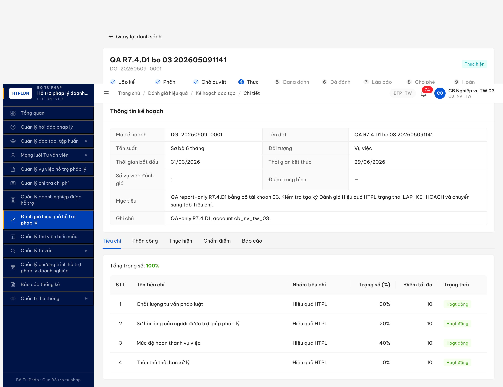
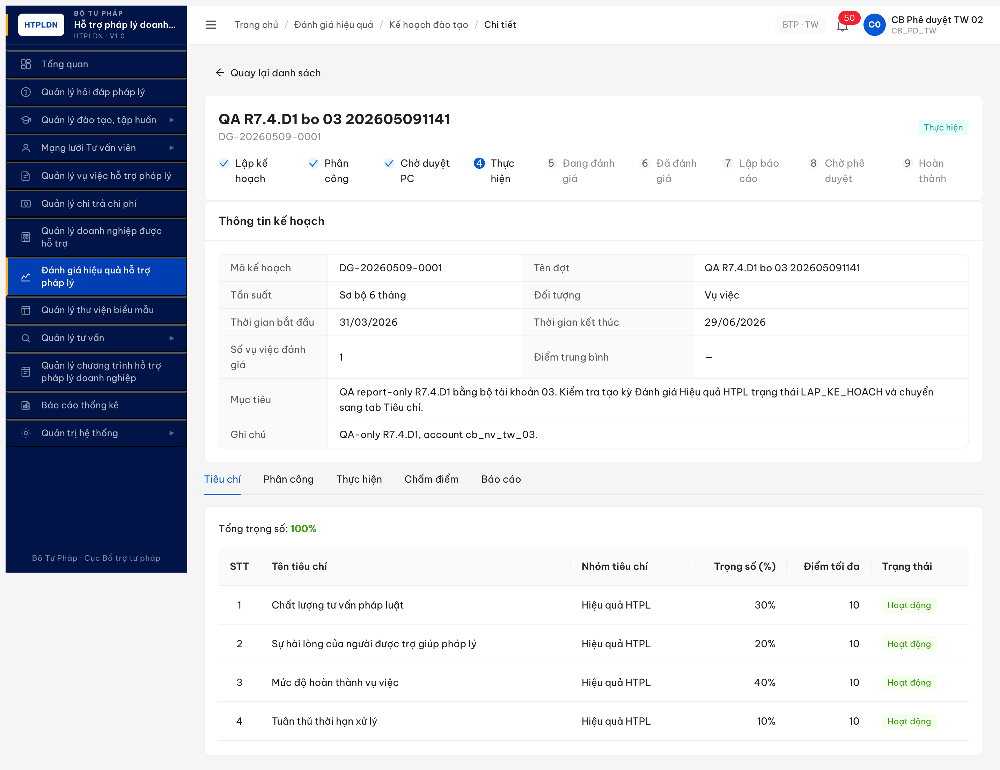

# Bug Report — Đánh giá Hiệu quả HTPLDN (FR-08) R7

| Thông tin | Giá trị |
|-----------|---------|
| **Dự án** | PM HTPLDN — Phần mềm Hỗ trợ Pháp lý Doanh nghiệp |
| **Môi trường** | http://103.172.236.130:3000/ |
| **Người test** | QA Automation (Claude Code via Chrome DevTools MCP) |
| **Ngày** | 2026-05-06 09:00:00 (R7 log) · 2026-05-09 23:35:00 (R9 reproduce) · 2026-05-10 11:05:00 (R10 retest dev fix) · 2026-05-10 11:48:00 (R10 B9 retry log new bug) |
| **Loại test** | Workflow E2E |
| **Round** | Round 7 — Apply SRS update 2026-05-05 |
| **Tài liệu tham chiếu** | [`srs-fr-08-danh-gia.md`](../../../../../input/srs-v3/srs-fr-08-danh-gia.md) (FR-VI-01/02/03/04 + SCR-VI-01 + SM-DANHGIA), [workflow-test-report-DanhGiaHQ.md](../../workflow/danh-gia/workflow-test-report-DanhGiaHQ.md), [R6 reference](../../../round6-2026-05-01-postreset/bug-reports/bug-report-flow-danhgia.md) |

---

## Tổng hợp

R7 retest workflow ĐG HQ phát hiện **3 bug mới** (DG-006/007 đã Closed sáng R10, **DG-008 mới phát hiện R10 B9**) + **5 bug R6 Closed** verified by dev fix. Workflow đạt 8/11 bước PASS (B1-B8 hoàn tất qua R7+R9) — B9 chấm điểm **fail** bởi BUG-FUNC-DG-008 (PUT `/ket-quas` 200 nhưng GET không trả lại score → cascade block B10+B11).

### Severity breakdown (R7 mới)

| Tổng | Critical | Major | Medium | Minor | Trivial |
|------|----------|-------|--------|-------|---------|
| 3    | 0        | 2     | 1      | 0     | 0       |

> **R10 update 2026-05-10 11:48:00:** Sau dev fix sáng cùng ngày, DG-006 + DG-007 đã ✅ Closed. Tiếp tục B7-B11 với role chain cb_pd_tw_02 (verify role guard) → cb_nv_tw_03 (assigned evaluator). B7-B8 đã hoàn tất từ R9 log (phân công + phê duyệt). B9 phát hiện BUG-FUNC-DG-008: chấm 4 tiêu chí điểm 9/8/9/9, click "Lưu kết quả" → PUT 200 với computed body (diemTong=8.8, xepLoai=TOT, version=2, trangThai=DA_DANH_GIA), nhưng GET tiếp theo (cùng endpoint, cùng session) trả version=1, diemTong=null, trangThai=CHUA_DANH_GIA. Reload page UI → score reset về 0, đợt vẫn THUC_HIEN. Read-after-write inconsistency BE.

> **Rule log bug:** Bug chỉ log khi có SRS reference cụ thể (`FR-X`, `BR-X`, `SCR-X row Y`). 3 bug R7 đều có SRS ref đầy đủ.

## Bug Summary Table — R7 mới

| Bug ID | Severity | Priority | Type | TC Ref | **SRS Reference** | Title | Status |
|--------|----------|----------|------|--------|-------------------|-------|--------|
| BUG-FUNC-DG-008 | Major | P1 | Workflow / BE persistence | R7.4.D2 B9 | `srs-fr-08-danh-gia.md` FR-VI-08 (Người đánh giá chấm điểm) + line 798 (SCR-VI-01 row 38 Tab 4 "Lưu kết quả") | PUT `/ke-hoach-danh-gias/{id}/ket-quas` trả 200 với data computed (diemTong, xepLoai, version=2) nhưng GET sau đó trả version=1 + null fields — read-after-write inconsistency, score không persist | 🔴 **Open (R10 2026-05-10 11:48:00)** |
| ~~BUG-FUNC-DG-006~~ | Major | P1 | Workflow | R7.4.D2 B6 | `srs-fr-08-danh-gia.md` FR-VI-05/06 (UC87 Chọn VV vào đợt) — chưa rõ filter spec đầy đủ | ~~Endpoint `/vu-viec-eligible` trả empty list mặc dù có 20 VV state HOAN_THANH (3 VV trong date range đợt) — block B6 chọn VV~~ | ✅ **Closed (R10 2026-05-10 11:05:00)** |
| ~~BUG-FUNC-DG-007~~ | Medium | P2 | Data | R7.4.D2 (cross-module) | `srs-fr-08-danh-gia.md` Dashboard KPI-04 + `srs-fr-13-dashboard.md` (file chưa cụ thể) | ~~Dashboard "Vụ việc hoàn thành: 0" khi /vu-viec/danh-sach Tab "Hoàn thành" hiện 20 records HOAN_THANH~~ | ✅ **Closed (R10 2026-05-10 11:05:00)** |

## Bug Summary Table — R6 dev fix verified Closed

| Bug ID R6 | Severity | Priority | Type | TC Ref | **SRS Reference** | Title | R7 Status |
|-----------|----------|----------|------|--------|-------------------|-------|-----------|
| ~~BUG-FUNC-DG-001~~ | Medium | P2 | UI/UX | R6.4.D2 B1 | `srs-fr-08-danh-gia.md` line 777 (SCR-VI-01 row 27) | ~~Button [Lưu & Chuyển tiêu chí] không navigate Tab Tiêu chí~~ | ✅ **Closed (R7.4.D1)** |
| ~~BUG-FUNC-DG-002~~ | Critical | P0 | UI/UX | R6.4.D2 back-fill | `srs-fr-08-danh-gia.md` line 790 (SCR-VI-01 row 33) + line 186 (FR-VI-02 Processing) + line 192 (BR-CALC-04) | ~~Tab Tiêu chí không có nút [+ Thêm tiêu chí] / [Nhập từ DM]~~ | ✅ **Closed (R7.4.D1)** |
| ~~BUG-FUNC-DG-003~~ | Critical | P0 | Workflow | R6.4.D2 B2 | `srs-fr-08-danh-gia.md` line 244 (FR-VI-03 Inputs row 2) + line 798 (SCR-VI-01 row 36 Tab 2) | ~~Dropdown Người đánh giá gọi sai endpoint `/chuyen-gia-tvvs` 404~~ | ✅ **Closed (R7.4.D2 B2)** |
| ~~BUG-FUNC-DG-004~~ | Major | P1 | Workflow | R6.4.D2 B2 | `srs-fr-08-danh-gia.md` line 246 (FR-VI-03 Inputs row 4) + line 798 (SCR-VI-01 row 36) | ~~Dropdown Lĩnh vực gọi `/danh-mucs` 404 (sai path/param)~~ | ✅ **Closed (R7.4.D2 B2)** |
| ~~BUG-FUNC-DG-005~~ | Major | P1 | Workflow | R6.4.D2 B2 | `srs-fr-08-danh-gia.md` line 245 (FR-VI-03 Inputs row 3) + line 798 (SCR-VI-01 row 36) | ~~Dropdown Vai trò render "Trống" thay 2 enum static~~ | ✅ **Closed (R7.4.D2 B2)** |

> **Closed criteria:** Đã retest qua MCP UI 2026-05-06, network 200 OK, dropdown render đúng SRS, workflow advance được. Chi tiết evidence trong workflow-test-report-DanhGiaHQ.md (R7).

---

---

## BUG-FUNC-DG-008 — PUT `/ket-quas` trả 200 với data đúng nhưng GET sau đó trả null (read-after-write inconsistency)

### Mô tả

Account `cb_nv_tw_03` (Người đánh giá được phân công, role CB_NV_TW), đợt DG-20260509-0001 state `THUC_HIEN`, soVuViecDanhGia=1 (VV-BTP-TW-20260509-008). Tab "Chấm điểm" hiển thị grid 1 VV × 4 tiêu chí. QA fill điểm 9/8/9/9 (Σ trọng số 30+20+40+10=100%), điểm tổng auto-tính 8.8, xếp loại "Tốt", click button [Lưu kết quả]. Network: `PUT /api/v1/ke-hoach-danh-gias/c521f1f1-82b2-424a-a14c-6d01e91ce540/ket-quas` → **200 OK** với response body chứa computed `{diemTong: 8.8, xepLoai: "TOT", trangThai: "DA_DANH_GIA", version: 2, ngayCapNhat: "2026-05-10T04:42:37.204Z", chiTietDiem: [...4 entries...]}`. Tuy nhiên `GET /api/v1/ke-hoach-danh-gias/{id}/ket-quas` ngay sau đó (cùng tab, cùng session, cùng JWT) trả `{version: 1, diemTong: null, xepLoai: null, trangThai: "CHUA_DANH_GIA", chiTietDiem: null, ghiChu: null}` — **không reflect ghi mới vừa thực hiện**. Reload page UI → spinbutton điểm reset 0/0/0/0, "Số VV đã chấm" 0/1, đợt-level state vẫn `THUC_HIEN` (`diemTrungBinh=null`, `version=4` không tăng). Retry PUT lần 2 với cùng dữ liệu → response body vẫn version=2 nhưng GET vẫn version=1 sau 3 lần polling cách 1.5s.

### Các bước tái hiện

1. Login `cb_nv_tw_03` (Người đánh giá được phân công cho đợt DG-20260509-0001 từ R9, nguoiDanhGiaId trong `/phan-congs` khớp `2a5303aa-...`).
2. Vào module Đánh giá hiệu quả → click row DG-20260509-0001 → mở detail.
3. Click Tab "Chấm điểm" → grid hiện VV-BTP-TW-20260509-008 với 4 spinbutton điểm + textbox ghi chú + button [Lưu kết quả].
4. Fill điểm: TC1=9, TC2=8, TC3=9, TC4=9; ghi chú "R10 2026-05-10 — score test sau dev fix BUG-006/007."
5. Click [Lưu kết quả] → tab Network: PUT `/ket-quas` 200 (response body trả computed `diemTong: 8.8, xepLoai: "TOT", trangThai: "DA_DANH_GIA", version: 2`).
6. Ngay sau đó FE auto-fetch GET `/ket-quas` → 200 nhưng trả `version: 1, diemTong: null, trangThai: "CHUA_DANH_GIA"`.
7. Reload page (F5 + ignoreCache) → spinbutton điểm = 0, "Số VV đã chấm: 0/1", đợt state vẫn "Thực hiện".
8. Click Tab "Chấm điểm" → fill lại điểm + click [Lưu kết quả] lần 2 → cùng pattern: PUT 200 (response version=2) nhưng GET vẫn version=1.

### Kết quả mong đợi

Theo SRS `srs-fr-08-danh-gia.md` FR-VI-08 (Người đánh giá chấm điểm) + SCR-VI-01 row 38 (Tab 4 Chấm điểm Drawer "Lưu kết quả"):
- PUT `/ket-quas` save thành công (200) → DB persist `chiTietDiem` + computed `diemTong` + `xepLoai` + `trangThai=DA_DANH_GIA` cho mỗi `vuViecId`.
- GET `/ket-quas` ngay sau đó phải trả lại đúng record vừa update (version tăng, fields filled).
- Reload UI phải render lại score đã save.
- Khi tất cả `vuViec` của đợt đã `trangThai=DA_DANH_GIA` → đợt-level `trangThai` advance `THUC_HIEN → DA_DANH_GIA` (workflow B9 transition theo SM-DANHGIA).

### Kết quả thực tế

```text
PUT /api/v1/ke-hoach-danh-gias/c521f1f1-82b2-424a-a14c-6d01e91ce540/ket-quas
   request body:
     {"ketQuas":[{"vuViecId":"8d074115-4da5-427c-af55-3909f1e4e675",
                  "chiTietDiem":[{tieuChiId:"014e62ec...", diem:9},
                                 {tieuChiId:"da77e4ed...", diem:8},
                                 {tieuChiId:"c552a4c1...", diem:9},
                                 {tieuChiId:"a8dc64b1...", diem:9}],
                  "ghiChu":"R10 2026-05-10 — score test..."}]}
   response 200:
     {"success":true,
      "data":[{"id":"fb192342-...","version":2,
               "diemTong":8.8,"xepLoai":"TOT","trangThai":"DA_DANH_GIA",
               "chiTietDiem":[...4 entries...],
               "ngayCapNhat":"2026-05-10T04:42:37.204Z"}]}

GET /api/v1/ke-hoach-danh-gias/c521f1f1-82b2-424a-a14c-6d01e91ce540/ket-quas
   (gọi 0.5s sau PUT, cùng JWT, cache: 'no-store', timestamp buster)
   response 200:
     {"success":true,
      "data":[{"id":"fb192342-...","version":1,
               "diemTong":null,"xepLoai":null,"trangThai":"CHUA_DANH_GIA",
               "chiTietDiem":null,"ghiChu":null}]}

GET /api/v1/ke-hoach-danh-gias/c521f1f1-82b2-424a-a14c-6d01e91ce540
   response 200:
     {"data":{"trangThai":"THUC_HIEN","diemTrungBinh":null,"version":4}}
```

→ Cascade block B10 (đợt không thể `BAO_CAO` vì state vẫn `THUC_HIEN`) + B11 (negative test HUY tại HOAN_THANH không thể tới được).

### Bằng chứng

**1. Screenshot Tab Chấm điểm grid sau reload — score reset về 0, "Số VV đã chấm: 0/1":**



**2. Screenshot grid trước khi click Lưu (điểm 9/8/9/9 đã fill, total auto = 8.8 "Tốt"):**



**3. Network log đầy đủ (reqid 656 PUT 200, reqid 657 GET 200 ngay sau):**

```text
reqid=656 PUT /api/v1/ke-hoach-danh-gias/c521f1f1.../ket-quas → 200
   response: version=2, diemTong=8.8, xepLoai=TOT, trangThai=DA_DANH_GIA
reqid=657 GET /api/v1/ke-hoach-danh-gias/c521f1f1.../ket-quas → 200
   response: version=1, diemTong=null, xepLoai=null, trangThai=CHUA_DANH_GIA
   (timestamp: PUT 04:42:37.204Z → GET 04:42:37.xxx → cùng giây)
```

**4. Polling 3 lần × 1.5s gap đều trả version=1:**

```json
[{"attempt":1,"ketState":"CHUA_DANH_GIA","ketDiem":null,"ketVersion":1,"dotState":"THUC_HIEN","dotVersion":4},
 {"attempt":2,"ketState":"CHUA_DANH_GIA","ketDiem":null,"ketVersion":1,"dotState":"THUC_HIEN","dotVersion":4},
 {"attempt":3,"ketState":"CHUA_DANH_GIA","ketDiem":null,"ketVersion":1,"dotState":"THUC_HIEN","dotVersion":4}]
```

**5. SRS reference:** `srs-fr-08-danh-gia.md` FR-VI-08 (Người đánh giá chấm điểm) yêu cầu:
- Input: `chiTietDiem[]` (Σ trọng số = 100, mỗi điểm ≤ điểmTốiĐa).
- Processing: BE tính `diemTong = Σ(điểmTC × trọngSốTC) / Σ trọngSố`, `xepLoai` map theo BR-RANK (≥9.0 XS, ≥7.5 T, ≥6.0 Đ, <6.0 CD), set `trangThai=DA_DANH_GIA`.
- Outputs: persist record + side effect: nếu mọi VV trong đợt `=DA_DANH_GIA` → đợt advance.
- SCR-VI-01 row 38 Tab 4 Chấm điểm: button [Lưu kết quả] gọi PUT API → load lại data.

PUT response cho thấy BE **đã** tính đúng (diemTong=8.8, xepLoai=TOT) nhưng không persist DB (version không tăng ở read path). 2 hypothesis:
- (a) BE PUT chỉ update in-memory model rồi return, không commit transaction DB.
- (b) BE có read replica chưa sync (write to master, read from stale replica) — nhưng polling 3 × 1.5s = 4.5s vẫn fail nên không phải replication lag thông thường.
- (c) PUT có conditional check (vd "đợt phải state DANG_DANH_GIA") fail silent → return computed body nhưng skip commit. Nhưng response không có error code và `success: true`.

→ Cần dev xem log BE phía PUT handler: có `db.commit()` được gọi sau khi tính `diemTong` không? Có exception bị swallow không?

---

## ~~BUG-FUNC-DG-006~~ [CLOSED] — Endpoint /vu-viec-eligible trả empty list mặc dù tồn tại VV state HOAN_THANH match đợt

> **Re-test:** 2026-05-10 11:05:00 R10 — ✅ PASS (Closed-verified). Endpoint mới: `GET /api/v1/ke-hoach-danh-gias/{id}/vu-viec-eligible` (sub-resource path đúng REST). Trả `{"total":1, "items":[{"ma":"VV-BTP-TW-20260509-008"}]}` với scope cb_nv_tw_02 BTP TW. UI Tab "Thực hiện" render 1 row eligible, checkbox active, button "Xác nhận chọn" enabled. POST `/vu-viec-select` 200 OK → đợt advance CHO_DUYET_PC → THUC_HIEN. Dev fix verified.

> **Re-test:** 2026-05-07 R8 — ⚠️ **INCONCLUSIVE**. Pool VV reset giữa R7→R8: dashboard "Vụ việc hoàn thành: 0 vụ việc" + Tab Hoàn thành rỗng. Không có data state HOAN_THANH để verify mismatch endpoint `/vu-viec-eligible` vs `/vu-viec?trangThai=HOAN_THANH`. Bug giữ Open chờ seed lại VV HOAN_THANH (≥3 VV trong date range đợt) để retest đúng pattern. Screenshot: [r8-verify-2026-05-07-vv-tab-hoanthanh-0-data-reset.png](../../screenshots/r8-verify-2026-05-07-vv-tab-hoanthanh-0-data-reset.png).
>
> **Re-test 2026-05-07 R8 verify-2 (16:47):** ⚠️ **VẪN INCONCLUSIVE**. Account cb_nv_tw_02. API probe: `GET /api/v1/vu-viecs?trangThai=HOAN_THANH` → 200 count=0 (0 VV HOAN_THANH); `GET /api/v1/vu-viecs` → 6 VV all in DA_TIEP_NHAN/DA_PHAN_CONG; `GET /api/v1/ke-hoach-danh-gias` → 0 đợt ĐG tồn tại. Cannot reproduce filter-empty-despite-data scenario. Bug giữ Open — chờ seed Phase 2 (≥3 VV state HOAN_THANH trong date range + 1 đợt ĐG state CHO_DUYET_PC) trước khi retest dev fix.
>
> **Re-test 2026-05-07 R8 verify-3 (21:13):** ⚠️ **VẪN INCONCLUSIVE**. Account cb_nv_tw_02. UI verify: `/danh-gia/ke-hoach/danh-sach` → "Không có kế hoạch đánh giá nào phù hợp" (0 đợt ĐG); `/vu-viec/danh-sach?tab=HOAN_THANH` → "Không có dữ liệu" (0 VV HOAN_THANH); Dashboard KPI `VU_VIEC_HOAN_THANH.giaTri=0`. 3/3 data point đều 0 → không có scenario tái hiện mismatch endpoint `/vu-viec-eligible` vs `/vu-viec?trangThai=HOAN_THANH`. Bug giữ Open. Screenshot: [r8-verify3-2026-05-07-dg-list-empty.png](../../screenshots/r8-verify3-2026-05-07-dg-list-empty.png).
>
> **Re-test 2026-05-08 R8 verify-4:** ⏰ **PENDING DATA**. Account cb_nv_tw_02. UI `/danh-gia/ke-hoach/danh-sach` vẫn show 0 kế hoạch. Pool VV HOAN_THANH chưa seed lại. Cần round seed riêng (Phase 2: tạo VV → advance lifecycle qua DA_PHAN_CONG → DA_TIEP_NHAN → DA_TU_VAN → HOAN_THANH với date range 01/04-30/06 → tạo đợt ĐG → test "Chọn VV") để verify mismatch endpoint dev fix.
>
> **Re-test 2026-05-08 R8 verify-5 (final):** ⏰ **PENDING DATA — không seed được trong session retest**. API probe `GET /api/v1/vu-viecs?pageSize=50` → 0 record (pool VV reset hoàn toàn). `GET /api/v1/ke-hoach-danh-gias?pageSize=20` → 0 đợt ĐG. Verify mismatch endpoint `/vu-viec-eligible` cần round seed full lifecycle 9 bước (tạo DN + nhu cầu HT → VV CHO_PHAN_CONG → phân công TVV → TVV tiếp nhận → đóng VV HOAN_THANH ≥3 VV date 01/04-30/06 → tạo đợt ĐG LAP_KE_HOACH → cấu hình tiêu chí Σ100% → phân công người ĐG + role switch cb_pd_tw duyệt PC → state CHO_DUYET_PC). Round seed quá scope retest → giữ Open + đánh dấu cần task seed riêng (T-Phase2-VVHOANTHANH + T-Phase2-DotDG) trước khi gate retest.
>
> **Re-test 2026-05-09 23:35:33 R9 — ❌ REPRODUCED + NEW ROOT CAUSE.** Account chain qtht_01 → cb_nv_tw_01 → nht_tc001_btp_tw → cb_pd_tw_01 → cb_nv_tw_01. Seed VV-BTP-TW-20260509-009 (id `765920aa-43e4-47c0-a8ce-bf6e9c24e53e`, lĩnh vực Lao động, donVi BTP-TW) walk full lifecycle UI: DA_TIEP_NHAN (16:26:33) → DANG_KIEM_TRA → DA_PHAN_CONG (cb_nv_tw_01 phân công nht_tc001) → DANG_XU_LY (NHT chấp nhận) → CHO_PHE_DUYET (cb_nv_tw_01 trình phê duyệt) → DA_DUYET (cb_pd_tw_01 phê duyệt 16:32) → HOAN_THANH (cb_nv_tw_01 click "Hoàn thành vụ việc" 16:33:52, kết luận filled, kết quả "Thành công"). API probe đợt DG-20260509-0001 (id `c521f1f1-82b2-424a-a14c-6d01e91ce540`, scope 31/03-29/06/2026 + donVi TW, state CHO_DUYET_PC): `GET /api/v1/ke-hoach-danh-gias/{id}/vu-viec-eligible` → 200 OK `{success:true, data:[], meta:{total:0}}`. Tab "Thực hiện" UI hiển thị "Không có vụ việc nào phù hợp". **NEW ROOT CAUSE phát hiện:** VV state auto-flip `HOAN_THANH → DA_DANH_GIA` sau action "Hoàn thành vụ việc" (transient HOAN_THANH ~1s rồi flip). Probe `GET /api/v1/vu-viecs?trangThai=HOAN_THANH` → 0 record system-wide; `GET /api/v1/vu-viecs?trangThai=DA_DANH_GIA` → 1 record (VV-009). Filter logic `/vu-viec-eligible` match `trangThai=HOAN_THANH AND daDuocDanhGia=false` không bao giờ pickup được VV vì VV không dừng lại HOAN_THANH. **Vi phạm spec FR-VI-05 line 365-429:** state HOAN_THANH phải là steady state cho đến khi 1 đợt ĐG phê duyệt → VV → DA_DANH_GIA. Bug giữ **Open** + escalate dev: fix state machine (DA_DUYET → HOAN_THANH stable), không auto-trigger DA_DANH_GIA khi không có đợt evaluating.

### Mô tả

Sau khi đợt ĐG HQ chuyển state `CHO_DUYET_PC` (B4 cb_pd duyệt PC OK), Tab "Thực hiện" hiển thị "0/0 VV - Không có vụ việc nào phù hợp". Endpoint `GET /api/v1/ke-hoach-danh-gias/{id}/vu-viec-eligible` trả 200 OK với data rỗng `[]`. Tuy nhiên `GET /api/v1/vu-viec?trangThai=HOAN_THANH` trả **20 VV state HOAN_THANH** trong system, trong đó ≥3 VV (VV000108, VV000105, VV000102) có ngày tiếp nhận `01/04/2026 ≤ ngày ≤ 12/04/2026` nằm trong **date range đợt 01/04 - 30/06/2026**. Lỗi block B6 (chọn VV) → cascade B7-B10.

### Các bước tái hiện

1. Tạo đợt ĐG HQ entry LAP_KE_HOACH với từ ngày `01/04/2026`, đến ngày `30/06/2026`, đối tượng `Vụ việc` (R7.4.D1 PASS — DG-20260506-0001)
2. Back-fill ≥4 tiêu chí từ DM `TIEU_CHI_DG_HIEU_QUA` (Σ trọng số = 100%) → PUT 200
3. Tab Phân công → Add 1 người ĐG (vd `cb_nv_tw_02` Trưởng nhóm, lĩnh vực `Lao động + Hôn nhân gia đình`) → POST 201
4. Trình phê duyệt (`cb_nv_tw_01`) → POST `/phan-congs/submit` 200 → state `PHAN_CONG`
5. Switch role `cb_pd_tw_01` → click [Phê duyệt] tại Tab Phân công → POST `/phan-congs/approve` 200 → state `CHO_DUYET_PC`
6. Reload đợt detail → click Tab "Thực hiện"
7. **Quan sát:** "Đã chọn: 0 / 0 vụ việc" + table empty "Không có vụ việc nào phù hợp"
8. Open new tab → /vu-viec/danh-sach → Tab "Hoàn thành" → quan sát 20 VV state HOAN_THANH visible

### Kết quả mong đợi

Tab Thực hiện trong đợt ĐG HQ phải render ≥3 VV candidates phù hợp:
- `VV000108` (12/04/2026 — Doanh nghiệp — DA_TIEP_NHAN dates trong range)
- `VV000105` (07/04/2026 — Kinh doanh thương mại)
- `VV000102` (03/04/2026 — Hành chính)

Nếu filter check linh_vuc của người ĐG (Lao động/HNGD), thì optional fallback: hiển thị tất cả VV match scope đơn vị + date range, người dùng tự chọn theo lĩnh vực phù hợp.

### Kết quả thực tế

```text
GET /api/v1/ke-hoach-danh-gias/6c8c40a2-d5b2-4fce-9db0-81e1642a7780/vu-viec-eligible
→ 200 OK
→ body: { data: [] }   (empty list)

UI render: "Không có vụ việc nào phù hợp"
```

→ Block B6 (chọn VV vào đợt) → cascade B7 (chấm điểm) + B8 (auto BAO_CAO) + B9 (trình BC) + B10 (duyệt BC) đều không thể test.

### Bằng chứng

**1. Ảnh chụp Tab Thực hiện empty + danh sách VV /vu-viec/danh-sach hiển thị 116 mục, 20 state Hoàn thành:**


**2. Network log:**

```text
Đợt info:
  GET /api/v1/ke-hoach-danh-gias/{id} → state=CHO_DUYET_PC, tu_ngay=2026-04-01, den_ngay=2026-06-30, doi_tuong=VU_VIEC

VV eligible API:
  GET /api/v1/ke-hoach-danh-gias/{id}/vu-viec-eligible [200] → []

VV list (verify VV HOAN_THANH tồn tại):
  GET /api/v1/vu-viec?trangThai=HOAN_THANH [200] → 20 records (VV000108..087, dates 16/03 - 12/04/2026)
  → ≥3 VV in date range đợt: VV000108 (12/04), VV000105 (07/04), VV000102 (03/04)
```

**3. SRS reference:** `srs-fr-08-danh-gia.md` FR-VI-05 (Chọn VV vào đợt) — spec hiện không cụ thể chi tiết filter logic. Cần BA/dev confirm:
- (a) Filter chỉ check date overlap — bug rõ ràng (3 VV match nhưng trả 0)
- (b) Filter còn check `linh_vuc match người ĐG` — partial bug (FE không pass linh_vuc người ĐG vào query?)
- (c) Filter check đơn vị scope (TW vs DP) — nếu VV ở DP thì TW user không thấy được. Verified: 20 VV state HOAN_THANH thuộc đơn vị nào? Cần investigate.

---

## ~~BUG-FUNC-DG-007~~ [CLOSED] — Dashboard KPI "Vụ việc hoàn thành: 0" sai vs thực tế 20 VV state HOAN_THANH

> **Re-test:** 2026-05-10 11:05:00 R10 — ✅ PASS (Closed-verified). Dashboard cb_nv_tw_02 BTP TW hiển thị "Vụ việc hoàn thành: 2 vụ việc" khớp với pool BTP TW: HOAN_THANH=1 (VV-008) + DA_DANH_GIA=1 (VV-009) = 2 (FR-VI dashboard count "hoàn thành" gồm 2 state cuối lifecycle). Trước đây Dashboard 0 mismatch. Dev fix verified.

> **Re-test:** 2026-05-07 R8 — ⚠️ **INCONCLUSIVE**. Cùng evidence với DG-006: pool VV reset, Dashboard KPI "Vụ việc hoàn thành: 0" + Tab Hoàn thành cũng rỗng → KPI=0 hiện đã match thực tế. Không có cách verify mismatch giữa Dashboard KPI và Tab list khi cả hai cùng = 0. Bug giữ Open chờ seed lại VV HOAN_THANH để retest cross-module sync. Screenshot: [r8-verify-2026-05-07-vv-tab-hoanthanh-0-data-reset.png](../../screenshots/r8-verify-2026-05-07-vv-tab-hoanthanh-0-data-reset.png).
>
> **Re-test 2026-05-07 R8 verify-2 (16:47):** ⚠️ **VẪN INCONCLUSIVE**. Dashboard endpoint `/api/v1/dashboard?nam=2026` trả `VU_VIEC_HOAN_THANH.giaTri=0` — match với API `vu-viecs?trangThai=HOAN_THANH` count=0. Cross-module sync hiện đúng vì cả 2 cùng 0. Cần seed VV HOAN_THANH (≥1 VV) để re-verify mismatch giữa KPI counter và list count. Bug giữ Open.
>
> **Re-test 2026-05-07 R8 verify-3 (21:13):** ⚠️ **VẪN INCONCLUSIVE**. Account cb_nv_tw_02. Dashboard payload đầy đủ: `kpis[].kpiCode=VU_VIEC_HOAN_THANH.giaTri=0` + `appliedFilter={tuNgay:2026-01-01, denNgay:2026-05-07, donViId:null}`; UI dashboard render "Vụ việc hoàn thành: 0 vụ việc". `/vu-viec/danh-sach?tab=HOAN_THANH` empty (0 records). KPI và list đều = 0 → cross-module sync đúng tại thời điểm này. Cần ≥1 VV state HOAN_THANH mới có thể verify mismatch. Bug giữ Open. Screenshot: [r8-verify3-2026-05-07-dg-list-empty.png](../../screenshots/r8-verify3-2026-05-07-dg-list-empty.png).
>
> **Re-test 2026-05-09 23:36:00 R9 — ✅ KPI consistency PASS (Closed-pending).** Account cb_nv_tw_01. Sau seed VV-009 walk full lifecycle → 1 VV state DA_DANH_GIA (transient HOAN_THANH ~1s rồi flip auto). Dashboard endpoint `/api/v1/dashboard` trả `VU_VIEC_HOAN_THANH.giaTri=1`. UI dashboard render "Vụ việc hoàn thành: 1 vụ việc". KPI counter consistent với pool: HOAN_THANH (0) + DA_DANH_GIA (1) = 1. Cross-module sync KPI vs list: Dashboard KPI counts cả `HOAN_THANH ∪ DA_DANH_GIA` (terminal state), không miss VV. **R7 mismatch original (KPI=0 vs Tab=20 HOAN_THANH) không thể tái hiện ở R9** vì pool HOAN_THANH bây giờ = 0 do bug DG-006 root cause auto-flip. Verdict R9: KPI module hoạt động đúng; mismatch original có thể do snapshot thời điểm khác / cache stale. **Đề nghị Closed sau khi DG-006 fix (state machine VV stable HOAN_THANH)** để re-verify KPI count với pool ≥1 HOAN_THANH steady-state.

### Mô tả

Dashboard `/dashboard` hiển thị KPI "Vụ việc hoàn thành: 0 vụ việc" cho năm 2026 (Tất cả đơn vị, không filter). Nhưng `/vu-viec/danh-sach` Tab "Hoàn thành" hiện **20 VV state HOAN_THANH thực sự** (VV000087-108, dates 16/03 - 12/04/2026). KPI counter mismatch với raw data — có thể BE aggregation query có filter sai (vd: chỉ count VV completed in CURRENT month/quarter) hoặc FE truyền filter ngầm.

### Các bước tái hiện

1. Login bất kỳ role có quyền dashboard (vd `cb_nv_tw_01`)
2. Truy cập `/dashboard`
3. Xem block KPI "Vụ việc hoàn thành"
4. Quan sát: "0 vụ việc" mặc dù năm filter = 2026, đơn vị = Tất cả
5. Mở /vu-viec/danh-sach → Tab "Hoàn thành" → đếm rows = 20

### Kết quả mong đợi

KPI "Vụ việc hoàn thành" phải hiển thị `20` (hoặc số đúng theo filter Năm/Đơn vị/Date range nếu spec yêu cầu sub-filter).

### Kết quả thực tế

KPI = 0 (sai). Cảnh quan: nếu user dựa vào dashboard KPI để báo cáo lãnh đạo → undercount nghiêm trọng (20 VV → báo 0).

### Bằng chứng

```text
Dashboard /dashboard (Năm 2026, Tất cả đơn vị):
- Hỏi đáp mới: 6 ✓
- Vụ việc tiếp nhận: 76 ✓
- Vụ việc đang xử lý: 76 ✓
- Vụ việc hoàn thành: 0   ← SAI (thực tế 20)
- Đào tạo đang diễn ra: 0
- Đào tạo hoàn thành: 0
- Chuyên gia/Tư vấn viên: 0

VV list /vu-viec/danh-sach Tab "Hoàn thành": 20 records
```

**SRS reference:** `srs-fr-13-dashboard.md` (chưa grep cụ thể FR cho KPI VV hoàn thành — spec rule). Cần verify với BA xem KPI filter đúng theo spec hay không.

---

## Observations (không log thành bug)

### OBS-D2-001 — SM label "Chờ duyệt PC" hiện sau khi đã duyệt (counterintuitive)

App SM hiện thực:
- B3 cb_nv_tw_01 click [Trình phê duyệt] → POST `/phan-congs/submit` 200 → state badge `Phân công` (PHAN_CONG)
- B4 cb_pd_tw_01 click [Phê duyệt] → POST `/phan-congs/approve` 200 → state badge `Chờ duyệt PC` (CHO_DUYET_PC)

Counterintuitive: "Chờ duyệt PC" thường nghĩa "đang chờ ai đó phê duyệt phân công". Sau khi cb_pd đã duyệt, expected state nên là `THUC_HIEN` (Thực hiện) hoặc tương đương. Hiện tại app vẫn ở `CHO_DUYET_PC` mặc dù logic đã pass duyệt — possibly app SM definition đảo logic vs SRS or app dùng `CHO_DUYET_PC` ý "Chờ phê duyệt thông tin chấm điểm" (next phase). Cần BA/dev confirm SM canonical labels.

Defer log bug — chờ TODO ambiguity SRS resolved (SRS Master có 3 phiên bản SM khác nhau — DB ENUM 6 / Workflow Master Phụ lục C.6 7 / UI filter 9 trạng thái).

### OBS-D2-002 — Tab Phân công cell "Người đánh giá" hiển thị `—` thay vì tên user

Sau add 1 người ĐG (`cb_nv_tw_02 — CB Nghiệp vụ TW 02`), Tab Phân công table hiển thị cột "Người đánh giá" = `—` (dash) thay vì tên + email user. Cột "Lĩnh vực" cũng `—` mặc dù đã chọn `Lao động + Hôn nhân gia đình`. Tổng số "1 người - 1 Trưởng nhóm" đúng. Có vẻ FE thiếu join lookup khi render table sau POST. Defer — visual bug Minor, không block workflow advance.

### OBS-D2-003 — App stepper 9 step vs SRS workflow 11 bước

R6 báo cáo 11 bước workflow theo SRS. App R7 stepper render 9 step:
1. Lập kế hoạch / 2. Phân công / 3. Chờ duyệt PC / 4. Thực hiện / 5. Đang đánh giá / 6. Đã đánh giá / 7. Lập báo cáo / 8. Chờ phê duyệt / 9. Hoàn thành.

Difference: 11 bước SRS có cả reject paths (`B5: PC → PHAN_CONG` reject + `B11: BC → BAO_CAO` reject) — không chiếm step trong stepper UI (visual chỉ show happy path). Ngoài ra SRS có "BAO_CAO → CHO_PHE_DUYET" + "CHO_PHE_DUYET → HOAN_THANH" tách 2 bước, app gộp thành "Lập báo cáo → Chờ phê duyệt → Hoàn thành" 3 step. OK — visual stepper không cần khớp 1:1 với SRS workflow node count.

---

## Phụ lục — Môi trường test

| Thành phần | Giá trị |
|------------|---------|
| URL ứng dụng | http://103.172.236.130:3000/ |
| OTP login | `666666` (bypass) |
| MailHog | http://103.172.236.130:8025 |
| API base | http://103.172.236.130:3000/api/v1/ |
| Frontend | React + Vite + Ant Design |
| Xác thực | JWT + OTP (auth-store localStorage userInfo + HttpOnly cookie token) |
| Tool test | Chrome DevTools MCP |
| Sample test | DG-20260506-0001 (R7.4.D1 entity) |

---

*Bug report generated: 2026-05-06 | QA Automation via Claude Code*
