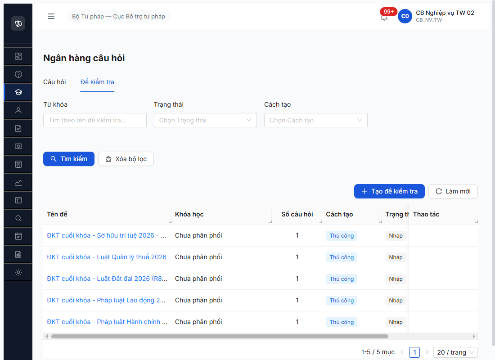
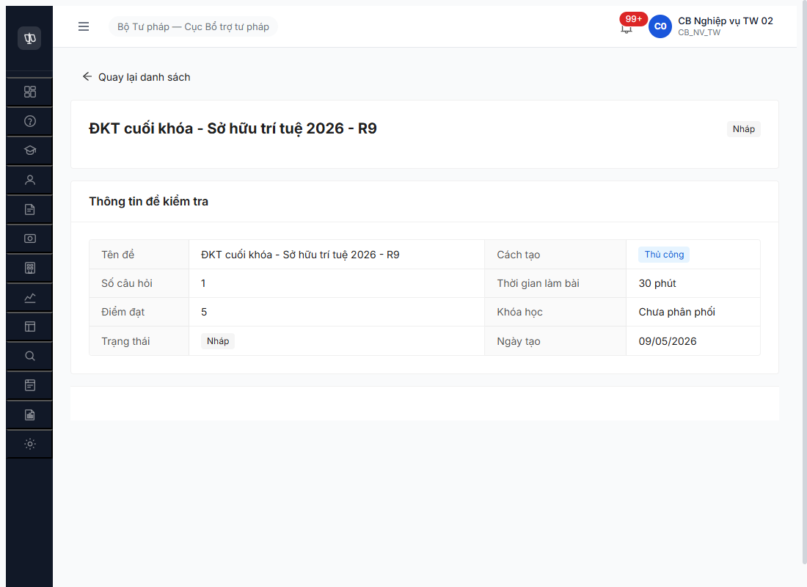

# Bug Report — Đề kiểm tra (R7.4.B10 R9)

| Thông tin | Giá trị |
|-----------|---------|
| **Dự án** | PM HTPLDN |
| **Môi trường** | http://103.172.236.130:3000/ |
| **Người test** | QA Automation via Claude Code (MCP) |
| **Ngày** | 2026-05-10 |
| **Loại test** | Workflow (R7.4.B10) — re-verify R9 |
| **Round** | Round 7 — R9 follow-up |
| **Tài liệu tham chiếu** | [tasks/todo-dao-tao.md R7.4.B10](../../../../tasks/todo-dao-tao.md) · [SRS FR-III-NEW-02 + FR-III-NEW-03](../../../../input/srs-v3/srs-fr-03-dao-tao.md) · [workflow-test-report-r7-4-b10-r9.md](../../workflow/dao-tao/workflow-test-report-r7-4-b10-r9.md) |

---

## Tổng hợp

2-source verify: NotebookLM HTPLDN (id `a4ae45bf-cea0-4325-8fee-b1e0be702cf2`) + grep `srs-v3/srs-fr-03-dao-tao.md` line 1094-1138 local.

Phát hiện R9 (2026-05-10) khi re-probe R7.4.B10 — block reason R8 ("chờ R7.4.B7 khóa học DANG_DIEN_RA") sai. Block thật sự là **FE thiếu render action buttons** dù BE endpoints đã sẵn sàng.

### Severity breakdown

| Tổng | Critical | Major | Medium | Minor | Trivial | Closed | Open |
|------|----------|-------|--------|-------|---------|--------|------|
| 1    | 0        | 1     | 0      | 0     | 0       | 1      | 0    |

> **Quy tắc đếm:**
> - `Tổng` = tổng số dòng bug trong **Bug Summary Table** (kể cả Closed strikethrough).
> - 5 cột severity (Critical / Major / Medium / Minor / Trivial) tổng = `Tổng`.
> - `Closed` + `Open` = `Tổng`. `Open` đếm Status ∈ {Open, Reopen}; `Closed` đếm Status ∈ {Closed, ~~closed~~}.
> - Update bảng này **sau MỖI lần đóng/mở bug** (cùng nhịp với rename Pass- prefix).

## Bug Summary Table

| Bug ID | Severity | Priority | Type | TC Ref | **SRS Reference** | Title | Status |
|--------|----------|----------|------|--------|-------------------|-------|--------|
| ~~BUG-DKT-FE-REGRESSION-01~~ | Major | P1 | UI/FE | R7.4.B10 | `srs-fr-03-dao-tao.md FR-III-NEW-02 line 1094-1113 + FR-III-NEW-03 line 1117-1138` | FE thiếu render action buttons (Sửa/Xóa/Phân phối/Trình duyệt) cho ĐKT — list row Thao tác cell rỗng + detail page chỉ "Quay lại" | **Closed** (R10 verified, fix qua commit `ab0f24b6` stale-fixed sweep) |

---

## ~~BUG-DKT-FE-REGRESSION-01~~ [CLOSED] — FE thiếu render action buttons cho ĐKT

> **Re-test:** 2026-05-10 R10 — ✅ PASS (Closed-verified). Sau cache clear + fresh login `cb_nv_tw_02`, navigate Quản lý đào tạo → Ngân hàng câu hỏi & Đề kiểm tra → tab "Đề kiểm tra":
> - **List row Thao tác cell:** giờ render đầy đủ **3 button** `edit / send / delete` cho mọi 5 ĐKT NHAP (R8 baseline 4 + R9 add 1 SHTT) — không còn cell rỗng.
> - **Detail page action area** (ĐKT "Sở hữu trí tuệ 2026 - R9", state Nháp): có **3 button đầy đủ** + Quay lại:
>   - `edit Chỉnh sửa` (uid 34_20)
>   - `send Phân phối` (uid 34_21) — match SRS FR-III-NEW-03
>   - `delete Xóa` (uid 34_22) — match SRS FR-III-NEW-02
>   - `arrow-left Quay lại danh sách` (uid 34_0)
>
> Match SRS spec: FR-III-NEW-02 line 1094-1113 (Sửa+Xóa) + FR-III-NEW-03 line 1117-1138 (Phân phối). Không có button "Trình duyệt" — vì state machine ĐKT không có CHO_DUYET (chỉ NHAP → DA_PHAN_PHOI), match SRS. Fix theo `_qa-summary-2026-05-10.md` line 174 stale-fixed sweep commit `ab0f24b6`. Screenshot: [r10-verify-2026-05-10-dkt-fe-regression-detail-3-buttons.png](../../screenshots/r10-verify-2026-05-10-dkt-fe-regression-detail-3-buttons.png).

### Mô tả

Trang danh sách ĐKT (`/dao-tao/ngan-hang-cau-hoi/danh-sach?tab=de-kiem-tra`) có column header "Thao tác" nhưng cell content render `<div class="ant-space"></div>` rỗng — không có icon Sửa/Xóa/Phân phối. Trang chi tiết ĐKT (`/dao-tao/de-kiem-tra/{id}`) chỉ có button "Quay lại danh sách", thiếu toàn bộ action button (Chỉnh sửa, Xóa, Phân phối vào khóa học, Trình duyệt). BE endpoints đều tồn tại + responding 422 với valid validation errors → bottleneck là FE.

### Bước tái hiện

1. Login `cb_nv_tw_02 / Secret@123` + OTP `666666` (account có đủ permissions: `update_de_kiem_tra`, `delete_de_kiem_tra`, `publish_de_kiem_tra` per `/auth/me`).
2. Sidebar → Quản lý đào tạo → Ngân hàng câu hỏi & Đề kiểm tra → tab "Đề kiểm tra".
3. List hiển thị 5 ĐKT NHAP (4 R8 baseline + 1 R9 SHTT) — column "Thao tác" header có nhưng row cell rỗng.
4. Click vào row "ĐKT cuối khóa - Sở hữu trí tuệ 2026 - R9" → vào trang detail.
5. Detail page hiển thị Thông tin (Tên, Số câu, Cách tạo, Trạng thái Nháp, Khóa học = "Chưa phân phối") nhưng không có action button nào ngoài "Quay lại danh sách".

### Kết quả mong đợi

Theo SRS:

- `FR-III-NEW-02 line 1094-1113`: ĐKT NHAP phải có action **Sửa** + **Xóa (chưa sử dụng)** + xem chi tiết. Acceptance criteria line 1112-1113 yêu cầu CB NV sửa/xóa được khi đề chưa phân phối/chưa sử dụng.
- `FR-III-NEW-03 line 1117-1138`: ĐKT NHAP có khóa học tồn tại phải có action **Phân phối** + chọn khóa học + map bài giảng. Preconditions line 1126: chỉ cần "Đề kiểm tra ở NHAP. Khóa học tồn tại" — **không yêu cầu khóa học DANG_DIEN_RA**.

UI list row Thao tác phải có ít nhất 3 icon: Sửa, Xóa, Phân phối. UI detail page phải có ít nhất 3 button tương ứng + state transition button (nếu state machine có CHO_DUYET).

### Kết quả thực tế

**List row Thao tác cell:**

```html
<td>
  <div class="ant-space css-... ant-space-horizontal ant-space-align-center ..."></div>
</td>
```

→ `ant-space` placeholder rỗng, không có button con.

**Detail page action area:**

```
uid=67_0 button "arrow-left Quay lại danh sách"
uid=67_1 heading "ĐKT cuối khóa - Sở hữu trí tuệ 2026 - R9"
uid=67_2 StaticText "Nháp"
... (chỉ static text về thông tin)
```

→ chỉ duy nhất 1 button "Quay lại danh sách" trong main area.

**BE endpoint probe (R9 2026-05-10):**

| Endpoint | Method | Status R9 | Note |
|---|:-:|:-:|---|
| `/api/v1/de-kiem-tras/{id}/distribute` | POST | 422 | Endpoint sống, thiếu field `version` (optimistic locking) |
| `/api/v1/de-kiem-tras/{id}` | PATCH | 422 | Endpoint sống, thiếu field `version` |
| `/api/v1/de-kiem-tras/{id}/phan-phoi` | POST | 404 | Path không exist (FE nếu có gọi sai) |
| `/api/v1/de-kiem-tras/{id}/assign` | POST | 404 | Path không exist |

→ BE đúng spec FR-III-NEW-03 endpoint name = `distribute` (FE phải gọi đúng path này).

### Bằng chứng





DOM inspection log (R9 probe via `evaluate_script`):
```js
// First row last cell (Thao tác column)
firstRowCells[6] = {
  i: 6,
  text: "",                                 // empty
  btnCount: 0,                              // no buttons
  btnInfo: []
}

// Detail page action area
mainButtons = [
  { text: "Quay lại danh sách", visible: true, disabled: false }
  // chỉ 1 button, không có Sửa/Xóa/Phân phối/Trình duyệt
]
```

### So sánh

- **R8 report ([workflow-test-report-r7-4-b10-dkt.md](../../workflow/dao-tao/workflow-test-report-r7-4-b10-dkt.md))** ghi 6/8 PASS bao gồm sửa + xóa. R9 không reproduce được → FE regression giữa R8 → R9, HOẶC R8 dùng API direct trước khi user áp policy "must be UI" 2026-05-09.
- **CTĐT ([SCR-III-01](../../../../input/srs-v3/srs-fr-03-dao-tao.md))** UI cùng spec dạng "list row + detail page actions" đã render đúng — có button Sửa/Xóa/Trình duyệt/Phê duyệt/Công khai (verified R7.4.B0 + R7.4.B1 R9). Chỉ ĐKT thiếu render → bug confined ở component `DeKiemTra*Page`.
