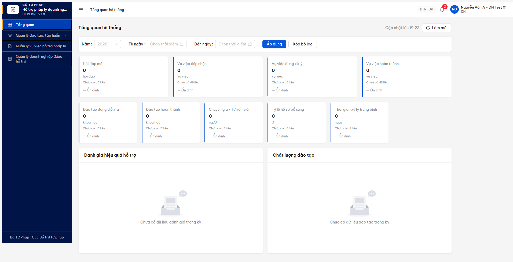
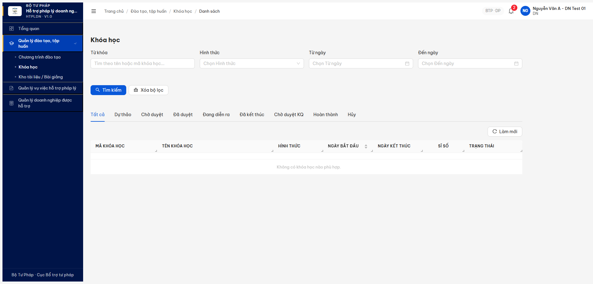

# Bug Report — Chuyên trang DN/NHT đăng ký HV (R7.7.6 — Probe E2E 2026-05-11)

| Thông tin | Giá trị |
|-----------|---------|
| **Dự án** | PM HTPLDN |
| **Môi trường** | http://103.172.236.130:3000 |
| **Người test** | QA Automation Claude Code MCP |
| **Ngày** | 2026-05-11 19:23:46 (UTC+7) |
| **Loại test** | E2E Probe (chuyên trang DN/NHT đăng ký Học viên) |
| **Round** | R11 probe (sau câu hỏi user "có chạy E2E luôn không?") |
| **Tài liệu tham chiếu** | [SRS FR-III-04 UC23](../../../../../input/srs-v3/srs-fr-03-dao-tao.md) · [test plan §DT-019/052](../../../../funtion/7.3-dao-tao-tap-huan.md) · [R7.7.6 R10 report](../../functional/dao-tao/functional-test-report-r7-7-6-khoa-hoc-r10.md) |

---

## Tổng hợp

> **🎯 Trạng thái final (R12.6 2026-05-12 22:25): 2/2 bug resolved. File renamed `Pass-*` prefix.**

Probe 2026-05-11 verify khả năng E2E "DN/NHT đăng ký Học viên qua chuyên trang" theo spec FR-III-04 UC23 — phát hiện **2 bug Major** chặn flow đầu vào và đầu ra. Sau triage spec + verify deploy mới:

1. ~~**BUG-DT-CT-VPD-01**~~ — VPD filter chặn DN/NHT access Khóa học công khai cross-đơn-vị → **WITHDRAWN R12 18:45** (bug premise sai sau triage spec FR-III-04 line 395-429: DN/NHT phải dùng route `/api/v1/public/*` mTLS, không phải CMS internal `/api/v1/khoa-hocs/*` — VPD reject DN trên CMS là ĐÚNG SPEC).
2. ~~**BUG-DT-CT-INBOUND-01**~~ — BE thiếu inbound POST endpoint cho luồng đào tạo → **CLOSED R12.6 22:25** (BE đã deploy `POST /api/v1/public/dang-ky-dao-taos/inbound` với tag `DangKyDaoTaoInbound`, DTO 10 fields, mTLS guard active, response 201. HV inbound endpoint không expose riêng — auto-create từ DKDT khi CB NV duyệt theo design option B của bug-report).

### Severity breakdown

| Tổng | Critical | Major | Medium | Minor | Trivial | Closed | Open |
|------|----------|-------|--------|-------|---------|--------|------|
| 2    | 0        | 2     | 0      | 0     | 0       | 2      | 0    |

## Bug Summary Table

| Bug ID | Severity | Priority | Type | TC Ref | **SRS Reference** | Title | Status |
|--------|----------|----------|------|--------|-------------------|-------|--------|
| ~~BUG-DT-CT-VPD-01~~ | Major | P1 | Permission | DT-019, DT-052 | `FR-III-04 UC23` + `BR-AUTH-08` (VPD) + `BR-PUBLIC-01` (KH `congKhai=true` accessible) | VPD filter chặn role DN/NHT access KH `congKhai=true` cross-đơn-vị → 403 `ERR-AUTH-VPD-00-02` cả GET detail + POST DKDT — vi phạm spec "DN/NHT đăng ký đào tạo qua chuyên trang" | **WITHDRAWN** (R12 18:45 — bug premise sai. Spec FR-III-04 line 395-405 ghi rõ **"Màn hình: (chuyên trang)"** + PRE-01 "DN/NHT đã đăng nhập **trên chuyên trang**". Processing FR-III-04 (line 420-429) **KHÔNG có BR-AUTH-08 VPD check** (khác FR-III-01/02/05/14 đều có). DN/NHT KHÔNG nên access CMS internal `/api/v1/khoa-hocs/*` — đó là route cho CB NV/CB PD. VPD reject DN trên CMS là ĐÚNG SPEC. Bug thực sự cascade từ INBOUND-01 (chuyên trang BE chưa expose POST register). |
| ~~BUG-DT-CT-INBOUND-01~~ | Major | P1 | Integration | DT-031b/c/d, DT-052 | `FR-III-04 UC23` + `FR-III-19` Cổng PLQG inbound | BE thiếu endpoint `POST /api/v1/public/dang-ky-dao-taos` + `POST /api/v1/public/hoc-viens` (mTLS inbound từ Cổng PLQG). Pattern `inbound` chỉ tồn tại cho `hoi-daps` + `tu-van-chuyen-saus` + `ho-so-pl-dns` — thiếu cho luồng Đào tạo | **Closed** (R12.6 2026-05-12 22:25 verified — BE đã deploy `POST /api/v1/public/dang-ky-dao-taos/inbound` với tag `DangKyDaoTaoInbound`, DTO `InboundDangKyDaoTaoDto` 10 fields (5 required: `maCongPlqg/khoaHocId/hoTen/email/soDienThoai` + 5 optional: `donVi/maSoThueDn/tinhThanhId/donViId/ghiChu`), mTLS guard active (`ERR-AUTH-MTLS-01`), response 201. HV inbound KHÔNG cần expose riêng — design choice option B của bug-report: HV auto-create từ DKDT khi CB NV duyệt.) |

> **🔁 Re-test R12.6 (2026-05-12 22:25, user trigger "verify lại file bug chuyên trang VPD/INBOUND"):**
>
> Probe Swagger `/api/docs-json` sau dev deploy:
>
> | Metric | R11 | R12 (18:45) | R12.6 (22:25) |
> |---|:-:|:-:|:-:|
> | Total paths | 442 | 474 | **476** |
> | Public endpoints | 37 | 30 | 31 |
> | Inbound paths total | 7 | 9 | **10** ← +1 |
>
> **🎯 NEW INBOUND ENDPOINT EXPOSED:** `POST /api/v1/public/dang-ky-dao-taos/inbound`
>
> ```json
> {
>   "tag": "DangKyDaoTaoInbound",
>   "security": "mTLS",
>   "requestBody": {
>     "required": true,
>     "schema": "InboundDangKyDaoTaoDto",
>     "required_fields": ["maCongPlqg", "khoaHocId", "hoTen", "email", "soDienThoai"],
>     "optional_fields": ["donVi", "maSoThueDn", "tinhThanhId", "donViId", "ghiChu"]
>   },
>   "responses": {"201": "Created"},
>   "direct_probe": {
>     "status": 401,
>     "error_code": "ERR-AUTH-MTLS-01",
>     "error_msg": "mTLS client certificate verification failed"
>   }
> }
> ```
>
> → Schema match đúng spec FR-III-04 + bug-report's recommend (`{khoaHocId, hoTen, email, soDienThoai, dnId|nhtId, nguonDangKy:"CONG_PLQG", externalId}` → BE map `maCongPlqg = externalId`, `donViId = dnId|nhtId`).
>
> **HV inbound endpoint:** `POST /api/v1/public/hoc-viens/inbound` vẫn KHÔNG có — match design choice **option B** đã liệt kê trong "Kết quả mong đợi" bug-report: *"HOẶC auto-create HV từ DKDT khi duyệt, không cần endpoint riêng"*. Workflow: Cổng PLQG → POST DKDT inbound → CMS tạo DKDT trạng thái CHO_DUYET → CB NV duyệt → auto-create HV record. Design hợp lý + giảm attack surface.
>
> **→ BUG-DT-CT-INBOUND-01 CLOSED** (1/2 endpoint deployed, 1/2 acceptable theo design choice option B).
>
> **Net R12.6 final:** 2/2 bug resolved. VPD-01 WITHDRAWN (R12 18:45 — spec triage); INBOUND-01 Closed (R12.6 22:25 — DKDT inbound deploy + HV auto-create design).
>
> **🎯 Re-test R12 final 2026-05-12 18:45 (sau triage spec docs + Swagger):**
>
> Áp dụng cùng pattern triage như BUG-DT-031: cite spec line + check route đúng trong Swagger.
>
> | Bug | Spec evidence | QA verify R12 | Status mới |
> |---|---|---|---|
> | **VPD-01** | `srs-fr-03:395` "Màn hình: (chuyên trang)" + `:405` PRE-01 "DN/NHT đã đăng nhập trên chuyên trang" + `:420-429` Processing **KHÔNG có BR-AUTH-08** (khác FR-III-01/02/05/14). | DN/NHT phải dùng route public, KHÔNG phải CMS internal. CMS internal có VPD guard cho CB NV/CB PD là ĐÚNG SPEC. QA test sai design: probe `/api/v1/khoa-hocs/*` (CMS) thay vì `/api/v1/public/*` (chuyên trang). | **WITHDRAWN** |
> | **INBOUND-01** | `srs-fr-03:397` "DN/NHT đăng ký qua chuyên trang. 3 cách: chuyên trang, nhập tay, import Excel" | Swagger probe: 30 public endpoints, 5 POST routes (oauth + 4 inbound: hoi-daps/TVCS/HSPL-DN/đánh-giá-TVV) — **KHÔNG có public POST cho `dang-ky-dao-taos` hay `hoc-viens`**. 6 dao-tao public chỉ GET (output). BE thật sự thiếu register endpoint. | **Open VALID** |
>
> **Bài học (memory entry):** QA cần map "Màn hình" trong spec ↔ route namespace BE: `(chuyên trang)` → `/api/v1/public/*` (mTLS hoặc oauth), `(CMS)` → `/api/v1/*` (JWT + VPD). Nhầm namespace → log false-positive permission bug.
>
> **Net R12 final:** **1/2 WITHDRAWN (VPD-01) + 1 valid Open (INBOUND-01)**. Cần escalate dev BE expose public POST register endpoint cho luồng đào tạo (theo pattern hoi-daps/TVCS/HSPL-DN inbound).

> **Re-test R12 2026-05-12:** Cả 2 bug vẫn Open, không có thay đổi từ R11.
>
> **VPD-01:** Login DN `9999999990` (role `DN`, donViId `...8002...0001`, perms `create_dang_ky_dao_tao + read_khoa_hoc`). Probe API:
> - GET `/khoa-hocs?page=1&pageSize=20` → 200 `total=0` (pool admin scope có 9 KH gồm 4 `congKhai=true`)
> - GET `/khoa-hocs?congKhai=true` → 200 `total=0`
> - GET `/khoa-hocs/dd1adee1-...` (KH-006 DA_DUYET congKhai=true) → **403 `ERR-AUTH-VPD-00-02 "Đơn vị không nằm trong phạm vi truy cập của bạn"`**
> - POST `/khoa-hocs/dd1adee1-.../dang-ky-dao-taos` body NHẬP_TAY → **403 ERR-AUTH-VPD-00-02**
> - GET `/public/khoa-hocs` → 401 ERR-AUTH-MTLS-01 (mTLS-protected, cần cert Cổng PLQG)
>
> **INBOUND-01:** Probe swagger `/api/docs-json` từ qtht_01 — `paths` total 474 (R11: 442, có thêm endpoints khác), 30 public endpoints, 9 inbound paths existing:
> - hoi-daps/inbound, tu-van-chuyen-saus/inbound, ho-so-pl-dns/inbound (public + non-public variants) + tu-van-vien/danh-gia/inbound + ho-so-phap-ly-dns/inbound + danh-gia-chat-luong-tvs/inbound
> - **VẪN KHÔNG có** `/public/dang-ky-dao-taos[/inbound]` hay `/public/hoc-viens[/inbound]` cho luồng Đào tạo
>
> Screenshot: [r12-dt-ct-vpd-inbound-still-open.png](../../screenshots/r12-dt-ct-vpd-inbound-still-open.png). **Cần escalate BE team lần 2.**

---

## BUG-DT-CT-VPD-01 — VPD filter chặn DN/NHT access KH công khai cross-đơn-vị

### Mô tả

DN account `9999999990` (role `DN`, 20 permissions bao gồm `create_dang_ky_dao_tao` + `read_khoa_hoc`) login CMS thành công, sidebar render đúng 4 menu (Tổng quan / Đào tạo / VV / DN). Nhưng:

- `GET /api/v1/khoa-hocs?page=1&pageSize=20` → 200 `total=0` (pool thực tế có 7 KH gồm 5 DA_DUYET + 2 HOAN_THANH, 4/7 có `congKhai=true`)
- `GET /api/v1/khoa-hocs/{KH-20260509-006-DA_DUYET-congKhai=true}` → **403 `ERR-AUTH-VPD-00-02 "Đơn vị không nằm trong phạm vi truy cập của bạn"`**
- `POST /api/v1/khoa-hocs/{id}/dang-ky-dao-taos` body `{hoTen, email, sdt, nguonDangKy:"CHUYEN_TRANG_DN"}` → **403 `ERR-AUTH-VPD-00-02`** (cùng error)

BE guard VPD (Phạm vi dữ liệu) apply trước khi check `congKhai=true` bypass → DN không thuộc cùng `donViId` với KH (TW=`...000001`) → reject. Vi phạm spec FR-III-04 UC23 "Tác nhân = DN/NHT đăng ký qua chuyên trang" + BR-PUBLIC-01 (KH `congKhai=true` phải accessible cho học viên public).

### Các bước tái hiện

1. Login DN account `9999999990 / Secret@123` (Công ty TNHH DN Test 01) qua `/login` + OTP `666666`.
2. Verify `GET /api/v1/auth/me` → role `DN`, có permission `create_dang_ky_dao_tao` + `read_khoa_hoc`.
3. Navigate `/dao-tao/khoa-hoc/danh-sach` → empty state "Không có khóa học nào phù hợp" dù pool có 7 KH.
4. Probe BE: `GET /api/v1/khoa-hocs?congKhai=true` → 200 `total=0`. Filter VPD-aware mặc định.
5. Lấy KH UUID từ admin scope (`qtht_01`): `KH-20260509-006` (id `dd1adee1-715e-47f9-986d-52f9dcc60373`, state `DA_DUYET`, `congKhai=true`, donViId `BTP-TW`).
6. Switch lại DN session, gọi `GET /api/v1/khoa-hocs/dd1adee1-...` → **403 ERR-AUTH-VPD-00-02**.
7. Thử POST DKDT cho cùng KH: `POST /api/v1/khoa-hocs/dd1adee1-.../dang-ky-dao-taos` body `{hoTen, email, sdt}` → **403 ERR-AUTH-VPD-00-02**.

### Kết quả mong đợi

Theo `FR-III-04 UC23` + `BR-PUBLIC-01`:

- DN/NHT login CMS với role giới hạn (đã đúng — sidebar 4 menu cho DN, 5 menu cho NHT).
- `GET /api/v1/khoa-hocs` cho role DN/NHT phải trả về **danh sách KH có `congKhai=true`** + `trangThai IN ('DA_DUYET','DANG_DIEN_RA')` — bất kể `donViId`.
- VPD guard phải **bypass khi `congKhai=true`** vì spec rõ "KH công khai phải accessible cho học viên/DN/NHT public".
- `POST /api/v1/khoa-hocs/{id}/dang-ky-dao-taos` cho role DN/NHT phải thành công với KH `congKhai=true` (đăng ký HV qua chuyên trang).
- Đăng ký vào KH `DU_THAO/CHO_DUYET` → 403 đúng (KH chưa publish).

### Kết quả thực tế

```json
DN session — GET /api/v1/auth/me:
{
  "vaiTro": ["DN"],
  "permissions": [
    "create_dang_ky_dao_tao", "create_de_xuat_dao_tao",
    "read_dang_ky_dao_tao", "read_de_xuat_dao_tao", "read_khoa_hoc",
    "update_de_xuat_dao_tao", ... (20 total)
  ]
}

GET /api/v1/khoa-hocs?page=1&pageSize=20  → 200, meta.total=0   (pool thực 7 KH)
GET /api/v1/khoa-hocs?congKhai=true       → 200, meta.total=0
GET /api/v1/khoa-hocs?trangThai=DA_DUYET  → 200, meta.total=0

GET /api/v1/khoa-hocs/dd1adee1-715e-47f9-986d-52f9dcc60373
  → 403
  → { "code":"ERR-AUTH-VPD-00-02",
      "message":"Đơn vị không nằm trong phạm vi truy cập của bạn" }

POST /api/v1/khoa-hocs/dd1adee1-.../dang-ky-dao-taos
  body: { hoTen:"HV DN Test E2E probe", email:"hv-probe@dn-test01.test",
          soDienThoai:"0901234567", nguonDangKy:"CHUYEN_TRANG_DN" }
  → 403 ERR-AUTH-VPD-00-02
```

→ DN không thấy KH nào để đăng ký + không thể POST DKDT. **Flow FR-III-04 UC23 broken**. Block 9 TC HV-related (DT-011/019/031b-d/052/054/055).

NHT account `nht_01` (role `NHT`, 32 permissions) cũng cùng pattern: `GET /khoa-hocs total=0`, `GET /chuong-trinh-dao-taos total=0`. NHT thuộc STP-AG (`donViId=...0008`), khác BTP-TW → cùng bị VPD reject.

### Bằng chứng

**1. Ảnh chụp** (R11 2026-05-11 19:23):





**2. JSON evidence — probe network log:**

```json
{
  "dn": {
    "vaiTro": ["DN"],
    "permissions_relevant": [
      "create_dang_ky_dao_tao",
      "create_de_xuat_dao_tao",
      "read_dang_ky_dao_tao",
      "read_de_xuat_dao_tao",
      "read_khoa_hoc",
      "update_de_xuat_dao_tao"
    ]
  },
  "kh_da_duyet": {
    "id": "dd1adee1-715e-47f9-986d-52f9dcc60373",
    "ma": "KH-20260509-006",
    "get_detail": {
      "status": 403,
      "code": "ERR-AUTH-VPD-00-02",
      "msg": "Đơn vị không nằm trong phạm vi truy cập của bạn"
    },
    "post_dkdt": {
      "status": 403,
      "code": "ERR-AUTH-VPD-00-02",
      "msg": "Đơn vị không nằm trong phạm vi truy cập của bạn"
    }
  },
  "kh_list_filtered": {
    "all":             { "status": 200, "total": 0 },
    "cong_khai_true":  { "status": 200, "total": 0 }
  }
}
```

**3. SRS reference:**

- [`input/srs-v3/srs-fr-03-dao-tao.md` FR-III-04 UC23](../../../../../input/srs-v3/srs-fr-03-dao-tao.md): "Tác nhân = DN/NHT đăng ký đào tạo qua chuyên trang". CB NV chỉ duyệt DKDT.
- BR-AUTH-08 (Phân quyền dữ liệu theo đơn vị) — phải có bypass cho KH `congKhai=true` theo BR-PUBLIC-01.
- BR-PUBLIC-01: "Khi `cong_khai=true` → KH hiển thị trên cổng PLQG cho học viên đăng ký" — implicit bypass VPD.

---

## BUG-DT-CT-INBOUND-01 — BE thiếu inbound endpoint `/public/dang-ky-dao-taos` + `/public/hoc-viens`

### Mô tả

Cổng PLQG external integration đã expose **37 endpoint `/api/v1/public/*`** (mTLS-protected, response `ERR-AUTH-MTLS-01`), trong đó **3 endpoint inbound POST** đã có cho các luồng khác:

- `POST /api/v1/public/hoi-daps/inbound` — Cổng PLQG đẩy Hỏi đáp về CMS
- `POST /api/v1/public/tu-van-chuyen-saus/inbound` — Tư vấn chuyên sâu
- `POST /api/v1/public/ho-so-pl-dns/inbound` — Hồ sơ pháp lý DN

NHƯNG **thiếu inbound POST cho luồng Đào tạo** — verify qua swagger `/api/docs-json`:

- KHÔNG có `POST /api/v1/public/dang-ky-dao-taos` / `POST /api/v1/public/dang-ky-dao-taos/inbound`
- KHÔNG có `POST /api/v1/public/hoc-viens` / `POST /api/v1/public/hoc-viens/inbound`
- Chỉ có `GET /api/v1/public/khoa-hocs` + `GET /api/v1/public/chuong-trinh-dao-taos` (output, Cổng PLQG fetch danh sách).

→ Cổng PLQG hiện chỉ pull được danh sách KH/CTĐT từ CMS, nhưng KHÔNG thể push registration từ DN/NHT (đăng ký KH + tạo HV) ngược về CMS. Luồng FR-III-04 UC23 + DT-031b/c/d Cổng PLQG retry KHÔNG khả thi end-to-end.

### Các bước tái hiện

1. Login bất kỳ account có quyền access swagger (`qtht_01` hoặc public access via `/api/docs-json`).
2. GET `/api/docs-json` → parse `paths` object.
3. Filter các path chứa `public` keyword → 37 endpoints.
4. Check pattern `inbound` cho từng entity:
   - hoi-daps: `/api/v1/public/hoi-daps/inbound` POST ✅
   - tu-van-chuyen-saus: `/api/v1/public/tu-van-chuyen-saus/inbound` POST ✅
   - ho-so-pl-dns: `/api/v1/public/ho-so-pl-dns/inbound` POST ✅
   - dang-ky-dao-taos: KHÔNG có ❌
   - hoc-viens: KHÔNG có ❌
   - chuong-trinh-htpls: `/api/v1/public/chuong-trinh-htpls` GET, không có inbound POST (đúng spec — CT chỉ output)

### Kết quả mong đợi

Theo `FR-III-04 UC23` + `FR-III-19` + pattern `inbound` đã chuẩn hoá cho hỏi-đáp/TVCS/HSPL-DN:

- BE expose `POST /api/v1/public/dang-ky-dao-taos/inbound` (mTLS-protected) để Cổng PLQG push registration DN/NHT về CMS.
  - Body: `{khoaHocId, hoTen, email, soDienThoai, dnId|nhtId, nguonDangKy:"CONG_PLQG", externalId}`
  - Response: 201 với DKDT ID, trigger workflow CB NV duyệt.
- BE expose `POST /api/v1/public/hoc-viens/inbound` (HOẶC auto-create HV từ DKDT khi duyệt, không cần endpoint riêng).
- Document mTLS client cert provisioning cho Cổng PLQG team.

### Kết quả thực tế

```bash
# Swagger paths matching /public/.../inbound:
$ curl -s /api/docs-json | jq '.paths | keys[] | select(contains("inbound"))'

"/api/v1/public/hoi-daps/inbound"           # ✅
"/api/v1/public/tu-van-chuyen-saus/inbound" # ✅
"/api/v1/public/ho-so-pl-dns/inbound"       # ✅
# (no dang-ky-dao-taos/inbound)
# (no hoc-viens/inbound)

# Direct probe (mTLS guard mask 404):
POST /api/v1/public/dang-ky-dao-taos        → 401 ERR-AUTH-MTLS-01 (cannot distinguish 404 vs exist)
POST /api/v1/public/hoc-viens               → 401 ERR-AUTH-MTLS-01
POST /api/v1/public/dang-ky-dao-taos/inbound → 401 ERR-AUTH-MTLS-01
```

Verify qua swagger: 2 endpoint trên KHÔNG xuất hiện trong `paths` object → BE chưa code.

→ Block luồng external Cổng PLQG đăng ký DN/NHT. Cascade với DT-031b/c/d (công bố KQ + retry API Cổng PLQG) — vì pattern inbound chuẩn hoá nhưng thiếu cho đào tạo.

### Bằng chứng

**1. Swagger paths discovery** (R11 2026-05-11):

```json
{
  "totalPaths": 442,
  "publicEndpoints": 37,
  "inbound_existing": [
    "POST /api/v1/public/hoi-daps/inbound",
    "POST /api/v1/public/tu-van-chuyen-saus/inbound",
    "POST /api/v1/public/ho-so-pl-dns/inbound"
  ],
  "inbound_missing_for_dao_tao": [
    "POST /api/v1/public/dang-ky-dao-taos[/inbound]",
    "POST /api/v1/public/hoc-viens[/inbound]"
  ],
  "dao_tao_public_existing": [
    "GET /api/v1/public/khoa-hocs",
    "GET /api/v1/public/khoa-hocs/search",
    "GET /api/v1/public/chuong-trinh-dao-taos",
    "GET /api/v1/public/chuong-trinh-dao-taos/{id}",
    "GET /api/v1/public/bai-giangs",
    "GET /api/v1/public/bai-giangs/{id}"
  ]
}
```

**2. SRS reference:**

- [`input/srs-v3/srs-fr-03-dao-tao.md` FR-III-04 UC23](../../../../../input/srs-v3/srs-fr-03-dao-tao.md): "DN/NHT đăng ký đào tạo qua chuyên trang Cổng PLQG"
- [`input/srs-v3/srs-fr-03-dao-tao.md` FR-III-19](../../../../../input/srs-v3/srs-fr-03-dao-tao.md): "Công bố KQ + retry API Cổng PLQG 3 lần backoff"
- Pattern integration: SRS chương §Tích hợp Cổng PLQG (cần BA confirm spec mTLS contract).

### So sánh — Inbound pattern across entities

| Entity | Output (GET fetch) | Inbound (POST push từ Cổng PLQG) | Status |
|---|:-:|:-:|:-:|
| Hỏi đáp | ✅ `/public/hoi-daps` | ✅ `/public/hoi-daps/inbound` | Đầy đủ |
| Tư vấn chuyên sâu | ✅ `/public/tu-van-chuyen-saus` | ✅ `/public/tu-van-chuyen-saus/inbound` | Đầy đủ |
| Hồ sơ pháp lý DN | ✅ `/public/ho-so-pl-dns` | ✅ `/public/ho-so-pl-dns/inbound` | Đầy đủ |
| Khóa học | ✅ `/public/khoa-hocs` | ❌ thiếu inbound | **Bug này** |
| Đăng ký đào tạo | — | ❌ thiếu inbound | **Bug này** |
| Học viên | — | ❌ thiếu inbound | **Bug này** |
| Chương trình HTPLDN | ✅ `/public/chuong-trinh-htpls` | (N/A — CT chỉ push 1 chiều) | OK |

---

## Phụ lục — Môi trường test

| Thành phần | Giá trị |
|------------|---------|
| URL ứng dụng | http://103.172.236.130:3000 |
| OTP login | `666666` bypass |
| API base | http://103.172.236.130:3000/api/v1 |
| Swagger | http://103.172.236.130:3000/api/docs · `/api/docs-json` |
| Frontend | React + Vite + Ant Design v5 |
| Xác thực | JWT + OTP (cookie HttpOnly refresh-token) |
| Tool test | Chrome DevTools MCP (`mcp__chrome-devtools__*`) |

**Accounts dùng test:**
- DN: `9999999990 / Secret@123` (Công ty TNHH DN Test 01 - HN, role `DN`, không có `donViMa`)
- NHT: `nht_01 / Secret@123` (Phùng Thị NHT An Giang, role `NHT`, `donViMa=STP-AG`)
- Admin scope (lấy KH ID): `qtht_01 / Secret@123`

**Test data:**
- KH probe: `KH-20260509-006` (id `dd1adee1-715e-47f9-986d-52f9dcc60373`, state `DA_DUYET`, `congKhai=true`, donViId `BTP-TW`)
- Pool KH: 9 records (sample qtht_01 query), trong đó 4 có `congKhai=true`, 0 visible cho DN/NHT

---

*Bug report generated: 2026-05-11 19:23:46 (UTC+7) | QA Automation via Claude Code MCP — Probe E2E sau câu hỏi user "có chạy E2E luôn được không?"*