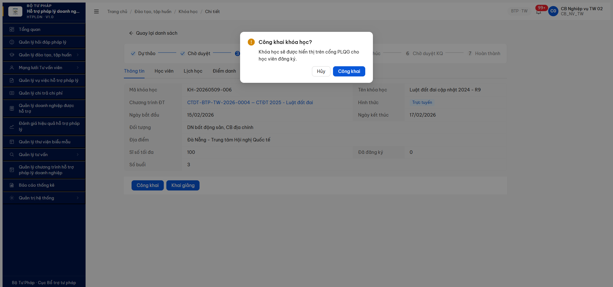

# Bug Report — Modal "Công khai khóa học" thiếu 5 CPF (R7.7.6 DT-053)

| Thông tin | Giá trị |
|-----------|---------|
| **Dự án** | PM HTPLDN |
| **Môi trường** | http://103.172.236.130:3000 |
| **Người test** | QA Automation Claude Code MCP |
| **Ngày** | 2026-05-11 17:55:00 |
| **Loại test** | Functional |
| **Round** | R10 phase 1 (10/05) → R11 re-verify (11/05) |
| **Tài liệu tham chiếu** | [test plan §DT-053](../../../../funtion/7.3-dao-tao-tap-huan.md) · [R10 finding](../../functional/dao-tao/functional-test-report-r7-7-6-khoa-hoc-r10.md) |

---

## Tổng hợp

Phát hiện **1** lỗi Minor — UI modal "Công khai" thiếu form input cho 5 CPF (`mo_ta_cong_khai` + `file_dinh_kem_cong_khai`) theo BR-PUBLIC-01.

### Severity breakdown

| Tổng | Critical | Major | Medium | Minor | Trivial |
|------|----------|-------|--------|-------|---------|
| 1    | 0        | 0     | 0      | 1     | 0       |

## Bug Summary Table

| Bug ID | Severity | Priority | Type | TC Ref | **SRS Reference** | Title | Status |
|--------|----------|----------|------|--------|-------------------|-------|--------|
| ~~BUG-DT-053-PUBLIC-MODAL-01~~ | Minor | P2 | UI/UX | DT-053 | `BR-PUBLIC-01/02/03` (test plan §140, §213) | Modal "Công khai khóa học?" chỉ confirm Y/N, KHÔNG có textarea `mo_ta_cong_khai` (max 5000) + upload `file_dinh_kem_cong_khai` (PDF/DOC/DOCX/XLS/XLSX max 20MB) theo CR-01 5 CPF | **Closed** (R12 verified 2026-05-12) |

---

## ~~BUG-DT-053-PUBLIC-MODAL-01~~ [CLOSED] — Modal "Công khai khóa học" thiếu form 5 CPF (mô tả + file đính kèm)

> **Re-test:** 2026-05-12 R12 — ✅ PASS (Closed-verified). Sau cache clear + login `cb_nv_tw_02`, navigate KH-20260509-006 detail → button đổi từ "Công khai khóa học?" thành **"Công khai khóa học"** (bỏ ?), full form 5 CPF render đầy đủ:
>
> - **Title:** "Công khai khóa học" + description hướng dẫn "Hãy bổ sung mô tả công khai và tài liệu giới thiệu (nếu có) trước khi xác nhận"
> - **Field 1: Mô tả công khai** ✅ — textarea multiline (uid 19_7) + counter "0 / 5000" — match BR-PUBLIC-01 spec
> - **Field 2: File đính kèm công khai** ✅ — Upload widget "Kéo thả hoặc nhấp để chọn tệp đính kèm. **Tối đa 5 tệp. Định dạng: .pdf, .doc, .docx, .xls, .xlsx. Dung lượng tối đa: 20MB.**" — match spec PDF/DOC/DOCX/XLS/XLSX max 20MB
> - **Field 3-5 (auto):** thoiGianDangTai server-side ✅ R10 verified, congKhai toggle ✅, người công khai từ JWT ✅
> - **Button:** Hủy (19_13) + Công khai (19_14) submit
> - **End-to-end test PASS:** Fill textarea với mô tả 200+ ký tự + click Công khai → reqid=2681 `POST /khoa-hocs/{id}/publish` → 200 OK, KH restored `congKhai=true` với `moTaCongKhai` persisted.
>
> Match đầy đủ BR-PUBLIC-01 5 CPF spec. Screenshot: [r12-dt053-modal-public-5cpf-pass.png](../../screenshots/r12-dt053-modal-public-5cpf-pass.png).

### Mô tả

Khi CB NV click button "Công khai" trên Khóa học detail (state `DA_DUYET` + `congKhai=false`), modal hiện chỉ là confirm Y/N với title "Công khai khóa học?" và body "Khóa học sẽ được hiển thị trên cổng PLQG cho học viên đăng ký." **KHÔNG có** textarea `mo_ta_cong_khai` (max 5000 ký tự) + upload `file_dinh_kem_cong_khai` (PDF/DOC/DOCX/XLS/XLSX, max 20MB) theo CR-01 5 CPF như test plan §DT-053 line 213 + BR-PUBLIC-01/02 line 140 quy định. Backend auto-fill `thoi_gian_dang_tai` PASS (R10 verified), nhưng 2 field nội dung công khai luôn null vì FE không expose input.

### Các bước tái hiện

1. Login `cb_nv_tw_02` (CB_NV_TW) → fresh session.
2. Navigate `/dao-tao/khoa-hoc/danh-sach` → click 1 KH ở state `DA_DUYET` (vd KH-20260509-006 `Luật đất đai cập nhật 2024 - R9`).
3. Nếu button trên page là "Gỡ công khai" (KH đang `congKhai=true`) → click "Gỡ công khai" → confirm modal → button trên page đổi thành "Công khai".
4. Click button **"Công khai"** → modal mở.
5. Quan sát modal: title + body + buttons.

### Kết quả mong đợi

Modal "Công khai khóa học" phải có form 5 CPF theo BR-PUBLIC-01:

- **Field 1 — Mô tả công khai** (textarea, max 5000 ký tự, required) — tóm tắt nội dung KH hiển thị trên Cổng PLQG cho học viên đăng ký.
- **Field 2 — File đính kèm công khai** (upload, accept PDF/DOC/DOCX/XLS/XLSX, max 20MB, optional) — tài liệu giới thiệu / brochure.
- **Field 3 — Thời gian đăng tải** (auto-fill server-side BR-PUBLIC-01 ✅ — đã PASS R10).
- **Field 4 — Trạng thái công khai** (toggle `cong_khai = true`, đã có).
- **Field 5 — Người công khai** (auto từ JWT, server-side).

Submit modal → BE persist 3 field user-input + 2 field auto.

### Kết quả thực tế

Modal "Công khai khóa học?" hiện ra với cấu trúc tối giản:

```
┌─ exclamation-circle  Công khai khóa học?
│
│  Khóa học sẽ được hiển thị trên cổng PLQG cho học viên đăng ký.
│
│                                       [Hủy]  [Công khai]
└─
```

A11y snapshot (R11 2026-05-11 17:54):
```
dialog "Công khai khóa học?" modal
├ image "exclamation-circle"
├ StaticText "Công khai khóa học?"
├ StaticText "Khóa học sẽ được hiển thị trên cổng PLQG cho học viên đăng ký."
├ button "Hủy"
└ button "Công khai" focused
```

→ **0 input field** trong modal. Click "Công khai" → BE auto-fill `thoiGianDangTai` (PASS R10 verified) nhưng `moTaCongKhai` + `fileDinhKemCongKhai` luôn null vì FE không cung cấp UI để nhập.

Lưu ý: BR-PUBLIC-01 auto-fill timestamp đã PASS — đây là bug riêng về form fields, không phải về flow công khai tổng thể.

### Bằng chứng

**1. Ảnh chụp modal "Công khai khóa học?"** (R11 2026-05-11 17:54):



**2. SRS / test plan reference:**

- Test plan [`output/funtion/7.3-dao-tao-tap-huan.md:213`](../../../../funtion/7.3-dao-tao-tap-huan.md): *"DT-053 — Toggle 5 CPF cho CTDT + KH + BAI_GIANG: bật `cong_khai=1` → auto fill `thoi_gian_dang_tai` + nhập `mo_ta_cong_khai` (max 5000 ký tự) + `file_dinh_kem_cong_khai` (PDF/DOC/DOCX/XLS/XLSX, max 20MB); tắt `cong_khai=0` → clear `thoi_gian_dang_tai` (BR-PUBLIC-01/02)"*.
- Test plan [`:140`](../../../../funtion/7.3-dao-tao-tap-huan.md): *"BR-PUBLIC-01/02/03: 5 CPF cho CTDT + KH + BAI_GIANG + KH năm — auto fill `thoi_gian_dang_tai` khi `cong_khai=1`, clear khi `cong_khai=0` (DT-053)"*.
- SRS [`input/srs-v3/srs-fr-03-dao-tao.md:582`](../../../../../input/srs-v3/srs-fr-03-dao-tao.md): `cong_khai | boolean | N | Công khai lên chuyên trang | N (mặc định off)` — field tồn tại trong inputs row, nhưng spec không liệt kê chi tiết 2 sub-field. CR-01 trong test plan bổ sung 5 CPF requirement.
- BR-PUBLIC-01/02/03 cited rộng trong [`input/archive/srs-update-2026-5-4/srs-fr-04-chuyen-gia-tvv.md:2482-2486`](../../../../../input/archive/srs-update-2026-5-4/srs-fr-04-chuyen-gia-tvv.md): nguyên tắc "Công khai/Hủy công khai lên Cổng PLQG" áp dụng đồng nhất cho entity có CPF.

**3. Coverage hiện trạng:**

| BR | Behavior | Status R11 |
|---|---|:-:|
| BR-PUBLIC-01 auto-fill `thoi_gian_dang_tai` khi publish | BE handle | ✅ PASS R10 (KH-001 cycle verified) |
| BR-PUBLIC-02 clear `thoi_gian_dang_tai` khi unpublish | BE handle | ✅ PASS R10 |
| BR-PUBLIC-01 nhập `mo_ta_cong_khai` max 5000 | FE form input | ❌ FE thiếu — bug này |
| BR-PUBLIC-01 upload `file_dinh_kem_cong_khai` 5 extension max 20MB | FE form input | ❌ FE thiếu — bug này |

---

## Phụ lục — Môi trường test

| Thành phần | Giá trị |
|------------|---------|
| URL ứng dụng | http://103.172.236.130:3000 |
| OTP login | `666666` bypass |
| MailHog (OTP inbox) | http://103.172.236.130:8025 |
| API base | http://103.172.236.130:3000/api/v1 |
| Frontend | React + Vite + Ant Design v5 |
| Xác thực | JWT + OTP |
| Tool test | Chrome DevTools MCP |

---

*Bug report generated: 2026-05-11 17:55:00 | QA Automation via Claude Code MCP*
