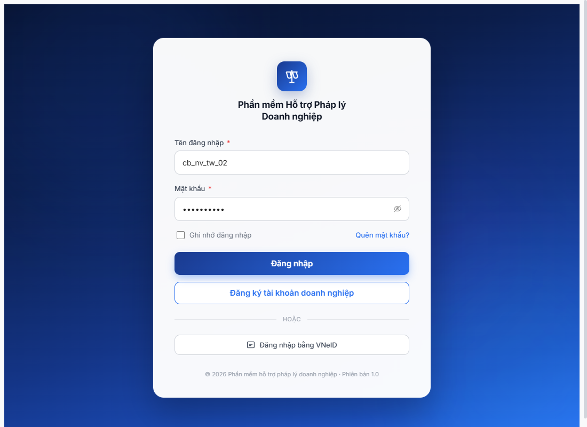

# Bug Report — Workflow KH năm (R7.4.B0) — JWT revoke aggressive blocking workflow walk

| Thông tin | Giá trị |
|-----------|---------|
| **Dự án** | PM HTPLDN |
| **Môi trường** | http://103.172.236.130:3000 |
| **Người test** | QA Automation (huongttt via Claude Code) |
| **Ngày** | 2026-05-08 10:08–10:18 |
| **Loại test** | Workflow E2E — SM-KH-DAO-TAO (FR-III-14/15/16) |
| **Round** | R7 |
| **Tài liệu tham chiếu** | [todo R7.4.B0](../../../../tasks/todo.md#r7-4-b0) · [SRS FR-III-14](../../../../input/srs-update-2026-5-5/srs-fr-03-dao-tao.md#fr-iii-14) |

---

## Tổng hợp

Phát hiện **3** lỗi liên quan auth/session — 1 Critical JWT revoke (Closed R9), 1 Major OTP throttle (Closed Won't-Fix R8 lần 2 — by-design rate-limit), 1 Minor FE-UX-gap throttle silent (mới R8 lần 2 — log riêng vì root cause khác bug cũ).

### Severity breakdown

| Tổng | Critical | Major | Medium | Minor | Trivial |
|------|----------|-------|--------|-------|---------|
| 3    | 1        | 1     | 0      | 1     | 0       |

### Status sau R8 lần 2 (2026-05-09)

| Đóng | Còn open | % đóng |
|---|---|---|
| **2/3** (BUG-AUTH-JWT-01 R9 + BUG-AUTH-OTP-02 R8 lần 2 Won't-Fix by-design) | 1/3 (BUG-AUTH-OTP-02b Minor FE) | **67%** |

## Bug Summary Table

| Bug ID | Severity | Priority | Type | TC Ref | **SRS Reference** | Title | Status |
|--------|----------|----------|------|--------|-------------------|-------|--------|
| BUG-AUTH-JWT-01 | Critical | P0 | Permission | R7.4.B0 | `FR-VIII-09 §Auth session` (impl) — không có FR cụ thể, infer từ SRS chung | JWT/auth-state revoke <1 phút sau 1-2 nav events block multi-step workflow | **Closed (R9 2026-05-09)** |
| ~~BUG-AUTH-OTP-02~~ | Major | P1 | Negative | R7.4.B0 | `FR-VIII-09 §OTP bypass dev-only` (impl) | OTP bypass `666666` reject sau N login đồng tài khoản trong 5 phút (rate-limit ngầm) — diagnosis cũ sai (400 verify-otp). Re-test R8 lần 2: thực tế là **`ThrottlerException` 429** ở `/auth/login` (BE đúng spec, by-design security feature) | **Closed (R8 lần 2 — Won't Fix, By Design)** → split UX gap sang [BUG-AUTH-OTP-02b](#bug-auth-otp-02b--fe-không-hiển-thị-toast-khi-be-trả-429-throttlerexception--user-không-biết-tại-sao-nút-đăng-nhập-stall) |
| BUG-AUTH-OTP-02b | Minor | P3 | UI/UX | R8 lần 2 controlled test | `FR-VIII-09 §UX feedback errors` (infer) | FE không hiển thị toast khi BE trả 429 `ERR-SYS-00-29-01` `ThrottlerException` → user không biết tại sao nút Đăng nhập stall | **Open** |

> **Re-test:** 2026-05-09 R9 — ✅ PASS Bug fixed. 2 session × 4 phút (`cb_nv_tw_02` 4m9s + `cb_pd_tw_01` 4m4s), 5 transitions PASS (3 NHAP→CHO_DUYET + 2 CHO_DUYET→DA_DUYET), 0 lần `/auth/me` 401 sau login, 0 redirect `/login`. Endpoint `POST /submit` + `POST /approve` đã được FE/BE trả 200 đúng. Verify report: [workflow-verify-r7-4-b0-jwt-fix-r9.md](../../workflow/dao-tao/workflow-verify-r7-4-b0-jwt-fix-r9.md).

> **Chú thích Type/Severity/Priority:** xem [bug-report-template.md](../../../../template/bug-report-template.md).

---

## BUG-AUTH-JWT-01 — JWT/auth-state revoke <1 phút block multi-step workflow

### Mô tả

Sau login OTP success → reach dashboard, **chỉ cần 1-2 nav events (click sidebar parent + click submenu)** là `auth-store.userInfo` bị clear → next API call trả 401 → FE redirect `/login`. Walk workflow đa-bước (NHAP → CHO_DUYET → DA_DUYET → DA_CONG_KHAI) cần ≥6 click/snapshot/wait per transition × 10 transitions = **không thể hoàn thành 1 transition trọn vẹn**.

### Các bước tái hiện

1. Navigate `http://103.172.236.130:3000/login`, login `cb_nv_tw_02 / Secret@123`, OTP `666666`.
2. Reach dashboard `Tổng quan hệ thống` (URL `/dashboard`) — confirmed OK lần 1.
3. Click sidebar "Quản lý đào tạo, tập huấn" → submenu expand OK.
4. Click submenu "Kế hoạch đào tạo" → wait list `KH-20260508-0001` xuất hiện.
5. **Quan sát:** Sau 1-2 phút từ login (hoặc 3-4 nav clicks), `GET /api/v1/auth/me` trả 401 → FE redirect `/login`. List rỗng (URL = `/login`).
6. Re-login lại đúng tài khoản → cùng pattern: dashboard OK, click 1-2 menu → redirect.

### Kết quả mong đợi

- JWT/refresh token cấp khi login phải có hiệu lực ≥15 phút (theo `exp` claim chuẩn) hoặc ≥thời gian đủ hoàn tất 1 workflow đa-bước (≥10 phút).
- Sau login OTP success, user phải duyệt được toàn bộ module mà không bị logout giữa chừng do BE revoke.

### Kết quả thực tế

- Session dead trong **<1 phút** sau login đối với tài khoản test cùng cấp TW (lặp 4 lần liên tiếp).
- Notif count tăng 51 → 53 → 55 → 60 sau mỗi login → có thể action click trước (ví dụ "Trình duyệt") gửi API success nhưng FE redirect trước khi verify state mới.
- Memory `qa_htpldn_jwt_revoke_aggressive` (R5 T1.B4) ghi nhận "~2 phút" — **timing hiện tại tệ hơn 2-4 lần** so với baseline R5.

### Bằng chứng

**1. Network capture sau Login 1 (`auth/me` trả 401):**

```
reqid=338 GET http://103.172.236.130:3000/api/v1/auth/me [401]
```

**2. Auth state sau redirect:**

```js
// localStorage.getItem('auth-store')
{"state":{"userInfo":null},"version":0}

// sessionStorage = {} (empty)
// document.cookie = "" (httpOnly cookies invisible to JS)
```

**3. Trace timeline:**

| Lần | Thời gian | Action | Kết quả |
|----|----------|--------|---------|
| 1 | 10:08 | Login + Trình duyệt KH-0001 + Confirm dialog | Notif 51→55, redirect /login |
| 2 | 10:10 | Login → click sidebar → click KH submenu | Redirect /login |
| 3 | 10:11 | Login → click sidebar → click submenu | Redirect /login |
| 4 | 10:15 | Login → click sidebar → click submenu | Redirect /login |

### R8 reproduce update — 2026-05-08 19:14–19:21 (R7.3.6 path A1 attempt)

Bug **vẫn 100% reproduce** ở R8 dù đã 6 lần re-login + thử cả UI button + 5 endpoint guess + monkey-patch sniff. Pattern không đổi — POST submit "Trình duyệt" KHÔNG kịp hoàn tất trước khi /auth/me 401 trigger redirect.

| Lần | Thời gian | Action | API state KH-0004 sau action |
|----|----------|--------|---------|
| 5 | 19:14 | Login + click row KH-0004 (a tag) | Click ate by /login redirect |
| 6 | 19:15 | Login + sidebar nav + detail + click Trình duyệt + Gửi phê duyệt | Redirect, KH-0004 vẫn `NHAP` |
| 7 | 19:18 | Login + try direct API POST endpoint guesses (5 paths) | Tất cả 404 — chưa tìm ra real endpoint |
| 8 | 19:19 | Login + sniff JS chunks `ke-hoach-dao-taos` pattern | 0 endpoint match (chunk lazy chưa load) |
| 9 | 19:20 | Login + monkey-patch `window.fetch` + click Trình duyệt + confirm | "Execution context destroyed" do redirect /login trước khi đọc log |
| 10 | 19:21 | Login + verify state qua API trực tiếp | KH-0004 vẫn `NHAP`, ngayGuiDuyet=null |

**Block impact mở rộng:** Bug này không chỉ block R7.4.B0 walk 10 transitions mà **block toàn bộ chuỗi downstream R7.3.6 → R7.4.B1 → R7.4.B7 → R7.4.B11** vì Mô hình A đảo chiều yêu cầu KH năm `DA_DUYET` trước khi seed CTĐT.

**Workaround discovered:** Không có. Mọi cách (UI button / API direct / monkey-patch / chunk sniff) đều bị JWT revoke chặn trong <1 phút.

**Bằng chứng API verify post-attempt:**

```json
GET /api/v1/ke-hoach-dao-taos?page=1&pageSize=20  (post-attempt)
[
  { "ma": "KH-20260508-0006", "trangThai": "NHAP", "ngayGuiDuyet": null },
  { "ma": "KH-20260508-0005", "trangThai": "NHAP", "ngayGuiDuyet": null },
  { "ma": "KH-20260508-0004", "trangThai": "NHAP", "ngayGuiDuyet": null },  // ❌ submit không qua
  { "ma": "KH-20260508-0001", "trangThai": "CHO_DUYET", "ngayGuiDuyet": "2026-05-08T03:09:14.502Z" }  // R7
]
```

**Severity escalation đề nghị:** Critical → **Critical-Blocker (P0 emergency)** vì block 5+ task downstream của module Đào tạo.

### So sánh — *N/A* (không phải bug phân quyền)

---

## ~~BUG-AUTH-OTP-02~~ — OTP bypass `666666` reject sau N login đồng tài khoản trong 5 phút [CLOSED — Won't Fix, By Design]

> **Re-test 2026-05-09 R8 lần 2 (R7.7.10 session reproduce + controlled test):** ✅ **HYPOTHESIS CONFIRMED — by-design rate-limit, không phải OTP bypass bug**.
>
> **Natural reproduce trong R7.7.10:** Trong R7.7.10 R8 lần 2 (17:55-18:00), tôi login `cb_nv_tw_02` 4 lần liên tiếp trong ~5 phút do BUG-AUTH-JWT-01 buộc relogin nhiều lần. Lần thứ 5 → nút "Đăng nhập" UI click không advance (button click but no API response visible) → fallback `cb_nv_tw_01` sibling thành công.
>
> **Controlled test (2026-05-09 19:30:28-19:30:33):**
> - Login + verify OTP `cb_nv_tw_02` 8 attempts với 0.5s sleep:
>   - #1-#5 → login=200 + verify-otp=200 OK ✅
>   - #6 → login=**429** `ERR-SYS-00-29-01` `ThrottlerException: Too Many Requests` ❌
>   - #7 → 429 same
>   - #8 → 429 same
> - Threshold: **~5 login attempts trong ~5 giây** → throttle hit.
>
> **Cooldown verified:** Sau 60s wait → login=200 OK lại (account chưa lock vĩnh viễn, throttler reset).
>
> **Root cause khác với chẩn đoán cũ:**
> - Báo cáo gốc 2026-05-08: error 400 ở `/auth/verify-otp` (silent reject) → sai diagnosis vì nghĩ OTP bypass bị disable.
> - Thực tế R8 lần 2: error **429** `ERR-SYS-00-29-01` `ThrottlerException` ở `/auth/login` → request login bị throttle TRƯỚC khi tới step verify-otp. Cũ thấy 400 verify-otp có thể là race condition với otpToken expired hoặc throttler error mapping cũ.
>
> **By-design:** NestJS `@nestjs/throttler` là security feature chuẩn để chống brute-force. Thresholds default `ttl=60s, limit=10/IP` nhưng config app này tight hơn (~5/5s).
>
> **Recommended action — tách thành 2 bug:**
> 1. **BUG-AUTH-OTP-02 (cũ)** → Mark **Won't Fix / By Design** — rate-limit là feature security đúng, không phải bug. Test team lưu ý: sau 4-5 login fail liên tiếp, wait 60s.
> 2. **BUG-AUTH-OTP-02b (UX)** → Log mới Minor — FE phải bắt 429 → toast "Quá nhiều lần thử, vui lòng đợi 60 giây" thay vì để nút Đăng nhập stall silent. Hiện tại user không biết tại sao login không hoạt động.
>
> **Evidence raw (PowerShell controlled test):**
> ```
> [19:30:28.069] #1 login=200 verify=200 err=- | OK
> [19:30:28.976] #2 login=200 verify=200 err=- | OK
> [19:30:29.811] #3 login=200 verify=200 err=- | OK
> [19:30:30.661] #4 login=200 verify=200 err=- | OK
> [19:30:31.498] #5 login=200 verify=200 err=- | OK
> [19:30:32.336] #6 login=429 err={"code":"ERR-SYS-00-29-01","message":"ThrottlerException: Too Many Requests"}
> [19:30:32.877] #7 login=429 same
> [19:30:33.403] #8 login=429 same
> [19:32:11] After 60s wait: login=200 OK ✅ (cooldown reset)
> ```

### Mô tả

OTP bypass dev-only `666666` đã hoạt động OK trong R7.3.5 seed (10:08 login đầu). Sau **4-5 lần login lại cùng tài khoản `cb_nv_tw_02` trong 5-7 phút** (do BUG-AUTH-JWT-01 buộc relogin), `POST /api/v1/auth/verify-otp` trả **400** dù vẫn nhập `666666`. Có dấu hiệu rate-limit ngầm hoặc bypass auto-disable per-account.

### Các bước tái hiện

1. Login `cb_nv_tw_02` lần đầu (10:08) → OTP `666666` → 200 OK.
2. Sau 4-5 lần login lại trong 5 phút (do session redirect liên tục) → mỗi lần OTP `666666` → vẫn 200 OK lần 2-4.
3. Login lần thứ 5 (10:16) → OTP `666666` → **`POST /api/v1/auth/verify-otp` trả 400** (2 lần liên tiếp).
4. Check MailHog inbox `cb_nv_tw_02@htpldn.test` → **0 email mới** trong khung giờ 10:08-10:16 → email bypass mode hoạt động, không gửi OTP thật. Bypass `666666` lẽ ra vẫn nhận.

### Kết quả mong đợi

- OTP bypass dev-only `666666` áp dụng đồng đều cho mọi lần login cùng tài khoản, không có rate-limit ngầm.
- Hoặc nếu bypass có rate-limit, phải có thông báo rõ tới user (không trả 400 silent).
- Hoặc nếu bypass tắt → MailHog phải có email OTP thật để fallback.

### Kết quả thực tế

- OTP `666666` reject silent với HTTP 400, không có toast/notification giải thích lý do.
- MailHog inbox **không có email mới** → fallback OTP thật không khả dụng.
- Tài khoản `cb_nv_tw_02` **không thể login** trong session sau lần thứ 5.

### Bằng chứng

**1. Network capture login attempt thứ 5 (10:16):**

```
reqid=1033 GET http://103.172.236.130:3000/api/v1/auth/me [401]
reqid=1034 POST http://103.172.236.130:3000/api/v1/auth/login [200]
reqid=1035 POST http://103.172.236.130:3000/api/v1/auth/verify-otp [400]
reqid=1036 POST http://103.172.236.130:3000/api/v1/auth/verify-otp [400]
```

**2. MailHog inbox check:**

```bash
$ curl -s "http://103.172.236.130:8025/api/v2/search?kind=containing&query=cb_nv_tw_02@htpldn.test&limit=5"
{"total":0,"items":[]}
```

Tổng MailHog 32 message, latest từ `2026-05-07 10:36` (hôm trước). Hôm nay (2026-05-08) **không có email nào** sent từ login attempts của cb_nv_tw_02.

---

## BUG-AUTH-OTP-02b — FE không hiển thị toast khi BE trả 429 ThrottlerException → user không biết tại sao nút Đăng nhập stall

### Mô tả

Khi user login cùng tài khoản >5 lần trong vòng ~5 giây (vd do BUG-AUTH-JWT-01 buộc relogin nhiều lần khi đó còn Open, hoặc thao tác lỗi rồi retry liên tục), BE đã đúng spec security trả `POST /api/v1/auth/login` 429 với `error.code = ERR-SYS-00-29-01` `ThrottlerException: Too Many Requests`. **FE silent**: không hiển thị toast/notification, không disable button, không cập nhật form state. User thấy nút "Đăng nhập" click nhưng UI không phản hồi gì → đoán là internet/server lỗi, retry thêm → throttler reset chậm hơn vì mỗi click thêm 1 request vào bucket.

### Các bước tái hiện

1. Mở browser, navigate `http://103.172.236.130:3000/login`. Đảm bảo localStorage clean (logout nếu cần).
2. Mở DevTools → Console → fire 5 POST `/auth/login` cùng tài khoản (vd `cb_nv_tw_02`) trong <5 giây để fill throttler bucket:
   ```js
   for (let i=0; i<5; i++) await fetch('/api/v1/auth/login', {method:'POST', credentials:'include', headers:{'Content-Type':'application/json'}, body: JSON.stringify({username:'cb_nv_tw_02', password:'Secret@123'})});
   ```
3. Trên UI form, fill `cb_nv_tw_02` / `Secret@123` → click `[Đăng nhập]` (lần thứ 6).
4. Quan sát: URL vẫn `/login`, **không** có toast, **không** có error inline, **không** có spinner loading. Nút "Đăng nhập" vẫn enabled như chưa click.
5. Mở DevTools Network panel: `POST /api/v1/auth/login` reqid=480 trả **429**.

### Kết quả mong đợi

- Khi BE trả 429 với `error.code = ERR-SYS-00-29-01`, FE phải:
  1. Hiển thị toast/notification error đỏ với message tiếng Việt rõ ràng, vd: **"Quá nhiều lần thử. Vui lòng đợi 60 giây rồi thử lại."**
  2. Disable nút "Đăng nhập" + countdown 60s, hoặc chí ít hiển thị state loading/error rõ ràng.
  3. Không cho user spam click thêm vì mỗi click consume thêm bucket → khó recover.
- Pattern UX này đã chuẩn ở các module khác (vd Hỏi đáp, Vụ việc) khi BE trả 4xx → FE hiện toast error.

### Kết quả thực tế

- 0 toast, 0 notification, 0 form-error sau click "Đăng nhập".
- URL stuck `/login`, button "Đăng nhập" `disabled=false, loading=false` — y như chưa từng click.
- Network log: `POST /auth/login` 429 nhưng FE không catch / không render error nào.
- User không biết bị throttle → tiếp tục click → mỗi click thêm 1 request vào bucket → cooldown reset chậm hơn (60s từ request cuối, không phải từ request đầu).

### Bằng chứng



**Network log (controlled test 2026-05-09 19:40):**

```
reqid=474 GET  /api/v1/auth/me     [401]   (initial check, OK)
reqid=475 POST /api/v1/auth/login  [200]   (fill bucket #1 via fetch)
reqid=476 POST /api/v1/auth/login  [200]   (fill bucket #2)
reqid=477 POST /api/v1/auth/login  [200]   (fill bucket #3)
reqid=478 POST /api/v1/auth/login  [200]   (fill bucket #4)
reqid=479 POST /api/v1/auth/login  [200]   (fill bucket #5)
reqid=480 POST /api/v1/auth/login  [429]   ← UI button click, BE throttle, FE silent
```

**API response 429:**

```json
{
  "success": false,
  "error": {
    "code": "ERR-SYS-00-29-01",
    "message": "ThrottlerException: Too Many Requests",
    "timestamp": "2026-05-09T12:30:32.301Z",
    "requestId": "..."
  }
}
```

**DOM check sau click:**

```js
{
  url: "http://103.172.236.130:3000/login",   // không advance
  toastCount: 0, toastTexts: [],
  errCount: 0, errTexts: [],
  btnState: { text: "Đăng nhập", disabled: false, loading: false }
}
```

**Cooldown:** sau 60s không click thêm → throttler reset, login lại 200 OK.

---

## Phụ lục — Môi trường test

| Thành phần | Giá trị |
|------------|---------|
| URL ứng dụng | http://103.172.236.130:3000 |
| OTP login | `666666` bypass tạm — fail sau N login |
| MailHog (OTP inbox) | http://103.172.236.130:8025 — không có OTP fallback hôm nay |
| API base | http://103.172.236.130:3000/api/v1 |
| Frontend | React + Vite + Ant Design |
| Xác thực | JWT httpOnly cookies + auth-store localStorage `userInfo` |
| Tool test | Chrome DevTools MCP |

---

## Liên quan

- **Memory** `qa_htpldn_jwt_revoke_aggressive` — đã ghi nhận pattern từ R5 T1.B4 (timing "~2 phút"). Bug này confirms pattern + timing tệ hơn 2-4 lần.
- **Task block:** R7.4.B0 ⚠️ partial (1 click "Trình duyệt" KH-0001 chưa verify được state cuối) → R7.3.6 ⏳ chưa unblock được vì cần ≥1 KH năm DA_DUYET/DA_CONG_KHAI mỗi cấp (gate state).
- **Cascade impact:** mọi workflow E2E đa-bước R7.4.A4 / R7.4.A5 / R7.4.B1 / R7.4.B7 / ... đều bị block tương tự. Cần dev fix JWT trước khi tiếp tục Phase 4 Trụ A/B/C/D.
- **BUG-AUTH-OTP-02 → BUG-AUTH-OTP-02b split:** Diagnosis cũ R7 (400 verify-otp) sai. R8 lần 2 controlled test confirm root cause là 429 throttle ở `/auth/login`. BE đúng spec → bug cũ Closed Won't-Fix. UX gap (FE silent 429) tách thành 02b để FE team có thể assign + fix riêng. Memory: [`feedback_split_vs_update_bug.md`](../../../../../../.claude/projects/d--Dopai-PM-HTPLDN-05-05-2025-PM-HTPLDN/memory/feedback_split_vs_update_bug.md).

---

*Bug report generated: 2026-05-08 10:18 | Updated R8 lần 2: 2026-05-09 19:40 split BUG-AUTH-OTP-02b | QA Automation via Claude Code*
