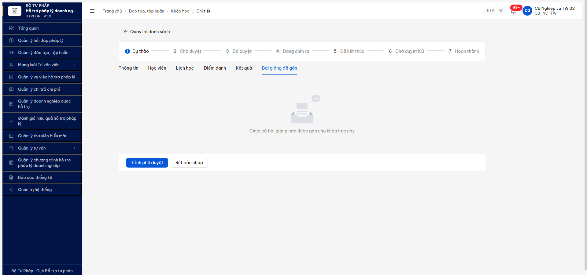

# Bug Report — KH ↔ Bài giảng (N-N) chưa implement đầy đủ (R7.7.6 DT-038)

| Thông tin | Giá trị |
|-----------|---------|
| **Dự án** | PM HTPLDN |
| **Môi trường** | http://103.172.236.130:3000 |
| **Người test** | QA Automation Claude Code MCP |
| **Ngày** | 2026-05-11 17:45:00 |
| **Loại test** | Functional |
| **Round** | R10 phase 1 (10/05) → R11 re-verify (11/05) |
| **Tài liệu tham chiếu** | [test plan §DT-038](../../../../funtion/7.3-dao-tao-tap-huan.md) · [R10 finding](../../functional/dao-tao/functional-test-report-r7-7-6-khoa-hoc-r10.md) |

---

## Tổng hợp

Phát hiện **1** lỗi Major liên quan N-N relation KHOA_HOC ↔ BAI_GIANG.

### Severity breakdown

| Tổng | Critical | Major | Medium | Minor | Trivial | Closed | Open |
|------|----------|-------|--------|-------|---------|--------|------|
| 1    | 0        | 1     | 0      | 0     | 0       | 0      | 1    |

## Bug Summary Table

| Bug ID | Severity | Priority | Type | TC Ref | **SRS Reference** | Title | Status |
|--------|----------|----------|------|--------|-------------------|-------|--------|
| BUG-DT-038-ASSIGN-01 | Major | P1 | UI/UX + Data | DT-038 | `FR-III-07 §561 + FR-III-11 §816` | Tab "Bài giảng đã gán" trên KH detail thiếu button "Gán bài giảng" → KHÔNG thể gán BG qua UI, BE chỉ filter từ BG side, không có nested route POST/DELETE assignment | Open |

---

## BUG-DT-038-ASSIGN-01 — Tab "Bài giảng đã gán" thiếu button "Gán bài giảng" + BE thiếu endpoint assignment

### Mô tả

Khi mở Khóa học detail (vd `KH-20260511-001`) → tab "Bài giảng đã gán", UI hiển thị empty state "Chưa có bài giảng nào được gán cho khóa học này" nhưng **không có button "Gán bài giảng" / "Thêm bài giảng"** để gán BG mới. BE cũng thiếu nested route `POST /khoa-hocs/{id}/bai-giangs/{bgId}` (404). N-N relation `KHOA_HOC ↔ BAI_GIANG` (SRS FR-III-07 §561 + cross-ref FR-III-11 §816) chưa implement đầy đủ — chỉ có 1 chiều filter từ BG side.

### Các bước tái hiện

1. Login `cb_nv_tw_02` (CB_NV_TW) → fresh session (cache clear + SW unregister + localStorage clear).
2. Navigate `/dao-tao/khoa-hoc/774ba2df-5872-4aa5-b492-6b53af6b1225` (KH-20260511-001 DU_THAO).
3. Click tab **"Bài giảng đã gán"** (cuối tab list).
4. Quan sát panel content + page actions.
5. Probe BE endpoints để xác định mức implement:
   - `GET /api/v1/khoa-hocs/{khId}/bai-giangs`
   - `GET /api/v1/khoa-hocs/{khId}/bai-giang` (singular)
   - `GET /api/v1/bai-giangs?khoaHocId={khId}` (filter từ BG side)
   - `GET /api/v1/khoa-hocs/{khId}?include=baiGiangs`
   - `GET /api/v1/bai-giangs?page=1&pageSize=5` (xem BG schema có `khoaHocIds` không)

### Kết quả mong đợi

- Tab "Bài giảng đã gán" có button **"Gán bài giảng"** / **"+ Thêm bài giảng"** trên header tab/panel (pattern giống các tab CRUD khác như "Lịch học" có "+ Thêm buổi học", "Học viên" có "+ Thêm học viên").
- Click button → modal/drawer cho phép chọn BG từ kho dùng chung (filter loại Slide/PDF/Video, công khai, đơn vị) → submit gán BG vào KH.
- BE expose REST endpoint cho assignment 2 chiều:
  - `POST /khoa-hocs/{khId}/bai-giangs/{bgId}` hoặc `POST /khoa-hocs/{khId}/bai-giangs` body `{baiGiangIds: UUID[]}` → 201 Created.
  - `DELETE /khoa-hocs/{khId}/bai-giangs/{bgId}` → 204 No Content.
  - `GET /khoa-hocs/{khId}/bai-giangs` → 200 list BG đã gán (cho UI render tab).
  - BG response có field `khoaHocIds` (N-N) hoặc nested array `khoaHocs`.
- Tab list render BG đã gán sau action assign.

### Kết quả thực tế

**UI:**
- Tab "Bài giảng đã gán" render **chỉ empty state** "Chưa có bài giảng nào được gán cho khóa học này" + image "Trống" (a11y snapshot uid 11_0..11_2).
- **KHÔNG có button "Gán bài giảng"** / "Thêm bài giảng" / "Add lecture" / equivalent trong tab.
- Page actions footer chỉ có `[Trình phê duyệt]` + `[Rút bản nháp]` (KH workflow actions, không phải BG assignment).

**BE probe (R11 2026-05-11):**
```
GET /api/v1/khoa-hocs/{khId}/bai-giangs      → 404 {success:false, error:...}
GET /api/v1/khoa-hocs/{khId}/bai-giang       → 404 {success:false, error:...}
GET /api/v1/bai-giangs?khoaHocId={khId}      → 200 {data:[], meta:{...}}  ← chiều ngược OK
GET /api/v1/khoa-hocs/{khId}?include=baiGiangs → 200  (no `baiGiangs` field in response.data)
GET /api/v1/bai-giangs?page=1&pageSize=5     → 200 (BG schema: id, nguoiTaoId, ngayTao, donViId, seqId, version, tenBaiGiang, moTa, loaiTaiLieu, fileUrl, dungLuong, anhDaiDien, congKhai)
                                              → **KHÔNG có field `khoaHocIds` / `khoaHocId` / `khoaHocs`**
```

→ N-N relation chỉ có 1 chiều filter qua query param `?khoaHocId=...`. BE thiếu nested route assign/unassign. FE không có UI assignment.
→ Pattern giống R7.4.B10 BUG-DKT-FE-REGRESSION-01 (assignment UI thiếu).

### Bằng chứng

**1. Ảnh chụp** (R11 2026-05-11 17:45):



**2. BE probe result (R11):**

```json
[
  {"name":"nested-plural","url":"/api/v1/khoa-hocs/774ba2df-.../bai-giangs","status":404},
  {"name":"nested-singular","url":"/api/v1/khoa-hocs/774ba2df-.../bai-giang","status":404},
  {"name":"filter-from-bg","url":"/api/v1/bai-giangs?khoaHocId=774ba2df-...","status":200,"data":[]},
  {"name":"include-relation","url":"/api/v1/khoa-hocs/774ba2df-...?include=baiGiangs","status":200,"no_baiGiangs_in_response":true},
  {"name":"list-bg","url":"/api/v1/bai-giangs?page=1&pageSize=5","status":200,"bg_schema_no_khoaHocIds":true}
]
```

**3. SRS reference:** [`srs-fr-03-dao-tao.md:561`](../../../../../input/srs-v3/srs-fr-03-dao-tao.md) FR-III-07 "Quản lý kho tài liệu, bài giảng" + line `:582 col 8 cong_khai` chỉ định BG là pool dùng chung công khai → gán vào KH là N-N. Test plan dòng 117 `BR-DATA-04 ≥1 bài giảng (Slide/PDF/Video) — DT-005, DT-006, DT-038`.

---

## Phụ lục — Môi trường test

| Thành phần | Giá trị |
|------------|---------|
| URL ứng dụng | http://103.172.236.130:3000 |
| OTP login | `666666` bypass |
| MailHog (OTP inbox) | http://103.172.236.130:8025 |
| API base | http://103.172.236.130:3000/api/v1 |
| Frontend | React + Vite + Ant Design v5 |
| Xác thực | JWT + OTP |
| Tool test | Chrome DevTools MCP |

---

*Bug report generated: 2026-05-11 17:45:00 | QA Automation via Claude Code MCP*
