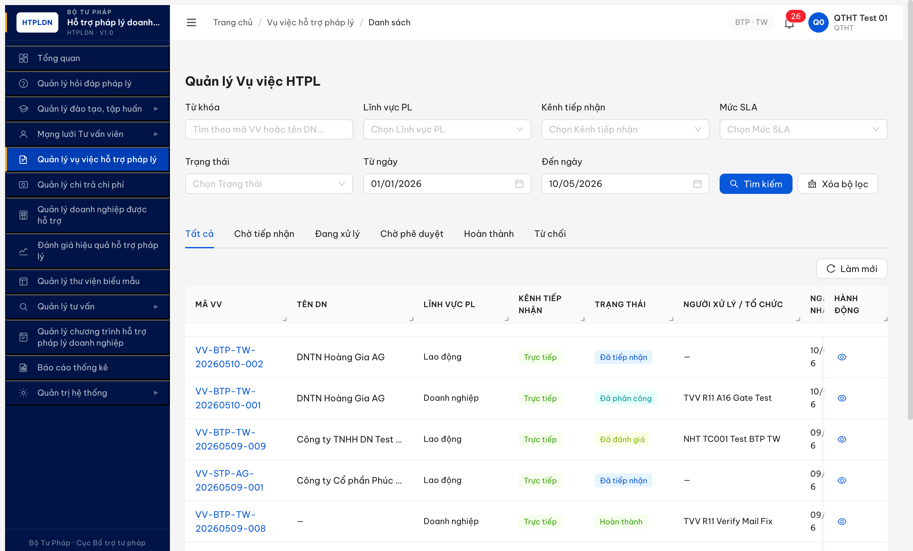
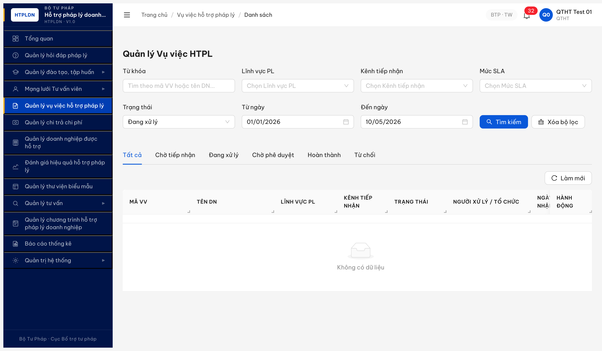
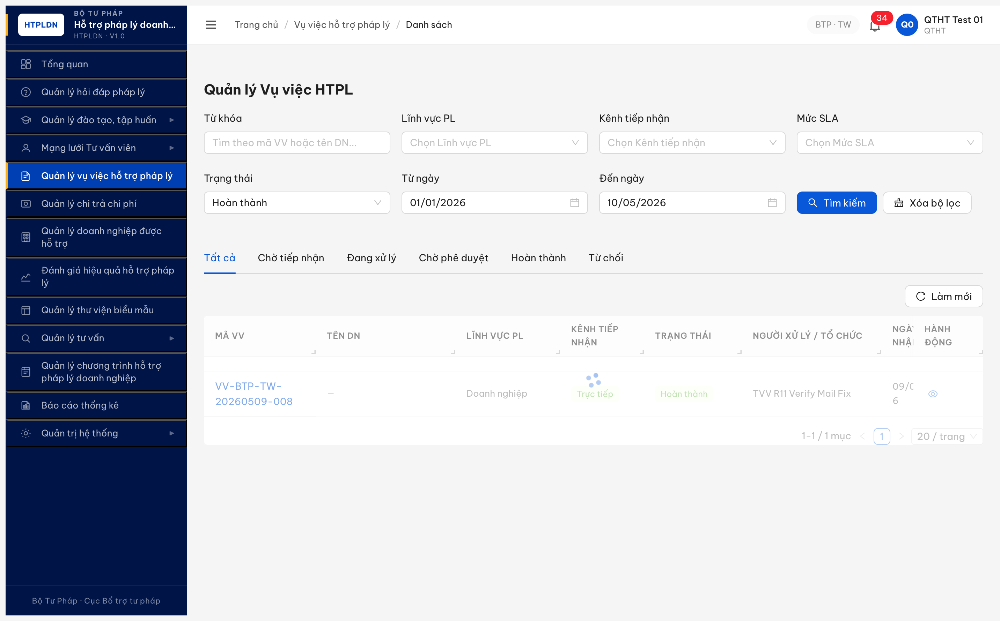
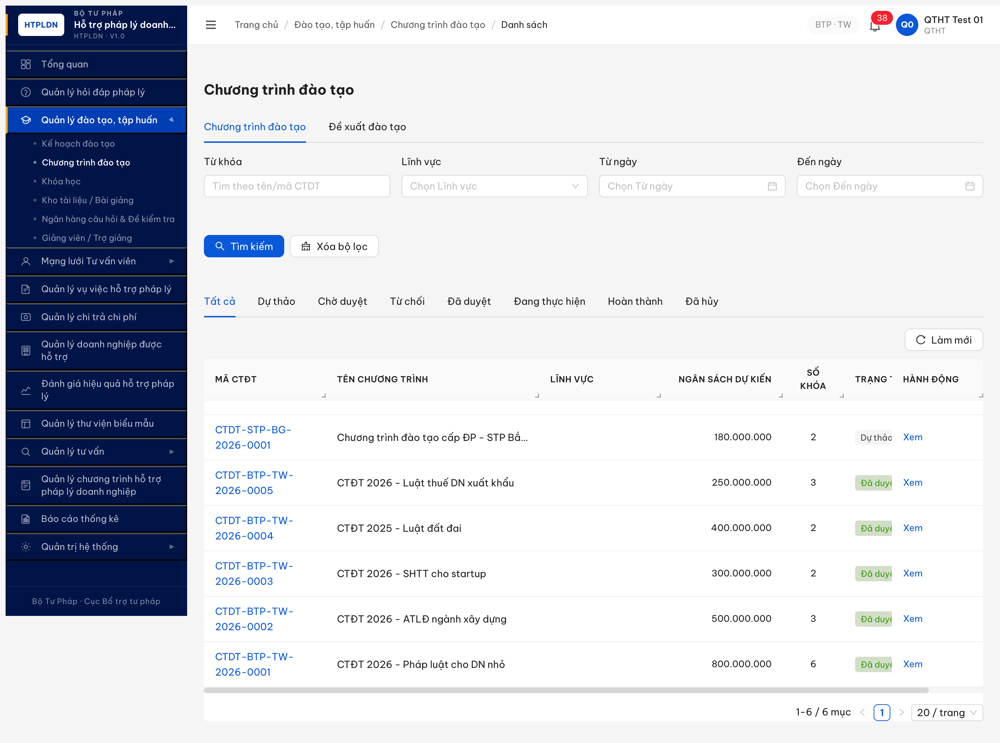

# Bug Report — Dashboard (FR-01)

| Thông tin | Giá trị |
|-----------|---------|
| **Dự án** | PM HTPLDN |
| **Môi trường** | http://103.172.236.130:3000 |
| **Người test** | QA Automation (Claude Opus 4.7) |
| **Ngày** | 2026-05-10 10:37:30 (UTC+7) · **R2 retest:** 2026-05-10 12:30:00 (UTC+7) |
| **Loại test** | Functional + Cross-check API ↔ UI |
| **Round** | Round 7 (R1 + R2 retest) |
| **Tài liệu tham chiếu** | [functional-test-report-r7-dashboard.md](../../functional/dashboard/functional-test-report-r7-dashboard.md) · [tasks/todo-dashboard.md](../../../../tasks/todo-dashboard.md) |

---

## Tổng hợp

Phát hiện **4** lỗi có SRS reference cụ thể trong functional test Dashboard. R2 retest 2026-05-10 12:30:00: dev claim đã fix BUG-DASH-001 + BUG-DASH-002 nhưng evidence cho thấy **cả 2 đều CHƯA FIX** (vẫn reproduce 100%). Phát hiện thêm **2 bug Major** từ drill KPI-03/04/05/06 expand coverage.

### Severity breakdown

| Tổng | Critical | Major | Medium | Minor | Trivial |
|------|----------|-------|--------|-------|---------|
| 4    | 0        | 2     | 1      | 1     | 0       |

## Bug Summary Table

| Bug ID | Severity | Priority | Type | TC Ref | **SRS Reference** | Title | Status |
|--------|----------|----------|------|--------|-------------------|-------|--------|
| BUG-DASH-001 | Medium | P1 | Validation | DASH-11 | `srs-update-2026-5-5/srs-fr-01-dashboard.md:268 FR-I-02 §Processing Bước 4` + `:270 §Drill-down` | KPI-02 dashboard count=16 loại trừ TU_CHOI sai spec (phải = 17 bao gồm cả TU_CHOI) | Open (R2 retest FAIL) |
| BUG-DASH-002 | Minor | P3 | UI/UX | DASH-10 | `srs-update-2026-5-5/srs-fr-01-dashboard.md:100 mermaid` + `srs-fr-01-dashboard.md:611` | Drill-down KPI-07 thiếu URL param `trang_thai=DANG_HOAT_DONG` (tab default rescue) | Open (R2 retest FAIL) |
| BUG-DASH-003 | Major | P1 | Validation | DASH-12, DASH-13 | `srs-update-2026-5-5/srs-fr-01-dashboard.md:270 §Drill-down` + `:268 FR-I-03/04 §Processing` | Drill KPI-03/04 URL `trangThai=DANG_XU_LY/HOAN_THANH` không khớp dashboard count (composite state mismatch) | Open |
| BUG-DASH-004 | Major | P1 | UI/UX | DASH-14, DASH-15 | `srs-update-2026-5-5/srs-fr-01-dashboard.md:100 mermaid` (KPI-05/06 drill) | Drill KPI-05/06 navigate `/dao-tao/chuong-trinh/danh-sach` (sai page Chương trình ≠ Khóa học, no filter, no date) | Open |

---

## BUG-DASH-001 — KPI-02 dashboard count=16 loại trừ TU_CHOI sai spec

> **Re-test:** 2026-05-10 12:30:00 R2 — ❌ FAIL (Open-confirmed). Dev claim đã fix nhưng dashboard vẫn trả `VU_VIEC_TIEP_NHAN.giaTri = 16` (API endpoint cũ). Pool VV vẫn = 17 (gồm 1 TU_CHOI: `VV-BTP-TW-20260507-004`). Drill list vẫn "1-17 / 17 mục". Mismatch dashboard 16 vs list 17 nguyên vẹn. Evidence: [r7-r2-bug01-drill-kpi02-still-17vs16.png](image/r7-r2-bug01-drill-kpi02-still-17vs16.png).

### Mô tả

API `/api/v1/dashboard?nam=2026&tuNgay=2026-01-01&denNgay=2026-05-10` trả `VU_VIEC_TIEP_NHAN.giaTri = 16`. Pool `VU_VIEC` thực tế có 17 record với `ngay_tiep_nhan` trong khoảng đó (gồm 1 record TU_CHOI: `VV-BTP-TW-20260507-004` ngày 07/05/2026). Drill-down từ KPI-02 → tab "Tất cả" hiển thị "1-17 / 17 mục" → mismatch giữa con số dashboard (16) và list landing (17).

### Các bước tái hiện

1. Login `qtht_01 / Secret@123` → OTP `666666` → dashboard render.
2. Quan sát thẻ KPI-02: "Vụ việc tiếp nhận: **16** vụ việc, xem chi tiết".
3. Click thẻ KPI-02 → navigate `/vu-viec/danh-sach?tuNgay=2026-01-01&denNgay=2026-05-10`.
4. Tab "Tất cả" auto-select → pagination "1-**17** / 17 mục".
5. Quan sát: trong 17 row có 1 row trạng thái "Từ chối" — `VV-BTP-TW-20260507-004` (Công ty TNHH Minh Khôi BNI), Ngày tiếp nhận 07/05/2026.
6. Cross-check: API `/api/v1/vu-viecs?page=1&size=20` → `meta.total = 17`. byTrangThai distribution: `DA_TIEP_NHAN:4, DA_PHAN_CONG:9, DA_DANH_GIA:1, HOAN_THANH:1, YEU_CAU_BO_SUNG:1, TU_CHOI:1` → total = 17.

### Kết quả mong đợi

Per `srs-update-2026-5-5/srs-fr-01-dashboard.md:268` FR-I-02 §Processing Bước 4 (nguyên văn):

> "Đếm số bản ghi VU_VIEC chưa xóa, trong phạm vi đơn vị, **ngày tiếp nhận trong khoảng thời gian lọc**"

Spec KHÔNG có điều kiện loại trừ trạng thái (đối lập với FR-I-03 vốn liệt kê rõ 5 trạng thái loại trừ "Từ chối/Hoàn thành/Đã đánh giá"). NotebookLM HTPLDN query (notebook `a4ae45bf-cea0-4325-8fee-b1e0be702cf2`) confirm nguyên văn: *"Vì không có điều kiện loại trừ trạng thái (như cách mà KPI-03 loại trừ), nên mọi vụ việc đã được tiếp nhận trong kỳ (bao gồm cả những vụ sau đó bị chuyển sang trạng thái TU_CHOI) đều được tính vào KPI này."*

→ **KPI-02 phải trả 17** (đếm tất cả 17 VV có `ngay_tiep_nhan` ∈ [2026-01-01, 2026-05-10], kể cả TU_CHOI).

Đồng thời §Drill-down `srs-fr-01-dashboard.md:270`: *"Filter bắt buộc kèm để **số click xuống khớp số đếm Dashboard**"* → đảm bảo nhất quán giữa dashboard và list.

### Kết quả thực tế

- KPI-02 dashboard = **16** (BE filter đã loại 1 TU_CHOI khỏi count).
- Drill-down list = **17 mục** (tab "Tất cả" không loại TU_CHOI).
- Hai con số mâu thuẫn → user click "16" thấy 17 → confusing UX + vi phạm AC nghiệp vụ.

API response trích:

```json
{
  "kpiCode": "VU_VIEC_TIEP_NHAN",
  "nhan": "Vụ việc tiếp nhận",
  "donViTinh": "vụ việc",
  "giaTri": 16,
  "drillDownUrl": "/vu-viec",
  "appliedFilter": {"tuNgay":"2026-01-01","denNgay":"2026-05-10","nam":2026,"donViId":null}
}
```

vs. cross-check `/api/v1/vu-viecs?page=1&size=20` trả `meta.total = 17` với cùng filter date.

### Bằng chứng

**1. Ảnh chụp:**



*(Ảnh khác — dashboard overview với KPI-02 = 16):* xem [`functional/dashboard/image/r7-dashboard-qtht01-overview.png`](../../functional/dashboard/image/r7-dashboard-qtht01-overview.png)

**2. API response so sánh:**

| Endpoint | Filter | Total | Loại trừ TU_CHOI? |
|---|---|---|---|
| `/api/v1/dashboard` `VU_VIEC_TIEP_NHAN` | `nam=2026&tuNgay=2026-01-01&denNgay=2026-05-10` | **16** | Có (BE filter sai) |
| `/api/v1/vu-viecs` | `page=1&size=20` (toàn pool) | **17** | Không |
| Drill UI tab "Tất cả" | `?tuNgay=2026-01-01&denNgay=2026-05-10` | **17 mục** | Không |

---

## BUG-DASH-002 — Drill-down KPI-07 thiếu URL param `trang_thai=DANG_HOAT_DONG`

> **Re-test:** 2026-05-10 12:31:00 R2 — ❌ FAIL (Open-confirmed). Dev claim đã fix nhưng drill URL vẫn `/chuyen-gia-tvv/danh-sach?tuNgay=2026-01-01&denNgay=2026-05-10` (vẫn THIẾU `trang_thai`, `don_vi_cap`, `don_vi_id`). Tab "Đang hoạt động" rescue count = 10 ✓ (data đã thay đổi từ 11→10 do TVV pool reset). URL filter brittle nguyên vẹn. Evidence: [r7-r2-bug02-drill-kpi07-url-still-missing.png](image/r7-r2-bug02-drill-kpi07-url-still-missing.png).

### Mô tả

Click thẻ KPI-07 "Chuyên gia / Tư vấn viên: 11" trên dashboard → navigate URL `/chuyen-gia-tvv/danh-sach?tuNgay=2026-01-01&denNgay=2026-05-10`. Per SRS dashboard mermaid, drill-down KPI-07 phải pass `?trang_thai=DANG_HOAT_DONG&don_vi_cap&don_vi_id`. Param `trang_thai` thiếu hoàn toàn. Kết quả nhờ tab default "Đang hoạt động" auto-select → list trả 11/11 mục khớp KPI count → user-facing OK, severity Minor.

### Các bước tái hiện

1. Login `qtht_01 / Secret@123` → OTP `666666` → dashboard render.
2. Quan sát thẻ KPI-07: "Chuyên gia / Tư vấn viên: **11** người".
3. Click thẻ KPI-07.
4. Quan sát URL bar: `http://103.172.236.130:3000/chuyen-gia-tvv/danh-sach?tuNgay=2026-01-01&denNgay=2026-05-10`.
5. Tab "Đang hoạt động" auto-selected → pagination "1-11 / 11 mục".

### Kết quả mong đợi

Per `srs-update-2026-5-5/srs-fr-01-dashboard.md:100` mermaid (nguyên văn):

```
B -- KPI-07 --> C7["/chuyen-gia-tvv/danh-sach<br/>?trang_thai=DANG_HOAT_DONG<br/>&don_vi_cap&don_vi_id"]
```

Đồng thời `srs-fr-01-dashboard.md:611`: *"Dashboard sử dụng: COUNT(*) WHERE trang_thai = 'DANG_HOAT_DONG' → KPI-07"*.

→ URL drill-down phải có `?trang_thai=DANG_HOAT_DONG&don_vi_cap=...&don_vi_id=...` để filter explicit, không phụ thuộc tab default. Nếu user navigate thẳng URL share lại, hoặc tab default thay đổi sau dev refactor → count sẽ break.

### Kết quả thực tế

- Drill URL: `?tuNgay=2026-01-01&denNgay=2026-05-10` (chỉ pass date filter, KHÔNG pass `trang_thai`).
- Param `don_vi_cap` + `don_vi_id` cũng thiếu.
- Tab "Đang hoạt động" rescue count = 11 ✓ — nhưng đây là tab default, không phải URL-driven. Brittle dependency.

### Bằng chứng


---

## BUG-DASH-003 — Drill KPI-03/04 URL filter `trangThai` không khớp dashboard count

### Mô tả

Click thẻ KPI-03 ("Vụ việc đang xử lý: 14") → drill URL `/vu-viec/danh-sach?trangThai=DANG_XU_LY&tuNgay=...&denNgay=...` → list trả **0 mục** (Không có dữ liệu). Pool VV thực tế không có record nào `trangThai = DANG_XU_LY` (DB chỉ có {DA_TIEP_NHAN, DA_PHAN_CONG, DA_DANH_GIA, HOAN_THANH, YEU_CAU_BO_SUNG, TU_CHOI}). Dashboard count=14 = sum composite states (DA_TIEP_NHAN+DA_PHAN_CONG+DA_DANH_GIA+YEU_CAU_BO_SUNG=15? hoặc tương tự — BE compute logical bucket). Drill URL pass enum value cụ thể không tồn tại → list rỗng.

KPI-04 cùng pattern: dashboard=2 (gồm DA_DANH_GIA=1 + HOAN_THANH=1), drill URL `?trangThai=HOAN_THANH` chỉ trả 1 record (Mất 1 record DA_DANH_GIA).

### Các bước tái hiện

1. Login `qtht_01 / Secret@123` → OTP `666666` → dashboard render.
2. Quan sát thẻ KPI-03: "Vụ việc đang xử lý: **14** vụ việc".
3. Click thẻ KPI-03 → URL navigate `/vu-viec/danh-sach?trangThai=DANG_XU_LY&tuNgay=2026-01-01&denNgay=2026-05-10`.
4. Quan sát: tab "Tất cả" selected, dropdown "Trạng thái = Đang xử lý" applied, table = "Không có dữ liệu" (0 row).
5. Lặp tương tự KPI-04 ("Vụ việc hoàn thành: 2") → drill URL `?trangThai=HOAN_THANH` → list "1-1 / 1 mục" (chỉ 1 thay vì 2).
6. Cross-check: API `/api/v1/vu-viecs?page=1&size=20` → byTrangThai distribution không có `DANG_XU_LY` enum, nhưng có DA_PHAN_CONG=9 + DA_TIEP_NHAN=4 + DA_DANH_GIA=1 = 14 → dashboard sum đúng nhưng filter không sum.

### Kết quả mong đợi

Per `srs-update-2026-5-5/srs-fr-01-dashboard.md:270` §Drill-down (nguyên văn):

> "Filter bắt buộc kèm để **số click xuống khớp số đếm Dashboard**"

→ Drill URL phải hoặc (a) pass danh sách enum cụ thể (`?trangThai=DA_TIEP_NHAN,DA_PHAN_CONG,DA_DANH_GIA,YEU_CAU_BO_SUNG`), hoặc (b) tab/bucket logical (`?bucket=DANG_XU_LY` BE map ra enum thực), hoặc (c) navigate đến tab "Đang xử lý" của list (URL hash) và tab BE filter đúng.

Hiện tại pass `trangThai=DANG_XU_LY` raw → BE `WHERE trang_thai = 'DANG_XU_LY'` → 0 row (vì DB không có giá trị đó).

### Kết quả thực tế

- Dashboard KPI-03 = 14, drill list KPI-03 = **0 mục** → mismatch 14.
- Dashboard KPI-04 = 2, drill list KPI-04 = **1 mục** → mismatch 1.
- Hai KPI vi phạm AC nghiệp vụ "số khớp dashboard ↔ số khớp list".

### Bằng chứng





API cross-check:

```
Dashboard: /api/v1/dashboard → KPI-03.giaTri=14, KPI-04.giaTri=2
Pool VV: /api/v1/vu-viecs?page=1&size=20 → byTrangThai={DA_TIEP_NHAN:4, DA_PHAN_CONG:9, DA_DANH_GIA:1, HOAN_THANH:1, YEU_CAU_BO_SUNG:1, TU_CHOI:1}
Drill KPI-03: trangThai=DANG_XU_LY → 0 row (enum không tồn tại)
Drill KPI-04: trangThai=HOAN_THANH → 1 row (chỉ 1 thay vì 2)
```

---

## BUG-DASH-004 — Drill KPI-05/06 navigate sai page Chương trình ≠ Khóa học, không có filter

### Mô tả

Click thẻ KPI-05 ("Đào tạo đang diễn ra: 0") → drill URL `/dao-tao/chuong-trinh/danh-sach` (page header "Chương trình đào tạo"). KPI-06 cùng URL (page same). API `drillDownUrl` trả `/dao-tao/khoa-hoc?trangThai=DANG_DIEN_RA` (KPI-05) và `/dao-tao/khoa-hoc?trangThai=HOAN_THANH` (KPI-06) — FE override sai sang page Chương trình thay vì Khóa học, đồng thời mất luôn `trangThai` filter và `tuNgay/denNgay` filter.

Khóa học (course) ≠ Chương trình đào tạo (program). Đây là 2 entity tách biệt theo SRS dashboard mermaid + module Đào tạo.

### Các bước tái hiện

1. Login `qtht_01 / Secret@123` → OTP `666666` → dashboard render.
2. Quan sát thẻ KPI-05: "Đào tạo đang diễn ra: **0** khóa học".
3. Click thẻ KPI-05 → URL navigate `/dao-tao/chuong-trinh/danh-sach` (NO trangThai, NO date filter).
4. Quan sát page header "Chương trình đào tạo" → SAI page (đúng phải là "Khóa học").
5. Lặp KPI-06 ("Đào tạo hoàn thành: 0 khóa học") → cùng URL `/dao-tao/chuong-trinh/danh-sach` (FE hardcode).
6. Cross-check API: `/api/v1/dashboard` trả `DAO_TAO_DANG_DIEN_RA.drillDownUrl = "/dao-tao/khoa-hoc?trangThai=DANG_DIEN_RA"` và `DAO_TAO_HOAN_THANH.drillDownUrl = "/dao-tao/khoa-hoc?trangThai=HOAN_THANH"` → FE bỏ qua, hardcode `/chuong-trinh`.

### Kết quả mong đợi

Per `srs-update-2026-5-5/srs-fr-01-dashboard.md:100` mermaid (nguyên văn KPI-05/06):

```
B -- KPI-05 --> C5["/dao-tao/khoa-hoc<br/>?trang_thai=DANG_DIEN_RA<br/>&don_vi_cap&don_vi_id"]
B -- KPI-06 --> C6["/dao-tao/khoa-hoc<br/>?trang_thai=HOAN_THANH<br/>&don_vi_cap&don_vi_id"]
```

→ KPI-05/06 phải drill xuống page **Khóa học** (course) với filter `trang_thai` + `don_vi_cap` + `don_vi_id`, KHÔNG phải Chương trình (program).

### Kết quả thực tế

- KPI-05 click → `/dao-tao/chuong-trinh/danh-sach` (page Chương trình, không filter).
- KPI-06 click → `/dao-tao/chuong-trinh/danh-sach` (cùng URL, không filter).
- FE override drillDownUrl từ API → bug architectural.
- Filter `trangThai` mất hoàn toàn, filter date (`tuNgay/denNgay`) mất hoàn toàn → tab UI trên page Chương trình không tự rescue.

### Bằng chứng




API cross-check:

```json
{"kpiCode":"DAO_TAO_DANG_DIEN_RA","drillDownUrl":"/dao-tao/khoa-hoc?trangThai=DANG_DIEN_RA","giaTri":0}
{"kpiCode":"DAO_TAO_HOAN_THANH","drillDownUrl":"/dao-tao/khoa-hoc?trangThai=HOAN_THANH","giaTri":0}
```

vs. UI thực tế: cả 2 navigate `/dao-tao/chuong-trinh/danh-sach` → mismatch FE-API.

---

## Phụ lục — Môi trường test

| Thành phần | Giá trị |
|------------|---------|
| URL ứng dụng | http://103.172.236.130:3000 |
| OTP login | `666666` (bypass tạm) |
| MailHog (OTP inbox) | http://103.172.236.130:8025 |
| API base | http://103.172.236.130:3000/api/v1 |
| Frontend | React + Vite + Ant Design |
| Xác thực | JWT (HttpOnly cookie) + OTP 6 số |
| Tool test | Chrome DevTools MCP (per CLAUDE.md tool routing rule 2026-05-05) |

---

*Bug report generated: 2026-05-10 10:37:30 (UTC+7) · R2 retest update: 2026-05-10 12:35:00 (UTC+7) | QA Automation via Claude Code*
