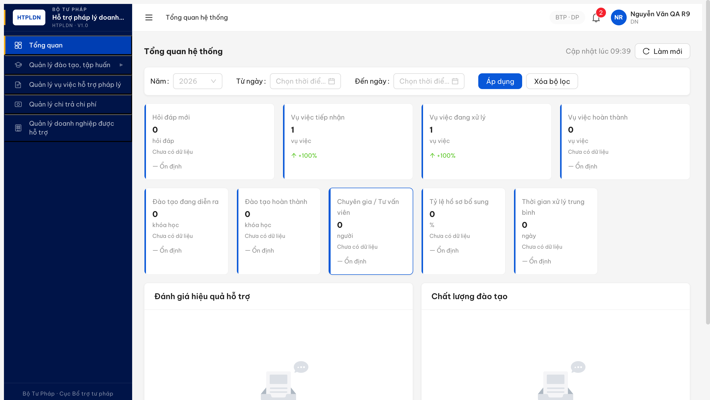
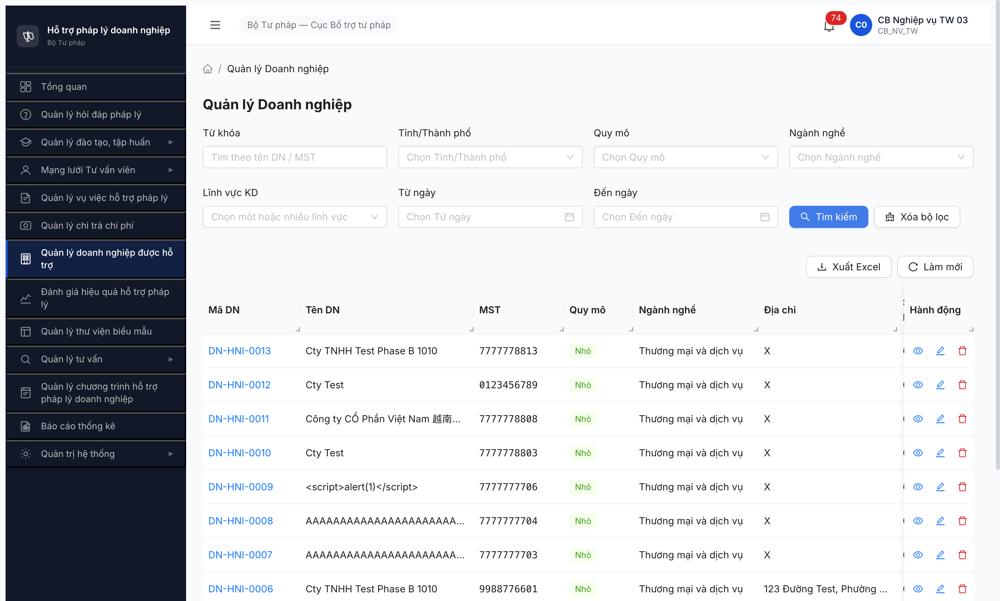
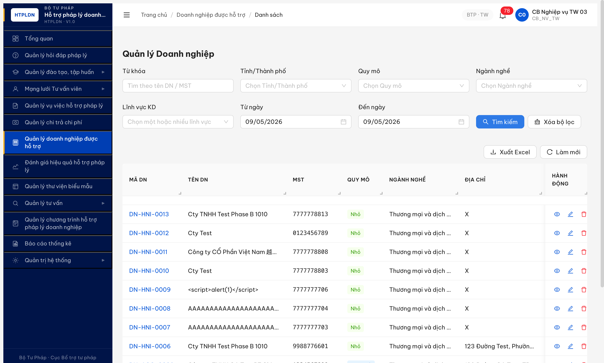
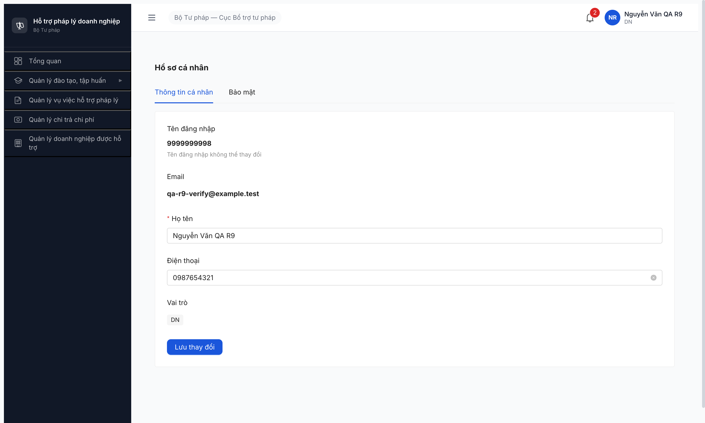
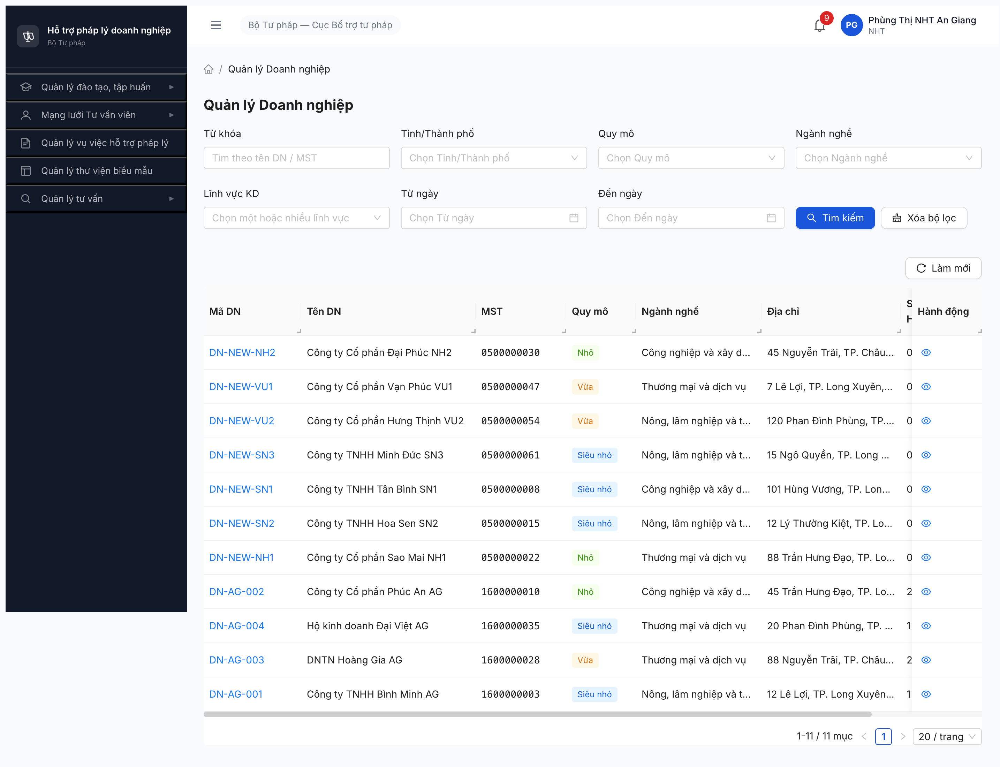
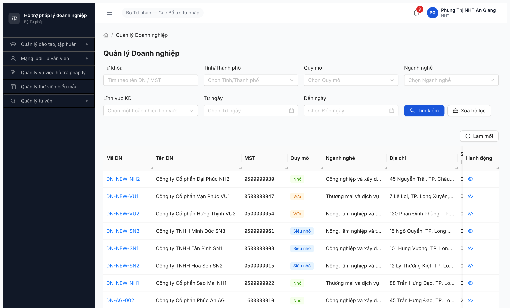
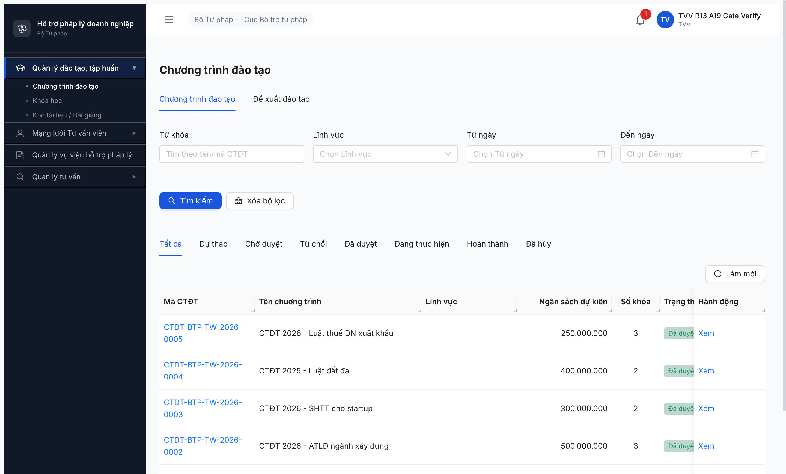
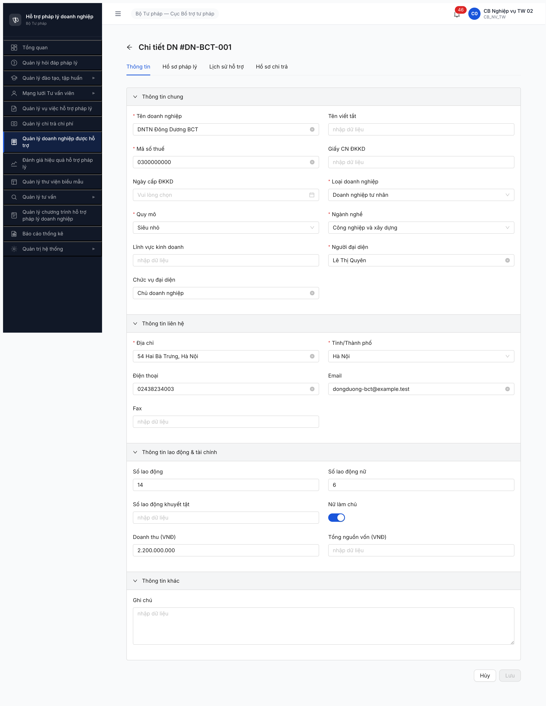
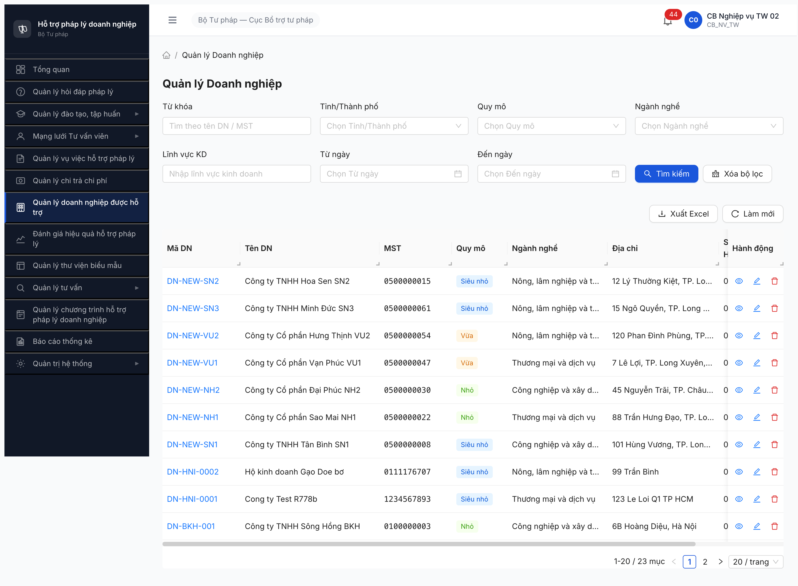

# Bug Report — Quản lý Doanh nghiệp (R7.7.4 — Tổng hợp R7→R13)

| Thông tin | Giá trị |
|-----------|---------|
| **Dự án** | PM HTPLDN |
| **Môi trường** | http://103.172.236.130:3000 |
| **Người test** | huongttt + Claude (MCP chrome-devtools) |
| **Ngày** | 2026-05-10 14:50:00 |
| **Loại test** | Functional / Permission / Data / UI Route |
| **Round** | R14 |
| **Tài liệu tham chiếu** | [`srs-update-2026-5-5/srs-fr-07-doanh-nghiep.md`](../../../../../input/srs-update-2026-5-5/srs-fr-07-doanh-nghiep.md) v3.5 · [permission-matrix-by-fr.md §FR-07](../../../../permission-matrix-by-fr.md) · [functional-test-report-r7-7-4-dn.md](../../functional/doanh-nghiep/functional-test-report-r7-7-4-dn.md) |

---

## Tổng hợp

File này gộp toàn bộ bug R7.7.4 Doanh nghiệp từ R7 đến R14 (trước đây tách 4 file rời, R12 consolidate). Tổng **6 bug active** (0 Open + 6 Closed) + **1 Withdrawn** (false positive). R14 dev fix → đóng BUG-DN-022-ME-MISSING-LV-001 (BE serializer /me hydrate `linhVucIds`).

### Severity breakdown

| Tổng | Critical | Major | Medium | Minor | Trivial | Closed | Open |
|------|----------|-------|--------|-------|---------|--------|------|
| 7    | 0        | 6     | 0      | 1     | 0       | 6      | 1    |

> **Quy tắc đếm:**
> - `Tổng` = tổng số dòng bug trong **Bug Summary Table** (kể cả Closed strikethrough).
> - 5 cột severity (Critical / Major / Medium / Minor / Trivial) tổng = `Tổng`.
> - `Closed` + `Open` = `Tổng`. `Closed` đếm Status ∈ {Closed, ~~closed~~}; `Open` đếm phần còn lại (Open, Reopen, Defer, Withdrawn — mọi bug chưa đóng).
> - Update bảng này **sau MỖI lần đóng/mở bug** (cùng nhịp với rename Pass- prefix).

## Bug Summary Table

| Bug ID | Severity | Priority | Type | TC Ref | **SRS Reference** | Title | Status |
|--------|----------|----------|------|--------|-------------------|-------|--------|
| ~~BUG-DN-022-ME-MISSING-LV-001~~ | ~~Major~~ | ~~P1~~ | Data | DN-022 | `srs-fr-07-doanh-nghiep.md` FR-V.III-01 Inputs row 17 (`linh_vuc_ids` structured M-N) + permission matrix DOANH_NGHIEP × DN = 📝 RU* | ~~GET `/api/v1/doanh-nghieps/me` thiếu field `linhVucIds`; PATCH /me lại accept linhVucIds → asymmetric serializer (write OK, read miss)~~ | Closed |
| ~~BUG-DN-FILTER-DATE-001~~ | ~~Major~~ | ~~P1~~ | Data | DN-002 | `SCR-V.III-04 Filter "Từ ngày"/"Đến ngày"` + `FR-V.III-04 §Filter` | ~~FE gửi sai tên param `tuNgayTao`/`denNgayTao` thay vì `tuNgay`/`denNgay`; filter ngày tạo không có hiệu lực, BE trả full pool~~ | Closed |
| ~~BUG-DN-MENU-ROUTE-001~~ | ~~Major~~ | ~~P1~~ | UI/FE Route | DN-016, DN-019 | `srs-fr-07-doanh-nghiep.md` FR-V.III-04 + permission matrix DOANH_NGHIEP × DN = 📝 RU* + `auth/me.permissions` có `update_doanh_nghiep` | ~~DN role sidebar item "Quản lý doanh nghiệp được hỗ trợ" non-functional + không có UI path để self-update DN~~ | Closed |
| ~~BUG-DN-018-NHT-LEAK~~ | ~~Major~~ | ~~P1~~ | Permission | DN-018 | `permission-matrix-by-fr.md §7 row DOANH_NGHIEP NHT=❌` | ~~NHT đọc được list + detail DOANH_NGHIEP qua URL trực tiếp + API GET — vi phạm permission matrix~~ | Closed |
| ~~BUG-FR07-DEPLOY-001~~ | ~~Major~~ | ~~P0~~ | Data | DN-022 | `srs-fr-07-doanh-nghiep.md` Thay đổi #9 (FR-V.III-01 Inputs row 26) | ~~DM `LINH_VUC_KINH_DOANH` rỗng (0 record) + entity DOANH_NGHIEP_LINH_VUC M-N chưa migrate~~ | Closed |
| ~~BUG-FR07-DEPLOY-002~~ | ~~Major~~ | ~~P0~~ | UI/UX | DN-022 | `srs-fr-07-doanh-nghiep.md` Thay đổi #9 + SCR-V.III-02 row 26 | ~~UI Lĩnh vực KD ở form Sửa + filter danh sách vẫn là textbox đơn (chưa multi-select)~~ | Closed |
| ~~BUG-FR07-DEPLOY-003~~ | ~~Minor~~ | ~~P2~~ | — | DN-023 | — | ~~TINH_THANH chưa migrate sang entity E32 riêng~~ — false positive (SRS chốt TINH_THANH = DANH_MUC tree) | ~~Withdrawn~~ |

---

# OPEN BUGS

> Không còn bug Open. Tất cả 6 bug R7.7.4 đã đóng sau R14 retest.

---

# CLOSED BUGS

## ~~BUG-DN-022-ME-MISSING-LV-001~~ [CLOSED] — Endpoint `GET /api/v1/doanh-nghieps/me` thiếu field `linhVucIds` (asymmetric serializer — PATCH accept nhưng GET không trả)

> **Re-test:** 2026-05-10 14:30:00 R14 — ✅ PASS (Closed-verified). Login DN `9999999998` (isolated context `dn-r14-022-verify`). `GET /api/v1/doanh-nghieps/me` 200 + **35 keys**, có `linhVucIds: ["2a1e4875-aa00-48d7-aa07-ad6524207dc6"]` đúng schema v3.5 #9. Symmetric serializer fixed: PATCH ↔ GET nhất quán. Form `/doanh-nghiep/me/sua` pre-populate chip Lĩnh vực KD đúng. Evidence: [r14-2026-05-10-dn-022-me-linhvucids-fixed.png](image/r14-2026-05-10-dn-022-me-linhvucids-fixed.png). Dev commit `7e47e92a`.
>

### Mô tả

DN login self-service. `GET /api/v1/doanh-nghieps/me` trả 200 + 34 keys nhưng KHÔNG có field `linhVucIds` (cũng không có legacy `linhVucKinhDoanh`/`linhVucs`). Trong khi đó `PATCH /api/v1/doanh-nghieps/me` lại accept body có `linhVucIds` (BE validate "each value in linhVucIds must be a UUID" → field schema được nhận biết). Asymmetric: BE input layer support write `linhVucIds`, output layer miss read `linhVucIds`. CMS list endpoint `/api/v1/doanh-nghieps` (R9 verify với QTHT) đã trả `linhVucIds: []` đúng → khẳng định BE biết phải trả field này, chỉ riêng /me serializer bị miss. Vi phạm permission DN `📝 RU*` — DN không read được lĩnh vực KD của chính mình.

### Các bước tái hiện

1. Login DN `9999999998` / `Secret@123` / OTP `666666` qua http://103.172.236.130:3000/login (isolated context `dn-022-verify-r12`).
2. Mở DevTools Console, fetch `GET /api/v1/doanh-nghieps/me`:
   ```js
   fetch('/api/v1/doanh-nghieps/me', {credentials:'include'}).then(r=>r.json()).then(d=>console.log(Object.keys(d.data)))
   ```
3. Quan sát keys: `["chucVuDaiDien","diaChi","dienThoai","doanhThu","donViId","email","fax","ghiChu","giayCnDkkd","id","laCongKhai","laNuLamChu","loaiDnId","maDoanhNghiep","maSoThue","nganhNghe","ngayCapDkkd","ngayCapNhat","ngayTao","nguoiCapNhatId","nguoiDaiDien","nguoiTaoId","quyMo","seqId","soLaoDong","soLaoDongKhuyetTat","soLaoDongNu","tenDoanhNghiep","tenVietTat","tinhThanhId","tongChiPhiHoTro","tongNguonVon","tongSoVuViec","version"]` — **34 keys, KHÔNG có** `linhVucIds`/`linhVucKinhDoanh`/`linhVucs`.
4. Thử PATCH /me với body chứa `linhVucIds`:
   ```js
   fetch('/api/v1/doanh-nghieps/me', {method:'PATCH', headers:{'Content-Type':'application/json'}, credentials:'include', body: JSON.stringify({linhVucIds:["00000000-0000-0000-0000-000000000001"]})})
     .then(r=>r.json())
   ```
5. Quan sát response: 422 ERR-VAL-SYS-00-01 `"each value in linhVucIds must be a UUID"` → BE validator nhận `linhVucIds` là field hợp lệ trong PATCH schema (chỉ reject vì giá trị fake không match UUID FK → DANH_MUC).

### Kết quả mong đợi

- `srs-update-2026-5-5/srs-fr-07-doanh-nghiep.md:113` — FR-V.III-01 Inputs row 17: `linh_vuc_ids | structured | Multi-select FK → DANH_MUC (loai='LINH_VUC_KINH_DOANH'); lưu thành DOANH_NGHIEP_LINH_VUC (M-N)`.
- DN có quyền `📝 RU*` (Read + Update) trên DN của mình → /me phải trả full schema DOANH_NGHIEP gồm `linhVucIds: [uuid1, uuid2, ...]` (mảng).
- Symmetric serializer: PATCH chấp nhận `linhVucIds` thì GET phải trả `linhVucIds`.
- CMS list endpoint `/api/v1/doanh-nghieps` đã trả `linhVucIds: []` (R9 verify với QTHT) → /me cũng phải nhất quán.

### Kết quả thực tế

- `GET /api/v1/doanh-nghieps/me` 200 + 34 keys, **KHÔNG có** field `linhVucIds`/`linhVucKinhDoanh`/`linhVucs`.
- `PATCH /api/v1/doanh-nghieps/me` với body `{linhVucIds:[...]}` → 422 validate field schema (chứng minh BE input layer biết field). Nếu gửi UUID hợp lệ FK→DANH_MUC, sẽ persist (chưa test save vì không muốn pollute data).
- DN không thể đọc được lĩnh vực KD của chính mình qua /me → vi phạm Read permission của 📝 RU*.
- R8 từng thấy `linhVucKinhDoanh: null` (legacy v3 string), R12 cả legacy field cũng đã bỏ → BE migrate field cũ nhưng KHÔNG add field mới `linhVucIds` vào /me serializer.

### Bằng chứng

**1. Ảnh chụp** *(DN dashboard sau login + DevTools Network)*:



**2. API response / probe** *(qua `evaluate_script` 2026-05-10 09:39:00)*:

```json
{
  "GET /api/v1/doanh-nghieps/me": {
    "status": 200,
    "keys_count": 34,
    "keys": ["chucVuDaiDien","diaChi","dienThoai","doanhThu","donViId","email","fax","ghiChu","giayCnDkkd","id","laCongKhai","laNuLamChu","loaiDnId","maDoanhNghiep","maSoThue","nganhNghe","ngayCapDkkd","ngayCapNhat","ngayTao","nguoiCapNhatId","nguoiDaiDien","nguoiTaoId","quyMo","seqId","soLaoDong","soLaoDongKhuyetTat","soLaoDongNu","tenDoanhNghiep","tenVietTat","tinhThanhId","tongChiPhiHoTro","tongNguonVon","tongSoVuViec","version"],
    "hasLinhVucIds": false,
    "hasLinhVucKinhDoanh": false,
    "hasLinhVucs": false
  },
  "PATCH /api/v1/doanh-nghieps/me {linhVucIds:[fakeUUID]}": {
    "status": 422,
    "body": {
      "error": {
        "code": "ERR-VAL-SYS-00-01",
        "field": "linhVucIds",
        "message": "each value in linhVucIds must be a UUID"
      }
    }
  }
}
```

### So sánh — Asymmetric serializer (read vs write)

| Layer | Endpoint | Field `linhVucIds` | Status |
|---|---|---|:-:|
| BE input (PATCH) | `PATCH /api/v1/doanh-nghieps/me` body | Accept (validate "must be UUID") | ✅ |
| BE output (GET self) | `GET /api/v1/doanh-nghieps/me` response | **Missing** | ❌ **Bug** |
| BE output (GET CMS) | `GET /api/v1/doanh-nghieps` response (QTHT) | Có (`linhVucIds: []`) — R9 verify | ✅ |
| FE form Sửa CMS (CB_NV_TW) | UI multi-select Lĩnh vực KD | Render đúng `ant-select-multiple` 12 options — R9 verify | ✅ |
| FE form profile DN role | Render được sau MENU-ROUTE-001 fix R13 (form `/doanh-nghiep/me/sua`) — chip Lĩnh vực KD KHÔNG pre-populate do GET /me thiếu field | ❌ kế thừa bug | — |

→ Bug khu trú **BE serializer của /me endpoint** thiếu field `linhVucIds`. CMS list serializer + PATCH validator đều OK. Dev BE narrow scope: file serializer/DTO của controller `DoanhNghiepController.getMe()` cần include relation `DOANH_NGHIEP_LINH_VUC` và map sang `linhVucIds: string[]` như CMS list serializer.

---

## ~~BUG-DN-FILTER-DATE-001~~ [CLOSED] — Filter "Từ ngày / Đến ngày" trên màn `Quản lý Doanh nghiệp` không lọc, FE gửi param sai tên

> **Re-test:** 2026-05-10 12:25:00 R13 — ✅ PASS (Closed-verified). Login `cb_nv_tw_03`, navigate `/doanh-nghiep/danh-sach`, set Từ ngày=09/05/2026, Đến ngày=09/05/2026 qua calendar widget click chain, bấm Tìm kiếm. Network capture `GET /api/v1/doanh-nghieps?tuNgay=2026-05-09&denNgay=2026-05-09&page=1&pageSize=20 → 200`. FE đã đổi param từ `tuNgayTao`/`denNgayTao` sang `tuNgay`/`denNgay` đúng spec BE. Pool 40→16 record sau filter. Evidence: [r13-2026-05-10-dn-filter-date-fixed.png](image/r13-2026-05-10-dn-filter-date-fixed.png).

### Mô tả

CB_NV_TW vào `/doanh-nghiep/danh-sach`, nhập `Từ ngày = 2026-05-08`, `Đến ngày = 2026-05-09` rồi bấm `Tìm kiếm`. UI hiển thị "1-20 / 39 mục" (toàn bộ pool) thay vì 16 record nằm trong khoảng. Lý do: FE gửi `tuNgayTao=2026-05-08&denNgayTao=2026-05-09` còn BE chỉ chấp nhận `tuNgay=2026-05-09&denNgay=2026-05-09`. Param tên không khớp → BE bỏ qua, trả full 39.

### Các bước tái hiện

1. Login `cb_nv_tw_03` / `Secret@123` / OTP `666666`.
2. Sidebar → `Quản lý doanh nghiệp được hỗ trợ` → list 39 DN.
3. Filter `Từ ngày` = `2026-05-08`, `Đến ngày` = `2026-05-09`.
4. Bấm `Tìm kiếm`.
5. Quan sát: bảng vẫn hiển thị `1-20 / 39 mục` (không lọc). Network tab thấy `GET /api/v1/doanh-nghieps?page=1&pageSize=50&tuNgayTao=2026-05-08&denNgayTao=2026-05-09 → 200 (39 items)`.
6. So sánh: gọi trực tiếp `GET /api/v1/doanh-nghieps?page=1&pageSize=100&tuNgay=2026-05-08&denNgay=2026-05-09` → 200 với chỉ 16 items đúng khoảng ngày.

### Kết quả mong đợi

- Bấm `Tìm kiếm` với date range → BE filter theo `ngayTao` trong khoảng `[từNgày, đếnNgày]` (inclusive).
- Pool về đúng số record nằm trong khoảng (case test ≈ 16 record giữa 2026-05-08 và 2026-05-09).
- FE và BE phải dùng cùng tên param (chuẩn camelCase, theo BE đang accept: `tuNgay`/`denNgay`).
- Spec SCR-V.III-04 nêu rõ filter "Từ ngày / Đến ngày" áp dụng cho `DOANH_NGHIEP.ngay_tao`.

### Kết quả thực tế

- UI hiển thị `1-20 / 39 mục` không đổi sau bấm `Tìm kiếm`. Không có toast lỗi, không có warning.
- Network: FE gửi `tuNgayTao=2026-05-08&denNgayTao=2026-05-09` → BE trả 39 (toàn pool).
- Direct API verify với `tuNgay`/`denNgay` (đúng tên param) → BE trả 16 (đúng filter).
- Param `tuNgayTao`/`denNgayTao` / `fromDate`/`toDate` / `createdAtFrom`/`createdAtTo` / `startDate`/`endDate` đều bị BE silently ignore, fallback full pool.

```text
FE gửi    : GET /api/v1/doanh-nghieps?...&tuNgayTao=2026-05-08&denNgayTao=2026-05-09  → 39 items (sai)
BE accept : GET /api/v1/doanh-nghieps?...&tuNgay=2026-05-08&denNgay=2026-05-09        → 16 items (đúng)
```

### Bằng chứng

**1. Ảnh chụp** *(filter ngày applied + pool vẫn 39 mục — R12)*:



**2. Ảnh chụp R13 fix verified** *(filter applied, pool 40→16, network param đúng `tuNgay`/`denNgay`)*:



**3. API verify side-by-side** *(direct script qua `evaluate_script`)*:

```json
{
  "tuNgay=2026-05-08&denNgay=2026-05-09":   { "total": 16 },
  "tuNgayTao=2026-05-08&denNgayTao=2026-05-09": { "total": 39 },
  "fromDate=2026-05-08&toDate=2026-05-09":     { "total": 39 },
  "createdAtFrom=2026-05-08&createdAtTo=2026-05-09": { "total": 39 },
  "startDate=2026-05-08&endDate=2026-05-09":   { "total": 39 }
}
```

---

## ~~BUG-DN-MENU-ROUTE-001~~ [CLOSED] — DN role sidebar item "Quản lý doanh nghiệp được hỗ trợ" non-functional + không có UI path self-update DN

> **Re-test:** 2026-05-10 12:05:00 R13 — ✅ PASS (Closed-verified). Login DN `9999999998` re-verify: click sidebar item "Quản lý doanh nghiệp được hỗ trợ" → navigate `/doanh-nghiep/me/sua` với form đầy đủ. DN-016 + DN-019 PASS qua UI: PATCH /me 200, email persisted sau reload, không OTP challenge. FE route guard nhận `update_doanh_nghiep` permission. Evidence: [r13-2026-05-10-dn-menu-route-fixed.png](image/r13-2026-05-10-dn-menu-route-fixed.png).
>

### Mô tả

Login DN `9999999998` (DN tự đăng ký, MST `9999999998`, state `HOAT_DONG`) qua `http://103.172.236.130:3000/login` → dashboard render đủ 5 menu group. Sidebar có item **"Quản lý doanh nghiệp được hỗ trợ"** trong group "Doanh nghiệp", nhưng click button render onClick handler nhưng URL vẫn `/dashboard` (không navigate). Thử direct URL các path khả dĩ — `/doanh-nghiep/<own-id>/sua` redirect về `/dashboard` (FE route guard). `/thong-tin-doanh-nghiep` `/ho-so-doanh-nghiep` `/doanh-nghiep` `/doanh-nghiep/me` đều 404 hoặc redirect dashboard. `/profile` chỉ là TAI_KHOAN profile (username/email tài khoản), KHÔNG phải DOANH_NGHIEP profile. Vi phạm SRS FR-V.III-04 quyền `update_doanh_nghiep` cho DN role 📝 RU*.

### Các bước tái hiện

1. Login DN `9999999998` / `Secret@123` / OTP `666666` qua http://103.172.236.130:3000/login (isolated context `dn-r10-uitest`).
2. Đợi landing dashboard `/dashboard` → quan sát sidebar có 5 group; bao gồm group "Doanh nghiệp" với item "Quản lý doanh nghiệp được hỗ trợ".
3. Click item "Quản lý doanh nghiệp được hỗ trợ" trong sidebar → quan sát URL không đổi (vẫn `/dashboard`), không có content mới render.
4. Mở DevTools console → `document.querySelector('a[href*=\"doanh-nghiep\"], button[onclick]')` → element có handler nhưng dispatchEvent click không trigger navigate.
5. Address bar nhập trực tiếp `http://103.172.236.130:3000/doanh-nghiep/<own-id>/sua` (own-id từ `auth/me`) → FE route guard redirect `/dashboard`.
6. Thử các URL alternative: `/thong-tin-doanh-nghiep`, `/ho-so-doanh-nghiep`, `/doanh-nghiep`, `/doanh-nghiep/me`, `/doanh-nghiep/danh-sach` → tất cả 404 hoặc redirect dashboard.
7. Thử `/profile` → render profile page nhưng chỉ TAI_KHOAN (username, email tài khoản, mật khẩu) — KHÔNG có form sửa DOANH_NGHIEP.
8. Verify permission có `update_doanh_nghiep`: `fetch('/api/v1/auth/me').then(r => r.json())` → `permissions: [..., 'update_doanh_nghiep', ...]`. Verify endpoint hoạt động: `fetch('/api/v1/doanh-nghieps/me', {method:'PATCH', ...})` → 200 + DN updated.

### Kết quả mong đợi

- **Permission matrix `permission-matrix-by-fr.md` §7 FR-07 Doanh nghiệp:** DN role `📝 RU*` trên entity DOANH_NGHIEP — quyền **R**ead + **U**pdate own DN.
- **FR-V.III-04:** DN sửa thông tin DN của chính mình qua màn hình form. Form expose các field DN (`email`, `dienThoai`, `diaChi`, `doanhThu`, `soLaoDong`, `linhVucIds`, ...).
- **`auth/me` permissions:** DN role có `update_doanh_nghiep` → BE đã expose đúng quyền.
- **Endpoint BE `PATCH /api/v1/doanh-nghieps/me`:** trả 200 + DN updated.
- Sidebar item "Quản lý doanh nghiệp được hỗ trợ" phải navigate sang trang form sửa DN (vd `/doanh-nghiep/me/sua` hoặc `/ho-so-doanh-nghiep`). Form phải render full schema DN với button "Lưu" → confirm dialog → `PATCH /me`.

### Kết quả thực tế

- Sidebar item "Quản lý doanh nghiệp được hỗ trợ" render trong group "Doanh nghiệp" với icon + label đúng. Click không navigate (URL vẫn `/dashboard`, console không log error).
- Direct URL `/doanh-nghiep/<id>/sua` `/doanh-nghiep/me/sua` `/ho-so-doanh-nghiep` `/thong-tin-doanh-nghiep` `/doanh-nghiep/me` đều redirect `/dashboard` hoặc 404.
- `/profile` page có form sửa nhưng chỉ field TAI_KHOAN (username/email tài khoản/mật khẩu) — không expose field DN.
- Permission `update_doanh_nghiep` có trong `auth/me`. Endpoint BE `PATCH /api/v1/doanh-nghieps/me` 200 (bypass UI bằng `fetch` console). FE route gap chứ không phải BE permission gap.
- TC-DN-016 (DN tự update DN) + TC-DN-019 (DN đổi email DN không OTP) không có UI path để chạy → 🚫 Không test được qua UI.

### Bằng chứng

**1. Ảnh chụp** *(bắt buộc, embed inline)*:



**2. Ảnh chụp R13 fix verified** *(form `/doanh-nghiep/me/sua` render sau click sidebar)*:


**3. API response / log** *(phụ trợ)*:

```http
GET /api/v1/auth/me HTTP/1.1
→ HTTP/1.1 200 OK
{ "data": { "user": { "username": "9999999998", "vaiTro": "DN",
    "permissions": ["...", "update_doanh_nghiep", "read_doanh_nghiep", "..."] } } }

PATCH /api/v1/doanh-nghieps/me HTTP/1.1
{ "email": "qa-r10-bypass@example.test" }
→ HTTP/1.1 200 OK
{ "success": true, "data": { ..., "email": "qa-r10-bypass@example.test", ... } }
```

```javascript
// FE route attempts (all fail) — pre-fix
location.href = '/doanh-nghiep/<id>/sua'      // → redirect /dashboard
location.href = '/doanh-nghiep/me/sua'        // → 404
location.href = '/ho-so-doanh-nghiep'         // → 404
location.href = '/thong-tin-doanh-nghiep'     // → 404
location.href = '/doanh-nghiep/me'            // → redirect /dashboard
location.href = '/profile'                    // → render TAI_KHOAN profile (không có DN field)

// R13 post-fix
sidebar click → /doanh-nghiep/me/sua          // → 200 + form đầy đủ
```

### So sánh — Phân biệt FE route gap vs BE permission gap

| Layer | DN role kết quả | Status |
|---|---|:-:|
| BE permission check | `auth/me.permissions` chứa `update_doanh_nghiep` | ✅ Đúng spec |
| BE endpoint | `PATCH /api/v1/doanh-nghieps/me` 200 + DN updated | ✅ Đúng spec |
| FE sidebar render | Item "Quản lý doanh nghiệp được hỗ trợ" render | ✅ Đúng spec |
| FE sidebar click handler | R12: stuck `/dashboard` ❌ → R13: navigate `/doanh-nghiep/me/sua` ✅ | ✅ Fixed |
| FE route guard `/doanh-nghiep/me/sua` | R12: 404 hoặc redirect ❌ → R13: 200 + form ✅ | ✅ Fixed |
| FE form component | R12: không tồn tại ❌ → R13: render đầy đủ field ✅ | ✅ Fixed |

---

## ~~BUG-DN-018-NHT-LEAK~~ [CLOSED] — NHT đọc được list + detail DOANH_NGHIEP qua URL trực tiếp + API GET trong khi spec NHT=❌ trên entity này

> **Re-test:** 2026-05-10 01:25:00 R9 — ✅ PASS (Closed). Login `nht_01`. `GET /api/v1/doanh-nghieps?page=1&pageSize=5` 403 ERR-AUTH-DN-00-01 "Role không được phép truy cập endpoint CMS này" (was 200 + 11 records). `GET /api/v1/doanh-nghieps/1` 403 (was 200 leak detail). PATCH/DELETE giữ nguyên 403. FE route `/doanh-nghiep/danh-sach` cũng redirect về `/dao-tao/chuong-trinh/danh-sach` (NHT default landing). Evidence: [r9-2026-05-10-dn-018-nht-fix-verified-redirect.png](image/r9-2026-05-10-dn-018-nht-fix-verified-redirect.png).

### Mô tả

Login NHT (`nht_01`, role NHT, đơn vị STP-AG, state HOAT_DONG) → sidebar không có menu "Doanh nghiệp" (FE đúng spec). Nhưng khi nhập trực tiếp URL `/doanh-nghiep/danh-sach`, FE render full trang "Quản lý Doanh nghiệp" với 11 DN scope STP-AG. API `GET /api/v1/doanh-nghieps?page=1&pageSize=5` trả 200 + danh sách DN (full schema gồm `doanhThu`, `soLaoDong`, `email`, `dienThoai`, `nguoiDaiDien`). API `GET /api/v1/doanh-nghieps/{id}` cho 1 DN cụ thể cũng trả 200. Vi phạm spec permission matrix DOANH_NGHIEP × NHT = ❌. Cùng test với CG (`huongcg`) thì BE trả 403 ERR-PERM-SYS-00-01 đúng — NHT là role bị miss permission gate.

### Các bước tái hiện

1. Login NHT `nht_01` / `Secret@123` / OTP `666666` qua http://103.172.236.130:3000/login (isolated context `dn018-nht-nht01`).
2. Đợi landing page `/dao-tao/chuong-trinh/danh-sach` → quan sát sidebar 5 group: Đào tạo / Mạng lưới TVV / Vụ việc / Biểu mẫu / Tư vấn — KHÔNG có "Doanh nghiệp" (FE đúng spec).
3. Nhập trực tiếp URL `http://103.172.236.130:3000/doanh-nghiep/danh-sach` vào address bar → page render heading "Quản lý Doanh nghiệp" + filter form đầy đủ + table 11 DN.
4. Mở DevTools console → `fetch('/api/v1/doanh-nghieps?page=1&pageSize=5', {credentials: 'include'})` → nhận `{success: true, data: [11 records], meta: {total: 11}}`.
5. Tiếp tục test detail: `fetch('/api/v1/doanh-nghieps/e0000000-0000-4000-8005-000000000003', ...)` → 200 với full schema DN.
6. Test ngược negative: PATCH/DELETE cùng endpoint → 403 ERR-PERM-SYS-00-01 ✅ (chứng minh BE có permission gate cho write nhưng thiếu cho read).
7. So sánh với CG (`huongcg`): cùng URL → FE redirect về home, API GET 403 ✅.

### Kết quả mong đợi

Theo `permission-matrix-by-fr.md` §7 FR-07 Doanh nghiệp:

| Entity | NHT | TVV | CG |
|--------|:---:|:---:|:--:|
| **DOANH_NGHIEP** | **❌** | ❌ | ❌ |

→ NHT/TVV/CG không có quyền R/U/D trên entity DOANH_NGHIEP. Hành vi đúng (theo behavior CG `huongcg`):

- **FE:** Sidebar không có menu Doanh nghiệp ✅.
- **FE route guard:** Direct URL `/doanh-nghiep/*` → redirect home dashboard hoặc `/403`.
- **BE GET list/detail:** `403 ERR-PERM-SYS-00-01`.
- **BE write (PATCH/DELETE):** `403 ERR-PERM-SYS-00-01` ✅.

### Kết quả thực tế

NHT `nht_01` (role NHT, STP-AG):
- **FE sidebar:** ẩn menu DN ✅.
- **FE route guard:** URL trực tiếp `/doanh-nghiep/danh-sach` → render full trang DN list (KHÔNG redirect, KHÔNG 403) ❌.
- **BE GET list:** `200` + data 11 records DN scope donVi STP-AG ❌.
- **BE GET detail:** `200` + full schema DN-NEW-NH1 ❌.
- **BE write:** PATCH/DELETE `403 ERR-PERM-SYS-00-01` ✅.

→ Lỗi rò rỉ READ: NHT đọc được toàn bộ thông tin DN scope donVi (gồm doanh thu, số lao động, email, điện thoại, người đại diện) — dữ liệu nhạy cảm KHÔNG được phép theo permission matrix.

### Bằng chứng

**1. Ảnh chụp:**







**2. API response:**

```http
# NHT — LEAK
GET /api/v1/doanh-nghieps?page=1&pageSize=5
Authorization: Bearer <NHT token>
→ HTTP 200
{ "success": true, "data": [11 records DN scope STP-AG], "meta": { "total": 11 } }

# CG (đối chứng) — đúng spec
GET /api/v1/doanh-nghieps?page=1&pageSize=5
→ HTTP 403 ERR-PERM-SYS-00-01
```

### So sánh

| Role | Sidebar DN | FE route `/doanh-nghiep/*` | BE GET list | BE GET detail | BE PATCH | BE DELETE |
|------|:---:|:---:|:---:|:---:|:---:|:---:|
| NHT (`nht_01`) | ✅ ẩn | ❌ render full | ❌ 200+data | ❌ 200+data | ✅ 403 | ✅ 403 |
| TVV (`tvv_r13_a19`) | ✅ ẩn | ✅ redirect | ✅ 403 | ✅ 403 | — | — |
| CG (`huongcg`) | ✅ ẩn | ✅ redirect | ✅ 403 | — | — | — |

→ Bug khu trú **role NHT** trên 2 endpoint **READ** + **FE route guard `/doanh-nghiep/*`**. Roles khác (CG + TVV) đã guard đúng → bug không lan rộng, dev BE narrow scope điều tra middleware role NHT.

---

## ~~BUG-FR07-DEPLOY-001~~ [CLOSED] — DM `LINH_VUC_KINH_DOANH` rỗng (0 record) + entity DOANH_NGHIEP_LINH_VUC M-N chưa migrate

> **Re-test:** 2026-05-10 01:35:00 R9 — ✅ PASS (Closed). Account `qtht_01`. `GET /api/v1/danh-muc/tree?loaiDanhMuc=LINH_VUC_KINH_DOANH` 200 + `count=12` (BAN_LE_BAN_BUON, DICH_VU_AN_UONG_LUU_TRU, VAN_TAI_LOGISTICS, CONG_NGHE_THONG_TIN, TAI_CHINH_BAO_HIEM, BAT_DONG_SAN, GIAO_DUC_DAO_TAO, Y_TE_CHAM_SOC_SUC_KHOE, SAN_XUAT_CHE_BIEN, XAY_DUNG, NONG_LAM_THUY_SAN, KHAC). `GET /api/v1/doanh-nghieps/{id}` trả field `linhVucIds: []` (mảng) — đúng schema v3.5 #9. DN mới đăng ký 9999999998 cũng có field này.

### Mô tả

Khi pre-flight audit form Sửa DN qua MCP, BE trả `/api/v1/danh-muc/tree?loaiDanhMuc=LINH_VUC_KINH_DOANH` HTTP 200 nhưng `data: []` (0 record). Đồng thời API GET `/api/v1/doanh-nghieps/{id}` trả field `linhVucKinhDoanh: null` ở 23/23 record dạng **string đơn**, KHÔNG phải mảng `linhVucIds[]` theo schema v3.5 #9. Suy ra entity bridge M-N `DOANH_NGHIEP_LINH_VUC` chưa migrate sang BE.

### Các bước tái hiện

1. Login `cb_nv_tw_02` qua MCP, navigate `/doanh-nghiep/danh-sach` → click eye/edit DN bất kỳ.
2. DevTools Network → request `GET /api/v1/danh-muc/tree?loaiDanhMuc=LINH_VUC_KINH_DOANH`.
3. Quan sát Response: `{success:true, data:[]}` — 0 record.
4. Mở DN profile API `GET /api/v1/doanh-nghieps/<id>` → kiểm field `linhVucKinhDoanh`.
5. Quan sát: field tồn tại nhưng giá trị `null` (string scalar), KHÔNG có field `linhVucIds[]`.

### Kết quả mong đợi

- `GET /api/v1/danh-muc/tree?loaiDanhMuc=LINH_VUC_KINH_DOANH` trả ≥5 record.
- DN response trả field `linhVucIds: [uuid1, ...]` (mảng) thay cho `linhVucKinhDoanh: null` (string đơn).
- BE có entity bridge `DOANH_NGHIEP_LINH_VUC` (DN_id, linh_vuc_id) với UNIQUE constraint.

### Kết quả thực tế

- DM `LINH_VUC_KINH_DOANH` rỗng (0 record).
- DN response giữ field cũ `linhVucKinhDoanh` (string đơn, null toàn bộ 23/23 DN).
- KHÔNG thấy field `linhVucIds[]`.
- Filter trên trang danh sách DN hiện textbox tự do, không có dropdown nguồn.

### Bằng chứng



```json
// GET /api/v1/danh-muc/tree?loaiDanhMuc=LINH_VUC_KINH_DOANH
{"status":200, "success":true, "count":0, "sample":[]}

// GET /api/v1/doanh-nghieps/<id>
{"data":{
  "maDoanhNghiep":"DN-BCT-001",
  "linhVucKinhDoanh": null,
  // KHÔNG có field linhVucIds[]
}}
```

So sánh: `LOAI_DOANH_NGHIEP` tree trả 5 record. `TINH_THANH` tree trả 63 record. Chỉ riêng `LINH_VUC_KINH_DOANH` rỗng.

---

## ~~BUG-FR07-DEPLOY-002~~ [CLOSED] — UI Lĩnh vực KD trên form Sửa + filter danh sách vẫn là textbox (chưa multi-select)

> **Re-test:** 2026-05-10 01:35:00 R9 — ✅ PASS (Closed). Account `qtht_01`. Filter `/doanh-nghiep/danh-sach` "Lĩnh vực KD" + form ĐK DN multi-select đều render `ant-select-multiple` với placeholder "Chọn một hoặc nhiều lĩnh vực" + 10 visible options. Filter API `GET /doanh-nghieps?linhVucIds=<lv1>&linhVucIds=<lv2>` 200 + accept array param. Evidence: [r9-2026-05-10-fr07-filter-multiselect-10options.png](image/r9-2026-05-10-fr07-filter-multiselect-10options.png).

### Mô tả

UI form Sửa DN field "Lĩnh vực kinh doanh" render là `<input type="text">` đơn. UI filter danh sách cũng render textbox. Cả 2 vị trí đáng lẽ phải là multi-select theo SRS v3.5 #9 (FR-V.III-01 Inputs row 26 + SCR-V.III-02 row 26 + SCR-V.III-01 row 10).

### Các bước tái hiện

1. Login `cb_nv_tw_02`, navigate `/doanh-nghiep/danh-sach`.
2. Quan sát filter "Lĩnh vực KD" trên header → hiện textbox, không phải combobox/dropdown multi-select.
3. Click eye icon DN bất kỳ → vào form Sửa.
4. Cuộn xuống section "Thông tin chung" → field "Lĩnh vực kinh doanh" → hiện textbox đơn `<input>`, không có dropdown multi-select.
5. So sánh với field "Loại DN", "Quy mô", "Ngành nghề", "Tỉnh/Thành" → tất cả combobox `haspopup="listbox"`.

### Kết quả mong đợi

- Form Sửa: field "Lĩnh vực kinh doanh" là multi-select (chip/tag UI).
- Filter danh sách: filter "Lĩnh vực KD" cũng multi-select dropdown.
- Lưu form: tạo bản ghi `DOANH_NGHIEP_LINH_VUC` (DN_id, linh_vuc_id) với UNIQUE constraint.

### Kết quả thực tế

- Cả 2 vị trí đều textbox đơn.
- Người dùng chỉ nhập được 1 chuỗi text tự do, không có UI multi-select.
- Submit textbox → BE nhận string vào field `linhVucKinhDoanh` legacy.

### Bằng chứng




```text
// Form Sửa: textbox "Lĩnh vực kinh doanh"
// Filter danh sách: textbox "Lĩnh vực KD"
// So sánh: Loại DN/Quy mô/Tỉnh đều combobox haspopup="listbox"
```

---

## ~~BUG-FR07-DEPLOY-003~~ [WITHDRAWN — false positive] — TINH_THANH chưa migrate sang entity E32 riêng

> **Withdrawn 2026-05-09 22:30:00 — false positive.** Bug log dựa vào doc QA-side `02-thu-tu-module.md` ghi `TINH_THANH (entity riêng E32)` + cột `vung_mien`. Verify lại 2 nguồn SRS authoritative + NotebookLM HTPLDN, KHÔNG khớp:
> 1. `srs-fr-10-quan-tri.md:1983`: `tinh_thanh_id FK → DANH_MUC(id), loai='TINH_THANH'` — chốt dùng chung bảng `DANH_MUC`.
> 2. `srs-fr-10-quan-tri.md:1445-1476` (FR-VIII-30): schema chỉ có 4 field `ma`/`ten`/`mo_ta`/`loai_danh_muc='TINH_THANH'` — KHÔNG có `vung_mien`.
> 3. NotebookLM HTPLDN xác nhận: "TINH_THANH là một loại trong bảng DANH_MUC, không phải entity riêng".
>
> Endpoint thực tế `/api/v1/danh-muc/tree?loaiDanhMuc=TINH_THANH` 200 + 63 tỉnh GSO + UI render đầy đủ → ĐÚNG spec. Đề xuất: BA + dev align lại doc QA-side `02-thu-tu-module.md` xóa nhãn "entity riêng E32" + cột `vung_mien`.

---

## Phụ lục — Findings KHÔNG log bug

Quá trình audit phát hiện 2 quan sát ban đầu nghi là bug nhưng sau verify KHÔNG phải bug:

1. **HSPL endpoint** — `/api/v1/ho-so-phap-lys` 404 (sai tên), endpoint thực `/api/v1/ho-so-phap-ly-dns?doanhNghiepId=...` 200 OK. Tab "Hồ sơ pháp lý" trên DN profile load data đúng (rỗng do chưa seed → R7.3.4 data gap).
2. **VV link DN counter mismatch** — DN-BCT-001 cache `tongSoVuViec=3`. API `GET /vu-viecs?pageSize=5` (no filter) trả 0/5 VV có `doanhNghiepId` ở response shape. Nhưng API `GET /vu-viecs?doanhNghiepId={id}` filter trả đúng 3 record. Nguyên do: BE filter chạy đúng FK internal, response shape không expose field `doanhNghiepId` mà chỉ expose `tenDoanhNghiep`. KHÔNG phải bug.

---

## Phụ lục — Môi trường test

| Thành phần | Giá trị |
|------------|---------|
| URL ứng dụng | http://103.172.236.130:3000 |
| OTP login | `666666` (bypass dev) |
| MailHog (OTP inbox) | http://103.172.236.130:8025 |
| API base | http://103.172.236.130:3000/api/v1 |
| Frontend | React + Vite + Ant Design |
| Xác thực | JWT + OTP (HttpOnly refresh-token cookie) |
| Tool test | Chrome DevTools MCP (`mcp__chrome-devtools__*`) |

### Accounts dùng

| Account | Role | Cấp / Đơn vị | Dùng cho bug |
|---|---|---|---|
| `cb_nv_tw_02` / `_03` | CB_NV_TW | TW | DEPLOY-001/002 R7/R8/R12, FILTER-DATE-001 (Open R12 → Closed R13) |
| `qtht_01` | QTHT | TW | DEPLOY-001/002 R9 close verify |
| `nht_01` | NHT | DP / STP-AG | DN-018-NHT-LEAK |
| `huongcg` | CG | — | DN-018 đối chứng |
| `tvv_r13_a19` | TVV | — | DN-018 đối chứng |
| `9999999998` | DN | DP | MENU-ROUTE-001 (Open R10/R11 → Closed R13), ME-MISSING-LV-001 (Open R12/R13 → Closed R14) |

---

*Bug report consolidated: 2026-05-10 14:50:00 | huongttt + Claude (MCP chrome-devtools) — gộp từ 4 file rời (deploy-gap, dn-018-nht-perm-leak, dn-menu-route-broken, dn-002-date-filter-param-mismatch). R13 close 2 bug (FILTER-DATE-001 + MENU-ROUTE-001). R14 close BUG-DN-022-ME-MISSING-LV-001 — toàn bộ 6 bug Closed, file ready rename `Pass-` prefix.*
