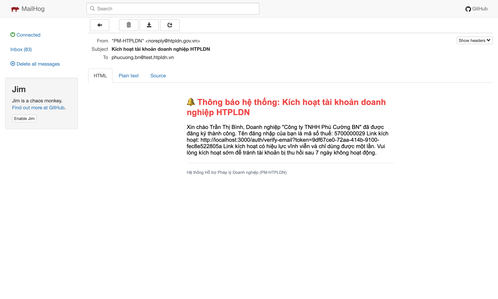
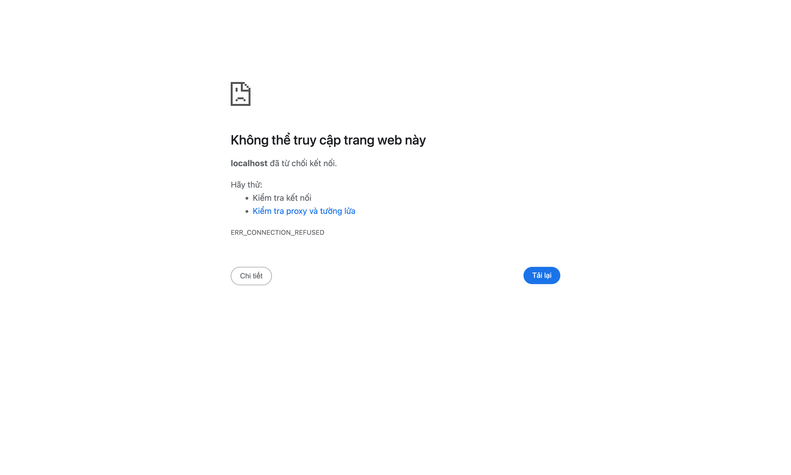

# Bug Report — Doanh nghiệp · Email kích hoạt (deploy gap)

| Thông tin | Giá trị |
|-----------|---------|
| **Dự án** | PM-HTPLDN |
| **Môi trường** | http://103.172.236.130:3000/ (BE) · http://103.172.236.130:8025 (MailHog) |
| **Người test** | huongttt + Claude (MCP chrome-devtools) |
| **Ngày** | 2026-05-09 02:25:00 |
| **Loại test** | Functional · luồng kích hoạt email DN (FR-VIII-22 → email → click link) |
| **Round** | R7 |
| **Tài liệu tham chiếu** | `srs-v3/srs-fr-10-quan-tri.md` §FR-VIII-22 (UC191) Processing Bước 6 + AC |

---

## Tổng hợp

Phát hiện **2** lỗi liên quan email kích hoạt sau self-reg DN (FR-VIII-22). User thực sẽ KHÔNG thể kích hoạt được tài khoản qua email — vi phạm Acceptance Criteria FR-VIII-22.

> **Rule log bug (feedback 2026-04-23):** Bug có SRS reference cụ thể (FR-VIII-22 §Processing Bước 6 "Gửi email xác nhận (link kích hoạt)" + AC "user click link activation → TK chuyển CHO_PHAN_QUYEN").

### Severity breakdown

| Tổng | Critical | Major | Medium | Minor | Trivial |
|------|----------|-------|--------|-------|---------|
| 2    | 0        | 2     | 0      | 0     | 0       |

## Bug Summary Table

| Bug ID | Severity | Priority | Type | TC Ref | SRS Reference | Title | Status |
|---|---|---|---|---|---|---|---|
| BUG-DEPLOY-MAIL-HOST-001 | Major | P1 | Workflow | R7.2.4 | `FR-VIII-22 §Processing Bước 6` + `AC dòng 2` | Email kích hoạt dùng host `localhost:3000` → user click ERR_CONNECTION_REFUSED | Open |
| BUG-DEPLOY-MAIL-LINK-002 | Major | P1 | UI/UX | R7.2.4 | `FR-VIII-22 §Processing Bước 6` ("link kích hoạt") | Email body render link dạng plain text — KHÔNG có thẻ `<a>` clickable | Open |

> **Thứ tự fix đề xuất:** 001 trước (block toàn bộ kích hoạt), 002 sau (UX nhỏ hơn nhưng cần fix để user click được trực tiếp trong email client).

---

## BUG-DEPLOY-MAIL-HOST-001 — Email kích hoạt dùng host `localhost:3000`

### Mô tả

Sau khi DN tự đăng ký qua FR-VIII-22 (form `/register/doanh-nghiep`), hệ thống gửi email "Kích hoạt tài khoản doanh nghiệp HTPLDN" tới MailHog. Body email chứa link `http://localhost:3000/auth/verify-email?token=<UUID>` — hardcoded host `localhost:3000` thay vì host deploy thực `103.172.236.130:3000`. User thực copy-paste link này vào browser sẽ gặp `ERR_CONNECTION_REFUSED` vì máy của user không có service chạy port 3000 → không kích hoạt được tài khoản → vi phạm FR-VIII-22 AC dòng 2 ("user click link activation → TK chuyển CHO_PHAN_QUYEN").

### Các bước tái hiện

1. Truy cập `http://103.172.236.130:3000/register/doanh-nghiep`.
2. Điền 21 trường form FR-VIII-22 hợp lệ (vd: DN "Công ty TNHH Phú Cường BN", MST `5700000029`, email `phucuong.bn@test.htpldn.vn`, MK `Secret@123`, Ngành CN, Quy mô Vừa, Bắc Ninh).
3. Submit form → record DN tạo thành công (verify qua API list).
4. Mở MailHog UI `http://103.172.236.130:8025` → thấy email từ `noreply@htpldn.gov.vn` subject "Kích hoạt tài khoản doanh nghiệp HTPLDN".
5. Mở email → đọc body → copy link kích hoạt: `http://localhost:3000/auth/verify-email?token=9df67ce0-72aa-414b-9100-fec8e522805a`.
6. Paste link vào address bar browser → Enter (mô phỏng user thực copy-paste).

### Kết quả mong đợi

- Browser navigate tới `http://103.172.236.130:3000/auth/verify-email?token=...`.
- BE consume token → trạng thái TK chuyển `CHO_KICH_HOAT` → `CHO_PHAN_QUYEN` (per FR-VIII-22 §Processing Bước 7).
- Theo SRS: link kích hoạt phải dùng host deploy thực (BE config `MAIL_BASE_URL` đúng env), không hardcode `localhost`.

### Kết quả thực tế

- Browser load trang lỗi `chrome-error://chromewebdata/`.
- Title: `localhost`.
- Body: `Không thể truy cập trang web này. localhost đã từ chối kết nối. ERR_CONNECTION_REFUSED`.
- TK vẫn ở trạng thái `CHO_KICH_HOAT` — không kích hoạt được.

### Bằng chứng

**1. Email body trong MailHog (link plain text host = localhost):**



**2. Browser kết quả khi user paste link gốc:**



**3. URL navigate (mô phỏng user copy-paste, không edit):**

```
Input URL: http://localhost:3000/auth/verify-email?token=9df67ce0-72aa-414b-9100-fec8e522805a
Final URL: chrome-error://chromewebdata/
Title: localhost
Body: "Không thể truy cập trang web này / localhost đã từ chối kết nối / ERR_CONNECTION_REFUSED"
```

**4. DOM bytes trong iframe MailHog (verify link là text, không phải `<a>`):**

```html
<p>... Link kích hoạt: http://localhost:3000/auth/verify-email?token=9df67ce0-72aa-414b-9100-fec8e522805a ...</p>
```

---

## BUG-DEPLOY-MAIL-LINK-002 — Email body render link dạng plain text, không clickable

### Mô tả

Email "Kích hoạt tài khoản doanh nghiệp HTPLDN" render link kích hoạt ở dạng plain text trong thẻ `<p>`, KHÔNG có thẻ `<a href="...">` bao quanh. User mở email trong client (Gmail/Outlook/Yahoo) sẽ thấy link không clickable trực tiếp — phải tự copy-paste vào browser. Trong nhiều email client mặc định không auto-linkify URL trong `<p>` plain text, hoặc auto-linkify nhưng tăng risk phishing flag. Điều này không phù hợp pattern email transaction chuẩn (link kích hoạt thường gắn `<a>` rõ ràng) và làm tăng UX friction.

### Các bước tái hiện

1. Self-reg DN qua FR-VIII-22 → đợi email tới MailHog.
2. Mở email "Kích hoạt tài khoản doanh nghiệp HTPLDN" trong MailHog UI HTML preview.
3. Inspect iframe DOM `document.querySelectorAll('a')`.

### Kết quả mong đợi

- Email body có thẻ `<a href="http://<MAIL_BASE_URL>/auth/verify-email?token=...">Kích hoạt tài khoản</a>` (hoặc tương tự).
- User click trực tiếp trong email client → mở browser tới link kích hoạt.

### Kết quả thực tế

- `iframe.contentDocument.querySelectorAll('a')` trả về **mảng rỗng** (`anchors: []`).
- Body HTML chứa link là plain text trong `<p>`:
  ```html
  <p>... Link kích hoạt: http://localhost:3000/auth/verify-email?token=9df67ce0-72aa-414b-9100-fec8e522805a ...</p>
  ```
- Không có thẻ `<a>` nào trong toàn bộ body email.

### Bằng chứng

**1. Email body screenshot (link không underlined, không clickable):**


**2. DOM evaluate kết quả:**

```json
{
  "anchors": [],
  "bodyHTML": "\n  <h2 style=\"color: #EF4444;\">🔔 Thông báo hệ thống...</h2>\n  <p>Xin chào Trần Thị Bình,\nDoanh nghiệp \"Công ty TNHH Phú Cường BN\" ... \nLink kích hoạt: http://localhost:3000/auth/verify-email?token=9df67ce0-72aa-414b-9100-fec8e522805a\n...\n  </p>\n  ..."
}
```
